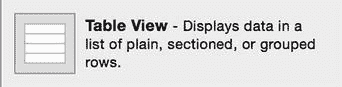
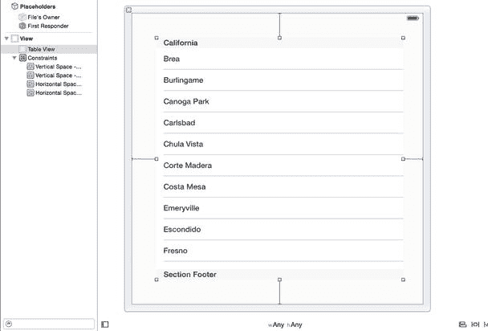
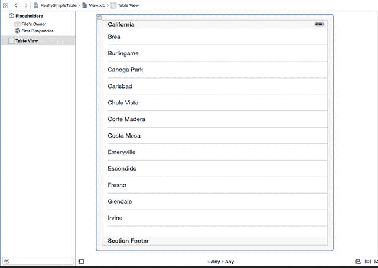
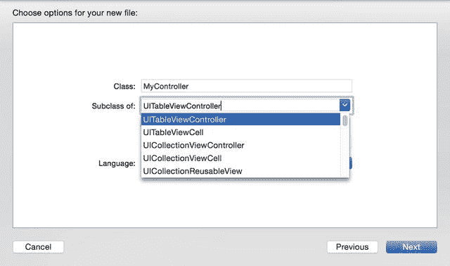
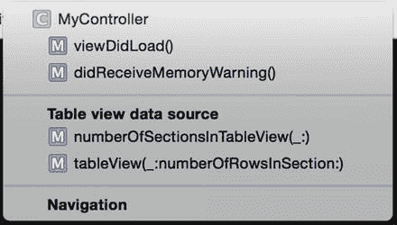

# UITableView 继承自 UIScrollView 的要素

`UITableView` 从 `UIScrollView` 中继承了哪些特性？

简而言之，答案是：“`UITableView` 没有明确重写的所有内容。” 这提供了一些对 `UITableView` 类特别有用的 `UIScrollView` 和 `UIScrollViewDelegate` 方法与属性。

`contentSize` 表示如果一次性创建并填充所有行，表格的总高度。（实际上，除非表格很小，否则由于 `UITableView` 的缓存和排队机制，这种情况很少发生。）`contentSize` 通过累加所有行的总高度以及页眉和页脚视图的高度计算得出。

`contentOffset` 表示表格从 `tableView` 框架顶部向下滚动了多少。例如，如果 `tableView` 的 `contentSize.height` 值为 1000 点，并且表格向下滚动了一半，那么 `contentOffset` 将为 500 点。

当你需要了解用户何时在滚动表格时，有两个 `UIScrollViewDelegate` 方法特别有用。

`scrollViewWillBeginDragging` 在 `tableView` 开始移动时调用，而 `scrollViewDidScroll` 在表格滚动期间会被多次调用。

在此处，你可以获取新的 `contentOffset` 值，并更新任何需要随之变化的内容。

**注意**

尽管 `UITableView` 是 `UIScrollView` 的子类，但表格视图只能垂直滚动。

## 创建 UITableView

任何关于如何创建 `UITableView` 的讨论都必须附带一个警告：仅靠 `UITableView` 本身并不能做太多事情。为了填充数据并与用户交互，它们需要一个实现了 `UITableViewDelegate` 和 `UITableViewDataSource` 协议的类来提供支持。

话虽如此，要将 `UITableView` 显示到屏幕上，你需要能够绘制它。这里有两个选择：使用 Interface Builder 在 XIB 文件或 Storyboard 中可视化创建，或者在代码中以编程方式创建。

### 在 Interface Builder 中创建 UITableView

在 Interface Builder 中创建 `UITableView` 是一个极具挑战性的过程。



**图 2-8.** “对象浏览器”中的 `UITableView` 项目 打开你的 Storyboard。从“对象浏览器”中拖拽一个 `UITableView` 到你的视图上，如图 2-8 所示。

好吧，我承认我说谎了。实际上这个过程相当直接。但有一些细节需要处理，因此仍有必要逐步了解这个过程。

#### 将 UITableView 放置到另一个视图中

尽管你经常看到表格视图全屏显示，但你不必局限于此。你可以将表格视图设置为任意大小。这非常简单：将 `UITableView` 对象拖拽到它将要出现的视图中，并根据需要调整自动布局约束（见图 2-9）。



**图 2-9.** 将 `UITableView` 放置到另一个视图中

#### 放置全屏 UITableView

另一方面，如果你的 `tableView` 总是全屏显示，那么将其创建为另一个永远不会显示的子视图就没什么意义了。

这种情况下，过程稍有不同。

从 NIB 文件或 Storyboard 中删除现有的视图对象。将一个 `UITableView` 对象拖拽到中央区域（图 2-10）。



**图 2-10.** 将 `UITableView` 对象拖拽到主区域

从 NIB 文件或 Storyboard 中移除默认视图后，你需要重新连接“文件所有者”的 `view` 出口到 `tableView`。按住 Ctrl 键点击“占位符”列表中的“文件所有者”图标，然后拖拽到 `tableView` 上。释放鼠标按钮，然后从弹出列表中选择“View”出口。

**警告**

如果你删除了 `view` 出口曾经连接的对象，很容易忘记重新连接它。如果不重新连接，你的应用将崩溃，并显示类似如下的错误：

```
*** 因未捕获异常 ’NSInternalInconsistency Exception’ 而终止应用，原因：’-[UIViewController _loadViewFromNibNamed:bundle:] 加载了 "PlainTable" 笔尖文件，但视图出口未设置。’
```

在 `view` 出口重新连接后，将你的新 `tableView` 连接到其 `dataSource` 和 `delegate`。

担任 `dataSource` 和 `delegate` 角色的类很可能也是“文件所有者”。如果是这种情况，你可以通过按住 Ctrl 键点击并从表格拖拽到“文件所有者”图标，然后从弹出选项中选择 `dataSource` 和 `delegate` 来连接它们。

### 以编程方式创建 UITableView

在第 1 章中，我们使用 Interface Builder 构建了一个带有表格视图的简单应用。

遵循“在 Interface Builder 中能做的任何事，在代码中也能做”的原则，创建 `UITableView` 的另一种方式是在代码中完成。这是一个四步的过程：

1.  创建一个指定大小和样式的 `UITableView` 实例。
2.  设置新 `tableView` 的 `delegate` 和 `dataSource` 属性。
3.  将新 `tableView` 添加到 `superView` 中。
4.  调用新 `tableView` 的 `reloadData` 方法以确保其更新。

清单 2-1 展示了如何在 `UIViewController` 的 `viewDidLoad` 方法中实现这一过程。

**清单 2-1.** 以编程方式添加 `tableView`

```
override func viewDidLoad() {
    super.viewDidLoad()
    // 在加载视图后进行任何额外的设置，通常来自 nib 文件。
    tableView = UITableView(frame: self.view.frame, style:.Plain)
    tableView.delegate = self
    tableView.dataSource = self
    self.view.addSubview(tableView)
    tableView.reloadData()
}
```

**警告**

设置了 `tableView` 的 `delegate` 和 `dataSource` 属性后，它会期望（不，是要求！）控制器遵守 `UITableViewDelegate` 和 `UITableViewDataSource` 协议——特别是必须实现 `numberOfSectionsInTableView:`、`tableView:numberOfRowsInSection:` 和 `tableView:cellForRowAtIndexPath:` 方法。

如果这些协议没有正确实现，当 `tableView` 被加载时应用将崩溃，并提示 `dataSource` 未能返回一个单元格。


### 使用 UITableViewController 创建 UITableView

要使 `tableView` 正常运行，需要实现多个 `UITableViewDelegate` 和 `UITableViewDataSource` 方法。

虽然 Xcode 的自动补全功能有助于输入，但手动编写所有方法可能会导致重复性劳损。为了解放你的手腕、加快开发速度，不妨创建一个 `UITableViewController` 子类！

这一过程非常简单。只需在下拉子类列表中选择 `UITableViewController`，而不是创建普通的 `UIViewController` 实例，如图 2-11 所示。



图 2-11. 创建 UITableViewController 实例

新的类文件将照常创建，但会附带一些额外内容。除了常规的 `UIViewController` 方法外，你还会在文件中找到一些已提供框架的 `UITableViewDataSource` 方法（见图 2-12）。



图 2-12. UITableViewDataSource 方法

这是 `UITableViewController`、`delegate` 和 `dataSource` 中最少必要的方法子集，足以让你快速上手，并且该类的头文件会声明它遵循这两个协议。

Xcode 还提供了许多被注释掉的其他方法：

```
override func tableView(tableView: UITableView, canMoveRowAtIndexPath indexPath: NSIndexPath) -> Bool

override func tableView(tableView: UITableView, moveRowAtIndexPath fromIndexPath: NSIndexPath, toIndexPath: NSIndexPath)

override func tableView(tableView: UITableView, commitEditingStyle editingStyle: UITableViewCellEditingStyle, forRowAtIndexPath indexPath: NSIndexPath)

override func tableView(tableView: UITableView, canEditRowAtIndexPath indexPath: NSIndexPath) -> Bool
```

这些方法并非必须实现，但它们作为骨架方法存在，当你需要时，可以取消注释后直接使用。

#### 连接 UITableViewController 的输出口

如果在创建 `UITableViewController` 子类时选择了“带 XIB 用户界面”选项，那么 XIB 文件中会包含一个已连接到其 `delegate` 和 `dataSource` 的 `UITableView`。

如果你没有选择创建 XIB 文件的选项，那么需要自行创建 XIB 文件后手动连接相关组件。

-   首先，创建一个新的 `View` 文件，然后删除系统为你添加的 `UIView` 对象，并替换为 `UITableView` 对象。
-   接下来，在“占位符”列表中选择“文件所有者”图标，然后在“身份检查器”中将“自定义类”字段修改为你的 `UITableViewController` 子类名称，从而设置界面的文件所有者。
-   `UITableViewController` 子类会暴露一个 `view` 属性，该属性需要连接到 `Table View` 对象。
-   最后，需要通过“占位符”列表中的“文件所有者”对象，将 `Table View` 对象的 `dataSource` 和 `delegate` 输出口连接到 `UITableViewController` 子类。

至此，你实际上已经复现了在创建新 `UITableViewController` 子类并勾选“带 XIB 用户界面”选项时系统自动完成的过程。

## 本章小结

本章简要介绍了 `UITableView` 的结构和核心组件。

表格视图有两种基本样式：

-   普通（Plain）
-   分组（Grouped）

表格视图也可以划分为分区，并提供索引。

虽然外观可能不同，但不同类型的表格视图拥有相似的组件和尺寸。它们还会从父类 `UIScrollView` 继承方法和属性。

与 UIKit 的许多组件类似，既可以通过 Interface Builder 可视化创建 `UITableView`，也可以通过代码创建。任何能用 Interface Builder 完成的操作也都能通过代码实现。

将 `tableView` 的控制器实现为 `UITableViewController` 的子类，可以让我们减少手动创建方法的工作量，直接使用系统提供的模板。

在第 5 章中，你将学习如何为新建的 `UITableView` 提供数据，以及它如何与 `UITableViewDelegate` 和 `UITableViewDataSource` 协议协同工作。

