# 3. 集合视图快速入门

在本章中，你将开始探索集合视图。首先概述集合视图是什么，以及一些实际应用示例。然后在第二部分，你将构建一个简单的“Hello, world”风格的集合视图应用，以此介绍用户界面背后的组件，并帮助你为后续章节中的细节内容构建上下文背景。

如果你刚开始使用集合视图，那么在深入复杂的细节之前，花些时间从零开始构建一个非常简单的集合视图是值得的。不过，如果你已经对集合视图各组件的拼图如何组合有了信心，并且想直接进入代码阶段，可以完全跳过本章剩余部分。我将在后面详细讲解这些元素，所以你不会错过任何内容。


## 什么是集合视图？

集合视图提供了一种管理和展示有序数据项的方式，并配有可定制且具有交互性的布局。

集合视图由显示在单元格中的数据项，以及可显示节标题和页脚等附加信息或数据项本身额外元数据的补充视图组成。

装饰视图是纯视觉组件，可用于显示背景和边框等界面元素；它们不包含任何可变数据元素。

集合视图建立在表格视图控件的基础上，能够实现更为复杂的布局。表格视图只能在单列中显示数据项，而集合视图则可以在从线性网格到圆形等各种布局中展示数据项，如图 3-1 所示。


图 3-1. 集合视图示例

`UICollectionView` 控件与另外四个对象协同工作，如图 3-2 所示。集合视图本身由一个 `UIViewController` 管理。模型包含将在集合视图中显示的数据；这些数据由 `UICollectionViewDataSource` 提供给集合视图本身。与集合视图的交互由充当 `UICollectionViewDelegate` 的对象处理。

`UICollectionView` 使用模型-视图-控制器模式来组织自身。驱动数据项和补充视图内容的数据由模型对象提供，而 `UICollectionView` 控件本身是视图组件。控制器部分通常是一个 `UIViewController`，但控制器的角色也可以由充当 `delegate` 和 `dataSource` 的不同对象分担。

集合视图的布局由 `UICollectionViewLayout` 对象管理，该对象通过配置每个项的各种布局属性，告知集合视图每个单元格、补充视图和装饰视图应如何在集合视图自身的边界内定位。布局的变化可以以动画形式呈现，并对交互做出响应。

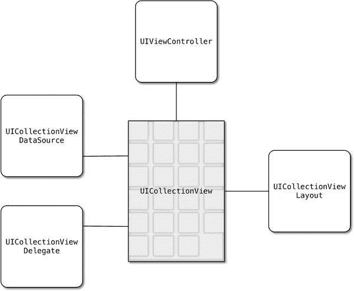

图 3-2. 集合视图及其支持对象

与 `UITableView` 一样，集合视图采用出队和回收的方式来创建和管理单元格。这使得集合视图能够在 iOS 设备严格的内存限制下，管理数量可能极其庞大的单个数据项，同时保持流畅的滚动和动画性能。

第 5 章 详细描述了出队机制如何与 `UITableView` 协同工作；`UICollectionView` 的工作方式完全相同，只是增加了补充视图、装饰视图以及数据项单元格。

## 集合视图的结构

集合视图显示一系列可以垂直和水平滚动的数据项（或称单元格）。它们是 `UICollectionView` 类的实例，包含两个物理部分。

### 集合视图本身

可见的容器部分，即 `collectionView` 本身，是 `UIScrollView` 的子类，负责将数据项集合以单元格形式显示出来。

这些单元格被放置在集合视图的 `contentView` 边界内。如果 `contentView` 大于 `collectionView` 的框架，那么集合视图将负责滚动内容视图，这既可以通过用户交互触发，也可以以编程方式实现。图 3-3 展示了 `frame` 和 `contentView` 之间的关系。

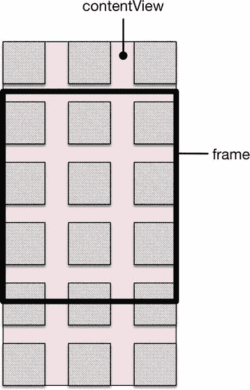

图 3-3. 框架与内容视图

当内容视图滚动时，集合视图会根据需要从中创建和移除数据项；这需要在确保数据项始终能及时创建并放置到位（以便在内容视图相应部分滚动到框架内时可见），与避免创建和维护太多不可见的数据项（以防止集合视图内存消耗过大）之间取得平衡。

与 `UITableView` 完全相同，集合视图使用一个预先存在的数据项队列，可以根据需要从中出队和回收。就在某个数据项即将滚入可见区域之前，集合视图会从队列中取出它，并用正确的数据进行配置。一旦该数据项滚出可见区域，集合视图就会将其放回队列，以备将来重复使用。

通过这种方式，集合视图可以看起来创建和显示成千上万的数据项，而实际上只需要创建其中一小部分作为实际对象保存在内存中。

### 集合视图单元格

集合视图单元格是 `UICollectionReusableView` 或其子类的实例。它们扮演三种角色之一：

- **数据项单元格**，创建为 `UICollectionViewCell` 的实例。它们类似于表格视图的单元格，用于显示主要数据项。例如，在图库应用中，单元格可能显示相册中照片的缩略图。
- **补充视图**，是 `UICollectionReusableView` 的实例。它们是完全可选的，并具有多种用途。在网格类型的布局（如照片图库）中，它们通常用作页眉和页脚，以提供关于节的元数据。在更复杂的布局中，它们可用于显示关于数据项的附加信息。
- **装饰视图**，也是 `UICollectionReusableView` 的实例。它们独立于集合视图的模型，不显示任何数据。通常，它们用于显示图形元素，例如背景或节高亮显示。

图 3-4 展示了一个具有网格布局的集合视图的概念组成部分，并突出显示了各种类型的视图。

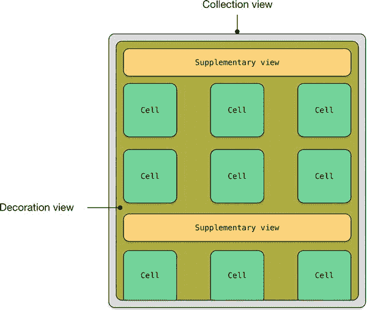

图 3-4. 集合视图的基本结构

图 3-5 展示了 iOS iBooks 应用中运行的集合视图。它使用单元格显示书籍封面，使用补充视图包含下载控件，并使用装饰视图呈现“书架”效果。

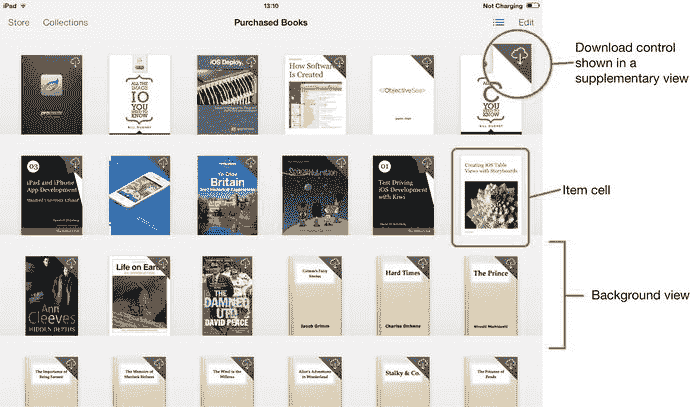

图 3-5. iBooks 应用

### 支持对象

集合视图控件本身相当简单；它依赖其他四个对象的支持来显示其数据：

- 模型（Model）
- 数据源（Datasource）
- 委托（Delegate）
- 布局（Layout）

每个对象在支持集合视图方面都扮演着特定的角色，它们的组织基于模型-视图-控制器架构。图 3-6 展示了这四个对象如何相互关联。

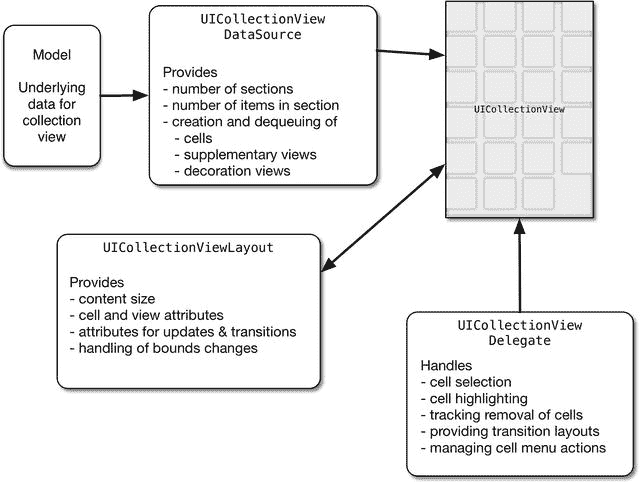

图 3-6. 集合视图及其支持对象如何相互关联

#### 集合视图的模型

模型包含将通过数据源在集合视图中显示的数据。顾名思义，它是模型-视图-控制器架构中模型组件的一部分。

模型可以采用多种形式，具体取决于应用中数据的管理方式。最简单的情况下，模型可能是一个包含一组 `String` 的一维数组。更复杂的模型可能涉及二维数组以将数据分割成节，或者可以从本地 Core Data 数据库或外部网络源检索数据。

无论模型采用何种形式，它都不会直接与集合视图通信。那是数据源的职责。


#### 集合视图的数据源

数据源对象的职责是，在收到请求时为集合视图提供单元格、补充视图和装饰视图，以便集合视图能够显示它们。它是模型-视图-控制器架构中模型组件的另一部分。

集合视图与其数据源之间的关系由 `UICollectionViewDataSource` 协议定义。集合视图的数据源必须实现一些强制函数，还有一些是可选的。

数据源可以是一个单独的类，遵守 `UICollectionViewDataSource` 协议，也可以是集合视图的视图控制器。哪种方法正确并没有硬性规定，但无论实现方式如何，数据源能够尽快将数据返回给集合视图这一点至关重要，以便最大化性能。

#### 集合视图的委托

处理用户与集合视图的交互是委托对象的职责，它构成了模型-视图-控制器架构中控制器组件的一部分。

委托是一个实现了 `UICollectionViewDelegate` 协议中部分或全部函数的类。它负责处理集合视图项的选择和高亮。`UICollectionViewDelegate` 协议中没有强制函数，但集合视图必须设置一个委托对象。

## 集合视图的布局

与 `UITableView` 不同，`UICollectionView` 控件本身并不知道应如何在其内容视图中布局各项。它依赖于一个 `UICollectionViewLayout` 对象来为每一项提供布局属性。

集合视图中的每一项（单元格、补充视图或装饰视图）都有一个对应的 `UICollectionViewLayoutAttributes` 实例，如图 3-7 所示。它管理该项的布局相关属性，并由 `UICollectionViewLayout` 对象在集合视图请求时创建。

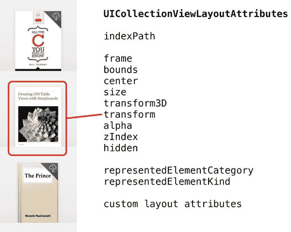

图 3-7. `UICollectionViewLayoutAttributes`

在请求了每一项的属性后，集合视图使用这些属性将其定位在内容视图中。这些属性控制着每一项的大小、位置、变换和不透明度，但你也可以通过子类化 `UICollectionViewLayoutAttributes` 并添加自己的自定义属性来补充它们。

如果你的集合视图布局基于一行项（可能有换行，也可能没有），那么你可以利用 `UICollectionViewFlowLayout` 类，它会为你处理大部分布局需求。通常你只需要指定项的大小、项间间距和行间距；然后流式布局会为你计算其他一切。

对于更复杂的布局，你需要创建一个自定义布局作为 `UICollectionViewLayout` 的子类。这样，你需要负责计算显示项所需的所有属性。

## 创建一个简单的集合视图应用

在本章的其余部分，你将从头开始构建一个简单的“Hello, world”风格的集合视图应用。它将向你展示容器、数据源、委托、布局、单元格和视图如何组合在一起，并为你提供一个可以作为自己实验基础的应用。最终结果将按花色显示一副扑克牌，如图 3-8 所示。

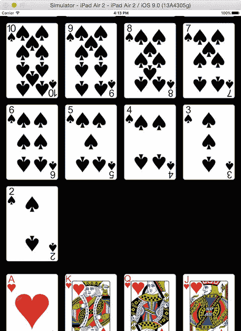

图 3-8. 完成的应用

我将有意放慢速度，涵盖所有步骤。如果你是一个熟练的 Xcode 使用者，你不需要这样的手把手指导——只需专注于代码即可。

还在听吗？好的，你需要执行以下操作：

* 创建一个简单的、基于窗口的应用骨架
* 生成一些用于供给集合视图的数据
* 创建一个简单的集合视图
* 连接集合视图的数据源和委托
* 实现集合视图的布局
* 添加一些非常简单的交互性

这一切都非常直接，但仍然是很有用的练习。

## 创建应用骨架

对于这个应用，你将使用一个简单的结构：一个由视图控制器管理的单一视图和一个 Storyboard，以为视图提供内容。

首先，在 Xcode 中创建一个新项目，并选择 Single View Application 模板，如图 3-9 所示。

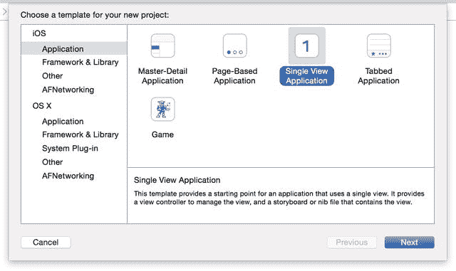

图 3-9. Xcode 的模板选择面板

将应用命名为 `SimpleCV`，如图 3-10 所示。

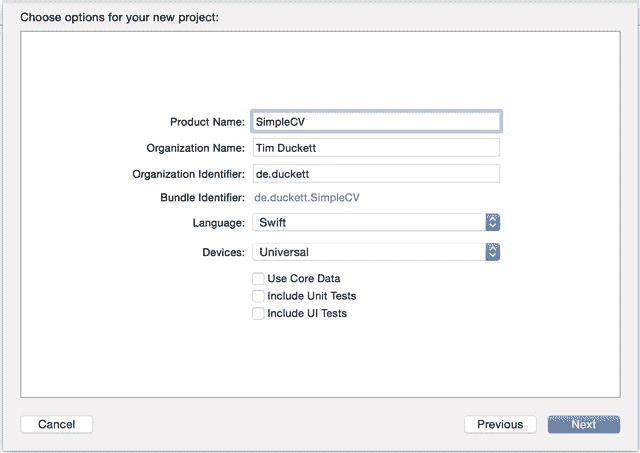

图 3-10. 命名应用

将项目保存到合适的位置，你将看到 Xcode 的项目视图，其中包含应用的初始骨架。假设你选择了 `SimpleCV` 应用名称，它看起来会像图 3-11 所示。

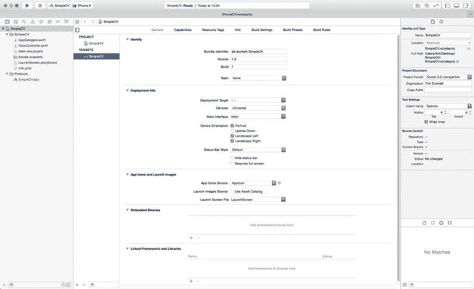

图 3-11. 初始的 Xcode 视图

你会看到你拥有以下内容：

* 一个应用委托（`AppDelegate.swift`）
* 一个视图控制器（`ViewController.swift`）
* 一个 Storyboard（`Main.storyboard`）
* 一个素材目录（`Images.xcassets`）
* 用于单元测试、框架和产品的支持文件和文件夹

## 创建一些数据

在你开始处理集合视图本身之前，你需要创建一些数据来供给它。你将从包含四种花色扑克牌图片的目录中创建集合视图的模型。

### 添加扑克牌图片

在本节的源代码中，你会找到一个包含五个子目录的 `cards` 文件夹。每个子目录包含每张扑克牌的 `png` 图片。首先，将 `cards` 文件夹拖入项目文件夹，如图 3-12 所示。

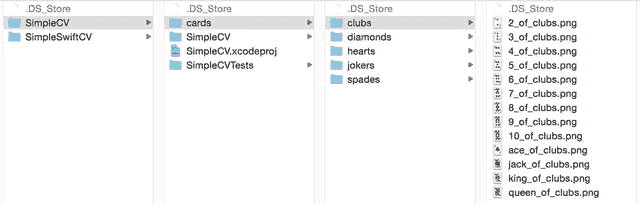

图 3-12. 扑克牌图片

接下来，将 `cards` 文件夹从 Finder 拖入 Xcode，并将其放置到 `SimpleVC` 文件夹内，如图 3-13 所示。

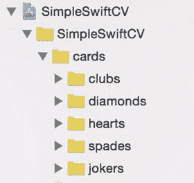

图 3-13. 将扑克牌图片添加到项目中

添加文件夹时，请确保选择将项目复制到目标文件夹并为任何添加的文件夹创建组的选项，如图 3-14 所示。

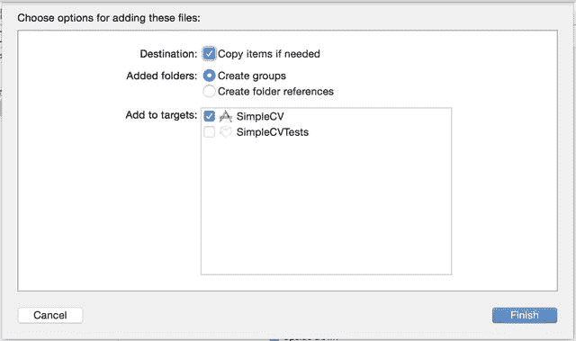

图 3-14. 添加扑克牌文件的选项


### 构建模型

你将采用的方法是从 JSON 文件构建数据。该 JSON 的结构如清单 3-1 所示。

**清单 3-1.** `cards.json` 文件片段

```
{
  "suits": [
    {
      "suitName": "Spades",
      "packOrder": 1,
      "cards": [
        {
          "cardName": "Ace of Spades",
          "cardImage": "ace_of_spades.png",
          "suitOrder": 1,
          "cardValue": 14
        },
        {
          "cardName": "King of Spades",
          "cardImage": "king_of_spades.png",
          "suitOrder": 2,
          "cardValue": 13
        },
        {
          "cardName": "Queen of Spades",
          "cardImage": "queen_of_spades.png",
          "suitOrder": 3,
          "cardValue": 12
        },
        ...
      ]
    },
    {
      "suitName": "Hearts",
      "packOrder": 2,
      "cards": [...]
    },
    {
      "suitName": "Diamonds",
      "packOrder": 3,
      "cards": [...]
    },
    {
      "suitName": "Clubs",
      "packOrder": 4,
      "cards": [...]
    },
    {
      "suitName": "Jokers",
      "packOrder": 5,
      "cards": [
        {
          "cardName": "Black Joker",
          "cardImage": "black_joker.png",
          "suitOrder": 1,
          "cardValue": 1
        },
        {
          "cardName": "Red Joker",
          "cardImage": "red_joker.png",
          "suitOrder": 2,
          "cardValue": 2
        }
      ]
    }
  ]
}
```

为了免去你从头创建 JSON 文件的麻烦，该文件已在可下载的源代码中提供。

模型将以`Dictionaries`的`Array`形式存储在`ViewController`的一个属性中。在类的顶部添加以下代码：

```
class ViewController: UIViewController {
    var suitsArray = [Dictionary<String, AnyObject]()
    ...
}
```

这里，你声明了`suitsArray`将是一个`Dictionaries`的数组。每个字典将以`String`作为键，并能存储一个`AnyObject`作为对应的值（这样你就可以存储`Strings`、`Ints`以及其他`Arrays`，稍后你会看到）。

接下来，你需要一个函数来从 JSON 文件加载数据。该函数将从磁盘读取 JSON 文件，并将其解析为字典，存入`suitsArray`数组。

虽然你只是在构建一个简单的示例应用程序，但养成处理错误的好习惯仍然是一个好主意。解析 JSON 可能有风险；源 JSON 文件可能不存在，也可能无法解析。在这两种情况下，你都需要处理由此产生的错误。

为此，首先添加一个`enum`来描述可能出现的错误情况。在类的顶部，`suitsArray`声明的下方添加以下代码：

```
enum ParsingError: ErrorType {
    case MissingJson
    case JsonParsingError
}
```

这声明了一个符合`ErrorType`协议的`enum`。你为这个`enum`将描述的错误创建了两个可能的值：`MissingJson`，用于指示源数据存在问题；`JsonParsingError`，用于指示将 JSON 解析到`suitsArray`时出现了问题。

现在，在类的底部添加一个名为`setupData()`的新函数，如清单 3-2 所示。

**清单 3-2.** `setupData()` 函数

```
// MARK:
// MARK: Data setup
func setupData () throws {
    guard let filePath = NSBundle.mainBundle().pathForResource("cards",
        ofType: "json"), jsonData = NSData(contentsOfFile: filePath) else {
        throw ParsingError.MissingJson
    }

    do {
        let parsedObject = try NSJSONSerialization.JSONObjectWithData(jsonData,
            options: NSJSONReadingOptions.MutableContainers) as! NSDictionary
        suitsArray = parsedObject["suits"] as! Array
    } catch {
        throw ParsingError.JsonParsingError
    }
}
```

首先，该函数尝试加载`cards.json`文件。如果找不到该文件或加载时出现问题，它会抛出一个`MissingJson`错误。如果一切正常，JSON 将被加载到`jsonData`对象中。

接下来，`jsonData`对象被解析为一个`NSDictionary`。由于这可能会失败，它被包裹在一个`do-catch`块中，如果任何操作失败，该块将抛出一个`JsonParsingError`错误。通过在`JSONObjectWithData`函数前使用`try`关键字，你表明了事情可能会出错。

你还将解析结果强制解包为一个`NSDictionary`。这一步也可能失败，但至少如果其中任一操作出错，你都能处理该错误。

`suitsArray`属性将具有如图 3-15 所示的结构。

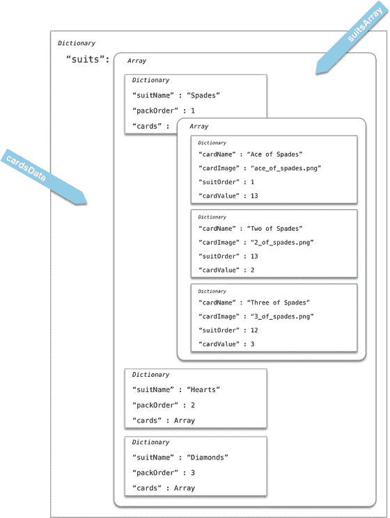

**图 3-15.** 数据结构

`UICollectionView`中的某个单独分区或项目通过`NSIndexPath`值进行引用。图 3-16 展示了`indexPath section`和`row`值如何映射到花色和牌面。

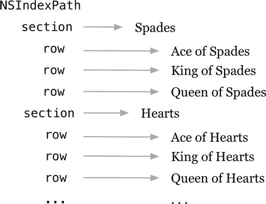

**图 3-16.** 集合分区与行之间的映射

数据模型需要在集合视图开始请求数据之前设置好，因此在`ViewController`的`viewDidLoad`函数中添加对`setupData`函数的调用，如清单 3-3 所示。

**清单 3-3.** 更新后的 `viewDidLoad()` 函数

```
override func viewDidLoad() {
    super.viewDidLoad()
    // Do any additional setup after loading the view, typically from a nib.
    // Configure data
    do {
        try setupData()
    } catch ParsingError.MissingJson {
        print("Error loading JSON")
    } catch ParsingError.JsonParsingError {
        print("Error parsing JSON")
    } catch {
        print("Something went wrong")
    }
}
```

这将`setupData()`函数包裹在一个`do-catch`块中。如果抛出任何错误，都会在此处得到处理。

> **提示**  
> 你完全可以将这些数据设置代码直接放在`viewDidLoad`函数中，但我更倾向于将这类事务分离到其独立的函数中。这种方法有几个优点。首先，它能让`viewDidLoad`函数保持简洁并易于阅读。其次，如果你能将这种数据设置过程与视图生命周期解耦，那么对视图控制器进行单元测试就会容易得多。


好的，作为高级文档工程师和翻译员，我将严格遵循您的注意事项和示例，将给定的英文文本翻译成中文。


### 在 Storyboard 中设置集合视图

数据设置完成后，您现在可以着手连接界面。这非常简单，只需要一个填充整个屏幕的集合视图即可。

为了配置集合视图，您需要将其连接到视图控制器，因此在 `ViewController` 的实现文件中创建一个 `IBOutlet` 属性：

```
class ViewController: UIViewController {
    var suitsArray = [Dictionary<String, AnyObject>]()
    @IBOutlet var collectionView: UICollectionView!
    ...
}
```

接下来，切换到 Storyboard，从对象浏览器中拖拽一个 `UICollectionView` 对象到视图中，并让它自动吸附以填充整个屏幕，如图 3-17 所示。

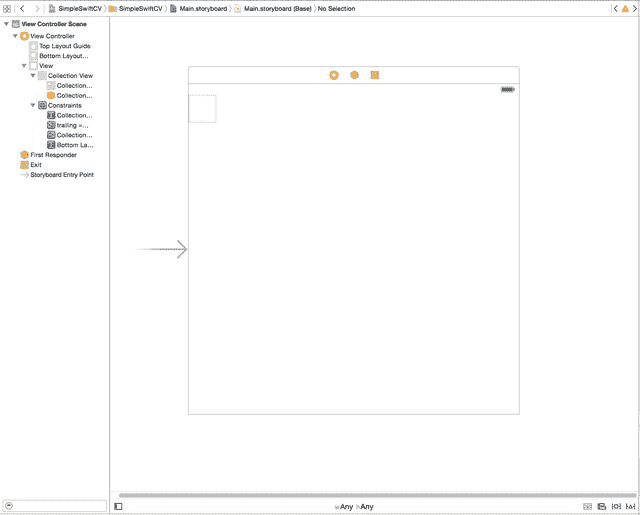

**图 3-17.** 添加到 Storyboard 中的 `UICollectionView`

拖入 Storyboard 的 `UICollectionViews` 会自带一个原型单元格（即集合视图左上角的白色轮廓）。您不需要它。您可以将其留在那里，但 Xcode 会弹出警告，要求提供重用标识符。为了保持项目整洁，请在场景树中高亮选中 `Collection View Cell` 项，然后按退格键将其删除。

`UICollectionView` 就位后，您现在需要将其连接到视图控制器的输出口（从 `File's Owner` 占位符拖拽到集合视图，然后从 HUD 中选择 `collectionView` 输出口）。

接下来，将 `File's Owner` 占位符设置为集合视图的 `delegate` 和 `datasource`（从集合视图向上拖拽到 `File's Owner` 占位符，然后从 HUD 中选择 `datasource` 和 `delegate` 输出口）。

最后一项任务是设置集合视图的 AutoLayout 约束，使其无论设备方向如何，都能填充视图的完整宽度和高度，但不要与状态栏重叠。

如果集合视图还未被选中，请高亮选中它，然后点击 Storyboard 视图底部的“固定 (Pin)”按钮，为其添加“前导”、“尾随”、“顶部”和“底部”约束，如图 3-18 所示。


**图 3-18.** 添加新约束

完成这三个连接后，您可以切换回 `ViewController` 的实现文件，并开始在代码中配置集合视图。

### 设置委托和数据源函数

与 `UITableView` 类似，`UICollectionView` 依赖于 `delegate` 和 `dataSource` 对象的协助，为其提供单元格、补充视图和装饰视图，以及在运行时提供布局和配置信息。

这可以是任何遵循 `UICollectionViewDelegate` 和 `UICollectionViewDataSource` 协议的类。通常认为最佳实践是使用单独的类来充当 `delegate` 和 `dataSource`，这意味着每个类都有特定的角色（用软件工程术语来说，这就是单一职责原则）。

在后几章的项目中，您会采用这种方法，但为了尽可能简化当前项目，您将使用 `ViewController`。

通过在 Interface Builder 中连接集合视图的 `delegate` 和 `dataSource` 输出口，您已经告诉集合视图，`ViewController` 类将扮演 `delegate` 和 `dataSource` 的角色。现在您需要设置该类来实现这一功能。

第一步是让该类遵循这三个协议，如代码清单 3-4 所示。

**代码清单 3-4.** 更新后的 `ViewController`

```
import UIKit
class ViewController: UIViewController, UICollectionViewDataSource,
UICollectionViewDelegate, UICollectionViewDelegateFlowLayout {
    ...
}
```

第三个协议 `UICollectionViewDelegateFlowLayout`，通过一些可选函数扩展了 `UICollectionViewDelegate` 协议，这些函数可以辅助 `UICollectionViewFlowLayout` 处理诸如单元格大小等属性。您稍后会看到这个，但在您更新头文件的同时，正好可以把它加进来。

> **注意：** `UICollectionViewDelegateFlowLayout` 是一个额外的协议，它定义了一些特定于流式布局的函数，用于处理诸如单元格大小等属性。您可以将其视为“扩展”了 `UICollectionDelegate` 协议以定义额外函数，类似于通过添加扩展来为 Swift 类添加额外函数。

`UICollectionViewDataSource` 协议负责提供集合在运行时所需的数据和视图。至少，您需要实现两个函数：

*   `collectionView(_:numberOfItemsInSection:)`
*   `collectionView(_:cellForItemAtIndexPath:)`

还有一个可选的第三个函数可供实现：

*   `numberOfSectionsInCollectionView(_:)`

顾名思义，第一个函数返回当前分区中的项目数量；这对应于每种花色的牌数。

第二个函数是您创建或出列 `UICollectionViewCell`、配置其内容并将其传递给 `collectionView` 进行显示的地方。

第三个可选函数返回花色的数量；在您的集合视图中，每种花色将位于其自己的分区内。

> **提示：** 除非您通过实现 `numberOfSectionsInCollectionView(_:)` 函数另行指定，否则集合视图将假定只有一个分区。

#### `numberOfSectionsInCollectionView:` 函数

`numberOfSectionsInCollectionView:` 函数告诉集合视图需要多少个分区来显示模型中包含的数据。在您的示例中，这对应于一副牌中花色的数量。

将代码清单 3-5 中的代码添加到 `ViewController` 的底部。

**代码清单 3-5.** `numberOfSectionsInCollectionView:` 函数

```
func numberOfSectionsInCollectionView(collectionView: UICollectionView) -> Int {
    return suitsArray.count
}
```

> **提示：** 当集合视图调用这三个数据源函数之一时，它会将自身的引用作为参数之一传递进来。这意味着通过检查传入的是哪个集合视图，您就可以用同一个（或同一组）数据源函数来服务于多个集合视图。

#### `collectionView:numberOfItemsInSection:` 函数

现在，您可以实现确定每个分区中将显示多少个项目的函数了。根据您的数据模型，这将是该花色中牌的数量。

将 `collectionView:numberOfItemsInSection:` 函数添加到 `ViewController` 的底部，如代码清单 3-6 所示。

**代码清单 3-6.** `collectionView:numberOfItemsInSection:` 函数

```
func collectionView(collectionView: UICollectionView, numberOfItemsInSection
section: Int) -> Int {
    let cardsDictionary = self.suitsArray[section]
    let cardsArray = cardsDictionary["cards"] as! NSArray
    return cardsArray.count
}
```

这个函数非常直接：它从 `suitsArray` 的相应元素中获取包含花色的字典，然后获取包含卡牌对象的数组并返回其数量。


#### `collectionView:cellForItemAtIndexPath:` 函数

`collectionView:cellForItemAtIndexPath:` 函数是魔法发生的核心所在。当集合视图需要显示新单元格时，会重复调用此函数，其职责包括创建或复用队列中的单元格、配置该单元格，并根据需求将其交付给集合视图。

随之而来的一个问题是：“单元格最初是从哪里来的？”与`UITableView`不同，`UICollectionView`没有任何“标准”的单元格类型。你必须从头开始自行创建。

有两种实现方式：创建一个 nib 文件，或创建一个自定义的 `UICollectionViewReusableView` 或 `UICollectionViewCell` 子类。然后在配置集合视图实例化时，你需要将 nib 文件或类与一个单元格复用标识符（reuse identifier）一起注册。

这个注册过程会告知集合视图单元格的来源位置。复用标识符就像一个“标签”，用于区分不同的单元格类型。尽管你的简单示例只有一种单元格类型，但在同一个集合视图中，你可以拥有多种不同类型的单元格来展示不同类别的数据。

本着简单示例的精神，你将创建一个非常简单的 Xib 文件来包含你的 `UICollectionViewCell` 模板。新建文件（文件 ➤ 新建 ➤ 文件），并从“用户界面”部分选择“视图”项，如图 3-19 所示。

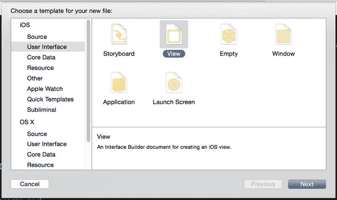

图 3-19：选择视图模板

设备系列设置并不重要，因此点击“下一步”跳过此步，然后给你的新文件命名。我将其命名为 `CollectionViewCell`。点击“创建”按钮，你将在界面构建器中看到一个全新的 `UIView`。

有些反直觉的是，处理新文件的第一步是删除已为你提供的视图。在占位对象列表中选择它，然后按下 Delete 键。

现在，在 Xcode 窗口右侧“工具区”的对象浏览器中找到 `UICollectionViewCell`，并将其拖拽到主区域。最终你应该得到类似图 3-20 所示的结果。

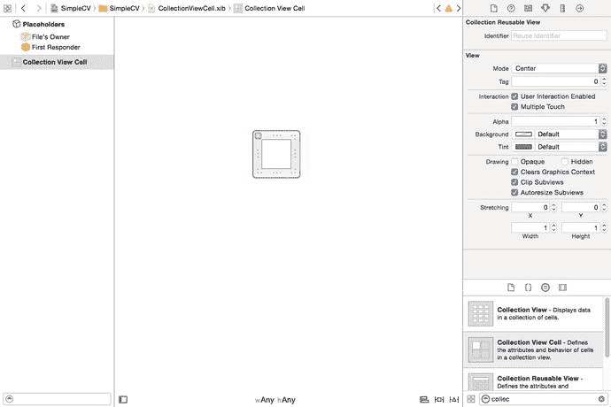

图 3-20：新的 `UICollectionViewCell`

现在你需要向单元格中添加一个 `UIImageView` 来显示卡片，因此从对象浏览器中拖拽一个并将其放入单元格，如图 3-21 所示。

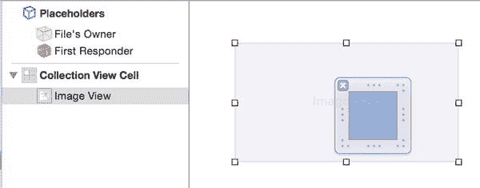

图 3-21：单元格内部的 `UIImageView`

注意图像视图比单元格本身要大。使用自动布局约束将图像视图“粘合”到单元格框架上，这样当单元格调整大小时，图像视图会随之放大。

在视图树中选择图像视图，点击故事板视图底部的“固定”按钮，并添加四个约束，如图 3-22 所示。

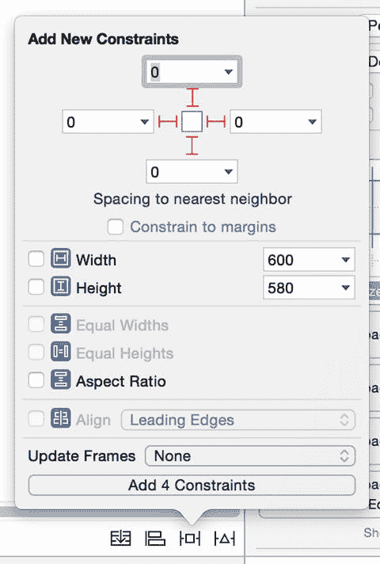

图 3-22：向图像视图添加约束

最后，再次选择图像视图，如果属性检查器未显示则将其打开，并为图像视图添加一个标签，如图 3-23 所示。

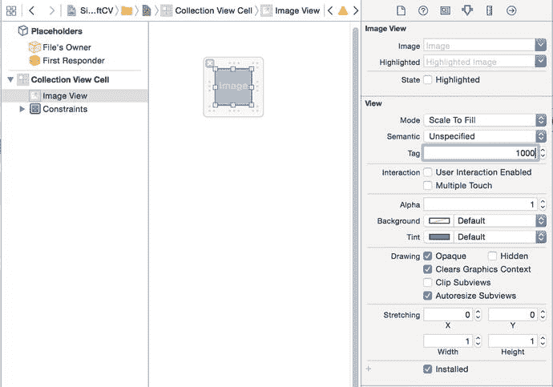

图 3-23：为图像视图添加标签

**警告:** 通过标签访问单元格内的控件可能是一个脆弱的流程。它依赖于故事板中设置的标签与代码中引用该控件时使用的标签完全匹配。如果单元格包含多个控件，通过自定义 `UICollectionViewCell` 子类中的出口（outlet）连接它们会更安全。

就用户界面而言，这就完成了。你的 `UICollectionViewCell` 的其余配置将在代码中进行。切换回 `ViewController` 的实现文件，你就可以继续了。

创建包含单元格的 nib 文件后，你需要将其注册到集合视图中。最明显的时机是在视图控制器加载时，因此我将采用与之前创建集合视图数据相同的方法，创建一个独立的函数，由视图控制器的 `viewDidLoad` 函数调用。

创建一个名为 `configureCollectionView` 的新函数，如代码清单 3-7 所示。

**代码清单 3-7.** `configureCollectionView` 函数

```
func configureCollectionView() {
    collectionView.registerNib(UINib(nibName: "CollectionViewCell", bundle: nil), forCellWithReuseIdentifier: "CardCell")
}
```

这非常简单。你在集合视图上调用 `registerNib(_:forCellWithReuseIdentifier:)` 函数，并提供刚创建的 nib 文件名和复用标识符。

创建该函数后，更新 `viewDidLoad` 函数，使其在视图控制器加载时被调用，如代码清单 3-8 所示。

**代码清单 3-8.** Swift 中更新后的 `viewDidLoad` 函数

```
override func viewDidLoad() {
    super.viewDidLoad()
    // 加载视图后的任何额外设置，通常来自 nib。

    // 配置数据
    do {
        try setupData()
    } catch ParsingError.MissingJson {
        print("加载 JSON 出错")
    } catch ParsingError.JsonParsingError {
        print("解析 JSON 出错")
    } catch {
        print("发生未知错误")
    }

    // 配置集合视图
    configureCollectionView()
}
```

在注册了单元格的 nib 之后，你就可以实现 `collectionView(_:cellForItemAtIndexPath:)` 函数了，如代码清单 3-9 所示。

**代码清单 3-9.** `collectionView:cellForItemAtIndexPath:` 函数

```
func collectionView(collectionView: UICollectionView, cellForItemAtIndexPath indexPath: NSIndexPath) -> UICollectionViewCell {
    let cell: UICollectionViewCell = collectionView.dequeueReusableCellWithReuseIdentifier("CardCell", forIndexPath: indexPath)

    let suitDictionary = suitsArray[indexPath.section]
    let cardsArray = suitDictionary["cards"] as! [Dictionary<String, AnyObject>]
    let cardDictionary = cardsArray[indexPath.row]
    let cardImageName = cardDictionary["cardImage"] as! String

    if let cardImage = UIImage(named: cardImageName) {
        if let imageView = cell.contentView.viewWithTag(1000) as? UIImageView {
            imageView.image = cardImage
        }
    }

    return cell
}
```

`UICollectionView` 与 `UITableView` 类似，会维护一个可回收的单元格队列，以便在需要时重复使用，从而无需为每个项目维护单独的单元格，并将内存开销降至最低。

当集合视图需要显示新单元格时，它会调用其数据源的 `collectionView(_:cellForItemAtIndexPath:)` 函数，并传递一个指向自身的引用以及所需单元格对应的索引路径。

数据源通过 `dequeueReusableCellWithReuseIdentifier(_:forIndexPath:)` 函数出列一个适当类型的缓存单元格。如果队列中有可用单元格，则返回该单元格；否则，会在后台创建一个新的单元格。

无论哪种情况，集合视图都保证会返回一个 `UICollectionViewCell` 实例，然后你可以使用该项目相关的数据进行配置。

值得注意的是，同一个数据源可以为多个集合视图提供服务，因此集合视图在发送请求时会附带一个指向自身的引用，以便数据源能够追踪它正在响应的是哪个集合视图。


也正是在这一点上，`reuseIdentifier` 的原理变得清晰起来。你可能有一个集合视图，它要显示多种类型的单元格，每种单元格都会有不同的标识符。当你请求出列一个单元格时，通过提供标识符，就可以控制返回的单元格类型。

拿到返回的 `UICollectionViewCell` 之后，你现在可以配置它了。首先，从 `suitsArray` 中获取相应的 `suitDictionary`，方法是取出数组中索引与集合视图内项目索引相对应的那个对象。

卡片详情以字典形式存储在数组的元素中。你所需元素的索引，应与传入 `cellForItemAtIndexPath` 函数的 `indexPath` 参数的 `row` 值相对应。

检索到 `cardDictionary` 后，你可以通过由 `cardImage` 键标识的 `String` 对象来访问图片名称。PNG 图片会被加载到一个 `UIImage` 对象中。

如果存在有效的 `UIImage` 对象，那么你尝试访问单元格中的 `UIImageView`。它的标签值是 `1000`，所以可以通过 `contentView` 的 `viewWithTag()` 属性来访问。

由于此属性返回的是一个可选值，你需要在将其 `image` 属性设置为你刚刚创建的卡片图片之前，检查它是否已被解包。

最后，将这个单元格返回给请求它的集合视图。

继续运行这个应用。你可能会对自己看到的结果感到惊讶。看起来还不错，但还有些不太对劲，正如你在图 3-24 中看到的那样。

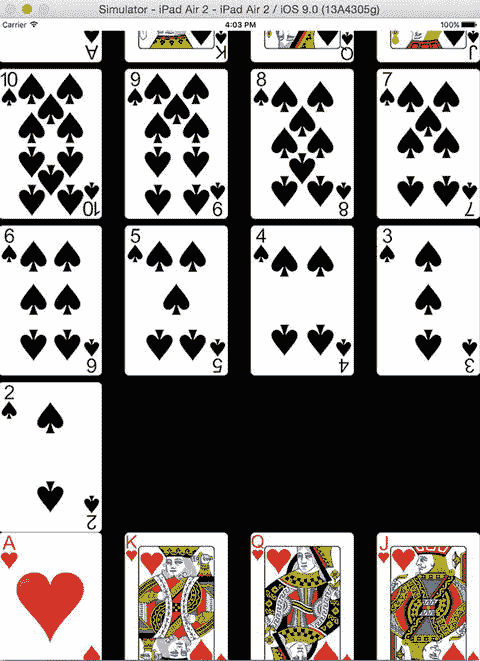

图 3-24.
还不算完美的集合视图

### 配置集合视图的布局

你现在面临的问题是，集合视图并不真正知道应该如何布局它的项目。它已经尽力了，但仍有改进的空间。

有两种方法可以做到这一点：你可以创建一个 `UICollectionViewLayout` 的子类并将其应用于集合视图，或者你可以采用更简单（但最终灵活性较差）的方法，直接配置集合视图。

因为这是一个简单的应用，我们采用简单的方法。在 Storyboard 中选择集合视图，然后切换到尺寸检查器。更新集合视图的值，使其与图 3-25 一致。

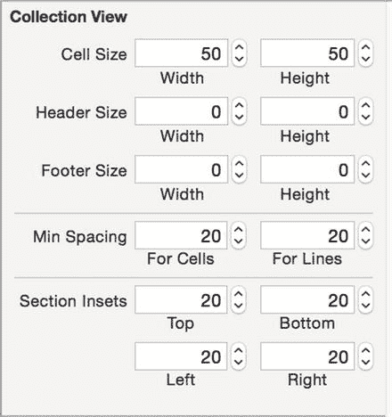

图 3-25.
调整后的尺寸值

现在，如果你再次运行应用，你会看到项目、行和分区间距看起来好多了，如图 3-26 所示。

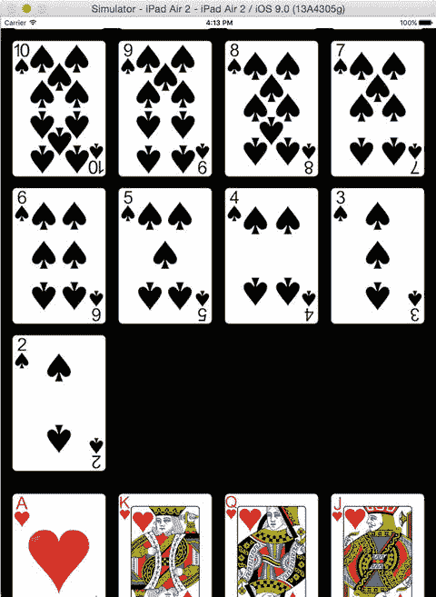

图 3-26.
实际应用中的新间距值

你可能已经注意到，你没有更新单元格大小的值。事实证明，你不需要这样做，因为当使用像这样非常简单的布局时，集合视图足够智能，能够将单元格大小适配到内容。

### 应用运行

完成所有这些步骤后，你现在可以运行应用了！如果你尝试旋转设备或模拟器，你会看到集合视图的布局会自动更新，并且项目会整齐地排列以填满视图的边界，如图 3-27 所示。

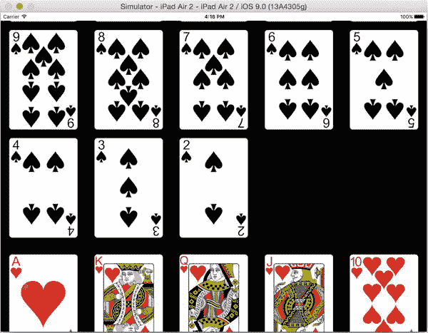

图 3-27.
在横屏方向运行的应用

## 本章小结

在本章中，你逐步创建了一个非常基础的集合视图：

*   首先，你创建了一些要在集合视图中显示的数据。
*   然后，使用 Interface Builder，你在窗口中创建了一个 `UICollectionView` 实例。
*   视图控制器遵循了 `UICollectionViewDataSource` 和 `UICollectionViewDelegate` 协议，以便能够为集合视图提供数据并响应交互。
*   你实现了为集合视图创建单元格所需的代码。
*   你调整了布局，以控制项目在集合视图边界内的排列方式。

这证明了 `UICollectionView` 的强大功能。通过设置四个属性，你创建了一个能够处理任意数量、任意大小和任意方向项目的布局，并且由于单元格的缓存机制，所有这些操作都占用极小的内存并拥有流畅的滚动性能。

你在此构建的应用结构是所有基于集合视图的应用的基础，因此你可以将其作为自己项目的起点。当你更深入地研究 `UICollectionView` 时，你会重复使用许多相同的模式。

现在，是时候更详细地了解集合视图和单元格是如何构建的，以及它们如何被自定义并响应交互了。

