# 4. 集合视图的构成

在本章中，你将快速浏览一下集合视图及其构成元素。虽然本章不会展示大量代码，但它将为你开始自定义集合视图提供一个有用的基础。

在此过程中，你将了解以下内容：

*   集合视图的结构和尺寸
*   `UICollectionView` 与其超类 `UIScrollView` 的关系
*   如何在代码中以及使用 Interface Builder 创建集合视图
*   使用 `UICollectionViewController` 类来利用其模板方法

## 什么是集合视图？

集合视图提供了一种管理和显示有序数据项集合的方式，并带有可定制和可交互的布局。

集合视图由显示在单元格中的数据项，以及可以显示额外信息的补充视图组成，例如用于节头、节尾，或关于项目本身的元数据。

装饰视图是纯视觉组件，可用于显示背景和边框等界面元素；它们不包含任何可变数据元素。

集合视图在表格视图控件的基础上进行了扩展，提供了实现更复杂布局的潜力。表格视图只能以单列形式显示项目，而集合视图可以用从线性网格到圆形乃至两者之间任何可想到的布局来展示项目。图 4-1 显示了一些示例。

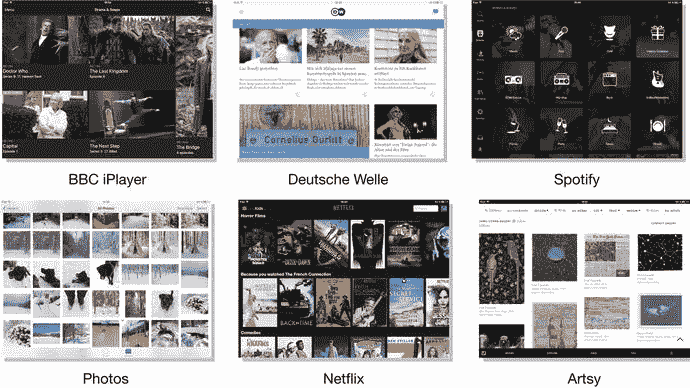

图 4-1.
集合视图示例


## 集合视图的架构

`UICollectionView` 类是 `UIKit` 框架的一部分，是 `UIScrollView` 的子类，而 `UIScrollView` 又继承自 `UIView`、`UIResponder`，最终继承自 `NSObject`，如图 4-2 所示。

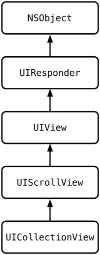

**图 4-2.** `UICollectionView` 的继承树

`UICollectionView` 控件与其他四个对象协同工作，如图 4-3 所示。集合视图本身由 `UIViewController` 的子类管理，可以是直接管理，也可以是作为继承自 `UIViewController` 的 `UICollectionViewController` 实例来管理。

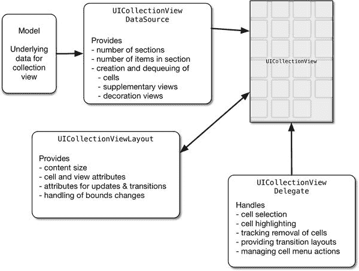

**图 4-3.** 集合视图及其支持对象

`UICollectionViewDataSource` 是一个负责从数据模型获取数据的对象。它利用这些数据来告知集合视图要显示的项目数量和类型，并创建和配置这些项目，然后将它们传递给集合视图本身。

与集合视图的交互（选择、高亮、聚焦等）由充当 `UICollectionViewDelegate` 的对象来处理。

`UICollectionView` 采用模型-视图-控制器模式来组织自身。驱动项目和补充视图内容的数据由模型对象提供，而 `UICollectionView` 控件本身则充当视图组件。

控制器部分通常是一个 `UICollectionViewController` 子类，但控制器的角色也可以由另一个独立的类来扮演，甚至可以分散到不同的类中，这些类彼此独立地充当 `delegate` 和 `dataSource`。

**提示：** 同时充当 `UICollectionView` 数据源和委托的 `UIViewController` 子类，往往有变得相当庞大的趋势。为了避免你的项目陷入“臃肿的视图控制器”综合症，值得考虑是否使用一个单独的类来管理集合视图，同时让视图控制器坚守其常规职责，这样结构会更好。

集合视图的布局由一个 `UICollectionViewLayout` 对象管理，该对象通过配置每个项目的各种布局属性，告知集合视图每个单元格、补充视图和装饰视图应如何在集合视图自身的边界内定位。布局的变化可以动画化，并能对交互做出反应。

尽管集合视图和表视图在基本操作上相似（两者都使用数据源来提供要显示的项目，并使用委托来处理交互），但集合视图布局在配置其外观方面提供了更大的灵活性。

与 `UITableView` 一样，集合视图在创建和管理单元格时采用了出队和重用的方法。当创建单元格时，它们会被标记上一个单元格标识符，以便集合视图能够追踪单元格的类型。

当单元格滚动出可见区域时，它们会被存储在一个缓存中，当需要“新的”单元格来显示即将滚动进入视野的项目时，就可以从这个缓存中出队并重用。通过使用单元格标识符，集合视图可以处理多种类型单元格的出队和重用。

创建单元格是一项开销很大的操作，因此这种方法使得集合视图能够在 iOS 设备严格的内存限制下，管理潜在的海量独立数据项，同时保持流畅的滚动和动画性能。关于出队机制如何工作的详细描述，请参见第 5 章。

## 集合视图的剖析

集合视图是 `UICollectionView` 类的实例，用于显示可以垂直和水平滚动的项目列表（或单元格）。它们是 `UICollectionView` 类的实例，由三个物理部分组成。

### 集合视图本身

作为可见容器的 `collectionView` 本身，是 `UIScrollView` 的一个专门子类，负责将数据项集合作为项目来显示。就像 `UIScrollView` 一样，集合视图的 frame 充当内容视图上的一个“窗口”，而内容视图的大小，取决于所显示项目的数量和大小，可能比 frame 本身还要大。

内容项目排列在集合视图的边界内。如果内容大于集合视图的 frame，集合视图将处理内容的滚动，无论是响应用户交互还是通过编程方式。图 4-4 展示了 frame 和内容之间的关系。

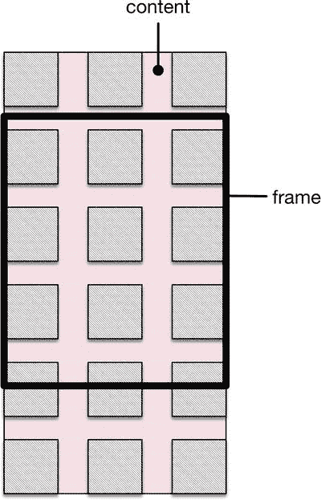

**图 4-4.** frame 与内容视图

如果项目的数量和大小意味着它们都可以适配到集合视图的 frame 内，那么内容将不会滚动。内容视图的总大小由集合视图的布局计算得出，并且每当分区和/或项目的数量发生变化时都会重新计算。

图 4-4 展示了一个采用行和列排列项目的布局的集合视图，但这并非必须如此。通过自定义布局，你可以实现行、列、圆形，或者几乎任何你能想到的排列方式。然而，无论项目如何排列，如果它们不能全部适配到集合视图的 frame 中，集合视图都会处理滚动。

当内容视图滚动时，集合视图会根据需要从中创建和移除项目。这需要在以下两者之间取得平衡：确保项目总能及时被创建并放置到位，以便在内容视图的该部分滚动到 frame 内时变为可见；同时又不能创建和维护过多不可见的项目，以免导致集合视图的内存消耗过大。

与 `UITableView` 完全相同，集合视图使用一个预先存在的项目队列，它可以根据需要对这些项目进行出队和重用。就在一个项目即将滚动到可见区域之前，集合视图会从队列中取出它，并用正确的数据进行配置。一旦该项目滚动出可见区域，集合视图会将其放回队列，以备最终重用。通过这种方式，集合视图看起来可以创建并显示数千个项目，而实际上只需创建其中一小部分数量的实际对象在内存中维护。


#### 集合视图项

集合视图项是 `UICollectionReusableView` 或其子类的实例。它们扮演以下三种角色之一：

-   **项目单元格**，创建为 `UICollectionViewCell` 的实例。它们类似于表格视图的单元格，用于显示主要数据项。例如，在相册应用中，这些单元格可能显示相册中照片的缩略图。
-   **补充视图**，是 `UICollectionReusableView` 的实例。这些是完全可选的，并且可以有多种用途。在网格型布局中（例如照片库），它们通常用作页眉和页脚（例如相册名称）来提供关于分区的元数据。在更复杂的布局中，它们可用于显示关于项目的附加信息，例如图像元数据。
-   **装饰视图**，也是 `UICollectionReusableView` 的实例（也是可选的）。它们独立于集合视图的模型，不显示任何数据。通常用于显示视觉元素，例如背景。

图 4-5 以高亮显示各种类型视图的方式，展示了具有网格布局的集合视图的概念组成部分。

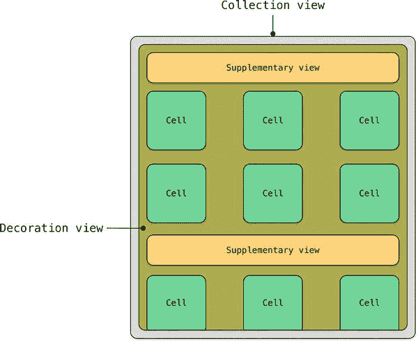

*图 4-5. 集合视图的基本结构*

图 4-6 展示了 iOS iBooks 应用中实际运行的集合视图。它使用单元格来显示书籍封面，使用包含下载控件的补充视图，以及使用装饰视图来提供背景渐变“书架”效果。

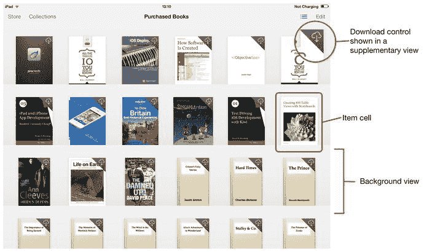

*图 4-6. iBooks 应用*

与 `UITableViewCell` 不同，`UICollectionViewCell` 没有预定义的单元格类型。相反，你会得到一个空的 `contentView`，你可以在其中放置自己的控件。因此，当构建集合视图时，你最终总是需要创建至少一个单元格对象。

可以通过以下几种方式创建单元格：

-   在 Storyboard 中可视化为原型单元格
-   在独立的 `.xib` 文件中可视化为集合视图单元格
-   在代码中，通过配置 `UICollectionViewCell` 的“标准”实例
-   作为自定义的 `UICollectionViewCell` 子类

我们将在后面的章节中探讨所有这四种方法。

### 集合视图布局

与表格视图不同，集合视图对如何布局其项目的位置一无所知。相反，它们依赖一个独立的对象——集合视图布局——来在任意给定时刻确定每个项目的属性。然后，集合视图使用这些属性来确定每个项目应该出现的位置及其外观。

集合视图的布局是 `UICollectionViewLayout` 的子类，负责计算集合视图的整体内容大小，以及在集合视图请求时为每个单独项目计算布局属性。

这些属性控制项目显示和放置的各个方面：frame、bounds、center、size、transform、`transform3D`、alpha、z-index 和可见性。通过操作这些属性，可以设计出从简单的项目行和列到复杂的、动画交互式 3D 排列的布局。

可以单独请求特定项目的属性，也可以批量请求集合视图内容区域内特定部分包含的所有项目的属性。高效地执行所涉及的计算，对于确保集合视图性能起着重要作用。

由于行和列布局非常常见，`UIKit` 附带了一个名为 `UICollectionViewFlowLayout` 的预定义 `UICollectionViewLayout` 子类。它实现了一个项目水平或垂直行的“自动换行”布局，并自动处理换行位置的确定。这消除了设置集合视图布局所涉及的大量繁重工作，并且也可以对其进行子类化以获得更精细的控制。

我们将在第 15 章和第 16 章详细讨论集合视图布局。

### 详细解析支持对象

集合视图控件本身非常笨拙，它依赖其他五个对象的支持来显示其数据：

-   视图控制器
-   模型
-   数据源
-   委托
-   布局

每个对象在支持集合视图方面都扮演着特定的角色，它们的组织基于模型-视图-控制器架构。图 4-7 显示了这五个对象是如何相互关联的。

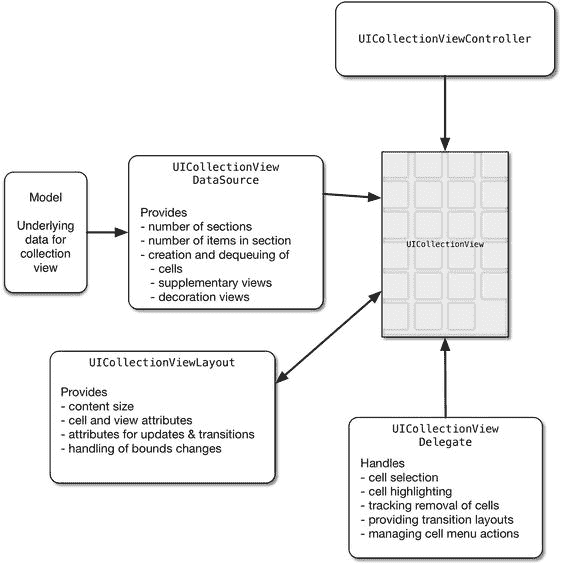

*图 4-7. 集合视图与支持对象之间的相互关系*

#### 集合视图的模型

模型包含将通过数据源在集合视图中显示的数据。顾名思义，它是模型-视图-控制器架构中模型组件的一部分。

模型可以采用多种形式；形式将取决于应用中数据需要管理的方式。最简单的形式，模型可能是一维数组，包含一组 `Strings`。更复杂的模型可能涉及二维数组以将数据分割成多个分区，或者可以从本地持久数据库或外部网络源检索数据。

无论模型采用何种形式，它都不会直接与集合视图通信。那是数据源的职责。

#### 集合视图的数据源

数据源对象的职责是在请求时向集合视图提供单元格、补充视图和装饰视图，以便它们能够被集合视图显示。它构成了模型-视图-控制器架构中模型组件的另一部分，并在模型中的底层数据和集合视图本身之间进行调解。

集合视图与其数据源之间的关系由 `UICollectionViewDataSource` 协议定义。集合视图的数据源必须实现一些强制方法，以及一些可选方法。

数据源可以是一个符合 `UICollectionViewDataSource` 协议的独立类，也可以是集合视图的视图控制器。

关于哪种方法是正确的，并没有硬性规定。将功能拆分到一个单独的类中有助于保持应用结构良好，但无论其如何实现，数据源能够尽可能快地将数据返回给集合视图对于最大化性能至关重要。

#### 集合视图的委托

处理与集合视图的用户交互是委托对象的职责，它构成了模型-视图-控制器架构中控制器组件的一部分。

委托是一个实现了 `UICollectionViewDelegate` 协议定义的部分或全部方法的类。这些方法处理集合视图项目的选择和高亮。

`UICollectionViewDelegate` 协议中没有强制方法，因此集合视图运行不一定需要 `delegate` 对象。

就像数据源一样，委托通常是管理集合视图所在视图的 `UIViewController` 子类。然而，这并非必须如此。如果创建一个独立的类来充当委托，有助于保持类的大小可控。

我们将在第 5 章更详细地探讨数据源和委托。


## 集合视图的布局

与 `UITableView` 不同，`UICollectionView` 控件本身并不了解应如何在其内容视图中布局项目，因此它依赖于 `UICollectionViewLayout` 对象为每个项目提供布局属性。

集合视图中的每个项目（单元格、补充视图或装饰视图）都有对应的 `UICollectionViewLayoutAttributes` 实例。这些实例定义了项目的布局相关属性，并在集合视图请求时由 `UICollectionViewLayout` 对象创建。

集合视图在获取每个项目的属性后，会利用这些属性将项目定位到其内容视图中。这些属性控制每个项目的大小、位置、变换和不透明度，但你也可以通过继承 `UICollectionViewLayoutAttributes` 并添加自定义属性来补充控制项目的其他属性。

如果你的集合视图布局基于一排项目（无论是否换行），那么你可以利用 `UICollectionViewFlowLayout` 类，它会为你处理大部分布局需求。通常你只需指定项目大小、项目间距和行间距，流式布局便会自动计算出其余一切的排列方式。

对于更复杂的布局，你需要创建一个自定义布局作为 `UICollectionViewLayout` 的子类。此时，你需要负责计算所有必要的属性，以确保项目正确显示。

我们将在第 15 章中更详细地介绍流式布局，并在第 16 章中介绍自定义布局。

## 创建集合视图

由于 `UICollectionView` 依赖其委托和数据源的支持，创建过程可分为两个阶段：

- 在 Storyboard、Interface Builder 的 `xib` 文件或代码中设置视觉元素
- 在代码中设置支持类

尽管这两个步骤都需要在集合视图正常工作前完成，但你可以先执行其中任意一个步骤。我们将在第 15 章中详细讨论如何创建和配置支持类。现在，我们先来看看创建界面所涉及的内容。

### 使用 Interface Builder 创建 UICollectionView

使用 Interface Builder 创建 `UICollectionView` 有三种方法：

- 在 Storyboard 场景或 XIB 文件中，将 `UICollectionView` 对象嵌入到现有视图中
- 创建一个 `UICollectionViewController` 对象作为完整的 Storyboard 场景
- 在向项目添加 `UICollectionViewController` 子类的过程中，创建一个包含 `UICollectionView` 的 XIB 文件

#### 将 UICollectionView 嵌入到现有视图中

将 `UICollectionView` 嵌入到 Storyboard 或 XIB 的现有视图中非常容易。

在 Interface Builder 中打开 Storyboard 或 XIB。从对象浏览器中将 `UICollectionView` 对象拖入主视图，如图 4-8 所示。

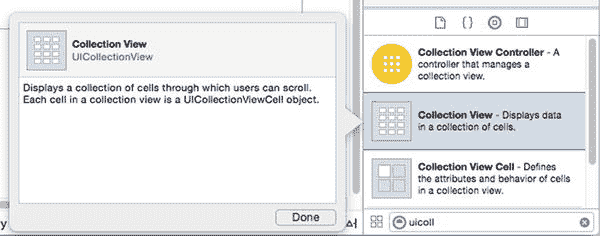

图 4-8.

对象浏览器中的 UICollectionView 对象 设置 AutoLayout 约束，以确保集合视图大小正确。通常集合视图会全屏显示，当然，通过使用适当的约束，它可以按任意大小放置在界面中。

通常情况下，集合视图的委托和数据源角色由拥有该场景的视图控制器承担。如果是这种情况，你可以在 Interface Builder 中直接连接它们。

在 Interface Builder 中选择集合视图，然后按住 Ctrl 键并向上拖动到对象树中的视图控制器对象。当鼠标光标悬停在视图控制器对象上时，该对象会高亮显示。松开鼠标按钮，将出现一个显示委托和数据源的弹出窗口，如图 4-9 所示。

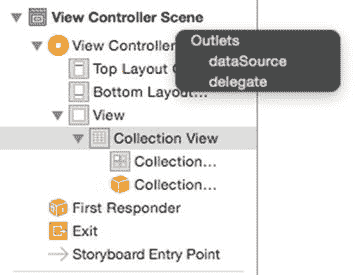

图 4-9.

连接委托和数据源 依次点击每个选项，将集合视图的委托和数据源连接到视图控制器。

**注意**

仅连接委托和数据源插座并不会实现集合视图工作所需的视图控制器功能。你需要负责确保该类实现了 `UICollectionViewDelegate` 和 `UICollectionViewDatasource` 协议中要求的方法。这在第 5 章中已有介绍。

#### 将 UICollectionView 添加为 Storyboard 场景

如果你有一个将全屏显示的 `UICollectionView`，则可以将其作为一个完整场景添加到 Storyboard 中。采用这种方法的好处是集合视图是场景的根视图，而不是父 `UIView` 的子视图。结构上的差异如图 4-10 所示。

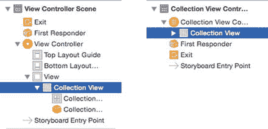

图 4-10.

比较子视图与完整场景

不过，采用此方法有一个前提条件：你需要拥有（或在尝试运行项目之前实现！）一个 `UICollectionViewController` 的子类，作为场景中所包含集合视图的委托和数据源。默认情况下，集合视图场景会假定其父类同时扮演这两个角色。

创建此 `UICollectionViewController` 子类的详细内容将在第 5 章中介绍。

将 `UICollectionView` 添加为完整场景有两个步骤。

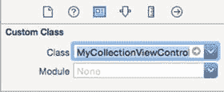

图 4-12.

更新类

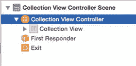

图 4-11.

选择集合视图控制器 从对象浏览器中选择集合视图控制器对象，然后将其拖入 Storyboard。这将添加包含集合视图的场景，如图 4-11 所示。更新场景的自定义类属性，使其属于你的 `UICollectionViewController` 类。如图 4-11 所示，在场景树中选择集合视图控制器，然后切换到工具面板中的标识检查器，并更新 `Custom Class` 字段，如图 4-12 所示。在此示例中，项目包含一个名为 `MyCollectionViewController` 的 `UICollectionViewController` 子类。


### 向项目中添加 `UICollectionViewController` 子类

为了加速创建 `UICollectionViewController` 子类的过程，Xcode 提供了一个预配置的模板。该模板会创建一个子类，其中包含存根的 `UICollectionViewDataSource` 和 `UICollectionViewDelegate` 方法，以及一个可选的包含集合视图本身的 XIB 文件。

要使用该模板创建 `UICollectionViewController` 子类，请按照以下步骤操作。

通过 `File` ➤ `New` ➤ `Cocoa Touch Class` 打开模板选择器，然后点击 `Next` 按钮（如图 4-13 所示）。

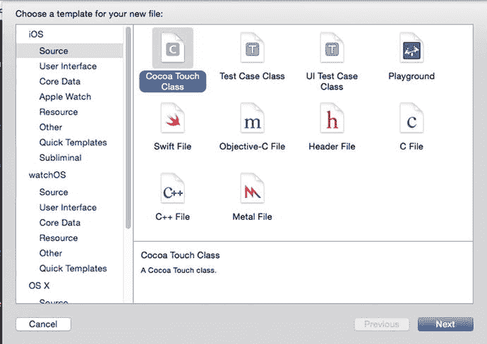

图 4-13. 模板选择器

为该类命名，并可选择勾选“Also create XIB file”选项（如果您希望模板为您创建 Interface Builder 文件，如图 4-14 所示）。

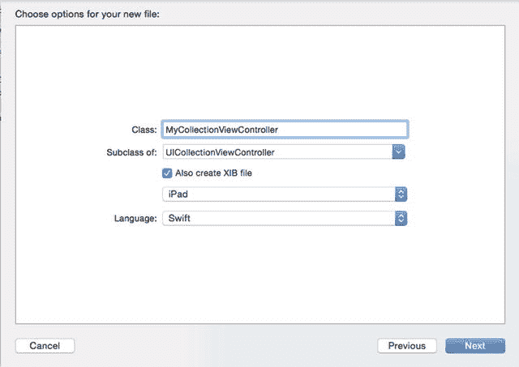

图 4-14. “Also create XIB file”选项

（毫不意外地）选择此选项将创建一个 XIB 文件，该文件已预先连接到新的 `UICollectionViewController` 子类。

点击 `Next` 来创建类及 XIB 文件，如图 4-15 所示。

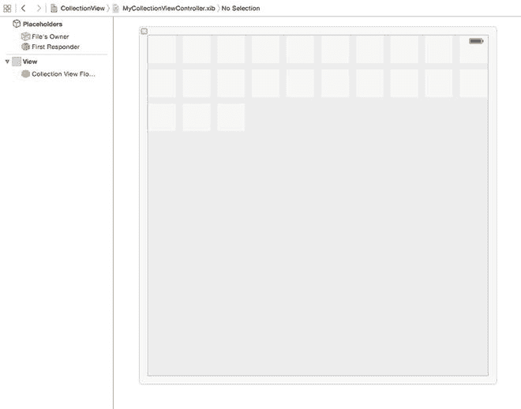

图 4-15. 生成的 XIB 文件

XIB 文件将自动命名。假设您的 `UICollectionViewController` 子类名为 `MyCollectionViewController.swift`，那么 XIB 文件将被命名为 `MyCollectionViewController.xib`。

创建的 XIB 文件中，集合视图的 `delegate` 和 `datasource` 属性已连接到父类，并包含一个占位的 `UICollectionViewFlowLayout` 对象。

在 `UICollectionViewController` 子类中，您将看到一些包含以下内容的占位代码：

*   一个用于单元格复用标识符的私有属性：`private let reuseIdentifier = "Cell"`
*   在 `viewDidLoad` 方法中，`collectionView` 使用该标识符注册 `UICollectionViewCell` 类：`self.collectionView!.registerClass(UICollectionViewCell.self, forCellWithReuseIdentifier: reuseIdentifier)`
*   创建了三个必需的 `UICollectionViewDataSource` 方法的基本实现，并带有有用的警告：
    ```
    override func numberOfSectionsInCollectionView(collectionView: UICollectionView) -> Int {
        // #warning Incomplete implementation, return the number of sections
        return 0
    }
    override func collectionView(collectionView: UICollectionView, numberOfItemsInSection section: Int) -> Int {
        // #warning Incomplete implementation, return the number of items
        return 0
    }
    override func collectionView(collectionView: UICollectionView, cellForItemAtIndexPath indexPath: NSIndexPath) -> UICollectionViewCell {
        let cell = collectionView.dequeueReusableCellWithReuseIdentifier(reuseIdentifier, forIndexPath: indexPath)
        // Configure the cell
        return cell
    }
    ```
*   在类的底部添加了已注释掉的 `UICollectionViewDelegate` 方法占位符。

这段占位代码足以让项目编译和运行，不过您需要在 `UICollectionViewDataSource` 方法中进行更新，才能在新建的集合视图中看到任何内容显示。

### 在代码中创建 `UICollectionView`

秉承“任何你能在图形界面完成的事情，都能在代码中完成”的理念，如果你更喜欢代码方式而不是图形界面方式，那么完全可以在代码中创建 `UICollectionView`。

假设您已经有一个 `UIViewController` 类，它将充当集合视图的 `delegate` 和 `datasource`，该过程分为五个步骤。清单 4-1 显示了一个示例，假设该类有一个名为 `myCollectionView` 的 `UICollectionView` 属性。

清单 4-1. 在代码中创建 `UICollectionView`

```
override func viewDidLoad() {
    super.viewDidLoad()
    let myFlowLayout = UICollectionViewFlowLayout()
    // Configure flow layout here…
    myCollectionView = UICollectionView(frame: view.frame, collectionViewLayout: myFlowLayout)
    myCollectionView.dataSource = self
    myCollectionView.delegate = self
    myCollectionView.registerClass(UICollectionViewCell.self, forCellWithReuseIdentifier: "ReuseIdentifier")
    view.addSubview(myCollectionView)
}
```

逐步解析如下：

*   创建并配置一个 `UICollectionViewFlowLayout`（集合视图布局将在第 15 章和第 16 章中介绍）。
*   创建流式布局后，`myCollectionView` 属性通过 `UICollectionView` 进行实例化。它使用刚刚创建的流式布局，并通过将其 frame 设置为与视图 frame 相同的尺寸来填充整个视图。
*   集合视图的数据源和委托连接到视图控制器（完成此操作后，您需要确保 `UIViewController` 实现了必需的 `UICollectionViewDataSource` 和 `UICollectionViewDelegate` 方法）。
*   `UICollectionViewCell` 类在集合视图中注册，并赋予一个单元格标识符，以便单元格可以创建和出队。
*   将集合视图添加到视图控制器的视图中。

## 总结

在本章中，您学习了 `UICollectionView` 及其构成元素。有了这些背景知识，您就可以开始在项目中构建和自定义集合视图了。

然而，这仅仅是个开始。在第 5 章中，您将学习如何将数据提供给集合视图，以便显示数据。在第 15 章和第 16 章中，您将学习如何构建集合视图布局来格式化和自定义显示的数据。第 17 章将介绍如何自定义集合视图单元格本身。

