# 5. 向视图提供数据

在处理表格视图和集合视图时，务必记住它们本身的能力非常有限。就像一架客机需要大量地勤人员（更不用说机组人员！）才能从停机坪起飞升空一样，`tableViews` 和 `collectionViews` 也需要其他对象的帮助与支持才能正常运行。

构建 `tableViews` 和 `collectionViews` 的主要部分之一就是让这些对象协同工作，因此本章涵盖以下内容：

*   视图从哪里获取数据，以及如何将数据传递过去
*   视图如何跟踪单元格和分区
*   初步了解视图如何处理交互
*   概述 `UITableView` 和 `UICollectionView` 类所采用的架构模式

本章的部分内容可能会显得有些抽象和理论化——但坚持阅读是值得的。培养 iOS 开发（尤其是 `tableViews` 和 `collectionViews`）的专业技能通常需要处理一些情况，在这些情况下您会想：“这到底是从哪冒出来的？”弄清楚那是什么以及它从哪里来的，通常需要理解 iOS 使用的设计模式——本章涵盖了其中的一部分。

## `UITableView`、`UICollectionView` 与委托

就其本身而言，`UITableView` 和 `UICollectionView` 是相当弱小的生物。虽然它们能处理单元格的显示和滚动任务，但几乎所有其他功能都需要依赖外部支持。

然而，这并非弱点。通过将其他功能的职责委托给外部对象，您最终会得到更模块化、更健壮且更易于调试的代码。这种职责转移的过程被称为**委托**。


### 理解委托

委托是一种应用设计模式，其中一个对象请求—或委托—另一个对象代为完成某项任务。

餐厅中的委托行为可以作为类比。你可以走到厨房亲自告诉厨师你想点什么菜，但在大多数餐厅中，你会将点餐任务委托给服务生。通知厨师你的订单这一过程仍然会完成，只是你委托给了其他人而已。

在餐厅里，你通常不会正式定义如何将事情委托给服务生。大家会心照不宣地默认他们会把你的订单送到厨房。但在软件领域，这样显然不够清晰，因此这些过程通常会在协议中明确说明。

你可以将协议视为非正式的契约，它定义了某一方将代替另一方执行哪些任务，并概述了双方之间如何交换信息。

通过遵守协议，其中一方（或对象，如果用软件术语思考的话）承诺会以正确的方式实现另一方所请求的任务。

图 5-1 展示了这种模式，它可能出现在以下几种场景中：

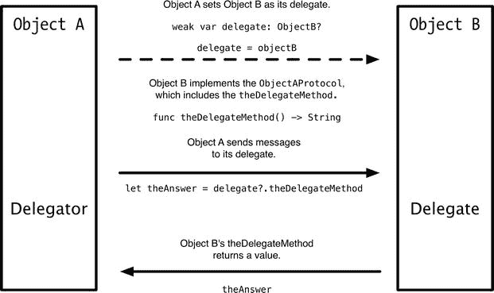

图 5-1. 委托模式

- 第一个对象通知第二个对象某个事件即将发生、正在发生或已经发生。
- 第一个对象向第二个对象请求输入。

这些描述相当枯燥，让我们来看几个例子。

### 委托示例：`collectionView(_:didSelectItemAtIndexPath:)`

当表格或集合视图中的某个项被选中时，它会调用其`delegate`的`collectionView(_:didSelectItemAtIndexPath:)`或`tableView(_:didSelectRowAtIndexPath:)`方法，并传入两个参数：对自身的引用（`collectionView`或`tableView`参数）以及选中项的`indexPath`。

然后，`delegate`可以对选择事件做出响应。它可以对调用它的视图执行一些操作、触发某些外部动作，或者完全忽略该消息。

例如，点击某个项通常会加载一个详情视图，因此`collectionView(_:didSelectItemAtIndexPath:)`方法可能类似于代码清单 5-1。

代码清单 5-1. `collectionView(_:didSelectItemAtIndexPath:)`方法示例

```
func collectionView(collectionView: UICollectionView, didSelectItemAtIndexPath indexPath: NSIndexPath) {
    let detailView = DetailViewController(nibName: "DetailViewController", bundle: nil)
    detailView.modalPresentationStyle = UIModalPresentationStyle.FullScreen
    detailView.selectedItem = self.dataModel[indexPath.row]
    self.presentViewController(detailView, animated: true, completion: nil)
}
```

### 数据源示例：`tableView:cellForRowAtIndexPath`

你之前已经多次见过`tableView(_:cellForRowAtIndexPath:)`方法。当`tableView`准备好显示某个单元格时，它会要求其`dataSource`为指定的`indexPath`返回一个`UITableViewCell`，以便该单元格可以在表格中显示。

`dataSource`对象会实现`tableView(_:cellForRowAtIndexPath:)`方法，如代码清单 5-2 所示。

代码清单 5-2. `tableView(_:cellForRowAtIndexPath:)`方法示例

```
func tableView(tableView: UITableView, cellForRowAtIndexPath indexPath: NSIndexPath) -> UITableViewCell {
    let cell = tableView.dequeueReusableCellWithIdentifier("cellIdentifier", forIndexPath: indexPath)
    // 此处将配置单元格属性
    return cell
}
```

所有这些的核心在于：通过分离功能，你可以将视图关注点与模型关注点分开，并使用控制器来协调两者。

**提示**：`UITableViewDataSource`和`UITableViewDelegate`都是委托协议的实例；只不过一个明确命名为委托，而另一个的名称略有不同。

### 设置委托

对象和委托并不会神奇地组合在一起。需要建立显式的连接。拥有委托的对象会有一个`delegate`属性，该属性可以在代码中设置。或者，你也可以使用 Interface Builder 以可视方式完成同样的操作。

对于表格和集合视图，你也可以使用 Interface Builder 来同时设置`delegate`和`dataSource`。按住 Ctrl 键单击`view`，然后将连接拖拽到文件所有者图标上。图 5-2 显示了如何在`tableView`上执行此操作。

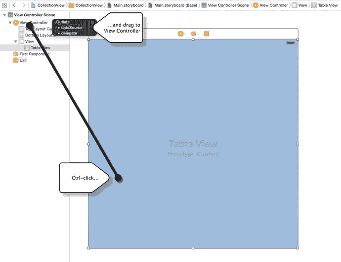

图 5-2. 在 Interface Builder 中连接`UITableView`的`dataSource`和`delegate`属性

通常情况下，视图的控制器类也会同时扮演`dataSource`和`delegate`的角色，尽管并没有规定必须如此。例如，如果有多个视图由同一个数据源提供，那么创建一个独立对象作为其中部分或全部视图的数据源可能更有意义。对于委托来说也是如此。

让一个对象及其委托良好协作起初可能会感觉有些复杂，因此值得快速了解一下具体做法。

### 将对象与委托连接起来

暂时回想一下我们之前提到的两个示例对象，如图 5-3 所示。

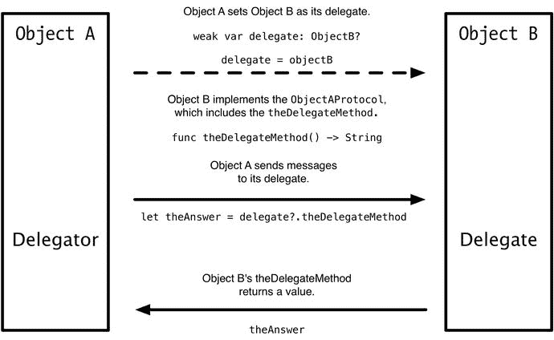

图 5-3. 再次展示委托模式

为了让`objectB`作为`objectA`的`delegate`，你需要某种方式将两者连接起来。这需要将`objectA`的`delegate`属性设置为指向其委托类的实例，在此例中即`objectB`。

如果`objectA`有一个名为`delegate`的属性，如下所示：

```
weak var delegate: ObjectB?
```

那么`objectA`可以将`objectB`的实例设置为委托：

```
delegate = objectB
```


### 委托与内存管理

这里有一个需要留意的微妙之处。尽管`objectA`是拥有`delegate`属性的对象，但`objectB`才是实际的委托对象。

这会导致一个与内存管理相关的有趣副作用，你需要牢记在心。虽然`objectB`已被设置为`objectA`的`delegate`，但如果`objectB`不再存在，`objectA`对此将毫无察觉。`objectA`仍会继续向其认为的`delegate`发送消息。

只要该委托对象存在，这显然不是问题。然而，如果`delegate`对象消失了，`objectA`就会向一个不存在的对象发送消息，从而导致程序崩溃。

解决此问题的方法是将委托属性声明为可选类型，并使用可选链式调用来调用委托方法。如果由于某种原因委托被设置为`nil`，调用将以静默方式失败，不会导致代码崩溃。

你可能已经注意到，`delegate`属性的声明方式与迄今为止你所设置属性的方式略有不同：

```
weak var delegate: ObjectB?
```

具体来说，它是一个`弱(weak)`属性。之所以使用`弱(weak)`（与`强(strong)`相对），是因为对象绝不能持有对其委托的强引用。如果这样做，你就有可能造成保留循环。

请考虑图 5-4 所示的情况：对象 `A` 有一个委托对象 `B`，它被引用为

```
var delegate: ObjectB
```

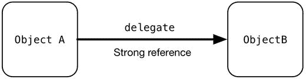

**图 5-4.** 强引用

如果对象 `B` 收到一个 `dealloc` 消息，它并不会被释放，因为它仍然被来自对象 `A` 的强引用所持有，如图 5-5 所示。

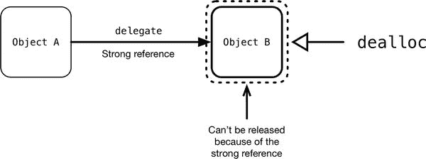

**图 5-5.** 收到 `dealloc` 消息之后

将此与图 5-6 中的情况进行比较，其中对象 `A` 对对象 `B` 有一个`弱(weak)`的可选引用。

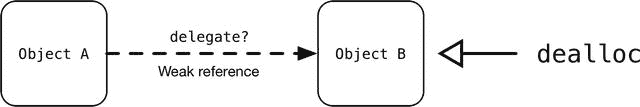

**图 5-6.** 弱可选引用

如果在这种情况下对象 `B` 收到一个 `dealloc` 消息，如图 5-7 所示，弱引用将允许它被释放。并且由于对象 `A` 将其作为一个可选属性来引用，对于对象 `A` 而言，该属性变为 `nil` 是完全合法的。

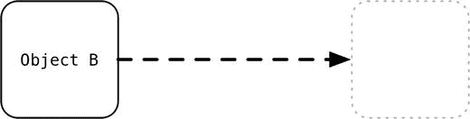

**图 5-7.** 释放后的弱引用

## 定义协议

方法在协议中进行定义，以便对象及其委托知晓各自期望实现和响应哪些方法。协议就是一个方法列表——有些是必需的，有些是可选的——这些方法是对象承诺要实现的方法。

如果协议方法是必需的，则采用该协议的对象必须实现它。否则，编译器会报错，项目将无法构建。可选方法，顾名思义，是可选的，因此如果缺少它们，编译器不会报错。

协议可以在独立的协议头文件中定义，也可以在类自身内部定义。在两种情况下，它们都被定义为一个方法列表，由 `@protocol` 编译器指令进行分隔。该列表分为 `@required` 和 `@optional` 两部分。

清单 5-3 显示了 `UITableViewDataSource` 协议的方法。（为节省空间，我删除了注释。）

**清单 5-3.** `UITableViewDataSource` 协议

```
protocol UITableViewDataSource : NSObjectProtocol {
    func tableView(tableView: UITableView, numberOfRowsInSection section: Int) -> Int
    func tableView(tableView: UITableView, cellForRowAtIndexPath indexPath: NSIndexPath) -> UITableViewCell
    optional func numberOfSectionsInTableView(tableView: UITableView) -> Int
    optional func tableView(tableView: UITableView, titleForHeaderInSection section: Int) -> String?
    optional func tableView(tableView: UITableView, titleForFooterInSection section: Int) -> String?
    optional func tableView(tableView: UITableView, canEditRowAtIndexPath indexPath: NSIndexPath) -> Bool
    optional func tableView(tableView: UITableView, canMoveRowAtIndexPath indexPath: NSIndexPath) -> Bool
    optional func sectionIndexTitlesForTableView(tableView: UITableView) -> [String]?
    optional func tableView(tableView: UITableView, sectionForSectionIndexTitle title: String, atIndex index: Int) -> Int
    optional func tableView(tableView: UITableView, commitEditingStyle editingStyle: UITableViewCellEditingStyle, forRowAtIndexPath indexPath: NSIndexPath)
    optional func tableView(tableView: UITableView, moveRowAtIndexPath sourceIndexPath: NSIndexPath, toIndexPath destinationIndexPath: NSIndexPath)
}
```

这告诉我们，尽管 `UITableViewDataSourceProtocol` 定义了众多方法，但为了使表格正常工作，只需实现其中两个方法即可。其余的都是可选的。

> **注意：** 严格来说，为了正常工作，一个`tableView`需要知道它有多少个分区。你会注意到 `UITableViewDataSource` 协议将 `numberOfSectionsInTableView` 列为可选方法，这似乎有点反直觉。`tableView` 通过以下方式处理这个问题：除非 `dataSource` 另有说明，否则它默认表格视图只有一个分区。

### 在 Xcode 中访问协议定义

当你在类中实现协议方法时，该方法必须严格按照协议中的定义来实现。这可能导致大量输入工作，因此直接从协议本身复制方法名称会容易得多（也更安全）。你将花费大量时间检查协议文档，这里有一种快速访问方法。如果你按住 Option 键，并将鼠标悬停在 Xcode 窗口中的协议名称上，光标将变为问号，名称变为超链接。单击该链接会弹出一个摘要窗口。

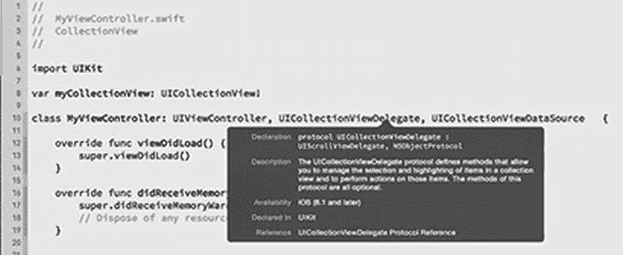

单击任何高亮显示的术语将打开 Xcode Organizer 中的帮助文件或相关的代码文件本身。

## 使用 UITableView 的委托方法

`UITableView` 和 `UICollectionView` 都使用委托模式从其 `dataSource` 获取数据，并处理用户交互和配置（见图 5-8 和 5-9）。尽管名称如此，但其 `dataSource` 是一种委托形式，只是具有特定的职责。

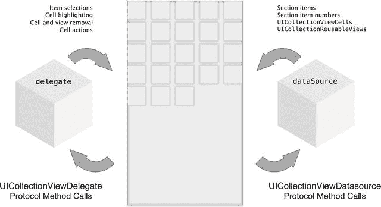

**图 5-9.** `collectionView` 如何与其委托和 `dataSource` 交互

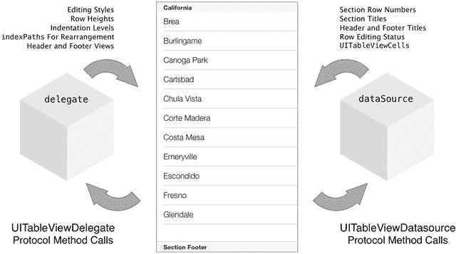

**图 5-8.** `tableView` 如何与其委托和 `dataSource` 交互

了解了视图如何使用委托模式后，你就可以开始详细研究 `dataSource` 和 `delegate` 是如何运作的。尽管过程相同，但 `UITableView` 和 `UICollectionView` 的委托协议是分开声明的，因此我们将依次查看每个协议。

## 使用 UITableViewDelegate 方法

`UITableViewDelegate` 处理以下事项：

- 配置 `tableView` 的行
- 配置分区的页眉和页脚
- 管理行的选择
- 编辑行
- 管理附件视图
- 重新排列行

表 5-1 显示了 `UITableViewDelegate` 协议中可用的方法。

**表 5-1.** `UITableViewDelegate` 协议方法


| 方法 | 用途 |
| --- | --- |
| 配置行 |
| `tableView(_:heightForRowAtIndexPath:)` | 返回以 `CGFloat` 表示的行实际计算高度。此方法会覆盖表视图中任何为行高度设定的全局值。 |
| `tableView(_:estimatedHeightForRowAtIndexPath:)` | 返回以 `CGFloat` 表示的行的预估高度。提供一个预估高度有助于加快表格的加载速度，因为表格在首次加载时需要计算所有单元格的总高度。将单元格高度的计算推迟到实际需要时才进行，意味着不会将时间浪费在计算尚未可见的单元格上。 |
| `tableView(_:indentationLevelForRowAtIndexPath:)` | 返回以 `Int` 表示的当前行的缩进级别。 |
| `tableView(_:willDisplayCell:forRowAtIndexPath:)` | 在表格即将显示该行的单元格时调用，用于告知委托。这提供了最后一次定制单元格设置（如选择状态或背景颜色）的机会。无返回值。 |
| 管理辅助视图 |
| `tableView(_:editActionsForRowAtIndexPath:)` | 返回该行可用的 `UITableViewRowActions`。如果你不重写此方法，单元格将显示标准的辅助控件。 |
| `tableView(_:accessoryButtonTappedForRowWithIndexPath:)` | 告知委托该行的辅助按钮已被点击。你通常会看到此方法用于推送一个新的视图，作为与该行数据模型元素相关的向下钻取详情视图。无返回值。 |
| 管理选中状态 |
| `tableView(_:willSelectRowAtIndexPath:)` | 告知委托该行即将被选中。由单元格内部的触摸抬起事件触发。它返回一个 `NSIndexPath`，表示表格应选中的行（可以在响应选择时选择另一行）。如果该行不应被选中，则返回 `nil`。 |
| `tableView(_:didSelectRowAtIndexPath:)` | 在行被选中后调用。如果一次只能选中一行，你可以使用此方法取消选中表格中的其他行。无返回值。 |
| `tableView(_:willDeselectRowAtIndexPath:)` | 在单元格即将被取消选中之前调用。如果你想取消选中另一行，则返回一个 `NSIndexPath`。如果你想阻止该行被取消选中，则返回 `nil`。 |
| `tableView(_:didDeselectRowAtIndexPath:)` | 在行被取消选中后调用。你可以使用此方法移除该行单元格上的任何选中指示器。无返回值。 |
| 管理分区页眉和页脚 |
| `tableView(_:viewForHeaderInSection:)` | 返回一个可选的 `UIView`，用作当前分区的页眉。 |
| `tableView(_:viewForFooterInSection:)` | 返回一个可选的 `UIView`，用作当前分区的页脚。 |
| `tableView(_:heightForHeaderInSection:)` | 返回以 `CGFloat` 表示的当前分区页眉的高度。 |
| `tableView(_:estimatedHeightForHeaderInSection:)` | 返回以 `CGFloat` 表示的当前分区页眉的预估高度。提供一个预估高度有助于通过加快整体内容高度的计算来提升表格性能。 |
| `tableView(_:heightForFooterInSection:)` | 返回以 `CGFloat` 表示的当前分区页脚的高度。 |
| `tableView(_:estimatedHeightForFooterInSection:)` | 返回以 `CGFloat` 表示的当前分区页脚的预估高度。提供一个预估高度有助于通过加快整体内容高度的计算来提升表格性能。 |
| `tableView(_:willDisplayHeaderView:forSection:)` | 告知委托页眉视图即将显示，允许在显示前进行最后一次定制。无返回值。 |
| `tableView(_:willDisplayFooterView:forSection:)` | 告知委托页脚视图即将显示，允许在显示前进行最后一次定制。无返回值。 |
| 管理行编辑 |
| `tableView(_:willBeginEditingRowAtIndexPath:)` | 告知委托表格即将进入编辑模式。表格的 `editing` 属性被设置为 `true`，并且该行会显示一个“删除”按钮。此方法让你有机会更新应用视图以处理模式变化。无返回值。 |
| `tableView(_:didEndEditingRowAtIndexPath:)` | 在表格退出编辑模式时调用。无返回值。 |
| `tableView(_:editingStyleForRowAtIndexPath:)` | 返回一个 `UITableViewEditingStyle`，用于控制单元格中显示的编辑控件。如果未实现此方法，控件默认为 `Delete`。 |
| `tableView(_:titleForDeleteConfirmationButtonForRowAtIndexPath:)` | 返回一个可选的 `String`，用作“删除”确认按钮的标题。此标题可以本地化。 |
| `tableView(_:shouldIndentWhileEditingRowAtIndexPath:)` | 返回一个 `Bool`，告知表格在编辑模式时是否应缩进单元格的背景。 |
| 重新排序单元格 |
| `tableView(_:targetIndexPathForMoveFromRowAtIndexPath:toProposedIndexPath:)` | 返回一个 `NSIndexPath`，指示在重新排序过程中应将单元格移动到的位置。 |
| 跟踪视图移除 |
| `tableView(_:didEndDisplayingCell:forRowAtIndexPath:)` | 在单元格已从表格中移除时调用。无返回值。 |
| `tableView(_:didEndDisplayingHeaderView:forSection:)` | 在页眉视图已从表格中移除时调用。无返回值。 |
| `tableView(_:didEndDisplayingFooterView:forSection:)` | 在页脚视图已从表格中移除时调用。无返回值。 |
| 复制和粘贴行内容 |
| `tableView(_:shouldShowMenuForRowAtIndexPath:)` | 返回一个 `Bool`，向表格视图指示是否应为此行显示编辑控件。如果你想阻止复制或粘贴此单元格，则返回 `false`。 |
| `tableView(_:canPerformAction:forRowAtIndexPath:withSender:)` | 返回一个 `Bool`，向表格视图指示是否应为此行启用“复制”或“粘贴”命令。 |
| `tableView(_:performAction:forRowAtIndexPath:withSender:)` | 当用户在单元格的编辑菜单中点击“复制”或“粘贴”时调用此函数。无返回值。 |
| `tableView(_:shouldHighlightRowAtIndexPath:)` | 返回一个 `Bool`，指示在响应触摸事件时是否应选中该行。如果你不重写此方法，默认值为 `true`。 |
| `tableView(_:didHighlightRowAtIndexPath:)` | 在该行被高亮时调用。无返回值。 |
| `tableView(_:didUnhighlightRowAtIndexPath:)` | 在该行高亮被移除时调用。无返回值。 |

### 使用 UICollectionViewDelegate 方法

`UICollectionViewDelegate` 处理以下事项：

*   管理单元格的选择
*   管理单元格的高亮
*   跟踪单元格和视图的插入与移除
*   提供转场布局
*   管理单元格的操作

表 5-2 展示了 `UICollectionViewDelegate` 协议中可用的方法。

表 5-2.


| 方法 | 用途 |
| --- | --- |
| **管理选中单元格** |
| `collectionView(_:shouldSelectItemAtIndexPath:)` | 返回一个 `Bool` 值，用于控制是否应选中该条目。默认返回值为 `true`。 |
| `collectionView(_:didSelectItemAtIndexPath:)` | 当集合视图中选中某个条目时调用。若通过编程方式选中条目，则不会调用此方法。无返回值。 |
| `collectionView(_:shouldDeselectItemAtIndexPath:)` | 返回一个 `Bool` 值，用于控制是否应取消选中该条目。默认返回值为 `true`。 |
| `collectionView(_:didDeselectItemAtIndexPath:)` | 当集合视图中取消选中某个条目时调用。若通过编程方式取消选中条目，则不会调用此方法。无返回值。 |
| **管理单元格高亮** |
| `collectionView(_:shouldHighlightItemAtIndexPath:)` | 返回一个 `Bool` 值，用于控制是否在触摸响应时高亮某个条目。默认返回值为 `true`。 |
| `collectionView(_:didHighlightItemAtIndexPath:)` | 当用户触摸导致条目高亮时调用（若通过编程方式高亮单元格，则不会调用此方法）。无返回值。 |
| `collectionView(_:didUnhighlightItemAtIndexPath:)` | 当条目不再高亮时调用。若通过编程方式移除高亮，则不会调用此方法。无返回值。 |
| **追踪视图的添加与移除** |
| `collectionView(_:willDisplayCell:forItemAtIndexPath:)` | 当单元格即将显示时调用。这是追踪单元格何时被添加到集合视图中的首选方式。不应在单元格内部进行追踪。无返回值。 |
| `collectionView(_:willDisplaySupplementaryView:forElementKind:atIndexPath:)` | 当补充视图即将显示时调用。这是追踪视图何时被添加到集合视图中的首选方式。不应在视图内部进行追踪。无返回值。 |
| `collectionView(_:didEndDisplayingCell:forItemAtIndexPath:)` | 当单元格从集合视图中移除时调用。这是追踪单元格何时从集合视图中移除的首选方式。不应在单元格内部进行追踪。无返回值。 |
| `collectionView(_:didEndDisplayingSupplementaryView:forElementOfKind:atIndexPath:)` | 当补充视图从集合视图中移除时调用。这是追踪视图何时从集合视图中移除的首选方式。不应在视图内部进行追踪。无返回值。 |
| **提供过渡布局** |
| `collectionView(_:transitionLayoutForOldLayout:newLayout:)` | 返回在从旧布局过渡到新布局时使用的自定义过渡布局。若未重写此方法，集合视图将使用标准的 `UICollectionViewTransitionLayout`。返回一个 `UICollectionViewTransitionLayout` 对象。 |
| **管理单元格操作** |
| `collectionView(_:shouldShowMenuForItemAtIndexPath:)` | 返回一个 `Bool` 值，指示是否应为该条目显示编辑菜单。默认返回 `false`。 |
| `collectionView(_:canPerformAction:forItemAtIndexPath:withSender:)` | 返回一个 `Bool` 值，指示是否可以对指定条目执行指定操作。默认返回 `false`。 |
| `collectionView(_:performAction:forItemAtIndexPath:withSender:)` | 对指定条目执行指定操作。 |
| **管理集合视图焦点** |
| `collectionView(_:canFocusItemAtIndexPath:)` | 返回一个 `Bool` 值，用于控制条目是否可以获得焦点。默认返回值为 `True`。 |
| `collectionView(_:shouldUpdateFocusInContext:)` | 返回一个 `Bool` 值，用于控制是否应发生给定上下文所指定的焦点更新。默认返回 `false`。 |
| `collectionView(_:didUpdateFocusInContext:withAnimationCoordinator:)` | 当提供的上下文中发生焦点更新时调用。无返回值。 |
| `indexPathForPreferredFocusedViewInCollectionView(_:)` | 返回在提供的集合视图中首选焦点视图的 `NSIndexPath`。 |

## 数据源

数据源在生命周期中扮演着相当直接的角色：它们提供数据及数据相关信息，并处理数据的操作。与 `delegates` 类似，`UITableView` 和 `UICollectionView` 的 `dataSource` 协议虽有相似之处，但也存在差异，因此我们将逐一探讨。

### `UITableView` 数据源

一个 `UITableView` 需要三项关键信息才能成功绘制自身及其单元格：

- 表格中的分区数量
- 分区中的行数
- 分区中每行所属的单元格

`dataSource` 的作用正是提供这些信息。

#### 获取表格中的分区数量

简单表格通常只有一个分区，因此除非实现了 `numberOfSectionsInTableView(_:)` 方法并返回不同值，否则表格视图会默认分区数为 1。

尽管 `numberOfSectionsInTableView(_:)` 是一个可选方法，但我倾向于始终实现它，以确保其存在。由于这是第一个被调用的方法，如果表格数据集为空，你也可以通过返回 `0` 来加快处理速度——此后 `tableView` 会认为不会再获取到额外数据，并停止询问。

#### 获取分区中的行数

假设有数据需要显示，则会调用 `tableView(_:numberOfRowsInSection:)` 方法。调用该方法的 `tableView` 会提供一个整数形式的分区编号，该方法则返回行数（同样为整数）。

#### 获取该分区该行所属的单元格

创建要显示的单元格是设置 `tableView` 的核心。每次调用 `tableView(_:cellForRowAtIndexPath:)` 方法时，你的代码都需要返回一个 `UITableViewCell` 实例供 `tableView` 显示。

`tableView` 会通过 `indexPath` 提供分区和行号，这取决于你的 `tableView(_:cellForRowAtIndexPath:)` 方法：从数据模型中检索数据、出列（dequeue）单元格、对其进行配置，并尽快将其返回。

#### 表格如何获取关键信息

涉及的四个对象——包含 `tableView` 的视图控制器、`tableView` 本身以及属于 `tableView` 的 `delegate` 和 `dataSource` 对象——之间的交互按特定顺序进行。如图 5-10 所示。

首先，视图控制器分配并实例化 `tableView`，然后设置 `delegate` 和 `dataSource` 属性。创建完成后，`tableView` 向 `dataSource` 请求自身包含的分区数，`dataSource` 以一个 `NSInteger` 值作为响应。接着，`tableView` 通过 `indexPath` 实例提供自身引用和分区编号，并向 `dataSource` 请求该分区中的行数。`dataSource` 再次以一个 `NSInteger` 作为响应。最后，`tableView` 通过 `indexPath` 对象提供自身引用和行号，并向 `dataSource` 请求该行对应的单元格。`dataSource` 以一个 `UITableViewCell` 实例作为响应。

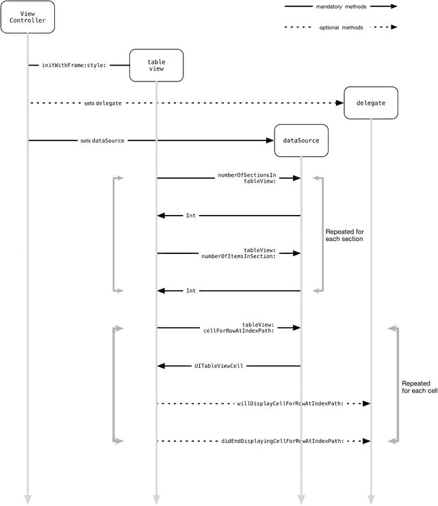

**图 5-10.** 视图控制器、tableView 和数据源之间的消息传递

当你的 `dataSource` 提供这三项信息后，`tableView` 就正式投入工作了。这三个方法以及其他八个 `dataSource` 方法均定义在 `UITableViewDataSource` 协议中。


### 与 Cell、Section 和 Row 相关的 UITableViewDataSource 方法

如表 5-3 所列，有三个主要方法负责提供这三类信息。其中两个方法是必需的。

**表 5-3.** UITableViewDataSource 协议中的 Cell、Section 和 Row 方法

| 方法 | 用途 | 是否必需？ |
| --- | --- | --- |
| `numberOfSectionsInTableView(_:)` | 返回一个 `Int` 值，表示表格视图中的分区数 | 否 |
| `tableView(_:numberOfRowsInSection:)` | 返回一个 `Int` 值，表示指定分区中的行数 | 是 |
| `tableView(_:cellForRowAtIndexPath:)` | 返回一个 `UITableViewCell` 实例，用于指定索引路径处的行 | 是 |

虽然 `tableView` 需要知道所需的分区数量，但默认值为 `1`，这就是为什么在简单表格中你经常会看到 `numberOfSectionsInTableView` 方法被省略的原因。

### 与标题和索引相关的 UITableViewDataSource 方法

有四个方法用于创建和管理表格的标题和索引。表 5-4 列出了这些方法。

**表 5-4.** UITableViewDataSource 协议中的标题和分区方法

| 方法 | 用途 |
| --- | --- |
| `tableView(_:titleForHeaderInSection:)` | 返回一个 `String` 值，表示指定分区的页眉标题 |
| `tableView(_:titleForFooterInSection:)` | 返回一个 `String` 值，表示指定分区的页脚标题 |
| `sectionIndexTitlesForTableView(:_)` | 返回一个可选的 `String` 类型 `Array`，包含索引列表的标题（例如 A、B、C、D 等），该列表显示在带索引表格的右侧 |
| `tableView(_:sectionForSectionIndexTitle:atIndex:)` | 返回一个 `Int` 值，表示给定标题和分区标题索引所对应的分区编号 |

### 与插入、删除和重排相关的 UITableViewDataSource 方法

其余 `UITableViewDataSource` 协议方法用于处理 `tableView` 中行的插入、删除和重排。表 5-5 列出了这些方法。

**表 5-5.** 与插入、删除和重排相关的 UITableViewDataSource 方法

| 方法 | 用途 |
| --- | --- |
| `tableView(_:canEditRowAt IndexPath:)` | 返回一个 `Bool` 值，取决于指定行是否被标记为可编辑。如果未实现此方法，则 `tableView` 默认所有行均可编辑。 |
| `tableView(_:canMoveRowAt IndexPath:)` | 返回一个 `Bool` 值，取决于指定行是否被标记为可在表格内移动。如果未重写此方法，默认值为 `false`。 |
| `tableView(_:moveRowAtIndexPath: toIndexPath:)` | 指示 `dataSource` 将一行从一个位置移动到另一个位置。如果希望更改持久化，此方法还需要更新底层数据模型。不返回值。 |
| `tableView(_:commitEditingStyle: forRowAtIndexPath:)` | 通过调用 `insertRowsAtIndexPath:withRowAnimation` 或 `deleteRowsAtIndexPath:withRowAnimation tableView` 方法，指示 `dataSource` 提交行的插入或删除操作。不返回值。 |

## UICollectionView 的数据源

`UICollectionView` 在成功绘制自身及其 Cell 所需的关键信息方面，其工作方式与 `UITableView` 非常相似。

具体来说，它需要：

*   集合视图中的分区数
*   每个分区中的项数
*   每个分区中每个项的 Cell

`UICollectionView dataSource` 的存在正是为了提供这些信息。

### 获取表格中的分区数

一个简单的集合视图只有一个分区，因此集合视图默认认为分区数为 1，除非实现了 `collectionView(_:numberOfSectionsInCollectionView:)` 方法并返回了不同的值。

尽管 `numberOfSectionsInCollectionView` 是一个可选方法，但我通常都会实现它，以便它始终存在。由于这是第一个被调用的方法，如果集合视图的数据集为空，你也可以通过返回 `0` 来加快处理速度——此后 `collectionView` 会认为不会再有额外数据，并停止请求。

### 获取分区中的项数

假设有数据需要显示，则会调用 `numberOfItemsInSection(:_)` 方法。调用该方法的 `collectionView` 会将分区编号以整数形式提供，而该方法则返回项数（同样以整数形式）。

### 获取属于该分区该行的 Cell

创建要显示的 Cell 是设置 `collectionView` 的核心。每当调用 `collectionView(_:cellForItemAtIndexPath:)` 方法时，你的代码需要返回一个 `UICollectionViewCell` 实例供 `collectionView` 显示。

`collectionView` 会将分区和行编号以 `indexPath` 形式提供，而你的 `cellForItemAtIndexPath` 方法需要从模型中检索数据、创建 Cell，并尽快返回它。

### 获取属于该索引路径的补充视图

尽管补充视图是可选的，但提供它们的方式与提供集合视图 Cell 的方式非常相似：它们是在响应集合视图的请求时出列的。

`collectionView` 会将分区和行编号以 `indexPath` 形式提供，同时还会提供所需的补充视图类型，而 `collectionView(_:viewForSupplementaryElementOfKind:atIndexPath:)` 方法则负责从模型中检索数据、创建并配置补充视图，并尽快返回它。

### 集合视图如何获取关键信息

涉及四个对象——包含 `collectionView` 的视图控制器、`collectionView` 本身，以及属于 `collectionView` 的 `delegate` 和 `dataSource` 对象——之间的对话按特定顺序进行。这如图 5-11 所示。

首先，视图控制器分配并实例化 `collectionView`，然后设置其 `delegate` 和 `dataSource` 属性。创建完成后，`collectionView` 向 `dataSource` 请求自身分区数，`dataSource` 以 `NSInteger` 值作为回复。然后，`collectionView` 在 `indexPath` 实例中提供自身引用和分区编号，并向 `dataSource` 请求该分区中的项数。`dataSource` 再次以 `NSInteger` 作为回复。接着，`collectionView` 在 `indexPath` 对象中提供自身引用和项编号，并请求 `dataSource` 提供该行的项。`dataSource` 以一个 `UICollectionViewCell` 实例作为回复。可选地，`collectionView` 提供自身引用、`indexPath` 对象中的项编号以及所需的补充视图类型，并请求 `dataSource` 提供该行的补充视图。`dataSource` 以一个 `UICollectionViewReusableView` 实例作为回复。

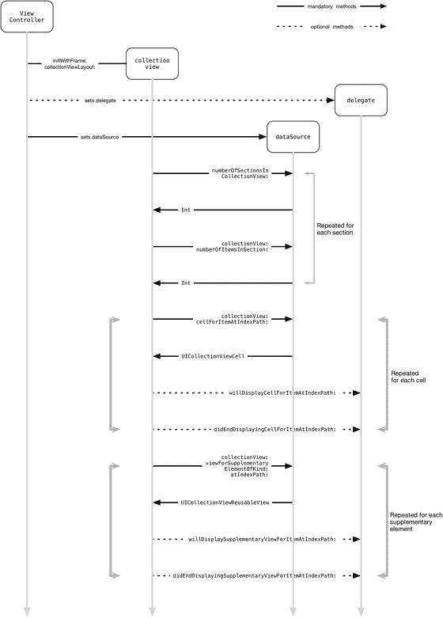

**图 5-11.** 视图控制器、collectionView 和数据源之间的消息传递

在你的 `dataSource` 提供了这些信息之后，你的 `collectionView` 就可以正常工作了。这三个方法在 `UICollectionViewDataSource` 协议中定义。

### 我应该使用哪种配置方法？

在 Cell 的生命周期中有两个时间点可以配置将要显示在表格中的 Cell：一是当它从数据源出列或创建时；二是就在它即将实际显示在集合视图中之前。


#### 数据源的 `cellForItemAtIndexPath:` 函数

`UICollectionViewDataSource` 的 `cellForItemAtIndexPath` 函数现在应该已经比较熟悉了——集合视图的 `datasource` 在此处通过复用先前创建的 cell，或从已注册的子类、原型或 XIB 中创建新的 cell，从而向集合视图返回一个 cell。

这是 cell 生命周期中第一个可以配置 cell 的位置——也是最常进行配置的位置。然而，此函数在 cell 显示之前被调用，尽管从出队到显示之间通常不会有太大的延迟。

作为经验法则，你应该使用此方法基于底层数据模型的单个属性来更新 cell 的内容——例如，字段或图像视图的内容。

#### 委托的 `willDisplayCellAtIndexPath:` 函数

`UICollectionViewDelegate` 的 `willDisplayCellForItemAtIndexPath:` 函数由 `collectionView` 在每个 cell 即将显示之前调用。这发生在 cell 绘制到集合视图之前，因此是在显示前调整 cell 内容的最后时机。

在此处更改 cell 内容是可能的，但有几点原因建议你仅进行小而具体的更改：

*   如果使用此方法更新 cell 内容，会模糊集合视图的 `dataSource` 与 `delegate` 对象之间的职责区分。这可能导致未来重构困难，并可能使代码变得混乱。
*   此函数在 cell 显示前被调用，因此如果执行缓慢，会对集合视图的滚动性能产生不利影响。

作为经验法则，你应将该函数的使用限制为基于选择更新 cell 内容，例如设置或移除复选框。

### 与 Cell、Section 和 Item 相关的 `UICollectionViewDataSource` 方法

表 5-6 列出了四个主要方法，它们负责提供这些信息。其中两个方法是必需的。

表 5-6. `UICollectionViewDataSource` 协议的 Cell、Section 和 Item 方法

| 方法 | 目的 | 返回类型 | 是否必需 |
| --- | --- | --- | --- |
| `numberOfSectionsInCollectionView(_:)` | 返回集合视图中的 section 数量 | `NSInteger` | 否 |
| `collectionView(_:numberOfItemsInSection:)` | 返回给定 section 中的 item 数量 | `NSInteger` | 是 |
| `collectionView(_:cellForItemAtIndexPath:)` | 为提供的索引路径下的 item 返回一个 `UICollectionViewCell` | `UICollectionViewCell` | 是 |
| `collectionView(_:viewForSupplementaryElementOfKind:atIndexPath:)` | 为提供的索引路径下的 item 返回一个用作补充视图的 `UICollectionReusableView` | `UICollectionReusableView` | 否 |

补充视图是可选的，仅当你的集合视图布局需要时才需要提供。

尽管 `collectionView` 需要知道所需的 section 数量，但默认值为 `1`，这就是为什么你常常会在简单的集合视图中看到 `numberOfSectionsInCollectionView` 被省略。

## 关于 `dataSource` 方法需要记住的一点

虽然表格视图和集合视图表面看起来很简单，但底层涉及大量操作。流畅且即时的滚动是良好用户体验的关键。例如，你会听到关于 iPad 竞争对手的主要抱怨之一就是它们的滚动存在卡顿和不流畅。

为了使视图能够平滑滚动，你的 `dataSource` 必须准备好随时按需提供数据。返回数据的延迟意味着绘制 cell 和更新视图布局的延迟——这会导致用户界面出现卡顿。

使数据立即可用可以有多种形式，缓存数据查询是一个明显的方法。无需多言，从网络源实时检索 `tableView` 或 `collectionView` 数据是一个非常糟糕的主意。

如果你的数据不能立即可用，可能有必要先提供占位信息，并在数据可用后稍后再回去更新缺失的值。

`UITableView` 有三组方法可用于此目的：`reloadData` 重新加载整个表格，而 `reloadRowsAtIndexPath` 更新特定行。`reloadSectionIndexTitles` 和 `reloadSections:withRowAnimation:` 更新指定的 section。

`UICollectionViews` 以非常类似的方式处理更新：`reloadData` 重新加载整个集合视图，`reloadSections:` 对特定 section 执行相同操作，`reloadItemsAtIndexPaths:` 重新加载多个特定 item。

## 实现 `dataSource` 和 `delegate` 协议

一种常见的模式是，负责显示表格或集合视图的视图控制器同时充当 `dataSource` 和 `delegate`，但请继续阅读本章，了解为什么这可能不总是一个好主意！

注意

本节中的所有内容同样适用于 `UITableView` 和 `UICollectionView`，因此 “表格视图” 也指代 “集合视图”，反之亦然。

为了使表格视图能够将某个类用作其 `dataSource` 或 `delegate`，该类必须遵循 `UITableViewDataSource` 和 `UITableViewDelegate` 协议。有两种方法可以实现这一点：第一种是在类的主体中声明其遵循性并实现必需的方法，如代码清单 5-4 所示。

代码清单 5-4. 充当 `UITableViewDataSource` 和 `UITableViewDelegate` 的示例类

```
class ViewController: UIViewController, UITableViewDataSource, UITableViewDelegate {

    // mark: -
    // mark: UIViewController methods

            // ...
            // UIViewController methods here
            // ...

    // mark: -
    // mark: UITableView methods

    func numberOfSectionsInTableView(tableView: UITableView) -> Int {
        ...
    }

    func tableView(tableView: UITableView, numberOfRowsInSection section: Int) -> Int {
        ...
    }

    func tableView(tableView: UITableView, cellForRowAtIndexPath indexPath:
    NSIndexPath) -> UITableViewCell {
        ...
    }
}
```

一种更符合 Swift 风格的方式是为 `UIViewController` 添加扩展，如代码清单 5-5 所示。

代码清单 5-5. 使用扩展实现协议

```
import UIKit

class ViewController: UIViewController {
    // ...
    // view controller methods here
}

extension ViewController: UITableViewDataSource, UITableViewDelegate {

    func numberOfSectionsInTableView(tableView: UITableView) -> Int {
        ...
    }

    func tableView(tableView: UITableView, numberOfRowsInSection section: Int) -> Int {
        ...
    }

    func tableView(tableView: UITableView, cellForRowAtIndexPath indexPath:
    NSIndexPath) -> UITableViewCell {
        ...
    }
}
```

以这种方式组织代码可以更清晰地区分 `UIViewController` 方法与 `dataSource`/`delegate` 函数——并且如果你稍后需要将这些函数重构到单独的类中，也会更加容易。


## 关于 `indexPath` 的一切

表格视图和集合视图利用 `NSIndexPath` 类的实例来描述其布局。从技术上讲，这些实例代表了嵌套数组集合中节点的路径。

然而，对于视图上下文中的 `NSIndexPath` 对象而言，这描述过于复杂，因此我倾向于用更简单的方式来理解它们。

就 `tableView` 而言，一个 `indexPath` 拥有两个属性：`section`（分区）和 `row`（行），如图 5-12 所示。这两个属性都是 `Int` 类型的实例。

`collectionView` 对 `indexPath` 的理解非常相似，但区别在于我们使用术语 `items`（项目）而不是 `rows`（行）。因此，在集合视图的上下文中，我们称之为 `itemAtIndexPath`，而不是 `cellAtIndexPath`。

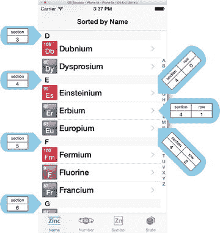

图 5-12. `indexPath` 的分区与行

如图所示，表格使用 `indexPaths` 来标识 `sections`（分区）和 `rows`（行）。iPhone 模拟器正在运行苹果的 The Elements 示例代码，并已滚动到以字母 D 开头的元素位置。

这些元素根据其首字母分组到不同的分区中。因为 D 是字母表中的第四个字母，所以以 D 开头的元素出现在分区 3（记住，`indexPath` 的编号与 `NSArray` 等一样，都是从 `0` 开始计数的）。

恰好有三个元素以字母 E 开头（包括名字奇特的 einsteinium——原子量 252，于 1952 年发现——这个应用有它的所有详细信息）。它们被放置在行 0、行 1 和行 2 中（同样，`indexPath` 的行号从 `0` 开始）。这样，表中的每一行都可以被唯一标识。以 einsteinium 为例，它在 `section == 3` 且 `row == 0` 的 `indexPath` 中。

创建 `indexPaths` 有些繁琐，因此 `UITableView` 类通过一个类别扩展了 `NSIndexPath`，提供了一些便捷方法来创建带有分区和行的 `indexPaths`。其中一个方法就是 `indexPathForRow:inSection`。清单 5-6 展示了一个（稍显刻意）的示例，说明如何定位到特定单元格。

清单 5-6. 定位特定单元格

```
func findEinsteiniumCellContents() {
    let einsteinIndexPath = NSIndexPath(forRow: 1, inSection: 3)
    let einsteinCell = tableView.cellForRowAtIndexPath(einsteinIndexPath)
    let elementName = einsteinCell?.textLabel?.text
    print("The element name is \(elementName)")
}
```

## 模型-视图-控制器设计模式

在外行人看来，在 Xcode 中打开的 iOS 应用程序就像是一堆混乱的代码。不过，只要稍微熟悉一下，就能辨别出应用程序的不同方面具有不同的功能。

在前端，用户界面负责向用户呈现信息并接收用户的输入。我们通常认为“用户”是指人类，但如果这个用户实际上是另一个系统（例如当界面是 API 时），这个类比也同样成立。

在幕后，几乎所有应用程序都包含某种形式的数据。有时这些数据来源于外部，例如网络浏览器显示的 HTML。其他情况下，数据由应用程序内部维护。存储应用状态（例如最高分）就是一个例子。

在这两者之间，你需要一些逻辑——即应用程序逻辑——来获取数据并呈现给用户界面，以及接收和处理用户的输入。你还需要逻辑来管理应用程序的内部状态。

这种“分工”已经被形式化为一种称为模型-视图-控制器模式的应用程序架构模式，如图 5-13 所示。它将应用程序分为三个区域：

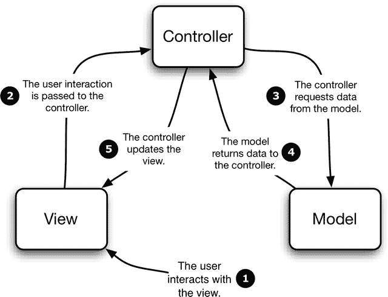

图 5-13. 模型-视图-控制器模式

*   **视图（Views）**：在 iOS 术语中，这些是在 Interface Builder 中或以编程方式在代码中创建的视图（或界面）。
*   **控制器（Controllers）**：控制器提供应用程序的内部逻辑。在 iOS 应用中它们往往更容易被识别出来，因为它们的名称通常类似于 `ScoreTableViewController`。
*   **模型（Models）**：模型管理应用程序中的数据。模型可以简单如一个包含一些 `NSStrings` 的 `NSArray`，也可以复杂如一个完整的 Core Data 配置。

粗略地说，控制器从模型中获取并处理数据，然后将数据传递给视图供用户使用。用户与视图进行交互，而这些交互的结果由控制器来处理。

人们提出了各种类比来说明模型-视图-控制器模式，但对我来说最贴切的是电影制作的过程。

在你去看电影之前，需要有人先写剧本。所以这个过程始于一位编剧在打字机上倾注心血，创作出剧本。这就是模型：它是数据源，这些数据之后将被用来创造电影体验。

为了让剧本活起来，你需要演员。（好吧，如果你考虑的是最新的皮克斯大片，这个类比有点站不住脚，但动画角色仍然需要声音，对吧？）他们就是视图，负责将剧本的数据呈现给观众（当然，是通过摄像机这个媒介）。

介于编剧和演员之间的那个人——在我们的编程类比中就是控制器——则是导演。导演负责解读剧本，并指导演员如何呈现它。

这个类比还可以更微妙一些。优秀的演员会遵循导演的指导并结合剧本的对白，加入自己的理解，从而将表演从呆板如树提升到能赢得奥斯卡奖的水平。

这就是界面发挥作用的地方。想想 iOS 界面优雅的渐变和微妙的阴影，对比那些……嗯，不那么优雅、不那么微妙的某些并非出自库比蒂诺设计的移动设备界面……


### 为何使用模型-视图-控制器模式？

起初，MVC 模式可能看起来像是不必要的复杂化，特别是对于小型应用而言。但以这种方式思考并构建应用会带来一些好处：

- **模块化**：应用的每个功能元素各自管理其关注领域。模型处理数据的读写，而视图负责呈现信息。这意味着对一个功能元素的更改不一定影响其他元素。例如，你可以完全更换底层数据库引擎，而视图保持不变。
- **多视图**：考虑 iPhone 和 iPad 用户界面的差异。如果你的应用逻辑嵌入在视图中，你就需要创建两套——一套针对 iPhone 的小屏幕，另一套针对 iPad 的大屏幕。坚持使用 MVC 模式，同一组模型和控制器可以为两种界面版本提供数据。
- **高效性**：分离应用的不同层可以支持诸如线程化和后台处理等技巧。例如，你可以在视图仍在加载时就启动数据检索过程，以充分利用 iOS 设备的多任务处理能力。
- **可测试性**：通过将应用分解为独立区域，你可以分别测试每个部分。如果一个 `tableView` 依赖于一个 `dataSource`，作为测试该表过程的一部分，你可以用一个返回已知值的“替身”对象来替代数据源。这意味着你可以更轻松地定位任何错误的源头。
- **可复用性**：如果你的应用涉及多个表格或集合视图，可以通过创建一个单一的 `dataSource` 或 `delegate` 来服务多个视图，从而减少代码和功能的重复。单个视图所需的大部分支持框架将与其他视图共用。更少的代码意味着更少的错误来源，也更易于维护。

### MVC 与 iOS

iOS 是一个以模型-视图-控制器为中心的框架，尽管与许多 SDK——特别是 Web 框架——相比，iOS 的 MVC 特性有时有些隐蔽。如果你是从 Rails 或 Django 等 Web 框架转向 iOS 的，这一点会尤为明显。这些框架使每一层的分离非常清晰，它们各自在一组名为 `models`、`views` 和 `controllers` 的独立目录中拥有文件集。

另一方面，iOS 则更为微妙。你可以使用 XIB 文件创建视图，这些显然是视图。但你也可能通过在视图控制器内编写代码以编程方式创建视图，此时事情就开始变得可能令人困惑了。类似地，一个 `tableView` 或 `collectionView` 的数据来自模型，但这个模型可能像 Core Data 管理的 SQLite 数据库那样“抽离”，也可能像在视图控制器内的 `viewDidLoad` 方法中创建的 `Array` 那样“内嵌”！

在 iOS 世界中保持 MVC 清醒头脑的关键是记住 MVC 是一个概念性框架，而不是像一组目录这样更绝对的事物。如果你记住表格的数据来自模型，而那个模型实际上就是前面提到的 `Array`，你仍然是在以 MVC 的方式思考（并工作）。

### MVC、tableViews 和 collectionViews

现在显而易见的问题是：“MVC 如何与表格和集合视图搭配？”

幸运的是，答案相对直接。表格或集合视图本身是视图。它呈现用户界面并拦截用户交互，如点击和滑动操作。

表格或集合视图呈现的数据来自模型。如前所述，这可能简单到如你加载视图时创建的一个单一的 `Array`，或者涉及 Core Data 或从外部网络源获取的信息等更复杂的内容。

控制器元素是充当 `tableView` 或 `collectionView` 的 `delegate` 和 `dataSource` 的对象。`delegate` 接收来自表格或集合视图的消息，并处理诸如用户点击项目或滑动单元格等事件。`dataSource` 通过从模型检索数据来“喂给”表格或集合视图其数据。

### 改进应用结构

如果一个视图控制器同时也充当表格或集合视图的 `datasource` 和 `delegate`，它可能会迅速膨胀到你开始遭受“巨量视图控制器”综合症的程度。视图控制器增长到数百行代码并不罕见（我见过最大的一个记录是 6500 行，我想明确指出，我并不是导致它变得那么大的责任人！）

巨型视图控制器会因多种原因给项目带来问题：它们违反了面向对象设计的“单一职责原则”；它们难以测试；它们增加了源代码控制冲突的风险；并且如果它们太大，当你尝试编辑时，它们可能会直接导致 Xcode 崩溃。

因此，将你的大型类拆分成更小的类有助于防止这些问题的部分或全部。

#### 如何拆分数据源和委托

因为你负责连接表格和集合视图与它们的 `datasource` 和 `delegate`，所以你不局限于只使用管理视图层次结构中表格或集合视图的视图控制器。

假设你一开始将 `datasource` 和 `delegate` 方法放在视图控制器中，那么分离它们需要以下步骤：

##### 第 1 步：创建一个单独的类

首先创建一个单独的类。我通常将其命名为类似 `ContactsTableHelper` 这样的名称，以明确它与哪个表格协作，并且它同时充当 `datasource` 和 `delegate`。

接下来，将 `datasource` 和 `delegate` 方法移入这个新类。你需要声明新类将遵循 `dataSource` 和 `delegate` 协议；并从视图控制器中移除这些：

```
class TableViewHelper : NSObject, UITableViewDataSource, UITableViewDelegate {

}
```

##### 第 2 步：将表格视图链接到新类

创建新类后，你需要将表格视图连接到它。如果你是以代码方式创建链接的，则需要通过为新类添加一个属性来更新：

```
let tableViewHelper = TableViewHelper()
```

然后，你可以将 `tableView` 的 `dataSource` 和 `delegate` 属性从

```
tableView.dataSource = self
tableView.delegate = self
```

更新为

```
tableView.dataSource = tableViewHelper
tableView.delegate = tableViewHelper
```

如果你是以可视化方式建立连接的，过程略有不同。首先，在你的 Storyboard 中，你需要从对象浏览器中拖拽一个 `Object` 占位符到左侧的视图层次结构中，如图 5-14 所示。

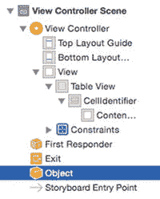

图 5-14. 添加对象占位符

选中新的 `Object` 占位符后，切换到 `Identity` 检查器，并将其 `Class` 值更新为 `TableViewHelper`，如图 5-15 所示。

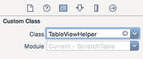

图 5-15. 更新类

现在你可以通过按住 Ctrl 键在 `tableView` 上点击，并拖拽到 `TableViewHelper` 占位符上来连接 `tableView` 的 `dataSource` 和 `delegate` 属性，如图 5-16 所示。

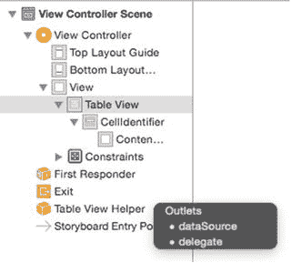

图 5-16. 重新连接 dataSource 和 Delegates

一旦连接完成，这将在加载表格时懒加载一个 `TableViewHelper` 类的实例，并将其用作表格视图的 `dataSource` 和 `delegate`，而不是视图控制器。


## 总结

本章涵盖了大量相当抽象的概念性内容，但所有概念都以某种方式与表格和集合视图相关联。由`tableView`或`collectionView`显示的数据由`dataSource`提供，而用户与视图的交互则由`delegate`处理。这两者都是委托设计模式的例子，而`tableView`或`collectionView`、其控制器以及底层数据之间的分工，正是模型-视图-控制器架构模式的实际体现。

`dataSource`和`delegate`函数均由各自的协议定义：`UITableViewDataSource`、`UITableViewDelegate`、`UICollectionViewDataSource`和`UICollectionViewDelegate`。构建`tableViews`和`collectionViews`的过程，就是实现（至少是）必需方法，并且通常还要实现一些可选方法的过程。

了解了数据的来源以及视图如何处理交互，你就可以深入细节，开始定制化的过程了。

