# 6. 表格单元格的构成

在本章中，你将详细研究表格单元格及其工作原理。为了能够对它们进行自定义，理解单元格的结构以及它们是如何被创建和复用的至关重要。

你将看到以下内容：

- 表格单元格的内部结构
- `UITableView`免费提供的标准单元格类型
- 如何创建原型单元格
- 默认单元格内容的配置
- 辅助视图的使用
- 单元格创建和回收的工作机制

这涵盖了创建默认样式单元格并对其进行基本配置所需了解的所有内容。配置单元格通常涉及知道何时干预创建和复用过程。稍后在第 7 章和第 8 章中，你将在创建自定义单元格时以此为基础进行构建。

## 理解`UITableViewCell`的结构

关于`UITableViewCell`，首先需要记住的是它们是`UIView`对象。`UITableViewCell`类继承自`UIView`，这意味着`UIView`的功能在`UITableViewCell`中同样可用。图 6-1 显示了`UITableViewCell`的类层次结构。

因为`UIView`又继承自`UIResponder，所以这也意味着可以通过手势与单元格进行交互。在第 9 章中，我将向你展示由此带来的一些效果。

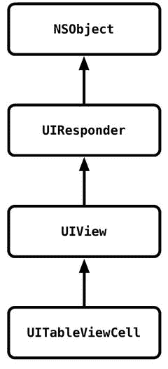

**图 6-1.** `UITableViewCell`的类层次结构

### 单元格的基本结构

标准的单元格由五个组成部分构成，如图 6-2 所示。

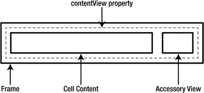

**图 6-2.** 普通模式下单元格的基本布局

- 描述单元格位置和大小的框架和边界
- 背景，将在下一节中介绍
- 单元格内容
- 可选的辅助视图
- 一个自动放置的编辑控件，当单元格处于编辑模式时出现

单元格的内容可以通过`contentView`属性整体访问，该属性是一个`UIView`。你可以添加和移除子视图，`contentView`会自动调整布局以便为编辑控件腾出空间。

当切换到编辑模式时，单元格的`contentView`宽度会减少约 40 点，并且在左侧插入一个编辑控件，如图 6-3 所示。

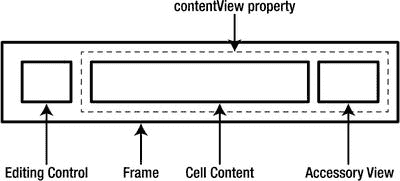

**图 6-3.** 编辑模式下单元格的基本布局

编辑控件可以是绿色的插入控件或红色的删除控件。

**注意：** 在设计将要被编辑的自定义单元格时，确保内容视图的布局能够应对自动调整大小非常重要。第 8 章将涵盖此主题。

### 单元格的背景视图

单元格有多个背景视图，它们沿着 Z 轴“堆叠”，如图 6-4 所示。

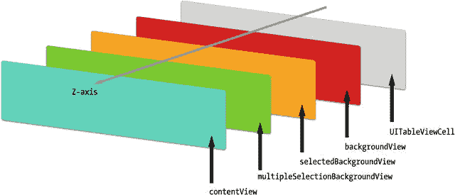

**图 6-4.** 背景视图

上层视图中的不透明内容会遮挡下层视图的内容，而空视图实际上是不可见的。两个选择背景视图，`selectedBackgroundView`和`multipleSelectionBackgroundView`，通常其 alpha 属性为`0`；当单元格被选中或取消选中时，该值会在`0`和`1`之间切换。

要添加特定的背景视图，你首先需要创建它，然后将其添加到相应的单元格属性中。例如，以下代码片段将创建一个青色背景：

```
let backgroundView = UIView(frame: cell.frame)
backgroundView.backgroundColor = UIColor.cyanColor()
cell.backgroundView = backgroundView
```

你也可以使用这种方法添加图像作为背景：

```
if let selectedImage = UIImage(named:"selectedBg") {
    cell.selectedBackgroundView = UIImageView(image: selectedImage)
}
```

当单元格被选中和取消选中时，该图像会相应地显示或隐藏。

由于背景视图沿 Z 轴排列，因此务必将自定义控件仅添加到单元格的`contentView`中。如果将其直接添加到单元格本身，它们可能会被某个背景视图遮挡，从而导致结果不一致。此外，当表格进入编辑模式时，单元格的`contentView`可能会因显示单元格内编辑控件而调整大小，这也可能引起布局问题。

**警告：** 尽管 iOS 设备的图形处理器功能强大，但合成单元格中的各个图层仍会带来一些开销。当处理具有透明度的图层（例如背景图像）时尤其如此。基本上，图层中的透明区域越多，合成速度就越慢。

为了使表格视图尽可能高效，务必在可能的情况下尽量减少透明度。这一点将在第 8 章中更详细地介绍。

### 内容和辅助视图

内容和辅助视图是`UIView`的实例，这意味着它们拥有“普通”`UIView`的所有属性和方法。当你继续创建自定义单元格时，将会利用这些属性和方法。

## 设计原型单元格

在表格视图的数据源能够创建单元格之前，你需要构建原型。你可以将这些原型视为创建新单元格的模板。

在简单的情况下，使用`UITableView`免费提供的四种标准单元格类型中的一种或几种可能就足够了。随着应用界面的日益复杂，标准类型可能不够用，你需要创建自定义单元格。自定义单元格的流程将在第 8 章中详细介绍。

即使你只打算使用标准单元格，理解创建其原型的选项仍然很重要。你有三种选择：

- 在单独的 XIB 文件中直观地创建单元格，每种单元格类型对应一个文件
- 在 Storyboard 中直观地布局单元格
- 在代码中，通过创建标准单元格类型的实例并更新单元格内控件

这三种方法虽然不同，但最终结果相同，因此选择哪种方法很大程度上取决于个人偏好。我们将逐一介绍每种方法。


### 本章代码

本章示例应用采用标签式界面布局，每个标签分别展示一种不同的单元格创建技术所实现的表格。每个视图控制器都已预先接入基础数据集，方便您将其作为自定义开发的起点。

### 在 XIB 文件中创建原型单元格

此方法需在独立的 `XIB` 文件中创建原型单元格，然后在配置表格视图时，将 `XIB` 文件与一个单元格标识符关联起来。

**注意：** 使用 XIB 文件创建原型单元格的表格，会在示例应用的“XIB 表格”标签页中显示。该标签页对应的视图控制器为 `XibTableViewController`。所有相关的源文件和 XIB 文件均可在 Xcode 的 `基于 XIB 的表格单元格` 文件夹中找到。

当表格视图被设置时，`XIB` 文件会被加载并“初始化”以创建原型实例。数据源随后可通过访问这些实例的数据接口，并使用单元格模型中的值进行设置。

整个过程包含五个步骤：

-   创建 `XIB` 文件
-   将单元格对象添加到 `XIB` 文件中
-   布局原型单元格
-   在配置表格视图时，将 `XIB` 文件注册为一个单元格标识符
-   在数据源方法中创建并配置单元格实例

使用此技术，您可以创建包含多种类型单元格的表格，只需为每种不同单元格重复上述流程，并赋予其不同的标识符即可。然后，在 `tableView` 的 `dataSource` 中，您可以根据表格模型中的数据，出列并配置相应的单元格类型。

#### 创建 XIB 文件

创建一个新的 `XIB` 文件并不复杂：选择 **文件** ➤ **新建** ➤ **文件** 菜单项，然后从“用户界面”部分选择“Empty”选项，如图 6-5 所示。

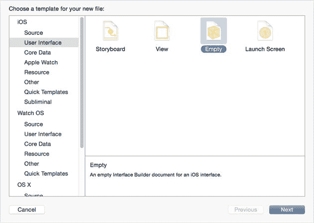

图 6-5. 创建新的 XIB 文件

为文件命名（此处命名为 `XibCell.xib`），然后点击“创建”按钮。

#### 将单元格对象添加到 XIB 文件中

有了一个空的 `XIB` 文件后，您现在就可以添加表格视图单元格了。从“对象浏览器”中选择 `Table View Cell` 对象，如图 6-6 所示，并将其拖拽到画布中。

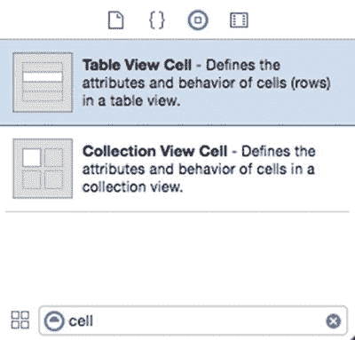

图 6-6. `Object Browser` 中的 `Table View Cell` 对象

现在，您已经将一个空的定制样式 `UITableViewCell` 添加到了 `XIB` 文件中，它看起来会像图 6-7 所示。

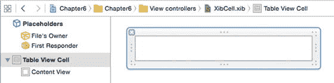

图 6-7. 画布中的新单元格

#### 布局原型单元格

至此，您可以开始配置其布局了。关于创建定制单元格的详细信息，将在第 7 章中讲解。如果您只需要四种标准单元格类型之一，可以通过在“属性检查器”的“样式”下拉菜单中选择来快速切换，如图 6-8 所示。

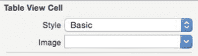

图 6-8. 选择单元格样式

这将把单元格转换为四种标准类型之一。关于如何访问每种标准样式中数据接口的更多细节，将在本章后续部分介绍。现在，请选择 `Basic` 类型，这样您会得到一个包含内置 `Title` 标签的单元格。

您还需要设置单元格的 `Identifier`，稍后将用它来向表格标识该单元格。这是一个任意的 `String` 值，但很重要！请将其设置为一个描述性的值，因为它将是表格视图连接 XIB 文件和单元格对象的桥梁，您将在下面看到这一点。在示例项目中，我将其设置为 `MyXibCell`，并创建了一个属性：

```
let kCellIdentifier = "MyXibCell"
```

#### 告知表格视图有关 XIB 的信息

单元格创建完成后，您需要通知表格视图，它将从一个 XIB 文件中加载其原型单元格。这必须在数据源尝试从表格中出列单元格之前完成，因此，设置此信息的一个好位置是在视图控制器的 `viewDidLoad` 方法中。

将以下代码添加到 `XibTableViewController` 的 `viewDidLoad:` 方法中：

```
tableView.registerNib(UINib(nibName: "XibCell", bundle: nil), forCellReuseIdentifier: "MyXibCell")
```

这里，您是在通知表格视图，对于标识符为 `MyXibCell` 的单元格，应使用 `XibCell` nib 文件的内容。表格视图将期望 XIB 文件中的顶层对象是 `UITableViewCell` 或 `UITableViewCell` 的子类实例。

如果您有多个单元格类型，可以通过重复此过程将它们与表格视图关联起来，每次记得提供适当（且唯一）的单元格标识符。

#### 创建并配置单元格

在将单元格类型注册到表格视图后，接下来需要更新 `cellForRowAtIndexPath:` 方法，以出列并配置这些单元格。

这与您在前几章中看到的过程没有显著区别：使用正确的标识符出列单元格，配置它，然后将其返回给表格视图。

假设您正在使用由 `MyXibCell` 标识符标识的 `XibCell` XIB 文件，代码将类似于代码清单 6-1。

**代码清单 6-1.** `cellForRowAtIndexPath:` 方法

```
func tableView(tableView: UITableView, cellForRowAtIndexPath indexPath: NSIndexPath) -> UITableViewCell {
    let cell = tableView.dequeueReusableCellWithIdentifier("MyCellIdentifier", forIndexPath: indexPath)
    // 配置单元格...
    cell.textLabel!.text = tableData[indexPath.row]
    return cell
}
```

如果您在 XIB 中添加了标准单元格类型，那么出列时所有控件都已就绪，您可以在 `cellForRowAtIndexPath:` 方法中像往常一样进行配置。配置定制单元格的详细信息将在第 8 章中介绍。

### 在故事板中创建原型单元格

通过可视化方式布局单元格的设计会更加容易。在上一节中，您了解了在独立 XIB 文件中进行此操作的过程，但如果您愿意，也可以在故事板中完成完全相同的操作。

当您在故事板中查看 `UITableView` 时，您会看到它自带一个用于原型内容的空区域，如图 6-9 所示。

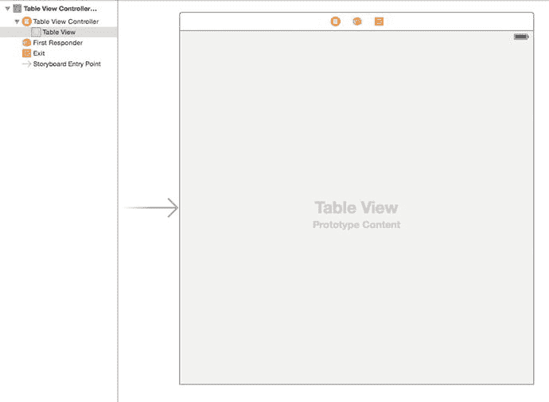

图 6-9. 原型内容区域

正如其名，您可以在此区域创建原型单元格，随后由表格的 `dataSource` 进行实例化和出列。

您可以使用此技术创建一个或多个原型单元格。主要的限制是，如果您拥有的单元格数量超过了故事板 `Table View` 所能容纳的限度，管理起来可能会变得有些笨拙。在这种情况下，使用独立的 XIB 文件可能是更好的选择。


### 创建原型单元格

要添加原型单元格，请先选中故事板中的`Table View`，然后切换到属性检查器，如图 6-10 所示。在顶部区域，你会看到一个下拉菜单，可以在动态原型和静态单元格之间切换（创建静态表格视图的内容将在第 13 章中介绍）。

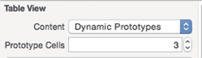

图 6-10. 选择动态原型的数量

其下方是故事板中包含的原型单元格数量。如果增加此数值，你会看到`Table View`中新增了单元格，每个单元格都带有一个空的`Content View`。

在图 6-11 中，可以看到有三个原型单元格（由于默认内容视图背景为白色，除非查看对象层级，否则不一定能立刻看清表格中有多少个单元格）。

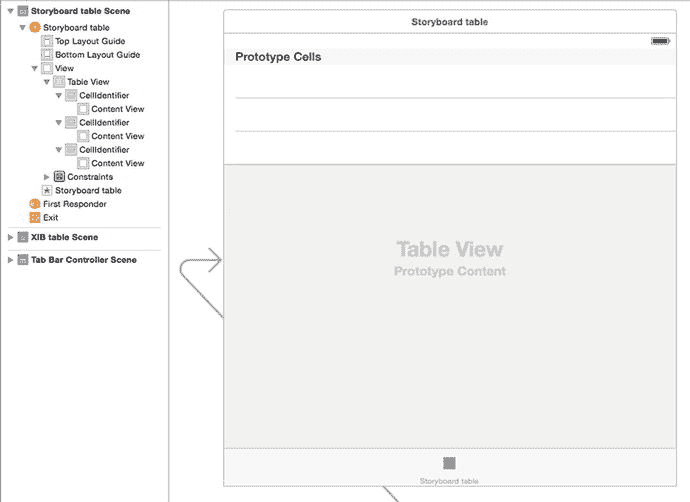

图 6-11. Table View 中的原型单元格

### 设置原型单元格

添加原型单元格后，你就可以开始配置它们了。默认情况下，它们在故事板中以自定义单元格类型的实例出现，但你可以通过选中对象层级中的`Table View Cell`，然后从属性检查器的“样式”下拉菜单中选择不同样式来更改。

这会更新故事板中的原型单元格。在图 6-12 中，有五个原型，其类型（从上到下）分别为：基本、右侧详情、左侧详情、副标题和自定义。在示例项目的截图中，单元格标识符已更新以匹配单元格类型，你将在下一节中执行此操作。

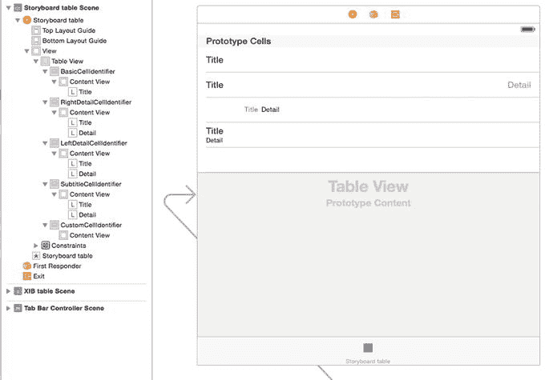

图 6-12. 包含五个原型单元格的 Table View

如你所见，标准单元格类型在故事板中会显示其控件。你可以选中它并通过在属性检查器中设置值来更改其样式。

### 告知表格视图关于原型单元格的信息

为了使表格视图能够使用原型单元格，你必须提供一种方式来引用特定索引路径值应使用哪个单元格。

这是通过在故事板中设置原型单元格的`identifier`属性来实现的。当出队一个单元格时，`dataSource`将自动从故事板中检索具有匹配标识符的原型。

要设置原型的标识符，请选中层级中的`Table View Cell`对象，如图 6-13 所示。

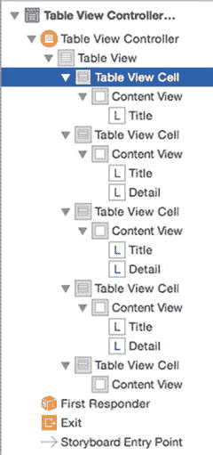

图 6-13. 选中原型单元格

然后在属性检查器中更新`标识符`字段，填入复用标识符，如图 6-14 所示。

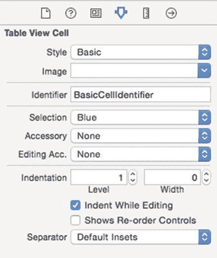

图 6-14. 更新原型单元格的标识符

这还会更新对象树中单元格的名称，如图 6-15 所示。

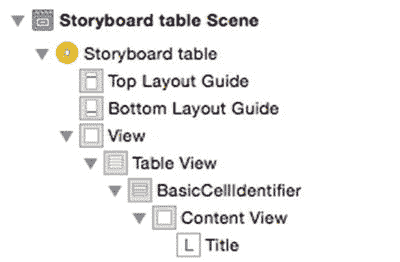

图 6-15. 更新后的原型单元格

示例应用将为每种单元格类型创建一行，因此你可以将其用作源数据。向视图控制器添加一个`tableData`属性：

```swift
var tableData = [String]()
```

现在将代码清单 6-2 作为视图控制器的扩展添加进去。

**代码清单 6-2.** 视图控制器扩展

```swift
extension StoryboardTableViewController {
    func setupTable() {
        tableData.append("BasicCellIdentifier")
        tableData.append("RightDetailCellIdentifier")
        tableData.append("LeftDetailCellIdentifier")
        tableData.append("SubtitleCellIdentifier")
        tableData.append("CustomCellIdentifier")
    }
}
```

最后，在`viewDidLoad()`函数中调用`setupTable()`函数：

```swift
override func viewDidLoad() {
    super.viewDidLoad()
    setupTable()
}
```

### 创建和配置单元格

设置好单元格标识符后，`cellForRowAtIndexPath:`方法现在就能够从你的原型中创建实例了。关键在于使用单元格的`Identifier`属性来创建（或出队）正确的原型，然后按照常规方式从数据模型中配置单元格。

代码清单 6-3 展示了如何为你新创建的`BasicCellIdentifier`类型单元格执行此操作。

**代码清单 6-3.** `cellForRowAtIndexPath:`方法

```swift
override func tableView(tableView: UITableView, cellForRowAtIndexPath indexPath: 
NSIndexPath) -> UITableViewCell {
    let cellIdentifier = tableData[indexPath.row]
    let cell = tableView.dequeueReusableCellWithIdentifier(cellIdentifier, 
    forIndexPath: indexPath) as! UITableViewCell

    switch cellIdentifier {
    case "BasicCellIdentifier" :
        cell.textLabel!.text = "Basic cell"
    case "RightDetailCellIdentifier":
        cell.textLabel!.text = "Right detail cell"
        cell.detailTextLabel!.text = "Detail text label"
    case "LeftDetailCellIdentifier" :
        cell.textLabel!.text = "Left detail cell"
        cell.detailTextLabel!.text = "Detail text label"
    case "SubtitleCellIdentifier" :
        cell.textLabel!.text = "Subtitle cell"
        cell.detailTextLabel!.text = "Detail text label"
    default :  // Handles CustomCellIdentifier by process of elimination
        print("The default custom cell type is empty and has no controls")
    }

    return cell
}
```

该方法从当前索引路径的数据数组中获取项，并将其用作`cellIdentifier`。然后根据该项进行分支判断，并相应配置单元格。最终结果如图 6-16 所示。

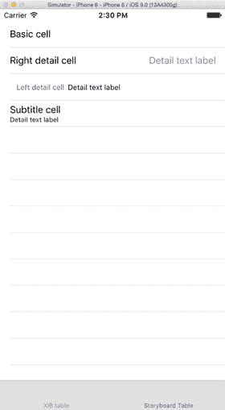

图 6-16. 自定义单元格

## 在代码中创建原型单元格

在代码中创建原型单元格通常用于`UITableViewCell`子类的自定义实例。如果使用此方法创建“标准”`UITableViewCells`，则只能使用`UITableViewStyle.Default`样式，并且无法使用带副标题等的单元格。

该过程与可视化方法非常相似：使用标识符向表格视图注册单元格类，然后在`cellForRowAtIndexPath:`方法中创建或出队该类的实例。

### 向表格视图注册单元格类

这必须在`dataSource`尝试创建或出队单元格之前完成，因此通常是在`viewDidLoad`方法或类似方法中设置视图时进行。

要注册一个单元格类，请使用带有适当标识符的`registerClass:forCellReuseIdentifier:`方法。

例如，要使用`StandardCell`标识符注册`UITableViewCell`类，请将以下代码添加到（例如）`tableViewController`的`viewDidLoad`方法中：

```swift
tableView.registerClass(UITableViewCell.self, forCellReuseIdentifier: "StandardCell")
```

如果你有一个自定义的`UITableViewCell`子类，你可以在`registerClass:forCellReuseIdentifier:`方法中使用它：

```swift
tableView.registerClass(MyCustomCellClass.self, forCellReuseIdentifier: "CustomCell")
```

要取消注册给定`cellIdentifier`的类，请向`registerClass:forCellIdentifier:`方法传递`nil`：

```swift
tableView.registerClass(nil, forCellReuseIdentifier: "CustomCell")
```


### 创建和配置单元格

一旦将单元格类和标识符注册到表视图中，`cellForRowAtIndexPath:` 方法即可按需创建实例。

使用单元格的 `Identifier` 属性来创建（或重用）正确类的实例，然后按照常规方式从数据模型中配置该单元格。

列表 6-4 展示了如何为 `MyCustomCellClass` 单元格执行此操作。

**列表 6-4.** `cellForRowAtIndexPath:` 方法

```
func tableView(tableView: UITableView, cellForRowAtIndexPath indexPath: NSIndexPath) ➤
-> UITableViewCell {
    let cell = tableView.dequeueReusableCellWithIdentifier("CustomCell", ➤
    forIndexPath: indexPath) as! MyCustomCellClass
    // 配置单元格...
    cell.myCustomOutlet!.text = tableData[indexPath.row]
    return cell
}
```

请注意，`dequeueReusableCellWithIdentifier:forIndexPath:` 方法返回的是一个普通的 `UITableViewCell` 实例，因此你需要使用 `as!` 方法将其向下转换为自定义类。

## 使用标准单元格类型

`UITableView` 提供了四种标准单元格类型，对于许多应用程序来说，这些可能就足够了。这四种样式的名称是常量，但遗憾的是，这些名称并没有特别的描述性：

* `UITableViewCellStyleDefault`
* `UITableViewCellStyleValue1`
* `UITableViewCellStyleValue2`
* `UITableViewCellStyleSubtitle`

本节将详细介绍这四种类型，然后向你展示如何选择所需的类型。

### 使用 `UITableViewCellStyleDefault`

顾名思义，`UITableViewCellStyleDefault` 是标准、开箱即用型 `UITableView` 的默认单元格样式。它提供了三个区域（如图 6-17 所示）：

* 一个位于单元格左端的 `UIImageView`，称为 `imageView`。这是可选的；如果单元格中没有图像视图，单元格内容将左对齐。
* 一个 `UILabel`，称为 `textLabel`，用于容纳单元格内容。
* 一个可选的 `UIView`，称为 `accessoryView`，它可以显示一个标准的辅助视图指示器，通过添加 `UIImageView` 作为 `subView` 来显示自定义图像，或者显示如 `UIButton` 等控件。

与所有其他标准单元格样式一样，可以通过更改 `UILabel` 的属性（如字体、文本对齐方式和颜色）来格式化 `textLabel`。尽管默认单元格的布局可能是固定的，但这种格式化确实能够让你进行一定程度的自定义。

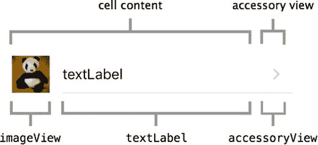

**图 6-17.** `UITableViewCellStyleDefault`

通过访问 `textLabel` 的 `text` 属性来获取其内容：

```
cell.textLabel!.text = "textLabel"
```

类似地，通过访问 `imageView` 的 `image` 属性来设置图像：

```
cell.imageView!.image = UIImage(named:"panda")
```

如果你在 Storyboard 中使用原型单元格，那么 `UITableViewCellDefault` 对应于属性检查器中的 `Basic` 样式（见图 6-18）。

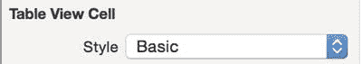

**图 6-18.** 在 Interface Builder 中选择 `UITableViewCellBasic` 样式

### 使用 `UITableViewCellStyleValue1`

`Value1` 单元格样式与 `Default` 类型类似，但增加了一个可选的 `UILabel`，称为 `detailTextLabel`，以及一个可选的 `imageView`。图 6-19 显示了一个示例。

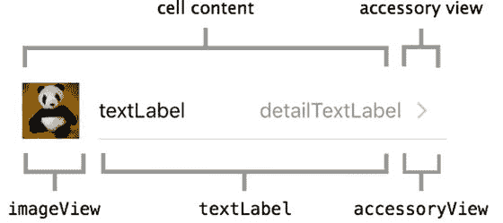

**图 6-19.** `UITableViewCellStyleValue1`

`textLabel` 会尝试处理受限的空间，但并不总能达到预期效果，如图 6-20 所示。如果自动处理的结果不可接受，这可能提示你需要考虑实现自定义单元格样式。


**图 6-20.** 单元格内容的截断

如果你在 Storyboard 中使用原型单元格，那么 `UITableViewCellDefault` 对应于属性检查器中的 `Right Detail` 样式（见图 6-21）。


**图 6-21.** 在 Interface Builder 中选择 `UITableViewCellValue1` 样式

### 使用 `UITableViewCellStyleValue2`

`Value2` 单元格样式与 `Value1` 样式几乎相同，区别在于 `textLabel` 和 `detailTextLabel` 的默认字重不同，并且没有 `imageView`。图 6-22 显示了一个示例。


**图 6-22.** `UITableViewCellStyleValue2`

如果你在 Storyboard 中使用原型单元格，那么 `UITableViewCellDefault` 对应于属性检查器中的 `Left Detail` 样式（见图 6-23）。

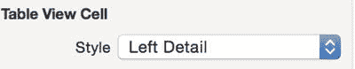

**图 6-23.** 在 Interface Builder 中选择 `UITableViewCellValue2` 样式

我从未在实际应用中见过 `UITableViewCellStyleValue2` 的示例，但如果你需要，它就在那里。

### 使用 `UITableViewCellStyleSubtitle`

第四种默认类型是其他三种类型的另一种变体。它结合了 `textLabel` 和 `detailTextLabel` 以及一个可选的 `imageView`。图 6-24 显示了带图像的默认单元格，而图 6-25 显示了不带图像的默认单元格。

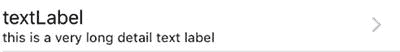

**图 6-25.** 不带图像的 `UITableViewCellStyleSubtitle`


**图 6-24.** 带图像的 `UITableViewCellStyleSubtitle`

## 配置默认单元格的内容

四种默认类型之一的 `UITableViewCell` 拥有一系列可用于配置内容的属性。本节介绍四个关键属性——`textLabel`、`detailTextLabel`、`imageView` 和 `contentView`——然后展示使用它们的示例。

### `textLabel`

`textLabel` 属性是一个 `UILabel`，其文本可以更改。它通常用作单元格的主标题：

```
cell.textLabel!.text = "主单元格文本"
```

### `detailTextLabel`

`detailTextLabel` 也是一个 `UILabel`，其文本可以更改。它可以充当单元格的副标题：

```
cell.detailTextLabel!.text = "单元格副标题"
```

### `imageView`

单元格的 `imageView` 是一个 `UIImageView`。它具有一个 `image` 属性，可以传入一个 `UIImage`，然后该图像将显示在单元格中：

```
if let avatar = UIImage(named:"avatar") {
   cell.imageView!.image = avatar
}
```

### `contentView`

单元格的 `contentView` 是一个 `UIView`，可以向其添加子视图：

```
cell.contentView.addSubview(theView)
```

你将在第 8 章中更详细地了解 `contentView`。

一个常见的错误是试图直接访问这些属性：

```
cell.textLabel = "一些文本"   // 这不会生效！
```

为了确保表格尽可能响应快速，最好在将任何图像添加到单元格之前对其进行缩放。如果单元格在显示图像之前需要重新缩放图像，可能会导致表格滚动时出现抖动。


### 默认单元格类型中的文本格式设置

以下是一个实际设置这些属性的示例：

```
cell.textLabel!.textColor = UIColor.blueColor()
cell.detailTextLabel!.font = UIFont(name: "TimesNewRomanPSMT", size: 12)
cell.detailTextLabel!.textColor = UIColor.redColor()
```

这段代码生成了图 6-26 所示的单元格。虽然我不建议使用这种坦率来说非常难看的字体和颜色组合，但您明白其中的原理。


**图 6-26.** 单元格格式示例

## 使用辅助视图

`UITableViewCell` 提供了三种类型的辅助视图（如果算上 `None` 类型，则是四种）。辅助视图显示在单元格的右端。您也可以添加自定义辅助视图。这些都是 `UIView` 实例，它们要么向用户提示触摸该单元格会触发某种操作，要么显示关于单元格状态的信息。

轻触辅助视图会触发 `tableView` 调用委托的 `accessoryButtonTappedForRowWithIndexPath` 方法。这允许您触发诸如推入新的视图控制器等操作。

除了使用默认的辅助视图外，您还可以提供自己的自定义视图，或者将诸如 `UIButton` 之类的控件放入自定义视图中。

### 使用 UITableViewCellAccessoryDisclosureIndicator

`DisclosureIndicator` 作为提示，表示触摸该单元格将显示另一个表格视图，以便深入数据层级。图 6-27 展示了它的外观。


**图 6-27.** `UITableViewCellAccessoryDisclosureIndicator`

### 使用 UITableViewCellAccessoryDetailDisclosureIndicator

`DetailDisclosureIndicator` 看起来像一个信息按钮，这提示触摸该单元格将显示更多数据。显示的可能是另一个表格视图，但也可能是其他类型的视图。

当被轻触时，`DetailDisclosureIndicator` 会向表格的 `dataSource` 发送 `tableView:accessoryButtonTappedForRowWithIndexPath` 消息。图 6-28 展示了这一点。


**图 6-28.** `UITableViewCellAccessoryDetailDisclosureIndicator`

### 使用 UITableViewCellAccessoryCheckmark

如图 6-29 所示的复选标记，表示该单元格已被选中，无论是通过用户轻触行还是通过后台某些数据字段选中。这提供了一种在列表中选中和取消选中一个或多个项目的方法。例如，这是一种非常常见的用于设置配置项的用户界面模式。


**图 6-29.** `UITableViewCellAccessoryCheckmark`

### 使用 UITableViewCellAccessoryNone

顾名思义，`UITableViewCellAccessoryNone` 不显示任何辅助视图。图 6-30 显示了一个示例。设置此附件类型会移除之前设置的任何辅助视图。您可能使用此视图，因为在该层级之下没有更多信息，或者因为该单元格之前被选中并显示了 `UITableViewCellAccessoryCheckmark`。


**图 6-30.** `UITableViewCellAccessoryNone`

### 设置辅助视图类型

单元格的辅助视图通过 `accessoryType` 属性进行设置：

```
cell.accessoryType = UITableViewCellAccessory.Checkmark
```

清单 6-5 中的代码展示了如何根据某些数据的值，切换复选标记的显示与隐藏。

**清单 6-5.** 切换单元格的辅助类型

```
let dataItem = tableData[indexPath.row]
if dataItem == "某个表示需要复选标记的字符串" {
    cell.accessoryType = UITableViewCellAccessory.Checkmark;
} else {
    cell.accessoryType = UITableViewCellAccessory.None;
}
```

Apple 提供了关于何种目的应使用何种辅助类型的指南。虽然我从未听说有应用因为以非标准方式使用展开指示器而被 App Store 拒绝，但这样做有让用户感到困惑的风险。除非有非常好的理由，否则最好坚持使用默认行为。

### 使用辅助视图显示单元格选中状态

利用单元格辅助视图的存在与否来指示单元格是否被选中，是一种完全有效的方法。但有一个“陷阱”，如果您不小心，很容易中招。

现在回想一下模型-视图-控制器模式。单元格是视图，而填充单元格的数据存在于模型之中。当您打开或关闭选中指示器时，您是在对视图进行操作，而不是模型。

单元格本身没有状态。请记住，即使在有 99,999 行的 `tableView` 中，也只会创建大约 11 个单元格。如果您希望选中状态在下一次显示该数据点时仍然存在，您必须更新外部数据模型，然后相应地设置选中指示器。

同样地，如果您设置了一个单元格的辅助视图状态，而该单元格随后从缓存中被回收，那么它回到表格时，会保持被丢弃到缓存时的状态。这就是为什么每次更新行时，都需要重置辅助视图（以及后续自定义单元格中包含的任何控件或视图）的原因。

清单 6-6 展示了我一个名为 TeaWars 的网络游戏应用中的代码片段，演示了实际应用。该表格显示了对等设备的列表。在下一步中，用户可以选择他们想要连接的设备。触摸该行会触发 `didSelectRowAtIndexPath` 方法，该方法将该客户端 ID 添加到一个名为 `listOfPlayers` 的 `NSMutableArray` 中。

**清单 6-6.** 切换单元格选择状态

```
func tableView(tableView: UITableView, cellForRowAtIndexPath indexPath: NSIndexPath) -> UITableViewCell {
    let cell = tableView.dequeueReusableCellWithIdentifier(kCellIdentifier, forIndexPath:indexPath)
    // 获取相关已连接客户端的 ID
    let peerID = sessionManager.connectedClients[indexPath.row]
    // 获取对等方的 displayName
    cell.textLabel.text = sessionManager.gkSession.displayNameForPeer(peerID)
    // 如果这个 peerID 包含在 listOfPlayers 中，则表示它已被选中
    // 因此在单元格中显示复选标记
    if listOfPlayers.containsObject(peerID) {
        cell.accessoryType = UITableViewCellAccessory.Checkmark
    } else {
        // 对等方 ID 不在列表中，因此未选中
        cell.accessoryType = UITableViewCellAccessory.None
    }
    return cell
}
```

当单元格被移入和移出缓存时，`cellForRowAtIndexPath` 方法会检查该对等方是否存在于 `listOfPlayers` 数组中。如果存在，则说明它已被选中，因此该单元格需要一个 `UITableViewCellAccessoryCheckmark`。（`_sessionManager` 对象处理网络通信，因此与本示例不太相关。）

### 创建自定义辅助视图

由于单元格的 `accessoryView` 是 `UIView` 的一个实例，因此将您自己的自定义 `UIView` 赋值给该单元格是一项相当简单的任务：

```
if let image = UIImage(named: "imageName") {
    cell.accessoryView = UIImageView(image: image)
}
```

与单元格的 `imageView` 类似，最好确保任何 `accessoryView` 的图像首先经过了正确的大小和缩放处理。不过，您不仅仅局限于图像；`accessoryView` 也可以是一个放置诸如 `UIButton` 之类控件的有用位置。


## 创建和复用单元格

你已经了解了各种可用的默认单元格样式，现在可能已经迫不及待想要创建自己自定义的单元格样式了。不过，在继续之前，最好先深入了解一下表格视图本身是如何创建和管理单元格的。创建自定义单元格通常需要知道何时介入“标准”流程，因此了解这些流程有助于你理解正在发生的事情及其原因。

### 内存限制

iOS 设备在紧凑的机身中集成了大量功能。但尽管 iPhone 和 iPad 的内存大约是阿波罗登月舱机载计算机的 25.6 万倍，内存仍然是一个限制因素。设备小巧的物理尺寸意味着，机身内所能容纳的 RAM 容量是有限的。作为 iOS 开发者，你需要时刻注意应用的内存占用情况。

对于像 `SimpleTable` 这样只有非常小型表格的应用来说，这不算什么大问题；它只有 10 行。但如果应用的数据来自更大的数据源，你可能会有成千上万甚至上百万行。一次性处理所有这些数据，可能会迅速耗尽 iOS 设备有限的内存。

### 速度与流畅度

当第一代 iPhone 在 2007 年首次推出时，评测者们一致为之惊叹的一点是其界面的流畅性。轻弹一个表格视图，它就能平滑地上下滚动——没有卡顿、延迟或抖动。响应不流畅的界面，用户会非常明显地感觉到（而界面响应卡顿是 iPhone 和 iPad 竞争对手的主要批评点之一）。

对于当今强大的图形处理器来说，让内容在屏幕上平滑移动并非太大的挑战。让表格（或任何滚动界面）流畅运行，主要要求数据能够足够快地获取并移动到屏幕上，而无需屏幕等待。数据获取的延迟会表现为滚动视图的卡顿或延迟。

### 即时创建与循环复用

那么，iOS 是如何同时应对有限的内存和对速度与流畅度的需求的呢？这两个问题的解决方案非常巧妙。`UITableViews` 利用了一个重要事实：尽管一个表格可能有成千上万个单元格，但在任何时刻，只有少数几个对用户是可见的。

首先，`UITableViews` 采用了一种即时创建单元格的方法。一个新单元格在需要之前才被创建。这样，每个单元格都已准备好显示，但又不会因为过早创建那些暂时不需要的单元格而导致设备内存阻塞。

其次，当一个单元格不再可见后，它会被出列并放入一个缓存中以供复用。获取一个已有的单元格并更新其内容，比创建一个全新的单元格既更快，又更节省内存。`tableView` 不会创建全新的单元格，而是会将一个已有的单元格出列并循环利用，在其即将显示到屏幕上之前更新其内容。

### 表格视图的“传送带”

所有这些可能看起来有点抽象，所以一个视觉上的类比可能会有所帮助。你可以把 `tableView` 想象成盒子里面的一条传送带，如图 6-31 所示。用户可以通过一个控制按钮来回移动传送带。通过盒子顶部的一个窗口，可以看到传送带的一小段。

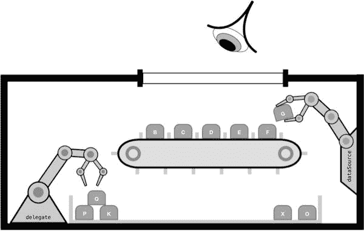

图 6-31.

单元格生产过程

传送带上有一些槽位，可以放置不同类型的单元格。当单元格到达传送带的任一端时，它们会掉落下来，并被分类到传送带下方的一系列盒子中，每种不同类型的单元格对应一个盒子。

在盒子内部，传送带旁边，站着两个机器人。一个名为 `dataSource` 的机器人负责将单元格放置到托盘的任一端，另一个名为 `delegate` 的机器人则随时准备在需要时调整单元格的属性。

盒子中还存放着一组单元格模板；根据表格的设置方式，这些模板可能来自 Storyboard 或 XIB 文件，也可能包含在 `UITableViewCell` 子类的描述中。

就在用户转动传送带，将一个空槽位移到窗口下方之前，`dataSource` 机器人会向模型（Model）查询所需的单元格类型。有了这个信息，它会查看相关的托盘，看看里面是否有闲置的单元格。

如果托盘是空的，`dataSource` 机器人会通过复制相关模板快速创建一个新的空单元格。如果托盘中有闲置的单元格，机器人会将其拿起，并准备好将其放到传送带上。

就在单元格被放置到传送带上的那一刻之前，机器人会向表格的模型（Model）查询这个单元格应包含的信息。它将内容写入单元格，然后第一只手臂将其放入槽位中，正好赶上该单元格被滚动到视图中。

如果用户与传送带上的某个单元格进行交互，那么 `delegate` 机器人就负责做出反应。它可能会给单元格的内容着色，或者要求视图控制器弹出一个警告视图，或者推入一个新的视图。

#### “传送带”过程的代码实现方式

对于我们这些构建和配置表格视图的人来说，幸运的是，这个传送带的许多动作都是在幕后完成的。繁重的工作由 `cellForRowAtIndexPath` 方法承担。

如果你使用内置模板创建了一个新的 `UITableViewController` 子类，那么该子类基本上立即可用。代码清单 6-7 提供了模板版本，并添加了一些注释，以便与我们传送带的类比联系起来。

代码清单 6-7. “传送带”代码

```
// tableView 要求 dataSource 机器人创建并返回
// 一个适合放到 indexPath.row 槽位的单元格
func tableView(tableView: UITableView, cellForRowAtIndexPath indexPath: ➤
NSIndexPath) -> UITableViewCell {
    let CellIdentifier = "MyImpressiveCell"
    // dataSource 机器人把手伸进托盘
    // 试图找到一个标识符为 “MyImpressiveCell” 的旧单元格
    // 如果找不到，它会创建一个新的
    let cell = tableView.dequeueReusableCellWithIdentifier(CellIdentifier], ➤
    forIndexPath: indexPath) as! UITableViewCell
    // dataSource 机器人现在设置单元格
    // 配置单元格...
    cell.textLabel!.text = "cell contents..."
    // 并将其交给 tableView 机器人
    return cell
}
```


### 使用 `cellIdentifier` 识别单元格

需要注意的是，同一个 `tableView` 中可能显示无限多种类的单元格。稍后你将利用这一点创建高度自定义的表格。因此，`tableView` 需要某种方式来识别每种不同的单元格类型，而这正是 `cellIdentifier` 的职责所在。

`cellIdentifier` 只是一个任意的 `String`，对每种单元格类型来说都是唯一的。当创建一个新单元格时，它会用 `cellIdentifier` 进行“标记”。在幕后，`dataSource` 会利用这个 `cellIdentifier` 执行以下操作：

*   将丢弃的单元格放入正确的队列，以便稍后重用。
*   当 `tableView` 请求新单元格时，从队列中取出正确类型的单元格。

图 6-32 展示了一个略显做作的例子，其中两种单元格类型在奇数行和偶数行交替出现。

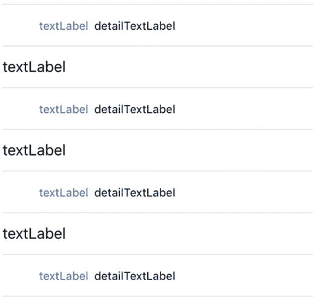

图 6-32.

单元格交替

该表格由代码清单 6-8 中的代码生成。

代码清单 6-8. 创建交替的单元格类型

```
func tableView(tableView: UITableView, cellForRowAtIndexPath indexPath: NSIndexPath) ➤
-> UITableViewCell {
    var currentCellIdentifier: String
    if (indexPath.row % 2) == 0 {
        currentCellIdentifier = "EvenCell"
    } else {
        currentCellIdentifier = "OddCell"
    }
    var cell = tableView.dequeueReusableCellWithIdentifier➤
  (currentCellIdentifier,forIndexPath: indexPath)
    cell.textLabel!.text = "textLabel"
    cell.detailTextLabel!.text = "detailTextLabel"
    return cell
}
```

逐步分析代码清单 6-8，第一个任务是创建一个用作单元格标识符的字符串：

```
var currentCellIdentifier: String
```

该标识符用于判断行是奇数还是偶数。你可以使用取模函数将 `indexPath.row` 除以 2。如果余数为零，则该行为偶数；否则为奇数。然后可以相应地设置单元格标识符：

```
if (indexPath.row % 2) == 0 {
    currentCellIdentifier = "EvenCell"
} else {
    currentCellIdentifier = "OddCell"
}
```

接着，你使用该行的单元格标识符从重用队列中取出一个可重用的单元格：

```
var cell = tableView.dequeueReusableCellWithIdentifier ➤
  (currentCellIdentifier,forIndexPath: indexPath)
```

单元格标识符告知 `tableView` 需要哪种单元格。`tableView` 会负责返回一个已有的单元格以供循环利用，或者，如果没有闲置的单元格，则从头创建一个新的。

获取到正确类型的单元格后，剩下的工作就是配置它了：

```
cell.textLabel!.text = "textLabel"
cell.detailTextLabel!.text = "detailTextLabel"
```

最后，你将其返回给 `tableView`：

```
return cell
```

### 单元格重用与缓存的副作用

尽管缓存和重用单元格能显著减少内存使用并加速表格，但一些潜在的副作用可能会引发问题。当未使用的单元格被放入队列时，它们会按原样排队。换句话说，它们的内容和属性会保持与创建时完全相同的状态。

这可能导致有趣的显示问题，看似“旧”的单元格会悄悄出现在表格中间。当单元格数据出现这种情况时，可能还比较明显，但如果你正在自定义其他单元格属性（如选中状态），它往往会在你毫无防备时引发问题。

为防止这种情况，每次使用单元格时——无论它是新创建的还是从队列中取出的——都重置其内容是*极其重要*的。

有三个地方可以修改单元格内容：

*   `prepareForReuse`：此方法会在后台的单元格上被调用，就在它被 `dequeueReusableCellWithIdentifier` 返回给代理之前。如果需要，你可以重写此方法，但出于性能原因，苹果公司建议你只在此处重置非内容的单元格属性（例如编辑和选择属性）。你可以在 `cellForRowAtIndexPath` 中更改内容。
*   `cellForRowAtIndexPath`：正如你已经看到的，这是你完成大部分单元格配置的地方——根据 `tableView` 的模型返回的数据来设置内容项等等。
*   `willDisplayCell:forRowAtIndexPath`：在使用 `cellForRowAtIndexPath` 创建单元格之后，在 `tableView` 实际将其绘制到屏幕之前，还有最后的机会对其进行微调。就在这发生之前，`tableView` 会告知代理它即将为特定行绘制单元格——此时，你可以更改基于状态的属性，例如选中状态和背景颜色。

我在论坛上看到有人建议的一种技术是为每个单元格创建唯一的 `cellIdentifier`。虽然这对于非常小的表格可能有效，但如果你要为表格填充大量单元格，这是一个极其糟糕的主意。通过创建唯一的 `cellIdentifiers`，你实际上阻止了单元格的缓存和重用，因此你的应用的内存占用会显著高于正常水平。

## 小结

在本章中，你深入了解了单元格的结构、创建和重用方式。你还了解了如何仅使用默认元素来配置单元格，使其超越默认外观。成功地自定义单元格取决于知道何时重写默认过程，因此你学习了表视图是如何为你创建和管理单元格的。

通过理解基本自定义所能实现的功能，你就可以利用这些信息走得更远。在第 7 章中，你将运用这些知识构建完全自定义的单元格，并在第 8 章中进一步深入。在第 9 章中，你将改进用户与单元格交互的方式。

