# 7. 改善单元格的外观

使用 `UITableView` 内置的标准单元格类型是快速上手并运行的好方法。但很快你就会遇到标准外观和感觉的限制，并希望超越典型的布局。

如果你在使用 `UICollectionView`，一开始就没有任何标准单元格可用，因此你从一开始就需要自己自定义它们。

创建和使用自定义单元格并不困难，并且建立在我们迄今所涵盖的所有主题之上。自定义单元格主要有四种方式：

*   在代码中向单元格的 `contentView` 添加子视图。
*   在 Storyboard 中创建原型单元格。
*   使用 Interface Builder 在 XIB 文件中创建自定义单元格。
*   创建 `UITableViewCell` 或 `UICollectionViewCell` 的自定义子类。

这四种方法相辅相成，并适用于表视图和集合视图，但存在一些细微差别。在本章中，你将了解前三种方法。然后在第 8 章中，你将详细研究自定义子类。

本章介绍的三种方法是以不同方式实现大致相同的结果，但它们之间存在一定的共性。为了比较这三种技术，本章的示例会包含一些重复内容。


## 自定义单元格

自定义单元格有四种方法：

* 通过代码向单元格的 `contentView` 添加子视图。您可以通过 `contentView` 属性访问单元格的全部内容。当 `cellForRowAtIndexPath` 或 `cellforItemAtIndexPath` 函数出列单元格时，您可以创建控件并将其作为子视图添加到 `contentView` 中。如果您处理的是 `UITableViewCell`，新的子视图可以与内置子视图共存，也可以完全忽略内置子视图。如果您不设置内置子视图，它们将不会被插入到单元格中。
* 在 Storyboard 中创建原型单元格。通过 Interface Builder 使用 Storyboard，您可以在原型单元格中直观地布局单元格控件。这些原型单元格提供了一个“模板”，`dataSource` 可以使用它来创建单元格。您可以在设置表格或集合视图时注册该模板以供使用。当 `dataSource` 创建单元格时，可以通过编程方式设置自定义控件的属性。
* 通过 Interface Builder 在 XIB 文件中创建自定义单元格。使用 Interface Builder，您可以在 XIB 文件中直观地布局单元格控件，然后在单元格注册到表格或集合视图时加载该文件。然后，通过少量额外的代码来访问您的自定义控件，就可以在相应的 `dataSource` 函数中以编程方式设置它们的值。
* 创建单元格子类并重写 `layoutSubviews`。作为 Interface Builder 可视化方法的替代方案，您可以创建单元格的子类，并通过代码布局自定义单元格的内容——可以重写 `layoutSubviews` 函数，或者使用 `drawRect` 绘制单元格。

## 应使用哪个函数？

简短的回答是——视情况而定！自定义单元格没有绝对正确或错误的方法。哪种方法最好取决于您要实现的目标、您对使用代码与可视化布局视图的适应程度（反之亦然），以及您需要多快让代码运行起来。

## 向单元格的 `contentView` 添加子视图

单元格的内容位于一个名为 `contentView` 的 `UIView` 中。对于 `UITableViewCell`，您还会得到一个附件视图，如图 7-1 所示。`UICollectionViewCell` 则有一个空的 `contentView`，如图 7-2 所示。

尽管 `contentView` 本身是只读的——这意味着您不能替换它——但您可以向其中添加或移除子视图。

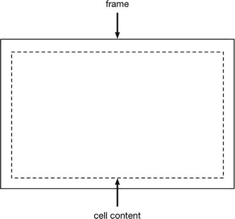

图 7-2. `UICollectionViewCell` 的布局

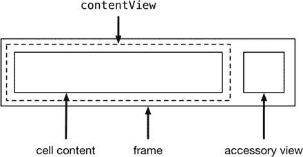

图 7-1. `UITableViewCell` 的布局

这些子视图可以是任何继承自 `UIView` 本身的控件或组件，包括标签、控件、文本字段、图像等。

您可以在首次创建新单元格时添加自定义视图。这样，如果该单元格随后被回收利用，该视图将保留在原位。

这意味着如果您要向自定义视图中添加随每个项目而变化的内容（例如标签、图像等），则需要为每个项目设置这些内容。这意味着您需要能够访问自定义视图内部，以获取其属性并进行设置。

采取的方法是将自定义视图分为两部分来考虑：

* 创建结构：在每个新单元格中，设置要添加到单元格 `contentView` 中的元素的大小和位置。
* 更新内容：在更新每一行时，配置添加到 `contentView` 中的自定义元素的属性。

> **提示**：如果您不显式引用 `UITableViewCell` 的标准内容——`textLabel`、`detailTextLabel`、`imageView` 和 `accessoryView`——那么它们将不会被插入到单元格中，也不会干扰您的自定义布局。

### 视图及其层次结构

iOS 中一个经常引起混淆的方面是 `UIViews` 之间的相互关系。所有这些关于添加子视图的讨论——但添加到哪？添加到什么？

理解 `UIViews` 的关键概念是它们形成了一个层次结构，如图 7-3 所示。

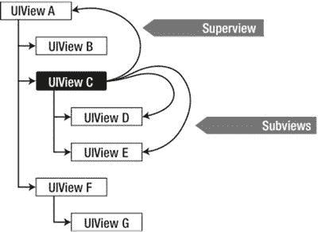

图 7-3. 视图层次结构

每个 `UIView` 可以有一个父视图（或 `superView`）以及一个或多个 `subViews`。`subViews` 的可见性与其 `superView` 相关，因此将 `UIView C` 的可见性设置为 `hidden` 将导致 `UIViews D` 和 `E` 消失。

每个 `UIView` 都有一个名为 `subViews` 的属性，它是一个 `Array`，包含该 `UIView` 实例作为父视图（或 `superView`）的所有 `UIViews`；见图 7-4。

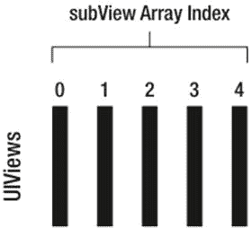

图 7-4. `subView` 数组中的视图

您可以通过遍历 `UIView` 的 `subViews` 数组来访问其每个 `subView`：

```swift
for theSubView in parentView.subViews {
    // 对 theSubView 执行某些操作
}
```

类似地，每个 `UIView` 都有一个 `superView` 属性，它是对其“父”视图的引用。在图 7-3 中，`view C` 的 `superView` 是 `view A`，而 `view C` 的 `subViews` 数组中有两个视图：`views D` 和 `E`。

如果您正在创建包含多个视图、子视图和父视图的复杂布局，那么保留一些图表来展示每个视图与其他视图的关系是值得的。这可以防止将来产生很多困惑。

### 在单元格中创建元素

第一步必须在每个单元格创建时进行。这发生在相应的 `dataSource` 函数中，即 `tableView:cellForRowAtIndexPath`（如代码清单 7-1 所示）或 `collectionView:itemForRowAtIndexPath:`（如代码清单 7-2 所示）。

每个代码清单展示了基本技术：

* 首先，检查您要添加的子视图是否存在（以防您正在回收利用已存在的单元格）。
* 如果子视图已存在，则配置您想要控制的属性。
* 如果子视图不存在，则创建它并将其添加到单元格的 `contentView` 中，然后进行配置。

**代码清单 7-1.** 为 `UITableView` 添加和配置自定义子视图

```swift
func tableView(tableView: UITableView, cellForRowAtIndexPath
indexPath: NSIndexPath) -> UITableViewCell {
    let cell = tableView.dequeueReusableCellWithIdentifier("CellIdentifier",
forIndexPath: indexPath)
    // 检查自定义视图是否已存在 – 如果存在，
    // 则说明我们正在回收利用一个已有的单元格
    if let customView = cell.contentView.viewWithTag(1000) {
        // 自定义视图的属性
    } else {
        // 创建自定义视图并设置标签值
        let customView = UIView(frame: cell.contentView.frame)
        customView.tag = 1000
        // 自定义视图的属性
        ...
        // 将自定义视图添加到单元格的 contentView
        cell.contentView.addSubview(customView)
        }
    // 将单元格返回给 tableView
    return cell
}
```

**代码清单 7-2.** 为 `UICollectionView` 添加和配置自定义子视图

```swift
func collectionView(collectionView: UICollectionView, cellForItemAtIndexPath
indexPath: NSIndexPath) -> UICollectionViewCell {
    let cell = collectionView.dequeueReusableCellWithReuseIdentifier(reuseIdentifier,
   forIndexPath: indexPath)
    if let customView = cell.contentView.viewWithTag(1000) {
        customView.backgroundColor = UIColor.redColor()
    } else {
        let customView = UIView(frame: cell.frame)
        customView.tag = 1000
        customView.backgroundColor = UIColor.redColor()
        cell.contentView.addSubview(customView)
    }
    return cell
}
```


#### 更新自定义单元格中的内容

前面的代码将确保每个新单元格内部都会创建一个 `UIView`，并随着每一行的更新而准备好进行配置。

此时，你可能会遇到一个看似棘手的问题。在你创建的子视图被插入到单元格的 `contentView` 之后，你就无法再直接访问它们来更新了。它们实际上被合并到了单元格的 `contentView` 中，而 `contentView` 没有任何可供你用来更新这些子视图的属性或接口。

这就是标签发挥作用的地方。更新内容是一个两步过程。

首先，获取单元格 `contentView` 内部自定义标签和 `imageView` 的引用，这是通过引用它们的标签来实现的。然后，更新这些控件的内容。

#### 为单元格中的控件添加标签

每一个 `UIView` 控件都有一个关联的 `tag` 属性，该属性既可以在 Interface Builder 中设置，也可以在代码中动态设置。`tag` 只是一个用于唯一标识每个元素的 `Int` 值——但有一个非常重要的注意事项：你需要负责 `tag` 的唯一性。

让我再强调一遍。控件并不关心其 `tag` 值是多少，视图也不关心 `tag` 是否唯一。如果你需要唯一标识每个控件，那么 `tags` 必须是唯一的。如果不这样做，你可能会得到一些非常奇怪的结果。

可以在代码中设置控件的 `tag`：

`myControl.tag = 1050`

或者，如果你在使用 Interface Builder，也可以使用属性检查器中的“视图”部分（如图 7-5 所示）进行设置。


图 7-5. 设置控件的标签

我使用了一些技巧来跟踪 XIB 文件中的控件 `tags`：

-   从一个较大的数值开始编号，并在编号中为额外的标签留出“空间”。我养成了从 `1000` 开始 `tag` 编号，并为每个 `tag` 递增 `10` 的习惯。
-   保持标签编号与 XIB 的布局一致。例如，如果一行中有四个 `UILabel`，则将第一个的 `tag` 设为 `1000`，第二个设为 `1010`，第三个设为 `1020`，依此类推。

完成 XIB 文件后，下一个挑战是在你的类中跟踪标签编号。这时枚举就发挥其作用了。

枚举（`enums`）允许你将整数值与实际上相当于文本标签的内容关联起来。一种思考它们的方式是将其视为一种编译时的全局查找和替换（不过，这可能会让 Swift 纯粹主义者感到不适）。

`enums` 需要在使用前定义。我倾向于将它们放在视图类文件的顶部，这样我就知道在哪里能找到它们：

```
enum kCellControl: Int {
    case NameLabel = 1050
    case StreetLabel = 1060
    case UserImage = 1070
}
```

然后，在文件编译时，`enum` 的任何实例（本例中为 `kCellControl.NameLabel`）都会被其后的整数值替换。因此，这段代码

```
if let myLabel = cell.contentView.viewWithTag(kCellControl.NameLabel.rawValue) as? UILabel {
    myLabel.text = "Label text"
}
```

会被编译器解释为

```
if let myLabel = cell.contentView.viewWithTag(1050) as? UILabel {
    myLabel.text = "Label text"
}
```

以 `k` 开头命名 `enum` 仅表示它是一个常量。并非必须这样做，但你在定义常量的 Apple 代码中会经常看到这种做法。这是早期编程风格的遗留习惯。

通过在代码中内联使用 `enums` 而非实际的标签值本身，你做了以下几件事：

-   让你的代码更具可读性，因为控件的功能更加一目了然。
-   使任何使用错误标签的情况都更加明显。
-   在你的类（或你选择放置它们的任何位置）的顶部提供了所有标签的记录，将所有内容整齐地组织在一起。

#### 转换控件类型

你会注意到，创建 `UILabel` 的那行代码语法略显奇怪。你将带有标签 `1050` 的 `UIView` **转换**（casting）为 `UILabel`。如果这对你来说是新鲜事物，请不要担心——它并不像听起来那么神秘。

`viewWithTag` 函数返回一个 `UIView`，该对象会响应所有为 `UIView` 类定义的方法。问题在于，标签为 `1050` 的视图实际上是一个 `UILabel`，而你想要设置它的 `textLabel` 属性。

`UIView` 没有文本属性。如果你尝试向 `UIView` 的实例发送一个文本消息，编译器会（正确地）报错，指出 `UIView` 不会响应此消息，并且在发送消息时程序会崩溃。

解决方法有点像一种取巧。你在以下代码行中做的事情

```
if let myLabel = cell.contentView.viewWithTag(1050) as? UILabel
```

是告诉编译器，带有标签 `1050` 的视图实际上是一个 `UILabel`，并且你想以这种方式访问它。从技术上讲，你在将它从 `UIView` **转换**为可选的 `UILabel`。

如果带有标签 `1050` 的视图可以被转换为 `UILabel`，那么它就会被转换；如果不能，则返回 `nil`。通过使用 `if let` 语法来解包这个可选值，你可以确保处理的是一个 `UILabel`，并且可以设置文本属性：

```
myLabel.text = "Some custom text"
```

## 在故事板中以原型方式可视化创建自定义单元格

原型单元格是一种在 Interface Builder 中设计自定义单元格的方法，而且无需创建和管理单独的 XIB 文件。它们可用于表视图和集合视图，并将所有内容整齐地保留在故事板的表视图或集合视图对象中。

你可以将原型单元格视为蓝图。为你需要的每种单元格类型创建一个原型，添加单元格控件并进行布局，然后在运行时根据数据模型更新这些控件。

视图控制器可以通过直接引用标签或通过 `UITableViewCell` 或 `UICollectionViewCell` 子类中的接口来访问原型单元格中的控件。

顾名思义，动态单元格将在运行时使用从表视图或集合视图数据模型获取的内容进行更新。表视图和集合视图都支持动态单元格。

`UITableViews` 略有不同，它还提供了静态单元格。静态单元格的子视图在运行时不会更新。它们可以为应用程序组件（如偏好设置）创建用户界面，或者用于利用表视图滚动功能的布局，提供了一种灵活的方式。


### 创建原型动态单元格

原型动态单元格是在 Storyboard 中添加到表格视图的。当你首次向 Storyboard 添加一个 `UITableViewController` 对象时，你会看到它自带一个空的原型单元格（见图 7-6）。

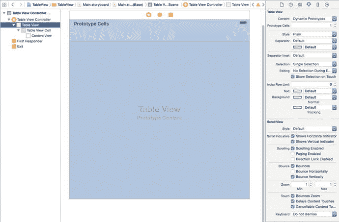

图 7-6. `UITableViewController` 中的一个原型单元格

`UITableView` 则略有不同，它被添加到 Storyboard 时是空的（如图 7-7 所示）。

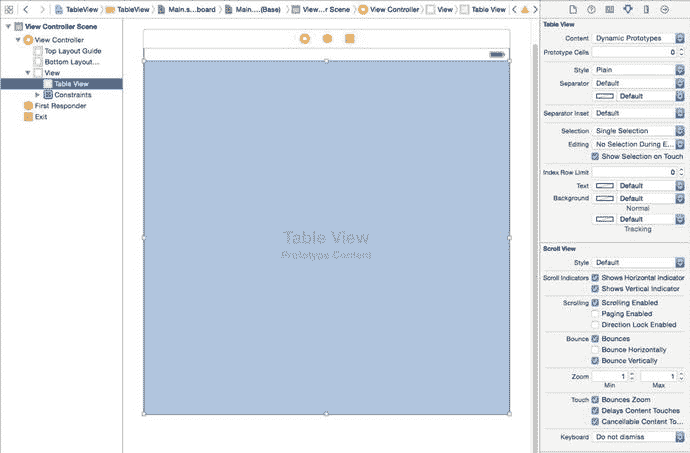

图 7-7. 嵌入在 `UIViewController` 中的 `UITableView`

无论你是将 `UICollectionView` 添加在 `UIViewController` 内部，还是使用 `UICollectionViewController`，它都只提供一个原型单元格。

无论你是在 `UIViewController` 内部使用 `UITableViewController` 还是 `UITableView`，你都可以通过更改 Attributes Inspector（属性检查器）中的控件来控制原型单元格的数量（如图 7-8 所示）。

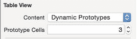

图 7-8. 更改表格视图中的原型单元格数量

`UICollectionView` 与此类似，如图 7-9 所示。

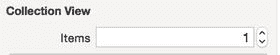

图 7-9. 更改集合视图中的原型项目数量

对于你创建的每个原型，都需要提供一个单元格或项目标识符，以便 `tableView:cellForRowAtIndexPath` 或 `collectionView:cellForItemAtIndexPath` 方法在需要时知道使用哪个原型。

你可以在 Attributes Inspector 中添加此标识符。图 7-10 展示了 `UITableView` 的单元格标识符，而图 7-11 则展示了 `UICollectionViewCell` 的标识符。

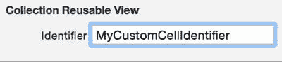

图 7-11. 为原型集合视图单元格设置自定义项目标识符

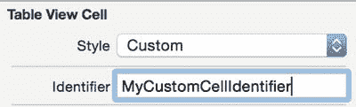

图 7-10. 为原型表格视图单元格设置自定义单元格标识符

#### 自定义原型表格视图单元格

表格视图单元格可以是四种标准单元格类型之一的实例：

*   基本型（左侧单个 `titleLabel`）
*   右侧详细信息（左侧 `titleLabel`，右侧 `detailTextLabel`）
*   左侧详细信息（左侧 `detailTextLabel`，右侧 `titleLabel`）
*   副标题型（上方 `titleLabel`，下方 `detailTextLabel`）

如果这些类型不符合你的需求，你有两个选择：

*   选择 `Custom` 单元格类型，从零开始布局控件，并通过它们的 `tag` 属性访问它们。
*   创建一个自定义的 `UITableViewCell` 子类，在 Storyboard 中选择 `Custom` 单元格，从零开始布局控件，并将它们链接到你自定义类中的输出口。

这两种过程将在本章后面详细说明。

#### 原型单元格与自定义 `UITableViewCell` 子类

自定义单元格子类允许你完全控制其内容。你可以在 Storyboard 中布局原型单元格，然后将单元格的控件连接到自定义 `UITableViewCell` 子类中的输出口。当单元格被出队时，你可以设置输出口属性，以便单元格显示你的数据。

要添加自定义单元格的原型，首先需要像之前所做的那样，向 Storyboard 中包含的表格视图中添加一个原型单元格。

然后，你需要在 Identity Inspector（身份检查器）中设置单元格的 `Custom Class` 属性，如图 7-12 所示。

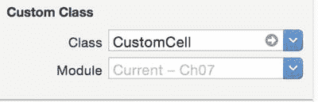

图 7-12. 设置单元格的类

现在，你可以将单元格中的控件连接到 `UITableViewCell` 子类中的输出口。图 7-13 展示了这一实际操作：单元格中的 `UILabel` 连接到了 `CustomCell` 类中的 `nameLabel` 输出口。

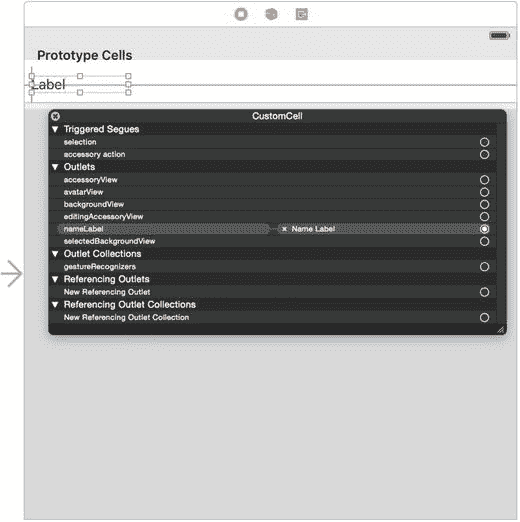

图 7-13. 连接 `nameLabel`

当单元格在 `tableView:cellForRowAtIndexPath:` 函数中被出队时，你需要将出队的单元格转换为子类的一个实例：

```
let cell = tableView.dequeueReusableCellWithIdentifier("CustomCell",
forIndexPath: indexPath) as! CustomCell
```

这将使你能够访问已连接的输出口：

```
cell.nameLabel.text = tableData[indexPath.row]
```

#### 设置原型单元格高度

标准表格单元格的标准高度为 44 磅，但你可以灵活地更改此设置，无论是全局更改还是按行更改。但是，如果你更改了原型单元格中的行高，还需要确保在运行时也进行了此设置。你有两个选择：

*   为表中的所有行全局设置行高。
*   按行设置行高。

要更改原型中的行高，你可以拖动单元格底部的调整大小手柄，或者在 Size Inspector（尺寸检查器）中设置行高值，如图 7-14 所示。

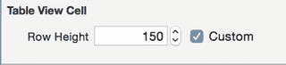

图 7-14. 在 Size Inspector 中设置行高

无论使用哪种方法，你都需要在代码中设置行高。你可以通过设置 `tableView` 的 `rowHeight` 属性来为表中的所有单元格执行此操作：

```
tableView.rowHeight = 150.0
```

或者，你也可以实现 `UITableViewDelegate` 函数：

```
func tableView(tableView: UITableView, heightForRowAtIndexPath indexPath:
NSIndexPath) -> CGFloat {
    return 150.0
}
```

实现 `heightForRowAtIndexPath:` 函数提供了为不同分区或行返回不同高度的灵活性。

#### 设置可变单元格高度

如果你的表格设计涉及不同高度的单元格，那么通过实现 `tableView:estimatedHeightForRowAtIndexPath:` 函数，你可能会改善表格的性能。

表格视图在计算其总高度时会使用此函数。如果你有很多布局复杂的单元格，提前计算高度可能会花费时间。估计行高为表格视图提供了足够的信息来尝试计算总内容高度，但允许将详细计算推迟到绝对必要时才进行。

要实现此功能，你需要做两件事。首先，将 `tableView` 的 `rowHeight` 属性设置为 `UITableViewAutomaticDimension`：

```
tableView.rowHeight = UITableViewAutomaticDimension
```

然后，实现 `tableView:estimatedHeightForCellAtIndexPath:` 函数：

```
func tableView(tableView: UITableView, estimatedHeightForRowAtIndexPath
indexPath: NSIndexPath) -> CGFloat {
    return 80
}
```

使用这种方法，你可以在布局原型单元格时利用 AutoLayout 的强大功能，而无需自己实现计算单元格高度所需的繁重工作。

#### 自定义原型集合视图单元格

自定义原型集合视图单元格的过程与表格视图单元格完全相同，区别在于集合视图单元格没有标准类型。实际上，每个集合视图单元格都是完全自定义的。

与表格视图单元格一样，你有两个选择：布局控件并通过 `tag` 属性访问它们；或者连接到自定义 `UICollectionViewCell` 子类中的输出口。


好的，遵照您的要求，以下是翻译后的中文文档：


### 设置原型集合视图单元格的大小

集合视图单元格的大小由集合视图的布局控制。如果你使用流布局，你可以在 Storyboard 中附加到集合视图的 `UICollectionViewFlowLayout` 中进行设置，也可以在代码中设置。

图 7-15 展示了如何在 Storyboard 中控制项目大小。

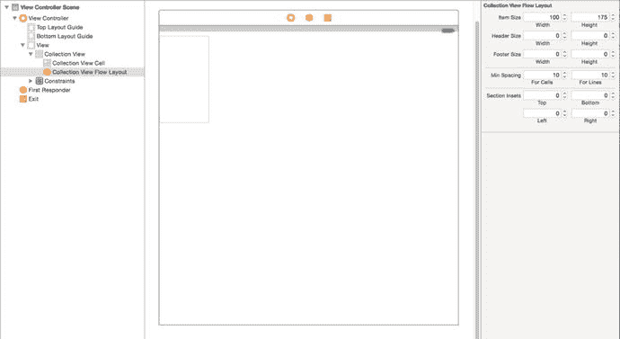

图 7-15. 在 Storyboard 中设置项目大小

或者，如果你在代码中创建 `UICollectionViewFlowLayout` 或 `UICollectionViewLayout`，可以通过两种方式设置项目大小：

-   全局设置：通过设置 `itemSize` 属性，使此布局控制的所有项目生效：

`myCustomLayout.itemSize = CGSizeMake(100, 175)`

-   逐个设置：在计算 `UICollectionViewLayoutAttributes` 时，为每个项目单独设置。

此过程在第 15 章和第 16 章中有详细介绍。

### 使用 Interface Builder 可视化创建自定义单元格

向单元格的 `contentView` 中添加子视图很快就会产生大量代码——除非你擅长在脑海中将单元格布局与代码中的坐标进行转换，否则这些代码可能难以理解。

另一种方法是利用 Interface Builder 的强大功能和灵活性，在 NIB 文件中创建自定义单元格，并在需要新单元格时使用它来创建完全自定义的单元格。

我不赞同那种认为“真正的开发者不使用可视化工具”的观点。如果你发现使用可视化布局工具来设计自定义单元格更快捷、更容易（并且注意以下警告），那就尽管去做。毕竟，重要的是完成任务。

#### 可视化创建单元格的阶段

使用 Interface Builder 可视化创建自定义单元格是一个多阶段过程：

1.  创建一个新的 XIB 文件，并使用 Interface Builder 布局单元格。
2.  为单元格指定一个单元格标识符。
3.  在你的新单元格内部创建控件。
4.  为控件分配标签，以便能够从外部访问它们。
5.  将 XIB 文件注册到表格或集合视图，以便与你第二步创建的单元格标识符一起使用。
6.  如果需要，实现处理单元格尺寸所需的功能。

这六个步骤将为你提供一个自定义单元格，可以在需要时使用 `tableView:cellForRowAtIndexPath` 或 `collectionView:cellForItemAtIndexPath:` 函数创建。

在你获得该自定义单元格的实例后，你就可以根据表格模型中数据的值来操作这些控件。

罗列出来，看起来工作量很大。但实际上，这是一个非常快速的过程，能够迅速完成这些内务处理任务，以便你可以继续创建单元格本身。

#### 创建新的 XIB 文件

首先，你需要一个新的 XIB 文件。从“文件”菜单中选择“新建文件”选项，或键入 Command + N。

从模板（如图 7-16 所示）中，在侧边栏中选择“用户界面”部分，然后选择“空视图”选项。点击“下一步”，并为 XIB 文件命名。

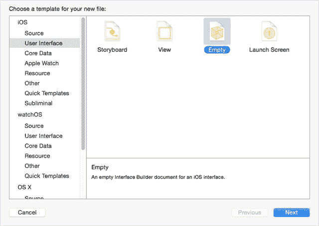

图 7-16. 创建新视图

XIB 初始为空，因此下一步是将一个单元格拖入主窗格。在“对象浏览器”中，选择一个“表格视图单元格”或“集合视图单元格”（图 7-17）。

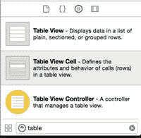 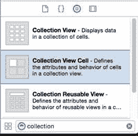

图 7-17. 选择表格或集合视图单元格

将其拖到主窗格中，如图 7-18 所示。

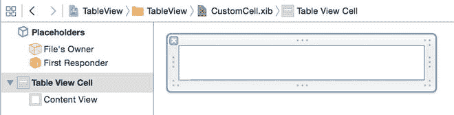 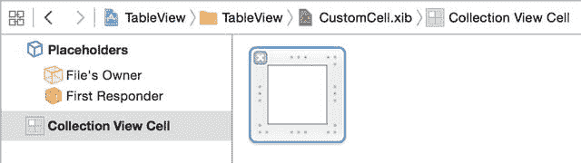

图 7-18. 向 Interface Builder 中添加单元格

因为这些单元格是 `UIView` 的子类，你可以像创建全屏视图一样，以完全相同的方式将其他控件拖放进去。然而，在你忘乎所以之前，可以先完成一些内务处理活动。

##### 设置单元格的标识符

在之前的代码示例中，你已经看到了如何使用 `reuseIdentifiers` 来跟踪已出队等待重用的单元格。在代码中，这只是一个任意的 `String`。如果只需要跟踪一种类型的单元格，我倾向于直接将其命名为 `cellIdentifier`，这样它的用途就一目了然了。

当你在 Interface Builder 中创建单元格时，将无论什么标识符与你将要引用的那种自定义单元格关联起来，这一点很重要。

如果你在对象列表中选择“Cell”项，然后打开属性检查器，你会在列表顶部看到一个“Identifier”选项（见图 7-19）。

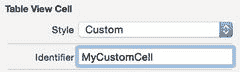 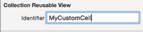

图 7-19. 设置单元格重用标识符

### 创建单元格的内容

最后，在上述所有步骤之后，你就可以开始布局单元格的内容了。因为单元格是 `UIView` 的一个实例，你可以将几乎任何能放到普通 `UIView` 中的内容放入单元格，并使用 AutoLayout 约束来定位它。

你的选择仅受限于你的想象力、单元格需要完成的功能以及你可用的控件。图 7-20 和 7-21 展示了一个将在本例后续步骤中使用的非常简单的布局。

**提示**：你不必局限于静态内容，例如 `UILabels` 和 `UIViews`。你也可以将诸如 `UIButtons`、`UISwitches` 和 `UISliders` 等控件放入单元格中。

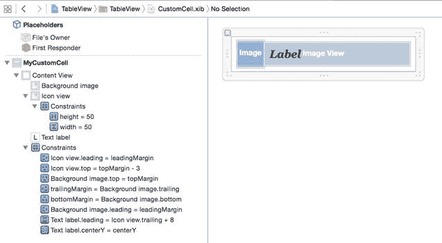

图 7-20. 一个自定义表格单元格布局示例

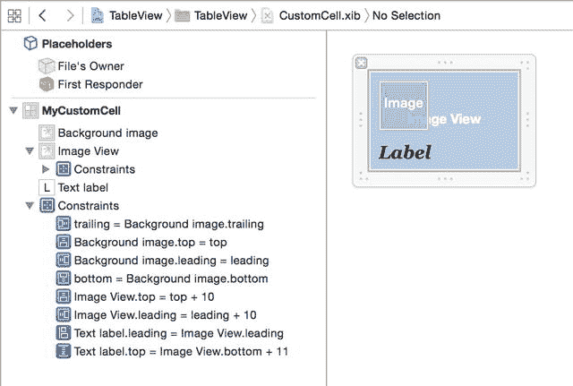

图 7-21. 一个集合视图单元格布局示例

#### 为控件分配标签

在本章前面部分，你通过代码设置每个对象的 `tag` 属性来为单元格内容分配标签。在使用 Interface Builder 时，这不是一个选项，因为你需要标签来获得对控件的引用。

标签属性可以在属性检查器的“视图”部分中设置（见图 7-22）。

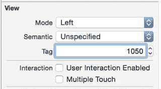

图 7-22. 属性检查器中的“标签”字段

此操作的效果与在代码中设置 `myControl.tag = 1050` 相同。

### 注册单元格

在 XIB 文件中创建了单元格之后，你需要通知表格或集合视图，你希望将它与你设置的单元格重用标识符一起使用。表格和集合视图的函数完全相同：

`tableView.registerNib(UINib(nibName: "MyCustomCell", bundle: nil), forCellReuseIdentifier: "MyCustomCell")`

`collectionView.registerNib(UINib(nibName: "MyCustomCell", bundle: nil), forCellReuseIdentifier: "MyCustomCell")`

这必须发生在此视图尝试将单元格出队以供使用之前。未能执行此操作将导致运行时崩溃。确保执行此操作的一种方法是将注册代码放在管理表格或集合视图的 `viewController` 的 `viewDidLoad` 函数中：

```
override func viewDidLoad() {
    super.viewDidLoad()
    tableView.registerNib(UINib(nibName: "TableCustomCell", bundle: nil), forCellReuseIdentifier: "MyCustomCell")
}
```


## 控制单元格尺寸

当你将单元格对象拖入 Interface Builder 时，它们会带有标准尺寸，但这些尺寸很可能不适合你正在设计的界面。

### 集合视图单元格尺寸

控制指定索引路径的集合视图单元格尺寸是集合视图的 `layout` 对象的职责。这些 `UICollectionViewLayout` 的实例，要么是专门的线性方向子类 `UICollectionViewFlowLayout`，要么是你从头实现的自定义布局。

涉及此过程的内容在第 16 章（针对流式布局）和第 17 章（针对自定义布局）中有详细说明。

### 表格视图单元格尺寸

表格视图处理起来稍简单一些，因为您只能控制单元格的高度；其宽度由表格视图本身的宽度控制。然而，单元格的高度可能不同，因此您需要告诉表格视图如何处理这种情况。

有两种方法：

-   为单元格设置固定高度，并使用 **AutoLayout** 排列内部控件。
-   允许单元格高度变化，并实现 `UITableViewDelegate` 中一个或两个与高度相关的函数。

#### 设置固定高度

如果表格视图中显示的所有单元格都具有相同的高度，那么您应固定单元格高度以最大化表格性能。您可以通过以下两种方式之一实现：

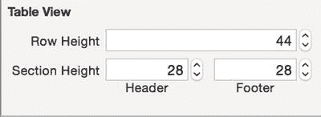

图 7-23. 在 Interface Builder 中设置表格的行高

-   通过编程方式，使用 `tableView.rowHeight = 100.0` 为表格视图设置 `rowHeight` 属性。这会覆盖您在 Interface Builder 中设置的单元格高度。
-   通过 Interface Builder 的尺寸检查器中设置表格视图的 `rowHeight` 属性，如图 7-23 所示。

#### 设置可变行高

如果单元格的内容需要，您可以显示具有不同行高的表格。然而，灵活性越大，责任也越大：不同的行高可能会对表格视图的性能产生显著影响。

其原因在于 `UITableView` 是 `UIScrollView` 的一个专门子类。滚动视图的框架提供了一个“窗口”来查看（可能）更大的内容视图，因此，为显示滚动视图需要实现的一个关键设置计算是整体内容大小。这一点如图 7-24 所示。

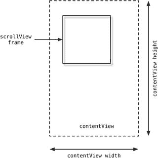

图 7-24. `UIScrollView` 的框架与内容大小之间的关系

可以将 `UITableView` 视为一个 `UIScrollView`，其 `contentView` 宽度与框架相同，但高度随需要显示的单元格数量而变化。这一点如图 7-25 所示。

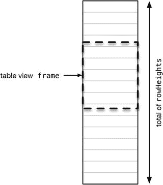

图 7-25. 表格视图的框架与总行高之间的关系

在表格视图可以显示之前，它会向数据源询问表格的总行数，然后依次计算每行的高度，最后将它们全部相加得到表格的总高度。

如果表格中有大量单元格，这可能会耗费大量时间。如果数据源是动态的，每当表格的底层数据发生变化时，也需要重新运行此计算。

幸运的是，`UITableView` 提供了一种减轻此影响的方法。您之前看到的最简单选项是为所有单元格赋予相同的高度，这样计算就只是 `（行数 × 行高）`。

如果您的表格将有不同高度的行，则此方法不可行。另一种极端情况是，实现 `UITableViewDelegate` 的 `heightForRowAtIndexPath:` 函数，以计算并返回指定 `indexPath` 的行高：

```
func tableView(tableView: UITableView, heightForRowAtIndexPath ➤
   indexPath: NSIndexPath) -> CGFloat {
    // 在此处计算行的高度
    return height
}
```

这种方法适用于较小的表格，但对于较大的表格扩展性不佳，因为此函数会被调用 `n` 次，其中 `n` 是表格中的单元格数量。如果计算开销较大，表格视图的性能可能会变慢。

第三种选项试图在假设所有单元格具有相同高度与假设每个单元格都必须单独计算之间取得平衡。

通过设置估计的行高，您可以将其视为所有单元格的平均值。表格视图可以计算出一个大致接近的内容，但将行高的详细计算推迟到实际需要显示单元格时再进行。

设置估计行高有两种方法：

-   使用 `estimatedRowHeight` 属性全局设置：`tableView.estimatedRowHeight = 125.0`
-   实现 `UITableViewDatasource` 的 `tableview:estimatedHeightForRowAtIndexPath` 函数：

```
func tableView(tableView: UITableView, estimatedHeightForRowAtIndexPath ➤
   indexPath: NSIndexPath) -> CGFloat {
    return 125.0
}
```

第二种方法更灵活，因为它可以为不同的表格和/或分区返回不同的估计行高。

> **注意**：采用这些方法之一并不能消除在单元格显示前计算精确行高的需求。您仍然需要在 `cellForRowAtIndexPath:` 函数中，根据从数据模型检索到的实际单元格内容进行该计算。


## 处理表格中单元格的尺寸调整

在第 12 章中，你将了解选择和编辑表格内容时发生的各种变化，并且会花大量时间研究表格进入编辑模式时添加到单元格中的控件。

这引出一个问题：自定义单元格应该如何应对因表格进入编辑模式或整个设备旋转而产生的形状变化？

有两种事件会导致单元格尺寸调整：

- 使表格进入编辑模式，这会显示编辑和/或重排控件。
- 旋转设备，导致尺寸等级发生变化。

这两种事件都会导致单元格调整尺寸——第一种情况是因为单元格需要显示更多"家具"，第二种情况则是因为单元格必须适应新的表格宽度。

正如你之前看到的，当调用`setEditing:animated`函数时，表格会进入编辑模式。此时，如果单元格是可编辑的（和/或行可以重排），则会插入额外的单元格控件。

图 7-26 展示了表格的变化过程。

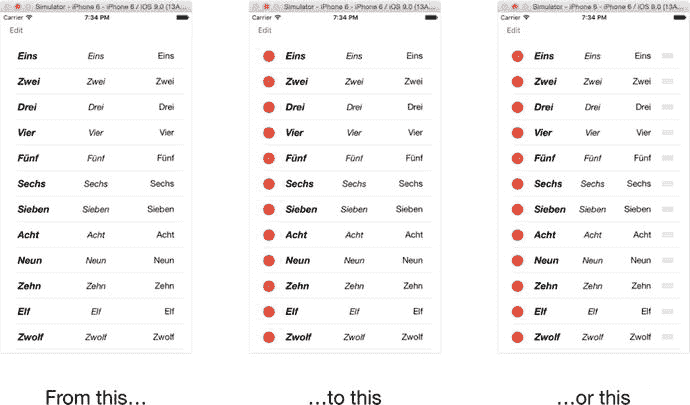

图 7-26. 从普通模式切换到编辑模式

删除或插入控件出现在单元格的左端，重排控件（如果适用）出现在右端。这意味着单元格的内容必须向右移动以容纳删除或插入控件，并可能收缩以容纳重排控件。

当删除/插入控件出现时，行看起来向右移动，如果适用，辅助视图会移出屏幕。在这两种情况下，单元格的`contentViews`会自动调整其`frames`的宽度值。

好消息是，AutoLayout 会为你处理单元格内容的重新排列。

图 7-27 到 7-29 展示了本例中使用的 AutoLayout 约束。

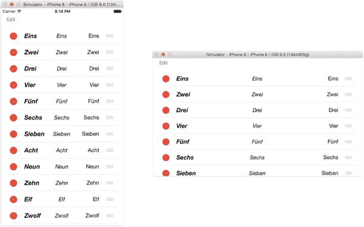

图 7-29. 单元格适应旋转

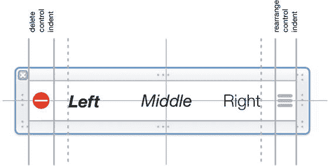

图 7-28. 处于"编辑"和"重排"模式的单元格

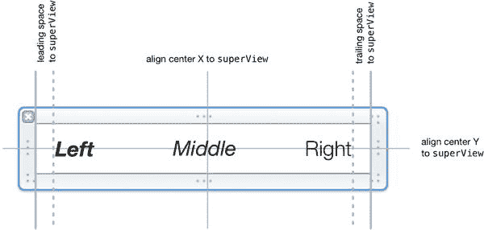

图 7-27. 单元格中的 AutoLayout 约束

## 本章小结

本章涵盖了创建和配置自定义`tableView`单元格的三种主要方式中的前两种：

- 向单元格的`contentView`添加子视图，并在`cellForRowAtIndexPath`数据源函数中配置它们
- 在 Storyboard 中创建原型单元格
- 使用 Interface Builder 从头设计单元格，并在从 NIB 文件加载单元格时通过代码配置自定义控件

第四种方式——虽然最灵活，但设置工作量也最大——是为你的`tableView`所需的每种单元格类型创建自定义子类。这将在第 8 章中介绍。

