# 8. 使用子类创建自定义单元格

在第 7 章中，你了解了创建和配置自定义表格视图和集合视图单元格的三种主要方式中的两种：

- 向单元格内置的`contentView`添加子视图
- 从头创建自定义单元格并从 XIB 文件实例化它

第三种方式提供了最大的灵活性，尽管代价是稍微复杂一些，即创建`UITableViewCell`或`UICollectionViewCell`的自定义子类。

使用这种方式的主要原因包括：你需要在同一个表格或集合视图中使用多种类型的单元格；或者对于表格视图而言，你想要对内容有更精细的控制，而通过添加子视图难以实现。

在本章中，你将了解使用`UITableViewCell`和`UICollectionView`子类创建自定义单元格的不同方法：

- 如何子类化`UITableViewCell`和`UICollectionViewCell`
- 结合 XIB 文件使用子类
- 处理单元格子类中的选中状态
- 通过重写`layoutSubviews`来自定义单元格
- 创建具有自定义`contentView`的单元格
- 使用模型-视图-视图模型模式改进应用架构。

## 为什么要创建自定义单元格子类？

通过使用自定义子类的方式来创建自定义单元格，让你在布局上拥有完全的灵活性。你从一张白纸（至少是一个空白视图）开始，因此单元格的外观完全由你决定。

代价是这种方式稍微复杂一些。首先，你必须创建`UITableViewCell`或`UICollectionView`的自定义子类。不过，不要因此而却步；根据我的经验，我们很容易花费大量时间试图使用某种"轻量级"方式获得期望的结果，而实际上，直接使用自定义子类反而更快。

创建自定义子类还能在同一个表格中创建多种类型的单元格。与将不同类型的数据强行塞入单一单元格类型相比，这为你的视觉设计提供了更大的自由度。

如你所料，有两种方法可供使用："视觉"方法，涉及在 Interface Builder 中创建自定义单元格；以及"代码"方法，完全通过代码创建和配置单元格。

不过，这两种方法在开始阶段都有几个共同步骤。


### 自定义单元格的创建流程

通过子类创建自定义单元格是一个多阶段的过程，无论采用哪种方法，初始阶段都有两个通用步骤。

首先，用纸笔设计自定义单元格的布局。这一步并非强制要求，但从长远来看，先在纸上构思好单元格各部分的组合方式通常会带来回报。接着，为每种继承自`UITableViewCell`或`UICollectionViewCell`的自定义单元格类型创建一个类，并为你将在单元格中创建的动态视图对象以及需要从单元格外部设置的任何属性实现对应的属性。

然后，你可以选择两种可视化方法之一：

- 在 Interface Builder 中将单元格构建为 XIB，并用你需要的视图对象（如标签、视图、图像等）填充它。
- 在 Storyboard 中将单元格构建为原型单元格，并像在 XIB 中一样用视图对象填充它。

或者选择基于代码的方法：

- 在自定义子类中，通过重写初始化函数 `init(style:reuseIdentifier)` 在代码中布局单元格，并将控件添加到 `contentView` 中。

最后，是最终的通用步骤：

在单元格所需的 `layoutSubviews` 函数中添加任何自定义初始化代码，以确保其正常运行。当表格需要使用自定义单元格填充一行时，在 `dataSource` 中实例化你的自定义 `UITableViewCell` 或 `UICollectionView` 子类的一个实例，并根据数据设置动态属性。根据需要重复此过程！

如你所见，这其实并不是一个复杂的过程。在构建自定义单元格时，只需注意一些细微之处（详见下方注释），你就会发现这实际上是一个快速且灵活的过程。

#### 需要注意的性能相关因素

在创建`UITableViewCell`或`UICollectionView`的子类时，为了最大化表格的性能，需要注意以下几个与性能相关的因素：

- 注意避免构建那些对图形引擎渲染成本高昂的单元格。尽管 iPhone 和 iPad 内置的 GPU（图形处理单元）考虑到设备尺寸已提供了惊人的性能，但它们并非无懈可击。尤其要小心透明度和 alpha 值。如果 GPU 需要计算通过上层透明度遮罩能看到多少下层内容，这可能会导致严重的性能下降。更多细节请参阅第 9 章。
- 不要违反 MVC 原则。你的自定义单元格是一个视图，因此应仅负责显示内容。如果你需要对内容进行任何基于代码的配置（例如拼接字符串或添加数值），这些操作应在数据源中完成，而非视图本身。

提到这两点注意事项后，不要因此放弃探索可能性的边界。iOS 设备家族成员都是高性能的小野兽，所以在触及它们的能力极限之前，你很可能会对所能实现的效果感到惊讶。

### 使用 XIB 的自定义单元格

在本节中，你将学习如何结合 Interface Builder 和 XIB 来设计自定义单元格子类的过程。

#### 设计你的单元格

在设计自定义单元格时，我会放下 Magic Mouse，拿起铅笔和方格纸。这对我来说很有效——你的方法可能不同——但我发现，一旦开始尝试在 Interface Builder 中设计单元格，两个问题会很快浮现。

首先，在我还没决定单元格实际要做什么之前，Interface Builder 往往会将我推向“像素完美”的方向。由于可以（相对）轻松地将元素精准对齐，很容易让人把时间花在这上面，而牺牲了对整体设计的思考。

其次，我会很快对 Interface Builder 的局限性感到沮丧。它看起来应该像 Photoshop 这类工具一样具备对布局的精细控制能力，但实际上并非如此。如果说用 Photoshop 设计布局是用手术刀进行精密手术，那么用 Interface Builder 有时会感觉像用扫帚粉刷砖墙。

> **注**
> 为了说明创建自定义单元格的过程，以及在同一表格中使用多种类型的单元格，我们将创建一个略为刻意的示例，包含两种类型：一种用于偶数行的单元格，另一种用于奇数行的单元格。

#### 创建自定义单元格的类

你将创建的新自定义单元格将是`UITableViewCell`或`UICollectionViewCell`子类的实例。这意味着在创建它们时，它们将具备“标准”单元格的所有功能，同时你还有机会添加自己的额外功能。

为说明这一过程，你将创建两个`UITableViewCell`子类，分别命名为`OddCell`和`EvenCell`，这样表格最终将拥有两种不同布局的单元格类型。

该过程对于`UICollectionView`几乎完全相同，但你将在本章稍后部分具体了解。

##### 创建子类

第一步是创建子类（图 8-1）。在 Xcode 中，按住 Ctrl 键单击你要创建新类的分组，然后从弹出窗口中选择“新建文件”。

接着，从“来源”分组中选择 Cocoa 类图标，点击“下一步”，如图 8-1 所示。

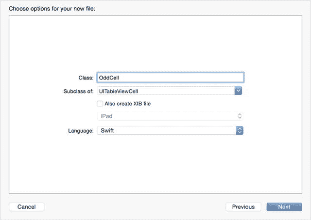

**图 8-1.** 创建新子类

下一屏幕允许你选择新类所属的父类。从下拉菜单中选择`UITableViewCell`。

将你的新类命名为 `OddCell` 并保存。现在你会看到 `OddCell` 的类文件。

接下来，你需要为单元格内的自定义控件创建属性（清单 8-1）。

**清单 8-1.** `OddCell` 类

```
import UIKit

class OddCell: UITableViewCell {

    @IBOutlet var backView: UIImageView!
    @IBOutlet var iconView: UIImageView!
    @IBOutlet var cellTitle: UILabel!
    @IBOutlet var cellContent: UILabel!

    override func awakeFromNib() {
        super.awakeFromNib()
        // 初始化代码
    }

    override func setSelected(selected: Bool, animated: Bool) {
        super.setSelected(selected, animated: animated)
        // 配置选中状态下的视图
    }
}
```

至此，你就可以构建 `OddCell` 的 XIB 文件，并将类的属性与 XIB 文件中的输出口连接起来了。

#### 在 Interface Builder 中构建单元格

创建单元格本身是一个四个阶段的过程，你将在 Interface Builder 中完成。

- 创建 XIB 文件（如果在创建子类时勾选了“同时创建 XIB 文件”选项，则此步骤可省略）。
- 在 XIB 中布局自定义控件。
- 将 XIB 与你的自定义类关联。
- 将自定义控件与自定义类的属性连接起来。


#### 创建 XIB 文件

在 Xcode 中，按住 Ctrl 键单击要创建新 XIB 的组，然后从弹出窗口中选择 New File。

接着，在 iOS 分组中选择 `User Interface` 部分，并从模板列表中选择 `View` 图标（图 8-2）。

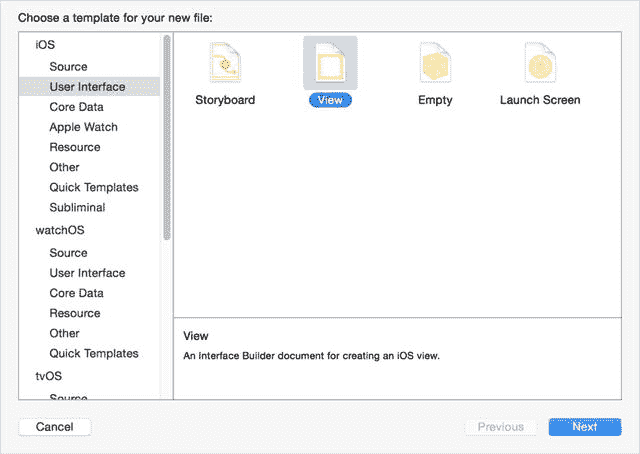

图 8-2. 选择模板

然后你需要为单元格提供一个名称（为了保持一致性，我将其命名为 `OddCell`），并单击 `Create` 保存。

新视图会在 Interface Builder 中打开，显示为一个空白视图。Xcode 假设这是一个尺寸等级为 `Any, Any` 的视图，但这并非你想要的。因此，略显反直觉的是，创建新视图后你首先需要做的就是删除它。

高亮左侧文档大纲中该视图的图标，然后按删除键。现在你得到了一个完全空白的 Interface Builder 面板。

这时就可以创建新的单元格了。在工具区对象列表的中部有一个 `Table View Cell`。将其拖拽到中央面板，你就用表格视图单元格替换了全窗口视图（图 8-3）。

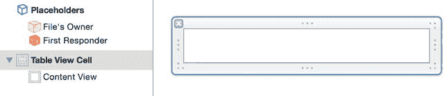

图 8-3. 新的空单元格

新的单元格会自动拥有一个标准尺寸。你可以像调整其他 `UIView` 控件一样调整它的大小：要么拖拽单元格边框上的尺寸手柄，要么在 Size Inspector 中设置尺寸。

无论使用哪种方法，请记下高度值；稍后你需要在 `tableView:heightForCellAtIndexPath:` 函数中返回这个值。我的 `OddCell` 高度为 70 点。

#### 在 Interface Builder 中布局控件

本质上，这与你之前经历的过程完全相同：将控件从对象库拖拽到 `UITableViewCell` 中，然后适当地调整其大小和布局。

具体如何操作显然取决于你的单元格设计。这是我正在制作的 `OddCell` XIB，它包含四个控件（图 8-4）：

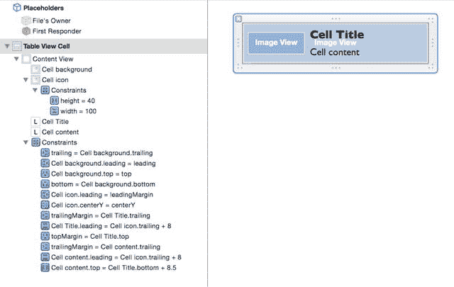

图 8-4. 制作中的 OddCell XIB

- 两个 `UIImageViews`，一个用于背景，一个用于图标
- 两个 `UILabels`，一个用于单元格的标题，一个用于单元格的内容

完全实例化后，`OddCell` 的实例将如图 8-5 所示。

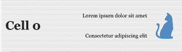

图 8-5. OddCell 单元格

#### 使单元格遵循自定义类

如果你在创建自定义类时没有创建 XIB 文件，则需要执行此步骤。如果你已经创建了，那么 XIB 文件中的单元格将是正确子类的实例，你可以直接跳到下一节。

如果没有，该单元格是 `UITableViewCell` 的一个实例。在你的自定义类（它本身是 `UITableViewCell` 的子类）中，你为自定义控件创建了许多输出口。

问题在于，因为你的自定义类是 `UITableViewCell` 的子类，父类既不知道也不关心你创建的输出口和属性。为了将单元格内的控件连接到自定义子类中的输出口，你需要使单元格遵循该子类。

幸运的是，这可能是整个过程中最简单的一步。在对象部分中，高亮选择 Table View Cell 图标（如图 8-6 所示）。

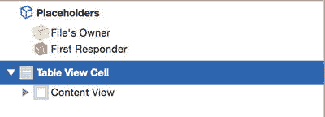

图 8-6. 对象部分

然后切换到 Identity Inspector，如果 Custom Class 部分不可见，请展开它。目前，它会显示该单元格继承自 `UITableViewCell`。

你需要做的是修改此项，使单元格的类成为你自定义的 `UITableViewCell` 子类。在 Custom Class 部分中覆盖输入内容，Xcode 会自动补全 `UITableViewCell` 子类的名称（图 8-7）。

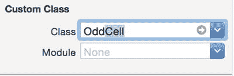

图 8-7. 更改单元格的所有者

> **提示：** 在你的表格开发生涯中，可能会出现这样的情况：加载自定义表格时应用立即崩溃，错误信息类似于：
>
> `2015-11-05 19:58:13.263 myApp[6042:f803] *** Terminating app due to uncaught exception ’NSUnknownKeyException’, reason: ’[<UITableViewCell 0x6895790> setValue:forUndefinedKey:]: this class is not key value coding-compliant for the key cellSubtitle.’`
>
> 别慌。这几乎肯定是单元格控件连接出错导致的。检查一下你是否是从自定义单元格（而不是文件的所有者）进行的连接。

#### 连接自定义控件

如果你通过 Interface Builder 在单元格中创建了任何控件（而不是在代码中实例化它们），那么这些控件目前是孤立的。如果它们不会随单元格数据而改变（例如，如果你有一个静态背景视图），那就没问题。但如果你希望控件反映模型中的数据，则必须将它们连接到自定义类中的输出口。

现在你应该对此很熟悉了。按住 Ctrl 键单击对象列表中的 Custom Cell，以显示输出口 HUD，然后从圆圈拖拽到单元格本身的控件上，如图 8-8 所示。

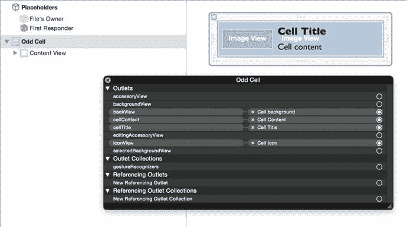

图 8-8. 输出口 HUD

对所有插入到单元格中的动态控件重复此操作。

> **注意：** 由于此自定义单元格是 `UITableViewCell` 的子类，它继承了 `UITableViewCell` 的所有属性，例如 `accessoryView` 和 `backgroundView`。

#### 创建 EvenCell

在这个例子中，`EvenCell` 类与 `OddCell` 类并没有太大不同，但当然，如果你的应用需要，你可以自由创建截然不同的单元格。

`EvenCell` 的实例将如图 8-9 所示。


图 8-9. EvenCell 单元格

`EvenCell` 子类几乎与 `OddCell` 相同，只多了一个属性；参见代码清单 8-2。

代码清单 8-2. EvenCell 子类

```
import UIKit

class EvenCell: UITableViewCell {

    @IBOutlet var backView: UIImageView!
    @IBOutlet var iconView: UIImageView!
    @IBOutlet var cellTitle: UILabel!
    @IBOutlet var cellMainContent: UILabel!
    @IBOutlet var cellOtherContent: UILabel!

    override func awakeFromNib() {
        super.awakeFromNib()
        // 初始化代码
    }

    override func setSelected(selected: Bool, animated: Bool) {
        super.setSelected(selected, animated: animated)
        // 配置选中状态下的视图
    }

}
```


### 设置单元格高度

除非你另行指定，否则`tableView`默认会假定所有单元格的标准高度为 44 点。由于刚刚创建的自定义单元格类型不具备标准尺寸，你需要实现`UITableViewDelegate`协议中的`tableView:heightForRowAtIndexPath:`函数，才能获得正确大小的单元格。

如果遗漏了这个函数，你的表格仍能正常工作，但系统会试图将单元格强行压缩至 44 点高度，导致内容被裁剪。

`tableView:heightForRowAtIndexPath:`函数如代码清单 8-3 所示。该函数仅需检查`indexPath`的奇偶性，然后以`CGFloat`类型返回相应的高度值。

**代码清单 8-3.** `tableView:heightForRowAtIndexPath:`函数

```
extension ViewController: UITableViewDelegate {

    func tableView(tableView: UITableView, heightForRowAtIndexPath ➤
   indexPath: NSIndexPath) -> CGFloat {

        if (indexPath.row % 2 == 0) {
            return EvenRowHeight
        }

        return OddRowHeight
    }

}
```

由于行高这类数值对于成功绘制界面至关重要，通常将它们存储在常量中会很有帮助：

```
let OddRowHeight: CGFloat = 70.0
let EvenRowHeight: CGFloat = 100.0
```

### 创建自定义单元格实例

在费尽周折创建了自定义子类并设计了自定义单元格布局之后，你终将需要创建它们的实际实例。

不出所料，这一过程发生在我们的老朋友——`tableView:cellForRowAtIndexPath:`函数中。到目前为止，你一直在创建标准`UITableViewCell`的实例，而现在你将稍作调整，创建自定义类之一的实例。

本例还略显复杂，因为存在两种类型的单元格。这意味着需要某种条件代码来选择创建哪种类型的单元格。

不过在创建任何单元格类型之前，你需要先在`tableView`中注册你创建的 XIB 文件，以便在需要时能够创建或复用它们。

为了保持视图控制器的条理性，你可以将此过程放在一个扩展中，并在`viewDidLoad:`方法里调用该函数。配置函数如代码清单 8-4 所示。

**代码清单 8-4.** 配置表格

```
extension ViewController {

func configureTable() {

tableView.registerNib(UINib(nibName: "OddCell", bundle: nil), ➤
forCellReuseIdentifier: OddCellIdentifier)

tableView.registerNib(UINib(nibName: "EvenCell", bundle: nil), ➤
forCellReuseIdentifier: EvenCellIdentifier)

}

}
```

单元格标识符很重要，因为它们会在多处使用，因此同样被定义为常量：

```
let OddCellIdentifier = "OddCellIdentifier"
let EvenCellIdentifier = "EvenCellIdentifier"
```

最后，从`viewDidLoad:`中调用配置函数：

```
override func viewDidLoad() {
    super.viewDidLoad()
    configureTable()
}
```

注册完 XIB 文件后，它们就可以在`tableView:cellForRowAtIndexPath:`函数中使用了。

代码清单 8-5 展示了第一版实现。`tableData`和`phraseData`属性只是你之前在`viewDidLoad:`函数中创建的拉丁文样板文本数组。

**代码清单 8-5.** 从`tableView:cellForRowAtIndexPath:`函数返回自定义单元格

```
func tableView(tableView: UITableView, cellForRowAtIndexPath indexPath: NSIndexPath)➤
-> UITableViewCell {

    let remainder = indexPath.row % 2

    switch remainder {
    case 0:
        let cell = tableView.dequeueReusableCellWithIdentifier(EvenCellIdentifier,➤
            forIndexPath: indexPath) as! EvenCell

        cell.iconView.image = UIImage(named: "cat")
        cell.backgroundColor = UIColor(patternImage: UIImage(named: "evenBackground")!)
        cell.cellTitle.text = "Cell \(indexPath.row)"
        cell.cellMainContent.text = tableData[indexPath.row]
        cell.cellOtherContent.text = tableData[indexPath.row + 1]

        return cell
    default:
        let cell = tableView.dequeueReusableCellWithIdentifier(OddCellIdentifier, ➤
            forIndexPath: indexPath) as! OddCell

        cell.iconView.image = UIImage(named: "dog")
        if let patternImage = UIImage(named: "oddBackground") {
            cell.backgroundColor = UIColor(patternImage: patternImage)
        }
        cell.cellTitle.text = "Cell \(indexPath.row)"
        cell.cellContent.text = tableData[indexPath.row]

        return cell
    }

}
```

这与标准的`tableView:cellForRowAtIndexPath:`函数并无太大区别，但存在一些变化：

```
let remainder = indexPath.row % 2;
```

`remainder`是行号除以`2`后的余数。如果余数为`0`，则该行为偶数行；如果余数为`1`，则为奇数行。

这使你能够通过在奇偶单元格之间进行切换，来创建相应自定义单元格的实例：

```
switch remainder {
case 0:
    let cell = tableView.dequeueReusableCellWithIdentifier(EvenCellIdentifier, ➤
        forIndexPath: indexPath) as! EvenCell
    ... 在此处配置单元格 ...
    return cell
default:
    let cell = tableView.dequeueReusableCellWithIdentifier(OddCellIdentifier, ➤
        forIndexPath: indexPath) as! OddCell
    ... 在此处配置单元格 ...
    return cell
}
```

配置各个单元格取决于你在 XIB 中创建的输出口，例如`OddCell`：

```
cell.iconView.image = UIImage(named: "dog")
if let patternImage = UIImage(named: "OddBackground") {
    cell.backgroundColor = UIColor(patternImage: patternImage)
}
cell.cellTitle.text = "Cell \(indexPath.row)"
cell.cellContent.text = tableData[indexPath.row]
```

创建`EvenCell`实例的过程与此类似，最终得到的`tableView`效果将如图 8-10 所示。

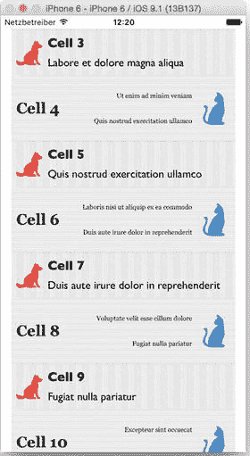

**图 8-10.** 同一表格中的两种不同`UITableViewCell`子类


### 处理自定义单元格的选中状态

如果修改了单元格的 `backgroundView` 属性，你很可能还需要控制在单元格被选中时的突出显示方式。

单元格的选中状态由 `UITableViewCell` 的 `selectionStyle` 属性控制。该属性有以下四种状态：

- `UITableViewCellSelectionStyleNone`
- `UITableViewCellSelectionStyleBlue`
- `UITableViewCellSelectionStyleGray`
- `UITableViewCellSelectionStyleDefault`

当 `selectionStyle` 设置为 `None` 时，选中后没有可见变化；但其他三种状态会使单元格的背景显示为纯色填充。

单元格还有两个位于 `contentView` 后方的背景视图：默认显示的 `backgroundView`，以及位于 `backgroundView` 与 `contentView` 之间（默认不显示）的 `selectedBackgroundView`。

这种布局如图 8-11 所示。

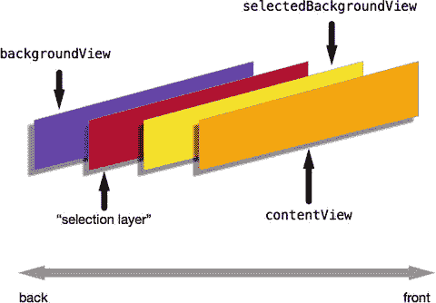

图 8-11. 单元格内部视图的排列布局

由 `selectionStyle` 属性控制的“选中层”位于 `backgroundView` 之上，因此如果你修改了 `backgroundView`，当单元格被选中时，它会被默认的选中颜色所遮盖。

这可能没问题，但如果你想要纯蓝或纯灰以外的背景，就需要修改 `selectedBackgroundView` 属性。该属性位于 `contentView` 后方，但在“选中层”之前，因此你看到的将是 `selectedBackgroundView` 中的内容，而不是默认的纯色。

它可以是一个纯色视图，例如：

```
let redView = UIView(frame: cell.selectedBackgroundView.frame)
redView.backgroundColor = UIColor.redColor()
cell.selectedBackgroundView = redview
```

这个 `selectedBackgroundView` 需要添加到单元格中。你可以在任何选中操作发生之前执行此操作（例如，在 `cellForRowAtIndexPath:` 函数中，如代码清单 8-6 所示）。

**代码清单 8-6.** 在 `cellForRowAtIndexPath:` 中设置 `selectedBackgroundView`：

```
func tableView(tableView: UITableView, cellForRowAtIndexPath indexPath: NSIndexPath) -> UITableViewCell {
    let cell = tableView.dequeueReusableCellWithIdentifier("CellIdentifier", forIndexPath: indexPath)
    let selectionView = UIView(frame: cell.frame)
    selectionView.backgroundColor = UIColor.cyanColor()
    cell.selectedBackgroundView = selectionView
    ... 在此处配置单元格的其他部分 ...
    return cell
}
```

或者，你也可以在响应单元格选中时进行设置（如代码清单 8-7 所示）。

**代码清单 8-7.** 在处理单元格选中时添加 `selectedBackgroundView`

```
func tableView(tableView: UITableView, didSelectRowAtIndexPath indexPath: NSIndexPath) {
    let cell = tableView.cellForRowAtIndexPath(indexPath)
    let selectionView = UIView(frame: cell!.frame)
    cell?.selectedBackgroundView = selectionView
    selectionView.backgroundColor = UIColor.greenColor()
}
```

当然，如果你的设计需要更有创意，你也并不局限于使用纯色来表示选中状态。下面是如何使用图片：

```
let selectedImageView = UIImageView(frame: cell.frame)
if let selectedImageView.image = UIImage(named: "SelectedCellBackground") {
    cell.selectedBackgroundView = selectedImageView
}
```

这将遮盖“选中层”，以便你能控制自定义单元格的背景外观。

## 通过代码实现自定义单元格

通过可视化方式布局单元格能带你走得很远，但如果你更喜欢基于代码的方法，你可以重写 `init(style:reuseIdentifier:)`，然后在自定义单元格子类中使用 `layoutSubviews` 函数或添加 AutoLayout 约束，从而布局一个完全自定义的单元格。

### 通过代码实现自定义单元格的流程

通过代码创建自定义单元格的过程分为六个步骤：

- 为你需要的每种单元格类型创建一个 `UITableViewCell` 或 `UICollectionViewCell` 的自定义子类。
- 在类中创建属性，用于将数据传入单元格。
- 通过重写 `init(style:reuseIdentifier:)` 函数（针对 `UITableViewCell`）或 `init(frame:)` 函数（针对 `UICollectionViewCell`）来布局单元格的控件。
- 重写 `layoutSubviews` 函数，以传入的单元格属性值更新单元格的控件。
- 可选地，重写 `prepareForReuse()` 函数，在单元格即将显示前更新其控件。
- 注册该单元格类以供表格或集合视图使用。
- 实现标准的 `datasource` 函数，以将单元格出列作为自定义单元格子类的实例。

在本节中，你将构建一个表格视图和一个集合视图，它们使用自定义单元格来显示图 8-12 所示的简单布局。

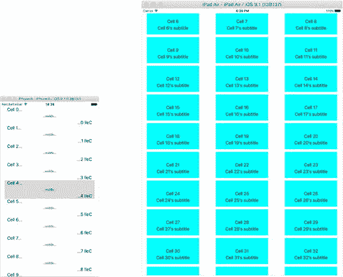

图 8-12. 使用自定义单元格的应用程序

### 创建自定义子类

为了创建具有自定义子类的单元格，你需要重写相应的 `init` 函数：

- 针对 `UITableViewCell` 的 `init(style:reuseIdentifier:)`
- 针对 `UICollectionViewCell` 的 `init(frame:)`

以及通用的 `init` 函数：

- `init(coder:)`

尽管你必须提供最后一个函数的实现来满足编译器要求，但在你创建单元格的过程中它实际上不会被调用。

#### 创建类

创建类最快的方式是使用内置模板：

- 从 **File** 菜单中，选择 **File ➤ New ➤ File** 选项，或键入 **Ctrl + N**。
- 在模板中，选择 **Cocoa Touch** 类选项。
- 命名你的类，然后选择 `UITableViewCell` 或 `UICollectionViewCell` 作为父类。

现在你可以开始实现自定义类了。

#### 向表格或集合视图注册自定义类

创建自定义类后，你需要告诉表格或集合视图如何使用它们。这通过 `registerClass` 函数完成：

```
collectionView.registerClass(CustomCell.self, forCellWithReuseIdentifier: "CustomCVCell")
```

或

```
tableView.registerClass(CustomClassCell.self, forCellReuseIdentifier: "CustomTVCell")
```

这必须在任何可能出列单元格的操作之前完成，因此我通常会在视图控制器的 `viewDidLoad` 函数中调用它。

完成这一步后，就可以开始处理自定义单元格类了。

#### `init` 函数

`init(style:reuseIdentifier:)` 和 `init(frame:)` 函数在数据源创建单元格实例时被调用；正是在这里你绘制单元格的内容。

**注意：** 你可能会惊讶地发现，即使你的控件有数千个单元格，在整个表格或集合视图的生命周期中，`init` 函数只会被调用几次。这是由这两个控件的缓存和出列机制决定的；通过回收之前创建的单元格，可以最大限度地减少昂贵的设置操作次数。


#### 表格视图单元格的初始化函数

首先，让我们添加该类所需的属性：

`var cellTitle: String?`
`var cellSubtitle: String?`
`var leftLabel: UILabel!`
`var middleLabel: UILabel!`
`var rightLabel: UILabel!`

这两个 `String?` 属性将由数据模型的对象进行设置；而三个标签将用于显示数据。

现在，先处理 `init(coder:)` 函数：

```
required init?(coder aDecoder: NSCoder) {
    super.init(coder: aDecoder)
}
```

接下来你可以实现 `init(style:reuseIdentifier:)` 函数；在此阶段它并没有复杂多少：

```
override init(style: UITableViewCellStyle, reuseIdentifier: String?) {
    super.init(style: style, reuseIdentifier: reuseIdentifier)
    setupViews()
}
```

为了减少代码重复，实现一个创建 `UILabel` 的辅助函数，如代码清单 8-8 所示。该函数对于表格视图和集合视图是一样的。

代码清单 8-8. 标签辅助函数

```
func drawLabel() -> UILabel {
    let cellTitleLabel = UILabel(frame: CGRectZero)
    cellTitleLabel.translatesAutoresizingMaskIntoConstraints = false
    cellTitleLabel.sizeToFit()
    return cellTitleLabel
}
```

繁重的工作由 `setupViews()` 函数完成，如代码清单 8-9 所示。

代码清单 8-9. setupViews( ) 函数

```
func setupViews() {
    // 设置标题标签
    leftLabel = drawLabel()
    let vLeftLabelConstraint = NSLayoutConstraint(item: leftLabel, attribute: ➤
NSLayoutAttribute.Top, relatedBy: NSLayoutRelation.Equal, toItem: self.contentView, ➤
attribute: NSLayoutAttribute.Top, multiplier: 1.0, constant: 0)
    let hLeftLabelConstraint = NSLayoutConstraint(item: leftLabel, attribute: ➤
NSLayoutAttribute.Left, relatedBy: NSLayoutRelation.Equal, toItem: self.contentView, ➤
attribute: NSLayoutAttribute.Left, multiplier: 1.0, constant: 10)

    // 设置中间标签
    middleLabel = drawLabel()
    let vMiddleLabelConstraint = NSLayoutConstraint(item: middleLabel, attribute: ➤
  NSLayoutAttribute.CenterY, relatedBy: NSLayoutRelation.Equal, toItem: ➤
  self.contentView, attribute: NSLayoutAttribute.CenterY, multiplier: 1.0, constant: 0)
    let hMiddleLabelConstraint = NSLayoutConstraint(item: middleLabel, attribute: ➤
  NSLayoutAttribute.CenterX, relatedBy: NSLayoutRelation.Equal, toItem: ➤
  self.contentView, attribute: NSLayoutAttribute.CenterX, multiplier: 1.0, constant: 0)

    // 设置副标题标签
    rightLabel = drawLabel()
    rightLabel.text = "...middle..."
    rightLabel.font = UIFont(name: "Georgia", size: 11.0)
    rightLabel.sizeToFit()
    let vRightLabelConstraint = NSLayoutConstraint(item: rightLabel, attribute: ➤
  NSLayoutAttribute.Bottom, relatedBy: NSLayoutRelation.Equal, toItem: ➤
  self.contentView, attribute: NSLayoutAttribute.Bottom, multiplier: 1.0, constant: 0)
    let hRightLabelConstraint = NSLayoutConstraint(item: rightLabel, attribute: ➤
  NSLayoutAttribute.Right, relatedBy: NSLayoutRelation.Equal, toItem: ➤
  self.contentView, attribute: NSLayoutAttribute.Right, multiplier: 1.0, constant: -10)

    self.contentView.addSubview(leftLabel)
    self.contentView.addSubview(middleLabel)
    self.contentView.addSubview(rightLabel)
    self.contentView.addConstraints([vLeftLabelConstraint, hLeftLabelConstraint, ➤
        vMiddleLabelConstraint, hMiddleLabelConstraint, ➤
        vRightLabelConstraint, hRightLabelConstraint])
}
```

逐一来看，你通过调用辅助函数依次创建每个 `UILabel`。然后为每个标签设置水平和垂直的 AutoLayout 约束。

这些标签被添加到单元格的 `contentView` 中，然后布局约束也被添加到该容器中。

#### 集合视图的初始化函数

如果你正在构建一个 `UICollectionViewCell` 子类，其过程与 `UITableViewCell` 非常相似。

以下是 `init` 函数：

```
override init(frame: CGRect) {
    super.init(frame: frame)
    setupViews()
}
```

`drawLabel()` 函数与代码清单 8-8 完全相同，`setupViews()` 函数如代码清单 8-10 所示。

代码清单 8-10. 集合视图单元格的 setupViews( ) 函数

```
func setupViews() {
    // 设置标题标签
    titleLabel = drawLabel()
    let vTitleConstraint = NSLayoutConstraint(item: titleLabel, attribute: ➤
NSLayoutAttribute.CenterY, relatedBy: NSLayoutRelation.Equal, toItem: ➤
self.contentView, attribute: NSLayoutAttribute.CenterY, multiplier: 1.0, constant: 0)
    let hTitleConstraint = NSLayoutConstraint(item: titleLabel, attribute: ➤
NSLayoutAttribute.CenterX, relatedBy: NSLayoutRelation.Equal, toItem: ➤
self.contentView, attribute: NSLayoutAttribute.CenterX, multiplier: 1.0, constant: 0)

    self.contentView.addSubview(titleLabel)

    // 设置副标题标签
    subtitleLabel = drawLabel()
    let hSubtitleConstraint = NSLayoutConstraint(item: subtitleLabel, attribute: ➤
NSLayoutAttribute.CenterX, relatedBy: NSLayoutRelation.Equal, toItem: ➤
self.contentView, attribute: NSLayoutAttribute.CenterX, multiplier: 1.0, constant: 0)
    let vSubtitleConstraint = NSLayoutConstraint(item: subtitleLabel, attribute: ➤
NSLayoutAttribute.Top, relatedBy: NSLayoutRelation.Equal, toItem: titleLabel, ➤
attribute: NSLayoutAttribute.Bottom, multiplier: 1.0, constant: 5)

    self.contentView.addSubview(subtitleLabel)
    self.contentView.backgroundColor = UIColor.cyanColor()

    // 应用约束
    self.contentView.addConstraints([vTitleConstraint, hTitleConstraint, ➤
   hSubtitleConstraint, vSubtitleConstraint])
}
```

在这里，你通过辅助函数依次创建每个标签，然后设置一些 AutoLayout 约束。一旦标签被添加到 `contentView` 中，就可以应用约束了。


### 重写 `layoutSubviews` 函数

当单元格被出队时，会调用其 `layoutSubviews` 函数；这是在绘制前调整单元格布局和外观、以及根据传入单元格的数据模型设置任何控件内容的绝佳机会。

为了说明其实际工作方式，让我们来看看集合视图应用的 `viewController` 类中的 `cellForItemAtIndexPath:` 函数，如代码清单 [8-11] 所示。

**代码清单 8-11.** 集合视图的 `cellForItemAtIndexPath:` 函数
```
func collectionView(collectionView: UICollectionView, cellForItemAtIndexPath
indexPath: NSIndexPath) -> UICollectionViewCell {
    let cell = collectionView.dequeueReusableCellWithReuseIdentifier("CustomCVCell",
forIndexPath: indexPath) as! CustomCell
    cell.cellTitle = cvData[indexPath.row]
    return cell
}
```
你之前已经见过这种模式。你使用单元格标识符将单元格出队，然后将其向下转型为自定义类的实例。

这样，你就能访问单元格的属性，将数据模型中的相关对象传入，然后将单元格返回给集合视图。

**代码清单 8-12.** 集合视图的 `cellForItemAtIndexPath:` 函数
```
func tableView(tableView: UITableView, cellForRowAtIndexPath indexPath: NSIndexPath)
-> UITableViewCell {
    let cell = tableView.dequeueReusableCellWithIdentifier("CustomTVCell",
    forIndexPath: indexPath) as! CustomClassCell
    cell.cellTitle = "Cell \(tableData[indexPath.row])..."
    cell.cellSubtitle = "...\(tableData[indexPath.row]) lleC"
    return cell
}
```
在幕后，单元格的 `init` 和 `layoutSubviews` 函数被依次调用：

- 当单元格的新实例被初始化时，会调用 `init` 函数。这只会在创建最开始的几个单元格时发生；之后，表格或集合视图会缓存滚出视图顶部或底部的单元格以供重用。
- `layoutSubviews` 函数恰好在单元格显示之前被调用，因此这是你更新单元格控件以显示出队时传入数据的好时机。

### 重写 `prepareForReuse` 函数

`prepareForReuse()` 函数在单元格从 `dequeueReusableCellWithIdentifier:` 或 `dequeueReusableViewWithIdentifier:` 函数返回之前被调用。

这是在单元格被重用之前清理它的最后机会，但在重写此函数时有几点需要注意：

- 始终确保在函数开头通过 `super.prepareForReuse()` 调用父类的实现。
- 仅使用此函数来重置单元格的非内容属性——比如透明度、编辑或选择属性。使用它来更改与内容相关的控件可能会对性能产生负面影响。

## 使用 MVVM 改进应用架构

`UITableView` 和 `UICollectionView` 是复杂的“野兽”，它们依赖大量“活动部件”才能工作：表格和集合视图对象、单元格、数据源、委托以及视图控制器。所有这些部件都必须协同工作才能产生预期的效果。

活动部件的数量可能导致应用中类的职责模糊。例如，到目前为止你多次见到的一个非常常见的模式是，一个 `UIViewController` 同时充当表格或集合视图的 `dataSource` 和 `delegate`。

这本身并没有错，但一个执行多项任务的类通常被视为代码异味：(该类)更难编写、编写后更难理解、更难测试，也更难调试。

面向对象软件中最重要的设计模式之一是**单一职责原则**，可以概括为“做好一件事，并且做好它。”模型-视图-视图模型（或 MVVM）方法是实现这一目标的一种方式。

### 模型-视图-视图模型方法

要理解 MVVM 模型，最好先从查看组织表格视图项目的“传统”方法开始。

> **注意：** 我将用一个 `UITableView` 示例来说明 MVVM 方法，但所有适用于表格视图上下文中 MVVM 的内容也同样适用于 MVVM 和 `UICollectionView`。

控制器和视图之间的划分是相当明显的：表格是视图，而充当表格数据源和委托的视图控制器是控制器。

但视图稍微复杂一些；单元格也是视图对象，数据源必须了解单元格，以便在 `tableView:cellForRowAtIndexPath:` 函数中配置它们。这意味着数据源必须关注单元格的内部结构，以便能够设置其输出口。

如果你更改了数据模型，就必须同时更改单元格和数据源。如果你有多个单元格类型，你的 `cellForRowAtIndexPath:` 函数会很快因为检查正在配置的是哪种单元格的 if-then 语句而变得混乱不堪。像这样庞大复杂的逻辑语句是一种代码异味：难以阅读、难以理解、难以测试，也难以调试。

MVVM 从根本上改变了这种方法，但仅通过一个非常简单的改变。

你首先专注于数据源的职责。它做两件事：从底层数据模型中获取相关对象，并将其传递给单元格，然后将单元格交给表格。它既不知道也不关心单元格的内部结构；就数据源而言，单元格有一个可以设置的单一属性，即**视图模型**。

视图模型是包含单元格自配置所需所有数据的对象。在通讯录应用中，这可能是一个包含姓名、电话号码和电子邮件地址的 `Contact` 对象。关键的是，它不以任何方式针对单元格的特定需求进行定制。即使单元格只显示电话号码，你也会将整个 `Contact` 对象传递给单元格子类。

**图 8-13** 展示了模型、视图模型和控制器之间的相互关系。

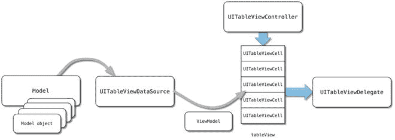

**图 8-13.** 模型-视图-视图模型关系

单元格负责管理自己的布局。它将获取视图模型的相关属性（比如电话号码字段），而忽略其他属性。它将使用相关属性来设置其视图出口、文本字段内容等，以及处理 AutoLayout 约束等。你甚至还可以更进一步，使用属性观察器，以便在视图模型属性被设置时自动触发布局过程。


### MVVM 的优缺点

采用模型-视图-视图模型（MVVM）方法带来了若干优势：

- 表格视图的数据源类无需再了解单元格的内部结构。
- 单元格类型的替换变得更加轻松，数据源类中的代码量显著减少。
- 更新和适配单元格变得更加容易。同样，无需保持数据源和单元格类的同步。
- 它使得测试单元格子类更加简便，因为在测试过程中你无需费心去操控数据源类来生成模型对象并将其馈送到单元格实例中。

然而，MVVM 方法也确实存在一些缺点：

- 它并非“标准”的 Apple 设计模式，因此没有现成的“原生”实现方案可以作为起点。
- 职责分工的代价是需要引入一些额外的“活动部件”。你的单元格类需要比将其设计为更简单的“被动”组件时更加复杂。

尽管存在这些缺点，我仍然坚信 MVVM 是一种有用的设计模式，它能让你的表格和集合视图的配置与维护变得更加轻松。

### 实现 MVVM 方法

为了演示 MVVM 方法，你将用它来驱动一个非常简单的示例。该项目中的表格将显示一个 `Contact` 对象的内容：`name`、`number` 和 `notes`。为了尽可能简化，所有三个 `Contact` 属性都是 `Strings` 类型。

你将把 `Contact` 对象建模为一个 `Struct`，如代码清单 8-13 所示。

**代码清单 8-13. Contact 结构体**

```
struct Contact {
    var name: String?
    var number: String?
    var notes: String?
    init(name: String, number: String, notes: String) {
        self.name = name
        self.number = number
        self.notes = notes
    }
}
```

这些 `Contacts` 将存储在一个 `Array` 中，该数组由表格视图控制器的 `viewDidLoad` 函数调用的一个函数来设置（如代码清单 8-14 所示）。

**代码清单 8-14. `setupData` 函数**

```
extension ViewController {
    func setupData() {
        for index in 1...10 {
            let contact = Contact(name: "Name \(index)", number: "\(index)", notes: "The notes for contact \(index)")
            tableData.append(contact)
        }
    }
}
```

表格中显示的单元格是自定义 `UITableViewCell` 子类 `ContactCell` 的实例（如代码清单 8-15 所示）。

**代码清单 8-15. `ContactCell` 类**

```
import UIKit

class ContactCell: UITableViewCell {
    @IBOutlet var nameLabel: UILabel!
    @IBOutlet var numberLabel: UILabel!
    @IBOutlet var descriptionLabel: UILabel!
}
```

这三个输出口连接到故事板原型单元格中的 `UILabel` 控件，如图 8-14 所示。

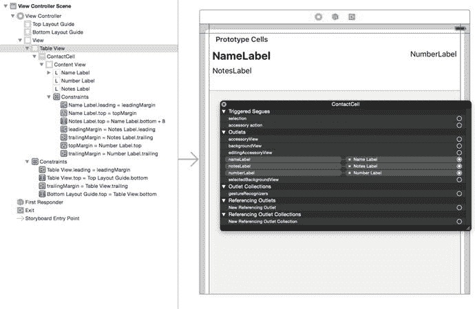

**图 8-14. 原型单元格**

一切连接就绪后，你就可以将注意力转向设置 `UITableViewDataSource` 函数，以配置并将单元格提供给表格。

到目前为止，你一直使用一种非常标准的方法，即通过 `cellForRowAtIndexPath:` 函数来配置单元格。如代码清单 8-16 所示。

**代码清单 8-16. 标准的 `cellForRowAtIndexPath:` 函数**

```
func tableView(tableView: UITableView, cellForRowAtIndexPath indexPath: NSIndexPath) -> UITableViewCell {
    let cell = tableView.dequeueReusableCellWithIdentifier("ContactCell", forIndexPath: indexPath) as! ContactCell
    let contact = tableData[indexPath.row]
    cell.nameLabel.text = contact.name
    cell.numberLabel.text = contact.number
    cell.descriptionLabel.text = contact.notes
    return cell
}
```

运行项目，效果将如图 8-15 所示。

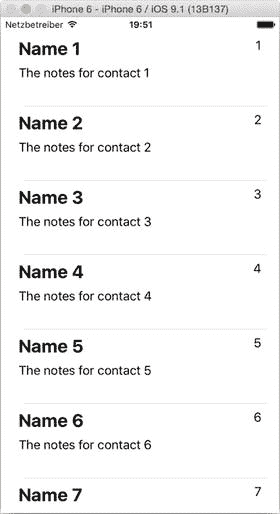

**图 8-15. 运行中的项目**

对于这种方法，应该不会有什么意外之处。你将一个单元格出队作为 `ContactCell` 的实例，从数据模型中获取 `Contact` 对象，然后用 `Contact` 属性的内容填充单元格的输出口。

然而，也能看出这种方法的一些弊端：

- 你模糊了单元格子类和视图控制器之间的关注点分离，因为视图控制器直接引用了单元格的输出口。
- 单元格子类或 `Contact` 对象的任何更改都必须反映在表格视图控制器中。
- 如果你想测试单元格子类，必须想办法操控视图控制器，以便能够填充单元格的输出口。

肯定有一种更高效的方法。好消息！确实是有的。


### 将项目转换为 MVVM 架构

你将通过将 `Contact` 对象直接传递给 `ContactCell` 实例，并让单元格自行配置，从而将项目转换为模型-视图-视图模型架构。

视图控制器将不知道也不关心单元格拥有哪些输出口。相反，你将更新 `cellForRowAtIndexPath:` 函数，移除所有对单元格输出口的引用。

这是一种称为依赖注入的架构示例：`ContactCell` 依赖 `Contact` 对象来填充其输出口，你将在此单元格出列后立即将 `Contact` 对象注入到 `ContactCell` 中。

列表 8-17 展示了更新后的 `cellForRowAtIndexPath:` 函数。

**列表 8-17.** 更新后的 `cellForRowAtIndexPath:` 函数

```
func tableView(tableView: UITableView, cellForRowAtIndexPath indexPath: NSIndexPath) ➤
-> UITableViewCell {
    let cell = tableView.dequeueReusableCellWithIdentifier("ContactCell", ➤
        forIndexPath: indexPath) as! ContactCell
    let contact = tableData[indexPath.row]
    cell.contact = contact
    return cell
}
```

你可以立即看到该函数变得更加简洁，如果单元格比这个确实简单的示例更复杂，差异会更加明显。

然而，这段代码目前无法编译。你需要对 `CustomCell` 类进行一些修改，使其能够接受 `Contact` 依赖项的注入。

列表 8-18 展示了初始的修改。

**列表 8-18.** 更新后的 `ContactCell` 类，用于接收注入的 `Contact`

```
import UIKit

class ContactCell: UITableViewCell {
    var contact: Contact?

    @IBOutlet var nameLabel: UILabel!
    @IBOutlet var numberLabel: UILabel!
    @IBOutlet var notesLabel: UILabel!
}
```

这解决了部分问题，但如果你现在运行项目，你会看到单元格没有显示任何数据。图 8-16 展示了这一效果。

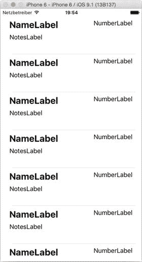

**图 8-16.** 单元格不再更新

之前，你是在 `cellForRowAtIndexPath:` 函数中设置 `UILabels` 的文本属性，但由于现在不再这样操作，单元格就不再更新了。

你需要找到某种方法再次设置标签属性。

一种选择是重写 `UITableViewCell` 的 `layoutSubviews` 函数，并在那里设置输出口。列表 8-19 展示了如何实现。

**列表 8-19.** 使用 `layoutSubviews` 更新输出口

```
override func layoutSubviews() {
    nameLabel.text = contact?.name
    numberLabel.text = contact?.number
    notesLabel.text = contact?.notes
}
```

尽管这肯定能奏效，但在单元格中设置 `Contact` 属性和更新输出口之间存在脱节。有没有办法将这两件事更紧密地联系在一起呢？

事实证明，是有的。Swift 类和结构体的属性允许你附加属性观察器。这些内联函数会在属性被设置时被调用，它们允许你在每次访问属性并设置它时执行任意任务。

我们有两种可用的属性观察器：

*   `willSet` 在值存储到属性之前被调用。
*   `didSet` 在值存储到属性之后被调用。

这意味着你可以使用单元格的 `contact` 属性的 `didSet` 观察器，用刚刚注入到 `CustomCell` 实例中的 `Contact` 对象的值来更新输出口。

列表 8-20 展示了更新后的 `CustomCell` 类。

**列表 8-20.** 更新后的 `CustomCell` 类

```
import UIKit

class ContactCell: UITableViewCell {
    var contact: Contact? {
        didSet {
            nameLabel.text = contact?.name
            numberLabel.text = contact?.number
            notesLabel.text = contact?.notes
        }
    }

    @IBOutlet var nameLabel: UILabel!
    @IBOutlet var numberLabel: UILabel!
    @IBOutlet var notesLabel: UILabel!
}
```

在这里，你使用 `didSet` 观察器，用 `Contact` 对象中的相关属性来更新 `nameLabel`、`numberLabel` 和 `notesLabel` 输出口。每当传入一个新的 `Contact` 对象时（例如在 `cellForRowAtIndexPath:` 函数中出列一个 `ContactCell` 时），单元格输出口将自动更新。

更新 `ContactCell` 类后，再次运行项目，你会看到行被再次填充，如图 8-17 所示。

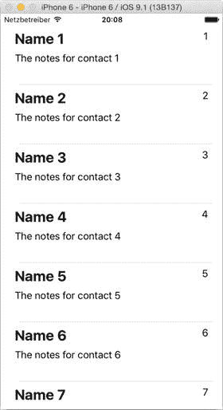

**图 8-17.** 依赖注入后更新的单元格

## 总结

在本章中，你了解了如何创建自己的 `UITableViewCell` 自定义子类，从而对单元格的外观和功能实现最大程度的控制。

处理自定义单元格有多种方法可供选择：

*   将自定义子类与 XIB 文件结合。
*   完全通过代码构建单元格，从而替代 XIB 文件的需求。
*   通过重写 `layoutSubviews` 来修改标准单元格类型。

选择哪种方法，需要在所需控制级别与每种技术的复杂度和额外代码开销之间进行权衡。另一个因素是性能；自定义子类允许你利用各种技术来加速表视图的性能。

