# 9. 改善交互

到目前为止，你创建的单元格相对静态：用户与它们的交互仅限于点击进行选择和编辑。

但这并不是你能对单元格做的全部。因此，本章研究了一些可以用于使表和集合视图真正实现交互的技巧：

*   在单元格中嵌入自定义控件，包括按钮、开关和滑块
*   实现广泛使用的下拉刷新功能
*   为单元格添加手势识别器以支持双击等操作
*   在视图内容中实现搜索

然而，无论视图的交互性有多强，如果它响应不及时，就无法提供良好的用户体验。尽管我们在前几章中一直在介绍最佳实践，但本章最后将通过一份清单来总结确保表和集合视图获得最佳性能的方法。

**注意**

本章中的技术对于 `UITableView` 和 `UICollectionView` 大致相同。但是，如果某些内容是 `UITableView` 特有的，我将使用“表视图”；如果某些内容是 `UICollectionView` 特有的，我将使用“集合视图”；如果两者通用，我将使用“视图”。


好的，作为高级文档工程师和翻译员，我将严格遵循您的注意事项和示例格式，将给定的英文文本翻译成中文。


## 将自定义控件嵌入到单元格中

到目前为止，您主要关注的是创建和呈现基本静态的视图。尽管您已经创建了呈现动态数据的单元格，但这些单元格本身目前仅对与编辑、删除和排序相关的基本点击和滑动操作做出响应。

由于 `UITableViewCell` 和 `UICollectionViewCell` 都是 `UIView` 的子类，因此您几乎可以执行任何对“标准”`UIView` 能执行的操作。这包括将自定义控件（如按钮、滑块和开关）作为子视图嵌入，并让它们响应用户操作。

首先，这里有一个非常简单的示例。每个单元格包含一个 `UIButton`，点击时会弹出一个警告视图，如图 9-1 所示。

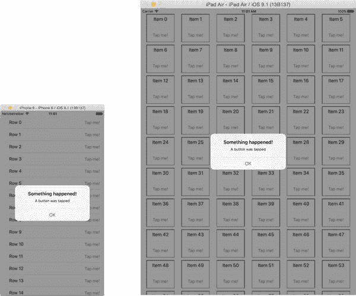

图 9-1. 非常简单的按钮

您可以使用两种方法来实现此类功能：

-   一种简单的方法，即在首次创建单元格时直接将按钮插入到单元格中
-   一种更健壮的方法，它使用自定义单元格类和委托。

在本节中，我们将先探讨简单的方法；然后在下一节逐步构建一个更健壮的解决方案。

### 简单方法 – 直接将按钮添加到单元格

我不会详细讨论创建表格或集合视图的主要方面——这部分现在已经非常熟悉了——但为了创建按钮和警告视图，您需要做两件事。

#### 创建警告视图

首先是创建一个函数，用于在点击某个按钮时显示警告视图；这应该放在视图控制器的扩展中。代码清单 9-1 显示了表格版本。

代码清单 9-1. `didTapButtonInCell:` 方法

```
func didTapButtonInCell(sender: UIButton) {
    let alert = UIAlertController(title: "Something happened!", message: "A button was tapped", preferredStyle: .Alert)
    let action = UIAlertAction(title: "OK", style: .Default, handler: nil)
    alert.addAction(action)
    self.presentViewController(alert, animated: true, completion: nil)
}
```

#### 创建按钮

创建了 `didTapButtonInCell` 函数后，您需要将按钮添加到单元格中，并将它们连接到这个方法。

创建一个名为 `addButtonToCell` 的函数。代码清单 9-2 显示了表格视图的版本。

代码清单 9-2. 表格视图的 `addButtonToCell` 方法

```
func addButtonToCell(cell: UITableViewCell) {
    guard cell.contentView.viewWithTag(1000) == nil else {
        return
    }
    let button = UIButton(type: UIButtonType.RoundedRect)
    button.tag = 1000
    button.setTitle("Tap me!", forState: UIControlState.Normal)
    button.sizeToFit()
    button.translatesAutoresizingMaskIntoConstraints = false
    button.addTarget(self, action: "didTapButtonInCell:", forControlEvents: UIControlEvents.TouchUpInside)
    let vConstraint = NSLayoutConstraint(item: button, attribute: NSLayoutAttribute.CenterY, relatedBy: NSLayoutRelation.Equal, toItem: cell.contentView, attribute: NSLayoutAttribute.CenterY, multiplier: 1.0, constant: 0)
    let hConstraint = NSLayoutConstraint(item: button, attribute: NSLayoutAttribute.Right, relatedBy: NSLayoutRelation.Equal, toItem: cell.contentView, attribute: NSLayoutAttribute.Right, multiplier: 1.0, constant: 0)
    cell.contentView.addSubview(button)
    cell.contentView.addConstraints([vConstraint, hConstraint])
}
```

集合视图的函数定义略有不同：

```
func addButtonToCell(cell: UICollectionViewCell) {
```

函数的第一部分检查单元格中是否已存在按钮：

```
guard cell.contentView.viewWithTag(1000) == nil else {
    return
}
```

`guard` 语句检查单元格的 `contentView` 中是否存在标记为 `1000` 的 `UIView` 或 `UIView` 子类。除非 `viewWithTag()` 函数的结果为 nil，否则函数将返回，因为按钮已创建，无需添加。

另一方面，如果单元格中还没有按钮，函数的下一部分将创建一个 `UIButton` 实例，设置其标题，然后调整其大小以适应内容：

```
let button = UIButton(type: UIButtonType.RoundedRect)
button.setTitle("Tap me!", forState: UIControlState.Normal)
button.sizeToFit()
button.translatesAutoresizingMaskIntoConstraints = false
```

然后，通过向按钮添加一个目标(target)，将按钮与函数关联起来：

```
button.addTarget(self, action: "didTapButtonInCell:", forControlEvents: UIControlEvents.TouchUpInside)
```

接下来，您需要几个 AutoLayout 约束来定位按钮。以下是表格视图的定位代码：

```
let vConstraint = NSLayoutConstraint(item: button, attribute: NSLayoutAttribute.CenterY, relatedBy: NSLayoutRelation.Equal, toItem: cell.contentView, attribute: NSLayoutAttribute.CenterY, multiplier: 1.0, constant: 0)
let hConstraint = NSLayoutConstraint(item: button, attribute: NSLayoutAttribute.Right, relatedBy: NSLayoutRelation.Equal, toItem: cell.contentView, attribute: NSLayoutAttribute.Right, multiplier: 1.0, constant: 0)
```

集合视图的定位略有不同：

```
let vConstraint = NSLayoutConstraint(item: button, attribute: NSLayoutAttribute.CenterX, relatedBy: NSLayoutRelation.Equal, toItem: cell.contentView, attribute: NSLayoutAttribute.CenterX, multiplier: 1.0, constant: 0)
let hConstraint = NSLayoutConstraint(item: button, attribute: NSLayoutAttribute.Bottom, relatedBy: NSLayoutRelation.Equal, toItem: cell.contentView, attribute: NSLayoutAttribute.Bottom, multiplier: 1.0, constant: -10)
```

最后，您可以将按钮添加到单元格中：

```
cell.contentView.addSubview(button)
```

并添加布局约束：

```
cell.contentView.addConstraints([vConstraint, hConstraint])
```

#### 将按钮添加到单元格

将按钮添加到单元格需要更新 `tableView:cellForRowAtIndexPath:` 或 `collectionView:cellForItemAtIndexPath:` 函数。

函数的第一部分是标准的——这里单元格中有一个标签为 2000 的标签，用于显示行数。

要将按钮插入到单元格中，请添加对 `addButtonToCell(_:)` 函数的调用。代码清单 9-3 显示了集合视图的版本。

代码清单 9-3. 将按钮添加到单元格

```
func collectionView(collectionView: UICollectionView, cellForItemAtIndexPath indexPath: NSIndexPath) -> UICollectionViewCell {
    let cell = collectionView.dequeueReusableCellWithReuseIdentifier("CellIdentifier", forIndexPath: indexPath)
    let label = cell.contentView.viewWithTag(2000) as! UILabel
    label.text = "Item \(cvData[indexPath.row])"
    addButtonToCell(cell)
    cell.layer.borderColor = UIColor.blackColor().CGColor
    cell.layer.borderWidth = 1.0
    return cell
}
```


#### 响应单个控件

这个示例虽然看起来令人印象深刻，但有一个明显的局限。每个按钮都绑定到同一个方法，因此无法执行与特定单元格相关的操作。一个非常简单的例子可能是弹出一个包含按钮所在单元格 `indexPath` 的警告视图。

为此，你需要更新 `didTapButtonInCell:` 函数，如代码清单 9-4 所示。

**代码清单 9-4.** 响应单个单元格

```
func didTapButtonInCell(sender: UIButton) {
    let cell = sender.superview!.superview as! UICollectionViewCell
    let indexPathAtTap = collectionView.indexPathForCell(cell)
    let alert = UIAlertController(title: "Something happened!", message: "A button was tapped at row \(indexPathAtTap?.row)", preferredStyle: .Alert)
    let action = UIAlertAction(title: "OK", style: .Default, handler: nil)
    alert.addAction(action)
    self.presentViewController(alert, animated: true, completion: nil)
}
```

你会注意到第一行代码有些奇怪。我们获取的是按钮的 `superview` 的 `superview`。

这是因为按钮位于单元格的 `contentView` 内部，而 `contentView` 又位于单元格内部。图 9-2 展示了这些元素的嵌套关系。

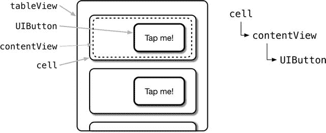

**图 9-2.** 单元格视图的嵌套方式

综合以上内容，你现在得到了一组带有按钮的单元格，这些按钮可以触发指定行的操作，如图 9-3 所示。

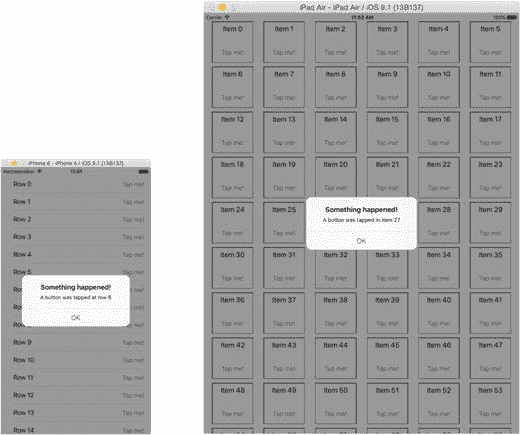

**图 9-3.** 指定行的警告视图

### 更稳健的基于子类的方法

上述简单方法虽然可行，但存在一个重大缺陷——它依赖于按钮在单元格视图层次结构中位于完全正确的位置。如果该位置因任何原因发生变化，你就必须确保更新 `didTapButtonInCell:` 函数以匹配新的层级。

一种更少“取巧”的方法是使用自定义单元格子类，它通过回调委托来响应按钮点击事件。

这需要对当前项目进行一些修改：

*   声明一个协议，定义单元格与视图控制器之间的交互。
*   实现一个自定义 `UITableViewCell` 子类，该类包含一个委托属性，并添加一个按钮，当按钮被点击时，该按钮会调用委托。
*   修改故事板，使用自定义 `UITableViewCell` 子类的实例。
*   更新视图控制器，在单元格实例化时设置其委托，并处理来自单元格的委托回调。

#### 声明协议

要声明该协议，你需要将其添加到视图控制器的顶部，如代码清单 9-5 所示：

**代码清单 9-5.** 委托协议声明

```
protocol InCellButtonProtocol {
    func didTapButtonInCell(cell: ButtonCell)
}
```

#### 实现自定义 UITableViewCell

自定义 `UITableViewCell` 子类与普通表格单元格在三个方面有所不同：

*   它会在 `awakeFromNib()` 函数中向自己的 `contentView` 添加一个按钮。
*   它包含一个可选的 `delegate` 属性，该属性需要一个遵循 `InCellButtonProtocol` 协议的对象。
*   它包含一个 `IBAction` 函数，该函数在按钮被点击时调用委托。

首先，为自定义单元格添加一个新类：选择 `File ➤ New ➤ File`，然后从 `Source` 模板中选择 `Cocoa Touch Class` 选项。将文件命名为 `ButtonCell`，并确保它是 `UITableViewCell` 的子类，如图 9-4 所示：

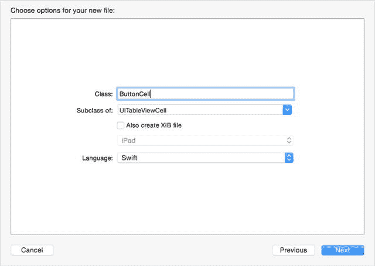

**图 9-4.** 添加单元格子类

##### 向单元格的 ContentView 添加按钮

要向单元格的 `contentView` 添加按钮，你需要重写 `awakeFromNib()` 函数——当单元格在 `cellForRowAtIndexPath:` 函数中从故事板中检索出来时，该函数会被调用。

目前，`ButtonCell` 类中会有一个存根函数，如代码清单 9-6 所示：

**代码清单 9-6.** 存根 awakeFromNib() 函数

```
override func awakeFromNib() {
    super.awakeFromNib()
    // Initialization code
}
```

按代码清单 9-7 所示更新此函数——该代码基于你在上一节中看到的代码，但进行了一些下面详述的更新。

**代码清单 9-7.** 更新后的 awakeFromNib() 函数

```
override func awakeFromNib() {
    super.awakeFromNib()
    // Initialization code

    let button = UIButton(type: UIButtonType.RoundedRect)
    button.setTitle("Tap me!", forState: UIControlState.Normal)
    button.sizeToFit()
    button.translatesAutoresizingMaskIntoConstraints = false
    button.addTarget(self, action: "didTapButton:", forControlEvents: UIControlEvents.TouchUpInside)

    let vConstraint = NSLayoutConstraint(item: button, attribute: NSLayoutAttribute.CenterY, relatedBy: NSLayoutRelation.Equal, toItem: self.contentView, attribute: NSLayoutAttribute.CenterY, multiplier: 1.0, constant: 0)
    let hConstraint = NSLayoutConstraint(item: button, attribute: NSLayoutAttribute.Right, relatedBy: NSLayoutRelation.Equal, toItem: self.contentView, attribute: NSLayoutAttribute.Right, multiplier: 1.0, constant: 0)

    self.contentView.addSubview(button)
    self.contentView.addConstraints([vConstraint, hConstraint])
}
```

这里有几个不同之处——首先，按钮没有设置 `tag`，其次，添加的目标是单元格实例本身：

```
button.addTarget(self, action: "didTapButton:", forControlEvents: UIControlEvents.TouchUpInside)
```

除此之外，一切都是一样的：创建按钮；设置标题；调整大小以适应文本；创建约束；并将其添加到单元格中。

##### 添加委托属性

当按钮被点击时，它会回调委托，由委托负责执行相应的操作。

为了实现这一点，需要在 `ButtonCell` 类中添加一个 `delegate` 属性：

```
var delegate: InCellButtonProtocol?
```

这声明了 `delegate` 是一个可选项，它遵循 `InCellButtonProtocol` 协议。

##### 添加处理按钮点击的代码

我们在 `awakeFromNib()` 函数中添加到按钮上的动作会调用 `ButtonCell` 的 `didTapButton:` 函数，你需要添加这个函数。该函数如代码清单 9-8 所示：

**代码清单 9-8.** didTapButton: 函数

```
func didTapButton(sender: AnyObject) {
    if let delegate = delegate {
        delegate.didTapButtonInCell(self)
    }
}
```

这段代码简单检查是否设置了 `delegate`，如果设置了，则调用 `didTapButtonInCell:` 函数，并将自身的引用作为参数传递。

这就是 `ButtonCell` 类中需要的所有更改。现在需要对故事板进行修改。

##### 更新故事板

切换到故事板，并更新原型单元格，使其成为 `ButtonCell` 的实例。在“身份检查器”中，点击“自定义类”部分下的“类”字段，然后添加 `ButtonCell`，如图 9-5 所示：

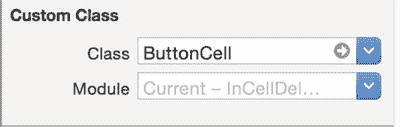

**图 9-5.** 更新单元格的类


### 更新视图控制器

现在需要更新`ViewController`以使用新的单元格类，并响应来自单元格的调用。

首先，通过更新类声明使`ViewController`类遵循`InCellButtonProtocol`协议：

`class ViewController: UIViewController, InCellButtonProtocol {`

然后添加`didTapButtonInCell:`函数，如代码清单 9-9 所示：

**代码清单 9-9.** `didTapButtonInCell:`函数

```
func didTapButtonInCell(cell: ButtonCell) {
    let indexPathAtTap = tableView.indexPathForCell(cell)
    let alert = UIAlertController(title: "Something happened!", message: "A button was tapped at row \(indexPathAtTap!.row)", preferredStyle: .Alert)
    let action = UIAlertAction(title: "OK", style: .Default, handler: nil)
    alert.addAction(action)
    self.presentViewController(alert, animated: true, completion: nil)
}
```

这与之前的版本类似，但`cell`参数是`ButtonCell`类的实例。

接下来，更新`cellForRowAtIndexPath:`函数，使其与代码清单 9-10 一致：

**代码清单 9-10.** 更新后的`cellForRowAtIndexPath:`函数

```
func tableView(tableView: UITableView, cellForRowAtIndexPath indexPath: NSIndexPath) -> UITableViewCell {
    let cell = tableView.dequeueReusableCellWithIdentifier("CellIdentifier", forIndexPath: indexPath) as! ButtonCell
    cell.textLabel?.text = "Row \(tableData[indexPath.row])"
    if cell.delegate == nil {
        cell.delegate = self
    }
    return cell
}
```

这里变化不大——但不再调用`addButtonToCell:`函数，而是将`cell`的代理设置为对视图控制器自身的引用。

此时，你也可以通过移除现已冗余的`addButtonToCell:`函数来稍微清理视图控制器。

如果再次运行项目，你会发现功能与之前完全相同。区别在于我们重构了代码，实现了比之前更清晰的架构：

- 现在单元格和视图控制器之间实现了关注点分离。
- 处理按钮交互的代码更加健壮，无需引用单元格的视图层级结构。
- 项目变得更具适应性，因为现在可以在视图控制器之外的类中实现单元格的代理功能。

### 向单元格添加手势

你不仅限于向单元格添加控件；还可以通过附加手势识别器来启用额外功能。正如你将在下一节中看到的，这为添加滑动手势以显示额外信息提供了可能。一种更简单的交互方式是添加双击单元格的功能，以触发某些操作或转换。

代码清单 9-11 展示了如何在`cellForRowAtIndexPath:`函数中向每个单元格添加双击识别器。

**代码清单 9-11.** 向每个单元格添加`gestureRecognizer`

```
func tableView(tableView: UITableView, cellForRowAtIndexPath indexPath: NSIndexPath)
-> UITableViewCell {
    let cell = tableView.dequeueReusableCellWithIdentifier("CellIdentifier",
  forIndexPath: indexPath)
    cell.textLabel?.text = "Row \(tableData[indexPath.row])"
    if cell.gestureRecognizers?.count != 1 {
        let tapRecognizer = UITapGestureRecognizer(target: self, action:
     "didDoubleTapInCell:")
        tapRecognizer.numberOfTapsRequired = 2
        cell.addGestureRecognizer(tapRecognizer)
    }
    return cell
}
```

向单元格添加双击识别器后，你很可能希望能够区分哪个单元格被点击了。以下是在示例`didDoubleTapCell:`函数中访问单元格的方法：

```
func didTapButtonInCell(sender: AnyObject) {
    let recognizer = sender as! UITapGestureRecognizer
    let cell = recognizer.view as! UITableViewCell
    let indexPathAtTap = tableView.indexPathForCell(cell)
    ... 在此处对单元格执行操作 ...
}
```

响应交互的`UIGestureRecognizer`实例作为`sender`传递给函数。它有一个`view`属性，指向手势识别器所附加到的`UIView`对象。

在这种情况下，它指向的是`cell`，因此`sender.view`属性可以转换为`UITableViewCell`实例，之后你就可以将其视为单元格来处理。

显然，你不仅限于点击手势：捏合、平移、旋转、长按和滑动都是可用的。不过，其中某些手势在单元格有限的空间内效果更好，因此需要进行仔细的实验才能获得最佳的整体用户体验。你可能会发现，某些多点触控手势仅在 iPad 更大的用户界面上才实用。

## 为表格视图添加下拉刷新

下拉刷新是一种操作，当用户将表格向下拉过顶部然后松手时，会触发表格数据的刷新。表格不会直接弹回，而是会显示一个活动指示器。一旦数据更新完成（或者有时如果网络调用超时），表格会“弹回”上去，同时内容被刷新。

这是一个出色的界面设计——但实际上并非苹果公司原创。它首次出现在第三方 Twitter 客户端中；很快被实现为多个开源控件；最终被纳入官方 iOS SDK。

实现起来也非常简单。最简单的方法是使用`UITableViewController`，但如果你在标准`UIViewController`中放置表格视图，也可以实现。我们将依次介绍这两种方法。

### 使用`UITableViewController`实现下拉刷新

在此示例中，我假设你在 Storyboard 中使用`UITableViewController`实例，如图 9-6 所示。

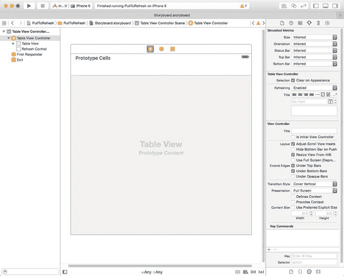

**图 9-6.** Storyboard 中的`UITableViewController`

#### 添加刷新控件

在属性检查器中，有一个`Refreshing`下拉选项。选择`Enabled`选项，如图 9-7 所示。

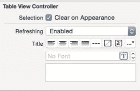

**图 9-7.** 设置`Refreshing`选项

如果现在运行项目，你会看到可以下拉表格，顶部会出现活动指示器，如图 9-8 所示。

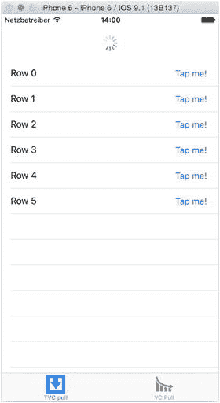

**图 9-8.** 表格视图中的下拉刷新

虽然这看起来令人印象深刻，但有一个问题：活动指示器不会消失！

还需要做一些额外工作。首先，你需要将刷新控件连接到一个函数，以响应用户的下拉操作。将其添加到`viewDidLoad`函数中：

```
refreshControl?.addTarget(self, action: "didPullRefresh:", forControlEvents:
   UIControlEvents.ValueChanged)
```

`refreshControl`是`UITableViewController`的内置属性。这里，你将`didPullRefresh:`函数作为目标添加，以响应用户的下拉操作。


#### 实现`pullToRefresh`功能

新增一个函数，如代码清单 9-12 所示。

**代码清单 9-12.** `pullToRefresh`函数

```
func didPullRefresh(sender: UIRefreshControl) {
    tableData.append(tableData.count)
    tableView.reloadData()
    sender.endRefreshing()
}
```

此函数执行三项操作：

- 在`tableData`数组末尾新增一条记录。
- 强制表格从模型重新加载数据。
- 停止`UIRefreshControl`的旋转动画，并使其消失。

这是一个极为简单的示例。在实际开发中，更常见的做法是调用某种网络管理器函数来从 API 获取信息。

如果再次运行应用，你会看到活动指示器出现，随后表格末尾新增一条记录。一旦表格刷新完成，活动指示器会以动画形式从视图顶部消失。

### 向表格视图添加`UIRefreshControl`

上一节的操作基于使用`UITableViewController`。如果你是在`UIViewController`内嵌入一个普通的`UITableView`，则过程会稍显复杂。

所需的额外步骤如下：

- 为视图控制器类添加一个`UIRefreshControl`属性。
- 实例化`UIRefreshControl`并为其指定动作。
- 将新实例化的`UIRefreshControl`添加到表格视图。

#### 添加`UIRefreshControl`属性

这只是在`UIViewController`中添加属性的简单情况：

```
var refreshControl: UIRefreshControl!
```

#### 实例化刷新控件

在使用之前，需要先实例化该属性。由于这需要在正式使用之前完成，一个明显的位置是在`viewController`的`viewDidLoad`函数中：

```
override func viewDidLoad() {
    super.viewDidLoad()
    ... 配置表格和数据 ...
    refreshControl = UIRefreshControl()
    refreshControl.addTarget(self, action: "didPullRefresh:", forControlEvents: .ValueChanged)
    tableView.addSubview(refreshControl)
}
```

在这里，你配置了表格及其数据，然后实例化了`refreshControl`属性：

```
refreshControl = UIRefreshControl()
```

完成之后，你可以将`didPullRefresh:`函数设置为`valueChanged`事件的动作。此事件由表格的下拉交互触发：

```
refreshControl.addTarget(self, action: "didPullRefresh:", forControlEvents: .ValueChanged)
```

将函数与`refreshControl`关联后，只需将其添加到`tableView`即可：

```
tableView.addSubview(refreshControl)
```

最终结果与使用`UITableViewController`并设置其内置`refreshControl`属性完全一致。

## 在表格和集合视图中搜索

如果你的视图显示了大量数据，那么为用户提供便捷的导航方式是对用户负责的表现。没有什么比必须滚动数百行来查找目标数据更让人沮丧的了。

之前我们讨论过向`tableView`添加索引，这可以很好地让用户在章节间跳转。但有时这仍然不够。如果你能提供一种搜索表格内容的方法，让用户快速找到所需行，是不是更好？

幸运的是，iOS SDK 提供了`UISearchBar`类及其相关的委托协议。这个类使得在表格视图中实现搜索变得极其简单；如果从头构建同样的功能，工作量会显著增加。

`UISearchBar`类在表格和集合视图中的工作方式完全相同。本示例将重点介绍如何在`UITableView`中进行搜索，但两个控件中的操作流程是一样的。

### 向表格添加搜索栏

`UISearchBar`提供了一个样式化的文本字段，你可以根据需要添加到界面中。表格视图的正常布局是将搜索栏放在顶部，当然你也可以将其放在其他位置。

你可以将搜索栏嵌入表格内部，这样它会随表格一起滚动（如图 9-9 所示）。

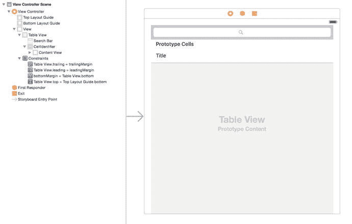

**图 9-9.** 嵌入表格内部的搜索栏

在这种情况下，搜索栏会随表格滚动。如果你希望它“固定”在顶部，可以将其放置在表格外部，如图 9-10 所示。

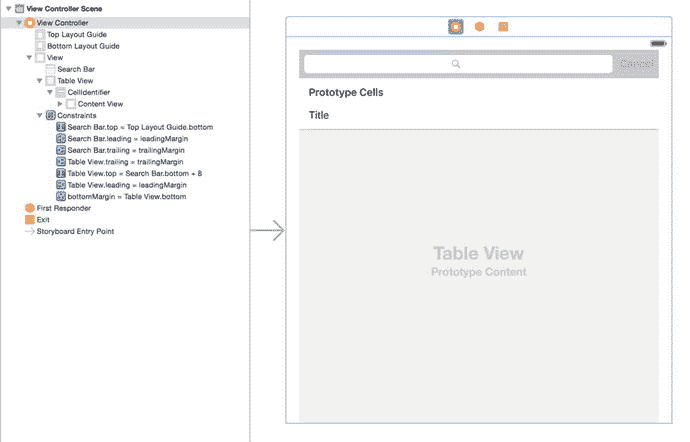

**图 9-10.** 放置在表格上方的搜索栏

你可以使用 AutoLayout 约束来设置并固定搜索栏在布局中的位置。

无论`UISearchBar`放置在何处，连接其委托出口都非常重要。

你可以通过可视化方式实现：按住 Ctrl 键点击搜索栏，然后拖拽到文档大纲中的相关控制器对象来连接`delegate`出口；或者通过编程方式设置`delegate`属性：

```
searchBar.delegate = self
```

### 搜索的工作原理

表格视图搜索的基本原理是表格有两个数据源：

- **默认数据源**，包含表格将要显示的所有数据。其实现方式与本书之前的讲解相同。例如，它可能是一个包含`Strings`的`Array`。
- **过滤后的数据源**，即默认数据源根据搜索栏的用户输入进行过滤后的子集。你通过响应用户输入来触发过滤。如果你的默认数据源是一个包含`Strings`的`Array`，那么过滤后的数据源也是一个包含`Strings`的`Array`，但其中的条目仅包含与搜索条件匹配的内容。

搜索过程通常由用户点击搜索栏触发。典型流程如下：

- 在充当数据源的类上设置一个标志，表示当前表格正在被过滤。
- 过滤过滤后的数据源，移除与用户输入的搜索条件不匹配的元素。
- 使用该标志控制`numberOfRowsInSection`和`cellForRowAtIndexPath`等`UITableDataSource`函数获取数据的数据源，从过滤后的数据源重新加载表格。
- 当用户结束搜索时，将标志重置为“普通表格”状态，并重新加载表格。由于标志处于普通模式，表格将从未过滤的数据源加载数据。


### 实现搜索功能

现在我们来逐步实现搜索栏的配置和数据源的过滤。在本练习中，你将使用一个由`String`组成的`Array`作为表格的数据源，并根据你在搜索栏中输入的内容进行过滤。

你可以使用任意你喜欢的数据源，但本章的示例项目使用的是一份德国温泉小镇的列表（数量非常多！），如图 9-11 所示。

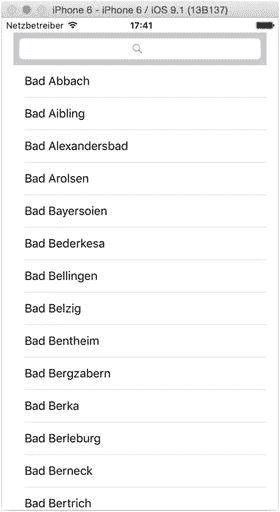

图 9-11.

运行中的应用程序

当你在搜索栏中输入内容时，列表将会通过不区分大小写的子串搜索进行过滤，并且表格也会随之更新（如图 9-12 所示）。

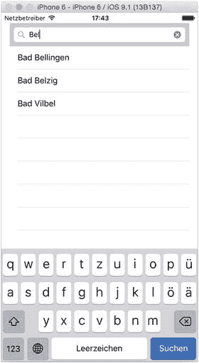

图 9-12.

基础搜索功能的实际效果

我假定你已经完成了以下操作：

*   构建了一个基础表格，用于显示来自`String`数组`Array`中的条目。
*   在表格视图顶部添加了一个`UISearchBar`，并将其委托出口连接到管理该表格的视图控制器。
*   向视图控制器添加了一个名为`searchBar`的`IBOutlet`属性，并将其连接到故事板中的`UISearchBar`。

第一步是向视图控制器类中添加两个额外的属性：

```
var filteredTableData = [String]()
```

这是一个用于存储过滤结果列表的数组，在表格处于搜索模式时，它将作为表格的数据源：

```
var searchActive: Bool = false
```

`searchActive` 标志将被 `UITableViewDatasource` 的方法使用，用来决定它们应该使用过滤后的数据模型还是未过滤的数据模型。

添加好这些属性后，下一步就是设置 `UISearchBarDelegate`。

### 实现 UISearchBarDelegate 函数

将 `UISearchBarDelegate` 函数添加到视图控制器的扩展中。代码清单 9-13 展示了需要添加的前两个函数。

代码清单 9-13. 实现 UISearchBarDelegate 函数

```
extension ViewController: UISearchBarDelegate {

    func searchBarTextDidBeginEditing(searchBar: UISearchBar) {
        searchActive = true
    }

    func searchBarTextDidEndEditing(searchBar: UISearchBar) {
        searchActive = false
        tableView.reloadData()
    }

}
```

`searchBarTextDidBeginEditing` 函数只是将 `searchActive` 标志设置为 true。

`searchBarTextDidEndEditing` 函数则执行相反的操作，然后强制重新加载表格，以便表格再次显示未过滤的数据。

现在，我们来看负责处理实际搜索功能的函数，如代码清单 9-14 所示——该函数也将放置在 `UISearchBarDelegate` 扩展内部。

代码清单 9-14. searchBar:textDidChange 函数

```
func searchBar(searchBar: UISearchBar, textDidChange searchText: String) {

    if searchText.characters.count == 0 {
        searchActive = false
        tableView.reloadData()
        return
    }

    searchActive = true

    filteredTableData = tableData.filter({( spaTown: String) -> Bool in

        let spaRange = Range(start: spaTown.startIndex, end: spaTown.endIndex)

        let stringMatch = spaTown.rangeOfString(searchText,  
            options: NSStringCompareOptions.CaseInsensitiveSearch,  
            range: spaRange,  
            locale: NSLocale.autoupdatingCurrentLocale())

        return stringMatch != nil
    })

    tableView.reloadData()
}
```

这段代码初看可能有点吓人，但实际上并没有那么糟糕。

第一部分检查用户是否清空了搜索字段。如果 `searchText` 中没有字符，就假定搜索已完成。将 `searchActive` 标志设置为 `false`，重新加载表格以显示未过滤的数据，然后返回：

```
if searchText.characters.count == 0 {
    searchActive = false
    tableView.reloadData()
    return
}
```

如果 `searchString` 中有字符，则搜索开始。

首先，将 `searchActive` 标志设置为 true，以便 `UITableViewDelegate` 方法能够使用 `filteredTableData` 数组（稍后将实现此方法）：

```
searchActive = true
```

接下来是实际的过滤操作。这里，我们使用 `Array` 的 `filter` 函数来遍历 `tableData` 数组，并将所有与 `searchText` 匹配的 `String` 放入 `filteredTableData` 数组中。

`filter` 函数逐个遍历每个条目，并将其作为 `spaTown` 参数传递给一个返回 `Bool` 值的闭包。如果返回的 `Bool` 值为 true，则该条目会被添加到 `filteredTableData` 数组中；如果返回 `false`，则忽略该条目。

闭包首先从 `spaTown` 参数创建一个 `Range`：

```
let spaRange = Range(start: spaTown.startIndex, end: spaTown.endIndex)
```

然后，它使用 `rangeOfString` 函数在 `spaTown` 字符串中查找 `searchText` 的内容是否出现在任何位置。例如，如果 `spaTown` 包含 "`Bad Marianberg`"，那么包含 "`enb`" 的 `searchText` 就能匹配到：

```
let stringMatch = spaTown.rangeOfString(searchText,  
    options: NSStringCompareOptions.CaseInsensitiveSearch,  
    range: spaRange,  
    locale: NSLocale.autoupdatingCurrentLocale())
```

`options` 参数确保搜索不区分大小写，而 `locale` 参数确保诸如重音字符等与区域设置相关的因素能被正确处理。

如果找到匹配项，`rangeOfString` 函数会返回 `spaTown` 字符串中匹配到的字符范围。如果没有找到匹配项，则返回 `nil`。

你可以据此来决定向 `filter` 函数返回 `true` 还是 `false`。如果未找到任何内容，范围将为 `nil`，因此可以返回 `false`。如果找到了内容，则返回 `true`，以便将 `spaTown` 添加到 `filteredTableData` 数组中。

最后，在过滤完 `tableData` 数组后，调用表格的 `reloadData()` 函数以强制其重新加载。


### 更新 `UITableViewDataSource` 函数

如果你现在运行项目，你可以在搜索框中输入文字，但你不会看到表格显示的数据有任何变化。

这是因为无论是否处于搜索模式，表格都是从 `tableData` 数组加载数据的。你需要更新 `UITableViewDelegate` 函数，以使用正确的数据源。

有两个函数需要更新。代码清单 9-15 展示了 `tableView:numberOfRowsInSection:`

**代码清单 9-15.** 更新后的 `tableView:numberOfRowsInSection:` 函数

```
func tableView(tableView: UITableView, numberOfRowsInSection section: Int) -> Int {
    if searchActive {
        return filteredTableData.count
    }
    return tableData.count
}
```

其实非常简单。如果表格处于 `searchActive` 模式，那么行数来自 `filteredTableData` 数组；如果不是，则像往常一样，行数来自 `tableData`。

代码清单 9-16 展示了更新后的 `tableView:cellForRowAtIndexPath:` 函数。它采用了相同的方法：如果表格正在被搜索，就使用 `filteredTableData` 数组作为数据模型；否则使用 `tableData`。

**代码清单 9-16.** 更新后的 `tableView:cellForRowAtIndexPath:` 函数

```
func tableView(tableView: UITableView, cellForRowAtIndexPath indexPath: NSIndexPath)
    -> UITableViewCell {
    let cell = tableView.dequeueReusableCellWithIdentifier("CellIdentifier",
        forIndexPath: indexPath)
    if searchActive {
        cell.textLabel!.text = filteredTableData[indexPath.row]
    } else {
        cell.textLabel!.text = tableData[indexPath.row]
    }
    return cell
}
```

在所有工作彻底完成之前，还有一项整理工作要做。在 `UISearchBarDelegate` 扩展中，添加代码清单 9-17 所示的函数。

**代码清单 9-17.** `searchBarCancelButtonClicked` 函数

```
func searchBarCancelButtonClicked(searchBar: UISearchBar) {
    searchBar.text = ""
    searchBar.resignFirstResponder()
    searchActive = false
}
```

这将清空搜索栏，取消键盘的第一响应者状态，并在用户点击搜索栏中的“取消”按钮时将 `searchActive` 标志设为 false。

到目前为止，你还没有实际设置“取消”按钮，所以回到故事板，高亮选中搜索栏，然后在属性检查器中勾选“显示取消按钮”选项（如图 9-13 所示）。

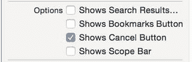

**图 9-13.** 显示取消按钮选项

如果你再次运行项目，你将看到一个可用的搜索功能，并带有“取消”功能，该功能会关闭键盘并用完整数据集重新加载表格（图 9-14）。

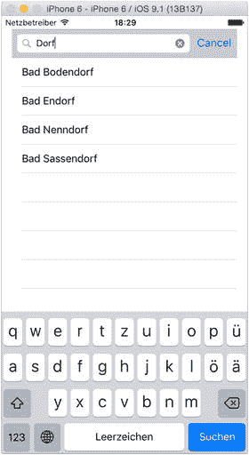

**图 9-14.** 可用的搜索功能

## 健康、流畅的表格

如果要用一个词来概括 iOS 设备系列的整体用户体验，我会选择“流畅”。设计优秀的应用，其界面的一切操作都毫无迟疑、卡顿或抖动。如果做对了，整体印象就是一台精密、运转顺畅的设备。

表格视图包含很多活动部件，因此如果要出现问题，很可能就在这里。尽管 `UITableView`、`UICollectionView` 及其辅助类在设计之初就考虑到了性能，但仍然可能构建出性能不佳的表格和集合视图，尤其是当你忽略了一些基本的*最佳实践*时。

在本节中，我们将探讨一些你可以采取的措施——既有快速修复，也有一些更深入的方法——以确保你的视图能够尽可能发挥其最佳性能。

### 后台、后台、再后台

滚动时卡顿最常见的问题之一，是在主线程上进行了耗时且缓慢的处理。

iOS 的界面是在主线程上进行渲染的，因此任何减慢主线程的操作都会导致界面速度变慢。通常情况下这不成问题，但滚动是一种要求每秒钟达到六十帧的场景。

根据一般的经验法则，耗时或长时间运行的活动——特别是网络请求——应该被分发到后台队列，在工作完成后再回调到主线程。

如果你从网络源获取图片，这通常是个问题。这里有几种你可以使用的技巧：

*   异步后台获取图片，获取后再更新。
*   使用占位图片来“代替”真实图片。在滚动视图时，单元格通常会在图片下载完成之前很久就从可见视图中移除。在这种情况下，你可以先使用占位图片，只有当该单元格在屏幕上停留足够长的时间使其可见时，才更新图片。

不过，要警惕过早优化。软件工程中有一句谚语：“我有一个瓶颈问题，所以我用了后台线程。现在我有了两个问题。”竞争条件很容易让你陷入完全纠结的境地。

### 单元格是否被缓存？

构建单元格在处理方面代价高昂，因此 `UITableView` 和 `UICollectionView` 类提供了缓存和出队功能，以允许重用已构建的单元格。如果你的行数超过屏幕能容纳的数量，这会带来显著的差异。

需要检查的两个地方是 `tableView:cellForRowAtIndexPath:` 或 `collectionView:cellForItemAtIndexPath:` 方法。为了获得最高效率，你应该执行以下三项操作之一：

*   在创建新实例之前，先从队列中取出一个现有的可重用单元格：`let cell = [tableView dequeueReusableCellWithIdentifier:CellIdentifier];`
*   为单元格注册一个类：`tableView.registerClass(MyCell.self, forCellReuseIdentifier: "MyCustomCell")`
*   注册一个包含单元格布局的 nib 文件：`tableView.registerNib(UINib(nibName: "MyCell", bundle: nil), forCellReuseIdentifier: "MyCustomCell")`

第一条规则的唯一例外情况是，你正在处理一个静态表格，或者你永远不会有超过可见区域容量的单元格。在后一种情况下，你可能无需缓存单元格，因为它们将始终保持可见。

### 你的表格单元格高度是否不同？

在幕后，`UITableView` 使用单元格高度来构建与表格“框架”相关的多个元素。当 `tableView` 中的所有单元格高度相同时，这个计算成本相对较低；但如果单元格高度不同，这些计算会在每次创建新单元格时重复进行。

为了从表格视图中榨取最后一丝速度，最有效的方法是保持单元格高度一致。当然，这在不同的项目中能否实现会有所差异，但如果你的单元格高度仅在一个有限范围内变化，你可能会发现最好将它们设计为统一的高度，并通过内部单元格布局来管理差异。

如果这不可行，请实现 `UITableViewDelegate` 的 `tableView:estimatedHeightForCell:` 函数来返回一个估计高度。表格将使用此值，通过假设所有单元格都具有此高度来计算完整的内容区域，并将精确计算推迟到最后一刻。

这并非一张“免罪金牌”——如果你的估计行高与实际值相差很大，你可能会遇到问题——但这个函数还是有帮助的。


### 降低视图合成的成本

考虑到设备形态和电池续航的限制，iPhone 和 iPad 的图形处理器性能已经非常强劲。即便如此，它们也存在极限，而突破这些极限的挑战之一便是绘制带有透明效果的视图。

原因显而易见。粗略来说，设备会从前往后构建视图。如果前层是不透明的，那么在渲染屏幕时，它无需费心考虑后面有什么内容。

然而，一旦创建了包含透明像素的图层，就必须进行相应的计算。所需的计算越多，渲染过程就越慢。

如果视图的所有元素都能不透明，那当然再好不过，但现实往往没那么简单。渐变、投影等效果都依赖于透明度才能实现，因此一个完全不透明的界面会显得相当乏味。

实现最佳应用性能的关键在于，仅在需要的地方使用透明度。这又带来了另一个难题：如何判断哪些是透明的，哪些不是？幸运的是，有工具可以帮到你。

#### 在模拟器中检查透明度

模拟器提供了一些常被忽略的工具，可以让你深入探查应用界面的内部构造。其功能之一便是可视化视图中的透明度与混合程度，进而用于微调界面。

-   `Color blended layers` 高亮显示相互叠加绘制的多个视图层。红色层表示存在需要与下层混合的透明区域，而绿色层则表示不需要混合的不透明区域。完全消除混合图层并非总是可行，但如果你遇到渲染速度问题且界面上显示大量红色，那么就值得深入调查，看看是否可以重新调整界面以尽可能减少混合。
-   `Color copied images` 会标出颜色格式无法被 GPU 直接处理的图像。在这种情况下，渲染工作将由 CPU 承担。这会带来双倍的成本，因为不仅占用了其他组件所需的资源，而且 CPU 本身也并非为图像处理而优化的。
-   `Color misaligned images` 会高亮显示其边界与像素边界不对齐的图像。这会导致额外的渲染需求，从而拖慢速度。这通常是由 `@2x` 和 `@3x` 尺寸的素材资源大小不匹配造成的。请检查是否存在尺寸为奇数像素的图像资源，如有必要，将其调整为偶数尺寸。
-   `Color offscreen-rendered` 会高亮显示在主屏幕之外单独渲染的图层。这种情况可能自动发生，因此它本身并不一定表示存在问题，但它是由对图层应用蒙版（masks）引起的，因此在优化界面时，这可能是需要关注的方向。

图 9-15 展示了 iOS 日历应用中此项高亮功能的实际效果——有趣的是，即使是由苹果工程师构建和优化的应用，仍然存在一定程度的混合。这本身并不是什么坏事——优化性能的关键在于尽可能减少混合。

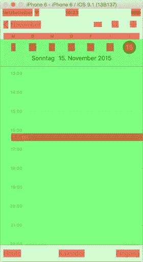

图 9-15. 视图混合高亮功能演示

图形处理和图像优化是一个复杂的主题。在开发者门户网站的 WWDC 视频中，有一些关于这些问题和陷阱的精彩深度探讨，非常值得一看。

## 本章小结

在本章中，你学习了如何通过为单元格添加交互，将表格视图从静态数据展示转变为动态效果。实现的方式有很多种：

-   在单元格内嵌入诸如按钮、开关和滑块等自定义控件
-   实现下拉刷新功能
-   为单元格添加手势识别器以支持双击等操作
-   在表格内容中实现搜索功能

最后，你学习了一些确保表格视图性能尽可能流畅的流程。

