# 10. 使用表格进行导航

导航控制器几乎是 iOS 用户界面中无处不在的功能。它使用户能够以简单一致的方式，在内容层级中导航，浏览内容项的结构树。

这类用户界面模式的例子比比皆是。iPhone 自带的应用“通讯录”就是一个经典例子。联系人以表格视图形式显示，点击某一行会推入一个显示详细信息的视图，如图 10-1 所示。

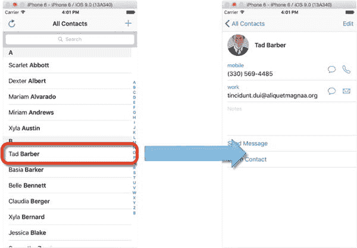

图 10-1. iPhone 自带的应用“通讯录”

这种用户界面模式非常普遍，以至于 iOS SDK 为此提供了一个专用的控制器，为你处理繁重的导航工作。本章将演示如何使用 `UINavigationController` 创建并配置一个基于导航的应用。

这需要五个步骤。

1.  创建应用的基本骨架结构。
2.  创建一些示例数据来供给 `UINavigationController`。
3.  构建详情视图。
4.  将 `UINavigationController` 与详情视图链接起来。
5.  调整 `UINavigationController` 以自定义其外观。

我在这里采用的方法有点不寻常，因为你通常会使用 Xcode 提供的模板来创建基于导航控制器的应用。这没问题，但模板为你做了很多事情，同时也掩盖了各个部分如何组合在一起的许多重要细节。

相比之下，从头开始构建应用将使你很好地理解导航控制器的内部构造。

### 导航控制器界面模式

导航控制器与应用结构的结合方式，总是让我想起俄罗斯套娃。视图嵌入控制器，控制器再嵌入窗口；乍看之下，这似乎复杂得不可思议。

导航控制器的运作方式类似于网页浏览器的页面历史以及前进和后退按钮。当你访问每个新页面时，该页面就会被添加到浏览器的历史记录中。前进和后退按钮允许你在已访问的页面列表中前后移动。这就是图 10-2 所示的“通讯录”应用所使用的模式。

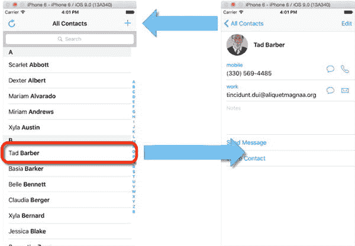

图 10-2. 推入和弹出视图

导航控制器本质上是一个视图控制器栈，而不是一个页面列表。栈顶的视图控制器是可见的，因此要显示一个新的视图控制器，就将其推入栈顶。在视觉上，新的视图控制器通常会从右侧滑入，如图 10-3 所示。

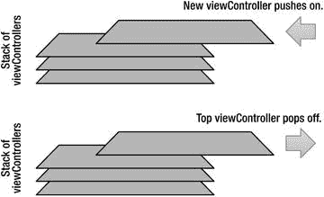

图 10-3. 将视图控制器推入和弹出导航控制器栈

当你想“向后”导航时，就将当前视图控制器从栈中弹出，露出下面的那个。通常，栈顶的视图控制器会向右滑出。


好的，作为高级文档工程师和翻译员，我将严格按照注意事项和示例格式，将给定的英文文本翻译成中文。


## 介绍 `UINavigationController`

苹果 iOS 文档将 `UINavigationController` 描述为“多个其他视图的容器”，我认为这是再好不过的描述了。如图 10-4 所示，它为你提供了一个顶部导航栏和一个可选的底部工具栏。

导航栏上还有用于放置栏按钮项的空间。在顶部和底部栏之间，有一块空间用于加载你的自定义内容：你将在这个空间里 push 和 pop 视图控制器。

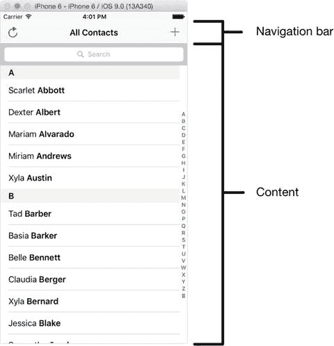

图 10-4.

`UINavigationController` 的组件

与视图控制器中的内容进行交互——例如点击行、点击按钮等——是调用 `UINavigationController` 的 `pushViewController:animated:` 和 `popViewController:animated:` 函数。

除了逐个在视图控制器栈中移动外，你还可以通过调用 `UIViewController` 类的 `popToRootControllerAnimated:` 函数直接返回栈顶。

最后，通过 `popToViewController:animated` 函数可以实现 push（或 pop）到特定的视图控制器，该函数接受一个 `UIViewController` 类型的参数，通过它你可以指定要跳转到的控制器。

> **注意**：虽然将 `UITableViews` 与 `UIViewControllers` 结合使用是最常见的情况，但值得记住的是，你可以 push 和 pop 的视图控制器可以是任何类型的视图控制器。

你不必局限于在顶层使用表格；你可以轻松地通过点击 `UIButton` 来 push 下一个视图，就像通过点击 `tableView` 中的行一样。使用任何能够提供你试图达成的用户体验的方式。

## 导航控制器示例应用

说明 `UINavigationController` 的功能确实需要一个比迄今为止我用作示例的简单应用更复杂一些的示例应用。为此，我构建了一个相对简单的应用，作为本章的基础。它远非你想从 App Store 购买的那种应用，但足以满足这些演示目的。

如果你有孩子（或者即使你没有，但你有朋友有孩子），你就会知道，在孩子降临之前，你能做的最重要的决定之一就是起名。如果搞砸了，你可能会让你的后代在操场上遭受整个学生时代的戏弄。如果没起对，你的阿加莎姑姥姥就会把你从她的遗嘱中剔除，因为你没有延续把所有第一个出生的男孩都命名为阿尔杰农的家庭传统。

为了帮助你穿越这片雷区，你需要的（当然！）是一个 iOS 应用：这就是标题极具想象力的 *Baby Names*。尽管这款应用在设计和突破性功能方面绝对无法赢得任何奖项，但它给了我们一些可供操作的东西。

### 创建一个导航控制器应用

很可能因为基于导航控制器的应用非常普遍，到目前为止，大多数 Xcode 版本都附带了一个用于创建此类应用的模板。它提供了许多现成的“管道”代码，可以加速你的开发进程。如果你在 Storyboard 中使用 `UITableViewController` 对象，你还能免费获得很多功能。

虽然这很棒，但我们将采用回归基础的方法，完全手动构建这个应用。这并非因为应用模板有什么问题，而是因为从头开始构建会让你对所有部分如何组合在一起有更深刻的理解。

首先在 Xcode 中创建一个新应用（**File ➤ New ➤ New Project**），使用 Single View Application 模板，如图 10-5 所示。

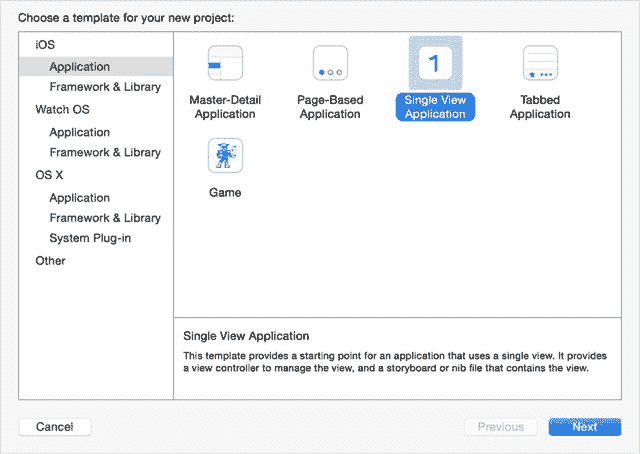

图 10-5.

Xcode 的新建应用对话框

> **提示**：Xcode 附带的默认模板选择往往会因版本而异（本书使用 Xcode 7.1 编写）。

你的 Xcode 版本可能看起来与此不同，但在模板中，会有一个创建一个包含单个视图的骨架应用的模板；那正是你需要的。

将应用命名为 `BabyNames`，并将其保存到你选择的文件夹中。最终你会得到一个包含以下内容的应用：

*   一个名为 `AppDelegate` 的应用委托
*   一个名为 `ViewController` 的视图控制器
*   一个名为 `Main` 的故事板文件

在构建应用的过程中，你将创建一些额外的视图控制器、对象类和 nib 文件，因此你可能想在 Xcode 中设置一些组来保持各个文件的组织有序，如图 10-6 所示。是否在你的应用中这样做由你决定，但我发现这有助于在项目扩展时保持条理清晰。

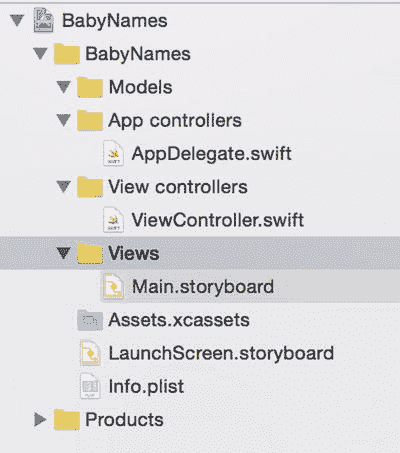

图 10-6.

在应用中创建组

为了让你稍后更容易跟踪事务，首先将 `ViewController` 重命名为 `TableViewController`。

在导航器中高亮 `ViewController` 文件，然后双击它，将名称更改为 `TableViewController`。

接下来，在类本身中更改名称，使其看起来像这样：

```
class TableViewController: UIViewController {
```

最后，打开 Storyboard，在文档大纲中选择 `ViewController`，切换到工具面板中的身份检查器，并将类和 Storyboard ID 更新为 `TableViewController`，如图 10-7 所示。

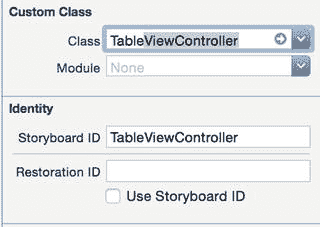

图 10-7.

更新 Storyboard

创建好应用骨架后，下一步是创建一些示例数据。


好的，作为高级文档工程师和翻译员，我将遵循您提供的注意事项和示例，将给定的英文文本翻译成中文。


#### 创建 `Name` 类

虽然应用程序的外观和体验是逐步构建的，但数据模型完全可以立即创建。事实上，从一开始就对数据的结构有清晰的了解，可以帮助你弄清楚界面应该如何工作。

应用程序的核心是姓名。这一点如此核心，以至于你将创建一个具有以下属性的 `Name` 结构体（另请参见图 [10-8]）：

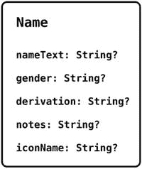

图 10-8. `Name` 结构体

*   `nameText`：一个包含姓名本身的字符串
*   `gender`：一个包含性别标志的字符串，值为 `M`、`F` 或 `U`（表示通用）
*   `derivation`：一个包含姓名来源说明的字符串
*   `iconName`：一个包含姓名图标文件名的字符串
*   `notes`：一个包含关于姓名的解释性备注的字符串

让我们开始吧。在导航区高亮 `Models` 组，然后按住 Ctrl 键或右键单击。在弹出的上下文菜单中，选择 **New File** 选项。你将看到一个用于新文件的模板选择界面（参见图 [10-9]）。

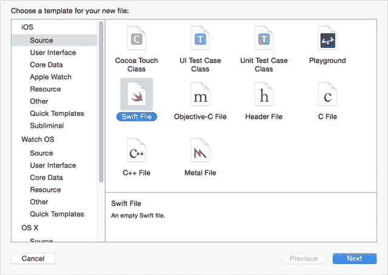

图 10-9. Xcode 的新文件模板

选择 **Swift File**，然后点击 **Next**（参见图 [10-10]）。

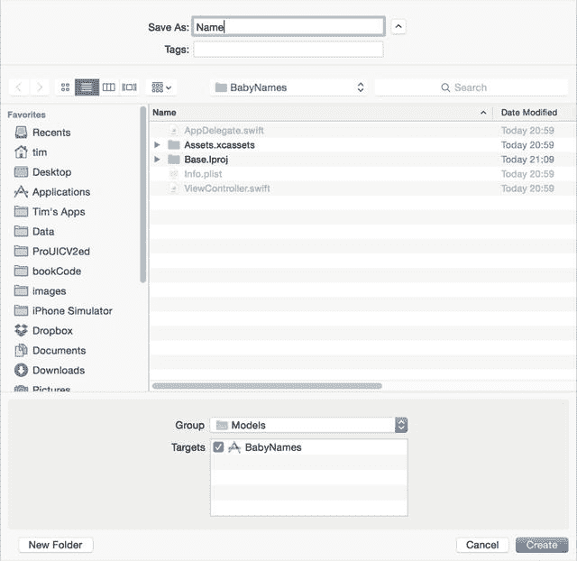

图 10-10. 为新文件命名

将新文件命名为 `Name`，点击 **Next**，并确保选中“将文件添加到 `BabyNames` 目标”的复选框。

新的 `Name` 文件将被创建并出现在导航区中（图 [10-11]）。

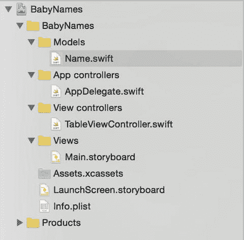

图 10-11. 新类的文件

**提示：** 如果你在创建项目时选中了 **“为此项目创建本地 git 仓库”** 选项，你会看到文件名右侧出现符号。它们显示了每个文件的源代码控制状态。新文件显示状态 `A`（表示它们需要被添加到仓库中）。状态为 `M` 的文件已被修改。

这超出了本书的范围，但如果你在项目中不使用源代码控制，我强烈建议你去研究一下。

现在你需要配置这个新的结构体。打开 `Name` 文件，并添加结构体的属性，如代码清单 [10-1] 所示。

**代码清单 10-1. Name.swift**

```swift
import Foundation

struct Name {
    var nameText: String?
    var gender: String?
    var derivation: String?
    var iconName: String?
    var notes: String?
}
```

#### 创建一些虚拟数据

创建了 `Name` 结构体后，下一步是创建一些可用于原型设计的虚拟数据。你需要一个模型来向 `tableView` 提供数据；这将在应用程序启动时创建。

切换到 `TableViewController`，并添加一个属性来保存用于表数据的 `Array`：

```swift
var tableData: [Name]!
```

现在添加一个 `IBOutlet` 来连接到表视图（稍后你将使用它来管理详情视图出现后的行高亮）：

```swift
@IBOutlet var tableView: UITableView!
```

最后，添加另一个属性来保存你想要在表中显示的姓名数量：

```swift
let numberOfNames = 25
```

最初，你将使用无意义的数据创建 `Name` 实例，这样你就拥有一些可以用来测试应用的数据。为此，你需要创建一个名为 `createNameWithNonsenseData` 的函数，该函数返回一个填充了随机数据的 `Name`。

然后，在 `ViewController` 的 `viewDidLoad` 函数中，`tableData` 数组将加载适当数量的无意义 `Name`。

你将在视图控制器的扩展中添加这两个新函数，以便将与视图控制器生命周期相关的函数与你的自定义函数分离开来。

在 `TableViewController` 文件的底部，添加扩展；参见代码清单 [10-2]。

**代码清单 10-2. 更新 TableViewController**

```swift
import UIKit

class TableViewController: UIViewController {

    var tableData: [Name]!

    @IBOutlet var tableView: UITableView!

    let numberOfNames = 25

    override func viewDidLoad() {
        super.viewDidLoad()
        // 加载视图后执行任何其他设置，通常来自 nib 文件。
    }

    override func didReceiveMemoryWarning() {
        super.didReceiveMemoryWarning()
        // 处置任何可以重新创建的资源。
    }
}

extension ViewController {
}
```

现在在扩展中添加第一个新函数，如代码清单 [10-3] 所示。

**代码清单 10-3. 创建随机姓名**

```swift
func createRandomNameWithNonsenseData() -> Name {
    // 创建示例数据数组
    let namesArray = ["Abigail", "Ada", "Adelaide", "Abel", "Algernon", "Anatole",
                      "Barbara", "Bertha", "Brunhilda", "Barton", "Ben", "Boris",
                      "Calista", "Cassandra", "Constance", "Caspar", "Clive", "Corey",
                      "Danica", "Dido", "Dora", "Darnell", "Dexter", "Dunstan", "Duncan"]
    let genderArray = ["男孩", "女孩", "通用"]
    let notesArray = ["繁荣而快乐", "维多利亚时代的流行名字。",
                      "'明亮的美人'。爱尔兰人使用的爱称",
                      "'犁沟之子；农夫'。十二使徒之一",
                      "优雅迷人之人",
                      "'矛'。一个挥舞长矛使敌人受损的女战士"]
    let derivationArray = ["凯尔特语", "日耳曼语", "古英语", "拉丁语", "希腊语"]
    let iconArray = ["icon1.png", "icon2.png", "icon3.png", "icon4.png", "icon5.png"]

    // 获取示例数据数组的数量，作为随机数的种子
    let nameCount = UInt32(namesArray.count)
    let genderCount = UInt32(genderArray.count)
    let notesCount = UInt32(notesArray.count)
    let derivationCount = UInt32(derivationArray.count)
    let iconCount = UInt32(iconArray.count)

    // 创建一个 Name 结构体
    var thisName = Name()

    // 设置一些随机事实
    thisName.nameText = namesArray[Int(arc4random_uniform(nameCount))]
    thisName.gender = genderArray[Int(arc4random_uniform(genderCount))]
    thisName.notes = notesArray[Int(arc4random_uniform(notesCount))]
    thisName.derivation = derivationArray[Int(arc4random_uniform(derivationCount))]
    thisName.iconName = iconArray[Int(arc4random_uniform(iconCount))]

    return thisName
}
```

**注意：** 你不需要使用这些数据。我几乎是随机挑选的数值。这个世界上的废话已经够多了，我就不再添乱了。

拥有了创建填充了随机数据的 `Name` 实例的能力后，你现在可以将它们存储在 `tableData` 数组中。

向 `ViewController` 的扩展中添加第二个函数，如代码清单 [10-4] 所示。

**代码清单 10-4. 创建随机数据**

```swift
func loadRandomNames() -> [Name] {
    var namesArray = [Name]()
    for _ in 0...numberOfNames {
        let thisName = createRandomNameWithNonsenseData()
        namesArray.append(thisName)
    }
    return namesArray
}
```

创建了两个数据生成函数后，你现在可以使用它们为表创建虚拟数据。更新 `viewDidLoad()` 函数，如代码清单 [10-5] 所示。

**代码清单 10-5. 更新后的 `viewDidLoad()` 函数**

```swift
override func viewDidLoad() {
    super.viewDidLoad()
    // 加载视图后执行任何其他设置，通常来自 nib 文件。
    tableData = loadRandomNames()
}
```


#### 连接表格视图

目前，应用启动后实际上并没有显示任何内容。让我们通过添加一个 `tableView` 并让它加载数据来解决这个问题。

切换到 Main storyboard，拖入一个 `UITableView` 对象，使其如图 10-12 所示。

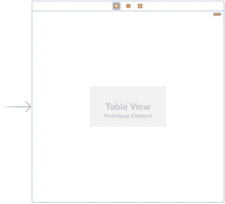

图 10-12. 向视图中添加表格视图

现在添加一些 AutoLayout 约束，使其填充整个视图。在 Storyboard 中选择 `tableView`，点击 Storyboard 面板右下角的固定图标，并将约束设置为图 10-13 中显示的值。

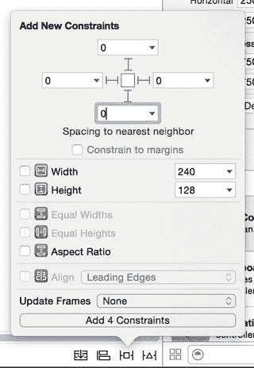

图 10-13. 设置 AutoLayout 约束

这里需要注意两点：

-   确保约束线是实心的红色，而不是虚线。如果不是，请点击线条进行设置。
-   确保 `Constrain to Margin` 选项未被勾选。

设置正确后，点击 `Add 4 Constraints` 按钮，约束将被添加，如图 10-14 所示。

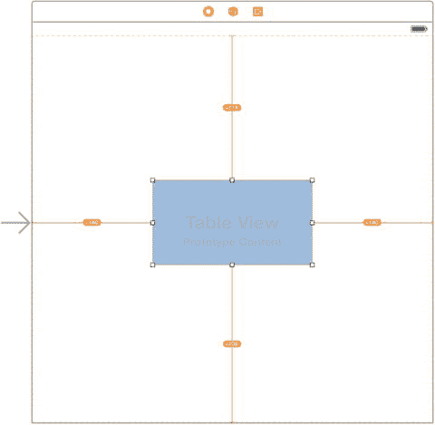

图 10-14. 新添加的约束

黄色的线条表明添加的约束与 Storyboard 中表格的显示之间存在差异。要强制 Storyboard 应用这些约束，请点击黄色的更新图标，如图 10-15 所示。

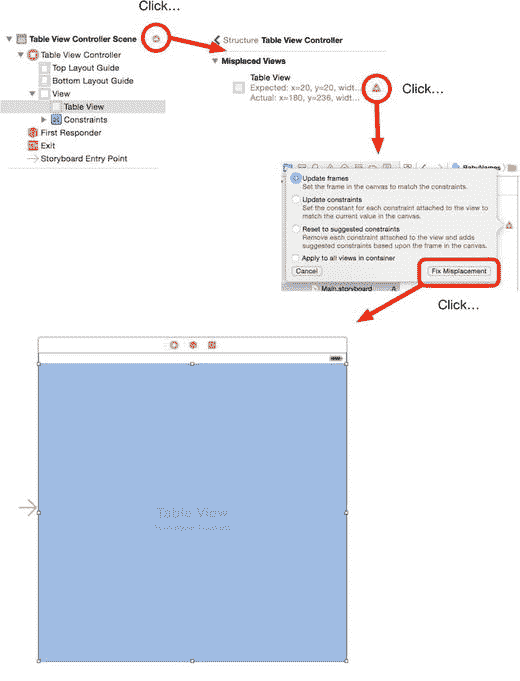

图 10-15. 更新 AutoLayout 约束

现在，让我们将新的 `tableView` 连接到视图控制器。在 Storyboard 中右键点击 `tableView`，并将其拖到文档大纲中的 `View Controller` 对象上，以连接表格的 `dataSource` 和 `delegate` 输出口，如图 10-16 所示。

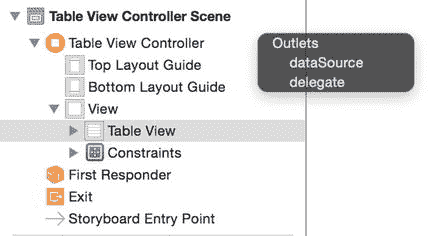

图 10-16. 连接 `dataSource` 和 `delegate`

接下来，你需要将 `TableViewController` 的 `tableView` 输出口连接到表格本身。在文档大纲中右键点击 `TableViewController`，并将其拖到 Storyboard 中的表格上。当弹出 HUD 时，选择 `tableView` 输出口以建立连接（图 10-17）。

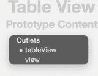

图 10-17. 将 `tableView` 输出口链接到表格

对于 `tableView`，还有最后一项工作，即添加一个原型单元格并为其指定一个 `cellIdentifier`，以便视图控制器在需要时能够使用原型创建新的单元格实例。

如果表格视图尚未被选中，请点击它，然后切换到实用工具面板中的属性检查器。顶部有一个下拉菜单用于选择表格的内容类型；请确保将其设置为 Dynamic Protoypes。

然后将原型单元格数量增加到 1，如图 10-18 所示。

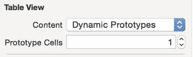

图 10-18. 增加原型单元格的数量

表格视图将被更新，添加一个原型单元格，如图 10-19 所示。

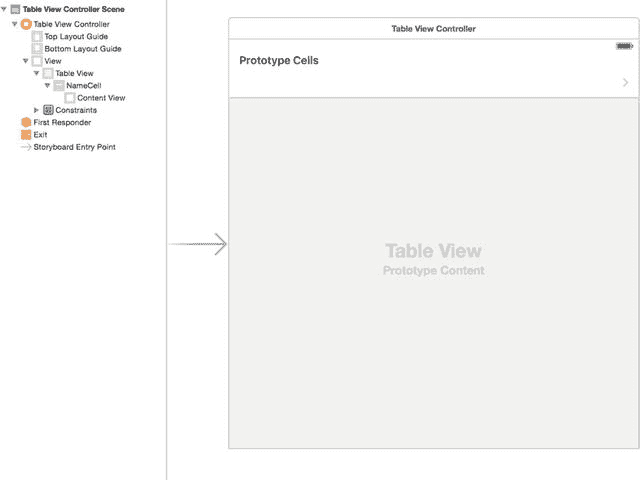

图 10-19. 新的原型单元格

点击表格顶部的原型单元格，切换到属性检查器，并更新该单元格，使其具有 Basic 样式、标识符为 `NameCell`，并显示一个公开指示器附件，如图 10-20 所示。

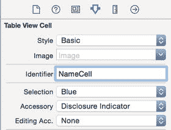

图 10-20. 更新原型单元格

现在，你可以切回到 `TableViewController` 类，并创建 `UITableViewDataSource` 函数来为表格提供数据。

在类的底部扩展中添加 `dataSource` 函数，如代码清单 10-6 所示。

代码清单 10-6. 添加 `dataSource` 函数

```
extension TableViewController: UITableViewDataSource {

    // DataSource 函数

    func numberOfSectionsInTableView(tableView: UITableView) -> Int {
        return 1
    }

    func tableView(tableView: UITableView, numberOfRowsInSection section: Int) -> Int {
        return tableData.count
    }

    func tableView(tableView: UITableView, cellForRowAtIndexPath indexPath: NSIndexPath) -> UITableViewCell {
        let cell = tableView.dequeueReusableCellWithIdentifier("NameCell", forIndexPath: indexPath)
        let name = tableData[indexPath.row]
        cell.textLabel!.text = name.nameText
        return cell
    }
}
```

运行应用以检查所有连接是否正确，你应该会看到一个显示 50 个随机名字的表格，如图 10-21 所示。

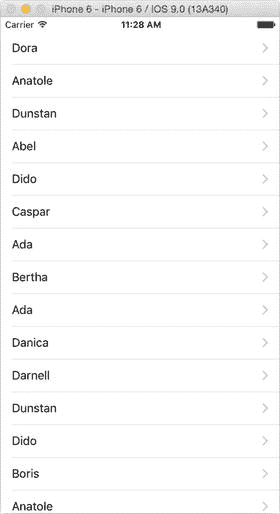

图 10-21. 数据出现在表格中！

#### 构建详情视图

当用户在表格中点击一个名字行时，应用将向用户显示一个详情界面，其中包含该名字的信息。`UINavigationController` 将处理推送详情视图的过程，但在它能够这样做之前，你需要创建一个详情视图。

由于应用仍处于概念验证阶段，你可以根据自己的喜好将其制作得简单或详细。我制作了一个非常（非常！）基础的版本作为起点。无论哪种方式，你都将需要一个新的视图控制器。

在导航器中高亮选中 View controllers 组，右键点击，然后添加一个新文件。在模板中选择 `Cocoa Class` 项，然后创建一个 `UIViewController` 子类，并将文件命名为 `DetailViewController`。

接下来，切换到 Storyboard，并从对象浏览器中拖出一个 `View Controller`。这将向文档大纲中添加一个场景，如图 10-22 所示。

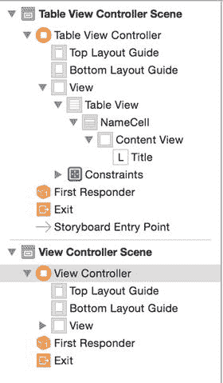

图 10-22. 文档大纲中的新视图控制器

在 Storyboard 中有了新的视图控制器后，你需要将其链接到刚刚创建的 `DetailViewController` 类。如果尚未选中，高亮选中文档大纲中的 `View Controller` 项，然后切换到身份检查器。将 `Custom Class` 属性更新为 `DetailViewController`，如图 10-23 所示。

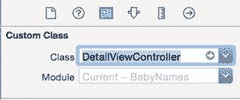

图 10-23. 将视图控制器链接到自定义类

现在，你可以在 Storyboard 中排列控件来显示名字详情的相关数据。我的作品看起来如图 10-24 所示。

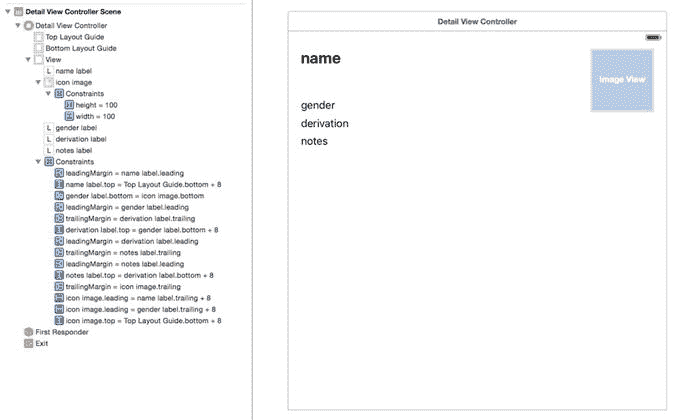

图 10-24. 非常基础的详情视图

`DetailViewController` 中提供了相应的输出口：

```
@IBOutlet var nameLabel: UILabel!
@IBOutlet var genderLabel: UILabel!
@IBOutlet var derivationLabel: UILabel!
@IBOutlet var notesLabel: UILabel!
@IBOutlet var iconImageView: UIImageView!
```

提示

要允许图像视图更改其宽高比以适应图像，你可以调整 AutoLayout 约束。将 `height` 和 `width` 约束的优先级设置为 `750`，并将 `content hugging` 和 `content compression` 的 `vertical` 和 `horizontal` 优先级均设置为 `1000`。


### 将数据传递到详细视图

要将数据传递到详细视图，你需要使用一种称为依赖注入的技术。这本质上是一个术语，指的是传入（或注入）视图所依赖的对象来配置自身，在本例中，就是需要显示详细信息的行所对应的 `Name` 结构体。

首先，在 `DetailViewController` 类中添加一个可选的 `displayName` 属性：

```swift
var displayName: Name?
```

这提供了一个属性，`TableViewController` 可以在点击表格行时、在详细视图被推入之前设置该属性。

然后，更新 `viewDidLoad` 函数以设置各个输出口：

```swift
override func viewDidLoad() {
    super.viewDidLoad()
    if let displayName = displayName {
        nameLabel.text = displayName.nameText
        genderLabel.text = displayName.gender
        derivationLabel.text = displayName.derivation
        notesLabel.text = displayName.notes
        if let iconName = displayName.iconName {
            iconImageView.image = UIImage(named: iconName)
        }
    }
}
```

这段代码解包了 `displayName` 属性并更新了标签的内容。

这里有一个细微之处需要注意：`displayName` 结构体的所有属性都是可选的。对于设置标签来说这不成问题，因为如果属性为空，标签会保持空白；但在创建图片时，你需要使用 `if-let` 结构来安全地解包可选的 `iconName` 字符串，然后才能尝试用它加载 `iconImageView`。

创建了视图控制器和详细屏幕的布局后，现在就可以引入导航控制器了。

## 实现导航控制器

实现导航控制器的过程包括将应用的初始表格视图替换为 `UINavigationController`，然后将表格视图加载到这个控制器中。

目前，初始显示的视图由 Storyboard 处理，所以 `AppDelegate` 中没有代码来管理这一点。代码清单 10-7 显示了 `AppDelegate` 的 `application:didFinishLaunchingWithOptions:` 函数的当前状态。

**代码清单 10-7.** 初始视图代码

```swift
func application(application: UIApplication, didFinishLaunchingWithOptions launchOptions: [NSObject: AnyObject]?) -> Bool {
    // 应用启动后的自定义覆盖点。
    return true
}
```

你需要更新这段代码，使其完成以下两件事：

* 创建一个 `UINavigationController`，并将其设置为应用的根视图
* 将 `tableViewController` 加载为导航控制器的根视图

画一两个示意图有助于理解这一点。首先来看图 10-25，该图展示了当前应用如何设置其可视化界面。

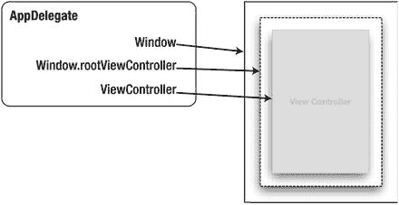

**图 10-25.** 应用委托实例化用户界面的方式

应用委托有一个 `window` 属性，它是通过 `UIScreen` 的 `mainScreen` 属性的边界创建的。这个 `window` 是应用的可视化用户界面必须容纳的地方。实际上，在软件中它是对设备物理屏幕的虚拟引用。

`window` 属性有一个 `rootViewController` 属性，你可以将其视为窗口中用于放置视图控制器的最前端的槽位。

> **注意**  
> 由于 iOS 中一些不太一致的命名约定，这里可能存在混淆的潜在来源。应用委托和 `UINavigationControllers` 都有一个名为 `rootViewController` 的属性。  
> 它们的用途大致相似，但它们**不是**同一个东西。在考虑 `rootViewController` 属性时，请务必清楚你所处理的上下文。

应用委托还有一个 `viewController` 属性。一个 `ViewController` 实例从 Storyboard 中实例化，然后分配给 `viewController` 属性。

此时你有两样东西：一个引用物理屏幕的方式（通过 `window` 属性）和一个 `viewController` 对象。要使 `viewController` 可见，只需将 `viewController` 对象插入到窗口的 `rootViewController` 属性中即可。它位于堆栈顶部，因此在设备屏幕上可见。

## 导航控制器如何连接

导航控制器应用的过程类似，但略有不同。不是用 `viewController` 填充窗口，而是创建一个 `UINavigationController` 对象并将其放入 `window` 中。然后，将你一开始拥有的 `viewController` 放入导航控制器内部。你明白我所说的套娃意思吗？

图 10-26 展示了这在实践中是如何结合在一起的。

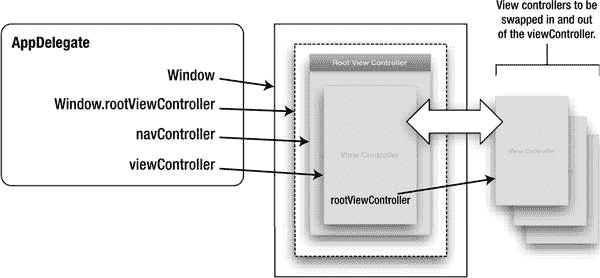

**图 10-26.** 导航控制器如何融入其中

来自应用委托的相应代码如代码清单 10-8 所示。

**代码清单 10-8.** 更新后的代码

```swift
func application(application: UIApplication, didFinishLaunchingWithOptions launchOptions: [NSObject: AnyObject]?) -> Bool {
    // 应用启动后的自定义覆盖点。
    let storyboard = UIStoryboard(name: "Main", bundle: nil)
    let tableViewController = storyboard.instantiateViewControllerWithIdentifier("TableViewController") as! TableViewController
    let navigationController = UINavigationController(rootViewController: tableViewController)
    navigationController.navigationBarHidden = false
    self.window?.rootViewController = navigationController
    self.window?.makeKeyAndVisible()
    return true
}
```

在运行应用之前，再做一处调整。切换回 `TableViewController`，并在 `viewDidLoad` 函数中添加这两行代码：

```swift
title = "Baby Names"
automaticallyAdjustsScrollViewInsets = false
```

这将表格顶部与导航栏底部对齐，并设置了标题。

如果你现在运行应用，会看到表格仍在，但现在已经位于一个提供顶部栏的导航控制器内。显示在导航控制器内容区域中的视图控制器的标题会显示在顶部栏中（见图 10-27）。

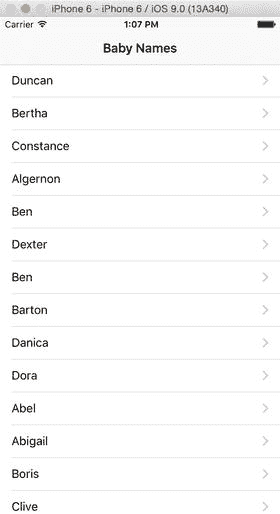

**图 10-27.** 内部包含表格的导航控制器


### 将导航控制器与详细视图连接起来

这个应用快完成了，但点击单元格并不会让详细视图神奇地出现。要实现这一点，你需要实现 `TableViewController` 的 `didSelectRowAtIndexPath:` 函数。

切换到 `TableViewController` 并更新扩展，使其也实现 `UITableViewDelegate` 协议：

`extension TableViewController: UITableViewDataSource, UITableViewDelegate {`

现在实现 `tableView:didSelectRowAtIndexPath:` 函数，如代码清单 10-9 所示。

**代码清单 10-9.** `tableView:didSelectRowAtIndexPath:` 函数

```
func tableView(tableView: UITableView, didSelectRowAtIndexPath indexPath:  
NSIndexPath) {
    let storyboard = UIStoryboard(name: "Main", bundle: nil)
    let detailView = 
  storyboard.instantiateViewControllerWithIdentifier("DetailViewController") as!  
  DetailViewController

    detailView.displayName = tableData[indexPath.row]
    navigationController?.pushViewController(detailView, animated: true)
}
```

首先，你需要创建一个 `storyboard` 的实例：

```
let storyboard = UIStoryboard(name: "Main", bundle: nil)
```

然后，从视图控制器中实例化具有适当 Storyboard 标识符的 `DetailViewController`：

```
let detailView = 
  storyboard.instantiateViewControllerWithIdentifier("DetailViewController") as! 
  DetailViewController
```

当 `detailView` 从 `storyboard` 实例化时，它将是 `UIViewController` 的一个实例，因此你需要使用 `as!` 运算符将其强制向下转换为 `DetailViewController` 的实例，以便能够设置 `displayName` 属性。

使用新实例化的 `DetailViewController` 实例，你可以从 `tableData` 数组中注入适当的 `Name` 到 `displayName` 属性：

```
detailView.displayName = tableData[indexPath.row]
```

然后获取 `TableViewController` 所在的导航控制器，以推入新视图：

```
navigationController?.pushViewController(detailView, animated: true)
```

现在运行应用，点击一行：`DetailViewController` 会从右侧滑入，点击“返回”按钮会使其再次滑出，如图 10-28 所示。

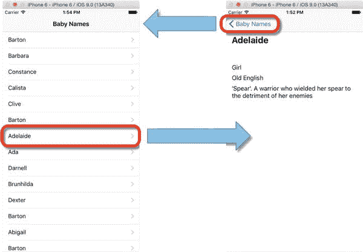

**图 10-28.** 从列表导航到详细视图并返回

还剩下一点清理工作：当详细视图被移除且 `tableView` 重新出现时，你需要取消选中之前选中的行。

`TableViewController` 的 `viewWillAppear:` 和 `viewDidAppear:` 函数会在详细视图被移除前后调用，因此你可以使用 `viewDidAppear:` 来移除行的选中高亮，如代码清单 10-10 所示。

**代码清单 10-10.** `viewDidAppear:` 函数

```
override func viewDidAppear(animated: Bool) {
    super.viewDidAppear(animated)
    if let indexPath = tableView.indexPathForSelectedRow {
        tableView.deselectRowAtIndexPath(indexPath, animated: true)
    }
}
```

首先，你需要获取当前选中行的 `indexPath`（与详细视图被推入时相同），然后使用它来调用 `tableView` 的 `deselectRowAtIndexPath:animated:` 函数。

如果你将 `animated:` 参数传递为 `true`，高亮将以柔和的淡出效果被移除。

虽然这肯定不会在用户界面设计上获奖，但你现在已经将导航控制器、表格视图和详细视图控制器连接起来，并让它们协同工作了。

## 使用 Segue 构建导航结构

到目前为止，你已经手动构建了应用的结构和导航流程，这意味着你在 `AppDelegate` 的代码中创建了 `UINavigationController`，而 `TableViewController` 和 `DetailViewController` 在 Storyboard 中没有任何连接。

还有一种替代方法可以实现相同的效果，它能在 Storyboard 中更直观地显示发生了什么。最终结果完全相同，因此由你决定采用哪种方法。

为了说明这一点，让我们将当前的应用转换为使用 Segue 来管理表格和详细视图之间的转换。

### 将表格视图嵌入导航控制器

第一步是在 Storyboard 中将 `TableViewController` 嵌入 `UINavigationController` 中。这很简单：在文档大纲中选择 `TableViewController`，然后从 `Editor` 菜单中选择 Embed In ➤ Navigation Controller 项。

这会在 Storyboard 中插入一个 `Navigation Controller`，并通过关系链接 `TableViewController`。

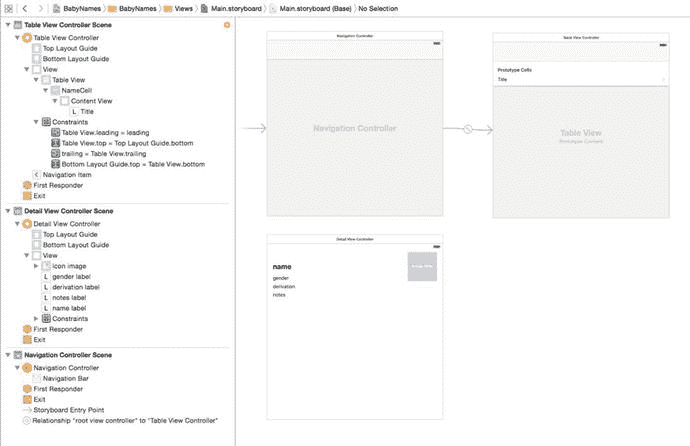

**图 10-29.** Storyboard 中的新导航控制器

如图 10-29 所示，`TableViewController` 通过关系链接到 `Navigation Controller`，并且 `Navigation Controller` 已被设置为应用的初始视图控制器（`Navigation Controller` 左侧向内的箭头）。

所有这些元素都列在文档大纲的 `Navigation Controller` 场景下方。在 iOS 开发中，这时你会开始体会到大显示器的用处！

`Navigation Controller` 场景出现在 Storyboard 中时没有任何标识符，因此你需要设置它。在文档大纲中选择它，切换到工具面板中的身份检查器，并将 Storyboard ID 更新为 `NavigationController`，如图 10-30 所示。

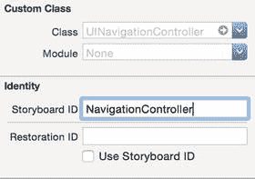

**图 10-30.** 更新导航控制器的标识符

### 更新应用委托

由于你改变了 Storyboard 的结构，你需要更新 `AppDelegate` 以反映这些变化。

切换到 `application:didFinishLaunchingWithOptions:` 函数，并将其更新为与代码清单 10-11 一致。

**代码清单 10-11.** 更新后的 `application:didFinishLaunchingWithOptions:` 函数

```
func application(application: UIApplication, didFinishLaunchingWithOptions 
launchOptions: [NSObject: AnyObject]?) -> Bool {
    // Override point for customization after application launch.
    let storyboard = UIStoryboard(name: "Main", bundle: nil)
    let navigationController = 
  storyboard.instantiateViewControllerWithIdentifier("NavigationController")
    navigationController.navigationBarHidden = false
    self.window?.rootViewController = navigationController
    self.window?.makeKeyAndVisible()
    return true
}
```

这里你像之前一样实例化了 `storyboard`，但这次你是从 `storyboard` 加载导航控制器，而不是用代码创建它。也不需要创建 `TableViewController` 的实例；你在 `storyboard` 中建立的链接会自动处理这些。


### 将详情视图与表格视图关联起来

现在`TableViewController`已嵌入导航控制器中，您可以将其与`DetailViewController`进行关联。

操作非常简单：在表格视图的原型行上右键单击，将蓝色连接线拖拽至`Detail View Controller`，然后释放鼠标按钮。

此时，连接 HUD（弹出式帮助界面）将出现。选择`Show`选项，如图 10-31 所示。

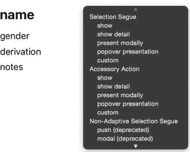

图 10-31. 连接 HUD

两个控制器之间将建立连接（如图 10-32 所示）。

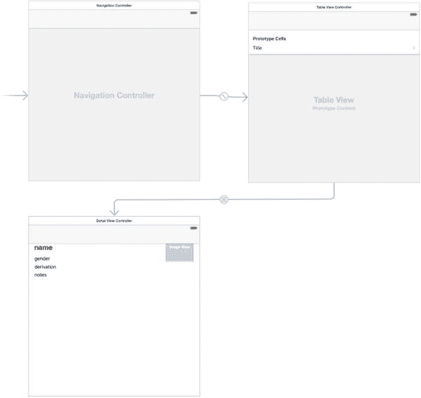

图 10-32. 在`TableViewController`与详情视图之间建立连接

连接（即转场）建立后，您需要为其指定一个标识符。点击连接线使其高亮显示，切换到工具面板中的身份检查器，将其命名为`PushDetailSegue`，如图 10-33 所示。

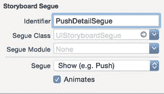

图 10-33. 为转场指定标识符

至此，您不再需要`UITableViewDelegate`函数来响应选择操作。因此，切换回`TableViewController`，并从`TableViewController`扩展中移除`tableView:didSelectRowAtIndexPath:`函数。修改后的代码应如代码清单 10-12 所示。

**代码清单 10-12.** 更新后的`TableViewController`扩展

```
extension TableViewController: UITableViewDataSource {

    // DataSource functions

    func numberOfSectionsInTableView(tableView: UITableView) -> Int {
        return 1
    }

    func tableView(tableView: UITableView, numberOfRowsInSection section: Int) -> Int {
        return tableData.count
    }

    func tableView(tableView: UITableView, cellForRowAtIndexPath indexPath: NSIndexPath) -> UITableViewCell {
        let cell = tableView.dequeueReusableCellWithIdentifier("NameCell", forIndexPath: indexPath)
        let name = tableData[indexPath.row]
        cell.textLabel!.text = name.nameText
        return cell
    }
}
```

运行应用程序，测试从表格到详情视图的推送功能。但效果似乎不太理想：详情视图如图 10-34 所示。

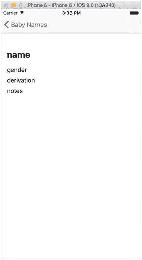

图 10-34. 出现问题的详情视图

问题在于，您移除了用于将`Name`结构体从`TableViewController`传递到`DetailViewController`的函数。这意味着`DetailViewController`的`displayName`属性为空，没有数据来更新界面字段。

在执行转场之前，视图控制器会执行`prepareForSegue:sender:`函数。此时，您可以访问即将显示的视图控制器，并传递新控制器所需的任何数据对象。

在`TableViewController`的主体内，添加代码清单 10-13 所示的函数。

**代码清单 10-13.** `prepareForSegue:sender`函数

```
override func prepareForSegue(segue: UIStoryboardSegue, sender: AnyObject?) {
    if segue.identifier == "PushDetailSegue" {
        let detailViewController = segue.destinationViewController as! DetailViewController
        if let indexPath = tableView.indexPathForSelectedRow {
            detailViewController.displayName = tableData[indexPath.row]
        }
    }
}
```

首先，检查正在执行的是哪个转场。此函数会被所有转场调用，因此确保正确的操作执行至关重要。

假设即将执行的转场标识符为`PushDetailSegue`，则访问其`destinationViewController`属性，并通过强制向下转型创建一个指向`DetailViewController`类实例的引用。（默认情况下，转场的`destinationViewController`属性是`UIViewController`的实例。）

接下来，通过向表格询问任何选中行的`indexPath`，来检查是否存在选中行。如果由于某种原因没有选中行，表格视图将返回包含`nil`的可选值，因此最安全的方式是使用`if-let`子句对其进行解包。

随后，利用选中行的`indexPath`，您可以将`detailViewController`的`displayName`属性设置为`tableData`数组中的对应项。

再次运行应用程序，这次您将看到详情视图已填充了`Name`结构体的数据，如图 10-35 所示。

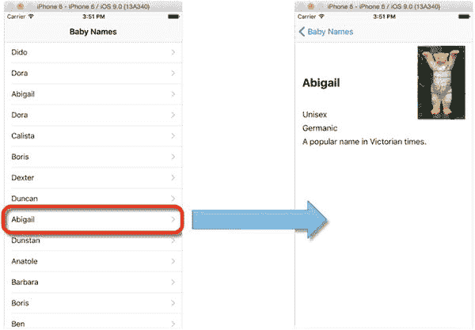

图 10-35. 详情视图已填充数据的应用程序

## 本章小结

在本章中，您从头开始构建了一个基于`UINavigationController`的应用程序。应用程序委托加载导航控制器，导航控制器加载表格视图，表格视图提供相应的行，并请求导航控制器为行内容推送详情视图。

实现此功能有两种基本方式：一种是通过代码实现，利用`UITableViewDelegate`函数响应表格中的选择操作；另一种是利用 Storyboard 功能，响应转场事件。

在完成应用程序的结构和基本功能搭建后，您可以调整代码，使表格能够以任何合适的模型作为数据源。该数据的结构将决定您如何处理向下钻取详情：通过表格之间的跳转，在层级数据结构中前进和后退将变得非常便捷。

