# 11. 索引、分组与排序表格

尽管`UITableView`在管理大量数据方面效率很高，但用户界面受到设备物理尺寸的限制。当表格显示超过 10 行或 12 行时，其标签和控件会变得过小，难以操作。

如果表格包含大量数据，用户可能还需要进行大量滚动操作，这会影响用户体验。幸运的是，`UITableView`提供了一些功能来改善表格视图所呈现数据的组织方式。

## 使用索引表格

索引表格与普通样式表格基本相同，但右侧边缘会有一个索引栏，如第 3 章所示。通常，索引显示字母或数字，用户点击后即可自动将表格滚动到相应部分，无需手动滚动。

内置的“通讯录”等应用正是这样工作的。当应用打开时，您位于以 A 开头的姓名列表顶部。点击 Z 将快速将应用滚动到列表底部。

索引表格依赖于两个元素：一组用作索引条目的字符串（显示在右侧边缘），以及按与索引条目对应的分节组织的数据。以“通讯录”应用为例，姓名按字母顺序分节排列——以 A 开头的姓名一个分节，以 B 开头的姓名一个分节，以此类推。

虽然索引中的每个条目都需要有一个对应的分节，但分节标题的名称不必与索引字符串本身相同。在“通讯录”应用中，分节标题和索引是相同的，但如有需要，您也可以更灵活地设置。

**警告**

苹果的 iOS 人机界面指南建议不要将表格索引与单元格内控件结合使用，因为索引可能会遮挡单元格的右侧部分。


## 使用分区与分组表格

分区功能将数据的有序展示提升到了一个新阶段，并引入了行分组的概念，正如你在第 3 章所学的。这些行可以通过分区标题划分表格视图，或者将表格拆分为多个组来呈现。

将行拆分为不同的组有助于分解信息，并且在滚动长表格时可以轻松区分各个组，如图 11-1 所示。

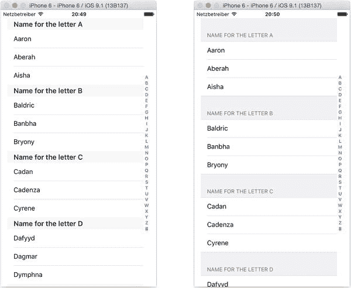

**图 11-1.** 分区与分组表格样式

尽管视觉呈现上差异明显，但分区表格和分组表格使用相同的基础数据结构。每个分区或组的数据存储在一个"内部"数组中，而该数组又被存储在用于组织所有分区和组的"外部"数组中。

**注意：** 如果你使用的是分组表格，通常不会使用索引。虽然苹果《人机界面指南》中并未明确禁止，但索引往往会显得奇怪，因为它与分组表格的背景重叠。

## 创建简单索引表格

在深入复杂内容之前，我们先构建一个非常简单的索引表格，如图 11-2 所示。该表格包含一个姓名列表，每个字母对应一个姓名。姓名按分区排序，并设有索引导航列表。

为了保持示例简单，每个分区只有一个姓名，因此无需对每个分区内的数据进行排序。你将在本章下一节学习如何对行进行排序。

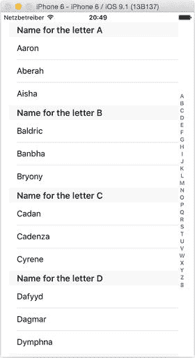

**图 11-2.** 简单索引表格

首先，基于"Single View Application"模板创建一个新项目。这将为你提供一个包含`AppDelegate`、视图控制器类以及 XIB 文件的骨架应用。

### 设置基础表格

"Single View Application"模板提供了一个非常基础的骨架应用，包含一个`AppDelegate`和一个单一视图控制器。目前，该视图控制器是一个空视图（如果在此时运行应用，你会看到一个空白的灰色屏幕）。

要使初始表格视图启动并运行，你需要完成两件事：

1. 将`tableView`添加到 Storyboard 中。
2. 为视图控制器添加扩展，使其遵循`UITableViewDelegate`和`UITableViewDataSource`协议。

要添加表格视图，请切换到 Storyboard，并从对象浏览器中拖出一个`UITableView`对象到视图中。添加 AutoLayout 约束，使其适应整个视图，如图 11-3 所示。

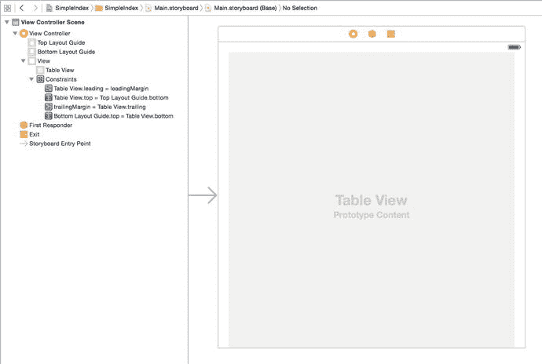

**图 11-3.** 设置`tableView`

然后，通过从表格拖向文档大纲中的"View Controller"，将`tableView`的`delegate`和`dataSource`出口连接到`viewController`。

接下来，通过选择`tableView`对象并在属性检查器中将`Prototype Cells`的数量设置为`1`（如图 11-4 所示），向表格添加一个原型单元格。

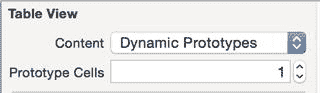

**图 11-4.** 添加原型单元格

最后，通过选择该行并在单元格的属性检查器中更改`Style`为`Basic`，将原型单元格类型更改为`Basic`，然后为其设置标识符`CellIdentifier`（如图 11-5 所示）。

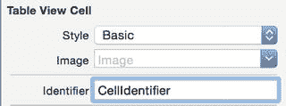

**图 11-5.** 设置原型单元格

目前 Storyboard 需要做的就这些，所以切换回`ViewController`。

### 创建源数据

首先，你需要两个数据源：

- 要在表格行中显示的对象
- 要作为索引标题显示的对象

这些将存储在两个`Array`属性中。视图控制器还需要在扩展中充当表格视图的`delegate`和`dataSource`。按列表 11-1 所示更新`ViewController`。

**列表 11-1.** 对视图控制器的初始更新

```
import UIKit

class ViewController: UIViewController {

    var tableData: [String]!

    var indexTitlesArray: [String]!

    override func viewDidLoad() {
        super.viewDidLoad()
        // 在视图加载后进行额外设置，通常从 nib 文件加载
    }

    override func didReceiveMemoryWarning() {
        super.didReceiveMemoryWarning()
        // 处置可重新创建的资源
    }
}

extension ViewController {

}

extension ViewController: UITableViewDataSource {

}
```

为了尽可能简化此示例，我们将使用一个包含 26 个姓名的数组作为表格数据，以及一个字母表数组作为索引标题。

为了保持视图控制器的有序性，在扩展的函数中添加此设置，并在`viewDidLoad`函数中调用它。列表 11-2 显示扩展，列表 11-3 显示更新后的`viewDidLoad`函数。

**列表 11-2.** 视图控制器的扩展

```
extension ViewController {

    func setupTableData() {
        tableData = ["Aaron", "Bailey", "Cadan", "Dafydd", "Eamonn", "Fabian",
                     "Gabrielle", "Hafwen", "Isaac", "Jacinta", "Kathleen", "Lucy", "Maurice", "Nadia",
                     "Octavia", "Padraig", "Quinta", "Rachael", "Sabina", "Tabitha", "Uma", "Valentin",
                     "Wallis", "Xanthe", "Yvonne", "Zebadiah"]
        let letters = "A B C D E F G H I J K L M N O P Q R S T U V W X Y Z"
        indexTitlesArray = letters.componentsSeparatedByString(" ")
    }
}
```

`indexTitlesArray`使用了`String`便捷的`componentsSeparatedByString`方法，该方法接收一个由空格分隔的字母字符串，并返回在每处空格处拆分原始字符串后得到的数组。这比逐个输入`"a"`、`"b"`、`"c"`要快得多。

**列表 11-3.** 更新后的`viewDidLoad()`函数

```
override func viewDidLoad() {
    super.viewDidLoad()
    // 在视图加载后进行额外设置，通常从 nib 文件加载
    setupTableData()
}
```


### 为表格填充数据

要创建一个带索引的表格，`tableView` 的 `dataSource` 和 `delegate` 需要比之前示例做更多的工作。

`tableView:cellForRowAtIndexPath` 函数与你之前见过的完全相同，如代码清单 11-4 所示。

代码清单 11-4. `tableView:cellForRowAtIndexPath` 函数

```
func tableView(tableView: UITableView, cellForRowAtIndexPath indexPath: NSIndexPath) ->
    UITableViewCell {
    let cell = tableView.dequeueReusableCellWithIdentifier("CellIdentifier",
        forIndexPath: indexPath)
    cell.textLabel!.text = tableData[indexPath.section]
    return cell
}
```

在之前只有一个分区的简单表格中，分区内的行数就是源数据的行数。这使得 `numberOfRowsInSection` 函数非常简单。

例如，如果表格数据存储在一个名为 `tableData` 的 `Array` 中，该方法将如代码清单 11-5 所示。

代码清单 11-5. 一个简单的 `numberOfRowsInSection` 方法

```
func tableView(tableView: UITableView, numberOfRowsInSection section: Int) -> Int {
    return tableData.count
}
```

在你的带索引表格中，你需要知道每个分区中有多少行，以便 `numberOfRowsInSection` 方法能返回这些数据。

由于这是一个简单的示例，每个字母对应一个名字，你可以直接返回 `1` 来快速实现，如代码清单 11-6 所示。

代码清单 11-6. 实际的 `numberOfRowsInSection` 函数

```
func tableView(tableView: UITableView, numberOfRowsInSection section: Int) -> Int {
    return 1
}
```

在确定了每个分区中的行数并为每行创建了单元格之后，要使索引功能正常工作，还需要做以下四件事：

-   返回表格中的分区数量。
-   为每个分区返回该分区标题的文本，使其显示在单元格上方。
-   返回一个字符串数组作为索引，以便显示在表格的右侧。
-   对于索引中的每个字符串，找出该字符串对应的分区，以便表格能够跳转到相应的位置。

让我们逐一解决这些问题。

### 返回表格中的分区数量

要返回表格中的分区数量，你需要使用 `numberOfSectionsInTableView` 函数。该数量应与索引标题中的条目数相同，如代码清单 11-7 所示。

代码清单 11-7. `numberOfSectionsInTableView` 函数

```
func numberOfSectionsInTableView(tableView: UITableView) -> Int {
    return indexTitlesArray.count
}
```

### 创建分区标题

分区标题将显示在该分区行的上方。标题的外观可以自定义，但默认是一个灰色条，如图 11-6 所示。


图 11-6. 默认分区标题

你需要为每个分区提供一个标题，但这些标题不必与索引条目相同。

由于你的分区标题将与索引条目一致，因此可以使用分区编号来访问 `indexTitlesArray` 中对应索引的对象，如代码清单 11-8 所示。

代码清单 11-8. `titleForHeaderInSection` 方法

```
func tableView(tableView: UITableView, titleForHeaderInSection section: Int) ->
    String? {
    return indexTitlesArray[section]
}
```

### 构建索引

索引由一个 `Strings` 的 `Array` 构建而成。严格来说，这些字符串可以是任意长度，但显然存在空间限制。最好将字符串长度控制在三个字母以内。

提供索引数据只需要返回这个数组即可，如代码清单 11-9 所示。

代码清单 11-9. `sectionIndexTitlesForTableView` 函数

```
func sectionIndexTitlesForTableView(tableView: UITableView) -> [String]? {
    return indexTitlesArray
}
```

### 将索引匹配到分区

当点击索引中的某个元素时，`tableView` 会自动滚动，使相应分区的标题位于表格最顶部。幸运的是，`tableView` 会自行处理滚动距离的计算，但你需要通过告知它哪个表格分区对应哪个索引来提供帮助。代码清单 11-10 展示了如何实现这一点。

代码清单 11-10. `tableView:sectionForSectionIndexTitle:atIndex` 函数

```
func tableView(tableView: UITableView, sectionForSectionIndexTitle title: String,
    atIndex index: Int) -> Int {
    return indexTitlesArray.indexOf(title)!
}
```

将所有部分整合起来，将得到一个如图 11-7 所示的表格。

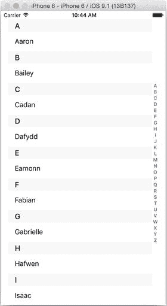

图 11-7. 一个非常简单的带索引表格

值得注意的是，你不需要将索引和分区一起使用。如果你想要一个带索引但没有分区标题的表格，可以不实现 `tableView:titleForHeaderInSection` 函数，你的表格就会变成一个简单的带索引表格，如图 11-8 所示。

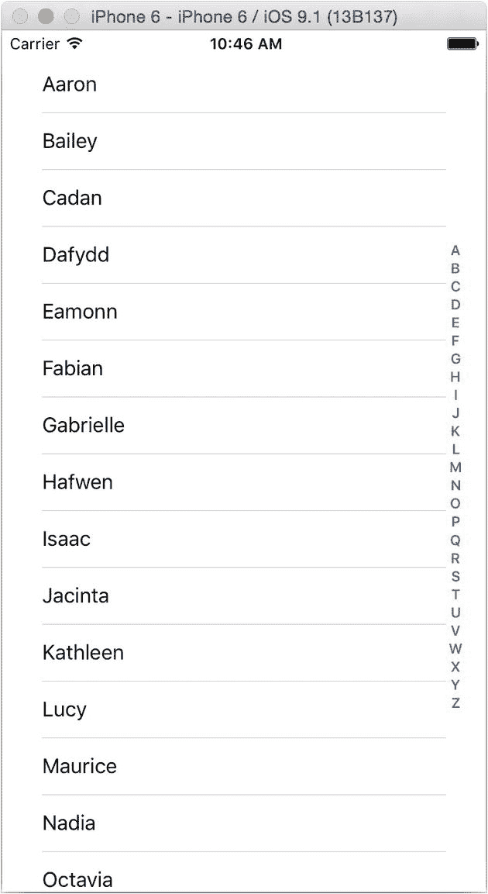

图 11-8. 不带分区标题的带索引表格

类似地，你可以通过省略 `sectionIndexTitlesForTableView` 方法来移除索引，这将得到一个如图 11-9 所示的表格。

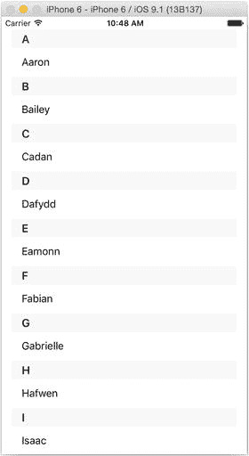

图 11-9. 带分区和索引的表格

## 构建实用的分区表格

你目前构建的简单表格，希望能让你对带索引和分区的表格如何运作有所了解，但这只是一个非常简单的示例。在实际应用中，你的应用很可能拥有更复杂的数据，相应地也需要更复杂的实现。

在本节中，你将构建一个更复杂的示例，其数据能够支持图 11-10 中的表格类型。

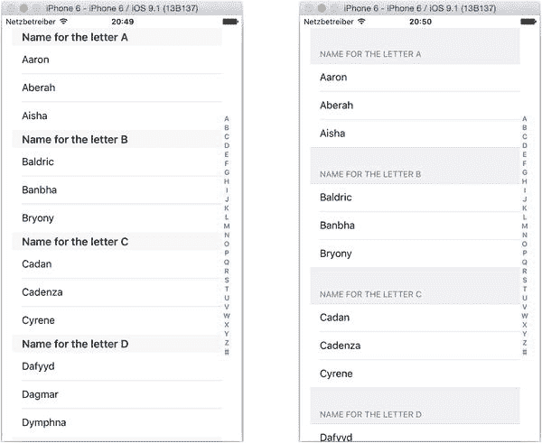

图 11-10. 功能全面的表格

该应用将实现几个新特性：

-   从属性列表（`.plist`）文件加载源数据
-   使用 `UILocalizedIndexedCollation` 类来自动创建分区标题和索引列表
-   根据索引有条件地创建分区标题


## 创建带分区和索引的表格数据

要为带索引的表格提供数据，需要三组数据：

- 用于表格索引的字符串数组
- 每个分区标题的数据
- 每个分区中各行的数据

提供后两组数据最简单的方式是使用数组的数组。外层数组组织分区，包含保存行数据的内层数组。

内层数组会进行排序，确保行按顺序排列。外层数组也会排序，确保分区按顺序排列。图 11-11 展示了示例。

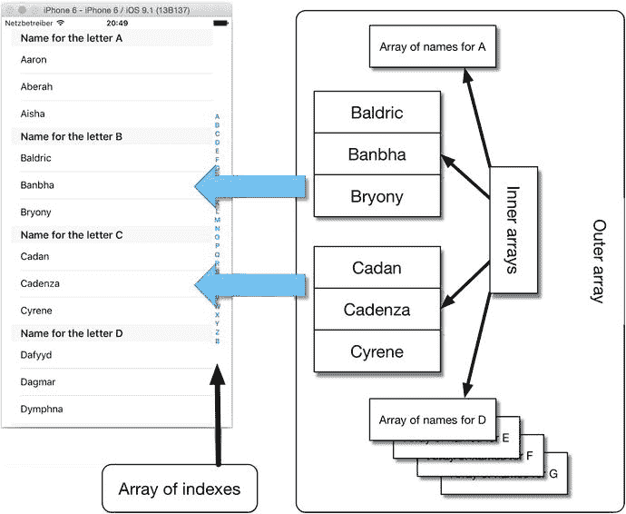

图 11-11. 表格数据填充方式

内层数组中的数据对象不一定要有序，但通常如此。

创建索引表格数据有两种方式：

- 手动创建数组的数组
- 使用 `UILocalizedIndexedCollation` 类完成大部分繁重工作

选择哪种方式取决于个人偏好和正在构建的应用需求，因此我将介绍这两种方法。

### 数组的数组

手动创建数据结构分为两个阶段：

1. 创建内层数组并填充对象。
2. 将内层数组添加到外层数组中。

这里隐含一个假设：你将按照希望在表格中显示的顺序将对象添加到数组中（并将内层数组添加到外层数组中）。如果不是这种情况，可以在需要之前对它们进行排序。稍后你将了解这一点。

代码清单 11-11 提供了一个非常简单的（且刻意构造的）示例，演示如何创建数组的数组。

代码清单 11-11. 最简单的数组的数组

```
func createArrayOfArrays() -> [Array<String>] {
    // 创建内层数组
    let innerArrayA = ["A1", "A2", "A3", "A4"]
    let innerArrayB = ["B1", "B2", "B3", "B4"]
    let innerArrayC = ["C1", "C2", "C3", "C4"]
    let innerArrayD = ["D1", "D2", "D3", "D4"]
    let innerArrayE = ["E1", "E2", "E3", "E4"]
    let outerArray = [innerArrayA, innerArrayB, innerArrayC, innerArrayD, innerArrayE]
    return outerArray
}
```

尽管这种方法完全可行，但并非最灵活——尤其是你需要负责将数组排序为所需的顺序。

幸运的是，iOS 提供了名称简洁的 `UILocalizedIndexedCollation` 类，可为我们自动化许多流程。

## UILocalizedIndexedCollation

`UILocalizedIndexedCollation` 类提供了一些便捷函数，可帮助创建索引表格的数据结构。引用苹果的类参考文档：

> `UILocalizedIndexedCollation` 类是一个便捷工具，用于组织、排序和本地化带有分区索引的表格视图的数据。

它提供了许多辅助函数，包括你将很快用到的排序函数；它处理行对象的数组，将数据排序、组织并本地化为适合表格视图的形式。

这是一个四阶段流程：

1. 创建 `UILocalizedIndexCollation` 对象的实例。它提供一个名为 `sectionTitles` 的数组，其中包含当前语言环境设置的字母表。（这将自动调整，因此你无需担心其内容。）
2. 创建数组结构：一个用于分区的外层数组，以及每个 `sectionTitles` 对应的内层数组。
3. 对于行对象数组中的每个对象，使用 `UILocalizedIndexCollation` 的 `sectionForObject` 方法确定该对象应放入哪个内层数组。
4. 将所有行对象放入各自的内层数组后，使用 `UILocalizedIndexCollation` 的 `sortedArrayFromArray` 方法对内层数组进行排序。

在每种情况下，`UILocalizedIndexCollation` 都会根据相关语言环境来确定如何组织和排序行对象，这意味着你不需要纠结于字母排序的细微差别……

#### 本地化实践

顾名思义，`UILocalizedIndexedCollation` 类处理了应用本地化中的许多繁重工作，并且依赖于应用程序包的语言环境设置。这使得该类能够处理不同语言的排序需求。

例如，使用美式英语作为语言环境的应用，其 `sectionTitles` 数组将返回 27 个结果：A 到 Z 各一个，以及列表中出现的数字对应的 `#`。然而，如果你使用德语语言环境，你还会自动获得诸如 `Ü` 字符的条目——因此该类可以节省大量时间和精力。

iOS 的本地化甚至足够智能，可以支持非拉丁字符集。例如，使用繁体中文语言环境时，该类将按汉字笔画数进行排序。

iOS 对本地化提供了广泛支持，但这本身就是一个大话题。更多详情请参阅 iOS 文档中的“国际化和本地化指南”。

这一切听起来工作量很大，但实际情况并非如此。通过使用 `UILocalizedIndexCollation`，你很快就能完成图 11-7 中的应用。

## 创建全能型表格

创建该应用分为四个步骤：

1. 从“单视图应用程序”模板创建新应用。
2. 创建一些要在表格中显示的数据。为了增加一些多样性，你将使用 plist 文件提供原始数据。
3. 将 `tableView` 添加到 Storyboard 文件，并使视图控制器类遵循 `UITableView` 的 `delegate` 和 `dataSource` 协议（现在你应该已经很熟悉了）。
4. 扩展视图控制器类，实现处理表格索引和分区的额外方法。

### 从模板创建应用

这里没有什么新内容。在 Xcode 中，通过选择“文件”➤“新建”➤“新建项目”来创建新项目，选择“单视图应用程序”模板，并将项目保存到合适的位置。

这将为你提供一个 `AppDelegate`、一个名为 `ViewController` 的 `UIViewController` 子类，以及一个 Storyboard 文件。


### 在 `plist` 文件中创建数据

如果你之前没接触过，属性列表（通常缩写为 `plist`）文件是一种以键值结构存储数据的有用方式。它们的作用与 JavaScript 对象表示法（`JSON`）文件几乎完全相同，但具有几个针对 iOS 的优势：

- 由于 `plist` 文件是 iOS 的原生格式，Xcode 提供了一个精巧的编辑器，使得创建和编辑它们变得轻而易举。
- iOS 对 `plist` 文件的读写速度显著快于对等效的 JSON 文件。

`Plist` 文件存储在应用包中，但你可以像创建类或 XIB 文件一样创建和编辑它们。要为表格数据创建一个新的 `plist`，请选择“文件”➤“新建”➤“文件”，然后从“资源”组中选择“属性列表”选项，如图 11-12 所示。

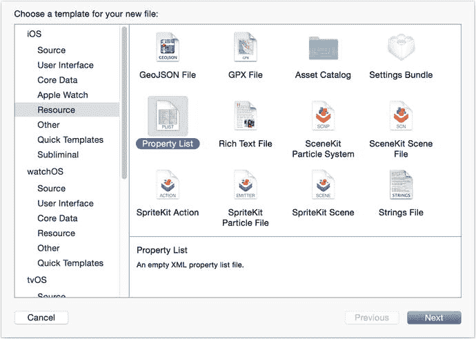

图 11-12. 创建一个新的属性列表文件

将文件命名为 `Names`，然后点击“创建”来创建文件。

如果你在项目浏览器中点击 `Names.plist` 文件，会看到一个空白文件，其中包含 `Key`、`Type` 和 `Value` 列标题。

要创建一个新的键值对，请选择 `Root` 条目，按住 Command 键并在源代码编辑器中点击，然后选择“添加行”选项，如图 11-13 所示。

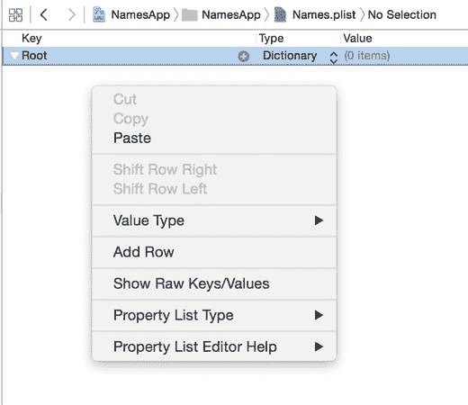

图 11-13. 添加新的键值对

会添加一个新的空 `Key` 项，如图 11-14 所示。

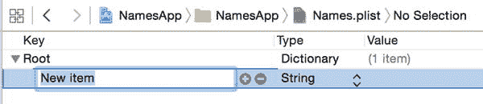

图 11-14. 新的键值对

可以创建各种类型的键值对，但要记住的关键点是（故意用双关语）键必须唯一。你将创建一个名称列表，因此需要的不是字符串类型，而是一个数组。

点击 `String` 旁的下拉箭头，你会看到一个类型弹出列表，如图 11-15 所示。

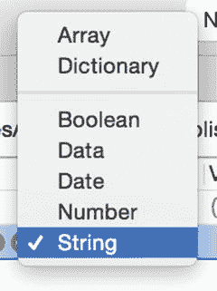

图 11-15. 类型弹出列表

选择 `Array` 选项，`New Item` 键将变为 `Array` 类型。双击 `New Item` 标题并将其替换为 `names`。

现在开始添加 `Name` 值。点击 `Names` 行中的展开指示器使其高亮，然后按回车键。一个名为 `Item 0` 的新行会显示在 `Names` 下方，如图 11-16 所示。


图 11-16. 添加新值

在 `Value` 字段中，输入第一个名字（我用了 `Aaron`，但你可以用任何你喜欢的名字）。然后按回车键保存新值。再次按回车键，重复此过程。

现在你有两个选择：继续输入，或者使用项目 GitHub 仓库中源代码里的 `plist` 文件。如果选择第二个选项，最终得到的 `plist` 将如图 11-17 所示。

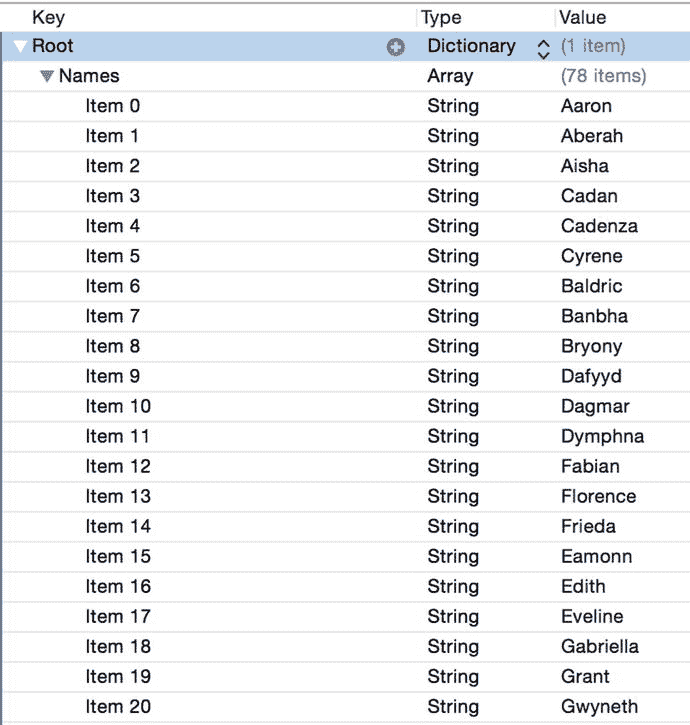

图 11-17. 源代码的 `plist` 文件

#### 在代码中使用 `plist`

为了使用 `plist` 文件中存储的数据，必须先加载并解析它，然后才能将其用作表格视图的数据源。

在 `ViewController` 类中，添加一个名为 `tableData` 的 `Array` 属性。现在通过添加清单 11-12 所示的扩展来更新 `ViewController`。

清单 11-12. `ViewController` 扩展

```
extension ViewController {
    func parsePlist() {
        let bundle = NSBundle.mainBundle()
        if let plistPath = bundle.pathForResource("Names", ofType: "plist"),
            let namesDictionary = NSDictionary(contentsOfFile: plistPath),
            let names = namesDictionary["Names"] {
                tableData = names as! [String]
        }
    }
}
```

现在更新 `viewDidLoad` 方法来调用 `parseList()` 函数，如清单 11-13 所示。

清单 11-13. 更新后的 `viewDidLoad()` 方法

```
override func viewDidLoad() {
    super.viewDidLoad()
    // Do any additional setup after loading the view, typically from a nib.
    parsePlist()
}
```

这段代码执行三项任务：

- 在应用的主包中定位 `plist` 文件
- 根据 `plist` 文件的内容创建一个 `NSDictionary`
- 将 `plist` 的 `Names` 数组中保存的值加载到 `tableData` 属性中

### 整理用户界面

数据创建已经开始，现在该快速转向用户界面了。打开故事板，将一个 `UITableView` 拖到视图上，然后添加自动布局约束，使其填充整个视图。接着，将 `delegate` 和 `dataSource` 插座连接到视图控制器。

你可以选择将表格样式设置为 Plain 或 Grouped。在文档大纲中选择表格视图，然后切换到属性检查器（如果尚未显示）。

如果你想要分组样式，可以从属性检查器顶部的 `Table View` 部分选择 `Grouped` 选项，如图 11-18 所示。默认情况下，你得到的是 `Plain` 表格。

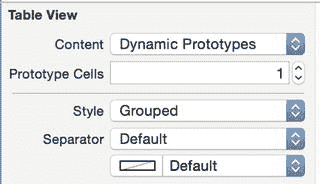

图 11-18. 将 `tableView` 的样式更改为 `Grouped`

最后，你需要让 `ViewController` 类遵循 `UITableViewDataSource` 协议。切换到 `ViewController` 文件，在文件底部添加一个扩展：

```
extension ViewController: UITableViewDataSource {
}
```


### 扩展 `ViewController` 类

现在，我们开始实现 `ViewController` 类中的附加方法，以完成表格的配置。

第一步是创建另一个属性，这次是针对 `UILocalizedIndexedCollation` 对象。添加以下代码：

`var collation: UILocalizedIndexedCollation.currentCollation()`

此外，你还需要为另外两个 `Arrays`（数组）定义属性。第一个数组将保存从 `plist` 文件加载的表格数据：

`var initialTableData: [String]!`

`var sections: [[String]] = []`

第二个数组将保存排序后的数据，它是一个由数组构成的数组，每个元素对应集合中的一个分区，其中包含排序后的名称。请注意双中方括号；这里你定义的是一个数组的数组。也可以写成：

`var sections: Array<Array<String>> = []`

最终结果完全相同，但你可能觉得第二种语法更清晰一些。

由于配置 `UILocalizedIndexedCollation` 涉及相当多的代码，你将会把它放在一个独立的函数中。将以下内容添加到 `ViewController` 的扩展中，如列表 11-14 所示。

**列表 11-14 `configureSectionData()` 函数**

```swift
func configureSectionData() {
    let selector: Selector = "description"
    sections = Array(count: collation.sectionTitles.count, repeatedValue: [])
    let sortedObjects = collation.sortedArrayFromArray(tableData, collationStringSelector: selector)
    for object in sortedObjects {
        let sectionNumber = collation.sectionForObject(object, collationStringSelector: selector)
        sections[sectionNumber].append(object as! String)
    }
}
```

然后在 `viewDidLoad` 的末尾调用 `configureSectionData()` 函数，结果应如列表 11-15 所示。

**列表 11-15. 完整的 `viewDidLoad` 方法**

```swift
override func viewDidLoad() {
    super.viewDidLoad()
    parsePlist()
    configureSectionData()
}
```

我们来更仔细地分析一下 `configureSectionData()` 函数。

首先，你创建了一个 `selector`，用于对从 `plist` 加载的数组内容进行排序（在本例中，是 `description`）：

`let selector: Selector = "description"`

`UILocalizedIndexCollation` 类提供了一个 `sectionTitles` 属性，该属性返回一个 `NSArray`，其中包含与设备本地化设置相关的分区标题数组。例如，如果设备本地化设置为美国英语，`sectionTitle` 将返回以下内容：

`(A,B,C,D,E,F,G,H,I,J,K,L,M,N,O,P,Q,R,S,T,U,V,W,X,Y,Z,#)`

其他本地化设置会有所不同。例如，瑞典语会有额外的元素：

`(A,B,C,D,E,F,G,H,I,J,K,L,M,N,O,P,Q,R,S,T,U,V,W,X,Y,Z,Å,Ä,Ö,#)`

你利用这个数组来创建 `sections` 数组，该数组为 collation 创建的每个分区标题提供一个元素：

`sections = Array(count: collation.sectionTitles.count, repeatedValue: [])`

接下来，你基于从 `plist` 加载的数据创建一个 `Array`，但根据 `selector` 进行了排序：

`let sortedObjects = collation.sortedArrayFromArray(tableData, collationStringSelector: selector)`

最后，你遍历 `sortedObjects` 数组中的每个元素，根据 collation 确定它应该属于哪个分区，并将其添加到对应的内部数组中：

```swift
for object in sortedObjects {
    let sectionNumber = collation.sectionForObject(object, collationStringSelector: selector)
    sections[sectionNumber].append(object as! String)
}
```

`sectionForObject:` `collationStringSelector` 函数接受两个参数：要分配到相应内部数组的对象，以及一个 `collationStringSelector`，它决定了每个对象应如何被评估。

由于 `tableData` 数组包含的是 `String` 对象，你可以使用 `lowercaseString` 方法作为 `selector`。

该方法返回一个 `Int` 值，表示对象应放入的内部数组的索引。如果正在评估的 `nameString` 值是 `Aaron`，则返回 `0`；如果值是 `Baldric`，则返回 `1`；`Cadan` 返回 `2`，以此类推。

**注意**

如果你处理的是具有自身属性的自定义对象，则应使用其中一个属性。你需要确保自定义对象有一个 `String` 类型的属性，可用作 collation 字符串选择器。例如，如果你有一个 `Customer` 对象，它包含一系列属性，其中包括一个名为 `customerName` 的 `String` 属性，那么对 `sectionForObject:collationStringSelector` 方法的调用可能如下所示：

`let sectionNumber = collation.sectionForObject(theCustomer, collationStringSelector:@selector(customerName))`

获得 `sectionNumber` 后，你使用它来获取相关内部数组的引用，并将 `object` 对象添加到其中：

`sections[sectionNumber].append(object as! String)`

当你遍历完 `tableData` 数组中的每一个 `nameString` 对象后，每个对象都将被放入相应的内部数组中。


#### 配置分区

将数据整理成所需结构后，你现在就可以着手设置分区了。你需要实现以下五个函数：

-   `numberOfSectionsInTableView` 返回一个 `Int` 值，表示表格中分区总数（参见代码清单 11-16）。
-   `titleForHeaderInSection` 返回一个 `String` 值，用做每个分区的标题（参见代码清单 11-17）。
-   `sectionIndexTitlesForTableView` 返回一个 `Array`，其中包含的 `String` 是显示在表格右侧边缘索引中的每个标题（参见代码清单 11-18）。
-   `numberOfRowsInSection` 返回给定分区中的行数（即相关内部数组中的元素个数；参见代码清单 11-19）。

**代码清单 11-16.** `numberOfSectionsInTableView`

```swift
func numberOfSectionsInTableView(tableView: UITableView) -> Int {
    return sections.count
}
```

该函数返回 `sections` 数组中的条目数，该数组由 `UILocalizedIndexCollation` 的 `sectionTitles` 方法提供。例如，如果设备语言环境设置为美式英语，则此函数将返回 27（字母 A 到 Z 加上用于数字标题的 `#`）。

**代码清单 11-17.** `tableView:titleForHeaderInSection`

```swift
func tableView(tableView: UITableView, titleForHeaderInSection section: Int) -> String? {
    return "字母 \(collation.sectionTitles[section]) 的名称"
}
```

该函数为每个分区返回一个 `String`，从 A 到 `#`。

**代码清单 11-18.** `sectionIndexTitlesForTableView`

```swift
func sectionIndexTitlesForTableView(tableView: UITableView) -> [String]? {
    return collation.sectionTitles
}
```

该函数返回一个包含分区索引标题的 `Array`，供表视图使用，这些标题随后会显示在表格的右侧边缘。如果不需要索引（例如，如果使用的是分组样式的表），可以省略此方法，索引将不会显示。

**代码清单 11-19.** `numberOfRowsInSection`

```swift
func tableView(tableView: UITableView, numberOfRowsInSection section: Int) -> Int {
    return sections[section].count
}
```

该方法返回需要在给定分区中显示的行数。这是相应内部数组中元素的数量，因此第一步是获取对外部数组中第 `n` 个对象的引用；然后返回内部数组中的元素个数。

最后，你需要用到老朋友 `tableView:cellForRowAtIndexPath` 方法，如代码清单 11-20 所示。

**代码清单 11-20.** `tableView:cellForRowAtIndexPath`

```swift
func tableView(tableView: UITableView, cellForRowAtIndexPath indexPath: NSIndexPath) -> UITableViewCell {
    let cell = tableView.dequeueReusableCellWithIdentifier("CellIdentifier", forIndexPath: indexPath)
    let innerData = sections[indexPath.section]
    cell.textLabel!.text = innerData[indexPath.row]
    return cell
}
```

该函数分两步获取行的数据。首先，它获取对相关分区内容数组的引用（该字母对应的名称），然后根据行号从数组中获取名称字符串。

将所有内容组合在一起，你最终将得到如 11-19 所示的表视图。

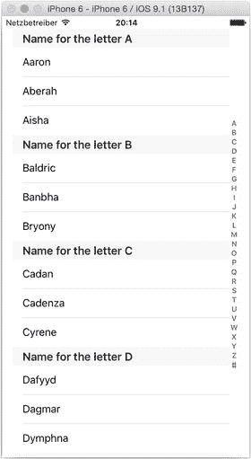

**图 11-19.** 完成后的表视图

---

## 创建表格和分区的表头与表尾视图

到目前为止，你一直在使用简单的文本字符串来定制分区表头，但你不必止步于此。`tableView:viewForHeaderInSection` 和 `tableView:viewForFooterInSection` 方法返回 `UIView` 对象，这意味着任何可以放入 `UIView` 的内容，都可以放入分区的表头和表尾中。

图 11-20 展示了一个刻意设计且略显丑陋的示例，用以说明表头和表尾出现的位置以及它们是如何重复的。

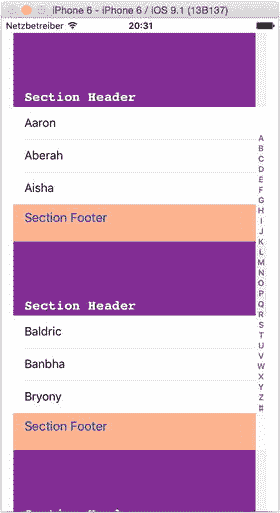

**图 11-20.** 分区表头和表尾

代码清单 11-21 生成了图 11-20 所示的分区表头。

**代码清单 11-21.** 自定义分区表头

```swift
func tableView(tableView: UITableView, viewForHeaderInSection section: Int) -> UIView? {
    let headerFrame = CGRectMake(0, 0, tableView.frame.size.width, 100.0)
    let headerView = UIView(frame: headerFrame)
    headerView.backgroundColor = UIColor(red: 0.5, green: 0.2, blue: 0.57, alpha: 1.0)
    let labelFrame = CGRectMake(15.0, 80.0, view.frame.size.width, 15.0)
    let headerLabel = UILabel(frame: labelFrame)
    headerLabel.text = "分区表头"
    headerLabel.font = UIFont(name: "Courier-Bold", size: 18.0)
    headerLabel.textColor = UIColor.whiteColor()
    headerView.addSubview(headerLabel)
    return headerView
}
```

如果你已实现自定义表头和表尾，则需要使用 `heightForHeaderInSection` 和 `heightForFooterInSection` 方法告知表格它们各自的高度：

```swift
func tableView(tableView: UITableView, heightForHeaderInSection section: Int) -> CGFloat {
    return 100.0
}
```

**提示**

> 如果你的表头和表尾视图高度在每个分区各不相同，可以通过实现 `tableView:estimatedHeightForHeaderInSection:` 和/或 `tableView:estimatedHeightForFooterInSection:` 函数来延迟最终的计算，直到真正需要表头和/或表尾时才进行计算，这样可以提升表格的性能。

## 表格表头和表尾

除了向分区添加表头和表尾之外，还可以向整个表格的顶部和底部添加表头和表尾；它们会随整个表格一起滚动。图 11-21 展示了一个非常简单的示例。

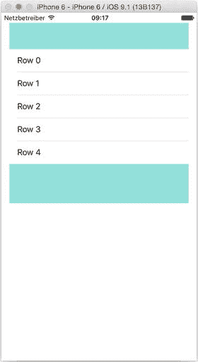

**图 11-21.** 简单的表格表头和表尾

由于表格表头和表尾只需在表格生命周期内配置一次，我倾向于在视图控制器的 `viewDidLoad` 方法中进行设置。代码清单 11-22 展示了设置此示例的过程。

**代码清单 11-22.** 设置示例表格表头和表尾

```swift
override func viewDidLoad() {
    super.viewDidLoad()
    let headerRect = CGRectMake(0, 0, tableView.frame.size.width, 50.0)
    let headerView = UIView(frame: headerRect)
    headerView.backgroundColor = UIColor.cyanColor()
    tableView.tableHeaderView = headerView
    let footerRect = CGRectMake(0, 0, tableView.frame.size.width, 75.0)
    let footerView = UIView(frame: footerRect)
    footerView.backgroundColor = UIColor.cyanColor()
    tableView.tableFooterView = footerView
}
```

因为表格表头和表尾只是普通的 `UIView` 对象，所以你可以随心所欲地添加子视图并使用 AutoLayout。


### 整理表格底部

当表格内容较少而表格较大时，常会出现“空白单元格现象”，如图 11-22 所示。

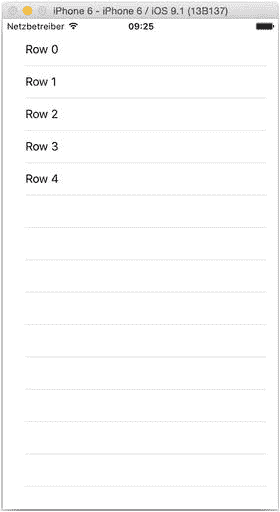

图 11-22. 表格底部的空白单元格

这些多余的空白单元格会让表格显得有些杂乱。幸运的是，有一个非常简单的方法可以解决这个问题。

如果你给表格添加一个高度为零的页脚视图，这些空白单元格就会神奇地消失。只需在 `viewDidLoad`（或你决定设置 `tableView` 的任何位置）中添加下面这行代码：

```
tableView.tableFooterView = UIView(frame: CGRectZero)
```

表头不会受到影响，但如图 11-23 所示，多余的空白行现在已被移除。

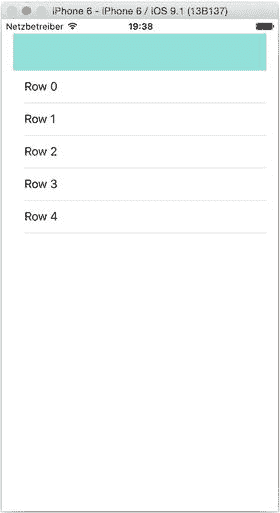

图 11-23. 多余的行已被移除

### 通过代码滚动表格

表格视图会根据索引条目的点按自动滚动，但你也可以通过编程方式控制表格的滚动。

**注意**

如果你通过 `UITableViewDelegate` 方法（如 `viewDidScroll` 或 `tableView:didSelectRowAtIndexPath:`）响应用户输入，请注意，通过代码移动和选择表格不会触发这些代理方法，因此你需要手动调用它们。

主要有三种方法可以使用：

- `scrollToRowAtIndexPath:atScrollPosition:animated:`
- `scrollToNearestSelectedRowAtScrollPosition:animated:`
- `selectRowAtIndexPath:animated:scrollPosition:`

#### scrollToRowAtIndexPath:atScrollPosition:animated:

此方法接受一个 `IndexPath` 位置（第 a 区，第 b 行），并滚动到相应位置。

第二个参数控制目标行在 `tableView` 中的显示位置：顶部、中间或底部。还有第四个选项，旨在以最小移动量使该行可见。如果该行已经可见，表格将完全不会移动。否则，它会滚动到三个选项中最接近的一个位置。

你可以通过提供以下四个 `UITableViewScrollPosition` 值之一来选择所需的行为：

- `UITableViewScrollPositionNone`
- `UITableViewScrollPositionTop`
- `UITableViewScrollPositionMiddle`
- `UITableViewScrollPositionBottom`

最后一个参数决定表格是否通过动画“缩放”到目标行，还是直接移动到位。`YES` 启用动画，`NO` 禁用动画。

#### scrollToNearestSelectedRowAtScrollPosition:animated:

此方法在参数方面类似，但会将表格滚动到最近的一个已选中行，可以选择带动画或不带动画。

#### selectRowAtIndexPath:animated:scrollPosition:

此方法允许以编程方式选择一行，并可选地滚动表格，使选中行位于 `tableView` 中的所需位置。

传入 `UITableViewScrollPositionNone` 的效果与前两种方法不同——表格根本不会滚动。如果你希望最小化滚动，请先用此方法选中行，然后调用 `scrollToViewAtIndexPath`。

### 查找表格中的当前滚动位置

有时你需要确定用户将表格向下滚动了多远。解决此问题的关键在于，`UITableView` 是 `UIScrollView` 的子类，因此继承了 `UIScrollView` 提供的所有属性和方法。

`contentOffset` 属性显示了滚动视图（在此例中即表格视图）从原点滚动了多远。例如，如果你有一个表格，在数据全部加载完成时高度为 1000 像素，那么随着用户向下滚动，`contentOffset` 的 `y` 值会逐渐增加，直到达到最大值 1000 像素。

判断表格将会有多高稍微有点棘手，这主要是因为表格视图在处理行构建和数据加载时，不需要你在编写代码时进行太多“手动”干预。

技巧在于等到表格的所有数据都加载完毕。换句话说，当表格视图知道它有多少行和区（从而知道内容总高度）时。准确判断这一时刻发生的时间比较困难，尤其是当表格数据非常动态时。但你可以在表格视图控制器中重写 `viewDidAppear` 方法，如下所示：

```
override func viewDidAppear(animated: Bool) {
   super.viewDidAppear(animated)
   maxTableHeight = tableView.contentSize.height
   frameTableHeight = tableView.frame.size.height
}
```

表格视图的 `contentSize` 属性是一个 `CGSize`。其中的 `height` 值是所有行加载后表格的总高度。`frame` 属性则是表格在 NIB 文件中的尺寸。

获取这三个值后，你可以用它们来计算时间戳的 Y 位置，并在表格滚动时更新该位置。`UIScrollView` 有一系列代理属性，包括 `scrollViewDidScroll`：

```
func scrollViewDidScroll(scrollView: UIScrollView)
```

如果你让表格视图的控制器遵循 `UIScrollViewDelegate` 协议并实现此方法，那么每次表格滚动时都会调用它。这时你可以执行计算，并重绘屏幕上移动的 `UIView`。

## 总结

本章中，你了解了几种改进表格视图中大量数据视觉呈现的方法。将数据和表格分割成多个区，可以为表格提供额外的结构，而索引则提供了在区之间快速导航的手段。

使用分组表格样式可以进一步从视觉上细分信息，这在滚动时有助于强调各个区。还可以通过添加页眉和页脚视图来增强分组样式。

---

