# 12. 选择与编辑内容

虽然某些场景下可以使用只读表格或集合视图来处理，但更多情况下表格需要具有适应性。构建能够处理选择和重新排列，并能插入、更新和删除新行的表格是一个常见需求。

在本章中，你将学习：

- 如何处理表格中行的选择，或集合视图中单元格的选择
- 如何构建能够处理数据重新排列的表格和集合视图
- 如何使用表格和集合视图从其底层数据模型中创建、编辑、更新和删除项目
- 为集合视图添加自定义菜单


## 模型-视图-控制器模式回顾

在深入探讨如何通过表格视图或集合视图进行选择、插入和删除的具体机制之前，您需要了解这些操作如何影响表格或集合视图所显示的底层数据。

这意味着要理解您在第 5 章中遇到的模型-视图-控制器（MVC）架构模式。`UITableView` 和 `UICollectionView` 都是 MVC 架构的实例，该架构将前端视图与后端模型分离开来。

MVC 模式描述了这种分离，它将应用程序划分为三个区域：

*   **视图**：在 iOS 术语中，这些是在 Interface Builder 中或通过代码以编程方式创建的视图（或界面）。就 `UITableView` 或 `UICollectionView` 而言，视图就是表格或集合视图本身，以及构成表格行或集合视图项的单元格。
*   **控制器**：代表应用程序的内部逻辑。换句话说，控制器是一个或多个类，负责控制数据的显示以及与表格的交互——原因可能是它本身就是 `UITableViewController` 或 `UICollectionView` 的一个完整子类，也可能是 `UITableViewController` 或 `UICollectionView` 的委托和/或数据源。
*   **模型**：管理应用程序内的数据。模型可以像包含一些字符串的 `Array` 一样简单，也可以是完整的 Core Data 设置。但无论复杂还是简单，正是模型提供了要在 `tableView` 或 `collectionView` 中显示的数据。

图 12-1 展示了您之前在第 5 章中见过的 MVC 模式。

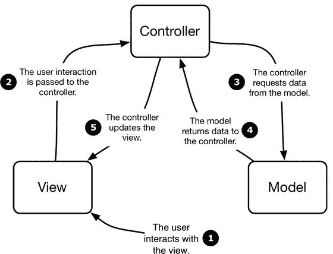

*图 12-1. 模型-视图-控制器模式*

如您所见，控制器从模型中获取并处理数据，然后将数据传递给视图供用户消费。用户与视图交互，而控制器则处理这些交互的结果。

### 模型-视图-控制器模式为何重要

在使用以某种方式响应用户交互的 `tableViews` 或 `collectionViews` 时，牢记 MVC 设计模式非常重要。单元格没有记忆——实际上，它们只是其内容的“信封”。一旦它们滚动出可见视图，就会被复用或完全消失。它们的状态将会丢失——或者更糟，被不恰当地应用到复用单元格的内容上。

对用户而言，这看起来就像单元格的状态没有“粘性”。如果用户点击某行或某项来设置值并显示一个复选标记，当用户向上或向下滚动时，该选择可能会发生变化。

这不仅适用于选择操作，也适用于插入、删除和重新排序。以表格中的行删除为例。您的用户点击导航栏上的`编辑`按钮并删除一行。`tableView` 负责显示编辑控件、移除被删除的行，并在其他行向上移动以填补空白时，动画化地展示“队列收拢”的过程。就用户而言，任务已经完成——该行已经消失，不会再回来。

但是，模型中的底层数据并未因任何用户界面的更改而改变。如果表格被重新加载（例如，如果它是 `UINavigationController` 的一部分，这很可能会发生），原始数据将被重新加载，被删除的行将再次出现。更糟糕的是，如果似乎插入了一行新内容，用户提供的信息将会丢失。

关键在于，您的用户（或您的应用程序）在视图中所做的任何更改，都必须反映在模型中，以便这些更改得以持久化。`tableView` 或 `collectionView` 会处理行或项的添加、删除和移动（如果您启用了动画，它会优雅地完成这些操作），但将更改反映到您的模型中则是您的责任。

## 表格视图中的单元格选择

除非 `tableView` 用于显示静态信息，否则用户迟早会与其交互并需要反馈。单元格选择是提供这种反馈的一部分。

### 单元格选择的类型

根据应用程序的功能，您可能需要实现两种类型的单元格选择：

*   **瞬时选择**，用于向用户提供关于他们正在与哪一行或哪一项进行交互的反馈。
*   **持久选择**，用于指示表格中的哪些行或集合视图中的哪些项正在显示具有特定状态的数据模型项（例如，可能处于“开启”状态的对象）。

#### 控制选择

您可以通过两种方式控制行和项的选择：对整个 `视图` 进行全局控制，或者基于特定行或项进行控制。

##### 全局选择

`UITableView` 有一个 `allowsSelection` 属性，该属性既可以在构建视图时在 Interface Builder 中设置，也可以在视图生命周期的任意时刻通过代码设置。

将 `allowsSelection` 属性设置为 `false` 会完全禁用行选择，因此视图将不会对触摸作出反应（滚动除外）。

您可能想要完全禁用选择的原因有两个：

*   您的视图仅显示数据，不允许与之交互。
*   表格行或项正在被编辑或重新排列，而选择会干扰此过程。

您可以通过在 Interface Builder 中选择该选项来控制 `allowsSelection` 属性（见图 12-2）。

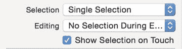

*图 12-2. 在 Interface Builder 中设置全局选择属性*

或者，您也可以在代码中控制它：

```
tableView.allowsSelection = false
```


### 理解表格选择功能的工作原理

表格视图中的选择管理由`UITableViewDelegate`对象负责。如果表格视图没有设置`delegate`对象，选择事件将被忽略。

以下是协同实现选择功能的四个`UITableViewDelegate`函数：

- `tableView:willSelectRowAtIndexPath:`：当用户触摸并抬起手指（即执行了`TouchUpInside`操作）后，但在`tableView:didSelectRowAtIndexPath:`函数被调用前，会调用此函数。默认情况下该函数未被实现。实现它并返回`nil`将阻止行选择发生。如果你返回指向另一行的`indexPath`，则该行会被选中，而非被点击的那一行。
- `tableView:didSelectRowAtIndexPath:`：假设`tableView:willSelectRowAtIndexPath:`函数没有返回`nil`，你可以在此处实现自定义行为。该行为可以是展示性的（例如显示勾选标记），也可以触发某种导航操作（例如`pushNavigationController`动作）。
- `tableView:willDeselectRowAtIndexPath:`：仅当存在已有选中的行时才会调用此函数。它返回应取消选中的行的`indexPath`——因此提供了让你选择另一行而非当前选中行进行取消的机会。尽管我尽力尝试，但从未遇到过真正需要这个功能的情景，不过具体情况可能因人而异。如果从此函数返回`nil`，则该行将不会被取消选中，这实际上意味着你可以根据需要“锁定”选择状态。
- `tableView:didDeselectRowAtIndexPath:`：此函数通知代理该行已被取消选中。在这里你应撤销之前创建的任何自定义选择特性。例如，如果你有一个通过将`textLabel`变为绿色来显示选择状态的自定义单元格，那么就应该使用`tableView:didDeselectRowAtIndexPath:`函数将其改回正常颜色。

> **提示**
>
> 如果单元格选择看起来滞后于用户输入，你可能无意中实现了`tableView:willDeselectRowAtIndexPath:`而不是`tableView:didSelectRowAtIndexPath:`。Xcode 的自动补全功能很容易让人犯错，而且一旦错误的函数被添加到代码中，就很难发现问题的来源。

### 管理特定行的选择

除了在全局`tableView`级别启用或禁用选择外，你可能还需要在行级别控制选择。例如，在本章后面，你将构建一个表格，允许通过点击“添加新行”来插入额外的行。

根据数据模型的需求，你可能需要禁用此功能。

通过检查`tableView:willSelectRowAtIndexPath:`函数中正在被选择的行，你可以添加条件代码来允许某些行的选择同时阻止其他行的选择。这如代码清单 12-1 所示。

**代码清单 12-1.** 在`tableView:willSelectRowAtIndexPath:`中检查行选择

```
func tableView(tableView: UITableView, willSelectRowAtIndexPath
indexPath: NSIndexPath)  -> NSIndexPath? {
    let rowNotToSelect = 3
    if indexPath.row == rowNotToSelect {
        return nil
    }
    return indexPath
}
```

这段代码任意地阻止了第 3 行的选择，如果检查的是第 3 行则返回`nil`。

你也可以返回一个与传入值不同的`indexPath`，以便选择另一行而非被点击的那一行。我暂时想不出任何实际需要这样做的场景，但如果你需要，它就在那里。

## 可视化选择

可视化选择可以向用户提供反馈，表明他们的操作已被应用记录。它还可以提示即将发生或正在发生的事情。

当用户点击表格行时，默认行为会将行的背景变为浅灰色，并将`textLabel`变为黑色，如图 12-3 所示。

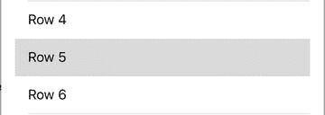

**图 12-3.** 默认的行选择样式

如果选择高亮会干扰你实现的任何自定义选择行为，你可能还需要完全禁用选择高亮。

有点反直觉的是，将`selectionStyle`设置为`None`并不会阻止单元格选择，所有与选择相关的函数仍然会触发。只是不会向用户提供任何反馈。

所有样式都由单元格的`selectionStyle`属性设置。在大多数情况下，你会在`tableView:cellForRowAtIndexPath:`函数中设置它，例如：

```
cell.selectionStyle = UITableViewCellSelectionStyle.None
```

或者，你也可以在 Interface Builder 中将`Selection`属性设置为`None`。

### 自定义选择

你不必局限于标准的白底蓝字或白底灰字选择高亮样式。如果你已自定义了`tableView`单元格，这种高亮样式可能本来就不太适用。

通过添加自定义代码，你可以按自己的需求操作单元格。你可以在单元格出列时使用`tableView:didSelectRowAtIndexPath:`函数来实现，也可以在`UITableViewCell`子类中进行管理。

图 12-4 展示了我某个应用中的示例。

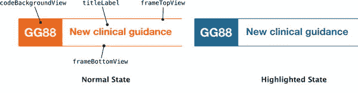

**图 12-4.** 处于正常和高亮状态的自定义单元格

单元格的背景和轮廓都是`UIViews`，因此可以操作它们的`backgroundColor`属性。它们在单元格的 XIB 文件中被设置为橙色，然后在`tableView:didSelectRowAtIndexPath:`函数中被切换为蓝色：

```
// 设置单元格高亮
let blueColor = UIColor(colorWithRed:0.08 green:0.4 blue:0.58 alpha:1.0)
cell.codeBackgroundView.backgroundColor = blueColor;
cell.frameTopView.backgroundColor = blueColor;
cell.frameBottomView.backgroundColor = blueColor;
cell.titleLabel.textColor = blueColor;
```

> **提示**
>
> Interface Builder 的局限性之一是没有线条工具（或者说没有任何形状工具）。这使得绘制线条变得棘手。一种选择是将线条图形作为`UIImageViews`包含进来，但这在渲染方面代价相当高。
>
> 另一种选择是在需要线条的位置放置`UIViews`，并将宽度（或高度）设置为非常小的值——例如 1 或 2 点。你可以使用`UIView`的`backgroundColor`属性来设置“线条”的颜色。虽然只能使用单一颜色的实线，但这通常比在其他软件中创建线条图形再将其作为图像导入要快得多。


### 处理取消选中

如果你坚持使用默认的选择行为，系统会自动处理取消选中。灰底白字的单元格样式会恢复为默认的黑底白字。

但如果涉及自定义选择行为，则需要手动处理。这种情况可能出现在以下两个场景中：

- 当另一个单元格被选中时。此时，你可以将取消选中的代码添加到 `tableView:willDeselectRowAtIndexPath:` 或 `tableView:didDeselectRowAtIndexPath:` 函数中。
- 当因执行某项操作（例如从详情视图返回 `tableView`）而导致选中状态不再相关时。这种模式在邮件应用中可以看到：点击列表中的某封邮件会滑入邮件内容视图，内容视图关闭后，高亮效果会缓慢消失——速度足够慢以至于你能看到之前点击的是哪封邮件，但又不会让选中状态持续停留。这种情况下，需要在 `tableView` 的 `viewDidAppear` 函数中，通过 `UITableView` 的 `deselectRowAtIndexPath:animated:` 函数移除选中状态。

### 可视化持久选中

可视化持久选中通常是基于以下两个原因之一：

- 用户需要在执行其他操作（例如从模型中删除记录）之前选择多个行。
- 选中状态反映了行所对应对象的某个属性的底层状态，例如清单中的某个项目已被“勾选”。

无论哪种情况，你都需要一种与表示点击行的瞬时选中状态截然不同的选中指示方式。

苹果在《iOS 人机界面指南》中明确指出，不应使用与瞬时选中关联的选中特征来表示状态。换句话说，不要使用默认的单元格高亮选项来指示模型中底层数据的状态。这样做可能会让用户感到困惑，甚至可能导致你的应用被 App Store 拒绝。

要显示持久选中状态，有以下几种选择：

- 使用 `UITableViewCell` 内置的 `accessoryView` 来显示选中标记。
- 在自定义单元格中创建其他视觉指示。

第二种方案的选择仅受限于审美和单元格能实现的功能，因此我将重点介绍第一种方案。

### 使用选中标记表示多项选择

你并非只能一次选择一行，但表格必须配置为允许多选。默认值为 `false`，这会将行的选择限制为一次只能选一个。将该值设置为 `true` 则允许同时选择多行。

这个设置在表格级别控制。你可以在 Interface Builder 中设置该属性，如图 12-5 所示。

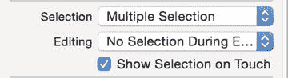

图 12-5. 在 Interface Builder 中控制表格选择特性

或者你也可以通过代码设置该属性：

```
tableView.setAllowsSelection = true
tableView.setAllowsMultipleSelection = false
```

如果 `allowsSelection` 属性为 `false`，则 `multipleSelection` 设置将被忽略。

### 处理选中操作

选中发生后，已选中的行可以通过两个 `tableView` 属性访问：

- `indexPathForSelectedRow`
- `indexPathsForSelectedRows`

正如其名，它们返回的是 `indexPath`。但返回的结果有所不同，因此注意不要混淆两者（属性名称非常相似对此并无助益）。

`indexPathForSelectedRow` 返回单个 `indexPath`。如果只选中了一个单元格，按预期会返回该 `indexPath`。

如果选中了多行，`indexPathForSelectedRow` 将返回最先选中的那行。

`indexPathsForSelectedRows` 返回一个包含所有已选中行 `indexPath` 的 `Array`。数组中的 `indexPath` 对象按行被选中的顺序排列——索引 `0` 是第一行，索引 `1` 是第二行，依此类推。

如果没有选中任何行，这两个属性都会返回 `nil`。

### 可视化多项选择

在可视化多项选择方面，基本有两种选择：使用默认单元格的附件视图或自定义你的单元格。

采用哪种方案首先取决于你的单元格是否有附件视图。如果你创建了 `UITableViewCell` 的自定义子类，它可能没有附件视图。其次，所选的方案取决于在单元格右端显示指示符在视觉上是否合适。

#### 使用单元格的附件视图显示选中标记

默认的 `UITableViewCell`（如图 12-6 所示）在其右端有一个附件视图，它通常用于表示选择该行会触发某种操作，例如推入一个详情视图。

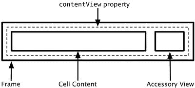

图 12-6. 默认附件视图

附件视图有两种暴露方式：

- 作为单元格的 `accessoryType` 属性，可以设置为 `UITableViewCellAccessoryType` 四个枚举值之一。
- 作为一个 `UIView` 属性，可以直接自定义。

清单 12-2 展示了如何响应选中来指示选中状态。

清单 12-2. `tableView:didSelectRowAtIndexPath:` 函数示例

```
func tableView(tableView: UITableView, didSelectRowAtIndexPath indexPath: NSIndexPath) {
    let cell = tableView.cellForRowAtIndexPath(indexPath)
    cell?.accessoryType = UITableViewCellAccessoryType.Checkmark
}
```

对于需要将选中状态与 `tableView` 模型中对应对象的属性相匹配的场景，你需要在单元格出队时进行设置。

清单 12-3 是一个 `tableView:cellForRowAtIndexPath:` 函数的示例，当对象属性被设置时显示默认勾选标记。

清单 12-3. `tableView:cellForRowAtIndexPath:` 函数示例

```
func tableView(tableView: UITableView, cellForRowAtIndexPath indexPath: NSIndexPath) -> UITableViewCell {
    let cell = tableView.dequeueReusableCellWithIdentifier("CellIdentifier", forIndexPath: indexPath)
    let theObject = tableData.objectAtIndex(indexPath.row)
    if theObject.isSelected == true {
        cell.accessoryType = UITableViewCellAccessoryCheckmark
    } else {
        cell.accessoryType = UITableViewCellAccessoryNone
    }
    cell.textLabel!.text = theObject.name
    return cell
}
```

假设其中有三个 `objects` 的 `selected` 属性设置为 `true`，结果将如图 12-7 所示。

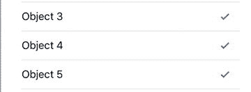

图 12-7. 默认的选中勾选标记

#### 使用单元格的附件视图显示自定义视图

由于附件视图作为 `UIView` 属性暴露，因此可以相应地操作它。清单 12-4 是一段代码片段，展示了如何设置 `accessoryView` 属性来显示图片。

清单 12-4. 在附件视图中插入图片

```
let accessoryImage = UIImage(name:"accessory")
let accessoryImageView = UIImageView(image:accessoryImage)
cell.accessoryView = accessoryImageView
```


### 以其他方式展示选择状态

你并非只能使用辅助视图来展示选择状态，尤其是在实现自定义单元格时。实际上，你可以根据项目需求和个人偏好，使用任何图像、文本格式或区域高亮的组合。无论决定采用何种方式，你都需要在 `tableView:willSelectRowAtIndexPath:` 或 `tableView:didSelectRowAtIndexPath:` 方法中实现它。

### 处理选择后的取消选择

如果你实现了自定义选择逻辑（无论是通过辅助视图功能还是更复杂的方式），你还需要负责处理取消选择的过程。

简单来说，这意味着要撤销在选中某行时所应用的选择特征。可以在两个方法中完成：`tableView:willDeselectRowAtIndexPath:` 和 `tableView:didDeselectRowAtIndexPath:`。

无论使用哪种方法，相关的行都位于提供的 `indexPath` 处。

下面是一个示例，说明如何撤销清单 12-4 中代码的效果：

```
func tableView(tableView: UITableView, didDeselectRowAtIndexPath indexPath: NSIndexPath) {
    let cell = tableView.cellForRowAtIndexPath(indexPath)
    cell.accessoryView = nil
}
```

### 保持数据模型同步

如果你希望单元格在滚动出可视区域后仍能保持选择状态，则需要更新支撑表格的底层数据模型。

显然，具体实现取决于表格所建模数据的结构，但这里有一个非常简单的示例，可以为你提供一个可操作的结构。表格数据存储在 `viewController` 的 `tableData` 属性中，该属性是一个存储 `Bool` 值的 `Array`：

```
var tableData = Array<Bool>()
```

在表格 `dataSource` 的 `cellForRowAtIndexPath:` 方法中，根据 `tableData` 数组中**选择标记**的值来设置单元格的辅助视图（清单 12-5）。

**清单 12-5.** `cellForRowAtIndexPath:` 方法

```
func tableView(tableView: UITableView, cellForRowAtIndexPath indexPath: NSIndexPath) -> UITableViewCell {
    let cell = tableView.dequeueReusableCellWithIdentifier("CellIdentifier", forIndexPath: indexPath)
    let selectionFlag = tableData[indexPath.row]
    cell.textLabel?.text = "行 \(indexPath.row)"
    switch selectionFlag {
        case true:
            cell.accessoryType = UITableViewCellAccessoryType.Checkmark
        case false:
            cell.accessoryType = UITableViewCellAccessoryType.None
    }
    return cell
}
```

然后，在 `tableView` 的 `delegate` 中处理选择事件（清单 12-6）。

**清单 12-6.** 处理选择事件

```
func tableView(tableView: UITableView, didSelectRowAtIndexPath indexPath: NSIndexPath) {
    let cell = tableView.cellForRowAtIndexPath(indexPath)
    cell!.accessoryType = UITableViewCellAccessoryType.Checkmark
    tableData[indexPath.row] = true
}
```

这里，你通过 `cellForRowAtIndexPath:` 方法获取选中行的单元格，并将其 `accessoryView` 设置为显示勾选标记。然后更新 `tableData` 数组，以存储该行是否被选中。

处理取消选择的过程则相反，如清单 12-7 所示。

**清单 12-7.** 处理取消选择事件

```
func tableView(tableView: UITableView, didDeselectRowAtIndexPath indexPath: NSIndexPath) {
    let cell = tableView.cellForRowAtIndexPath(indexPath)
    cell!.accessoryType = UITableViewCellAccessoryType.None
    tableData[indexPath.row] = false
}
```

同样，你获取选中行的单元格，但这次移除了辅助视图的勾选标记。然后使用给定项的新值更新 `tableData` 数组。这三个方法的效果是，当表格滚动时，选择状态将得以保持。

## 优化选择性能

尽管单元格创建和配置的标准模式通常使用 `cellForRowAtIndexPath:` 方法来重用和配置单元格，但还有另一种方法可以帮助从表格视图中榨取最后一丝性能。

`cellForRowAtIndexPath:` 方法会在单元格需要显示在表格视图之前被调用，因此单元格在实际显示之前会“闲置”一段时间。

就在单元格即将在表格视图中绘制之前，`tableView` 的 `delegate` 会调用 `tableView:willDisplayCellAtIndexPath:` 方法。这是在内部单元格方法（例如 `layoutSubviews`）接管之前，你根据表格视图数据模型更新单元格的最后机会。

如果你有一个与数据模型相关的耗时操作，希望将其推迟到最后一刻，你可以将其从 `cellForRowAtIndexPath:` 移到 `willDisplayCellAtIndexPath:` 中。清单 12-8 展示了如何重构清单 12-7 中的方法以使用此方式。

**清单 12-8.** 使用 `willDisplayCellAtIndexPath:` 方法

```
func tableView(tableView: UITableView, willDisplayCell cell: UITableViewCell, forRowAtIndexPath indexPath: NSIndexPath) {
    let selectionFlag = tableData[indexPath.row]
    switch selectionFlag {
    case true:
        cell.accessoryType = UITableViewCellAccessoryType.Checkmark
    case false:
        cell.accessoryType = UITableViewCellAccessoryType.None
    }
}
```

**注意**

和生活中的其他事情一样，解决表格视图卡顿问题并没有什么灵丹妙药。实现 `willDisplayCell:forRowAtIndexPath:` 方法可能有助于提升表格性能，但这并非必然。你需要使用 Instruments 等工具进行仔细分析才能确认。

## 选择操作的注意事项

配置行选择时需要牢记以下几点：

- 不要使用选择状态来表示行对象的状态。选择是在 MVC 架构的视图层级上工作的，因此它独立于模型。
- 除非允许多选，否则在选择新行之前，始终要以编程方式取消选中之前选中的行。
- 如果行选择的响应是推入一个新视图（例如，如果你的导航控制器推入了一个详细视图），则务必在详细视图被关闭后，以编程方式取消选中之前的行。这将确保在详细视图从视图堆栈中弹出后，这些行不再处于高亮状态，但会提供一个视觉提示，表明详细视图所指的具体行。


## 对用户选择做出更详细的响应

用户选中某一行通常需要以某种方式进行回应。这些回应大致可分为两种模式：

-   选择的结果是显示附加数据，既可以通过“深入”导航层级，也可以显示某种形式的详情视图。
-   选择反映了用户做出的某种选择，并导致模型的更新。

一种常见的模式是推入某个描述性的新视图——例如，一个导航视图，它揭示了另一个 `tableView`，从而实现向信息层级的深入探索；或者是一个详情视图，其中包含有关被点击行的更多信息。

代码清单 12-9 是第二种过程的一个例子。

**代码清单 12-9.** `tableView:didSelectRowAtIndexPath:` 函数示例

```
func tableView(tableView: UITableView, didSelectRowAtIndexPath indexPath: NSIndexPath) {
    let modelForDetailView = tableData[indexPath.row]
    let storyboard = UIStoryboard(name: "Main", bundle: nil)
    let detailVC = ➤
  storyboard.instantiateViewControllerWithIdentifier("DetailViewController") ➤
  as! DetailViewController
    detailVC.model = modelForDetailView
    tableView.deselectRowAtIndexPath(indexPath, animated: true)
    detailVC.modalTransitionStyle = UIModalTransitionStyle.FlipHorizontal
    self.presentViewController(detailVC, animated: true, completion: nil)
}
```

这是一个 `UITableViewDelegate` 函数，它接受两个参数：对 `tableView` 本身的引用，以及被选中的 `IndexPath`。

第一个任务是获取模型中与所选行相对应的对象的引用。请记住，被选中是行，而不是模型对象本身：

```
let modelForDetailView = tableData[indexPath.row]
```

在这种情况下，表格的数据模型是一个由 `Model` 对象组成的 `Array`，因此只需获取位于相应索引处的 `model` 实例即可。

获得所选对象的引用后，代码会先取消选中该行，然后实例化一个 `DetailViewController` 实例。接着，它设置 `DetailViewController` 的 `model` 属性，并通过模态过渡推入新视图。

## 设计模式与 `UITableViews`

除了 MVC 等架构设计模式外，还存在交互模式。架构模式帮助你思考如何构建应用程序，而交互模式则有助于管理如何使用应用程序。

使用 MVC 模式构建表格后，问题来了：“你将如何处理表格中包含的数据？”显然，用户会阅读单元格的内容，但之后呢？你需要预判哪些用户行为？

在思考数据及其处理方式时，一个有用的模式是创建、读取、更新、删除，简称为 CRUD。这在处理数据库中的记录时最为常用，但在考虑 `UITableView` 中的某一行可能会发生什么时也同样适用。

### 读取

在数据库术语中，读取涉及从数据库中检索记录，通常使用某种 SQL `SELECT` 查询。在 `UITableView` 的语境下，你可以将读取视为通过 `tableView:cellForRowAtIndexPath:` 等函数，将数据从模型中取出并放入表格本身的过程。我们在其他地方已经详细讨论过这一点，因此你无需过多操心读取操作。

### 创建

除了显示信息，表格视图也常用于让用户创建和输入新信息。“通讯录”应用就是一个很好的例子：点击姓名列表顶部的 + 按钮，会从屏幕底部推入一个包含新建联系人表单的模态视图。响应点击 + 按钮而出现的表单本身并非 `tableView` 的一部分，但在创建了新的 `Contact` 对象之后，`tableView` 必须对此做出反应，并在适当的位置插入新行。

### 更新

“通讯录”应用允许通过选择一个联系人然后点击“编辑”按钮来更新现有联系人信息。同样，严格来说，这并非 `tableView` 的职责范畴，直到修改后的数据被保存，此时可能有必要重新排列行以处理已更改的数据。

一个更 `tableView` 特定的操作是用户想要重新排列行或节。`UITableView` 的 `dataSource` 和 `delegate` 协议提供了许多支持此操作的函数，你将在本章后面看到这些函数。

### 删除

同样常见的交互模式是删除整个记录。iPhone 的“提醒事项”应用，如图 12-8 所示，允许通过在行上向左或向右滑动来显示“删除”控件，从而删除备忘录。点击“删除”会以动画方式移除该行，该行会向左滑走，然后下方的行会上移以填补空缺。

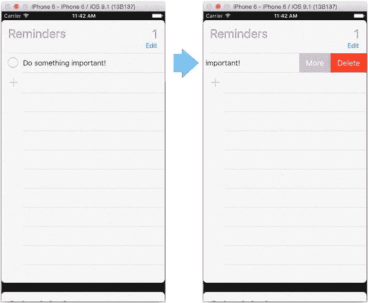

**图 12-8.** 删除一个提醒事项

所有这些功能和动画都通过内置的 `UITableViewDelegate` 函数免费获得。我们将从查看对 `tableView` 本身影响最大的操作开始：插入新行和删除现有行。

**注意：** 如果你的表格视图控制器是 `UITableViewController` 的子类，你将能够免费获得许多插入和删除行为，这要归功于其超类 `UITableViewController`。就实现功能而言，这非常棒，但如果你想弄清楚事情是如何运作以便以后调整，这就没那么有帮助了。因此，在本节中，我将使用一个通用的 `UIViewController` 并手动添加表格视图功能。


## 自定义行操作

标准行编辑选项可以通过使用自定义操作进一步扩展；你可以自定义行在编辑时显示的文本，以及创建回调块来响应选择行操作时执行的代码。

要创建自定义操作，你需要实现 `UITableViewDelegate` 的 `tableView(tableView:editActionsForRowAtIndexPath:)` 函数。该函数返回一个 `UITableViewRowAction` 的 `Array`，你可以对其进行自定义。

每个行操作有三个属性：

*   `UITableViewRowActionStyle` – `Default`、`Destructive`（显示为红色）或 `Normal` – 用于编辑行内显示的按钮
*   标题，即按钮内显示的 `String`
*   一个可以运行回调操作的函数。它接受两个参数：刚刚触发的 `action` 和操作发生的 `row`。

在清单 12-10 中，你可以看到它们是如何结合在一起的。

清单 12-10. 设置自定义编辑操作

```
func tableView(tableView: UITableView, editActionsForRowAtIndexPath indexPath: ➤
NSIndexPath) -> [UITableViewRowAction]? {
    let tweet = UITableViewRowAction(style: UITableViewRowActionStyle.Default,➤
    title: "Tweet") { action, index in
        print("selected tweet action")
        tableView.setEditing(false, animated: true)
    }
    tweet.backgroundColor = UIColor.lightGrayColor()
    let facebook = UITableViewRowAction(style: .Normal, title: "Facebook") ➤
    { action, index in
        print("selected facebook action")
        tableView.setEditing(false, animated: true)
    }
    facebook.backgroundColor = UIColor.blueColor()
    let email = UITableViewRowAction(style: .Normal, title: "Email")➤
   { action, index in
        print("selected email action")
        tableView.setEditing(false, animated: true)
    }
    email.backgroundColor = UIColor.purpleColor()
    return [tweet, facebook, email]
}
```

当行进入编辑模式时，这会在该行中插入三个按钮，如图 12-9 所示。

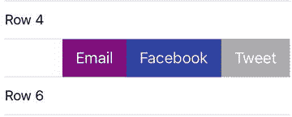

图 12-9.

自定义编辑操作

如果你想在触发动作后取消选中该行，需要调用 `tableView.setEditing(false, animated: true)` 函数。这将使操作按钮再次滑出，以重置该行。

## 插入和删除行

你现在可能已经预料到，插入和删除行是一个多阶段过程，涉及 `tableView`、`delegate` 和 `dataSource` 之间的协同工作。

该过程包括以下步骤：

*   将表格置于编辑模式。
*   对于每一行，检查是否允许编辑，如果允许则显示编辑控件。
*   通过向 `dataSource` 发送消息来响应用户对编辑控件的触摸。
*   更新模型。
*   更新表格的行。

事件序列以及 `tableView`、`dataSource` 和 `delegate` 之间传递消息的过程如图 12-10 所示。

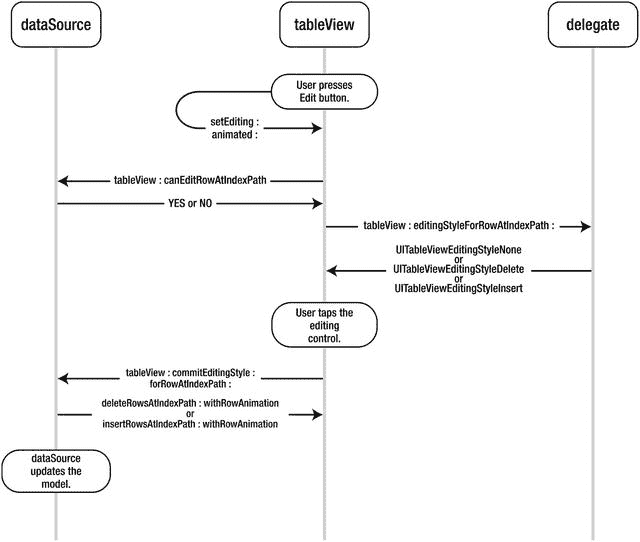

图 12-10.

`tableView` 编辑期间传递的消息

乍一看，这看起来极其复杂。实际上并没有那么糟糕，当你逐步操作时就会明白。

### 示例应用

如果你想跟着后续的示例操作，需要一个简单的表格来进行实验。我不打算详细说明如何做（希望你已经读到这里，能够构建一个表格！），但有几个具体细节值得一提：

*   由于具有编辑功能的表格通常出现在 `UINavigationController` 中，因此我在导航控制器内实现了表格视图。
*   `tableView` 的数据模型特意设计得简单，以便数据不会掩盖编辑、更新和删除等更相关的问题。

### 创建基于 UINavigationController 的表格

为了创建基于 `UINavigationController` 的表格，我采用了 Xcode 提供的标准 Single View Application 模板，并将 View Controller 嵌入到 Navigation Controller 中。

### 创建示例表格的数据模型

此应用的数据模型非常简单。它只是一个 `String` 的 `Array`，在 `ViewController` 的 `viewDidLoad` 函数中创建：

```
override func viewDidLoad() {
    super.viewDidLoad()
    // Do any additional setup after loading the view, typically from a nib.
    self.navigationItem.title = "Row insertion"
    self.navigationItem.rightBarButtonItem = self.editButtonItem()
    for index in 0…100 {
        tableData.append("Row \(index)")
    }
}
```

此函数中还有其他一些与设置相关的任务。以下代码设置了导航栏的标题：

```
self.navigationItem.title = @"Row insertion";
```

这段代码创建了一个“编辑”按钮：

```
self.navigationItem.rightBarButtonItem = self.editButtonItem;
```

整体效果见图 12-11。


图 12-11.

自定义导航栏

#### 将表格置于编辑模式

第一步是将表格置于编辑模式，这可以通过在表格视图上调用 `setEditing:animated` 函数来实现：

```
tableView.setEditing(true, animated:true)
```

通常这是在响应按钮点击时完成的。如果你使用的是 `UINavigationController`，屏幕顶部的 `UINavigationBar` 内置了一个方便的“编辑”按钮。你可以在 `viewDidLoad` 函数中进行设置：

```
self.navigationItem.rightBarButtonItem = self.editButtonItem;
```

这不仅在导航栏右上角提供了一个“编辑”按钮，而且该按钮会在进入编辑模式前的“编辑”状态和编辑模式中的“完成”状态之间自动切换。效果见图 12-12。

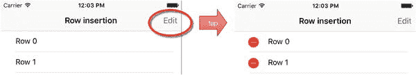

图 12-12.

可切换的编辑按钮

如果你没有使用 `UINavigationController`，则需要添加一个按钮来调用 `setEditing:animated:` 选择器，然后手动处理“编辑”和“完成”模式之间的切换。

清单 12-11 展示了添加“编辑”按钮的示例。

清单 12-11. 添加编辑按钮

```
let editingButton = UIButton(type: UIButtonType.RoundedRect)
editingButton.frame = CGRectMake(0, 0, 60, 40)
editingButton.setTitle("Edit", forState: UIControlState.Normal)
editingButton.addTarget(self, action: "setEditing:", forControlEvents:➤
UIControlEvents.TouchUpInside)
self.view.addSubview(editingButton)
```

如果你使用的是“标准”按钮，则需要在清单 12-12 中实现 `setEditing:animated` 函数。

清单 12-12. `setEditing:animated:` 函数

```
override func setEditing(editing: Bool, animated: Bool) {
    tableView.setEditing(!tableView.editing, animated: true)
}
```


### 控制行是否可编辑

进入编辑模式后，表格视图会向数据源询问每一行是否应该可编辑。如果实现了`tableView:canEditRowAtIndexPath:`函数，系统会依次对每一行调用该函数。清单 12-13 演示了如何使用该函数来阻止特定分区和行被编辑。

**清单 12-13.** 控制分区或行是否可编辑

```
func tableView(tableView: UITableView, canEditRowAtIndexPath indexPath: NSIndexPath) -> Bool {
    if indexPath.section == 0 || indexPath.row == 3 {
        return false
    }
    return true;
}
```

如果`tableView:canEditRowAtIndexPath:`函数返回`false`，则该行不会出现缩进。图 12-13 展示了这一效果。

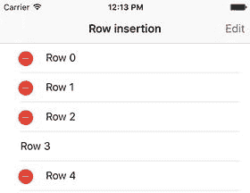

**图 12-13.** 阻止编辑整个分区

如果未实现`tableView:canEditRowAtIndexPath:`，表格视图会假定每一行都可编辑。实际上，默认返回值是`true`。

若要临时禁用整个表格视图的编辑功能，可以在`canEditRowAtIndexPath:`中始终返回`false`，无论传入的`indexPath`是什么。

### 控制每行的编辑样式

在确定行是否可编辑后，表格视图会询问委托对象每行应使用哪种编辑样式：

```
func tableView(tableView: UITableView, editingStyleForRowAtIndexPath indexPath: NSIndexPath) -> UITableViewCellEditingStyle {
    return UITableViewCellEditingStyle.Delete
}
```

如果实现了`tableView:editingStyleForRowAtIndexPath:`函数，它将返回以下三种可能选项之一：

- `UITableViewCellEditingStyleDelete`：这会在单元格左端插入删除控件。
- `UITableViewCellEditingStyleInsert`：这会在单元格左端插入插入控件。
- `UITableViewCellEditingStyleNone`：这不会插入任何编辑控件，这一点并不出人意料。

与`tableView:canEditRowAtIndexPath:`类似，如果未实现`tableView:editingStyleForRowAtIndexPath:`，则`tableView`会假定所有单元格都可删除，并默认返回`UITableViewCellEditingStyleDelete`。

插入额外行稍微复杂一些，我们将在本章稍后部分讨论。

### 处理行删除

如果你一直按照本文进行操作，你的表格看起来应该像图 12-14 所示，带有一个“编辑”按钮，当表格进入编辑模式时单元格会显示删除控件，并且当点击删除控件时，行末尾会出现一个“删除”按钮。

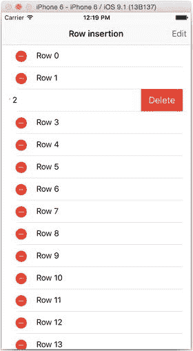

**图 12-14.** 当前进度

然而，点击那个“删除”按钮多少有些令人扫兴——什么都不会发生。

当“删除”按钮被点击时，`tableView`会向数据源发送`tableView:commitEditingStyle:forRowAtIndexPath:`消息。该消息接收三个参数：

- 对`tableView`自身的引用（以便数据源在需要时区分多个`tableView`）
- 被点击控件的`UITableViewCellEditingStyle`，此处为`UITableViewCellEditingStyleDelete`
- 一个用于定位相关行的`indexPath`对象

当数据源接收到`commitEditingStyle:forRowAtIndexPath:`消息时，它需要做两件事：

1.  通过从表格的行所代表的对象中删除该对象来更新`tableView`的模型。请记住，表格本身只是一个视图，除非你实际从模型中删除了该对象，否则下次重新加载表格时，它仍会重新出现。
2.  向`tableView`发送`tableView:deleteRowsAtIndexPath:withRowAnimation:`消息，以便表格更新显示。在这种情况下，由于处理的是删除操作，系统会动画化地将被删除的单元格向左滑出，然后将下方的单元格向上移动以填补空缺。

清单 12-14 展示了如何实现这一点。

**清单 12-14.** 实现`commitEditingStyle:`函数

```
func tableView(tableView: UITableView, commitEditingStyle editingStyle: UITableViewCellEditingStyle, forRowAtIndexPath indexPath: NSIndexPath) {
    if editingStyle == UITableViewCellEditingStyle.Delete {
        tableData.removeAtIndex(indexPath.row)
        tableView.deleteRowsAtIndexPaths([indexPath], withRowAnimation: UITableViewRowAnimation.Automatic)
    }
}
```

这里涉及的操作相当多。首先，你需要检查需要执行何种操作（稍后你将添加插入操作）。

如果是删除操作，你需要从数据模型中移除相关对象。在这个简单的例子中，只是从数组中移除一个对象，但在更复杂的应用中，这可能需要执行数据库删除操作：

`tableData.removeAtIndex(indexPath.row)`

然后，你可以向`tableView`发送删除消息，将要删除的`indexPaths`以`Array`形式传入：

`tableView.deleteRowsAtIndexPaths([indexPath], withRowAnimation: UITableViewRowAnimation.Automatic)`

有一系列表格单元格插入和删除动画可供选择。这些动画列于表 12-1 中。

**表 12-1.** `UITableViewRowAnimation` 的选项

| UITableViewRowAnimation 类型 | 效果 |
| --- | --- |
| `.Fade` | 行淡入淡出。 |
| `.Right` | 插入的行从右侧滑入；删除的行向右侧滑出。 |
| `.Left` | 插入的行从左侧滑入；删除的行向左侧滑出。 |
| `.Top` | 插入的行从上一行的底部向下滑入；删除的行向上一行的底部向上滑出。 |
| `.Bottom` | 插入的行从下方单元格的顶部向上滑入；删除的行看起来被下方滑上的单元格覆盖。 |
| `.None` | 插入的行直接出现；删除的行直接消失。 |
| `.Middle` | 单元格以手风琴风格的效果进行插入和删除。 |
| `.Automatic` | `tableView`自动选择合适的动画样式。 |

值得注意的是，如果尝试对位于`tableView`最顶部或最底部的行应用`Top`、`Bottom`和`Middle`样式，可能会产生一些奇特的效果。

正因如此，`UITableViewRowAnimationAutomatic`会根据正在执行动画的行自动应用正确的顶部、底部或中间样式。这节省了大量工作，因此除非你有非常充分的理由不这样做，否则这是首选方式。


### 滑动式行删除

除了“点击编辑->点击删除控件->点击删除按钮”这种删除行的方式外，`UITableView`还提供了另一种选项。在单元格上横向滑动，会从右侧滑入一个`删除`按钮。点击该按钮将照常调用`commitEditingStyle`函数。

由于这是用户发起的操作，对`tableView:commitEditingStyle:forRowAtIndexPath:`的调用会被另外两个调用所包围：`tableView:willBeginEditingRowAtIndexPath:`和`tableView:didEndEditingRowAtIndexPath:`。

基于几个原因，我认为这是一个糟糕的设计，你不应该实现它：

- 这是隐藏的功能。在用户滑动行之前，没有任何迹象表明这个操作会触发任何效果。如何取消该操作也不直观。在单元格其他地方点击可以取消，但这有可能意外误触`删除`按钮。
- 在行内使用滑动来触发`删除`操作，意味着该操作无法用于其他可能更有用的行为，例如显示行“下方”的控件。（是的，我知道这与我第一点矛盾，但如果你要用“隐藏”手势触发操作，至少要让这些操作成为最有用的那些！）。

当然，也有反对意见。滑动删除方法是 iOS 表格视图的标准功能，在邮件等应用中广泛使用，因此用户可能倾向于期待它。苹果的用户界面设计师非常聪明，他们显然认为这样做没问题。

不过，如果我说服了你启用滑动删除是个糟糕设计，下面介绍如何禁用它。在单元格内滑动会触发`tableView:editingStyleForRowAtIndexPath:`函数。默认情况下，该函数始终返回`UITableViewCellEditingStyle.Delete`。如果你想限制仅在表格处于编辑模式时才允许单元格编辑，你可以在返回编辑样式前进行检测。清单 12-15 演示了这一点。

**清单 12-15.** 禁用滑动删除

```
func tableView(tableView: UITableView, editingStyleForRowAtIndexPath indexPath:
NSIndexPath) -> UITableViewCellEditingStyle {
    if tableView.editing {
        return UITableViewCellEditingStyle.Delete
    }
    return UITableViewCellEditingStyle.None
}
```

除非表格处于编辑模式（即`tableView.editing == true`），否则此函数将返回`UITableViewCellEditingStyle.None`，从而阻止显示删除控件。

## 处理行插入

如果你的应用需要处理行删除，那么很可能也需要处理行插入。这个过程与处理删除并没有太大不同。

1. 将表格置于编辑模式。
2. 检查该行是否可编辑。
3. 返回相应行的编辑样式（此处为`UITableViewEditingStyle.Insert`）。
4. 处理创建新对象模型所需的任何操作——例如，弹出一个模态数据录入视图。
5. 使用`tableView:commitEditingStyle:forRowAtIndexPath:`提交编辑操作，然后更新模型。
6. 通过`insertRowAtIndexPath:withAnimation:`插入一行来更新表格。

前两步我们已经在删除过程中介绍过了。第三步稍微复杂一些，我们来看看。

一个常见的需求是在表格或分组的末尾插入新行。有几种方法可以实现。一种选择是在导航栏上放置一个`添加`按钮，类似于之前看到的`编辑/完成`按钮。

这种方法的缺点是，你可能已经有一个`编辑`按钮——或者根本就没有导航栏。在这种情况下，需要采用不同的方法：将操作入口放在表格本身中，如图 12-15 所示。

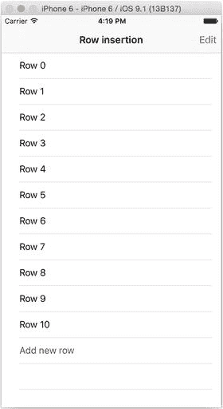

**图 12-15.** 表格中的操作入口

当表格不处于编辑模式时，点击`添加新行`行会将其切换到编辑模式。点击任何其他行则会执行“常规”的行选择操作。

无论表格是如何进入编辑模式的，`添加新行`行都会显示一个插入控件，而所有其他行都会显示一个删除控件（如图 12-16 所示）。


**图 12-16.** 处于编辑模式的表格

### 修改数据模型

`添加新行`项必须出现在最后一行。一种选择是将其添加到数据模型本身，但这会违反模型与视图的分离原则。

更“干净”的替代方案是在表格重新加载时添加该行。首先，你需要告诉表格预期会多出一行，如清单 12-16 所示。

**清单 12-16.** 更新后的`tableView:numberOfRowsInSection:`函数

```
func tableView(tableView: UITableView, numberOfRowsInSection section: Int) -> Int {
    return tableData.count + 1
}
```

然后在`tableView:cellForRowAtIndexPath:`函数中添加额外的一行，如清单 12-17 所示。

**清单 12-17.** 更新后的`tableView:cellForRowAtIndexPath:`函数

```
func tableView(tableView: UITableView, cellForRowAtIndexPath indexPath: NSIndexPath) 
-> UITableViewCell {
    let cell = tableView.dequeueReusableCellWithIdentifier("CellIdentifier",
    forIndexPath: indexPath)
    if indexPath.row == tableData.count {
        cell.textLabel?.text = "添加新行"
        cell.textLabel?.textColor = UIColor.darkGrayColor()
    } else {
        cell.textLabel?.text = tableData[indexPath.row]
    }
    return cell
}
```

神奇之处发生在单元格创建之后。如果该函数处理的是最后一行（换句话说，`indexPath`的行值与数据模型中的项目数量相同），那么`cell.textLabel.text`属性就会被设置为“`添加新行`”。

> **注意：** 请记住，`indexPath`值从`0`开始，而计算数据模型中的元素数量是从`1`开始的。因此——通常情况下——表格中最后一项的`indexPath`的`row`值会是`(tableData.count - 1)`。如果`indexPath`的`row`等于`tableData.count`，那么实际上你已经超出了数组末尾一行，因此需要在此插入`添加新行`项。


### 处理新行

创建新行后，现在需要处理用户交互。当用户轻点该行时，您希望表格进入编辑模式，这意味着需要修改代码清单 12-18 中的 `tableView:didSelectRowAtIndexPath:` 函数。

**代码清单 12-18.** `tableView:` `didSelectRowAtIndexPath` `:` 函数

```
func tableView(tableView: UITableView, didSelectRowAtIndexPath indexPath: NSIndexPath) {
    if (indexPath.row == tableData.count) {
        // 将表格置于编辑模式
        tableView.setEditing(true, animated: true)
    } else {
        // 处理“正常”选择
    }
}
```

再次测试所选行是否为表格末尾的那一行。如果是，则重写默认的 `setEditing:animated:` 函数，使该单元格进入编辑模式，如代码清单 12-19 所示。

**代码清单 12-19.** 自定义 `setEditing:animated:` 函数

```
override func setEditing(editing: Bool, animated: Bool) {
    tableView.setEditing(!tableView.editing, animated: true)
}
```

您需要修改 `tableView:editingStyleForRowAtIndexPath:` 函数，以为最后一行提供插入控件（如代码清单 12-20 所示）。

表格进入编辑模式后，由用户决定是使用删除或插入控件进行编辑，还是让表格退出编辑模式。

如果用户选择后者，您无需担心如何响应其操作。更新后的 `setEditing:animated:` 函数会处理该情况。

另一方面，编辑操作则需要您进行处理。

**代码清单 12-20.** 处理编辑操作

```
func tableView(tableView: UITableView, editingStyleForRowAtIndexPath indexPath: NSIndexPath) -> UITableViewCellEditingStyle {
    if tableView.editing {
        if (indexPath.row == tableData.count) {
            return UITableViewCellEditingStyle.Insert;
        } else {
            return UITableViewCellEditingStyle.Delete;
        }
    }
    return UITableViewCellEditingStyle.None
}
```

轻点某行的控件将触发 `tableView:commitEditingStyle:forRowAtIndexPath:` 函数，该函数会提供对 `tableView`本身、被轻点的行以及控件类型的引用。

这里有两种可能：`UITableViewCellEditingStyle.Delete` 或 `UITableViewCellEditingStyle.Insert`。如果是 `delete`，则按之前的方式处理：从数据模型的相应索引处移除对象，然后从表格中删除该行。

而 `insert` 则需要采用相反的方法。首先，您需要一个新对象。为演示起见，创建一个包含时间戳的 `NSString`：

```
let thingToInsert = "\(NSDate())"
```

然后，需要将这个新对象添加到数据模型中。重要的是，此操作必须在表格更新之前完成，因为表格需要确定其当前拥有的行数，才能插入新行：

```
tableData.append(thingToInsert)
```

`Array` 的 `append` 函数将新对象插入到现有数组的末尾，但您当然也可以使用 `append(:atIndex:)` 函数将其插入到特定位置。

现在已将新对象安全地存储在数据模型中，您可以向表格中插入新行了。您希望它出现在倒数第二行——位于“添加新行”之上，但位于现有行之下（大致如图 12-17 所示）。

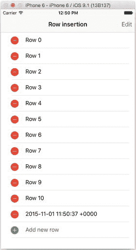

**图 12-17.** 新插入的行

`UITableView` 的 `insertRowsAtIndexPath:` `withRowAnimation:` 方法接收一个包含需要新行的 `IndexPath` 对象的 `Array`，并调用 `tableView` 的 `cellForRowAtIndexPath:` 函数来填充它们。

它会自动将现有行下移。您的表格当前有十行，而您的 `indexPath.row` 值是 `9`（请记住，表格行是从零开始索引的）。在 `indexPath.row` 9 处插入新行将导致该行当前的内容下移到新的 `indexPath.row` 10 位置。

```
tableView.insertRowsAtIndexPaths([indexPath], withRowAnimation: UITableViewRowAnimation.Automatic)
```

`UITableViewRowAnimation.Automatic` 值将强制 `tableView` 负责移动现有行，以保持动画效果无缝衔接。

综合以上所有内容（并稍作重构以保持函数整洁），结果如代码清单 12-21 所示。

**代码清单 12-21.** 完整的 `commitEditingStyle:` 函数

```
func tableView(tableView: UITableView, commitEditingStyle editingStyle: UITableViewCellEditingStyle, forRowAtIndexPath indexPath: NSIndexPath) {
    if (editingStyle == UITableViewCellEditingStyle.Delete) {
        tableData.removeAtIndex(indexPath.row)
        tableView.deleteRowsAtIndexPaths([indexPath], withRowAnimation: UITableViewRowAnimation.Automatic)
    } else if (editingStyle == UITableViewCellEditingStyle.Insert) {
        let thingToInsert = "\(NSDate())"
        tableData.append(thingToInsert)
        tableView.insertRowsAtIndexPaths([indexPath], withRowAnimation: UITableViewRowAnimation.Automatic)
    }
}
```

## 重新排列表格

除了插入和删除行与分区之外，您还可以通过编程方式或用户操作来重新排列它们。

重新排列的过程与插入和删除过程类似，如图 12-18 所示。

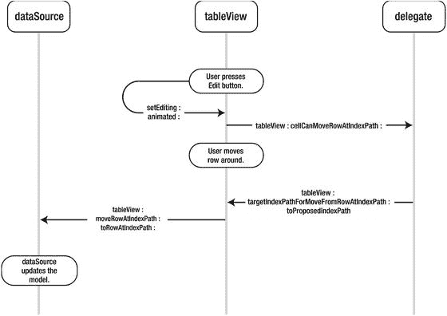

**图 12-18.** 行重排过程  

- 表格进入编辑模式。  
- 向 `tableView` 的 `delegate` 咨询移动行的许可性。  
- 移动该行。  
- 更新数据模型。

### 进入编辑模式

为了重新排列行，表格需要处于编辑模式。与删除操作一样，有两种方法可以实现这一点。对于 `UITableViewController` 子类，用户可以轻点导航栏的“编辑”按钮，或者重写 `tableView` 的 `setEditing:animated:` 函数。

为了显示重排控件，您需要实现 `tableView(moveRowAtIndexPath:toIndexPath)` 函数，如代码清单 12-22 所示。

**代码清单 12-22.** 自定义 `setEditing:animated:` 函数

```
func tableView(tableView: UITableView, moveRowAtIndexPath sourceIndexPath: NSIndexPath, toIndexPath destinationIndexPath: NSIndexPath) {
    //
}
```

此函数尚未执行任何操作，但它是让表格显示重排控件所必需的。

### 检查行是否可移动

当 `tableView` 进入编辑模式时，它会通过调用 `tableView:canMoveRowAtIndexPath:` 函数询问委托每个可见行是否可以被移动。该函数返回 `true` 或 `false`。返回 `false` 将使您能够将特定行“锁定”在原位。

例如，如果您在表格底部有一个“`添加新行`”行，则移动该行是没有意义的。代码清单 12-23 展示了如何将该行“锁定”在原位。

**代码清单 12-23.** `tableView:canMoveRowAtIndexPath:` 函数

```
func tableView(tableView: UITableView, canMoveRowAtIndexPath indexPath: NSIndexPath) -> Bool {
    if (indexPath.row == tableData.count) {
        return false
    }
    return true
}
```


### 移动行

当表格处于编辑模式且行被标记为可移动时，单元格右端会出现重新排序控件，如图 12-19 所示。

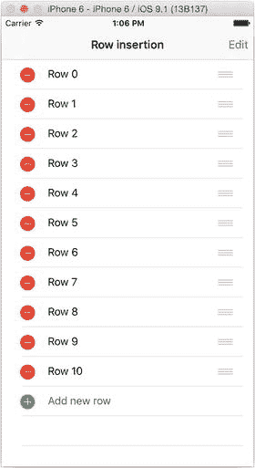

图 12-19. 编辑模式下的表格（已重新排列）

触摸重新排序控件将导致该行从表格处移出并变为可拖拽状态。当该行经过其他行时，`tableView` 会以动画方式移动其他行以腾出空间。

#### 该行能否被移动到这里？

除了控制行是否可以整体移动外，`UITableView` 的委托还能控制某一行是否可以移动到特定位置。

当被拖动的行经过表格中的静态行时，`tableView` 会调用 `tableView:targetIndexPathForMoveFromRowAtIndexPath:toProposedIndexPath:` 函数。（这个函数可能就是导致 iOS 批评者抱怨函数名冗长的原因。）

该函数接收三个参数：对 `tableView` 本身的引用、被移动行的原始 `indexPath`，以及刚刚被移动经过的 `indexPath`。`tableView` 此时还不知道用户是否会释放重新排序控件并将该单元格“放下”，因此当被拖动的行在表格中上下移动经过 `indexPath` 位置时，此函数会被重复调用。

如果该行可以移动到此位置，函数只需返回 `proposedDestinationIndexPath` 来确认此次移动是被允许的。

你可以使用此函数来补充“冻结”表格底部“添加新行”行的功能。除了不希望移动“添加新行”这一行外，你还想阻止用户将另一行移动到表格最底部。图 12-20 显示了你要避免的情况。

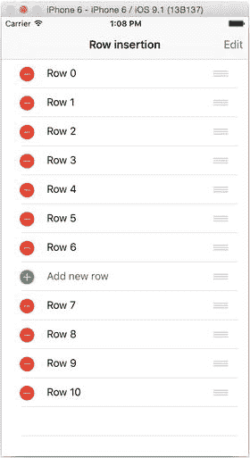

图 12-20. 不允许！

你可以通过检查提议的 `indexPath` 是否为表格末尾来实现此功能。如果是，你可以通过返回 `sourceIndexPath` 将该行“送回”到其原始位置。如果不是，则可以通过返回 `proposedDestinationIndexPath` 允许移动。清单 12-24 展示了实际应用。

**清单 12-24.** 防止移动到表格末尾

```
func tableView(tableView: UITableView, targetIndexPathForMoveFromRowAtIndexPath
sourceIndexPath: NSIndexPath, toProposedIndexPath proposedDestinationIndexPath:
NSIndexPath) -> NSIndexPath {
    if proposedDestinationIndexPath.row == tableData.count {
        return sourceIndexPath
    }
    return proposedDestinationIndexPath
}
```

#### 更新数据模型

完成行的重排后，用户将通过点击导航栏上的`完成`按钮或你实现的任何自定义控件，将表格退出编辑模式。

在此阶段，务必记住所有更改都只发生在视图层面。底层数据模型并未随这些更改而更新。除非你显式更新数据模型，否则这些更改将不会持久保存。

这可能会以几种方式表现出来。下次重新加载表格时，行将恢复到其原始顺序。更糟的是，如果你的表格行数超过了一次性可以显示的数量，当表格滚动时，你将会看到一些极其奇怪的排序效果。

如果委托允许了移动，`tableView` 会调用其委托的 `tableView:moveRowAtIndexPath:toIndexPath:` 函数。该函数接收三个参数：对 `tableView` 本身的引用；源行的 `indexPath`，以及目标行的 `indexPath`。

如何重新排列数据模型显然取决于你的模型是如何实现的。在这个简单的示例中，你可以利用 `Array` 的 `insert:atIndex:` 和 `removeAtIndex:` 函数，如清单 12-25 所示。

**清单 12-25.** 使用重新排列的对象更新数据模型

```
func tableView(tableView: UITableView, moveRowAtIndexPath sourceIndexPath:
  NSIndexPath, toIndexPath destinationIndexPath: NSIndexPath) {
    tableData.insert(tableData[sourceIndexPath.row], atIndex:
    destinationIndexPath.row)
    tableData.removeAtIndex(sourceIndexPath.row + 1)
}
```

此函数首先从源行获取对象，并将其插入到目标行。如果仅止于此，你最终会得到原始对象的两个副本。

`insert:atIndex:` 函数在指定索引处插入一个新索引，将其余对象向下移动一位，并从源 `indexPath` 处插入该对象的一个副本。

### 启用批量插入和删除

在大多数用户控制的情况下，行将逐一受到影响。但是，你可以通过将多个插入或删除命令包装到一个块中来组合它们：

```
tableView.beginUpdates()
// 在这里进行大量的
// 插入和删除操作
tableView.endUpdates()
```

这会为你处理大量繁重的工作。对 `tableView` 和数据模型的操作将按照你指定的顺序进行，但你无需担心在操作过程中跟踪更改。

这非常精妙且强大。如果你删除表格的第 1 行，那么原来的第 2 行将上移成为第 1 行。因此你现在必须引用第 1 行才能影响原来的第 2 行，依此类推。更新块会为你处理这个问题。如果你在块内先删除第 1 行然后删除第 2 行，那么第 2 行将引用原始的的第 2 行。

你绝不能在一个更新块内调用任何会更新 `tableView` 的函数（如 `reloadData` 等）。如果你这样做了，你将不得不自己处理动画。

### 批量插入和删除分区

除了批量插入行之外，也可以插入或删除整个分区。动画会由系统为你处理。

插入分区使用 `insertSections:withRowAnimation:` 函数。你需要传递一个包含要插入分区的 `NSIndexSet`，表格视图会在插入分区之前调用其 `dataSource` 以获取所需数据。

如果在你尝试插入的位置已存在一个分区，则现有分区会自动下移。

`rowAnimation` 参数允许你控制用于插入新分区的动画类型。

删除分区使用 `deleteSections:withRowAnimation:` 函数。同样，你需要提供一个 `NSIndexSet` 来指定要移除的分区，以及一个 `rowAnimation` 参数来控制动画。然后表格视图会处理移除分区并闭合间隙。

在构造 `NSIndexSet` 时需要小心——如果你尝试插入或移除一个底层数据模型中不存在的分区，将会导致运行时崩溃。

## 在 UICollectionViews 中选择

`UICollectionView` 的一种理解方式是将其视为二维的 `UITableView`——即，一个管理单元格但可以在 x 和 y 坐标方向上滚动（而非 `UITableView` 的上下方向）的控件。

有了这个概念模型，了解到 `UICollectionView` 中选中项的管理方式与 `UITableView` 非常相似就不会令人感到惊讶了。

主要区别在于，由于集合视图的实现方式可能与表格视图根本不同，它们内置的特性（如单元格内控件）较少。如果要在单元格中添加编辑、删除或重新排列控件，你需要自己处理。


### 集合视图中的剪切、复制与粘贴

尽管集合视图提供的开箱即用功能较少，但它确实具备一些便捷特性。其中之一就是支持通过长按单元格显示菜单。

常见需求是为集合视图单元格中显示的内容提供剪切、复制和粘贴选项。好消息是实现起来非常简单。

图 12-21 展示了针对第 20 个单元格长按后实现剪切/复制/粘贴的效果。

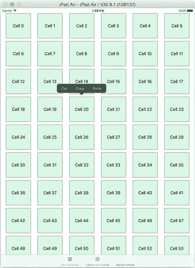

图 12-21. 实现剪切/复制/粘贴

需要实现三个 `UICollectionViewDelegate` 函数：

- `collectionView(shouldShowMenuForItemAtIndexPath:) -> Bool`
- `collectionView(canPerformAction:forItemAtIndexPath:withSender:) -> Bool`
- `collectionView(performAction:forItemAtIndexPath:withSender:)`

第一个函数控制是否为选中单元格显示菜单：需要时返回 `true`，否则返回 `false`（代码清单 12-26）。

代码清单 12-26. `shouldShowMenuForItemAtIndexPath:` 函数

```
override func collectionView(collectionView: UICollectionView,
    shouldShowMenuForItemAtIndexPath indexPath: NSIndexPath) -> Bool {
    return true
}
```

第二个函数控制该单元格能否执行特定操作。例如，可以用代码清单 12-27 中的代码禁用剪切功能。

代码清单 12-27. 禁用剪切功能

```
override func collectionView(collectionView: UICollectionView, canPerformAction
    action: Selector, forItemAtIndexPath indexPath: NSIndexPath, withSender
    sender: AnyObject?) -> Bool {
    if action.description == "cut:" {
        return false
    }
    return true
}
```

可响应的操作种类繁多。检查传入函数时 `action` 的 `description` 属性，即可查看完整列表。

图 12-22 展示了代码清单 12-27 的效果。

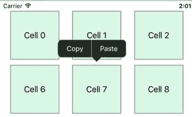

图 12-22. 禁用剪切

最后一个函数用于实现需要启用的操作（代码清单 12-28）。

代码清单 12-28. 实现操作

```
override func collectionView(collectionView: UICollectionView, performAction
    action: Selector, forItemAtIndexPath indexPath: NSIndexPath, withSender
    sender: AnyObject?) {
    //
    switch action.description {
    case "copy:" :
        // 实现复制功能
    case "paste:" :
        // 实现粘贴功能
    }
}
```

### 在集合视图中实现自定义菜单

虽然剪切、复制和粘贴很有用，但并非仅限于此。你可以向长按单元格时显示的菜单中添加自定义项，以实现自己的功能。

长按单元格将显示自定义菜单，该菜单会调用单元格中的函数。如果需要操作数据模型（例如删除单元格），则必须让单元格回调集合视图的控制器。效果可参考图 12-23。

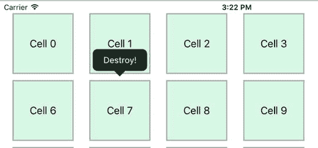

图 12-23. 自定义菜单项

该过程包含以下步骤：

- 定义一个菜单委托协议，并声明处理自定义操作的函数。
- 在视图控制器中实现该自定义函数，使其遵循菜单委托协议。
- 创建 `UICollectionViewCell` 的自定义子类，并为遵循菜单委托协议的对象添加委托属性。
- 在单元格子类中，实现调用委托的函数。单元格将处理初始菜单点击，然后通过委托执行数据模型所需的操作。
- 为新操作创建菜单项，并将其分配给共享菜单控制器。
- 在出队单元格时，将集合视图控制器设置为单元格委托。
- （可选）更新 `UICollectionViewDelegate` 函数，限制弹出菜单中显示的菜单项。

#### 定义自定义协议

协议可以在集合视图的视图控制器中定义。在文件顶部添加声明（代码清单 12-29）。

代码清单 12-29. 声明自定义菜单协议

```
protocol CustomMenuDelegate {
    func performDestroy(sender: AnyObject, forCell:SelectionCell)
}
```

#### 实现自定义协议

现在可以实现该函数，使视图控制器遵循协议。作为视图控制器的扩展添加，如代码清单 12-30 所示。

代码清单 12-30. 协议扩展

```
extension SelectionController : CustomMenuDelegate {
    func performDestroy(sender: AnyObject, forCell: SelectionCell) {
        print("Custom action for sender: \(sender) with cell \(forCell)")
    }
}
```

#### 更新集合视图单元格子类

如果尚未创建自定义的 `UICollectionViewCell` 子类，则需要实现一个。如果已有，则需要更新它，使其包含委托属性和从自定义菜单调用的操作实现函数。示例见代码清单 12-31。

代码清单 12-31. 自定义 `UICollectionViewCell` 示例

```
import UIKit

class SelectionCell: UICollectionViewCell {
    var delegate: CustomMenuDelegate?

    func performDestroy(sender: AnyObject) {
        if let delegate = delegate {
            delegate.performDestroy(sender, forCell: self)
        }
    }
}
```

#### 创建自定义菜单项

现在可以创建自定义菜单项。在视图控制器的 `viewDidLoad` 函数中添加以下代码：

```
let menuItem = UIMenuItem(title: "销毁!", action: "performDestroy:")
UIMenuController.sharedMenuController().menuItems = [menuItem]
```

这将创建一个标题为 `销毁!` 的新菜单项，点击时会调用 `performDestroy:` 函数。该函数将在单元格上被调用，因为菜单会附加到单元格对象上。

然后将其添加到 `sharedMenuController`，以便在长按时显示在单元格中。

#### 将单元格链接到其委托

现在需要更新 `cellForItemAtIndexPath:` 函数，使单元格出队时设置其委托。在 `cellForItemAtIndexPath:` 函数中，单元格出队后、返回前添加以下行：

```
cell.delegate = self
```


### 更新 `UICollectionViewDelegate` 函数

需要更新用于控制长按响应动作的 `UICollectionViewDelegate` 函数。假设你只想提供 `Destroy!` 菜单选项，请按照代码清单 12-32 所示更新 `collectionView(canPerformAction:forItemAtIndexPath:withSender:)` 函数。

**代码清单 12-32.** 更新后的 `collectionView(canPerformAction:forItemAtIndexPath:withSender:)` 函数

```
override func collectionView(collectionView: UICollectionView, canPerformAction➤
action: Selector, forItemAtIndexPath indexPath: NSIndexPath, withSender➤
sender: AnyObject?) -> Bool {
    if action.description == "performDestroy:" {
        return true
    }
    return false
}
```

完成这些更新后，你就可以重新运行应用，并在某个单元格上尝试长按操作。此时应该会弹出 `Destroy!` 项目，如图 12-24 所示。

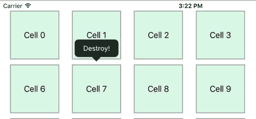

**图 12-24.** `Destroy!` 菜单项

### 响应菜单项移除单元格

为了完成这一流程，我们需要实现响应 `Destroy!` 选项来移除单元格的功能。请更新 `performDestroy` 函数，使其与代码清单 12-33 匹配。

**代码清单 12-33.** 更新后的 `performDestroy` 函数

```
func performDestroy(sender: AnyObject, forCell: SelectionCell) {
    if let indexPath = collectionView?.indexPathForCell(forCell) {
        dataArray.removeAtIndex(indexPath.row)
        collectionView?.reloadData()
    }
}
```

这段代码通过“拥有”菜单的单元格从集合视图中获取 `indexPath`，然后删除该索引处的对象。当集合视图的数据重新加载后，选中的单元格将被移除，如图 12-25 所示。

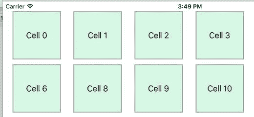

**图 12-25.** 单元格 7 已被移除

### 实现“添加单元格”选项

实现添加单元格（而非移除单元格）的功能，过程实际上与上述操作相同。

#### 扩展协议以添加插入单元格的函数

更新协议，添加 `addItem(sender:atCell:)` 的定义：

```
protocol CustomMenuDelegate {
    func performDestroy(sender: AnyObject, forCell:SelectionCell)
    func addItem(sender: AnyObject, atCell: SelectionCell)
}
```

#### 在单元格子类中添加新函数

将 `addItem` 函数添加到 `SelectionCell` 子类中：

```
func addItem(sender: AnyObject) {
    if let delegate = delegate {
        delegate.addItem(sender, atCell: self)
    }
}
```

#### 在集合视图控制器中实现 `addItem` 函数

添加一个函数，用于向集合视图的数据模型中插入一个条目，并刷新数据：

```
func addItem(sender: AnyObject, atCell: SelectionCell) {
    if let indexPath = collectionView?.indexPathForCell(atCell) {
        dataArray.insert("new cell)", atIndex: indexPath.row)
        collectionView?.reloadData()
    }
}
```

#### 添加新的菜单项

更新集合视图控制器，添加另一个菜单项：

```
let destroyMenuItem = UIMenuItem(title: "Destroy!", action: "performDestroy:")
let addMenuItem = UIMenuItem(title: "Add!", action: "addItem:")
UIMenuController.sharedMenuController().menuItems = [addMenuItem, destroyMenuItem]
```

再次运行项目，你会在弹出菜单中看到一个新项目，如图 12-26 所示。

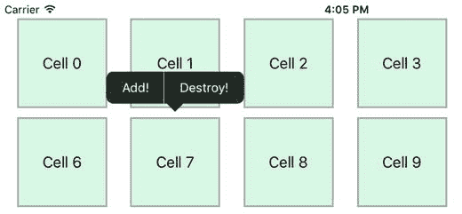

**图 12-26.** 新的菜单项

点击 `Add!` 按钮，你会看到集合视图中出现一个新条目，如图 12-27 所示。

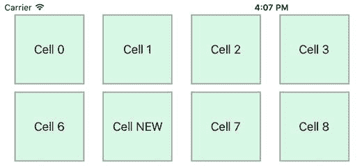

**图 12-27.** 新的单元格

## 重新排列 `UICollectionView`

集合视图是向用户展示可交互排序数据的绝佳控件——例如，重新排列相册中照片的顺序。`UICollectionView` 使得实现此类功能几乎不费吹灰之力。

为了演示这一点，你将创建一个非常简单的集合视图，用于显示若干单元格，然后实现通过拖放对其进行排序的功能。

实现拖放重新排序需要在集合视图的委托对象中添加一些 `UICollectionViewDelegate` 函数；具体方法取决于你是否使用了 `UICollectionViewController` 的子类。你将依次了解这两种方法。

#### 先决条件

此过程假设你已有一个集合视图，它基于存储在模型中的底层数据，在单个分区中显示单元格。本章的源代码包含两个项目：一个用于初始状态，便于你开始操作；另一个则完整实现了该功能。

假设你从初始状态开始，应用将如图 12-28 所示。

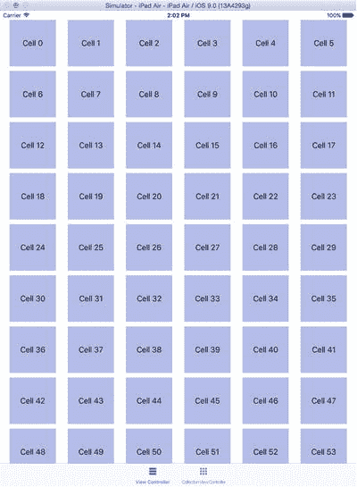

**图 12-28.** 初始应用

应用包含两个标签页，一个包含基于 `UIViewController` 的集合视图，另一个包含 `UICollectionViewController` 子类。两者具有相同的数据结构：一个包含 100 个 `String` 的 `Struct`，这些字符串在流式布局的控制下显示在 100 x 100 的单元格中。

目前，唯一可能的交互是默认的垂直滚动行为。你将通过实现集合视图的拖放重新排序功能来增强这一点。

该过程始于对项目进行长按；一旦检测到长按，委托对象会被询问是否允许该索引路径处的项目移动。如果允许，该单元格将跟随拖动手势移动。

当用户抬起手指且拖动手势结束时，该单元格会被插入到集合视图新空出的空间中，并调用第二个委托函数来允许更新数据源。

适配基于 `UICollectionViewController` 的集合视图是两者中较为简单的方法，因此你首先实现它，然后将其用作在 `UIViewController` 中实现相同功能的起点。

### 使用 `UICollectionViewController` 实现拖放

该过程首先需要更新 `UICollectionViewController`，将 `installsStandardGestureForInteractiveMovement` 属性设置为 `true`。将此代码添加到 `viewDidLoad` 函数中：

```
self.installsStandardGestureForInteractiveMovement = true
```


### 添加 `UICollectionViewDelegate` 函数

接下来，你需要实现两个可选的 `UICollectionViewDelegate` 函数：

-   `collectionView(_:canMoveItemAtIndexPath:)`
-   `collectionView(_:moveItemAtIndexPath:toIndexPath)`

第一个函数简单地控制选中的项目是否可以被移动，它会在交互开始前被调用。你可能有必须保持原位不动的项目，在这种情况下，你需要为这些特定的索引路径返回 `false`。

在你的示例中，你允许所有项目移动，因此只需从该函数返回 `true`，如代码清单 12-34 所示。

**代码清单 12-34.** `collectionView(_:canMoveItemAtIndexPath:)`
```swift
override func collectionView(collectionView: UICollectionView, canMoveItemAtIndexPath
indexPath: NSIndexPath) -> Bool {
    return true
}
```

第二个函数会在交互完成后被调用。此时，你可以更新底层数据源，使其与集合视图的变化相匹配。

> **警告：** 在集合视图中重新排列项目的操作并不会更新底层数据模型；这些变化仅发生在视图中。如果你不更新数据模型以反映项目的移动情况，那么当下次集合视图更新时，这些变化将会消失。

该函数接收三个参数：`collectionView` 自身、项目来源的 `indexPath` 以及项目目标位置的 `indexPath`。有了这些数据，你就可以相应地更新数据，如代码清单 12-35 所示。

**代码清单 12-35.** 更新数据模型
```swift
override func collectionView(collectionView: UICollectionView, moveItemAtIndexPath
sourceIndexPath: NSIndexPath, toIndexPath destinationIndexPath: NSIndexPath) {
    // 找到要移动的对象
    let thingToMove = dataArray[sourceIndexPath.row]
    // 移除旧对象
    dataArray.removeAtIndex(sourceIndexPath.row)
    // 插入要移动对象的新副本
    dataArray.insert(thingToMove, atIndex: destinationIndexPath.row)
    // 重新加载数据
    collectionView.reloadData()
}
```

最后的 `reloadData()` 调用对于更新视图来说并非严格必需，但它确保了交互完成后 `collectionView` 与其底层数据能够重新同步。

实现了这三处更改后，你就可以在集合视图中随心所欲地拖拽单元格了！

### 高亮移动过程

目前来看，当你在移动单元格时，可能很难看清具体发生了什么，因为正在移动的单元格看起来和其他单元格一样。为了让其更加醒目，你可以利用刚实现的两个委托函数，在单元格移动时高亮显示它。

首先，让我们在手势开始平移时，更改单元格的背景颜色。

向类中添加一个属性，用于保存对正在移动的单元格的引用：
```swift
private var selectedCell: UICollectionViewCell?
```

接下来，更新 `collectionView(_:cellForItemAtIndexPath:)` 函数，在单元格出列时设置其边框。在标签更新后添加以下两行代码：
```swift
cell.contentView.layer.borderColor = UIColor.lightGrayColor().CGColor
cell.contentView.layer.borderWidth = 2.0
```

现在更新 `collectionView(_:canMoveAtIndexPath:)` 函数，使其看起来像代码清单 12-36 所示。

**代码清单 12-36.** 更新后的 `collectionView(_:canMoveAtIndexPath:)` 函数
```swift
override func collectionView(collectionView: UICollectionView, canMoveItemAtIndexPath
indexPath: NSIndexPath) -> Bool {
    selectedCell = collectionView.cellForItemAtIndexPath(indexPath)
    selectedCell?.contentView.layer.borderColor = UIColor.redColor().CGColor
    return true
}
```

这段代码获取了被选中单元格的引用，并在交互开始时将边框颜色改为红色。

要在交互结束时将边框颜色恢复为原始值，请在 `collectionView(_:moveItemAtIndexPath:toIndexPath:)` 函数中，于 `reloadData()` 调用之前添加以下代码行：
```swift
selectedCell?.contentView.layer.borderColor = UIColor.lightGrayColor().CGColor
```

### 使用拖放交互

完成这些更新后，你就可以拖放单元格进行重新排列，如图 12-29 所示。

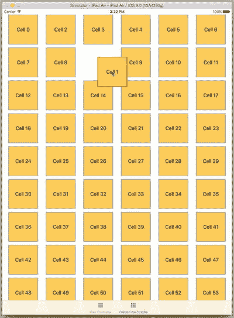

**图 12-29.** 进行中的拖放交互

### 使用 `UIViewController` 实现拖放

如果你的集合视图是由 `UIViewController` 子类而非 `UICollectionViewController` 管理的，那么实现拖放交互会稍微复杂一些。不过，最终效果是完全相同的。

首先，按照上述 `UICollectionViewController` 的流程，添加 `UICollectionViewDelegate` 函数并高亮被移动的单元格。

#### 添加属性

接下来，你需要向视图控制器添加三个属性：
```swift
var longPressGesture: UILongPressGestureRecognizer!
var panGesture: UIPanGestureRecognizer!
var selectedIndexPath: NSIndexPath!
```

`longPressGesture` 属性保存了对控制拖放过程启动的手势识别器的引用。`panGesture` 保存了对处理触摸点下方单元格追踪的手势识别器的引用。而 `selectedIndexPath` 则是对正在被操作的单元格的引用。


#### 添加手势识别器

现在需要在集合视图上添加手势识别器。这一操作在`viewDidLoad`中完成，如代码清单 12-37 所示。

代码清单 12-37. 更新后的`viewDidLoad`函数

```
override func viewDidLoad() {
    super.viewDidLoad()
    panGesture = UIPanGestureRecognizer(target: self, action: "handlePanGesture:")
    self.collectionView.addGestureRecognizer(panGesture)
    panGesture.delegate = self
    longPressGesture = UILongPressGestureRecognizer(target: self, ➤
  action: "handleLongGesture:")
    self.collectionView.addGestureRecognizer(longPressGesture)
    longPressGesture.delegate = self
}
```

需要新增一个函数来处理`longGesture`；请按代码清单 12-38 所示添加。

代码清单 12-38. `handleLongGesture(_:)`函数

```
func handleLongGesture(gesture: UILongPressGestureRecognizer) {
    switch(gesture.state) {
    case UIGestureRecognizerState.Began:
        selectedIndexPath = self.collectionView.indexPathForItemAtPoint➤
        (gesture.locationInView(self.collectionView))
    case UIGestureRecognizerState.Changed:
        break
    default:
        selectedIndexPath = nil
    }
}
```

该函数在`UILongPressGesture`开始时更新`selectedIndexPath`；并在手势结束时重置它。

`handlePanGesture(_:)`函数负责将移动操作传递给集合视图，因此请添加代码清单 12-39 所示的代码。

代码清单 12-39. `handlePanGesture(_:)`函数

```
func handlePanGesture(gesture: UIPanGestureRecognizer) {
    switch(gesture.state) {
    case UIGestureRecognizerState.Began:
        collectionView.beginInteractiveMovementForItemAtIndexPath(selectedIndexPath!)
    case UIGestureRecognizerState.Changed:
        collectionView.updateInteractiveMovementTargetPosition ➤
        (gesture.locationInView(gesture.view!))
    case UIGestureRecognizerState.Ended:
        collectionView.endInteractiveMovement()
    default:
        collectionView.cancelInteractiveMovement()
    }
}
```

平移手势识别器有三种可能的状态：

- `Began`：在此状态下通知集合视图开始移动所选索引路径上的项目。
- `Changed`：当触摸点移动时触发，此时通知集合视图将目标位置移动到与触摸点匹配的位置。
- 最后，`Ended` 在触摸抬起事件后触发，此时通知集合视图取消移动。这会导致移动中的元素“吸附”到新位置。

#### 添加`UIGestureRecognizerDelegate`函数

正如你在更新后的`viewDidLoad`函数中所注意到的，两个手势识别器都有代理。这些代理都已设置为视图控制器。你需要添加两个代理函数。最简便的方法是为视图控制器添加一个扩展，如代码清单 12-40 所示。

代码清单 12-40. 视图控制器的`UIGestureRecognizerDelegate`扩展

```
extension ViewController: UIGestureRecognizerDelegate {
    func gestureRecognizer(gestureRecognizer: UIGestureRecognizer, ➤
    shouldRecognizeSimultaneouslyWithGestureRecognizer otherGestureRecognizer: ➤
    UIGestureRecognizer) -> Bool {
            if gestureRecognizer == longPressGesture {
                return panGesture == otherGestureRecognizer
            }
            if gestureRecognizer == panGesture {
                return longPressGesture == otherGestureRecognizer
            }
            return true
    }

    func gestureRecognizerShouldBegin(gestureRecognizer: UIGestureRecognizer) -> Bool {
        guard gestureRecognizer == self.panGesture else {
            return true
        }
        return selectedIndexPath != nil
    }
}
```

### 收尾工作

完成扩展函数后，你现在可以运行应用，并查看在视图控制器标签页中实现的拖拽交互效果，如图 12-30 所示。

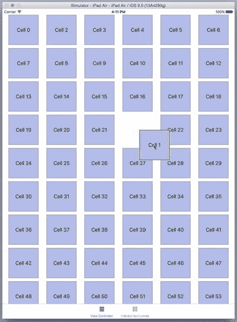

图 12-30.

正在进行的拖拽交互

## 本章小结

在本章中，你了解了如何将表格和集合视图从静态、无响应的数据展示器扩展为能够通过选择特性处理用户输入的组件。你看到了如何利用它们重新排列数据，以及促进底层数据模型的更新。

最后，你将这一逻辑推向了极致，进一步扩展它们，允许用户对数据模型进行添加、修改和删除操作——将表格和集合视图从只读视图转变为完全交互式的组件。

