# 13. 静态表格

许多表格视图是动态构建的，在显示数据时按需填充原型单元格的实例。但这并非构建表格的唯一方式；静态表格视图也可以是用户界面中有用的组件。

使用静态表格时，你需要预先定义单元格及其内容。这在你知道要显示的内容不会改变的情况下非常有用，例如显示设置列表时。iOS 内置的“设置”应用中的许多部分都基于静态表格视图，如图 13-1 所示。

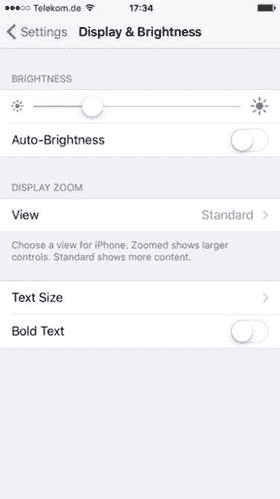

图 13-1.

在“设置”应用中用于显示“显示与亮度”控件的静态表格

即使对于静态内容，甚至当界面乍一看完全不像表格时，静态表格也可以利用表格视图提供的布局灵活性。

在本章中，你将了解构建静态表格的过程，以及此类表格的一些用途。

## 如何构建静态表格

当你添加一个表格视图对象时（无论是作为现有视图的子视图，还是作为表格视图控制器场景的根对象），它都会显示一个用于原型内容的区域，如图 13-2 所示。

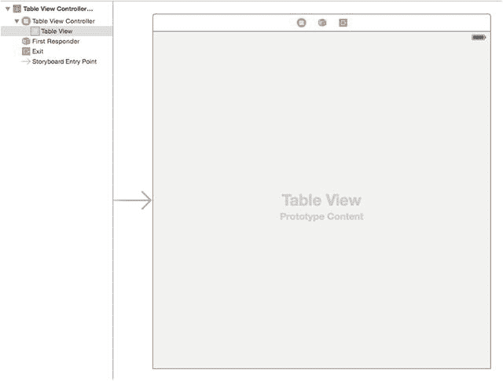

图 13-2.

原型内容区域

在第 7 章中，你了解了如何添加原型单元格，这些单元格可以被表格视图的`dataSource`用作运行时创建的单元格的“模板”。

Storyboard 或 XIB 中的表格视图控制器控件也可以用于创建静态单元格；这些单元格是预先创建和布局的，因此不会在运行时动态创建。

> 提示：仅当你在使用`UITableViewController`时，才能在 Storyboard 中创建静态表格视图单元格。如果你尝试在`UITableView`中创建静态单元格，Xcode 会报错。

### 向表格视图添加静态单元格

通过将表格视图的 `Content` 属性从默认的 `Dynamic Prototype`（动态原型）切换为 `Static Cells`（静态单元格），即可将静态单元格作为原型添加。此设置可在属性检查器中进行，如图 13-3 所示。

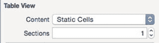

图 13-3. 切换至静态单元格

一旦进行此更改，您会看到表格视图更新，并添加了一个包含三个单元格的新分区（您可能需要展开场景的层级结构树以显示新的控件）。请参见图 13-4。

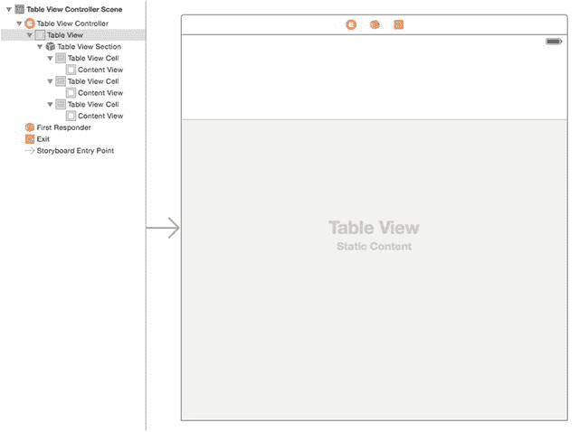

图 13-4. 新分区与静态单元格

新的单元格采用的是标准的 44 点高度，并带有透明分隔线，因此不太容易立即看出是否有内容存在。但您可以通过在属性检查器中调整表格、分区和单元格的属性来更改这一点。

图 13-5 展示了一个更新后的表格，其中包含了一些页眉和页脚文本，以及浅灰色的单元格分隔线。三个单元格已从 `Custom`（自定义）更改为 `Default`（默认），并且标题字段也已更新。

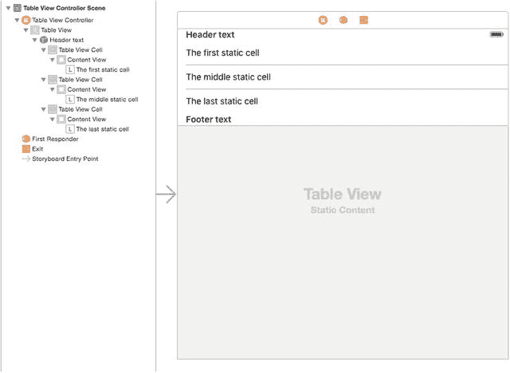

图 13-5. 更新后的单元格

如果您现在运行应用程序（如图 13-6 所示），将会看到表格视图显示了这三个单元格，而且完全无需实现任何 `UITableViewDataSource` 方法！

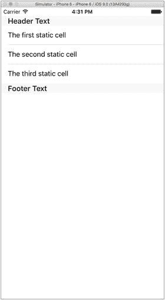

图 13-6. 运行中的初始静态表格

### 修复滚动问题

默认情况下，即使没有足够的行来填满视图，表格视图也会滚动。这在一个静态表格视图中看起来可能很奇怪，因此如果您确定所有内容即使在较小的设备上（以及在适当情况下的横屏方向）也能适合单个屏幕，那么您可能需要禁止表格滚动。

要禁止滚动，请在视图层级中选择 `TableView`，然后取消选中属性检查器中的 `Scrolling Enabled`（启用滚动）设置（图 13-7）。

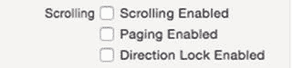

图 13-7. 禁止表格滚动

### 向静态单元格添加控件

静态单元格就位后，您就可以开始自定义它们了。如果将单元格类型改回 `Custom`（自定义），您就可以将每个单元格的内容视图视为一个空的 `UIView`——在其中放置其他控件，并使用自动布局约束定位它们。

#### 调整单元格高度

在向单元格中放置其他控件之前，您可能需要调整其高度。默认情况下，空的自定义单元格高度为 44 点。要更改此设置，请在对象层级中选择该行，然后在尺寸检查器中调整行高，如图 13-8 所示。

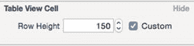

图 13-8. 调整行高

#### 添加交互式控件

在静态表格视图中将控件链接到方法是通过标准方式完成的：控件事件链接到控制器中的 `IBAction` 方法，该方法由用户交互触发。

但是您添加了一个 `UITableViewController` 场景，却没有关联的 `UIViewController` 子类，因此出现的问题是：链接到哪个位置的 `IBAction` 方法？

答案是：“链接到某个已存在的控制器类中。” 在这种情况下，您可以将静态表格视图中的按钮链接到某个 `UIViewController` 子类中的 `IBAction` 方法，这个子类可以是您之前添加的，也可以是为处理此 `UITableViewController` 场景而创建的。

为了将这个静态表格的场景连接到视图控制器，您需要添加对视图控制器的引用。为此，请从对象库中选择一个对象，并将其拖入表格视图控制器的场景中，如图 13-9 所示。

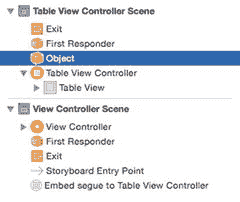

图 13-9. 向场景添加对象

该对象现在也会作为占位符显示在场景的顶部区域，如图 13-10 所示。

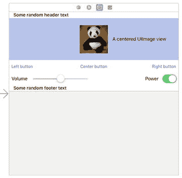

图 13-10. 场景顶部区域中的对象

选中对象占位符后，切换到身份检查器，并将 `Custom Class`（自定义类）的值更新为该对象所代表的类（在此例中，将 `didTapStaticTableButton IBAction` 方法添加到 `ViewController` 类中），如图 13-11 所示。

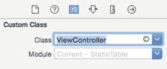

图 13-11. 设置自定义类

设置好类之后，您现在可以按住 Ctrl 键，从控件拖拽到占位符，此时可用的 `IBAction` 方法将显示在 HUD 中，如图 13-12 所示。

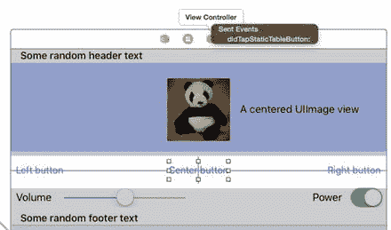

图 13-12. 将控件连接到操作

### 在容器视图中使用静态表格

到目前为止，您一直在 Storyboard 中的 `UITableViewController` 场景内创建静态表格布局。这没问题，但 `UITableViewController` 场景对其使用方式有一些预设，主要是它会以全屏方式显示。

那么，如果您想将静态表格视图包含在另一个视图控制器内（例如，如果它没有填满整个界面），该怎么办？

您可以尝试像构建动态表格视图一样，将一个标准的 `UITableView` 对象添加到视图控制器的视图中。Interface Builder 会让您像本章前面所做的那样，将表格视图从动态原型更改为静态单元格，并布局静态单元格。

然而，当您构建项目时，编译器会拒绝，并显示图 13-13 所示的错误。

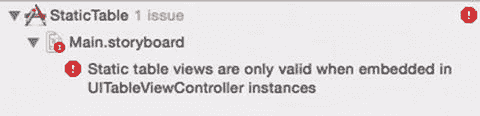

图 13-13. 尝试在标准 `UITableView` 中构建静态单元格时出现的错误

至少可以说，这很烦人。那么有什么变通方法呢？

答案是使用 `UITableViewController` 像以前一样创建静态表格布局，然后将其嵌入到 `UIViewController` 内部的容器中。

#### 先决条件

由于具体配置取决于项目的结构，我将阐述一个假设的情况。我假设您已经按照本章前面的描述，使用 `UITableViewController` 构建了一个静态表格布局；但现在您意识到需要在另一个视图内呈现它。

我还假设您的 `UITableViewController` 是 Storyboard 中唯一的场景，因此您将从类似于图 13-14 所示的内容开始。

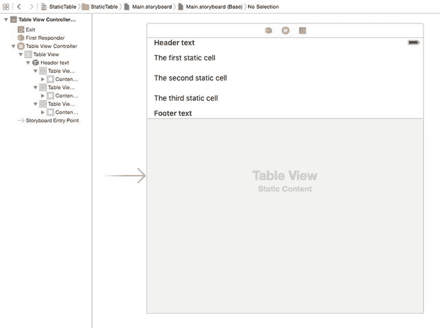

图 13-14. 已配置但在 Storyboard 中孤立的 `UITableViewController`

### 添加 UIViewController 场景

第一步是从对象浏览器中拖入一个 `UIViewController` 对象，这样故事板中现在就有两个场景了，如图 13-15 所示。

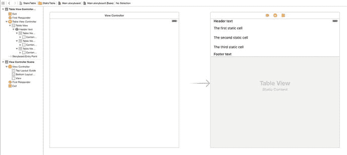

图 13-15. 向故事板添加 UIViewController 场景

目前，`UITableViewController` 是故事板的入口点，由指向该场景的灰色入口箭头表示。你需要更改此项设置，使其首先加载的是视图控制器。因此，在堆栈中选择“**视图控制器场景**”，然后在属性检查器中选中“**是初始视图控制器**”复选框，如图 13-16 所示。

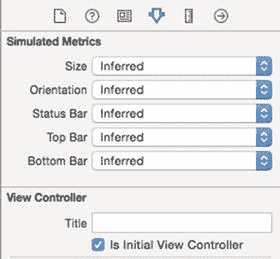

图 13-16. 将 UITableViewController 设置为初始视图

一旦执行此操作，入口箭头就会切换为指向 `UIViewController` 场景。

### 向 UIViewController 添加容器视图

现在你需要向 `UIViewController` 中添加一个容器视图，以便将静态表格视图嵌入其中。

从“**对象**”浏览器中选择一个“**容器视图**”，并将其拖入视图控制器场景的视图中。一旦执行此操作，你会看到它添加了第三个场景，即一个通过“**嵌入**”转场连接的 `UIViewController`，如图 13-17 所示。

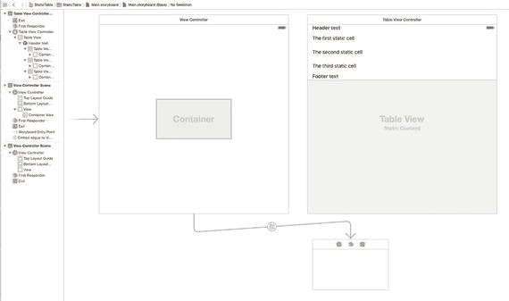

图 13-17. 添加到第一个 UIViewController 场景的容器视图

由于你希望静态表格全屏显示，因此需要向容器视图添加一些自动布局约束，使其填满整个视图。

选择容器视图，然后添加上、下、前导和尾部约束，如图 13-18 所示。

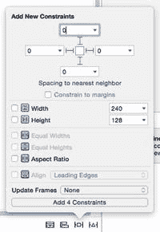

图 13-18. 向容器视图添加自动布局约束

添加完约束并使容器视图全屏后，你需要删除随“**容器**”对象一起带来的多余的 `UIViewController` 场景。在画布左侧的对象层次结构中选择整个场景，然后按删除键。该场景和转场会一并消失。

### 将静态表格视图嵌入到视图控制器中

将静态表格视图嵌入到视图控制器中是最后一步。按住 Ctrl 键点击对象层次结构中的“**容器**”视图，将蓝色连接线拖至表格视图控制器场景中的表格视图控制器对象。松开鼠标按钮时，表格视图控制器旁边会出现一个 HUD 菜单，如图 13-19 所示。

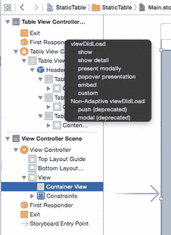

图 13-19. 添加嵌入转场

选择“**嵌入**”项，将创建一个新的“**嵌入**”转场，用于连接表格视图控制器场景与容器，如图 13-20 所示。

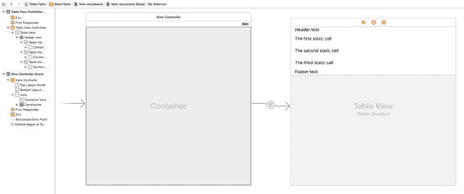

图 13-20. 嵌入到 UIViewController 中的静态表格视图

现在运行应用程序，将会在视图控制器内显示静态表格。从用户体验的角度来看，变化不大，但通过调整容器视图的约束，你现在可以随心所欲地控制静态表格的位置。

## 静态表格的其他用途

静态 `UITableView` 的“典型”用途是设置应用，但它的用途并不仅限于此类情况。

利用 `UITableView` 的垂直布局能力，只要你的布局看起来像是一堆元素上下堆叠，并且需要比 `UIStackView` 更高级别的控制和灵活性，就可以使用静态表格。

表单基本上就是一系列标题和文本字段。通过将标题和文本字段放置到交替的行中，你可以使用静态表格视图来构建表单，并让表格视图处理垂直滚动。

## 总结

在本章中，你学习了创建静态表格视图的流程，该流程适用于要显示的数据并非动态变化的情况。这是一个简单的过程，可用于为偏好设置和设置等功能构建视图，或者以表格样式布局显示静态信息。

