# 14. WatchKit 中的表格

在本章中，你将学习如何创建、配置和使用 WatchKit 中的表格控件。

WatchKit 专为小巧、低功耗的 Apple Watch 设计，因此 `WKInterfaceTable` 控件的功能远不如 `UITableView` 强大，但仍可用于呈现基于表格的信息并充当导航界面。

你将学习以下内容：

- WatchKit 表格与 `WKInterfaceTable` 类的结构
- 如何在故事板中创建和配置表格行
- 如何创建和配置行控制器类
- 如何在运行时使用数据配置表格
- 如何响应用户与 WatchKit 表格的交互
- 如何将 WatchKit 表格用作导航界面。

## 关于 WatchKit

尽管 Apple Watch 在有限的机身内整合了强大的功能和复杂性，堪称工程壮举，但不可否认，该设备的性能远不及 iPhone。

为了充分发挥 WatchKit 表格的优势，你需要记住一些注意事项和限制条件：

- Apple Watch 实际上充当着配对 iPhone 上 WatchKit 扩展程序的视图，因此所有通信都必须通过蓝牙链路进行。这可能会速度较慢，因此务必尽可能精简界面更新。
- 与 `UITableView` 不同，`WKInterfaceTable` 控件不使用按需缓存机制。表格中将要显示的所有行都必须在显示之前创建并发送到 Watch。因此，通常最好将表格中的行数限制在 20 行左右。
- Watch 的界面很小，专为快速浏览而设计。在设计表格界面时，务必保持信息密度低，并且控件足够大以便于操作。
- WatchKit 界面必须在故事板中布局；无法通过代码构建或在运行时进行修改（更改控件内容或可见性除外）。
- WatchKit 界面不支持自动布局。

## WatchKit 应用的结构

WatchKit 应用由两部分组成：一个在配对 iPhone 上运行的 WatchKit 扩展程序，以及安装在 Watch 本身上的用户界面。

WatchKit 扩展程序在后台运行，负责向用户界面发送更新，并响应用户与 Watch 的交互。

WatchKit 应用有三种界面类型：完整的应用用户界面（`WKInterfaceTable` 位于其中）、用于快速访问只读信息的 Glance 界面，以及通知界面。

界面更新和用户交互通过蓝牙连接在 iPhone 与配对的 Watch 之间进行通信。


## 什么是 WatchKit 表格？

WatchKit SDK 包含 `WKInterfaceTable` 类，该类支持单列表格。一个表格可以由多种类型的行组成。每种行类型都有其自己的行控制器，该控制器由一个你需要创建的自定义类支持。行控制器包含连接到界面元素的输出口，以及（在需要时）处理与控件交互的函数。

表格、行和行控制器之间的关系如图 14-1 所示。

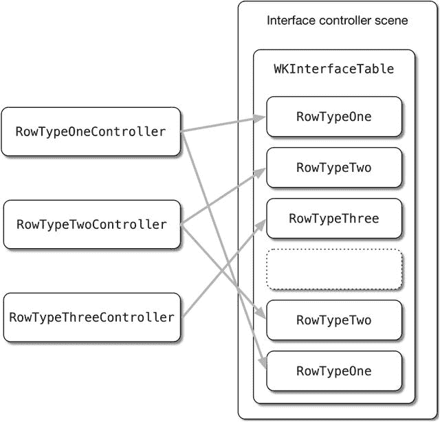

图 14-1. 表格、行和行控制器之间的关系

创建基于表格的 WatchKit 应用程序的过程包含四个步骤：

1.  在 Storyboard 中创建一个表格对象，并在行中布局控件。
2.  创建 `NSObject` 子类，作为将要显示的每种类型行的控制器，并带有输出口连接到 Storyboard 中的控件。
3.  创建行控制器类的实例，并在运行时将其提供给表格。
4.  响应用户与行的交互。

WatchKit 表格是 `WKInterfaceTable` 类的实例。从概念上讲，它们类似于 `UITableView`，但有一些显著的区别：

- `WKInterfaceTable` 不使用数据源来按需创建单元格。相反，你需要在表格显示在界面上之前，预先创建所有单元格。
- 没有委托来处理交互；这也是需要你自己实现的部分。
- 与其他 WatchKit 界面元素一样，不支持 AutoLayout，你需要使用 Storyboard 来创建界面。
- 当前一代 Apple Watch 设备的性能限制意味着，在实践中，当行数超过大约 20 行时，性能会下降到不可接受的程度。

图 14-2 展示了行控制器和行之间的关系。

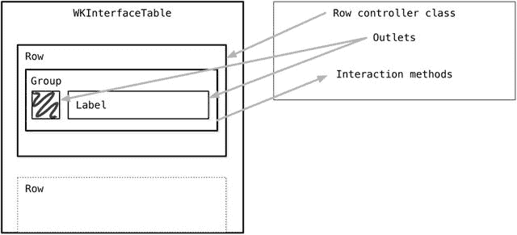

图 14-2. `WKInterfaceTable` 对象的组合方式

在运行时，你需要负责告诉表格行的类型、数量和顺序，然后创建行控制器的实例，最后配置它们的输出口。你在这里有两个选择：

- 如果表格只有一种类型的单元格，你可以使用 `setNumberOfCells:withRowType` 函数：`table.setNumberOfRows(5, withRowType: "ContactRow")`
- 如果表格有不止一种类型的单元格，你需要将一个单元格标识符字符串数组传递给 `setRowTypes:` 函数。例如，如果你有一个标题行、两个数据行和一个页脚行，你需要传入数组 `["HeaderCell", "DataCell", "DataCell", "FooterCell"]`：`table.setRowTypes(["HeaderCell", "DataCell", "DataCell", "FooterCell"])`

一旦你告诉表格哪一行是哪种类型的单元格，你就需要使用 `rowControllerAtIndex` 函数依次获取每一行的行控制器。现在你可以配置之前在行控制器类中定义的输出口了。此过程的示例见代码清单 14-1。

代码清单 14-1. 配置和更新 Watch 表格

```
func updateTable() {

    // 创建数组来保存行类型
    var rowsArray = [String]()

    // 添加标题行作为第 0 行
    rowsArray.append("HeaderRow")

    // 为 dataArray 中的每个对象添加一个联系人行
    for index in 1...self.dataArray.count {
        rowsArray.append("ContactRow")
    }

    // 添加一个页脚行作为最后一行
    rowsArray.append("FooterRow")

    // 配置表格以显示 rowsArray 中定义的行
    self.watchTable.setRowTypes(rowsArray)

    // 检索每个联系人行并从 dataArray 中设置内容
    // 从第 1 行开始，因为第 0 行是标题行
    for index in 1...self.dataArray.count {
        var contactRow: ContactRowController =
        self.watchTable.rowControllerAtIndex(index) as! ContactRowController
        var rowContent = self.dataArray[index]
        contactRow.nameLabel!.setText(rowContent)
    }

    // 获取最后一行，并将其配置为页脚
    let contactCount = self.dataArray.count
    var footerRow: FooterRowController =
    self.watchTable.rowControllerAtIndex(contactCount + 1) as! FooterRowController
    footerRow.footerLabel.setText("\(contactCount) messages")
}
```

Storyboard 将表格呈现为一行或多行。在每一行内部都有一个组，你可以在其中添加自定义控件，如图 14-3 所示。

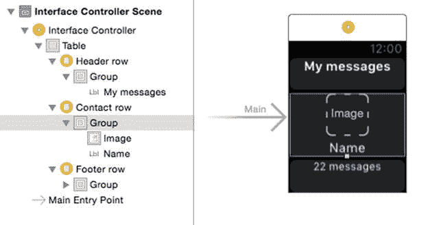

图 14-3. 每行内部的组

组中的控件以与普通 Storyboard 或 Xib 文件相同的方式连接到输出口。

## 创建一个基本表格

在本节中，你将逐步创建一个演示性的 WatchKit 表格。它不会是一个具有动态数据源的完整应用程序，因为这超出了创建表格界面的范围，但它将向你展示如何连接一个可以进一步扩展的表格。

假设你从头开始创建一个新项目，这涉及四个步骤：

- 创建一个新的 iPhone 项目，作为扩展的主机。
- 创建一个 WatchKit 应用作为新目标，用于创建将在手表上运行的应用以及将配置表格的扩展。
- 在 Storyboard 中布局表格。
- 创建用于在运行时填充表格的函数。

### 创建项目

首先，你需要一个新的 iPhone 项目。在 Xcode 中使用“文件”➤“新建”➤“项目”创建一个新项目，并选择“单视图应用程序”模板。给项目命名（我将其命名为 `WatchTable`），并将项目保存到合适的位置。

### 添加 WatchKit 目标

如上所述，WatchKit 应用包含三个组件：

- iPhone 应用，负责处理诸如与 API 通信等繁重任务。
- WatchKit 应用，在手表本身上运行。你将在此处通过 Storyboard 布局表格的视觉外观。
- WatchKit 扩展，在 iPhone 上运行，包含用于管理表格内容和交互的代码。

所有这三个组件都捆绑到应用中，如果在安装应用时存在配对的 Apple Watch，系统将询问用户是否要将 WatchKit 应用安装到手表上。

要开始为 iPhone 应用扩展手表功能，首先需要创建一个新目标来添加 WatchKit 应用和扩展。

从“文件”➤“新建”➤“目标”菜单中，选择 `WatchKit App` 模板，如图 14-4 所示。

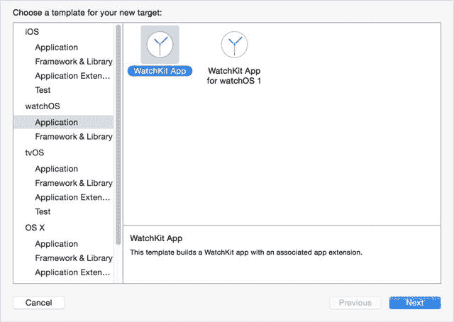

图 14-4. 添加 WatchKit 目标

然后系统会提示你设置新目标的选项。其中大部分是只读的，但你可以选择语言以及是否要向目标添加通知和快速查看场景。你不打算添加，所以更改选项以匹配图 14-5 所示的选项，然后选择“完成”。

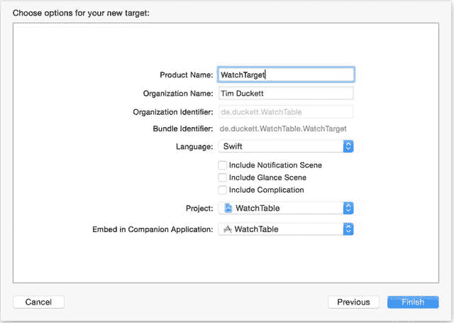

图 14-5. 设置目标选项

然后系统可能会提示你确认是否要激活 WatchTarget 应用的 Scheme，如图 14-6 所示。你需要激活，因此选择“激活”选项。

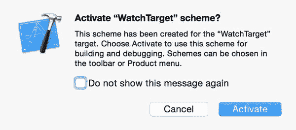

图 14-6. 激活 WatchTarget Scheme

你现在应该会看到，在导航器中有了两个新文件夹，并且在项目和目标列表中有了两个新目标，如图 14-7 所示。

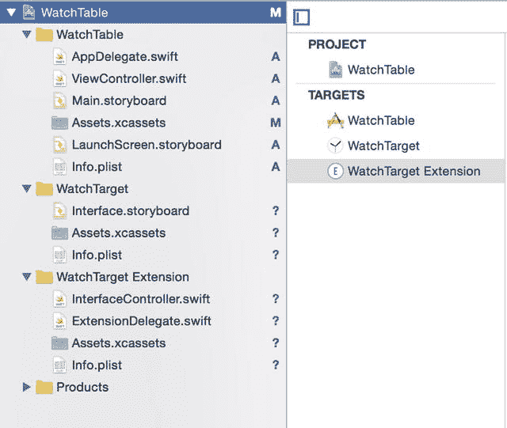

图 14-7. 新目标


### 构建表格界面

首先，你需要构建表格界面，因此选择位于`WatchTarget App`文件夹中的`Interface.storyboard`文件，使其显示在主面板中，如图 14-8 所示。

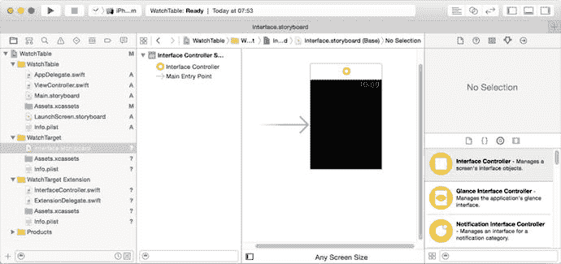

**图 14-8.** `Interface.storyboard`文件

为了验证一切是否正常运作，我们让应用启动时显示一条“Hello, world!”消息。

首先，在对象浏览器中选择一个`Label`对象，并将其拖放到手表界面上。然后调整其属性，使其看起来如图 14-9 所示。

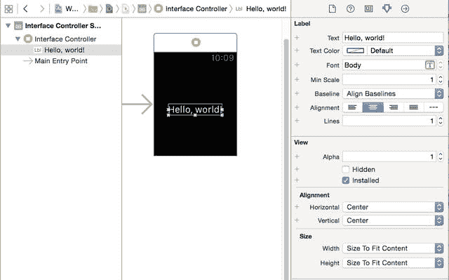

**图 14-9.** “Hello, world!”标签

你会注意到，其可用选项比`UILabel`要有限得多。Apple Watch 不支持自动布局，因此只有少数布局选项可用。

如果你现在从方案下拉菜单（如图 14-10 所示）中选择`WatchTarget`应用并运行它，iPhone 和 Watch 模拟器将会启动。


**图 14-10.** 选择`WatchTarget`以在 Apple Watch 模拟器中运行应用

你将看到如图 14-11 所示的结果。这验证了一切运行正常，并且 WatchKit 应用已正确安装。

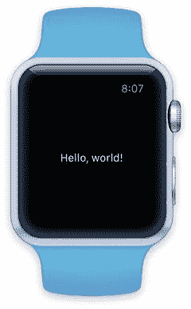

**图 14-11.** “Hello, world!”应用在 Apple Watch 上运行提示

默认的 Apple Watch 模拟器并不能很好地让你感受应用在真实设备上运行时的外观。为了获得更好的体验，我使用了一款名为 Bezel ([`infinitapps.com/bezel`](http://infinitapps.com/bezel)) 的应用，它会在一个模拟的表圈内显示模拟器的输出。你可以选择要使用的表圈类型，因此对于在配有链式表带的 18K 玫瑰金手表上进行测试来说，这绝对是最经济的选择。

确认 WatchKit 应用可以运行后，你就可以开始构建表格了。

### 创建表格

切换回 WatchKit 应用的`Interface.storyboard`，删除你之前创建的标签，然后从对象列表中拖入一个表格来替换它。它会在框架中自动调整大小，创建一个只有一行的表格（如图 14-12 所示）。

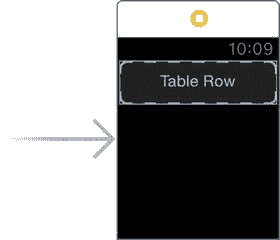

**图 14-12.** 放置在手表界面中的表格

除了包含实际数据的行之外，你还将为表格添加页眉和页脚行。每种类型的行（页眉、数据和页脚）都将拥有自己的行控制器，该控制器将是稍后您将创建的自定义类的实例。

设置该功能需要四个步骤：

-   增加表格中的行数，以确保每种显示的单元格类型都有一行。
-   通过添加控件，在 Storyboard 中为每种单元格类型创建布局。
-   为每种行类型创建一个包含输出口的自定义类，用于连接单元格中的控件，并且（如果需要）创建处理用户与这些控件交互的函数。
-   将每种行类型与其自定义类关联。

请记住，与`UITableView`不同，单元格的布局是在 Storyboard 中完成的。

#### 创建行

要创建新行，请在“界面控制器”场景中高亮表格，如果属性检查器尚未显示，则切换到该检查器，如图 14-13 所示。

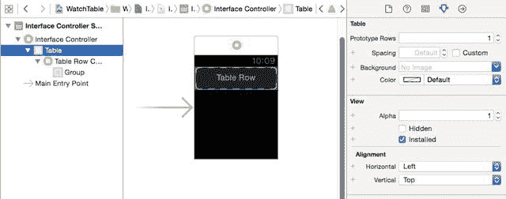

**图 14-13.** 设置表格中的行数

通过在属性检查器中更新字段来增加行数。这将在 Storyboard 中添加另一种行类型，并在对象层次结构中添加另一个“界面控制器”对象。

你的布局将需要三种行类型：一种用于页眉，一种用于数据行，一种用于页脚。将行数更新为 3，使得对象层次结构如图 14-14 所示。

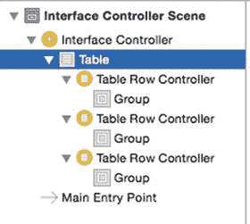

**图 14-14.** 三行

#### 布局行

三行就位后，你现在可以布局每一行中的控件了。图 14-15 显示了我的单元格外观；你可以根据需要自由调整布局（这是很好的练习！），但请确保联系人行中有一个`WKInterfaceImage`和一个`WKInterfaceLabel`，页脚中有一个`WKInterfaceLabel`。

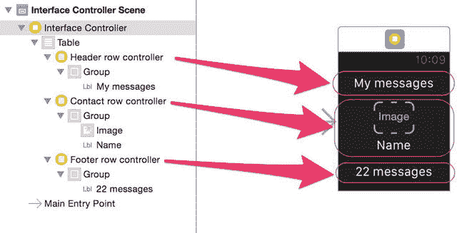

**图 14-15.** 布局界面提示

WatchKit UI 的限制可能使得界面布局变得棘手。为了实现联系人行的布局，请选择其`Group`，然后在属性检查器中将布局更改为`Vertical`。


### 创建行控制器类

布局好三行之后，现在可以创建用于处理每一行的行控制器类。WatchKit 表格中每种不同类型的行都需要一个自定义类作为其控制器；这些类是 `NSObject` 的子类，并添加到 WatchKit 扩展（而非 WatchKit 应用）中。行控制器类负责管理其行内控件的内容，因此它需要为每个动态控件提供一个输出口。如果控件响应用户交互（例如点击按钮控件），则行控制器类需要实现函数来处理这些交互。

最简单的行类型仅包含静态控件，并且不响应用户交互。这正符合你的标题行，因此你将首先创建它。在导航器窗格中选择 `WatchTarget Extension` 文件夹，然后通过 `文件` ➤ `新建` ➤ `文件` 添加一个新类。在模板列表中，选择 `Source` 组，然后选择 `Cocoa Touch Class`。点击 `下一步` 按钮，然后将类命名为 `HeaderRowController`。确保将子类设置为 `NSObject`，并检查你是否正在使用正确的语言创建该类。

点击 `下一步`，再次确认新类将创建在 WatchKit 扩展组和目标中（见图 14-16）。然后点击 `创建` 以添加新的类文件。

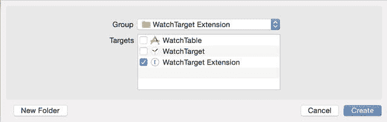

图 14-16. 为新类选择组和目标

对于标题行，你需要做的就这些了。它没有任何在运行时需要更新的项目，也不响应用户交互，因此该类可以保留为一个空的 `NSObject` 子类。

页脚行稍微复杂一些，因为它有一个动态更新的项目，因此接下来你将创建它。重复上述过程，创建一个名为 `FooterRowController` 的 `NSObject` 子类。这需要一个输出口，即一个名为 `footerLabel` 的 `WKInterfaceLabel` 类型的 `IBOutlet` 属性。将此项添加到类中，如列表 14-2 所示。

**列表 14-2.** `FooterRowController` 类

```
import UIKit
import WatchKit

class FooterRowController: NSObject {
    @IBOutlet var footerLabel: WKInterfaceLabel!
}
```

请注意，你需要导入 `WatchKit` 框架，以便能够为 `WKInterfaceLabel` 添加输出口。

最后，你可以添加 `ContactRowController` 类。该类有两个输出口（一个用于图像，一个用于标签）和一个交互函数，用于处理对单元格的点击。像之前一样添加一个新的 `NSObject` 子类，并按列表 14-3 所示进行更新。

**列表 14-3.** `ContactRowController` 类

```
import UIKit
import WatchKit

class ContactRowController: NSObject {
    @IBOutlet var nameLabel: WKInterfaceLabel!
    @IBOutlet var avatarImage: WKInterfaceImage!

    @IBAction func didTapDataRow(sender: WKInterfaceButton) {
    }
}
```

### 将类连接到行

创建了自定义类之后，是时候将它们链接到 Storyboard 中的控件了。切换回 `WatchTarget` 中的 Storyboard，展开控件树以便你能看到所有三行。然后选择标题行，如果“工具”面板中的“身份检查器”不可见，请将其打开。顶部部分允许你定义控制该行的自定义类（见图 14-17）。

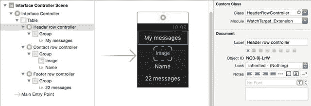

图 14-17. 将自定义类连接到行

将其更新为显示 `HeaderRowController`，然后选择“属性检查器”。在这里，你需要为行提供一个标识符，该标识符将在运行时填充行时使用（类似于 `UITableView` 使用的 `rowIdentifier` 属性）。这可以是任意字符串，但为了保持整洁，我的方法是使用自定义类的名称（在本例中为 `HeaderRowController`）。如图 14-18 所示。

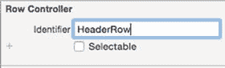

图 14-18. 行标识符

由于这一行只是一个文本标题，你不希望它被选中，因此取消选中 `Selectable` 复选框。现在对联系人行重复相同的过程；自定义类是 `ContactRowController`，标识符是 `ContactRow`。这一行将可被选中。最后，对页脚行完成此过程。该行的自定义类是 `FooterRowController`，标识符是 `FooterRow`。与标题行一样，这一行不应可被选中。

### 连接输出口

将行连接到其自定义类后，就可以连接控件了。这是通过通常的 Interface Builder 方式完成的：在对象树中按住 Ctrl 键点击行，会弹出一个 HUD 窗口，显示自定义类中定义的输出口，然后你可以通过点击并拖动到控件上来连接它们。

你需要为联系人行和页脚行完成此过程。标题行中没有定义输出口，因此没有需要连接的内容。完成后，联系人行的输出口将如图 14-19 所示。

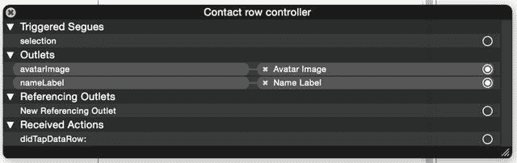

图 14-19. 联系人行的连接

页脚行应如图 14-20 所示。

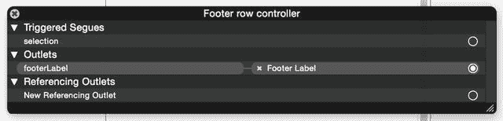

图 14-20. 页脚行的连接

在连接输出口的过程中，你还需要为表格本身添加一个输出口。在 `InterfaceController.swift` 文件中，为表格添加一个 `IBOutlet` 属性：

```
@IBOutlet var watchTable: WKInterfaceTable!
```

然后切换到 Storyboard 并将此输出口连接到表格，如图 14-21 所示。

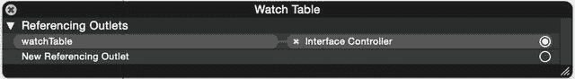

图 14-21. 连接表格


### 在代码中创建行

完成接口连接并设置好数据后，就可以开始编写代码，在运行时用单元格和数据填充表格了。

`WKInterfaceTable` 与 `UITableView` 的一个显著区别在于，它不与数据源协同工作。所有行都必须在配置表格时预先创建。

这意味着你必须先确定每种类型的行各有多少，告知表格这一信息，然后自行创建这些行。

如果你的表格仅由一种行类型组成，那么可以使用 `setNumberOfRows:withRowType:` 函数，告诉表格将显示多少行以及行的类型。下面是一个示例，可用于显示仅包含 `ContactRows` 的表格：

`self.watchTable.setNumberOfRows(self.dataArray.count, withRowType: "ContactRow")`

但在你的场景中，情况更为复杂。你有三种行类型，因此需要多做一些工作。

首先，你需要一些虚拟数据。在这个示例中，它是由四个`字符串`组成的`数组`，对应一些头像图片的名称——将清单 14-4 中的函数添加到`InterfaceController`的底部：

**清单 14-4.** `setupData()` 函数

```
func setupData() {
    dataArray.append("Bob")
    dataArray.append("Felix")
    dataArray.append("Jim")
    dataArray.append("Fred")
}
```

你可以在本章的代码中找到这四个示例图片，当然，你也可以自由添加自己的图片。

添加了一些虚拟数据后，现在可以将这些数据提供给表格了。将清单 14-5 中的代码添加到`InterfaceController`类的底部。

**清单 14-5.** `updateTable()` 函数

```
private func updateTable() {
    // 创建数组来保存行类型
    var rowsTypes = [String]()
    
    // 将标题行作为第 0 行添加
    rowsTypes.append("HeaderRow")
    
    // 为 dataArray 中的每个对象添加一个联系人行
    for _ in dataArray {
        rowsTypes.append("ContactRow")
    }
    
    // 将页脚行作为最后一行添加
    rowsTypes.append("FooterRow")
    
    // 配置表格，按照 rowsTypes 数组中的定义显示行
    watchTable.setRowTypes(rowsTypes)
    
    // 获取每个联系人行并从 dataArray 中设置内容
    // 从第 1 行开始，因为第 0 行是标题行
    for index in 0..< dataArray.count {
        var contactRow = watchTable.rowControllerAtIndex(index+1) as! ContactRowController
        var rowContent = dataArray[index]
        contactRow.nameLabel!.setText(rowContent)
        if let image = UIImage(named: rowContent) {
            contactRow.avatarImage.setImage(image)
        }
    }
    
    // 获取最后一行，并将其配置为页脚
    let contactCount = dataArray.count
    let footerRow = watchTable.rowControllerAtIndex(contactCount + 1) as! FooterRowController
    footerRow.footerLabel.setText("\(contactCount) messages")
}
```

逐行分析这段代码，你将会拥有三种不同类型的行，因此不能使用一次性函数 `setNumberOfCells:withRowType`。取而代之的是，你需要创建一个单元格类型的数组：首先是标题单元格，然后是数据数组中元素数量相同的联系人行，最后是页脚单元格。这个数组用于告知表格它需要显示哪些行类型。

当调用 `setRowTypes` 函数时，会根据行类型数组中提供的标识符创建相应的行类型。如果行中有需要动态更新的输出口，你需要负责逐个迭代每一行并进行必要的修改。

可以通过向表格请求（使用 `rowControllerAtIndex` 函数）并强制转换类型（如有必要）来访问每一行。一旦获取到单元格的引用，就可以用模型中的相应数据来更新它。

对于联系人行，数据来自 `dataArray` 中的相关元素。对于页脚行，则基于 `dataArray` 中元素的总数进行计算。

### 收尾工作

为了完成整个过程，你需要在接口加载时调用这两个新函数。更新 `awakeWithContext(:_)` 函数，使其与清单 14-6 匹配——该函数在接口加载时被调用，相当于 `UIViewController` 中的 `viewDidLoad` 函数。

**清单 14-6.** 更新后的 `awakeWithContext()` 函数

```
override func awakeWithContext(context: AnyObject?) {
    super.awakeWithContext(context)
    // 在此处配置接口对象。
    setupData()
    updateTable()
}
```

如果你在模拟器中运行该应用，会看到表格被加载并填充了数据，如图 14-22 所示。

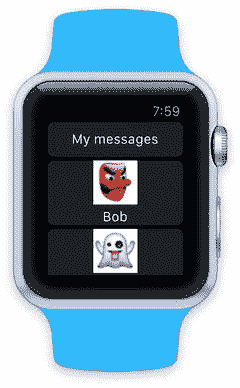

**图 14-22.** 应用在 Apple Watch 模拟器中运行

### 添加交互性

与 `UITableView` 类似，WatchKit 表格中的行可以对用户交互做出响应。在当前版本的 WatchKit SDK 中，交互仅限于简单点击，但未来可能会有所改变。

与 `UITableView` 不同，`WKInterfaceTable` 没有代理对象。相反，如果行已启用选择功能，那么表格会调用接口控制器的 `table:didSelectRowAtIndex:` 函数（如果已实现该函数的话）。

清单 14-7 展示了一个函数的示例，该函数记录被选中行的索引，然后更改该行文本的颜色。

**清单 14-7.** 在 WatchKit 表格中使用 Swift 处理选择

```
override func table(table: WKInterfaceTable, didSelectRowAtIndex rowIndex: Int) {
    print("Row \(rowIndex) selected")
    for index in 0..< dataArray.count {
        let contactRow: ContactRowController = self.watchTable.rowControllerAtIndex(index+1) as! ContactRowController
        contactRow.nameLabel!.setTextColor(UIColor.whiteColor())
    }
    let selectedRow: ContactRowController = self.watchTable.rowControllerAtIndex(rowIndex) as! ContactRowController
    selectedRow.nameLabel.setTextColor(UIColor.redColor())
}
```

**注意**

接口控制器代码在 iPhone 上执行，对接口的更新通过蓝牙传递到 Apple Watch。这可能会导致点击和接口更新之间出现明显的延迟。


## 使用 WatchKit 表格进行导航

`UITableViews` 通常被用作“深入”数据层级结构的导航机制。`WKInterfaceTable` 同样可以用于此目的，尽管是在更小的界面限制下。

在 WatchKit 中，有两种在屏幕内容间导航的方式：基于页面的方式（适用于独立屏幕间的切换）；以及层级方式（新屏幕推入视图，并附带一个用于在“树”结构中向后导航的屏幕控件）。

虽然你可以在基于层级的应用中使用其他控件来控制屏幕间的切换，但使用 `WKInterfaceTable` 来实现是一种非常常见的界面模式。

屏幕间的转场过渡可以通过在 Interface Builder 中设置的 Segue 实现，也可以通过调用 `pushControllerWithName:context:` 函数来触发，该函数可在 `didSelectRowAtIndex:` 函数中调用，以响应某行的点击。

要在屏幕间传递信息（例如显示在所选行中的对象），以便详情界面能显示其相关数据，你需要在两个控制器之间传递一个 `context` 对象。在你的场景中，这个对象就是 `dataArray` 中与所选行索引对应的那个对象。

扩展上一节中的示例应用以添加层级导航并不困难。它只需要三个步骤：

- 添加一个新的界面控制器类来管理新屏幕。
- 在 Storyboard 中添加一个新的界面控制器，并布置好控件。
- 实现导航，可以通过添加一个 push 类型的 Segue，或者扩展 `didSelectRowAtIndex:` 函数，使其在选择某行时推送新屏幕。

### 添加新的界面控制器

第一步是添加一个充当界面控制器的新类。为此，请添加一个新文件（文件 ➤ 新建 ➤ 文件），然后选择 Cocoa Touch 模板。创建一个 `WKInterfaceController` 的子类，并将其命名为 `DetailInterfaceController`，如图 14-23 所示。

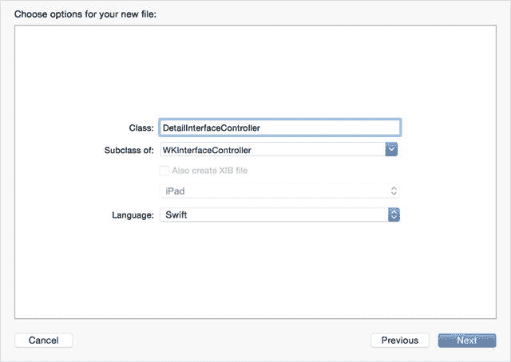

图 14-23. 创建 `DetailInterfaceController`

确保新文件创建在 WatchTarget Extension 中，而不是主应用或 WatchTable 应用中。

### 在 Storyboard 中添加新屏幕

要在现有的 Storyboard 中添加新屏幕，请从对象浏览器中选择“Interface Controller”，并将其拖拽到 Storyboard 中，如图 14-24 所示。

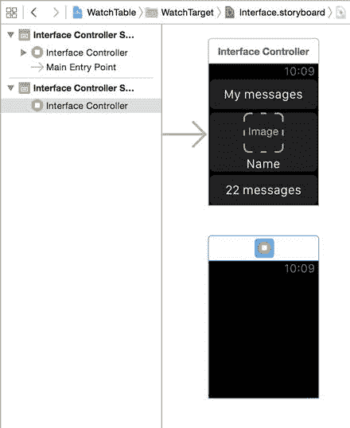

图 14-24. 添加界面控制器

在 Storyboard 中选中新添加的界面控制器后，打开身份检查器（Identity Inspector）并更新类名。如果你已经创建了 `DetailInterfaceController` 类，则输入几个字符后，类字段将自动填充，如图 14-25 所示。

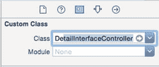

图 14-25. 在 Storyboard 中更新新界面控制器的类

### 实现导航

在两个控制器之间实现 push 导航有两种方式：

- 在 Interface Builder 中添加一个 push Segue
- 在界面控制器类中扩展 `didSelectRowAtIndex:` 函数

这两种方法在最终效果上完全相同，但实现方式不同。

#### 添加 Push Segue

添加一个 push Segue 分为两个步骤：

- 添加 Segue 本身
- 可选地，实现 `contextForSegueWithIdentifier:inTable:rowIndex:` 函数，以便将数据对象传递到下一个屏幕。在大多数情况下，你需要这样做来传递要在下一个屏幕上显示的对象。

> **提示：** 如果你使用 push Segue 设置导航，则 `didSelectRowAtIndex` 函数将不会被调用；你需要改用 `prepareForSegue` 函数。

添加 Segue 本身非常简单。在 Storyboard 中，选择将触发导航的行，然后按住 Ctrl 键并向下拖拽到“详情界面”场景，如图 14-26 所示。

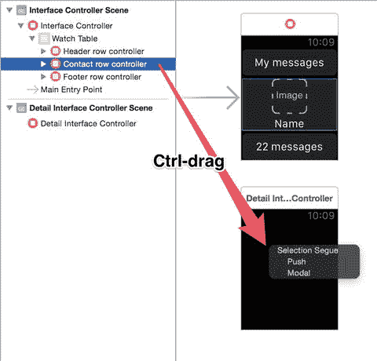

图 14-26. 添加 Segue

释放鼠标按钮时，将弹出“选择 Segue”HUD：从 HUD 中选择 `Push` 选项，Segue 将被添加，如图 14-27 所示。

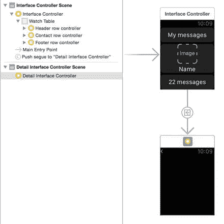

图 14-27. 添加的 Segue

最后，你需要为 Segue 添加一个标识符，以便在 `contextForSegueWithIdentifier` 函数中识别它。在 Interface Builder 中高亮选中该 Segue，切换到属性检查器（Attributes Inspector），并在字段中添加 Segue 标识字符串，如图 14-28 所示。

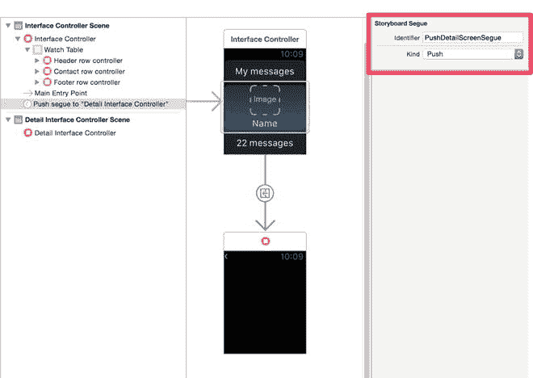

图 14-28. 在字段中添加 Segue 标识字符串

如果你现在运行应用，将看到当点击某行时，详情屏幕会被推入；而点击屏幕左上角的返回箭头（如图 14-29 所示）则会返回。

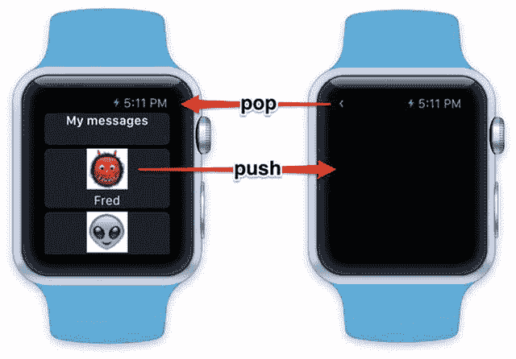

图 14-29. 屏幕之间的推入和弹出

现在，将 `contextForSegueWithIdentifier:table:rowIndex:` 函数添加到 `InterfaceController` 类中。该函数如代码清单 14-8 所示。

代码清单 14-8. `contextForSegueWithIdentifier:table:rowIndex:` 函数

``` 
override func contextForSegueWithIdentifier(segueIdentifier: String,
    inTable table: WKInterfaceTable, rowIndex: Int) -> AnyObject? {
    if segueIdentifier == "PushDetailScreenSegue" {
        return dataArray[rowIndex - 1]
    }
    return nil
}
```

这将会从数据数组中返回与所选行索引对应的名字，并将其作为上下文传递给 `DetailInterfaceController`。请注意，这里从传入函数的 `rowIndex` 中减去了 1，以补偿表格的第一行实际上是标题行的事实。

上下文可以是任何将被详情界面控制器使用的对象，因此其类型为 `AnyObject`。

在这里，你正在创建一个包含所选行人员姓名的字典。现在让我们更新控制器来使用它。

在 `DetailInterfaceController` 类中，为一个名为 `nameLabel` 的 `WKInterfaceLabel` 添加一个输出口：

``` 
@IBOutlet var nameLabel: WKInterfaceLabel!
```

然后切换回 Interface Builder，并向 `DetailInterfaceController` 添加一个 `WKInterfaceLabel` 对象，如图 14-30 所示。

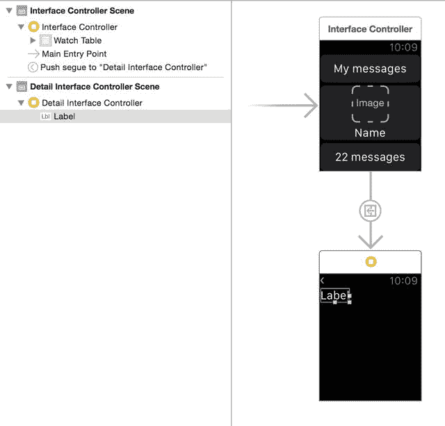

图 14-30. 标签

将标签的 `Lines` 属性设置为 `0`，以便它能自动换行显示内容。最后，通过在 Interface Builder 中拖放来将输出口连接到该控件。

连接好控件后，你就可以更新 `DetailInterfaceController` 类，使其使用将从 `InterfaceController` 传递过来的上下文对象。


当加载详情界面时，它会调用`awakeWithContext:`函数。`context`对象作为参数传入，因此你可以在这里使用先前创建的字典内容。

列表 14-9 展示了`awakeWithContext:`函数。

列表 14-9. `awakeWithContext`函数

```
override func awakeWithContext(context: AnyObject?) {
    super.awakeWithContext(context)
    if let selectedName = context as? String {
        nameLabel.setText("You selected the row for \(selectedName)")
    }
}
```

如果现在运行应用程序并点击某行，你会看到详情界面被推入，并更新为你点击的行中人员的姓名，如图 14-31 所示。

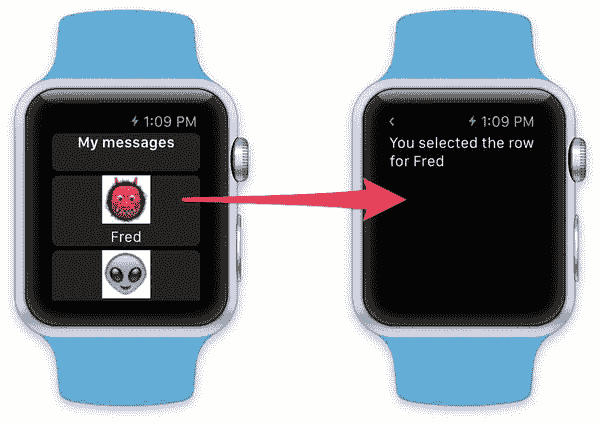

图 14-31. 详情视图

这是一个非常简化的实现，但`context`对象允许你在控制器之间传递信息，以构建逐层深入的导航体验。

#### 在代码中添加导航

在上一节中，你了解了如何使用 Storyboard 和 segue 实现导航流程。你也可以通过代码实现相同的结果。

与其用 segue 连接两个 Storyboard 场景，你可以依赖`didSelectRowAtIndex`函数，并使用`pushControllerWithName:context:`函数触发详情控制器的推送。

列表 14-10 展示了更新后的`didSelectRowAtIndex:`函数。

列表 14-10. 在代码中推送详情控制器

```
override func table(table: WKInterfaceTable, didSelectRowAtIndex rowIndex: Int) {
    for index in 0..<dataArray.count {
        var contactRow: ContactRowController = 
            watchTable.rowControllerAtIndex(index+1) as! ContactRowController
        contactRow.nameLabel!.setTextColor(UIColor.whiteColor())
    }
    let selectedRow: ContactRowController = 
        watchTable.rowControllerAtIndex(rowIndex) as! ContactRowController
    selectedRow.nameLabel.setTextColor(UIColor.redColor())
    let contextDictionary = ["selectedName" : dataArray[rowIndex - 1]]
    self.pushControllerWithName("DetailInterface", context: contextDictionary)
}
```

这里你使用了`pushControllerWithName:context:`函数来执行导航。它依赖于在属性检查器中设置了`identifier`的详情控制器。图 14-32 展示了`DetailInterface`场景的该设置。

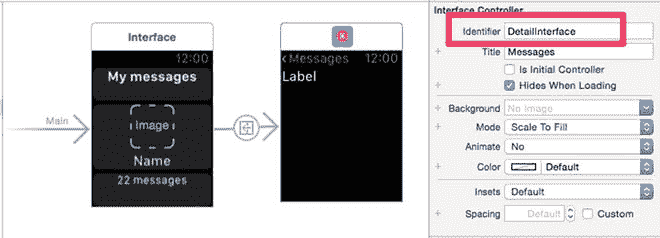

图 14-32. 设置界面控制器的标识符

## 总结

在本章中，你学习了如何创建、配置和使用 WatchKit 中的表格控件。

WatchKit 专为小型、低功耗的 Apple Watch 设计，因此`WKInterfaceTable`控件远不如`UITableView`强大，但它仍然可以用于呈现基于表格的信息并充当导航界面。

