# 15. 集合视图流布局

在本章中，你将学习`UICollectionView`家族中最有用的组件之一——流布局。流布局允许你以极少的努力构建包含行或列项目的集合视图，同时还提供对各种属性的精细控制，以便微调其外观。

本章的示例应用程序代码实现了一个基于流的布局，以展示其众多功能，并提供一个可为你自己的目的进行修改的模板。

## 关于流布局

由行或列项目组成的布局是一种非常常见的用户界面设计。它是从图库到书架等各种应用程序的基本元素。图 15-1 到图 15-3 展示了一些示例。

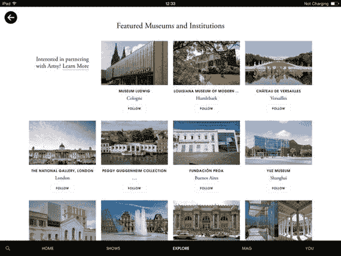

图 15-3. Artsy 应用程序中高度定制的流布局

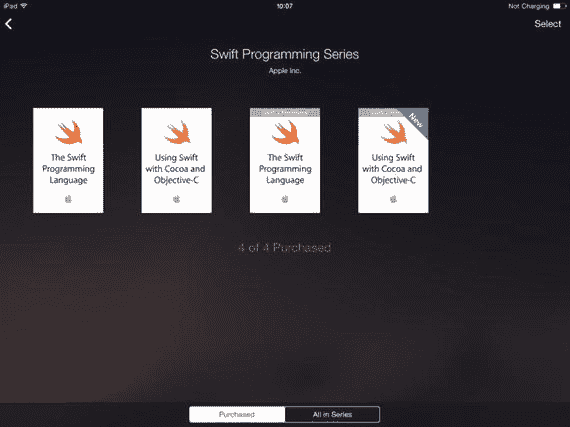

图 15-2. iBooks 中运行的简单流布局


图 15-1. iPhone 6 上运行的流布局

尽管网格式布局在视觉上看起来很简单，但当你考虑涉及间距计算或每行何处换行等方面的计算时，事情会迅速变得复杂。

幸运的是，Apple 认识到了这一点，并为`UICollectionView`附带了一个"现成"的布局，使得创建基于行的界面变得非常容易。`UICollectionViewFlowLayout`可用于以极少的配置快速创建网格布局，同时它允许一定程度的自定义，使你能够用最少的代码创建非常复杂的界面。

## 流布局的特性

你可以将流布局想象成一个句子，其中单词从一侧到另一侧排列成行，当行到达页面边缘时，该行"换行"到下一行。

在 iOS 术语中，页面对应于集合视图的边界，单词类似于集合视图的项目。每行单词对应于一个集合视图行。参见图 15-4。


图 15-4. 流布局如何运作

这个类比可以进一步延伸：流布局可以分成带有页眉和页脚的区块，就像页面可以分成带有标题的段落。正如单个单词有不同的长度，流布局也可以显示不同大小（水平和垂直方向）的项目。

## UICollectionViewFlowLayout

`UICollectionViewFlowLayout`是`UICollectionViewLayout`的一个具体子类，它添加了许多属性来控制项目的流动。它处理了涉及项目和行间距以及换行的大部分计算。

你可以控制的属性如下：

- 滚动方向（相对于集合视图的垂直或水平方向）
- 行间距和项目间距
- 项目大小
- 页眉和页脚大小
- 区块边距

一旦你提供了这些值，流布局就会处理所有涉及如何定位和间隔项目、以及何时换行以将所有项目整齐地放入可用空间的计算。

`UICollectionViewFlowLayout`的大小和间距属性全局应用于所有项目、页眉、页脚和区块，如果集合视图的项目大小恒定，这将非常有用。如果你需要显示不同大小的项目，则需要实现一个符合`UICollectionViewDelegateFlowLayout`协议的可选委托对象。

流布局的委托对象提供了对项目大小、区块间距以及页眉和页脚大小的精细控制。如果你的项目大小会变化，例如在构建一个显示不同高度或宽度缩略图图像的图库时，这将非常有用。

委托协议的所有函数都是可选的，因此除非你需要控制相关属性，否则无需实现它们。


## 创建与配置流式布局

你可以通过代码或 Interface Builder 创建 `UICollectionViewFlowLayout`。无论采用哪种方式，都需遵循以下六个步骤。

-   创建 `UICollectionViewFlowLayout` 实例。
-   将流式布局分配给将要使用它的集合视图。
-   如果所有单元格尺寸相同，需提供单元格的高度和宽度值。若布局包含不同尺寸，则需实现集合视图代理的 `collectionView(_:layout:sizeForItemAtIndexPath:)` 方法。
-   如有必要，设置项目和行间距的值（若间距会变化，则需实现代理方法）。
-   可选地，指定分区页眉和页脚的尺寸（同样，若尺寸会变化，需实现代理方法）。
-   设置布局的滚动方向（相对于集合视图本身，垂直或水平滚动）。

### 实例化流式布局

实例化流式布局有两种方式：

-   通过代码创建并配置流式布局。
-   在 Interface Builder 中配置流式布局。

### 通过代码创建与配置流式布局

通过代码创建流式布局包含两个基本步骤：

-   实例化流式布局对象
-   将其设置为集合视图的布局

流式布局创建并关联到集合视图后，你有两个选择：

-   若集合视图生命周期内所有可配置值均为静态，则直接设置流式布局的属性，或
-   实现相关的 `UICollectionViewDelegateFlowLayout` 方法来动态配置流式布局属性。

#### 创建流式布局

创建流式布局对象并不困难。若属性值为静态，则无需为其创建属性：

```
let flowLayout = UICollectionViewFlowLayout()
```

若属性值由 `UICollectionViewDelegateFlowLayout` 方法设置，则需在实例化前声明一个属性，以便代理方法能够引用该对象：

```
let flowLayout = UICollectionViewFlowLayout()
```

#### 设置集合视图的布局

实例化流式布局后，下一步是将其设置为集合视图的布局。假设你有一个名为 `myCollectionView` 的集合视图和一个名为 `flowLayout` 的流式布局，可以这样操作：

```
myCollectionView.collectionViewLayout = flowLayout
```

虽然运行时可以更改集合视图的布局，但这会导致项目重新加载。

#### 配置静态流式布局值

如果集合视图中的所有项目大小相同，可以全局设置流式布局属性。例如：

```
flowLayout.scrollDirection = .Vertical
flowLayout.itemSize = CGSizeMake(200, 100)
flowLayout.minimumInteritemSpacing = 10.0
flowLayout.minimumLineSpacing = 10.0
flowLayout.sectionInset = UIEdgeInsetsMake(25.0, 25.0, 25.0, 25.0)
```

以下部分将详细介绍你可以控制的各种流式布局属性。

#### 动态配置流式布局值

如果项目、页眉或页脚等元素需要根据数据模型动态更新，则不能直接设置与动态项目属性相关的值。相反，你需要创建一个对象作为流式布局的代理，并实现相关的 `UICollectionViewDelegateFlowLayout` 方法。这将在下一节详细讨论。

### 在 Interface Builder 中配置流式布局

当你将集合视图或集合视图控制器拖入 Storyboard 或 XIB 时，它会附带一个 `UICollectionViewFlowLayout`，如图 15-5 所示。

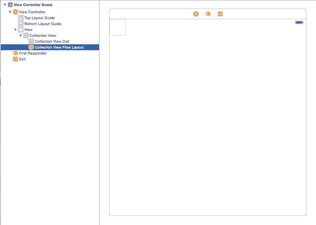

图 15-5. 附加到集合视图的流式布局

选中该布局后，可以静态地为集合视图中的所有项目设置以下基本属性：

-   滚动方向，可在属性检查器中找到，如图 15-6 所示。

  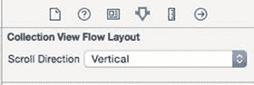

  图 15-6. 设置滚动方向

-   单元格大小与间距，以及页眉和页脚尺寸。这些可在尺寸检查器中找到，如图 15-7 所示。

  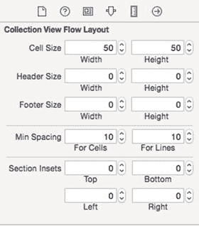

  图 15-7. 设置尺寸

如果需要动态设置这些值，则需将流式布局连接到控制器中的输出口，并通过代码管理这些值。

为此，首先为流式布局创建一个输出口：

```
@IBOutlet var flowLayout: UICollectionViewFlowLayout!
```

然后在 Interface Builder 中将该输出口与流式布局对象连接。

连接后，便可在控制器中设置数值，例如：

```
flowLayout.itemSize = CGSizeMake(100, 100)
flowLayout.scrollDirection = .Vertical
```

## 自定义流式布局

尽管 `UICollectionViewFlowLayout` 承担了确定换行位置等繁重工作，但在基于行的布局约束内，它仍然允许高度自定义。

可定制的 `UICollectionViewFlowLayout` 属性如图 15-8 所示。

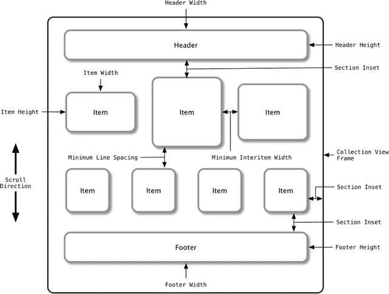

图 15-8. UICollectionViewFlowLayout 属性

这些属性可通过直接设置 `UICollectionViewFlowLayout` 对象的属性，或实现相应的 `UICollectionViewDelegateFlowLayout` 方法来自定义。

### 通过属性自定义

以下属性可通过直接设置 `UICollectionViewFlowLayout` 对象的属性来自定义，例如：

```
collectionView.scrollingDirection = .Vertical
```

#### 滚动方向

滚动方向决定了集合视图是垂直滚动还是水平滚动。项目行垂直排列于滚动方向，如图 15-9 所示。

| 属性 | 值 | 效果 |
| --- | --- | --- |
| `scrollDirection` | `UICollectionViewScrollDirection.Vertical` | 强制集合视图垂直滚动，并水平排列项目行 |
| | `UICollectionViewScrollDirection.Horizontal` | 强制集合视图水平滚动，并垂直排列项目行 |

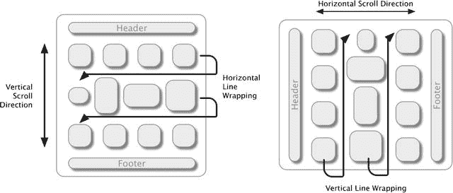

图 15-9. 滚动方向

#### 项目尺寸

项目尺寸决定了每个集合视图单元格的宽度和高度，无论单元格内容的固有尺寸如何。若未设置，默认为 `(50.0, 50.0)`。

如果实现了 `UICollectionViewDelegateFlowLayout collectionView:layout:sizeForItemAtIndexPath:` 方法，该方法将覆盖直接在流式布局对象上设置的任何项目尺寸值。

| 属性 | 值 | 效果 |
| --- | --- | --- |
| `itemSize` | `CGSize` | 设置每个集合视图项目的尺寸和宽度 |


##### `EstimatedItemSize`

If you implement per-item sizing, this adds additional processing load to the `UICollectionViewDataSource` object. It is now responsible for calculating the size of each item on demand.

Although this may not sound like a big deal for the fast processors in iOS devices, keep in mind that for good scrolling performance, you need to render views as close to 60 frames per second as possible.

This means that all calculations required to draw the visible elements of the collection view must be completed within approximately 15 milliseconds. This includes everything from retrieving data from the model, setting up cell controls, to calculating the size and position of all elements on the screen.

To make things trickier, this calculation process also involves figuring out the total height of the collection view's content area, which means calculating the size of every single cell in the entire collection view, not just the visible area. Therefore, anything that helps the collection view speed up this process will improve performance.

One approach is to provide an estimated item size (`estimatedItemSize`), which is a hint about the likely size of the items. If an estimated item size is set, the collection view will assume that all currently invisible cells use this size and will not bother calculating their sizes individually. This has a significant impact on the collection view's performance.

| 属性 | 值 | 效果 |
| --- | --- | --- |
| `estimatedItemSize` | `CGSize` | 设置预估的项目尺寸，该尺寸将用于涉及当前不可见单元格的计算中 |

##### `ItemSpacing`

When laying out the items of a collection view, the flow layout uses the width of the collection view bounds and the width of the collection view items to calculate the spacing between each item.

The `minimumInteritemSpacing` property sets the lower limit for the spacing between items. If it means the spacing between each item would be less than this value, the collection view will not fit an additional item on a single line. If undefined, this value defaults to `10.0` points (see Figure 15-10).

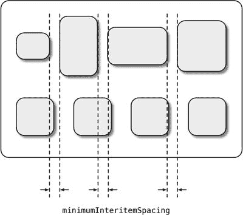

*Figure 15-10. Minimum interitem spacing*

This spacing is applied perpendicular to the scrolling direction of the collection view. In other words, if the collection view scrolls vertically, the minimum interitem spacing property controls the horizontal space between items; conversely, for a horizontally scrolling collection view, it controls the vertical space.

If the `UICollectionViewDelegateFlowLayout collectionView:layout:minimumInteritemSpacingForSectionAtIndex:` function is implemented, it will override any interitem spacing value set directly on the flow layout object.

| 属性 | 值 | 效果 |
| --- | --- | --- |
| `minimumInteritemSpacing` | `CGFloat` | 设置节中每个项目之间允许的最小间距。 |

##### `LineSpacing`

The flow layout uses its `lineSpacing` property to control the minimum amount of space between the bottom of the previous row and the top of the next row.

The actual value will depend on the height of the tallest item in the row, but is guaranteed not to be less than the value you set for this property (see Figure 15-11).

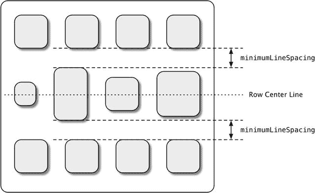

*Figure 15-11. Minimum line spacing*

Note that the default behavior of `UICollectionViewFlowLayout` is to vertically center all items in a row; if you want to change this behavior, you need to create a subclass of `UICollectionViewFlowLayout` and override it.

If the scroll direction of the collection view is vertical, this property controls the vertical spacing between rows. If the scroll direction is horizontal, this property controls the horizontal spacing.

Note that this does not affect the spacing between the bottom of the section and the top of the first row, nor between the bottom of the last row and the top of the footer. These values are controlled by the `sectionInset` property.

| 属性 | 值 | 效果 |
| --- | --- | --- |
| `minimumLineSpacing` | `CGFloat` | 设置节中每行之间允许的最小间距。 |

##### `SectionInsets`

Section insets control the amount of horizontal space between the collection view frame and the items, as shown in Figure 15-12.

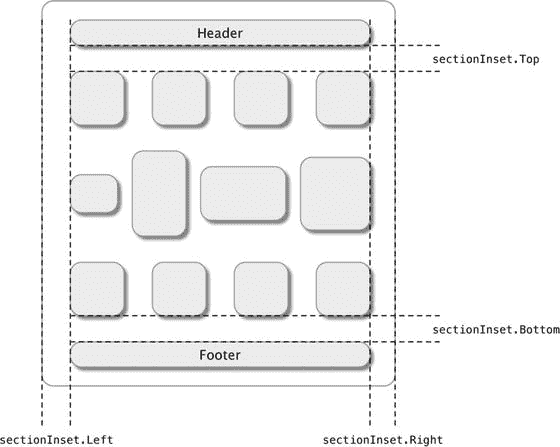

*Figure 15-12. Section insets*

It also controls the spacing between the header and footer views (if present) and the items, as well as the spacing between the bottom of the header view and the top of the first row, and between the bottom of the last row and the top of the footer view.

| 属性 | 值 | 效果 |
| --- | --- | --- |
| `sectionInset` | `UIEdgeInset` | 设置项目与集合视图框架之间，以及页眉/页脚与行之间的间距。 |

##### `SupplementaryViewSizes`

Two supplementary view size properties control the size of the header and footer views in a section. Setting these values fixes the header and footer size for all sections; if headers and footers need to vary in size per section, you must implement the `collectionView:layout:referenceSizeForHeaderInSection:` function.

An important note is that the collection view only applies the property corresponding to the scroll direction, as shown in Figure 15-13.

| 属性 | 值 | 效果 |
| --- | --- | --- |
| `headerReferenceSize` | `CGSize` | 设置页眉视图的尺寸；垂直于滚动方向的属性被忽略。 |
| `footerReferenceSize` | `CGSize` | 设置页脚视图的尺寸；垂直于滚动方向的属性被忽略。 |

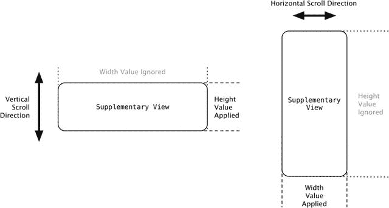

*Figure 15-13. Applying supplementary view size properties based on scroll direction*

### Customizing with `UICollectionViewDelegateFlowLayout`

Setting properties directly on `UICollectionViewFlowLayout` has a "global" effect. For example, if you set the item size to 100 points wide and 200 points high, all cells will be displayed at this size.

The same process applies to section insets, line spacing, headers, and footers. Setting these values globally at the flow layout level means all sections will use the same values.

If you want variation in these values (per item for the cell, per section for other properties), you can provide a delegate object to `UICollectionViewFlowLayout` to handle these calculations. `UICollectionViewDelegateFlowLayout` is a protocol that defines optional functions for calculating these values on demand.

`UICollectionViewDelegateFlowLayout` declares six optional functions, each of which includes `UICollectionView` and `UICollectionViewFlowLayout` parameters. This means you can implement a single delegate object that works with multiple collection views and/or flow layouts.

#### Controlling Item Size

The item size is controlled by the `collectionView(_:layout:sizeForItemAtIndexPath:)` function.


## 4.1.1 参数

集合视图、布局对象和索引路径共需三个参数。

| 参数 | 类型 | 用途 |
| --- | --- | --- |
| `collectionView` | `UICollectionView` | 对委托正在处理的集合视图的引用。这使得单个委托对象能够支持多个集合视图。 |
| `Layout` | `UICollectionViewFlowLayout` | 对委托正在处理的集合视图流布局的引用。这使得单个委托对象能够支持多个流布局。 |
| `indexPath` | `NSIndexPath` | 标识应为其执行计算的分区和项目。 |

### 4.1.2 返回值

它返回项目大小：

| 返回值 | 类型 | 用途 |
| --- | --- | --- |
| `Item size` | `CGSize` | 在指定索引路径处的项目的计算大小 |

### 4.1.3 示例

清单 15-1 展示了 `collectionView(_:layout:sizeForItemAtIndexPath:)` 函数的示例实现。

**清单 15-1.** 一个 `sizeForItemAtIndexPath:` 函数的示例

```
func collectionView(collectionView: UICollectionView, layout
  collectionViewLayout: UICollectionViewLayout, sizeForItemAtIndexPath
  indexPath: NSIndexPath) -> CGSize {
        // 获取此花色的字典
        let suitDictionary = suitsArray[indexPath.section]
        // 获取此花色中的牌数组
        let cardsArray = suitDictionary["cards"]
        // 获取此牌的字典
        let cardDictionary: NSDictionary = cardsArray[indexPath.row] as! Dictionary
        // 获取牌图片的名称
        let cardImageName = cardDictionary["cardImage"] as! String
        // 加载此牌的图片
        let cardImage: UIImage? = UIImage(named: cardImageName)
        if let unwrappedCardImage = cardImage {
            // 如果图片加载成功，返回其大小
            return unwrappedCardImage.size
        }
        // 查找图片时出现问题，因此返回零大小
        return CGSizeZero
    }
```

### 管理分区间距

`UICollectionViewDelegateFlowLayout` 协议定义了三个用于控制分区间距的可选函数：

#### `collectionView(_:layout:insetForSectionAtIndex:)`

此函数接收集合视图、流布局以及应为其计算间距分区索引的参数。

| 参数 | 类型 | 用途 |
| --- | --- | --- |
| `collectionView` | `UICollectionView` | 对委托正在处理的集合视图的引用。这使得单个委托对象能够支持多个集合视图。 |
| `Layout` | `UICollectionViewFlowLayout` | 对委托正在处理的集合视图流布局的引用。这使得单个委托对象能够支持多个流布局。 |
| `Index` | `Int` | 标识应为其执行计算的分区。 |

它返回一个 `UIEdgeInsets` 结构体：

| 返回值 | 类型 | 用途 |
| --- | --- | --- |
| `Insets` | `UIEdgeInsets` | 用于上、左、下和左间距的 `CGFloat` 值。正值使项目相对于集合视图的框架内缩；负值使项目外扩。 |

#### `collectionView(_:layout:minimumLineSpacingForSectionAtIndex:)`

此函数接收集合视图、流布局以及应为其计算最小行间距的分区索引的参数。

| 参数 | 类型 | 用途 |
| --- | --- | --- |
| `collectionView` | `UICollectionView` | 对委托正在处理的集合视图的引用。这使得单个委托对象能够支持多个集合视图。 |
| `Layout` | `UICollectionViewFlowLayout` | 对委托正在处理的集合视图流布局的引用。这使得单个委托对象能够支持多个流布局。 |
| `Index` | `Int` | 标识应为其执行计算的分区。 |

它返回一个 `CGFloat`：

| 返回值 | 类型 | 用途 |
| --- | --- | --- |
| `Minimum line spacing` | `CGFloat` | 行间项目最小间距的 `CGFloat` 值。项目的间距永远不会小于此值，但根据其垂直（或水平）对齐方式，它们之间的距离可能更大。 |

#### `collectionView(_:layout:minimumInteritemSpacingForSectionAtIndex:)`

此函数接收集合视图、流布局以及应为其计算最小项目间距的分区索引的参数。

| 参数 | 类型 | 用途 |
| --- | --- | --- |
| `collectionView` | `UICollectionView` | 对委托正在处理的集合视图的引用。这使得单个委托对象能够支持多个集合视图。 |
| `layout` | `UICollectionViewFlowLayout` | 对委托正在处理的集合视图流布局的引用。这使得单个委托对象能够支持多个流布局。 |
| `index` | `Int` | 标识应为其执行计算的分区。 |

它返回一个 `CGFloat`：

| 返回值 | 类型 | 用途 |
| --- | --- | --- |
| `Minimum interitem spacing` | `CGFloat` | 行内项目间最小间距的 `CGFloat` 值。项目的间距永远不会小于此值，但根据其垂直（或水平）对齐方式，它们之间的距离可能更大。 |

### 管理页眉和页脚大小

`UICollectionViewDelegateFlowLayout` 协议定义了用于控制页眉和页脚大小的两个可选函数。

## 子类化 `UICollectionViewFlowLayout`

与 `UICollectionViewDelegateFlowLayout` 委托结合使用时，您可以对基于行的集合视图进行精细控制，而无需处理计算行布局所涉及的大量工作。

不过，有时您需要能够进一步自定义布局。在这些情况下，您仍然可以受益于流布局的后台计算，但通过创建 `UICollectionViewFlowLayout` 的自定义子类来实现进一步的自定义。

您可能想要这样做的几种场景：

- 您想要控制项目的布局属性。
- 您想要向项目添加自定义布局属性。
- 您想要添加新的补充视图和/或装饰视图。
- 您想要对项目插入或删除动画有更大的控制权。

子类化 `UICollectionViewFlowLayout` 的过程与创建自定义布局完全相同；这在第 16 章中有详细说明。

### 控制项目布局属性

控制布局属性允许您更新项目的 frame、bounds、position、transform、z-index 和 alpha 属性值。

您需要实现流布局的 `layoutAttributesForElementsInRect:` 函数来覆盖所需的属性。请记住，`UICollectionViewFlowLayout` 通常会为您计算项目的位置，因此更新这些属性可能会导致意外结果！

### 向项目添加额外的自定义布局属性

`UICollectionView` 并不限制您只能使用“标准”项目布局属性。如果需要，您可以定义自己的属性。这涉及创建 `UICollectionViewLayoutAttributes` 的自定义子类（您将在第 16 章中了解这一点）。

一旦您有了自定义布局属性类，就需要覆盖 `UICollectionViewLayout` 的 `layoutAttributesClass` 函数，使其返回您的自定义属性类而不是默认类。

然后，使用 `layoutAttributesForElementsInRect:`，您可以根据需要将自定义属性应用于项目。


好的，遵照您的指示，以下是翻译后的中文文档。


### 添加新的补充视图

默认情况下，`UICollectionViewFlowLayout` 不支持装饰视图。如果你想添加额外的补充视图和装饰视图，你需要实现以下四个函数：

- `layoutAttributesForElementsInRect:`
- `layoutAttributesForItemAtIndexPath:`
- `layoutAttributesForSupplementaryViewOfKind:atIndexPath:`
- `layoutAttributesForDecorationViewOfKind:atIndexPath:`

### 控制插入和删除动画

默认的插入和删除动画是简单的淡入淡出，但如果你愿意，可以更改它们。

创建新的插入效果是通过在元素出现时，使用以下函数之一调整元素属性来实现的：

- `initialLayoutAttributesForAppearingItemAtIndexPath:`
- `initialLayoutAttributesForAppearingSupplementaryElementOfKind:atIndexPath:`
- `initialLayoutAttributesForAppearingDecorationElementOfKind:atIndexPath:`

新的删除效果可以通过使用相应的移除函数来获得：

- `finalLayoutAttributesForDisappearingItemAtIndexPath:`
- `finalLayoutAttributesForDisappearingSupplementaryElementOfKind:atIndexPath:`
- `finalLayoutAttributesForDisappearingDecorationElementOfKind:atIndexPath:`

## 总结

在本章中，你了解了 `UICollectionView` 家族中最有用的部分之一，并看到了它如何让你以最少的配置或代码快速创建自动换行的布局。

通过实现 `UICollectionViewDelegateFlowLayout` 委托函数，你还可以对布局的许多属性进行精细控制，或者通过创建子类进一步定制。

在下一章中，你将通过实现完全自定义的布局来更进一步，其中的许多方面也与创建完全定制的 `UICollectionViewFlowLayout` 布局相关。

