# 16. 集合视图自定义布局

自定义 `UICollectionView` 布局允许你完全控制集合视图外观和感觉的每个方面，并产生具有视觉冲击力的效果和过渡。其缺点是你需要负责计算每个方面，因此自定义布局比流式布局实现起来更复杂。

但是，不要因此而气馁。自定义布局实现起来并没有那么复杂，而且结果往往值得付出额外的努力！

本章将介绍为 `UICollectionView` 创建自定义布局的过程。在本章的第一部分，我将介绍计算所需的各种布局属性所涉及的过程。接下来，你将详细了解创建完全自定义布局所必需的函数。

在下一章中，你将更详细地了解自定义布局，包括使用补充视图和装饰视图、为简单的布局更改添加动画效果，以及创建复杂的自定义布局过渡。

你需要创建的自定义布局类型完全取决于你项目的性质，因此在篇幅有限的书中不可能涵盖所有组合。因此，为了将你在第一部分学到的知识付诸实践，在第二部分中，你将完成一个外观和感觉与你之前见过的任何布局都完全不同的布局。你将创建一个基于集合视图的模拟时钟，而不是一个由常规项目组成的网格。

## 关于自定义布局

集合视图布局可能会很快变得复杂，因此 Apple 贴心地提供了一个“现成”的布局，即 `UICollectionViewFlowLayout`。它基于行或列的项目，并为你处理涉及“换行”定位和项目间距的计算。通过在这里和那里进行一些明智的子类化，你可以在很大程度上无需从头开始创建自己的布局。

然而，最终你会遇到这样一种情况：你的集合视图看起来完全不像一行或一个网格，或者你想要对自定义属性进行精细控制。在这种情况下，`UICollectionViewFlowLayout` 的换行特性可能不适用，因此是时候完全掌控并实现一个自定义布局了。

图 16-1 展示了一些可能性：两个应用都是集合视图，并且都基于完全相同的数据源。

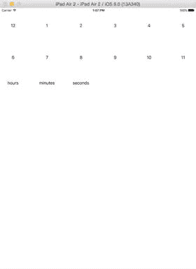

图 16-1.

前后对比

使用自定义布局，你需要负责所有繁重的工作，即确定每个项目和视图应该放置的位置。作为练习，自己重新实现 `UICollectionViewFlowLayout` 会让你对创建它时付出的努力有新的敬意！

但实际上，这让创建自定义布局的任务听起来比实际更困难。有一个非常清晰的定义过程，你可以通过它来执行这些计算，因此通过一些练习，你会发现可以非常快速地创建出外观复杂的布局。

创建自定义布局的过程有六个步骤，其中两个是可选的：

- 创建 `UICollectionViewLayout` 的自定义子类。
- 决定你的布局是需要即时计算每个项目的属性，还是可以批量计算。
- 实现四个核心函数来计算集合视图中每个项目的位置。
- 可选地，实现 `UICollectionViewLayoutAttributes` 的自定义子类，以自定义单元格和视图的附加属性。
- 可选地，实现诸如补充视图和装饰视图，以及项目的动画插入和删除等支持函数。
- 创建自定义 `UICollectionViewLayout` 子类的新实例，并将其设置为集合视图的 `collectionViewLayout` 属性。

完成这些步骤后，集合视图将以与 `UICollectionViewFlowLayout` 完全相同的方式与你的自定义集合视图布局进行交互，区别在于你可以完全控制所有元素的位置。

### 何时创建自定义集合视图布局

何时创建自定义集合视图布局而不是依赖流式布局，这是一个棘手的问题。在 `UICollectionViewFlowLayout` 计算的便利性和使其提供你想要的效果所需的工作量之间存在权衡。

根据经验法则，如果你预期的布局没有明显的行列感，那么从长远来看，自定义布局可能更容易实现。

### 创建自定义布局子类

你的集合视图期望一个布局，该布局是 `UICollectionViewLayout` 的子类。这是一个抽象类，不能像你使用 `UICollectionView` 本身那样直接使用。相反，你必须创建一个子类并实现这些函数。

你可以在视图控制器中即时完成此操作，但更常见的是创建一个单独的 `UICollectionViewLayout` 子类。


### 决定何时计算布局属性

集合视图本身并不关心布局属性何时被计算；它只要求当集合视图需要时，布局对象能按需返回这些属性。由于集合视图会调用 `layoutAttributesForItemsInRect:` 和 `layoutAttributesForItemAtIndexPath:`，你可以即时计算这些属性。不过，这并非总是必要的。

如果你的布局是高度动态的（可以滚动，或者有许多项目会改变存在状态、大小或位置），那么你很可能需要在集合视图请求时计算布局属性。

另一方面，如果你的布局基本上是静态的，另一种选择是在 `prepareLayout` 函数中提前计算好所有布局属性，然后在响应 `layoutAttributesForItemsInRect:` 时直接返回预先计算好的值。

采取哪种方法，需要在计算所涉及的工作量与更新频率之间取得平衡。不幸的是，除了牢记“过早优化是万恶之源”这句格言外，并没有明确的标准答案。

### 自定义布局的职责

自定义布局会为集合视图执行三项主要任务。它们是：

-   计算集合视图内容区域的大小，即根据集合视图将显示的每个项目的大小和位置属性，确定滚动内容区域会有多大。
-   计算每个索引路径对应项目的布局属性。
-   返回集合视图内容区域中给定区域内的项目布局属性数组。

## 什么是布局属性？

既然一直在讨论布局属性，它们到底是什么呢？

`UICollectionViewLayoutAttributes` 类定义了一系列与布局相关的属性，这些属性可以应用于集合视图中的项目（或补充视图、装饰视图），以自定义其显示方式。

该类定义了许多“标准”属性，但如果这些属性不够用，你可以创建 `UICollectionViewLayoutAttributes` 的子类，并根据需要创建自己的属性。

提供的标准属性包括：

-   `frame`，决定项目在集合视图中的显示位置。更改此属性也会同时设置项目的`center`和`size`属性。
-   `bounds`，决定项目相对于自身坐标系的范围矩形。更改此属性也会改变`size`属性。
-   `center`，定位项目相对于集合视图的中心点。更改此属性也会更新`frame`属性。
-   `size`，决定项目的大小。更改此属性也会导致`frame`和`bounds`属性被更新。
-   `transform3D`，允许项目在 x、y 和 z 平面上进行变换以创建 3D 效果。更改此属性也会更新`transform`属性。
-   `transform`，允许项目在 x 和/或 y 平面上进行变换以获得缩放或倾斜效果。更改此属性也会更新`transform3D`属性。
-   `alpha`，控制项目的透明度。默认情况下，项目完全不透明，`alpha`值为`1`。将`alpha`值设置为`0`会使项目看起来消失；将其设置在`1`和`0`之间则提供不同程度的透明度。请注意，这与将`hidden`属性设置为`YES`不同，因为`alpha`属性为 0 的项目总是会被集合视图创建。
-   `zIndex`，决定项目在集合视图中是显示在其他项目“之上”还是“之下”。通过操纵每个项目的`zIndex`，可以实现项目“堆叠”或重叠的外观。数值越高，项目就越接近“前面”或“顶部”。
-   `hidden`，控制项目的整体外观。如果设置为`YES`或`true`，则项目不会显示。请注意，这与将`alpha`属性设置为`0`不同，因为集合视图可能会自我优化，并选择不创建`hidden`设置为`YES`的项目。

### 自定义布局属性

如果标准的一组布局属性无法提供你所需的控制级别，你可以创建自己的自定义属性。这些属性可以控制项目视觉外观的任何其他方面（例如文本颜色、字体或方向），尽管可能性几乎是无限的。

你可以通过子类化 `UICollectionViewLayoutAttributes` 并根据需要添加自己的属性来扩展标准属性。如果这样做，你需要实现三个额外的步骤：

-   一个自定义的 `UICollectionViewLayoutAttributes` 子类必须遵循 `NSCopying` 协议，以便集合视图在需要时能够复制它们。
-   一个自定义的 `UICollectionViewLayoutAttributes` 子类必须重写继承的 `isEqual:` 函数，以便检查任何自定义属性。集合视图只会在属性发生变化时才将其应用于项目，因此如果你实现了自己的自定义属性，集合视图需要一种方法来确定它们是否相同。
-   任何应用了自定义属性的项目（单元格、补充视图或装饰视图）都必须实现 `applyLayoutAttributes:` 函数。在这个函数中，你需要获取属性（例如文本颜色）并将其应用（在这种情况下，应用到项目中的 `UILabel` 上）。

### 需要实现的四个关键函数

为了向集合视图提供所需的布局属性，你需要在自定义的 `UICollectionViewLayout` 中实现四个关键函数：

-   `func prepareLayout()`
-   `func collectionViewContentSize() -> CGSize`
-   `func layoutAttributesForElementsInRect(_ rect: CGRect) -> [UICollectionViewLayoutAttributes]?`
-   `func layoutAttributesForItemAtIndexPath(_ indexPath: NSIndexPath) -> UICollectionViewLayoutAttributes?`

让我们逐一来看。

### prepareLayout

当集合视图首次向其布局对象请求属性时，以及在响应边界变化或显式请求而导致布局失效的任何时候，都会调用此函数。

根据自定义布局的具体细节，可能存在一些值最适合作为整个布局的“全局”值来计算。

例如，单个项目可能相对于集合视图边界的中心点进行放置。除非集合视图的边界发生变化，否则这个中心点不会改变，因此 `prepareLayout` 是一个计算该值并将其存入类属性的好地方。

如果你的布局相对静态，你可以使用 `prepareLayout` 来计算所有项目的所有属性，然后将它们存储在一个属性中。然而，如果你的布局更加动态，这样做可能就没有意义了。

默认情况下，`UICollectionViewLayout` 并未实现 `prepareLayout`，因此如果不需要进行任何准备工作，你可以完全省略这个函数。


#### `collectionViewContentSize`

为了确定其滚动行为，集合视图需要知道内容视图的尺寸大小；请记住，`UICollectionView`是`UIScrollView`的子类，并且内容视图可能大于集合视图边界内的可见区域。

当集合视图首次绘制时，这个函数会在布局过程的早期被调用，随后，如果集合视图的边界发生变化，或者调用了`invalidateLayout`函数，它也会被调用。

这个函数是强制性的，因此你需要实现计算逻辑，算出集合视图将要显示的所有项的内容视图的最大尺寸，并将其作为一个`CGSize`返回。

有时，所有项都能容纳在集合视图的边界内；例如，本章后面会看到的圆形示例将所有项都放置在可见区域内。在这种情况下，内容尺寸和可见区域是相同的。

然而，你始终需要牢记：`collectionViewContentSize`是显示集合视图中所有项所需的尺寸，而不仅仅是那些在集合视图边界内可见的项。

该值由集合视图布局而非集合视图的视图控制器计算的原因是：布局控制着项的尺寸，因此也就控制了所需内容视图的尺寸。

如果集合视图的边界发生变化（例如在设备旋转期间），你还需要准备好重复这一过程。

### `layoutAttributesForElementsInRect`

一旦集合视图知道了内容尺寸，它就可以开始向其布局对象询问在给定矩形内显示项所需的属性。

有时，这个矩形与集合视图的框架相同（本章后面的圆形示例就是这种情况）。

在其他情况下，它可能不同。一个可滚动的集合视图很可能会向它的布局请求那些实际上尚未显示、但可能根据用户交互滚动到可见区域的项的属性。通过请求尚未可见的项的属性，集合视图可以尝试最大化滚动性能。

无论哪种情况，你的布局都有责任做以下三件事：

*   确定哪些项出现在提供的`rect`内。
*   为这些项中的每一个创建一个`UICollectionViewLayoutAttributes`对象，并设置属性，使得该项能正确放置在集合视图请求的矩形中。
*   将这些对象作为一个`NSArray`返回。

具体实现细节对集合视图是隐藏的。它所关心的只是接收包含`UICollectionViewAttributes`的`NSArray`。

### `layoutAttributesForItemAtIndexPath`

`layoutAttributesForItemAtIndexPath:`函数的作用是，为提供的索引路径处的项，以`UICollectionViewLayoutAttributes`实例的形式返回其单独的布局属性。索引路径充当“键”，用于将`UICollectionViewLayoutAttributes`的特定实例与特定的单元格或视图关联起来。

该函数可能会也可能不会被集合视图调用，但它必须被实现。`layoutAttributesForElementsInRect:`是集合视图会调用的主要函数，但在某些时候（例如在插入或删除项期间），它可能需要在逐项基础上获取布局属性。

请注意，你不应该使用这个函数来计算属性；这应该已经在`prepareLayout`或`layoutAttributesForElementsInRect`中完成了。我们无法知晓集合视图何时会调用其数据源的此函数，因此在这里重新计算属性可能会导致在集合视图准备好处理这些属性之前它们的值发生变化。虽然这很可能不会导致崩溃，但它有潜力造成非常难以调试的布局错误。

例如，如果你已将布局属性存储在布局子类的属性中，你需要检索具有匹配`indexPath`值的属性并将其返回。

## 补充视图和装饰视图属性

正如集合视图需要知道如何布局项，它也需要属性来计算如何布局补充视图和装饰视图。

你是否需要经历这个过程，取决于你的自定义布局是否使用补充视图和装饰视图。很明显，例如如果你不使用装饰视图，就没有必要为它们计算属性。所有补充视图和装饰视图的函数都是可选的。

计算和返回补充视图及装饰视图属性的过程与项的过程几乎相同，包含三个步骤：

*   确定在提供给`layoutAttributesForElementsInRect:`函数的矩形内是否会找到补充视图和/或装饰视图。
*   如果需要，计算它们的属性。
*   通过以下两个专用函数之一返回它们的属性：`layoutAttributesForSupplementaryViewsOfKind:AtIndexPath:`和/或`layoutAttributesForDecorationViewOfKind:atIndexPath:`。

### 检查是否需要补充视图或装饰视图

补充视图或装饰视图不一定出现在集合视图请求布局属性的矩形内；这取决于你的布局设计以及所请求矩形的大小。

例如，如果所涉及的矩形只覆盖了一个分区的中间区域，那么页眉和页脚可能不会出现在可见区域内。同样地，装饰视图也可能出现或不出现在可见区域内。

### 计算补充视图和装饰视图属性

如果补充视图和/或装饰视图将出现在该矩形内，你的自定义布局负责计算必要的属性。

与项的属性一样，你可以选择在`prepareLayout`中预先计算，或者在`layoutAttributesForElementsInRect:`期间按需计算。选择哪种方式需要在计算开销和需求频率之间取得平衡。

补充视图和装饰视图也可能被集合视图随时请求，因此你需要实现为此提供的两个函数：

*   `layoutAttributesForSupplementaryViewsOfKind:AtIndexPath:`
*   `layoutAttributesForDecorationViewOfKind:atIndexPath:`

这两个函数都接受两个参数：被请求的视图种类（例如，`UICollectionElementKindHeader`或`UICollectionElementKindFooter`）以及相关的索引路径。就像处理项一样，你不应使用这些函数来改动属性。

`kind`和`indexPath`值使你能够确定正在处理的是哪个补充视图或装饰视图。

`kind`是一个字符串，其作用类似于单元格标识符。因此，你应该将它们定义为常量，因为它们在集合视图的控制器、`dataSource`以及布局子类中都会被引用到。

与单元格一样，`indexPath`是将给定的`UICollectionViewLayoutAttributes`实例与特定索引路径处的补充视图或装饰视图关联起来的手段。

一旦你获取了属性，你需要将它们作为`UICollectionViewLayoutAttributes`的实例返回。

## 本章项目

在本章的剩余部分，你将实现一个带有自定义布局的集合视图。第一个示例相对来说是静态的，即集合视图的框架将包含整个内容区域。


### SwiftClock：“静态”示例

“静态”示例是一个可正常工作的模拟时钟，能够显示当前设备时间，并带有走动的秒针。它结合使用补充视图和装饰视图来显示表盘和数字，并用单元格来表示时针、分针和秒针。

在构建基本布局后，你将对其进行扩展，增加切换不同表盘样式以及更改时区的功能。所有更改都将以平滑动画呈现。

该项目基于 iPad，包含一个视图控制器，其中有一个`UICollectionView`，它填充了整个屏幕，如图 16-2 所示。

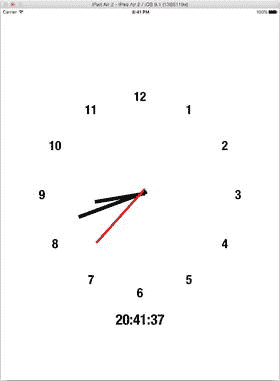

图 16-2. `UICollectionView` 时钟

### 开始

为了加快进度，我创建了一个项目作为起点。该项目实现了数据模型，并使用基本流程布局在网格中显示了十二个数字。它还包括你稍后将用到的图片资源。

你将通过移除流程布局并实现自己的自定义布局，来将其调整为使用自定义圆形布局。

采取这种方法有两个原因：首先，它可以为你提供所有集合视图的“基础设施”，从而加快进度；其次，它强化了布局独立于为集合视图提供数据的观点。你不会更改初始数据，只会更改其显示方式。

## 初始项目

初始项目可以从 Apress 网站作为本书源代码的一部分下载，也可以直接从 GitHub 下载（这更可能是最新版本；最新版本将在 `master` 分支上）。

初始项目位于：

[`https://github.com/timd/InitialSwiftClock`](https://github.com/timd/InitialSwiftClock)

最终版项目位于：

[`https://github.com/timd/SwiftClock`](https://github.com/timd/SwiftClock)

### 设置

初始项目是一个在 iPad 上全屏运行的简单集合视图。它有一个视图控制器 `ClockViewController`，以及一个包含全屏 `UICollectionView` 对象的 Storyboard。

为了分离控制集合视图的元素，`ClockViewController` 有两个扩展：一个实现了 `UICollectionViewDelegate` 和 `UICollectionViewDataSource` 函数；另一个用于支持集合视图的自定义函数。

### 数据模型

集合视图的数据模型位于支持类的一个属性中，是一个包含两个元素的数组：

`var dataArray: Array<Array<String>>!`

第一个元素是一个数组，包含每个指针的元素；第二个元素是一个数组，包含每个小时的元素。图 16-3 展示了数据模型如何以包含 `Strings` 的 `Array` 形式进行组织。

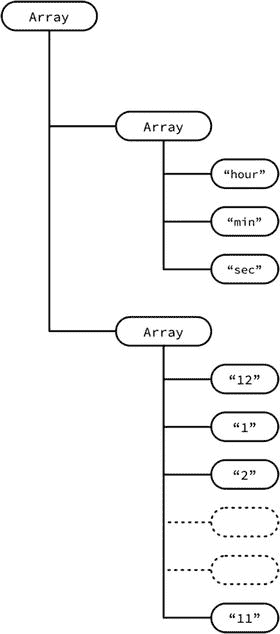

图 16-3. 数据模型

数据模型在 `setupData()` 函数中设置，如代码清单 16-1 所示。

代码清单 16-1. `setupData` 函数

```
func setupData() {
    let hoursArray = ["12", "1", "2", "3", "4", "5", "6", "7", "8", "9", "10", "11"]
    let handsArray = ["hours", "minutes", "seconds"]
    dataArray = [handsArray, hoursArray]
}
```

**注意：** 小时数组的编号从 12 开始。这是因为 12 是显示在时钟顶部的第一个标签。

包含时钟数字的单元格是在 nib 文件 `ClockCell` 中布局的，它包含一个标签，显示相关索引路径的数据模型内容（如图 16-4 所示）。该标签的标记值为 `1000`，以便 `UICollectionViewDatasource` 能够访问它。

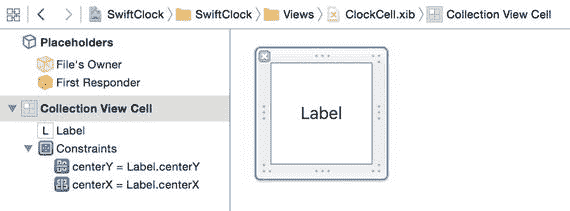

图 16-4. 小时标签单元格

目前，集合视图已设置为使用简单的 `UICollectionViewFlowLayout`，它在一行中显示数据模型的所有元素，如图 16-5 所示。这并不美观，但在这个阶段并不重要；初始项目的目的是将各部分连接起来，准备适配自定义布局。

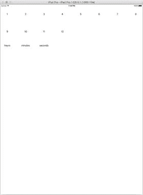

图 16-5. 项目的初始状态

## 更新项目

你将更新项目，将布局从难看的流程布局转换为流畅的模拟时钟。最终结果将如图 16-6 所示。


图 16-6. 完成的时钟

这将涉及三个阶段：

*   创建自定义布局类以替换现有的流程布局
*   创建新单元格以显示时钟的指针
*   将集合视图切换为使用新的自定义类

大部分工作在于创建新的自定义布局，那么我们就从这一点开始。

### 添加自定义布局类

自定义布局是 `UICollectionViewLayout` 的子类。添加一个新文件（文件 ➤ 新建 ➤ 文件）并为该类命名（我将其命名为 `ClockLayout`）。使其成为 `UICollectionViewLayout` 的子类，如图 16-7 所示。

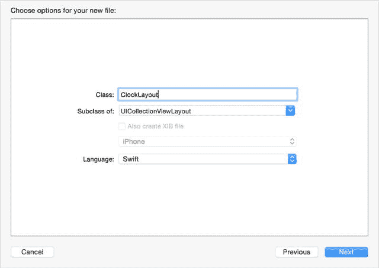

图 16-7. 为布局创建自定义类

#### 设置属性

时钟指针的位置显然取决于时间，因此你需要一种在布局中传递该数据的方法。创建一个名为 `let clockTime: NSDate!` 的 `NSDate` 属性。

在不同位置还会用到其他几个属性，因此你不妨在设置时将它们添加到类中。这如代码清单 16-2 所示。

代码清单 16-2. 类的属性

```
private var clockTime: NSDate!
private let dateFormatter = NSDateFormatter()
private var timeHours: Int!
private var timeMinutes: Int!
private var timeSeconds: Int!
var minuteHandSize: CGSize!
var secondHandSize: CGSize!
var hourHandSize: CGSize!
private var hourLabelCellSize: CGSize!
private var clockFaceRadius: CGFloat!
private var cvCenter: CGPoint!
var attributesArray = [UICollectionViewLayoutAttributes]()
```

逐一解释这些属性：

*   时钟显示的时间存储在 `clockTime` 属性中。
*   需要 `NSDateFormatter` 来计算适当格式的时间。由于创建这些对象的成本较高，你将创建一个类属性，并在每次需要计算小时、分钟或秒时更改日期格式。
*   为了移动各个指针，你需要分别计算小时、分钟和秒。
*   单元格将在布局外部创建，因此你需要能够通过四个 `size` 属性将它们的大小传递给布局类。
*   表盘半径源自集合视图的大小；由于这是在布局外部设置的，你需要传入这个值。
*   布局的中心点用于固定指针和小时标签的位置。
*   计算出的属性存储在一个 `UICollectionViewLayoutAttributes` 的数组中。


#### 自定义布局的运行方式

自定义布局需要能够为以下四种元素计算布局属性：

- 钟面上的数字，这些数字将围绕中心排列成一个圆圈。
- 包含时针的单元格的旋转角度，该角度将取决于正在显示的时间。你还需要根据分钟数进行调整，以便时针在一小时内平稳移动。
- 包含分针的单元格的旋转角度，该角度也取决于正在显示的时间。这也会随着秒数的增加而进行调整。
- 秒针的旋转角度。

让我们将这些计算分解为四个阶段：

- 一个名为 `calculateAllAttributes` 的“主”函数，它遍历整个数据模型，并依次调用合适的函数来计算每个数据项的属性。
- 一个名为 `calculateAttributesForItemAtIndexPath` 的函数，它接受某个数据项的 `indexPath`，并根据该项的类型（时针、分针、秒针或小时标签）调用相应的计算函数。
- 一个用于计算三个指针单元格位置的函数：`calculateAttributesForHandCellAtIndexPath:`
- 一个用于计算小时标签位置的函数：`calculateAttributesForHourLabelWithIndexPath:`

整个过程将遵循图 16-8 所示的流程。

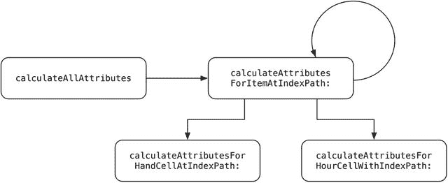

图 16-8. 布局流程

将计算的每个阶段分离出来的原因有两个：

- 通过将计算分解为单独的操作，函数变得更小、更易读，并且（如果你采用测试驱动开发方法）更易于测试。
- 稍后，你将能够调整现有函数来扩展自定义布局，以处理不同的显示样式。

### 实现布局函数

除了计算数字和指针位置所需的自定义函数外，还有一些 `UICollectionViewLayout` 函数需要你实现。

让我们通过实现以下函数来开始构建自定义布局的过程：

- `prepareLayout`
- `collectionViewContentSize`
- `layoutAttributesForElementsInRect:`
- `layoutAttributesForItemAtIndexPath:`

#### `prepareLayout` 函数

如你之前所见，`prepareLayout` 函数在布局首次初始化时被调用，然后在布局因你显式调用它或因集合视图的边界发生变化而使布局失效时被调用。

这里是执行影响整个集合视图的“全局”计算的好地方。在这个项目中，每次需要更新指针位置时都会调用它，因此你可以利用它来计算将要显示的小时、分钟和秒数。

代码清单 16-3 展示了 `prepareLayout` 函数。

代码清单 16-3. `prepareLayout` 函数

```
override func prepareLayout() {

    cvCenter = CGPointMake(collectionView!.frame.size.width/2, ➤
    collectionView!.frame.size.height/2)

    clockTime = NSDate()

    dateFormatter.dateFormat = "HH"
    let hourString = dateFormatter.stringFromDate(clockTime)
    timeHours = Int(hourString)!

    dateFormatter.dateFormat = "mm"
    let minString = dateFormatter.stringFromDate(clockTime)
    timeMinutes = Int(minString)!

    dateFormatter.dateFormat = "ss"
    let secString = dateFormatter.stringFromDate(clockTime)
    timeSeconds = Int(secString)!

    clockFaceRadius = min(cvCenter.x, cvCenter.y)

    calculateAllAttributes()
}
```

首先，计算集合视图的中心并将其存储在 `cvCenter` 属性中。然后，获取当前 `time`，并通过 `NSDateFormatter` 提取小时、分钟和秒的值。

接下来，计算钟面的半径（取 `cvCenter` 的 `x` 或 `y` 坐标中较小的值），最后调用 `calculateAllAttributes` 函数，稍后你将创建该函数。

#### `collectionViewContentSize`

由于时钟的所有元素都将显示在集合视图的可视边界内，因此 `collectionView` 的 `contentSize` 将与边界相同。这使得 `collectionViewContentSize` 函数的实现非常简单，如代码清单 16-4 所示。

代码清单 16-4. `collectionViewContentSize` 函数

```
override func collectionViewContentSize() -> CGSize {
    return collectionView!.frame.size
}
```

#### `layoutAttributesForElementsInRect:`

`layoutAttributesForElementsInRect:` 函数必须返回一个属性数组，该数组包含所有将要完全或部分出现在给定矩形内的元素。

对于复杂的布局，你需要自行确定每个元素是否位于矩形内，因此你需要为每个 `item` 实现类似下面的逻辑：

```
if CGRectIntersectsRect(item.frame, rect) {
    /*
        该元素至少部分出现在矩形内，
        因此将其属性添加到将要返回的数组中
    */
}
```

不过，时钟布局更简单。因为所有元素都位于集合视图的边界内，你可以返回存储在 `attributesArray` 属性中的所有属性。这如代码清单 16-5 所示。

代码清单 16-5. `layoutAttributesForElementsInRect:` 函数

```
override func layoutAttributesForElementsInRect(rect: CGRect) ->
  [UICollectionViewLayoutAttributes]? {
    return attributesArray
}
```

#### `layoutAttributesForElementAtIndexPath:`

集合视图可以在任何时候调用 `layoutAttributeForElementAtIndexPath:` 函数，并且该函数需要返回一个 `UICollectionViewLayoutAttributes` 对象，对应于所提供索引路径下的项。

这个函数通常会在插入和删除过程中被调用。由于你无法保证此时集合视图的状态，因此该函数不应更改项的属性。相反，它应该只返回先前计算好的属性。

为此，你需要在属性数组中找到 `indexPath` 属性与集合视图提供的 `indexPath` 相匹配的 `UICollectionViewLayoutAttributes` 对象，并将其返回。这如代码清单 16-6 所示。

代码清单 16-6. `layoutAttributesForElementAtIndexPath:` 函数

```
override func layoutAttributesForItemAtIndexPath(indexPath: NSIndexPath) ->
UICollectionViewLayoutAttributes? {
    // 从 attributesArray 中返回具有匹配 indexPath 的项
    return attributesArray.filter({ (theAttribute) -> Bool in
        theAttribute.indexPath == indexPath
    }).first
}
```

#### 其他 `UICollectionViewLayout` 函数

还有其他三个构成布局过程一部分的 `UICollectionViewLayout` 函数，但你无需实现它们。其中两个与补充视图和装饰视图有关，本布局中并未使用它们。

- `layoutAttributesForSupplementaryViewOfKind(_:atIndexPath:)`
- `layoutAttributesForDecorationViewOfKind(_:atIndexPath:)`

第三个函数控制布局是否应响应集合视图的边界更改（例如，在旋转事件之后）而改变：

- `shouldInvalidateLayoutForBoundsChange(_:)`

如果未实现此函数，布局将假定属性不会改变。这对你来说没问题，因此你无需显式实现它。


### 实现自定义布局函数

既然已经实现了主要的布局函数，现在可以专注于那些负责处理自定义布局属性计算繁重工作的自定义函数了。

需要指出的是，接下来你需要自行探索。这些属性的计算方式并不由任何 `UICollectionView` 协议定义。具体如何实现完全取决于你自定义布局的需求，因此不同项目间差异会很大。

如之前所见，你将分四个阶段完成此任务：

- 遍历整个数据模型，通过 `calculateAllAttributes` 为数据模型中的每个项目调用 `calculateAttributesForItemAtIndexPath:` 函数。
- 根据传入的索引路径，调用相应的计算函数（通过 `calculateAttributesForItemAtIndexPath:` 实现）。
- 使用 `calculateAttributesForHourLabelWithIndexPath:` 计算小时标签的位置。
- 使用 `calculateAttributesForHandCellAtIndexPath:` 计算三种指针单元格的位置。

指针的位置将取决于时间及其尺寸大小。

你已经为指针和标签单元格的尺寸暴露了属性。虽然因为当前只构建单一风格的钟面，无需立即动态调整这些属性，但暴露这些属性后，你便可以将此布局类复用于其他钟面样式。

这些属性需要声明为布局的属性：

`var minuteHandSize: CGSize!`

`var secondHandSize: CGSize!`

`var hourHandSize: CGSize!`

`var hourLabelCellSize: CGSize!`

#### calculateAllAttributes 函数

此函数的作用是让你能快速遍历整个集合视图的数据模型，并计算每个项目的属性。

回忆一下，项目和其属性通过 `indexPath` 属性关联，因此只要遍历所有 `indexPaths`，就能计算出每个元素的属性。

实现该功能的函数如代码清单 16-7 所示。

代码清单 16-7. calculateAllAttributes 函数

```
func calculateAllAttributes() {
    for section in 0..<collectionView!.numberOfSections() {
        for item in 0..<collectionView!.numberOfItemsInSection(section) {
            // 为此项目创建索引路径
            let indexPath = NSIndexPath(forItem: item, inSection: section)
            // 计算属性
            let attributes = calculateAttributesForItemAt(indexPath)
            // 更新或插入新属性到 attributesArray 中
            if let matchingAttributeIndex = attributesArray.indexOf( { (attributes: ➤
            UICollectionViewLayoutAttributes ) -> Bool in
                attributes.indexPath.compare(indexPath) == ➤
            NSComparisonResult.OrderedSame
            }) {
                // 属性已存在，替换它
                attributesArray[matchingAttributeIndex] = attributes
            } else {
                // 需要新的属性集
                attributesArray.append(attributes)
            }
        }
    }
}
```

可以看出，这部分逻辑并不复杂。

在此示例中，集合视图的数据模型是一个外层数组包含两个内层数组的结构。你依次遍历外层数组的每个元素，再遍历内层数组。

当然，你并不局限于使用数组作为数据模型——任何能够确定分区和行的模型结构都可以采用。

对于内层数组中的每个元素，你调用了 `calculateAttributesForItemAtIndexPath:` 函数（下一步将会介绍）。该函数会返回此索引路径对应项目的 `UICollectionViewLayoutAttributes` 实例。

接着，你需要检查该 `indexPath` 是否已有需要更新的预存属性。如果有，新属性将替换 `attributesArray` 中的旧属性；如果没有，则将新属性追加到已存储的属性之后。

#### calculateAttributesForItemAtIndexPath: 函数

`calculateAttributesForItemAtIndexPath:` 函数会被 `calculateAllAttributes` 函数逐个调用，处理每个项目。

由于集合视图中有四种不同类型的项目（三种指针和小时标签），该函数通过 `indexPath` 来判断项目类型。

如果是指针单元格，则调用 `calculateAttributesForHandCell(:_)`；如果是小时标签，则调用 `calculateAttributesForHourLabelWith(:_)`。两个函数都会返回一组 `UICollectionViewLayoutAttributes` 属性集。参见代码清单 16-8。

代码清单 16-8. calculateAttributesForItemAtIndexPath: 函数

```
func calculateAttributesForItemAt(itemPath: NSIndexPath) -> UICollectionViewLayoutAttributes {
    var newAttributes = UICollectionViewLayoutAttributes(forCellWithIndexPath: itemPath)
    if itemPath.section == 0 {
        newAttributes = calculateAttributesForHandCellAt(itemPath)
    }
    if itemPath.section == 1 {
        newAttributes = calculateAttributesForHourLabelWith(itemPath)
    }
    return newAttributes
}
```


### 计算小时标签的位置

在你的 `calculateAttributesForIndexPath:` 函数中，你调用了一个名为 `calculateAttributesForHourLabelWithIndexPath:` 的函数。该函数将在集合视图中心周围布局小时标签，数据模型第一个区域中的每个元素对应一个标签。

完整函数如代码清单 16-9 所示。它接收一个 `NSIndexPath` 作为 `hourPath` 参数，并返回一个 `UICollectionViewLayoutAttributes` 实例。

**代码清单 16-9.** `calculateAttributesForHourLabelWithIndexPath:` 函数

```
func calculateAttributesForHourLabelWith(hourPath: NSIndexPath) -> ➤ UICollectionViewLayoutAttributes {

    let attributes = UICollectionViewLayoutAttributes(forCellWithIndexPath: hourPath)
    attributes.size = CGSizeMake(hourLabelCellSize.width, hourLabelCellSize.height)

    let angularDisplacement: Double = (2 * M_PI) / 12
    let theta = angularDisplacement * Double(hourPath.row)

    let xDisplacement = sin(theta) * Double(clockFaceRadius - ➤
        (attributes.size.width / 2))
    let yDisplacement = cos(theta) * Double(clockFaceRadius - ➤
        (attributes.size.height / 2))

    let xPosition = cvCenter.x + CGFloat(xDisplacement)
    let yPosition = cvCenter.y - CGFloat(yDisplacement)

    let center: CGPoint = CGPointMake(xPosition, yPosition)
    attributes.center = center

    return attributes
}
```

你需要为每个小时标签计算的属性是 `size` 和 `center`。

尺寸（Size）不是问题；它被传入布局的 `hourLabelCellSize` 参数中，因此你可以直接使用它：

```
attributes.size = hourLabelCellSizeSize
```

计算标签的中心点则稍微复杂一些，需要用到一些三角函数。如果这让你想起遥远的高中记忆，别担心，我会逐步解释。

首先需要计算的是标签在表盘上应放置的角度位置，假设它是一个传统的时钟，12 点位于顶部。

如果有 12 个数字，那么每个数字之间的角度是 (360° ÷ 12) = 30°。iOS 使用弧度而非角度来测量，因此实际计算如下：

```
let angularDisplacement: Double = (2 * M_PI) / 12
```

数字对应的标签存储在数据模型中：第 `0` 行对应“12”，第 `1` 行对应“1”，第 `2` 行对应“2”，以此类推。通过将 `angularDisplacement` 乘以标签的索引，你可以计算出标签在表盘上应放置的角度位置：

```
let theta = angularDisplacement * Double(hourPath.row)
```

图 16-9 展示了 2 点钟位置的计算过程：

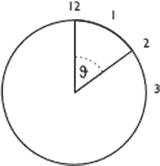

**图 16-9.** 计算 `theta`

```
angularDisplacement = 360 ÷ 12 = 30
theta = 30 * 2 = 60°
```

一旦你知道了某个标签的 `theta` 值，就可以计算其中心位置，如图 16-10 所示。

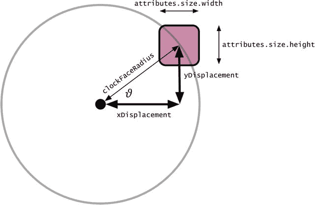

**图 16-10.** 计算标签的中心点

这涉及到我之前提到的高中三角函数：

```
let xDisplacement = sin(theta) * Double(clockFaceRadius - (attributes.size.width / 2))
let yDisplacement = cos(theta) * Double(clockFaceRadius - (attributes.size.height / 2))
```

`clockFaceRadius` 是布局上的一个属性，在布局实例化时传入，其值由集合视图的尺寸决定。假设集合视图宽 500 点，那么你处理的半径就是 250 点。

为了计算与中心点的 `x` 偏移量，你使用 `sin(theta) * clockFaceRadius`，然后根据小时标签的宽度进行调整（记住，你计算的是标签的中心点）。

计算 `y` 偏移量的方法完全相同，但使用 `cos(theta)`，并根据标签的高度进行调整。

完成这些计算后，你可以通过 `center` 属性设置标签的 x 和 y 位置：

```
let xPosition = cvCenter.x + CGFloat(xDisplacement)
let yPosition = cvCenter.y - CGFloat(yDisplacement)
let center: CGPoint = CGPointMake(xPosition, yPosition)
attributes.center = center
```

请注意，`xDisplacement` 向右移动时为正值，而 `yDisplacement` 向上移动时为负值。这一规律适用于所有位置，因为 `sin(theta)` 和 `cos(theta)` 的结果会随着计算在圆周上移动而由正变负。

最后，计算出所需的所有属性后，可以将它们返回给调用函数：

```
return attributes
```


#### 计算指针位置

创建自定义布局的最后任务是计算指针的位置。这些指针单元格已在`ClockViewController`中设置好，但还有一些与布局相关的事项需要配置，例如让指针围绕集合视图的中心旋转以指示时间。

处理此任务的函数是`calculateAttributesForHandCellAtIndexPath:`。它与您刚刚构建的上一个函数类似：接受一个`indexPath`参数，并返回一个`UILayoutViewAttributes`对象。

完整函数如代码清单 16-10 所示。

**代码清单 16-10.** `calculateAttributesForHandCell` 函数

```
func calculateAttributesForHandCellAt(handPath: NSIndexPath) -> UICollectionViewLayoutAttributes {
    let attributes = UICollectionViewLayoutAttributes(forCellWithIndexPath: handPath)
    let rotationPerHour: Double = (2 * M_PI) / 12
    let rotationPerMinute: Double = (2 * M_PI) / 60.0
    
    switch handPath.row {
    case 0: // 处理时针
        attributes.size = hourHandSize
        attributes.center = cvCenter
        let intraHourRotationPerMinute: Double = rotationPerHour / 60
        let currentIntraHourRotation: Double = intraHourRotationPerMinute * Double(timeMinutes)
        let angularDisplacement = (rotationPerHour * Double(timeHours)) + currentIntraHourRotation
        attributes.transform = CGAffineTransformMakeRotation(CGFloat(angularDisplacement))
        
    case 1: // 处理分针
        attributes.size = minuteHandSize
        attributes.center = cvCenter
        let intraMinuteRotationPerSecond: Double = rotationPerMinute / 60
        let currentIntraMinuteRotation: Double = intraMinuteRotationPerSecond * Double(timeSeconds)
        let angularDisplacement = (rotationPerMinute * Double(timeMinutes)) + currentIntraMinuteRotation
        attributes.transform = CGAffineTransformMakeRotation(CGFloat(angularDisplacement))
        
    case 2: // 处理秒针
        attributes.size = secondHandSize
        attributes.center = cvCenter
        let angularDisplacement = rotationPerMinute * Double(timeSeconds)
        attributes.transform = CGAffineTransformMakeRotation(CGFloat(angularDisplacement))
        
    default:
        break
    }
    
    return attributes
}
```

第一步是创建一个`UICollectionViewLayoutAttributes`实例：

```
let attributes = UICollectionViewLayoutAttributes(forCellWithIndexPath: handPath)
```

接下来，计算每小时的旋转量（时针为 360° ÷ 12，分针为 360° ÷ 60）：

```
let rotationPerHour: Double = (2 * M_PI) / 12
let rotationPerMinute: Double = (2 * M_PI) / 60.0
```

然后需要处理三种情况，分别对应时针、分针和秒针。它们在`handPath`中的行索引分别为 0、1 和 2，因此可以使用`switch`语句分别处理：

```
switch handPath.row {
    ...
}
```

每种情况都非常相似。首先，设置尺寸和中心属性：

```
attributes.size = hourHandSize;
attributes.center = cvCenter;
```

指针的尺寸作为属性传递给布局，使其与使用的图片无关。您可以随意更改该属性，而无需更新布局类。

然后计算当前小时所需的旋转量：

```
let intraHourRotationPerMinute: Double = rotationPerHour / 60
```

由于时针从某一小时刻度开始，并在一小时内逐渐移动到下一个刻度，因此需要根据当前分钟数计算所需的调整量：

```
let currentIntraHourRotation: Double = intraHourRotationPerMinute * Double(timeMinutes)
```

利用这两个值，可以计算实际的偏移量：

```
let angularDisplacement = (rotationPerHour * Double(timeHours)) + currentIntraHourRotation
```

最后，通过设置`transform`属性来旋转指针视图：

```
attributes.transform = CGAffineTransformMakeRotation(CGFloat(angularDisplacement))
```

### 后续步骤

至此，创建自定义布局所需的全部步骤已完成。接下来只需构建时钟指针的视图，并将集合视图连接到自定义类即可。

首先，声明`clockLayout`属性：

```
var clockLayout: ClockLayout!
```

在开始处理指针和数字之前，更新`ClockViewController`中的`configureCollectionView()`函数，以实例化并设置`ClockLayout`：

```
clockLayout = ClockLayout()
collectionView.setCollectionViewLayout(clockLayout, animated: false)
```

### 显示数字和指针

时钟的数字和指针显示在`UICollectionViewCells`实例中。为指针创建一个自定义的`UICollectionViewCell`子类，并使用 XIB 文件来显示数字。

#### 为小时标签创建 XIB 文件

要创建小时标签的 XIB 文件，请选择 **File** ➤ **New** ➤ **File**，然后在侧边栏中选择 **User Interface** 部分。接着高亮主区域中的 **Empty** 项，如图 16-11 所示。


**图 16-11.** 创建 XIB 文件

将文件命名为`HandCell`，并点击 **Create**。

现在在 Interface Builder 中打开新建的 XIB 文件，将一个 **Collection View Cell** 对象拖入主面板，如图 16-12 所示。

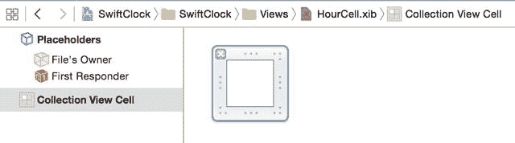

**图 16-12.** 添加 Collection View Cell 对象

调整尺寸，使单元格宽 100 点、高 100 点，并将其复用标识符设置为`HourCellView`。

现在将一个 **Label** 拖入单元格，使用 AutoLayout 约束使其居中，并根据您的偏好更新字体。最终结果如图 16-13 所示。

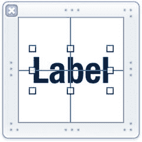

**图 16-13.** 更新后的标签

最后，在属性检查器中将标签的`tag`属性设置为`1000`，以便在视图控制器中访问该标签，如图 16-14 所示。

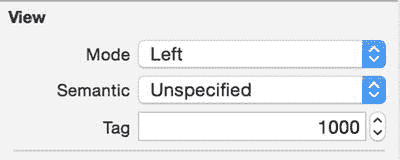

**图 16-14.** 设置标签的 tag 属性

XIB 文件创建完成后，返回`ClockViewController`并注册此文件以供使用。在`configureCollectionView()`函数中添加以下代码行：

```
collectionView.registerNib(UINib(nibName: "HourCell", bundle: nil),
    forCellWithReuseIdentifier: HourCellView)
clockLayout.hourLabelCellSize = CGSizeMake(100.0, 100.0)
```


## 创建时钟指针的 UICollectionView 子类

此处将采用另一种方式：创建一个 `UICollectionViewCell` 的自定义子类，而非在 nib 文件中创建指针。两种技术效果等同，但使用自定义子类可以让你在代码中配置 cell 的各个方面。

第一步是创建一个新的 `UICollectionViewCell` 子类文件。选择“文件”➤“新建”➤“文件”。将类命名为 `HandCell`，并将“子类”字段修改为 `UICollectionViewCell`。点击“确定”即可创建新的类文件。

现在，你需要像处理 nib 文件一样，将这个类注册到集合视图中。此操作需要执行三次，分别针对三种指针类型。首先，在类顶部添加复用标识符声明：

```
let HourCellView = "HourCellView"
let HourHandCell = "HourHandCell"
let MinsHandCell = "MinsHandCell"
let SecsHandCell = "SecsHandCell"
```

接下来，向 `configureCollectionView` 函数中添加以下代码：

```
collectionView.registerClass(HandCell.self, forCellWithReuseIdentifier: HourHandCell)
collectionView.registerClass(HandCell.self, forCellWithReuseIdentifier: MinsHandCell)
collectionView.registerClass(HandCell.self, forCellWithReuseIdentifier: SecsHandCell)
```

你还需要设置指针 cell 的尺寸：

```
clockLayout.hourHandSize = CGSizeMake(10.0, 140.0)
clockLayout.minuteHandSize = CGSizeMake(10.0, 200.0)
clockLayout.secondHandSize = CGSizeMake(6.0, 200.0)
```

其余步骤将在下一步更新集合视图的视图控制器时处理。

### 使用自定义布局

布局设置完成后，你现在需要更新集合视图的 `datasource` 对象中的 `cellForItemAtIndexPath:` 函数，如代码清单 16-11 所示。

**代码清单 16-11.** 更新后的 `collectionView:cellForItemAtIndexPath:` 函数

```
func collectionView(collectionView: UICollectionView, cellForItemAtIndexPath ➤
indexPath: NSIndexPath) -> UICollectionViewCell {
    var cell: UICollectionViewCell!

    // 处理时间标签
    switch (indexPath.section) {
    case 0:
        // 处理指针
        switch (indexPath.row) {
        case 0:
            // 处理时针
            cell = collectionView.dequeueReusableCellWithReuseIdentifier➤
                (HourHandCell, forIndexPath: indexPath) as! HandCell
            let hourHandView = UIView(frame: CGRectMake(0, 0, ➤
                clockLayout.hourHandSize.width, clockLayout.hourHandSize.height))
            hourHandView.backgroundColor = UIColor.blackColor()
            cell.contentView.addSubview(hourHandView)
            cell.layer.anchorPoint = CGPointMake(0.5, 0.9)

        case 1:
            // 处理分针
            cell = collectionView.dequeueReusableCellWithReuseIdentifier➤
                (MinsHandCell, forIndexPath: indexPath) as! HandCell
            let minuteHandView = UIView(frame: CGRectMake(0, 0, ➤
                clockLayout.minuteHandSize.width, clockLayout.minuteHandSize.height))
            minuteHandView.backgroundColor = UIColor.blackColor()
            cell.contentView.addSubview(minuteHandView)
            cell.layer.anchorPoint = CGPointMake(0.5, 0.9)

        default:
            // 处理秒针
            cell = collectionView.dequeueReusableCellWithReuseIdentifier➤
                (SecsHandCell, forIndexPath: indexPath)
            let secondHandView = UIView(frame: CGRectMake(0, 0, ➤
                clockLayout.secondHandSize.width, clockLayout.secondHandSize.height))
            secondHandView.backgroundColor = UIColor.redColor()
            cell.contentView.addSubview(secondHandView)
            cell.layer.anchorPoint = CGPointMake(0.5, 0.9)
        }

    default:
        // 处理小时标签
        cell = collectionView.dequeueReusableCellWithReuseIdentifier➤
            (HourCellView, forIndexPath: indexPath) as UICollectionViewCell
        let hourLabelsArray = dataArray[1]
        let hoursText = hourLabelsArray[indexPath.row]
        if let cellLabel: UILabel = cell.viewWithTag(1000) as? UILabel {
            cellLabel.text = hoursText
        }
    }

    return cell
}
```

这里分为两部分：处理小时标签和处理指针。

你首先要做的是创建一个可选值来持有将要返回的 cell：

```
var cell: UICollectionViewCell!
```

现在回想一下数据模型是如何配置的：数组第一个部分中的元素包含指针的占位符，第二个部分则包含数字值。

通过检查传入函数的 `indexPath` 参数，你可以使用 `switch` 语句执行相应操作：

```
switch (indexPath.section) {
case 0: // 处理指针
    ...
default: // 处理小时标签
    ...
}
```

`indexPath section` 为 1 表示需要出列并配置小时 cell：

```
default: // 处理小时标签
cell = collectionView.dequeueReusableCellWithReuseIdentifier➤
    (HourCellView, forIndexPath: indexPath) as UICollectionViewCell
let hourLabelsArray = dataArray[1]
let hoursText = hourLabelsArray[indexPath.row]
if let cellLabel: UILabel = cell.viewWithTag(1000) as? UILabel {
    cellLabel.text = hoursText
}
```

一旦 cell 出列，你可以通过其 `tag` 属性访问标签，并设置文本以显示小时数字。

`indexPath` section 为 0 表示你在处理指针 cell。同样，过程类似：

```
case 0: // 处理指针
switch (indexPath.row) {
case 0: // 处理时针
    cell = collectionView.dequeueReusableCellWithReuseIdentifier➤
        (HourHandCell, forIndexPath: indexPath) as! HandCell
    let hourHandView = UIView(frame: CGRectMake(0, 0, ➤
        clockLayout.hourHandSize.width, clockLayout.hourHandSize.height))
    hourHandView.backgroundColor = UIColor.blackColor()
    cell.contentView.addSubview(hourHandView)
    cell.layer.anchorPoint = CGPointMake(0.5, 0.9)

case 1: // 处理分针
    cell = collectionView.dequeueReusableCellWithReuseIdentifier➤
        (MinsHandCell, forIndexPath: indexPath) as! HandCell
    let minuteHandView = UIView(frame: CGRectMake(0, 0, ➤
        clockLayout.minuteHandSize.width, clockLayout.minuteHandSize.height))
    minuteHandView.backgroundColor = UIColor.blackColor()
    cell.contentView.addSubview(minuteHandView)
    cell.layer.anchorPoint = CGPointMake(0.5, 0.9)

default: // 处理秒针
    cell = collectionView.dequeueReusableCellWithReuseIdentifier➤
        (SecsHandCell, forIndexPath: indexPath)
    let secondHandView = UIView(frame: CGRectMake(0, 0, ➤
        clockLayout.secondHandSize.width, clockLayout.secondHandSize.height))
    secondHandView.backgroundColor = UIColor.redColor()
    cell.contentView.addSubview(secondHandView)
    cell.layer.anchorPoint = CGPointMake(0.5, 0.9)
}
```

这里有三种可能的情况：你正处理的是时针、分针或秒针，分别对应索引路径中的第 0、1 或 2 行。

每个过程几乎相同：

- 首先，使用适当的 `reuseIdentifier` 出列一个 cell。
- 接着，为指针创建一个 `UIView`，设置 `size`，并将 `background` 颜色设为黑色。
- 然后，将 `UIView` 添加到 cell 中。
- 最后，调整 cell 的 `anchorPoint` 属性。

每一部分的最后一行都会移动锚点，以适应布局应用旋转。默认情况下，`CAlayer` 的旋转点位于其中心（用坐标表示即 (0.5, 0.5)），如图 16-15 所示。

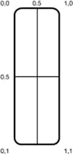

**图 16-15.** 默认旋转点

你实际想要做的是让指针绕其底部旋转，如图 16-16 所示。

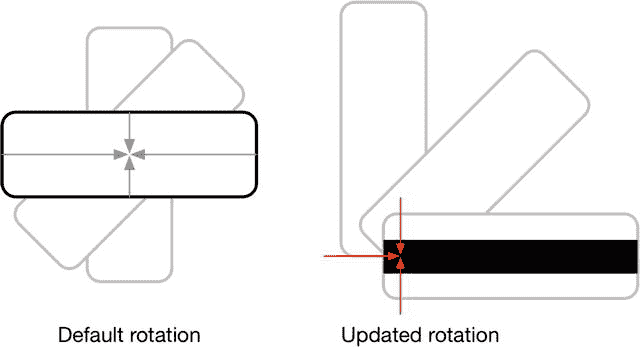

**图 16-16.** 更新后的旋转点

由于旋转点位于图像“内部”偏下的位置，因此需要相应地调整偏移量，以营造指针围绕固定点旋转的效果。

配置好 cell 后，最终函数会将其返回给集合视图：

```
return cell
```


### 让时钟“滴答”走动

以上操作即可显示表盘和时针，但此时时钟尚未开始运转。最后一项任务是让它“滴答”走动。

这需要使集合视图的布局失效，强制其重新计算每个元素的属性。由于你已在布局中设置了时间，每次布局失效时，它都会为新时间重新计算属性；若每秒使布局失效一次，时钟便会呈现“滴答”走动的效果。

你可以在视图控制器中添加一个 `updateClock()` 函数来实现这一功能，如代码清单 16-12 所示。

**代码清单 16-12.** `updateClock()` 函数

```
func updateClock() {
    collectionView.collectionViewLayout.invalidateLayout()
}
```

现在有了此函数，你可以设置一个定时器，使其每秒调用一次该函数。首先，在视图控制器中添加一个属性：

```
var tickTimer: NSTimer!
```

然后更新 `viewDidLoad()` 函数，使其如代码清单 16-13 所示。

**代码清单 16-13.** 更新后的 `viewDidLoad()` 函数

```
override func viewDidLoad() {
    super.viewDidLoad()
    setupData()
    configureCollectionView()
    tickTimer = NSTimer.scheduledTimerWithTimeInterval(1.0, target: self,
        selector: "updateClock", userInfo: nil, repeats: true)
    NSRunLoop.currentRunLoop().addTimer(tickTimer, forMode: NSRunLoopCommonModes)
}
```

这段代码创建了一个 `NSTimer` 实例，该定时器每秒触发一次并调用 `updateClock()` 函数。随后将定时器添加到主运行循环中，以营造时间流逝的视觉效果。

最后，当视图被关闭时，最好清理掉 `NSTimer`，因此请在视图控制器中添加 `viewWillDisappear()` 函数，如代码清单 16-14 所示。

**代码清单 16-14.** `viewWillDisappear()` 函数

```
override func viewWillDisappear(animated: Bool) {
    super.viewWillDisappear(animated)
    tickTimer.invalidate()
}
```

如果现在运行项目，你将看到一个正在“滴答”走动的时钟，如图 16-17 所示，该时钟完全由带有自定义布局的 `UICollectionView` 构建而成。

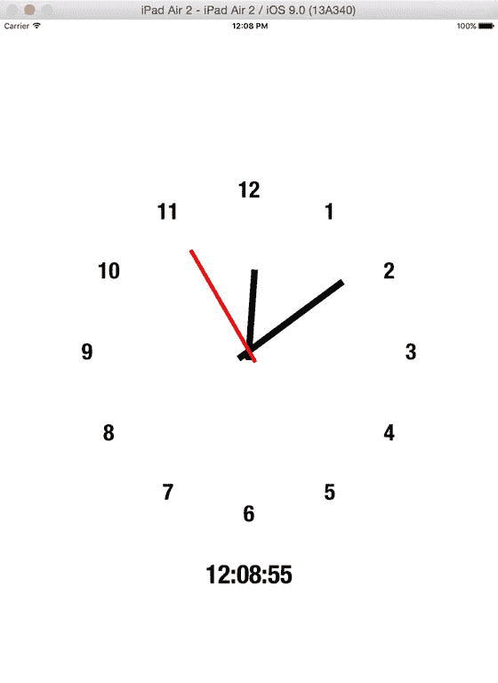

**图 16-17.** 完成后的 `UICollectionView` 时钟

## 本章小结

在本章中，你学习了如何突破流式布局的限制，创建完全自定义的布局。你掌握了创建自定义 `UICollectionViewFlowLayout` 类的方法，并学会了计算根据设计放置视图所需的布局属性。

通过组合运用所有这些技术，你现在可以创建自定义布局了。在下一章中，我们将更进一步探索相关内容。

