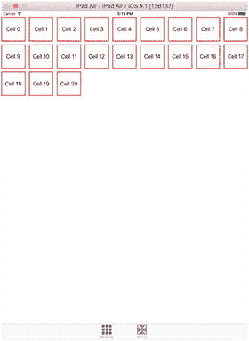
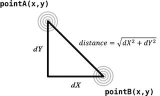
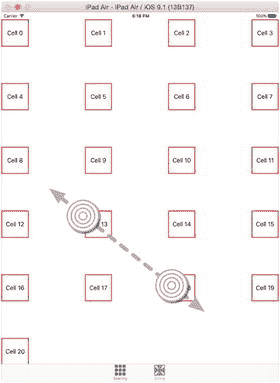
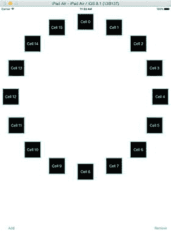
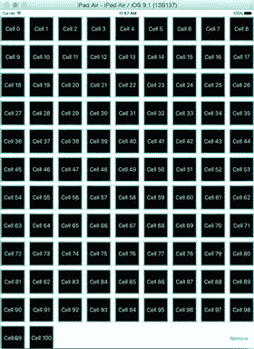
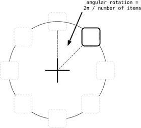
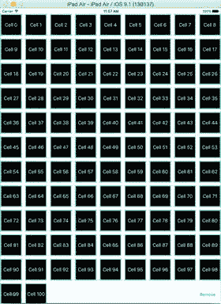
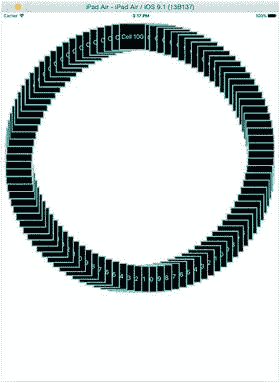

# 17. 动画与交互式集合视图

将集合视图的灵活性与 iOS 设备的触控界面相结合，你将拥有一个充满探索可能的界面世界。从用户交互的角度来看，最令人满意的方案之一是将集合视图与手势识别器结合，构建出真正可交互的界面。

到目前为止，你主要关注的是布局相对静态的集合视图（尽管也涉及一些滚动）。但 `UICollectionView` 的能力远不止于此。它通过手势对用户交互提供了精妙的支持；通过使用自定义布局，你可以借助动画让集合视图栩栩如生。

在本章中，你首先将学习如何通过手势控制集合视图。通过实现能够更新布局属性的手势识别器，你可以让集合视图以自然的方式响应用户交互。

你还将学习如何通过动画增强集合视图的过渡效果（例如插入和删除操作）。结合强大的 iOS 动画 API，你可以轻松创建流畅且引人入胜的界面。

## 通过手势控制集合视图

iOS 设备天生具有交互性和触控性。触摸屏使应用能够创建比键盘和鼠标所能实现的交互方式灵活得多的界面。

`UIGestureRecognizer` 类家族提供了简单而强大的方法，让用户能够通过点击、平移、滑动和捏合等交互手势来控制应用。你可以非常轻松地将 `UICollectionViewLayouts` 与手势识别器结合，构建沉浸式界面。

在第 12 章中，你已经了解了如何构建支持交互式排序和重排的集合视图。在本章中，我们将探讨如何使用手势直接控制布局属性。

### 将手势与布局关联

你可以非常轻松地将手势识别器连接到集合视图。通过接收手势事件并利用获取的值更新布局属性，你可以让布局变得可交互。

你将构建两个独立的效果，使用捏合手势控制流式布局。第一个效果将更新项目间距；第二个效果将控制项目大小。

基本方法非常简单：

- 创建一个 `UIGestureRecognizer` 来处理你需要的交互类型，此处为 `UIPinchGestureRecognizer`。
- 将此手势识别器安装到集合视图控制器上。
- 实现回调函数以接收与手势相关的数据。
- 使用这些值更新集合视图布局的属性。

为了加快进度，你可以使用本书 GitHub 仓库中第 17 章源代码的基础项目。该项目创建了一个基于 `UITabBarController` 的项目，包含两个标签页，每个标签页都含有一个集合视图。两个集合视图均显示 20 个项目，并使用标准的 `UICollectionViewFlowLayout`，如图 17-1 所示。



**图 17-1.** 使用流式布局的基础项目

#### 添加手势识别器

需要将手势识别器添加到集合视图控制器中，以便其能够拦截手势，然后将相关数据传递给集合视图的视图控制器类。

在 `SpaceViewController` 类的 `setupCollectionView` 函数中添加以下代码行：

```
let pinchRecognizer = UIPinchGestureRecognizer(target: self, action: "didGetPinchGesture:")
collectionView.addGestureRecognizer(pinchRecognizer)
```

这将创建一个 `UIPinchGestureRecognizer` 实例，并将其 target 属性设置为 `didGetPinchGesture:` 函数。随后，将新创建的手势识别器添加到集合视图中。


#### 处理手势

目前你还未实现手势识别器拦截手势时的处理函数，因此请将代码清单 17-1 中的函数添加到`SpaceViewController`中。

代码清单 17-1. `didGetPinchGesture:` 函数

```
func didGetPinchGesture(sender: UIPinchGestureRecognizer) {
    guard sender.numberOfTouches() == 2 else {
        return
    }

    let pointOne = sender.locationOfTouch(0, inView: collectionView)
    let pointTwo = sender.locationOfTouch(1, inView: collectionView)
    let dX = pointOne.x - pointTwo.x
    let dY = pointTwo.y - pointTwo.y
    let distance = sqrt(dX * dX + dY * dY)
    let layout = collectionView.collectionViewLayout as! UICollectionViewFlowLayout
    layout.minimumLineSpacing = distance / 5
    layout.minimumInteritemSpacing = distance / 5
    layout.invalidateLayout()
}
```

首先需要确保你响应的是正确的手势。`UIGestureRecognizers` 拥有一个 `numberOfTouches` 属性，其中包含手势识别器检测到的触点数量。对于单指点击，该值为 `1`。如果屏幕上有五根手指，则 `numberOfTouches` 为 `5`。

在本例中，你只对双指捏合手势感兴趣，因此可以拒绝任何 `numberOfTouches` 属性不等于 `2` 的手势：

```
guard sender.numberOfTouches() == 2 else {
    return
}
```

假设确实只有两个触点，现在就可以开始用它们来控制集合视图的布局了。

首先，获取两个触点相对于 `collectionView` 的坐标：

```
let pointOne = sender.locationOfTouch(0, inView: collectionView)
let pointTwo = sender.locationOfTouch(1, inView: collectionView)
```

**提示**：触点的编号指的是手势识别器检测到触点的顺序，而非具体是哪根手指在触摸！

每个触点都有 x 和 y 坐标，因此可以用它们来计算两个触点之间的差值。这需要一些三角学知识，如图 17-2 所示。



图 17-2. 计算触点之间的距离

在代码中，这一计算表示为：

```
let distance = sqrt((dX * dX) + (dY * dY))
```

完成计算后，获取流式布局的引用：

```
let layout = collectionView.collectionViewLayout as! UICollectionViewFlowLayout
```

然后用距离值更新与间距相关的属性：

```
layout.minimumLineSpacing = distance / 5
layout.minimumInteritemSpacing = distance / 5
```

由于触摸距离是相对于集合视图尺寸的，因此需要适当缩小比例，以免间距过大。

最后，强制布局进行自我更新：

```
layout.invalidateLayout()
```

在纸上很难复现这一效果，但随着触点间距的增加，单元格之间的间距也会增大，如图 17-3 所示。



图 17-3. 单元格间距增大

## 集合视图与动画

到目前为止，你构建的集合视图布局都依赖内置类来处理插入和删除项目时的位置安排。这节省了大量时间和精力，如果你对基本效果满意，则无需改动。但如果你需要对项目的添加和移除方式进行更精细的控制，可以利用自定义的 `UICollectionViewLayouts` 来获得完全控制权。

为了说明这一点，你将构建一个集合视图，其功能如下：
- 以完全非线性的方式排列项目；这意味着你将负责计算它们的位置
- 使用由你决定的动画过渡效果来插入和移除项目

最终结果将如图 17-4 所示。单元格均匀排列在一个圆形上；它们通过从中心飞出到环形上的位置来插入（同时现有单元格会移动以腾出空间）。移除方向则相反：飞回中心，同时剩余单元格会重新均匀分布。



图 17-4. 自定义布局的实际效果

为了实现这一效果，你将实现一个自定义的 `UICollectionViewLayout`。这并非你第一次这样做，但在本例中，你将更进一步，为每个项目计算初始和最终布局属性。集合视图随后会平滑地动画呈现初始位置与最终位置之间的变化。

### 过程

为了让集合视图对项目的插入和删除进行动画处理，你需要为每个项目提供三组属性：
- 初始布局属性：集合视图在项目首次出现时用于放置项目。在本例中，该位置为圆心。
- 布局属性：决定项目的“最终”归属位置。在本例中，每个项目位于圆上的一点，项目之间的间距由项目总数决定。
- 最终布局属性：集合视图在项目移除前将其作为最终位置。在本例中，项目会看似飞回圆心，并在过程中逐渐淡出和缩小。

设置自定义布局所涉及的其他过程与你之前看到的相同，但这里将详细讲解。

### 前提条件

首先，你需要一个集合视图。为节省设置时间，我已创建了一个基础项目。其中包含一个作为集合视图数据源和委托的单一视图控制器。Storyboard 中包含一个全屏集合视图以及两个用于添加和移除项目的按钮。

集合视图的数据源是一个 `Strings` 类型的 `Array`，单元格是非常基础的 75pt x 75pt 的 `UICollectionViewCells`，用于显示对应行中的 `String`。最后，还有一个基本的 `UICollectionFlowLayout`，生成的应用程序如图 17-5 所示。



图 17-5. 初始应用

如你所见，这还需要进一步处理。

### 创建自定义布局

首先需要创建一个自定义布局。它将作为 `UICollectionViewLayout` 的子类，因此请通过 **File** ➤ **New** ➤ **File** 创建一个新文件，从 `Source` 部分选择 `Cocoa Touch` 项，然后创建一个名为 `BounceLayout` 的 `UICollectionViewLayout` 子类。

这将生成一个空荡荡的类，如代码清单 17-2 所示。

代码清单 17-2. 初始的 `BounceLayout`

```
import UIKit

class BounceLayout: UICollectionViewLayout {

}
```

你需要实现三组函数：
- 处理布局准备工作的管理函数
- 属性函数：负责为集合视图创建和提供每个项目的布局属性
- 自定义函数：是布局所特有的，用于处理属性函数所需的计算

我们从基本的管理函数开始。


#### 内务函数

你需要实现的第一个内务函数是向集合视图返回其`contentSize`。

在本例中，这非常简单。你将使用一个与集合视图自身相同的`contentSize`，因此不会涉及滚动。请添加清单 17-3 中的函数。

**清单 17-3.** `collectionViewContentSize`函数

```
override func collectionViewContentSize() -> CGSize {
    super.collectionViewContentSize()
    return collectionView!.frame.size
}
```

这非常直观。在调用父类函数后，你返回`collectionView`的`frame`大小。

接下来，你需要`prepareLayout()`。该函数在每个布局过程开始时被调用，是执行任何影响所有元素的“批量”操作的机会。你需要做以下几件事：

*   向布局类添加一些属性，用于保存计算出的属性和一些尺寸值。
*   移除所有现有布局属性（添加或移除元素会导致所有其他元素移动，因此所有现有属性都将失效）。
*   对布局的整体尺寸进行一些预先计算。
*   依次计算每个元素的属性。

首先，添加清单 17-4 中所示的属性。

**清单 17-4.** `BounceLayout`的属性

```
var layoutAttributes = [UICollectionViewLayoutAttributes]()
var cvCenterPoint: CGPoint!
var itemSize: CGSize!
var sidePadding: CGFloat!
```

布局属性将存储在一个`UICollectionViewLayoutAttributes`类型的`Array`中。你需要一些与尺寸相关的属性：集合视图的中心点、每个元素的大小、元素边缘与集合视图边缘之间的内边距。

接下来，你需要`prepareLayout()`函数。该函数在布局失效后的布局过程开始时被调用。这既是配置布局全局值的机会，也是触发所有必需属性计算的时机。

请添加清单 17-5 中所示的函数。

**清单 17-5.** `prepareLayout()` 函数

```
override func prepareLayout() {
    super.prepareLayout()
    layoutAttributes.removeAll()
    // 计算集合视图的中心位置
    cvCenterPoint = CGPointMake(collectionView!.frame.size.width / 2, 
    collectionView!.frame.size.height / 2);
    // 计算我们要处理的元素数量
    // 这里，我们假设集合视图中只有一个分区
    let numberOfItems = collectionView!.numberOfItemsInSection(0)
    calculateAllAttributes(numberOfItems)
}
```

逐步解析：首先，你调用父类函数。然后，移除所有现有布局属性；插入或移除元素会导致所有其他元素移动，因此所有属性都失效了。

圆的中心点很重要，因为它既是计算每个元素位置属性的原点，也是插入计算的起始点。

`cvCenterPoint = calculateCenterForFirstItem()`

稍后在多个地方会用到这个值，为了减少代码重复，请添加清单 17-6 中的函数。

**清单 17-6.** 计算集合视图中心点

```
func calculateCenterForFirstItem() -> CGPoint {
    return CGPointMake(collectionView!.frame.size.width / 2, 
  collectionView!.frame.size.height / 2);
}
```

你还需要知道要处理的元素数量，以便计算间距。

`let numberOfItems = collectionView!.numberOfItemsInSection(0)`

最后，你针对给定的元素数量，调用尚未实现的`calculateAllAttributes(_:)`函数。

#### 计算属性

这是真正开始工作的地方。请添加清单 17-7 中的函数。

**清单 17-7.** `calculateAllAttributes` 函数

```
func calculateAllAttributes(numberOfItems: Int) {
    // 依次为每个元素创建属性
    for index in 0..<numberOfItems {
        // 为当前处理的元素构建索引路径
        let itemIndexPath = NSIndexPath(forItem: index, inSection: 0)
        // 为此索引路径创建一个 UICollectionViewLayoutAttributes 对象
        let attributes = UICollectionViewLayoutAttributes(forCellWithIndexPath: 
      itemIndexPath)
        // 计算元素中心点应处的位置
        let center = calculateCenterForItemAtIndexPath(itemIndexPath)
        attributes.center = center
        // 设置元素大小
        attributes.size = itemSize
        // 设置 Z-index 使它们彼此“层叠”
        attributes.zIndex = index + 1
        // 将新的属性集合添加到数组中
        layoutAttributes.append(attributes)
    }
}
```

该函数接受一个`Int`参数，即集合视图中元素的数量。然后它会循环，依次计算每个元素的属性。

首先，你为元素创建一个`NSIndexPath`：

`let itemIndexPath = NSIndexPath(forItem: index, inSection: 0)`

接下来，你使用这个`indexPath`创建`UICollectionViewLayoutAttributes`的一个实例：

`let attributes = UICollectionViewLayoutAttributes(forCellWithIndexPath: itemIndexPath)`

对于这个元素，你现在借助一个稍后将要实现的辅助函数来计算中心点应处的位置：

`let center = calculateCenterForItemAtIndexPath(itemIndexPath)`

`attributes.center = center`

你设置元素大小。所有元素的大小相同：

`attributes.size = itemSize`

每个元素的`Z-index`递增，这样当它们重叠时，看起来像是层叠的：

`attributes.zIndex = index + 1`

计算出所有必要属性后，你可以将它们添加到数组中：

`layoutAttributes.append(attributes)`

现在，让我们添加用于计算元素中心点的函数。


### 计算中心点

计算项目的中心点是涉及数学运算最多的功能，但并没有看起来那么复杂。请添加如代码清单 17-8 所示的函数。

**代码清单 17-8.** 计算项目中心点

```
func calculateCenterForItemAtIndexPath(indexPath: NSIndexPath) -> CGPoint {
    // 如果只有一个项目，则应将其居中
    if (collectionView!.numberOfItemsInSection(0) == 1) {
        return calculateCenterForFirstItem()
    }
    // 获取该项目对应的角位移
    let angularDisplacement: CGFloat = calculateRotationPerItem()
    // 计算该项目所需的旋转角度
    let theta = (angularDisplacement * CGFloat(indexPath.row))
    // 利用三角函数计算将项目沿辐条半径的圆移动
    // 所需的 x 和 y 位移
    let xDisplacement = CGFloat(sinf(Float(theta))) * calculateSpokeRadius()
    let yDisplacement = CGFloat(cosf(Float(theta))) * calculateSpokeRadius()
    // 计算小时标签块的中心点
    let xPosition = (collectionView!.bounds.size.width/2) + xDisplacement
    let yPosition = (collectionView!.bounds.size.width/2) - yDisplacement
    return CGPointMake(xPosition, yPosition)
}
```

首先，需要处理集合视图中只有一个项目的特殊情况。在这种情况下，您希望将项目放置在集合视图的中心：

```
if (collectionView!.numberOfItemsInSection(0) == 1) {
    return CGPointMake(collectionView!.bounds.size.width / 2, collectionView!.bounds.size.height/2)
}
```

现在，您可以计算该项目绕集合视图中心旋转的角度。

图 17-6 展示了旋转角度是如何计算的。



**图 17-6.** 计算角度旋转

这实现为一个独立的函数，如代码清单 17-9 所示。

**代码清单 17-9.** 计算每个项目的旋转角度

```
func calculateRotationPerItem() -> CGFloat {
    // 如果只有一个项目，则不应旋转
    if (collectionView!.numberOfItemsInSection(0) == 1) {
        return 0.0;
    }
    // 否则，旋转角度为 360 / 项目总数
    // （由于我们处理的是弧度，因此为 2Pi / 项目总数）
    return ( CGFloat(2 * M_PI) / CGFloat(collectionView!.numberOfItemsInSection(0)))
}
```

再次强调，集合视图中只有一个项目的情况属于特殊情况；不涉及旋转。

假设有多个项目，则每个项目的旋转角度为 `2π` 除以项目数量（`2π` 是整个圆的弧度数；iOS 在三角函数计算中使用弧度）。

回顾 `calculateCenterForItemAtIndexPath:` 函数，您会看到还需要实现另一个辅助函数。它的作用是计算圆的半径：取集合视图高度和宽度中较小的那个值。

添加代码清单 17-10 中的函数。

**代码清单 17-10.** 计算圆半径

```
func calculateSpokeRadius() -> CGFloat {
    // 计算连接项目中心与集合视图中心的“辐条”半径
    // 找出较短的一边，以防
    // collectionView 不是正方形
    let shorterSide = min(collectionView!.bounds.size.width, collectionView!.bounds.size.height)
    let collectionViewAllowance = shorterSide / 2
    let itemWidthAllowance = itemSize.width / 2
    // 调整侧边距（如果有）
    return (collectionViewAllowance - (itemWidthAllowance + sidePadding))
}
```

在这里，您获取集合视图较短边的长度，然后根据项目宽度以及项目与集合视图边框之间的任何内边距进行调整。

`calculateSpokeRadius` 函数返回的值被 `calculateCenterForItemAtIndexPath:` 函数用来计算集合视图中心与项目中心之间的水平和垂直距离：

```
let xDisplacement = CGFloat(sinf(Float(theta))) * calculateSpokeRadius()
let yDisplacement = CGFloat(cosf(Float(theta))) * calculateSpokeRadius()
```

这需要一点高中数学知识，并使用了 `sinf` 和 `cosf` 三角函数。所涉及的角度构成了一个直角三角形。这与您在第 16 章中使用的是相同的技术，如果需要复习，可以回头查看。

计算出距离后，您现在可以计算项目的中心坐标：

```
let xPosition = (collectionView!.bounds.size.width/2) + xDisplacement
let yPosition = (collectionView!.bounds.size.width/2) - yDisplacement
```

现在将整个属性集返回给调用函数：

```
return CGPointMake(xPosition, yPosition)
```

完成所有这些设置后，您就可以计算集合视图中任何项目的属性了。现在，您需要实现一些函数，以便在需要时将这些属性返回给集合视图。

### 向集合视图提供属性

向集合视图提供项目属性的过程可以在以下四个阶段之一进行：

- **批量提供**，即集合视图会询问给定 `CGRect` 内所有项目的属性。由于您的集合视图始终完全可见，实际上就是要求提供所有项目的属性。
- **单独提供**，即集合视图提供一个 `NSIndexPath`，并期望返回相应项目的属性。
- **插入项目期间**，集合视图会询问即将出现项目的初始属性。集合视图将负责在初始属性和项目在集合视图中停留期间将使用的属性之间进行插值。
- **移除项目期间**，集合视图会询问即将被移除的项目的最终属性。与初始属性类似，集合视图将负责从项目的当前状态插值到其最终值。

让我们逐一处理这些情况。

### 批量提供属性

布局需要实现 `layoutAttributesForElementInRect:` 函数，该函数接收一个 `CGRect` 参数，并负责确定哪些元素适合该矩形区域并返回它们的属性。这些属性以 `UICollectionViewLayoutAttributes` 的 `Array` 形式返回。

关于此函数有几点需要注意。首先，您有责任确定哪些元素出现在所提供的 `CGRect` 中。集合视图并不知道这一点，并且在滚动时可能会反复向布局请求此信息。

其次，元素指的是单元格、补充视图和装饰视图。如果您的集合视图使用了这些项目，您需要确定哪些在 `CGRect` 内可见并返回它们的属性。

在这种情况下，事情稍微简单一些。您只有单元格，而且集合视图不会滚动。因此，您可以简单地返回您拥有的所有属性，如代码清单 17-11 所示。

**代码清单 17-11.** `layoutAttributesForElementsInRect:` 函数

```
override func layoutAttributesForElementsInRect(rect: CGRect) -> [UICollectionViewLayoutAttributes]? {
    // 由于所有元素都将显示，返回所有元素
    return layoutAttributes
}
```


#### 提供单个项目属性

`layoutAttributesForElementsInRect` 的对应函数是 `layoutAttributesForItemAtIndexPath`。它接收一个 `NSIndexPath` 作为参数。调用代码预期会收到一个可选的 `UICollectionViewLayoutAttributes` 实例。

实现此函数有两种方式：一是在被请求时动态计算属性；二是在准备布局时预先计算并存储，然后在响应 `layoutAttributesForItemAtIndexPath` 时返回预先计算好的值。

选择哪种方法取决于具体场景。如果你的布局非常动态且计算开销不大，则可能没有必要过早优化。反之，如果计算涉及繁重的计算，或者这些值根本不会频繁变化，则预先计算可能更为合适。

请记住，`collectionView` 在绘制项目时会调用此函数，因此响应缓慢可能会导致滚动卡顿。如果你遇到滚动性能问题，你可能需要仔细检查这个函数。

你当前使用的是预先计算所有内容的方法，因此你的函数很简单，如代码清单 17-12 所示。

**代码清单 17-12. `layoutAttributesForItemAtIndexPath`**

```
override func layoutAttributesForItemAtIndexPath(indexPath: NSIndexPath) -> ➤
  UICollectionViewLayoutAttributes? {
    // 返回特定项目的布局属性
    return layoutAttributes[indexPath.row]
}
```

#### 提供初始布局属性

到目前为止，你已经实现了必需的函数来向集合视图返回 `UILayoutAttributes`。如果你不提供初始属性，集合视图将使用前两个函数提供的信息来放置项目。如果是新添加的项目，它会立即出现在正确的位置。

如果你希望初始属性有所不同——在你的场景中，希望项目出现在集合视图中心并动画过渡到最终位置——那么你需要通过实现 `initialLayoutAttributesForAppearingItemAtIndexPath` 函数来提供一组初始属性。

如果你不实现此函数，集合视图将不会获取任何初始属性，而会转而调用 `layoutAttributesForItemAtIndexPath` 函数来请求属性。

任何内置或自定义的 `UICollectionViewLayoutAttribute` 都可以包含在初始属性集中。在你的场景中，你将要提供 **center** 和 **alpha** 属性，以便项目先出现在中心，然后在其向圆圈动画过渡时淡入。

在集合视图请求初始属性之前，它会调用 `prepareForCollectionViewUpdates` 函数，并传入一个 `UICollectionViewLayoutUpdateItems` 数组。任何受更新影响的项目都会对应一个 `UICollectionViewLayoutUpdateItems`，它包含三个属性：

- `indexPathBeforeUpdate`：一个 `NSIndexPath`，包含项目在更新开始时的索引路径。如果项目是插入操作，此项为空。如果项目被移除，则包含其当前的索引路径。
- `indexPathAfterUpdate`：一个 `NSIndexPath`，包含项目在更新结束时的索引路径。如果项目是移除操作，此项为空。如果项目被添加，则包含该项目最终的目标索引路径。
- `updateAction`：包含一个 `UICollectionUpdateAction` 常量，指示对项目执行的操作：`Insert`、`Delete`、`Reload`、`Move` 或 `None`。

你需要检查正在插入或移除的项目发生了什么，因此添加一个属性来存储这些详细信息：

`var indexPathsBeingUpdated = [UICollectionViewUpdateItem]()`

现在添加如代码清单 17-13 所示的函数。

**代码清单 17-13. `prepareForCollectionViewUpdates` 函数**

```
override func prepareForCollectionViewUpdates(updateItems: ➤  [UICollectionViewUpdateItem]) {
    indexPathsBeingUpdated = updateItems
}
```

这行代码只是将数组复制并存储在 `indexPathsBeingUpdated` 属性中。

现在，你可以准备实现 `initialLayoutAttributesForAppearingItemAtIndexPath`，如代码清单 17-14 所示。

**代码清单 17-14. `initialLayoutAttributesForAppearingItemAtIndexPath` 函数**

```
override func initialLayoutAttributesForAppearingItemAtIndexPath(itemIndexPath: ➤
NSIndexPath) -> UICollectionViewLayoutAttributes? {
    // 检查这个 indexPath 是否在更新列表中
    // 如果不在，我们可以直接返回
    let indexFound = indexPathsBeingUpdated.indexOf { (element) -> Bool in
        element.indexPathAfterUpdate == itemIndexPath
    }

    if indexFound == nil {
        return layoutAttributes[itemIndexPath.row]
    }

    let attributes = UICollectionViewLayoutAttributes(forCellWithIndexPath: ➤
        itemIndexPath)

    // 测试是否正在处理移除第二个项目的情况
    // 此时将只有 1 个项目，当前处理的 indexPath.row 将为 0。
    //
    // 在这种情况下，第一个项目需要从其原始位置开始，即在顶部
    if (collectionView!.numberOfItemsInSection(0) == 1) && (itemIndexPath.row == 0) {
        attributes.center = calculateCenterForFirstItem()
        attributes.size = itemSize
        return attributes
    }

    // 这是一个全新的项目，所以我们需要设置其 alpha、大小、z-index 和中心点
    attributes.center = CGPointMake(collectionView!.bounds.size.width / 2, ➤
        collectionView!.bounds.size.height / 2)
    attributes.alpha = 0.0
    attributes.size = itemSize
    attributes.zIndex = 0
    return attributes;
}
```

首先，检查传入的 `indexPath` 是否包含在 `indexPathsBeingUpdated` 数组中：

```
let indexFound = indexPathsBeingUpdated.indexOf { (element) -> Bool in
    element.indexPathAfterUpdate == itemIndexPath
}
```

如果不在，说明该项目已经存在于集合视图中。它的初始属性将与计算出的属性相同，因此你可以直接返回它们：

```
if indexFound == nil {
    return layoutAttributes[itemIndexPath.row]
}
```

假设该项目是需要处理的项目，你需要一个 `UICollectionViewLayoutAttributes` 实例来进行配置：

```
let attributes = UICollectionViewLayoutAttributes(forCellWithIndexPath: itemIndexPath)
```

你需要将移除第二个项目的情况作为一个特例来处理：

```
if (collectionView!.numberOfItemsInSection(0) == 1) && (itemIndexPath.row == 0) {
    attributes.center = calculateCenterForFirstItem()
    attributes.size = itemSize
    return attributes
}
```

否则，你正在处理一个新项目，因此需要相应地设置 `attributes`：

- `center` 设置为集合视图的中心
- `alpha` 值设为 `0`，使项目呈现淡入效果
- 正确的 `size`
- `zIndex` 设为 `0`，使最新的项目始终位于“堆叠”的最顶层

```
attributes.center = CGPointMake(collectionView!.bounds.size.width / 2, ➤
    collectionView!.bounds.size.height / 2)
attributes.alpha = 0.0
attributes.size = itemSize
attributes.zIndex = 0
```

设置完属性后，就可以返回它们了：

```
return attributes;
```


### 提供最终布局属性

最终布局属性允许你控制项目如何从集合视图中移除。在此场景下，你希望项目移动到集合视图的中心，并在移动过程中逐渐淡出。

这些属性通过 `finalLayoutAttributesForDisppearingItemAtIndexPath` 函数返回给集合视图。该函数与 `initialLayoutAttributesForAppearingItemAtIndexPath` 非常相似，但它返回的是移除过程结束时的属性。

添加代码清单 17-15 中所示的函数。

**代码清单 17-15.** `finalLayoutAttributesForDisppearingItemAtIndexPath` 函数

```
override func finalLayoutAttributesForDisappearingItemAtIndexPath(itemIndexPath: ➤

  NSIndexPath) -> UICollectionViewLayoutAttributes? {

    let attributes = UICollectionViewLayoutAttributes(forCellWithIndexPath: ➤

    itemIndexPath)

    // 检查此 indexPath 是否在 BeingUpdated 列表中

    // 如果不在，则可以直接退出

    let indexFound = indexPathsBeingUpdated.indexOf { (element) -> Bool in

        element.indexPathBeforeUpdate == itemIndexPath

    }

    if indexFound == nil {

        return super.finalLayoutAttributesForDisappearingItemAtIndexPath(itemIndexPath)

    }

    // 测试我们是否正在处理第一个项目的移除，因为它移动到第二个项目腾出空间

    // 在这种情况下，将有 2 个项目，我们正在处理的项目的 indexPath.row 将为 0

    //

    // 在此场景中，项目需要返回到顶部中心位置，成为唯一的项目

    if ( (collectionView?.numberOfItemsInSection(0) == 2) && ➤

   (itemIndexPath.row == 0)  ) {

        attributes.center = calculateCenterForFirstItem()

        attributes.size = itemSize

        attributes.zIndex = 0

        return attributes;

    }

    // 这是一个正在消失的项目，因此我们需要设置其透明度、

    // 大小、z-index 和中心点，使其向中心缩放

    attributes.center = calculateCenterForFirstItem()

    attributes.alpha = 0

    attributes.size = itemSize

    attributes.zIndex = 0

    return attributes;

}
```

不同之处在于，这里的中心值是集合视图的中间位置，并且 `alpha` 值为 `0`。

至此，自定义的 `UICollectionViewLayout` 实现已完成。现在，需要完成集合视图的连线工作。

### 连接集合视图

目前，集合视图使用的是标准流式布局来排列项目，如图 17-7 所示。



**图 17-7.** 流式布局

你需要更新 `ViewController`，以创建自定义布局并将其应用于集合视图。

更新 `setupCollectionView()` 函数，如代码清单 17-16 所示。

**代码清单 17-16.** `setupCollectionView()` 函数

```
func setupCollectionView() {

    let layout = BounceLayout()

    layout.itemSize = CGSizeMake(75,75)

    layout.sidePadding = 10

    collectionView.setCollectionViewLayout(layout, animated: false)

    collectionView.collectionViewLayout = layout

}
```

这并不复杂。你创建了一个 `BounceLayout` 类的实例，并设置了项目大小和边距属性。然后将其分配给集合视图作为布局。

如果你现在运行项目，就会看到已经得到了一个圆形布局，如图 17-8 所示。



**图 17-8.** 新应用的 `BounceLayout`

#### 添加新项目

效果不错，但还不是你想要的。首先，将起始项目数量减少到 1 个：

```
func setupData() {

    cvData.append("0")

}
```

现在，添加一些函数来连接到按钮。首先，添加 `didTapAdd` 函数，如代码清单 17-17 所示。

**代码清单 17-17.** `didTapAdd` 函数

```
@IBAction func didTapAdd(sender: AnyObject) {

    // 获取最后一个项目的索引

    let index = cvData.count

    cvData.append("\(index)")

    // 为新项目创建一个 NSIndexPath 对象

    let newItemIndexPath = NSIndexPath(forItem: index, inSection: 0)

    // 现在更新集合视图

    collectionView.insertItemsAtIndexPaths([newItemIndexPath])

}
```

这并非过于复杂。你获取当前数据数组中的项目数量：

```
let index = cvData.count
```

并用它来添加一个新条目：

```
cvData.append("\(index)")
```

现在，你需要为新项目创建一个 `NSIndexPath` 对象：

```
let newItemIndexPath = NSIndexPath(forItem: index, inSection: 0)
```

然后，你可以告诉集合视图插入新项目：

```
collectionView.insertItemsAtIndexPaths([newItemIndexPath])
```

#### 移除项目

`didTapRemoveItem` 函数如代码清单 17-17 所示，与 `didTapAdd` 函数非常相似。

**代码清单 17-18.** `didTapRemoveItem` 函数

```
@IBAction func didTapRemoveItem(sender: AnyObject) {

    let itemIndex = cvData.count - 1

    removeItemAtIndexPath(NSIndexPath(forItem: itemIndex, inSection: 0))

}
```

它使用一个辅助函数从集合视图中移除项目，如代码清单 17-19 所示。

**代码清单 17-19.** `removeItemAtIndexPath` 函数

```
func removeItemAtIndexPath(indexPath: NSIndexPath) {

    // 不要尝试移除最后一个项目！

    if cvData.count == 0 {

        return

    }

    // 从数据数组中移除

    cvData.removeAtIndex(indexPath.row)

    // 现在更新集合视图

    collectionView.deleteItemsAtIndexPaths([indexPath])

}
```

首先，这可以防止你移除最后一个项目。假设还有多个项目，你就从 `dataArray` 中删除相应的条目，然后将要移除的 `indexPath` 传递给集合视图的 `deleteItemsAtIndexPaths` 函数。

最后一步是实现 `UICollectionViewDelegate` 的 `didSelectItemAtIndexPath` 函数，这样你就可以点击项目来删除它们。将其添加到 `viewController` 的一个扩展中，如代码清单 17-20 所示。

**代码清单 17-20.** `didSelectItemAtIndexPath` 函数

```
extension ViewController: UICollectionViewDelegate {

    func collectionView(collectionView: UICollectionView, didSelectItemAtIndexPath ➤

    indexPath: NSIndexPath) {

        switch indexPath.row {

        case 0:

            didTapAdd(indexPath)

        default:

            removeItemAtIndexPath(indexPath)

        }

    }

}
```

选择该项目将触发 `removeItemAtIndexPath:` 函数，该项目将从集合视图中飞出。

将 Storyboard 中的 `UIButtons` 连接到它们各自的 `IBAction` 函数，再次运行项目，你就可以点击 `Add` 按钮插入新项目，并点击 `Remove` 按钮或点击某个项目来将其移除。


### 控制插入和移除动画

目前，插入和移除动画由集合视图本身控制，它使用标准的持续时间和缓动曲线。这对某些项目来说可能没问题，但如果能对它们有更多一点的控制权就更好了。

实现这一点的关键在于将 `insertItemsAtIndexPaths` 和 `removeItemsAtIndexPaths` 函数包裹在 `UIView` 动画块内。

清单 17-21 展示了一个你可以实现的效果示例。

**清单 17-21.** 自定义插入动画

```swift
UIView.animateWithDuration(1.0,
    delay: 0.0,
    usingSpringWithDamping: 0.6,
    initialSpringVelocity: 0.0,
    options: UIViewAnimationOptions.CurveEaseIn,
    animations: { () -> Void in
        // 向集合视图中插入项目
        self.collectionView.insertItemsAtIndexPaths([newItemIndexPath])
    }) { (finished) -> Void in
       // 动画完成时执行的代码块
    }
```

语法或许可以更清晰一些，但你在这里所做的是：

- 设置动画持续时间为 1 秒：`animateWithDuration(1.0)`
- 在开始动画前不设置延迟：`delay: 0.0`
- 使用 `UIKitDynamics` 的弹性功能添加一些弹跳效果：`usingSpringWithDamping: 0.6`，`initialSpringVelocity: 0.0`
- 使用 `CurveEaseInOut` 缓动曲线，使动画开始缓慢，然后加速，最后在完成前再次减速：`options: UIViewAnimationOptions.CurveEaseIn`

在纸面或静态屏幕上很难展示动画的效果，但如果你现在运行项目，你会看到项目以平滑的动画出现，并伴有非常令人满意的弹跳效果。

请注意——你可能会花费数小时来调整动画以获得完美的弹跳效果！

## 总结

手势和动画可以用来让你的集合视图活起来，既能加深可用的交互，也能通过动画增强用户体验。

通过创建捕获用户输入的手势识别器，可以操作布局属性来交互式地更新集合视图。这为实现允许用户直接与数据和控件进行交互的界面提供了可能性。

通过为插入和删除操作添加动画效果，可以增强集合视图所提供的用户体验。这也可以用作强调信息和交互可能性的工具。强大的 iOS 动画 API 使您能够轻松创建流畅且引人入胜的界面。


