# 1. 测试简介

> *如果你不喜欢单元测试你的产品，很可能你的客户也不会喜欢测试它。*
>
> ——匿名

## 简介

软件测试是你开发流程的一个补充过程。它可能是长期监控你的工作和项目的唯一方法，因此，它对项目的构建方式和代码的编写方式都有积极影响。

本书将带你从软件测试的入门知识开始，了解如何搭建优秀的基础设施，如何编写优秀、整洁、可测试的代码，当然还包括如何使用多种方式和技术来测试你的代码。

在这第一章中，你将学习：
*   什么是软件测试
*   软件测试与我们 iOS 开发者有何关联
*   为什么它如此重要
*   我们可以使用哪些主要的不同测试类型

## 如何阅读本书

尽管可以按章节顺序阅读本书，但你无需严格遵循此规则。我建议你从一些理论章节开始，至于实践章节部分，你可以按任何你想要的顺序阅读。

即使你在编写测试方面经验丰富，我相信你也能发现新的有用技巧和令人兴奋的技术，从而提升你的编码和测试技能。

本书提供了大量代码示例，你可以亲自尝试，甚至将它们添加到现有的测试中（如果你已有一些测试的话）。

## 什么是软件测试？

测试是一个旨在获取关于应用程序、功能或函数质量信息的过程。开发人员和 QA 测试人员通过运行一个程序来管理测试，该程序检查你的应用程序代码，并决定它是可以投入生产使用还是存在问题。

测试过程可以通过多种方式检查你的应用程序——产品需求、边界情况、性能、内存、不同屏幕/设备或集成。在许多情况下，测试是持续部署服务或集成的一部分，在自动部署到 App Store 或 TestFlight 的过程中扮演着重要角色。

## iOS 中的软件测试

如果你尚未编写过测试，测试目标对你来说可能显得陌生。为了让你更熟悉，请看图 1-1 中标出的部分。

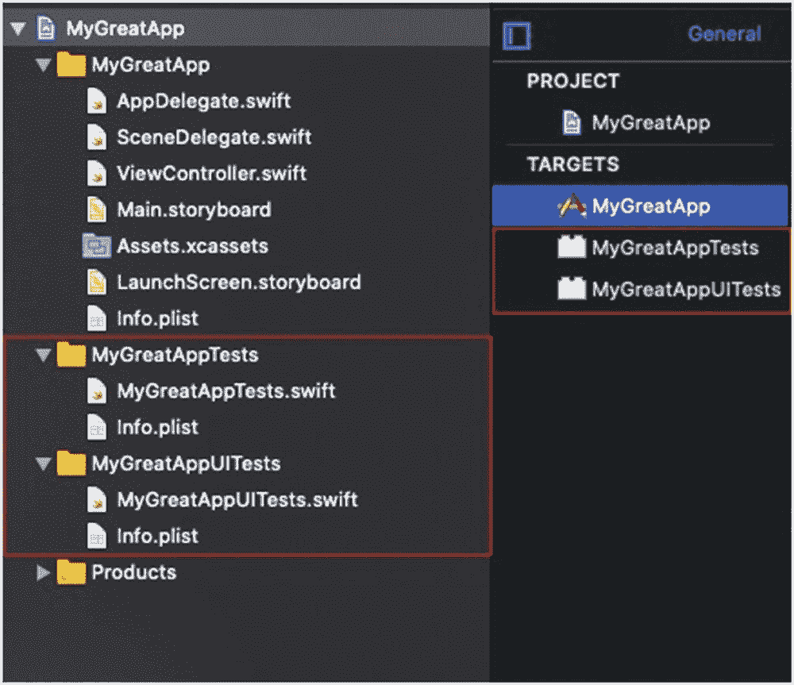

图 1-1 Xcode 项目中的测试目标

这些就是你项目的测试目标，它们的主要使命是帮助你监控代码质量和性能。这是通过使用测试函数来实现的，每个测试函数负责一个特定的用例。

一个测试函数可能看起来像这样：

```
func testPrimeNumberFunction() {
    // arrange
    let number = 7
    // act
    let result = MathService().isPrimeFunction(number: number)
    // assert
    XCTAssertTrue(result)
}
```

前面的代码是一个简单测试函数的示例，它检查一个名为 `isPrimeFunction()` 的函数是否能正确工作。

注意
尽管本书中的所有代码示例都是用 Swift 编写的，但你也可以用 Objective-C 编写测试。不过我相信，即使你的 Swift 知识有限，也能理解本书的大多数示例。

作为 iOS 开发者，我们每天都在编写函数。有些函数非常简单，但有些则极其复杂。我们如何确保它们在不同的情况下都能按预期运行？不仅如此，随着项目规模变大，我们如何确保不会随着时间推移而破坏它们？

如果我们认为自己是专业的开发者，那么编写测试就不是一项“可有可无”的任务——而是必须做的。而且，如果我们编写的代码足够整洁，编写测试也会变得轻松直接。

总的来说，你拥有的测试函数越多，你的代码就能得到更好的监控和控制。

本书的目的不仅是向你展示如何编写优秀且实用的测试，也旨在影响你的工作文化。


```markdown
## 为什么测试如此重要？

如果我们想更深入地理解测试在项目中的重要性，我可以想到以下几个原因：

**重构** – 有些人认为重构是一个贬义词，只有在出现危机或代码写得差时才会进行，但重构实际上是开发者日常工作的一部分。当我们编写代码时，是基于特定的产品假设、SDK 版本、架构、或是我们自身的经验和视角来进行的。但技术世界（尤其是移动端）的变化日新月异。我们常常发现自己每隔几个月，甚至更短时间，就需要重构部分代码。当我们编写测试时，我们定义的是代码的**行为**，而不是它的实现方式。当我们重构时，需要保持代码行为不变，而测试就是指引我们做到这一点的守护天使。不仅如此，测试实际上将代码的“质量”锁定在特定水平，这是确保我们进行修改时不会破坏任何功能的方法。

**自我检查** – 当我们编写一段代码或一个功能时，需要确保它在所有用例和场景下都能按要求工作。编写测试是检查自我并确保我们覆盖了满足产品需求所需的全部要点的绝佳方式。它也是确保我们覆盖了难以手动测试的边缘情况和用例的好方法。例如，假设我们正在开发一款日历应用，我们需要测试代码在拥有数百甚至数千个日历事件时的表现。模拟一台拥有如此多事件的设备既困难又耗时，更不用说我们需要反复运行这个模拟了。通过编写性能测试来自动化这个过程要高效和轻松得多。

**防止回归** – 代码中的回归不仅可能在我们重构时发生，也可能在我们对某个函数进行微小更改、更新 iOS 版本，甚至在新设备上安装我们的应用时发生。我们的测试覆盖越广，就越有机会捕获那些可能溜进生产环境的回归错误。有时，即使 QA 人员按照非常详细的测试计划工作，也很难在手动测试中发现回归。例如，快照测试（本章稍后解释）可以检测到 UI 中的细微变化，而性能测试可以检测代码速度或内存使用量的变化。此外，在进行标准的手动回归测试时，捕捉边缘情况问题也很困难，比自动化测试要困难得多。

**更好的代码质量** – 测试可以帮助我们想出代码可能遇到的不同用例。同时，测试可以帮助我们衡量代码资源（CPU/内存）的使用情况并帮助减少它。代码覆盖率报告可以帮助我们检测代码中未经测试的部分，甚至能通过观察代码本身提出我们未曾想到的产品问题。但我认为，测试对代码质量的最大贡献在于迫使我们编写更好的代码，更准确地说，是更好的架构。为了让代码可测试，我们需要编写更简洁、更模块化、更面向协议的代码，这是一个纯粹的收益。

**文档** – 我不得不承认——我讨厌为我的代码编写技术文档。我会写注释，但那只是因为不得不写。否则，即使在写下它们的第二天，我可能也记不清当时想实现什么。测试是为代码编写文档的好方法。试想一下——你选取一个函数，解释在不同参数和不同情况下调用它时期望发生什么。你不会找到比这更好的代码文档了。

## 我们可以测试什么？

简短的回答——一切。

冗长的回答——视情况而定。

如果你查看维基百科的“软件测试”页面，你会发现大约有 20 种不同的软件测试技术！但我们的目标是让生活更简单，所以这里只讨论其中一些与我们 iOS 开发者最相关的技术。

**单元测试** – 单元测试是测试的基础。单元测试负责测试应用程序中的小块代码，例如方法和函数。单元测试最适合重构和 TDD（测试驱动开发），你应该尽可能多地编写单元测试。

单元测试的目标是在忽略并将被测函数与任何可能的副作用或外部状态隔离的情况下，测试一个特定的函数或方法。此外，它们易于编写，运行速度非常快，可以并行运行，在开发功能时编写单元测试应该成为一个自然的步骤。

**集成测试** – 如果说单元测试是孤立存在的，专注于测试特定方法，那么有些情况下我们需要测试应用程序中两个或多个层之间的集成。

例如，有时我们想测试表示层/视图模型与数据层之间的集成。集成测试就是为此而生的。有人说集成测试是你在项目中可以拥有的最重要的测试，甚至比单元测试更重要，因为最终，单元测试各自的表现如何并不重要，重要的是它们如何协同工作。

**UI 测试** – UI 测试将我们的应用视为一个黑盒，并使用无障碍访问（Accessibility）层来操作它。基本指令可以是类似“点击这里”和“滚动到那里”，这最接近手动测试。尽管 UI 测试可以作为端到端测试并且非常有用，但它们成本高昂——比单元测试更难编写，运行速度也慢得多。而且每次功能变更都可能导致 UI 测试轻易失效。此外，由于 UI 测试只能查看无障碍访问层，它们无法生成代码覆盖率报告。因此，如果你想检测代码中未经测试的部分，UI 测试是无效的。

**快照 UI 测试** – 快照测试是 UI 测试的一个补充。快照测试的工作方式是截取屏幕或视图的快照，然后与之前捕获的代表正确状态的快照进行比较。其目标是识别应用程序中任何视觉上的变化，这是一个用其他方式很难完成的任务——例如，按钮位置、字体大小变化、布局问题等等。

**性能测试** – 在每个项目中，有些方法执行着繁重的任务。这些函数需要优化，而性能测试是最佳优化技术之一。性能测试会多次运行你的函数；计算平均 CPU 使用率、内存使用量和运行时间；并根据你可以预先设定的最低标准判断测试是通过还是失败。

你不需要用所有类型的测试覆盖项目的每个部分。例如，如果我们处理的是视图控制器或视图模型，我们可能希望编写**集成测试**，以确保当用户与我们的应用交互时，所有部分都能按预期工作。如果我们需要处理复杂的函数和类，我们会选择**单元测试**来全方位地覆盖我们的函数。如果这些是负载较重的函数，我们还可以添加**性能**测试。

秘诀在于创造恰当的组合，以便你能从不同角度和多个方面监控你的项目。

## 总结

我们讨论了什么是软件测试，它在 iOS 中是如何实现的，以及为什么它很重要。我们还讨论了与 iOS 开发相关的不同类型的测试。

现在，是时候卷起袖子，在 Xcode 中设置我们的测试基础设施，并将其集成到我们的项目中了。

# 2. 设置我们的基础设施

> *对于乐观主义者，杯子是半满的。对于悲观主义者，杯子是半空的。对于一个优秀的测试者，杯子比需要的足足大了一倍。*
> 
> —佚名
```


## 简介

如果没有深入了解 Xcode 项目是如何构建的，以及测试层如何与之集成，你就无法开始编写测试。

在本章中，你将学到：

1.  scheme、target 和 project 等基本术语
2.  如何使用 scheme 和测试包来自定义你的测试流程
3.  如何禁用特定测试的运行
4.  如何利用 Xcode 11 的强大功能——测试计划（Test Plan）——将你的测试流程提升到新的高度

## 基本术语

要开始测试你的应用，你需要理解 Xcode 中的一些基本术语以及你的项目是如何构建的。

让我们从一个核心的 Xcode 术语开始——**项目（Project）**。

项目是一个大型文件，它为你的不同产品映射了所有文件，包括构建设置、资源等等。它可以独立存在，可以被包含在一个工作空间（workspace）中，或者作为其他项目的一部分。

> *Xcode 项目是构建一个或多个软件产品所需的所有文件、资源和信息的存储库。项目包含用于构建产品的所有元素，并维护这些元素之间的关系。它包含一个或多个目标（target），这些目标指定了如何构建产品。项目为其内部的所有目标定义了默认的构建设置（每个目标也可以指定其自己的构建设置，这些设置会覆盖项目的构建设置）。*
>
> —Apple 官方文档

一个项目包含一个或多个产品定义，称为“目标（target）”。

**目标（Target）** – 一个目标代表一个要构建的产品，并包含了如何构建它的所有指令，包括要编译的文件、构建设置、构建阶段、代码签名和能力。一个目标不一定是一个“应用”。它也可以是一个框架/库、一个扩展（例如今日小组件），以及在我们这里，用于测试其他目标的单元/UI 测试包。

那么，我们明白了目标可以是应用本身，也可以是测试该应用的单元测试产品。但是，当我们开始测试、为应用商店构建，或者只是进行调试时，我们如何告诉 Xcode 要运行哪些测试目标，以及使用什么配置呢？

这就是**方案（Scheme）** 的作用。

**方案（Scheme）** – 方案将目标与不同的场景（构建、运行、测试、性能分析、分析和归档）连接起来，并且它还指定了要运行哪些目标以及使用什么配置。

解释这一点最好的方式是使用 Xcode，所以让我们启动一个名为“我的天气”的新应用。

## “我的天气”应用

要开始一个新项目，选择 文件 ➤ 新建 ➤ 项目…。会出现一个弹出对话框，要求你为新项目选择一个模板。你可以选择 iOS、watchOS、tvOS、macOS，甚至是一个跨平台项目。你的项目不一定是应用；它也可以是一个框架或一个静态库（参见图 2-1）。

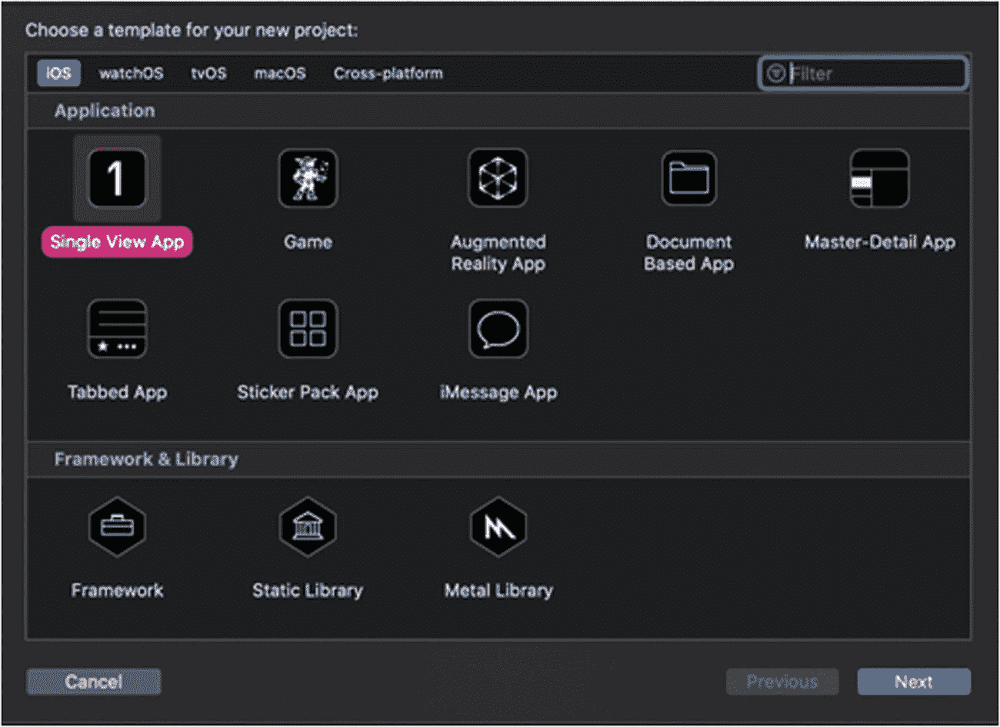

*图 2-1 Xcode 项目模板选择框*

**注意**

并非所有平台都可以使用 Xcode 工具进行测试。我们将在本节后面讨论这个问题。

选择模板后，你会被引导到第二个对话框，你需要填写一些关于项目的详细信息。有些字段是必须填写的才能继续（这就是为什么“下一步”按钮是禁用的）。请看底部的两个选项（图 2-2，用红圈圈出）。这些选项是根据你选择的平台和模板建议给你的。如果你勾选了它们，Xcode 会为单元测试和 UI 测试创建基础结构。你以后随时可以再添加。

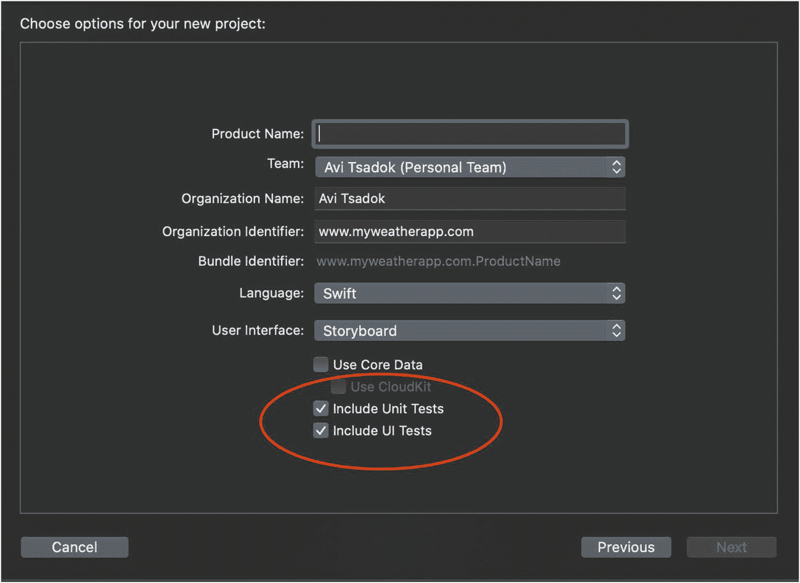

*图 2-2 新项目设置框*

正如我前面提到的，并非所有平台和模板都包含这些选项。例如，截至本文撰写时，你无法为 Apple Watch 应用添加任何测试。如果你创建的是一个框架或库，则只能添加单元测试，不能添加 UI 测试。由于我们全新、前沿且屡获殊荣的“我的天气”应用是一个 iOS 应用，我们可以同时添加单元测试和 UI 测试。

按下“下一步”按钮后，我们的项目窗口打开了（图 2-3），我们可以在目标列表中看到新的测试包。在项目导航器中，我们可以看到两个测试包，单元测试和 UI 测试，作为两组文件。这些是我们保存编码测试的地方。对于创建的每个目标，Xcode 都会在项目导航器中创建一个专用的文件组。

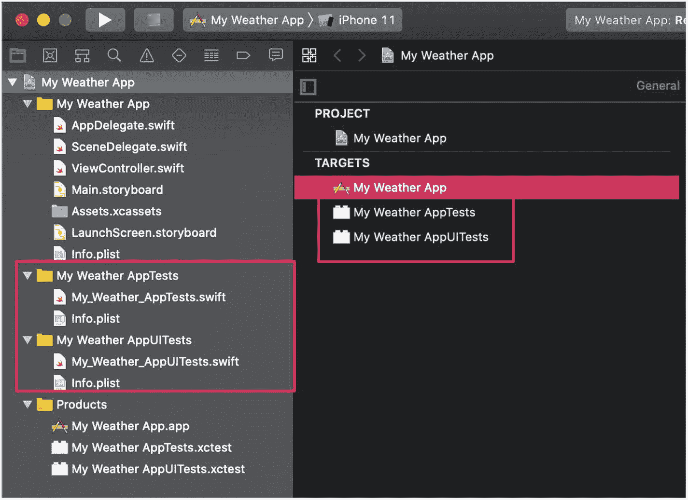

*图 2-3 测试目标同时出现在目标列表和文件层次结构中*

**注意**

项目导航器中有代表指向实际文件夹链接的“组（Groups）”，也有代表逻辑文件夹的“组”。在本例中，创建的两个组指向项目根文件夹中的两个文件夹。

### 向现有项目添加测试目标

当然，你不需要为了添加 UI 和单元测试而创建一个新项目。向现有项目添加测试非常简单——就像添加任何新目标一样。要添加一个新的测试目标，请转到 文件 ➤ 新建 ➤ 目标…。在屏幕上出现的“选择模板”框中，寻找 UI 测试包或单元测试包目标。你可以利用该框顶角的搜索字段（参见图 2-4）。再次说明，并非所有平台都有添加测试的选项，因此请确保选择了正确的平台。

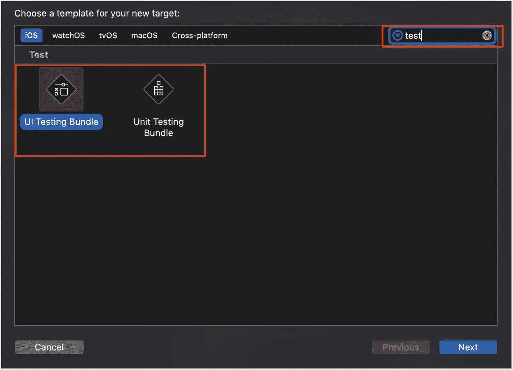

*图 2-4 向现有项目添加测试目标*

点击“下一步”后，你会被导航到一个与新项目对话框非常相似的新对话框。除了所有需要填写的常规属性，如 bundle ID 和名称外，最重要的属性是“要测试的目标（Target to be Tested）”。这个目标是你的新测试包要测试的实际“产品”（应用或框架）。“要测试的目标”之后也可以更改（参见图 2-5）。

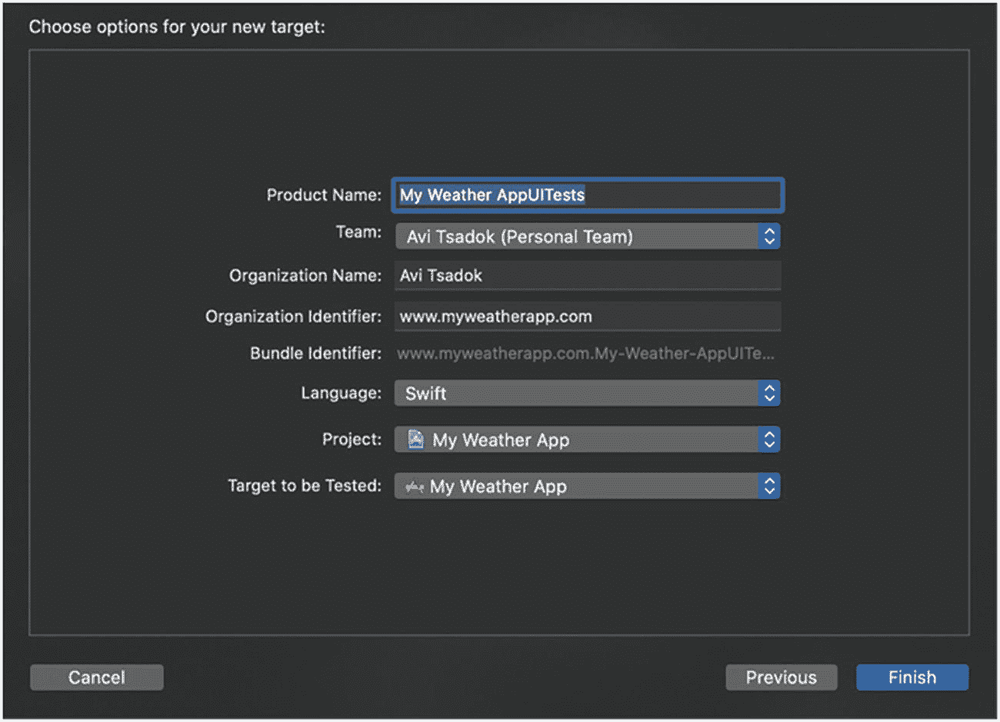

*图 2-5 为新测试目标选择选项*


### 将一切关联起来

在本章的开头，我提到了“方案”这个术语。方案允许您为不同类型的场景定义所有的构建配置和选项。您可以拥有多个方案，帮助您为应用配置不同的场景和状态。例如，您可以有一个用于开发环境的方案，或者一个使用优化代码运行性能测试的方案。

当您查看 Xcode 窗口左上角，“停止”按钮旁边时，可以看到方案菜单和选中的方案。


工具栏中的方案弹出菜单

点击方案名称，然后从弹出菜单中选择“编辑方案”。会弹出一个包含可用操作列表及其配置的窗口。

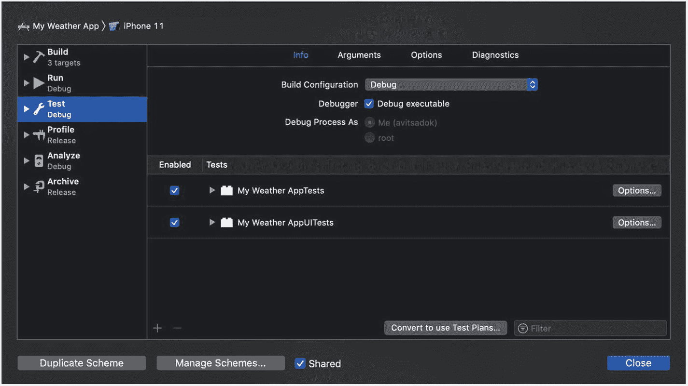

方案编辑窗口

我们来逐一了解这些操作：

*   **构建** – 编译您的应用但不运行它。
*   **运行** – 构建您的应用并在模拟器或设备上运行。
*   **测试** – 构建您的应用并运行方案中定义的已启用测试。
*   **性能剖析** – 运行您的应用，并使用 Instruments 进行性能剖析。
*   **分析** – 构建应用，并提供关于代码的深入洞察。
*   **归档** – 构建您的应用并从中创建 IPA 文件以提交到 App Store。

在本章中，我将重点关注“测试”操作。点击“测试”操作会显示四个标签页：**信息**、**参数**、**选项**和**诊断**。

## 信息标签页

**信息** – “信息”标签页包含方案中测试操作的一般信息。这里最重要的两个设置是**构建配置**和**测试列表**。

在`构建配置`中，您可以定义测试是在`调试`、`发布`还是自定义构建配置下运行。在某些情况下，这很重要 – 例如，有时您可能希望针对 App Store 的优化代码运行测试，或者有时您希望使用某些标志运行测试。

在测试列表中，您可以看到与该方案中可执行产品相关的所有测试。请记住，您可以创建任意数量的测试，但正是在这里，您定义了当您使用此方案测试应用时，**执行哪些**测试。

列表中每个测试旁边都有一个启用的复选框按钮，用于指定该测试是否运行。右侧有一个名为“选项”的按钮。点击它，您可以设置测试**如何**运行（同样，仅在此方案中）。

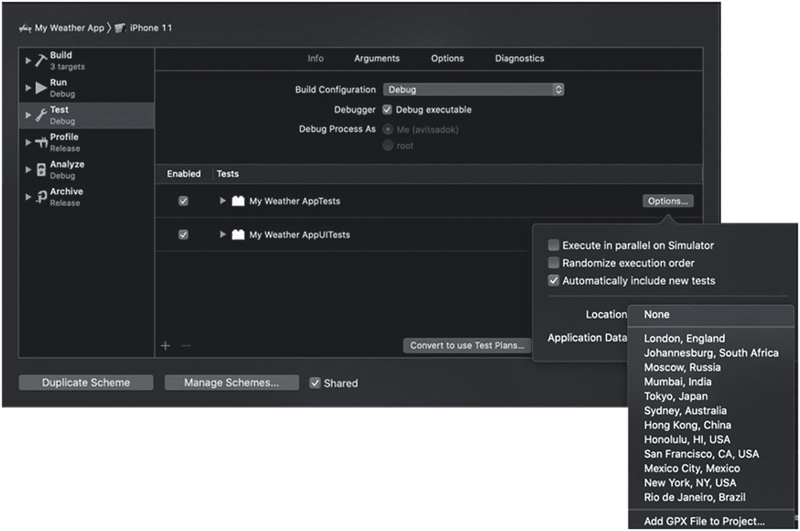

方案编辑器中的测试选项菜单

这个选项菜单对许多开发者来说是陌生的，并且这个按钮看起来可能不重要，但它包含了非常有价值的设置。

### 并行测试

第一个选项是能够**并行执行您的测试**。在 Xcode 9 之前，您一次只能在一个模拟器上运行测试。在 Xcode 9 中，Apple 提供了在多个模拟器上运行测试的能力。Xcode 会启动多个模拟器，并在每个模拟器上运行完整的测试包。尽管这个选项在您希望在不同设备上运行测试时可以加快测试执行速度，但它并没有加速测试包本身。

Xcode 10 终于带来了真正的并行测试 – 它会启动多个测试运行器（`模拟器`），每个测试运行器执行不同的测试类。模拟器的数量取决于运行机器的可用核心数。

在您为并行测试功能欢呼之前，应该注意以下几点：

*   并行测试会消耗大量的**处理能力**。如果您想利用此功能，最好在性能强大的机器上将其作为持续集成流程的一部分运行。
*   在并行测试中，每个模拟器接收不同的测试类。不同的测试类意味着您**不能在测试之间创建依赖关系**。例如，`testB()` 不能依赖于 `testA()` 的成功，而应该独立运行。独立的测试很重要，特别是在 UI 测试中，有时测试需要以另一个测试结果导致的特定状态开始。
*   如果您的测试需要与服务器交互，并行运行可能会导致**网络请求瓶颈**，从而导致超时和测试失败。通常，在测试中依赖网络并非最佳实践，但在某些集成和端到端场景中，有时您无法避免。

### 随机化执行顺序

在我看来，“随机化执行顺序”比并行运行测试更重要。后者影响测试运行的持续时间，而“随机化执行顺序”选项影响您编写测试的方式。

让我从一个许多开发者在编写测试时常用的技巧说起 – 在许多测试类中，您可能会看到类似这样的代码：

```
func test01() {
...
}
func test02() {
...
}
```

开发者试图在这里做的技巧是让这些测试按特定顺序运行。`XCTest` 框架**按字典顺序运行测试**，因为 `01` 大于 `02`，所以 `test01` 在 `test02` 之前运行。

对某些人来说，按固定顺序运行测试可能很方便。它可以帮助您从前一个测试结束的状态开始测试，并在您想要测试用户流程时节省宝贵时间。但这个功能是有代价的 – 按固定顺序运行测试会在您的测试之间产生依赖，这使得您的测试套件更加脆弱。每一个微小的更改都可能导致一个测试失败，并因此导致其余所有测试失败。

测试应该独立运行，不依赖于另一个测试的外部或先前状态。确保测试稳定的唯一方法是打开“随机化执行顺序”。随机化测试顺序会迫使您编写独立的测试。最好依赖依赖注入，使您的代码更具可测试性。

### 位置和应用程序数据

在集成测试和 UI 测试中，最具挑战性的任务之一是模拟不同的条件，例如设备位置和应用程序状态。如果我们在集成测试中可以使用依赖注入以某种方式解决这个问题，那么在 UI 测试中做起来要困难得多。一个常见的用例是为某个难以调试的 bug 或边界情况模拟特定条件。

在方案编辑器的“测试”操作下，我们还有另外两个选项：**位置**和**应用程序数据**。让我们来了解一下它们。


#### 位置

`Location` 选项允许你为测试包模拟特定的地理位置，甚至模拟移动。没有位置功能，模拟位置变化或移动跟踪会非常困难。

编辑器方案中的位置弹出菜单包含一个预定义位置列表，如伦敦、莫斯科、纽约等。

你不必局限于预定义列表，可以使用名为“GPX”的文件格式创建自己的位置。GPX（GPS 交换）文件包含位置数据，如经度和纬度、航点、路线和轨迹。GPX 的基本格式是 XML，你可以在任何文本编辑器或在线生成器中创建此类文件。Xcode 本身也有创建 GPX 文件的选项，从菜单中选择`File`➤`New`➤`File`，并在对话框中搜索`GPX`（参见图 2-9）。

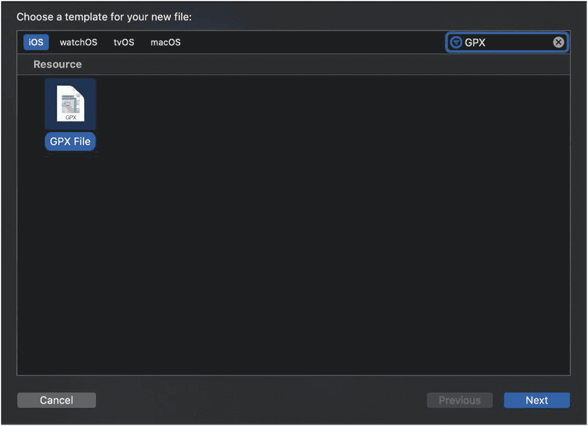

图 2-9 创建 GPX 文件模板

GPX 文件的基本格式应类似于：

```xml
<?xml version="1.0" encoding="UTF-8"?>
<gpx version="1.1">
 <wpt lat="40.7484" lon="-73.9857">
   <name>Empire States Building</name>
 </wpt>
</gpx>
```

将文件添加到项目后，你可以在位置列表中看到“Empire States Building”位置（参见图 2-10）。

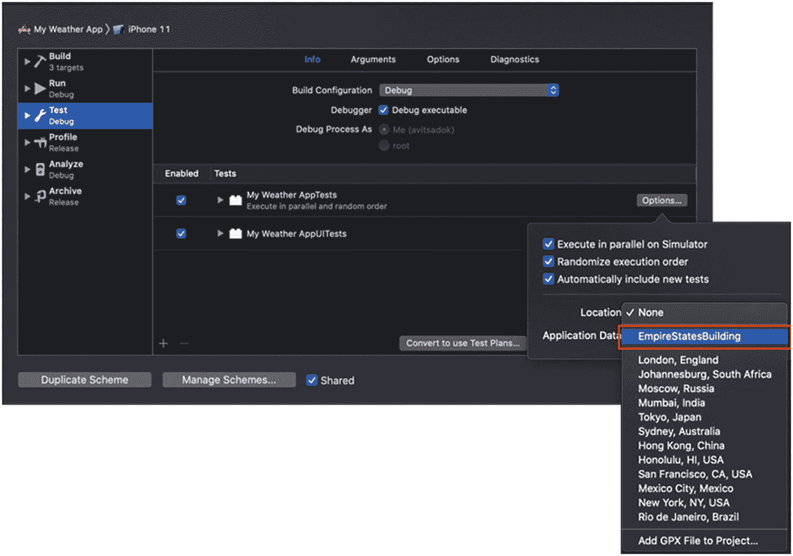

图 2-10 从位置列表中选择新的自定义位置

GPX 文件也可以包含移动。实现方法是通过添加多个位置和时间戳，以便 Xcode 可以根据所需的速度模拟位置变化。

```xml
<wpt lat="40.7484" lon="-73.9857">
  <time>2020-03-01T16:25:12Z</time>
</wpt>
<wpt lat="40.7580" lon="-73.9855">
  <time>2020-03-01T16:25:17Z</time>
</wpt>
<wpt lat="40.7692" lon="-73.9850">
  <time>2020-03-01T16:25:26Z</time>
</wpt>
```

#### 应用程序数据

Xcode 的一个简洁功能是能够以特定的应用状态加载应用程序，包括持久数据、用户默认设置甚至缓存。使用名为`XCAppData`文件的内容加载特定数据的应用程序。`XCAppData`文件是一个包含所有应用程序数据的文件包，包括`Documents`、`Library`、`Cache`和`Temporary`文件。

要获取`XCAppData`文件，你需要确保设备已连接到 Mac，然后转到`Window`➤`Devices and Simulators`。在打开的窗口中，在左侧找到你连接的设备并选中它。现在你应该能看到配对的 Apple Watch 列表和已安装的应用程序（参见图 2-11）。

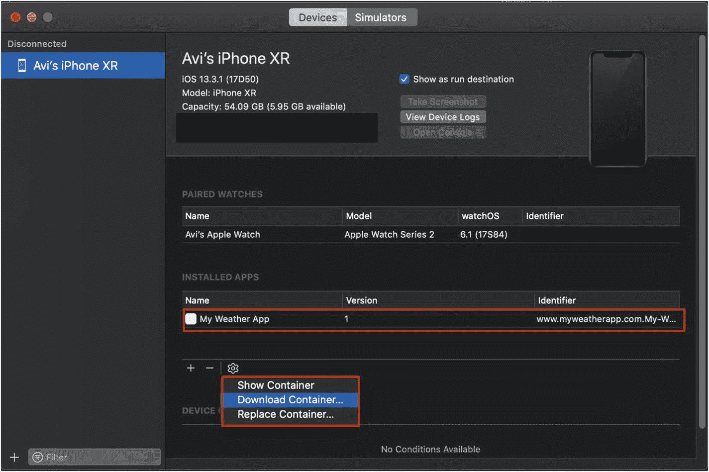

图 2-11 从你连接的 iPhone 下载应用程序数据容器

选中你的应用程序后，你可以将其应用程序数据容器下载到 Mac。你应该会看到格式如下的文件：

```
..xcappdata
```

例如：

```
www.myweatherapp.com.My-Weather-App 2020-03-10 06/32.03.037.xcappdata
```

你应该知道`.xcappdata`是一个包，意味着它是一个显示为普通文件的系统目录，其中包含额外的文件和目录。要打开包，请在 Finder 中右键单击该包，然后选择“显示包内容”。之后，你可以看到应用程序数据文件的层次结构（参见图 2-12）。

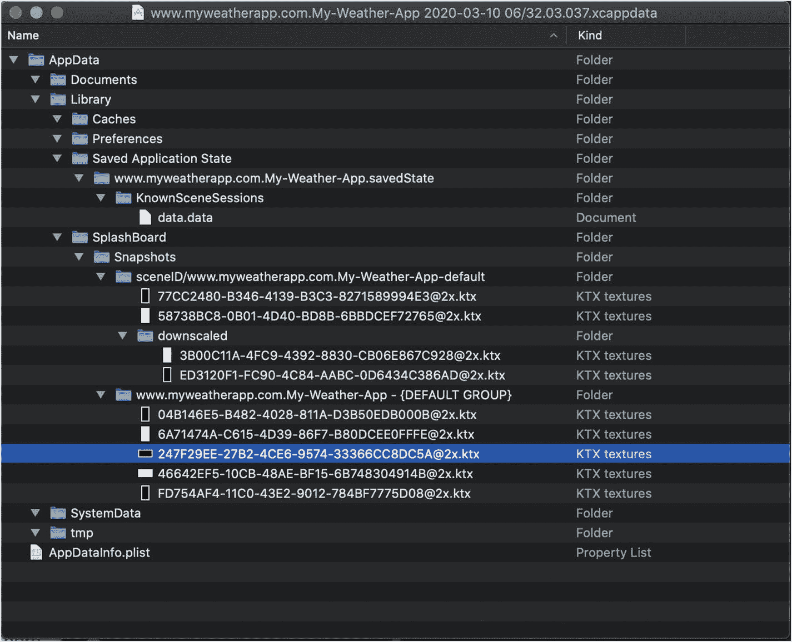

图 2-12 在 Finder 中展开的应用程序数据包

如图 2-12 所示，该包包含你设备存储的所有应用程序数据，包括文档、临时文件、状态，甚至系统用于应用程序切换用户体验的应用程序屏幕截图。

如果你想在 Xcode 设置中使用应用程序数据包（`.xcappdata`文件），需要将其添加到项目中。

在你的项目中创建一个新组，比如“Tests Data”，并将该包添加到该文件夹中。确保`xcappdata`不属于任何目标。

> **注意**
>
> 你希望在你的方案中使用的文件，例如`GPX`文件和数据包，不应添加到任何目标中，即使是你的测试目标也不行。如果文件属于某个目标，它将被捆绑到最终产品中，不仅会增加应用程序的大小，还可能泄露安全和敏感的隐私信息。

## Arguments 选项卡

Xcode 的方案编辑器中还有另一个简洁且鲜为人知的功能，隐藏在`Arguments`选项卡下，称为`Launch Arguments`和`Environments Variables`（参见图 2-13）。

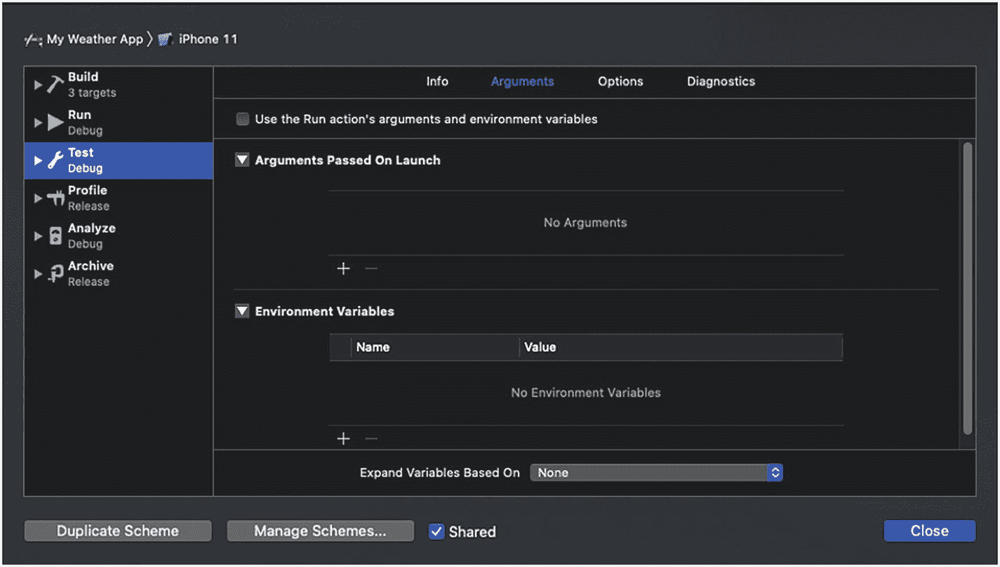

图 2-13 方案编辑器中的 Arguments 选项卡

`Arguments`选项卡允许你通过设置仅在此方案中应用于应用程序的参数和变量来控制应用程序的运行。

### 启动参数

假设我们想为“我的天气”应用程序添加“应用内购买”功能，并且我们希望在用户已经注册了我们的高级订阅时运行集成和 UI 测试。

许多开发人员测试应用内购买的典型方法是在检查用户是否注册的函数中返回“true”（请查看以下代码）：

```swift
func isTheUserRegistered()->Bool {
    return true
    // 其余"真实代码"，检查钥匙串是否包含有关用户购买的信息
    ...
}
```

在进行开发时检查时，返回“true”可能没问题，但像这样运行测试可能不是正确的解决方案。

幸运的是，我们可以使用“Arguments Passed on Launch”列表轻松地在运行时更改值。

参数是在启动时传递给应用程序的值列表，可以在代码中轻松读取。

你的应用程序可以使用参数来运行特定的标志，而无需重新编译或使用不同的目标。参数在测试中可能非常方便，因为有时你想要模拟应用程序中的不同层，例如网络、数据库等。

要添加新参数，请转到方案编辑器中的`Arguments`选项卡，在参数列表下，点击加号按钮（参见图 2-14）。

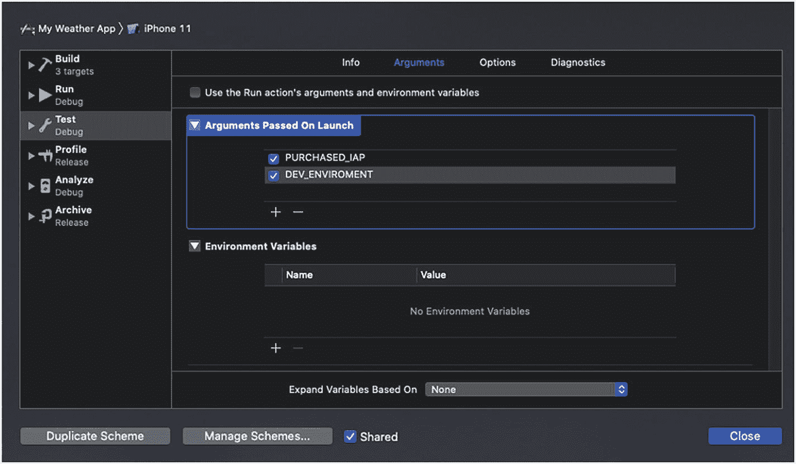

图 2-14 添加的参数列表

如果你不希望在启动时传递某个参数，无需将其从列表中删除，只需取消选中其名称旁边的复选框即可。

在你的代码中有两种类似的方式来读取参数列表：`CommandLine`和`ProcessInfo`。

查看以下代码：

```swift
func application(_ application: UIApplication, didFinishLaunchingWithOptions launchOptions: [UIApplication.LaunchOptionsKey: Any]?) -> Bool {
    var purchasedIAP = CommandLine.arguments.contains("PURCHASED_IAP")
    // 或者我们可以使用 ProcessInfo
    purchasedIAP = ProcessInfo.processInfo.arguments.contains("PURCHASED_IAP")
    if purchasedIAP {
        // 在这里做一些有用的操作...
    }
    return true
}
```

为了澄清两者之间的区别，`CommandLine`是 Swift 的一部分，其主要目标是读取命令行参数，在这种情况下是启动时传递的参数。

`ProcessInfo`是 Foundation 的一部分，它包含有关当前进程的信息，包括变量、主机名，以及像`CommandLine`一样的参数列表。

为了读取参数的目标，你可以使用它们中的任何一个。


### 环境变量

与许多其他开发环境类似，iOS 也有类似的功能，称为“环境变量”。环境变量是键值对的集合，它不仅让你能够通过参数列表来配置应用，还可以通过具体的值来配置。

添加环境变量就像添加参数一样简单。点击变量列表下方的加号按钮，然后添加一个新变量（参见图 2-15）。

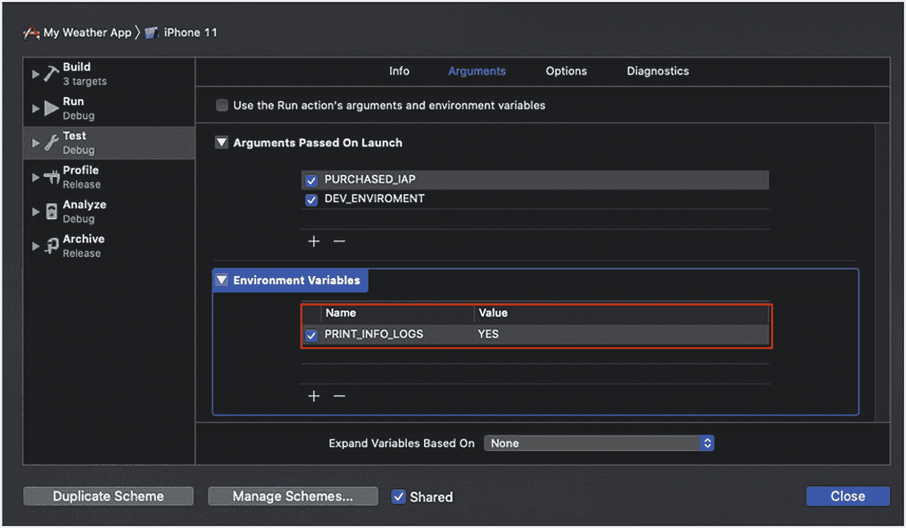

图 2-15 向方案添加新的环境变量

```
func application(_ application: UIApplication, didFinishLaunchingWithOptions launchOptions: [UIApplication.LaunchOptionsKey: Any]?) -> Bool {
let printInfoLogs = ProcessInfo.processInfo.environment["PRINT_INFO_LOGS"]
return true
}
```

添加环境变量也是一种配置 UI 测试的好方法，它可以让你每次用不同的参数动态启动应用。UI 测试将在本书后续章节中进行介绍。

## 选项选项卡

选项选项卡包含与你的测试相关的各种设置（参见图 2-16）。

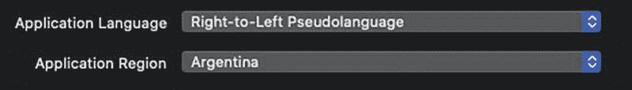

图 2-17 应用语言设置

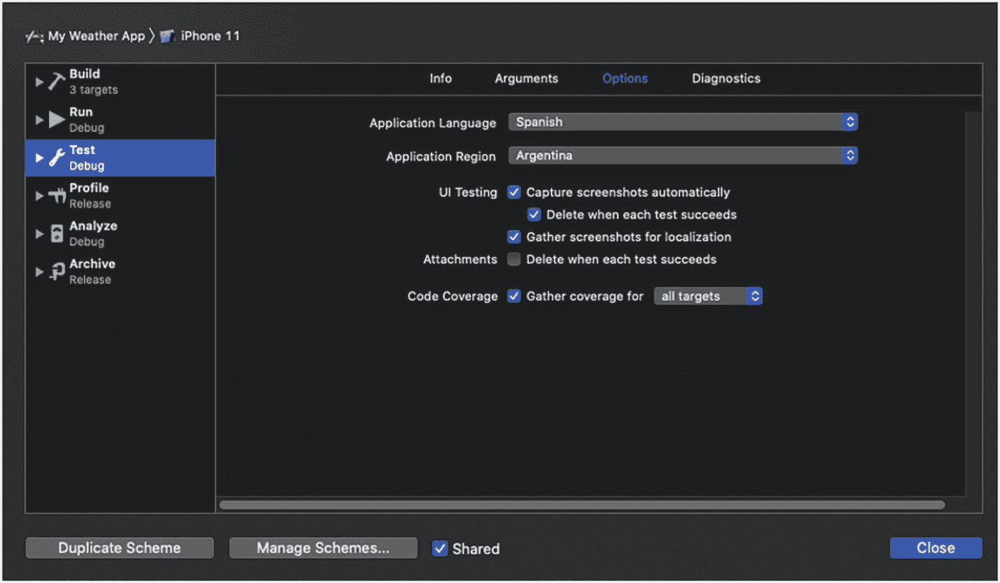

图 2-16 方案编辑器中的选项选项卡

让我们逐一看看这些设置：

*   **应用语言** – 移动开发的最大挑战之一是本地化——LTR（从左到右）与 RTL（从右到左）以及包含长词和短语的语言。使用此选项，你不仅可以设置设备语言，还可以模拟不同的文本方向，甚至可以将文本长度加倍以检测 UI 布局问题。
*   **应用区域** – 不同的区域意味着不同的日期格式、不同的货币和不同的计量系统。通过选择应用区域，你可以模拟设备处于另一个区域来测试你的应用。

    **注意** 虽然设置不同的语言和区域来测试功能很方便，但有时当你想为不同区域多次运行单元测试时，这可能不太容易。在本书后续章节中，我将介绍如何无需依赖方案选项，而是通过优秀且可测试的架构来实现这一点。
*   **UI 测试** – 与单元测试和集成测试不同，找出 UI 测试失败的原因可能有点棘手。截图和附件是显示失败原因和当时应用状态的最佳方式。UI 测试选项可以让你配置测试如何处理附件和截图。
*   **代码覆盖率** – 我们在第 1 章讨论过代码覆盖率。如果不勾选此选项，`Xcode` 将在测试期间不会收集代码覆盖率数据。

## 诊断选项卡

诊断选项卡与“运行”下的诊断选项卡几乎相同。此选项卡包含的工具可以帮助你在运行测试时确定应用的问题，例如内存损坏和线程问题（参见图 2-19）。

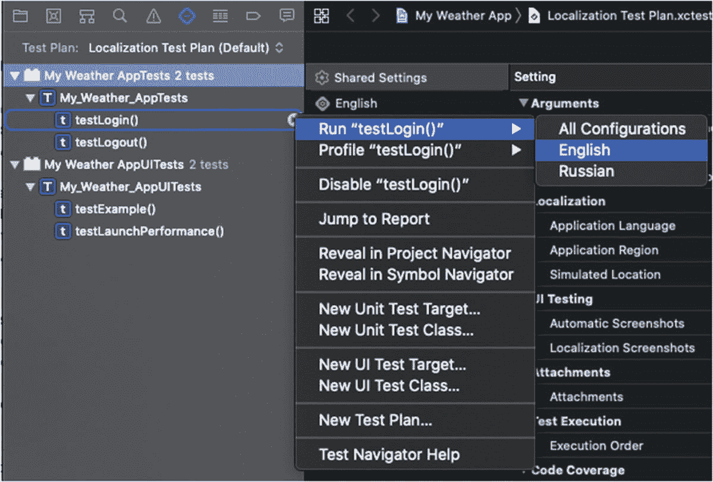

图 2-28 仅运行英语配置

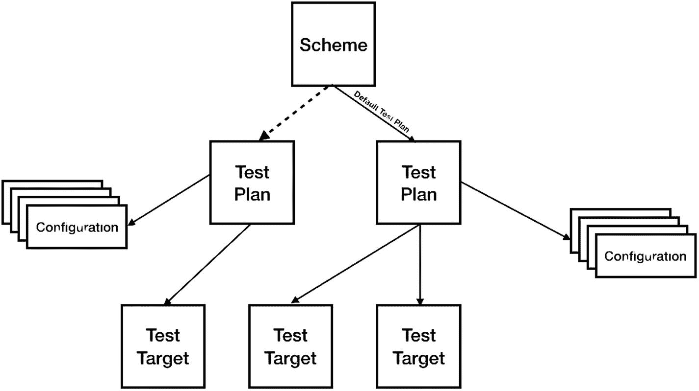

图 2-27 方案、测试计划、测试和配置如何链接在一起

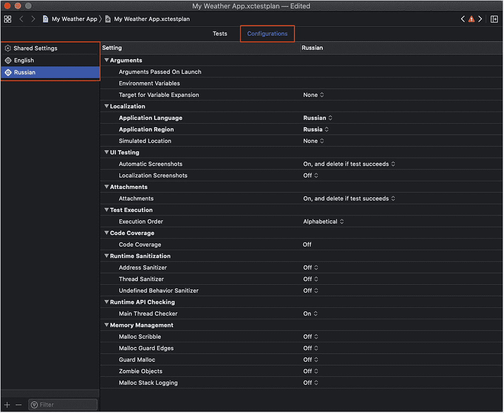

图 2-26 测试计划配置

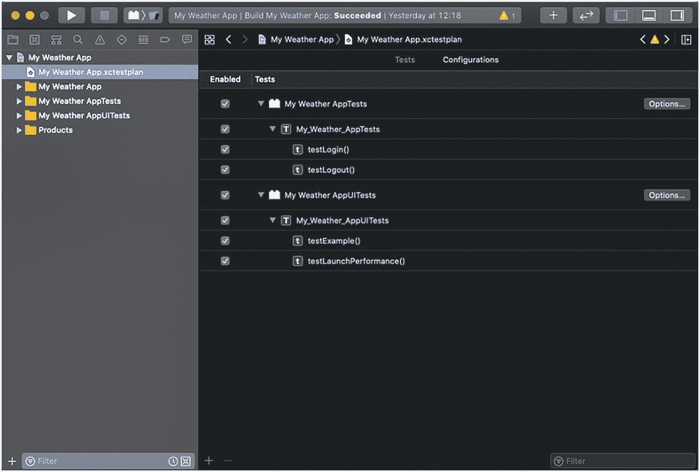

图 2-25 测试计划编辑屏幕

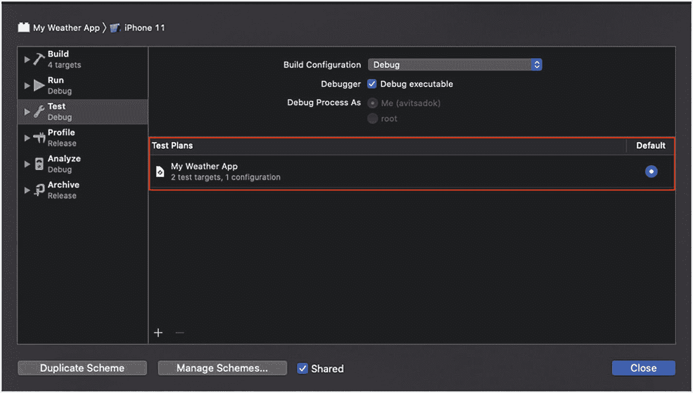

图 2-24 转换方案使其测试使用测试计划

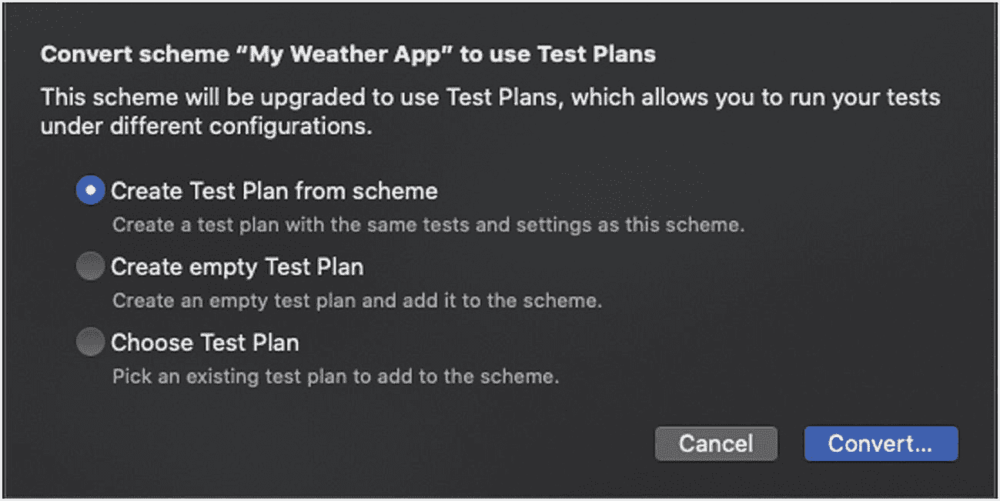

图 2-23 转换方案以使用测试计划

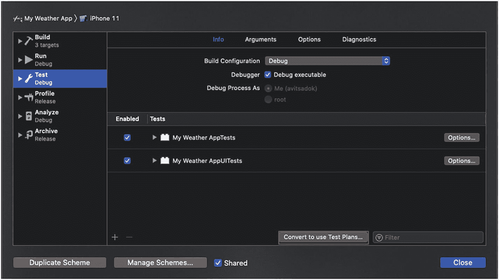

图 2-22 方案编辑器，“转换为使用测试计划…”按钮

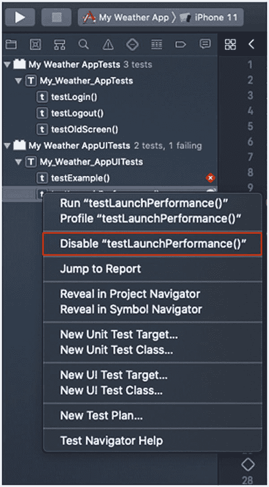

图 2-21.

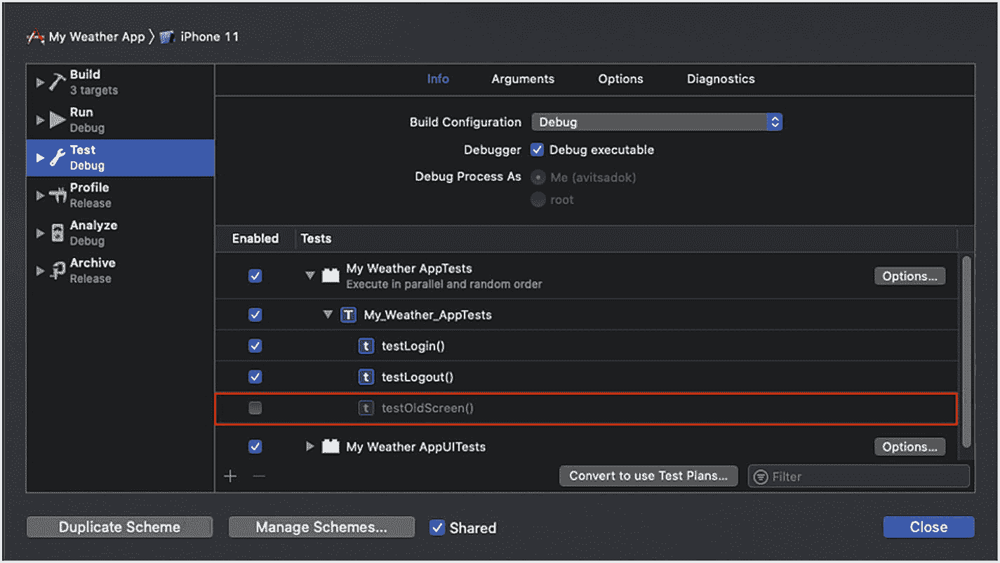

图 2-20 从方案编辑器禁用特定测试

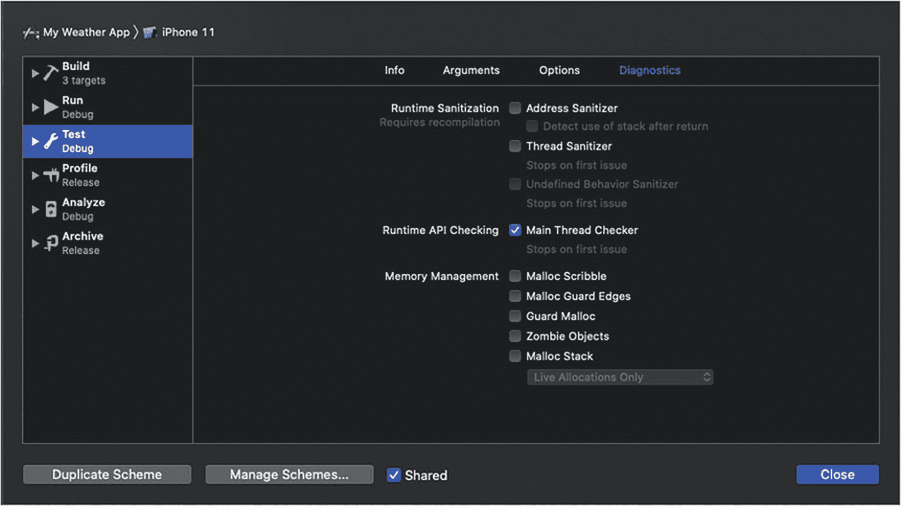

图 2-19 方案编辑器中的诊断选项卡

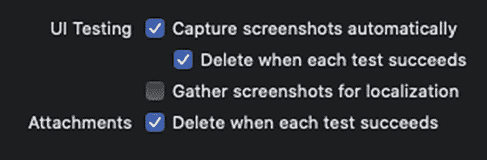

图 2-18 应用语言和应用区域设置

由于这些工具并非专门与测试相关，我将简要介绍它们。

如果你想更好地调查问题，我建议你深入学习这些工具。

*   **地址消毒器** – 这个工具在 `Xcode 7` 中引入，可以帮助你调试应用的内存损坏问题。这些问题不一定只是崩溃——也可能是一般的错误。地址消毒器与单元测试的结合在处理棘手错误时非常有益，但你应该注意这个工具的两个缺点：
    *   `Address Sanitizer` 对于 C 和 `Objective-C` 代码比对于 `Swift` 代码更相关。
    *   `Address Sanitizer` 有性能开销——启用时，你的应用会消耗 2 到 3 倍的内存以及 2 到 5 倍的 CPU 性能。虽然在运行测试时这可能看起来不是大问题，但在运行性能测试并测量关键指标（如 CPU 时间和内存）时，这可能是个问题。
*   **线程消毒器** – `Thread Sanitizer` 是另一个基于 LLVM 的工具，可以帮助你检测线程间的数据竞争，这可能导致不可预测的行为。与 `Address Sanitizer` 类似，`Thread Sanitizer` 也有开销——内存使用量增加 5 到 10 倍，CPU 性能增加 2 到 20 倍。此外，你无法在真机上运行 `Thread Sanitizer`，只能在模拟器上运行。
*   **主线程检查器** – 每个开发者开始 iOS 开发时学到的首要规则之一就是永远不要在后台运行 UI 操作，只能在主线程上运行。`Main Thread Checker` 会在检测到在任何后台线程执行 UI 操作时暂停你的应用。在 UI 测试中，这非常有用，因为你完整运行应用并确信所有操作都在正确的线程上执行。
*   **Malloc 涂写** – 通过在释放的内存中填入预定义的值，帮助你调试引用计数循环，从而在内存图中获得更准确的结果。
*   **Malloc 保护边缘** – 在大内存分配前后添加保护页。
*   **保护性 Malloc** – 帮助你捕获常见的内存问题，如缓冲区溢出和释放后使用。
*   **僵尸对象** – `Xcode` 提供的最受欢迎的工具之一。`Zombie Objects` 是被释放（引用计数为 0）并被僵尸对象替代的对象。`Zombie Objects` 可以通过在内存中保留变量的副本，帮助你跟踪变量。


## 排除测试类

您可能会想：“有一个完整的章节都在阐述测试的重要性。那我们究竟为何要将某些测试从测试包中排除呢？”

这是因为，在大型、历史悠久的项目中，有时由于大规模的结构变更，测试可能会失败，甚至无法编译。这时，我们希望能暂时禁止它们运行。

Xcode 不仅允许您在方案设置中禁用整个测试包，还可以禁用特定的测试类，甚至单个测试函数。

有三种方法可以实现：通过方案编辑器、通过测试导航器、以及通过重命名测试函数。

### 通过方案编辑器禁用测试

如果您希望在特定方案中禁用某个测试，可以在方案编辑器中取消勾选它。打开方案编辑器，在`Test` ➤ `Info`下，展开测试包列表中的相应测试包。

请记住，禁用测试仅对该特定方案生效，因此请确保您在目标方案上进行此操作。

同样，您可以通过取消勾选类名旁的复选框来禁用整个类，或者通过取消勾选测试包名称旁的复选框来禁用整个测试包。

### 通过测试导航器禁用测试

或许禁用测试最简单的方法是通过测试导航器或代码编辑器。

在导航窗格中，通过选择或按`⌘-6`打开测试导航器。

找到您想禁用的测试，右键点击它。

从弹出的菜单中选择`“Disable <测试名称>”`。对类和测试包也同样可以进行禁用操作。如果测试已被禁用，您可以从同一菜单中重新启用它。

这种方法在代码编辑器中同样适用——右键点击您想禁用的类的函数，然后选择`“Disable <函数名称>”`。

### 通过重命名来禁用测试

另一种禁用测试的方法是为其添加一个非`“test”`前缀来重命名它们。由于 Xcode 只运行以`“test”`开头的测试函数，更改前缀就会禁用它们。

```
func testLogin() {
// 测试代码
}
func testLogout() {
// 测试代码
}
func disable_due_refactor_testOldScreen() {
// 测试代码
}
```

在上面的例子中，Xcode 会忽略第三个函数，因为我们改变了它的前缀。

通常来说，重命名测试函数被视为一种反模式，您应该遵循使用方案编辑器或测试导航器来禁用测试的自然方式。不过，重命名测试函数确实有一个优势——您可以根据不同原因设置不同的前缀，然后通过搜索前缀来定位它们。当您正在进行大规模重构并希望按类别禁用测试时，重命名函数名是一个便捷的方法。

> 最好永远不要将禁用的测试永久搁置。测试被禁用只应是一种临时状态；其存在仅是为了让我们的项目能够编译。那些测试之所以存在是有原因的；请记住这一点。

## 创建多少个测试包？

测试包的数量因项目而异，但如果必须选择一个经验法则，我会说是**关注点分离**。如果您还记得第一章的内容，测试有多种类型：UI 测试；单元测试（包括 BDD 和 TDD）；集成测试和性能测试。单元测试可以用于 BDD、TDD、集成和性能。UI 测试可以用于 BDD。但是，根据公司流程来分离您的测试包是最佳实践。例如，如果您在开发一个重要的新功能，可以为其创建一个测试包，这样在需要时只运行它会更容易。

以下是一些关于如何分离测试的思路：

*   将 BDD 与 TDD 分开。
*   将回归测试与冒烟测试、功能测试分开。
*   将重要功能与其他功能分开。

将项目分离到不同的测试包可以在未来为您提供必要的灵活性，并有助于维护和控制您的测试基础设施。

## 测试计划

我们已经看到，方案是配置测试运行的强大工具。现在，假设您希望每次以不同配置多次运行测试。不同的配置意味着您要么需要创建不同的方案并逐个运行它们，要么在每次运行测试前更改当前测试方案的配置。

幸运的是，苹果在 Xcode 11 中引入了一项名为`“Test Plans”`的新功能，正是为了解决这个问题——使用不同配置多次运行相同的测试套件。

### 让您的工作更轻松的测试计划

测试计划将 Xcode 中测试运行自定义的能力提升到了一个新的水平，它让您可以灵活地使用不同的设置多次运行测试。每个测试计划都可以测试您应用中可能存在的不同问题。开发者可能遇到的最常见问题或许是**本地化**——您可以创建一个专门用于本地化的测试计划，并一遍又一遍地运行相同的测试，但使用不同的语言和地区。

对于当前您在方案编辑器中拥有的几乎所有选项，情况也是如此。

### 创建您的第一个测试计划

开始使用测试计划功能的最简单方法是直接在方案编辑器中操作。转到您的方案编辑器，在 Test 操作中，您可以在测试包列表下方找到一个名为`“Convert to user Test Plans…”`的按钮。

点击该按钮后，会出现一个对话框，您需要选择如何将新方案转换为使用测试计划。

我们来谈谈这三个选项：

*   `Create Test Plan from Scheme` – 此选项根据当前方案配置创建一个测试计划。毕竟，测试计划配置与方案测试配置相似，用旧选项创建新测试计划很容易。`“Create Test Plan from Scheme”`是您项目创建第一个测试计划时的推荐选项。
*   `Create Empty Test Plan` – 创建一个关于方案测试配置的新测试计划模板。
*   `Choose Test Plan` – 将现有测试计划添加到方案中。它可以是您从头创建的测试计划（测试计划是一个 XML 文件；您可以用任何文本编辑器创建），但在大多数情况下，当您创建新方案并希望将其连接到另一个方案的现有测试计划时，此选项非常方便。

创建测试计划后，它会保存到您的项目中，并且 Xcode 会将方案升级为使用测试计划，而非我们之前介绍的旧`Info/Arguments/Options/Diagnostics`界面。

一个方案可以包含多个测试计划。在每个测试计划中，您可以看到它运行多少个测试目标以及有多少种不同的配置。

当您为此方案选择`“Test”`（`Command + U`）时，标记为默认的测试计划将根据其配置运行。


### 测试计划配置

如果我们打开添加到项目中的新 `My Weather App.xctestplan` 文件，可以看到它只是一个简单的 XML 文件：

```
{
"configurations" : [
{
"id" : "C9003BF5-4AD2-45D6-BB60-30C721C0D075",
"name" : "Configuration 1",
"options" : {
}
}
],
"defaultOptions" : {
"codeCoverage" : false
},
"testTargets" : [
{
"target" : {
"containerPath" : "container:My Weather App.xcodeproj",
"identifier" : "9032DE112411A30D00F8F02D",
"name" : "My Weather AppTests"
}
},
{
"target" : {
"containerPath" : "container:My Weather App.xcodeproj",
"identifier" : "9032DE1C2411A30D00F8F02D",
"name" : "My Weather AppUITests"
}
}
],
"version" : 1
}
```

尽管我们不应该直接编辑 `.xctestplan` 文件，但可以了解到测试计划其实非常简单。它包含一个配置数组和一个测试目标数组。测试计划还有一个默认选项部分，以防配置本身没有设置这些选项。

在项目导航器中点击测试计划，将打开测试计划编辑界面（参见图 2-25）。

如你所见，你可以启用/禁用测试包、测试类和测试函数，就像在方案编辑器中一样。请注意，这里还有一个名为“配置”的新选项卡。如果说“测试”定义了你的测试计划**运行什么**，那么“配置”就定义了测试计划**如何运行**它。一个测试计划配置包含一组值，如位置、区域等，这与方案编辑器中的选项非常相似。重要的区别在于，你可以创建任意多个配置（参见图 2-26）。

图 2-26 中的测试计划试图在不同的本地化环境下测试应用。本地化是测试计划发挥用处的一个例子。你可以拥有多个测试计划来处理不同的问题，如内存和性能问题、本地化等。无论何时运行测试计划，Xcode 都会为每个配置运行一次选定的测试，并且可以创建的配置数量没有限制。不使用测试计划，这是很难做到的事情。

> 注意
> 无需逐一介绍测试计划配置中的选项列表，因为本章前面已经介绍过了。

如果你想禁用某个测试配置使其不运行，请右键点击配置名称并选择“禁用”。

### 运行你的测试计划

由于我们增加了一层复杂性，现在试着简化一下目前学到的内容，以及各个部分是如何联系在一起的（参见图 2-27）。

从上面的图表中可以看出，一个方案可以有多个测试计划，但当你运行测试时，只有一个会被执行。

要运行为方案选定的测试计划，请按 `Command + U` 或从测试导航器中运行。

#### 仅运行一个配置

如前所述，一个测试计划可以包含许多配置。虽然将它们全部作为持续集成流程的一部分运行很重要，但在开发过程中，你可能只想运行一个配置以节省宝贵的时间。

在这种情况下，根据特定配置运行测试计划非常容易。

要做到这一点，右键点击所需的测试函数/类/包并选择所需的配置（参见图 2-28）。

## 总结

从现在开始，方案、目标和测试计划应该是你最好的朋友。深入了解它们可以帮助你根据日常开发流程调整测试，这也是下一章节的先决条件，在下一章我们将学习如何编写各种形式和类型的测试。

准备好开始测试了吗？

