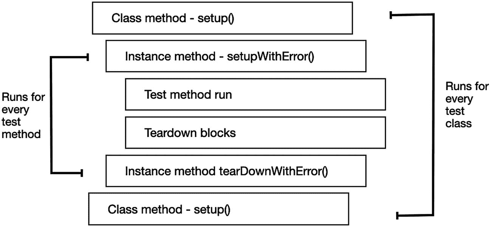
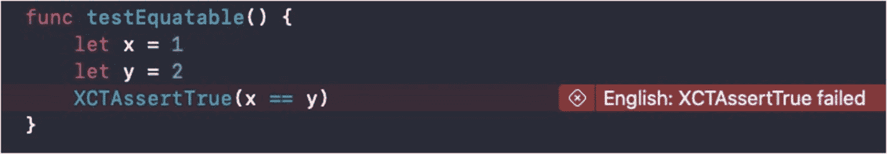
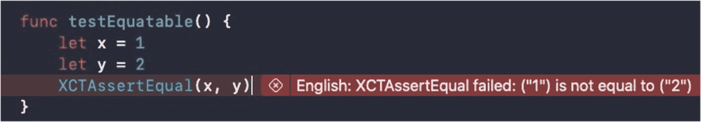
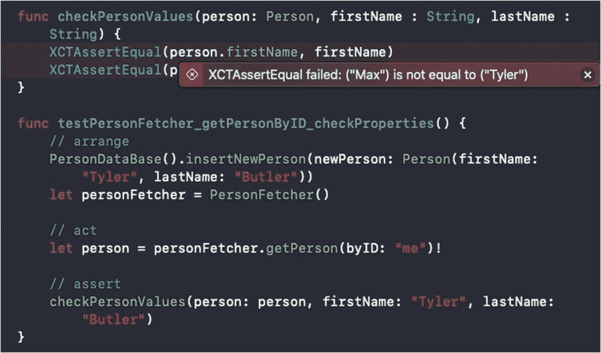
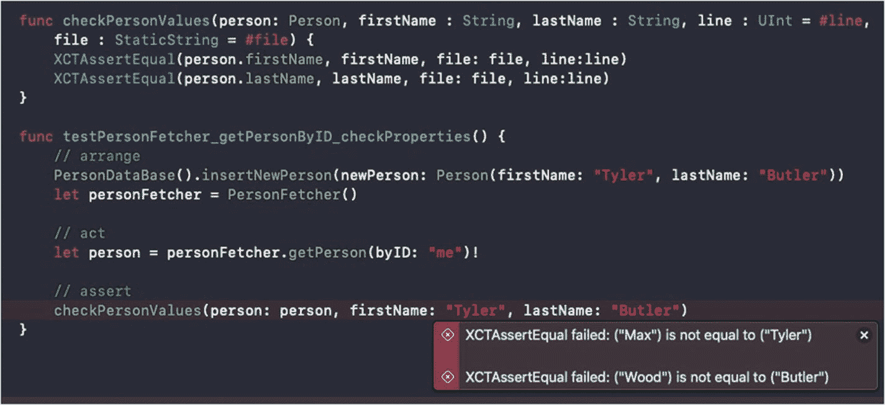

# 编写测试——基础

> *注意零。如果有零存在，就会有人用它做除法。*
>
> —— Cem Kaner 博士

## 引言

在上一章中，我们学习了如何为测试搭建基础设施。看来我们已经准备好编写了。但是，即使你的代码非常优秀，使用了纯函数和依赖注入，我们仍然需要学习如何编写能够长期维护的、规范的测试的基本知识。

在本章中，你将学到：

*   单元测试到底是什么
*   什么是 `XCTest` 框架和 `XCTestCase` 类
*   如何配置你的目标和测试包以协同工作
*   `XCTestCase` 的生命周期及其底层工作原理
*   如何编写一个简单的单元测试方法及其结构
*   我们有哪些断言以及如何创建自己的断言
*   如何测试异步操作

## 单元测试到底是什么？

单元测试是一个函数，它测试特定的一段代码，并在测试结果不符合要求时进行断言。

当你尝试添加测试时，有两个选项——单元测试和 UI 测试。在这个步骤中，“单元测试”只是一种可以帮助你创建不同类型测试的工具——集成测试、性能测试、回归测试等。

但从传统意义上讲，“单元测试”是一种软件测试方法。

单元测试方法的目标是孤立地检查一段代码，而不检查它对其他层或对象的副作用。

单元测试有几个特点：

*   它们应该运行得很快。单元测试中不应有任何真正繁重的代码或与服务器或数据库的集成。一个正常的测试套件应该在几秒钟内运行完毕。如果不是这样，你应该检查创建的所有测试是否都是单元测试。
*   单元测试易于构建。你不应该为了搭建一个单元测试而费很大力气。如果你在这方面花费了太多精力，也许它不是一个单元测试，或者你的代码可测试性不够。在这种情况下，回顾上一章，学习如何提高代码的可测试性。
*   单元测试需要能够并行运行。隔离是关键。并行运行是确保单元测试没有任何未知副作用的最佳方式，这些副作用不仅会影响其他测试，还可能以不可预测的方式影响你的代码。
*   单元测试负责检查一个方法甚至是一段特定代码的行为。单元测试不负责检查应用中各层如何协同工作、查找内存泄漏或确保代码运行速度足够快。

作为日常开发流程的一部分，你应该编写尽可能多的单元测试。如果你编写的代码是可读和清晰的，这不应该是一项困难的任务。

> 注意
> 单元测试不是 TDD，TDD 也不是单元测试。开发人员经常混淆这些术语。单元测试是**测试什么**，而 TDD 是**何时测试**。在 TDD 中，你在编写实际代码之前先编写单元测试，并且单元测试被集成在这个流程中。

## XCTest 和 XCTestCase

`XCTest` 是用于为你的应用编写测试的框架。它作为 Xcode 的一部分提供，无需额外设置即可开始编写测试。

`XCTest` 也是用于创建和执行测试（包括单元测试和 UI 测试）的抽象类的名称。要创建一个新的测试类，我们将使用 `XCTest` 的子类——`XCTestCase`。

### XCTestCase

当我们想要创建一个新的测试类时，需要继承自 `XCTestCase`。在单元测试中，我们通常希望创建一个测试类来对应项目中的一个“常规”类。推荐的命名方式可以是被测类的名称加上“tests”一词。例如，对于一个名为“LoginHandler”的类，我们可以创建一个名为“LoginHandlerTests”的测试类。这可以帮助我们准确理解这个类测试的是什么，也可以防止错误地重复声明相同的类名。


#### 添加新的 XCTestCase 子类

要添加新的测试用例，请前往 文件 ➤ 新建 ➤ 文件，然后选择“单元测试用例类”。

点击“下一步”后，为测试类命名，并像处理任何其他文件一样选择其在项目中的位置。

请注意，在最后一步，您需要选择此测试类所属的测试目标——这**极其重要**，因为测试类不能成为您可执行目标的一部分。

## 我们的第一个测试类

恭喜，一个测试类诞生了！

来看看我们新建的测试类长什么样：

```
import XCTest // 1
class DemoTests: XCTestCase { // 2
    override func setUpWithError() throws { // 3
        // 在此处放入设置代码。此方法会在调用类中的每个测试方法之前被调用。
    }
    override func tearDownWithError() throws { // 4
        // 在此处放入清理代码。此方法会在调用类中的每个测试方法之后被调用。
    }
    func testExample() throws { // 5
        // 这是一个功能测试用例示例。
        // 使用 XCTAssert 及相关函数来验证您的测试是否产生了正确结果。
    }
    func testPerformanceExample() throws { // 6
        // 这是一个性能测试用例示例。
        self.measure {
            // 在此处放入您想要测量时间的代码。
        }
    }
}
```

让我们一起来过一遍：

1.  `import XCTest` – 为了能够继承 `XCTestCase` 并将其添加到测试运行器中，我们需要像导入其他任何想使用的框架一样导入 `XCTest` 框架。
2.  `class DemoTests: XCTestCase` – 务必确保您是继承自 `XCTestCase`。
3.  `setUpWithError()` – 此方法在**每个**测试方法执行**之前**运行。本章后续会进行解释。
4.  `tearDownWithError()` – 此方法在**每个**测试方法执行**之后**运行。同样会在本章后续解释。
5.  `testExample()` – 这是我们的第一个单元测试示例。目前是空的。
6.  `testPerformanceExample()` – 这是一个性能测试示例。本书后续会进行解释。

## 启用可测试性

在我们继续添加更多测试之前，需要确保项目中的所有内容都已正确链接。

您的测试代码并*不*属于可执行文件的一部分。它是您 Xcode 项目中的一个不同模块，为了让您的测试能够访问应用代码，您需要处理好访问权限问题。

但别担心；有一个相当简单的标记可以帮助您解决访问权限问题，它叫做“启用可测试性”。

当您进入可执行目标，在“构建设置”下搜索“启用可测试性”。将此标记设置为“是”，您的测试目标就能访问代码了。

这里我们注意到，此标记在发布配置中默认设置为 `NO`。原因之一是我们通常不会在发布配置中测试应用，因此不需要访问可执行代码。更重要的原因是，此选项会阻止代码优化，而代码优化在发布配置中使用，并不适合您的测试和调试。

### @testable

那么现在，我们在可执行目标端处理好设置之后，需要将可执行目标导入到测试类中。

在文件的顶部，类声明之上，我们添加一个名为 `@testable` 的新属性：

```
import XCTest
@testable import My_Weather_App
class My_Weather_AppTests: XCTestCase {
    // 测试代码
}
```

`@testable` 的作用是什么？我们为什么需要它？首先，让我们回忆一下 Swift 中的五个访问级别：

*   **Public（公开）** – 模块内部以及导入该模块的外部代码均可访问。
*   **Open（开放）** – 与**公开**相同，但可以从任何模块（而不仅仅是原始类所在的模块）进行子类化。
*   **Internal（内部）** – 模块外部禁止访问。内部访问级别是类和方法的**默认**级别。
*   **Fileprivate（文件私有）** – 仅限当前文件内部访问。
*   **Private（私有）** – 仅限同一类或结构体内部访问。

如果您注意到，类和方法的默认访问级别是**内部**。由于单元测试需要在模块外部完全访问您的代码，如果您的多数类和方法访问级别设置为默认值，我们可能会遇到问题。

`@testable` 的作用是提升导入模块中的访问级别。标记为 **Public** 的成员现在表现为 **Open**，而标记为 **Internal** 的成员则表现为 **Public**。

> **注意：** 在 Swift 开发者社区中，有一些关于 `@testable` 的讨论。一些人声称 `@testable` 属性是一个试图克服测试中访问级别问题的“hack”。持此观点的人认为，既然这是一个“hack”，为什么不也把 `private` 和 `fileprivate` 的访问级别提升为公开呢？

### CocoaPods 与测试目标

如今许多项目使用依赖管理器来集成外部库和框架。最流行的管理器之一是 CocoaPods，它拥有超过 72,000 个库，被用于超过三百万个应用。

CocoaPods 在链接新框架时的任务之一，是根据新集成的框架更新 *头文件搜索路径*。

如果您想在测试目标中直接使用这些库，您需要将测试目标添加到 `Podfile` 文件中，像这样：

```
target "My_Weather_AppTests" do
  inherit! :search_paths
  pod 'Fabric', '1.10.2'
  pod 'Firebase'
end
```

将 Pod 添加到测试目标是开发人员在编写测试时经常忘记的事情，所以记住这一点的关键在于，将测试目标视为一个独立的应用。您想使用的任何东西，都需要像在可执行目标中那样，将其链接到您的测试目标。

## XCTestCase 生命周期

`XCTestCase` 的生命周期与您在标准 Swift 类中的预期略有不同。因为测试用例是测试运行器的一部分，测试运行器会按照适合测试的特定时机来调用测试用例方法。

### 类方法 setUp()

当一个新测试类开始运行（更准确地说，是将测试用例“添加到测试运行器”）时，第一个被调用的方法是类级别的 `setUp()` 方法。您当然不必重写它，但此方法会为该类中的所有测试**调用一次**。`setUp()` 方法是您为测试进行一些初始设置的地方，例如创建数据库或设置模拟服务器：

```
override class func setUp() {
    super.setUp()
    // 在所有测试开始前运行一次
}
```


### `setUpWithError()` 抛异常

在类方法 `setup()` 之后，XCTest 会定位类中所有以“test”开头且没有参数的方法。

对于每一个这样的测试方法，XCTest 会在运行测试方法本身之前调用 `setUpWithError()` 函数。这是你准备任何实例变量的地方，而不是在每个测试方法中重复这些步骤。

此外，在每个 `setUpWithError()` 调用之后，还会调用实例方法 `setup()`。

你可能会注意到 `setUpWithError()` 方法是一个 throwing 方法。这是 Xcode 11.4 中一个受欢迎的改进，因为在此方法中执行的很多代码都是 throwing 代码，例如：

```
override func setUpWithError() throws {
    networkResponse = try buildResponseFromJSON(filename: "response.json")
}
```

如果 `setUpWithError()` 抛出异常，则意味着紧随其后的测试也会失败。

### 测试方法

在设置好测试的初始状态后，XCTest 运行测试方法并在需要时进行断言。XCTest 认为一个方法是测试方法，需满足以下所有条件：

*   它属于 `XCTestCase` 的子类。
*   它的名称以“test”开头。
*   该方法没有任何参数。

如果测试方法没有失败的断言或崩溃，则视为通过。我们将在本章后面讨论如何编写测试方法。

### 拆解块

如果你的测试方法更改了某些状态或产生了你想要清理的特定副作用，你可以在测试结束时添加一个拆解块：

```
func testExample() throws {
    // 创建临时文件
    addTeardownBlock {
        // 移除临时文件
    }
}
```

你可以添加任意多个拆解块，并且它明确只针对此函数内所做的更改。要创建在每个方法之后运行的拆解代码，你需要重写 `tearDownWithError()` 方法。

### `tearDownWithError()` 抛异常

`tearDownWithError` 方法在每个测试方法之后运行，无论其失败还是通过。我们使用此方法来清理测试方法可能引起的任何副作用，在大多数情况下，它应该是 `setUpWithError()` 方法的逆函数。

例如，如果你在 `setUpWithError()` 中打开了到 SQLite 的连接，那么就在这里关闭它：

```
override func tearDownWithError() throws {
    try super.tearDownWithError()
    // 清理由 `setUpWithError()` 引起的任何副作用
}
```

就像 `setUpWithError()` 和 `setup()` 一样，`tearDownWithError()` 在 `tearDown()` 之前被调用。它们都是有效的，因此你可以在项目中使用它们。

### 类方法 `tearDown()`

类方法 `tearDown()` 是类方法 `setup()` 对应的结束函数。它在所有测试结束时运行，用于清理你在测试开始运行之前所做的任何设置代码：

```
override class func tearDown() {
    super.tearDown()
    // 在类中所有测试结束时运行，用于清理类方法 `setup()` 可能引起的任何副作用。
}
```

### 如何协同工作

感到困惑？嗯，这听起来很正常。但是为测试设置初始状态并在之后清理它是实现测试运行稳定性的关键步骤。

因此，我创建了图 3-4 来展示其概览。



图 3-4 XCTestCase 生命周期

### XCTest 为每个测试方法创建一个 XCTestCase 实例

有些人可能认为，在测试用例类开始执行之前，XCTest 会创建该类的一个实例，并逐个运行所有测试。虽然这在标准类中是合理的，但在 XCTest 类中并非如此。

当 Xcode 启动其测试套件时，它实际上会**为每个测试方法**创建一个 `XCTestCase` 实例，并将其添加到其测试运行器队列中，甚至在测试执行开始**之前**。

假设你有一个名为 `LoginTests` 的测试类，其中包含四个不同的测试方法。当测试运行开始时，XCTest 会创建四个 `LoginTests` 类的实例，每个测试方法一个，并将它们添加到测试运行器中。这四个实例会在运行结束时，在所有其他测试完成执行之后才被释放。

这一点很重要，因为它可以让你了解在测试运行执行期间状态是如何管理的。例如，你不能在不同的测试方法之间共享实例变量值，因为每个测试方法都有自己的类实例。

关于内存管理，你需要记住的是，在测试运行结束之前，没有一个类实例会被释放。这意味着你需要注意在 `setup` 和 `tearDown` 方法中做什么，并确保释放和重置可能影响其他测试方法的任何数据。

## 编写单元测试

正如我之前所说，单元测试不仅运行速度快，而且也需要快速编写。但别担心，你不必在这里重新发明轮子——编写单元测试有特定的模式和结构。如果你能保持一个固定的模式，它们不仅容易编写，而且可读性高。

### 单元测试结构

请看以下代码：

```
func testGetSpeedLimit_private_expect110() {
    // arrange
    car.type = .private
    // act
    let speedLimit = car.getSpeedLimit()
    // assert
    XCTAssertEqual(speedLimit, 110)
}
```

如你所见，在单元测试中，我们有三个步骤：**A**rrange、**A**ct、**A**ssert，简称 AAA。我们也可以称之为 GWT (**G**iven-**W**hen-**T**hen)。一些开发者偏爱 AAA，因为它的术语更接近代码层面；而另一些则偏爱 GWT，以便于与业务层面沟通。

但归根结底，这并不重要。其核心思想是一致的：

*   **Arrange/Given** – 在此处进行测试的所有准备工作。连接依赖项、设置属性、分配变量。记住我们学过的生命周期。如果是你在每个测试方法中都会做的事情，请考虑将其移到 `setup()` 方法中，以避免代码重复。
*   **Act/When** – 这是执行你想要测试的函数的地方。在这个阶段，最佳实践是将你想要根据需求验证的值保存在一个局部变量中。
*   **Assert/Then** – 最后的设置是测试的实际验证。在此步骤中，你通常通过断言（我们稍后会讨论）来检查测试是否满足期望。

将你的测试方法分为三个步骤，可以使你的测试代码更具可读性，也更容易理解。


#### 断言

`XCTest` 支持的断言列表很长。在所有断言中，你都可以选择包含一条格式化的错误信息，以帮助你理解失败的测试是什么以及失败的原因。这在从命令行或 CI/CD 环境运行测试时尤其重要，但在 `Xcode` 本身中也很有帮助。

表 4-1

`XCTest` 断言列表

| 名称 | 描述 |
| --- | --- |
| `XCTFail` | 无条件使测试失败 |
| `XCTAssertNil` | 当传入对象非 nil 时失败 |
| `XCTAssertNotNil` | 当对象为 nil 时失败 |
| `XCTAssertEqual` | 当表达式不相等时失败 |
| `XCTAssertNotEqual` | 当表达式相等时失败 |
| `XCTAssertNotEqualObjects` | 当对象不相等时失败 |
| `XCTAssertNotEqualObjects` | 当对象相等时失败 |
| `XCTAssertNoThrow` | 当表达式抛出异常时失败 |
| `XCTAssertGreaterThan` | 当第一个对象不大于第二个对象时失败 |
| `XCTAssertLessThan` | 当第一个对象不小于第二个对象时失败 |
| `XCTAssertLessThanOrEqual` | 当第一个对象大于第二个对象时失败 |
| `XCTUnwrap` | 当给定表达式尝试解包并返回 nil 时失败 |

你可能会想：“为什么我需要学习完整的断言列表？我只用 `XCTAssertTrue` 就可以了。”

从本质上说，你是对的。如果你使用 `XCTAssertTrue` 并传入你想要的条件，这确实能完成工作。

但是，看看图 3-5。



图 3-5

Xcode 中的 `XCTAssertTrue` 失败

你看出问题了吗？当然，`x == y` 不为 `true`。但我们并不是想检查一个布尔表达式；我们想检查的是两个对象是否相等。

现在让我们把它改成 `XCTAssertEqual`（图 3-6）。



图 3-6

Xcode 中的 `XCTAssertEqual` 失败

正如你所见，使用正确的断言可以帮助你免费获得描述性的失败信息。

### 创建自定义断言

信不信由你，确实有些情况下，现有的断言并不是验证测试的精确且方便的工具。

幸运的是，有一种方法可以创建你自己的自定义断言，让你的测试代码更加整洁。

以下是一些可能促使你考虑编写自己自定义断言的使用场景：

*   **重复的断言代码** – 假设你想要验证一个对象的配置，并且需要检查几个属性。你可以使用一个检查多个值的大断言（一个丑陋的解决方案），或者使用多个断言，这也不是一个优雅的解决方案。关键是，当你看到断言序列被重复使用时，就应该考虑使用自定义断言。

*   **当你的断言代码过于庞大时** – 如果你每次都需要解析一个 JSON 并检查某个值，或者需要分析一个字符串或进行一些计算，那就编写你自己的断言。当你感觉到测试的最后一部分（“断言”或“然后”部分）太庞大，并且可以很好地整合进一个它自己的函数时，这就是一个你应该创建自定义断言的信号。

*   **当你的断言没有使用恰当的语言时** – 如果你在检查一个电子邮件地址是否有效，或者字符串是否只包含一个“@”，或者你想检查一个日期对象是否在某个特定月份或年份。当然，你可以为此使用标准断言，但标准断言并不“说同一种语言”。“大于”、“等于”或 `isTrue` 使用起来没问题，但对于更风格化的方式，最好使用你自己的断言来进行这些验证。


#### 准备就绪：如何编写自定义断言？

编写自定义断言的基本方法，其实就是在你的测试中添加一个新的方法。

让我们来看以下示例：

```
func testPersonFetcher_getPersonByID_checkProperties() {
// arrange
PersonDataBase().insertNewPerson(newPerson: Person(firstName: "Tyler", lastName: "Butler"))
let personFetcher = PersonFetcher()
// act
let person = personFetcher.getPerson(byID: "me")!
// assert
XCTAssertEqual(person.firstName, "Tyler")
XCTAssertEqual(person.lastName, "Butler")
}
```

在这个测试方法中，我们获取一个 `Person` 对象并检查其名和姓。现在，假设在我们的示例中，我们希望将这两个断言捆绑到一个同时检查名和姓的函数中。我们可以创建一个接收三个参数的函数，参数分别是 `Person` 对象、名字和姓氏（作为字符串），然后执行这两个断言：

```
func checkPersonValues(person: Person, firstName : String, lastName : String) {
XCTAssertEqual(person.firstName, firstName)
XCTAssertEqual(person.lastName, lastName)
}
func testPersonFetcher_getPersonByID_checkProperties() {
// arrange
PersonDataBase().insertNewPerson(newPerson: Person(firstName: "Tyler", lastName: "Butler"))
let personFetcher = PersonFetcher()
// act
let person = personFetcher.getPerson(byID: "me")!
// assert
checkPersonValues(person: person, firstName: "Tyler", lastName: "Butler")
}
```

很简单，对吧？别急。让我们运行这个测试，看看图 3-7。



图 3-7

使用外部断言方法运行测试

我们的测试失败了，但这并不是问题所在。你发现问题了吗？从上面的截图中，我们看到了两个方法——测试方法和断言方法。我们也看到了失败信息，但它指向的是断言方法，而不是测试方法！

我们发现无法将失败信息与正确的测试方法关联起来。此外，如果有多个失败的测试方法，我们将在同一个位置看到多条失败信息，一条叠一条——这简直是测试的噩梦！

但幸运的是，我们有解决方案。让我们先来看看 `XCTAssert` 函数的签名：

```
func XCTAssert(_ expression: @autoclosure () throws -> Bool, _ message: @autoclosure () -> String = "", file: StaticString = #file, line: UInt = #line)
```

如你所见，除了表达式和消息参数外，我们还有另外两个参数——`file` 和 `line`。

`file`（`String` 类型）和 `line`（`UInt` 类型）包含了 XCTest 显示失败信息的具体代码位置信息。默认情况下，它们的值就是我们调用断言函数的位置。

> 注意
> `#file` 和 `#line` 是 Swift 语言中的两个表达式。你不仅可以在测试中使用它们，也可以在项目代码中使用。Swift 还有其他一些有趣的表达式，如 `#function`、`#column` 等，你可以用在测试或其他地方。

因此，如果我们想在正确的位置显示信息，我们只需要将 `#line` 和 `#file` 表达式传递给我们的最终断言方法：

```
func checkPersonValues(person: Person, firstName : String, lastName : String, line : UInt = #line, file : StaticString = #file) {
XCTAssertEqual(person.firstName, firstName, file: file, line:line)
XCTAssertEqual(person.lastName, lastName, file: file, line:line)
}
```

让我解释一下我在这里做了什么——我们的自定义断言方法增加了两个参数，`line` 和 `file`，并提供了默认值。默认值就是我们调用该函数的实际位置。然后，我们将这两个参数传递给内部的断言方法，覆盖了它们的默认值。可以说，我们巧妙地“欺骗”了系统，以获得清晰的失败信息。

现在，让我们用改进后的断言方法运行测试（见图 3-8）。



图 3-8

包含行号和文件参数的自定义断言方法

太好了！现在我们的失败信息显示在了正确的位置——测试方法中，而不是断言方法中。而且，我们无需对测试方法进行任何更改。

总而言之，自定义断言方法可以使你的测试代码更具可读性，减少重复（DRY），从而帮助你更轻松地维护测试代码。每当你觉得断言代码有点复杂或令人困惑时，就自己编写一个方法。就是这么简单。

## 编写异步操作

看一下下面的代码：

```
func testImageProcessing() {
// arrange
let image = UIImage(named: "3cats")!
let manager = CatsProcessingManager()
// act
var cuteCats = 0
manager.findCuteCats(image: image) { (numberOfCuteCats) in
cuteCats = numberOfCuteCats
}
// assert
XCTAssertEqual(cuteCats, 3)
}
```

在上述代码中，我们想要测试 `findCuteCats()` 方法，该方法接收一张图片，并应该找出图片中可爱猫的数量（基本上就是显示的猫的总数，因为所有的猫都很可爱）。

我们提供了一张包含三只猫的图片，期望得到的返回答案是 3，但测试失败了。在测试结束时，`cuteCats` 变量仍然是 0，这是因为 `findCuteCats()` 是一个异步方法。我们直觉的解决办法是将断言行放在函数的完成块内，但这反而更糟——现在，我们得到了一个假阳性结果，我们的测试总是成功，因为在完成块执行之前测试运行就已经结束了！

我们需要找到一种方法，让测试方法在断言之前等待 `findCuteCats()` 方法完成。

### Expect、Wait、Fulfill 和 Assert

幸运的是，XCTest 为异步操作提供了一个简单的解决方案。这个解决方案基于三个简单的部分：

*   **定义期望** —— 我们需要使用某种期望对象，它可以被传递到完成块中，并帮助我们管理流程。定义是通过一个叫做 `XCTestExpectation` 的东西完成的。
*   **标记期望已完成** —— 仅仅完成块执行是不够的；我们需要告诉我们创建的期望对象，我们已经拥有了所需的所有数据，现在可以进行断言了。
*   **暂停测试方法运行，直到我们得到答案** —— 我们需要在断言之前暂停测试方法的运行；否则，它会继续运行到方法结束，而不会等待答案。此外，我们需要定义一些超时时间，以防止测试执行永远运行下去。


### XCTestExpectation 模式

让我们来看一下为异步测试重构的 `testImageProcessing()` 方法：

```
func testImageProcessing() {
    // 准备
    let image = UIImage(named: "cats")!
    let manager = CatsProcessingManager()
    // 执行
    var cuteCats = 0
    // 创建一个期望来获取猫咪数量。
    let expectation = self.expectation(description: "Counting number of cats") //1
    manager.findCuteCats(image: image) { (numberOfCuteCats) in
        cuteCats = numberOfCuteCats
        // 我们得到了结果。我们的期望满足了！
        expectation.fulfill() //2
    }
    // 断言
    // 在断言前等待 5 秒...
    waitForExpectations(timeout: 5.0, handler: nil) //3
    XCTAssertEqual(cuteCats, 3)
}
```

在上面的代码中，我们可以看到之前提到的三个部分。我们来逐一看看：

```
let expectation = self.expectation(description: "Counting number of cats") //1
```

当我们想要创建异步测试时，会创建一个 `XCTestExpectation` 对象。在初始化时，我们传入一个描述性的说明，如果测试失败，可以帮助我们理解哪个期望没有被满足。

可以为同一个测试创建多个期望：

```
expectation.fulfill() //2
```

当异步操作完成其工作时，我们调用之前创建的期望对象的 `fulfill()` 方法。在大多数情况下，最佳实践是即使在完成块失败时也调用 `fulfill()` 函数。不要混淆——`fulfill()` 并不意味着我们的测试通过了；它只意味着我们可以继续进行断言部分。“期望被满足”这个术语可能会与我们测试中的“期望”部分混淆，所以要注意！

```
waitForExpectations(timeout: 5.0, handler: nil) //3
```

在断言部分之前，我们调用 `waitForExpectations()` 方法。这个方法的作用是停止测试执行，直到所有期望都被满足或达到超时时间。

如果达到超时时间，我们的测试会自动失败。当所有期望都被满足时，就该进行断言了：

```
XCTAssertEqual(cuteCats, 3)
```

### 一个期望多次满足

有些测试中，在我们能说期望已满足并可以进入断言部分之前，我们希望多次执行异步代码。对于这类测试，`XCTestExpectation` 有一个名为 `expectedFulfillmentCount` 的属性：

```
let expectation = self.expectation(description: "executing closure code 3 times")
expectation.expectedFulfillmentCount = 3
```

一个很好的用例是音乐播放器，它需要多次更新歌曲的进度。期望可以计算它被调用的次数，然后在达到特定次数时进入断言部分。

### 当期望未满足时进行断言

好的，我需要你集中注意力在这一部分。有些情况下，我们想要确保一段代码**没有被**执行。换句话说，如果我们的期望被满足了，我们的测试反而会失败。

在这种情况下，我们可以使用 `isInverted` 属性（默认为“false”）：

```
let expectation = self.expectation(description: "Code is not executed")
expectation.isInverted = true
```

`isInverted` 属性的一个很好的用例是**权限处理**。我们想要确保在特定配置和状态下，我们的部分代码**没有被**执行。

### 期望数组，按顺序

如果你在一个测试方法中有多个期望，不必单独等待它们。只需在测试方法末尾等待，同时传入期望数组即可：

```
wait(for: [loadFromFileExpectation, locateCuteCatsExpectation], timeout: 2.0)
```

你甚至可以确保所有期望按指定顺序被满足！

```
wait(for: [loadFromFileExpectation, locateCuteCatsExpectation], timeout: 2.0, enforceOrder: true)
```

### XCTestExpectation 子类

现在你有了“等待”+“满足”+“断言”的工具，基本上，每个异步作业都可以使用 `XCTestExpectation` 进行测试。但是 Xcode 8.3 在这个领域带来了几项改进，以使这些任务更容易构建和阅读。

让我们看下面的代码：

```
func testIfNotificationRaised() {
    let expectation = self.expectation(description: "Notification Raised")
    _ = NotificationCenter.default.addObserver(forName: NSNotification.Name("notif"), object: nil, queue: nil, using: { (notification) in
        expectation.fulfill()
    })
    NotificationCenter.default.post(name: NSNotification.Name("notif"), object: nil)
    waitForExpectations(timeout: 0.1, handler: nil)
}
```

在这段代码中，我们试图测试是否发出了一个通知。我们添加一个观察者，当我们收到通知时，我们就满足期望。在下一行，我们发布通知，并等待 0.1 秒让期望被满足。

很简单，是吧？但问题是，我们的大多数测试**并不**像这个例子。观察代码通常位于其他地方，甚至不在我们的测试代码中，发布通知的代码在大多数情况下也是如此：

```
func testMyScree_savingData_checkNotificationReceived () {
    // 准备
    let dataConnector = DataLayer()
    let myScreen = MyScreen()
    // 执行
    dataConnector.save()
    // 断言
    // 检查 myScreen 是否收到了 "data updated" 通知...
}
```

在前面的例子中，我们有一些数据层和一个 UI 屏幕。测试是保存一些数据并检查屏幕是否收到了“数据已更新”的通知。

我们知道发布通知的代码在数据层内部，而观察者代码在 UI 屏幕内部。那么我们该如何检查呢？

> 当前讨论的这个例子并不是真正的“单元测试”，而是集成测试。我们将在本书后面讨论集成测试。

好吧，我们可以添加一些闭包或委托模式来将事件从 `myScreen` 类传递到测试方法，但这需要我们更改代码，只是为了让我们的测试更容易测试。在许多情况下这可能是真的，但在这个案例中并非如此——除了测试方法，没有其他对象观察这个事件。

幸运的是，我们能够非常容易地在测试中观察通知调用。

让我们解决测试方法中的问题：

```
func testMyScreen_savingData_checkNotificationRaised () {
    // 准备
    let dataConnector = DataLayer()
    let myScreen = MyScreen()
    let expectation = self.expectation(forNotification: NSNotification.Name("dataUpdated"), object: nil, handler: nil)
    // 执行
    dataConnector.save()
    // 断言
    waitForExpectations(timeout: 0.1, handler: nil)
}
```

如你所见，我们添加了 `expectation(forNotification:)`。当通知被发出时，期望被满足。注意，我们并没有检查 `myScreen` 是否收到了通知。这是你需要通过其他方式做的事情，例如检查它的状态。

## 总结

`XCTest` 是一个健壮的框架，它可以帮助你非常容易地建立一个优秀的测试套件。

此外，我们还学习了如何编写结构化的测试方法，以及如何将它们作为测试用例生命周期的一部分来编写。

但这些只是基础——在下一章，我们将学习如何利用我们的技能，编写有用且可维护的单元测试。

