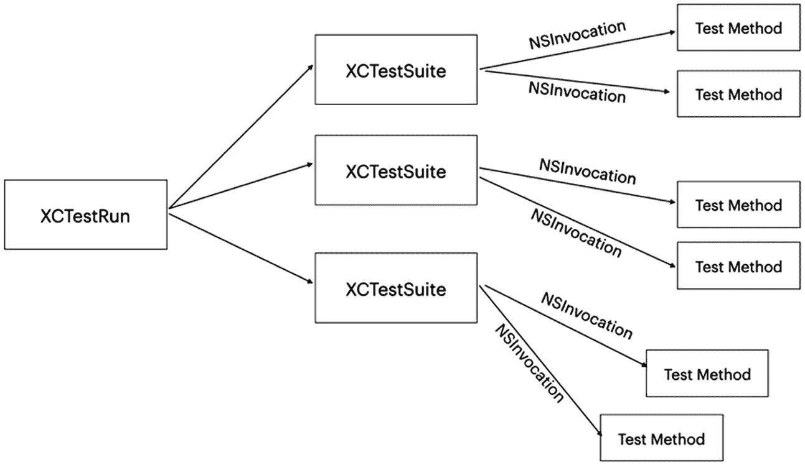
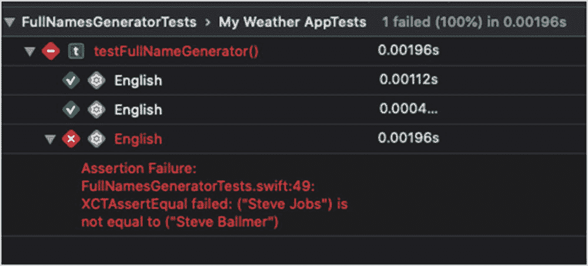

# 编写测试——高级技巧

> *相比于测试行为本身，设计测试的行为是已知的最好的预防漏洞的方法之一。为了创建一个有用的测试而必须进行的思考，可以在编写代码之前就发现并消除漏洞——实际上，测试设计的思考可以在软件创建的每个阶段发现并消除漏洞，从概念、到规范、到设计、编码以及后续阶段。*
>
> —鲍里斯·贝泽


## 引言

在上一章中，我们学习了如何编写基本的单元测试。但在现实中，我们遇到的问题更具挑战性——我们需要伪造或模拟代码中的某些部分，或者比较数值。

在本章中，你将学习单元测试中的高级技巧，例如：
*   如何创建**测试替身**，例如 Mocks、Dummies、Fakes、Stubs 和 Spies
*   如何尽可能**避免使用测试替身**
*   如何**比较**结构体和类等类型的**值**
*   如何**比较图像和数组**
*   当需要以不同的值多次运行测试方法时，如何**避免重复测试**代码
*   如何**动态创建**测试用例

## 测试替身（Fake, Fake, Fake）

诚然，我们有易于测试的单元测试。它们没有依赖项，没有网络或数据库，无需额外工作就能使我们的测试单元稳定且可维护。

但恕我直言，我们知道现实情况并非如此。尽管我们尽可能地试图隔离我们的函数，它们仍然运行在一个与其他"生物"共存的世界中，而这些"生物"是我们需要注意的。

请记住，在单元测试中，我们需要在每个测试中专注于代码的一个特定区域。测试代码的特定区域正是我们需要将代码与系统其余部分隔离的原因。

**测试替身**是一个通用术语，用于描述那些行为或外观与我们代码所依赖的真实对象相似的对象。伪造一个服务器层响应可能就是这方面的一个很好的例子。几乎不可能避免使用测试替身，尤其是在单元测试中。

### Mocks。到处都是 Mocks？（？）

开发者在处理测试替身时最常见的错误之一就是将它们统统称为 "mocks"。并非不存在 "mock" 这种东西。问题在于，当谈论测试替身时，这个术语常常被误用。

除了 "mock" 之外，测试替身还有好几种类型。每一种都旨在解决我们测试隔离任务中的不同部分。

#### Dummy（哑对象）

Dummy 是一个什么都不做的对象。它不返回任何值，你也永远不会真正调用它。它是一个在测试中永远不会被使用的对象。那么，我们为什么需要它呢？有些方法在初始化时，必须传入某种特定类型的对象。在这种情况下，你可以创建一个新的 dummy 类。这个 dummy 既可以是需要传入的原始对象的子类，也可以是符合相关协议的新类：

```
class ManufactureDummy : Manufacture {
}
class CarTests: XCTestCase {
func testCarMethod(){
let manufactureDummy = ManufactureDummy()
let car = Car(manufacture: manufactureDummy)
// rest of the test method
}
}
```

我们来分析一下前面的代码——当类 `Car` 的构造函数需要一个参数 `manufacture` 时，我们想要测试这个类。

但这个参数在我们的测试中不会被用到，它只是为了代码设计的目的而存在。我们只想创建我们的 car 对象然后继续。因此，我们创建了一个 dummy manufacture，它是原始对象的一个子类（或基于协议），并将其传递给 car 的 `init()` 方法。

可以说，当我们需要处理自定义的 `init()` 方法时，dummy 可以帮助我们初始化对象。

#### Fake（伪造对象）

当然，我们可以说每一个测试替身都是 "fake"。但在这种情况下，"fake" 指的是一个**总是返回**相同值的对象。一个好的例子是伪造网络响应的网络层。

另一个例子可以是伪造的登录服务，用于帮助你测试某些登录逻辑代码：

```
class LoginService {
var isLoggedIn : Bool {
return true
}
}
class FakeLoginService : LoginService {
override var isLoggedIn : Bool {
return true
}
}
```

简单的 `FakeLoginService` 在 `isLoggedIn` 变量的 getter 中总是返回 true。你可以在需要用户登录才能运行测试的场景中，注入这个伪造对象。

#### Stub（桩件）

Stub 是一种测试替身，你可以用它来控制其返回值。我们可以说它是一个"更复杂的 fake"。例如，你可以使用一个 stub 来伪造服务的返回值或成功状态。

请看 `LoginScreenPresenter.swift`：

```
class LoginScreenPresenter {
var loginService : LoginService
init(loginService : LoginService) {
self.loginService = loginService
}
func doLogin(withEmail email : String, password : String,  completion : @escaping (String)->Void) {
loginService.doLogin(email: email, password: password) { (result) in
switch result {
case .failure:
completion("Failed!")
case .success:
completion("Success")
}
}
}
}
```

`LoginScreenPresenter` 有一个名为 `loginService` 的依赖项。我们想要测试失败或成功时的消息输出。

为了测试，我们创建一个 `LoginServiceStub` 来控制 `doLogin()` 方法的返回值：

```
class LoginServiceStub: LoginService {
var _loginServiceResult : LoginOperationResult = .success
init(result : LoginOperationResult) {
_loginServiceResult = result
}
override func doLogin(email: String, password: String, completion: (LoginOperationResult) -> Void) {
completion(_loginServiceResult)
}
}
```

`LoginServiceStub` 是原始 `LoginService` 的一个子类（记住，OOP 不是创建 stub 的唯一方式；你也可以使用面向协议的方式）。

我们为 stub 创建了一个新的初始化器来设置伪造的登录结果，并重写了 `doLogin()` 方法来返回那个伪造值。

现在让我们看看如何在测试中使用这个 stub：

```
func testLoginPresenter_whenFailure_expectFailureMessage() {
//arrange
let loginServiceStub = LoginServiceStub(result: .failure)
let presenter = LoginScreenPresenter(loginService: loginServiceStub)
let expectation = self.expectation(description: "Check Login Flow Message")
// act
var message = ""
presenter.doLogin(withEmail: "avi@emailServer.com", password: "123456") { (resultMessage) in
message = resultMessage
expectation.fulfill()
}
self.waitForExpectations(timeout: 0.1, handler: nil)
// assert
XCTAssertEqual(message, "Failed!")
}
```

将 `loginServiceStub` 作为参数传递给 `LoginPresenter`，当然让我们编写这个测试变得很容易，对吧？注意，我们可以使用同一个 stub 轻松创建另一个测试，只需传入不同的返回值即可。


```markdown
#### 间谍（Spy）

间谍是桩（stub）的反面。我们使用桩来配置被测对象的依赖项。而在间谍中，我们想要检查被测代码产生的**副作用**。

间谍不返回任何值；它只是用来记录我们的调用，我们可以在后续的断言部分使用这些信息——这就是为什么它被称为“间谍”。

间谍的工作方式很直接。假设我们想测试某个展示器的方法，并且我们知道这个方法会调用视图中的一些方法。我们只需要创建一个间谍，即一个符合视图相同协议并能记录特定调用的对象。

请查看图 4-1。


**图 4-1** 间谍 vs. 桩

以下是代码版本：

```
class LoginViewSpy : LoginViewProtocol {
    var messageReceived = ""
    func showMessage(message : String) {
        messageReceived = message
    }
}

func testLoginPresenter_whenTappedOnLoginButtonAndNoNetork_showError() {
    // 准备（arrange）
    let loginPresenter = LoginPresenter()
    let viewSpy = LoginViewSpy()
    loginPresenter.view = viewSpy
    // 执行（act）
    loginPresenter.onLoginButtonTapped()
    // 断言（assert）
    let messageReceived = viewSpy.messageReceived
    XCTAssertEqual(messageReceived, "Error. Please check your network")
}
```

在上述代码中，我们的 `LoginPresenter` 需要更新其视图。

通常，它的视图是某种符合 `LoginViewProtocol` 的 `UIViewController`，但在这个例子中，我们创建了一个间谍。这只是一个符合相同协议的普通类，而展示器并不知道它更新的是间谍而非真正的视图控制器。这个间谍将它接收到的消息保存在一个变量中，之后的方法会断言并验证接收到的消息。

间谍是一种广泛使用的测试替身，而且检查可以更进一步——你可以检查调用的顺序，甚至进行了多少次调用。

#### 模拟（Mock）

我前面提到，从许多开发者的角度来看，所有的测试替身都是模拟，这是一个常见的误解。到目前为止，我们讨论了虚拟对象（Dummy）、伪对象（Fake）、桩和间谍。

那么，什么是模拟呢？模拟是一个更复杂、更独立的间谍。模拟也记录方法调用信息。但与间谍不同的是，它知道预期是什么，并且会自行进行验证。

在真正的模拟中（称模拟为“真正”的有点奇怪），我们在设置阶段定义期望，而模拟对象会在断言部分验证这些期望。

模拟对象通常有一个 `verify()` 函数来确保它满足期望。

让我们用模拟代替间谍来重写测试：

```
class LoginViewMock : LoginViewProtocol {
    var expectedMessage = ""
    private var messageReceived = ""
    func showMessage(message : String) {
        messageReceived = message
    }
    func verify()->Bool {
        return messageReceived == expectedMessage
    }
}

func testLoginPresenter_whenTappedOnLoginButtonAndNoNetork_showError() {
    // 准备（arrange）
    let loginPresenter = LoginPresenter()
    let viewMock = LoginViewMock()
    loginPresenter.view = viewMock
    // 设置期望
    viewMock.expectedMessage = "Error. Please check your network"
    // 执行（act）
    loginPresenter.onLoginButtonTapped()
    // 断言（assert）
    XCTAssertTrue(viewMock.verify())
}
```

在重写的测试方法中，我们现在使用了模拟而不是间谍。我们定义了期望的消息，在断言部分检查 `verify()` 方法。预期消息和接收消息之间的比较是在**模拟内部**完成的，而不是在测试方法中。

虽然这听起来可能没什么大不了的，但事实上，尤其是在单元测试中，这很重要。

首先，记得我们谈过准备部分——我们说需要在该部分设置测试的状态。但在处理模拟时，我们还需要设置其期望。

其次，在桩中，我们进行**状态验证**，这意味着我们检查桩是否对模拟进行了正确的调用。但在模拟中，我们进行**行为验证**。在这种情况下，我们不关心对模拟进行的实际调用，而是想知道模拟对象是否正确响应了我们测试的“执行”部分。

#### 完全模拟 vs. 部分模拟

我们有两种模拟对象的方式——“完全”和“部分”。在我展示的一些例子中，我们通过遵循协议来创建测试替身。在其他情况下，我们子类化原始类型并重写其某些方法。因此，我们看到在选择如何创建测试替身的方式上存在差异。

**部分模拟**是指我们在修改和改变原始类型（类或结构体）的同时创建测试替身。通过子类化并重写我们想要改变的特定方法来实现模拟。

在**完全模拟**中，我们从头开始创建测试替身。这通常通过遵循代表原始类型的协议来完成。

总的来说，部分模拟更接近真实代码，且“伪造程度更低”。我认为我们应该避免使用部分模拟。短期内使用部分模拟可能没问题，但从长远来看，修改现有类型可能会遇到问题。使用修改过的真实对象可能导致意外行为，因为这些对象会随着代码的演变而发生变化。

### 尽量避免使用测试替身

好的。什么？我们刚刚花了很长时间讨论了如何创建好的测试替身来帮助我们测试代码。那我怎么会建议你尽量避免使用测试替身呢？

嗯，在许多情况下（并非全部！），大量使用测试替身被认为是一种代码异味。代码异味表明你的代码中可能存在更深层次的问题——可能是你使用的某些反模式或错误的结构。如果你在测试中严重依赖测试替身，那可能是代码耦合的标志，而代码耦合对于单元测试来说并不理想。

##### 耦合

当一个类型（类/结构体）与另一个类型一起工作时，我们称之为**耦合**。通常，我们希望将应用程序中的耦合减少到最小（零是不现实的，毕竟这是一个系统）。试想两个协同工作的对象——它们彼此了解得越多，未来这种关系破裂的可能性就越大。类会演进和变化，这些变化也可能对其他相关类产生影响。
```


##### 耦合类型

但我们说“耦合的对象”时，究竟指的是什么？存在几种耦合类型——`Subclass`（子类）、`Shared Object`（共享对象）、`Dependencies`（依赖）和 `Side Effects`（副作用）。

##### 子类耦合

当一个类继承自另一个类时，它依赖于其超类，这两个类就变得耦合。不仅如此——整个继承层次结构都是耦合的。但这只是逻辑上的——想想看，当你重写一个有五层继承关系的类中的方法时，你知道会发生什么吗？很多开发者在可能只需使用协议就能减少耦合的情况下，却选择了子类化。

##### 共享对象

当不同的对象修改共享对象上的属性，并且同时依赖于该共享对象时，它们就通过共享对象耦合在一起。重新思考该共享对象是否确实需要被共享。这是 `Singleton`（单例）模式的缺点之一——在整个系统中共享一个对象会降低你预测代码作为系统如何运行的能力。

其次，你需要考虑对更改共享对象状态的限制——哪些对象允许在何时更改其状态。能够更改状态的对象越少，耦合程度就越小。

##### 依赖

如果你的类依赖于另一个类，并且无法更改它，那么你就面临紧密耦合。有很多方法可以解耦此类情况——从注入新依赖、委托模式、基于协议的依赖，甚至使用闭包。

##### 副作用

始终检查代码中是否存在副作用。如果你有一个函数会修改其他对象的属性或更改持久化数据，这些就是副作用。尽量将副作用减到最少。遵循“单一职责原则”，将这些副作用隔离到一个地方，从而松解对象之间的耦合。

#### 如何解耦现有代码？

解耦现有代码不一定是一项大的重构任务。有时，只需进行一些小改动就足以降低项目中的耦合程度。

首先，让我们了解一下什么是耦合级别。

##### 耦合严重级别

我们有四个严重级别：

##### 紧耦合

一个类持有的依赖项完全无法被替换，即使是同一个类的实例也不行。“紧耦合”通常发生在依赖项是常量（`let`）且无法设置的情况下。

##### 耦合

在“耦合”级别，依赖项依赖于一个特定的类，意味着我们可以用同一个类或其子类（除非标记为 `final`）的对象来替换该依赖项。虽然这仍然被视为一种耦合关系，但比紧耦合好得多。通常，这可以通过将依赖项设为公共变量或添加一个构造函数来在初始化时设置依赖项来实现。

##### 松耦合

在松耦合级别，类不依赖于特定的类，而是依赖于一个协议。松耦合通过让你连接对象而不将它们约束于具体的实现，进一步扩展了可能性范围。在松耦合级别，你可以轻松地创建模拟/存根并在测试中连接它们。你还可以在运行时组合具有不同实现的对象。

##### 解耦

在“解耦”级别，对象之间的关系不是基于类类型，甚至不是基于协议。这并不意味着完全没有依赖——我们确实有依赖。但它们可以通过闭包或通知进行通信。实现这一点后，你不仅可以在项目中重用你的类；很可能还可以在其他项目之间重用（有时只需稍作修改）。

#### 修改你的代码

让我们看看如何修改代码来改善我们的耦合级别。

这里我们有我们的 `LoginPresenter` 类：

```
class LoginPresenter {
let networkClient = NetworkClient()
}
```

我们看到这个类有一个名为 `networkClient` 的依赖项。因为它是一个 `let` 依赖项，这意味着我们完全无法更改它。因此，它是 `Tightly Coupled`（紧耦合）级别。如果我们想改善耦合级别，只需做一个小修改——将 `let` 改为 `var`：

```
class LoginPresenter {
var networkClient = NetworkClient()
}
```

很好！现在我们可以将 `networkClient` 变量更改为不同的对象，只要它来自同一个类（`NetworkClient`）或其子类之一。

现在，我们不再是 `Tightly Coupled` 了，我们将耦合级别提升到了 `Coupled`（耦合）。但我们不必就此止步——我们可以再添加一些东西来改进它：

```
class LoginPresenter {
var networkClient : NetworkClientProtocol = NetworkClient()
}
```

现在我们的变量不再属于 `NetworkClient` 类型。实际上，`networkClient` 变量可以容纳任何符合 `NetworkClientProtocol` 的对象。这让我们可以连接具有不同实现的其他对象，甚至是模拟和存根。

使用协议将我们的耦合级别提升到了 `Loosely Coupled`（松耦合）。

如前所述，我们可以跳过这三个步骤，直接进入 `Decoupling`（解耦）级别，在那里我们可以使用闭包或通知。

通过这种方式，调用闭包或通知的类不关心依赖项的类型或接口。在大多数情况下，它甚至不关心是否存在依赖项：

```
typealias doLoginClosure = ()->Void
class LoginPresenter {
var doLoginClosure : doLoginClosure?
func onLoginButtonTapped() {
doLoginClosure?()
}
}
```

最新的例子很简单，但它让“解耦”这个术语更加清晰。

解耦对象减少了你在测试中需要进行的模拟数量。当任何对象或代码片段都可以是依赖项时，即使是你的测试方法也可以为测试实现所需的行为。

##### 减少耦合的更多方法

减少耦合的另一种方法是编写函数的方式。我们在对象上遵循的相同原则也可以在函数中实现。例如，纯函数（我们之前已经讨论过）是解耦代码片段的一个极佳示例。

函数大小也是如此——当你有一个函数处理多项任务时，你就是在将职责耦合在一起。

看看下面的代码：

```
class myScreenPresenter {
var view : myScreenViewProtocol?
func onTappedSave(fileURL : URL) {
NetworkClient.shared.fetchCities {[weak self] (data) in
try! data?.write(to: fileURL)
NotificationCenter.default.post(name: NSNotification.Name(rawValue: "DataSavedNotification"), object: nil)
self?.view?.dismiss()
}
}
}
```

方法 `onTappedSave()` 有太多职责——它访问网络，保存返回值，发布通知，还要求视图关闭自身。我们已经知道需要编写单一职责的函数，但这也是原因之一——我们将太多任务链式连接在一起。这不仅是一种不好的做法——而且每当我们想要测试与获取请求无关的东西（如保存或处理数据）时，都迫使我们伪造网络客户端。

创建小的函数也有助于我们减少测试替身的使用，通过创建在许多情况下不需要模拟的简短代码片段。

##### 比较

断言部分并不总是那么简单。比较 `Int`、`Strings` 和 `Boolean` 值很直接。但是比较你自己的类呢？颜色呢？数组呢？

在某些情况下，你需要对代码进行修改，以使测试在断言部分更容易进行。


##### 比较的问题

假设我们有一个“Person”类：

```swift
class Person {
    var personID: String
    var firstName: String
    var lastName: String
    init(personID: String, firstName: String, lastName: String) {
        self.personID   = personID
        self.firstName  = firstName
        self.lastName   = lastName
    }
}
```

在我们的测试中，我们想要比较两个“Person”对象，看看它们是否相等。

我们可以这样做：

```swift
XCTAssertEqual(person1.personID, person2.personID)
XCTAssertEqual(person1.firstName, person2.firstName)
XCTAssertEqual(person1.lastName, person2.lastName)
```

当然，这样可行，但得承认这看起来不像一个优雅的断言部分。此外，像我们之前学的那样，编写一个自定义的断言方法会让人觉得代码有异味——我们试图比较来自同一个类的两个对象。这应该天生就是可能的。

我们也可以尝试这样做：

```swift
XCTAssertEqual(person1, person2)
```

但这甚至无法编译——我们会得到一个编译错误：

```
Global function 'XCTAssertEqual(_:_:_:file:line:)' requires that 'Person' conform to 'Equatable'
```

错误信息指出“Person”需要遵循“Equatable”协议。这是什么意思？

##### Equatable 协议

原始值（`Int`、`String`、`Boolean`）很容易比较和断言，但类和结构体需要额外的工作。

为了比较不同的对象或结构体，我们需要扩展这些类型并实现 **Equatable** 协议。

让我们以“Person”类为例：

```swift
extension Person: Equatable {
    static func ==(lhs: Person, rhs: Person) -> Bool {
        return lhs.personID == rhs.personID
    }
}
```

在这段代码片段中，我们使用“personID”属性来比较`Person`，但如果你愿意，也可以扩展到`firstName`和`lastName`。

现在，`XCTAssertEqual(person1, person2)` 就可以正常工作了，你可以像使用原始值一样在测试中使用它。

##### Comparable 协议

有时`Equatable`不足以创建简单的测试，我们需要更复杂的比较。这就是`Comparable`协议的用武之地。

如果`Equatable`让我们定义相等和不等，那么建立在`Equatable`之上的`Comparable`协议，则让你能够比较对象并识别哪个“更大”或“更小”。“Comparable”在排序任务中很有用，在测试中也同样有用。

让我们给“Person”类添加一个“age”属性：

```swift
class Person {
    var personID: String
    var firstName: String
    var lastName: String
    var age: Int
    init(personID: String, firstName: String, lastName: String, age: Int) {
        self.personID   = personID
        self.firstName  = firstName
        self.lastName   = lastName
        self.age        = age
    }
}
```

现在我们想根据它的 **age** 属性进行比较。使用“<”和“>”运算符不起作用，因为我们需要明确定义如何比较两个人。

让我们使用`Comparable`协议来扩展“Person”：

```swift
extension Person: Comparable {
    static func < (lhs: Person, rhs: Person) -> Bool {
        return lhs.age < rhs.age
    }
}
```

现在，按大小比较`Person`就完全可以了：

```swift
XCTAssertGreaterThan(person1, person2)
```

你可能注意到这里有些特别。我们知道在比较对象时可以使用“<”、“>”、“<=”和“>=”运算符。在`Comparable`协议中，仅实现“<”函数就足以支持其他运算符。顺便问一下，那“<”函数本身呢？当然也应该进行测试。

##### 比较 UIImages

如果你想测试一个生成图像的方法，你可能需要验证生成的图像是否正确。不幸的是，仅使用“==”运算符来比较`UIImage`是不行的。

幸运的是，我们有简单的工具来解决这个问题。

诀窍是将这些图像转换为`Data`，然后比较两个数据对象。使用图像数据比较，就能符合我们之前讨论过的`Equatable`协议：

```swift
func ==(lhs: UIImage, rhs: UIImage) -> Bool {
    if let lhsData = lhs.pngData(), let rhsData = rhs.pngData() {
        return lhsData == rhsData
    }
    return false
}
```

然后就可以：

```swift
XCTAssertEqual(image1, image2)
```

比较`UIImage`在测试中听起来可能不常见，但当你有这样的使用场景时，这个扩展可以节省你大量时间。

##### 比较数组

比较数组可能有点棘手，因为我们需要解决以下几个问题：

*   我们需要确保数组中的**项可以被比较**。如果数组不包含原始值（`Int`、`String`、`Boolean`），而是引用或结构体，我们需要确保它们都符合之前讨论过的`Comparable`或`Equatable`协议。
*   我们需要决定是否**关心元素的顺序**。有时我们只想检查两个数组是否包含相同的元素，而不考虑顺序。
*   另一个问题是**重复元素**——与`Set`不同，数组可以包含重复项。重复项会导致测试失败吗？还是我们可以忽略它？

当你想要断言数组时，这些都是需要自问的问题。

##### 比较在测试中的重要性

比较是编写代码的重要组成部分，但在测试中，它甚至更为关键。比较对象和值是我们测试断言部分最常做的任务之一，可能发生在我们身上最危险的事情是**假阴性**，这源于`Equatable`协议的不充分实现。

此外，使用`Equatable`和`Comparable`协议可以简化你的测试技术，因此你应该深入学习它们。

## 参数化单元测试

假设我们正在构建一个日历应用程序，我们编写了一个很棒的函数，它接收一个日历事件列表，并生成布局信息来帮助我们在屏幕上显示它们。

函数的签名大致如下：

```swift
class CalendarLayoutGenerator {
    func generateLayout(events: [Event]) -> LayoutStructure {
        // 这里是生成布局的代码。
    }
}
```

为`generateLayout()`函数编写一个测试方法似乎很简单。我们需要创建一个`Event`对象数组，一个预期的`LayoutStructure`，运行测试方法，然后比较它们。对于如此重要的测试来说，这不是一项复杂的工作：

```swift
func testGenerateLayout() {
    var events = [Event]()
    events.append(Event(startTime: generateDateFromString(str: "04/27/2020 10:00"), endTime: generateDateFromString(str: "04/27/2020 11:00")))
    events.append(Event(startTime: generateDateFromString(str: "04/27/2020 10:30"), endTime: generateDateFromString(str: "04/27/2020 11:20")))
    events.append(Event(startTime: generateDateFromString(str: "04/28/2020 12:30"), endTime: generateDateFromString(str: "04/28/2020 14:20")))
    var expectedStructure = LayoutStructure()
    // 用预期的结果修改 expectedStructure
    // act
    let actualStructure = CalendarLayoutGenerator().generateLayout(events: events)
    // assert
    XCTAssertEqual(actualStructure, expectedStructure)
}
```

前面的测试方法只涉及一个用例；然而，我们有许多布局变体需要验证。

所以，我们可以复制我们的测试方法，只改变/添加/删除相关的值。

复制一个方法对于 2-3 种情况可能是个不错的解决方案，但如果我们想用 10-15 种不同的数据变化来运行相同的测试呢？

多次复制我们的测试方法可能在第一天有效，但随着时间的推移，它可能导致我们的测试出问题。

对`generateLayout()`方法签名的任何小改动都会迫使我们“查找并替换”类中的所有测试方法。

对断言部分的任何改进都要求我们重构所有的测试方法。

对我们的测试机制或执行代码的任何微小更改，都可能要求我们费力地修改我们创建的大量测试列表。

为了使我们测试代码更易于维护，我们需要做的是找到一种运行多个测试用例的方法，其中**它们之间唯一的区别是数据**。一个选择是在我们的测试方法之上创建一个抽象层。


### 为测试创建抽象方法

这个技巧很直接。我们在本例中创建一个方法（姑且称之为 `runTest`），它负责处理所有繁琐的工作——所有的设置、连接和断言，以及你不想在每个测试中重复执行且与实际被测试数据无关的所有事项。

对于你实际的测试用例，你为每一个用例创建一个明确的测试方法。这些测试方法不进行断言，而是调用我们的"繁琐"函数，同时传递相关数据。

下面是一个例子：

```
func runTest(withData events : [Event], expectedLayout : LayoutStructure, file : StaticString = #file, line : UInt = #line) {
// act
let actualStructure = CalendarLayoutGenerator().generateLayout(events: events)
// assert
XCTAssertEqual(actualStructure, expectedLayout, file : file, line : line)
}
func testGenerateLayout_abstractMethod1() {
var events = [Event]()
events.append(Event(startTime: generateDateFromString(str: "04/27/2020 10:00"), endTime: generateDateFromString(str : "04/27/2020 11:00")))
events.append(Event(startTime: generateDateFromString(str: "04/27/2020 10:30"), endTime: generateDateFromString(str : "04/27/2020 11:20")))
events.append(Event(startTime: generateDateFromString(str: "04/28/2020 12:30"), endTime: generateDateFromString(str : "04/28/2020 12:30")))
let expectedLayout = LayoutStructure()
runTest(withData: events, expectedLayout: LayoutStructure())
}
func testGenerateLayout_abstractMethod2() {
var events = [Event]()
events.append(Event(startTime: generateDateFromString(str: "04/28/2020 10:00"), endTime: generateDateFromString(str : "04/28/2020 11:00")))
events.append(Event(startTime: generateDateFromString(str: "04/28/2020 10:30"), endTime: generateDateFromString(str : "04/29/2020 11:20")))
events.append(Event(startTime: generateDateFromString(str: "04/29/2020 12:30"), endTime: generateDateFromString(str : "04/30/2020 12:30")))
let expectedLayout = LayoutStructure()
runTest(withData: events, expectedLayout: LayoutStructure())
}
```

在前面的代码示例中，`runTest()` 方法很简单，旨在演示如何在更复杂的测试方法中实现这种模式。

同时注意，测试方法接收 `file` 和 `line` 参数，以便在测试失败时显示精确的位置。

### 从文件加载测试用例

我们实现参数化单元测试的另一种选择是从文件加载测试用例。

我们无需为每个用例手动创建测试方法，而是可以创建一个包含所有测试用例数组的 JSON 文件，然后加载并遍历该数组。

让我们看一个可能的 JSON 文件示例，其中包含几个测试用例：

```
{
"test":[
{
"name":"test1",
"events":[
{
"startDate":"04/27/2020 10:00",
"endDate":"04/27/2020 11:00"
},
{
"startDate":"04/27/2020 10:30",
"endDate":"04/27/2020 11:20"
},
{
"startDate":"04/28/2020 12:30",
"endDate":"04/28/2020 12:30"
}
],
"expectedStructure":"--==--"
},
{
"name":"test2",
"events":[
{
"startDate":"04/27/2020 10:30",
"endDate":"04/27/2020 11:30"
},
{
"startDate":"04/27/2020 10:45",
"endDate":"04/27/2020 11:50"
},
{
"startDate":"04/28/2020 12:20",
"endDate":"04/28/2020 15:30"
}
],
"expectedStructure":"--==--"
}
]
}
```

每个测试用例中 `name` 属性的目的是在发生故障时指向特定的测试用例。从文件加载测试用例有很多优点：

*   添加更多测试用例**毫不费力**。你可以使用任何编辑器或外部脚本来完成。
*   验证这些测试也很容易。由于它是 JSON 文件，你的解析代码需要特定的结构来运行测试。想想前面创建越来越多方法的例子，那个过程中出现错误的几率有多大？
*   任何人都可以编写这些测试。你不需要懂 Swift 甚至编程就能添加更多测试用例。你甚至不需要懂 JSON——可以在 Excel 或其他工具中编写，然后生成 JSON 文件。当你想让你的 QA 团队参与测试编写时，使用 JSON 非常实用。
*   将测试保存在一个可读的文件中，当你试图理解正在测试什么以及覆盖了哪些场景时，可以让你的工作更轻松。
*   这对跨平台测试非常有用。许多工具可以帮助你编写跨平台代码。但如果你坚持在每个平台上编写原生代码，共享测试是确保实现符合相同标准的绝佳方式。

从 JSON 文件加载数据时需要注意的一点是，你不能为此使用主包。主包仅用于执行代码，而不适用于框架和测试代码。

你应该这样做：

```
Bundle(for: type(of: self)).path(forResource: "tests", ofType: "json")
```

### 动态调用测试

从文件加载测试是一种以可读且易于访问的格式创建许多单元测试的好方法。但我们这里有一个问题；当我们想在运行结束时查看测试报告时，我们只会看到一个测试——即加载文件并循环所有用例的测试方法。

幸运的是，XCTest 有一个简洁的功能，可以让你动态调用测试，并在运行时将它们添加到测试运行中。

#### XCTestRun 环境

在我们继续动态加载测试之前，我们需要了解测试运行时环境。看一下图 4-2。



图 4-2

XCTestRun 环境

我们之前讨论过测试运行时，但事实上，运行测试是一项需要管理的复杂任务。XCTest 框架使用多种工具来完成这项工作。

第一个是 `XCTestRun`。`XCTestRun` 是当你启动测试时创建的一个实例。它包含有用的信息，例如测试运行的开始日期、持续时间、失败次数等。同时，文件中表示的 `XCTestRun` 包含测试和资源的列表。

在每次测试运行时，我们还有 `XCTestSuite`。`XCTestSuite` 为每个 `XCTestCase` 创建，并根据其所属的对应 `XCTestCase` 对测试进行分组。

可以将 `XCTestCase` 视为规划，而 `XCTestSuite` 视为执行。

同时请记住，正如我们之前讨论的，`XCTestCase` 实例是为每个测试方法创建的。

每个 `XCTestSuite` 都有一个 `NSInvocations` 列表，用于将消息转发给需要运行的实际测试方法。

`XCTestSuite` 在运行时自动创建，并由 `XCTestRun` 管理。

因此，如果我们想在运行时调用测试方法，我们需要找到一种方法在已经创建的 `XCTestSuite` 中调用更多测试。

如果此刻你对提到的这些"XCT"类感到困惑，这完全正常。让我们尝试通过一些代码示例来理解它。

#### 第一步 —— 重写 `defaultTestSuite()` 变量

每个 `XCTestCase` 都有一个名为 `defaultTestSuite()` 的类变量：

```
class var defaultTestSuite : XCTestSuite { get }
```

`XCTestRun` 使用此变量来获取当前 `XCTestCase` 对应的测试套件，并运行其中包含的所有测试。我们需要做的是重写此变量并返回我们自己的 `XCTestSuite`。

#### 创建 `XCTestSuite` 对象

要创建一个基于当前 `XCTestCase` 的相关测试套件，我们需要用当前 `XCTestCase` 子类的名称来初始化它：

```
let testSuite = XCTestSuite(name: NSStringFromClass(self))
```

传递 `XCTestCase` 的类名会创建一个包含源自该测试用例本身的所有测试的测试套件。


#### 创建并动态添加新测试用例

现在我们有了一个测试套件，可以添加新的测试用例并运行它们。但有些人可能已经注意到一个问题——测试方法不能有任何参数，而在我们的例子中，我们需要每次使用不同的数据创建一个测试用例。

如果你回忆一下前面的章节，`XCTestRun` 会为它运行的**每个测试方法**创建一个 `XCTestCase` 实例。

例如，如果我们有一个包含四个测试方法的测试用例，我们将会有四个 `XCTestCase` 实例，每个测试方法对应一个。

这个机制在这里也适用。对于每个测试方法，我们需要：

*   创建一个新的 `XCTestCase` 实例
*   使用测试方法调用进行初始化（以将其连接到正确的方法）
*   使用自定义属性通过数据来定制它
*   将其添加到测试套件中

虽然听起来可能有点复杂，但其实很简单。让我们看看完整的代码：

```swift
class FullNamesGeneratorTests: XCTestCase {
    var names = [String]()
    var expectedFullName = ""
    override class var defaultTestSuite: XCTestSuite {
        get {
            let testSuite = XCTestSuite(name: NSStringFromClass(self))
            addNewTest(withNames: ["Avi", "Tsadok"], expectedResult: "Avi Tsadok", testSuite: testSuite)
            addNewTest(withNames: ["Bill", "Gates"], expectedResult: "Bill Gates", testSuite: testSuite)
            addNewTest(withNames: ["Steve", "Jobs"], expectedResult: "Steve Ballmer", testSuite: testSuite)
            return testSuite
        }
    }
    class func addNewTest(withNames names : [String], expectedResult : String, testSuite : XCTestSuite) {
        for invocation in self.testInvocations {
            let newTestCase = FullNamesGeneratorTests(invocation: invocation)
            newTestCase.names = names
            newTestCase.expectedFullName = expectedResult
            testSuite.addTest(newTestCase)
        }
    }
    func testFullNameGenerator() {
        var fullName = ""
        for name in names {
            fullName += name
            if name != names.last! {
                fullName += " "
            }
        }
        XCTAssertEqual(fullName, expectedFullName)
    }
}
```

我们这里有什么？让我们一起理解一下。

`FullNamesGeneratorTests` 类有两个方法、两个属性和一个类级别的属性。这个类的目标是测试一段代码，该代码接收一个名字数组并生成一个全名字符串：

*   **`names` 属性** —— 这个变量包含我们测试方法的输入。
*   **`expectedFullName` 属性** —— 这是我们测试方法的预期结果。
*   **`testFullNameGenerator()`** —— 这是类的实际测试方法。它接收 `names` 属性，尝试从中构建一个字符串，然后与 `expectedFullName` 属性进行比较。
*   **`addNewTest` 类方法** —— 这个方法遍历所有的类调用（每个测试方法都有一个调用），创建一个新的测试用例，设置其 `names` 和 `expectedFullName` 属性，并将其添加到接收到的测试套件中。
*   **类变量 `defaultTestSuite`** —— 在我们创建了一个新的测试套件后，我们扩展其测试列表（使用 `addNewTest` 函数）并返回修改后的套件。

在运行中调用新测试用例的巧妙之处在于，它会影响我们的测试报告，使其更加可靠和准确。

现在来看看我们的测试报告（图 4-3）。



图 4-3
包含三个新测试用例的测试报告

看到了吗？`testFullNameGenerator` 函数运行了三次，并在第三次运行时失败了。

参数化测试是一种动态添加更多测试的绝佳方法，无需编写新的测试方法或重复代码。这是一个很好的例子，说明了如何以动态方式和遵循 DRY 原则来对待你的测试代码，就像对待“真实代码”一样。

## 总结

在本章中，我们介绍了单元测试中的高级技术，这应该能为你提供工具，快速编写自己可维护且有效的单元测试。

虽然单元测试很重要且必不可少，但你应该记住，我们还需要将应用程序作为一个集成系统进行测试。这就是“集成测试”的作用——让你能更接近用户地测试你的应用程序。

