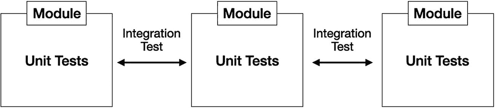
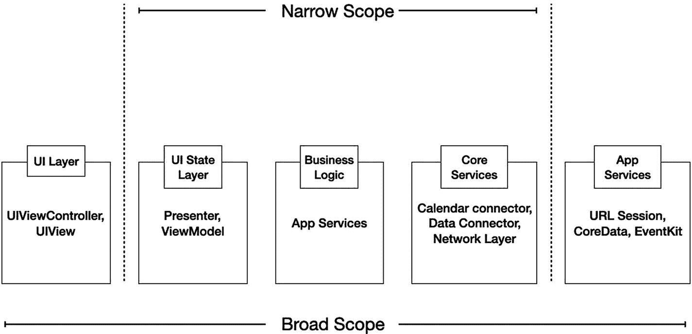
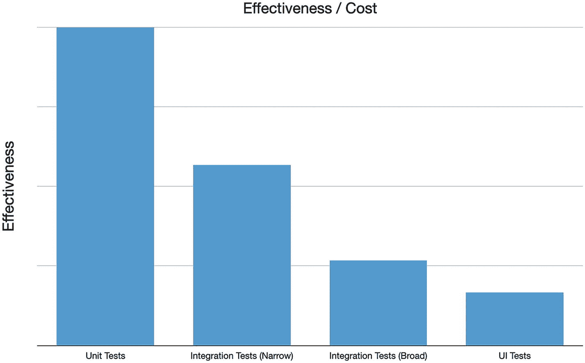
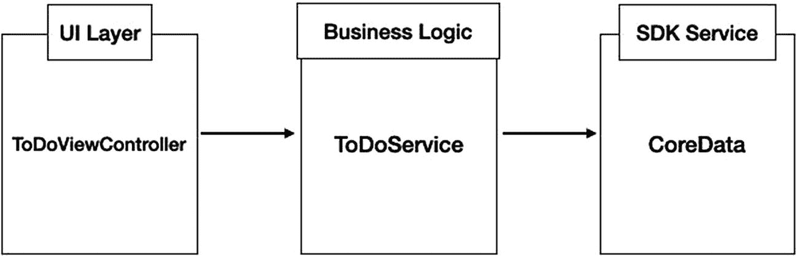
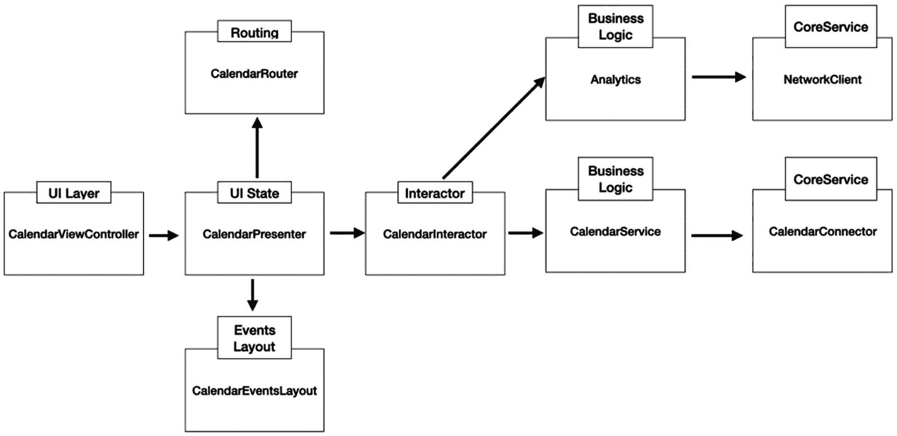
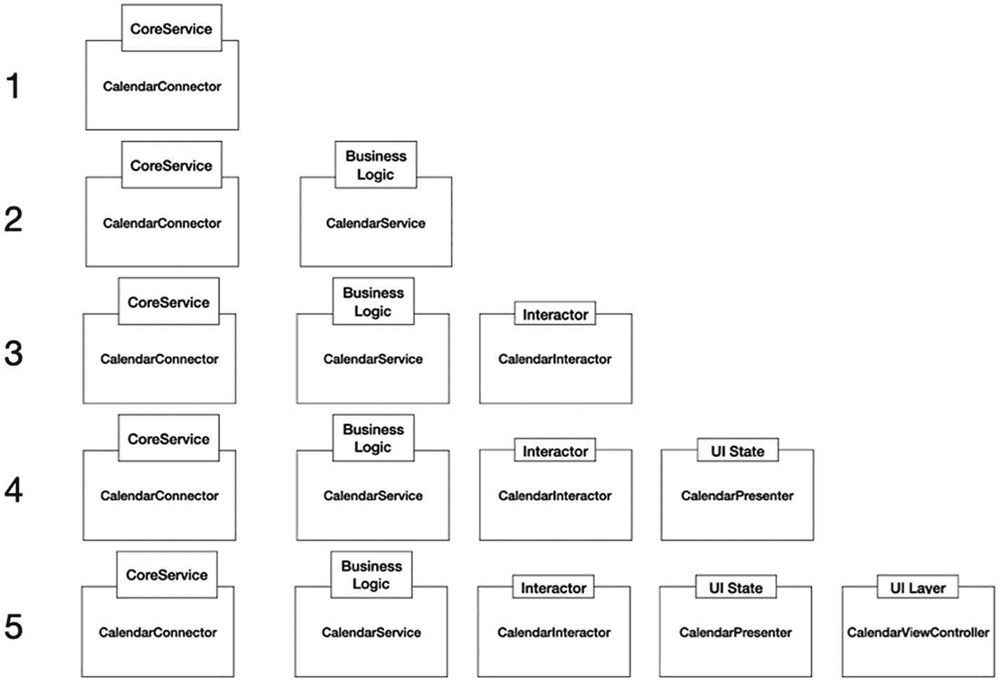
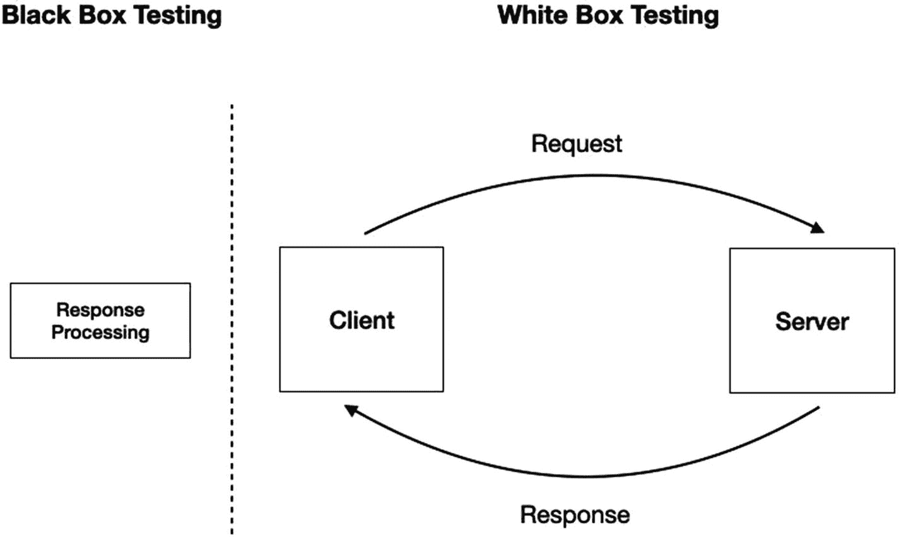
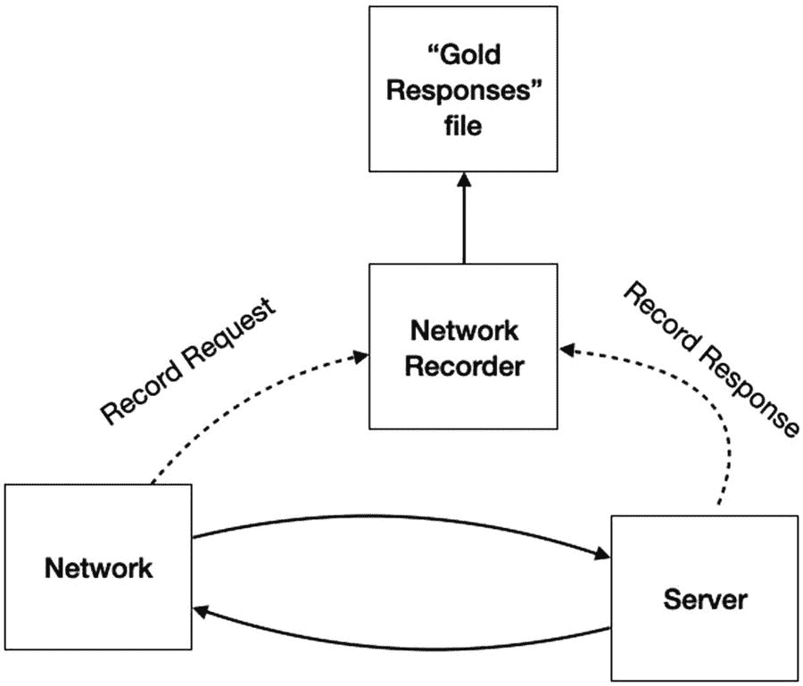
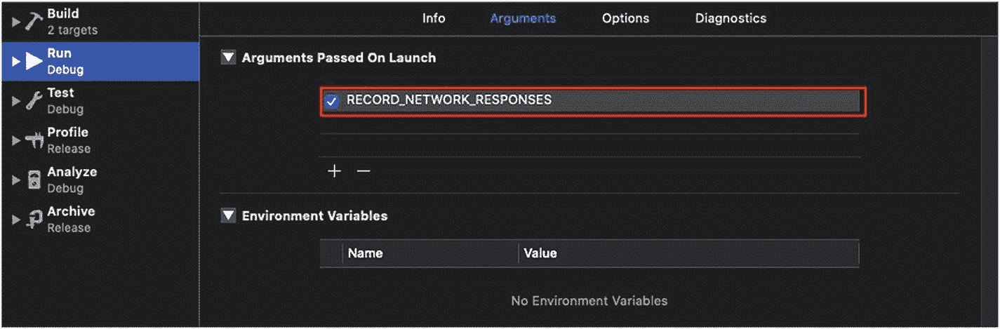

# 集成测试

> *调试的难度是初始编写代码的两倍。因此，如果你的代码写得尽可能巧妙，那么根据定义，你就不够聪明去调试它。*
>
> ——Brian W. Kernighan

## 引言

在前面的章节中，我们学习了如何测试一个特定的单元。我们讨论了如何将其与应用程序的其余部分隔离，并专注于其具体实现。

然而，我们的项目不仅仅是一堆需要测试的函数。它是一个设计为协同工作的完整系统。

在本章中，你将学习：

*   为什么为你的项目添加集成测试至关重要
*   集成测试相对于单元测试的成本是什么
*   如何定义我们测试的范围
*   如何编写一个简单的集成测试
*   如何编写增量集成测试
*   什么是“自底向上”和“自顶向下”测试
*   如何编写客户端-服务器测试，包括黑盒测试和白盒测试

## 集成测试背后的理念

集成测试理念的根源可以追溯到多年前，当时开发团队试图构建一个庞大而复杂的系统。问题是每个团队都有自己的使命——开发一个模块，该模块稍后需要集成到一个更大的模块中。虽然每个团队都负责编写单元测试以确保其代码按预期执行，但最大的挑战是将所有模块组合起来。

可以将这个挑战想象成一个拥有非常多才华横溢球员的运动队。球员仅仅状态良好是不够的——他们还需要作为一个团队协同工作，尤其是要加强彼此间的沟通。

### 什么是集成测试

我们创建的大多数功能都构建在**模块**或**层**之上。这种层的一个例子是 `UIViewController` 代表的 UI 层。`Presenter`/`ViewModel` 可以是另一个层。`Interactor`、业务逻辑、日历连接器和网络层是我们应用程序中存在的其他层示例。

事实上，在应用程序中找到五层、六层甚至七层的情况并不少见。

推荐的工作流程是首先单独测试每一层，然后测试所有单元如何协同工作（参见图 5-1）。



图 5-1
集成测试——单独测试每一层，然后测试它们之间的通信

注意，集成测试可以在两个或多个模块之间进行，也可以是整个系统。

### 集成测试 vs 单元测试

开发人员对集成测试的第一个困惑是如何创建这样的测试。回想一下，在 `XCTest` 中我们只有两种创建测试的方式——UI 测试和单元测试。在这种情况下，集成测试属于单元测试。

另一个困惑是到底什么被认为是**集成**。例如，如果你测试一个依赖于另一个逻辑函数的函数，那是集成吗？再比如说，这个函数使用了你项目中的某个辅助类，那也算是集成吗？毕竟，两个类之间进行了通信——在我看来这像是集成。

然而，在我们的上下文中，并非每个类和函数之间的通信都被视为“集成”。

在 iOS 集成测试中，通常测试的是我们架构中各层之间的集成，这意味着根据数据流来测试这些层，而不仅仅是外部函数或类的使用。

此外，在单元测试中，我们**大量使用测试替身**。并不是说集成测试不包含测试替身——它们确实有，但数量要少得多，而且大多是在边界上（我们稍后会讨论）。


### 定义测试范围

我之前提到过，集成测试指的是层与层之间的数据流。请记住，其中一些层比较难以测试。例如，`网络层`负责与我们的服务器进行通信。这不仅需要网络连接和一个在线的服务器，有时还需要令牌和其他身份验证数据。另一个难以测试的层的例子可能在我们系统的另一端——`UI 层`。在这一层，我们经常需要从 `XIB` 文件或 `Storyboards` 加载类。

总的来说，在处理集成测试时，我们需要定义我们的`测试范围`。一方面，测试整个系统（端到端）是理想状态，即从 UI 层一直到服务器。另一方面，这样的测试编写和维护起来更困难，运行速度也更慢。

看一下示意性的功能架构图（图 5-2）。



图 5-2

集成测试的范围

图 5-2 展示了一个经典的屏幕架构——从 UI 层一直到 iOS SDK 框架。你可以看到我们可以进行范围广泛的测试，即在 UI 层执行某些操作并检查另一端（例如 `Core Data`）的影响；或者进行范围较窄的测试——测试部分层，并对系统的其余部分使用测试替身。

#### 填补空白

尽管范围较窄的集成测试非常经济高效，但有些人可能会认为它们没有测试整个系统。这可能是对的，但我们可以克服这一点。我们可以轻松地将集成测试划分为不同的测试套件——一个套件可以测试若干层（从 UI 到应用核心服务），另一个套件则可以专注于客户端-服务器集成测试。

将集成测试分离到不同的测试类或测试包中，有助于我们以不同的频率运行它们。问题是“这一切麻烦是否值得？”

#### 就像单元测试与集成测试的比例关系

如果你还记得第一章的内容，我们讨论了测试金字塔，并且应该在不同的测试套件之间找到合理的平衡。

我们需要考虑的因素之一是效果与成本之间的比例。请看图 5-3。



图 5-3

不同类型测试的效果

上图是关于成本与效果之间比例关系的一个粗略估算。如你所见，范围较窄的集成测试比范围广泛的集成测试有用得多，这就像单元测试和集成测试之间的一般区别一样。

过多的集成测试可能会让你花费大量时间来维护它们，防止它们失效，这比单元测试花费的时间更多。另一方面，测试关键流程可以让你对你的应用和代码更有信心。

## 编写集成测试

从技术上讲，编写集成测试非常类似于编写单元测试。单元测试和 UI 测试是模板的技术名称，而不是它们的方法论名称。集成测试归属于`单元测试`，并使用相同的断言和函数结构。

然而，集成测试需要更初步的设计过程，以及对功能和屏幕架构更广泛的知识和认识。

让我们尝试编写第一个集成测试。

### 我们的第一个集成测试

我们有一个基础待办事项应用（图 5-4），只有三个组件。



图 5-4

包含三个层的基础待办事项应用

我们的待办事项应用由三层构建——UI 层（屏幕本身）、基础业务逻辑，以及负责处理待办事项项状态的 Core Data 持久化存储。

我们要编写的测试用例是：当用户将一个项目标记为“已勾选”时，该项目也应在我们 `Core Data` 存储中被标记为“已勾选”。显然，这是一个集成测试，旨在验证我们的三个层能够无缝协作。

让我们看看我们的层应该如何协同工作：

*   用户按下视图控制器上的“标记”按钮。
*   业务逻辑接收点击事件并获取对应的项目。
*   业务逻辑将项目状态属性更新为“已勾选”。
*   数据连接器在我们的 `CoreData` 持久化存储中更新数据。

现在来看一下我们的测试方法：

```
func testMarkItemAsChecked_verifySavedInStore() {
// arrange
let viewController = ToDoListItemsViewController(nibName: "ToDoListItemsViewController", bundle: nil)
viewController.loadViewIfNeeded()
let itemID = UUID().uuidString
_ = CoreDataConnector.shared.insertNewItem(title: "my Item", id: itemID)
viewController.itemID = itemID
// act
viewController.markItemAsCheckedButtonTapped()
// assert
let item = CoreDataConnector.shared.getItem(byID: itemID)!
XCTAssertTrue(item.checked)
}
```

首先，和单元测试一样，我们也遵循 AAA 模式——准备-执行-断言。

在“准备”部分，我们初始化了 UI 层，在本例中是一个 `UIViewController`。

请注意我们在这里进行了一个不寻常的调用：

```
viewController.loadViewIfNeeded()
```

方法 `loadViewIfNeeded()` 强制加载视图，即使我们没有将其添加到屏幕上。这在测试中处理 UI 元素时非常有用。

在初始化 UI 层之后，我们准备数据库并向核心数据存储中插入一个新项目。

“`执行`”部分非常简单直接——因为我们在准备部分已经加载了视图，我们所有的 `IBOutlet` 和 `IBAction` 都已连接。我们可以直接调用其 `IBAction` 来模拟按下标记按钮。

在`断言`部分，我们直接访问 `DataConnector`，获取相关的 `CoreData` 对象，并断言其“已勾选”值。

如你所见，我们测试了三个层如何集成，而无需使用任何测试替身。

但是，有一些事情我们需要注意，尤其是在集成测试中：

*   **测试结束后始终要清理**。集成测试会改变状态、写入文件和修改数据库。这不仅会影响你运行的下一个测试的结果，也会影响并行运行的其他测试。考虑到你的设备/模拟器上已经保存了一些数据，当你开始测试时，你的应用并不是“干净”的状态。
*   鉴于上述原因，你需要**将集成测试与其他测试隔离运行**。请记住，你的测试共享相同的资源。最好为每个测试使用不同的持久化存储文件或其他 `UserDefaults` 设置。
*   你必须假设**开始测试时应用状态是不可预测的**。如果你管理某些影响测试的认证状态（例如“已登录”），请在测试开始前重置它（你可以使用 `setup()` 方法）。

### 并行运行

正如你所看到的，在处理共享资源时，并行运行可能会给我们带来麻烦。不过，有一些方法可以克服这一点。

例如，使用内存中的 `Core Data` 存储可以帮助你将其与其他测试隔离开来。使用不同的 `SQLite` 文件名启动测试也可能很有用。

### 集成测试中的故障点

编写集成测试时，我们面临的挑战之一是当测试失败时，如何确定我们的故障点。

与单元测试不同，在集成测试中，我们的数据流会经过多个层，其中任何一层都可能是问题的根源。具体来说，问题的根源可能不是某个层本身，而是**两层之间的集成**。幸运的是，一些技巧可以帮助我们定位问题并精确找到失败的地方。


### 一个更庞大的测试系统

在处理三层架构时，定位故障点看起来可能不是什么大问题。但当面对具有五到六层、集成和调试难度更高的功能与架构时，情况就不同了。

让我们来看一个这样的系统（图 5-5）。


图 5-5：一个包含五层的复杂功能

图 5-5 描述了一个五层功能的设计，从 UI 开始，到连接设备日历和网络的核心服务结束。

我们如何为这样的架构编写高效的集成测试，以帮助我们追踪问题？一种方法是进行增量式集成测试。

## 增量式集成测试

我们知道，测试几个层之间的集成可能是个问题，但测试两个层之间的集成就直接得多。在增量式测试中，我们拿架构开刀，从最开始的两个层着手。在每一步中，我们在测试中多添加一个层并重新检查，直到添加完所有的层。

通过这种方式，我们在每一步都重新测试集成，从而更容易定位问题。

但是，如何精确地一次测试一个层呢？毕竟，我们面对的不是乐高积木。

实现增量式集成测试主要有两种方法——**自底向上**和**自顶向下**。

### 自底向上

如果将 UI 层视为我们架构的“顶”层，那么核心服务层就是“底”层。在谈论“顶”和“底”时，我们通常将更接近用户级别的层称为“顶”，将更接近系统级别的层称为“底”。

在 BUA（自底向上方法）中，我们从核心服务层开始测试集成，并在其上不断叠加层，直到完全覆盖系统。

让我们尝试为我们的日历功能构建一个测试套件（图 5-6）。


图 5-6：日历功能的 BUA 测试套件

上图描述了为我们的功能进行增量测试所需编写的测试列表。如你所见，我们在每一步都添加一个测试。就像标准单元测试一样，建议你在独立的测试方法中测试每个步骤，以将测试彼此分离。

让我们看看在代码中是如何实现的：

```
class CalendarConnectorSpy : CalendarConnectorProtocol {
    var fetchEventsFromDate : Date?
    var fetchEventsToDate : Date?
    func fetchEvents(fromDate startDate: Date, toDate endDate: Date, visibleCalendars: [String]) -> [EventItem] {
        return []
    }
    func clean() {
        fetchEventsFromDate = nil
        fetchEventsToDate = nil
    }
}

class CalendarScreenIntegrationTests: XCTestCase {
    var startDate : Date = Date()
    var endDate : Date = {
        return Calendar.current.date(byAdding: .hour, value: 1, to: Date())!
    }()
    let spy = CalendarConnectorSpy()
    
    override func setUp() {
        CalendarService.shared.calendarConnector = spy
    }
    
    override func tearDown() {
        CalendarService.shared.calendarConnector = CalendarConnector()
        spy.clean()
    }
    
    func validateDates(file : StaticString = #file, line : UInt = #line) {
        XCTAssertEqual(spy.fetchEventsFromDate!, startDate)
        XCTAssertEqual(spy.fetchEventsToDate!, endDate)
    }
    
    // ------ testing the bottom layers ---------
    func testBusinessLogicLayer() {
        // arrange and act
        _ = CalendarService.shared.fetchEvents(fromDate: startDate, toDate: endDate)
        // assert
        validateDates()
    }
    
    // ---  adding the interactor -------
    func testInteractorLayer() {
        // arrange
        let interactor = CalendarScreenInteractor()
        // act
        _ = interactor.fetchEvents(fromDate: startDate, toDate: endDate)
        // assert
        validateDates()
    }
    
    // ------ reaching to the UI Login layer
    func testPresenterLayer() {
        // arrange
        let presenter = CalendarScreenPresenter()
        // act
        presenter.onDateChange(toDate: startDate)
        // assert
        validateDates()
    }
    
    // ---------- this is the top layer ---------
    func testVCLayer() {
        // arrange
        let vc = CalendarScreenViewController(nibName: "CalendarScreenViewController", bundle: nil)
        vc.loadViewIfNeeded()
        // act
        vc.tappedDate(date: startDate)
        // assert
        validateDates()()
    }
}
```

让我们从 `setUp()` 和 `tearDown()` 方法开始：

```
override func setUp() {
    CalendarService.shared.calendarConnector = spy
}
override func tearDown() {
    CalendarService.shared.gConnector = CalendarConnector()
    spy.clean()
}
```

在日历功能中，运行广泛的集成测试很困难，主要是因为它需要用户对日历本身的权限。

所以，在这种情况下，我们创建了一个间谍。如果你还记得的话，间谍是一个不返回任何东西的对象，而是记录调用和信息。

我们将间谍连接到 `CalendarService` 单例，并在 `teardown()` 方法中清理它。

我们的第一个测试与连接器层之后的下一个层——`CalendarService` 层相关：

```
func validateDates(file : StaticString = #file, line : UInt = #line) {
    XCTAssertEqual(spy.fetchEventsFromDate!, startDate)
    XCTAssertEqual(spy.fetchEventsToDate!, endDate)
}
func testBusinessLogicLayer() {
    // arrange and act
    _ = CalendarService.shared.fetchEvents(fromDate: startDate, toDate: endDate)
    // assert
    validateDates()
}
```

在我们的测试方法中，我们运行 `CalendarService` 的 `fetchEvents()` 方法，希望它能用有用的信息填充我们的间谍。

为了不在每个测试中重复，我们创建了一个自定义断言方法来验证间谍接收到的日期，就像我们在前几章学的那样。

在我们的业务逻辑测试通过之后，我们可以继续下一个层——屏幕交互器：

```
func testInteractorLayer() {
    // arrange
    let interactor = CalendarScreenInteractor()
    // act
    _ = interactor.fetchEvents(fromDate: startDate, toDate: endDate)
    // assert
    validateDates()
}
```

这里也一样——我们调用交互器中的 `fetchEvents()` 方法，最后检查间谍。

我们继续测试，直到到达最后一层——`UIViewController`。

在这一层，我们模拟用户操作：

```
vc.tappedDate(date: startDate)
```

自底向上的方法易于实现，并减少了对测试替身的使用。然而，在某些情况下无法使用自底向上的方法，你不得不采用自顶向下的增量测试。

### 自顶向下

有时底层的组件尚未就绪。实际上，在开始开发新功能时，这通常是常态。我们首先定义所有层之间的接口，然后从上到下继续开发。

随着开发的进展，我们希望确保我们的组件正确集成。由于我们的底层尚未就绪，我们可以创建一个存根来替换它们，并以此在路上创建增量测试。这种方法被称为“自顶向下”，当存在尚未就绪的组件时，这通常是我们开发过程中采用的方法。


## 处理边界问题

集成测试中最复杂的步骤是第一和最后一步——一方面模拟 UI 行为，另一方面检查结果，这可能涉及处理系统框架、网络，甚至可能是持久化存储。

针对这些部分有一些解决方案。

在 UI 方面，最佳实践是避免直接调用与 UI 相关的方法，例如`UIScrollView`的委托方法或`UITableView`的`dataSource`。一个解决方案是将这些方法中的逻辑提取出来，放入纯函数中。

在更复杂的 UI 界面中，你可能需要考虑消除 UI 层，只测试 Presenter 或`ViewModel`类。相比维护一个难以维护、在未来变更中更容易出错的测试，拥有一个范围更窄的测试是更好的选择。

在核心服务方面，避免包含需要用户权限的层，例如日历、联系人和相册。与其寻找技术手段绕过访问权限（确实存在一些技巧），不如投入时间创建假数据和记录数据。

请记住，虽然使用真实对象并模拟真实流程是更好的，但为此花费大量时间去绕过和破解系统是不值得的。

## 客户端-服务器测试

有一个众所周知的事实——如今大多数移动应用都依赖于某种后端服务。实际上，其中一些应用深度依赖服务器来完成首要的日常任务。

如果我们说内部各层之间的集成可能很容易出错，那么在谈及我们的客户端与服务器之间的集成时，这一点尤其正确。

但测试与服务器的集成可能会很复杂，并面临若干挑战和问题：

*   **难以设置**——是的，向服务器发送请求可能很容易，但当需要将响应与预期结果进行比较时，编写断言部分可能会很繁琐。存在冗长复杂的 JSON 响应，编写起来非常困难，更不用说随着未来所有变化而维护它们了。

*   **速度慢**——与单元测试甚至较窄范围的集成测试不同，客户端-服务器测试涉及与服务器交互，因此依赖于网络连接和后端资源。当运行数十个客户端-服务器请求时，这可能成为问题。

*   **可能很脆弱**——延续上一节的内容，对服务器的依赖可能导致这些测试很容易失败。此外，断言部分也不简单——有时，响应中的简单更改，例如一个额外字段或不同的时间戳，都可能毫无道理地导致测试失败。

*   **测试间的依赖关系**——我们总是说测试不应该相互依赖。但如果我们没有先测试登录方法，怎么能测试数据同步方法呢？很有可能，我们需要以某种顺序运行这些测试，这与我们在几乎所有其他测试中的做法相反。

在我们继续进行客户端-服务器测试之前，我们需要理解测试的确切范围是什么。

例如，我们关心响应的结构吗，还是只需要确保我们的客户端能正确处理它？

如果我们收到 HTTP 200 状态码，这足以让我们的测试通过吗？

如你所见，明确限定我们究竟要测试什么以及对我们重要的是什么，这一点至关重要。

一般来说，公认的看法是客户端-服务器测试分为两种主要方法——黑盒测试与白盒测试（图 5-7）。



图 5-7

黑盒测试与白盒测试

黑盒测试忽略结构和协议，只关注行为。白盒测试则验证协议、结构、请求和响应。这是两种完全不同的方法，选择哪种至关重要。

> **注意**
> 黑盒测试和白盒测试被用于许多测试领域，而不仅仅是客户端-服务器测试。尤其是在讨论 UI 测试时，你会遇到这些术语。

### 黑盒客户端-服务器测试

在黑盒测试中，我们不关心实际的请求和响应。我们不处理 JSON 或任何其他数据结构。我们关心的是功能。

谈到客户端-服务器测试，黑盒方法更直接，可能也是最常用的方式。

那么，我们从哪里开始呢？既然我们处理的是网络请求，我们的测试必须是异步的。在这种情况下，我们将使用之前学过的工具——`XCTestExpectation`。

请看我们的第一个客户端-服务器测试：

```
class LoginServiceIntegrationTests: XCTestCase {
override func tearDown() {
// 在测试结束时重置状态很重要
LoginService().logout()
}
func testLoginFunction() {
// 我们定义期望和一个本地变量来存储传入的结果
let expectation = self.expectation(description: "Check Login Flow Message")
var receivedResult : LoginOperationResult = .success
LoginService().doLogin(email: "avi@myemail.com", password: "123") { (result) in
receivedResult = result
expectation.fulfill()
}
// 由于是网络请求，我们等待 10 秒以确保即使在慢速连接下也能得到响应
self.waitForExpectations(timeout: 10.0, handler: nil)
// 断言
XCTAssertEqual(receivedResult, LoginOperationResult.success)
}
}
```

在前面的例子中，我们测试登录机制。如你所见，我们需要使用常量用户名和密码。

作为替代方案，我们可以将两个请求链在一起——注册和登录：

```
func testRegistrationService() {
// 我们定义期望和一个本地变量来存储传入的结果
let expectation = self.expectation(description: "Check Register and Login Flow")
var receivedResult : LoginOperationResult = .failure
let email = generateEmail()
let password = generatePassword()
RegisterService().register(email: email
, password: password) { (result) in
if result == .success {
LoginService().doLogin(email: email, password: password) { (loginResult) in
receivedResult = loginResult
expectation.fulfill()
}
}
}
// 由于是网络请求，我们等待 15 秒以确保即使在慢速连接下也能得到响应
self.waitForExpectations(timeout: 15.0, handler: nil)
// 断言
XCTAssertEqual(receivedResult, LoginOperationResult.success)
}
```

我们生成邮箱和密码，创建一个新用户，然后尝试用相同的凭证登录。如前所述，与其他测试类别不同，客户端-服务器测试有时需要将请求链接在一起。在许多情况下，集成测试模拟的是真实用户流程场景，因此规划测试的方式与标准单元测试略有不同。

同样要记住，客户端-服务器测试不仅影响你应用的状态，还会影响服务器上的数据。因此，在测试后进行清理是至关重要的一步。


### 白盒客户端-服务器测试

黑盒测试非常出色。编写黑盒测试更容易，因为你无需处理测试替身。你不需要“弄脏”双手去解析服务器响应和比较数值。此外，黑盒测试通常能覆盖核心功能和基本功能。

但黑盒测试也有其缺点。有些情况下，仅检查功能是不够的，你需要进行更深入的验证，测试请求和响应的结构。

数据同步就是一个很好的例子——我们发送一个同步请求并收到一个成功响应。但这足以确定我们的集成工作良好吗？如果我们没有发送所有预期的数据怎么办？如果我们本应发送一个关键标志或重要的数据片段，但我们的请求中缺失了这部分数据怎么办？

白盒集成测试旨在填补这一空白。在白盒集成测试中，我们进行更深入的测试，检查客户端与服务器之间的协议。

创建白盒测试的过程建立在三个步骤之上：

**将你的应用置于理想状态**，一个定义了基线状态的状态。从此刻起，你将把你的测试与这个状态进行比较。

**对该状态进行快照**——记录你的请求和响应，并将它们保存到文件中。我们可以将保存的响应称为“黄金响应”，因为这些是我们在运行测试时应得的理想响应。

在你的测试中，**执行你的逻辑功能**，但这次，再次记录你的请求和响应，最后将它们与你在早期步骤中保存的黄金响应进行比较。

虽然这些步骤听起来可能有些令人生畏，但构建优秀的基础设施和辅助工具可以帮助你实现它们。

## 将你的应用置于理想状态

当然，我们可以通过这个过程实现 TDD。但 TDD 在提前定义行为时效果显著。当检查数据结构时，在“快照”我们达到的理想状态时进行会更为简单和容易。顺便说一句，在我看来，除了单元测试外，在编写其他测试时采取这种方式并非错误的方法。

## 记录当前状态

为了记录我们的请求和响应，我们需要创建一个网络记录器。网络记录器接收请求和响应，将它们捆绑在一起，并保存到一个文件中（图 5-8）。



**图 5-8. 实现一个网络记录器**

这种记录器的接口很简单：

```
typealias RequestData = [AnyHashable : Any]
typealias ResponseDate = [AnyHashable : Any]
struct RequestBundle {
var request : RequestData
var response : ResponseDate
}
enum RequestBundleType {
case login
case register
case sync
case setup
}
class NetworkRecorder {
var data = [RequestBundleType : RequestBundle]()
func recordRequest(bundle : RequestBundle, type : RequestBundleType) {
// save the bundle to data
}
private func saveDataToFile(data : [RequestBundleType : RequestBundle]) {
// save the data into a file.
}
}
```

要激活记录，我们可以使用我们在前几章中学过的启动参数（图 5-9）。



**图 5-9. 激活记录的启动参数**

快照会话结束后，我们需要做的就是获取“黄金响应”文件并将其添加到我们的测试包中，以便将来验证我们的请求和响应。

黄金响应文件可能看起来像这样：

```
[
{
"request" : "login_request",
"response" : {
"id" : "f3e0b3a7-6db7-408e-bd26-a91bf31c03d2",
"name" : "Avi Tsadok",
"token" : "peoqFB8KcAjmVtQfe34TmWxgpumIUEhs",
"updated_date" : "1589603996"
}
},
{
"request" :        "configuration",
"response" : {
"push_notification_on" : 1
}
}
]
```

## 与黄金响应文件比较响应

记录会话相当简单。我们只需要获取请求和响应并将其放入一个文件。但真正的挑战在于比较。

首先，我必须说这些白盒测试非常脆弱。结构或值上的每一个微小、无害的更改都可能导致我们的测试失败。请记住这一点，并确保你在关键的用例（如同步和登录）上实现这些测试。

尽管如此，如果我们决定编写白盒测试，有一些问题需要考虑：

*   通常引起问题的数据类型是**日期/时间**，或者换句话说，**时间戳**。这些值通常来自计算机时间或服务器时间。有几种处理方法：
    *   有时，**如果时间戳不正确**，测试失败很重要。
    *   有时，时间戳是**相对的**。在这种情况下，我们也需要调整我们的比较方式，使其成为相对的。
    *   在大多数情况下，最好**忽略**与这些值的任何比较，只需确保它存在即可。
*   我们需要决定，如果响应或请求包含黄金响应文件中不存在的额外值，该怎么办。通常，额外的属性对你的代码是无害的，你可以忽略它们。
*   如果你的响应包含数组，你需要决定元素的顺序是否至关重要。

正如你所看到的，你需要编写的比较方法可能会很复杂。编写白盒客户端-服务器集成测试的成本远高于黑盒测试，并且很容易被破坏。

## 总结

虽然集成测试很重要，但它们更难编写和维护。最好为你应用的关键部分编写集成测试，这在涉及客户端-服务器测试时尤其正确。这些测试不仅能提高你对代码的信心，还能增强你对整个系统的信心。

在下一章中，我们将后退一步，学习如何为集成测试和单元测试准备我们的代码。

