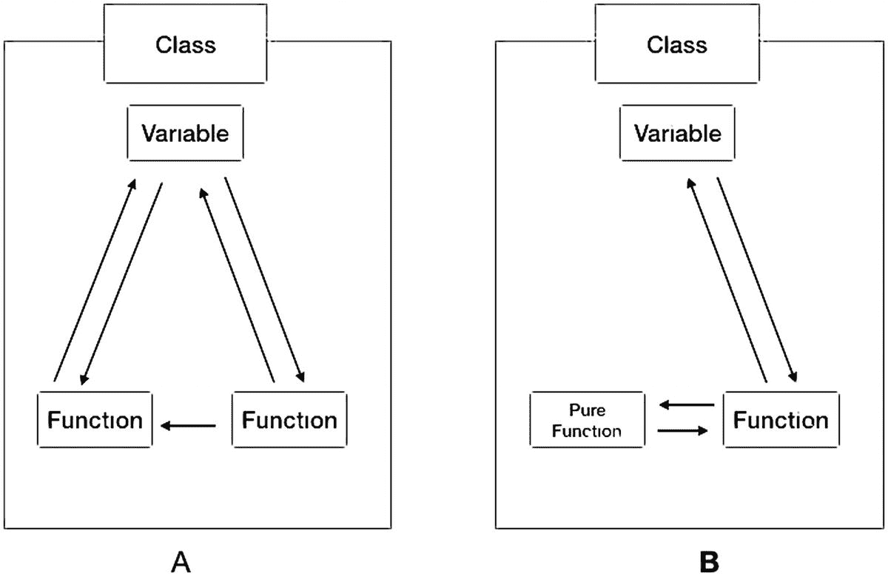
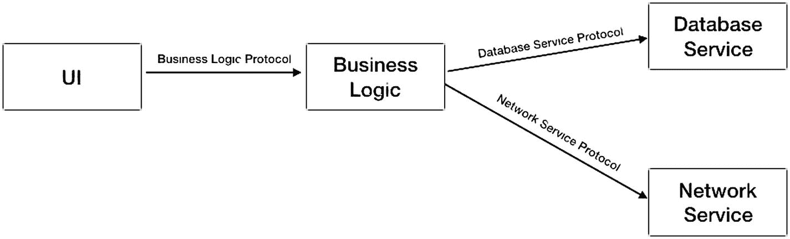
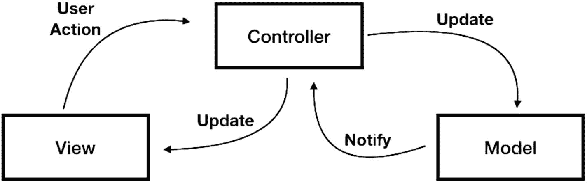
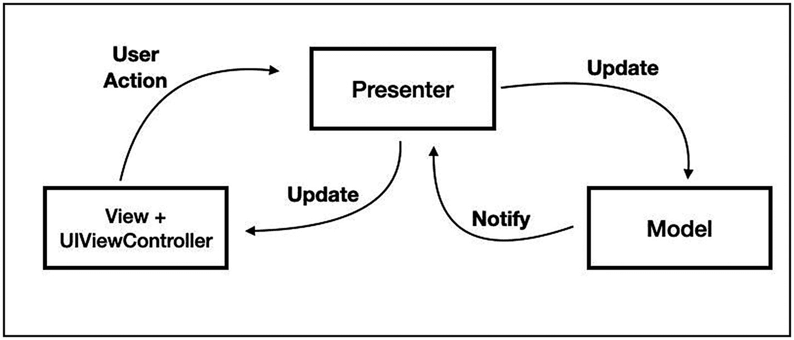
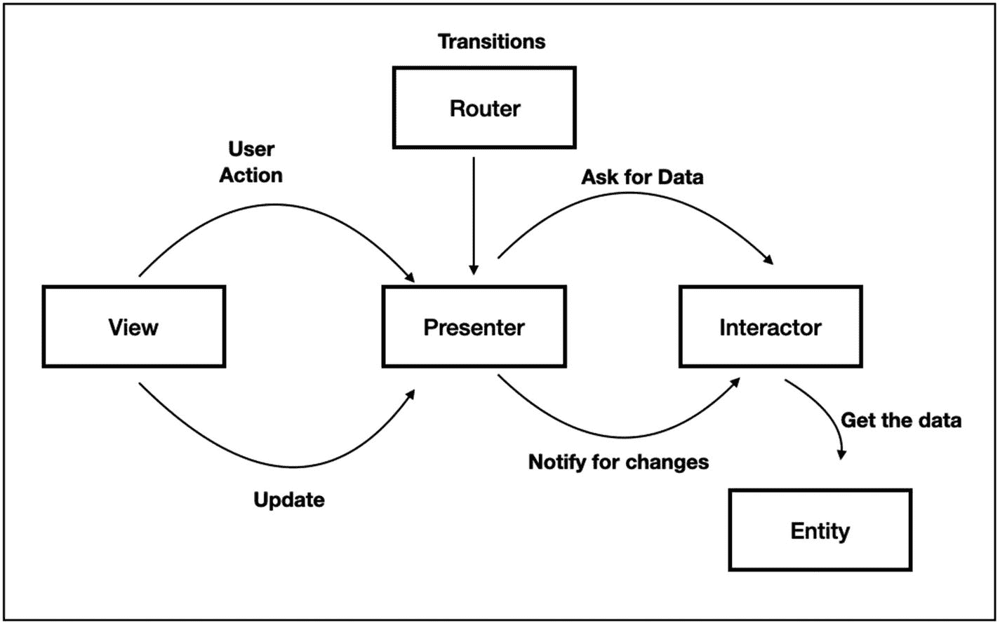

# 6. 编写可测试代码

> *质量意味着即使无人监督，也要把事情做好。*
>
> —亨利·福特

## 引言

我们已经知道，测试你的应用是长期保持高质量代码的关键任务。但要做到这一点，我们需要我们的测试简单易行。

可测试代码是健壮、模块化架构以及简洁、简单代码的衍生物。尽管本章不直接讨论测试，但它是学习如何测试代码的前提，总的来说，这也是提升代码质量的好机会。

在本章中，你将学习：

*   **什么是整洁代码**，包括 KISS、DRY 和 YAGNI 等术语。
*   **什么是纯函数**以及它如何帮助你的代码更具可测试性。
*   实现**依赖注入**的不同方法。
*   **SOLID** 原则是什么。
*   可用于组织代码的**设计模式**，包括**单例模式、外观模式、装饰器模式和工厂模式**。
*   **什么是 MVC、MVP、MVVM 和 VIPER**，以及哪种更适合你的需求。


## 什么是可测试的代码？

可测试的代码是指你无需费劲就能为其编写自动化测试的代码。在大多数情况下，它也意味着高质量、简洁且可读性强的代码。

看看我们优秀的“我的天气”应用主屏幕中的以下代码：

```
override func viewDidAppear(_ animated: Bool) {
    super.viewDidAppear(animated)
    var request = URLRequest(url: URL(string: "http://www.myweatherapp.com/getCities.php")!)
    request.httpMethod = "GET"
    let task = networkSession.dataTask(with: request) {(data, response, error) in
        if let receivedData = data {
            try receivedData.write(to: self.localURL)
        }
    }
    task.resume()
}
```

让我们总结一下这段代码的作用：
*   在屏幕出现时运行
*   创建一个 GET 请求
*   创建一个数据任务来发送请求
*   将来自 GET 请求的接收数据写入本地文件

虽然这看起来像是一段简单的代码，但它很可能不可测试，原因如下：
*   所有代码都在 `viewDidAppear` 方法内部。此方法是 `UIViewController` 生命周期的一部分，可能还包含与下载文件无关的更多代码。此外，我们将来可能希望将这段代码移出并放入另一个方法中。这一步可能会导致我们的测试在这样做时失败。
*   代码向我们的服务器发送 HTTP 请求。虽然在某些集成测试中这是可以接受的，但我们不希望在我们的单元测试和 BDD 测试（甚至在一些 UI 测试中）依赖于网络连接或服务器状态。我们不能让服务器或网络问题影响我们的测试结果，而且在这个例子中，模拟我们的请求很困难。
*   在成功的情况下，代码将数据写入文件。检查文件是否已写入对于集成测试来说很好，但对于单元测试则次之。具有副作用的函数测试起来不太方便，尤其是在涉及 I/O 操作时。

但别担心！我们可以做几件事来改进我们的代码。

首先，我们可以将代码从 `viewDidAppear` 方法中移除，并将其放在自己的函数中。其次，我们可以创建两个服务层：`NetworkClient` 来处理网络请求，`DataLayer` 来处理 I/O 操作。

看看下面修复后的代码：

```
override func viewDidAppear(_ animated: Bool) {
    super.viewDidAppear(animated)
    loadCities()
}

func loadCities() {
    NetworkClient.shared.fetchCities {(data) in
        if let receivedData = data {
            DataLayer().saveCitiesData(data: receivedData)
        }
    }
}
```

现在我们的代码更加整洁、易于阅读，是的，也更可测试。你可以测试 `loadCities()` 函数；无需担心它可能包含无关的逻辑，并且模拟所有其他依赖项非常直接。

我们可以说，编写干净和模块化的代码不仅是更高质量的代码，而且也是更具可测试性的代码。可测试的代码和高质量的代码自然相辅相成，这正是本章的全部内容。

## 整洁代码

有很多优秀的书籍讨论整洁代码。不编写整洁和结构化代码的主要借口是“时间不够”。然而，编写整洁的代码并不意味着“花费更多时间”。不仅如此，更整洁的代码实际上可以在未来为你节省时间，同时也更易于维护和测试。整洁代码是一种思维模式。

编写整洁代码有若干原则和指导方针，我将介绍其中的一些。

### KISS（保持简单）

KISS 代表“保持简单，傻瓜”。KISS 不仅仅是“万法归一的法则”，也是最难遵循的规则。

问题的根源在于人性。当我们编写代码时，我们理解它。我们当天晚些时候甚至第二天也能理解它。

但是几个月后，甚至几周后，当我们查看自己的代码时，我们会发现自己难以理解当初写的是什么。

讽刺的是，在初学者的代码中更常见的是脏乱、复杂的代码。原因在于，编写简单的代码是复杂的。编写一个简单、结构化的代码，具有清晰的函数名、分层以及良好易懂的 API，需要大量的经验和知识。

它还需要抽象思维、对技术的深刻理解，以及主要是不追逐每一个新出现框架或语言特性的成熟度。

但有一些经验法则可以让你的代码保持简单。

> *用代码行数来衡量编程进度，就像用重量来衡量飞机制造进度。*
>
> —比尔·盖茨

**少即是多**：更短的函数、更短的类、更短的文件。如果你的函数超过 50 或 60 行代码，这是一个让你考虑重写或拆分它的好迹象。

类也是如此——它们需要简短，方法不要超过 20 个。想象一下，有人试图阅读一个包含 40-50 个方法的类接口。就像冗长的方法一样，考虑拆分它。

更少的代码意味着需要阅读的代码更少，更重要的是，需要调试和测试的代码也更少。

当你的函数包含 30 条语句后，出现错误的几率会增加。覆盖所有可能的状态和函数产生的输出变得更加困难。

大型函数的本质是变得越来越大，直到它们变成没有人知道如何工作的代码怪物，每个人都祈祷它们将来不会出问题。

**谨慎处理变量**。如果你的代码就像一个“国家”，那么变量就是它的“公民”。不要给它们起像“i”或“qty”这样无意义的名字；尝试使用像“city”或“firstPersonInTheList”这样的名字。把你的代码想象成用英语写的故事，而不是 Swift。

尽可能缩小变量的作用域。如果仅在循环内部使用变量，不要将其声明在 for 循环外部。如果可以将其作为参数传递给函数，尽量避免让实例变量在类中随意浮动。

**不要重用变量**——如果你有一个用于存储人名名字的字符串变量，请不要重用它来存储姓氏或电子邮件。这会让你在试图理解某个特定语句中该变量代表什么时感到头疼。

在可能的情况下使用 `Typealias`。`Typealias` 是一种无需注释就能解释代码的好方法。

### DRY

DRY 代表**不要重复你自己**，这意味着你在应用程序中拥有的每一段知识或逻辑都应放在一个单独的地方，而不是在你的项目中重复出现。这可以是业务逻辑代码、网络访问、UI 组件，或者任何你认为应该放在一个地方而不应在项目中到处复制的东西。代码重复是错误或不一致行为的常见根源，每个开发者都知道这被认为是糟糕的实践。

### YAGNI（你不会需要它）

YAGNI 是另一个提倡简单的原则，意思是除非你将使用或需要某个功能，否则不应该开发该功能或为其做准备。

有一种假设认为，当开发人员开发一个功能时，他应该考虑到该功能未来可能的扩展，并因此构建一个灵活的架构，但代价是牺牲简洁性和可读性。

这种假设基于这样一种想法：在设计系统时就考虑到未来的变化，比以后再做这些变更更具成本效益。

问题在于，成本估算没有包括长期的维护、为支持它而编写的更复杂的测试，以及一个更复杂的系统需要处理。编写能工作的简单代码，并在时机成熟时进行重构，要舒适得多，也更具成本效益。

我不是说不应该编写灵活的架构——但在大多数情况下，我们不知道是什么以及是否会出现的未来功能根本没有被开发出来。与此同时，我们构建的这个复杂系统却让我们承担了本不需要的额外维护成本。


### 易于阅读的代码也易于测试

我之前提到过，代码质量和可测试性是相辅相成的。易于阅读的代码也更容易测试。判断代码是否易于阅读的一个主要经验法则是看注释。如果你过度使用注释，这可能是代码存在问题的一个好迹象，可能意味着代码过于复杂，难以理解。

Swift 提供了一些出色的工具来帮助你使代码更令人愉悦。

我之前提到过 `Typealias` 作为一种为变量起描述性、有意义名称的方法，但还有更多方式可以让你的代码看起来更精致。

例如，与其编写一个带有大量参数的函数，不如传递一个将参数捆绑在一起的结构体。

看看下面的代码：

```
func runRegistrationProcess(email : String, name : String, password : String, receivingEmailApproval : Bool) {
}
```

现在它可以改成这样：

```
struct RegistrationData {
var email                   :   String
var name                    :   String
var password                :   String
var receivingEmailApproval  :   Bool
}
func runRegistrationProcess(registrationData : RegistrationData) {
}
```

很棒，不是吗？而且，这对测试也更友好，因为它使 API 更加清晰和预定义，这些参数可以快速地传递给更多的函数和对象。

另一个让你的代码更美观的方法是定义你的代码风格和命名规范。代码风格（缩进、方法间的空行、变量顺序等）不仅仅是为了好看。当你保持代码结构的一致性时，会让代码浏览起来舒服得多，也能更好地利用短期记忆。它能帮助你更好地阅读旧代码，并使调试过程更加轻松。无论你选择哪种代码风格，只要在整个项目中保持一致即可。

当然，给出的所有原则也同样适用于测试代码。你应该将你的测试视为“真实”的代码，而不仅仅是应用的游乐场。测试代码同样是你需要长期维护和调试的代码。

## 纯函数

这是让我们的代码更具可测试性和更整洁的另一种方法。

测试的关键因素之一是能够使用相同的参数反复运行测试，并期望每次运行都产生相同的行为。

为了达到非常稳定的测试套件，我们需要将测试与任何外部状态隔离，无论是输入还是输出。我们在面向对象编程中遇到的问题之一是其封装性质鼓励我们在函数内部使用实例变量，这有点偏离了隔离的初衷。

`纯函数` 是指不会产生任何副作用，或者不依赖于外部状态（如全局变量或实例变量）的函数，因此对于相同的输入，你总是会得到相同的输出。

为了实现这一点，我们希望使用函数的参数来传递所有需要的数据，包括实例变量。请看图 6-1。



图 6-1

纯函数 vs. 标准函数

图 A 中显示的类没有任何纯函数。它有一个使用其他函数的函数，并且它们都使用了实例变量。通过查看图 6-1，你可以理解这些函数不是“纯”的。这意味着这些函数有副作用，并且它们依赖于一个实例变量。

要测试这些函数，你需要在开始测试本身之前确保这个实例变量被设置成一个特定的值。

在每次测试运行之前设置初始状态可能导致测试函数变得复杂，并且在未来很容易出错。

现在让我们看看图 B（仍然是图 6-1）。你可以看到所描述的纯函数不与任何实例或全局变量交互，因此对于相同的参数总是产生相同的结果。

这同样适用于调用系统和 SDK 框架，因为它们也可能持有自己的状态。

### 重构我们的函数使其成为纯函数

你可以用一个经验法则来检查你的函数是否是纯函数：尝试将它移到另一个类中。如果你必须修改函数的实现才能使用它，那很可能它不是纯函数。纯函数不仅需要与类无关，还需要与 SDK 无关。

看看 `CitiesViewController` 中的方法 `updateTitle(:)`：

```
class CitiesViewController: UIViewController {
var topTitle : String?
var placeType: String = "City"
override func viewDidLoad() {
super.viewDidLoad()
updateTitle(newTitle: "New York")
}
func updateTitle(newTitle : String) {
self.topTitle = String(format: "%@ - %@", placeType, newTitle.uppercased())
}
}
```

这看起来像是一段简单的代码 —— `updateTitle(:)` 接收一个参数，并根据新标题和 `placeType` 实例变量设置顶部标题。你已经可以理解这个方法不是纯的。该方法在输入端依赖于一个实例变量，并在输出端更新另一个实例变量。

好消息是，重构代码并将此函数改为纯函数非常容易：

```
class CitiesViewController: UIViewController {
var topTitle : String?
var placeType : String = "City"
override func viewDidLoad() {
super.viewDidLoad()
topTitle = updateTitle(newTitle: "New York", placeType: placeType)
}
func updateTitle(newTitle : String, placeType : String)->String {
return String(format: "%@ - %@", placeType, newTitle.uppercased())
}
}
```

在重构后的代码中，你可以看到我给函数添加了另一个名为“placeType”的参数，并且该方法不再更改实例变量；相反，它返回新值。

虽然这看起来是一个小变化，但它使函数完全变成了纯函数。这种隔离意味着该函数的测试设置起来非常容易。

总结一下纯函数：

*   最好尝试让你的函数返回一个值，而不是更新实例变量或全局变量。
*   尝试向函数传递参数，而不是阻止它访问你的实例变量、其他框架或单例。
*   检查函数是否是纯函数的最佳方法是尝试将它移动到代码中的另一个地方。如果你仍然可以使用它，那它很可能就是纯函数。

### 面向协议编程

使用协议而非基本 OOP（面向对象编程）的主要优势在于，一个类可以遵循多个协议。这种能力使我们能够设计出非常灵活和模块化的架构。这确保了透明且可预测的行为，这对于构建测试非常重要。

当你设计架构时，尝试让各层之间仅通过协议进行连接。请看图 6-2。



图 6-2

面向协议编程

协议是连接架构中各个对象的“粘合剂”。这种灵活性体现在，只要符合所需的协议，你就可以轻松替换系统中的每个对象。当我们谈论模拟层和行为时，轻松替换对象确实非常方便。


## 依赖注入

讨论隔离性时的一个问题是代码中不同层和对象之间的依赖关系。我们知道，例如，UI 组件基于某些业务逻辑组件。而业务逻辑组件也依赖于某些核心服务，如网络和数据库层。

当我们想要测试其中一个层的方法时，有时会发现自己很难调整这些方法的行为，使其能有效地帮助我们完成任务。再次记住，如果测试过于困难，这可能是一个很好的信号，表明你的代码在长期内不够易于维护。

但是，有一种通过注入对象实例变量来控制其行为的方法——它被称为`Dependency Injection`。

### 实现依赖注入的方式

现在，让我们回到`Dependency Injection`，看看它如何与面向协议的编程相关联。

实现`Dependency Injection`有几种模式。没有“最佳方式”或“正确方式”；一切都取决于你的具体情况和个人偏好。

看看下面的“CitiesManager”业务逻辑单元：

```
class CitiesManager {
func refreshCitiesFromServer() {
NetworkClient.shared.fetchCities {[weak self] (data) in
if data != nil {
self?.saveCitiesDataToDisk(data: data!)
}
}
}
private func saveCitiesDataToDisk(data : Data) {
DatabaseClient.shared.saveCitiesDataToDB(data: data)
}
}
```

在`refreshCitiesFromServer()`中，代码调用网络客户端，接收数据，然后将其保存到磁盘。尽管这个函数很精简，但测试起来仍然很困难。`NetworkClient`发起 HTTP 请求，`DatabaseClient`执行 I/O 操作。我们可以肯定地说，这个类依赖于这两个对象。

注入其他依赖的第一种方式是使用其构造函数。

#### 经典方式——基于初始化的依赖注入

`基于初始化的依赖注入`是一种在对象初始化时为其提供依赖的方式（我想你从名字就能猜出来）。这通过编写一个在其参数中接收所需依赖的构造函数来实现。

让我们拿上一个例子中的`CitiesManager`类来尝试重构它：

```
class CitiesManager {
var dataBaseClient : DatabaseClientProtocol
var networkClient : NetworkClientProtocol
init(databaseClient : DatabaseClientProtocol = DatabaseClient.shared, networkClient : NetworkClientProtocol = NetworkClient.shared) {
self.dataBaseClient = databaseClient
self.networkClient = networkClient
}
func refreshCitiesFromServer() {
networkClient.fetchCities {[weak self] (data) in
if data != nil {
self?.saveCitiesDataToDisk(data: data!)
}
}
}
private func saveCitiesDataToDisk(data : Data) {
dataBaseClient.saveCitiesDataToDB(data: data)
}
}
```

我们在这里做了两件重要的事：

*   我们创建了一个新的构造函数，期望接收两个依赖——数据库客户端和网络客户端。
*   这些依赖是基于协议的，意味着只要符合所需的协议，我们就可以注入任何我们想要的对象。

这种方法的一大优势是它要求我们注入外部依赖，这确保了类的行为符合我们的期望。

#### 简单方式——基于属性的依赖注入

另一种注入依赖的方式是`基于属性的依赖注入`，这也是最简单的方式。

在`基于属性的依赖注入`中，我们在对象初始化后分配依赖：

```
class CitiesManager {
var dataBaseClient : DatabaseClientProtocol = DatabaseClient.shared
var networkClient : NetworkClientProtocol = NetworkClient.shared
func refreshCitiesFromServer() {
networkClient.fetchCities {[weak self] (data) in
if data != nil {
self?.saveCitiesDataToDisk(data: data!)
}
}
}
private func saveCitiesDataToDisk(data : Data) {
dataBaseClient.saveCitiesDataToDB(data: data)
}
}
let citiesManager = CitiesManager()
// 设置依赖
citiesManager.dataBaseClient = myCustomDatabaseClient
citiesManager.networkClient = myCustomNetworkClient
```

你需要意识到基于属性的依赖注入有其优缺点。例如，它比基于初始化的方式实现起来要简单得多，并且在子类化或在基于 XIB 的视图上操作时可能很方便。

它也不需要你重构现有的构造函数，这在许多项目中可能相当头疼，并且让你可以轻松地向现有类添加新的依赖。

但是`基于属性的依赖注入`也有一些缺点。它要求你公开实例变量，而你可能只想分配它们。另一个考虑是，注入不属于编译器可以确保或通知我们的任何接口的一部分，因此你可能不知道依赖是什么或如何注入它们。

#### 折衷方式——基于参数的依赖注入

`基于参数的方式`不要求你改变构造函数签名或公开你的实例变量。`基于参数的依赖注入`背后的想法是，只通过方法的参数向你要调用的方法注入依赖：

```
class CitiesManager {
func refreshCitiesFromServer(networkClient : NetworkClientProtocol = NetworkClient.shared, dataBaseClient : DatabaseClientProtocol = DatabaseClient.shared) {
networkClient.fetchCities {[weak self] (data) in
if data != nil {
self?.saveCitiesDataToDisk(data: data!)
}
}
}
private func saveCitiesDataToDisk(data : Data, dataBaseClient : DatabaseClientProtocol = DatabaseClient.shared) {
dataBaseClient.saveCitiesDataToDB(data: data)
}
}
let citiesManager = CitiesManager()
citiesManager.refreshCitiesFromServer(networkClient: myCustomNetworkClient, dataBaseClient: myCustomDatabaseClient)
```

你不仅不公开你的实例变量；在许多情况下，你甚至根本没有将依赖作为实例变量。`基于参数的注入`可以帮助你使你的函数变得纯粹，这可以让你的测试更容易。

## SOLID 原则

SOLID 是一个首字母缩写词，代表了五个重要的设计原则，可以帮助你编写易于理解、更易维护的代码，从而编写出更可测试的代码。

遵循这些原则并不困难，但要求你在决定创建新方法时始终保持注意。

让我们逐一介绍。

### S —— 单一职责原则

这意味着一个对象应该只做一件事，并且应该是你项目中唯一做这件事的对象。负责多项事务的方法和类更难维护，它们的破坏只是时间问题。例如，如果你的方法解析网络响应并写入磁盘，应将其拆分为两个方法并分别测试它们。

### O —— 开闭原则

一个类应该对扩展开放，对修改关闭。每当你写完一个方法/类并测试完成后，就视其为关闭的。如果你需要增加其行为，通过子类化、`依赖注入`或使用 Swift 扩展（或 Objective-C 类别）来实现。这将有助于减少每次需要更改内容时重写测试的次数，并帮助你避免回归。


### L – 里氏替换原则

LSP（里氏替换原则）初看可能难以理解，但实现起来非常简单。LSP 的意思是，如果类型 A 依赖于类型 B，那么类型 B 的对象可以被类型 A 的对象替换。换句话说，子类对象在任何情况下都应保持超类的行为。

让我们通过下面的例子来理解它：

```
protocol ChatMessage {
    var sender : String { get set }
    var content : String { get set }
    var time : Date { get set }
    var fileURL : URL { get set }
}
struct TextMessage : ChatMessage {
}
struct AudioMessage : ChatMessage {
}
struct ImageMessage : ChatMessage {
}
struct FileMessage : ChatMessage {
}
```

在前面的例子中，我们试图为聊天系统设计一个基本结构。我们创建了一个名为 `ChatMessage` 的协议，以及四个遵循此协议的不同结构体类型。

该协议假设所有结构体都有一些 `fileURL` 数据，但这并不正确——`fileURL` 与 `TextMessage` 结构体无关。`content` 变量也是如此——它仅与 `TextMessage` 相关，与其他类型无关。有人可能会说：“那又怎样？我可以忽略它并返回空字符串或空 URL。” 当然，可以这样做，但请记住，使用 `TextMessage` 的代码期望 `fileURL` 包含一个真实的值；否则，它就不会在那里。这种情况下的解决方案是拆分协议：

```
protocol ChatMessage {
    var sender : String { get set }
    var time : Date { get set }
}
protocol ChatMessageFile {
    var fileURL : URL { get set }
}
protocol ChatMessageTextual {
    var content : String { get set }
}
struct TextMessage : ChatMessage, ChatMessageTextual {
}
struct AudioMessage : ChatMessage, ChatMessageFile {
}
struct ImageMessage : ChatMessage, ChatMessageFile {
}
struct FileMessage : ChatMessage, ChatMessageFile {
}
```

对于子类化，你也应遵循此原则。当重写超类方法时，如果你不调用超类的方法，实际上就违反了 LSP，并且可能移除一个关键行为。

总结一下：始终调用超类方法，并始终实现协议所需的方法。如果它们不相关，那你可能做错了什么；请考虑拆分或更改架构。

### I – 接口隔离原则

前一个原则建立在**接口隔离原则**之上。这里的基本规则是为你需要的对象和结构体创建最小的接口。这对于类的公共方法和协议也是如此。当一个类需要实现它使用的方法时，它也要求你的模拟对象实现这些方法。这增加了项目和测试的复杂性。创建小协议——这将在未来为你带来回报。

### D – 依赖倒置原则

依赖倒置原则是解耦软件模块的一种形式。该原则指出：

1.  高层模块不应依赖于低层模块。两者都应依赖于抽象。
2.  抽象不应依赖于细节。细节应依赖于抽象。

换句话说，当高层对象与低层对象交互时，它们不需要知道其实现甚至其类，只需要知道其接口。这可以通过使用抽象（`Protocol` 或基类）和减少耦合来实现。

此外，在设计抽象时，需要从该抽象的目标角度出发，而不是如何实现它们。最好的技术是首先设计你的架构 UML（统一建模语言），然后在代码中将其编写为协议。之后，你才构建类并开始编码。

解耦你的架构实际上是测试的基础。只要符合定义的抽象，能够将系统中的每个部分替换为另一个对象，这对于模拟和塑造初始测试状态非常重要。

## 设计模式与架构

设计模式是一种可重用的解决方案，你可以将其应用于项目中常见的某个问题。问题可能是网络请求、屏幕、对象之间的通信等等。这种设计模式的一个例子可以是委托。

有些设计模式解决 UI 问题或数据库访问问题；没有“正确”的设计模式，只有适合你需求的设计模式。

所有设计模式都有优缺点，并且它们对你用测试覆盖应用的能力有深远影响。

### 单例模式

单例模式是指一个类只有一个副本的情况。通过指向该实例的静态变量来引用该类的唯一实例。

虽然创建和使用单例非常方便，但它们在许多项目中被过度使用。过度使用单例并不是最佳实践，不仅涉及内存，更主要的是在控制方面。

只有在需要且仅需要一个类实例时，才使用单例模式。一个好的例子是网络处理器或数据库连接器，因为在这两种情况下，维护多个连接或请求是低效的。

此外，包含某物状态的类应具有且仅有一个实例，以避免数据冲突。

创建单例非常简单，你只需一行代码即可完成：

```
class NetworkClient {
    static let shared = NetworkClient()
    private init() {
    }
}
let networkClient = NetworkClient.shared
```

编写涉及单例的测试不应该是个大问题。你应该能够轻松地模拟单例，并利用前面提到的依赖注入来使用它们。

注意：重要的是要注意，此处描述的大多数设计模式都基于你在本章中学到的原则。只要你遵循这些原则，选择正确的设计模式就应该变得简单而直观。

### 外观模式

外观模式是一个隐藏复杂类系统的简单接口。当你有一组类，并且由于它们以某种方式相互关联，你希望将它们置于同一个“保护伞”下时，就会使用外观模式。

例如，让我们回到天气应用。我们有一个处理登录的类、一个处理注册的类，以及一个处理“忘记密码”机制的类。

一方面，我们将这个逻辑分离到多个类似乎很好，但另一方面，现在情况变得复杂得多，因为我们的认证逻辑分布在三个不同的类中。

所以，我们可以创建一个外观——一个统一的接口，可以帮助你从一个地方访问公共方法。

让我们看看这样一个外观：

```
class UserAccessFacade {
    lazy private var loginService = LoginService()
    lazy private var registerService = RegisterService()
    lazy private var forgetPasswordService = ForgetPasswordService()

    func doLogin(email : String, password : String) {
        loginService.doLogin(email: email, password: password)
    }

    func doRegister(email : String, password: String, name : String) {
        registerService.doRegister(email: email, password: password, name: name)
    }

    func doForgetPassword(email : String) {
        forgetPasswordService.doForgetPassword(email: email)
    }
}
```

外观将相关对象作为私有属性持有，并为相关方法提供简单的接口。使用外观的开发者不知道其下的复杂性。

在测试方面，外观是非常可测试的，因为它允许你替换其内部的整个对象，同时保持其行为不变，并保持其接口的一致性。


### 装饰器

`Decorator` 是一种流行的设计模式，它可以在不改变对象接口或代码的情况下，修改对象的行为。

`装饰器` 是一个包装核心对象且具有相同接口的对象。`装饰器` 充当“中间人”角色，借此可以“装饰”原始对象的行为。

当您无法或不想修改现有类的代码时，`装饰器` 非常有用。框架和遗留代码就是这种情况的典型案例。

对于使用 `装饰器` 的“客户端”来说，它与原始类还是与装饰器交互并不重要，因为它们都使用相同的接口。

除了包装对象外，另一种装饰对象的方法是使用 Swift 的 `extensions` 或 Objective-C 的 `Categories`。两者都是不修改现有代码而扩展它的良好范例。

### 工厂

`工厂` 是一种封装对象创建过程的设计模式。它体现了单一职责和隔离等原则。

`工厂` 的基本形式是创建其他对象的对象——例如，如果您有一个包含不同类型单元格的表格视图，您可以创建一个单元格工厂来根据对应的对象模型创建这些单元格。

但 `工厂` 的作用不止于此——它可以根据接收到的参数来决定返回哪种类型的对象。假设我们要创建一个汽车工厂，根据客户需求生产汽车：

```
struct Mazda : Car {
}
struct Toyota : Car {
}
struct BMW : Car {
}
class CarsFactory {
    func getCar(accordingTo customerNeeds : CustomerNeeds)->Car {
        switch customerNeeds.typeRequested {
        case .mazda:
            return Mazda()
        case .toyota:
            return Toyota()
        case .bmw:
            return BMW()
        }
    }
}
```

如以上代码所示，`CarsFactory` 通过检查接收到的客户需求，封装了决定返回哪种结构类型的逻辑。调用 `getCar` 方法的人并不关心其实现，只要它能返回一个 `"Car"` 即可。这样，我们可以将逻辑仅写在一个地方，并轻松地进行测试，同时它也能很好地与代码库的其余部分隔离。

### MVC

重要提示

由于本书是关于测试而非架构的，我只想大致介绍接下来的部分，以便让您转向更具可测试性的设计模式。许多书籍都讨论这些主题，我建议您投入一些时间进行研究，以防 `MVC`、`MVVM`、`MVP` 和 `VIPER` 这些词对您来说还很陌生。

初级开发人员最先遇到的问题之一就是职责分配，或者简单来说，就是“我应该把这段代码放在哪里？”这个问题。

`MVC` 模式被认为是最简单的遵循模式，并且苹果公司自己也推荐它。

`MVC` 代表 `模型-视图-控制器`，它不仅在苹果开发环境中很常见，在其他平台也是如此。

尽管 `MVC` 不是最适合作为测试基础的模式，但它仍然相当流行，您应该知道如何尽可能使其可测试。此外，`MVC` 是其他模式的基础，因此更好地了解它可以帮助您将来使用更复杂的设计模式。

那么，什么是 `MVC`（`模型-视图-控制器`）？它是一种将业务逻辑和数据（"`模型`"）与用户界面（"`视图`"）分离的设计模式，而 `控制器` 是它们之间的“粘合剂”。

要了解各组件之间的交互如何工作，请查看图 6-3。



图 6-3

`MVC` 模式

如果您注意到，`模型` 和 `视图` 彼此之间不直接交互。在真正的 `MVC` 模式中，`模型` 和 `视图` 甚至互不引用，所有交互都通过 `控制器` 进行。

以下是一个流程示例来演示这一点：

*   用户点击一个按钮（`视图` 将操作发送给 `控制器`）。
*   应用程序发起网络请求。`控制器` 决定获取信息，并要求网络层（在此例中代表 `模型`）发出请求。
*   网络层（同样，此例中为 `模型`）发出请求并将结果返回给 `控制器`。
*   `控制器` 用新数据更新 `表格视图`（这也是 `视图` 的一部分）。

从前面描述的流程中可以清楚地看出，`视图` 层（`按钮` 和 `表格视图`）并不知道 `模型`（`网络层`）的存在，`控制器` 在这里充当了中间人的角色。

但是当我们开发应用程序时，`模型`、`视图` 和 `控制器` 具体是什么呢？

#### 模型 – M

`模型` 层持有应用程序的数据，但不仅如此。`模型` 层有很多例子：

*   `网络层` – 通常是一个单例，负责处理网络请求和错误处理。
*   `管理器` 和 `服务` – 这类类有很多名称："`管理器`"、"`逻辑`"或"`服务`"，但归根结底，它们是那些持有业务逻辑并作为其他 API（如 `UserDefaults` 或 `Keychain`）包装器的类。
*   `数据库层` – 类似于 `网络层`，`数据库层` 通常是一个单例，无论它基于 `CoreData` 还是 `SQLite`。

还有更多 `模型` 类的例子，但基本经验法则是，如果它不与用户或用户界面交互，那么它很可能就是 `模型` 层的一部分。

#### 视图 – V

`视图` 层包含用户在屏幕上看到的所有对象以及支持这些对象的对象。其中包括是 `UIView` 子类的类，如 `UIButton`、`UITableView` 等。但不仅视图属于这一层——您还可以找到转场、`Core Graphics` 代码、动画、布局、图像和颜色。

重要的是，`视图` 不包含任何业务逻辑，也不与 `模型` 层交互。这并不意味着 `视图` 类是愚蠢的——它们并非如此。有很多非常复杂的视图示例，例如 `MKMapView`、`UICollectionView` 和 `UITableView`。但是 `视图` 不熟悉数据和应用程序的逻辑，理论上无需特殊修改即可移植到其他应用程序中。

#### 控制器 – C

您现在已经知道，`控制器` 负责连接 `视图` 和 `模型` 层。当我们在 iOS 应用程序中谈论“`控制器`”时，我们通常指的是“`UIViewController`”。

`UIViewController` 是连接用户界面和 `模型` 的层，这就是为什么 `UIViewController` 通常代表应用程序中的一个屏幕，并拥有自己的生命周期。

`控制器` 可以是任何连接用户界面和 `模型` 的类，而不仅仅是 `UIViewController`。例如，您可以使用一个 `控制器` 将进度条与音频播放器类连接起来。进度条对音频播放器一无所知，音频播放器也对其需要更新的用户界面一无所知。但 `控制器` 将它们连接在一起。

注意

`UIViewController` 内的根视图不属于“`控制器`”层。它被认为是 `视图` 层的一部分；因此，它也不需要了解“`模型`”。

#### MVC 的问题

`MVC` 的一个弊端是，它可能导致另一种 `MVC` 形式——`巨大的视图控制器`。

`UIViewController` 可能会变得非常庞大——它们可能包含业务逻辑、持久化数据保存、响应用户操作、生命周期代码等。但所有问题中最大的是，`MVC` 模式难以测试。

请记住，我们开发人员在移动开发中做的大部分事情都围绕着用户界面以及响应用户界面操作。用户界面元素在测试中难以使用——需要以某种方式模拟生命周期、XIB 加载和布局问题。逻辑和用户界面之间的界限很模糊——这正是 `MVP`/`MVVM` 设计模式被创建出来的原因。


### MVP/MVVM

我们知道什么是`Model`，也知道什么是`View`。现在我想重点关注**Controller**这个术语。如前所述，`Controller`是管理`Model`和`View`之间数据流的粘合剂。但在 iOS 中，`Controller`是 UI 的一部分——它包含根视图，拥有`IBOutlets`和`IBActions`，并且是`Storyboard`的一部分。既然`Controller`（我现在可以称它为`UIViewController`吗）是 UI 的一部分，我们可以谨慎地说它属于**View**层。

那么什么是“真正的”控制器呢？`MVP`和`MVVM`是两种设计模式，它们遵循大致相同的原则，就是为了解决这个问题而出现的。

在`MVVM`中，我们可以找到另一个名为**View-Model**的层。在`MVP`中，我们可以找到这个层，但名称不同——**Presenter**。在这两种模式中，当`Presenter`/`View-Model`成为`Controller`层时，`UIViewController`（我们以前的“控制器”）就成了`View`层的一部分。`Presenter`和`View-Model`的主要区别在于它们的实现。

请查看图 6-4 (`MVP`) 和图 6-5 (`MVVM`)。



图 6-4
MVP 设计模式

如图 6-4 和图 6-5 所示，`MVP`和`MVVM`不仅彼此相似，而且也与`MVC`设计模式相似。


图 6-5
MVVM 设计模式

`MVP`/`MVVM`与`MVC`有什么区别呢？嗯，就像`MVC`中的经典`Controller`一样，`Presenter`和`ViewModel`连接到`View`和`Model`，并负责各层之间的更新和数据流。`Presenter`和`ViewModel`与任何 UI 元素无关，这使得它们更容易测试和维护。

正如我所说，`MVVM`和`MVP`的主要区别在于它们的实现。

在`MVP`中，`Presenter`通过协议的形式**持有对`View`的引用**（实际上是`UIViewController`）。在`MVVM`中，`ViewModel`不持有对`View`的任何引用，数据流基于**数据绑定**，这意味着你可以使用`KVO`、闭包或响应式编程框架，如`RxSwift`或`ReactiveCocoa`。

使用`MVVM`/`MVP`有助于我们更好地遵循**关注点分离**原则。`UIViewController`包含大量的 UI 逻辑，在这种情况下，将其移至`View`部分更有意义。如果你想使你的应用更具可测试性，选择`MVVM`/`MVP`而非`MVC`是一个不错的选择。

### VIPER

对大多数人来说，`VIPER`是一条蛇。但在这里，`VIPER`是`MVVM`/`MVP`的升级版本。

虽然`MVP`/`MVVM`有三个组件，但`VIPER`还有另外两个组件——`Router`和`Interactor`。让我们看看它是怎样的（图 6-6）。



图 6-6
VIPER 设计模式

好吧，我们需要理解这里发生了什么：

*   我们像`MVP`一样有`View`和`Presenter`。
*   为了获取数据，`Presenter`会询问一个名为`Interactor`的组件。
*   `Interactor`会去业务逻辑层请求数据。这个业务逻辑就是模式中的**Entity**部分。`Interactor`接收回数据，并将变化通知给`Presenter`。
*   `Presenter`根据`Interactor`提供的新数据更新 UI。
*   `Router`部分负责将用户转换到这个屏幕。

`VIPER`被认为是更利于测试和扩展的设计模式，因为它通过五个不同的组件实现了关注点分离。在你急着将代码重构为`VIPER`之前，我想在这里强调几点：

*   `VIPER`应该是一个**基于协议**的架构，意味着所有组件之间的交互都需要仅通过协议进行，而不是直接交互。这对测试非常有帮助，但不仅如此——协议实际上定义了你的架构中的规则和数据流，在这种模块化模式中，这个问题更加关键。
*   我想解释一下`Interactor`部分，因为它在这里有重要的工作。首先，它需要**转换接收到的数据**（`Entity`）为`Presenter`和 UI 能够理解并使用的可读格式。`Interactor`应该是唯一“知道”`Entity`并与之交互的组件。`Interactor`的另一项任务是**与业务逻辑和系统服务协同工作**。这可以帮助你轻松地模拟`Presenter`，并模拟许多其他方式无法模拟的情况。
*   对于简单的屏幕和功能，`VIPER`可能**过于复杂**。尝试根据你构建的功能来适配设计模式。

## 不同设计模式的比较

记住，不存在“最好的设计模式”。所有模式都有利弊，你应该了解它们的差异，以便为自己选择合适的那一个。

表 6-1 可以帮助你做出正确的决定。

表 6-1
设计模式的一般比较

|          | MVC | **MVP** | **MVVM** | **VIPER** |
| :------- | :--- | :------ | :------- | :-------- |
| 职责分配 | 存在问题 | 更好 | 更好 | 最好 |
| 易用性 | 容易 | 容易 | 可能困难 | 困难 |
| 可测试性 | 存在问题 | 更好 | 更好 | 最好 |

如你所见，就测试而言，`VIPER`是最好的模式，而`MVC`对于开发来说更容易。质量不仅仅是测试；它也包括简单性，并非你所有的功能/屏幕都需要采用相同的架构。选择适合你需求的那一个。

## 总结

在开始测试你的应用之前，编写设计更好的代码是关键的一步。本章的主要目标是让你能够模拟不同的组件或轻松测试不同的函数。记住，遵循此处描述的原则比仅仅复制你在这里或其他地方看到的实现更重要。

接下来——测试不仅基于代码，也基于 UI。这正是下一章的全部内容。

