# 7. 用户界面测试

> *我不在乎它是否在你的机器上运行！我们不会发布你的机器！*
>
> —Vidiu Platon

## 引言

回顾本书的开头，我提到了测试金字塔。如果你还记得的话，与集成测试相比，UI 测试被认为是成本较高且性价比更低的，更不用说单元测试了。

然而，这并不意味着你应该完全避免 UI 测试。UI 测试在许多流程中都是有益的——从基本的健全性检查到性能测试以及特定屏幕中的用户流程。

在本章中，你将学习：

*   UI 测试如何工作，以及它与单元测试和集成测试有何不同
*   如何编写基本的 UI 测试
*   如何与屏幕上的元素交互
*   如何处理 UI 测试中的问题
*   什么是“页面对象模型”，以及它如何帮助你长期维护测试
*   如何阅读测试报告、提高其可读性并附加相关的上下文数据
*   利用 UI 测试的更多功能，例如多应用测试和拖拽操作


## 添加 UI 测试

添加 UI 测试非常简单，过程与添加单元测试类似。如果你的项目尚未包含 UI 测试包，可以进入 `File` ➤ `New` ➤ `Target…` 并从弹出的窗口中选择 UI 测试模板（图 7-1）。你可以使用搜索字段快速定位它。

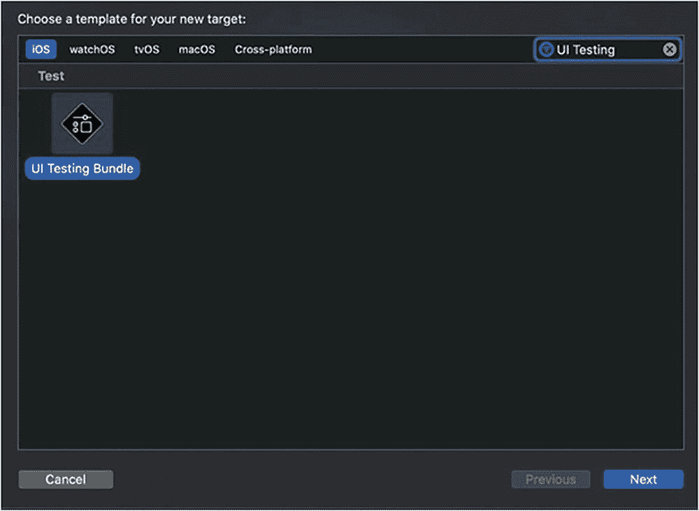

图 7-1
添加 UI 测试目标

下一个屏幕也与添加单元测试目标时的界面相似（图 7-2）。

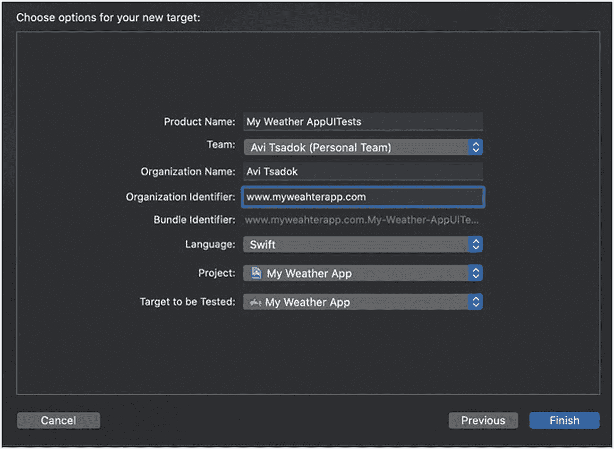

图 7-2
新建 UI 测试目标的选项窗口

我们创建的新目标除了包含任何目标都有的常规 `info.plist` 文件外，还包含一个测试用例。

观察新生成的文件，你会发现它与你已经熟悉的单元测试代码有很大不同。这种差异从文件顶部开始，即缺少 `"@testable import <模块名称>"` 这一行。要理解其原因，你需要了解 UI 测试的工作原理。

## UI 测试如何工作？

Xcode 将你的 UI 测试包视为一个黑盒，这意味着它根本无法访问你的应用程序代码。当测试运行器启动时，它会创建一个临时的外部应用程序来启动并激活你的应用。

为了实现这一点，XCTest 使用了 UIKit 中的 `Accessibility` 框架。

### UIKit 中的无障碍功能 – accessibilityLabel

如果你不熟悉 UIKit 中的无障碍功能，UI 测试是一个很好的切入点。UIKit 中的无障碍功能并非新事物，它在很多方面帮助残障用户与应用交互。每个 `UIView` 都遵循名为 `UIAccessibility` 的协议，该协议允许 `VoiceOver` 等 iOS 功能识别屏幕上的不同 UI 元素。

`UIAccessibility` 协议中包含的主要属性之一是 `accessibilityLabel`，它代表屏幕上元素对于残障用户的名称。

设置 `accessibilityLabel` 有两种简单方法。你可以通过代码完成

```
saveButton.accessibilityLabel = "save"
```

或者通过进入故事板的标识检查器窗格来完成（图 7-3）。

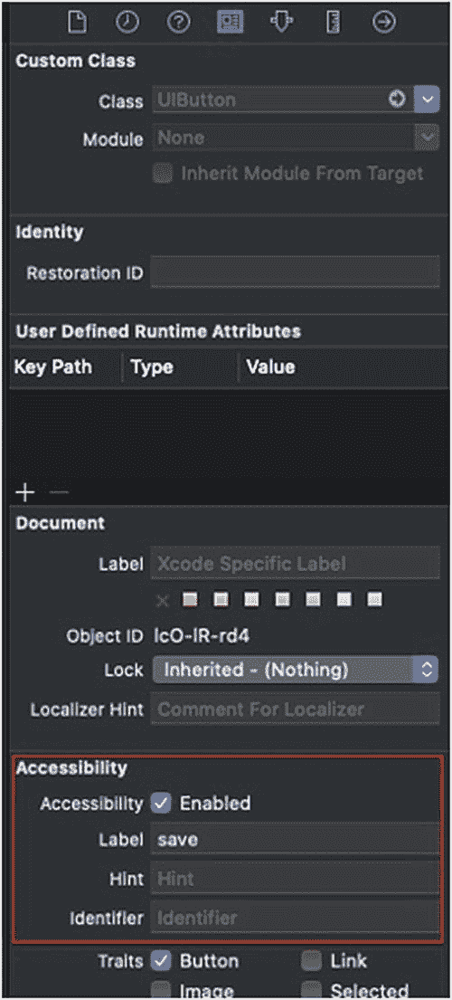

图 7-3
标识检查器内的无障碍检查器

一些控件（如 `UIButtons`）具有“内置的”`accessibilityLabel`，该属性默认持有其标签的文本值，除非另行定义。

运行 UI 测试时，XCTest 使用无障碍标签来“看到”屏幕上的元素，并据此执行点击、滚动、输入等操作，以及进行不同的验证以确保测试通过或失败。

### 元素树

就像你的 `UIWindow` 中的视图层次结构一样，XCTest 将其“视为”一个无障碍元素树。

请查看图 7-4。

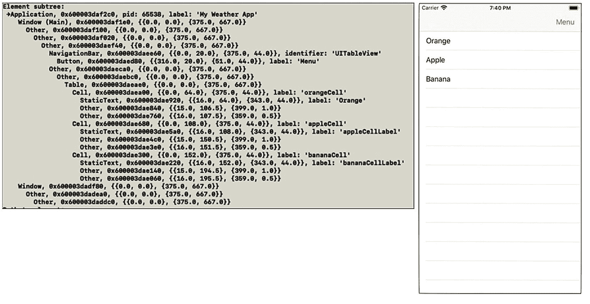

图 7-4
应用程序屏幕及其对应的元素树

图 7-4 显示了一个应用屏幕，左侧是其元素树（如同在控制台打印的那样）。如你所见，树中没有类名或任何其他“编码”信息——只有元素的类型、它们的框架和名称。如前所述，XCTest 将我们的应用视为一个黑盒，并仅获取对其可用的信息。

## 编写我们的第一个 UI 测试

让我们从一个简单的测试用例开始。我们有一个包含水果列表的屏幕。点击“Orange”水果应导航到一个新屏幕。参见图 7-5。

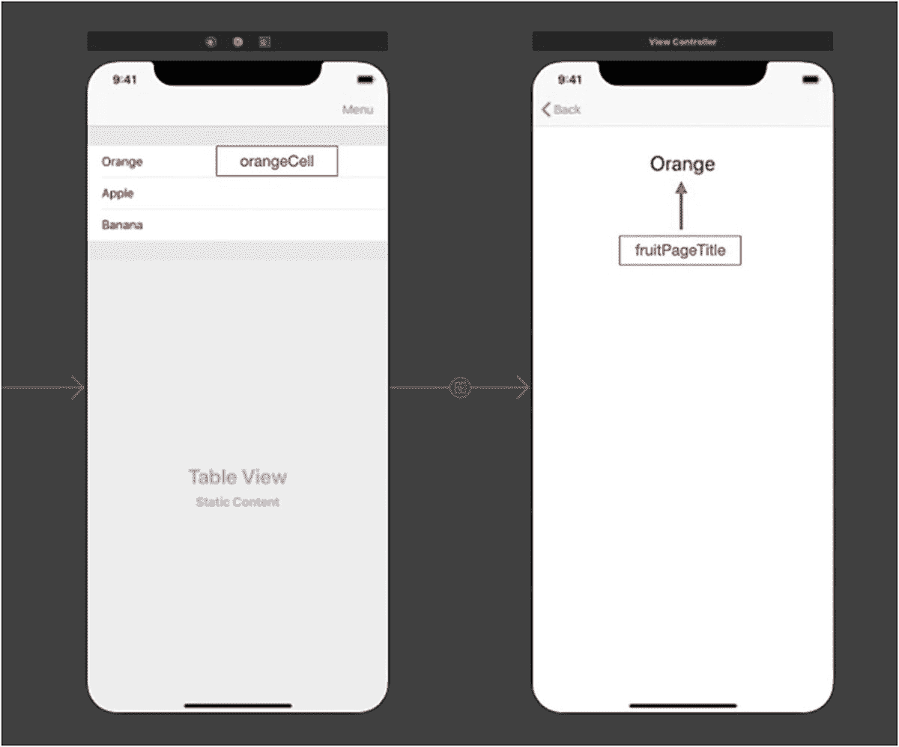

图 7-5
水果应用

在图 7-5 中，无障碍标签用红色标记。

让我们检查一下第一个测试代码：

```
func testTappingOnOrangeButton() {
let app = XCUIApplication() //1
app.launch() //2
app.cells["orangeCell"].tap() //3
// assert        XCTAssertTrue(app.staticTexts["fruitPageTitle"].exists) //4
}
```

令人惊讶的是，只需很少的功夫就能轻松设置一个简短的 UI 测试。

以下是详细的步骤：
*   //1 : 创建对 `XCUIApplication` 的引用，它代表你正在测试的应用程序。
*   //2 : 启动应用程序。
*   //3 : 运行查询以`找到橙色单元格`按钮，并点击它。
*   //4 : `断言`以确保下一个屏幕出现。

几乎所有的 UI 测试都始于创建一个 `XCUIApplication` 实例。

### XCUIApplication

`XCUIApplication` 是应用程序的代理。使用此代理，你可以启动一个应用并获取对其可见元素的引用。

特定的应用程序不一定非得是正在被测试的应用——你可以在初始化时传递包标识符，从而运行多个应用的 UI 测试：

```
let otherApp = XCUIApplication(bundleIdentifier: "com.myOtherApp.www")
```

### 元素

当谈论“元素”时，我们指的是继承自 `XCUIElement` 的对象。`XCUIElement` 代表屏幕上的一个视图，并具有允许你与之交互和通信的属性和方法。

事实上，`XCUIApplication` 本身也是 `XCUIElement` 的子类。

#### 查询元素

要检索元素，我们需要查询它们。查询是 `accessibilityLabel` 属性派上用场的地方。

查询元素是很自然的。例如，如果你想获取“保存”按钮，你需要做的就是

```
app.buttons["save"]
```

`buttons` 属性返回屏幕上的所有按钮，“save”则用于仅获取无障碍标签名为“save”的按钮。

但什么被认为是“按钮”呢？仅仅是继承自 `UIButton` 的控件吗？我们可以创建自己的控件并将其定义为“按钮”吗？

嗯，如果我们回到 Xcode 中的无障碍检查器，我们可以为屏幕上的不同视图定义特征（图 7-6）。

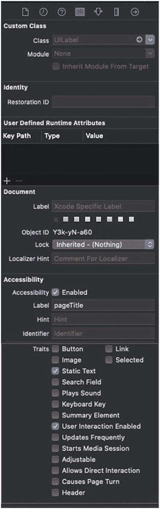

图 7-6
标识检查器内的无障碍检查器，特征项

既然我们知道了有哪些特征可用以及如何为元素定义特征，让我们退一步来理解查询元素的底层原理。

##### 查询如何工作？

那么，UI 测试中查询元素有什么问题呢？

看下面的图表（图 7-7）。

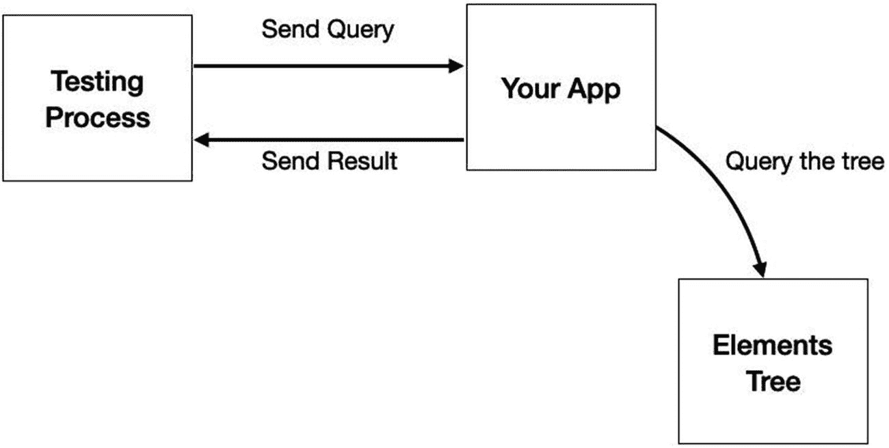

图 7-7
为元素查询你的应用

查询元素的任务存在一些结构性的陷阱。首先，你的应用可能有很多元素需要遍历才能检索到搜索结果。此外，每个元素包含许多属性，在大多数情况下，这些属性对你的测试根本不重要。这些陷阱会导致性能和内存问题，可能影响你的测试结果并无端导致失败。


##### 精准使用查询

让我们回顾一下之前的查询：

```
app.buttons["save"]
```

这个查询存在两个问题：
*   它会在屏幕上搜索所有按钮，无论它们在视图层级中的位置如何。
*   即使已经找到一个名为“save”的元素，它仍会对整个元素树进行完整扫描。

这些问题可能导致潜在的内存和性能峰值。

要轻松修复这个问题，我们可以做一个小小的修改：

```
self.navigationBars.buttons["save"].first
```

我们在这里做了两个关键改动——首先，我们现在只*在导航栏中*进行搜索，从而排除了树的其他部分。其次，我们使用了 `first` 属性来返回我们找到的第一个元素。

现在我们已经了解了如何更好地优化查询。但是，还记得我提到过吗，在大多数情况下，查询时我们并不需要所有元素的数据，只需要它们的引用？这就引出了下一个优化点。

##### 解析元素数据

当查询单个元素时，返回其完整数据问题不大。但是当查询一长串元素列表时，就可能导致一些内存问题。这就是为什么查询元素时，它们只以引用的形式返回，而不包含完整数据：

```
let saveButton = app.navigationBars.buttons["save"].firstMatch // 仅返回元素引用
let frame = saveButton.frame // 此时才解析元素数据
```

XCTest 只在需要时才解析元素数据。因此，获取按钮的框架（frame）仅在直接调用 `frame` 属性时才会通过第二次查询来完成。如果你熟悉 Core Data 框架，这其中的原理是类似的。

##### 按标识符或索引获取元素

请看以下代码：

```
let buttons = app.buttons
```

和你可能想的不同，`app.buttons` 返回的并非一个按钮列表，而是一个 `XCUIElementQuery` 类型的查询对象。要获取查询结果，它有两个重要的属性：

```
let buttons = app.buttons.allElementsBoundByAccessibilityElement
let buttons = app.buttons.allElementsBoundByIndex
```

那么，这两个属性之间有什么区别呢？

两个属性都返回一个按钮数组。区别在于数据解析的方式。

我们说过，查询元素只返回它们的引用，而不是完整数据。完整的数据获取是在后续、仅在有需求时才发生的。在获取数据的那个时间点，有一个问题是实际元素树可能已经发生了变化。

在这种情况下，XCTest 需要知道在第二次查询时如何获取数据——是根据其无障碍标识符还是根据其索引？

我们可以定义为按标识符获取：

```
let buttons = app.buttons.allElementsBoundByAccessibilityElement
// UI 发生了变化....
let firstButton = buttons.first! // 根据其标识符获取数据
```

或者按其在数组中的索引获取：

```
let buttons = app.buttons.allElementsBoundByIndex
// UI 发生了变化....
let firstButton = buttons.first! // 根据其索引获取数据
```

在大多数情况下，我们会使用第一个属性——获取它们并保持与无障碍标识符的同步。但在某些情况下，我们不在乎标识符，而在乎数组中的位置，例如 `UITableView` 或 `UICollectionView` 的单元格。

##### 元素查询示例

由于苹果每个 Xcode 版本都会改进 UI 测试，因此最好随时关注 XCTest 在这一领域的更新。

但这里有一些示例，可以让你了解其工作原理。

仅按类型获取一个元素（如果你有多个该类型/特征的元素，可能会得到意外的行为）：

```
app.alerts.element
app.buttons.element
app.collectionViews.element
app.images.element
app.maps.element
app.navigationBars.element
app.pickers.element
app.progressIndicators.element
app.scrollViews.element
app.segmentedControls.element
app.staticTexts.element
app.switches.element
app.tabBars.element
app.tables.element
app.textFields.element
app.textViews.element
app.webViews.element
```

通过其无障碍标识符获取元素：

```
app.testFields["password"]
```

获取特定滚动视图内的所有图片（直接子视图）：

```
app.scrollViews["Main"].children(matching: .image)
```

获取滚动视图的所有后代图片（包括子视图及其子视图等）：

```
app.scrollViews["Main"].descendants(matching: .image)
```

获取查询结果中的第五个元素：

```
app.switches.element(bound: 4)
```

#### 对元素执行操作

如果我们不与元素交互，那么获取到元素的引用就毫无用处。为了模拟用户的操作，我们需要能够在元素上输入、点击、滚动和滑动。

幸运的是，每个 `XCUIElement` 都有一系列可用的操作，可以帮助你快速为测试编写脚本。

**表 7-1 XCUIElement 操作列表**

| 方法名称 | 描述 |
| --- | --- |
| `typeText(string)` | 在输入字段元素（如文本字段或文本视图）中输入字符串。<br>注意：执行此操作时，文本字段需要处于焦点状态。 |
| `tap()` | 点击元素上的一个可命中点。 |
| `doubleTap()` | 向元素发送双击事件。如果存在，会触发 `doubleTap` 手势操作。 |
| `press(forDuration : TimeInterval)` | 具有特定时长的长按手势。 |
| `press(forDuration: TimeInterval, thenDragTo: XCUIElement)` | 模拟拖放事件。 |
| `twoFingerTap()` | 在可命中元素上模拟双指点击。 |
| `tap(withNumberOfTaps: Int, numberOfTouches: Int)` | 在点击方面提供了极大的灵活性。 |
| `swipeLeft()`<br>`swipeRight()`<br>`swipeDown()`<br>`swipeUp()` | 发送滑动手势。这也是模拟滚动的一种方式。 |
| `pinch(withScale: CGFloat, velocity: CGFloat)` | 以特定速度捏合元素进行缩放。 |
| `adjust(toNormalizedSliderPoisition: CGFloat)` | 仅与 `UISlider` 控件相关——使用从 0 到 1 的归一化值来改变滑块的值。你可以使用 `normalizedSliderPosition: CGFloat` 来确定当前滑块的值。 |
| `adjust(toPickereWheelValue: String)` | 仅与 `UIPickerView` 和 `UIDatePickerView` 等选择器相关。 |

**注意**

我建议你关注苹果的在线文档，以了解其他可用的操作。

以下是一些与元素交互的示例：

```
app.buttons["green"].doubleTap() // 双击绿色按钮
app.textFields["email"].tap() // 使电子邮件文本字段成为第一响应者
```

如你所见，XCTest 提供了丰富的 `XCUIElement` 操作，可以帮助你（几乎）为你的应用设置任何场景。

**注意**

在模拟器上运行 UI 测试时，最好确保软件键盘可用。前往 I/O ➤ 键盘，并确保“连接硬件键盘”选项未被勾选。模拟硬件键盘可能会导致文本字段和文本视图出现问题。


#### 等待元素出现

XCUIElement 有一个名为 `exists` 的简单属性。您可以使用此属性来检查元素是否在屏幕上可见：

```
let messageExists = app.staticTexts["welcomeMessage"].exists
```

但是，UI 测试与标准单元测试不同，从某种意义上说，当您仔细思考时，它们实际上是异步测试。几乎每一次跳转到新屏幕都伴随着动画，并且许多操作（如滚动或繁重任务）都需要时间。

当按下页面上跳转到第二页的按钮时，我们需要等待第二页出现，然后才能查询新元素以继续我们的测试。

我们不是编写一个“延迟”函数来暂停程序，而是有一个很棒的函数叫 `waitForExistence(timeout:)`。

`waitForExistence(timeout:)` 会暂停执行并等待某个元素存在后再继续。您可以传递一个超时值以确保等待不会无限期持续。

请看以下代码：

*   用户按下 `"nextPage"` 按钮，应用导航到新屏幕。
*   我们等待 1 秒钟，让名为 `"newYork"` 的单元格出现在新屏幕上。
*   我们按下名为 `"newYork"` 的单元格。

```
app.buttons["nextPage"].tap() //navigating to a new page
app.cells["newYork"].waitForExistence(timeout: 1)
app.cells["newYork"].tap()
```

“等待元素”在 UI 测试中扮演着重要角色，并且也将我们引向下一节——断言。

#### 断言

在 UI 测试中谈论断言，通常意味着我们想要验证屏幕的状态。以下是一些这类验证的示例：

*   我们想确保某个元素在屏幕上可见。
*   我们想验证特定元素上的文本或颜色。
*   我们想检查元素的位置。

请记住，UI 测试实际上是一个黑盒，因此，您无法访问代码，就像用户或测试人员一样。

要验证元素是否存在，您可以使用我之前提到的 `waitForExistence(timeout:)` 函数：

```
XCTAssertTrue(app.staticTexts["hello"].firstMatch.waitForExistence(timeout: 2.0))
```

或者验证文本：

```
XCTAssertEqual(app.staticTexts["result"].firstMatch.label)
```

我们用于单元测试和集成测试的断言函数与用于 UI 测试的相同。

##### 整合所有内容

我们已经了解了如何查询元素、与它们交互并进行断言。让我们尝试将所有内容整合在一起：

```
func testLogin() throws {
    let app = XCUIApplication()
    app.launch()
    app.textFields["email"].firstMatch.tap()
    app.textFields["email"].firstMatch.typeText("myEmail@gmail.com")
    app.textFields["password"].firstMatch.tap()
    app.textFields["password"].firstMatch.typeText("123456") // It's a bad password. don't really use it :)
    app.buttons["go"].firstMatch.tap()
    XCTAssertTrue(app.staticTexts["welcome"].waitForExistence(timeout: 2.0))
}
```

很好，我们编写了第一个 UI 测试！

让我们简要描述一下我们的测试做了什么——它在相应的文本字段中输入电子邮件和密码值，按下 `"go"` 按钮，等待 2 秒钟，然后验证欢迎消息是否出现。

请注意，我们必须先点击文本字段才能输入文本，就像真实用户一样。

### 记录您的操作

编写测试并不是创建 UI 测试的唯一方法。自 iOS 9 起，Xcode 提供了一项简洁的功能，允许您记录在模拟器上的操作，并将其转换为 `XCTestCase` 中的脚本代码。

要开始录制，请将光标定位在 UI 测试方法内部。完成后，您将能在 Xcode 窗口底部看到一个录制按钮（图 7-8）。

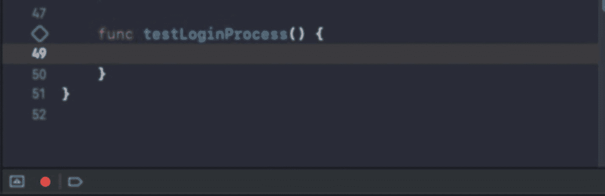

图 7-8
Xcode 中的录制按钮

再次点击录制按钮将停止录制。

请注意，生成的代码可能不像您自己编写的代码那样可读和直接。

例如，这是在文本字段中键入内容的生成代码：

```
func testLoginProcess() {
    let app = XCUIApplication()
    app.launch()
    app.textFields["email"].tap()
    let aKey = app.keys["m"]
    aKey.tap()
    let vKey = app.keys["y"]
    vKey.tap()
    let iKey = app.keys["e"]
    iKey.tap()
}
```

而这只是为了输入三个字母。

但是，录制测试也可能很有用——有时仅靠代码很难完成某些操作，比如滑动、滚动或执行包含许多交互的操作。此外，这也是发现 UI 测试中更多可能性的好方法。

## 处理问题

UI 测试不仅运行耗时，维护也需要付出大量精力。

UI 测试存在各种问题：

*   大多数 UI 测试都涉及 **与服务器或网络交互**。连接中的任何小故障都可能导致测试失败。
*   移动应用的本质就是 **界面会不时变化**。虽然大多数单元测试和集成测试可以在 UI 变化后幸存，但这对于仅依赖于元素树的 UI 测试来说并非如此。
*   此外，如果您在应用中 **实施 A/B 测试**，当 UI 变得不可预测时，事情可能会开始变得混乱。
*   每个测试都必须从一个可预测的状态开始。由于测试的顺序是不一致（并且不应该一致）的，您需要在每个测试之前重置状态。问题在于您无法访问您的代码。
*   应用中存在难以控制的外部变化和交互。系统弹窗就是一个很好的例子——例如推送通知、位置权限等。这些弹窗会中断您的测试并对您的元素树产生影响。

但就像编码中的（几乎）所有事情一样，每个问题都有可能找到合适的解决方案。

### 保持测试的一致性

端到端测试的第一个问题是它们依赖于网络和服务器等外部状态。

此外，与服务器交互意味着您不能期望相同请求得到相同响应。

但是，如果您回顾一下集成测试章节，您会看到我们可以快速模拟网络，确保始终获得相同的响应，同时消除任何服务器或网络问题。

我们的第二个任务是确保我们总是从相同的应用状态开始。大多数情况下，这意味着：

*   已清除用户默认设置。
*   缓存文件夹为空。
*   本地持久存储为空。
*   应清除所有临时文件。

总的来说，这意味着在开始新的测试用例时重置您的应用。就像在前面的章节中一样，我们可以为此使用启动参数。

要使用特定参数启动您的应用，您可以使用 `launchArguments` 属性：

```
let app = XCUIApplication()
app.launchArguments = ["-clearDB", "-clearUserDefaults"]
app.launch()
```

在您的应用委托中：

```
if CommandLine.arguments.contains("-clearDB") {
    // clear your db
}
```

`launchArguments` 可能是您在 UI 测试中向应用程序“注入代码”的唯一方法。请注意不要添加太多参数——毕竟，我们希望我们的测试能反映应用的真实运行情况。


#### 处理系统警报

如前所述，诸如推送通知或位置权限等系统警报可能会阻止你的测试运行与 UI 元素交互，从而导致测试失败。

有时你可以同步警报的触发时机并尝试自行点击"允许"按钮，但我认为这很难成为一个长期的解决方案。

那么，来认识一下 `addUIInterruptionMonitor()` 函数。这个函数是 `XCTestCase` 的一部分，它可以帮助你监控并响应应用在运行过程中遇到的任何系统警报。

让我们来看一个示例：

```
addUIInterruptionMonitor(withDescription: "Some System Alert") { (alert) -> Bool in
    alert.buttons["Allow"].tap()
    return true
}
```

调用此函数时，你需要传递一个闭包，该闭包会在测试运行检测到某些中断时每次执行。闭包的参数是中断你测试的 `XCUIElement`。在大多数情况下，它会是某种"alert"元素。查询"允许"按钮并点击是继续测试的一个好方法。

但是其他警报呢？你如何判断显示的是什么警报？其实，`XCUIElement` 和其他任何元素一样。你可以查询它的标签以找到屏幕上显示的确切文本，从而决定点击哪个按钮。

如果你事先不知道是"确定"还是"允许"按钮，你可以这样检查：

```
let okButton = alert.buttons["OK"]
if okButton.exists {
    okButton.tap()
}
let allowButton = alert.buttons["Allow"]
if allowButton.exists {
    allowButton.tap()
}
```

或者，你可以直接点击"第二个按钮"：

```
alert.buttons.element(boundBy: 1)
```

请记住，该闭包仅在存在系统警报时才会被调用。在代码层面，你应该继续编写测试，就好像警报从未出现一样。

> 注
>
> 处理警报是理解 UI 测试正确方法的一个绝佳例子。这些不是标准的开发者测试，因为它是从用户的角度出发的。系统警报会为测试运行器遮挡屏幕，就像为用户遮挡一样，处理方式也应该相同。
>
> 有时在点击警报按钮之一时，你需要使用 `waitForExistence`，因为闭包调用与对话框实际出现在屏幕上之间存在延迟。

## 页面对象模型

### 问题所在

好的，假设有这样一种情况——我们创建了几个 UI 测试，它们运行得很好。但几周后，它们全都开始失败了。我们一切都是按照最佳实践来做的——我们处理了系统警报和 A/B 测试，模拟了网络，并正确地清理了一切。

那么，发生了什么？

嗯，似乎我们做了一个改动——我们在登录流程中添加了一个新步骤，因此，我们现在需要将所有测试更新到新的流程。

如你所见，我们面临一个复杂的情况。我们做了一个小改动，现在却需要检查每个测试并进行更新。毫无疑问，当我们知道需要付出大量努力来维护时，编写更多 UI 测试的动力就会受挫。我们编写的 UI 测试越多，未来的维护工作量就越大。

但我们有一个解决方案，它叫做**页面对象模型**。

### 什么是页面对象模型？

页面对象模型（简称 POM）背后的思想是将测试脚本与 UI 定位器和操作分离开来。有时，也意味着将测试脚本与断言分离。

对于应用的每个屏幕，我们创建一个具有几种类型的方法和属性的对象：

*   它拥有执行主要操作的方法。例如，像 `doSignIn(withEmail email : String, password : String)` 这样的方法，它会填充电子邮箱文本框和密码，并启动登录流程。即使你对登录界面进行了完全的重构，你唯一需要改动的地方也只在页面对象内部。
*   它拥有检查不同状态的方法，例如，验证你是否在正确屏幕上的方法（`isCurrentPageisSignup()`）或返回特定值的方法（`getWelcomeMessageText()`）。这消除了对元素本身的任何直接访问，并防止了代码重复。
*   它拥有返回屏幕上核心元素的私有属性。这些实际上是定位器，有助于我们减少代码复杂性，同时也使其更加清晰透明。

当我们开始使用 POM 模式时，我们的测试脚本不再直接访问元素树。所有操作都通过页面对象完成。

另外一点是，每当我们调用页面对象执行某个会导航到新屏幕的操作时，该页面对象应该返回新屏幕的页面对象。

让我们看一个这样的页面对象示例：

```
class SignInPageObject {
    var app : XCUIApplication
    init(app : XCUIApplication) {
        self.app = app
    }
    private var emailField : XCUIElement {
        return app.textFields["email"].firstMatch
    }
    private var passwordField : XCUIElement {
        return app.textFields["password"].firstMatch
    }
    private var loginButton : XCUIElement {
        return app.buttons["login"].firstMatch
    }
    func doSignIn(withEmail email : String, password : String)->UpsellPageObject {
        emailField.tap()
        emailField.typeText(email)
        passwordField.tap()
        passwordField.typeText(password)
        loginButton.tap()
        return UpsellPageObject(app: app)
    }
}
```

关于前面的代码，有几点需要注意：

*   我们可以看到页面对象在其 `init()` 方法中接收 `XCUIApplication`。这是因为 `XCUIApplication` 对象是我们执行的每个 UI 测试操作的根对象。你可能会想，每次初始化一个新的 `XCUIApplication` 可能是个不错的选择，但请考虑到有时我们是用特定的 bundle identifier 来初始化 `XCUIApplication` 的，所以传递应用程序对象是更稳妥的做法。
*   我们有几个私有属性，它们使用简单的查询返回屏幕上的主要元素。这是唯一查询这些元素的地方，每当页面对象需要与这些元素交互时，都通过这些属性进行。将它们设为私有是为了确保我们只能通过操作访问它们，而不能直接访问。
*   `doSignIn()` 方法执行标准的登录流程，它是我们当前页面对象模型中唯一的非私有方法/属性。请注意，此方法返回我们的下一个页面对象模型 `UpsellPageObject`，它代表了下一个屏幕。

现在，让我们看看在测试中使用页面对象的代码片段：

```
func testSignIn() {
    let app = XCUIApplication()
    app.launch()
    SignInPageObject(app: app).doSignIn(withEmail: "user", password: "12345").pressSkip().verifyWeAreOnTheMainScreen()
}
```

看到它有多简洁了吗？我们可以将我们的屏幕串联起来，创建出简洁、可读且可维护的测试。

我们调用 `doSignIn()`，接收一个新对象返回，点击跳过按钮，再获得一个新对象返回，并验证我们在正确的屏幕上——所有这些只用了一行代码。请参见图 7-9。

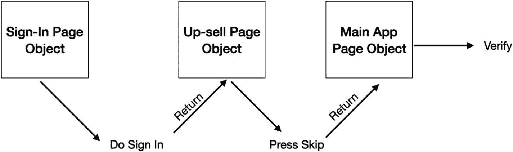

**图 7-9：将页面对象串联在一起**

如果你希望在项目中认真对待 UI 测试，那么使用 POM 不是一项建议——而是必须的。同时，这也意味着录制测试只适用于生成代码。之后，你需要将生成的代码提取出来，并按模型进行组织。


## 测试报告

测试运行结束后，很自然地要查看测试报告。Xcode 会为每次运行生成详细的测试报告，其中包括测试时长和附件。

报告会自动生成，可以在 Xcode 的 Reporter 面板中找到（见图 7-10）。

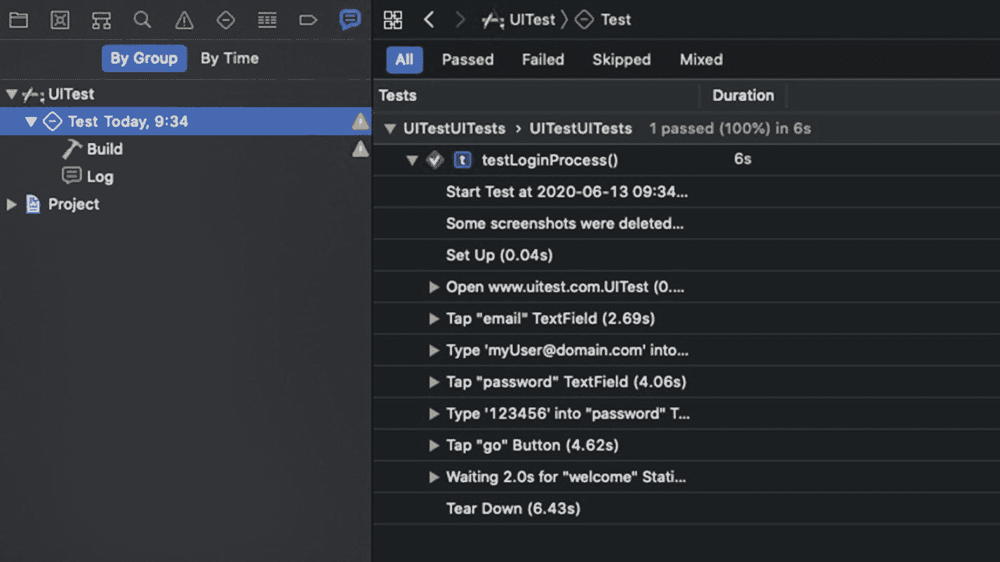

图 7-10 Xcode 测试报告

查看图 7-10 中的测试报告，可以发现几个详细信息：

*   可以根据测试的状态进行筛选。你可以只查看通过的、失败的、跳过的或所有测试。例如，当测试很多，而你只关注失败的那些时，这个功能非常方便。
*   你还可以看到每个测试花费了多长时间。别忘了 UI 测试是需要时间的。这是一个找出耗时较长测试并尝试优化它们以减少总测试时长的机会。
*   此外，你还可以看到测试中的每个小步骤以及它花费的时间。

耗时的测试通常包含很多步骤，你可能会发现自己淹没在信息洪流中，难以理清头绪。解决方案是将你的测试分解为活动。

### 活动

活动是你在 UI 测试中创建的一组有意义的步骤，它可以让你的测试报告看起来更简洁、更简短。

使用 Activity 对步骤进行分组非常简单。如果我想对我的登录测试脚本进行分组，我会这样做：

*   步骤 1 – 输入用户邮箱。
*   步骤 2 – 输入用户密码。
*   步骤 3 – 点击“Go”按钮。
*   步骤 4 – 验证欢迎信息。

对于代码，现在使用活动：

```
func testLoginProcess() {
let app = XCUIApplication()
app.launch()
XCTContext.runActivity(named: "输入邮箱") { _ in
app.textFields["email"].firstMatch.tap()
app.textFields["email"].firstMatch.typeText("myUser@domain.com")
}
XCTContext.runActivity(named: "输入密码") { _ in
app.textFields["password"].firstMatch.tap()
app.textFields["password"].firstMatch.typeText("123456")
}
XCTContext.runActivity(named: "点击 Go 按钮") { _ in
app.buttons["go"].firstMatch.tap()
}
XCTContext.runActivity(named: "验证欢迎信息") { _ in
app.staticTexts["welcome"].firstMatch.waitForExistence(timeout: 2.0)
}
}
```

将步骤分组为活动会改变测试报告的外观（图 7-11）。

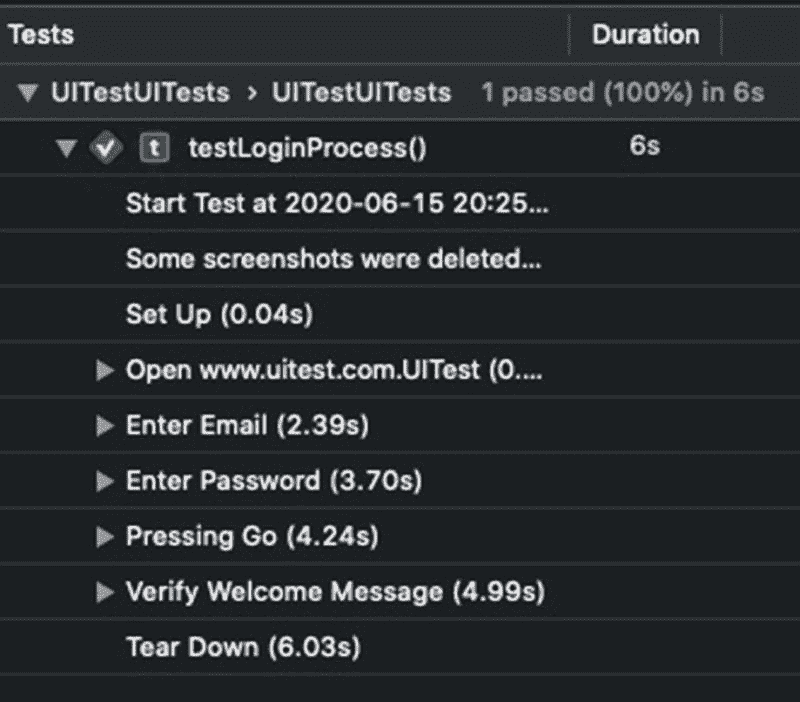

图 7-11 包含活动的测试报告

不仅如此，你还可以将多个组集合到一个新的活动中：

```
func testLoginProcess() {
let app = XCUIApplication()
app.launch()
XCTContext.runActivity(named: "执行登录") { _ in
XCTContext.runActivity(named: "输入邮箱") { _ in
app.textFields["email"].firstMatch.tap()
app.textFields["email"].firstMatch.typeText("myUser@domain.com")
}
XCTContext.runActivity(named: "输入密码") { _ in
app.textFields["password"].firstMatch.tap()
app.textFields["password"].firstMatch.typeText("123456")
}
XCTContext.runActivity(named: "点击 Go 按钮") { _ in
app.buttons["go"].firstMatch.tap()
}
}
XCTContext.runActivity(named: "验证欢迎信息") { _ in
app.staticTexts["welcome"].firstMatch.waitForExistence(timeout: 2.0)
}
}
```

现在，你的测试报告看起来更好了（图 7-12）。

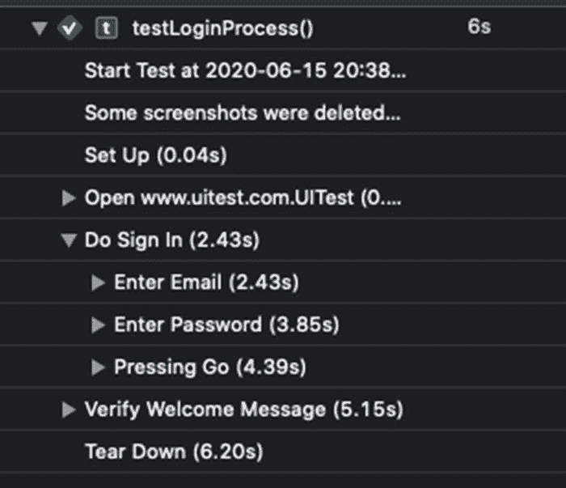

图 7-12 测试报告中的活动组

如果你在使用页面对象模型，那么通过将操作包装在 `XCTContext.runActivity` 闭包中，实现活动会变得更加容易：

```
func doSignIn(withEmail email : String, password : String)->UpsellPageObject {
XCTContext.runActivity(named: "执行登录") {_ in
emailField.tap()
emailField.typeText(email)
passwordField.tap()
passwordField.typeText(password)
loginButton.tap()
}
return UpsellPageObject(app: app)
}
```

页面对象模型和活动相辅相成。将它们结合起来，无需太多努力就能让你的测试报告更加清晰明了。

### 附件

在调试 UI 测试时（或者说，通常的调试过程中），最具挑战性的任务之一就是获取应用在失败时刻的状态信息，或者在导致失败之前的某个特定步骤中应用的状态信息。

从 Xcode 9.0 开始，苹果添加了一项新功能 – `XCTAttachment`。`XCTAttachment` 使你能够将有用的信息附加到你的测试报告中，帮助你调查失败原因。但附件在处理持续集成环境等情况下尤其有用，例如，不是在你的个人电脑上运行时。

附件会显示在你的测试报告中，并且可以保存不同类型的数据：

*   屏幕截图
*   图像
*   文件
*   文本
*   数据（二进制大对象）

当然，最常见的数据类型是屏幕截图。

#### 屏幕截图

创建屏幕截图附件是记录测试步骤的好方法，有助于诊断测试失败。Xcode 会在你的任何测试失败时自动创建屏幕截图，但你也可以在需要时随时创建自己的屏幕截图。

要创建屏幕截图，你需要做三件事：

1.  截取整个屏幕或某个元素的屏幕截图。
2.  基于屏幕截图创建一个附件。
3.  将附件添加到测试运行中。

以下是一个简短的代码片段，展示如何完成：

```
let screenshot = app.windows.firstMatch.screenshot()
let attachment = XCTAttachment(screenshot: screenshot)
add(attachment)
```

##### 测试报告中的屏幕截图

查看屏幕截图的最佳位置是你的测试报告。但是，将前面的代码添加到你的测试中后，测试报告里可能仍然看不到任何附件。让我们看看添加附件后你的测试报告（图 7-13）。

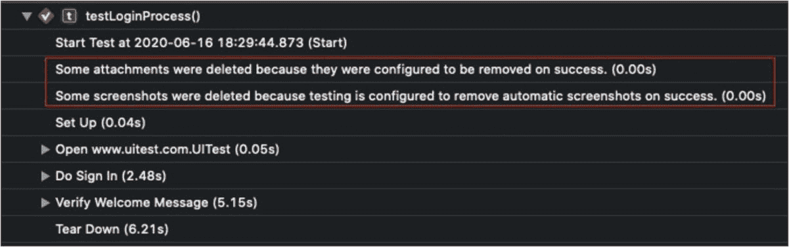

图 7-13 从测试报告中移除的屏幕截图

因为屏幕截图会迅速占满存储空间，所以我们有一些地方可以控制附件的生命周期。第一个地方是 scheme 配置（图 7-14）。

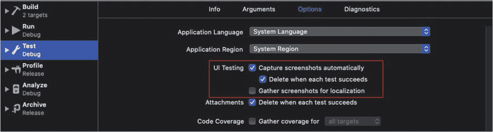

图 7-14 Scheme 配置

默认情况下，XCTest 会捕获测试中每个步骤的屏幕截图。当你想逐步复现测试步骤时，这非常有用。同时，XCTest 也会在你的测试成功时自动删除这些屏幕截图。此选项默认也是启用的。

第二个可以控制附件生命周期的地方是在代码本身中：

```
let screenshot = app.screenshot()
let attachment = XCTAttachment(screenshot: screenshot)
attachment.lifetime = .keepAlways
add(attachment)
```

每个附件都有一个 `lifetime` 属性，它有两个选项：`keepAlways` 和 `deleteOnSuccess`。默认值是 `deleteOnSuccess`。

将其设置为 `keepAlways` 会覆盖 scheme 设置，无论测试结果如何，都会保留你的附件。

##### 检查附件

在我们更改了 scheme 配置或修改了代码之后，我们可以查看测试报告来检查测试详情（图 7-15）。

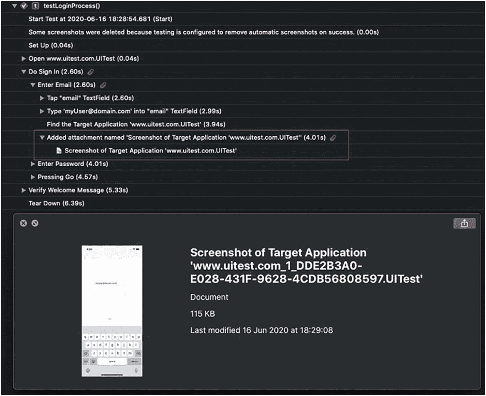

图 7-15 测试报告中的屏幕截图

如果你在特定的活动中添加附件，你会在该活动组下看到它。否则，它会出现在你的测试的根目录下。


##### 屏幕截图的位置

许多开发者并非在本地机器上运行测试，而是在持续集成环境中进行。因此，他们无法访问 Xcode，尤其是报告导航窗格。在这种情况下，我们需要访问截图文件。

在 Xcode 11 之前，访问附件很容易——它们位于项目派生数据文件夹中名为 "Attachments" 的文件夹内。

但在 Xcode 11 中，苹果对测试结果的文件结构进行了重大更改，现在分析测试结果要复杂得多。

### 关于 XCResult

Xcode 会将您的每一个测试报告保存到一个类型为 "XCResult" 的文件中。这些文件位于派生数据文件夹下的 `Logs/Test/` 目录：

```
~/Library/Developer/Xcode/DerivedData//Logs/Test/
```

XCResult 文件是一个包，包含一个通用的 `.plist` 文件和一个存放了大量二进制文件的数据文件夹。

您只需点击即可在 Xcode 中打开 XCResult 文件。但如果您想解析它，可能会遇到一些困难，并且过程可能很繁琐。

要解析 XCResult 文件，您需要使用 Xcode 提供的 `xcresulttool` 工具：

```
xcrun xcresulttool get --path <your_file.xcresult> --format json
```

运行此命令不会提取您的附件，但会为您提供有关测试运行的一些常规详细信息。

此时，您需要在 JSON 中找到您的测试，并通过其 id 对该特定测试运行此命令：

```
xcrun xcresulttool get --path <your_file.xcresult> --format json –-id <test_id>
```

在某些时候，您会看到期待已久的附件部分。然后您需要运行导出命令：

```
xcrun xcresulttool export –path <your_file.xcresult> --output-path <output_path> --id <attachment_id>
```

正如您所见，从 XCResult 文件中导出附件并不那么容易。解决此问题的一种选择是编写自己的脚本以便轻松完成。另一种选择是使用一个开源的命令行工具，它正好做这件事。例如，`XCParse` (`https://github.com/ChargePoint/xcparse`) 是一个只需一条命令即可提取这些附件的工具：

```
xcparse -s <your_file.xcresult> <output_path>
```

### 更多附件类型

除了屏幕截图，还有其他类型的附件。例如，您可以附加文件、字符串、音频等。

以下是您可以创建的可用附件类型：

*   图片
*   屏幕截图
*   数据块
*   Zip 归档
*   文本

让我们看看如何创建一个简单的文本附件：

```
let stringAttachment = XCTAttachment(string: "Email: \(emailEntered)")
stringAttachment.lifetime = .keepAlways
add(stringAttachment)
```

它在您的测试报告中的显示效果如下（图 7-16）。

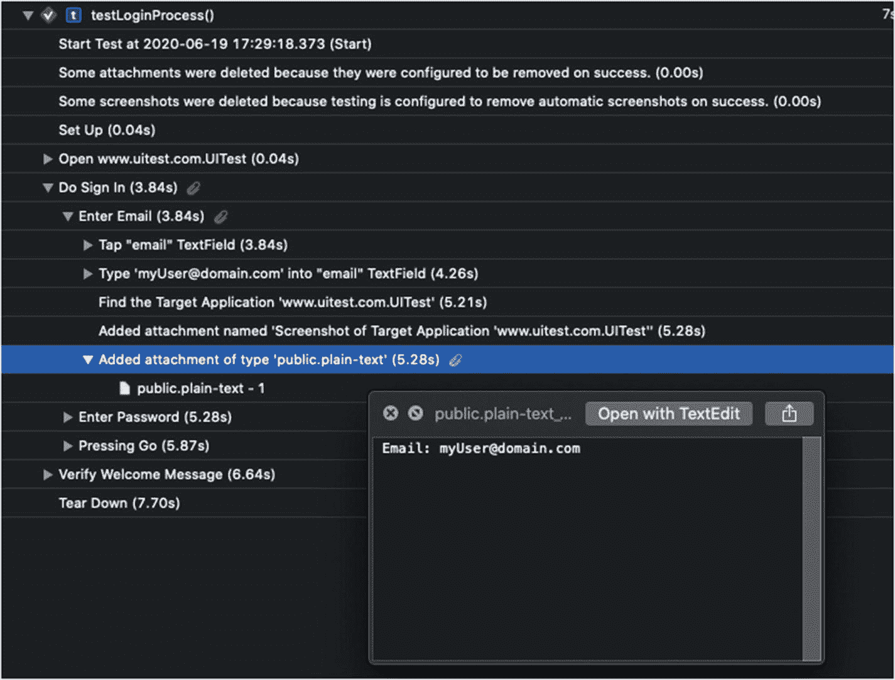

图 7-16

测试报告中的文本附件

您应该将附件视为记录测试日志并留下有助于调查测试失败的小片段信息的一种方式。

## 更多优秀的 UI 测试功能

如果您有额外需求，Xcode UI 测试框架还具备更多特性和功能。例如，它可以帮助您测试 Siri 集成、检查您的应用如何与其他已安装应用交互，并进行高级拖动手势。

### 测试 Siri 集成

如果您的应用具有 Siri 集成功能，您可以使用 Siri 短语启动测试：

```
XCUIDevice.shared.siriService.activate(voiceRecognitionText: "Open My Weather")
```

如果您有 Siri 意图，您可以像本章前面学到的那样进行验证——查询屏幕元素并对它们进行断言。

注意

对于 Siri 意图，我建议您使用单元测试。测试完全属于逻辑范畴的东西的 UI 没有意义。

### 多应用测试

如果您回想本章开头，我提到可以使用特定的捆绑包标识符初始化您的 `XCUIApplication` 对象。如果您有多个应用并希望一起测试它们，这是一种很好的方式：

```
func testMultipleAppsIntegration() {
let todoApp = XCUIApplication(bundleIdentifier: "com.myTodoApp.www")
let notesApp = XCUIApplication(bundleIdentifier: "com.myNotesApp.www")
todoApp.launch()
todoApp.buttons["seeMyNotesButton"].tap()
notesApp.activate()
notesApp.buttons["addNewNoteButton"].tap()
_ = notesApp.textViews["notesTextView"].waitForExistence(timeout: 0.5)
notesApp.textViews["notesTextView"].tap()
notesApp.textViews["notesTextView"].typeText("This is my note")
notesApp.buttons["saveNewNote"].tap()
todoApp.activate()
// check that the new note appears in todo app as well
}
```

您需要注意的是，现在有一个名为 `activate()` 的新方法。与 `launch()` 不同，`activate()` 不会终止当前正在运行的应用，而是允许您在保持现有应用存活的同时打开另一个应用。

注意

"Springboard"（包含您所有应用的 iOS 主屏幕）也是一个应用，您可以使用捆绑包标识符 "com.apple.springboard" 来激活它。试试看！

### 使用 XCUICoordinate 进行拖动

您可以使用称为 `XCUICoordinate` 的对象来模拟几乎任何您想要的手指移动。`XCUICoordinate` 是一个表示屏幕上相对于特定元素位置的坐标对象。这个元素甚至可以是应用本身（`XCUIApplication` 对象）。

获取坐标后，您可以按住它并将其“拖”到另一个坐标。

例如，以下代码片段演示了如何轻松实现“下拉刷新”：

```
func testPullToRefresh() {
let app = XCUIApplication()
let fromCoordinate = app.coordinate(withNormalizedOffset: CGVector(dx: 0, dy: 10))
let toCoordinate = app.coordinate(withNormalizedOffset: CGVector(dx: 0, dy: 20))
fromCoordinate.press(forDuration: 0, thenDragTo: toCoordinate)
}
```

很可能在您的大多数用例中都不需要它，但对于那些需要的情况，它会很方便。

## 总结

由于诸多原因，UI 测试更难以维护。但它们对于许多任务（例如冒烟测试）也非常有用。它们也可以作为集成测试的优秀替代方案。我建议您在关键流程中实施 UI 测试并覆盖它们。

UI 测试的另一个有用之处是性能测试。我们将在下一章详细讨论性能测试。

