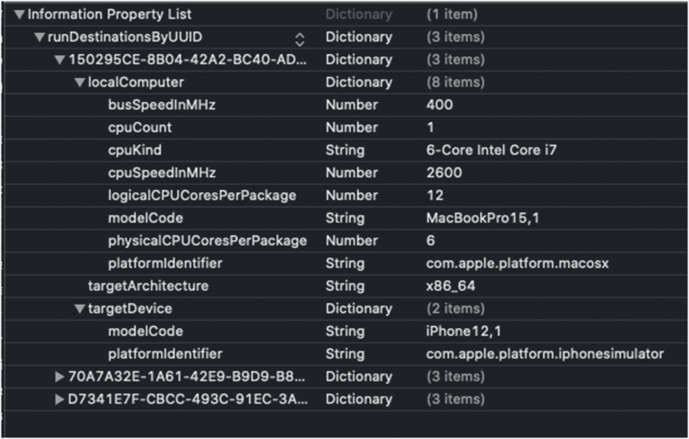
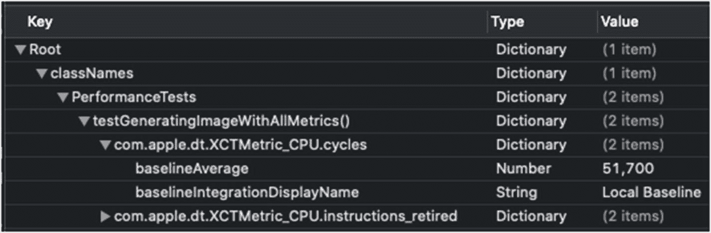

# 8. 覆盖应用的另一个方面——性能测试

> *正如运动员没有策略、形态、态度、战术和速度的精密组合就无法获胜一样，性能工程也需要一套良好的指标和工具才能交付预期的业务成果。*
>
> —Todd DeCapua

## 简介

性能测试是软件测试的另一个方面。我们可以说性能测试关注的不是“事情是否有效”，而是“事情如何有效”，这使其成为一种相对于其他测试方法而言独特的测试套件。

在本章中，您将学到：

*   性能测试的基本概念是什么
*   `measure()` 函数如何工作以及如何定义基线
*   从 Xcode 11 开始可以使用的不同指标
*   如何配置您的测试
*   如何编写异步性能测试
*   Xcode 将您的测试基线信息保存在何处，以便您可以针对 CI/CD 环境进行调整


## 性能测试的基本理念

与其他测试（如单元测试或集成测试）不同，性能测试有点"难以捉摸"。它们有几个独特的特性，使其结果不那么容易预测。

例如，在老旧的设备上运行性能测试，产生的结果可能与在新设备上运行的结果不同。

同样，在一次测试运行中，你可能得到某个结果，但第二次或第三次运行的结果可能会有所不同。更不用说其他因素，如机器状态、CPU 负载、可用内存、缓存等。

因此，根据上述细节，我们了解到性能测试的工作方式略有不同：

*   每个被测代码会运行**多次**，以防止任何一次性结果影响我们的测试结果。在测试运行结束时，最终结果将基于所有执行次数的**平均值**。
*   因为平均值在不同测试间可能不同，仅凭此并不足以满足我们的需求。我们仍然需要设定一些**基准**，以确保变化不会太大，并且保持在合理的范围内。
*   最后一个问题也是主要问题——**基准是与特定设备关联的**，基于其 UUID。原因显而易见——不仅每台设备的硬件不同，其设置和安装的软件也可能不同。

因此，性能测试的不可预测性使其成为我们测试套件中的一个独特存在，我们应该将其用于特定的用例或流程，这些用例或流程在未来的变更中可能引发性能问题。

## 基础测量函数

让我们从编写第一个性能测试开始：

```
class PerformanceTests: XCTestCase {
    func testPerformance() {
        let imageProcessor = ImageProcessor()
        measure {
            _ = imageProcessor.generateImage()
        }
    }
}
```

在上面的测试中，我们有一个名为 `ImageProcessor` 的类，它有一个 `generateImage()` 函数。我们知道 `generateImage()` 函数在执行一些繁重的任务，而我们希望将这些代码作为 `measure` 函数的一部分来执行。

`measure()` 函数是 `XCTestCase` 的一部分，是我们拥有的基本性能测量方法。它只有一个参数，即一个闭包。`measure()` 函数的作用是执行这个闭包十次，并最终计算平均时间。

让我们运行这个测试（图 8-1）。

第一次运行后，我们看到了些有趣的信息。首先，我们看到了平均时间，1.127 秒。我们还看到一条消息，说没有基准时间。这引出了我们的第三个认识——你可以看到我们的测试实际上通过了。

与其他测试不同，性能测试不使用断言。相反，我们为指标定义一个**基准**，以确保我们的结果低于这个基准。

### 定义基准

你无需费力地为测试设置基准。点击"Time 没有基准平均值"消息旁边的灰色菱形，会打开一个带有更多细节和功能的小弹窗（见图 8-2）。

在这个弹窗中，你可以看到关于此次运行的额外信息，以及一个只需按一下按钮即可轻松设置基准的选项。

弹窗的下半部分，你可以看到随时间推移的执行记录。

注意
第一次执行比后续执行时间长得多的情况并不少见。这与缓存或 Swift 语言的内部行为等因素有关。这也是我们多次运行此测试以获得接近真实状态分数的部分原因。

按下"Set Baseline"按钮会将弹窗状态切换到编辑模式（见图 8-3）。

点击"Accept"按钮会将当前的平均结果设置为下次测试的基准。

你也可以手动编辑基准，只需点击它并输入新值即可。

要确认更改，只需点击"Save"。

### "基准"对我们的测试意味着什么？

性能测试基于两个重要值——基准值和最大标准偏差。

基准值是测试需要达到的门槛。如果你的执行代码运行速度比基准慢 10%或更多，你的测试就会失败。

另一个计算值是标准偏差。如果运行的偏差超过 10%（这个值可以轻松更改），你的测试同样会失败。

#### 为什么偏差很重要？

运行性能测试时，我们需要确保我们的分数是可靠的。如果测试中出现高偏差，这可能是一个代码异味，并指向两方面问题：

*   这可能表示你的代码存在问题。基本上，你应该预期高负载代码在多次运行中表现相似。如果不是这样，就意味着**你的代码以不可预期的方式执行**，可能受到外部值或状态的影响。
*   大偏差意味着**存在一些执行较慢的情况**，远比你得到的平均分数慢。这也意味着我们的平均分数不具有代表性，即使用户可能体验到了糟糕的性能，而我们的测试却可能低于基准。

如果你的测试因高偏差而失败，不要无故提高标准。你应该在做出任何更改之前，先调查代码的行为。

## measure(metrics:) 函数

直到 Xcode 11，唯一可测量的指标是执行时间。

但新版 Xcode 带来了新的指标：

*   `XCTClockMetric` – 这是执行时间指标，类似于我们在上一节学到的东西。
*   `XCTCPUMetric` – 此指标提供运行期间 CPU 活动的信息。
*   `XCTMemoryMetric` – 测量测试期间分配的内存。
*   `XCTStorageMetric` – 记录写入磁盘的字节数。
*   `XCTOSSignpostMetric` – 测量代码特定部分的执行时间，该部分需使用 `os_signpost` 函数在代码中外部定义。

开发者最常使用的基础指标是时间/时钟指标，但在很多情况下，你也会希望检查其他指标。

这并不意味着你需要为每个指标单独运行性能测试——你可以传递一个指标数组，并获得所有指标的结果：

```
func testGeneratingImageWithAllMetrics() {
    let imageProcessor = ImageProcessor()
    measure(metrics: [XCTClockMetric(), XCTCPUMetric(), XCTStorageMetric(), XCTMemoryMetric()]) {
        _ = imageProcessor.generateImage()
    }
}
```

传递所有指标运行测试后，会得到与之前相同的弹窗，但现在包含每个指标的信息（见图 8-4）。

信息量很大！让我们试着深入挖掘，理解这些信息的含义。

### 分析指标


#### 单调时钟时间

此测量是 `XCTClockMetric` 的一部分，用于测量代码执行块的精确持续时间。在此，我想解释一下**单调时间**的确切含义。

如果你想在不使用 `measure` 函数的情况下测量代码，可以这样做：

```
let startTime = Date()
_ = imageProcessor.generateImage()
let endTime = Date()
let duration = startTime.timeIntervalSince1970 - endTime.timeIntervalSince1970
```

我们测量执行前的时间和执行后的时间。显然，两者之间的时间差就是执行耗时，对吗？

嗯，并不完全准确。那样做是错误的。

几乎每个现代操作系统中都有两种不同的时钟——**挂钟**和**单调时钟**。

**挂钟**是呈现给用户（和应用程序）的时钟。这就是我们使用 `Date()` 函数获取当前时间时得到的时间。挂钟时间受 NTP（网络时间协议）影响，并且在应用程序运行期间可能会被同步。因此，不仅耗时可能不准确；它甚至可能是负数。

另一方面，**单调时钟**不受任何外部影响。单调时钟的目标不是提供当前时间，因为它没有“起始点”。它的作用是为你提供稳定的持续时间测量，这就是我们在性能测试中使用它的原因。

#### CPU 周期、CPU 时间和 CPU 指令

好的，既然我们有时钟时间，为什么还需要“CPU 时间”呢？它究竟是什么？

首先，**CPU 时间**并不代表总执行时间，而只代表 CPU 忙于执行指令的时间。例如，总执行时长还包括任何 I/O 操作，甚至是网络请求（尽管不建议在性能测试中包含网络时间）。

因此，如果你想排除任何外部因素，专注于处理时间，那么使用 `XCTCPUMetric` 下的 CPU 时间就是正确的方法。

那么，什么是**已退出的 CPU 指令和 CPU 周期**呢？

**CPU 周期** 这个指标显示 CPU 在执行块期间的工作强度，而 CPU 指令指标则包含实际完成的指令数量——通常，完成相同任务的指令数越少，意味着效率越高，功耗越低。

#### 使用 XCTStorageMetric 检查写入活动

`XCTStorageMetric` 是性能测试另一个有趣的方面。它不测量时间，而是测量你向磁盘的写入活动。这听起来可能不是一个有趣的指标，但当它与时钟指标结合时，它是一个帮助你优化代码的优秀指标。

向磁盘写入被认为是一项比向内存写入繁重得多的任务。如果可能，最好避免这样做。此指标的大幅增加可以解释时钟指标结果不佳的原因，并可能表明存在不必要的写入活动。

### 使用 XCTMeasureOptions 进行更多配置

使用性能指标非常简单明了。实际上，它们非常有用且有效，你通常不需要对它们进行任何配置。但是，仍然有一个选项可以帮助你更好地调整性能测试，以获得更准确的结果。

实现方法是传递一个 `XCTMeasureOptions` 类型的对象。`XCTMeasureOptions` 是随性能测试指标一起添加的，它有两个可以配置的属性。

#### iterationCount

你可以更新的第一个属性是 `iterationCount`。此属性定义了测试运行的次数。默认值为 5，但你应该注意，XCTest 总是额外添加一次迭代并忽略它（实际上它忽略的是第一次迭代）。

我们为什么想要改变迭代次数呢？可能有两个原因——第一个原因是，你希望运行**繁重且耗时**的性能测试，但次数不超过一两次。第二个原因可能相反——非常小的性能测试，你需要运行很多次才能获得尽可能准确的结果。

在 95% 的情况下，你不需要更改默认值。另外，如果你在运行测试时不传递 `XCTMeasureOptions` 对象，迭代次数将是 10 次，而不是本章前面提到的 5 次。

#### invocationOptions

性能测试很棒，但它们仍然有一个主要缺点，那就是控制代码被测部分的开始和结束。

我来解释一下——我们知道性能测试会运行多次，并且它们都应该从**相同的状态**开始。实际上，它们和任何其他测试完全一样——你需要在开始前执行一些设置代码，并在结束时进行清理。

问题是，你需要**在**被测代码块**内部**执行设置和清理代码，这意味着所有指标也会覆盖你代码块的这些部分。

`invocationOptions` 属性让你可以定义测量的进行方式。它是一个 optionSet，有两个选项——`manuallyStart` 和 `manuallyStop`。

如果 `invocationOptions` 包含 `manuallyStart`，意味着测量将在你执行代码中调用函数 `self.startMeasure()` 时开始。如果 `invocationOptions` 中包含 `manuallyStop`，意味着 Xcode 会在 `self.stopMeasure()` 时停止测量。

看下面的代码：

```
func testGeneratingImageWithAllMetrics() {
let imageProcessor = ImageProcessor()
let options = XCTMeasureOptions()
options.invocationOptions = [.manuallyStop ,.manuallyStart]
measure(metrics: [XCTClockMetric(), XCTCPUMetric(), XCTStorageMetric(), XCTMemoryMetric()], options: options) {
// do some preparations
self.startMeasuring()
_ = imageProcessor.generateImage()
self.stopMeasuring()
// do some cleanup
}
}
```

查看代码，你可以看到我们可以轻松地在执行闭包中插入一些设置和清理代码，并准确定义我们想要测量的部分。

### 测量应用启动

利用性能测试的一个好方法是测量应用的启动时间。

应用启动时间对应用用户体验至关重要，并且在许多情况下，它是导致用户持续感到沮丧的根源。

为此任务设置测试非常简单。实际上，你不需要做任何事——任何新的 UI 测试目标都会附带一个预定义的应用启动测试：

```
func testLaunchPerformance() throws {
if #available(macOS 10.15, iOS 13.0, tvOS 13.0, *) {
// This measures how long it takes to launch your application.
measure(metrics: [XCTOSSignpostMetric.applicationLaunch]) {
XCUIApplication().launch()
}
}
}
```

仅仅两行代码就能测量应用启动时间，这相当神奇。

此测试也像所有其他性能测试一样包含基线，并且由于它已经为你写好，建议你将其包含在你的测试包中。


### 异步性能测试

那么，我们可以看到，通过简单地将其包裹在测量闭包中，测量特定函数/方法的性能是多么容易。但是，如果我们想测量一个**异步**函数呢？

一般来说，测量同步函数要简单得多，但仍然可以使用我们在前面章节学到的 `XCTestExpectation` 工具来测试异步函数。

> 注意
> 如果你不记得如何使用 `XCTestExpectation`，请返回单元测试章节复习这部分内容。

为异步函数创建性能测试的基本步骤如下：

*   在将 `automaticallyStart` 设置为 `yes` 的同时，打开测量闭包。
*   在闭包内创建 `XCTestExpectations`。这一步很重要。在闭包外创建期望对象会引发异常。
*   在闭包内等待期望被满足，就像期望本身的创建一样。

让我们看一个例子：

```
func testImagePrcessongAsync() {
measure(metrics: [XCTClockMetric()]) {
let expectation = XCTestExpectation(description: "Image processing")
let imageProcessing = ImageProcessor()
imageProcessing.generateImageAsync {
expectation.fulfill()
}
wait(for: [expectation], timeout: 2.0)
}
}
```

请记住，测试执行是按顺序进行的，所以 `wait()` 函数会暂停运行，直到期望被满足，然后才继续执行下一个。

另外，你需要注意等待超时时间——如果设置得太低，比如说，低于基线，即使运行得比基线好，测试也可能失败。

## 幕后的基线

与其他测试不同，性能测试依赖于运行它们的机器的规格。

因此，你可以得出结论：不同的机器会给你不同的结果；所以，基线必须与主机对应。

这是你需要理解的，特别是如果你在持续集成环境中运行测试——Xcode 会为主机（你的 Mac）和设备（包括模拟器）的任何组合保存基线值。

虽然 iOS 模拟器不是*模拟器*，这意味着 CPU 方面不应该有任何差异，但它们仍然可能给出不同的结果。

例如，你可能会在代码中为不同的设备开启/关闭不同的功能。此外，设备分辨率也可能影响模拟器的性能（同样，这也取决于主机）。

### Xcode 在哪里保存基线？

这是一个重要的问题，特别是在大型企业工作，并且你的应用集成过程在不同机器上运行时。

在 Xcode 12 及以后版本中，基线值保存在你的 Xcode 项目文件内部。

Xcode 项目文件（`*.xcodeproj`）是一个**包**，这意味着它实际上是一个显示为典型文件的文件夹。

要查看包内容，请右键单击该包（`xcodeproj`）并选择“显示包内容”。

导航到 `xcshareddata/xcbaselines/`。

你在那里看到的第一个重要文件是 `info.plist`。这个文件包含“主机+设备”组合的列表。Xcode 为每个组合生成一个唯一的 UUID 并保存它（参见图 8-5）。



图 8-5
Info.plist 文件，包含主机详情以及目标设备信息

如果你查看 `info.plist`，你会看到生成的 UUID。对于每个 UUID，Xcode 在同一目录中创建另一个 plist 文件，其中包含每个测试方法的基线列表（图 8-6）。



图 8-6
测试方法列表及其针对每个指标的基线

### Xcode 如何从这些文件中获取基线

如果你再看一下图 8-5，你会发现 Xcode 并不保存机器的序列号，而是保存其规格。这意味着，如果你在一台不同但规格相同的机器上运行测试，Xcode 将提取该测试对应的基线。

为什么这很重要？因为这是为你的 CI 环境设置基线的方法——通过调整“组合”设置以匹配你的远程机器。

## 总结

你不需要为项目中的每个方法都编写性能测试。不仅如此，有些项目中性能测试甚至毫无用处。

性能关乎的是*大数据*——如果你有负载很重的函数或代码片段，这个工具是优化它们并验证没有回归的好方法。不仅在小而无关紧要的函数上测试性能毫无用处；这还是一个可能使你的测试维护变得困难的做法。

我们即将进入下一章——一种可以帮助你轻松定义“预期结果”的技术。

