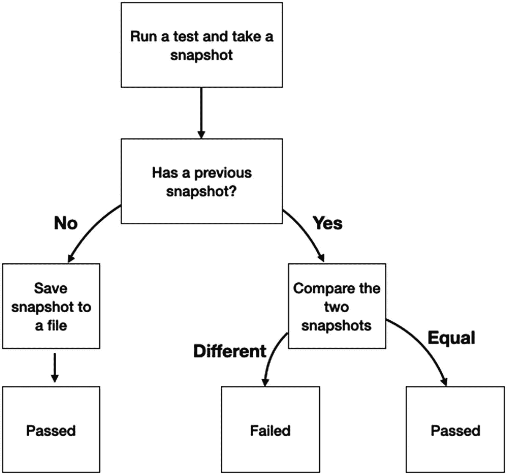
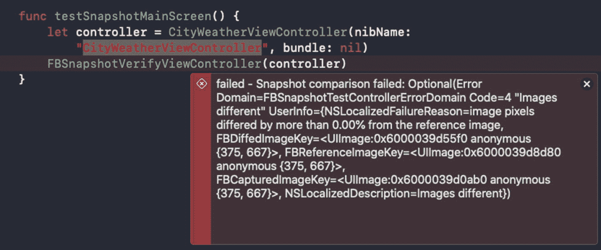
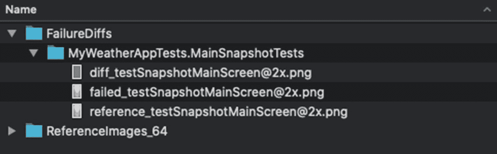
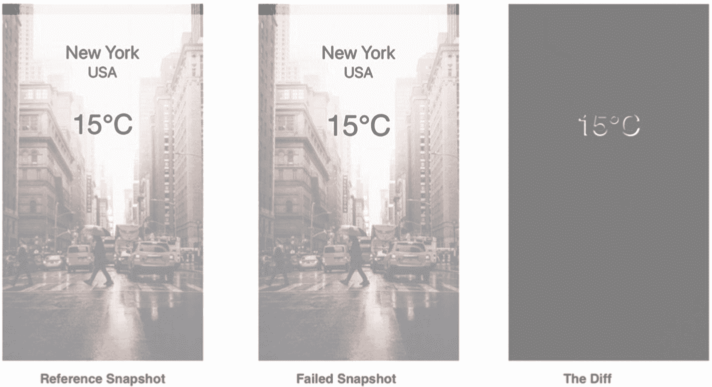

# 9. 快照测试

> *这让我想起曾经看到一个*超棒的*Bug 报告：‘所有东西都坏了。重现步骤：做任何事。预期结果：它应该正常工作’。*
>
> ——Felipe Knorr Kuhn

## 引言

当我们思考编写测试时，我们通常会想到定义预期结果，然后编写测试来验证它们。但是，如果我们知道我们的代码已经按预期执行，而我们只想防止未来出现回归呢？

快照测试的核心思想是，一旦我们知道当前状态是稳定的，就保存其持久性，然后在每次运行时进行持续的比较。

在本章中，你将学习

*   什么是快照测试
*   如何编写你自己的快照测试
*   快照测试存在的问题是什么
*   什么是 UI 快照测试以及为什么我们需要它
*   以 FBSnapshotTestCase 为例介绍 UI 快照测试框架

## 什么是快照测试？

下面的图表（图 9-1）是解释什么是快照测试的最佳方式。



图 9-1
什么是快照测试

快照测试是一种技术，当常规单元测试或集成测试难以覆盖某些情况时（例如覆盖应用的 UI 元素或网络响应），它可以帮助你快速、轻松地编写测试。

这种技术并非在所有情况下都推荐使用。不过，在我解释为什么我们要小心不要过度依赖快照测试之前，我想深入实践——了解快照测试是如何工作的。


## 从零开始快照测试

假设我们有一个函数，它接收一个句子（作为字符串）并返回其动词。

以下是该函数的签名：

```
func getSentenceComponents(sentence : String)->Components?
```

现在让我们为这个函数编写第一个测试：

```
func testExtractComponents() {
// arrange
let str = "The man is running"
// act
let verb = SentencesAnalyzer().getVerb(sentence: str)!
let reference = ""
// assert
XCTAssertEqual(verb, reference)
}
```

如果你仔细看上面的代码，你会发现我们在这里做了一件新事情——我们创建了一个名为 `reference` 的空字符串，并将其与函数的结果进行比较。现在我们知道测试会失败，因为前面的句子有一个动词——“running”。

运行测试后，我们收到了预期的失败消息：

```
XCTAssertEqual failed: ("running") is not equal to ("")
```

尽管我们的测试失败了，但我们知道代码如预期般工作。所以，我们现在需要做的就是修复测试，并将 “running” 设置为 `reference` 的值：

```
func testExtractComponents() {
// arrange
let str = "The man is running"
// act
let verb = SentencesAnalyzer().getVerb(sentence: str)!
let reference = "running"
// assert
XCTAssertEqual(verb, reference)
}
```

这就是我们的第一次快照测试！

让我们总结一下：

*   我们编写了一个测试，将结果与空字符串进行比较。
*   我们运行了测试，获取函数的结果，并将其保存到 `reference` 变量。
*   我们重新运行测试，发现它通过了。

因此，第一次运行只是为了获取预期结果，而之后的每次测试都会对当前状态拍一张“快照”，并与之前保存的结果进行比较。

### 使用 Swift 关键字

如果我们想要完成将快照保存到文件的过程，我们需要理解这里面临的挑战。

首先，我们需要将所有快照保存到一个文件中，这样在运行测试时就能访问它们。要获取相对于测试目标的目录，我们可以使用 `#file` 关键字。回想一下，我们在单元测试章节学过 Swift 关键字，`#file` 是我们可以在这里使用的另一个关键字。

`#file` 返回当前文件的绝对路径：

```
let snapshotTestingDirectory = URL(fileURLWithPath: "\(#file)")
.deletingPathExtension()
```

前面的代码返回一个目录，其名称与测试文件相同，但没有 `.swift` 扩展名。这是一个巧妙的技巧，可以快速生成相对于你正在处理的文件的目录。

现在我们有了快照文件夹，我们需要为每个函数保存一个快照。Swift 的关键字特性再次通过 `#function` 来拯救我们。`#function` 返回当前函数的名称，这可以成为我们快照数据库的关键词。

我们可以为每个函数保存一个快照文件，也可以将所有快照保存在快照目录下的一个大型 JSON 文件中。

让我们根据函数名为快照文件创建路径：

```
let snapShotFileForFunction = snapshotTestingDirectory.appendingPathComponent(#function).appendingPathExtension("snapshot")
```

让我们继续编写代码，创建文件夹并保存/读取快照，看看完整代码：

```
func testExtractComponents() {
// arrange
let str = "The man is running"
// act
let verb = SentencesAnalyzer().getVerb(sentence: str)!
let snapshotTestingDirectory = URL(fileURLWithPath: "\(#file)")
.deletingPathExtension()
let snapShotFileForFunction = snapshotTestingDirectory.appendingPathComponent(#function).appendingPathExtension("snapshot")
let fileManager = FileManager.default
try! fileManager.createDirectory(at: snapshotTestingDirectory,withIntermediateDirectories: true)
if fileManager.fileExists(atPath: snapShotFileForFunction.path) {
let reference =
try! String(contentsOf: snapShotFileForFunction, encoding: .utf8)
XCTAssertEqual(reference, verb)
} else {
try! verb.write(to: snapShotFileForFunction, atomically: true, encoding: .utf8)
XCTFail("Failed to write snapshot")
}
}
```

### 创建我们的断言函数

将代码提取到一个函数中，使其在其他测试中也可重用：

```
func doAssertSnapshot(match data : Any) {
var stringData = ""
dump(data, to: &stringData)
let snapshotTestingDirectory = URL(fileURLWithPath: "\(#file)")
.deletingPathExtension()
let snapShotFileForFunction = snapshotTestingDirectory.appendingPathComponent(#function).appendingPathExtension("snapshot")
let fileManager = FileManager.default
try! fileManager.createDirectory(at: snapshotTestingDirectory,withIntermediateDirectories: true)
if fileManager.fileExists(atPath: snapShotFileForFunction.path) {
let reference =
try! String(contentsOf: snapShotFileForFunction, encoding: .utf8)
XCTAssertEqual(reference, stringData)
} else {
try! stringData.write(to: snapShotFileForFunction, atomically: true, encoding: .utf8)
XCTFail("Failed to write snapshot")
}
}
```

注意，我们使用 Swift 的 `dump()` 函数将接收到的 `Any` 对象转换为字符串。

但我们还没完全完成。如果你记得，当我们讨论自定义断言时，我们说过需要将 `#file` 和 `#line` 等 Swift 关键字传递给我们的自定义断言函数。这里也一样——我们需要将 `#file`、`#line` 以及 `#function` 传递给我们新的断言代码：

```
func doAssertSnapshot(match data : Any, file : StaticString = #file, line : UInt = #line, function : String = #function) {
var stringData = ""
dump(data, to: &stringData)
let snapshotTestingDirectory = URL(fileURLWithPath: "\(file)")
.deletingPathExtension()
let snapShotFileForFunction = snapshotTestingDirectory.appendingPathComponent(function).appendingPathExtension("snapshot")
let fileManager = FileManager.default
try! fileManager.createDirectory(at: snapshotTestingDirectory,withIntermediateDirectories: true)
if fileManager.fileExists(atPath: snapShotFileForFunction.path) {
let reference =
try! String(contentsOf: snapShotFileForFunction, encoding: .utf8)
XCTAssertEqual(reference, stringData, file : file, line : line)
} else {
try! stringData.write(to: snapShotFileForFunction, atomically: true, encoding: .utf8)
XCTFail("Failed to write snapshot", file : file, line : line)
}
}
```

现在我们的新测试看起来像这样：

```
func testExtractComponents() {
// arrange
let str = "The man is running"
// act
let verb = SentencesAnalyzer().getVerb(sentence: str)!
// assert
doAssertSnapshot(match: verb)
}
```

只用了一行代码，我们就完成了断言并保存了结果供下次测试使用。

## 快照测试的缺点

我们可以看到，通过适量的代码，我们可以相当轻松地在我们的代码包中实现快照测试。但这并不意味着快照测试是一个完美的解决方案——它并不是。快照测试有其问题，你需要熟悉其中一些问题。让我们列举其中一些。

### 缺少文档

在第一章中，我提到测试实际上是我们代码的文档。在精确而详细地定义预期行为、逐步引导我们达到适当状态的同时，测试实际上是你应用程序**最好**的文档。

部分这样的文档，或者我应该说，其关键部分——预期结果——被隐藏在一个数据文件中，而不是直接呈现。当然，我们可以在测试内的注释中记录它，但如果我们那样做，快照测试的意义何在？


### 过于简单的修复

当常规单元测试因代码更改而失败时，我们需要手动定义预期结果。这是一个受欢迎的过程，它迫使我们重新检查代码并验证其是否按预期工作。然而，快照测试却使这个过程变得"过于简单"。只需点击一个按钮，我们就可以删除关联文件并创建一个新的快照。

通常，修复测试不应该那么容易——当你修复一个失败快照测试时，实际上意味着你正在进行一次`手动测试`，以验证你正在测试的功能（或状态）是否按预期工作。我们都知道，当流程中包含手动操作时会发生什么——通常意味着它不会被执行。

### 为什么我的测试失败了

单元测试的范围通常很窄。这意味着你是在特定条件下检查一个具体的函数。因此，当一个测试失败时，很容易理解它`为什么`失败。但快照测试并不总是这样。在快照测试中，我们经常检查一个状态或一大块序列化数据。快照测试的特性使我们很难触及问题的根源。

## 使用 iOSSnapshotTestCase 进行 UI 快照测试

快照测试真正大放异彩的领域之一是 UI 快照测试。

与可以轻易通过测试驱动开发处理的数据快照测试不同，UI 快照测试具有真正的比较优势。

想象一下这样的场景——你为应用中的主屏幕截图，并在每次测试运行时，验证它们在像素级别上保持不变。这是 UI 设计师都难以完成的事情，更不用说 QA 测试人员了。

### 为什么我们需要它？

UI 屏幕非常脆弱。文本更改可能会影响你的 UI，可复用 UI 组件的更改可能会破坏现有屏幕，甚至操作系统更新也可能破坏你的 UI 屏幕。

不仅如此；如前所述，有时如果不进行真实的差异对比过程，很难注意到这些变化。

### iOSSnapshotTestCase

很多很多年前（实际上只有 5-6 年），Facebook 开发了一个名为 `FBSnapshotTestCase` 的开源框架。不久之后，Facebook 放弃了这个项目，并创建了一个新的内部项目。幸运的是，Uber 接手了维护该框架的工作。现在这个框架名为 `iOSSnapshotTestCase`，你可以在这里找到它：[`https://github.com/uber/ios-snapshot-test-case`](https://github.com/uber/ios-snapshot-test-case)。

### 它如何工作？

一旦安装好 `iOSSnapshotTestCase`，在你的应用中使用它就非常简单了。该过程基于两个步骤：
* 在`记录模式`下运行测试，这意味着不进行比较，只是将初始状态保存到文件系统。
* 将记录模式更改为 `false`，然后再次运行以检查与已保存快照相比没有变化。

每个测试方法会初始化一个视图或一个 CALayer，并将其与现有的当前屏幕截图进行比较。

预期的屏幕截图保存在文件系统中。每个测试用例都有其自己的文件夹，每个测试方法都有以其方法命名的专属文件。

### 设置并运行 iOSSnapshotTestCase

设置 `iOSSnapshotTestCase` 比想象中更容易。

第一步是使用任何流行的依赖管理工具来安装该框架，例如 CocoaPods。

#### 使用 CocoaPods 安装

一旦安装了 `CocoaPods`（欢迎你搜索 Google 了解如何安装这个优秀的依赖管理器），很容易就能将 `iOSSnapshotTestCase` 添加到你的 `Podfile` 中：

```
target 'MyWeatherAppTests' do
inherit! :search_paths
#### Pods for testing
pod 'iOSSnapshotTestCase'
end
```

请记住将框架添加到你的测试目标，而不是主目标。

#### 定义环境变量

第二步是配置环境变量。这些变量定义了保存快照的文件夹。最佳实践是设置文档推荐的值：

```
FB_REFERENCE_IMAGE_DIR = $(SOURCE_ROOT)/$(PROJECT_NAME)Tests/Snapshots/ReferenceImages
IMAGE_DIFF_DIR = $(SOURCE_ROOT)$/(PROJECT_NAME)Tests/Snapshots/FailureDiffs
```

如果你还记得，环境变量是在 scheme 编辑器中设置的。

注意格式——它在项目名称后直接添加了"`Tests`"。这是因为单元测试的默认目标名称是项目名称后跟单词"Tests"。你只需要确保你的项目中情况确实如此。

#### 继承 FBSnapshotTestCase

与其他单元测试不同，为了使快照测试工作，你需要继承 `FBSnapshotTestCase`（它本身继承自 `XCTestCase`）。

`FBSnapshotTestCase` 为你处理所有快照测试。

你需要做的第一件事是导入 `FBSnapshotTestCase` 框架：

```
import FBSnapshotTestCase
```

再次提醒，记住在你的 `Podfile` 中，快照框架需要包含在测试目标下，而不是主目标下。

让我们构建我们的第一个快照测试：

```
func testSnapshotMainScreen() {
// arrange
let controller = CityWeatherViewController(nibName: "CityWeatherViewController", bundle: nil)
// assert
FBSnapshotVerifyViewController(controller)
}
```

哦，天哪，就这么简单！是的，快照测试（在这种情况下）只需两行代码。第一行初始化视图控制器，第二行将其与快照进行验证。

当然，问题是我们还没有快照。如果我们就这样运行测试，会得到一条错误信息。

为了确保我们拥有特定函数的快照，我们需要在记录模式下运行测试。为此，在 `setup()` 方法中打开记录模式：

```
override func setUp() {
super.setUp()
self.recordMode = true
}
```

`recordMode` 会绕过验证函数，不进行验证，而是创建一个快照并将其保存在 scheme 中定义的文件夹里。

现在，让我们在记录模式下运行测试，看看会发生什么。

哦不，又是错误！别担心；这完全正常。测试失败是为了提醒我们需要禁用记录模式，以确保从今以后我们的测试将根据快照进行验证。

但首先，让我们确保快照已保存在我们的文件系统中。

现在我们有了快照，可以禁用记录模式了

```
override func setUp() {
super.setUp()
self.recordMode = false
}
```

并重新运行我们的测试。

就是这样。现在我们可以自动验证我们的屏幕了。


#### 验证失败

假设我们在应用的某个特定屏幕进行了一些 UI 重新设计，改变了特定的字体大小。而我们没有意识到的是，我们破坏了 CityWeather 屏幕。

让我们看看运行快照测试时会发生什么（参见图 9-7）。



图 9-7

快照测试中的回归问题

验证功能检测到 UI 已更改并导致测试失败。

现在，测试中至关重要的一点是能够识别失败的原因。

回到方案编辑器中，我们之前必须定义一个名为 `IMAGE_DIFF_DIR` 的变量。这是一个可选变量，包含在失败情况下用于存储差异文件夹的路径。

现在让我们回到文件系统查看（图 9-8）。



图 9-8

失败时生成的 FailureDiffs 文件夹

我们看到有三张图片：

*   `Reference`_<测试函数名> - 这是我们最初在记录模式下运行测试时创建的快照文件。
*   `Failed`_<测试函数名> - 这是失败的最新快照。这张图片与参考 UI 不同。
*   `Diff`_<测试函数名> - 这是此处最重要的文件。这是一张只显示两张图片之间像素差异的图像。

让我们打开这三个文件（图 9-9）。



图 9-9

FBSnapshotTestCase 为我们生成的三张图片

乍一看，参考快照和失败快照似乎是相同的——这种细微差别很容易被我们忽略。但差异图像揭示了真相——我们可以看到温度的字体大小增加了。差异图像仅显示该变化，因此我们可以直接聚焦于变化点。

#### 快照测试配置

快照测试最棒之处在于其简单性——只需两行代码，我们就能创建一个快照测试，检测那些我们乍一看几乎无法察觉的变化。

但这并不意味着我们不能根据需求来调整和定制测试。

##### 包含设备信息

默认情况下，生成的快照文件名仅由测试方法名组成，例如：

```
testSnapshotMainScreen@2x.png
```

当然，这意味着如果我们想在不同的设备和操作系统版本上检查视图，这可能会成为问题。

幸运的是，`FBSnapshotTestCase` 类有一个名为 `fileNameOptions` 的属性，可以让你配置文件名：

```
override func setUp() {
super.setUp()
self.recordMode = true
self.fileNameOptions = [.device, .OS ,.screenSize]
}
```

现在，当在 iOS 13 的 iPhone 11 模拟器上运行时，生成的文件名是：

```
testSnapshotMainScreen_iPhone_13_6_414x896.png
```

我个人认为这非常方便，尤其是在测试全屏视图时，不同设备间的安全区域空间可能存在显著差异。

##### 控制变化的容忍度及其他

在我上一个例子中，我们看到一个小小的改动就导致了测试失败。这可能很棒——这些回归有时很难被发现。唯一的问题是“我们在乎的程度有多大？”我们知道我们的改动可能会导致这里或那里的回归，但有时我们只希望差异达到某个程度时才让测试失败。

如果你需要对快照测试有更多控制，可以使用 `snapshotVerifyViewOrLayer` 函数。

这个函数有一些有趣的参数：

*   `viewOrLayer` - 你可以传递一个视图（`UIView`）或一个核心动画图层（`CALayer`）。
*   `Identifier` - 为什么需要标识符？嗯，你知道我们的视图通常是动态的，意味着我们可以配置它们来显示不同的数据或状态。你给快照的标识符也会添加到快照文件名中。这意味着你可以在不同状态下测试你的屏幕/视图，并为每个状态保留参考图像。这听起来像是可选的，但我发现这个选项极其有用。
*   `Suffixes` - 在这里，你可以为测试文件夹添加一个后缀。
*   `perPixelTolerance` - 一个浮点数，表示对像素 RGB 变化的容忍度。“0”表示任何改变都不可接受，“1”表示所有改变都可接受。
*   `overallTolerance` - 这是对变化（包括颜色和像素位置）的总容忍度。
*   `defaultReferenceDirectory` - 如果你没有在方案中定义参考目录，可以在这里定义。
*   `defaultImageDiffDirectory` - 同上。你可以直接从快照断言函数中定义差异目录。

让我们看看如何使用它：

```
func testSnapshotMainScreen() {
let controller = CityWeatherViewController(nibName: "CityWeatherViewController", bundle: nil)
controller.city = "New York"
let result = snapshotVerifyViewOrLayer(controller.view.layer, identifier: "NewYork", suffixes: ["cities"], overallTolerance: 0.1, defaultReferenceDirectory: nil, defaultImageDiffDirectory: nil)
XCTAssertEqual(result, "")
}
```

如你所见，目录参数不是必需的，如果已在方案中定义，你只需传递 nil。

## 总结

快照测试是快速编写涉及大块或序列化数据的测试的好方法。但在 UI 快照测试方面，它真正大放异彩。

我的建议是走简单的路。它易于设置和维护，但一如既往，过多使用可能会在未来给你带来大麻烦。事实上，一些开发人员从根本上就忽略快照测试。

