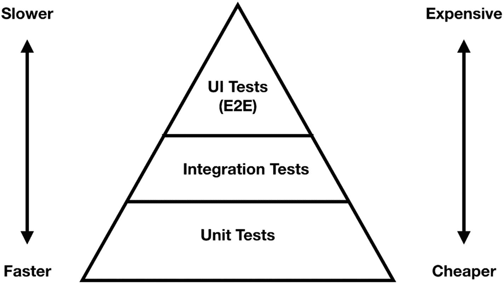
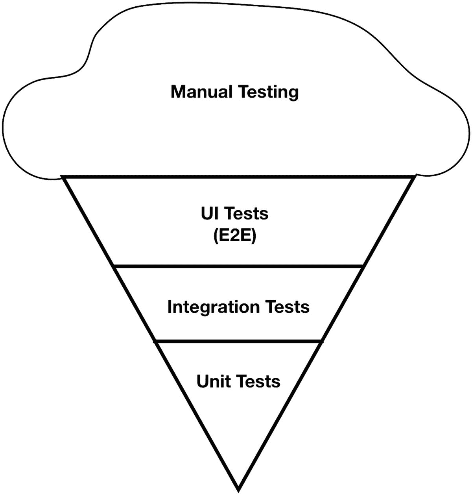
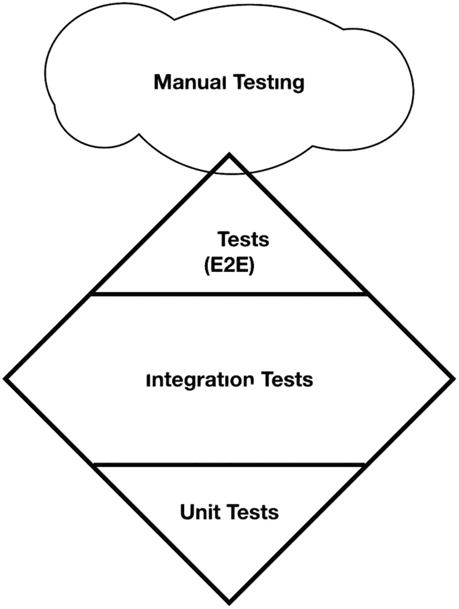
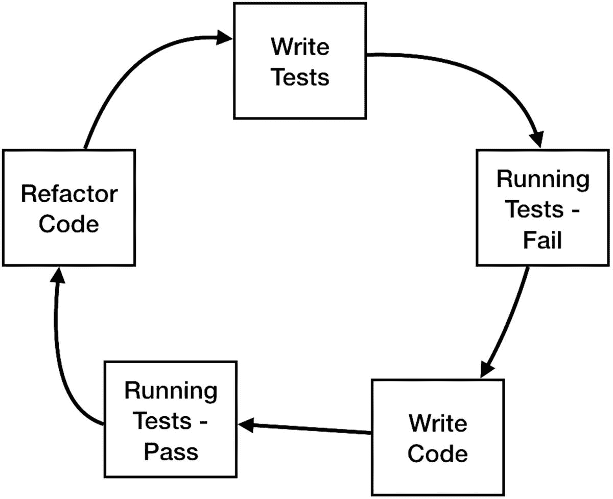

# 10. 在日常工作中实施测试

> *再多的测试也无法证明软件是正确的，但一个测试就足以证明软件是错的。*
>
> ——Amir Ghahrai

## 引言

我们讨论了许多类型的测试——单元测试、集成测试、性能测试、UI 测试和快照测试。但如果你问我编写测试最具挑战性的任务是什么，我会说实际上是编写它们本身。

作为一名开发者并不容易。我们的日程表充满了压力——截止日期、bug、要阅读的文档、会议，我们中的一些人还有坐在我们头上生气的老板。最终，我们总有很多借口来说明为什么现在没时间写测试。

编写正确的测试，筛选出重要的测试，并决定测试的重点，这些是我们作为 iOS 开发者必须应对的另一个挑战。

在本章中，你将学习：
1.  如何将测试编写作为开发流程的一部分
2.  如何构建单元测试、集成测试和 UI 测试的良好组合
3.  如何编写测试场景
4.  什么是“代码覆盖率”以及如何在 Xcode 中管理它

## 我们如何开始？

要解决这个问题，我们需要理解需要遵循的关键原则。

### 测试是开发任务的一部分

虽然许多开发者倾向于将编写测试留到开发周期的末尾，但这是一个严重的错误。首先，在大多数情况下，我们的开发任务会遇到困难，我们需要放弃一些东西才能按时完成我们的功能。还有什么比放弃编写测试更舒服的呢？我们“知道”我们的应用运行良好；反正我们有 QA 环节，而且我们确实有截止日期。

我们需要理解，编写测试是开发本身不可分割的一部分。写了一个复杂的函数吗？我们为它编写一个单元测试以确保我们的代码正常工作。当我们将其推迟到开发会议结束时，实际上是在说“如果一切按计划进行，我会有时间写测试的。” 很可能会事与愿违。


### 需要决定测试什么

不要测试所有内容。全面覆盖不仅效率低下，长期来看还会增加维护成本。你需要理解每个测试的**价值**，同时也需要理解**其代价**。

针对不同的目的使用不同的测试技术（如单元测试、集成测试等）。如果你的类中包含复杂代码，就用单元测试进行深入覆盖。但如果代码像这样简单：

```
func onSaveButtonTapped()  {
interactor.saveToFile()
}
```

就没有必要用单元测试去覆盖它。直接跳过即可。

### 修复了 Bug？那就编写一个测试

这一点与上述内容一脉相承。我们无法预知会遇到哪些问题或出现什么 bug（否则我们一开始就会处理它们了）。

一个很好的做法是**为我们发现的每一个 bug 都编写一个测试**。遇到 bug 通常表明代码中存在一个覆盖不足但至关重要的区域。在这种情况下，最好采用 TDD（测试驱动开发）方法，**在**修复 bug **之前**编写测试。

## 测试组合

既然我们已经理解了**何时**编写测试，接下来需要明白**编写什么**测试。单元测试很容易编写。那我们应该多写单元测试吗？还是应该继续编写 UI 测试，试图自动化最终用户体验？

这没有简单的答案。这取决于团队资源、项目结构，甚至应用的业务模型。不过，有一些我们可以遵循的方法论，我们称之为“测试金字塔”。

## 测试金字塔

每种测试类型对我们日常工作有着不同的影响。例如，UI 测试成本高昂。它们可以检查用户交互，甚至是端到端场景，但构建和维护困难，且运行时间很长。另一方面，单元测试运行非常快，并且能在更接近代码的位置发现问题，但它们无法从用户角度告知应用状况，也无法测试应用流程或各部分如何协同工作。决定在何处投入更多时间和精力的策略至关重要。Mike Cohn 在他的书《*敏捷软件开发的成功之道*》中将这一策略描述为“测试自动化金字塔”，或简称为“测试金字塔”。测试金字塔是一种直观的方式，用于描述在开发工作量与测试效率之间取得平衡的测试自动化套件组合。

### 经典金字塔

被认为是最佳实践且最为人熟知的是经典金字塔。当“我们需要什么样的测试组合”这个问题出现时，你很可能看到的就是这个传统的金字塔（见图 10-1）。



图 10-1
经典金字塔

根据“经典测试金字塔”，我们应该编写尽可能多的单元测试。同时，也应该编写集成测试，但数量少于单元测试，而编写端到端（UI）测试则应更少。如前所述，其目的是在速度与有效性之间取得平衡。另一个原因是，我们希望能在更接近代码的底层捕获 bug 和缺陷，而这通过单元测试更容易实现。

随着在金字塔中向上移动，我们逐渐远离代码，更接近用户。此外，由于 UI 和 API 的变化比底层逻辑函数更频繁，当我们向上移动时，会发现在这些层次上需要投入更多维护精力。

### 冰淇淋甜筒模型

**冰淇淋甜筒**模型被认为是一种反模式，但在特定的开发团队中是可以接受的。在这种模型中，金字塔是颠倒的（图 10-2）。



图 10-2
冰淇淋甜筒模式

冰淇淋甜筒模式正变得越来越不受欢迎。然而，仍有公司采用这种模式，主要是那些有资源维护这个庞然大物的大公司，或用户流程简单的公司。冰淇淋甜筒模式非常侧重于 GUI 和端到端测试。在大多数情况下，你会发现不同类型的测试由不同的团队负责，而开发团队和产品团队之间缺乏协作或同步。

由于 UI 测试覆盖端到端场景，意味着更接近用户，因此有一种假设认为，我们创建的 UI 测试越多，测试套件就越有效。

但这种反模式存在几个问题：

*   **构建难度更大**。构建一个 UI 测试场景需要准备 UI 元素，并花费大量时间创建流程。此外，验证测试是否按预期运行也需要相当多的时间。
*   **UI 测试运行时间长**。每个测试很容易花费 10 秒甚至更长时间，具体取决于应用和场景；而单元测试在最坏情况下也只需不到 0.1 秒。集成测试在涉及服务器或网络调用时也可能花费相当多的时间。当你运行一个包含大量 UI 和集成测试的测试套件时，可能需要 30 分钟以上的运行时间，这在持续集成环境中可能是个问题。
*   **修复和维护难度更大**。发现问题固然好，但当你在远离代码的地方捕获一个 bug 时，修复起来会更加困难。当单元测试失败时，你可以精确定位到出问题的方法。此外，UI 的每一次更改都要求我们同步修改 UI 测试；否则，长时间运行的测试套件就会崩溃。

有几种方法可以避免陷入冰淇淋甜筒模式：

*   **加强协作** —— 确保不同团队成员（开发人员、质量保证和自动化团队）保持同步。尝试“结对测试”，鼓励团队成员在测试内容和方式上保持一致。关注更高效的“启动会议”，确保每个人对功能或任务都清晰明了。
*   **优先考虑单元测试** —— 单元测试运行速度快且易于维护。如前所述，我们需要更接近代码地测试应用是有原因的 —— 更接近代码意味着修复更容易。单元测试允许我们专注于特定的代码片段，并用所有用例覆盖它，这是 GUI 测试无法做到的。此外，编写和运行单元测试非常简单，因此与其他测试相比，它们的成本很低。
*   **明确约定测试组合** —— 尝试定义单元测试和 GUI 测试的比例。测试组合需要让所有相关人员都清楚，并应由团队负责人进行管理。尝试精确决定哪些关键的集成流程和用户流程需要用非单元测试（如集成测试或 UI 测试）来覆盖，并仅为这些部分创建测试。


### 测试菱形模型

我们都认同端到端（UI）测试难以创建和维护。它们运行耗时过长，且对细微的 UI 变动非常敏感。但端到端测试有一个显著的优点——它能够每次都将你的应用作为一个系统来测试，而非仅仅是孤立的一段代码。

有人认为你能进行的最重要的测试，就是检查各个单元如何协同工作。尽管端到端测试满足了这一需求，但我们确实需要在它的效果与单元测试的速度和便捷性之间取得平衡。答案就是集成测试，它常被视为测试金字塔中“被遗忘”的一层。由此产生的模式就是“测试菱形模型”（图 10-3）。



图 10-3
菱形模型

正如你所见，测试菱形模型主要聚焦于集成测试，其理念是大部分与业务相关的问题和场景都存在于这一层。这些集成发生在你的各个单元之间。这种方法是将“问题”视为一个需要测试的复杂系统，而不仅仅是独立的单元。总的来说，测试菱形模型能让你对应用的稳定性和质量有更高的信心，因为它比单元测试更贴近业务和产品需求；然而，创建这类测试的成本也最高。

### 哪种才是正确的方法？

归根结底，无论你选择何种策略，都需要权衡测试的维护成本和运行时间，以决定测试套件的组合。此外，这也取决于应用的背景和类型。有些应用充满了小而复杂的逻辑，在这种情况下，你应该专注于单元测试，以确保应用的基本功能正常工作；而有些应用由多个层次构成，需要更多的集成测试。有些团队拥有资源来创建坚实的端到端测试，并且相信这对他们的应用有价值，因此他们选择了冰淇淋筒模型。但你必须明白，你创建的 UI 测试和集成测试越多，在时间上的代价就越大。

## 如何构建测试场景？

既然我们已经知道了如何编写测试，总有一个问题会冒出来——如何构思测试场景？

当然，我们可以尝试覆盖代码中的每一行，但我们都知道这既不现实也无用处。

我想与你讨论两种方法——一种是`TDD`（测试驱动开发），另一种是`BDD`（行为驱动开发）。正如它们的名字所示，这两种方法都是由某种事物驱动的。驱动 TDD 和 BDD 的测试列表是由产品需求驱动的。

你不必严格地一步步遵循这些方法。但它们可以为你提供一个方向，指导你如何与代码一同编写测试。

## 测试驱动开发 (TDD)

> *所有代码在被证明清白之前都是可疑的。*

测试驱动开发 (`TDD`) 是一种软件开发技术，它阐述了一个简单的原则——在编写代码之前先编写测试。这听起来简单，但对开发者来说却是件大事。`TDD`确保开发者知晓并理解其类或函数的所有需求，如果做得好，它将带来高代码覆盖率和极少的缺陷。

开发者们认为`TDD`是被称为极限编程的一部分；这是一种在 20 世纪 90 年代末开始流行的方法论。

软件开发者 Kent Beck 开发了`TDD`作为一种技术，虽然理解起来简单，但它需要一种不同的思维方式来看待代码和函数。

请看下面的图示（图 10-4）。



图 10-4
TDD 生命周期

`TDD`始于编写一个在第一次运行时失败的测试（因为我们还没有编写任何代码）。运行测试并看到它失败后，我们编写满足需求的代码，并重新运行测试以确认它通过了。接着我们重构我们的方法，再次通过测试验证，然后通过添加一个新测试重复第一步并继续实现。

这个过程确保我们为函数/类的正确运行添加了最少的必要代码。

让我们稍停片刻，谈谈重构部分——有些人认为，在这种情况下，重构意味着“编写更好的代码”。但仔细想想，这听起来有点奇怪——我们刚刚写完这段代码，为什么需要重构呢？嗯，在进行“测试-编码-测试-编码”的过程中，我们是根据测试一步步地编写函数或代码块的，这与一次性写完函数的传统编码方式是不同的。

想想你今天是如何编写方法和函数的——你是怀着必须满足所有需求的目的来编写代码。`TDD`方法与标准方法大相径庭，这可能会导致代码重复。在重构阶段消除这种重复，通过这种方式，我们在进行下一个测试前只做最小程度的变更。重构不是可选的步骤——它是必不可少的步骤。


## 行为驱动开发（BDD）

一个真实的故事是，我曾负责一个涉及文本处理的功能，并决定采用 TDD 开发该功能。我预先编写了一些测试，然后开始开发函数。部分测试是一个文本输入列表，我想检查不同的情况，并覆盖函数中的多个点，以观察它们如何运行。

因此，在函数达到 100%测试覆盖率的情况下，我将构建版本分发给 QA 团队。经过 10 到 15 分钟的 QA 测试后，应用程序崩溃了。我对自己说：“但这可是 TDD 啊！我覆盖了代码中的每一个表达式！” QA 测试人员检查的是一个用户在其输入中使用了表情符号字符的用例。这导致了因编码问题引发的越界异常。

基于缺陷的历史记录和评审，结合预先的思考过程，QA 团队决定检查这个场景，结果就是发现了这个问题。

那么，为什么神奇的 TDD 流程没有捕捉到它呢？这是因为开发人员与产品和 QA 团队各自为政的结果。此外，TDD 的目标是覆盖代码，而不是解决现实世界的问题。这本身没有问题——思考可能和常见的用户行为是一项需要团队合作与协作的任务。这不是技术问题，而是流程问题。当团队不一起工作时，这类事情会经常发生，而前面的例子还算是一个轻量级且容易的案例。有些用例不仅会影响代码中的特定行，还可能迫使你重构部分实现，如果你没有提前考虑这些情况的话。

这里的解决方案是在流程中结合 BDD（行为驱动开发）。BDD 是产品经理、QA 团队和开发人员之间的一个协作过程，旨在从用户角度定义不同的用例，指导开发，并将其聚焦于现实世界的场景。

产品、QA 和开发团队之间的协作可以覆盖许多用户场景和现实世界测试。为此，团队会召开一个“发现会议”，他们共同编写用户故事，每个团队成员都为此贡献力量。

`产品负责人`负责将用户故事转化为功能，定义产品范围，回答用户体验问题，并确保提出的解决方案符合功能需求。

`QA 测试人员`凭借其经验和知识，了解用户行为方式以及常见的陷阱。他还会考虑边界情况以及应用程序可能如何崩溃。QA 还可以代表“猴子测试”——如果一只猴子在玩这个产品，快速点击按钮、触摸屏幕上不同的地方、输入大量内容等等会怎么样？

`开发人员`可以贡献其实用解决方案方面的知识，以及与自身能力相关的限制条件。他是唯一了解应用程序底层工作原理的人，并为讨论增添了至关重要的技术层面。

这三个团队负责人的任务是使用浅显易懂的英语编写测试，让每个人都能理解，并能满足所有产品需求。

BDD 并非取代 TDD，而是帮助 TDD 流程聚焦于关键的测试。你可以将 BDD 视为功能设计过程的一部分，而 TDD 是开发本身的一部分。有人说 BDD 是正确实施的 TDD，或者说它是 TDD 的扩展。我认为没有 BDD 的 TDD 是低效的，最好在你的工作流程中实施 BDD，而不是在没有任何上下文的情况下进行纯粹的 TDD。

### 如何编写好的 BDD 场景

> *比测试行为更重要的，是设计测试的行为，这是已知的最佳缺陷预防手段之一。创建有用测试所必须进行的思考，可以在编码之前发现并消除缺陷——实际上，测试设计的思考可以在软件创建的每个阶段发现并消除缺陷，从构思到规格说明，到设计、编码及后续阶段。*
>
> —鲍里斯·贝泽

看一下以下场景：

```
"点击注册按钮应启动注册流程"
```

为该场景编写测试存在几个问题。例如，我们不知道哪些字段当前有值。我们还假设用户在注册屏幕上，但我们知道这一点只是因为我们在场景中看到了注册按钮，而不是因为它被明确提及。我们可能在不同的地方有注册按钮，例如弹窗或其他屏幕，因此在这种情况下提及屏幕名称很重要。最后一点是，这个场景没有标题和编号，所以很难找到它并将其放入数据库供以后使用。

现在看以下场景：

```
场景 01：从注册页面进行用户注册
前提：用户位于注册页面
并且以下字段已填写：
- 电子邮件
- 全名
- 密码
当：用户确认表单
那么：应用程序应启动注册流程
```

在前面的例子中，我们描述了上下文——用户当前所在的屏幕以及哪些字段有输入。我们描述了动作——“确认表单”（这可以是注册按钮，也可以是键盘上的回车键）——我们也描述了预期的行为。

这种写作风格被称为 GHERKIN，是 BDD 中编写用户场景的一种公认方式。这里使用了几个基本术语：

`前提`——描述场景的当前状态，例如：
*   用户在哪一个屏幕？他是否已登录？输入字段包含什么内容？
*   网络条件如何？
*   数据库中目前保存了什么？

此部分包含与场景相关的最少细节和条件。

`当`——描述用户在此场景中执行的动作。尽量使这部分更具声明性，减少技术细节，以覆盖多个测试。

`那么`——这是执行所描述动作时期望的结果。记住，它应该是可以某种方式度量的内容，以便我们可以自动测试它。

`并且`——这可以在`前提`、`当`和`那么`部分中使用，以描述多个状态、动作或结果。有时，如果你有很多条件，可以像前面例子那样使用列表。

这些测试场景是团队就产品和开发过程进行沟通的绝佳机会。QA 测试人员负责编写场景，而开发人员负责步骤。产品经理负责确保场景在范围内，满足产品需求，并且不与它们产生任何冲突。推荐的方法是开发人员和测试人员结对工作。

编写场景的一些建议如下：


### 尝试撰写描述性场景

*   **尝试撰写描述性场景**以覆盖尽可能多的用例。在“WHEN”行中，尝试描述意图而非实际动作。例如，在前面的例子中，用户的意图是确认表单。至于它是通过按下按钮还是按键盘上的回车键来实现的，这并不重要。写成“点击提交按钮”是一个与场景无关的用户体验动作，甚至可能使开发人员和测试人员都感到困惑。此外，编写 UI 动作（如点击/滑动）可能会将测试范围缩小到仅限于按钮点击。请记住，一个场景可以产生多个测试。也要记住，有时点击特定按钮可能是一个重要场景，而按下键盘按钮则不是，所以这条规则并非总是适用。这取决于具体场景。

*   **在编写场景时使用真实世界的数据。**这些场景不应检查诸如非常长的输入、大量数据或低网络连接等边界情况。使用真实世界的数据可以确保开发人员、测试人员和产品经理都理解我们所讨论的情况，从而改善他们之间的沟通。例如，不要在之前表单的名字字段中使用“1”或“test”。首先，它无法表达我们设想文本输入包含什么，并且几天后我们阅读场景时也不清楚我们当初写它时的含义。

### 每个场景专注于一个测试

很多时候在编写场景时，很容易写出一个覆盖多个领域或检查多个问题的场景。**尝试每个场景专注于一个测试**。当你的场景涉及不同的测试或领域时，你可能会遇到几个问题：

同一场景中的多个测试意味着它们之间存在依赖关系。如果第一个测试失败，其他测试也会失败，我们希望隔离这些测试，而不是将它们链在一起。

看看以下场景：

```
SCENARIO 02: User Registration from the registration Page GIVEN the user is on the registration page
AND the following fields are filled:
- Email
- Full Name
- Password
WHEN the user confirm the form
THEN the app should start the registration process AND
continue to the next screen
```

看看 THEN 部分。看起来团队有点偷懒，不想把场景分成两个。他们添加了两个预期结果——一个是开始注册过程，第二个是继续到下一个屏幕。在这种情况下，我们可能会发现有两个不同的开发人员负责应用程序的那个区域。第一个负责构建表单，第二个开发人员负责服务器 API 或应用程序的导航。多人负责修复或测试同一场景的情况并不理想。

### 正确理解和使用 Gherkin 语言

**理解 GHERKIN 语言**并正确使用它。这里有一个用 GHERKIN 写的糟糕场景例子：

```
SCENARIO 03: User Adding A New Note
GIVEN the user opens the app main menu
AND the user navigates to the notes screen WHEN the user tapped on ADD NOTE button THEN "Add New Screen" opened
WHEN the user types note details
AND her the user tap the "Save Button" THEN screen is closed
```

很明显，场景的编写者不理解 GHERKIN 语法或如何编写有用的测试。在前面的例子中，GIVEN 部分描述了一个动作（“用户打开应用程序主菜单”），而不是给定的状态。但最糟糕的是 WHEN-THEN 对。命令的顺序总是 GIVEN-WHEN-THEN，所以 WHEN 不能在 THEN 之后出现。每个 WHEN-THEN 对都是新的行为，因此，你应该将它们拆分为两个场景。此外，这种场景包含重复。想象一下我们有一个包含所有场景的文档。很可能我们已经有一个描述点击`ADD NOTE`按钮时会发生什么的场景，所以这个场景已经被覆盖了。解决方案是正确使用 GIVEN 部分。GIVEN 部分应该将用户带到期望的状态。看看前面场景的修复版本：

```
SCENARIO 03: User Adding A New Note GIVEN the user in on the add new screen AND there is text in the input field WHEN the user tap the "Save Button" THEN screen is closed
```

这不仅仅是更好，而且更短，阅读和编写所需时间更少。

### 使用通俗语言编写场景

确保场景**用英语而非技术语言编写**，以便团队中的每个人，尤其是非技术人员，都能理解它们。不要谈论“标志”、文件名、查询等等。保持场景简单并使用用户用语。

### 考虑自动化测试的可行性

由于本书涵盖自动化测试，当你编写 BDD 场景时，请记住这些场景需要易于自动化，这意味着不要编写难以衡量的场景，例如“THEN 它需要动画流畅”等等。

### 基于场景创建测试

写下并商定所有场景后的最后一步是开发人员根据它们创建测试——有些可以是单元测试，有些是集成测试，有些是 UI 测试。要创建测试，你的代码必须是可测试的（测试友好的）；否则，编写这些测试将非常困难，甚至不可能。

## 代码覆盖率

代码覆盖率是一种衡量指标，用于确定在测试期间执行了你代码的百分比。由于 UI 测试将你的应用视为黑盒，因此代码覆盖率仅与单元测试和集成测试相关。

要在 Xcode 中启用代码覆盖率，你需要在方案配置中启用它，而默认情况下它是未启用的。此操作将在下一章详细解释。

代码覆盖率的计算很简单——如果你有十行代码，而你的测试执行了其中的七行，那么你的代码覆盖率就是 70%（7/10）。许多团队试图实现高覆盖率，基于“越高越好”的假设。

### 不要为代码覆盖率设定目标

开发人员倾向于为代码覆盖率设定目标——认为高代码覆盖率意味着高质量的代码。恐怕这是不对的。并不是说高代码覆盖率很糟糕——它不是，它可以告诉你关于代码的很多事情，但它最不能告诉你的就是你的代码质量。

让我们看下面的例子：

```
func divide(x :Float, with y :Float)->Float {
    return x / y
}
```

这个函数是一个非常简单的例子。当我们使用`x = 4`和`y = 2`对这个函数运行测试，并期望结果为 2 时，测试通过。这个函数的代码覆盖率是 100%。这是否意味着我们完全覆盖了并且这是无错误的代码？当然不是。如果我们在这个函数上运行另一个测试，当`y = 0`时，我们会得到一个异常（“除以零”）。

这是一个高覆盖率并不代表无错误代码甚至高质量代码的典型例子。它只是说我们的测试在运行时命中了很多代码行。还有一些公司和团队的例子，他们如此热衷于高覆盖率，以至于创建了没有任何断言的单元测试，这意味着他们的测试永远不会失败（！）。

另一个例子是：

```
func updateFirstName(newFirstName :String) {
    self.firstName = newFirstName
}
```

开发人员可能会创建一个测试，使用一个参数运行这个函数，然后验证名为“`firstName`”的实例属性是否接收到新值。但由于这个函数非常简单，很明显开发人员编写这个测试只是为了获得更好的代码覆盖率。

这里的问题是，当高代码覆盖率成为目标时，开发人员偏爱**数量**而非**质量**，他们成为高数字和统计的奴隶，而不是瞄准高质量和捕获错误。在这种情况下，仅仅覆盖函数然后继续编码是很容易的。

此外，我们需要记住，并非代码的所有部分都同等重要，因此在所有项目领域投入相同的精力并不是一个明智的策略。通过测试不重要的代码，你可能会跳过重要的场景。


### 那么，我们为什么需要代码覆盖率？

高代码覆盖率不一定意味着“没有错误”，但这并不意味着它没用。代码覆盖率是**检测未经测试代码**的绝佳指标，也是识别应用中未被覆盖或可能包含您未察觉错误区域的绝佳指标。这并不意味着您需要覆盖它们，但它能让您全面了解您的应用状况。

代码覆盖率能帮助您解决的另一个问题是检测死代码。如果您看到一个未被测试覆盖的私有方法，这可能是不可达代码的标志，或者说，是“死代码”。您可以尝试检查调用层次结构来追踪哪些函数调用它，然后决定是覆盖它还是在未使用时删除它。

### 接下来是测试覆盖率。等等。什么？

当我们说“代码覆盖率”时，我们的意思是“我们的代码中有多少百分比被单元测试覆盖”。或者，如前所述，如果我们有 50 行代码，而我们的测试执行了其中的 20 行，我们可以说我们的代码覆盖率是 40%（50 行中的 20 行）。

但还有另一个术语——测试覆盖率。许多团队和开发人员对这两个术语感到困惑。虽然它们听起来相似，但它们并不相同。

代码覆盖率衡量的是被测试覆盖的代码百分比，而测试覆盖率衡量的是**被测试覆盖的需求百分比**。由于测试覆盖率处理的是需求而非代码，因此它与开发人员的关联较小，而与质量保证测试员的关联更大。我在这里提到它，是因为它能给您一种如何覆盖应用不同方面的感觉，而不是仅仅盲目追求代码覆盖率指标或随机测试方法。

那么当我们说“需求”时，最佳实践是将它们分成不同的组，代表我们的应用在不同方面如何被覆盖和测试：

**产品** – 您的产品的测试覆盖范围是什么？如果您的产品包含十个功能，而测试仅覆盖了其中的八个，那么我们可以说在这种情况下，您的测试覆盖率为 80%。

**风险** – 您的应用需求列表很长，其中一些是关键或阻塞性的，一些则是次要的。在您定义为关键和阻塞性的那些需求中，有多少被覆盖了？这是判断您的应用是否准备好投入生产的关键因素。

**参数值覆盖率** – 还记得“除以零”的例子吗？在主函数中，您应该测试广泛的参数范围。当然，我们有常见的嫌疑对象，如 nil、0 和 “”，但有时这还不够。尝试关注用户输入的边界情况——长文本、大数组等等。

## 总结

我们已经学习了如何将测试融入日常工作；我们看到了不同测试套件的组合，我们称之为“测试金字塔”；了解了什么是 TDD 和 BDD；以及什么是代码覆盖率及其覆盖方式。

正如我之前所说，将编写测试作为日常工作的一部分，是一项与文化、习惯相关的专业挑战。

另一个与文化相关的问题是每天自动运行这些测试。这是所谓的“持续集成”的一部分，将在下一章讨论。

