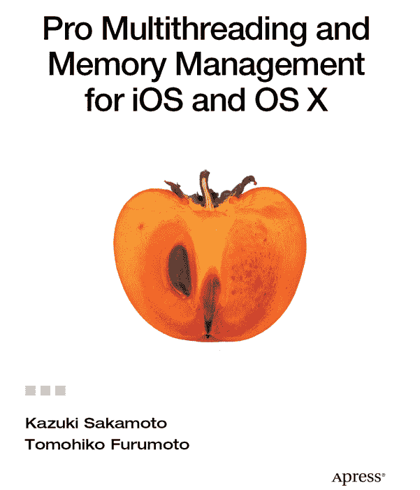

**精通 iOS 与 OS X 的多线程与内存管理**

版权所有 © 2012 坂本一树

本作品受版权保护。出版者保留所有权利，无论其内容为全部还是部分，具体包括翻译权、重印权、插图复用权、引用权、广播权、缩微胶片复制权或其他任何物理形式的复制权，以及信息存储与检索的传输权、电子改编权、计算机软件权，或现在已知或今后开发的任何类似或不同方法的权利。此法律保留条款的例外情况包括：与评论或学术分析相关的简短摘录，或为输入并执行于计算机系统而专门提供的材料，且仅供作品购买者独家使用。对本出版物或其部分内容的复制，仅在出版者所在地现行版权法的规定下才被允许，且必须始终从斯普林格（Springer）获得使用许可。使用许可可通过版权清除中心（Copyright Clearance Center）的 RightsLink 获取。违反者将根据相应版权法被起诉。

ISBN-13（平装版）：978-1-4302-4116-4

ISBN-13（电子版）：978-1-4302-4117-1

商标名称、标识和图片可能出现在本书中。对于商标名称、标识或图片的每次出现，我们不都使用商标符号，而是仅以编辑方式使用这些名称、标识和图片，以维护商标所有者的利益，且无意侵犯商标权。

本出版物中使用的商品名称、商标、服务标记及类似术语，即使未被标识为商标，也不应被视为对其是否受所有权保护的表达意见。

尽管本书中的建议和信息在出版时被认为是真实准确的，但作者、编辑及出版者对可能出现的任何错误或遗漏均不承担法律责任。出版者对本书所包含的内容不作任何明示或暗示的保证。

总裁兼出版人：Paul Manning
首席编辑：Michelle Lowman
开发编辑：Jim Markham
技术审校：Paul Chapman, Mark Makdad, RossSharrott
译者：TomohikoFurumoto
编辑委员会：Steve Anglin, Ewan Buckingham, Gary Cornell, Louise Corrigan, Morgan Ertel, Jonathan Gennick, Jonathan Hassell, Robert Hutchinson, Michelle Lowman, James Markham, Matthew Moodie, Jeff Olson, Jeffrey Pepper, Douglas Pundick, Ben Renow-Clarke, Dominic Shakeshaft, Gwenan Spearing, Matt Wade, Tom Welsh
协调编辑：Brent Dubi
文案编辑：Valerie Greco
排版：MacPS,LLC
索引制作：SPi Global
插图：Satoshi Ida
封面设计：Anna Ishchenko

本书在全球图书贸易中由 Springer Science+Business Media New York 发行，地址：233 Spring Street, 6th Floor, New York, NY 10013。电话：1-800-SPRINGER，传真：(201) 348-4505，电子邮件：`orders-ny@springer-sbm.com`，或访问 `www.springeronline.com`。

关于翻译的信息，请发送电子邮件至 `rights@apress.com`，或访问 `www.apress.com`。

Apress 及 friends of ED 的书籍可批量购买，用于学术、企业或促销用途。大多数书名也提供电子书版本和许可证。如需更多信息，请参阅我们的特殊批量销售–电子书许可网页：`www.apress.com/bulk-sales`。

作者在本文中提及的任何源代码或其他补充材料，读者可在 `www.apress.com` 获取。有关如何找到本书源代码的详细信息，请访问 `www.apress.com/source-code`。

## 内容概览

目录

关于作者

关于译者

关于技术审校

致谢

引言

第 1 章：自动引用计数之前的生活

第 2 章：ARC 规则

第 3 章：ARC 实现

第 4 章：Blocks 入门

第 5 章：Blocks 实现

第 6 章：Grand Central Dispatch

第 7 章：GCD 基础

第 8 章：GCD 实现

附录 A：ARC、Blocks 和 GCD 示例

附录 B：参考文献

索引

