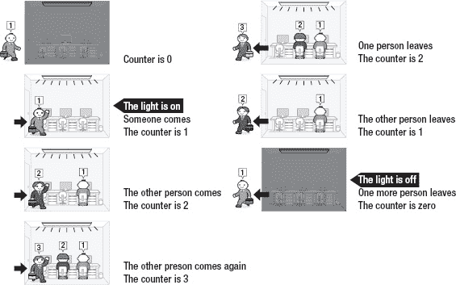
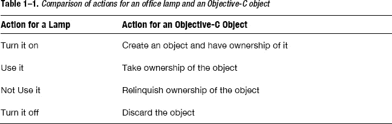
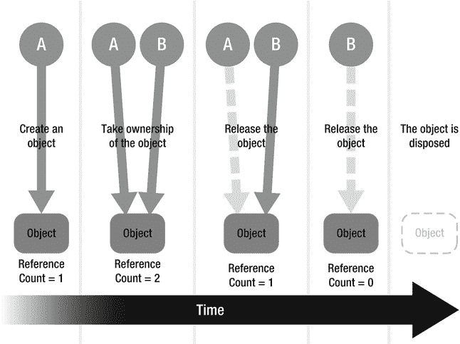
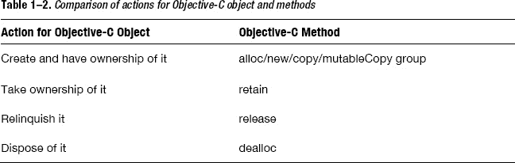
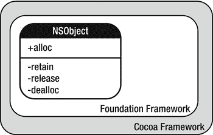

# 自动引用计数的前世今生

OSX Lion 和 iOS5 现在提供了一种名为自动引用计数（Automatic Reference Counting，ARC）的应用程序内存管理机制。简而言之，`ARC`将内存管理工作从程序员转移给了编译器，这通常会显著提升性能。

在第 2 章和第 3 章中，您将了解到`ARC`的强大之处。但在进入这个理想世界之前，最好先回顾一下非`ARC`环境下内存管理的基础知识。通过这样做，您将更深入地理解`ARC`所提供的便利，并在接下来两章深入探讨`ARC`时打下更坚实的基础。

我们从内存管理及其概念的概述开始，然后介绍诸如`alloc`、`dealloc`和`autorelease`等功能的实现。

## 引用计数内存管理概述

在`Objective-C`的许多情况下，我们可以将“内存管理”重新表述为“引用计数”。内存管理意味着程序员在程序需要时分配一块内存区域，并在程序不再需要时释放它。未被正确释放的不需要的内存区域会浪费资源，也可能导致应用程序崩溃。引用计数由乔治·E·柯林斯（George E. Collins）于 1960 年发明，用于简化内存管理。

为了说明什么是引用计数，让我们以办公室里的灯为例进行类比（图 1–1）。

**图 1–1.** *办公室里的灯*

假设办公室里只有一盏灯。早上，当有人进入办公室时，他因为需要而打开灯。当他离开办公室时，他不再需要灯，所以关掉它。如果多个人在进出时都开关灯会发生什么？每当有人离开时，他就关掉灯，这意味着即使其他人还在工作，办公室也会变暗（图 1–2）。

**图 1–2.** *灯的问题*

为了解决这个问题，我们需要一些规则来确保当有一个人或多个人在场时灯是亮着的，只有当没人在场时灯才关闭。

1.  当有人进入空办公室时，她打开灯。
2.  随后进入房间的人也要使用这盏灯。
3.  当有人离开时，此人不再需要这盏灯。
4.  当最后一个人离开时，他关掉灯。

为了遵守这些规则，我们引入一个计数器来了解有多少人。让我们看看它是如何工作的。

1.  当有人进入空办公室时，计数器 +1。它从零变成一。于是灯打开。
2.  当另一个人进入时，计数器 +1；例如，它从一变成二。
3.  当有人离开时，计数器 –1；例如，它从二变成一。
4.  当最后一个人离开时，计数器变为零，因此灯关闭。

如图 1–3 所示，通过计数器我们可以正确控制灯。只有在所有人都离开时灯才关闭。

**图 1–3.** *管理办公室的灯*

让我们看看这个比喻如何帮助我们理解内存管理。在`Objective-C`中，灯对应于一个对象。虽然办公室只有一盏灯，但在`Objective-C`中我们可以拥有许多对象，直至计算机资源的限制。

每个人对应于`Objective-C`的每个上下文。上下文用于表示一段程序代码、一个变量、一个变量作用域或一个对象。它意味着某种处理目标对象的东西。表 1–1 突出了办公室灯与`Objective-C`中对象的关系。

正如我们可以用计数器管理灯一样，我们可以在`Objective-C`中管理应用程序内存。换句话说，我们可以通过引用计数来管理`Objective-C`的对象，如图 1–4 所示。

**图 1–4.** *使用引用计数进行内存管理*

此图说明了引用计数内存管理的概念。在接下来的部分中，我们将深入探讨这个概念并给出一些例子。

## 进一步探索内存管理

对于引用计数，您可能认为需要记住引用计数器本身的值或什么引用了对象等等。但您不应该这样想。相反，您应该按照以下规则来思考引用计数。

*   您拥有您创建的任何对象的所有权。
*   您可以使用`retain`获取对象的所有权。
*   当不再需要时，您必须放弃您拥有的对象的所有权。
*   您绝不能放弃您不拥有的对象的所有权。

以上是引用计数的所有规则。您所需要做的就是遵循这些规则。您无需再担心引用计数器。

规则中的“创建”、“获取所有权”和“放弃所有权”以及“释放”是引用计数中非常常见的短语。表 1–2 显示了这些短语如何对应于`Objective-C`方法。

基本上，您`alloc`一个对象，在某个时刻`retain`它，然后为您发送的每个`alloc`/`retain`发送一个`release`。当对象即将从内存中移除时，会调用其`dealloc`方法。

**注意：** 如果您使用了一次`alloc`然后又`retain`了一次，那么您需要`release`两次。

这些方法不是由`Objective-C`语言本身提供的。它们是作为`Cocoa`框架一部分的`Foundation`框架的特性。在`Foundation`框架中，`NSObject`拥有一个类方法`alloc`和实例方法`retain`、`release`和`dealloc`来处理内存管理（图 1–5）。关于如何实现这一点，将在后面的“实现`alloc`、`retain`、`release`和`dealloc`”部分中展示。

**图 1–5.** *`Cocoa`框架、`Foundation`框架和`NSObject`类的关系*

让我们逐一研究每条规则。

