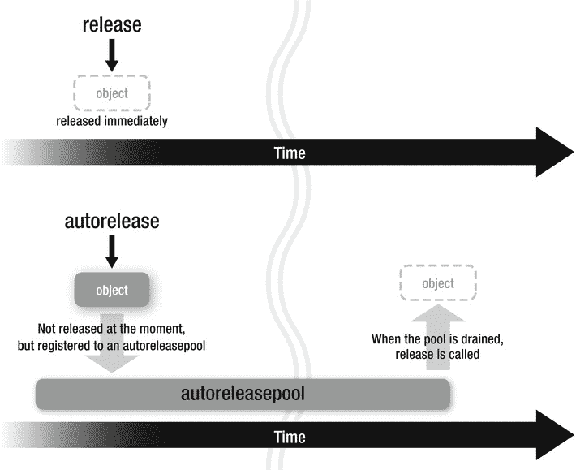

# 不再需要时，你必须放弃你所拥有的对象的所有权

当你拥有一个对象的所有权，但不再需要它时，你必须通过调用 `release` 方法来放弃所有权。

```
/*
 * 你创建一个对象并拥有所有权。
 */

id obj = [[NSObject alloc] init];

/*
 * 现在你拥有了该对象的所有权。
 */

[obj release];

/*
 * 对象的所有权已被释放。
 *
 * 虽然变量 obj 还持有指向该对象的指针，
 * 但你不能继续访问该对象了。
 */
```

在上面的例子中，通过 `alloc` 创建对象并获取所有权后，你通过 `release` 方法释放了它。对于通过 `retain` 获取所有权的对象，你可以执行类似的操作，如下所示。

## 放弃 retain 对象的所有权

```
/*
 * 获取一个对象，而不自行创建或拥有所有权
 */

id obj = [NSMutableArray array];

/*
 * 获取的对象存在，但你对其没有所有权。
 */

[obj retain];

/*
 * 现在你拥有了该对象的所有权。
 */

[obj release];

/*
 *  对象的所有权已被释放。
 * 你不能继续访问该对象了。
 */
```

无论是在以下哪种情况：通过调用 `alloc`/`new`/`copy`/`mutableCopy` 方法组创建对象并拥有所有权，还是通过调用 `retain` 方法拥有所有权，当你拥有一个对象的所有权时，都必须使用 `release` 方法放弃所有权。

接下来，让我们看看一个方法如何返回一个已创建的对象。

## 放弃 retain 对象的所有权

下面的示例展示了一个方法如何返回一个已创建的对象。

```
- (id)allocObject
{
      /*
       * 你创建一个对象并拥有所有权。
       */
    
    id obj = [[NSObject alloc] init];
    
     /*
      * 此时，此方法拥有该对象的所有权。
      */
    
    return obj;
}
```

如果一个方法返回了一个它拥有所有权的对象，那么所有权会传递给调用者。另外，请注意，为了归属于 `alloc`/`new`/`copy`/`mutableCopy` 方法组，方法名必须以 `alloc` 开头。

```
/*
 * 获取一个对象，而不自行创建或拥有所有权
 */

id obj1 = [obj0 allocObject];

/*
 * 现在你拥有了该对象的所有权。
 */
```

你调用了 `allocObject` 方法，因为方法名以 `alloc` 开头，这意味着你创建了一个对象并拥有其所有权。

接下来，让我们看看如何实现像 `[NSMutableArray array]` 这样的方法。

## 返回一个不附带所有权的新对象

`[NSMutableArray array]` 方法返回一个新对象，但调用者不获取其所有权。让我们看看如何实现这类方法。

我们不能用 `alloc`/`new`/`copy`/`mutableCopy` 开头来命名这类方法。在下面的例子中，我们使用 `object` 作为方法名。

```
- (id)object
{
    id obj = [[NSObject alloc] init];
    
     /*
      * 此时，此方法拥有该对象的所有权。
      */
    
    [obj autorelease];
    
     /*
      * 对象存在，但你对其没有所有权。
      */
    
    return obj;
}
```

为了实现此类方法，我们像上面那样使用 `autorelease` 方法（参见 图 1-6）。通过调用 `autorelease`，你可以在返回所创建的对象时不附带所有权。自动释放提供了一种机制，可以在对象的生命周期结束时妥善地释放它们。



**图 1-6.** *release 和 autorelease 的区别*

例如，`NSMutableArray` 的类方法 `array` 就是这样实现的。请注意，根据命名规则，该方法名不以 `alloc`/`new`/`copy`/`mutableCopy` 开头。

```
id obj1 = [obj0 object];

/*
 * 获取的对象存在，但你对其没有所有权。
 */
```

你可以通过 `retain` 方法获取这个自动释放对象的所有权。

```
id obj1 = [obj0 object];
/*
 * 获取的对象存在，但你对其没有所有权。
 */

[obj1 retain];

/*
 * 现在你拥有了该对象的所有权。
 */
```

我将在后面的章节中更详细地解释 `autorelease`。


