# 你必须不能放弃一个你不拥有所有权的对象

如前所述，当你拥有对象的所有权时，你必须通过调用`release`方法来放弃它们。但是，当你通过其他方式获得对象时，绝对不能调用`release`方法。如果你这样做了，应用程序会崩溃。例如，在释放了一个你拥有所有权的对象后，如果你再次释放它，应用程序将会崩溃。

```
/*
 * 你创建了一个对象并拥有其所有权。
 */
id obj = [[NSObject alloc] init];

/*
 * 现在你拥有了该对象的所有权。
 */
[obj release];

/*
 * 对象的所有权已被放弃。
 */
[obj release];

/*
 * 你放弃了一个你不拥有所有权的对象！
 * 应用程序将会崩溃！
 *
 * 在这些情况下应用程序会崩溃：
 * 当你对一个已经被销毁的对象调用 release 方法时。
 * 当你访问一个已经被销毁的对象时。
 */
```

另外，以下是一个释放你不拥有所有权的对象的示例：

```
id obj1 = [obj0 object];

/*
 * 获得的对象存在，但你并不拥有其所有权。
 */
[obj1 release];

/*
 * 你放弃了一个你不拥有所有权的对象！
 * 应用程序迟早会崩溃。
 */
```

如这些示例所示，你绝对不能放弃任何你不拥有所有权的对象。这会导致应用程序崩溃。

我们已经学习了四条规则，这些就是你在引用计数内存管理中需要考虑的全部内容。接下来，我们将学习`alloc`、`retain`、`release`和`dealloc`是如何实现的以及它们的工作原理。

## 实现 alloc、retain、release 和 dealloc

OS X 和 iOS 的许多部分在 Apple Open Source 中以开源软件的形式公开。如上所述，`alloc`、`retain`、`release`和`dealloc`是 Cocoa Framework 中 Foundation Framework 内的`NSObject`类的方法。不幸的是，Foundation Framework 不是 Apple Open Source 的一部分。幸运的是，由于 Core Foundation Framework 是 Apple Open Source 的一部分，因此从`NSObject`使用的内存管理源代码是公开的。但是，如果没有`NSObject`本身的实现，就很难看到全貌。因此，让我们从 GNUstep 查看一个替代源代码。

GNUstep 是与 Cocoa Framework 兼容的实现。虽然我们不能期望它与 Apple 的实现完全相同，但它以相同的方式工作，并且实现应该类似。理解 GNUstep 的源代码有助于我们推测 Apple 的 Cocoa 实现。

### `alloc`方法

让我们从 GNUstep 中`NSObject`类的`alloc`方法开始。作为旁注，本书中的一些源代码可能已经被修改以明确重要部分。

`NSObject`类的`alloc`方法被调用如下：

```
id obj = [NSObject alloc];
```

`alloc` 在 `NSObject.m` 中的实现如 [Listing 1–1] 所示。

**Listing 1–1.** *GNUstep/modules/core/base/Source/NSObject.m alloc*

```
+ (id) alloc
{
    return [self allocWithZone: NSDefaultMallocZone()];
}

+ (id) allocWithZone: (NSZone*)z
{
    return NSAllocateObject (self, 0, z);
}
```

在`allocWithZone:`方法内部，通过`NSAllocateObject`函数分配一个对象。实现如 [Listing 1–2] 所示。

__________

¹ Apple, “Apple open source,” [`http://opensource.apple.com/`](http://opensource.apple.com/)

² GNUstep, “GNUstep.org,” [`http://gnustep.org/`](http://gnustep.org/)

**Listing 1–2.** *GNUstep/Modules/Core/Base/Source/NSObject.m NSAllocateObject*

```
struct obj_layout {
    NSUInteger  retained;
};

inline id
NSAllocateObject (Class aClass, NSUInteger extraBytes, NSZone *zone)
{
    int size = /* 存储对象所需的尺寸 */
    id new = NSZoneMalloc(zone, size);
    memset(new, 0, size);
    new = (id)&((struct obj_layout *)new)[1];
}
```

`NSAllocateObject`函数调用`NSZoneMalloc`来分配一个内存区域。之后，该区域被填充为零，并返回该区域的指针。

**注意：** 最初，`NSZone`用于防止内存碎片化（[Figure 1–7]）。通过在不同情况下切换区域，内存分配可以更有效。

但如今，正如你在“Transition to ARC Release Notes”中所看到的，Objective-C 运行时只是忽略了区域。因为近期的运行时内存管理算法已经足够有效，由于复杂性，使用区域被认为没有意义或不值得。

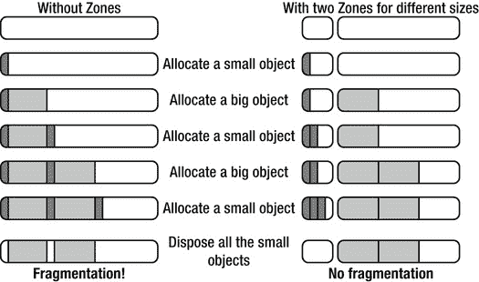

**Figure 1–7.** *使用多个区域防止碎片化。*

通过移除与`NSZone`相关的代码，`alloc`方法可以简单地重写为 [Listing 1–3] 所示。

__________

³ Apple, “Transition to ARC Release Notes.”, [`http://developer.apple.com/library/mac/#releasenotes/ObjectiveC/RN-TransitioningToARC/_index.html`](http://developer.apple.com/library/mac/#releasenotes/ObjectiveC/RN-TransitioningToARC/_index.html)

**Listing 1–3.** *GNUstep/modules/core/base/Source/NSObject.m alloc 简化版*

```
struct obj_layout {
    NSUInteger  retained;
};

+ (id) alloc
{
    int size = sizeof(struct obj_layout) + size_of_the_object;
    struct obj_layout *p = (struct obj_layout *)calloc(1, size);
    return (id)(p + 1);
}
```

现在你已经理解了`alloc`方法的工作原理，让我们继续学习`retain`。


#### `retain` 方法

`alloc` 方法返回一个用零填充的内存块，其中包含一个 `struct obj_layout` 头部，该头部有一个变量 `retained` 用于存储引用次数。这个数字被称为引用计数。图 1-8 展示了 GNUstep 实现中对象的结构。

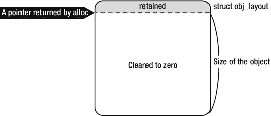

**图 1-8.** *`alloc` 返回的对象的内存映像*

你可以通过调用 `retainCount` 方法获取引用计数的值。

```objectivec
id obj = [[NSObject alloc] init];
NSLog(@"retainCount=%d", [obj retainCount]);

/*
  * 显示 retainCount=1
  */
```

就在 `alloc` 被调用之后，引用计数为 1。下面的源代码展示了在 GNUstep 中 `retainCount` 函数是如何实现的。

**代码清单 1-4.** *GNUstep/Modules/Core/Base/Source/NSObject.m retainCount*

```objectivec
- (NSUInteger) retainCount
{
    return NSExtraRefCount(self) + 1;
}

inline NSUInteger
NSExtraRefCount(id anObject)
{
    return ((struct obj_layout *)anObject)[-1].retained;
}
```

该源代码从对象指针中查找头部，并获取 `retained` 变量的值（图 1-9）。

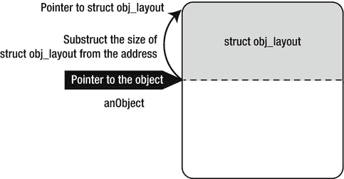

**图 1-9.** *从对象访问头部*

由于内存块在分配时被零填充，因此 `retained` 的值为零。`retainCount` 函数通过 `NSExtraRefCount(self) + 1` 返回 1。我们可以推测，`retain` 或 `release` 方法会通过加 1 或减 1 来修改这个值。

```objectivec
[obj retain];
```

让我们检查一下 `retain` 方法的实现，如代码清单 1-5 所示。

**代码清单 1-5.** *GNUstep/Modules/Core/Base/Source/NSObject.m retain*

```objectivec
- (id) retain
{
    NSIncrementExtraRefCount(self);
    return self;
}

inline void
NSIncrementExtraRefCount(id anObject)
{
    if (((struct obj_layout *)anObject)[-1].retained == UINT_MAX - 1)
        [NSException raise: NSInternalInconsistencyException
            format: @"NSIncrementExtraRefCount() asked to increment too far"];

    ((struct obj_layout *)anObject)[-1].retained++;
}
```

虽然有一些代码行用于在变量 `retained` 溢出时抛出异常，但根本上它是在 `retained++` 这一行上加一。接下来，我们学习功能与 `retained` 方法相反的 `release` 方法。

#### `release` 方法

我们可以轻松猜测到 `release` 方法会包含 `retained--`。同时，当该值变为零时，它也应该包含一些代码。

```objectivec
[obj release];
```

`release` 方法的实现如代码清单 1-6 所示。

**代码清单 1-6.** *GNUstep/Modules/Core/Base/Source/NSObject.m release*

```objectivec
- (void) release
{
    if (NSDecrementExtraRefCountWasZero(self))
    [self dealloc];
}

BOOL
NSDecrementExtraRefCountWasZero(id anObject)
{
    if (((struct obj_layout *)anObject)[-1].retained == 0) {
        return YES;
    } else {
        ((struct obj_layout *)anObject)[-1].retained--;
        return NO;
    }
}
```

正如我们所料，`retained` 被减一。如果该值为零，则对象将通过 `dealloc` 方法被释放。让我们看看 `dealloc` 方法是如何实现的。

#### `dealloc` 方法

代码清单 1-7 是 `dealloc` 方法的实现。

**代码清单 1-7.** *GNUstep/Modules/Core/Base/Source/NSObject.m dealloc*

```objectivec
- (void) dealloc
{
    NSDeallocateObject (self);
}

inline void
NSDeallocateObject(id anObject)
{
    struct obj_layout *o = &((struct obj_layout *)anObject)[-1];
    free(o);
}
```

它只是释放了一个内存块。

我们已经看到了 GNUstep 中 `alloc`、`retain`、`release` 和 `dealloc` 的实现，并了解了以下内容。

- 所有 Objective-C 对象都有一个称为引用计数的整数值。
- 当调用 `alloc`/`new`/`copy`/`mutableCopy` 或 `retain` 之一时，引用计数加一。
- 当调用 `release` 时，它减一。
- 当整数计数器变为零时，会调用 `Dealloc`。

接下来，让我们检查 Apple 的实现。


### Apple 对 `alloc`、`retain`、`release` 和 `dealloc` 的实现

如前所述，`NSObject` 类本身的源代码并未公开。我们通过使用 Xcode 调试器（`lldb`）对 iOS 应用进行调试，来探究其实现方式。首先，在 `NSObject` 的类方法 `alloc` 处设置一个断点，观察调试器中发生的情况。以下是 `alloc` 内部调用的函数列表。

```
+alloc
+allocWithZone:
class_createInstance
calloc
```

`NSObject` 的类方法 `alloc` 会调用 `allocWithZone:`。随后，通过 Objective-C Runtime 参考文档中记载的 `class_createInstance` 函数，调用了 `calloc` 函数来分配内存块。^(4) 这与 GNUstep 的实现似乎没有太大差异。我们可以在 `objc4` 库的 `runtime/objc-runtime-new.mm` 文件中看到 `class_createInstance` 函数的源代码。^(5)

那么 `NSObject` 的实例方法 `retainCount`、`retain` 和 `release` 又是如何实现的呢？以下是它们内部调用的函数。

```
-retainCount
__CFDoExternRefOperation
CFBasicHashGetCountOfKey

-retain
__CFDoExternRefOperation
CFBasicHashAddValue

-release
__CFDoExternRefOperation
CFBasicHashRemoveValue
```

__________

⁴ Apple，“Objective-C Runtime Reference”，[`http://developer.apple.com/library/mac/#documentation/Cocoa/Reference/ObjCRuntimeRef/Reference/reference.html`](http://developer.apple.com/library/mac/#documentation/Cocoa/Reference/ObjCRuntimeRef/Reference/reference.html)

⁵ Apple，“Source Browser”，[`http://www.opensource.apple.com/source/objc4/`](http://www.opensource.apple.com/source/objc4/)

（此外，当 `CFBasicHashRemoveValue` 返回 0 时，`-dealloc` 也会被调用。）

在上述所有方法中，都调用了 `__CFDoExternRefOperation` 函数。然后该函数会调用名称相似的函数。这些函数是公开的。如你所见，如果函数名以 `CF` 开头，你可以在 Core Foundation 框架中找到其源代码。^(6) 以下代码清单 1-8 是 `CFRuntime.c` 中简化后的 `__CFDoExternRefOperation` 实现。

**清单 1-8.** *CF/CFRuntime.c `__CFDoExternRefOperation`*

```
int __CFDoExternRefOperation(uintptr_t op, id obj) {
    CFBasicHashRef table = get hashtable from obj;
    int count;

    switch (op) {
    case OPERATION_retainCount:
        count = CFBasicHashGetCountOfKey(table, obj);
        return count;

    case OPERATION_retain:
        CFBasicHashAddValue(table, obj);
        return obj;

    case OPERATION_release:
        count = CFBasicHashRemoveValue(table, obj);
        return 0 == count;
    }
}
```

`__CFDoExternRefOperation` 函数是一个分发器，它为 `retainCount`、`retain` 或 `release` 调用不同的函数。我们可以推测这些方法的实现如下所示。

```
- (NSUInteger) retainCount
{
    return (NSUInteger)__CFDoExternRefOperation(OPERATION_retainCount, self);
}

- (id) retain
{
    return (id)__CFDoExternRefOperation(OPERATION_retain, self);
}

- (void) release
{
    return __CFDoExternRefOperation(OPERATION_release, self);
}
```

__________

⁶ Apple，“Source Browser”，[`http://www.opensource.apple.com/source/CF/`](http://www.opensource.apple.com/source/CF/)

如上面的 `__CFDoExternRefOperation` 函数所示，Apple 的实现似乎通过一个哈希表（引用计数表）来处理引用计数，如图 1-10 所示。

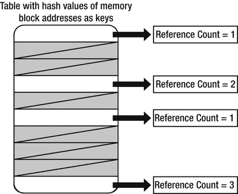

**图 1-10**. *使用哈希表管理引用计数*

在 GNUstep 的实现中，引用计数位于每个对象内存块的头部。但在 Apple 的实现中，所有引用计数都存储在哈希表的条目中。尽管 GNUstep 的实现看起来更简单、更快，但 Apple 的实现也有其优点。

如果将引用计数存储在对象头部（如 GNUstep 的实现），其优点如下：

*   代码量更少。
*   生命周期管理非常简单，因为引用计数本身的内存区域就包含在对象的内存区域中。

那么，如果像 Apple 那样将引用计数存储在哈希表中，又有哪些优点呢？

*   每个对象没有头部信息，因此无需担心头部区域的对齐问题。
*   通过遍历哈希表条目，可以访问每个对象的内存块。

后者对于调试尤其有用。当某些对象的内存区域损坏而哈希表仍然存在时，调试器可以访问这些对象的指针（图 1-11）。

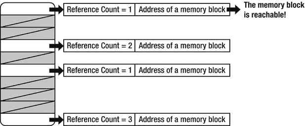

**图 1-11.** *在引用计数表中查找对象*

此外，为了检测内存泄漏，Instruments 工具会检查哈希表的条目，以确定是否有人拥有每个对象的所有权。

以上就是关于 Apple 实现的介绍。现在我们对 Apple 的实现方式有了更好的理解，还需要学习关于 Objective-C 内存管理的另一个知识点：自动释放池（autorelease）。

### 自动释放池

鉴于其名称，你可能会认为 `autorelease` 类似于 ARC。但事实并非如此。它更像是 C 语言中的“自动变量”。^(7)

让我们先回顾一下 C 语言中的自动变量是什么。然后，我们将查看 GNUstep 的源代码，以了解 `autorelease` 的工作原理，接着再介绍 Apple 对 `autorelease` 的实现。


### 自动变量

*自动变量*是一种词法作用域变量，当执行流程离开其作用域时，会被自动销毁。

```
{
    int a;
}
```

```
/*
   * 由于变量作用域已离开，
   * 自动变量 'int a' 被销毁，无法再访问。
   */
```

使用 `autorelease`，你可以像操作自动变量一样使用对象，这意味着当执行流程离开代码块时，会自动对该对象调用 `release` 方法。你也可以自行控制代码块本身。

__________

⁷ 维基百科，“自动变量”，[`en.wikipedia.org/wiki/Automatic_variable`](http://en.wikipedia.org/wiki/Automatic_variable)

以下步骤和图 1-12 展示了如何使用 `autorelease` 实例方法。

1.  创建一个 `NSAutoreleasePool` 对象。
2.  对已分配的对象调用 `autorelease`。
3.  销毁 `NSAutoreleasePool` 对象。

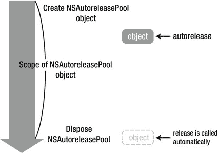

**图 1-12.** *NSAutoreleasePool 对象的生命周期*

从创建 `NSAutoreleasePool` 对象到销毁它之间的代码块，等价于 C 语言中的变量作用域。当 `NSAutoreleasePool` 对象被销毁时，会自动对所有已自动释放的对象调用 `release` 方法。部分示例源代码如下。

```
NSAutoreleasePool *pool = [[NSAutoreleasePool alloc] init];
id obj = [[NSObject alloc] init];
[obj autorelease];
[pool drain];
```

在上述源代码的最后一行，`[pool drain]` 将会执行 `[obj release]`。

在 Cocoa 框架中，`NSAutoreleasePool` 对象会在各处被创建、持有或销毁，例如在应用的主循环 `NSRunLoop` 中（图 1-13）。因此，你通常不需要显式地使用 `NSAutoreleasePool` 对象。

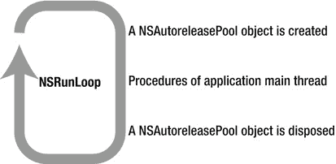

**图 1-13.** *在 NSRunLoop 中，每次都会创建和销毁一个 NSAutoreleasePool 对象。*

但是，当自动释放的对象过多时，应用程序的内存会变得紧张（图 1-14）。这是因为这些对象会一直存在，直到 `NSAutoreleasePool` 对象被销毁。一个典型的例子是加载并调整大量图片大小。届时，许多自动释放的对象，比如用于读取文件的 `NSData` 对象、表示数据的 `UImage` 对象以及调整大小后的图片，会同时存在。

```
for (int i = 0; i < numberOfImages; ++i) {
    /*
      * 处理图片，例如加载等。
      * 由于 NSAutoreleasePool 对象未被销毁，
      * 存在过多自动释放的对象。
      * 到某个时刻，会导致内存不足。
      */
}
```
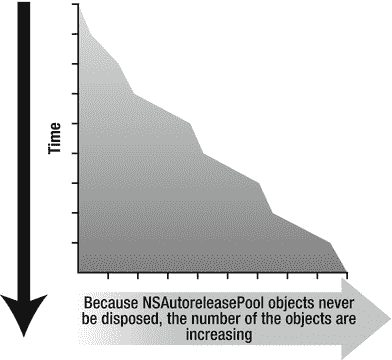

**图 1-14.** *自动释放对象数量不断增长*

在这种情况下，你应该在适当的时机自行显式地创建并销毁一个 `NSAutoreleasePool` 对象（图 1-15）。

```
for (int i = 0; i < numberOfImages; ++i) {
    NSAutoreleasePool *pool = [[NSAutoreleasePool alloc] init];

    /*
      * 加载图片等。
      * 存在过多自动释放的对象。
      */

    [pool drain];

    /*
      * 所有自动释放的对象都通过 [pool drain] 被释放。
      */
}
```
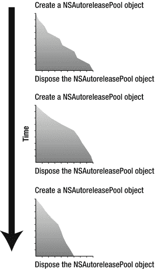

**图 1-15.** *自动释放的对象应被妥善释放。*

在 Cocoa 框架中，你会看到许多类方法会返回自动释放的对象，例如 `NSMutableArray` 类的 `arrayWithCapacity` 方法。

```
id array = [NSMutableArray arrayWithCapacity:1];
```

上述源代码等价于：

```
id array = [[[NSMutableArray alloc] initWithCapacity:1] autorelease];
```

### 实现 autorelease

在本节中，我们将像之前讨论 `alloc`、`retain`、`release` 和 `dealloc` 的实现那样，讨论 GNUstep 中 `autorelease` 的实现，以深入了解其工作原理。

```
[obj autorelease];
```

这行源代码调用了 `NSObject` 的实例方法 `autorelease`。代码清单 1-9 展示了 `autorelease` 方法的实现。

**代码清单 1-9.** *GNUstep/Modules/Core/Base/Source/NSObject.m 中的 autorelease*

```
- (id) autorelease
{
    [NSAutoreleasePool addObject:self];
}
```

实际上，`autorelease` 只是调用了 `NSAutoreleasePool` 的类方法 `addObject`。在 GNUstep 中，其实现略有不同，但这只是出于优化目的，如下所示。

**关于 Objective-C 方法调用的优化**

在 GNUstep 中，`autorelease` 方法出于优化目的以一种非常规方式实现。由于在 iOS 和 OSX 应用中 `autorelease` 的调用非常频繁，它拥有一种称为 IMP 缓存的特殊机制。当框架初始化时，它会缓存一些查询结果，例如函数指针以及类和方法的名称解析。如果没有这种机制，每次调用 `autorelease` 时都需要执行这些过程。

```
id autorelease_class = [NSAutoreleasePool class];
SEL autorelease_sel = @selector(addObject:);
IMP autorelease_imp = [autorelease_class methodForSelector: autorelease_sel];
```

当方法被调用时，它仅返回一个缓存值。

```
- (id) autorelease
{
    (*autorelease_imp)(autorelease_class, autorelease_sel, self);
}
```

以上是使用 IMP 缓存的方法调用。如果没有 IMP 缓存，它可以重写为如下形式。尽管速度取决于具体环境，但使用缓存机制大约可以快两倍。

```
- (id) autorelease
{
    [NSAutoreleasePool addObject:self];
}
```

让我们来看看 `NSAutoreleasePool` 类的实现。代码清单 1-10 是 `NSAutoreleasePool` 中简化后的源代码。

**代码清单 1-10.** *GNUstep/Modules/Core/Base/Source/NSAutoreleasePool.m 中的 addObject*

```
+ (void) addObject: (id)anObj
{
    NSAutoreleasePool *pool = 获取当前活跃的 NSAutoreleasePool;
    if (pool != nil) {
        [pool addObject:anObj];
    } else {
        NSLog(@"在没有活跃的 NSAutoreleasePool 的情况下调用了 autorelease。");
    }
}
```

类方法 `addObject` 对活跃的 `NSAutoreleasePool` 对象调用其实例方法 `addObject`。在下一个例子中，变量 `pool` 就是活跃的 `NSAutoreleasePool` 对象。

```
NSAutoreleasePool *pool = [[NSAutoreleasePool alloc] init];
id obj = [[NSObject alloc] init];
[obj autorelease];
```

当创建了多个嵌套的 `NSAutoreleasePool` 对象时，最内层的对象变为活跃状态。在下一个例子中，`pool2` 是活跃的。

```
NSAutoreleasePool *pool0 = [[NSAutoreleasePool alloc] init];

    NSAutoreleasePool *pool1 = [[NSAutoreleasePool alloc] init];

        NSAutoreleasePool *pool2 = [[NSAutoreleasePool alloc] init];

        id obj = [[NSObject alloc] init];
        [obj autorelease];

        [pool2 drain];

    [pool1 drain];

[pool0 drain];
```

接下来，让我们也看看 `NSAutoreleasePool` 实例方法 `addObject` 的实现（代码清单 1-11）。

**代码清单 1-11.** *GNUstep/Modules/Core/Base/Source/NSAutoreleasePool.m 中的 addObject*

```
- (void) addObject: (id)anObj
{
    [array addObject:anObj];
}
```

它将对象添加到一个可变数组中。在原始的 GNUstep 实现中，使用的是链表而非数组。无论如何，对象都被存储在一个容器中，这意味着当调用 `NSObject` 的实例方法 `autorelease` 时，该对象会被添加到活跃的 `NSAutoreleasePool` 对象的容器中。

```
[pool drain];
```

接下来，让我们看看当调用 `drain` 时，活跃的 `NSAutoreleasePool` 对象是如何被销毁的（代码清单 1-12）。

**代码清单 1-12.** *GNUstep/Modules/Core/Base/Source/NSAutoreleasePool.m 中的 drain*

```
- (void) drain
{
    [self dealloc];
}

- (void) dealloc
{
    [self emptyPool];
    [array release];
}

- (void) emptyPool
{
    for (id obj in array) {
        [obj release];
    }
}
```

我们可以看到，池中的所有对象都被调用了 `release` 方法。


#### Apple 对 `autorelease` 的实现

我们可以在 `objc4` 库的 `runtime/objc-arr.mm` 文件中看到 Apple 对 `autorelease` 的实现。其源码如代码清单 1–13 所示。

**代码清单 1–13.** *`objc4/runtime/objc-arr.mm` 中的 `AutoreleasePoolPage` 类*

```
class AutoreleasePoolPage
{
    static inline void *push()
    {
        /* 对应 NSAutoreleasePool 对象的创建和所有权获取 */
    }

    static inline void pop(void *token)
    {
        /* 对应 NSAutoreleasePool 对象的释放 */
        releaseAll();
    }

    static inline id autorelease(id obj)
    {
        /* 对应 NSAutoreleasePool 的类方法 addObject: */
        AutoreleasePoolPage *autoreleasePoolPage = /* 获取当前活跃的 AutoreleasePoolPage 对象 */
        autoreleasePoolPage->add(obj);
    }

    id *add(id obj)
    {
        /* 将 obj 添加到内部数组; */
    }

    void releaseAll()
    {
        /* 对内部数组中所有对象调用 release */
    }
};

void *objc_autoreleasePoolPush(void)
{
    return AutoreleasePoolPage::push();
}

void objc_autoreleasePoolPop(void *ctxt)
{
    return AutoreleasePoolPage::pop(ctxt);
}

id objc_autorelease(id obj)
{
    return AutoreleasePoolPage::autorelease(obj);
}
```

这些函数和 `AutoreleasePoolPage` 类是通过 C++ 类和动态数组实现的。这些函数似乎与 GNUstep 中的实现方式相同。正如我们之前使用调试器所做的那样，我们探究在 `autorelease` 和 `NSAutoreleasePool` 类方法中调用了哪些函数。这些方法会调用与 `autorelease` 相关的 `objc4` 函数：

```
NSAutoreleasePool *pool = [[NSAutoreleasePool alloc] init];
/* 等同于 objc_autoreleasePoolPush() */

id obj = [[NSObject alloc] init];

[obj autorelease];
/* 等同于 objc_autorelease(obj) */

[pool drain];
/* 等同于 objc_autoreleasePoolPop(pool) */
```

顺便提一下，在 iOS 中，`NSAutoreleasePool` 类有一个方法用来检查已被 `autorelease` 的对象的当前状态。该方法 `showPools` 会将 `NSAutoreleasePool` 的当前状态输出到控制台。因为它是一个私有方法，所以只能用于调试目的。你可以这样使用它：

```
[NSAutoreleasePool showPools];
```

在最新的 Objective-C 运行时环境中，由于 `showPools` 方法只能在 iOS 中工作，因此提供了 `_objc_autoreleasePoolPrint()` 方法来替代它。该方法也是一个私有方法，因此你也只能将其用于调试目的。

```
/* 声明函数 */
extern void _objc_autoreleasePoolPrint();

/* 用于调试：显示 autoreleasepool 状态 */
_objc_autoreleasePoolPrint();
```

然后你就可以看到 `AutoreleasePoolPage` 的状态。结果如下所示：

```
objc[14481]: ##############
objc[14481]: AUTORELEASE POOLS for thread 0xad0892c0
objc[14481]: 14 releases pending.
objc[14481]: [0x6a85000]  ................  PAGE  (hot) (cold)
objc[14481]: [0x6a85028]  ################  POOL 0x6a85028
objc[14481]: [0x6a8502c]         0x6719e40  __NSCFString
objc[14481]: [0x6a85030]  ################  POOL 0x6a85030
objc[14481]: [0x6a85034]         0x7608100  __NSArrayI
objc[14481]: [0x6a85038]         0x7609a60  __NSCFData
objc[14481]: [0x6a8503c]  ################  POOL 0x6a8503c
objc[14481]: [0x6a85040]         0x8808df0  __NSCFDictionary
objc[14481]: [0x6a85044]         0x760ab50  NSConcreteValue
objc[14481]: [0x6a85048]         0x760afe0  NSConcreteValue
objc[14481]: [0x6a8504c]         0x760b280  NSConcreteValue
objc[14481]: [0x6a85050]         0x760b2f0  __NSCFNumber
objc[14481]: [0x6a851a8]  ################  POOL 0x6a851a8
objc[14481]: [0x6a851ac]         0x741d1e0  Test
objc[14481]: [0x6a851b0]         0x671c660  NSObject
objc[14481]: ##############
```

了解某些对象是否已被 `autorelease` 是非常有用的，如下面的侧边栏所述。

**将 AUTORELEASE 发送给 NSAUTORELEASEPOOL 对象**

问题：如果对 `NSAutoreleasePool` 对象调用 `autorelease` 会发生什么？

```
NSAutoreleasePool *pool = [[NSAutoreleasePool alloc] init];
[pool autorelease];
```

答案：应用程序将会被终止。

```
*** Terminating app due to uncaught exception 'NSInvalidArgumentException'
reason: '*** -[NSAutoreleasePool autorelease]:
Cannot autorelease an autorelease pool'
```

当在 Foundation 框架中使用 Objective-C 调用 `autorelease` 时，绝大多数情况下会调用 `NSObject` 的实例方法。然而，`NSAutoreleasePool` 类重写了 `autorelease` 方法，以便在自动释放池对象上调用 `autorelease` 时显示一个错误。

### 小结

在本章中，你已经学习了以下内容。

*   引用计数内存管理的概念
*   `alloc`、`retain`、`release` 和 `dealloc` 方法是如何实现的
*   `autorelease` 的机制及其实现

这些内容非常重要，即使引入了 ARC，它们仍然适用。在下一章中，我们将学习情况将发生怎样的变化。

## 第 2 章

## ARC 规则

在上一章中，我们回顾了非 ARC 环境中 Objective-C 的内存管理。但是当启用 ARC 时会发生什么呢？本章探讨了采用 ARC 时所引发的变化。在第 1 章中简要介绍了自动引用计数，但苹果公司自己的表述最能概括其精髓：

> *Objective-C 中的自动引用计数（ARC）将内存管理变成了编译器的工作。通过启用新的 Apple LLVM 编译器中的 ARC，你将永远不需要再输入 `retain` 或 `release`，从而极大地简化了开发过程，同时减少了崩溃和内存泄漏。编译器能够完全理解你的对象，并在每个对象不再被使用时立即释放它，因此应用程序能以一如既往的速度运行，并具有可预测且流畅的性能表现。^(1)*

首先，我们将展示引用计数规则与 ARC 的关系，同时我们将逐一学习 ARC 新引入的所有权修饰符。此外，ARC 还为我们带来了新的属性。最重要的是，我们将学习使你的代码符合 ARC 规范的规则：只需遵循这些规则，你就能有信心地编写 ARC 代码。

## 概述

实际上，引用计数仍然是 ARC 的基础，但是当你遵循本章中解释的规则时，ARC 会帮助引用计数机制自动运行。

事实上，我们可以为每个可编译单元启用或禁用 ARC。例如，如图图 2–1 所示，我们可以为每个源文件启用或禁用 ARC。

__________

¹ Apple, “iOS 5 for developers,” [`http://developer.apple.com/technologies/ios5/`](http://developer.apple.com/technologies/ios5/)

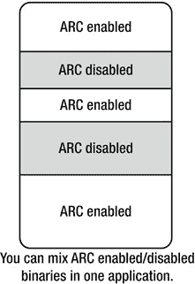

**图 2–1.** *在一个应用程序中针对每个源文件启用或禁用 ARC*

总而言之，ARC 最重要的部分在于，作为开发者的你不再需要调用 `retain` 或 `release`。在以下条件下，你的源代码将会在启用 ARC 的情况下自动编译：

*   `clang` (LLVM 编译器) 3.0 及更新版本
*   编译选项 `-fobjc-arc`

Clang 是默认的编译器，并且在 Xcode 4.2 中 `-fobjc-arc` 选项被设置为默认选项。因此，当你在 Xcode 4.2 中工作时，不需要做任何特殊操作。

从现在开始，所有的源代码都适用于启用了 ARC 的环境。如果源代码是用于非 ARC 环境的，我们将添加注释 `/* non-ARC */`。在下一节中，我们将展示当启用 ARC 时，引用计数机制是如何改变的。


## 引用计数机制的变更

如前所述，引用计数规则如下：

-   你对你创建的任何对象拥有所有权。
-   你可以使用 `retain` 获取一个对象的所有权。
-   当你不再需要某个对象时，必须放弃你对其拥有的所有权。
-   你绝不能放弃你不拥有所有权的某个对象。

即便在启用 ARC 的情况下，这些规则仍然适用。但你需要对源代码进行一些修改。为此，你首先需要理解 ARC 中新增的所有权修饰符。

## 所有权修饰符

在 Objective-C 中，`id` 或每个对象类型都用于表示对象变量类型。

对象类型是 Objective-C 类的指针类型，例如 `NSObject *`。`id` 类型用于隐藏其类名。`id` 等价于 C 语言中的 `void*`。

使用 ARC 时，`id` 和对象类型变量必须具有以下四个所有权修饰符之一：

-   `__strong`
-   `__weak`
-   `__unsafe_unretained`
-   `__autoreleasing`

你需要决定源代码中所有 `id` 和对象类型变量使用哪个所有权修饰符。在本章中，我将逐一解释应如何选择每个修饰符。

### `__strong` 所有权修饰符

`__strong` 所有权修饰符是 `id` 和对象类型的默认修饰符。这意味着以下源代码中的变量 `obj` 被隐式地修饰为 `__strong`。

```
id obj = [[NSObject alloc] init];
```

在没有显式修饰的情况下，`id` 或对象被视为 `__strong`。上述代码等同于：

```
id __strong obj = [[NSObject alloc] init];
```

以下是非 ARC 环境下的相同源代码：

```
/* non-ARC */
id obj = [[NSObject alloc] init];
```

到目前为止，两者没有区别。让我们看下一个例子：

```
{
    id __strong obj = [[NSObject alloc] init];
}
```

这里有意添加了局部变量的作用域。该源代码的非 ARC 版本是：

```
/* non-ARC */
{
    id obj = [[NSObject alloc] init];
    [obj release];
}
```

这意味着在 ARC 环境下，`release` 方法会被自动添加，用于释放创建的对象及其所有权。当控制流离开变量 `obj` 的作用域时，由于变量 `obj` 被 `__strong` 修饰，`release` 方法会被调用。

顾名思义，`__strong` 这个所有权修饰符表示对对象的强引用。当控制流离开变量作用域时，强引用消失，所分配的对象被释放。让我们在源代码中找出所有权状态：

```
{
    id __strong obj = [[NSObject alloc] init];
}
```

这段代码创建了一个对象并拥有其所有权。我们在所有权状态上添加注释：

```
{
     /*
      * 你创建了一个对象并拥有所有权。
      */

    id __strong obj = [[NSObject alloc] init];

      /*
       * 变量 obj 被 __strong 修饰。
       * 这意味着它拥有该对象的所有权。
       */

}

  /*
   * 离开变量 obj 的作用域，其强引用消失。
   * 该对象被自动释放。
   * 因为没有人拥有所有权，所以该对象被销毁。
   */
```

#### 赋值给 `__strong` 修饰的变量

对象的所有权和生命周期非常清晰。接下来，我们看看当你并非自己创建或尚未拥有所有权时获取一个对象会发生什么：

```
{
    id __strong obj = [NSMutableArray array];
}
```

它调用了 `NSMutableArray` 的类方法 `array` 来获取一个对象，但并不是自己创建或拥有其所有权。

```
{
     /*
      * 获取一个对象，并非自己创建或拥有所有权
      */

    id __strong obj = [NSMutableArray array];

     /*
      * 变量 obj 被 __strong 修饰。
      * 这意味着它拥有该对象的所有权。
      */

}
 /*
  * 离开变量 obj 的作用域，其强引用消失。
  * 该对象被自动释放。
  */
```

在这种情况下，对象的所有权和生命周期也非常清晰。当然，你可以在 `__strong` 修饰的变量之间交换值，如下所示：

```
id __strong obj0 = [[NSObject alloc] init];
id __strong obj1 = [[NSObject alloc] init];
id __strong obj2 = nil;
obj0 = obj1;
obj2 = obj0;
obj1 = nil;

obj0 = nil;
obj2 = nil;
```


#### 强引用的工作原理

我们通过带注释的示例来理解强引用的工作原理，如代码清单 2-1 所示。

**代码清单 2-1.** *强引用的工作原理*

```
id __strong obj0 = [[NSObject alloc] init];  /* 对象 A */
/*
 * obj0 持有对对象 A 的强引用
 */

id __strong obj1 = [[NSObject alloc] init];  /* 对象 B */
/*
 * obj1 持有对对象 B 的强引用
 */

id __strong obj2 = nil;
/*
 * obj2 不持有任何引用
 */

obj0 = obj1;
/*
 * obj0 持有对对象 B 的强引用，该引用是从 obj1 赋值而来的。
 * 因此，obj0 不再持有对对象 A 的强引用。
 * 由于没有任何对象拥有对象 A 的所有权，对象 A 被销毁。
 *
 * 此时，obj0 和 obj1 都持有对对象 B 的强引用。
 */

obj2 = obj0;
/*
 * 通过 obj0，obj2 持有对对象 B 的强引用。
 *
 * 此时，obj0、obj1 和 obj2 都持有对对象 B 的强引用。
 */

obj1 = nil;
/*
 * 由于 nil 被赋值给 obj1，对对象 B 的强引用消失。
 *
 * 此时，obj0 和 obj2 持有对对象 B 的强引用。
 */

obj0 = nil;
/*
 * 由于 nil 被赋值给 obj0，对对象 B 的强引用消失。
 *
 * 此时，obj2 持有对对象 B 的强引用。
 */

obj2 = nil;
/*
 * 由于 nil 被赋值给 obj2，对对象 B 的强引用消失。
 * 由于没有任何对象拥有对象 B 的所有权，对象 B 被销毁。
 */
```

如示例（代码清单 2-1）所示，所有权不仅通过变量作用域来妥善管理，还通过变量之间的赋值来管理，这些变量都使用 `__strong` 修饰。当然，`__strong` 修饰符也可以用作 Objective-C 类的成员变量或方法的任意参数，如代码清单 2-2 所示。

**代码清单 2-2.** *成员变量和方法参数的强引用修饰符*

```
@interface Test : NSObject
{
    id __strong obj_;
}
- (void)setObject:(id __strong)obj;
@end

@implementation Test
- (id)init
{
    self = [super init];
    return self;
}

- (void)setObject:(id __strong)obj
{
    obj_ = obj;
}
@end
```

让我们看看如何使用这个类。

```
{
    id __strong test = [[Test alloc] init];
    [test setObject:[[NSObject alloc] init]];
}
```

像往常一样，我们逐行分析并添加一些注释（代码清单 2-3）。

**代码清单 2-3.** *带注释的成员变量和方法参数的强引用修饰符*

```
{
    id __strong test = [[Test alloc] init];

/*
 * test 持有对 Test 对象的强引用
 */

[test setObject:[[NSObject alloc] init]];

 /*
 * 对象的成员变量 obj_
 * 持有对 NSObject 实例的强引用
 */

}
 /*
 * 离开变量 test 的作用域后，其强引用消失。
 * Test 对象被释放。
 * 由于没有任何对象拥有其所有权，它被销毁。
 *
 * 当它被销毁时，
 * 其成员变量 obj_ 所持有的强引用也一并消失。
 * NSObject 对象被释放。
 * 同样因为没有对象拥有其所有权，它被销毁。
 */
```

如上例所示，在类成员和方法参数中使用 `__strong` 所有权修饰符非常方便。在后面的章节中，我将解释如何将其用于类属性。

顺便提一下，所有使用 `__strong`、`__weak` 和 `__autoreleasing` 修饰的变量，都会被初始化为 `nil`。我们通过一个示例来看一下。

```
id __strong obj0;
id __weak obj1;
id __autoreleasing obj2;
```

上述源代码等价于以下代码。

```
id __strong obj0 = nil;
id __weak obj1 = nil;
id __autoreleasing obj2 = nil;
```

正如我们之前所见，Apple 表示你不再需要手动输入 `retain` 或 `release`。请注意，以下关于引用计数的规则仍然适用。

* 你拥有你创建的任何对象的所有权。
* 你可以通过 `retain` 获取对象的所有权。
* 当你不再需要某个对象时，你必须放弃你拥有的该对象的所有权。
* 你绝不能放弃你不拥有所有权的对象的所有权。

前两条规则通过将值赋给 `__strong` 变量来实现。第三条规则通过离开变量作用域、给变量赋值或丢弃包含成员变量的对象来自动实现。最后一条规则非常明确，因为从来不需要手动输入 `release`。因此，所有规则仍然得到满足。

你甚至不需要输入 `__strong`，因为它对于 `id` 和对象类型来说是默认的。只需启用 ARC，这些规则就会自动得到满足。

## `__weak` 所有权修饰符

似乎编译器仅使用 `__strong` 所有权修饰符就能执行内存管理。遗憾的是，情况并非如此，因为有一个大问题无法解决：循环引用 [图 2-2]。以下描述了循环引用是如何发生的。

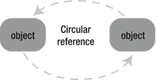

**图 2-2.** *循环引用*


#### 循环引用

本节中的示例展示了循环引用是如何发生的。例如，当一个类的成员变量持有对某个对象的引用时，就会发生这种情况。假设我们有一个如代码清单 2–4 所示的类。

**代码清单 2–4.** *一个可能导致循环引用的类*

```
@interface Test : NSObject
{
    id __strong obj_;
}
- (void)setObject:(id __strong)obj;
@end

@implementation Test
- (id)init
{
    self = [super init];
    return self;
}

- (void)setObject:(id __strong)obj
{
    obj_ = obj;
}
@end
```

我们可以很容易地用这个类产生一个循环引用问题，如代码清单 2–5 所示。

**代码清单 2–5.** *产生循环引用*

```
{
    id test0 = [[Test alloc] init];

    id test1 = [[Test alloc] init];
    [test0 setObject:test1];
    [test1 setObject:test0];
}
```

添加一些注释可以让我们更清晰地分析这个例子（代码清单 2–6）。

**代码清单 2–6.** *带注释的产生循环引用的代码*

```
{
    id test0 = [[Test alloc] init]; /* 对象 A */

     /*
      * test0 持有对象 A 的强引用
      */

    id test1 = [[Test alloc] init]; /* 对象 B */

     /*
      * test1 持有对象 B 的强引用
      */

    [test0 setObject:test1];

     /*
      * 对象 A 的成员变量 obj_ 持有对象 B 的强引用。
      *
      * 此时，对象 A 的 obj_ 和 test1 都持有对象 B 的强引用。
     */

    [test1 setObject:test0];

     /*
      * 对象 B 的成员变量 obj_ 持有对象 A 的强引用。
      *
      * 此时，对象 B 的 obj_ 和 test0 都持有对象 A 的强引用。
      */

}
 /*
  * 离开变量 test0 的作用域，它的强引用消失。
  * 对象 A 被自动释放。
  *
  * 离开变量 test1 的作用域，它的强引用消失。
  * 对象 B 被自动释放。
  *
  * 此时，对象 B 的 obj_ 仍然持有对象 A 的强引用。
  *
  * 此时，对象 A 的 obj_ 仍然持有对象 B 的强引用。
  *
  * 内存泄漏！！
  */
```

图 2–3 说明了这种情况。

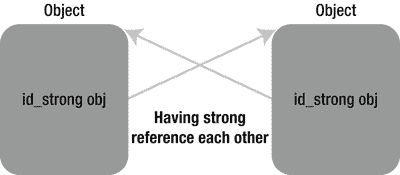

**图 2–3.** *带有类成员变量的循环引用*

循环引用经常导致内存泄漏。内存泄漏意味着一些对象在被认为应该被丢弃后，仍然保留在内存中。

在这个例子中，当控制流离开 `test0` 和 `test1` 的变量作用域时，对象 A 和对象 B 本应被丢弃。此时，它们应该被释放，因为没有人再持有指向这些对象的入口点。但由于循环引用，它们仍然保留在内存中。

#### 自引用

下一个例子展示了即使是一个对象，通过引用自身，也可能产生循环引用。这有时被称为“自引用”，如图 2–4 所示。

```
id test = [[Test alloc] init];
[test setObject:test];
```

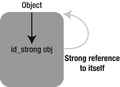

**图 2–4.** *自引用*

如何避免这种情况？既然我们有了 `__strong` 所有权修饰符，你可能已经注意到还有一个 `__weak` 所有权修饰符。通过使用 `__weak` 所有权修饰符，我们可以避免循环引用，如图 2–5 所示。

`__weak` 所有权修饰符提供弱引用。弱引用不拥有对象的所有权。让我们看下一个例子。

```
id __weak obj = [[NSObject alloc] init];
```

变量 `obj` 被 `__weak` 修饰。当编译源代码时，编译器会显示一条警告消息。

```
warning: assigning retained obj to weak variable; obj will be
          released after assignment [-Warc-unsafe-retained-assign]
            id __weak obj = [[NSObject alloc] init];
                      ^     ~~~~~~~~~~~~~~~~~~~~~~~
```

在这个例子中，创建的对象被赋值给一个用 `__weak` 修饰的变量 `obj`。因此，变量 `obj` 持有对该对象的弱引用，这意味着该变量不拥有所有权。由于没有人能获得这个创建对象的所有权，该对象在创建后就会被立即释放。编译器会针对这种情况给出警告。如果你先将对象赋值给一个 `__strong` 变量，警告就会消失，如下所示。

```
{
    id __strong obj0 = [[NSObject alloc] init];
    id __weak obj1 = obj0;
}
```

让我们看看带有所有权状态注释的源代码。

```
{
     /*
      * 你创建了一个对象并拥有它的所有权。
      */

    id __strong obj0 = [[NSObject alloc] init];

     /*
      * 变量 obj0 由 __strong 修饰。
      * 这意味着它拥有该对象的所有权。
      */

    id __weak obj1 = obj0;

     /*
      * 变量 obj1 持有该创建对象的弱引用。
      */

}
 /*
  * 离开变量 obj0 的作用域，它的强引用消失。
  * 该对象被自动释放。
  * 因为没有人拥有所有权，该对象被丢弃。
  */
```

因为 `__weak` 引用不拥有所有权，所以当控制流离开变量作用域时，该对象就会被释放。现在我们知道了应该使用 `__weak` 所有权修饰符来避免循环引用。我们可以将前面的例子重写如下。

```
@interface Test : NSObject
{
    id __weak obj_;
}
- (void)setObject:(id __strong)obj;
@end
```

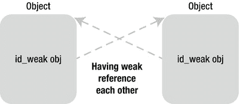

**图 2–5.** *使用 __weak 所有权修饰符避免循环引用*

#### 弱引用自动失效

并且，关于 `__weak` 所有权修饰符，还有一件事你应该知道。当一个变量引用了一个对象，而该对象被丢弃时，弱引用也会自动失效，这意味着该变量会被赋值为 `nil`。让我们通过一个例子来验证（代码清单 2–7）。  

**代码清单 2–7.** *弱引用自动失效*

```
id __weak obj1 = nil;
{
    id __strong obj0 = [[NSObject alloc] init];

    obj1 = obj0;

    NSLog(@"A: %@", obj1);
}

NSLog(@"B: %@", obj1);
```

输出结果是：

```
A: <NSObject: 0x753e180>
B: (null)
```

让我们再次查看带有所有权状态注释的源代码（代码清单 2–8）。

**代码清单 2–8.** *带注释的弱引用自动失效代码*

```
id __weak obj1 = nil;

{
     /*
      * 你创建了一个对象并拥有它的所有权。
      */

    id __strong obj0 = [[NSObject alloc] init];

     /*
      * 变量 obj0 由 __strong 修饰。
      * 这意味着它拥有该对象的所有权。
      */

    obj1 = obj0;

     /*
      * 变量 obj1 持有该对象的弱引用。
      */

    NSLog(@"A: %@", obj0);

     /*
      * 显示变量 obj0 持有强引用的那个对象。
      */

}
 /*
  * 离开变量 obj0 的作用域，它的强引用消失。
  * 该对象被释放。
  * 由于没有人拥有所有权，它被丢弃。
  *
  * 当它被丢弃时，
  * 弱引用被销毁，并且 nil 被赋值给 obj1。
  */

NSLog(@"B: %@", obj1);

 /*
  * 显示 obj1 的值，即 nil。
  */
```

使用 `__weak` 所有权修饰符，我们可以避免循环引用。同时，通过检查 `__weak` 变量是否为 `nil`，我们可以知道对象是仍然存在还是已经被丢弃。

不幸的是，`__weak` 所有权修饰符仅适用于目标为 iOS5（或更高版本）或 OSX Lion（或更高版本）的应用程序。对于目标为更旧环境的应用程序，必须使用 `__unsafe_unretained` 替代。


## `__unsafe_unretained` 所有权修饰符

顾名思义，`__unsafe_unretained` 所有权修饰符是绝对不安全的。通常，由于 ARC 的存在，编译器会执行内存管理。但任何使用 `__unsafe_unretained` 修饰的变量都被排除在此机制之外。因此，你需要手动管理这些变量。

```
id __unsafe_unretained obj = [[NSObject alloc] init];
```

这段代码将一个对象赋值给了一个用 `__unsafe_unretained` 修饰的变量。编译器会显示以下警告信息。

```
warning: assigning retained obj to unsafe_unretained variable;
          obj will be released after assignment [-Warc-unsafe-retained-assign]
        id __unsafe_unretained obj = [[NSObject alloc] init];
                                                      ^     ~~~~~~~~~~~~~~~~~~~~~~~
```

与 `__weak` 一样，`__unsafe_unretained` 变量不拥有对象的所有权。在上述示例中，对象在创建后立即被释放。看起来 `__unsafe_unretained` 和 `__weak` 修饰符的作用似乎相同。你将在下文（清单 2–9）中看到 `__unsafe_unretained` 与 `__weak` 的区别。

**清单 2–9.** `__unsafe_unretained` 修饰符

```
id __unsafe_unretained obj1 = nil;

{
    id __strong obj0 = [[NSObject alloc] init];

    obj1 = obj0;

    NSLog(@"A: %@", obj1);
}

NSLog(@"B: %@", obj1);
```

输出结果为：

```
A: <NSObject: 0x753e180>
B: <NSObject: 0x753e180>
```

像往常一样，我们通过添加注释来重新查看这段源代码（清单 2–10）。

**清单 2–10.** 带注释的 `__unsafe_unretained` 修饰符

```
id __unsafe_unretained obj1 = nil;

{
     /*
      * 你创建了一个对象，并拥有其所有权。
      */

    id __strong obj0 = [[NSObject alloc] init];

     /*
      * 变量 obj0 使用 __strong 修饰。
      * 这意味着它拥有该对象的所有权。
      */

    obj1 = obj0;

     /*
      * 变量 obj1 从变量 obj0 赋值，
      * obj1 既没有强引用也没有弱引用。
      */

    NSLog(@"A: %@", obj1);

     /*
      * 显示 obj1 的值
      */

}
 /*
  * 离开变量 obj0 的作用域后，它的强引用消失。
  * 对象被自动释放。
  * 由于没有人拥有所有权，该对象被丢弃。
  */

NSLog(@"B: %@", obj1);

 /*
  * 显示 obj1 的值
  *
  * obj1 所引用的对象已被丢弃。
  * 这被称为悬垂指针。
  * 非法访问！！
  */
```

虽然最后的 `NSLog` 看起来没问题，但这只是巧合。应用程序可能会在某些条件下崩溃。要将对象赋值给使用 `__unsafe_unretained` 修饰的变量，你必须确保该对象存在，并且已被赋值给某些使用 `__strong` 修饰的变量。我建议你重新考虑需要使用 `__unsafe_unretained` 的原因。你需要完全理解为什么需要它；例如，可能是由于应用程序需要支持 iOS4 或 OS X Snow Leopard，因此你需要用它来代替 `__weak`。此外，你必须确保被赋值的对象在变量的生命周期内始终存在。如果做不到，应用程序将会崩溃，也就没有人会使用你的应用程序了。

## `__autoreleasing` 所有权修饰符

让我们看看 ARC 环境下自动释放是否有什么变化。简单来说，你不能再使用 `autorelease` 方法，也不能再使用 `NSAutoreleasePool` 类。我稍后会结合一些规则来解释。尽管不能直接使用 `autorelease`，但自动释放的机制仍然存在。在没有 ARC 的情况下，我们曾这样使用 `autorelease`：

```
/* 非 ARC 环境 */

NSAutoreleasePool *pool = [[NSAutoreleasePool alloc] init];

id obj = [[NSObject alloc] init];

[obj autorelease];

[pool drain];
```

这段代码可以重写为 ARC 启用环境下的形式：

```
@autoreleasepool {

    id __autoreleasing obj = [[NSObject alloc] init];

}
```

你无需再创建、持有和销毁 `NSAutoreleasePool` 类对象，而是需要将代码包围在 `@autoreleasepool` 块中。无需再调用 `autorelease` 方法，而是需要将对象赋值给使用 `__autoreleasing` 修饰的变量。将对象赋值给 `__autoreleasing` 修饰的变量，等同于在非 ARC 环境下调用 `autorelease`。通过这样做，该对象会被注册到自动释放池中。因此，在启用 ARC 的情况下，你只需使用 `@autoreleasepool` 代替 `NSAutoreleasePool` 类，并使用 `__autoreleasing` 修饰的变量代替 `autorelease` 方法，如图 2–6 所示。

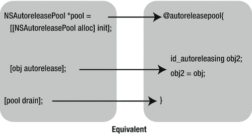

**图 2–6.** `@autoreleasepool` 与使用 `__autoreleasing` 修饰符的变量

但实际上，很少需要显式地写出 `__autoreleasing`。接下来我们看看为什么不需要经常使用 `__autoreleasing`。


#### 编译器自动处理 `__autoreleasing`

要获取一个非自己创建的对象，你需要使用不属于 `alloc`/`new`/`copy`/`mutableCopy` 方法组的方法。这种情况下，该对象会被自动注册到 `autoreleasepool` 中。这与获取一个自动释放的对象是相同的。当一个对象从方法返回时，编译器会检查方法名是否以 `alloc`/`new`/`copy`/`mutableCopy` 开头，如果不是，则返回的对象会自动注册到自动释放池中。有一个例外：任何以 `init` 开头的方法，不会将返回值注册到 `autoreleasepool`。请参见下方关于这条新规则的更多说明：必须遵循与对象创建相关的方法命名规则。

```
@autoreleasepool {
    id __strong obj = [NSMutableArray array];
}
```

让我们看看带有所有权状态注释的源代码。

```
@autoreleasepool {
     /*
      * 获取一个非自己创建的对象，且你不拥有所有权
      */

    id __strong obj = [NSMutableArray array];

     /*
      * 变量 obj 用 __strong 修饰。
      * 这意味着它拥有该对象的所有权。
      * 而该对象已被注册到 autoreleasepool 中，
      * 因为编译器通过检查方法名做出了这一决定。
      */

}
     /*
      * 离开变量 obj 的作用域后，其强引用消失。
      * 该对象被自动释放。
      *
      * 离开 @autoreleasepool 块后，
      * 所有注册在 autoreleasepool 中的对象都会被自动释放。
      *
      * 由于无人拥有所有权，该对象被销毁。
      */
```

如示例所示，即使没有 `__autoreleasing` 修饰符，对象也会被注册到 `autoreleasepool` 中。接下来，让我们看看上述示例中用于获取非自己创建对象的方法的示例实现。

```
+ (id) array
{
    return [[NSMutableArray alloc] init];
}
```

这段代码也没有使用 `__autoreleasing` 修饰符。它也可以写成如下形式。

```
+ (id) array
{

    id obj = [[NSMutableArray alloc] init];

    return obj;

}
```

“`id obj`” 没有修饰符，因此它默认用 `__strong` 修饰。当执行 `return` 语句时，变量作用域结束，强引用消失，因此该对象会被自动释放。在此之前，如果编译器检测到该对象会被传递给调用方，则该对象会被注册到 `autoreleasepool` 中。

下一个示例是关于 `__weak` 所有权修饰符的。如你所知，`__weak` 所有权修饰符用于避免循环引用。当使用带有 `__weak` 修饰符的变量时，该对象总是会被注册到 `autoreleasepool` 中。

```
id __weak obj1 = obj0;
NSLog(@"class=%@", [obj1 class]);
```

上述源代码等价于：

```
id __weak obj1 = obj0;
id __autoreleasing tmp = obj1;
NSLog(@"class=%@", [tmp class]);
```

为什么为了通过 `__weak` 修饰的变量使用对象，需要将其注册到 `autoreleasepool` 中？因为用 `__weak` 修饰的变量没有强引用，对象随时可能被销毁。如果对象被注册到 `autoreleasepool` 中，那么在离开 `@autoreleasepool` 块之前，该对象必然存在。因此，为了安全地通过 `__weak` 变量使用对象，该对象会被自动注册到 `autoreleasepool` 中。

让我们再看最后一个关于隐式 `__autoreleasing` 的示例。如前所述，“`id obj`” 等同于 “`id __strong obj`”。

那么 “`id *obj`” 呢？它等同于 “`id __strong *obj`” 吗？

答案是 “`id __autoreleasing *obj`”。

并且，“`NSObject **obj`” 等同于 “`NSObject * __autoreleasing *obj`”。

任何指向 `id` 或对象类型的指针默认都用 `__autoreleasing` 修饰。

有时，方法会通过 `NSError` 对象的指针类型参数（而非其返回值）来传递错误信息。Cocoa 框架在许多方法中都使用了这种技术，例如 `NSString` 的类方法 `stringWithContentsOfFile:encoding:error`。其用法类似于：

```
NSError *error = nil;
BOOL result = [obj performOperationWithError:&error];
```

该方法的声明是：

```
- (BOOL) performOperationWithError:(NSError **)error;
```

由于指向 `id` 或对象类型的指针默认用 `__autoreleasing` 修饰，因此这个声明等价于：

```
- (BOOL) performOperationWithError:(NSError * __autoreleasing *)error;
```


#### 将结果作为参数返回

以 `NSError` 指针作为参数的方法需要根据结果自行创建 `NSError` 对象。调用者将通过参数获取该对象，这意味着调用者并非通过 alloc/new/copy/mutableCopy 方法组获取它。为遵循内存管理规则，当你并非通过 `alloc`/`new`/`copy`/`mutableCopy` 方法组获取对象时，该对象必须以无所有权的方式传递。通过 `__autoreleasing` 所有权修饰符，这一规则得以满足。

例如，`performOperationWithError` 的实现如下所示。

```
- (BOOL) performOperationWithError:(NSError * __autoreleasing *)error
{
    /* 发生错误。设置 errorCode */

    return NO;
}
```

通过赋值给 `*error`（其类型为 `NSError * __autoreleasing *`），一个对象可以在注册到自动释放池后传递给其调用者。

以下源代码会导致编译错误。

```
NSError *error = nil;
NSError **pError = &error;
```

要赋值对象指针，两个所有权修饰符必须相同。编译器会显示以下错误。

```
error: initializing 'NSError *__autoreleasing *' with an expression
          of type 'NSError *__strong *' changes retain/release properties of pointer
        NSError **pError = &error;
                              ^        ~~~~~~
```

在这种情况下，必须添加 `__strong` 所有权修饰符。

```
NSError *error = nil;
NSError * __strong *pError = &error;
/* 无编译错误 */
```

此规则同样适用于所有其他所有权修饰符。

```
NSError __weak *error = nil;
NSError * __weak *pError = &error;
/* 无编译错误 */
```

```
NSError __unsafe_unretained *unsafeError = nil;
NSError * __unsafe_unretained *pUnsafeError = &unsafeError;
/* 无编译错误 */
```

顺便说一下，在前面的例子中，方法将参数作为对象类型的指针，并使用 `__autoreleasing` 进行限定。

```
- (BOOL) performOperationWithError:(NSError * __autoreleasing *)error;
```

而调用者传递的是使用 `__strong` 限定的对象类型指针。

```
NSError __strong *error = nil;
BOOL result = [obj performOperationWithError:&error];
```

正如我们所见，要交换对象指针，两个变量必须具有相同的限定符。但上述例子并非如此。它是如何工作的呢？以下是编译器处理方式的解释。

```
NSError __strong *error = nil;
NSError __autoreleasing *tmp = error;
BOOL result = [obj performOperationWithError:&tmp];
error = tmp;
```

此外，你也可以像下面这样为对象指针类型显式地声明所有权修饰符。

```
- (BOOL) performOperationWithError:(NSError * __strong *)error;
```

此声明展示了如何在不将对象注册到自动释放池的情况下传递对象。虽然这可行，但你不应该这样做。从调用者的角度来看，要创建一个带所有权的对象，该方法必须属于 alloc/new/copy/mutableCopy 组。如果它不属于该组，调用者应获取一个无所有权的对象。因此，参数应使用 `__autoreleasing` 进行限定。

并且，当你显式使用 `__autoreleasing` 所有权修饰符时，该变量必须是自动变量，例如局部变量或方法/函数的参数。

接下来，让我们进一步了解 `@autoreleasepool`。在非 ARC 环境中，自动释放池的使用方式如下。

```
/* 非 ARC */

NSAutoreleasePool *pool0 = [[NSAutoreleasePool alloc] init];
    NSAutoreleasePool *pool1 = [[NSAutoreleasePool alloc] init];
        NSAutoreleasePool *pool2 = [[NSAutoreleasePool alloc] init];
        id obj = [[NSObject alloc] init];
        [obj autorelease];
        [pool2 drain];
    [pool1 drain];
[pool0 drain];
```

`@autoreleasepool` 块同样可以嵌套。

```
@autoreleasepool {
    @autoreleasepool {
        @autoreleasepool {
            id __autoreleasing obj = [[NSObject alloc] init];
        }
    }
}
```

例如，从 iOS 应用模板生成的应用程序 main 函数，使用 `@autoreleasepool` 块来包含所有应用程序代码。

```
int main(int argc, char *argv[])
{
    @autoreleasepool {
        return UIApplicationMain(argc, argv, nil,
            NSStringFromClass([AppDelegate class]));
    }
}
```

同样地，`NSRunLoop` 拥有自动释放池，用于在每个循环中释放所有对象。此机制在启用和禁用 ARC 的环境中是相同的。顺便说一下，即使在非 ARC 环境中也可以使用 `@autoreleasepool` 块，但必须使用 LLVM 3.0 或更高版本的编译器进行编译。在这种情况下，源代码应如下所示。

```
/* 非 ARC */
@autoreleasepool {
    id obj = [[NSObject alloc] init];
    [obj autorelease];
}
```

我建议即使在非 ARC 环境中也使用 `@autoreleasepool` 而不是 `NSAutoreleasePool`。原因在于，自动释放池的作用域以块的形式编写，因此其可读性要好得多。

此外，`_objc_autoreleasePoolPrint()`（参见 Apple 在第一章中的实现）既可用于启用 ARC 的环境，也可用于禁用 ARC 的环境。

```
_objc_autoreleasePoolPrint();
```

请有效利用它以调试自动释放池中的对象。

### `__strong` 与 `__weak`

`__strong` 和 `__weak` 变量的概念与 C++ 中的智能指针非常相似。它们分别被称为 `std::shared_ptr` 和 `std::weak_ptr`。`std::shared_ptr` 使用引用计数来管理 C++ 类对象的所有权。`std::weak_ptr` 用于避免循环引用。如果将来需要使用 C++，强烈建议使用这些智能指针。

* -1999 `boost::shared_ptr` 成为 Boost C++ 库的一部分

* 2002 `boost::weak_ptr` 被添加到该库

* 2005 `tr1::shared_ptr` 和 `tr1::weak_ptr` 被标准 C++ 库草案 TR1 采纳。在某些环境中，可以使用 `std::shared_ptr` 和 `std::weak_ptr`

* `std::shared_ptr` 和 `std::weak_ptr` 被 C++ 标准 C++11（即 C++0x）采纳

## 规则

为了编写和编译 ARC 的源代码，你需要注意几件事。只需遵循下面列表中的规则，你就可以自信地为 ARC 启用环境编写源代码。

*   忘记使用 `retain`、`release`、`retainCount` 和 `autorelease`。
*   忘记使用 `NSAllocateObject` 和 `NSDeallocateObject`。
*   遵循与对象创建相关的方法命名规则。
*   忘记显式调用 `dealloc`。
*   使用 `@autoreleasepool` 代替 `NSAutoreleasePool`。
*   忘记使用 Zone（`NSZone`）。
*   C 语言中 `struct` 或 `union` 的成员不能是对象类型变量。
*   `id` 和 `void*` 必须进行显式转换。

以下逐条解释这些规则。

### 忘记使用 Retain、Release、RetainCount 或 Autorelease

如你所知，编译器会执行内存管理，因此你不需要调用与内存管理相关的方法，例如 `retain`、`release`、`retainCount` 和 `autorelease`。

苹果公司曾说：

> 通过使用全新的 Apple LLVM 编译器启用 ARC，您将永远不再需要键入 `retain` 或 `release`

但实际上，你**无法**使用它们。当你使用它们时，会发生如下编译错误。

```
error: ARC forbids explicit message send of 'release'
        [o release];
         ^ ~~~~~~~
```

所以，事实上，苹果公司应该说：

“通过使用全新的 Apple LLVM 编译器启用 ARC，您可以忘记过去那些长时间辛苦键入 `retain` 和 `release` 的日子。”

并且，`retainCount` 和 `release` 方法也会导致编译错误，因此以下代码无法与 ARC 一起使用。

```
for (;;) {
    NSUInteger count = [obj retainCount];
    [obj release];
    if (count == 1)
        break;
}
```

这段源代码不符合对引用计数的正确理解。因此，这应该不是问题。总之，`retain`、`release`、`retainCount` 和 `autorelease` 方法只能在非 ARC 环境中使用。


### 忘记使用 `NSAllocateObject` 或 `NSDeallocateObject`

你已知，要创建具有所有权的对象，需要使用 `alloc` 方法。

```
id obj = [NSObject alloc];
```

实际上，正如我们在 GNUstep 的 `alloc` 实现中看到的，在非 ARC 环境中，可以通过调用 `NSAllocateObject` 函数来创建具有所有权的对象。^(2) 使用 ARC 时，`NSAllocateObject` 函数不能使用。它会导致编译错误，就像使用了 `retain` 一样。

```
error: 'NSAllocateObject' is unavailable:
        not available in automatic reference counting mode
```

此外，`NSDeallocateObject` 函数也不能使用。

### 遵循与对象创建相关的方法命名规则

如第 1 章所述，与对象创建相关的方法存在命名规则。

*   `alloc`
*   `new`
*   `copy`
*   `mutableCopy`

当某些方法返回对象时，如果方法名以列表中的词开头，则调用者拥有该对象的所有权。此规则在 ARC 下仍然适用。同时，还增加了一个前缀。

*   `init`

对于任何以 `init` 开头的方法，存在一些比 `alloc/new/copy/mutableCopy` 方法组更严格的规则。

- 该方法必须是实例方法。
- 它必须返回一个对象。
- 返回类型必须是 `id` 类型，或者其类、父类或子类的类型。
- 它与 `alloc/new/copy/mutableCopy` 方法组一样，返回一个没有注册到自动释放池的对象，这意味着调用者拥有所有权。基本上，它初始化由 `alloc` 返回的对象，并返回相同的对象，如下所示。

```
id obj = [[NSObject alloc] init];
```

__________

² Apple, “Foundation Functions Reference,” [`http://developer.apple.com/library/mac/#documentation/Cocoa/Reference/Foundation/Miscellaneous/Foundation_Functions/Reference/reference.html`](http://developer.apple.com/library/mac/#documentation/Cocoa/Reference/Foundation/Miscellaneous/Foundation_Functions/Reference/reference.html)

上述源代码调用了 `alloc` 方法获取一个对象，然后对该对象调用 `init` 方法进行初始化。之后，`init` 方法返回相同的对象。现在，让我们看看其他示例。

```
- (id) initWithObject:(id)obj;
```

这个方法声明符合规则。尽管以下方法也符合命名规则，但它没有返回对象，因此你无法使用。

```
- (void) initThisObject;
```

例外情况是，名为 `initialize` 的方法不包含在此 `init` 组中。因此，你可以像往常一样使用以下方法。

```
- (void) initialize;
```

### 忘记显式调用 `dealloc`

当所有所有权被释放时，对象将被销毁。这与非 ARC 环境中的工作方式相同。当被销毁时，会调用其 `dealloc` 方法。

```
- (void) dealloc
{
     /*
      * 在此处编写需要妥善处理的代码。
      */
}
```

例如，当你使用用 C 编写的库并分配了内存缓冲区时，你需要在 `dealloc` 方法中释放它。

```
- (void) dealloc
{
    free(buffer_);
}
```

在许多情况下，`dealloc` 是从委托或观察者中移除对象的合适位置。

```
- (void) dealloc
{
    [[NSNotificationCenter defaultCenter] removeObserver:self];
}
```

顺便说一下，在非 ARC 环境中，你必须每次都像这样键入 `[super dealloc]`。

```
/* non-ARC */

- (void) dealloc
{
    /* 对该对象执行一些操作。 */

    [super dealloc];
}
```

使用 ARC 时，这会导致编译错误，就像调用 `release` 方法时一样。

```
error: ARC forbids explicit message send of 'dealloc'
        [super dealloc];
         ^     ~~~~~~~
```

你不能显式调用 `[super dealloc]`。它由 ARC 自动完成。你可以忘记一次又一次地键入它。

### 使用 `@autoreleasepool` 代替 `NSAutoreleasePool`

如前一节所述，你必须使用 `@autoreleasepool` 块来代替 `NSAutoreleasePool`。如果你使用 `NSAutoreleasePool` 类，则会发生编译错误。

```
error: 'NSAutoreleasePool' is unavailable:
        not available in automatic reference counting mode
        NSAutoreleasePool *pool = [[NSAutoreleasePool alloc] init];
        ^
```

### 忘记使用 Zone (`NSZone`)

使用 ARC 时，Zone (`NSZone`) 不可用。如前所述（参见“Zone”专栏），无论是否启用 ARC，最近的 Objective-C 运行时（定义了编译器宏 `__OBJC2__` 的环境）都会忽略 zones。

### C 语言的 struct 或 union 中的成员变量不能是对象类型

当你向 C 语言的 `struct` 或 `union` 添加 Objective-C 对象类型的成员变量时，会导致编译错误。

```
struct Data {
    NSMutableArray *array;
};
```

```
error: ARC forbids Objective-C objs in structs or unions
    NSMutableArray *array;
                    ^
```

即使使用 LLVM 编译器 3.0，由于 C 语言规范的限制，也无法管理 C `struct` 的生命周期。^(3) 使用 ARC 时，编译器需要了解并管理对象的生命周期才能执行内存管理。例如，自动变量（局部变量）可以被管理，因为编译器可以将生命周期视为变量的作用域。由于 C `struct` 成员没有此类信息，编译器无法为 C `struct` 执行内存管理。如果你仍然想向 C `struct` 放入一个对象，可以通过将对象转换为 `void *`（参见下一节）或使用 `__unsafe_unretained` 所有权修饰符（参见“所有权修饰符”一节）来实现。

__________

³ LLVM.org “4.3.5. Ownership-qualified fields of structs and unions,” [`http://clang.llvm.org/docs/AutomaticReferenceCounting.html#ownership.restrictions.records`](http://clang.llvm.org/docs/AutomaticReferenceCounting.html#ownership.restrictions.records)

```
struct Data {
        NSMutableArray __unsafe_unretained *array;
    };
```

如前所述，编译器不会管理带有 `__unsafe_unretained` 所有权修饰符的变量。你必须自己管理所有权以避免内存泄漏，否则应用程序会崩溃。

### `id` 和 `void*` 必须显式转换

在非 ARC 环境中，从 `id` 转换为 `void*` 可以正常工作，如下所示。

```
/* non-ARC */
id obj = [[NSObject alloc] init];
void *p = obj;
```

同样，通过从 `void*` 赋值回来的 `id` 变量调用方法也没有问题，如下所示。

```
/* non-ARC */
id o = p;
[o release];
```

但这些源代码在 ARC 下会导致编译错误。

```
error: implicit conversion of an Objective-C pointer
    to 'void *' is disallowed with ARC
        void *p = obj;
                  ^

    error: implicit conversion of a non-Objective-C pointer
        type 'void *' to 'id' is disallowed with ARC
        id o = p;
                ^
```

要在 `id` 或对象类型与 `void*` 之间进行转换，你必须使用一种特殊的转换。仅用于赋值时，你可以使用 `__bridge` 转换。

#### `__bridge` 转换

你可以这样使用 `__bridge` 转换：

```
id obj = [[NSObject alloc] init];

void *p = (__bridge void *)obj;

id o = (__bridge id)p;
```

使用 `__bridge` 转换，你可以将 `id` 转换为 `void*`，反之亦然。但是，将 `__bridge` 转换为 `void*` 甚至比 `__unsafe_unretained` 限定的变量更危险。你必须小心地自己管理对象的所有权，否则会因为悬空指针而崩溃。此外，还有另外两种转换：`__bridge_retained` 和 `__bridge_transfer`。


#### `__bridge_retained` Cast

`__bridge_retained` 转型操作使得被赋值的变量仿佛拥有了对象的所有权。

```
id obj = [[NSObject alloc] init];
void *p = (__bridge_retained void *)obj;
```

上述源代码可以在非 ARC 环境下重写为如下形式。

```
/* non-ARC */

id obj = [[NSObject alloc] init];

void *p = obj;
[(id)p retain];
```

`__bridge_retained` 转型已被 `retain` 所替代。变量 `obj` 和 `p` 都拥有该对象的所有权。让我们看看其他示例。

```
void *p = 0;

{
    id obj = [[NSObject alloc] init];
    p = (__bridge_retained void *)obj;
}

NSLog(@"class=%@", [(__bridge id)p class]);
```

当离开变量 `obj` 的作用域时，其强引用消失，对象被释放。由于变量 `p` 也拥有所有权，因此对象不会被丢弃。我们像往常一样在非 ARC 环境下重写它。

```
/* non-ARC */

void *p = 0;

{
    id obj = [[NSObject alloc] init];
    /* [obj retainCount] -> 1 */

    p = [obj retain];
    /* [obj retainCount] -> 2 */

    [obj release];
    /* [obj retainCount] -> 1 */
}

     /*
      * [(id)p retainCount] -> 1
      * 这意味着，
      * [obj retainCount] -> 1
      * 所以，该对象仍然存在。
      */

NSLog(@"class=%@", [(__bridge id)p class]);
```

相反地，`__bridge_transfer` 转型会在赋值完成后立即释放该对象。

#### `__bridge_transfer` Cast

你可以像这样使用 `__bridge_transfer` 转型：

```
id obj = (__bridge_transfer id)p;
```

这段源代码可以在非 ARC 环境下重写。

```
/* non-ARC */
id obj = (id)p;
[obj retain];
[(id)p release];
```

正如 `__bridge_retained` 转型被替换为 `retain`，`__bridge_transfer` 转型被替换为 `release`。变量 `obj` 被保留了，因为它被 `__strong` 修饰。通过这两种转型，你可以在不使用 `id` 或对象类型变量的情况下创建、拥有和释放任何对象。但这并不推荐。请谨慎使用它们。再看一个例子。

```
void *p = (__bridge_retained void *)[[NSObject alloc] init];
NSLog(@"class=%@", [(__bridge id)p class]);
(void)(__bridge_transfer id)p;
```

这段源代码可以在非 ARC 环境下重写如下。

```
/* non-ARC */

id p = [[NSObject alloc] init];
NSLog(@"class=%@", [p class]);
[p release];
```

这些转型常用于转换 Objective-C 对象和 Core Foundation 对象。

#### Objective-C 对象与 Core Foundation 对象

Core Foundation 对象是用于 Core Foundation 框架的对象。它主要用 C 语言编写，并具有引用计数。在 Core Foundation 框架中，`CFRetain` 和 `CFRelease` 是 Objective-C 在非 ARC 环境下 `retain` 和 `release` 的等效函数。

Core Foundation 对象和 Objective-C 对象之间的差异非常小。或多或少只在于创建方式的不同：要么是使用 Objective-C 的 Foundation 框架（Cocoa）创建，要么是使用 Core Foundation 框架创建。创建之后，它可以透明地在两种框架的方式下使用。例如，即使一个对象是用 Foundation 框架 API 创建的，它也可以用 Core Foundation 框架 API 释放，反之亦然。

实际上，Core Foundation 对象本身和 Objective-C 对象本身之间没有区别。因此，在非 ARC 环境下转换对象时，仅使用 C 语言风格的转型就足够了。这种转换被称为“无缝桥接”（Toll-Free Bridge），因为仅进行转型对 CPU 来说没有开销。

你可以在以下文档中查看无缝桥接类的列表。

Toll-Free Bridged Types
[`http://developer.apple.com/library/mac/documentation/CoreFoundation/Conceptual/CFDesignConcepts/Articles/tollFreeBridgedTypes.html`](http://developer.apple.com/library/mac/documentation/CoreFoundation/Conceptual/CFDesignConcepts/Articles/tollFreeBridgedTypes.html)

对于启用了 ARC 的环境，为了在 Objective-C 和 Core Foundation 之间转换对象，换句话说，为了进行无缝桥接转型，提供了以下函数。

```
CFTypeRef CFBridgingRetain(id X) {
    return (__bridge_retained CFTypeRef)X;
}

id CFBridgingRelease(CFTypeRef X) {
    return (__bridge_transfer id)X;
}
```

让我们看看如何使用这些函数。

#### `CFBridgingRetain` 函数

清单 2-11 创建了一个具备所有权的 `NSMutableArray` 对象，并将该对象用作 Core Foundation 对象。

**清单 2-11.** *CFBridgingRetain*

```
CFMutableArrayRef cfObject = NULL;
{
    id obj = [[NSMutableArray alloc] init];
    cfObject = CFBridgingRetain(obj);
    CFShow(cfObject);
    printf("retain count = %d\n", CFGetRetainCount(cfObject));
}
printf("retain count after the scope = %d\n", CFGetRetainCount(cfObject));
CFRelease(cfObject);
```

结果如下所示。`()` 表示一个空数组。

```
()
retain count = 2
retain count after the scope = 1
```

现在我们已经了解到，Foundation 框架中的 Objective-C 对象可以用作 Core Foundation 对象。此外，该对象也可以使用 `CFRelease` 来释放。在示例中，你也可以使用 `__bridge_retained` 转型来代替 `CFBridgingRetain`，如下所示。选择你喜欢的任意一种方式即可。

```
CFMutableArrayRef cfObject = (__bridge_retained CFMutableArrayRef)obj;
```

让我们看看带有所有权状态注释和 `CFGetRetainCount` 值的源代码（清单 2-12）。

**清单 2-12.** *带有注释的 CFBridgingRetain*

```
CFMutableArrayRef cfObject = NULL;
{
    id obj = [[NSMutableArray alloc] init];

     /*
      * 变量 obj 持有对该对象的强引用
      */
    cfObject = CFBridgingRetain(obj);

     /*
      * CFBridgingRetain 的作用等同于调用了 CFRetain，
      * 并且该对象被赋值给变量 cfObject
      */

    CFShow(cfObject);
    printf("retain count = %d\n", CFGetRetainCount(cfObject));

     /*
      * 引用计数为 2。一个来自变量 obj 的强引用，
      * 另一个来自 CFBridgingRetain。
      */
}

 /*
  * 离开变量 obj 的作用域，其强引用消失。
  * 引用计数为 1。
  */

printf("retain count after the scope = %d\n", CFGetRetainCount(cfObject));
CFRelease(cfObject);

/*
* 由于 CFRelease，引用计数变为 0。
* 因此，该对象被丢弃。
*/
```

接下来，让我们看看如果使用 `__bridge` 转型而不是 `CFBridgingRetain` 或 `__bridge_retained` 转型会发生什么（清单 2-13）。

**清单 2-13.** *使用 `__bridge` 转型代替 `__bridge_retained` 转型*

```
CFMutableArrayRef cfObject = NULL;
{
    id obj = [[NSMutableArray alloc] init];

     /*
      * 变量 obj 持有对该对象的强引用
      */

    cfObject = (__bridge CFMutableArrayRef)obj;
    CFShow(cfObject);
    printf("retain count = %d\n", CFGetRetainCount(cfObject));

     /*
      * __bridge 转型不涉及所有权状态的变化。
      * 引用计数为 1，来自变量 obj 的强引用。
      */
}

 /*
  * 离开变量 obj 的作用域，其强引用消失。
  * 该对象被自动释放。
  * 由于没有任何人拥有所有权，该对象被丢弃。
  */

 /*
  * 从此处开始，对该对象的任何访问都是无效的！（悬垂指针）
  */

printf("retain count after the scope = %d\n", CFGetRetainCount(cfObject));
CFRelease(cfObject);
```

现在，我们理解了为什么需要 `CFBridgingRetain` 或 `__bridge_retained` 转型。


#### CFBridgingRelease 函数

列表 2-14 展示了如何以相反的方式使用 Core Foundation API 创建一个 `NSMutableArray` 对象。它使用了 `CFBridgingRelease` 函数。

**列表 2-14.** 创建 `NSMutableArray` 对象

```
{
    CFMutableArrayRef cfObject =
        CFArrayCreateMutable(kCFAllocatorDefault, 0, NULL);
    printf("retain count = %d\n", CFGetRetainCount(cfObject));
    id obj = CFBridgingRelease(cfObject);
    printf("retain count after the cast = %d\n", CFGetRetainCount(cfObject));
    NSLog(@"class=%@", obj);
}
```

可以看到，该对象是通过 Core Foundation Framework API 创建并持有所有权的。与前一个示例相反，该对象被用作 Objective-C 对象。结果如下所示。

```
retain count = 1
retain count after the cast = 1
```

当然，你也可以使用 `bridge_transfer` 来替代 `CFBridgingRelease`。

```
id obj = (__bridge_transfer id)cfObject;
```

接下来，像往常一样，我们来看一下带有所有权状态注释的源代码（列表 2-15）。

**列表 2-15.** 创建带注释的 `NSMutableArray` 对象

```
{
    CFMutableArrayRef cfObject =
    CFArrayCreateMutable(kCFAllocatorDefault, 0, NULL);
    printf("retain count = %d\n", CFGetRetainCount(cfObject));

     /*
      * 该对象通过 Core Foundation Framework API 创建并持有所有权。
      * 引用计数为 1。
      */

    id obj = CFBridgingRelease(cfObject);

     /*
      * 经过 CFBridgingRelease 赋值后，
      * 变量 obj 持有一个强引用，然后
      * 该对象通过 CFRelease 被释放。
      */

    printf("retain count after the cast = %d\n", CFGetRetainCount(cfObject));

     /*
      * 只有变量 obj 持有该对象的强引用，
      * 因此引用计数为 1。
      *
      * 并且，经过 CFBridgingRelease 转换后，
      * 存储在变量 cfObject 中的指针仍然有效。
      */

    NSLog(@"class=%@", obj);
}

 /*
  * 离开变量 obj 的作用域后，其强引用消失。
  * 该对象会被自动释放。
  * 由于没有持有者，该对象被销毁。
  */
```

让我们看看使用 `__bridge` 转换代替 `CFBridgingRelease` 或 `__bridge_transfer` 转换时会发生什么（列表 2-16）。

**列表 2-16.** 使用 `__bridge` 转换代替 `__bridge_transfer` 转换

```
{
    CFMutableArrayRef cfObject =
    CFArrayCreateMutable(kCFAllocatorDefault, 0, NULL);
    printf("retain count = %d\n", CFGetRetainCount(cfObject));

     /*
      * 该对象通过 Core Foundation Framework API 创建并持有所有权。
      * 引用计数为 1。
      */

    id obj = (__bridge id)cfObject;

     /*
      * 变量 obj 持有一个强引用，因为它是通过 __strong 限定的。
      */

    printf("retain count after the cast = %d\n", CFGetRetainCount(cfObject));

     /*
      * 因为变量 obj 持有一个强引用，并且
      * CFRelease 未被调用，
      * 引用计数为 2。
      */

    NSLog(@"class=%@", obj);
}

 /*
  * 离开变量 obj 的作用域后，其强引用消失。
  * 该对象被释放。
  */

 /*
  * 因为引用计数为 1，它不会被销毁。内存泄漏！
  */
```

如上例所示，你必须正确使用 `CFBridgingRetain`/`CFBridgingRelease` 或 `__bridge_retained`/`__bridge_transfer` 转换。当你需要将 Objective-C 对象赋值给 C 类型（如 `void*`）的变量时，必须极其小心地实现。

## 属性

使用 ARC 后，Objective-C 类属性引入了新的修饰符，如下所示。

```
@property (nonatomic, strong) NSString *name;
```

作为属性修饰符，你可以在启用 ARC 的环境中使用 表 2-1 中列出的限定符。

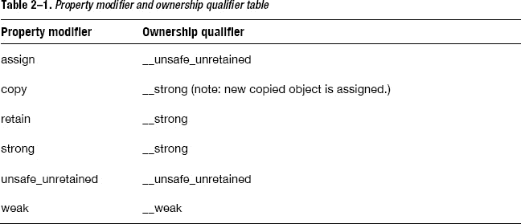

对属性赋值等同于对具有相应所有权限定符的变量进行赋值。`copy` 修饰符不仅仅是赋值。它通过 `NSCopying` 协议的 `copyWithZone:` 方法复制对象，然后进行赋值。

当你同时为属性手动声明实例变量时，该实例变量必须具有与属性相同的所有权限定符。我们通过一个例子来看一下。

```
@interface SomeObject : NSObject {
    id obj;
}
@end
```

成员变量 `obj` 被声明为 `id` 类型。同时，如果属性被声明为带有弱所有权限定符，如下所示：

```
@property (nonatomic, weak) id obj;
```

这会导致编译错误。

```
error: existing ivar 'obj' for __weak property 'obj' must be __weak
    @synthesize obj;
                ^
    note: property declared here
    @property (nonatomic, weak) id obj;
                                   ^
```

在这种情况下，成员变量必须使用 `__weak` 进行限定。

```
@interface SomeObject : NSObject {
    id _weak obj;
} @end
```

或者，该属性必须使用修饰符 "strong"。

```
@property (nonatomic, strong) id obj;
```

接下来，我们来了解一些在使用带 ARC 的数组时需要注意的事项。


### 数组

我在之前用 `id` 或对象类型变量解释了所有权说明符。在本节中，我将解释如何在数组中使用这些说明符。

以下源代码展示了如何使用使用 `__strong` 限定的静态变量数组。

```
id objs[10];
```

对于 `__weak`、`__autoreleasing` 或 `__unsafe_unretained`，操作方式相同。

```
id __weak objs[10];
```

顺便提一下，任何使用 `__strong`、`__weak` 或 `__autoreleasing`（`__unsafe_unretained` 除外）限定的变量都会被初始化为 `nil`。这同样适用于静态数组。任何使用 `__strong`、`__weak` 或 `__autoreleasing` 限定的变量数组，都会被初始化为 `nil`。让我们看看如何使用它们。

```
{
    id objs[2];
    objs[0] = [[NSObject alloc] init];
    objs[1] = [NSMutableArray array];
}
```

当控制流离开数组的作用域时，数组中所有持有强引用的变量都会消失。所赋值的对象会被自动释放。这与非数组中的变量行为一致。

动态数组的情况又是怎样的呢？基本上，你应该使用 Foundation 框架中的容器，例如 `NSMutableArray`、`NSMutableDictionary` 或 `NSMutableSet`。这样存储的对象将会被妥善管理。这些容器是更优的选择，但你仍然可以使用带有 `__strong` 限定变量的动态 C 数组。不过，你需要记住几点。按照惯例，我们通过一个示例来看看。

首先，声明一个指向动态 C 数组的指针：

```
id __strong *array = nil;
```

如前所述，`id *` 类型意味着 `id __autoreleasing *`。因此，在这种情况下，你必须显式写出 `__strong` 限定符。虽然带有 `__strong` 所有权限定符的 `id` 类型变量会被初始化为 `nil`，但带有 `__strong` 限定的 `id` 指针类型变量却不会。因此，你必须显式地将其赋值为 `nil`。

或者，如果你更喜欢使用类类型而不是 `id`，也可以像下面这样声明：

```
NSObject * __strong *array = nil;
```

接下来，使用 `calloc` 函数为数组中的变量分配一个内存块。

```
array = (id __strong *)calloc(entries, sizeof(id));
```

在这段源代码中，为“entries”个元素分配了一个内存块。请注意，使用 `__strong` 限定的变量必须初始化为 `nil`。这里使用 `calloc` 函数是为了在分配后用零填充内存。除了 `calloc` 函数，你也可以先使用 `malloc` 函数分配内存，再使用 `memset` 函数用零填充，如下所示。

```
array = (id __strong *)malloc(entries * sizeof(id));
memset(array, 0, entries * sizeof(id));
```

然而，像下面这样赋值为 `nil` 是非常危险的。

```
array = (id __strong *)malloc(sizeof(id) * entries);
for (NSUInteger i = 0; i < entries; ++i)
    array[i] = nil;
```

在这段源代码中，由 `malloc` 分配的内存区域并未被初始化为零。因此，在每次赋值之前，`release` 方法会在无效的地址上被调用。所以，推荐直接使用 `calloc` 函数。之后，你可以像操作静态数组一样，对动态数组进行任何操作。

```
array[0] = [[NSObject alloc] init];
```

但是，当你使用完带有 `__strong` 限定的动态变量数组后，必须自行释放所有元素。这与静态数组有很大的不同。像下面这样仅仅使用 `free` 函数释放内存块会导致内存泄漏，因为每个元素永远不会被释放。

```
free(array);
```

对于静态数组，当变量作用域结束时，编译器会自动插入代码来释放所有元素。但对于动态数组，编译器无法检测其生命周期。通过将所有元素设置为 `nil`，你可以移除元素的所有强引用，从而释放所有对象。然后，你还必须释放内存块本身。

```
for (NSUInteger i = 0; i < entries; ++i)
    array[i] = nil;

free(array);
```

与初始化相反，你不能使用 `memset` 函数来释放对象，因为这会导致内存泄漏。这样做非常危险。你必须手动将所有元素赋值为 `nil`，以便让编译器检测到。

同样地，使用 `memcpy` 复制任何元素或使用 `realloc` 调整内存块大小也是危险的。这样做可能导致对象未被释放，或者同一对象被多次释放。因此，严格禁止使用这些函数。

另外，你也可以像使用 `__strong` 那样，以同样的方式使用带有 `__weak` 限定的动态变量数组。最好不要与 `__autoreleasing` 一起使用，因为这会产生意想不到的状态。由于 `__unsafe_unretained` 限定的变量不受编译器控制，你可以像使用 `void*` 等 C 指针类型变量一样来使用它们。

## 总结

在本章中，我们学习了：

*   引用计数规则在 ARC 下如何依然适用
*   ARC 新引入的所有权限定符
*   为 ARC 新增的特性
*   使用 ARC 时必须了解的规则

在下一章中，我们将结合 ARC 本身的实现来详细讨论这些内容。

## 第 3 章

## ARC 实现

在本章中，我们将通过讨论 ARC 本身的实现来回顾上一章所学的内容，详细解释 ARC 是什么以及它是如何工作的。

苹果公司说：“Objective-C 中的自动引用计数（ARC）使内存管理成为编译器的工作”，但事实上，ARC 并非仅仅是编译器的工作。Objective-C 运行时也需要提供帮助，因此 ARC 实际上是由工具和库共同实现的：

*   编译器：clang (LLVM 编译器) 3.0 或更高版本
*   Objective-C 运行时库：`objc4` 493.9 或更高版本

**注意：**正如苹果公司所说，如果 ARC 仅仅是编译器的工作，那么 `__weak` 所有权说明符也可以在 iOS4 或 OS X Snow Leopard 上使用。

当应用程序为 iOS4 或 OS X Snow Leopard 编译时，会链接 `libarclite_iphoneos.a` 或 `libarclite_macosx.a` 以使 ARC 工作。即使链接了 ARC 支持库，在对象被废弃后，仍然无法为 `__weak` 限定的变量设置 `nil`（零化弱引用）。我猜这是旧版框架和运行时库的限制。不过，由于我们无法看到 `libarclite` 的源代码，这只是我的猜测。

但现在，我们先不操心旧版操作系统；在本章中，我们将专注于 ARC 本身的实现，并查看 clang 汇编器的输出以及 `objc4` 库中 `runtime/objc-arr.mm` 的源代码。

在接下来的部分中，我们将展示每个限定符对应的 ARC 源代码。我们已经学习了这些限定符是什么以及如何使用它们。在接下来的部分中，我们将详细了解它们是如何工作的。让我们从 `__strong` 所有权限定符开始。

## __strong 所有权限定符

让我们以 `NSMutableArray` 类方法 `array` 为例，看看使用 `__strong` 限定的变量是如何工作的。我们将深入了解调用该方法时的底层机制以及该方法内部的机制。在此之前，请参考以下源代码。

```
{
    id __strong obj = [[NSObject alloc] init];
}
```

Clang 可以将其输出显示为汇编/机器代码。为了易读性，我们在下面将每个摘录表示为等价的 ObjC 代码。结合输出和 `objc4` 库的源代码，我们能够看到底层发生了什么。上述源代码被重写如下。请注意，有时我们会使用伪代码使其更易于理解。

```
/* 编译器的伪代码 */
id obj = objc_msgSend(NSObject, @selector(alloc));
objc_msgSend(obj, @selector(init));
objc_release(obj);
```

你可以看到，`objc_msgSend` 被调用了两次，分别用于调用 `alloc` 和 `init` 方法。之后，当变量作用域结束时，会调用 `objc_release` 来释放对象。虽然你不能显式地调用 `release` 方法，但可以看到在伪代码中 `release` 被自动插入了。


### 调用数组方法

接下来，我们看看当一个对象不是通过 `alloc/new/copy/mutableCopy` 方法组获取时会发生什么。原始代码如下所示。

```
{
    id __strong obj = [NSMutableArray array];
}
```

这是一个看起来很普通的 `NSMutableArray` 类方法 `array`。它的伪代码与之前的略有不同。

```
/* 编译器生成的伪代码 */
id obj = objc_msgSend(NSMutableArray, @selector(array));
objc_retainAutoreleasedReturnValue(obj);
objc_release(obj);
```

第一个用于 `array` 方法的 `objc_msgSend` 和最后一个 `objc_release` 与之前相同。那么这个 `objc_retainAutoreleasedReturnValue` 函数调用是什么呢？

`objc_retainAutoreleasedReturnValue` 函数是为了性能优化。之所以插入它，是因为 `NSMutableArray` 的类方法 `array` 不在 `alloc/new/copy/mutableCopy` 方法组中。每当调用的方法不属于该组时，编译器都会在调用该方法后立即插入这个函数。顾名思义，它会在一个对象被添加到自动释放池后，保留从方法或函数返回的该对象。

`objc_retainAutoreleasedReturnValue` 函数期望在方法内部已经调用了 `objc_autoreleaseReturnValue` 函数。任何不在 `alloc/new/copy/mutableCopy` 组中的方法都必须调用 `objc_autoreleaseReturnValue`。例如，`NSMutableArray` 的类方法 `array` 就调用了这个函数。

### 深入 array 方法内部

我们来看看编译器生成的 `NSMutableArray` 类方法 `array` 的实现代码。

```
+ (id) array
{
    return [[NSMutableArray alloc] init];
}
```

这段源代码被转换如下。它在最后调用了 `objc_autoreleaseReturnValue` 函数。

```
/* 编译器生成的伪代码 */
+ (id) array
{
    id obj = objc_msgSend(NSMutableArray, @selector(alloc));
    objc_msgSend(obj, @selector(init));
    return objc_autoreleaseReturnValue(obj);
}
```

任何返回已添加到自动释放池的对象的方法，都会像上面的例子一样调用 `objc_autoreleaseReturnValue` 函数。它会将一个对象添加到自动释放池并返回它。但实际上，`objc_autoreleaseReturnValue` 并不总是将该对象注册到自动释放池中。

`objc_autoreleaseReturnValue` 会检查调用方的可执行代码，如果该代码在调用此方法后立即调用 `objc_retainAutoreleasedReturnValue` 函数，则它会跳过向自动释放池的注册，直接将对象返回给调用方。`objc_retainAutoreleasedReturnValue` 函数的实现目的是，即使 `objc_autoreleaseReturnValue` 没有将对象注册到自动释放池，也能正确地获取这样一个对象。通过 `objc_autoreleaseReturnValue` 和 `objc_retainAutoreleasedReturnValue` 的协同工作，对象会绕过添加到自动释放池的过程，如图 3-1 所示。这样，性能就会得到提升。^(1)

__________

¹ 在 `objc4` 版本 493.9 中，此优化仅在 OS X 64 位环境下有效。

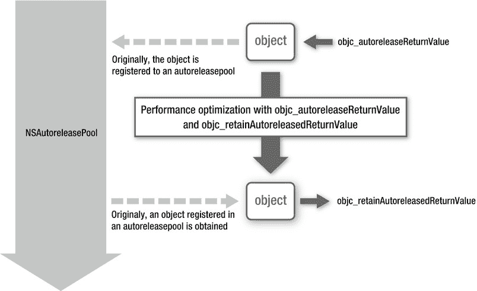

**图 3–1.** *跳过向自动释放池的注册*

## `__weak` 所有权修饰符

接下来，我们学习 `__weak` 所有权修饰符。我们将展示当对象被废弃或新创建的对象被赋值时会发生什么，以及对象如何被自动添加到自动释放池中。

如第 2 章所述，`__weak` 所有权修饰符提供以下特性。

*   当所引用的对象被废弃时，任何使用 `__weak` 修饰的变量都会被赋值为 nil。
*   当通过 `__weak` 修饰的变量访问对象时，该对象会被添加到自动释放池中。

我们从以下示例开始，看看幕后发生了什么。

```
{
    id __weak obj1 = obj;
}
```

这里，假设变量 `obj` 被存储在某个使用 `__strong` 修饰的变量中。

```
/* 编译器生成的伪代码 */
id obj1;
objc_initWeak(&obj1, obj);
objc_destroyWeak(&obj1);
```

使用 `__weak` 修饰的变量由 `objc_initWeak` 函数初始化。当离开变量作用域时，`objc_destroyWeak` 函数会销毁它。

`objc_initWeak` 函数实现如下源代码所示。它会清空使用 `__weak` 修饰的变量，然后调用 `objc_storeWeak` 函数，并传入要赋值的对象。

```
obj1 = 0;
objc_storeWeak(&obj1, obj);
```

`objc_destroyWeak` 函数会调用 `objc_storeWeak` 函数，并将 0 作为参数传入，如下所示。

```
objc_storeWeak(&obj1, 0);
```

因此，示例代码等同于：

```
/* 编译器生成的伪代码 */
id obj1;
obj1 = 0;
objc_storeWeak(&obj1, obj);
objc_storeWeak(&obj1, 0);
```

`objc_storeWeak` 函数将一个键值对注册到一个称为弱表的表中。键是第二个参数，即要赋值的对象的地址。值是第一个参数，即指向使用 `__weak` 修饰的变量的地址。如果第二个参数为 0，则从表中移除该条目。

与引用计数表一样，弱表也被实现为一个哈希表（参见第 1 章 ，“Apple 的实现”一节）。这样，当一个对象被废弃时，可以以合理的性能从该对象搜索到使用 `__weak` 修饰的变量。当以同一个对象作为键调用该函数时，多个使用 `__weak` 修饰的变量将注册到同一个对象。

### 探究对象被废弃时的底层机制

接下来，我们看看当某个对象不再被任何所有者拥有而被废弃时调用的函数。对象通过 `objc_release` 函数被释放。

1.  `objc_release`。
2.  因为引用计数变为零，调用 `dealloc`。
3.  `_objc_rootDealloc`。
4.  `object_dispose`。
5.  `objc_destructInstance`。
6.  `objc_clear_deallocating`。

最后调用 `objc_clear_deallocating` 函数。它执行以下操作。

1.  从弱表中，获取键为要被废弃的对象的条目。
2.  将该条目中所有使用 `__weak` 所有权修饰的变量设置为 nil。
3.  从表中移除该条目。
4.  对于要被废弃的对象，从引用表中移除其键。

这就是其实现，让我们得以了解当所引用的对象被废弃时，如何将使用 `__weak` 修饰的变量设置为 nil。同时，这也告诉我们，如果使用了太多的 `__weak` 所有权修饰变量，会在一定程度上消耗 CPU 资源。因此，`__weak` 所有权修饰变量应仅用于避免循环引用。


#### 分配新创建的对象

如前所述，以下源代码会触发一条警告。

```
{
    id __weak obj = [[NSObject alloc] init];
}
```

它试图将一个新对象赋值给变量。但由于变量使用了`__weak`修饰，没有任何对象能持有其所有权。因此，该对象会立即被释放并废弃。这就是警告产生的原因。

```
warning: assigning retained obj to weak variable; obj will be
          released after assignment [-Warc-unsafe-retained-assign]
            id __weak obj = [[NSObject alloc] init];
                               ^     ~~~~~~~~~~~~~~
```

让我们看看编译器如何处理这段源代码。

```
/* 编译器伪代码 */
id obj;
id tmp = objc_msgSend(NSObject, @selector(alloc));
objc_msgSend(tmp, @selector(init));
objc_initWeak(&obj, tmp);
objc_release(tmp);
objc_destroyWeak(&object);
```

`objc_initWeak` 函数将新对象赋值给了使用 `__weak` 修饰的变量。同时，编译器检测到没有任何对象持有所有权，并插入了 `objc_release` 函数。

当 `objc_release` 被调用时，对象将被废弃，并且使用 `__weak` 修饰的变量会变成 nil。让我们用 `NSLog` 来验证结果：

```
{
    id __weak obj = [[NSObject alloc] init];
    NSLog(@"obj=%@", obj);
}
```

结果如下所示。它显示了使用 `@"%@"` 格式化后的 nil。

```
obj=(null)
```

如果一个对象被创建后就直接废弃，会发生什么？我们将在下一节中通过具体实现来了解。

#### 对象的立即废弃

正如我们所述，以下源代码会导致编译器警告。

```
id __weak obj = [[NSObject alloc] init];
```

这是因为编译器检测到没有人拥有这个新对象的所有权。那么 `__unsafe_unretained` 的情况又如何呢？

```
id __unsafe_unretained obj = [[NSObject alloc] init];
```

与 `__weak` 类似，编译器检测到没有人拥有该对象的所有权。

```
warning: assigning retained object to unsafe_unretained variable;
        obj will be released after assignment [-Warc-unsafe-retained-assign]
        id __unsafe_unretained obj = [[NSObject alloc] init];
                                                       ^     ~~~~~~~~~~~~~
```

该源代码等价于：

```
/* 编译器伪代码 */
id obj = objc_msgSend(NSObject, @selector(alloc));
objc_msgSend(obj, @selector(init));
objc_release(obj);
```

新对象通过 `objc_release` 函数被释放，而变量 `obj` 仍然持有一个悬垂指针。如果对象没有赋值给任何变量，会发生什么？在没有 ARC 的情况下，这只会导致内存泄漏。

```
[[NSObject alloc] init];
```

在 ARC 下，编译器会因为返回值从未被使用而给出警告。

```
warning: expression result unused [-Wunused-value]
    [[NSObject alloc] init];
    ^~~~~~~~~~~~~
```

你可以通过将其强制转换为 `void` 来隐藏警告。

```
(void)[[NSObject alloc] init];
```

无论是否进行强制转换，这段源代码都会被转换为以下形式。

```
/* 编译器伪代码 */
id tmp = objc_msgSend(NSObject, @selector(alloc));
objc_msgSend(tmp, @selector(init));
objc_release(tmp);
```

除非对象未被赋值给变量，否则其代码与使用 `__unsafe_unretained` 的情况相同。因为没有人拥有所有权，所以编译器会生成 `objc_release` 函数调用。由于 ARC 的存在，不会发生内存泄漏。

还有一个问题：我们能否像下面这样，对这些立即丢弃的对象调用实例方法？

```
(void)[[[NSObject alloc] init] hash];
```

这等价于：

```
/* 编译器伪代码 */
id tmp = objc_msgSend(NSObject, @selector(alloc));
objc_msgSend(tmp, @selector(init));
objc_msgSend(tmp, @selector(hash));
objc_release(tmp);
```

对象会在方法调用后被释放。正如苹果公司所说，编译器妥善处理了内存管理！

#### 自动添加到自动释放池

如前所述，当通过使用 `__weak` 修饰的变量访问对象时，该对象会被添加到自动释放池中。让我们看看它是如何工作的。

```
{
    id __weak obj1 = obj;
    NSLog(@"%@", obj1);
}
```

该源代码等价于以下内容。

```
/* 编译器伪代码 */
id obj1;
objc_initWeak(&obj1, obj);
id tmp = objc_loadWeakRetained(&obj1);
objc_autorelease(tmp);
NSLog(@"%@", tmp);
objc_destroyWeak(&obj1);
```

`objc_loadWeakRetained` 和 `objc_autorelease` 函数调用是新插入的，这在之前的示例中没有出现。这是因为变量被实际使用了。这些函数的作用如下：

1. `objc_loadWeakRetained` 函数会保留由使用 `__weak` 修饰的变量所引用的对象。
2. `objc_autorelease` 函数会将对象添加到自动释放池中。

这意味着，赋值给使用 `__weak` 修饰的变量的对象，会被添加到自动释放池中，以便该变量可以在离开 `@autoreleasepool` 块之前安全使用。

**注意：** 如果你过度使用 `__weak` 修饰的变量，自动释放池中将会存储过多的对象。

为了避免这种存储问题，我建议你在使用 `__weak` 修饰的变量时，也应将对象赋值给一个 `__strong` 修饰的变量。例如，下面的示例中，变量 `o`（使用 `__weak` 修饰）被使用了五次。

```
{
    id __weak o = obj;
    NSLog(@"1 %@", o);
    NSLog(@"2 %@", o);
    NSLog(@"3 %@", o);
    NSLog(@"4 %@", o);
    NSLog(@"5 %@", o);
}
```

该对象会被添加到自动释放池五次：

```
objc[14481]: ##############
objc[14481]: AUTORELEASE POOLS for thread 0xad0892c0
objc[14481]: 6 releases pending.
objc[14481]: [0x6a85000]  ................  PAGE  (hot) (cold)
objc[14481]: [0x6a85028]  ################  POOL 0x6a85028
objc[14481]: [0x6a8502c]         0x6719e40  NSObject
objc[14481]: [0x6a85030]         0x6719e40  NSObject
objc[14481]: [0x6a85034]         0x6719e40  NSObject
objc[14481]: [0x6a85038]         0x6719e40  NSObject
objc[14481]: [0x6a8503c]         0x6719e40  NSObject
objc[14481]: ##############
```

你可以通过将对象赋值给使用 `__strong` 修饰的变量来避免这种情况。

```
{
    id __weak o = obj;
    id tmp = o;
    NSLog(@"1 %@", tmp);
    NSLog(@"2 %@", tmp);
    NSLog(@"3 %@", tmp);
    NSLog(@"4 %@", tmp);
    NSLog(@"5 %@", tmp);
}
```

在这种情况下，对象仅在 `tmp = o;` 这一行被添加到自动释放池一次。

```
objc[14481]: ##############
objc[14481]: AUTORELEASE POOLS for thread 0xad0892c0
objc[14481]: 2 releases pending.
objc[14481]: [0x6a85000]  ................  PAGE  (hot) (cold)
objc[14481]: [0x6a85028]  ################  POOL 0x6a85028
objc[14481]: [0x6a8502c]         0x6719e40  NSObject
objc[14481]: ##############
```

如前所述，`__weak` 修饰符不能用于 iOS4 或 OS X Snow Leopard。此外，在其他一些情况下，由于某些类不支持 `__weak` 修饰的变量，因此无法使用 `__weak` 所有权修饰符。

例如，`NSMachPort` 类的对象不能赋值给任何使用 `__weak` 修饰的变量。这些类重写了 `retain`/`release` 方法，并在其原始实现中拥有自己的引用计数。当一个对象被赋值给 `__weak` 修饰的变量时，编译器必须正确插入 `objc4` 函数，因此许多此类类无法支持 `__weak` 修饰。这些不支持的类在类声明中带有一个属性 `__attribute__((objc_arc_weak_reference_unavailable))`，该属性被定义为 `NS_AUTOMATED_REFCOUNT_WEAK_UNAVAILABLE`。即使你将此类对象赋值给一个使用 `__weak` 修饰的变量，编译器也会正确地生成错误。这些类非常罕见，所以你无需过分担心。

**ALLOWSWEAKREFERENCE 和 RETAINWEAKREFERENCE 方法**


还有一种情况无法使用 `__weak` 所有权修饰符。当 `NSObject` 实例方法 `allowsWeakReference` 或 `retainWeakReference` 返回 `NO` 时，该对象不能被赋值给用 `__weak` 修饰的变量。这些方法在 `NSObject` 协议中没有文档说明，其声明如下：

```
- (BOOL)allowsWeakReference;
- (BOOL)retainWeakReference;
```

当对象被赋值给用 `__weak` 修饰的变量时，会调用 `allowsWeakReference` 方法。如果该方法返回 `NO`，你的应用程序将会终止：

`cannot form weak reference to instance (0x753e180) of class MyObject`

这意味着你不应该将此类实例赋值给用 `__weak` 修饰的变量。你应该能在类的参考文档中了解到该类是否有此限制。

当 `retainWeakReference` 方法返回 `NO` 时，用户获取到的值为 `nil`。让我们通过一个例子来看一下。

```
{
    id __strong obj = [[NSObject alloc] init];
    id __weak o = obj;
    NSLog(@"1 %@", o);
    NSLog(@"2 %@", o);
    NSLog(@"3 %@", o);
    NSLog(@"4 %@", o);
    NSLog(@"5 %@", o);
}
```

对象在变量 `obj` 的作用域结束之前一直存在。因此，在此期间变量 `o` 是可用的。结果如下：

```
1 <NSObject: 0x753e180>
2 <NSObject: 0x753e180>
3 <NSObject: 0x753e180>
4 <NSObject: 0x753e180>
5 <NSObject: 0x753e180>
```

让我们看看如果 `retainWeakReference` 返回 `NO` 会发生什么。下面的源代码展示了如何实现 `retainWeakReference`。

```
@interface MyObject : NSObject
{
    NSUInteger count;
}
@end

@implementation MyObject
- (id)init
{
    self = [super init];
    return self;
}
- (BOOL)retainWeakReference
{
    if (++count > 3)
        return NO;
    return [super retainWeakReference];
}
@end
```

在这个例子中，`retainWeakReference` 方法在被调用超过三次后返回 `NO`。然后将上面的例子从 `NSObject` 修改为 `MyObject`。

```
{
    id __strong obj = [[MyObject alloc] init];
    id __weak o = obj;
    NSLog(@"1 %@", o);
    NSLog(@"2 %@", o);
    NSLog(@"3 %@", o);
    NSLog(@"4 %@", o);
    NSLog(@"5 %@", o);
}
```

结果如下：

```
1 <MyObject: 0x753e180>
2 <MyObject: 0x753e180>
3 <MyObject: 0x753e180>
4 (null)
5 (null)
```

当 `retainWeakReference` 方法返回 `NO` 时，对象将无法被访问。如果框架中的某些类使用了这种机制，其类参考文档应该对此有所说明。此外，`allowsWeakReference` 和 `retainWeakReference` 方法是由运行时库在与 `__weak` 修饰符相关的流程中调用的。因此，如果在这些方法内部调用了某些运行时库的 API，你的应用程序可能会挂起。这些方法没有文档说明，应用程序开发者也不应该实现它们。但如果你出于某种原因需要实现它们，你则需要充分理解它们的工作原理。

## `__autoreleasing` 所有权修饰符

将对象赋值给任何用 `__autoreleasing` 修饰的变量，等同于在非 ARC 环境中调用 `autorelease` 方法。让我们通过源代码来看它是如何工作的。

```
@autoreleasepool {
    id __autoreleasing obj = [[NSObject alloc] init];
}
```

它将一个 `NSObject` 类的实例添加到自动释放池中。让我们看看编译器是如何翻译它的。

```
/* 编译器的伪代码 */
id pool = objc_autoreleasePoolPush();
id obj = objc_msgSend(NSObject, @selector(alloc));
objc_msgSend(obj, @selector(init));
objc_autorelease(obj);
objc_autoreleasePoolPop(pool);
```

它的工作方式正如我之前根据 Apple 的实现所解释的那样。（参见第 1 章，“Apple 对 autorelease 的实现”部分。）`autorelease` 机制本身的工作方式与非 ARC 环境完全相同，尽管源代码有所不同。

如果对象不是通过 `alloc`/`new`/`copy`/`mutableCopy` 方法组获取的，会发生什么？让我们看看下一个使用 `NSMutableArray` 类方法 `array` 的例子。

```
@autoreleasepool {
    id __autoreleasing obj = [NSMutableArray array];
}
```

让我们检查一下它与前面的例子有何不同。

```
/* 编译器的伪代码 */
id pool = objc_autoreleasePoolPush();
id obj = objc_msgSend(NSMutableArray, @selector(array));
objc_retainAutoreleasedReturnValue(obj);
objc_autorelease(obj);
objc_autoreleasePoolPop(pool);
```

尽管使用了 `objc_retainAutoreleasedReturnValue`，但其他与自动释放池相关的代码与前面的例子完全相同。

## `__unsafe_unretained` 所有权修饰符

最后一个所有权修饰符是 `__unsafe_unretained`。正如我在“对象的立即销毁”部分中所解释的，对用 `__unsafe_unretained` 修饰的变量进行赋值，在伪代码中从不出现。与其他所有权修饰符不同，编译器对此修饰符不做任何特殊处理。它就像 C 语言中的赋值一样工作。

现在我们已经了解了每个所有权修饰符的实现。你现在应该对 ARC 有了更好的理解。在最后的章节中，对引用计数的数量讨论得并不多。在下一节中，我终于会对此进行解释。


### 引用计数

本书有意不对引用计数的数值本身做过多解释，因为要正确看待引用计数，就不应关注数值本身。若你仍想了解实际数值，可通过以下方式获取：

`uintptr_t _objc_rootRetainCount(id obj)`

调用 `_objc_rootRetainCount` 函数，即可获得引用计数的数值。来看一个示例。

```
{
    id __strong obj = [[NSObject alloc] init];
    NSLog(@"retain count = %d", _objc_rootRetainCount(obj));
}
```

在上述代码中，变量 `obj` 仅有一个强引用。因此，它会显示：

`retain count = 1`

我们再用 `__weak` 所有权修饰符来验证一下。

```
{
    id __strong obj = [[NSObject alloc] init];
    id __weak o = obj;
    NSLog(@"retain count = %d", _objc_rootRetainCount(obj));
}
```

用 `__weak` 修饰的变量不具备所有权，因此引用计数的数值不应发生变化。

`retain count = 1`

没错，正如我们所料。那么，使用 `__autoreleasing` 的情况又是怎样的呢？

```
@autoreleasepool {
    id __strong obj = [[NSObject alloc] init];
    id __autoreleasing o = obj;
    NSLog(@"retain count = %d", _objc_rootRetainCount(obj));
}
```

结果是：

`retain count = 2`

数值为 2，是因为一个强引用以及该对象已被添加到自动释放池中。我们来看看离开 `@autoreleasepool` 块后的数值。

```
{
    id __strong obj = [[NSObject alloc] init];
    @autoreleasepool {
        id __autoreleasing o = obj;
        NSLog(@"retain count = %d in @autoreleasepool", _objc_rootRetainCount(obj));
    }
    NSLog(@"retain count = %d", _objc_rootRetainCount(obj));
}
```

以下是结果：

`retain count = 2 in @autoreleasepool`
`retain count = 1`

对象如预期般被释放了。

此外，我们再来确认一下，当对象通过 `__weak` 修饰的变量使用时，它是否会被添加到自动释放池中。可以通过 `objc_autoreleasePoolPrint` 函数查看自动释放池的状态。

```
@autoreleasepool {
    id __strong obj = [[NSObject alloc] init];
    _objc_autoreleasePoolPrint();
    id __weak o = obj;
    NSLog(@"before using __weak: retain count = %d", _objc_rootRetainCount(obj));
    NSLog(@"class = %@", [o class]);
    NSLog(@"after using __weak: retain count = %d", _objc_rootRetainCount(obj));
    _objc_autoreleasePoolPrint();
}
```

结果如下：

```
objc[14481]: ##############
objc[14481]: AUTORELEASE POOLS for thread 0xad0892c0
objc[14481]: 1 releases pending.
objc[14481]: [0x6a85000]  ................  APAGE  (hot) (cold)
objc[14481]: [0x6a85028]  ################  POOL 0x6a85028
objc[14481]: ##############
before using __weak: retain count = 1
class = NSObject
after using __weak: retain count = 2
objc[14481]: ##############
objc[14481]: AUTORELEASE POOLS for thread 0xad0892c0
objc[14481]: 2 releases pending.
objc[14481]: [0x6a85000]  ................  PAGE  (hot) (cold)
objc[14481]: [0x6a85028]  ################  POOL 0x6a85028
objc[14481]: [0x6a8502c]         0x6719e40  NSObject
objc[14481]: ##############
```

上述结果表明，当对象通过 `__weak` 修饰的变量使用时，即便没有使用 `__autoreleasing`，该对象也会被添加到自动释放池中。

顺便提一下，`_objc_rootRetainCount` 函数并非每次都能返回可靠的数值。在某些情况下，即使对象已被废弃或地址无效，它也可能返回 1。此外，如果对象在多个线程中使用，由于竞态条件问题，该数值可能不准确。^(2) 尽管 `_objc_rootRetainCount` 函数有助于调试，但使用时仍需谨慎。

### 小结

在 第 1 章 中，我们学习了引用计数的内存管理。在 第 2 章 中，我们了解了启用 ARC 后会发生什么变化以及必须遵守哪些规则。在本章中，我们通过查看伪代码学习了 ARC 是如何实现的。

现在你已经学习了 ARC。请在 OSX 和 iOS 开发中有效利用它。

__________

² 维基百科，“竞态条件”，[`en.wikipedia.org/wiki/Race_condition`](http://en.wikipedia.org/wiki/Race_condition)

## 第 4 章

## Blocks 入门

Blocks 是为 OSX Snow Leopard、iOS4 及更高版本引入的 C 语言扩展。本章将详细讲解 Blocks 是什么，以便下一章介绍其实现时更有意义。了解实现有助于理解如何使用它们以及它们的工作原理。为了正确认识 Blocks，请看以下场景。

当你阅读 iOS 或 OSX 应用程序源代码时，可能会发现其中有一些奇怪的语句。这些语句在函数内部包含了函数声明。根据以往的经验，我们在 C 和 Objective-C 中并未发现过这种语法。GameKit 组件（iOS4 中的新组件）经常使用这种语法来使应用程序源代码更优雅。我们来看一个示例。

```
- (void)reportScore:(int64_t)score forCategory:(NSString*)category
{
        /* 省略 */
        [scoreReporter reportScoreWithCompletionHandler:^(NSError *error) {  
                    /* 分数报告后要执行的任务 */
                if (error != nil)
                 {
                    /* 报告时发生错误时要执行的任务 */
                }
        }]
}
```

这个示例展示了如何使用 GameKit API 来报告游戏分数。对用户来说，最重要的是要知道分数是否已成功报告给服务器。应用程序必须监控其完成情况并检查是否发生错误。在这种情况下，指定在报告完成后自动执行的任务非常有用。而且，如果你能非常轻松地编写这些任务，那就更方便了。

在 GameKit 组件中，你可以通过使用 Blocks 来实现这一点。在示例中，“分数报告后要执行的任务”这部分注释所在的位置就是 Blocks。这部分代码在分数报告完成之后执行，而不是在 `reportScoreWithCompletionHandler:` 方法被调用之后。如示例所示，你无需监控报告何时完成，通过使用 Blocks 就能非常优雅地编写这些任务。

在本章中，你将学习如何使用 Blocks。我们将从了解什么是 Block 以及为什么需要 Blocks 开始。然后，我们将学习如何在应用程序中使用 Blocks，例如如何按字面形式编写 Block，以及如何在 Block 中使用变量（如源代码示例所示）。

## Blocks 初探

如前所述，Blocks 是 C 语言的一个新扩展。简而言之，它们可以被解释为“带有自动（局部）变量的匿名函数”。让我们快速了解一下这两个部分以及它们是如何实现的。


### 匿名函数

顾名思义，匿名函数就是没有名称的函数。然而在标准 C 与 Objective-C 中，若不借助块（blocks）则无法创建此类函数。C++ 中与块概念相同的 lambda 表达式终于在 C++11 中引入。

例如：

```
int func(int count);
```

在这段源代码中，声明了一个名为 `func` 的函数。若要调用该函数，必须像下面这样使用名称 `func`：

```
int result = func(10);
```

你可能会认为可以通过函数指针在不知道名称的情况下调用函数：

```
int result = (*funcptr)(10);
```

实际上，要将函数赋值给指针，仍然需要其名称，如下所示：

```
int (*funcptr)(int) = &func;
int result = (*funcptr)(10);
```

正如本章各示例所示，要使用函数，你必须为其命名。但通过使用块（Blocks），你不再需要这样做。借助块，可以使用匿名函数。程序员需要为众多事物命名，包括函数、变量、方法、属性、类、框架等等，因此据说“命名”是程序员的基本工作。所以函数不需要名字是件很棒的事！在“块字面量语法”一节中，我将详细解释块是如何实现匿名函数的。

现在你已了解什么是匿名函数，理解“连同自动（局部）变量一起使用”的含义至关重要。

### 变量

我们来看看 C 语言中哪些变量可以使用。

- 自动变量（局部变量）
- 函数参数
- 静态变量（静态局部变量）
- 静态全局变量
- 全局变量

在这些变量类型中，静态变量、静态全局变量和全局变量能够跨函数调用保持值不变，并且它们存储在应用程序的一个内存区域中。

从这种意义上说，这三种类型除了作用域不同外，其他方面都是一样的。即使跨函数调用，这些变量也始终保留它们的值。换句话说，应用程序中任何地方使用的都必须是同一个变量值。为了说明这一点，我们来看一个按钮事件的回调函数示例。

```
int buttonId = 0;
void buttonCallback(int event)
{
    printf("buttonId:%d event=%d\n", buttonId, event);
}
```

如果应用程序中只有一个按钮，这段源代码可以正常工作。但如果像下面这样有多个按钮呢？

```
int buttonId;
void buttonCallback(int event)
{
    printf("buttonId:%d event=%d\n", buttonId, event);
}

void setButtonCallbacks()
{
    for (int i = 0; i < BUTTON_MAX; ++i) {
        buttonId = i;
        setButtonCallback(BUTTON_IDOFFSET + i, &buttonCallback);
    }
}
```

这段源代码的问题很明显。全局变量 `buttonId` 只有一个，被所有回调共享。循环结束后，所有回调都使用了同一个值。当然，你可以通过将按钮 ID 作为回调函数的参数来解决这个问题。

```
void buttonCallback(int buttonId, int event)
{
    printf("buttonId:%d event=%d\n", buttonId, event);
}
```

在这种情况下，调用者不仅需要存储函数指针，还需要存储按钮 ID。顺便提一下，在 C++ 和 Objective-C 中，针对这种情况会使用类。首先，你声明一个包含成员变量的类，然后从该类创建对象，将值存储在成员变量中。以下源代码展示了如何对按钮回调示例使用类。

```
@interface ButtonCallbackObject : NSObject
{
    int buttonId_;
}
@end

@implementation ButtonCallbackObject
- (id) initWithButtonId:(int)buttonId
{
    self = [super init];
    buttonId_ = buttonId;
    return self;
}

- (void) callback:(int)event
{
    NSLog(@"buttonId:%d event=%d\n", buttonId_, event);
}
@end
```

回调的调用者只需存储对象即可，因为该类也可以保存按钮 ID 的值。

```
void setButtonCallbacks()
{
    for (int i = 0; i < BUTTON_MAX; ++i) {
        ButtonCallbackObject *callbackObj =
            [[ButtonCallbackObject alloc] initWithButtonId:i];
        setButtonCallbackUsingObject(BUTTON_IDOFFSET, callbackObj);
    }
}
```

如你所见，在 C++ 和 Objective-C 中，类的声明和实现需要多行源代码。然而，这可以通过块（Blocks）来解决。

### 块的救赎

块提供了像 C++ 或 Objective-C 中类一样保存变量的功能，但代码量少得多。其源代码数量几乎与函数相同。正如我所说“连同自动（局部）变量一起使用”，块保存了自动变量的值。以下代码展示了如何用块编写前面的示例。

```
void setButtonCallbacks()
{
    for (int i = 0; i < BUTTON_MAX; ++i) {
        setButtonCallbackUsingBlock(BUTTON_IDOFFSET + i, ^(int event) {
            printf("buttonId:%d event=%d\n", i, event); });
    }
}
```

其语法在“块字面量语法”一节中解释，自动变量如何被存储则在“捕获自动变量”一节中说明。在这段源代码中，带有变量 `i` 值的匿名函数被设置为回调。使用块时，匿名函数被称为“块字面量”或简称为“块”。正如我所说，借助块，你可以将匿名函数与自动（局部）变量一起使用，这意味着块能够解决使用静态（或全局）变量时的问题，并且你可以用更少的源代码实现与 C++ 或 Objective-C 类相同的功能。

请注意，“将匿名函数与自动（局部）变量一起使用”并非新概念。事实上，它在许多语言中都很常见。在计算机科学中，这被称为“闭包”或“lambda 演算”。表 4-1 展示了它在其他语言中的名称。

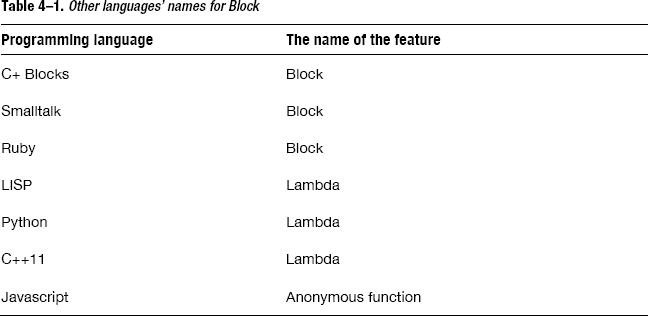

在接下来的章节中，我们将从块字面量的语法开始，学习如何使用块。


## 块字面量语法

本节介绍如何编写块字面量。通过示例来解释块字面量的语法。阅读完本节后，您将能够编写块字面量。

首先，让我们看看如何用 C 语言声明一个函数。

```
void func(int event) {
    printf("buttonId:%d event=%d\n", i, event);
}
```

这意味着它由返回类型、函数名、参数列表及其实现来声明。接下来看看块字面量是如何编写的。在前面几节中，块字面量是以缩略形式编写的，如下所示

```
^(int event) {
    printf("buttonId:%d event=%d\n", i, event);
}
```

您也可以将其完整地写为

```
^void (int event) {
    printf("buttonId:%d event=%d\n", i, event);
}
```

这个块字面量与 C 语言的函数声明之间只有两个区别：没有函数名，并且有一个脱字符号（`^`）。

块字面量没有函数名称。这使其成为一个匿名函数。第二个区别意味着，对于块字面量，`^`（脱字符）正好写在函数的返回类型之前。从现在开始，您很可能会更频繁地看到这个符号，因为 Blocks 将会在 OSX 和 iOS 应用中变得常见。

为了确认，以下是块字面量语法的 BNF。^(1)

```
Block_literal_expression ::= ^ block_decl compound_statement_body
block_decl ::= return_type
block_decl ::= parameter_list
block_decl ::= type_expression
```

即使您对 BNF 一无所知，您也可能能猜到它的含义。请参见 图 4-1。


**图 4-1.** *块字面量语法*

返回类型与 C 语言中函数声明的返回类型完全相同。参数列表和表达式也是相同的。当然，如果存在返回语句，返回类型必须与之匹配。例如，我们可以按如下方式使用块字面量。

```
^int (int count){return count + 1;}
```

正如前面的例子所示，有些项是可以省略的。首先，你可以省略返回类型，如 图 4-2 所示。

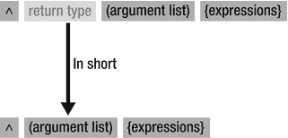

**图 4-2.** *不带返回类型的块字面量语法*

当省略返回类型时，会使用返回语句中的变量类型替代。当块字面量没有返回语句时，则使用 `void`。当 Block 有多个返回语句时，它们的所有变量类型必须相同。当返回类型被省略时，写法如下

```
^(int count){return count + 1;}
```

在这个块字面量中，由于其返回语句，返回类型是 `int`。

__________

¹ 维基百科，“巴科斯-诺尔范式” [`http://en.wikipedia.org/wiki/Backus-Naur_Form`](http://en.wikipedia.org/wiki/Backus-Naur_Form)

如果函数不带参数，参数列表也可以省略。下一个源代码是一个不带参数的 Block 示例。

```
^void (void){printf("Blocks\n");}
```

这可以简写如下。

```
^{printf("Blocks\n");}
```

这个简写的块字面量（图 4-3）将证明是您最熟悉的形式。

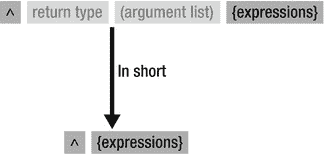

**图 4-3.** *不带返回类型和参数列表的块字面量语法*

## Block 类型变量

正如我们所学，块字面量看起来与函数定义相同，只是它没有名称并且带有 `^` 符号。对于 C 函数，函数的地址可以赋值给函数指针类型的变量。

```
int func(int count)
{
    return count + 1;
}
int (*funcptr)(int) = &func;
```

在示例中，函数 `func` 的地址被赋值给了变量 `funcptr`。

以类似的方式，块字面量可以赋值给 Block 类型的变量，这意味着当源代码中存在一个块字面量时，会生成一个值。该值可以赋值给 Block 类型的变量。在 Blocks 中，这个生成的值也被称为 Block。“Block” 这个术语既用于表示源代码中的块字面量本身，也用于表示由块字面量生成的值。接下来，让我们看看如何声明 Block 类型变量。

```
int (^blk)(int);
```

如果您比较之前函数指针的源代码，您会看到 Block 类型的变量声明与函数指针类型的声明相同，只是将 `*` 替换为了 `^`。与普通的 C 变量类型一样，此声明可用于：

*   自动变量
*   函数参数
*   静态变量
*   静态全局变量
*   全局变量

接下来，让我们看看如何将一个 Block 从块字面量赋值给变量。

```
int (^blk)(int) = ^(int count){return count + 1;};
```

一个 Block 是从以 `^` 开头的块字面量生成的。然后该 Block 被赋值给变量 `blk`。当然，您可以将该值赋值给其他 Block 类型的变量。

```
int (^blk1)(int) = blk;
int (^blk2)(int);
blk2 = blk1;
```

函数可以接受 Block 类型的参数。

```
void func(int (^blk)(int))
{
```

同样，函数也可以返回一个 Block。

```
int (^func()(int))     {
    return ^(int count){return count + 1;};
}
```

如您所见，带有 Block 类型的源代码会变得复杂，尤其是当它用于函数参数或其返回类型时。您可以像处理函数指针那样，通过使用 `typedef` 来避免这种复杂性。

```
typedef int (^blk_t)(int);
```

使用这个 `typedef`，您可以声明 `blk_t` 类型的变量。因此，之前的源代码可以修改如下。

```
/* 原始代码
void func(int (^blk)(int))
*/
void func(blk_t blk)
{

/* 原始代码
int (^func()(int))
*/
blk_t func()
{
```

使用 `typedef` 后，函数定义变得非常简单。

顺便说一下，您可以像调用函数一样执行赋值给变量的 Block，并且执行 Block 的方式与调用赋值给变量的函数几乎完全相同。调用函数指针类型的变量 `funcptr` 的方式如下

```
int result = (*funcptr)(10);
```

调用 Block 类型的变量 `blk` 的方式如下

```
int result = blk(10);
```

如您所见，调用 Block 类型变量的方式与调用 C 函数完全相同。下一个示例展示了如何执行通过函数参数传递的 Block。

```
int func(blk_t blk, int rate)
{
    return blk(rate);
}
```

当然，Block 也可以与 Objective-C 方法一起使用。

```
- (int) methodUsingBlock:(blk_t)blk rate:(int)rate     {
        return blk(rate);
}
```

您可以像使用 C 语言中的变量一样使用 Block 类型变量。您也可以使用指向 Block 类型变量的指针，这意味着您可以使用 Block 指针类型的变量。

```
typedef int (^blk_t)(int);
blk_t blk = ^(int count){return count + 1;};
blk_t *blkptr = &blk;
(*blkptr)(10);
```


### 捕获自动变量

你已经了解了 Block 字面量和 Block 类型变量，现在应该理解了“带有自动（局部）变量的匿名函数”中的“匿名函数”部分。

接下来，你需要学习“带有自动（局部）变量”这部分含义。对于 Block 而言，这可以重新表述为“捕获自动变量的值”。下面的示例展示了如何实现这种捕获。

```
int main()
{
    int dmy = 256;
    int val = 10;
    const char *fmt = "val = %d\n";
    void (^blk)(void) = ^{printf(fmt, val);};

    val = 2;
    fmt = "These values were changed. val = %d\n";

    blk();

    return 0;
}
```

在这段源代码中，声明了自动变量 `fmt` 和 `val`，然后在 Block 字面量中使用了它们。在编写 Block 字面量的地方，会自动变量的值将被捕获：这些值会在执行 Block 字面量时被存储起来。由于值已经被捕获，即使在 Block 字面量执行之后修改它们，Block 中变量的值也不会受到影响。在这段源代码中，自动变量 `fmt` 和 `val` 在 Block 字面量之后被修改。结果是：

```
val = 10
```

它不会显示“These values were changed. val = 2”。它显示的是执行 Block 字面量时变量的值。当执行时，自动变量 `fmt` 指向 `"val = %d\n"`，而 `val` 的整数值为 10。这些值在该时刻被捕获，并在 Block 执行时使用。

以上就是关于捕获自动变量的总结。接下来你需要学习一个说明符，它被称为 `__block` 说明符。通过使用它，你可以在不捕获变量的情况下修改自动变量。该说明符将在下一节中解释。

### `__block` 说明符

当自动变量被捕获时，这些值在 Block 内是只读的。这些变量不能被修改。下面的源代码尝试将 1 赋值给自动变量 `val`。

```
int val = 0;
void (^blk)(void) = ^{val = 1;};
blk();
printf("val = %d\n", val);
```

在这个源代码中，一个值被赋值给在 Block 字面量外部声明的自动变量。这会导致如下编译错误。

```
error: variable is not assignable (missing __block type specifier)
         void (^blk)(void) = ^{val = 1;};
                           ~~~ ^
```

当在 Block 字面量外部声明自动变量时，你可以使用 `__block` 说明符在 Block 内部给该变量赋值。以下源代码为自动变量 `val` 使用了 `__block` 说明符，使得该变量在 Block 内部可以被赋值。

```
__block int val = 0;    
void (^blk)(void) = ^{val = 1;};
blk();
printf("val = %d\n", val);
```

结果是：

```
val = 1
```

通过使用 `__block` 说明符声明变量，你可以在 Block 内部给该变量赋值。这些由 `__block` 指定的自动变量被称为“`__block` 变量”。

### 被捕获的自动变量

如前所述，如果给一个被捕获的自动变量赋值，则会发生编译错误。

```
int val = 0;
void (^blk)(void) = ^{val = 1;};
```

这会导致以下编译错误。

```
error: variable is not assignable (missing __block type specifier)        
    void (^blk)(void) = ^{val = 1;};
                      ~~~ ^
```

当捕获 Objective-C 对象并调用方法修改对象本身时，会发生什么？它也会导致编译错误吗？

```
id array = [[NSMutableArray alloc] init];
void (^blk)(void) = ^{
    id obj = [[NSObject alloc] init];
    [array addObject:obj];
};
```

没有问题。只有当某个值被赋值给被捕获的变量 `array` 本身时，才会发生错误。在这段源代码中，被捕获变量的值是 `NSMutableArray` 类的一个对象。用 C 语言术语来说，该值是一个指向 `NSMutableArray` 类对象结构体实例的指针。如果将某个值赋值给被捕获的变量 `array`，则会发生编译错误。

下面的源代码将一个值赋值给了被捕获的自动变量，因此会发生编译错误。

```
id array = [[NSMutableArray alloc] init];
void (^blk)(void) = ^{
    array = [[NSMutableArray alloc] init];
};
```

```
error: variable is not assignable (missing __block type specifier)
    array = [[NSMutableArray alloc] init];
  ~~~~ ^
```

为此，自动变量需要使用 `__block` 说明符。

```
__block id array = [[NSMutableArray alloc] init];
void (^blk)(void) = ^{
    array = [[NSMutableArray alloc] init];
};
```

还有一点。当你使用 C 数组时，必须有意识地使用指针。示例如下。

```
const char text[] = "hello";

void (^blk)(void) = ^{
     printf("%c\n", text[2]);
};
```

它使用了一个包含 C 字符串字面量的数组。没有值被赋值给被捕获的自动变量。看起来没有问题，但会导致如下编译错误。

```
error: cannot refer to declaration with an array type inside block
            printf("%c\n", text[2]);

note: declared here
        const char text[] = "hello";
       ^
```

这是因为当前的 Block 实现无法捕获 C 数组。你可以像下面这样通过使用指针来避免这个问题。

```
const char *text = "hello";
void (^blk)(void) = ^{
    printf("%c\n", text[2]);
};
```

## 总结

本章解释了 Block。你已经了解到 Block 是“带有自动（局部）变量的匿名函数”。下一章将展示 Block 是如何实现的，以便你更好地理解其用法。

