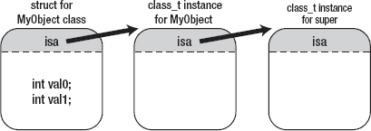

# 第 5 章：Block 的实现

在前面的章节中，我们了解到 Block 是一个带有自动变量的匿名函数。在本章中，我们将通过其实现来详细了解 Block 的运作机制。我们将从 Block 实现的基本概念开始，然后展示各种情况以了解 Block 的工作方式，例如自动变量是如何被捕获的，Block 和 `__block` 变量是如何存储在内存中的，以及对象是如何被 Block 捕获的。此外，我们还会展示一些与循环引用和 copy/release 方法相关的 Block 陷阱。除非特别说明，所有示例源代码均假设启用了 ARC。

## 揭开 Block 的底层原理

你可能会认为 Block 语法是某种特殊的东西。但实际上，编译器将其视为普通的 C 语言源代码。支持 Block 的编译器会将包含 Block 的源代码转换为标准的 C 源代码；然后像往常一样进行编译。

这只是一个概念性的解释。实际上，编译器从不生成人类可读的源代码。但是，`clang`（LLVM 编译器）具有生成人类可读转换后源代码的功能。

在本节中，我们将借助转换后的源代码来展示 Block 是如何实现的。源代码有些复杂，因此我们将逐步进行阐述。首先概览一下，然后再深入细节。


### 转换源码

使用 `"-rewrite-objc"` 编译器选项，包含 Block 语法的源码可以转换成标准 C++ 源码。虽然生成的源码是 C++，但除了使用 struct 的构造函数外，它几乎完全用 C 语言编写。

`clang -rewrite-objc file_name_of_the_source_code`

让我们看看源码（清单 5-1）是如何被转换的。

**清单 5-1.** *包含简单 Block 的示例*

```
int main()
{
    void (^blk)(void) = ^{printf("Block\n");};
    blk();
    return 0;
}
```

这段源码包含一个最简单的 Block 字面量，它没有返回值类型，也没有参数列表。Clang 将源码转换为如清单 5-2 所示。

**清单 5-2.** *清单 5-1 的转换后源码*

```
struct __block_impl {
    void *isa;
    int Flags;
    int Reserved;
    void *FuncPtr;
};

struct __main_block_impl_0 {
    struct __block_impl impl;
    struct __main_block_desc_0* Desc;

    __main_block_impl_0(void *fp, struct __main_block_desc_0 *desc, int flags=0) {
        impl.isa = &_NSConcreteStackBlock;
        impl.Flags = flags;
        impl.FuncPtr = fp;
        Desc = desc;
    }
};

static void __main_block_func_0(struct __main_block_impl_0 *__cself)
{
    printf("Block\n");
}

static struct __main_block_desc_0
{
    unsigned long reserved;
    unsigned long Block_size;
} __main_block_desc_0_DATA = {
    0,
    sizeof(struct __main_block_impl_0)
};

int main() {
    void (*blk)(void) =
        (void (*)(void))&__main_block_impl_0(
            (void *)__main_block_func_0, &__main_block_desc_0_DATA);

    ((void (*)(struct __block_impl *))(
        (struct __block_impl *)blk)->FuncPtr)((struct __block_impl *)blk);

    return 0;
}
```

它从 8 行增加到了 43 行！但当你仔细看时，会发现它并没有那么复杂。我们将从原始源码中的 Block 字面量开始，逐步学习。

`^{printf("Block\n")};`

在转换后的源码中，你可以看到同样的语句。

```
static void __main_block_func_0(struct __main_block_impl_0 *__cself)
{
    printf("Block\n");
}
```

如转换后的源码所示，匿名函数被转换为 C 函数。函数名是自动生成的，由 Block 字面量所在的函数名及其在函数中出现顺序的编号组成。在示例中，函数名是 `"main"`，并且它是第一个 Block 字面量（序号为 0）。

该函数的参数 `__cself` 类似于 Objective-C 实例方法中的 `"self"` 或 C++ 实例方法中的 `"this"`。我们接下来会讨论这些。

### C++ 中的 this 与 Objective-C 中的 self

在 C++ 中，类的实例方法定义如下。

```
void MyClass::method(int arg)
{
    printf("%p %d\n", this, arg);
}
```

C++ 编译器会将其转换为一个 C 函数。

```
void __ZN7MyClass6methodEi(MyClass *this, int arg)
{
    printf("%p %d\n", this, arg);
}
```

`__ZN7MyClass6methodEi` 函数是 `MyClass::method` 的底层实现。参数 `"this"` 被传递给该函数。这个方法是这样调用的：

```
MyClass cls;
cls.method(10);
```

C++ 编译器会将其转换为调用 C 函数的源码，如下所示。

```
struct MyClass cls;
__ZN7MyClass6methodEi(&cls, 10);
```

`"this"` 是 `MyClass` 类（struct）本身的实例。此外，让我们检查一下 Objective-C 中的实例方法。

```
- (void) method:(int)arg
{
    NSLog(@"%p %d\n", self, arg);
}
```

与 C++ 方法相同，Objective-C 编译器会将方法转换为一个 C 函数。

```
void _I_MyObject_method_(struct MyObject *self, SEL _cmd, int arg)
{
    NSLog(@"%p %d\n", self, arg);
}
```

并且，与 C++ 中的 `"this"` 一样，`"self"` 作为第一个参数传递。我们再看看它的调用者。

```
MyObject *obj = [[MyObject alloc] init];
[obj method:10];
```

使用 `clang` 的 `-rewrite-objc` 选项，我们可以看到它如何被转换：

```
MyObject *obj = objc_msgSend(
    objc_getClass("MyObject"), sel_registerName("alloc"));
obj = objc_msgSend(obj, sel_registerName("init"));
objc_msgSend(obj, sel_registerName("method:"), 10);
```

`objc_msgSend` 函数根据对象和方法名搜索 `_I_MyObject_method_` 函数的指针。之后，它调用该函数指针，并将第一个参数 `"obj"` 传递给 `_I_MyObject_method_` 函数作为其第一个参数 `"self"`。与 C++ 一样，`"self"` 是 `MyObject` 类自身的对象。

### 声明 _cself

让我们继续阅读示例。不幸的是，从 Block 语法转换而来的 `__main_block_func_0` 函数并未使用参数 `__cself`。稍后我们会展示 `__cself` 是如何被使用的。现在，我只解释参数 `"__cself"` 是如何声明的。

`struct __main_block_impl_0 *__cself`

如同 Objective-C 中的 `"self"` 或 C++ 中的 `"this"`，参数 `__cself` 是一个指向 `struct __main_block_impl_0` 的指针。`struct __main_block_impl_0` 是如何声明的？

```
struct __main_block_impl_0 {
    struct __block_impl impl;
    struct __main_block_desc_0* Desc;
}
```

转换后的源码因为在其内部声明了构造函数而略显复杂。移除构造函数后，`struct __main_block_impl_0` 就变得如上所示非常简单。接下来，让我们检查一下 `struct __block_impl` 是如何声明的，它被用作第一个成员变量 `"impl"`。

```
struct __block_impl {
    void *isa;
    int Flags;
    int Reserved;
    void *FuncPtr;
};
```

从其名称来看，我们可以大致猜出成员变量的用途，例如标志位、为未来版本预留的区域以及函数指针。目前我们暂且跳过它们。首先，我们来看看用于第二个成员变量 `"Desc"` 的 `__main_block_desc_0` 结构体。

```
struct __main_block_desc_0 {
    unsigned long reserved;
    unsigned long Block_size;
};
```

正如我们可以从名称中猜测到的，它包含一个预留区域和一个 Block 的大小。

### __main_block_impl_0 结构体的构造函数

接下来，让我们检查一下构造函数，它用于初始化包含这些结构体的 `__main_block_impl_0` 结构体。

```
__main_block_impl_0(void *fp, struct __main_block_desc_0 *desc, int flags=0) {
    impl.isa = &_NSConcreteStackBlock;
    impl.Flags = flags;
    impl.FuncPtr = fp;
    Desc = desc;
}
```

它仅仅是初始化 `__main_block_impl_0` 结构体的成员变量。虽然你可能对 `_NSConcreteStackBlock` 感兴趣，它用于初始化我们之前跳过的 `__block_impl` 结构体中的 `"isa"` 变量，但我们首先要检查构造函数是如何被调用的。

```
void (*blk)(void) =
    (void (*)(void))&__main_block_impl_0(
        (void *)__main_block_func_0, &__main_block_desc_0_DATA);
```

这里有太多类型转换，难以理解。我们先把它们全部移除。

```
struct __main_block_impl_0 tmp =
    __main_block_impl_0(__main_block_func_0, &__main_block_desc_0_DATA);

struct __main_block_impl_0 *blk = &tmp;
```

现在，它就容易理解了。一个自动变量的指针被赋值给了变量 `"blk"`，该变量的类型是 `__main_block_impl_0` 结构体的指针。这意味着在栈上创建了一个 `__main_block_impl_0` 结构体的实例，并且其指针被赋值给了该变量。

```
void (^blk)(void) = ^{printf("Block\n");};
```

由 Block 字面量创建的 Block 被赋值给了 Block 类型变量 `"blk"`。因此，这等同于将 `__main_block_impl_0` 结构体实例的指针赋值给变量 `"blk"`。该 Block 等价于 `__main_block_impl_0` 结构体类型的自动变量。换句话说，Block 是在栈上创建的 `__main_block_impl_0` 结构体的实例。


### 初始化 `__main_block_impl_0` 实例

接下来，我们来看一下 `__main_block_impl_0` 结构体的实例是如何初始化的。其构造函数的参数如下：

`__main_block_impl_0(__main_block_func_0, &__main_block_desc_0_DATA);`

第一个参数是一个函数指针，由 Block 字面量转换而来。第二个参数是指向 `__main_block_desc_0` 结构体实例的指针，该实例被初始化为一个静态全局变量。下面我们来检查 `__main_block_desc_0` 结构体实例是如何初始化的：

```
static struct __main_block_desc_0 __main_block_desc_0_DATA = {
    0,
    sizeof(struct __main_block_impl_0)
};
```

它使用 Block 的大小（即 `__main_block_impl_0` 结构体的大小）进行初始化。

下面我们来看看 Stack 上的 `__main_block_impl_0` 结构体实例（即 Block）是如何通过这些参数进行初始化的。如果展开 `__block_impl`，`__main_block_impl_0` 结构体可以重写为：

```
struct __main_block_impl_0 {
    void *isa;
    int Flags;
    int Reserved;
    void *FuncPtr;
    struct __main_block_desc_0* Desc;
}
```

该结构体通过构造函数初始化如下：

```
isa = &_NSConcreteStackBlock;
Flags = 0;
Reserved = 0;
FuncPtr = __main_block_func_0;
Desc = &__main_block_desc_0_DATA;
```

你或许会对 `_NSConcreteStackBlock` 感兴趣，不过我们先暂且略过。先来看其他部分。`__main_block_func_0` 函数的指针被赋值给了其成员变量 `FuncPtr`。它会在以下位置被使用：

`blk();`

这会被转换为：

```
((void (*)(struct __block_impl *))(
    (struct __block_impl *)blk)->FuncPtr)((struct __block_impl *)blk);
```

再次去除类型转换：

```
(*blk->impl.FuncPtr)(blk);
```

这是一个通过函数指针进行的简单函数调用。正如我们所检查过的，成员变量 `FuncPtr` 包含了 `__main_block_func_0` 函数的指针，而该函数由 Block 字面量转换而来。此外，我们还了解到 `__main_block_func_0` 函数的参数 `__cself` 就是 Block 本身。通过这段源码，我们可以确认 Block 作为参数 `__cself` 传入。

### 回顾 `_NSConcreteStackBlock`

我们已经大致了解了 Block 的内部机制。但还有一个多次被我们跳过的问题。`_NSConcreteStackBlock` 是什么？

`isa = &_NSConcreteStackBlock;`

`_NSConcreteStackBlock` 的指针被赋值给了 Block 的结构体中的成员变量 `isa`。要理解其含义，我们需要了解 Objective-C 中类和对象是如何实现的。实际上，Block 在 Objective-C 中也是一个对象。

如你所知，变量类型 `id` 用于存储 Objective-C 对象。我们通常在 Objective-C 源码中随意使用它，就像在 C 语言中使用 `void *` 一样。令人惊讶的是，`id` 类型是在 C 语言中声明的。其声明位于 `/usr/include/objc/objc.h`。

```
typedef struct objc_object {
    Class isa;
} *id;
```

这意味着 `id` 是一个指向 `objc_object` 结构体的指针类型。我们来看看 `Class` 是什么。

```
typedef struct objc_class *Class;
```

`Class` 是一个指向 `objc_class` 结构体的指针类型。`objc_class` 结构体声明在 `/usr/include/objc/runtime.h` 中。

```
struct objc_class {
    Class isa;
};
```

它与 `objc_object` 结构体相同。请注意，`objc_object` 结构体和 `objc_class` 结构体分别作为每个对象和类的基结构体使用。我们通过下面这个简单的 Objective-C 类声明来验证一下。

```
@interface MyObject : NSObject
{
    int val0;
    int val1;
}
@end
```

这个类对应的结构体基于 `objc_object` 结构体，如下所示：

```
struct MyObject {
    Class isa;
    int val0;
    int val1;
};
```

`MyObject` 类的实例变量 `val0` 和 `val1` 直接被声明为该对象结构体的成员变量。在 Objective-C 中创建一个类的对象，等同于从该类生成的结构体中创建出一个实例。每个创建出的对象（即每个对象结构体的实例）在其成员变量 `isa` 中都有一个指向其类结构体实例的指针，如图 5-1 所示。



**图 5-1.** *Objective-C 类与对象*

每个类的结构体是一个基于 `objc_class` 结构体的 `class_t` 结构体。`class_t` 结构体在 `objc4` 运行时库的 `runtime/objc-runtime-new.h` 中声明。

```
struct class_t {
    struct class_t *isa;
    struct class_t *superclass;
    Cache cache;
    IMP *vtable;
    uintptr_t data_NEVER_USE;
};
```

在 Objective-C 中，会为所有类创建并存储 `class_t` 结构体的实例。例如，会创建 `NSObject` 的 `class_t` 结构体实例，以及 `NSMutableArray` 的 `class_t` 结构体实例。这些实例包含了声明的成员变量名称、方法名称、方法实现（即函数指针）、属性以及指向其父类的指针。Objective-C 运行时库会使用这些信息。

现在，我们理解了 Objective-C 中类和对象的实现方式，可以继续下一步了。让我们再来审视一下 Block 的结构体：

```
struct __main_block_impl_0 {
    void *isa;
    int Flags;
    int Reserved;
    void *FuncPtr;
    struct __main_block_desc_0* Desc;
}
```

这个 `__main_block_impl_0` 结构体基于 `objc_object` 结构体，是一个适用于 Objective-C 类对象的结构体。并且，它的成员变量 `isa` 被如下初始化：

`isa = &_NSConcreteStackBlock;`

这意味着 `_NSConcreteStackBlock` 是 `class_t` 结构体的一个实例。当 Block 被当作 Objective-C 对象对待时，`_NSConcreteStackBlock` 包含了其类的所有信息。至此，我们已经了解了 Block 的内部机制，同时也知道了 Block 是一个 Objective-C 对象。


### 捕获自动变量

接下来，我们来看看捕获自动变量的实现方式，同时讨论匿名函数特性的实现原理。捕获自动变量的原始源代码如代码清单 5-3 所示。

**代码清单 5-3.** *捕获自动变量*

```
int main() {
    int dmy = 256;
    int val = 10;
    const char *fmt = "val = %d\n";
    void (^blk)(void) = ^{printf(fmt, val);};
    return 0;
}
```

沿用之前的方法，我们用`clang`对源代码进行转换，转换结果如代码清单 5-4 所示。

**代码清单 5-4.** *代码清单 5-3 的转换后源代码*

```
struct __main_block_impl_0 {
    struct __block_impl impl;
    struct __main_block_desc_0* Desc;
    const char *fmt;
    int val;

    __main_block_impl_0(void *fp, struct __main_block_desc_0 *desc,
            const char *_fmt, int _val, int flags=0) : fmt(_fmt), val(_val) {
        impl.isa = &_NSConcreteStackBlock;
        impl.Flags = flags;
        impl.FuncPtr = fp;
        Desc = desc;
    }
};

static void __main_block_func_0(struct __main_block_impl_0 *__cself)
{
    const char *fmt = __cself->fmt;
    int val = __cself->val;
    printf(fmt, val);
}

static struct __main_block_desc_0 {
    unsigned long reserved;
    unsigned long Block_size;
} __main_block_desc_0_DATA = {
    0,
    sizeof(struct __main_block_impl_0)
};

int main() {
    int dmy = 256;
    int val = 10;
    const char *fmt = "val = %d\n";
    void (*blk)(void) = &__main_block_impl_0(
        __main_block_func_0, &__main_block_desc_0_DATA, fmt, val);

    return 0;
}
```

让我们对比转换后的代码与上一个示例的差异。在 Block 字面量中使用的自动变量，会被添加为`__main_block_impl_0`结构体的成员变量。

```
struct __main_block_impl_0 {
    struct __block_impl impl;
    struct __main_block_desc_0* Desc;
    const char *fmt;
    int val;
};
```

请注意，只有 Block 内部使用到的变量才会被捕获。在这个例子中，`dmy`并未被使用，因此没有被添加。

```
__main_block_impl_0(void *fp, struct __main_block_desc_0 *desc,
        const char *_fmt, int _val, int flags=0) : fmt(_fmt), val(_val) {
```

当结构体实例被初始化时，通过构造函数参数来初始化那些由自动变量添加而来的成员变量。我们来看看传递给构造函数的实际参数。

```
void (*blk)(void) = &__main_block_impl_0(
    __main_block_func_0, &__main_block_desc_0_DATA, fmt, val);
```

`__main_block_impl_0`结构体的实例通过自动变量`fmt`和`val`进行初始化，这两个变量存储的是 Block 字面量声明时刻的值。这意味着`__main_block_impl_0`结构体实例的初始化过程如下：

```
impl.isa = &_NSConcreteStackBlock;
impl.Flags = 0;
impl.FuncPtr = __main_block_func_0;
Desc = &__main_block_desc_0_DATA;
fmt = "val = %d\n";
val = 10;
```

至此，我们理解了自动变量的值是如何被捕获到`__main_block_impl_0`结构体实例（即 Block）中的。

### 匿名函数

接下来，让我们看看使用 Block 实现的匿名函数。原始的 Block 字面量如下所示：

```
^{printf(fmt, val);}
```

这段代码被转换为一个函数。

```
static void __main_block_func_0(struct __main_block_impl_0 *__cself)
{
    const char *fmt = __cself->fmt;
    int val = __cself->val;
    printf(fmt, val);
}
```

在转换后的源代码中，为了使捕获的自动变量在该函数内可用，在由 Block 字面量生成的表达式之前，声明并定义了自动变量。这样，Block 字面量中的原始表达式就能使用这些捕获到的自动变量。

总结来说，捕获自动变量意味着：当 Block 字面量被执行时，其中用到的自动变量的值，会被赋值给 Block 对应的结构体实例的成员变量，而这个实例就是 Block 本身。

顺便提一下，如第 4 章所述，C 数组类型的自动变量不能直接在 Block 中使用。正如我们所学，要捕获自动变量，需要将其值通过构造函数传递给结构体。如果 C 数组从 Block 中使用，其转换后的源代码大致如下所示。

如果将 C 数组传递给 Block 对应的结构体构造函数：

```
void func(char a[10])
{
    printf("%d\n", a[0]);
}

int main()
{
     char a[10] = {2};
    func(a);
}
```

这段代码可以编译并正常运行。之后，构造函数会将参数赋值给成员变量。由 Block 字面量转换而来的函数，则会将成员变量赋值给自动变量。源代码会变成下面这样：

```
void func(char a[10])
{
    char b[10] = a;
    printf("%d\n", b[0]);
}

int main()
{
    char a[10] = {2};
    func(a);
}
```

这段代码试图将一个 C 数组变量赋值给另一个 C 数组变量，但无法通过编译。即使类型和数组长度都相同，C 语言规范也不允许这种赋值操作。当然，存在一些方法可以实现该目的，但在 Block 的实现中，遵循 C 语言规范似乎被视作一个重要的原则。

## 可写变量

接下来，我们展示变量如何在 Block 内变得可写。我们将探讨两种使变量可写的方法，并从回顾 Block 中使用的自动变量开始。再次参考捕获自动变量的例子（代码清单 5-3）。

```
^{printf(fmt, val);}
```

这段源代码被转换为以下形式：

```
static void __main_block_func_0(struct __main_block_impl_0 *__cself)
{
    const char *fmt = __cself->fmt;
    int val = __cself->val;

    printf(fmt, val);
}
```

你可能已经注意到了一些问题。Block 只捕获了其所用自动变量的值。正如我解释过的，因为“匿名函数与自动（局部）变量相结合”，在 Block 使用这些值之后，它们永远不会被写回 Block 结构体的实例，也不会写回原始的自动变量。

接下来，这段源代码试图在 Block 内部修改自动变量`val`。

```
int val = 0;
void (^blk)(void) = ^{val = 1;};
```

这会导致以下编译错误：

```
error: variable is not assignable (missing __block type specifier)
    void (^blk)(void) = ^{val = 1;};
                      ~~~ ^
```

正如我们之前所学，Block 的实现机制永远不会回写变量的修改值。因此，当编译器检测到对捕获的自动变量进行赋值操作时，会引发编译错误。但如果永远无法修改变量值，这种限制会显得非常不便。为了解决这个问题，你有两个选择：使用另一种类型的变量，或者使用`__block`说明符。我们先来讨论另一种类型的变量。


### 静态变量或全局变量

在 C 语言中，存在可写变量：

-   静态变量
-   静态全局变量
-   全局变量

Block 字面量中的匿名函数部分会被直接转换成 C 函数。在转换后的函数中，可以访问静态全局变量和全局变量。它们可以毫无问题地运行。但静态变量则不同。由于转换后的函数声明在原始函数之外——也就是 Block 字面量所在的位置——静态变量因变量作用域而无法访问。我们通过以下源代码来验证这一点。

```
int global_val = 1;
static int static_global_val = 2;

int main()
{
    static int static_val = 3;
    void (^blk)(void) = ^{
        global_val *= 1;
        static_global_val *= 2;
        static_val *= 3;
    };
    return 0;
}
```

在 Block 中，静态变量 `static_val`、静态全局变量 `static_global_val` 和全局变量 `global_val` 被修改。该源代码将如何转换？

```
int global_val = 1;
static int static_global_val = 2;

struct __main_block_impl_0 {
    struct __block_impl impl;
    struct __main_block_desc_0* Desc;
    int *static_val;
    __main_block_impl_0(void *fp, struct __main_block_desc_0 *desc,
            int *_static_val, int flags=0) : static_val(_static_val) {
        impl.isa = &_NSConcreteStackBlock;
        impl.Flags = flags;
        impl.FuncPtr = fp;
        Desc = desc;
    }
};

static void __main_block_func_0(struct __main_block_impl_0 *__cself) {
    int *static_val = __cself->static_val;

    global_val *= 1;
    static_global_val *= 2;
    (*static_val) *= 3;
}

static struct __main_block_desc_0 {
    unsigned long reserved;
    unsigned long Block_size;
} __main_block_desc_0_DATA = {
    0,
    sizeof(struct __main_block_impl_0)
};

int main()
{
    static int static_val = 3;

    blk = &__main_block_impl_0(
        __main_block_func_0, &__main_block_desc_0_DATA, &static_val);

    return 0;
}
```

转换后的源代码看起来似曾相识。静态全局变量 `static_global_val` 和全局变量 `global_val` 的访问方式与原始源代码中完全相同。那么静态变量 `static_val` 呢？以下部分展示了该变量在 Block 内部的使用方式。

```
static void __main_block_func_0(struct __main_block_impl_0 *__cself) {
    int *static_val = __cself->static_val;

    (*static_val) *= 3;
}
```

静态变量 `static_val` 通过其指针进行访问。该变量的指针被传递给了 `__main_block_impl_0` 结构体的构造函数，然后由构造函数赋值。这是在变量作用域之外使用变量的最简单方法。

你可能会想，访问自动变量的方式也可以与静态变量相同。为什么不这样做呢？因为即使在捕获的自动变量离开作用域之后，Block 也必须能够存在。当变量离开作用域时，自动变量会被销毁。这意味着 Block 无法再访问该自动变量。因此，自动变量不能像静态变量那样实现。我们将在下一节中了解这些细节。

### `__block` 说明符

如前所述，避免这个问题的另一个选择是使用 `__block` 说明符。准确地说，它被称为 `__block` 存储类说明符。在 C 语言中，存储类说明符如下所示。

-   `typedef`
-   `extern`
-   `static`
-   `auto`
-   `register`

`__block` 说明符类似于 `static`、`auto` 和 `register`。它们指定变量的存储位置。使用 `auto` 时，值作为自动变量存储在栈上。使用 `static` 时，值作为静态变量存储在数据段中，以此类推。

让我们看看 `__block` 说明符是如何工作的。

当你想要从 Block 中修改自动变量时，会使用 `__block` 说明符。让我们在上一个导致编译错误的源代码中使用 `__block` 说明符。当 `__block` 说明符被添加到自动变量声明中时，会发生什么？

```
__block int val = 10;

void (^blk)(void) = ^{val = 1;};
```

这段源代码可以毫无问题地编译。它的转换结果如 代码清单 5–5 所示。

**代码清单 5–5.** *使用 __block 说明符的转换后源代码*

```
struct __Block_byref_val_0 {
    void *__isa;
    __Block_byref_val_0 *__forwarding;
    int __flags;
    int __size;
    int val;
};

struct __main_block_impl_0 {
    struct __block_impl impl;
    struct __main_block_desc_0* Desc;
    __Block_byref_val_0 *val;
    __main_block_impl_0(void *fp, struct __main_block_desc_0 *desc,
            __Block_byref_val_0 *_val, int flags=0) : val(_val->__forwarding) {
        impl.isa = &_NSConcreteStackBlock;
        impl.Flags = flags;
        impl.FuncPtr = fp;
        Desc = desc;
    }
};

static void __main_block_func_0(struct __main_block_impl_0 *__cself)
{
    __Block_byref_val_0 *val = __cself->val;

    (val->__forwarding->val) = 1;
}

static void __main_block_copy_0(     struct __main_block_impl_0*dst, struct __main_block_impl_0*src)
{
    _Block_object_assign(&dst->val, src->val, BLOCK_FIELD_IS_BYREF);
}

static void __main_block_dispose_0(struct __main_block_impl_0*src) {
    _Block_object_dispose(src->val, BLOCK_FIELD_IS_BYREF);
}

static struct __main_block_desc_0 {
    unsigned long reserved;
    unsigned long Block_size;
    void (*copy)(struct __main_block_impl_0*, struct __main_block_impl_0*);
    void (*dispose)(struct __main_block_impl_0*);
} __main_block_desc_0_DATA = {
    0,
    sizeof(struct __main_block_impl_0),
     __main_block_copy_0,
    __main_block_dispose_0
};

int main()
{
    __Block_byref_val_0 val = {
        0,
        &val,
        0,
        sizeof(__Block_byref_val_0),
        10
    };

    blk = &__main_block_impl_0(
        __main_block_func_0, &__main_block_desc_0_DATA, &val, 0x22000000);

    return 0;
}
```

当为自动变量添加 `__block` 说明符时，源代码变得相当庞大。接下来，我们讨论为什么仅仅为了 `__block` 说明符就需要如此庞大的源代码。

在原始源代码中，`__block` 说明符的使用如下：

```
__block int val = 10;
```

那么 `__block` 变量 `val` 是如何转换的呢？

```
__Block_byref_val_0 val = {
    0,
    &val,
    0,
    sizeof(__Block_byref_val_0),
    10
};
```

令人惊讶的是，它被转换成了一个结构体实例。`__block` 变量是 `__Block_byref_val_0` 结构体的自动变量，就像 Block 一样，这意味着 `__block` 变量是栈上 `__Block_byref_val_0` 结构体的一个实例。`__block` 变量被初始化为 `10`。你可以看到该结构体实例被初始化为 `10`，这意味着该结构体将原始自动变量的值存储在其成员变量中。

让我们检查该结构体的声明。

```
struct __Block_byref_val_0 {
    void *__isa;
    __Block_byref_val_0 *__forwarding;
    int __flags;
    int __size;
    int val;
};
```


