# 排版后的文档

如我们在初始化部分所见，结构体 `"val"` 中的最后一个成员变量，如其名所示，存储了原始的自动变量。

`__block` 变量的赋值是如何工作的？

```
^{val = 1;}
```

这段源代码被转换如下：

```
static void __main_block_func_0(struct __main_block_impl_0 *__cself)
{
    __Block_byref_val_0 *val = __cself->val;
    (val->__forwarding->val) = 1;
}
```

如我们所学，要从 Block 中赋值给静态变量，需要使用指向该静态变量的指针。然而，赋值给 `__block` 变量则更为复杂。用于 Block 的 `__main_block_impl_0` 结构体实例包含一个指针，指向用于 `__block` 变量的 `__Block_byref_val_0` 结构体实例。

`__Block_byref_val_0` 结构体的实例在成员变量 `"__forwarding"` 中保存了一个指向自身结构体实例的指针。通过该 `"__forwarding"` 成员变量，可以访问到与原始自动变量对应的成员变量 `"val"`（见图 5-2）。

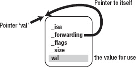

**图 5-2.** *访问 __block 变量*

我们稍后会回到 `"forwarding"` 这个话题。它将在接下来的两节——“Block 的内存段”和“`__block` 变量的内存段”中进一步解释。现在，我们先来看一下 `__Block_byref_val_0` 结构体中那些不在 `__main_block_impl_0` 结构体里的成员变量。`__Block_byref_val_0` 结构体被分离出来的原因是为了让 `__block` 变量能被多个 Block 使用。请看下面的例子：

```
__block int val = 10;

void (^blk0)(void) = ^{val = 0;};

void (^blk1)(void) = ^{val = 1;};
```

Block 类型的变量 `"blk0"` 和 `"blk1"` 都访问了 `__block` 变量 `"val"`。它被转换为：

```
__Block_byref_val_0 val = {0, &val, 0, sizeof(__Block_byref_val_0), 10};

blk0 = &__main_block_impl_0(
    __main_block_func_0, &__main_block_desc_0_DATA, &val, 0x22000000);

blk1 = &__main_block_impl_1(
    __main_block_func_1, &__main_block_desc_1_DATA, &val, 0x22000000);
```

两个 Block 都使用了指向同一个 `__Block_byref_val_0` 结构体实例 `"val"` 的指针，这意味着多个 Block 可以共享同一个 `__block` 变量。另一方面，一个 Block 也可以共享多个 `__block` 变量。多个 `__block` 变量可以通过在 Block 的结构体中添加成员变量，并在构造函数中增加参数来实现。

至此，我们几乎已经学习了关于 `__block` 变量的全部内容。在下一节中，我们将学习之前跳过的话题：

- 为什么 Block 不能超越其变量作用域而存在？
- 用于 `__block` 变量的结构体中的 `"__forwarding"` 成员变量存在的目的是什么？

另外，在“捕获对象”一节中，我将解释 `__main_block_desc_0` 结构体中新增的成员变量 `"copy"` 和 `"dispose"`。

### Block 的内存段

在前面的小节中，我们了解到 Block 被实现为结构体的自动变量，并且会为该 Block 生成相应的结构体。同样，`__block` 变量也被实现为结构体的自动变量，并会为该 `__block` 变量生成相应的结构体。由于它们都被实现为结构体的自动变量，其实例创建在栈上，如表 5-1 所示。

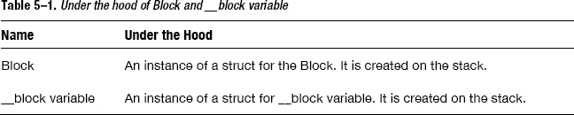

此外，在前面的小节中，我们还了解到 Block 本身也是一个 Objective-C 对象。如果将 Block 视为 Objective-C 的对象，它的类是 `_NSConcreteStackBlock`。虽然之前没有提到，但还有几个与 `_NSConcreteStackBlock` 类似的类：

- `_NSConcreteStackBlock`
- `_NSConcreteGlobalBlock`
- `_NSConcreteMallocBlock`

首先你可能会注意到 `_NSConcreteStackBlock` 类名中带有“stack”（栈），这意味着该类的对象存在于栈上。同时，`_NSConcreteGlobalBlock` 类的对象，如其类名中的“global”（全局）所示，与全局变量一样存储在数据段中，如图 5-3 所示。

`_NSConcreteMallocBlock` 类的对象，你可以从其名称猜出，存储在堆上，就像通过 `"malloc"` 函数分配的内存块一样。

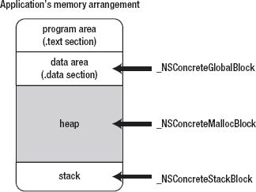

**图 5-3.** *Block 的内存段*


### 作为 `NSConcreteGlobalBlock` 类对象的块

前述示例中的块均使用了 `_NSConcreteStackBlock` 类；也就是说，所有块都存储在栈上。接下来，我将说明其他类类型的使用方式。

首先，当块字面量写在全局变量位置时，该块会被创建为 `_NSConcreteGlobalBlock` 类对象。来看一个示例。

```
void (^blk)(void) = ^{printf("Global Block\n");};
```

```
int main()
{
```

在这段源代码中，块字面量是作为全局变量声明编写的。当它被转换时，其处理方式类似于“揭开块的面纱”一节中的示例，唯一的区别是块结构体中的成员变量 `isa` 会按如下方式初始化。

```
impl.isa = &_NSConcreteGlobalBlock;
```

因此，这个块的类是 `_NSConcreteGlobalBlock`，这意味着块的结构体实例存储在数据段中。由于全局变量声明处不可能存在自动变量，所以不会发生捕获。换句话说，块实例的成员变量不依赖于执行上下文。一个应用程序中只需一个实例，该实例与全局变量一样存储在数据段中。

块的结构体实例仅在捕获自动变量时才会被修改。例如，下面的源代码多次使用了同一个块，但在每次 for 循环中自动变量都会被改变并被捕获。

```
typedef int (^blk_t)(int);

for (int rate = 0; rate < 10; ++rate) {
    blk_t blk = ^(int count){return rate * count;};
}
```

由于每次 for 循环捕获的自动变量不同，块的结构体实例也各不相同。但如果块不捕获任何变量，块的结构体实例则是相同的：

```
typedef int (^blk_t)(int);

for (int rate = 0; rate < 10; ++rate) {
    blk_t blk = ^(int count){return count;};
}
```

不仅当块位于全局变量处时，其结构体实例存储在程序的数据段中；当块字面量位于函数内部且不捕获任何自动变量时，也是如此。

在使用 clang 转换的源代码中，虽然总是使用 `_NSConcreteStackBlock` 类，但具体实现有所不同。我们可以总结如下。

- 当块字面量写在全局变量处时
- 当块字面量中的语法未使用任何需要捕获的自动变量时

在这两种情况下，该块将是 `_NSConcreteGlobalBlock` 类对象，并存储在数据段中。任何由其他类型的块字面量创建的块都将是 `_NSConcreteStackBlock` 类的对象，并存储在栈上。

`_NSConcreteMallocBlock` 类在何时使用，块又在何时存储在堆上？这正好回答了前一节提出的问题。

- 为什么块不能存在于变量作用域之外？
- 为什么 `__block` 变量的结构体中存在成员变量 `__forwarding`？

像全局变量一样存储在数据段中的块，可以在任何变量作用域之外通过指针安全地访问。但其他存储在栈上的块，在离开块的作用域后就会被销毁。同样，`__block` 变量也存储在栈上，因此当离开作用域时，`__block` 变量也会被销毁（图 5-4）。

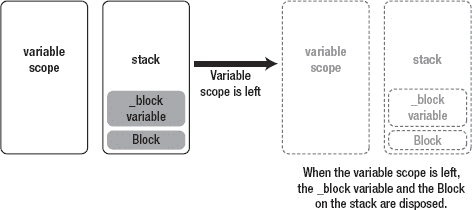

**图 5–4.** *栈上的块和 `__block` 变量*

为了解决这个问题，块提供了一种将块或 `__block` 变量从栈复制到堆的功能。接下来，我们将学习块是如何被复制到堆上的。

### 堆上的块

正如我们所学，块可以被复制到堆上。通过复制块，复制到堆上的块即使在离开作用域后也能继续存在，如图 5-5 所示。让我们看看让块正常工作的技巧是什么。

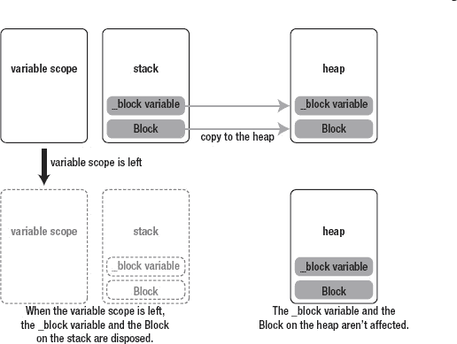

**图 5–5.** *从栈复制到堆的块和 `__block` 变量*

复制到堆上的块的结构体中的成员变量 `isa` 会被重写，使得该块成为 `_NSConcreteMallocBlock` 类对象。

```
impl.isa = &_NSConcreteMallocBlock;
```

同时，无论 `__block` 变量位于栈还是堆上，都必须能被正确访问。这用到了 `__block` 变量结构体中的成员变量 `__forwarding`。

即使 `__block` 变量已被复制到堆上，在某些情况下仍可能访问栈上的 `__block` 变量。由于栈上实例的成员变量 `__forwarding` 指向堆上的实例，因此无论 `__block` 变量位于栈还是堆上，都能被正确访问。我将在“`__Block` 变量的内存段”一节中再次解释这一点。

### 自动复制块

那么，块是如何提供复制功能的呢？事实上，在启用 ARC 的情况下，编译器在许多情况下会自动检测并将块从栈复制到堆。来看下一个示例，该示例调用了一个返回块的函数。

```
typedef int (^blk_t)(int);

blk_t func(int rate)
{
    return ^(int count){return rate * count;};
}
```

函数返回一个存储在栈上的块；也就是说，当控制流返回给调用者时，变量作用域被离开，栈上的块被销毁。这看起来有问题。让我们检查一下在启用 ARC 时它是如何被转换的。

```
blk_t func(int rate)
{
    blk_t tmp = &__func_block_impl_0(
        __func_block_func_0, &__func_block_desc_0_DATA, rate);

    tmp = objc_retainBlock(tmp);

    return objc_autoreleaseReturnValue(tmp);
}
```

由于启用了 ARC，`blk_ttmp` 等同于 `blk_t __strong tmp`，这意味着该变量被 `__strong` 修饰。

如果你阅读过 objc4 运行时库中的源代码 `runtime/objc-arr.mm`，你会发现 `objc_retainBlock` 函数等同于 `_Block_copy` 函数。因此，上述源代码等同于：

```
tmp = _Block_copy(tmp);
return objc_autoreleaseReturnValue(tmp);
```

让我们通过注释来了解发生了什么：

```
/*
 * 将块从字面量赋值给变量 'tmp'，
 * 这意味着该变量持有栈上块的结构体实例。
 * Block_copy 函数将块从栈复制到堆。
 * 复制后，堆上的地址被赋值给变量 'tmp'。
 */

tmp = _Block_copy(tmp);

/*
 * 然后，堆上的块作为 Objective-C 对象注册到自动释放池中。
 * 之后，该块被返回。
 */

return objc_autoreleaseReturnValue(tmp);
```

这意味着当函数返回块时，编译器会自动将其复制到堆上。


### 手动管理 Block

我提到过“在多数情况下，编译器会自动检测”。但当编译器未能检测到时，你就需要手动将 Block 从栈复制到堆。为此，你可以使用实例方法 `copy`。我们在第一部分多次见过的 `copy` 方法，属于 alloc/new/copy/mutableCopy 方法组。那么，编译器在什么情况下无法检测到呢？

答案是：

- 当 Block 作为参数传递给方法或函数时

但如果方法或函数在内部复制了该参数，则调用者无需手动复制，例如：

- Cocoa 框架中名称包含 `usingBlock` 的方法
- Grand Central Dispatch API

例如，在使用 `NSArray` 实例方法 `enumerateObjectsUsingBlock` 或 `dispatch_async` 函数时，你无需进行复制。相反，当你将 Block 传递给 `NSArray` 类实例方法 `initWithObjects` 时，则需要复制 Block。下面通过示例来说明。

```
- (id) getBlockArray
{
    int val = 10;

    return [[NSArray alloc] initWithObjects:
        ^{NSLog(@"blk0:%d", val);},
        ^{NSLog(@"blk1:%d", val);}, nil];
}
```

`getBlockArray` 方法在栈上创建了两个 Block，并将它们传递给 `NSArray` 类实例方法 `initWithObjects`。当从 `NSArray` 对象获取 Block 并在调用者中执行时，会发生什么？

```
id obj = getBlockArray();

typedef void (^blk_t)(void);

blk_t blk = (blk_t)[obj objectAtIndex:0];

blk();
```

应用会在执行 `blk()` 时崩溃。换句话说，Block 的执行会抛出异常。从 `getBlockArray` 函数返回后，栈上的 Block 已被销毁。不幸的是，在这种情况下，编译器无法检测是否需要复制。虽然编译器可以在不检测是否需要复制的情况下每次都复制所有 Block，但当 Block 从栈复制到堆时会消耗过多的 CPU 资源。如果栈上的 Block 已经足够用，却仍然被复制到堆上，CPU 性能就被白白浪费了。因此，编译器不会这样做。但反过来，有时你就需要手动复制 Block。

修改后的源码如下，可以正常工作。

```
- (id) getBlockArray
{
    int val = 10;

    return [[NSArray alloc] initWithObjects:
        [^{NSLog(@"blk0:%d", val);} copy],
        [^{NSLog(@"blk1:%d", val);} copy], nil];
}
```

看起来有点奇怪，但可以直接对 Block 字面量调用 `copy` 方法。当然，你也可以通过 Block 类型的变量来调用 `copy` 方法。

```
typedef int (^blk_t)(int);

blk_t blk = ^(int count){return rate * count;};

blk = [blk copy];
```

顺便问一下，如果对堆上或数据段中的 Block 调用 `copy` 方法，会发生什么？表 5-2 总结了这些情况。

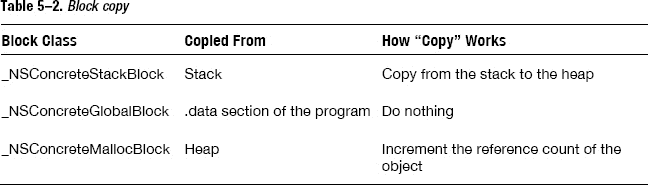

无论 Block 存储在何处，调用 `copy` 方法都不会产生不良后果。如果你不确定是否需要复制，那么直接对 Block 调用 `copy` 是安全的选择。

但是，多次调用 `copy` 可以吗？因为在 ARC 下，我们不能调用 `release`。

#### 多次复制 Block

```
blk = [[[[blk copy] copy] copy] copy];
```

这可以重写为如下形式。

```
{
    blk_t tmp = [blk copy];
    blk = tmp;
}
{
    blk_t tmp = [blk copy];
    blk = tmp;
}
{
    blk_t tmp = [blk copy];
    blk = tmp;
}
{
    blk_t tmp = [blk copy];
    blk = tmp;
}
```

让我们用 代码清单 5-6 中带注释的源码来检查一下。

**代码清单 5-6.** *带注释的多次复制*

```
     /*
      * 假设一个栈上的 Block 已被赋值给变量 'blk'
      */

    blk_t tmp = [blk copy];

     /*
      * 一个堆上的 Block 被赋值给变量 'tmp'。
      * 由于强引用，'tmp' 拥有该 Block 的所有权。
      */

    blk = tmp;

     /*
      * 变量 'tmp' 中的 Block 被赋值给变量 'blk'。
      * 由于强引用，'blk' 拥有该 Block 的所有权。
      *
      * 最初赋值给 'blk' 的那个 Block 不受此赋值影响，因为它位于栈上。
      *
      * 此时，变量 'blk' 和 'tmp' 都拥有该 Block 的所有权。
      */

}
     /*
      * 离开变量作用域 'tmp'，
      * 其强引用消失，Block 被释放。
      *
      * 由于变量 'blk' 拥有该 Block 的所有权，因此该 Block 不会被销毁。
      */
{
     /*
      * 变量 'blk' 持有一个堆上的 Block。
      * 由于强引用，'blk' 拥有该 Block 的所有权。
      */

    blk_t tmp = [blk copy];

     /*
      * 一个堆上的 Block 被赋值给变量 'tmp'。
      * 由于强引用，'tmp' 拥有该 Block 的所有权。
      */

    blk = tmp;

     /*
      * 由于不同的值被赋值给变量 'blk'，
      * 对之前赋值给变量 'blk' 的 Block 的强引用消失，
      * 该 Block 被释放。
      *
      * 变量 'tmp' 拥有该 Block 的所有权，
      * 因此该 Block 不会被销毁。
      *
      * 变量 'tmp' 中的 Block 被赋值给变量 'blk'。
      * 由于强引用，变量 'blk' 拥有了所有权。
      *
      * 此时，变量 'blk' 和 'tmp' 都拥有该 Block 的所有权。
      */

}
     /*
      * 离开变量作用域 'tmp'，
      * 其强引用消失，Block 被释放。
      *
      * 由于变量 'blk' 拥有该 Block 的所有权，因此该 Block 不会被销毁。
      */

     /*
      * 重复 ...
      */
```

在 ARC 下，这可以正常工作，没有问题。


### `__block` 变量的内存段

在上一节中，我们只学习了 Block。那么 `__block` 变量呢？当 Block 使用了 `__block` 变量并从栈复制到堆时，`__block` 变量会受到影响。表 5-3 对此进行了总结。

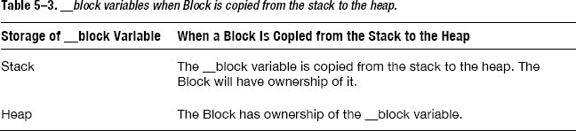

当 Block 从栈复制到堆，并且它使用了 `__block` 变量，但其他 Block 未使用这些 `__block` 变量时，这些 `__block` 变量必须在栈上。此时，所有 `__block` 变量也会从栈复制到堆，并且该 Block 拥有这些 `__block` 变量的所有权，如图 5-6 所示。

当堆上的 Block 再次被复制时，`__block` 变量不会受到影响。

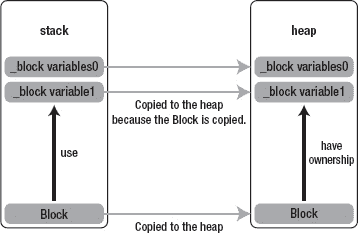

**图 5-6.** *一个 Block 使用 __block 变量*

如果 `__block` 变量被多个 Block 使用会发生什么？起初，所有 Block 和 `__block` 变量都在栈上。当其中一个 Block 从栈复制到堆时，`__block` 变量也会从栈复制到堆。并且该 Block 拥有这些变量的所有权。当另一个 Block 从栈复制到堆时，被复制的 Block 拥有这些 `__block` 变量的所有权（图 5-7）。换句话说，`__block` 变量的引用计数会增加 1。

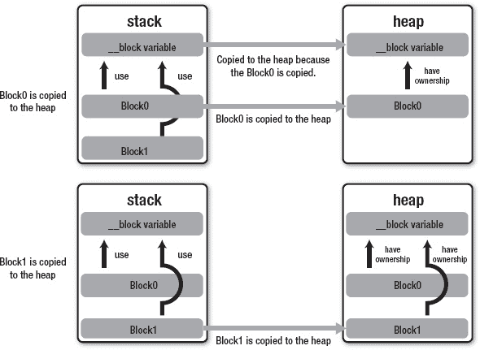

**图 5-7.** *多个 Block 使用一个 __block 变量*

当堆上的 Block 被释放时，Block 中使用的 `__block` 变量也会被释放，如图 5-8 所示。

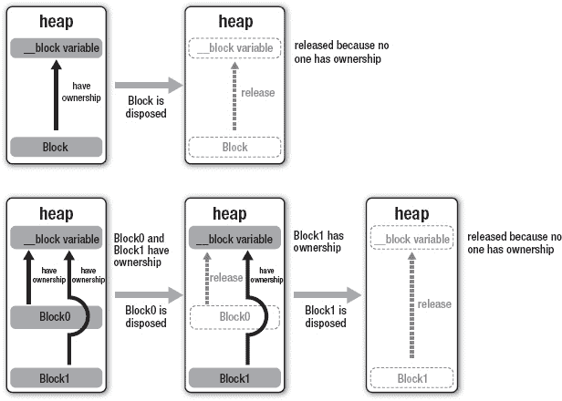

**图 5-8.** *Block 被释放，__block 变量也被释放*

这个概念与 Objective-C 中基于引用计数的内存管理完全一致。当 Block 使用 `__block` 变量时，Block 拥有该变量的所有权。当 Block 被释放时，所有权消失，`__block` 变量也被释放。

现在我们已经了解了 `__block` 变量如何存储在应用程序内存中。接下来，让我们学习 `__forwarding`。

### `__forwarding`

`__forwarding` 用于正确访问 `__block` 变量，正如我在“Block 的内存段”一节中所解释的。接下来，让我们检查当 Block 被复制到堆时它是如何工作的。

我已经解释过，栈上实例的成员变量“`__forwarding`”会指向堆上实例的指针，这样无论变量在栈上还是堆上，都能被正确访问。

当 Block 被复制时，`__block` 变量也会从栈复制到堆。在这种情况下，栈上和堆上的 `__block` 变量可能同时被访问。让我们看看下面的例子。

```
__block int val = 0;

void (^blk)(void) = [^{++val;} copy];

++val;

blk();

NSLog(@"%d", val);
```

当使用 `__block` 变量的 Block 通过“copy”方法复制时，不仅 Block，`__block` 变量也会从栈复制到堆。

让我们看看 `__block` 变量是在哪里使用的。初始化之后，它在 Block 字面量内部被使用。

```
^{++val;}
```

在 Block 字面量之后，它也在 Block 外部被使用：

```
++val;
```

这两个源代码都会被转换成如下形式。

```
++(val.__forwarding->val);
```

在从 Block 字面量转换而来的函数中，变量“val”是堆上用于 `__block` 变量的结构体实例。Block 外部的另一个变量“val”则在栈上。当 `__block` 变量从栈复制到堆时，栈上实例的成员变量“`__forwarding`”会被修改为堆上复制实例的地址，如图 5-9 所示。

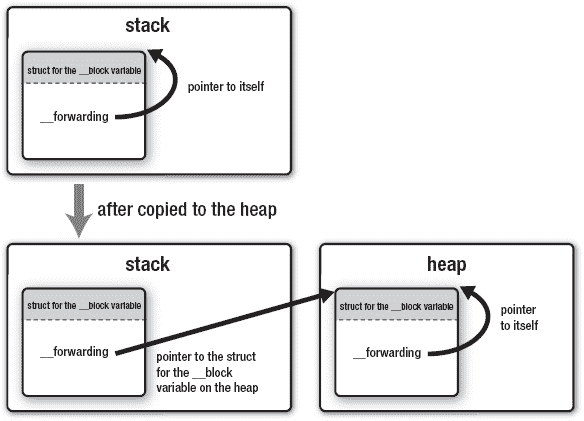

**图 5-9.** *复制 __block 变量*

通过这种机制，无论 `__block` 变量是在栈上还是堆上，我们都可以从任何地方（Block 字面量内部或 Block 字面量外部）访问同一个 `__block` 变量。


### 捕获对象

前面我们看到了使用整型变量的例子。接下来，让我们看看在 Block 中使用对象时会发生什么。在下面的源代码中，创建了一个 `NSMutableArray` 类的对象，并且赋值的变量拥有其所有权。由于使用 `__strong` 修饰的变量的作用域即将结束，该对象被释放并销毁。

```
{
    id array = [[NSMutableArray alloc] init];
}
```

代码清单 5-7 在 Block 字面量中使用了变量 `array`。

**代码清单 5-7.** *捕获一个对象*

```
blk_t blk;
{
    id array = [[NSMutableArray alloc] init];
    blk = [^(id obj) {
        [array addObject:obj];
        NSLog(@"array count = %ld", [array count]);
    } copy];
}
blk([[NSObject alloc] init]);
blk([[NSObject alloc] init]);
blk([[NSObject alloc] init]);
```

由于变量 `array` 的强引用消失，赋给变量 `array` 的 `NSMutableArray` 类对象理应被释放并销毁。但结果显示它运行无误。

```
array count = 1
array count = 2
array count = 3
```

这意味着，在源代码执行 Block 的最后部分时，即使变量作用域已经结束，赋给变量 `array` 的 `NSMutableArray` 类对象仍然存在。源代码的转换结果如代码清单 5-8 所示。

**代码清单 5-8.** *代码清单 5-7 的转换后源代码*

```
/* Block 的结构体和相关函数 */

struct __main_block_impl_0 {
    struct __block_impl impl;
    struct __main_block_desc_0* Desc;
    id __strong array;
    __main_block_impl_0(void *fp, struct __main_block_desc_0 *desc,
    id __strong _array, int flags=0) : array(_array) {
        impl.isa = &_NSConcreteStackBlock;
        impl.Flags = flags;
        impl.FuncPtr = fp;
        Desc = desc;
    }
};

static void __main_block_func_0(struct __main_block_impl_0 *__cself, id obj)
{
    id __strong array = __cself->array;
    [array addObject:obj];
    NSLog(@"array count = %ld", [array count]);
}

static void __main_block_copy_0(struct __main_block_impl_0 *dst,         struct
__main_block_impl_0 *src)
{
    _Block_object_assign(&dst->array, src->array, BLOCK_FIELD_IS_OBJECT);
}

static void __main_block_dispose_0(struct __main_block_impl_0 *src)
{
    _Block_object_dispose(src->array, BLOCK_FIELD_IS_OBJECT);
}

static struct __main_block_desc_0 {
    unsigned long reserved;
    unsigned long Block_size;
    void (*copy)(struct __main_block_impl_0*, struct __main_block_impl_0*);
    void (*dispose)(struct __main_block_impl_0*);
} __main_block_desc_0_DATA = {
    0,
    sizeof(struct __main_block_impl_0),
    __main_block_copy_0,
    __main_block_dispose_0
};

/* Block 字面量及执行 Block */

blk_t blk;
{
    id __strong array = [[NSMutableArray alloc] init];

    blk = &__main_block_impl_0(
        __main_block_func_0, &__main_block_desc_0_DATA, array, 0x22000000);
    blk = [blk copy];
}

(*blk->impl.FuncPtr)(blk, [[NSObject alloc] init]);
(*blk->impl.FuncPtr)(blk, [[NSObject alloc] init]);
(*blk->impl.FuncPtr)(blk, [[NSObject alloc] init]);
```

请特别注意捕获的自动变量 `array`，它存储了 `NSMutableArray` 类的对象。你可以看到，用于 Block 的结构体包含了一个拥有 `__strong` 所有权修饰符的成员变量 `array`。

```
struct __main_block_impl_0 {
    struct __block_impl impl;
    struct __main_block_desc_0* Desc;
    id __strong array;
};
```

在 Objective-C 中，正如我们在第 2 章中学到的，C 结构体不能包含使用 `__strong` 修饰的成员变量。原因在于编译器无法检测 C 结构体何时被初始化或销毁，从而无法进行正确的内存管理。

然而，Objective-C 运行时库可以检测到 Block 何时从栈复制到堆，以及堆上的 Block 何时被销毁。因此，如果 Block 的结构体包含使用 `__strong` 或 `__weak` 修饰的变量，编译器就可以正确地初始化和销毁它们。为此，`struct __main_block_desc_0` 中添加了 `copy` 和 `dispose` 成员变量，并为其分配了 `__main_block_copy_0` 和 `__main_block_dispose_0` 函数。

在源代码中，Block 的结构体包含一个使用 `__strong` 修饰的对象类型变量 `array`。由于编译器需要正确管理变量 `array` 中的对象，`__main_block_copy_0` 函数会调用 `_Block_object_assign` 函数，将目标对象赋值给成员变量 `array` 并获取其所有权。

```
static void __main_block_copy_0(struct __main_block_impl_0 *dst,
        struct __main_block_impl_0 *src)
{
     _Block_object_assign(&dst->array, src->array, BLOCK_FIELD_IS_OBJECT);
}
```

`_Block_object_assign` 函数将对象赋值给成员变量，并调用一个相当于 `retain` 方法的函数。

同样，`__main_block_dispose_0` 函数会调用 `_Block_object_dispose` 函数，以释放 Block 结构体中赋值给成员变量 `array` 的对象。

```
static void __main_block_dispose_0(struct __main_block_impl_0 *src)
{
_Block_object_dispose(src->array, BLOCK_FIELD_IS_OBJECT);
}
```

`_Block_object_dispose` 函数会在结构体目标成员变量中的对象上调用一个相当于实例方法 `release` 的函数。

顺便提一下，`__main_block_copy_0` 函数（本书后续简称“copy 函数”）和 `__main_block_dispose_0` 函数（本书后续简称“dispose 函数”）被赋值给了 `__main_block_desc_0` 结构体中的 `copy` 和 `dispose` 成员变量。但在转换后的源代码中，包括通过指针调用在内，这些函数完全没有被调用。那么这些函数是如何被使用的呢？

这些函数会在 Block 从栈复制到堆时，以及堆上的 Block 被销毁时被调用（参见表 5-4）。

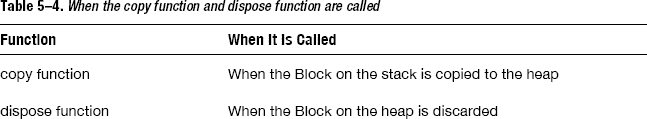

栈上的 Block 何时会被复制到堆上？

*   当在 Block 上调用实例方法 `copy` 时
*   当 Block 作为函数返回值时
*   当 Block 被赋值给使用 `__strong` 修饰的 `id` 类型或 Block 类型的类成员变量时
*   当 Block 被传递给方法（包括 Cocoa 框架中的 `usingBlock` 方法或 Grand Central Dispatch API）时

“当在 Block 上调用实例方法 `copy` 时”，如果 Block 在栈上，则会被复制到堆上。“当 Block 作为函数返回值时”或“当 Block 被赋值给使用 `__strong` 修饰的 `id` 类型或 Block 类型的类成员变量时”，编译器会自动调用以目标 Block 为参数的 `_Block_copy` 函数，这相当于在 Block 上调用 `copy` 实例方法。“当 Block 被传递给方法（包括 Cocoa 框架中的 `usingBlock` 方法或 Grand Central Dispatch API）时”，会在方法或函数内部调用 Block 的实例方法 `copy`，或以 Block 为参数调用 `_Block_copy` 函数。

栈上的 Block 会以这种方式在各种情况下被复制，但从某种意义上说，所有这些情况其实都是相同的。实际上，Block 只会在调用 `_Block_copy` 函数时被复制。


相反，当堆上的 Block 因无人拥有所有权而被释放和销毁时，会调用 `dispose` 函数。它相当于对象的 `dealloc` 方法。通过这种机制，Block 捕获的对象可以通过赋值给带有 `__strong` 限定符的自动变量，从而在变量作用域之外继续存在。虽然我们在“`__block` 说明符”一节中跳过了这部分内容，但这种包含 `copy` 和 `dispose` 函数的机制同样适用于 `__block` 变量。

```
static void __main_block_copy_0(
    struct __main_block_impl_0*dst, struct __main_block_impl_0*src)
{
    _Block_object_assign(&dst->val, src->val, BLOCK_FIELD_IS_BYREF);
}

static void __main_block_dispose_0(struct __main_block_impl_0*src) {
    _Block_object_dispose(src->val, BLOCK_FIELD_IS_BYREF);
}
```

在转换后的源代码中，与 Block 结构体相关的部分几乎相同，唯一的区别列在表 5-5 中。

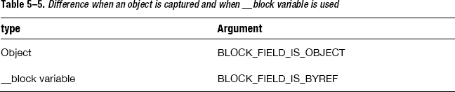

参数 `BLOCK_FIELD_IS_OBJECT` 和 `BLOCK_FIELD_IS_BYREF` 用于切换 `copy` 和 `dispose` 函数的目标是对象还是 `__block` 变量。

与通过 `copy` 函数获取捕获对象的所有权、通过 `dispose` 函数释放所有权的方式相同，Block 也通过 `copy` 函数获取 `__block` 变量的所有权，并通过 `dispose` 函数释放所有权。

现在我们已经了解到，当对象被赋值给带有 `__strong` 的自动变量时，该对象可以在变量作用域之外继续存在；而当 `__block` 变量被复制到堆上，并且堆上的 Block 拥有其所有权时，它也可以在变量作用域之外继续存在。

### 何时应调用“copy”方法

顺便问一下，在前面的源代码中，如果没有对 Block 调用实例方法 `copy`，会发生什么？

```
blk_t blk;

{
    id array = [[NSMutableArray alloc] init];
    blk = ^(id obj) {
        [array addObject:obj];
        NSLog(@"array count = %ld", [array count]);
    };
}

blk([[NSObject alloc] init]);
blk([[NSObject alloc] init]);
blk([[NSObject alloc] init]);
```

结果是应用程序终止。

只有当调用了 `_Block_copy` 函数时，才会获取被捕获的、带有 `__strong` 限定符的对象类型自动变量的所有权。因此，举个例子，如果没有调用 `_Block_copy` 函数，即使对象被捕获，它也会被销毁。所以，当你在 Block 内部使用对象类型的自动变量时，应该对 Block 调用实例方法 `copy`，但以下情况除外。

* 当 Block 从函数返回时
* 当 Block 被赋值给 `id` 类型或 Block 类型类的成员变量，且该变量带有 `__strong` 限定符时
* 当 Block 被传递给 Cocoa 框架中包含 `usingBlock` 的方法，或 Grand Central Dispatch API 时

接下来，让我们看看当对象存储在 `__block` 变量中时会发生什么。

### `__block` 变量与对象

`__block` 说明符可用于任何类型的自动变量。接下来看看如何使用它来将一个 Objective-C 对象赋值给一个 `id` 类型的自动变量。

```
__block id obj = [[NSObject alloc] init];
```

这等价于：

```
__block id __strong obj = [[NSObject alloc] init];
```

当启用 ARC 时，`id` 或对象类型的变量总是带有所有权限定符，并且其默认值是 `__strong`。clang 会按如下方式进行转换。

```
/* __block 变量的结构体 */

struct __Block_byref_obj_0 {
    void *__isa;
    __Block_byref_obj_0 *__forwarding;
    int __flags;
    int __size;
    void (*__Block_byref_id_object_copy)(void*, void*);
    void (*__Block_byref_id_object_dispose)(void*);
    __strong id obj;
};

static void __Block_byref_id_object_copy_131(void *dst, void *src) {
    _Block_object_assign((char*)dst + 40, *(void * *) ((char*)src + 40), 131);
}

static void __Block_byref_id_object_dispose_131(void *src) {
    _Block_object_dispose(*(void * *) ((char*)src + 40), 131);
}

/* __block 变量声明 */

 __Block_byref_obj_0 obj = {
    0,
    &obj,
    0x2000000,
    sizeof(__Block_byref_obj_0),
    __Block_byref_id_object_copy_131,
    __Block_byref_id_object_dispose_131,
    [[NSObject alloc] init]
};
```

这里使用了上一节中解释过的 `_Block_object_assign` 和 `_Block_object_dispose` 函数。

当一个 `id` 或对象类型的自动变量被 Block 捕获，并且 Block 从栈复制到堆时，会调用 `_Block_object_assign` 函数，以便 Block 获取被捕获对象的所有权。当堆上的 Block 被销毁时，会调用 `_Block_object_dispose` 函数来释放被捕获的对象。

当带有 `__strong` 限定符的 `id` 或对象类型的自动变量同时具有 `__block` 说明符时，也会发生同样的情况。当 `__block` 变量从栈复制到堆时，会调用 `_Block_object_assign` 函数，以便 Block 获取 `__block` 变量的所有权。当堆上的 `__block` 变量被销毁时，会调用 `_Block_object_dispose` 函数来释放 `__block` 变量中的对象。

现在我们明白了，只要带有 `__strong` 限定符的对象类型 `__block` 变量存在于堆上，赋值给该 `__block` 变量的对象同样会存在，并且其所有权得到妥善管理。这就好比一个被赋值给带有 `__strong` 限定符的对象类型自动变量的对象，在 Block 内部被使用一样。

顺便提一下，到目前为止，我们只学习了带有 `__strong` 限定符的 `id` 或对象类型的自动变量。其他所有权限定符的情况又如何呢？使用 `__weak` 所有权限定符会发生什么？下面的源代码是关于带有 `__weak` 限定符的 `id` 类型变量。

```
blk_t blk;

{
    id array = [[NSMutableArray alloc] init];
    id __weak array2 = array;
    blk = [^(id obj) {

        [array2 addObject:obj];

        NSLog(@"array2 count = %ld", [array2 count]);

    } copy];
}

blk([[NSObject alloc] init]);
blk([[NSObject alloc] init]);
blk([[NSObject alloc] init]);
```

结果与“捕获对象”一节中的结果不同。

```
array2 count = 0
array2 count = 0
array2 count = 0
```

这是因为当离开变量作用域时，变量 `array` 被释放并丢弃，并且将 `nil` 赋值给了变量 `array2`。这正如所预期的那样工作。

如果同时使用 `__block` 说明符和 `__weak` 所有权限定符，会发生什么？

```
blk_t blk;

{
    id array = [[NSMutableArray alloc] init];
    __block id __weak array2 = array;

    blk = [^(id obj) {

        [array2 addObject:obj];

        NSLog(@"array2 count = %ld", [array2 count]);
    } copy];
}

blk([[NSObject alloc] init]);
blk([[NSObject alloc] init]);
blk([[NSObject alloc] init]);
```

结果与上一个相同。

```
array2 count = 0
array2 count = 0
array2 count = 0
```


即使带有`__block`说明符，当变量作用域结束，具有`__strong`修饰符的变量“array”会被释放并丢弃，然后因为“array2”被`__weak`修饰，`nil`会被赋值给变量“array2”。

具有`__unsafe_unretained`修饰符的变量就像一个简单的指针。无论它如何在 Block 内部使用或带有`__block`说明符，`__strong`或`__weak`修饰符的机制都不会起作用。因此，当你使用具有`__unsafe_unretained`修饰符的变量时，请注意不要通过悬垂指针访问已丢弃的对象。请参见第 2 章，“`__unsafe_unretained`所有权修饰符”一节。

`__autoreleasing`修饰符假定不与 Block 一起使用，因此不应使用它。如果你将其与`__block`说明符一起使用，会发生编译错误。

```
__block id __autoreleasing obj = [[NSObject alloc] init];
```

因为对变量“obj”同时使用了`__autoreleasing`所有权修饰符和`__block`说明符，会发生编译错误：

```
error: __block variables cannot have __autoreleasing ownership
    __block id __autoreleasing obj = [[NSObject alloc] init];
                                                       ^
```

### Blocks 的循环引用

如果 Block 使用了具有`__strong`修饰符的对象类型的自动变量，当 Block 从栈复制到堆时，Block 将拥有该对象的所有权。这很容易导致循环引用。让我们看下面的例子。

```
typedef void (^blk_t)(void);

@interface MyObject : NSObject
{
    blk_t blk_;
}
@end

@implementation MyObject

- (id)init
{
    self = [super init];
    blk_ = ^{NSLog(@"self = %@", self);};
    return self;
}

- (void)dealloc
{
    NSLog(@"dealloc");
}
@end

int main()
{
    id o = [[MyObject alloc] init];
    NSLog(@"%@", o);
    return 0;
}
```

在这个例子中，`MyObject`类的实例方法“dealloc”永远不会被调用。

`MyObject`类的对象强引用了 Block，该 Block 被赋值给 Block 类型成员变量“blk_”，这意味着`MyObject`类的对象拥有该 Block 的所有权。Block 字面量在实例方法“init”中执行，并且它使用了具有`__strong`修饰符的`id`类型变量“self”。当 Block 字面量被赋值给成员变量“blk_”时，由该字面量生成的 Block 从栈被复制到堆。因为 Block 使用了“self”，所以 Block 拥有“self”的所有权。

因此，“self”拥有 Block 的所有权，Block 也拥有“self”的所有权。这就形成了如图 5-10 所示的循环引用。

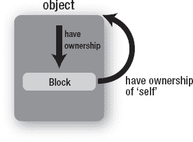

**图 5–10.** *Block 成员变量的循环引用*

在这种情况下，编译器可以检测到循环引用。警告消息会正确显示。

```
warning: capturing 'self' strongly in this block is likely to lead
        to a retain cycle [-Warc-retain-cycles]
            blk_ = ^{NSLog(@"self = %@", self);};
                                         ^~~~

note: Block will be retained by an object strongly retained by the
        captured object
            blk_ = ^{NSLog(@"self = %@", self);};
            ^~~~
```

为了避免循环引用，例如，你可以使用`__weak`修饰符声明一个变量，并将“self”赋值给它（图 5–11）。

```
- (id)init
{
    self = [super init];
    id __weak tmp = self;
    blk_ = ^{NSLog(@"self = %@", tmp);};
    return self;
}
```

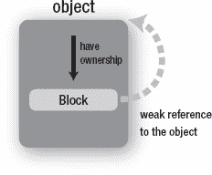

**图 5–11.** *避免 Block 成员变量的循环引用*

在源代码中，只要 Block 存在，拥有该 Block 所有权的`MyObject`类的对象也就存在，这意味着赋值给变量“tmp”的“self”始终存在。因此，你不需要检查“tmp”是否为`nil`。

对于 iOS 4 或 Snow Leopard 应用程序，你必须使用`__unsafe_unretained`所有权修饰符来代替`__weak`。在这个例子中，你可以使用它而无需担心悬垂指针。

```
- (id)init {
    self = [super init];
    id __unsafe_unretained tmp = self;
    blk_ = ^{NSLog(@"self = %@", tmp);};
    return self;
}
```

并且，在接下来的源代码中，即使 Block 中没有使用到`self`，但因为捕获了`self`，所以会发生循环引用。

```
@interface MyObject : NSObject
{
    blk_t blk_;
    id obj_;
}
@end

@implementation MyObject
- (id)init
{
    self = [super init];
    blk_ = ^{NSLog(@"obj_ = %@", obj_);};
    return self;
}
```

你可以从警告消息中发现原因：

```
warning: capturing 'self' strongly in this Block is likely to lead
        to a retain cycle [-Warc-retain-cycles]
            blk_ = ^{NSLog(@"obj_ = %@", obj_);};
                                                                    ^~~~
note: Block will be retained by an object strongly retained by the
         captured object
            blk_ = ^{NSLog(@"obj_ = %@", obj_);};
            ^~~~
```


因为 Block 字面量使用了 `obj_`，所以 `self` 被捕获。实际上，对于编译器而言，`obj_` 只是对象对应结构体中的一个成员变量，如下所示。

```
blk_ = ^{NSLog(@"obj_ = %@", self->obj_);};
```

你可以像上一个示例那样，使用 `__weak` 所有权修饰符来避免循环引用。出于同样的原因，在此示例中，你也可以安全地使用 `__unsafe_unretained` 所有权修饰符。

```
- (id)init
{
    self = [super init];
    id __weak obj = obj_;
    blk_ = ^{NSLog(@"obj_ = %@", obj);};
    return self;
}
```

当你使用 `__weak` 所有权修饰符来避免循环引用时，即使可以通过检查变量是否为 `nil` 来知晓对象是否存在，但在你使用该变量的整个过程中，对象应该一直存在。

此外，还有另一种避免循环引用的方法。你可以通过使用 `__block` 变量来实现，如下所示。

```
typedef void (^blk_t)(void);

@interface MyObject : NSObject
{
    blk_t blk_;
}
@end

@implementation MyObject

- (id)init
{
        self = [super init];
    __block id tmp = self;
    blk_ = ^{
        NSLog(@"self = %@", tmp);
        tmp = nil;
    };
    return self;
}

- (void)execBlock
{
    blk_();
}

- (void)dealloc
{
NSLog(@"dealloc");
}
@end

int main()
{
    id o = [[MyObject alloc] init];
    [o execBlock];
    return 0;
}
```

这段源码不会引起循环引用。然而，如果不调用实例方法 `execBlock`，换句话说，如果赋值给成员变量 `blk_` 的 Block 没有被执行，就会产生循环引用，如图 Figure 5–12 所示。

在 `MyObject` 类的对象被创建后，循环引用便存在了，因为：

*   `MyObject` 类的对象拥有 Block 的所有权。
*   Block 拥有 `__block` 变量的所有权。
*   `__block` 变量拥有 `MyObject` 类对象的所有权。

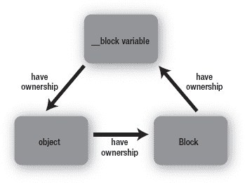

**Figure 5–12.** *循环引用*

如果实例方法 `execBlock` 没有被调用，循环引用会导致内存泄漏。通过调用实例方法 `execBlock`，Block 会被执行，并且 `nil` 会被赋值给 `__block` 变量 `tmp`。

```
blk_ = ^{
    NSLog(@"self = %@", tmp);
    tmp = nil;
};
```

此后，`__block` 变量 `tmp` 不再强引用 `MyObject` 类对象。因此，循环引用消失了，如图 Figure 5–13 所示。其关系如下：

*   `MyObject` 类的对象拥有 Block 的所有权。
*   Block 拥有 `__block` 变量的所有权。

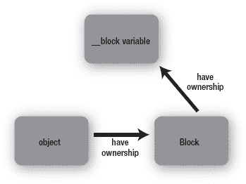

**Figure 5–13.** *避免循环引用*

比较两种方法：一种是使用 `__block` 变量，另一种是使用 `__weak` 或 `__unsafe_unretained` 所有权修饰符。

使用 `__block` 变量的优势在于：

*   你可以通过控制 `__block` 变量来控制对象的生命周期。
*   即使在不支持 `__weak` 所有权修饰符的环境中，也无需使用 `__unsafe_unretained` 所有权修饰符，并且不必担心野指针的问题。

这意味着，在 Block 执行期间，你可以动态地将 `nil` 或其他对象赋值给 `__block` 变量。

相比之下，使用 `__block` 变量的劣势在于：

*   你必须执行 Block 才能避免循环引用。

在 Block 字面量被执行后，如果应用程序没有执行该 Block，则无法避免循环引用。如果因为 Block 导致了循环引用，你需要根据 Block 的使用方式，来决定是使用 `__block` 变量，还是使用 `__weak` 或 `__unsafe_unretained` 所有权修饰符来解决。

### Copy/Release

当 ARC 被禁用时，要手动将 Block 从栈复制到堆。并且，由于 ARC 被禁用，你也必须手动释放该 Block。你可以使用实例方法 `copy` 和 `release`，如下所示。

```
void (^blk_on_heap)(void) = [blk_on_stack copy];

[blk_on_heap release];
```

此外，你可以使用实例方法 `retain` 获取一个已经复制到堆上的 Block 的所有权。

```
[blk_on_heap retain];
```

不幸的是，当你对栈上的 Block 调用 `retain` 时，什么都不会发生。

```
[blk_on_stack retain];
```

在这段源码中，对赋值给 `blk_on_stack` 的栈上 Block 调用了实例方法 `retain`，但实际上什么也没发生。因此，要获取 Block 的所有权，我建议你始终调用实例方法 `copy`。

另外，由于 Block 是 C 语言的扩展，你可以在 C 语言中使用 Block 语法。在这种情况下，你可以使用 `Block_copy` 和 `Block_release` 函数，而不是 Objective-C 中的 `copy` 和 `release` 方法。引用计数的概念以及使用方法与 `copy` 和 `release` 方法完全相同。

```
void (^blk_on_heap)(void) = Block_copy(blk_on_stack);

Block_release(blk_on_heap);
```

`Block_copy` 函数的工作方式与我们之前学到的 `_Block_copy` 类似。这个函数是为 C 语言提供的，实际上，Objective-C 运行时库也使用它。同样地，当堆上的 Block 被释放时，Objective-C 运行时库会调用 `Block_release` 函数。

顺便提一下，在没有 ARC 的情况下，`__block` 说明符可用于避免 Block 引起的循环引用。因为，根据其规范，当 Block 从栈复制到堆，并且使用了 `id` 或对象类型的自动变量时，如果该变量没有 `__block` 说明符，该对象会被 retain；相反，如果有 `__block` 说明符，该对象不会被 retain。例如，无论 ARC 是否启用，以下源码都会引起循环引用，因为 Block 拥有 `self` 的所有权，而 `self` 又拥有 Block 的所有权。

```
typedef void (^blk_t)(void);

@interface MyObject : NSObject
{
    blk_t blk_;
}
@end

@implementation MyObject
- (id)init
{
    self = [super init];
    blk_ = ^{NSLog(@"self = %@", self);};
    return self;
}

- (void)dealloc
{
    NSLog(@"dealloc");
}
@end

int main()
{
    id o = [[MyObject alloc] init];
    NSLog(@"%@", o);
    return 0;
}
```

对于 ARC 被禁用的环境，你可以使用 `__block` 变量来解决这个问题。

```
- (id)init {
    self = [super init];
    __block id tmp = self;
    blk_ = ^{NSLog(@"self = %@", tmp);};
    return self;
}
```

它的工作方式类似于 ARC 启用环境下的 `__unsafe_unretained` 所有权修饰符。`__block` 说明符的用途在 ARC 启用和禁用时大相径庭。因此，你必须注意源码是用于 ARC 启用环境还是禁用环境。

## 总结

在本章中，我们深入讨论了 Block，了解了 Block 是如何通过 Clang 编译的。特别是，我们学习了：

*   自动变量是如何被捕获的
*   `__block` 变量是如何实现的
*   由于捕获对象导致的循环引用问题是如何发生的，以及如何解决它

如果你将 Block 与接下来章节中要讨论的 Grand Central Dispatch 结合使用，Block 会非常强大。

## 第 6 章

## Grand Central Dispatch

在最后的三章中，我们将讨论 Grand Central Dispatch（GCD）。这个新特性是为 OS X Snow Leopard 和 iOS 4 或更高版本引入的，以帮助进行多线程编程。我将结合其实现来解释多线程编程将如何改变。

在本章中，我们首先快速看一个使用 GCD 的示例。然后，我们会回顾在当前多线程编程中 GCD 带来的好处，以及 GCD 出现之前传统的多线程编程是如何进行的。


## Grand Central Dispatch 概览

我们来看看苹果公司对 Grand Central Dispatch 的描述：

> *异步执行任务的技术之一便是 Grand Central Dispatch（GCD）。这项技术会将你通常在应用程序中编写的线程管理代码，下放到系统层面。你只需定义要执行的任务，并将它们添加到合适的调度队列中即可。GCD 会负责创建所需的线程，并安排你的任务在这些线程上运行。由于线程管理现在已成为系统的一部分，GCD 提供了整体性的任务管理和执行方法，其效率远超传统线程。*

Grand Central Dispatch 似乎是一项创新技术，它能让多线程源代码变得出奇地优雅。我们通过一个例子来看看这是否属实，以及它是如何实现的。尽管这个例子有点抽象，但它展示了 GCD 的强大之处。

```
dispatch_async(queue_for_background_threads, ^{
    /*
     * 此处处理耗时任务
     * 例如 AR 图像处理、数据库访问等
     */

    /*
     * 任务完成。然后，在主线程上使用结果，如下所示。
     */

    dispatch_async(dispatch_get_main_queue(), ^{

        /*
         * 此处放置只在主线程工作的任务，例如
         * 更新用户界面等
         */
    });
});
```

这个例子演示了在后台线程处理耗时任务，然后在主线程上使用结果。
`dispatch_async(queue_for_background_threads, ^{`
这一行代码就让任务在后台线程中运行。
`dispatch_async(dispatch_get_main_queue(), ^{`
这一行代码同样让任务在主线程中运行。如你所见，这里使用了脱字符 `^` 和 Block，使得源代码变得简单，正如我们在前几章中学到的那样。看来苹果公司所言非虚。接下来，我们简要回顾一下多线程源代码是什么样子的。在 GCD 引入之前，Cocoa 框架已有支持多线程编程的机制，例如 `NSObject` 类的实例方法 `performSelectorInBackground:withObject`、`performSelectorOnMainThread` 等等。

我们来看看之前的例子如何用 `performSelector` 方法族来编写。

```
/*
 * 通过 NSObject 的 performSelectorInBackground:withObject: 方法
 * 在后台线程启动一个任务
 */
- (void) launchThreadByNSObject_performSelectorInBackground_withObject
{
    [self performSelectorInBackground:@selector(doWork) withObject:nil];
}

/*
 * 在后台线程上执行的方法
 */
- (void) doWork
{
    NSAutoreleasePool *pool = [[NSAutoreleasePool alloc] init];

    /*
     * 此处处理耗时任务，
     * 例如 AR 图像处理、
     * 数据库访问等
     */

    /*
     * 任务完成。接下来，在主线程上使用结果，如下所示。
     */

    [self performSelectorOnMainThread:@selector(doneWork)
        withObject:nil waitUntilDone:NO];
    [pool drain];
}

/*
 * 在主线程上执行的方法
 */
- (void) doneWork
{
    /*
     * 只能在主线程上执行的任务应放在此处，
     * 例如更新用户界面等
     */
}
```

虽然使用 `performSelector` 方法族进行多线程编程的源代码比使用 `NSThread` 类的源代码更简单，但使用 GCD 的源代码显然是最简洁的。

使用 GCD 进行多线程编程比使用 `performSelector` 方法族更加优雅。你无需使用 `NSThread` 类或 `performSelector` 方法族那些凌乱的 API。而且，它的效率也更高。简直百利而无一害！

**注意：** 当你想要释放 `NSAutoreleasePool` 对象时，建议调用 `drain` 而非 `release`。通过 `drain`，即使在启用了垃圾回收的环境中，池也会立即被释放。如果不使用垃圾回收，直接使用 `release` 也没有问题。

## 多线程编程

正如所解释的那样，GCD 是一项让多线程编程变得优雅的技术。在学习 GCD 本身之前，我们先回顾一下传统的多线程编程。

此外，要充分利用多线程的优势，你应该对应用程序如何在 Mac 或 iPhone 上执行有一个基本的了解。我们先来看看这些内容。

请浏览一下非常简单的 Objective-C 源代码。

```
int main()
{
    id o = [[MyObject alloc] init];

    [o execBlock];

    return 0;
}
```

这里有一些方法调用，但基本上，它是如 图 6-1 所示，从上到下执行的。

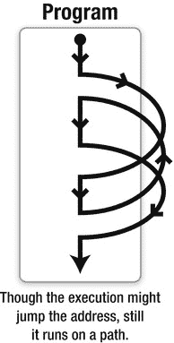

**图 6-1.** *CPU 执行 CPU 字节码*

你知道这段源代码在 Mac 或 iPhone 上是如何工作的吗？为了在计算机上执行它，编译器会将其转换为如下的 CPU 字节码。你不需要理解所有含义，但我们可以知道，简单的源代码被转换成了很长的指令序列。

```
000001ac:     b590 push {r4, r7, lr}
000001ae: f240019c movw r1, :lower16:0x260-0x1c0+0xfffffffc
000001b2:     af01 add  r7, sp, #4
000001b4: f2c00100 movt r1, :upper16:0x260-0x1c0+0xfffffffc
000001b8: f24010be movw r0, :lower16:0x384-0x1c2+0xfffffffc
000001bc: f2c00000 movt r0, :upper16:0x384-0x1c2+0xfffffffc
000001c0:     4479 add  r1, pc
000001c2:     4478 add  r0, pc
000001c4:     6809 ldr  r1, [r1, #0]
000001c6:     6800 ldr  r0, [r0, #0]
000001c8: f7ffef1a blx  _objc_msgSend
000001cc: f2400180 movw r1, :lower16:0x258-0x1d4+0xfffffffc
000001d0: f2c00100 movt r1, :upper16:0x258-0x1d4+0xfffffffc
000001d4:     4479 add  r1, pc
000001d6:     6809 ldr  r1, [r1, #0]
000001d8: f7ffef12 blx  _objc_msgSend
000001dc:     4604 mov  r4, r0
000001de: f240007a movw r0, :lower16:0x264-0x1e6+0xfffffffc
000001e2: f2c00000 movt r0, :upper16:0x264-0x1e6+0xfffffffc
000001e6:     4478 add  r0, pc
000001e8:     6801 ldr  r1, [r0, #0]
000001ea:     4620 mov  r0, r4
000001ec: f7ffef08 blx  _objc_msgSend
000001f0:     4620 mov  r0, r4
000001f2: f7ffef06 blx  _objc_release
000001f6:     2000 movs r0, #0
000001f8:     bd90 pop  {r4, r7, pc}
```


### CPU 如何执行应用程序

如我们所见，源代码会被转换成 CPU 字节码。应用程序将这些字节码连同数据打包在一起，安装到 Mac 或 iPhone 上。当用户在 Mac 的 OSX 或 iPhone 的 iOS 等操作系统上启动应用程序时，字节码会被分配到内存中，CPU 从应用程序指定的起始地址开始，逐条执行这些字节码。

在示例中，首先执行起始地址 `1ac` 处的指令 `push`。接着，执行指针移动到下一个地址。地址 `1ae` 处的下一条指令 `movw` 被执行，然后是地址 `1b2` 处的指令，依此类推。

通过诸如 `if`、`for` 等控制语句或 Objective-C 中的函数调用，执行地址可以跳转到一个较远的地址。一个 CPU 在同一个时刻只能执行一条指令。执行过程不会分裂成两条并发的指令。有时会用路径的类比来解释 CPU 上的执行过程。

线程相当于 CPU 执行的一条路径。如今，有些 CPU 拥有 64 个 CPU 核心；有些则作为两个虚拟 CPU 工作。一台计算机拥有多个 CPU 核心是非常普遍的情况。但一个 CPU 核心仍然只运行一条路径。多线程是指一个应用程序拥有多条路径。如图 Figure 6–2 所示，多线程应用程序可以并发地执行多条路径。

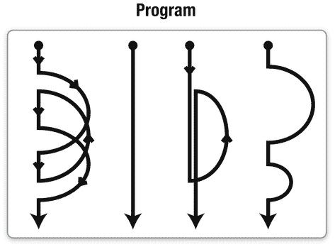

**图 6–2.** *CPU 在多线程上执行字节码*

与 CPU 相关的技术很多，而且发展迅速，但一个 CPU 核心一次仍然只能执行一条 CPU 字节码。多线程应用程序是如何在多个路径上执行字节码的呢？

作为 OS X 和 iOS 核心部分的 XNU 内核会在固定的时间间隔以及收到系统调用等操作系统事件时，在这些路径之间进行切换。一条路径的执行状态（包括 CPU 寄存器）会被存储到分配给每条路径的内存块之一。然后，另一条路径的执行状态会从另一个内存块复制回 CPU 寄存器，如此反复；也就是说，CPU 会继续在这个新路径上执行。这种机制被称为*上下文切换*。多线程程序会反复不断地进行上下文切换。正因为如此，一个 CPU 可以虚拟地执行多个线程。当存在多个 CPU 核心时，每个核心可以并行运行一个线程。在这种情况下，真正能并行运行的线程数就等于 CPU 核心数。针对多线程的编程技术被称为*多线程编程*。

### 多线程编程的优缺点

多线程编程会引发许多问题。例如，当多个线程竞争更新同一资源时，会导致数据不一致（称为*竞态条件*）。当多个线程同时等待某个事件时（*死锁*），这些线程会堆积起来。当使用过多线程时，应用程序的内存会变得紧张，等等（图 6–3）。

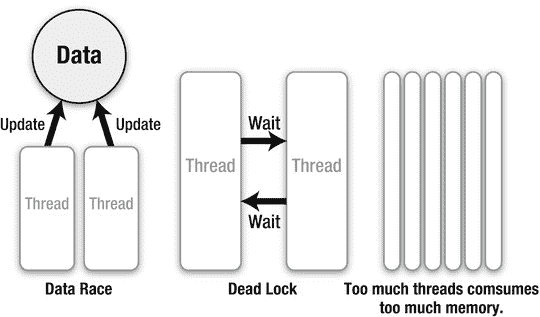

**图 6–3.** *多线程编程的问题*

当然，有许多方法可以避免这些问题，但源代码会迅速变得过于复杂。既然存在这些问题，为什么还要使用多线程编程呢？

原因是为了让应用程序具有高响应性。在一个应用程序中，启动后就会立即启动一个线程。这个线程负责绘制用户界面、处理触摸面板的事件等。这个线程被称为*主线程*。如果主线程执行一个耗时的任务，比如增强现实的图像处理或数据库访问，那么这个任务会阻塞主线程上的所有其他任务。在 OSX 和 iOS 上，主线程上的主循环（称为 RunLoop）不应被阻塞，因为只有主线程才能更新用户界面。一旦被阻塞，用户界面将无法更新，并且同一张静态图片会显示相当长的时间。为了避免这种情况，耗时的任务应该在其他线程上执行，如图 Figure 6–4 所示。

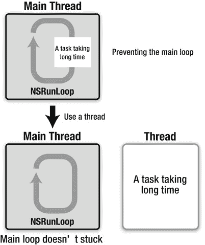

**图 6–4.** *多线程编程的优点*

在多线程应用程序中，当耗时任务正在运行时，用户界面仍然可以保持响应。GCD 也让多线程编程变得非常优雅。在下一章中，我们将展示如何使用 GCD API。

## 总结

在本章中，我们学习了什么是多线程编程以及它的优缺点。在下一章中，我们将学习 GCD 的基本机制和 GCD API。我们还将展示 GCD 相比传统多线程编程的优势所在。

## 第 7 章

## GCD 基础

在本章中，我们将展示如何使用 GCD。首先，我们从 GCD 的核心概念——调度队列开始，并展示如何向队列中添加任务。之后，我们将设计一个 API 来控制队列和任务。最后，我们还将展示如何使用 GCD 调度 I/O 来控制文件。

## 调度队列

顾名思义，调度队列是一个用于存储待执行任务的队列。应用程序开发者可以将任务编写成块字面量，并通过 `dispatch_async` 函数等将其添加到调度队列中。然后，调度队列会按照添加的顺序，即先进先出（FIFO）的方式执行这些任务，如图 Figure 7–1 所示。

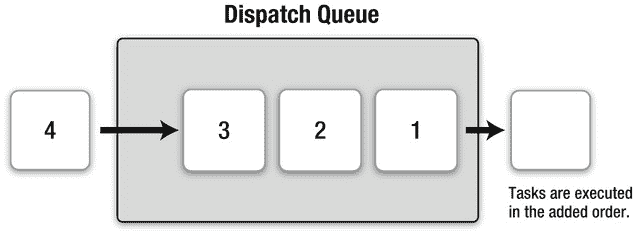

**图 7–1.** *调度队列上的执行过程*

如图 Figure 7–2 所示，有两种类型的调度队列。一种是串行调度队列，它会等待当前运行的任务完成后再启动另一个任务。另一种是并发调度队列，它不会等待。

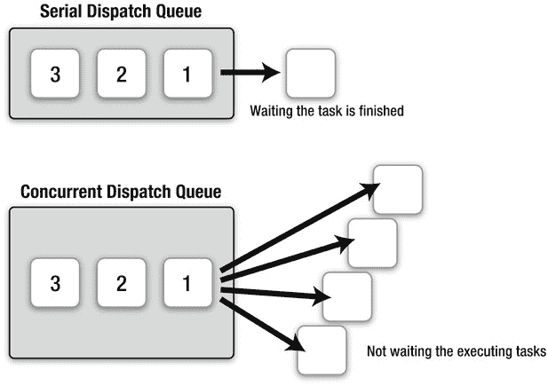

**图 7–2.** *串行调度队列与并发调度队列*

### 两种类型的调度队列

让我们来比较这两种类型的调度队列。下面的源代码使用 `dispatch_async` 函数将任务添加到调度队列。

```
dispatch_async(queue, blk0);
dispatch_async(queue, blk1);
dispatch_async(queue, blk2);
dispatch_async(queue, blk3);
dispatch_async(queue, blk4);
dispatch_async(queue, blk5);
dispatch_async(queue, blk6);
dispatch_async(queue, blk7);
```

让我们来看看当变量 `queue` 是一个串行调度队列（它会等待当前运行的任务完成）时，它是如何工作的。

### 串行调度队列

首先，`blk0` 启动。接着，`blk0` 完成后，`blk1` 启动。然后 `blk1` 完成后，`blk2` 启动，依此类推。每次只运行一个任务，这意味着结果总是相同的。这些块将按如下顺序执行：

```
blk0
blk1
blk2
blk3
blk4
blk5
blk6
blk7
```

接下来，让我们看看当变量 `queue` 是一个并发调度队列（它不会等待正在运行的任务完成）时，它是如何工作的。


### 并发调度队列

首先启动 `blk0`，无论它是否完成，都会启动 `blk1`，接着无论 `blk1` 是否结束，都会启动 `blk2`，以此类推。它不会等待任务完成，多个任务会同时运行，但请注意，并发运行的任务数量取决于当前系统的状态；也就是说，iOS 或 OS X 会根据当前系统状态（例如调度队列中的任务数量、CPU 核心数或 CPU 使用率）来决定数量。多个任务可以通过底层使用多线程同时运行，如图 7-3 所示。

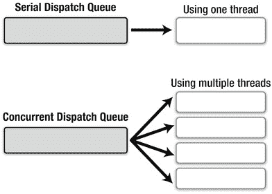

**图 7-3.** *串行调度队列、并发调度队列与线程的关系*

iOS 和 OS X 的核心部分——XNU 内核负责决定线程数量，并创建线程来执行任务。当一个任务完成、运行中的任务数量减少时，XNU 内核会终止不再需要的线程。只需使用并发调度队列，XNU 内核就能完美地管理多个线程以同时运行任务。例如，源代码会像表 7-1 所示那样在多个线程上执行。

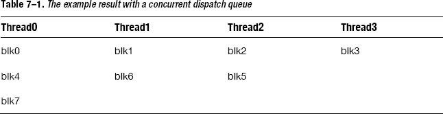

假设并发调度队列准备了四个线程。首先，`blk0` 在 `thread0` 上启动。接着，`blk1` 在 `thread1` 上启动，`blk2` 在 `thread2` 上启动，`blk3` 在 `thread3` 上启动。然后，由于 `blk0` 已完成，`blk4` 在 `thread0` 上启动。接下来，由于 `blk1` 仍在 `thread1` 上运行，而 `blk2` 已在 `thread2` 上完成，`blk5` 在 `thread2` 上启动。

以这种方式，当使用并发调度队列时，执行顺序取决于任务本身、系统状态等因素。任务的顺序不像串行调度队列那样固定。当执行顺序很重要或任务不应同时运行时，应使用串行调度队列。

现在我们知道有两种类型的调度队列：串行调度队列和并发调度队列。如何获取这些队列呢？即将揭晓。

## 获取调度队列

有两种方法：使用 `dispatch_queue_create` 以及使用 `主调度队列` / `全局调度队列`。下面将讨论这两种方法。

### dispatch_queue_create

`dispatch_queue_create` 是一个用于创建调度队列的函数。通过此函数，你可以获取一个新的调度队列。接下来，源代码展示了如何创建串行调度队列，当然也可以创建并发调度队列，稍后会在本节中说明。

```
dispatch_queue_t mySerialDispatchQueue =
dispatch_queue_create("com.example.gcd.MySerialDispatchQueue", NULL);
```

当你创建一个串行调度队列时，它与其他串行队列相互独立，即便它们每次只执行一个任务。例如，四个独立的串行队列各自有一个任务，如果同时启动，它们会同时开始执行，如图 7-4 所示。

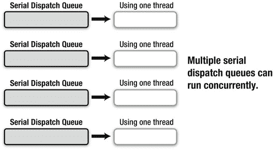

**图 7-4.** *多个串行调度队列*

有一点我们必须了解。当创建一个串行调度队列并添加任务时，系统会为每个串行调度队列创建一个线程。如果创建了 2000 个串行调度队列，就会创建 2000 个线程。正如我所解释的，线程过多会消耗过多内存，过多的上下文切换会导致系统变慢，如图 7-5 所示。

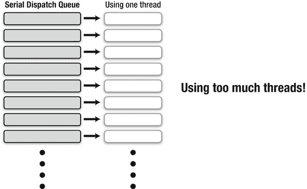

**图 7-5.** *多个串行调度队列的问题*

这就是为什么只应在避免因多线程更新同一数据而导致的**数据不一致**（竞态条件）时使用串行调度队列，这曾是我提到的多线程编程问题之一（图 7-6）。

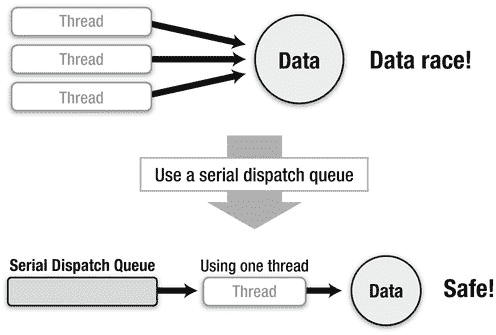

**图 7-6.** *应使用串行调度队列的情形*

串行调度队列的数量应与实际需求相同。例如，更新数据库时，应为每个表创建一个串行调度队列。更新文件时，应为该文件或每个单独的文件块创建一个串行调度队列。即使你认为可以比使用并发调度队列创建更多线程，也不要创建过多的串行调度队列。如果任务不会引起数据不一致等问题，并且你希望它们并发执行，则应使用并发调度队列。即使反复创建并发调度队列，也不会有问题，因为这些队列只是使用由 XNU 内核有效管理的线程。

让我们回到 `dispatch_queue_create` 函数。该函数的第一个参数是串行调度队列的名称。如源代码所示，建议使用反向 DNS 格式的完全限定域名。当你在 Xcode 或 Instruments 中调试时，它会显示为调度队列的名称。应用程序崩溃时生成的崩溃日志也包含该名称。因此，这个名称对你作为应用程序开发者来说应该是可理解的，并且对用户来说也不会造成困扰。如果你觉得麻烦，可以直接使用 `NULL`，但在调试应用程序时你可能会后悔这个决定。

至于第二个参数，要创建串行调度队列，应传递 `NULL`。要创建并发调度队列，则像下面这样传递 `DISPATCH_QUEUE_CONCURRENT`。

```
dispatch_queue_t myConcurrentDispatchQueue = dispatch_queue_create(
    "com.example.gcd.MyConcurrentDispatchQueue",  DISPATCH_QUEUE_CONCURRENT);
```

`dispatch_queue_create` 函数的返回类型是 `dispatch_queue_t`，这是用于调度队列的变量类型。在之前的所有例子中，变量 `queue` 都是 `dispatch_queue_t` 类型。

```
dispatch_queue_t myConcurrentDispatchQueue = dispatch_queue_create(
    "com.example.gcd.MyConcurrentDispatchQueue", DISPATCH_QUEUE_CONCURRENT);

dispatch_async(myConcurrentDispatchQueue,
    ^{NSLog(@"block on myConcurrentDispatchQueue");});
```

在这段源代码中，Block 会在并发调度队列中运行。


遗憾的是，尽管编译器拥有出色的自动内存管理机制 ARC，但应用程序开发者必须手动释放创建的调度队列，因为调度队列与 Block 不同，它不被视为 Objective-C 对象。当你不再需要它时，必须调用 `dispatch_release` 函数来释放由 `dispatch_queue_create` 函数创建的调度队列。

`dispatch_release(mySerialDispatchQueue);`

既然名字中包含 “release”，自然也存在 `dispatch_retain` 函数。

`dispatch_retain(myConcurrentDispatchQueue);`

这意味着，调度队列必须通过 `dispatch_retain` 和 `dispatch_release` 函数，采用与 Objective-C 对象类似的引用计数技术进行管理。在之前的源代码中，由 `dispatch_queue_create` 函数创建并赋值给变量 `myConcurrentDispatchQueue` 的并发调度队列，必须被释放。

```
dispatch_queue_t myConcurrentDispatchQueue = dispatch_queue_create(
    "com.example.gcd.MyConcurrentDispatchQueue", DISPATCH_QUEUE_CONCURRENT);

dispatch_async(myConcurrentDispatchQueue,
    ^{NSLog(@"block on myConcurrentDispatchQueue");});

dispatch_release(myConcurrentDispatchQueue);
```

并发调度队列使用多个线程来执行任务。在这个例子中，就在通过 `dispatch_async` 函数添加 Block 之后，并发调度队列就被 `dispatch_release` 函数释放了。这样操作安全吗？

这是完全安全的。当一个 Block 通过 `dispatch_async` 函数被添加到调度队列时，可以说，Block 通过 `dispatch_retain` 函数拥有了该调度队列的所有权。这对于串行调度队列和并发调度队列都是一样的。然后，当 Block 执行完毕后，它会通过 `dispatch_release` 函数释放该调度队列。

即使在通过 `dispatch_async` 函数将 Block 添加到调度队列之后立即释放了该调度队列，这个调度队列也不会被销毁，Block 依然可以执行。Block 执行完后，它会释放调度队列，调度队列随即被丢弃。`dispatch_retain` 和 `dispatch_release` 函数不仅适用于调度队列。从今往后，我们会看到许多名称中包含 “create” 的 GCD API。当你通过这些 API 获取到某些对象后，在不再需要它们时，必须使用 `dispatch_release` 函数进行释放。如果你通过其他方式获取它们，则必须通过 `dispatch_retain` 函数获取所有权，并在之后通过 `dispatch_release` 函数释放。

### 主调度队列 / 全局调度队列

获取调度队列的另一种方式是直接获取系统已经提供的调度队列。实际上，系统提供了一些你无需创建的调度队列：主调度队列和全局调度队列。

主调度队列，正如其名中的 “main” 所示，是用于在主线程上执行任务的队列。由于只有一个主线程，因此主调度队列是一个串行调度队列。主调度队列中的任务会在主线程的 RunLoop 中执行，如图 [Figure 7–7]（#Chapter07.html#fig_7_7）所示。由于它们是在主线程上执行的，你应该将其用于必须在主线程上完成的任务，例如更新用户界面等。它类似于 `NSObject` 类的 `performSelectorOnMainThread` 实例方法。

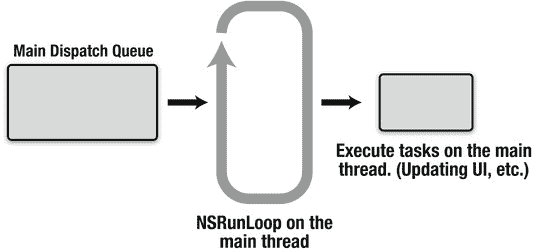

**Figure 7–7.** *主调度队列*

系统提供的其他队列称为全局调度队列。它们是并发调度队列，可以在应用程序的任何位置使用。除非有特殊原因（稍后会解释），在大多数情况下，你不需要通过 `dispatch_queue_create` 函数自行创建并发调度队列。你只需获取一个全局调度队列并使用即可。共有四个全局调度队列，它们各自具有不同的优先级：高、默认、低和后台。XNU 内核管理着全局调度队列的线程，并且这些线程具有与每个全局调度队列优先级相对应的优先级。当你向全局调度队列添加任务时，应该选择一个具有适当优先级的全局调度队列。XNU 内核并不保证线程的实时性。因此，这些优先级仅作为参考。例如，当你不太关心任务是否立即执行时，应该使用后台优先级。让我们通过 [Table 7–2]（#Chapter07.html#tab_7_2）来看看系统中提供了哪些类型的调度队列。

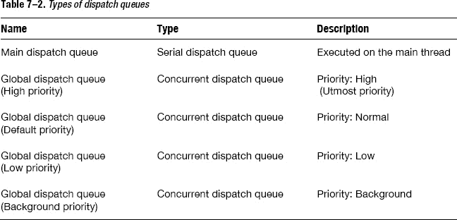

获取每个调度队列的方法如 [Listing 7–1]（#Chapter07.html#list_7_1）所示。

**Listing 7–1.** *获取调度队列*

```
 /*
  * 如何获取主调度队列
  */
dispatch_queue_t mainDispatchQueue = dispatch_get_main_queue();

 /*
  * 如何获取高优先级的全局调度队列
  */
dispatch_queue_t globalDispatchQueueHigh =
        dispatch_get_global_queue(DISPATCH_QUEUE_PRIORITY_HIGH, 0);

 /*
  * 如何获取默认优先级的全局调度队列
  */
dispatch_queue_t globalDispatchQueueDefault =
        dispatch_get_global_queue(DISPATCH_QUEUE_PRIORITY_DEFAULT, 0);

 /*
  * 如何获取低优先级的全局调度队列
  */
dispatch_queue_t globalDispatchQueueLow =
        dispatch_get_global_queue(DISPATCH_QUEUE_PRIORITY_LOW, 0);

 /*
  * 如何获取后台优先级的全局调度队列
  */
dispatch_queue_t globalDispatchQueueBackground =
        dispatch_get_global_queue(DISPATCH_QUEUE_PRIORITY_BACKGROUND, 0);
```

顺便提一下，如果在主调度队列或全局调度队列上调用 `dispatch_retain` 或 `dispatch_release` 函数，不会有任何效果，也不会出现问题。这就是为什么获取并使用一个全局调度队列，比自己创建、使用然后释放一个并发调度队列要容易得多。当然，取决于你的源代码，如果将该调度队列视为由 `dispatch_queue_create` 函数创建的那样处理更方便，你也可以遵循引用计数的规则，即使是对于主调度队列或全局调度队列，也调用 `dispatch_retain` 或 `dispatch_release` 函数。

在本节末尾，有一个如何使用主调度队列和全局调度队列的示例，如 [Listing 7–2]（#Chapter07.html#list_7_2）所示。

**Listing 7–2.** *执行任务*

```
 /*
  * 在默认优先级的全局调度队列上执行一个 Block。
  */
dispatch_async(dispatch_get_global_queue(DISPATCH_QUEUE_PRIORITY_DEFAULT, 0), ^{

     /*
      * 这里是一些需要并发执行的任务
      */

     /*
      * 然后，在主调度队列上执行一个 Block
      */

    dispatch_async(dispatch_get_main_queue(), ^{

         /*
          * 这里是一些只能在主线程上执行的任务。
          */
    });

});
```

我们已经学习了使用 GCD 使任务并行执行的基础知识。在下一节中，我将解释用于控制队列以使它们更加有用的 API。

## 控制调度队列

GCD 还提供了许多有用的 API 来控制调度队列中的任务。让我们逐一查看这些 API，探索 GCD 的强大之处。


