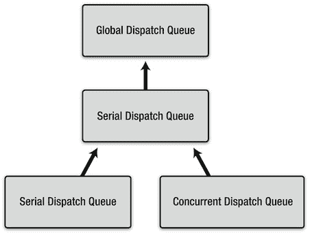
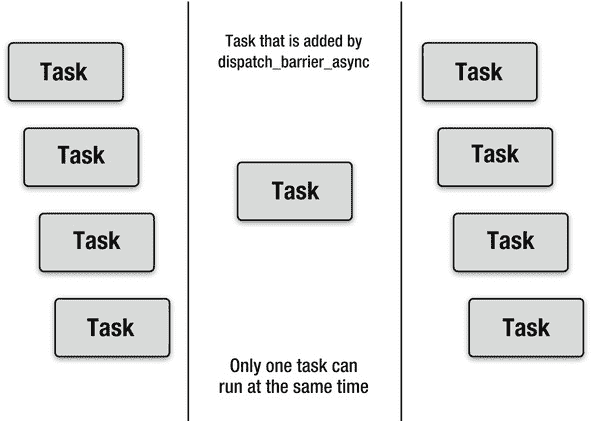
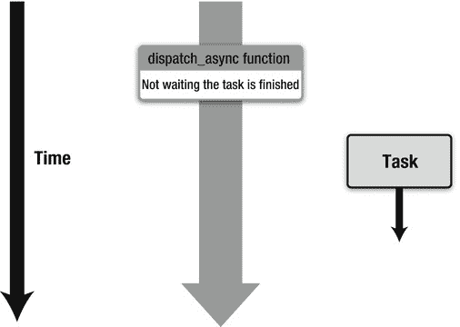
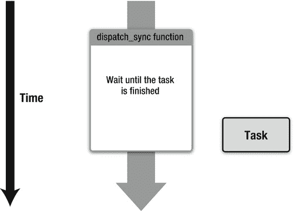

# `dispatch_set_target_queue`

`dispatch_set_target_queue`函数用于设置一个“目标”队列。这主要用于为新创建的队列设置优先级。对于串行和并发调度队列，当通过`dispatch_queue_create`函数创建调度队列时，线程的优先级与默认优先级的全局调度队列相同。要修改创建后的调度队列的优先级，可以使用此函数进行修改。以下源代码展示了如何让一个串行调度队列在后台优先级上执行。

```
dispatch_queue_t mySerialDispatchQueue =
    dispatch_queue_create("com.example.gcd.MySerialDispatchQueue", NULL);

dispatch_queue_t globalDispatchQueueBackground =
    dispatch_get_global_queue(DISPATCH_QUEUE_PRIORITY_BACKGROUND, 0);

dispatch_set_target_queue(mySerialDispatchQueue, globalDispatchQueueBackground);
```

在源代码中，将调度队列作为`dispatch_set_target_queue`函数的第一个参数传递，以更改该调度队列的优先级。第二个参数则传入一个全局调度队列作为其目标。其机制稍后会解释，但结果是将该调度队列的优先级更改为与目标队列相同的优先级。当将主队列或系统提供的全局调度队列作为第一个参数传递时，其行为是未定义的，因此不应这样做。使用`dispatch_set_target_queue`函数，不仅可以更改优先级，还可以创建如图 7–8 所示的调度队列层级结构。当将多个并发执行的串行调度队列通过`dispatch_set_target_queue`函数设置为同一个目标串行队列时，同时只有一个队列会在该目标串行队列上执行。



**图 7–8.** *调度队列执行层级结构*

通过这样做，如果你有一些不允许并发执行的任务，并且它们必须被添加到不同的串行调度队列中，你可以防止这些任务并发执行。不过，实际上我并不知道有这样的场景。

## `dispatch_after`

`dispatch_after`用于设置在队列中启动任务的时机。有时你可能希望在三秒后执行一个任务。当你想在指定时间过去后执行一个任务时，可以使用`dispatch_after`函数。例如，以下源代码将指定的 Block 在三秒后添加到主调度队列中。

```
dispatch_time_t time = dispatch_time(DISPATCH_TIME_NOW, 3ull * NSEC_PER_SEC);

dispatch_after(time, dispatch_get_main_queue(), ^{
        NSLog(@"waited at least three seconds.");
});
```

在源代码中，“ull”是 C 语言中用于指定类型的字面量。“ull”代表“unsigned long long”类型。请注意，`dispatch_after`函数并不会在指定时间后立即执行任务。它是在指定时间过后将任务添加到调度队列中，这意味着此源代码的效果等同于在三秒后通过`dispatch_async`函数将该 Block 添加到主调度队列。主调度队列在主线程的 RunLoop 中执行。因此，例如，如果 RunLoop 以每秒 1/60 秒的间隔执行，则该 Block 会在三秒后到三秒加 1/60 秒之间的某个时刻执行。如果主调度队列中添加了许多任务，或者主线程被延迟了，执行可能会滞后。因此，将其用作精确的计时器是有问题的，但如果你只是想大致延迟一个任务，这个函数非常有用。第二个参数指定一个要添加任务的调度队列，第三个参数是要执行的 Block。

第一个参数是`dispatch_time_t`类型的值，用于指定时间。该值由`dispatch_time`或`dispatch_walltime`函数创建。`dispatch_time`函数创建一个时间值，表示在`dispatch_time_t`类型的起始时间（第一个参数）之后经过的纳秒数（第二个参数）。如示例所示，`DISPATCH_TIME_NOW`通常用作第一个参数，以指定当前时间。在以下源代码中，你可以获取一个`dispatch_time_t`类型的变量，用于表示从现在开始的一秒后。

```
dispatch_time_t time = dispatch_time(DISPATCH_TIME_NOW, 1ull * NSEC_PER_SEC);
```

数值与`NSEC_PER_SEC`的乘积会生成以纳秒为单位的时间。使用`NSEC_PER_MSEC`，你可以生成毫秒单位的值。以下源代码展示了如何获取从现在开始的 150 毫秒后的时间。

```
dispatch_time_t time = dispatch_time(DISPATCH_TIME_NOW, 150ull * NSEC_PER_MSEC);
```

`dispatch_walltime`函数从 POSIX 中使用的`struct timespec`类型的时间创建一个`dispatch_time_t`类型的时间。`dispatch_time`函数主要用于创建相对时间。相比之下，`dispatch_walltime`函数用于创建绝对时间。例如，你可以使用`dispatch_walltime`来获取一个绝对时间，比如 2011 年 11 月 11 日 11:11:11，用于`dispatch_after`函数。你可以用它来创建一个闹钟，但它的精度较低。如清单 7–3 所示，`struct timespec`类型的时间可以轻松地从`NSDate`类对象创建。

**清单 7–3**. *从 NSDate 创建 dispatch_time_t*

```
dispatch_time_t getDispatchTimeByDate(NSDate *date)
{
    NSTimeInterval interval;
    double second, subsecond;
    struct timespec time;
    dispatch_time_t milestone;

    interval = [date timeIntervalSince1970];
    subsecond = modf(interval, &second);
    time.tv_sec = second;
    time.tv_nsec = subsecond * NSEC_PER_SEC;
    milestone = dispatch_walltime(&time, 0);

    return milestone;
}
```

在源代码中，从`NSDate`类对象创建了一个`dispatch_time_t`类型的值，并将其传递给`dispatch_after`函数。


### Dispatch Group（调度组）

Dispatch Group 用于创建一个队列组。你可能希望在调度队列中的所有任务完成后，启动一个任务来完成某些收尾工作。当所有任务都在一个串行调度队列中时，你只需将一个收尾任务添加到该队列的末尾即可。但当使用并发调度队列或多个调度队列时，情况就会变得复杂。在这种情况下，你可以使用调度组。以下源代码展示了如何将三个 Block 添加到一个全局调度队列中，当所有 Block 都执行完毕后，一个用于收尾的 Block 将在主调度队列上执行。

```
dispatch_queue_t queue =
    dispatch_get_global_queue(DISPATCH_QUEUE_PRIORITY_DEFAULT, 0);
dispatch_group_t group = dispatch_group_create();

dispatch_group_async(group, queue, ^{NSLog(@"blk0");});
dispatch_group_async(group, queue, ^{NSLog(@"blk1");});
dispatch_group_async(group, queue, ^{NSLog(@"blk2");});

dispatch_group_notify(group,
    dispatch_get_main_queue(), ^{NSLog(@"done");});
dispatch_release(group);
```

结果将类似于：

```
blk1
blk2
blk0
done
```

任务的执行顺序并不固定，因为它们处于一个全局调度队列（这是一个并发调度队列）中；也就是说，这些任务会在多个线程上并发执行。其执行时机是不确定的。尽管如此，每次执行结束时，都会显示 “done”。调度组可以监控任务的完成情况，无论这些任务位于何种类型的调度队列中。当它检测到所有任务都已完成时，会将收尾任务添加到调度队列中。这就是调度组的用法。首先，通过 `dispatch_group_create` 函数创建一个类型为 `dispatch_group_t` 的调度组。由于函数名包含 “create”，因此当不再需要该调度组时，必须释放它。你应该像处理调度队列一样，使用 `dispatch_release` 函数进行释放。`dispatch_group_async` 函数与 `dispatch_async` 函数一样，将一个 Block 添加到指定的调度队列中。它与 `dispatch_async` 函数的不同之处在于，其第一个参数传入的是已创建的调度组。当调用 `dispatch_group_async` 函数时，指定的 Block 会与该调度组关联起来。当一个 Block 与一个调度组关联时，该 Block 会通过 `dispatch_retain` 函数拥有该调度组的所有权，就像 Block 被添加到调度队列中一样。当 Block 执行完毕时，它会通过 `dispatch_release` 函数释放该调度组。当你不再需要该调度组时，只需调用 `dispatch_release` 来释放它即可。你无需关心与该调度组关联的 Block 是如何执行的。

如示例所示，`dispatch_group_notify` 函数指定了一个要添加到调度队列中的 Block。当调度组内的所有任务都完成时，该 Block 将被执行。第一个参数是要监控的调度组。当与该组关联的所有任务都完成时，Block（第三个参数）将被添加到调度队列（第二个参数）中。无论传递给 `dispatch_group_notify` 函数的是何种类型的调度队列，当该 Block 被添加时，与该调度组关联的所有任务都必须已经完成。

此外，你也可以简单地使用调度组来等待所有任务完成。你可以使用 `dispatch_group_wait` 函数，如代码清单 7–4 所示。

**代码清单 7–4.** *dispatch_group_wait*

```
dispatch_queue_t queue =
    dispatch_get_global_queue(DISPATCH_QUEUE_PRIORITY_DEFAULT, 0);
dispatch_group_t group = dispatch_group_create();

dispatch_group_async(group, queue, ^{NSLog(@"blk0");});
dispatch_group_async(group, queue, ^{NSLog(@"blk1");});
dispatch_group_async(group, queue, ^{NSLog(@"blk2");});

dispatch_group_wait(group, DISPATCH_TIME_FOREVER);
dispatch_release(group);
```

`dispatch_group_wait` 函数的第二个参数是一个超时时间，用于指定等待时长。该变量是 `dispatch_time_t` 类型。此示例使用了 `DISPATCH_TIME_FOREVER` 来永久等待。它会一直等待，直到与该调度组关联的所有任务都完成。你无法中途取消等待。

正如我们在学习 `dispatch_after` 函数时了解到的，你可以通过以下源代码等待 1 秒。

```
dispatch_time_t time = dispatch_time(DISPATCH_TIME_NOW, 1ull * NSEC_PER_SEC);

long result = dispatch_group_wait(group, time);

if (result == 0) {

     /*
      * 所有与该调度组关联的任务都已完成
      */

} else {

     /*
      * 仍有部分与该调度组关联的任务正在运行。
      */
}
```

当 `dispatch_group_wait` 函数返回值不为 0 时，表示即使指定的时间已过，仍有部分与该调度组关联的任务正在运行。当它返回 0 时，表示所有任务都已完成。如果使用 `DISPATCH_TIME_FOREVER`，`dispatch_group_wait` 函数将返回 0，因为所有任务必定已经完成。

顺便一提，“等待”是什么意思？它意味着当调用 `dispatch_group_wait` 函数时，该函数不会立即返回。执行 `dispatch_group_wait` 函数的当前线程将会停止。在传递给 `dispatch_group_wait` 函数的时间到期之前，或者在与该调度组关联的所有任务完成之前，执行该函数的线程会一直处于停止状态。

当使用 `DISPATCH_TIME_NOW` 时，你可以检查与该调度组关联的任务是否已经完成。

```
long result = dispatch_group_wait(group, DISPATCH_TIME_NOW);
```

例如，你可以在主线程的 RunLoop 的每个循环中检查任务是否已经完成，而无需任何延迟。尽管这是可行的，但我建议改用 `dispatch_group_notify` 将收尾任务添加到主调度队列中。这样你的代码会更优雅。GCD 中仍然有许多有用的函数。我将在后续章节中进行讲解。让我们从 `dispatch_barrier_async` 开始。


### dispatch_barrier_async

`dispatch_barrier_async` 是一个用于等待队列中其他任务完成的函数。如前所述，当你访问数据库或文件时，可以使用串行调度队列来避免数据不一致。实际上，数据更新任务不应与其他更新任务或读取任务同时执行。而读取任务则可能可以与其他读取任务并发执行，这意味着为了高效访问数据，应将读取任务添加到并发调度队列中，只有更新任务需要在没有其他更新任务运行时，置于串行调度队列中。你必须确保在更新任务完成之前，读取任务不会开始。虽然你可以使用 `dispatch group` 和 `dispatch_set_target_queue` 函数来实现这一功能，但这似乎很复杂。GCD 提供了一个更好的解决方案——`dispatch_barrier_async` 函数。该函数与通过 `dispatch_queue_create` 函数创建的并发调度队列一起使用。以下源代码使用 `dispatch_queue_create` 函数创建了一个并发调度队列，并通过 `dispatch_async` 添加了一些读取任务。

```
dispatch_queue_t queue = dispatch_queue_create(
    "com.example.gcd.ForBarrier", DISPATCH_QUEUE_CONCURRENT);

dispatch_async(queue, blk0_for_reading);
dispatch_async(queue, blk1_for_reading);
dispatch_async(queue, blk2_for_reading);
dispatch_async(queue, blk3_for_reading);
dispatch_async(queue, blk4_for_reading);
dispatch_async(queue, blk5_for_reading);
dispatch_async(queue, blk6_for_reading);
dispatch_async(queue, blk7_for_reading);

dispatch_release(queue);
```

接下来，例如，考虑在 `blk3_for_reading` 和 `blk4_for_reading` 之间写入数据，并且 `blk4_for_reading` 及之后的任务应读取更新后的数据。

```
dispatch_async(queue, blk0_for_reading);
dispatch_async(queue, blk1_for_reading);
dispatch_async(queue, blk2_for_reading);
dispatch_async(queue, blk3_for_reading);

 /*
  * 写入数据
  *
  * 从现在开始，所有任务都应读取更新后的数据。
  */

dispatch_async(queue, blk4_for_reading);
dispatch_async(queue, blk5_for_reading);
dispatch_async(queue, blk6_for_reading);
dispatch_async(queue, blk7_for_reading);
```

如果我们仅使用 `dispatch_async` 函数放置写入任务，如下一个源代码所示，即使是写入任务之前添加的任务，也可能意外地读取到更新后的数据。应用程序甚至可能因为无效访问而崩溃。这就是并发调度队列的特性。此外，如果你添加多个写入任务，将导致数据不一致，并引发更多问题。

```
dispatch_async(queue, blk0_for_reading);
dispatch_async(queue, blk1_for_reading);
dispatch_async(queue, blk2_for_reading);
dispatch_async(queue, blk3_for_reading);
dispatch_async(queue, blk_for_writing);
dispatch_async(queue, blk4_for_reading);
dispatch_async(queue, blk5_for_reading);
dispatch_async(queue, blk6_for_reading);
dispatch_async(queue, blk7_for_reading);
```

这时就轮到 `dispatch_barrier_async` 函数登场了。使用 `dispatch_barrier_async` 函数，你可以在并发调度队列中所有现有任务都完成时，向该队列添加一个任务。当通过 `dispatch_barrier_async` 函数添加的任务完成时，并发调度队列将恢复正常，即如同往常一样并发执行任务，如图 7–9 所示。

```
dispatch_async(queue, blk0_for_reading);
dispatch_async(queue, blk1_for_reading);
dispatch_async(queue, blk2_for_reading);
dispatch_async(queue, blk3_for_reading);
dispatch_barrier_async(queue, blk_for_writing);
dispatch_async(queue, blk4_for_reading);
dispatch_async(queue, blk5_for_reading);
dispatch_async(queue, blk6_for_reading);
dispatch_async(queue, blk7_for_reading);
```

如你所见，这非常简单。只需将 `dispatch_async` 函数替换为 `dispatch_barrier_async` 函数即可。仅此而已。



**图 7–9.** *使用 dispatch_barrier_async 函数的执行过程*

请使用并发调度队列和 `dispatch_barrier_async` 函数来实现高效的数据库或文件访问。接下来，让我们看看与 `dispatch_async` 函数相似的 `dispatch_sync` 函数。

### dispatch_sync

`dispatch_sync` 是一个与 `dispatch_async` 类似的函数，但它会等待任务被添加完成。`dispatch_async` 函数名称中的“async”代表异步。因此，它会将一个 Block 添加到调度队列中，并且该任务会异步执行。`dispatch_async` 函数不会等待任何东西，如图 7–10 所示。



**图 7–10.** *dispatch_async 函数的行为*

当然也存在同步版本——`dispatch_sync` 函数。它会同步地将 Block 添加到调度队列中。`dispatch_sync` 函数会等待添加的 Block 执行完毕，如图 7–11 所示。



**图 7–11.** *dispatch_sync 函数的行为*

就像我在“调度组”部分解释 `dispatch_group_wait` 函数时所说的，“等待”意味着当前线程停止。例如，在主调度队列上，你可能希望使用另一个线程上的全局调度队列中某个任务的执行结果。在这种情形下，你可以使用 `dispatch_sync` 函数。

```
dispatch_queue_t queue =
    dispatch_get_global_queue(DISPATCH_QUEUE_PRIORITY_DEFAULT, 0);

dispatch_sync(queue, ^{/* 一个任务 */});
```

在调用 `dispatch_sync` 函数后，该函数会一直等待，直到指定的任务完成。它类似于一个简略版的 `dispatch_group_wait` 函数。如你所见，源代码非常简单。你可以非常容易地使用 `dispatch_sync` 函数，尽管它可能引发一个称为死锁的问题。例如，当以下源代码在主线程上执行时，会导致死锁。

```
dispatch_queue_t queue = dispatch_get_main_queue();
dispatch_sync(queue, ^{NSLog(@"Hello?");});
```

这段源代码将一个 Block 添加到了主调度队列；也就是说，该 Block 将在主线程上执行。与此同时，它又在等待该 Block 完成。由于代码本身就在主线程上运行，因此主调度队列中的这个 Block 永远得不到执行。让我们再看另一个例子：

```
dispatch_queue_t queue = dispatch_get_main_queue();
dispatch_async(queue, ^{
    dispatch_sync(queue, ^{NSLog(@"Hello?");});
});
```

这个正在主调度队列上运行的 Block 正在等待另一个也将要在主调度队列上运行的 Block 完成，这会导致死锁。

当然，在串行调度队列上也会发生同样的情况。

```
dispatch_queue_t queue =
    dispatch_queue_create("com.example.gcd.MySerialDispatchQueue", NULL);
dispatch_async(queue, ^{
    dispatch_sync(queue, ^{NSLog(@"Hello?");});
});
```

与 `dispatch_barrier_async` 函数名称中包含“async”类似，也存在一个同步版本 `dispatch_barrier_sync`。当调度队列中的所有任务都完成时，指定的任务会像 `dispatch_barrier_async` 函数那样被添加到队列中。它类似于 `dispatch_sync` 函数，会等待指定的任务执行完毕。当你使用诸如 `dispatch_sync` 这类等待任务完成的同步 API 时，你必须问自己为什么要使用这个 API。你肯定不希望你的应用程序发生死锁，对吧？


### `dispatch_apply`

`dispatch_apply`是一个与`dispatch_sync`函数和调度组相关的函数。`dispatch_apply`函数用于向调度队列多次添加一个 Block，然后等待直到所有任务完成。

```
dispatch_queue_t queue =
    dispatch_get_global_queue(DISPATCH_QUEUE_PRIORITY_DEFAULT, 0);
dispatch_apply(10, queue, ^(size_t index) {
    NSLog(@"%zu", index);
});
NSLog(@"done");
```

结果类似于：

```
4
1
0
3
5
2
6
8
9
7
done
```

因为它是在全局调度队列上执行的，每个任务的执行时机并不固定。`done`一定是最后一个输出的，因为`dispatch_apply`函数会等待所有任务完成。

第一个参数是重复次数，第二个参数是目标调度队列，第三个参数是要添加到队列中的任务。在这个例子中，第三个参数中的 Block 接受一个参数来区分每个 Block，因为 Block 被添加了多次。例如，当你想要对`NSArray`类对象中的每个条目执行某个操作时，你不需要编写`for`循环。请看下面的源代码，它假设`NSArray`类对象被赋值给了一个名为“array”的变量。

```
dispatch_queue_t queue =
    dispatch_get_global_queue(DISPATCH_QUEUE_PRIORITY_DEFAULT, 0);
dispatch_apply([array count], queue, ^(size_t index) {
    NSLog(@"%zu: %@", index, [array objectAtIndex:index]);
});
```

在全局调度队列上为数组中的所有条目执行 Block 非常容易。`dispatch_apply`函数会等待所有任务的执行，就像`dispatch_sync`函数所做的那样。我建议将`dispatch_apply`函数与`dispatch_async`函数一起使用，以异步方式运行它，如列表 7-5 所示。

**列表 7-5.** `dispatch_apply`

```
dispatch_queue_t queue =
    dispatch_get_global_queue(DISPATCH_QUEUE_PRIORITY_DEFAULT, 0);

 /*
  * 在全局调度队列上异步执行
  */

dispatch_async(queue, ^{

     /*
      * 在全局调度队列上，dispatch_apply 函数会等待所有任务完成。
      */

    dispatch_apply([array count], queue, ^(size_t index) {

         /*
          * 与 NSArray 对象中的所有对象并发执行某些操作
          */

        NSLog(@"%zu: %@", index, [array objectAtIndex:index]);

    });

     /*
      * dispatch_apply 函数的所有任务已完成。
      */

     /*
      * 在主调度队列上异步执行
      */

    dispatch_async(dispatch_get_main_queue(), ^{

         /*
          * 在主调度队列上执行。
          * 例如更新用户界面等。
          */

        NSLog(@"done");

    });
});
```

接下来，让我们看看控制已添加任务执行的`dispatch_suspend`和`dispatch_resume`函数。

### `dispatch_suspend` / `dispatch_resume`

这些函数用于暂停或恢复队列的执行。当你向调度队列添加许多任务时，有时你可能希望在完成添加所有任务之前不执行这些任务。当某个 Block 捕获了可能受其他任务影响的值时，你可能需要这样做。你可以暂停一个调度队列，稍后如果你希望执行它，再恢复它。调度队列可以通过`dispatch_suspend`函数暂停：

```
dispatch_suspend(queue);
```

它可以通过`dispatch_resume`函数恢复：

```
dispatch_resume(queue);
```

这不会影响任何正在运行的任务。它只会阻止启动调度队列中尚未开始的任务。当它们被恢复后，这些任务将会执行。

### 调度信号量

如果你需要对源代码中粒度比串行调度队列或`dispatch_barrier_async`函数更小的部分进行并发控制，调度信号量会很有用。

正如前面所解释的，如果数据被并发更新，可能会导致数据不一致或应用程序崩溃。你可以通过使用串行调度队列或`dispatch_barrier_async`函数来避免这种情况。但有时并发控制需要在更小的粒度上进行。让我们看一个示例，演示当顺序不重要时如何将所有数据添加到一个`NSMutableArray`中，如列表 7-6 所示。

**列表 7-6.** 向`NSMutableArray`添加数据

```
dispatch_queue_t queue =
    dispatch_get_global_queue(DISPATCH_QUEUE_PRIORITY_DEFAULT, 0);

NSMutableArray *array = [[NSMutableArray alloc] init];

for (int i = 0; i < 100000; ++i) {
    dispatch_async(queue, ^{

        [array addObject:[NSNumber numberWithInt:i]];

    });
}
```

在这段源代码中，`NSMutableArray`类的对象在全局调度队列上被更新，这意味着该对象被多个线程同时更新。因为`NSMutableArray`类不支持多线程，当从多个线程更新该对象时，它会被损坏。应用程序可能会因为内存相关问题而崩溃。这是一个竞态条件。在这种情况下，我们可以使用调度信号量。尽管调度信号量应该用于更小的粒度，但我们使用这个例子来解释如何使用调度信号量。调度信号量是一个带有计数器的信号量，在多线程编程中被称为计数信号量。信号量得名于使用旗帜进行交通管制。当可以通行时，旗帜升起；当不能通行时，旗帜降下。调度信号量有一个计数器来模拟这个旗帜。当计数器为零时，执行会等待。当计数器大于零时，它在递减计数器后继续执行。让我们看看如何使用调度信号量。下面的源代码使用`dispatch_semaphore_create`函数创建了一个调度信号量。

```
dispatch_semaphore_t semaphore = dispatch_semaphore_create(1);
```

参数是计数器的初始值。在示例中，计数器被初始化为 1。正如其名称中包含“create”一样，你必须像对待调度队列或调度组一样，使用`dispatch_release`函数来释放它。你也可以通过调用`dispatch_retain`函数来获得所有权。

```
dispatch_semaphore_wait(semaphore, DISPATCH_TIME_FOREVER);
```

`dispatch_semaphore_wait`函数会等待，直到调度信号量的计数器变为 1 或更大。当计数器为 1 或更大时，或者当它在等待过程中计数器变为 1 或更大时，它会减小计数器并从`dispatch_semaphore_wait`函数返回。第二个参数以`dispatch_time_t`类型指定等待时间。在此示例中，它会永远等待。`dispatch_semaphore_wait`函数的返回值与`dispatch_group_wait`函数的返回值相同。你可以根据返回值切换行为，如列表 7-7 所示。

**列表 7-7.** `dispatch_semaphore_wait`

```
dispatch_time_t time = dispatch_time(DISPATCH_TIME_NOW, 1ull * NSEC_PER_SEC);

long result = dispatch_semaphore_wait(semaphore, time);

if (result == 0) {

     /*
      * 调度信号量的计数器大于一。
      * 或者在指定超时时间前它变为一或更大。
      * 计数器会自动减一。
      *
      * 在这里，你可以执行需要并发控制的任务。
      */

} else {

     /*
      * 因为调度信号量的计数器为零，
      * 它一直等待到指定的超时时间。
      */

}
```


## 排版后

当 `dispatch_semaphore_wait` 函数返回零时，可以安全地执行需要并发控制的任务。完成任务后，必须调用 `dispatch_semaphore_signal` 函数将调度信号量的计数器加一。代码清单 7–8 展示了如何为之前的源代码（代码清单 7–6）使用调度信号量。

**代码清单 7–8.** *使用调度信号量向* `NSMutableArray` *添加数据*

```
dispatch_queue_t queue =
    dispatch_get_global_queue(DISPATCH_QUEUE_PRIORITY_DEFAULT, 0);

 /*
  * 创建一个调度信号量
  *
  * 将调度信号量的计数器初始值设为 1
  * 以确保同一时间只有一个线程能访问
  * NSMutableArray 类的对象。
  */

dispatch_semaphore_t semaphore = dispatch_semaphore_create(1);

NSMutableArray *array = [[NSMutableArray alloc] init];

for (int i = 0; i < 100000; ++i) {
    dispatch_async(queue, ^{

             /*
              * 等待调度信号量
              *
              * 永久等待，直到调度信号量的计数器大于或等于 1。
              */

            dispatch_semaphore_wait(semaphore, DISPATCH_TIME_FOREVER);

             /*
              * 由于调度信号量的计数器为 1 或更大，
              * 计数器减一，程序流程已从
              * dispatch_semaphore_wait 函数返回。
              *
              * 至此，调度信号量的计数器始终为零。
              *
              * 因为同一时间只有一个线程能访问 NSMutableArray 类的对象，
              * 所以可以安全地更新该对象。
              */

            [array addObject:[NSNumber numberWithInt:i]];

             /*
              * 由于需要并发控制的任务已完成，
              * 必须调用 dispatch_semaphore_signal 函数
              * 来增加调度信号量的计数器。
              *
              * 如果有线程正在 dispatch_semaphore_wait 处等待
              * 调度信号量计数器的增加，则第一个等待的线程将被启动。
              */

            dispatch_semaphore_signal(semaphore);
    });
}

 /*
  * 通常，由于不再需要该调度信号量，
  * 你需要释放它。
  *
  * dispatch_release(semaphore);
  */
```

接下来，让我们看看 `dispatch_once` 函数。

#### `dispatch_once`

`dispatch_once` 函数用于确保指定的任务在应用程序的生命周期内仅执行一次。以下是用于初始化某些内容的典型源代码。通过使用 `dispatch_once` 函数，可以使其变得更加优雅。

```
static int initialized = NO;

if (initialized == NO)
{

     /*
      * 初始化
      */

    initialized = YES;
}
```

使用 `dispatch_once` 函数后，代码修改如下。

```
static dispatch_once_t pred;

dispatch_once(&pred, ^{

     /*
      * 初始化
      */

});
```

这两种源代码差别不大。使用 `dispatch_once` 函数，即使在多线程环境中也能安全运行。前一种源代码在大多数情况下也是安全的。但在多核 CPU 上，存在一种微小可能性：当 `initialized` 变量的值被覆盖的同时，该变量可能被读取。这将导致初始化被执行多次。然而，如果你使用 `dispatch_once` 函数实现，就无需担心了。`dispatch_once` 函数对于创建所谓的“单例模式”中的单例对象非常有用。

### Dispatch I/O

要加载一个大文件，你可能会认为，与常规方式相比，使用全局调度队列并发地将其作为小块加载会更快。就现今的 I/O 硬件而言，这可能确实如此。并发加载可能比在单个线程上加载更快。为了实现这一点，你可以使用 Dispatch I/O 和 Dispatch Data。当你使用 Dispatch I/O 读取或写入文件时，一个文件会被分割成特定大小，并在全局调度队列上进行访问。

```
dispatch_async(queue, ^{/* 加载文件从 0 到 8191 字节的部分 */});
dispatch_async(queue, ^{/* 加载文件从 8192 到 16383 字节的部分 */});
dispatch_async(queue, ^{/* 加载文件从 16384 到 24575 字节的部分 */});
dispatch_async(queue, ^{/* 加载文件从 24576 到 32767 字节的部分 */});
dispatch_async(queue, ^{/* 加载文件从 32768 到 40959 字节的部分 */});
dispatch_async(queue, ^{/* 加载文件从 40960 到 49151 字节的部分 */});
dispatch_async(queue, ^{/* 加载文件从 49152 到 57343 字节的部分 */});
dispatch_async(queue, ^{/* 加载文件从 57344 到 65535 字节的部分 */});
```

如同上述源代码所示，加载操作会在每个分割块上进行。Dispatch Data 可以比手动操作更轻松地合并（或拆分）加载的数据。让我们看看 代码清单 7–9 中 Apple 提供的 Dispatch I/O 和 Dispatch Data 示例。

**代码清单 7–9.** *Dispatch I/O*

```
pipe_q = dispatch_queue_create("PipeQ", NULL);
pipe_channel = dispatch_io_create(DISPATCH_IO_STREAM, fd, pipe_q, ^(int err){
        close(fd);
});

*out_fd = fdpair[1];

dispatch_io_set_low_water(pipe_channel, SIZE_MAX);

dispatch_io_read(pipe_channel, 0, SIZE_MAX, pipe_q,
        ^(bool done, dispatch_data_t pipedata, int err){
    if (err == 0)
    {
        size_t len = dispatch_data_get_size(pipedata);
        if (len > 0)
        {
            const char *bytes = NULL;
            char *encoded;

            dispatch_data_t md = dispatch_data_create_map(
                pipedata, (const void **)&bytes, &len);
            encoded = asl_core_encode_buffer(bytes, len);
            asl_set((aslmsg)merged_msg, ASL_KEY_AUX_DATA, encoded);
            free(encoded);
            _asl_send_message(NULL, merged_msg, -1, NULL);
            asl_msg_release(merged_msg);
            dispatch_release(md);
        }
    }

    if (done)
    {
        dispatch_semaphore_signal(sem);
        dispatch_release(pipe_channel);
        dispatch_release(pipe_q);
    }
});
```

这段代码取自 Apple 系统日志 API（Libc-763.11 gen/asl.c）的源代码。`dispatch_io_create` 函数创建一个 Dispatch I/O。它指定了在发生错误时执行的 Block 以及执行该 Block 的调度队列。`dispatch_io_set_low_water` 函数设置每次读取的大小（数据被分割成此大小）。`dispatch_io_read` 函数开始在全局调度队列上进行读取。每当其中一个分割数据块被读取时，该 Dispatch Data 将作为参数传递给在 `dispatch_io_read` 中设置为读取完成回调的 Block。因此，该 Block 可以扫描或合并这些 Dispatch Data。如果你想以比常规方式稍快的速度读取文件，请尝试使用 Dispatch I/O。

## 总结

在本章中，我们详细学习了如何使用 GCD API。我们还学习了：

*   调度队列与线程的关系
*   如何执行同步或异步的 Block
*   如何避免竞态条件

在下一章中，我们将展示 GCD 的实现，以便更深入地理解它。

