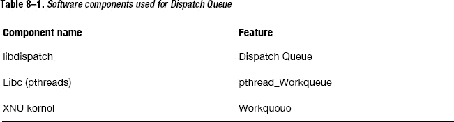
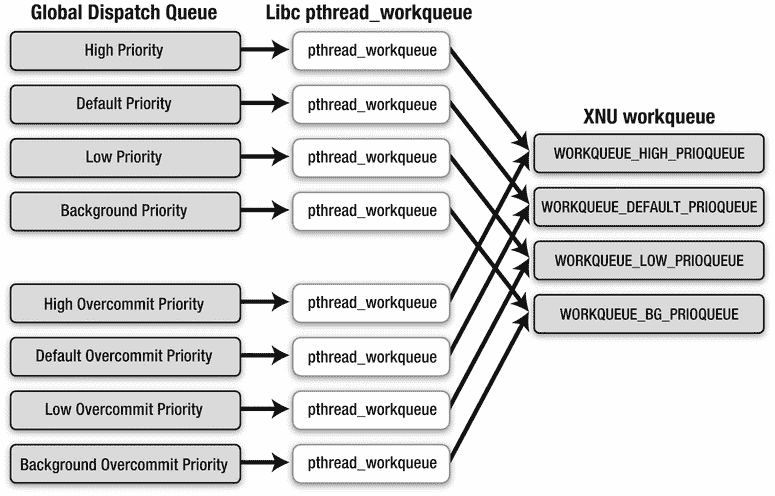
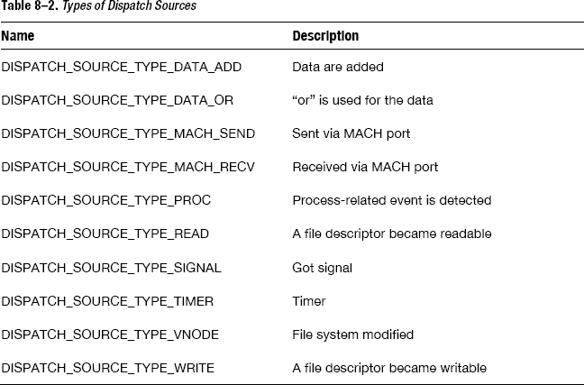

# GCD 实现

在本章中，我将解释 GCD 是如何实现的，以便你更好地理解其工作原理。然后我将解释 GCD 的一种称为“数据源”的功能，它与 XNU 内核事件相关。

## 调度队列

本节展示了 GCD 是如何实现的。我们将特别关注 GCD 的结构，然后了解 Block 是如何在调度队列上执行的。


### 内核级实现

从功能上来看，我们可以推测 GCD 使用了以下组件。

*   一个 C 语言层面的 FIFO 队列，用于管理添加的 Block
*   通过原子函数实现并发控制的轻量级信号量
*   一个 C 语言层面的容器，用于管理线程

如果仅此而已，那么它并不需要内核级的实现。^(1) 换句话说，如果应用程序员能够使用线程编写具有相同功能的应用程序源代码，那么 GCD 似乎就没有必要了。我们为什么需要 GCD？

让我们再来看看苹果的说法。

> *这项技术会将你通常在应用程序中编写的线程管理代码，下放到系统层面去处理。*

__________

¹ 实际上，存在一个移植到通用 Linux 操作系统上的 GCD 实现：Portable libdispatch [`https://www.heily.com/trac/libdispatch`](https://www.heily.com/trac/libdispatch)

它指出线程管理代码位于“系统层面”，这意味着它是在应用程序员无法触及的范围内完成的。

事实上，GCD 包含一些被称为 XNU 内核的系统级实现，而 XNU 内核是 iOS 和 OS X 的核心。由应用程序员自行管理线程的应用程序，其性能永远无法与使用基于 XNU 内核级别实现的 GCD 的应用程序相比。换句话说，GCD 优于使用 `pthreads` 或 `NSThread` 的普通多线程编程。而且，使用 GCD，你无需一遍又一遍地编写重复代码（即所谓的模板代码）。你可以专注于任务本身。这只会带来好处！你应该使用 GCD，或者底层使用了 GCD 的 Cocoa 框架中的 `NSOperationQueue` 类。

### GCD 结构

表 8–1 列出了用于实现调度队列的软件组件。



所有面向应用程序员的 GCD API 都是 `libdispatch` 库中的 C 语言函数。调度队列是一个实现为结构体和链表的 FIFO 队列。这个 FIFO 队列管理通过 `dispatch_async` 等函数添加的 Block。Block 并非直接添加到 FIFO 队列中。首先，它被添加到一个名为 `dispatch_continuation_t` 类型的结构体（称为 dispatch continuation）中，然后再被添加到 FIFO 队列。dispatch continuation 是所谓的执行上下文，它存储了与该 Block 关联的调度组等信息。

如你所知，可以通过 `dispatch_set_target_queue` 函数为调度队列设置目标队列。一个调度队列在其目标调度队列上执行。这些目标可以串联起来。串联的末端必须是主调度队列、某个全局调度队列，或者为各种优先级的串行调度队列预先准备的全局调度队列。主调度队列是一种在 `RunLoop` 中执行 Block 的机制。这里并没有太多令人兴奋的技巧。

### 全局调度队列与 `pthread_workqueue`

存在以下几种全局调度队列。

*   全局调度队列（高优先级）
*   全局调度队列（默认优先级）
*   全局调度队列（低优先级）
*   全局调度队列（后台优先级）
*   全局调度队列（高过量提交优先级）
*   全局调度队列（默认过量提交优先级）
*   全局调度队列（低过量提交优先级）
*   全局调度队列（后台过量提交优先级）

这四个带有过量提交优先级的队列被用作串行调度队列。正如其名“过量提交”所暗示的，这些调度队列会无视系统状态，强制创建线程。每个全局调度队列都使用自己的 `pthread_workqueue`。在 GCD 初始化时，`pthread_workqueue_create_np` 函数会初始化这些 `pthread_workqueue`。

`pthread_workqueue` 是 Libc 中的一个私有 pthread API。`pthread_workqueue` 通过 `bsdthread_register` 系统调用和 `workq_open` 系统调用在 XNU 内核中初始化一个工作队列，以获取关于该工作队列的信息。XNU 内核有四个工作队列。

*   `WORKQUEUE_HIGH_PRIOQUEUE`
*   `WORKQUEUE_DEFAULT_PRIOQUEUE`
*   `WORKQUEUE_LOW_PRIOQUEUE`
*   `WORKQUEUE_BG_PRIOQUEUE`

每个工作队列都有不同的优先级（图 8–1）。这些优先级与全局调度队列的四个优先级是对应的。



**图 8–1.** *全局调度队列、`pthread_workqueue` 与工作队列之间的关系*

让我们来看看 Block 是如何在调度队列上执行的。

### 执行 Block

当 Block 在全局调度队列上执行时，`libdispatch` 会从作为 FIFO 队列的全局调度队列本身中取出一个 dispatch continuation。它会调用 `pthread_workqueue_additem_np` 函数，并将全局调度队列、与该全局调度队列优先级相同的工作队列信息，以及一个用于执行 dispatch continuation 的回调函数作为参数传递进去。`pthread_workqueue_additem_np` 函数通过使用 `workq_kernreturn` 系统调用来通知工作队列有新的待执行项添加进来了。当 XNU 内核收到该通知时，它会根据系统状态决定是否应该创建一个线程。对于带有过量提交优先级的全局调度队列，它会随时创建一个线程。在这里，线程的含义几乎等同于普通 iOS 或 OS X 编程中使用的线程，但某些 `pthread` API 不能使用。更多信息，请参阅苹果公司的《并发编程指南》中的“与 POSIX 线程的兼容性”部分。

用于工作队列的线程由一种专为工作队列实现的特殊线程调度器管理。它的上下文切换与普通线程略有不同。这是我们应当使用 GCD 的原因之一。一个工作队列的线程会调用 `pthread_workqueue` 函数。该函数会调用 `libdispatch` 中的一个回调函数。然后，它执行 dispatch continuation 中的 Block。当 Block 执行完毕时，会通知调度组，并释放 dispatch continuation。最后，它准备好执行全局调度队列中的下一个 Block。这就是调度队列大致的执行流程。

无论如何，我们了解到，应用程序员想要实现一个比 GCD 更高效的方案是不可能的。


## Dispatch Source

本节我们将学习 GCD 的另一个特性——*dispatch source*。这是一个实用的功能，用于从应用程序侧处理内核事件。虽然这是一个底层特性，但在某些应用中可能很有用。Dispatch source 是对 `kqueue` 的封装，而 `kqueue` 是 BSD 内核中非常常见的特性。`Kqueue` 是一种机制，用于在 XNU 内核事件发生时，在应用程序中执行任务。它非常轻量，不会消耗太多资源（包括 CPU 负载）。可以说，`kqueue` 是在应用程序侧处理 XNU 内核事件的最佳机制。Dispatch source 可以处理表 8–2 中列出的事件。



当某个事件发生时，分配给该事件的任务将在指定的调度队列上执行。

代码清单 8–1 展示了如何使用 `DISPATCH_SOURCE_TYPE_READ` 读取异步文件描述符。

**代码清单 8–1.** *使用 dispatch source 读取文件*

```
__block size_t total = 0;
size_t size = how many bytes you want to get;
char *buff = (char *)malloc(size);
 /*
  * 将 'sockfd'（一个文件描述符）设置为异步（NONBLOCK）描述符
  */
fcntl(sockfd, F_SETFL, O_NONBLOCK);

 /*
  * 获取一个全局调度队列，用于添加事件处理器。
  */
dispatch_queue_t queue =
    dispatch_get_global_queue(DISPATCH_QUEUE_PRIORITY_DEFAULT, 0);

 /*
  * 创建一个带有 READ 事件的 dispatch source。
  */
dispatch_source_t source =
    dispatch_source_create(DISPATCH_SOURCE_TYPE_READ, sockfd, 0, queue);

 /*
  * 为 READ 事件分配一个任务。
  */
dispatch_source_set_event_handler(source, ^{
     /*
      * 获取可用数据大小。
      */
    size_t available = dispatch_source_get_data(source);

     /*
      * 从描述符读取数据
      */
    int length = read(sockfd, buff, available);

     /*
      * 当发生错误时，取消 dispatch source。
      */
    if (length < 0) {
         /*
          * 错误处理
          */

        dispatch_source_cancel(source);
    }

    total += length;

    if (total == size) {

         /*
          * 处理 buff
          */

         /*
          * 取消 dispatch source 以结束它
          */
        dispatch_source_cancel(source);
    }
});

 /*
  * 为 dispatch source 的取消分配一个任务
  */
dispatch_source_set_cancel_handler(source, ^{
    free(buff);
    close(sockfd);

     /*
      * 释放 dispatch source 本身
      */
    dispatch_release(timer);
});

 /*
  * 恢复 dispatch source
  */
dispatch_resume(source);
```

在 `CFSocket`（Core Foundation 框架的异步网络 API）中，有一个与此示例非常相似的源代码。由于 Foundation 框架中的异步网络 API 是使用 `CFSocket` 实现的，因此你可以享受到 dispatch source 的优势。换句话说，仅通过使用 Foundation 框架，你就可以享受到 GCD 的好处。

## 使用 Dispatch Source 的示例

最后，让我们来看一个使用 `DISPATCH_SOURCE_TYPE_TIMER` 的定时器示例（代码清单 8–2）。它可用于网络编程中的连接超时。

**代码清单 8–2.** *使用 dispatch source 的定时器*

```
 /*
  * 创建一个带有 DISPATCH_SOURCE_TYPE_TIMER 的 dispatch source
  *
  * 当指定时间过去后，一个任务将被添加到主调度队列
  */
dispatch_source_t timer = dispatch_source_create(
    DISPATCH_SOURCE_TYPE_TIMER, 0, 0, dispatch_get_main_queue());

 /*
  * 将定时器设置为 15 秒后触发，
  * 不重复，
  * 允许一秒的延迟
  */
dispatch_source_set_timer(timer,
    dispatch_time(DISPATCH_TIME_NOW, 15ull * NSEC_PER_SEC),
        DISPATCH_TIME_FOREVER, 1ull * NSEC_PER_SEC);

 /*
  * 设置在指定时间过去时执行的任务。
  */
dispatch_source_set_event_handler(timer, ^{
    NSLog(@"wakeup!");

     /*
      * 取消 dispatch source
      */
    dispatch_source_cancel(timer);
});

 /*
  * 为 dispatch source 的取消分配一个任务
  */
dispatch_source_set_cancel_handler(timer, ^{
    NSLog(@"canceled");

     /*
      * 释放 dispatch source 本身
      */
    dispatch_release(timer);
});

 /*
  * 恢复 dispatch source
  */
dispatch_resume(timer);
```

当你看到前面读取异步文件描述符的源代码或定时器的源代码时，你可能已经注意到了一些事情。

调度队列没有“取消”的概念。当一个任务被添加到调度队列时，你无法将其移除或取消。你可能需要自己编写代码来取消它、放弃取消操作，或者选择其他 API，例如 `NSOperationQueue`。而使用 dispatch source，你可以实现取消。你可以将一个任务作为 Block 分配给 dispatch source，并附带一个用于取消的回调。因此，使用 dispatch source 比直接使用 `kqueue` 更容易处理 XNU 内核中的事件。当需要执行与 `kqueue` 相关的操作时，你应该使用 dispatch source。它能使源代码更简洁。

## 总结

在本章中，我们学习了调度队列的实现以及如何使用 dispatch source。

通过本书，你已从基础到细节，并结合其实现，掌握了 ARC、Block 和 GCD：ARC——由编译器实现的自动内存管理；Block——一种新的语法，能极大地缩短应用程序代码；以及 GCD——一种非常高效的多线程编程模型。

当你理解这些技术并恰当地使用它们时，你的应用程序将具有高响应性和高质量。请开始使用这些技术吧。希望你的优秀应用能登上 App Store 排行榜前十名！

### 附录 A


