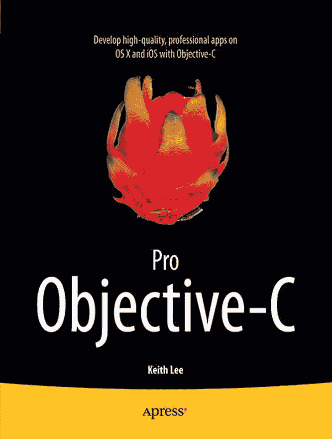

# Pro Objective-C

版权所有 © 2013 年 Keith Lee

本作品受版权保护。出版商保留所有权利，无论涉及全部还是部分材料，具体包括翻译、重印、重用插图、朗诵、广播、以缩微胶片或任何其他物理方式复制，以及通过目前已知或未来开发的类似或不同方法进行的信息传输或存储检索、电子改编、计算机软件等权利。因评论或学术分析，或为仅用于计算机系统输入与执行、仅供购买者个人使用而提供的简短摘录，不在法律保留范围之内。未经出版商当地现行版权法许可，不得复制本出版物或其任何部分，且必须始终向 Springer 申请许可。可通过版权清算中心的 `RightsLink` 获取许可。违反者将依据相应版权法被起诉。

ISBN-13 (平装): 978-1-4302-5050-0  
ISBN-13 (电子版): 978-1-4302-5051-7

本书中可能包含商标名称、标识和图片。对于出现的商标名称、标识或图片，我们并非每次均使用商标符号，而仅出于编辑目的、以利于商标持有人的方式使用它们，无意侵犯商标权。

本出版物中使用的商品名称、商标、服务标记及类似术语，即使未被明确标识，也不应视为对其是否受专有权利保护的看法。

尽管本书中的建议和信息在出版之日被认为是真实准确的，但作者、编辑或出版商均不对可能存在的任何错误或遗漏承担法律责任。出版商对本材料内容不作任何明示或暗示的保证。

总裁兼出版商：Paul Manning  
首席编辑：Michelle Lowman  
开发编辑：Douglas Pundick  
技术审阅：Felipe Laso Marsetti  
编辑委员会：Steve Anglin, Mark Beckner, Ewan Buckingham, Gary Cornell, Louise Corrigan, Jonathan Gennick, Jonathan Hassell, Robert Hutchinson, Michelle Lowman, James Markham, Matthew Moodie, Jeff Olson, Jeffrey Pepper, Douglas Pundick, Ben Renow-Clarke, Dominic Shakeshaft, Gwenan Spearing, Matt Wade, Steve Weiss, Tom Welsh  
统筹编辑：Mark Powers  
文字编辑：Kimberly Burton-Weisman  
排版：SPi Global  
索引编制：SPi Global  
美工：SPi Global  
封面设计：Anna Ishchenko

本书通过 Springer Science+Business Media New York（地址：233 Spring Street, 6th Floor, New York, NY 10013）在全球图书贸易中发行。电话：1-800-SPRINGER，传真：(201) 348-4505，电子邮件：`orders-ny@springer-sbm.com`，或访问 `www.springeronline.com`。Apress Media, LLC 是一家加州有限责任公司，其唯一成员（所有者）为 Springer Science + Business Media Finance Inc (SSBM Finance Inc)。SSBM Finance Inc 是一家特拉华州公司。

有关翻译信息，请发送电子邮件至 `rights@apress.com`，或访问 `www.apress.com`。

Apress 及 friends of ED 图书可批量采购用于学术、企业或推广用途。大多数图书还提供电子书版本和许可。欲了解更多信息，请参阅我们的特大批量销售–电子书许可网页：`www.apress.com/bulk-sales`。

作者在本文中引用的任何源代码或其他补充材料，读者可在 `www.apress.com/9781430250500` 获取。如需了解如何定位本书源代码的详细信息，请访问 `www.apress.com/source-code/`。

献给我的妻子 Dinavia，感谢你所有的爱、支持和灵感。

致卷发少年，你拥有超越年龄的智慧。

——基思

