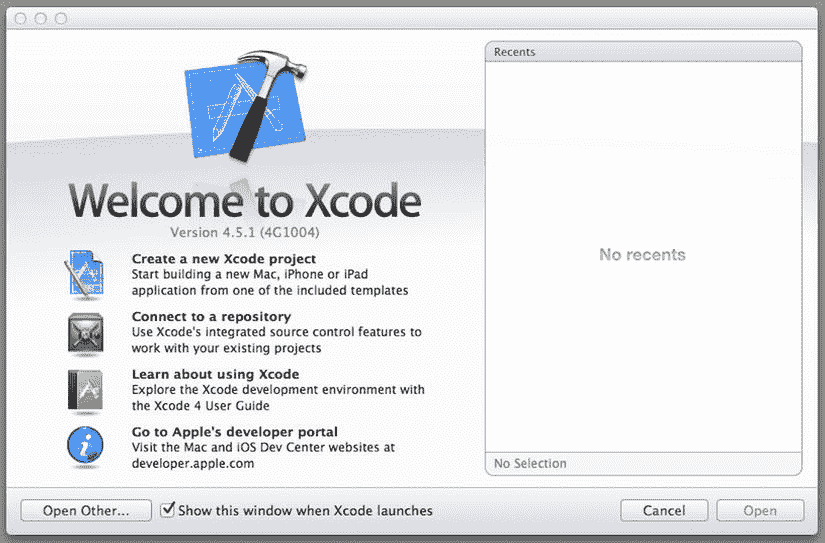
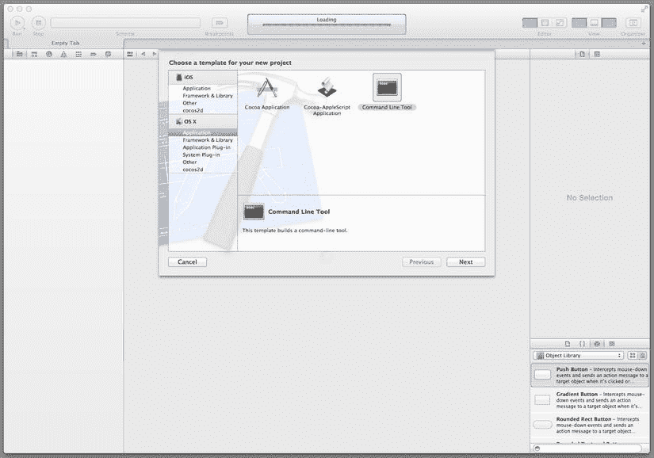
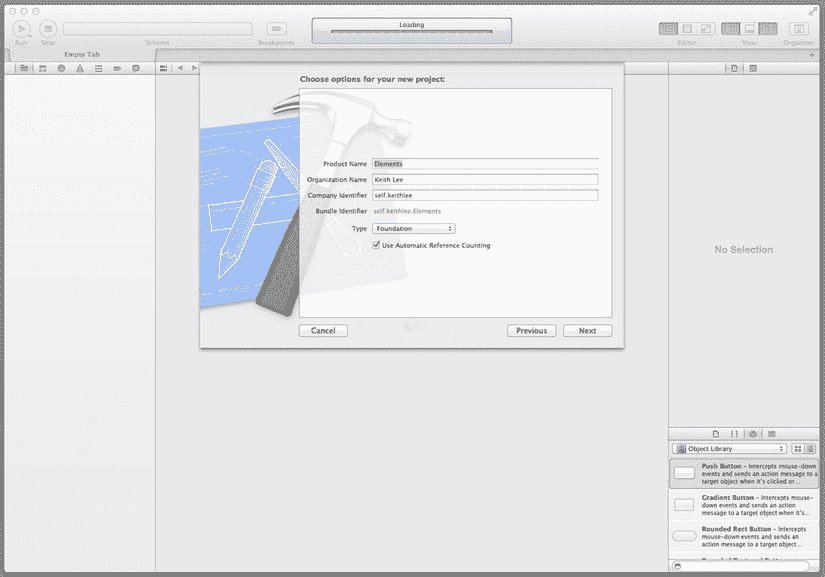
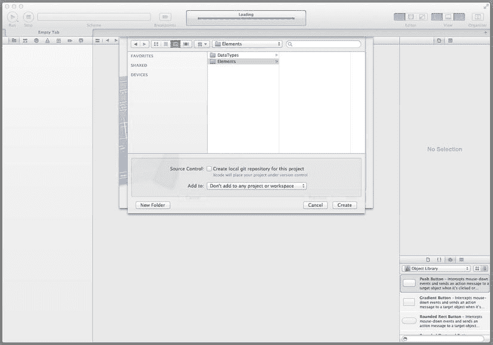
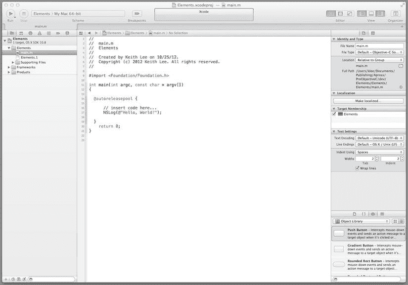
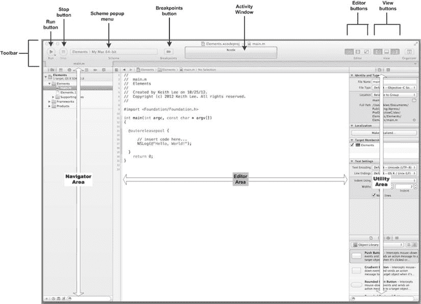
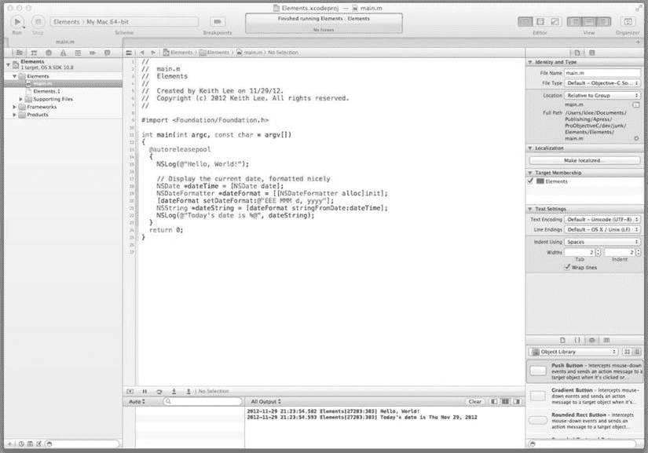

# 第 1 章 入门

欢迎 Objective-C 的新朋友们！在本章中，你将了解该语言的介绍，然后通过编写一些代码直接上手。我们将从 Apple Objective-C 开发环境概述开始，讨论 Objective-C 为何成为应用程序开发如此流行的语言。接着，你将开始使用 Apple 的集成开发环境（IDE）`Xcode`，并了解它如何使 Objective-C 编程既愉快又高效。

## 引言

Objective-C 是在 Apple `OS X`和`iOS`（`iPod`、`iPhone`、`iPad`）平台上开发应用程序的主要编程语言。近年来，这些平台已成为一些最流行的应用程序开发环境。这一成功的关键原因之一实际上归功于 Objective-C 语言的功能。

Apple 于 2007 年发布了 Objective-C 2.0 版本。它为语言增加了许多新特性，包括声明和合成属性、点表示法、快速枚举、异常支持、运行时性能改进以及 64 位机器支持。

Objective-C 语言持续演进，并获得了使 Objective-C 编程更强大且更具表现力的功能。近期语言的一些重要新增内容包括 Objective-C 对象的自动引用计数、改进了数据隐藏支持、改进了枚举的类型安全性，以及针对块对象、字面量和其他特性的新语言构造。

## Apple Objective-C 平台

Apple 的 Objective-C 开发环境由以下几个部分组成：

*   Objective-C 编程语言
*   Objective-C 运行时环境
*   软件库
*   软件开发工具

使用 Objective-C 进行面向对象软件开发是本书的主要主题。因此，本书第 1 部分涵盖了编程语言及其对面向对象编程的支持方式。

Objective-C 程序在 Objective-C 运行时环境中执行；它实现了语言的动态编程能力。本书第 2 部分深入探讨了 Objective-C 运行时环境，并演示了如何使用其应用程序编程接口（API）。

软件库包括一组框架、库和服务，它们提供通用功能以简化应用程序开发。该软件开箱即用，提供了在`OS X`和`iOS`平台上开发应用程序所需的大部分功能。本书第 3 部分涵盖了基础框架，即用于任何类型 Objective-C 程序的基础 API。

第 4 部分重点介绍 Objective-C 的高级特性，这些特性在程序员开发更复杂的应用程序时尤为有用。

软件开发工具支持源代码编辑与编译、用户界面开发、版本控制、项目管理、测试与调试以及其他功能。它们还简化了应用程序开发，并使开发者在开发、管理和维护 Objective-C 软件时更加高效。本书通篇提供了使用这些工具开发程序的指导。附录 B 提供了额外的提示和建议。

## 为什么选择 Objective-C？

那么，与当今可用的许多其他编程语言相比，Objective-C 有哪些优势？毕竟，有不少语言都支持面向对象编程。它是 Apple `OS X`和`iOS`平台上开发应用程序的主要语言，这是其受欢迎的最大原因吗？嗯，Objective-C 本身就是一个优秀的编程语言，具有多种使其在应用程序开发中极其强大、通用且易于使用的特性：


## Objective-C 特性

- **面向对象编程**：`Objective-C`编程语言提供了对面向对象编程（OOP）的完整支持，包括对象消息传递、封装、继承、多态和开放递归等能力。
- **对象消息传递**：对象消息传递使对象能够通过相互传递消息来进行协作。实际上，`Objective-C`代码（例如，一个类/对象方法或一个函数）向接收对象（*receiver*）发送一条消息，接收者使用该消息调用其对应的方法，如果需要则返回结果。如果接收者没有对应的方法，它可以通过其他方式处理该消息，例如将其转发给另一个对象、广播给其他对象、内省并应用自定义逻辑等。
- **动态运行时**：与许多其他支持 OOP 的语言相比，`Objective-C`非常动态。它将类型、消息和方法解析的大部分责任转移到了运行时，而不是编译时或链接时。这些能力可用于促进程序的实时开发和更新（无需重新编译和重新部署软件），以及长期演进（对现有软件影响极小或无影响）。
- **内存管理**：`Objective-C`提供了一种内存管理能力，即自动引用计数（`ARC`），它既简化了应用程序开发，又提高了应用程序性能。`ARC`是一种编译时技术，融合了传统自动内存管理机制（即垃圾回收器）的许多优点。然而，与传统技术相比，`ARC`提供了更好的性能（内存管理代码在编译时与程序代码交错），并且不会在程序执行中引入内存管理引起的暂停。
- **内省与反射**：`Objective-C`语言包含一些特性，使程序能够在运行时查询对象，提供信息（其类型、属性和支持的方法），并修改其结构和行为。这使得程序可以在其执行生命周期中被修改。
- **C 语言支持**：`Objective-C`主要是 C 语言的面向对象扩展。它是 C 的超集。这意味着可以使用 C 语言的原始能力，并且可以直接访问 C 库。
- **苹果技术**：苹果为`Objective-C`应用程序开发提供了丰富的软件库和工具。开发套件包含框架和库，这些框架和库提供了基础设施，使您能够专注于开发特定于应用程序的逻辑。苹果的集成开发环境`Xcode`提供了开发优秀`Objective-C`应用程序所需的所有工具。

这些只是`Objective-C`在开发者中持续受欢迎的众多原因中的一部分——我相信随着您继续阅读本书，您会发现更多原因。好了，说够了。现在让我们用`Xcode`来实际体验一下`Objective-C`，看看它到底能做什么！

## 开发一个简单的 Objective-C 程序

掌握编程语言的最佳方法是通过实践来学习，所以现在您将开始编写一些代码！但首先，让我们下载并安装`Xcode`。

`Xcode`是一个完整的`Objective-C`软件开发集成开发环境（IDE），适用于 Mac。它与 iOS 和 OS X 完全集成，并包含编写和编译源代码、开发复杂用户界面、软件测试和调试、发布构建和版本管理、项目管理以及许多其他功能所需的所有工具。`Xcode`对所有苹果 iOS 和 Mac 开发者计划的成员免费提供。如果您不是任一计划的成员，也可以从 Mac App Store 免费下载。本书中的示例是使用当前版本`Xcode 4.5`开发的。此版本的 IDE 可以在任何安装了 OS X Lion 或更高版本的 Intel Mac 计算机上运行。

### 创建项目

下载并安装`Xcode`后，启动该程序。将显示图 1-1 中所示的`Xcode`欢迎窗口。



图 1-1. `Xcode`欢迎窗口

**注意**：如果您有 iOS 设备（例如`iPhone`/`iPod`/`iPad`）连接到计算机，您可能会看到一条消息询问您是否要使用该设备进行开发。由于您不会在此处开发移动应用，您应该单击*Ignore*按钮。

此屏幕为您提供了多种选项：您可以访问苹果开发者门户，了解更多关于`Xcode`的信息等。因为您要创建一个新的应用程序，请选择**Create a new Xcode project**选项，方法是从`Xcode`的**文件**菜单中选择**New**  **Project...**。将显示`Xcode`工作区窗口，随后在其顶部显示新建项目助手窗格，如图 1-2 所示。



图 1-2. `Xcode`新建项目助手

新建项目助手的左侧分为 iOS 和 OS X 两部分。您将开始创建一个命令行应用程序，因此在 OS X 部分下选择**Application**。在右上角窗格中，您会看到几个图标，每个图标代表一个项目模板，这些模板是创建 OS X 应用程序的起点。选择**Command Line Tool**并单击**Next**。将显示项目选项窗口（如图 1-3 所示），供您输入项目特定信息。



图 1-3. `Xcode`项目选项窗口

请指定以下内容：

- **Product Name**（产品名称）：项目的名称（在此示例中为`Elements`）。
- **Organization Name**（组织名称）：开发者的标识符（通常是一个人或者组织）；此名称将包含在源文件顶部的版权注释中。
- **Company Identifier**（公司标识符）：用于为应用程序提供标识符的名称；通常输入类似您的域名反向顺序的内容，但任何名称都可以。
- **Type**（类型）：应用程序的类型（`Xcode`支持多种应用程序类型，包括 C、C++等；此处为使用`Foundation`框架的`Objective-C`项目选择**Foundation**）。
- 最后，选中复选框以指定项目将使用**Automatic Reference Counting**（自动引用计数）进行内存管理。

提供此信息后，单击**Next**以显示输入项目名称和位置的窗口（请参见图 1-4）。



图 1-4. `Xcode`项目位置窗口


在文件系统中指定您希望创建项目的位置（如有必要，请选择**新建文件夹**，并输入文件夹的名称和位置）；同时务必取消选中**源代码控制**复选框。接下来，单击**创建**按钮。项目（工作区）窗口随即打开，如图 1-5 所示。



图 1-5. Xcode 项目窗口

### Xcode 工作区

项目窗口由一个工具栏和三个主要区域组成，如图 1-6 所示。



图 1-6. 项目窗口主要元素

工具栏包含用于启动和停止项目运行的控件（**运行**和**停止**按钮）；一个用于选择要运行的**方案**的弹出菜单（方案定义了用于构建和执行一个或多个目标的信息）；一个用于在调试程序时切换断点开/关的**断点**按钮；工具栏中部的**活动视图**；一组**编辑器**按钮；一组**视图**按钮；以及一个**管理器**按钮。

工具栏下方的三个区域分别是导航器区域、编辑器区域和工具区域。*导航器区域*用于查看和访问项目中的不同资源（文件等）。*编辑器区域*是您编写大部分程序的地方。*工具区域*用于查看和访问帮助及其他检查器，并可在项目中使用现成的资源。

以上是对组成 Xcode 工作区的元素进行的（非常）高层概述，所以不必马上理解所有内容。随着您阅读本书并开发代码，您将获得大量使用 Xcode 及其相关工具的经验。

### 完成您的试运行

您现在已经创建了一个名为 `Elements` 的 Xcode 项目。如果您查看项目窗口的导航器区域，顶部会看到一个由七个按钮组成的选择栏，其下方是主导航器区域。单击最左侧的按钮（文件夹图标）即可查看项目导航器视图。项目导航器显示项目或 Xcode 工作区的内容（文件、资源等）。现在，通过单击 `Elements` 文件夹图标旁的展开三角形来打开 `Elements` 文件夹。在该文件夹中，选择名为 `main.m` 的文件；该文件包含您程序的 `main()` 函数。

如果您已经熟悉 Objective-C 或任何 C 系列语言，您就会知道 `main()` 函数是程序的起点，并且程序开始执行时会调用该函数。一个可执行的 Objective-C 程序必须有一个 `main()` 函数。在编辑器区域中，观察代码清单 1-1 中显示的代码。

*代码清单 1-1.* Hello, World!

```
// insert code here...
NSLog(@"Hello, World!");
```

是的，这就是无处不在的 Hello, World! 问候语。当您使用 Xcode 创建一个命令行程序时，它会创建一个包含 `main()` 函数的 `main.m` 文件，该函数带有此默认代码。现在，让我们为您的简单程序实际编写一点代码。按照代码清单 1-2 所示更新 `main()` 函数。

*代码清单 1-2.* Hello, World!（含当前日期）

```
#import <Foundation/Foundation.h>

int main(int argc, const char * argv[])
{
  @autoreleasepool
  {
    NSLog(@"Hello, World!");

// Display the current date, formatted nicely
    NSDate *dateTime = [NSDate date];
    NSDateFormatter *dateFormat = [[NSDateFormatter alloc]init];
    [dateFormat setDateFormat:@"EEE MMM d, yyyy"];
    NSString *dateString = [dateFormat stringFromDate:dateTime];
    NSLog(@"Today's date is %@", dateString);
  }
  return 0;
}
```

除了 Hello, World! 之外，该程序还会显示当前的星期和日期。现在，您可以单击工具栏上的**运行**按钮（或从 Xcode 的 Product 菜单中选择**运行**）来编译并运行此程序。输出窗格（位于编辑器区域下方）会显示 Hello, World! 消息和日期（请参见图 1-7）。



图 1-7. Hello, World! 示例

完美。您已经学会了如何创建一个 Xcode 项目，以及如何编译和运行一个简单的 Objective-C 程序。请随意继续探索 Xcode 项目窗口，以更加熟悉其内容。

## 总结

本章介绍了 Objective-C。您下载并安装了 Xcode，并使用它编写了一个 Objective-C 程序。Objective-C 语言，结合 Apple 提供的工具和软件，使其成为一个出色的软件开发平台。完成此介绍后，您现在已准备好深入学习该语言。准备好后，请翻到下一页，让我们开始开发一些类吧！

