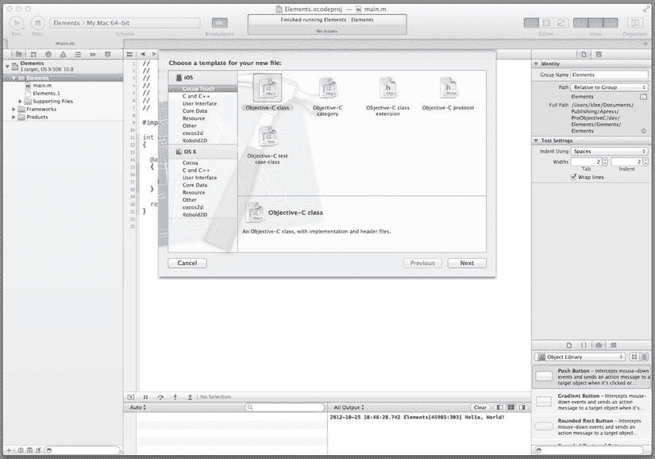
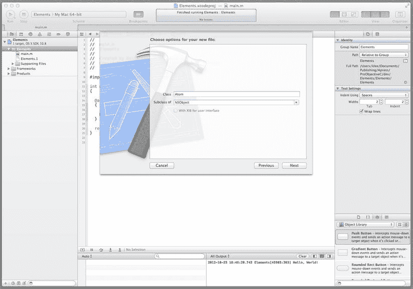
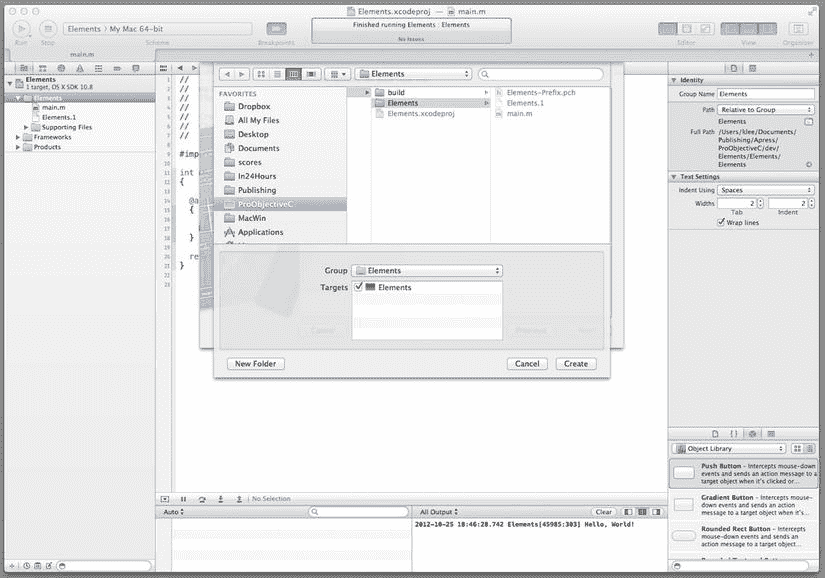
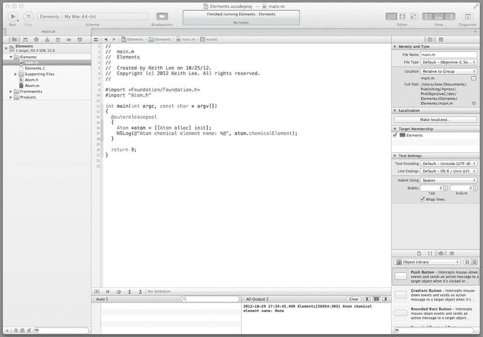
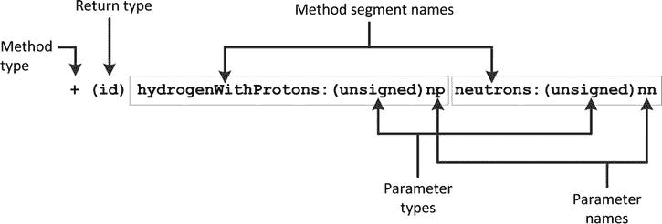
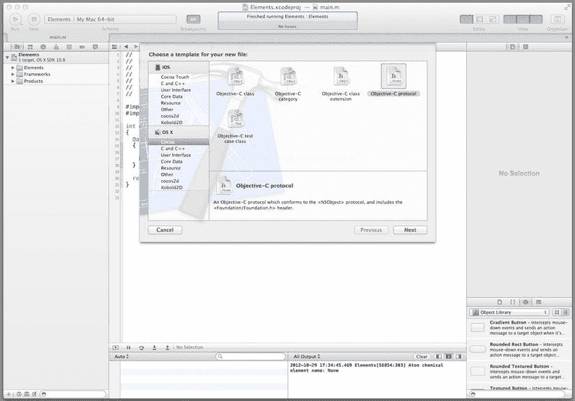
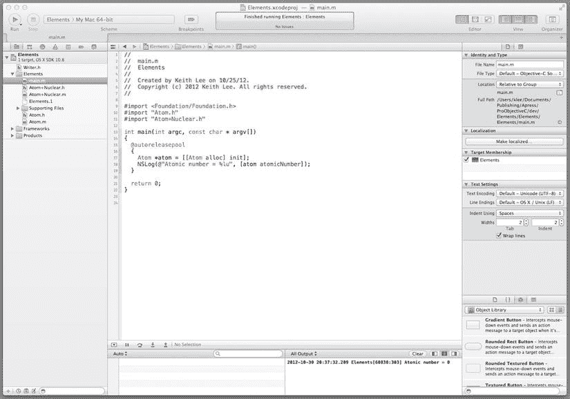

# 第 2 章：使用类

类是面向对象编程（OOP）的构建块。实际上，使用 OOP 创建的程序主要由一个相互作用的*类实例*（即对象）网络组成。Objective-C 语言为 OOP 提供了全面支持，包括支持在设计时指定类和运行时创建类实例的语言特性，以及支持对象交互的多种机制。

本章重点介绍 Objective-C 用于开发类的关键元素和独特特性。它涵盖了 Objective-C 类结构、类设计与实现等关键领域，以及一些支持类开发和 OOP 的附加语言特性。本章还包含大量示例（以及您将开发的一个程序），以加深您对这些概念的理解。听起来很有趣，对吧？好的，那么让我们开始吧！

## 开发您的第一个类

面向对象编程是一种强调创建和使用软件对象来编写程序的计算机编程风格。一个*软件对象*提供了对被建模事物/概念的特征或属性（其*状态*）的表示，以及对其所能执行操作（其*方法*）的定义。使用 Objective-C，您可以通过类*接口*和相应的*实现*来创建对象的规范或蓝图。在接口中，您指定类的结构（即其属性和方法）。在实现中，您指定存储类内部状态的变量，并通过定义其属性和方法来实现其逻辑。Objective-C 语言还提供了几个用于开发类的附加特性，特别是*协议*和*类别*，您将在本章后面部分了解它们。现在，让我们从基础知识开始，向 `Elements` 项目添加一个类。

### 向项目添加一个类

在 Xcode 中，选择导航器区域中的 **Elements** 文件夹，然后通过从 Xcode 的 File 菜单中选择 **New  File . . .** 来创建一个新文件。将显示新建文件模板。接下来，在 OS X 下选择 **Cocoa**；这会显示 Objective-C 类元素的模板。选择 **Objective-C class 图标**来创建一个包含实现文件和头文件的 Objective-C 类，然后单击**下一步**按钮（如图 2-1 所示）。



图 2-1. 创建 Objective-C 类


此时会显示一个窗口，用于为你的类选择选项，具体来说就是其名称及其子类的名称。如图 2-2 所示，在类名处输入 `Atom`，从子类下拉列表中选择 `NSObject`（或在列表中键入子类名称），然后单击 `Next`。



图 2-2. 指定 Atom 类选项

接下来，系统会提示你指定该类的项目目标以及在文件系统中保存类文件的位置。将位置保留为 Elements 文件夹，项目目标保留为 Elements 项目，然后单击 `Create` 按钮（参见 图 2-3）。



图 2-3. 类文件文件夹和项目目标

你已经使用 Xcode 创建了一个类！在 Xcode 的项目导航器窗格中，你会看到 `Atom` 类被分成了两个文件（`Atom.h` 和 `Atom.m`），它们已被添加到 Elements 文件夹下的项目中。接下来，你将在此文件中开发 `Atom` 类。

## 编写 Atom 类接口

`Atom` 类的接口在 `Atom.h` 头文件中指定，实现则在 `Atom.m` 文件中。这些文件的名称反映了 Objective-C 的约定，即头文件以 `.h` 为后缀，实现文件以 `.m` 为后缀。我们来看一下 Xcode 创建的 `Atom.h` 接口文件。在项目导航器窗格中，选择 `Atom.h`，然后在编辑器窗格中查看 Atom 接口（参见 代码清单 2-1）。

*代码清单 2-1.* Atom 类基接口

```
#import <Foundation/Foundation.h>

@interface Atom : NSObject
@end
```

`#import <Foundation/Foundation.h>` 这一行是一个 Objective-C *预处理器*指令，用于在此（`Atom`）头文件中包含 Foundation 框架的头文件。预处理器用于在编译前转换 Objective-C 代码（你将在本书的第 5 章中了解有关预处理器的更多信息）。Foundation 框架提供了一套基础层 API，可用于任何类型的 Objective-C 程序（本书第 3 部分将深入探讨 Foundation 框架 API）。头文件的其余部分则声明了 `Atom` 类的接口。

类接口声明以 `@interface` 指令和类名开头，以 `@end` 指令结束。声明类接口的正式语法如代码清单 2-2 所示。

*代码清单 2-2.* 类接口语法

```
@interface ClassName : SuperclassName
// 属性和方法声明
@end
```

因此，从代码清单 2-1 可以看出，`Atom` 类有一个名为 `NSObject` 的超类。超类建立了一个公共接口和实现，专门的子类可以继承、修改和补充它。因此，`Atom` 类*继承*了 `NSObject` 类的功能。`NSObject` 是大多数 Foundation 框架类层次结构的根（即基）类，并为 Objective-C 运行时提供了基本接口。因此，你在此实现的大多数类都将继承自 `NSObject` 类层次结构。现在，让我们为 `Atom` 类声明自定义属性和方法（即那些不是从 `NSObject` 继承的）。在编辑器窗格中，按代码清单 2-3 所示更新 `Atom.h` 文件（代码更新部分以粗体显示）。

*代码清单 2-3.* Atom 接口

```
@interface Atom : NSObject
@property (readonly) NSUInteger protons;
@property (readonly) NSUInteger neutrons;
@property (readonly) NSUInteger electrons;
@property (readonly) NSString *chemicalElement;

- (NSUInteger) massNumber;
@end
```

这段代码向类声明中添加了几个属性和一个*实例*方法。属性 `chemicalElement` 的类型是 `NSString *`（即指向文本字符串的指针），并具有 `readonly` 属性，这意味着你可以获取其值，但无法设置。属性 `protons`、`neutrons` 和 `electrons` 的类型都是 `NSUInteger`（即非负整数值），并且是只读的。名为 `massNumber` 的实例方法返回一个非负整数值。你将在本章后面了解声明类属性和方法的具体细节。在此期间，让我们通过编写类实现来完成这个示例。

## 编写 Atom 类实现

`Atom` 类的实现在 `Atom.m` 文件中提供。在项目导航器窗格中，选择 `Atom.m` 文件，然后在编辑器窗格中查看基本的 Atom 实现，如代码清单 2-4 所示。

*代码清单 2-4.* Atom 类基实现

```
#import "Atom.h"

@implementation Atom
@end
```

`import` 指令包含了 `Atom.h` 头文件的内容（即其预处理器指令、接口声明以及其他包含的头文件）。现在，让我们定义在 Atom 接口中声明的 `Atom` 类的自定义属性和方法。在编辑器窗格中，按代码清单 2-5 所示更新 `Atom.m` 文件（代码更新部分以粗体显示）。

*代码清单 2-5.* Atom 类实现

```
@implementation Atom

- (id) init
{
  if ((self = [super init]))
  {
    _chemicalElement = @"None";
  }

return self;
}

- (NSUInteger) massNumber
{
  return 0;
}

@end
```

在类接口中声明的所有方法都必须在类实现中定义。因此，代码清单 2-5 中的 Atom 实现定义了两个方法：`init()` 和 `atomicMass()`。`massNumber()` 方法是在 Atom 接口中声明的，因此该方法的具体程序逻辑在这里定义；它仅为原子质量数返回值 0。这里也定义了 `init()` 方法，但这是为什么呢？毕竟，这个方法并未在 Atom 接口中声明。实际上，`init()` 方法是在 `NSObject` 中声明的，而 `NSObject` 是 `Atom` 类的子类（即父类）。`NSObject init()` 方法用于在为新对象分配内存后立即对其进行初始化；因此，如果你需要执行任何自定义的初始化功能（将实例变量设置为已知值等），则应在此处进行。在此实现中，`init()` 方法将由 `chemicalElement` 属性支持的实例变量初始化为文本字符串 `None`。

完成对 `Atom` 类实现的更新后，你应该测试你的类。首先，回到 `main()` 方法，并按代码清单 2-6 所示进行编辑。

*代码清单 2-6.* Atom 项目 main() 方法

```
#import <Foundation/Foundation.h>
#import "Atom.h"

int main(int argc, const char * argv[])
{
  @autoreleasepool
  {
    Atom *atom = [[Atom alloc] init];
    NSLog(@"Atom chemical element name: %@", atom.chemicalElement);
  }

return 0;
}
```


  
在`main()`方法中，创建一个`Atom`对象，然后使用 Foundation 框架的`NSLog`函数将该对象的化学元素名称显示到输出窗格。通过从 Xcode 的 File 菜单中选择**保存**来保存项目的所有文件，然后点击工具栏中的**运行**按钮编译并运行程序。（你也可以直接编译和运行程序，它会自动保存对文件的任何更改。）输出窗格（参见图 2-4）会显示消息“Atom chemical element name: None”。



图 2-4 测试`Atom`类

很好。你已经成功实现并测试了你的第一个 Objective-C 类。通过这个入门介绍，你现在可以“深入内部”来深入学习类的知识了——那么，让我们开始吧！

### 实例变量

实例变量（有时称为*ivars*）是为类声明的变量，它们在对应的类实例（即对象）的整个生命周期中存在并保持其值。实例变量使用的内存在对象首次创建时分配，并在对象被释放时释放。实例变量具有与对象对应的隐式作用域和命名空间。Objective-C 提供了控制对实例变量直接访问的特性，以及获取/设置其值的便捷机制。

### 实例变量访问

对对象实例变量的访问由其作用域决定。在对象内部，其实例变量可以从任何实例方法中直接访问。从外部类实例对对象实例变量的直接访问由变量的作用域决定。Objective-C 提供了几个编译器指令，用于显式指定实例变量的作用域（即控制访问权限）：

*   `@private`：实例变量仅能在声明它的类及该类的其他实例内部访问。
*   `@protected`：实例变量能在声明它的类及其任何子类的实例方法内部访问。如果未为实例变量指定保护级别，这是默认作用域。
*   `@public`：实例变量可以在任何地方访问。
*   `@package`：实例变量可以从任何其他类实例或函数访问，但在包外部，它被视为`private`。此作用域对库或框架类很有用。

### 声明实例变量

实例变量可以在类接口或实现中声明；然而，在类的公共接口中声明它们会违反 OOP（面向对象编程）的关键原则之一——封装。因此，推荐的做法是在类实现中声明实例变量；具体来说，是在紧跟在类`@implementation`指令之后的语句块内。声明语法如列表 2-7 所示。

*列表 2-7.* 实例变量声明语法

```
@implementation ClassName
{
  // Instance variable declarations
}
...
@end
```

如果使用了访问控制编译器指令，则在语句块中声明每个实例变量的语法会更新，如列表 2-8 所示。

*列表 2-8.* 带有访问控制指令的实例变量声明

```
{
  protection_directive ivar_declaration_list
  protection_directive ivar_declaration_list
  ...
}
```

一个使用访问控制编译器指令声明实例变量的示例类，如列表 2-9 所示。

*列表 2-9.* 带有实例变量声明的示例类

```
@implementation MyTestClass
{
  @protected
    int myInt1;
    int myInt2;
  @private
    float myFloat;
  @package
    double myDouble;
}
...
@end
```

这个类声明了两个受保护的变量`myInt1`和`myInt2`；一个私有变量`myFloat`；以及一个包保护变量`myDouble`。

### 访问实例变量

实例变量直接绑定到对应的对象并存在于其上下文中。因此，对象的实例方法可以直接访问其实例变量。例如，如果列表 2-9 中所示的`MyTestClass`类定义了一个实例方法`myTestMethod`，该方法可以直接访问实例变量`myInt1`（参见列表 2-10）。

*列表 2-10.* 实例变量访问声明

```
-(void) myTestMethod
{
  myInt1 = 1;
  ...
}
```

尽管实例变量提供了对对象状态的便捷、直接访问，但它们暴露了类的内部细节——这违反了 OOP 的封装原则。因此，只有在必要时才应声明实例变量，并且声明应放在类实现中，而不是公共接口中。公开暴露对象内部状态的首选方法是通过*声明属性*。下面我们来看看这些。

### 属性

在许多编程语言中，访问对象内部状态的方法（通常称为*getter/setter 方法*）必须手动编码。Objective-C 提供了声明属性来自动化和简化此任务。属性与实例变量的不同之处在于，它不直接访问对象的内部状态，而是提供一种便捷的机制（即 getter/setter 方法）来访问这些数据，因此可能包含其他逻辑。Objective-C 的*声明属性*使编译器能够根据你提供的规范自动生成这些方法。这减少了你需要编写和维护的代码量，并提高了程序的一致性和可靠性。

### 属性声明

属性使用`@property`关键字声明，后跟一组可选的属性（用括号括起来）、属性类型及其名称。

```
@property (attributes) type propertyName;
```

例如，你之前开发的`Atom`类（参见列表 2-3）声明了属性`chemicalElement`、`protons`、`neutrons`和`electrons`。属性可以在*类接口*、*类别接口*或*协议*中声明。该声明设置了与属性关联的 getter/setter 方法的签名，但不会生成实际的方法定义。

### 属性特性

属性声明特性用于指定与属性相关的存储语义和其他行为。最常用的属性特性在表 2-1 中进行了描述。

表 2-1 属性特性  


| 类别 | 属性 | 描述 |
| --- | --- | --- |
| 原子性 | `nonatomic` | 访问器不是原子的，因此当多个线程同时访问时，可能会产生不同的结果。如果未指定，访问器是原子的；也就是说，它们的值总是被完整地设置/获取。 |
| 设置器语义 | `assign` | 设置器方法对属性值执行简单的赋值，不使用 `copy` 或 `retain`。这是默认设置。 |
|  | `retain` | 赋值时，输入值将收到一条 `retain` 消息，而先前的值将收到一条 `release` 消息。 |
|  | `copy` | 赋值时，将设置新消息的一个副本，而先前的值将收到一条 `release` 消息。 |
|  | `strong` | 此属性（在属性上应用 ARC 内存管理时使用）等同于 `retain` 属性。 |
|  | `weak` | 此属性（在属性上应用 ARC 内存管理时使用）类似于 `assign` 属性，不同之处在于，如果受影响的属性被释放，其值会被设置为 `nil`。 |
| 读/写 | `readwrite` | 该属性可读可写。必须同时实现 getter 和 setter 方法。这是默认设置。 |
|  | `read-only` | 该属性只可读取，不可写入。必须实现 getter 方法。 |
| 方法名称 | `getter=getterName` | 将 getter 重命名为指定的 `getterName`。 |
|  | `setter=setterName` | 将 setter 重命名为指定的 `setterName`。 |

### 属性定义

属性定义在类的实现部分进行。在大多数情况下，属性由一个实例变量支持；因此，属性定义包括为该属性定义 getter 和 setter 方法、声明一个实例变量，以及在 getter/setter 方法中使用该变量。Objective-C 提供了几种定义属性的方法：显式定义、通过关键字合成以及自动合成。

### 显式定义

对于这种属性定义方法，其方法在相应的类实现中被显式定义。例如，名为 `myIntProperty` 的属性的 setter 方法可以如代码清单 2-11 所示进行定义。

*代码清单 2-11.* 属性设置器方法定义

```
-(void) setMyIntProperty:(int) value
{
  _myIntProperty = value;
{
```

与属性对应的变量名称以下划线开头。此命名反映了 Objective-C 中属性实例变量的标准命名约定，即变量名称为属性名称，并加上下划线前缀。

### 通过关键字合成

通过使用 `@synthesize` 关键字，编译器可以自动生成属性定义。属性在相应的类实现部分被合成。通过关键字合成属性的语法是

```
@synthesize propertyName [= instanceVariableName];
```

如果未提供可选的 `instanceVariableName` 赋值，编译器将遵循属性支持实例变量的标准命名约定自动生成实例变量名称。如果提供了 `instanceVariableName` 值，编译器将使用提供的名称创建实例变量。对于名为 `myIntProperty` 的属性，使用以下语句将自动生成 getter 和 setter 方法：

```
@synthesize myIntProperty;
```

编译器将创建一个名为 `_myIntProperty` 的相应实例变量。

### 自动合成

推荐的 Apple Objective-C 编译器 Clang/LLVM（4.2 版本及以上）支持对已声明属性进行自动合成。这意味着编译器将自动合成那些既不是：1）通过关键字合成（例如，使用 `@synthesis`）；2）动态生成（通过 `@dynamic` 属性指令）；也不是 3）具有用户提供的 getter 和 setter 方法的已声明属性。因此，在使用此功能时，无需包含代码来合成已声明的属性。一个已声明的属性连同相应的实例变量会被编译器自动合成。之前实现的 `Atom` 类（参见代码清单 2-3）对其声明的属性使用了自动合成。

### 动态生成

属性的访问器方法可以在运行时被委托或动态创建。在这些情况下，可以使用 `@dynamic` 属性指令来防止编译器自动生成访问器方法。如果编译器找不到与名称跟在 `@dynamic` 属性后的属性相关联的访问器方法的实现，它不会生成警告。相反，开发者负责通过直接编写访问器方法实现、使用其他方式派生它们（例如动态代码加载或动态方法解析），或利用动态生成这些方法的软件库（例如 Apple Core Data 框架）来创建这些方法。

### 属性支持的实例变量

大多数属性由一个实例变量支持，因此这是属性隐藏对象内部状态的机制。除非另有说明，实例变量应与属性同名，但带有下划线前缀。在代码清单 2-5 所示的 `Atom` 类实现中，`init` 方法访问 `chemicalElement` 属性的实例变量，该变量名为 `_chemicalElement`。

### 属性访问

Objective-C 提供了两种访问属性的机制：访问器方法和点表示法。由编译器合成的访问器方法遵循标准命名约定：

*   用于访问值的方法（*getter* 方法）与属性同名。
*   用于设置值的方法（*setter* 方法）以单词“set”开头，后接属性名，且属性名的首字母大写。

使用这些约定，名为 `color` 的属性的 getter 方法将被命名为 `color`，其 setter 方法将被命名为 `setColor`。因此，对于一个名为 `myObject` 的对象，其 getter 和 setter 访问器方法将如下调用：

```
[myObject color];
[myObject setColor:value];
```

Objective-C 为访问器方法提供了一种简洁的替代方案：*点表示法*。用于获取和设置名为 `myObject` 的对象的属性的点表示法语法是：

```
myObject.propertyName;
myObject.propertyName = propertyValue;
```

第一条语句调用 getter 访问器方法来检索属性的值，第二条语句调用 setter 访问器方法将属性设置为 `propertyValue` 的值。

通常，应使用上述两种机制来访问属性。但是，如果与属性关联的对象尚未（或可能尚未）完全构造，则不应使用这些机制，而应改用属性支持的实例变量。这意味着在类的 `init` 方法或 `dealloc` 方法中，应直接访问实例变量，如代码清单 2-5 中 `Atom` 类的 `_chemicalElement` 实例变量所示。

方法


## 方法

方法定义了类及其实例（对象）在运行时所展现的行为。它们直接与 Objective-C 类（类方法）或对象（实例方法）相关联。实例方法可以直接访问对象的实例变量。方法可以在类接口、协议和/或类别中声明。如此声明的方法需在相应的类实现中进行定义。

### 语法

方法声明由方法类型、返回类型以及一个或多个提供名称、参数和参数类型信息的方法片段组成（请参见图 2-5）。



图 2-5。方法声明语法

*方法类型*标识符指定该方法是类方法还是实例方法。类方法使用 `+`（加号）声明，表示该方法具有*类范围*，意味着它在类级别运行，并且无法访问类的实例变量（除非它们作为参数传递给该方法）。实例方法使用 `–`（减号）声明，表示该方法具有*对象范围*。它在实例级别运行，并且可以直接访问对象及其父对象的实例变量（受限于实例变量的访问控制）。

*返回类型*指示方法返回变量的类型（如果有）。返回类型位于方法类型之后的圆括号内。如果方法不返回任何内容，则返回类型声明为 `void`。图 2-5 声明了一个带有两个参数的类方法，参数名分别为 `np` 和 `nn`，每个参数都接受一个非负整数值，并返回一个类型为 `id` 的值，这是一种特殊的 Objective-C 类型，我将在下一章讨论。

方法定义的语法与声明语法相同，但不是在末尾使用分号，而是后跟用花括号括起来的实现逻辑。`Atom` 类声明了一个名为 `massNumber` 的实例方法；该方法的实现如代码清单 2-5 所示。

### 调用方法

在 Objective-C 中，一个对象（*发送者*）通过向另一个对象（*接收者*）发送消息来与之交互，从而使接收者调用特定的方法。在对象上调用方法的语法为：

```
[接收者 方法片段名:参数值 ...];
```

消息由方括号包围。如果方法有多个片段，则其名称和参数值依次列出，每个之间用空格分隔。一个包含多个名称/参数值对的方法调用示例如下：

```
[Atom withProtons:6 neutrons:6 electrons:6];
```

此方法调用包含三个片段，因此需要三个输入参数：质子数、中子数和电子数，均为整数。

### 协议

您已经了解了 Objective-C 类的基本元素和结构，但该语言还提供了几个用于开发类的附加特性。在本节中，您将学习其中之一：协议。

*协议*声明了任何类都可以实现的方法和属性。类接口直接与特定类相关联，从而与类层次结构相关联。另一方面，协议不与任何特定类相关联，因此它可以用来捕获层次结构上不相关的类之间的相似性。协议为 Objective-C 提供了支持规范多重继承（即方法声明的多重继承）概念的能力。协议还可以用于定义对象可以发送的消息（通过指定符合协议的要求）。

### 语法

协议声明以 `@protocol` 指令开头，后跟协议名称。它以 `@end` 指令结束。协议可以包含*必需*和*可选*方法；可选方法不要求协议的实现方必须实现这些方法。使用 `@required` 和 `@optional` 指令（后跟方法名称）来适当地标记方法。如果未指定任一关键字，则默认为必需。协议声明的语法如代码清单 2-12 所示。

*代码清单 2-12.* 协议声明语法

```
@protocol 协议名
// 属性声明
@required
// 方法声明
@optional
// 方法声明
@end
```

一个协议可以通过在尖括号内指定每个已声明协议的名称来合并其他协议；这被称为*采纳*一个协议。使用逗号分隔多个协议（请参见代码清单 2-13）。

*代码清单 2-13.* 合并其他协议

```
@protocol 协议名<协议名(列表)>
// 方法声明
@end
```

接口可以使用类似的语法采纳其他协议（请参见代码清单 2-14）。

*代码清单 2-14.* 采纳协议的接口

```
@interface 类名 : 父类 <协议名(列表)>
// 方法声明
@end
```

为了将理论付诸实践，您将向 `Atom` 项目添加一个协议，并使 `Atom` 实现遵循（即实现）该协议的必需方法。从 Xcode 工作区窗口，在导航区域中选择 **Elements** 文件夹，然后创建一个新文件（通过从 Xcode 文件菜单中选择 **新建  文件...**），就像您之前所做的那样。将显示新文件模板。和之前一样，在 OS X 下选择 **Cocoa**，但不要创建 Objective-C 类，而是选择 **Objective-C 协议图标**来创建一个遵循 `NSObject` 协议的协议。接下来，单击 **下一步** 按钮（请参见图 2-6）。



图 2-6。使用 Xcode 创建协议

在指定新文件选项的下一个窗口中，输入 **Writer** 作为协议名称，然后单击 **下一步** 按钮。接下来，系统将提示您指定在文件系统中保存类文件的位置以及类的项目目标。将位置保留为 **Elements** 文件夹，选择 **Elements** 作为项目目标（如果尚未选中），然后单击 **创建** 按钮。一个名为 `Writer.h` 的头文件已添加到 Xcode 项目导航窗格中。单击此文件以显示 Writer 协议（请参见代码清单 2-15）。

*代码清单 2-15.* 协议模板文件

```
#import <Foundation/Foundation.h>

@protocol Writer <NSObject>

@end
```

在编辑窗格中，按代码清单 2-16 所示更新 `Writer.h` 文件（代码更新以**粗体**显示）。

*代码清单 2-16.* 协议方法声明

```
#import <Foundation/Foundation.h>

@protocol Writer <NSObject>

- (void)write:(NSFileHandle *)file;

@end
```

此协议声明了一个名为 `write` 的方法，该方法接受一个指向 `NSFileHandle` 的引用作为参数，并且不返回任何内容。为了使 `Atom` 接口采纳此协议，在导航窗格中选择 `Atom.h` 文件，然后进行以**粗体**显示的更新（请参见代码清单 2-17）。

*代码清单 2-17.* 采纳协议

```
#import <Foundation/Foundation.h>
#import "Writer.h"

@interface Atom : NSObject <Writer>
```


```objectivec
@property (readonly) NSUInteger protons;
@property (readonly) NSUInteger neutrons;
@property (readonly) NSUInteger electrons;
@property (readonly) NSString *chemicalElement;

- (NSUInteger) massNumber;

@end
```

`Atom` 接口已有效扩展了来自 `Writer` 协议的方法。请选择 `Atom.m` 实现文件，并添加如列表 2-18 所示的代码。

*列表 2-18.* Atom 类实现

```objectivec
@implementation Atom
...

- (void)write:(NSFileHandle *)file
{
  NSData *data = [self.chemicalElement
                  dataUsingEncoding:NSUTF8StringEncoding];
  [file writeData:data];
  [file closeFile];
}
...
@end
```

现在，`Atom` 类遵循 `Writer` 协议，向 `Atom` 对象发送 `write:` 消息时，会将化学元素名称写入文件。这是一个示例，说明如何使用协议在不同层级结构的类之间提供通用行为。

## 类别

类别允许在不创建子类的情况下，向现有类添加新功能。类别中的方法会成为该类类型的一部分（在程序范围内），并会被其所有子类继承。这意味着你可以向该类（或其子类）的任何实例发送消息，以调用类别中定义的方法。通常，类别用于：1) 扩展由他人定义的类（即使你无法访问其源代码）；2) 作为子类的替代方案；3) 将新类的实现分散到多个源文件中（这有助于简化由多个程序员开发的大型类）。

类别接口声明以 `@interface` 关键字开头，后跟现有类的名称以及括号中的类别名称，再后面是它采用的协议（如果有）。声明以 `@end` 关键字结尾。在这些语句之间，提供方法声明。类别的声明语法如列表 2-19 所示。

*列表 2-19.* 类别声明语法

```objectivec
@interface ClassName (CategoryName)
// 方法声明
@end
```

现在，我们通过添加一个类别来扩展 `Atom` 类。像之前一样，在 Xcode 工作区窗口中，选择导航器区域中的 **Elements** 文件夹，然后创建一个新文件（从 Xcode 文件菜单中选择 **新建**  **文件...**）。在 OS X 下选择 **Cocoa**；不过这次选择 **Objective-C 类别图标**来创建包含实现文件和头文件的类别，然后点击 **下一步** 按钮。

在指定新文件选项的下一个窗口中，在类别名称中输入 **Nuclear**，从类别的下拉列表中选择 **Atom**，然后点击 **下一步** 按钮。接下来，系统会提示你指定在文件系统中保存类文件的位置以及类的项目目标。将位置保留为 Elements 文件夹，选择 **Elements** 作为项目目标（如果尚未选中），然后点击 **创建** 按钮。在 Xcode 项目导航窗格中，Elements 文件夹下新增了两个文件：`Atom+Nuclear.h` 和 `Atom+Nuclear.m`。这些文件分别是类别接口和实现文件。在 `Atom+Nuclear.h` 头文件中，更新类别接口，如列表 2-20 所示。

*列表 2-20.* Nuclear 类别接口

```objectivec
#import "Atom.h"

@interface Atom (Nuclear)

-(NSUInteger) atomicNumber;

@end
```

此类别声明了一个名为 `atomicNumber` 的方法，该方法返回一个非负整数。选择 `Atom+Nuclear.m` 源文件，并更新类别实现，如列表 2-21 所示。

*列表 2-21.* Nuclear 类别实现

```objectivec
#import "Atom.h"
#import "Atom+Nuclear.h"
```


```objectivec
@implementation Atom (Nuclear)

-(NSUInteger) atomicNumber
{
  return self.protons;
}

@end
```

至此，`Nuclear` 分类的实现完成，从而为 `Atom` 类及其所有子类添加了 `atomicNumber` 方法。现在我们来测试这个类。在 `main.m` 文件中，按照 代码清单 2-22 所示更新 `main()` 方法。

*代码清单 2-22.*  测试 Nuclear 分类的代码

```objectivec
#import <Foundation/Foundation.h>
#import "Atom.h"
#import "Atom+Nuclear.h"

int main(int argc, const char * argv[])
{
  @autoreleasepool
  {
    Atom *atom = [[Atom alloc] init];
    NSLog(@"Atomic number = %lu", [atom atomicNumber]);
  }

return 0;
}
```

保存项目的所有文件：从 Xcode 的 **文件（File）** 菜单中选择 **保存（Save）**，然后通过点击工具栏中的 **运行（Run）** 按钮来编译并运行项目。如图 2-7 所示的输出窗格会显示消息 "Atom number = 0"。



图 2-7. 测试 Nuclear 分类

就是这样。你已经为 `Atom` 类创建了一个分类，该分类添加了一个实例方法，用于返回 `Atom` 对象的原子序数。现在让我们看看扩展。

## 扩展（Extensions）

*扩展* 被认为是一种匿名（即未命名）分类。在扩展中声明的方法*必须*在相应类的主 `@implementation` 代码块中实现（它们不能在分类中实现）。类扩展的语法如代码清单 2-23 所示。

*代码清单 2-23.*  扩展声明语法

```objectivec
@interface ClassName ()
{
  // 实例变量声明
}

// 属性声明
// 方法声明
@end
```

如代码清单 2-23 所示，扩展与分类的不同之处在于它可以声明实例变量和属性。编译器会验证扩展中声明的方法（和属性）是否已实现。类扩展通常与类实现文件放在同一个文件中，用于分组和声明额外必需的私有方法（例如，不属于公开声明的 API），仅供类内部使用。

### 小结

呼！这可真是对 Objective-C 和开发类的一次详尽介绍！你在本章中涵盖了大量内容，让我们花点时间回顾一下所学到的知识：

*   一个 Objective-C 类由接口和实现组成。
    *   接口*声明*类的属性和方法。
    *   实现*定义*类的实例变量、属性和方法。
*   接口可以使用*继承*来获取类层次结构中子类的属性和方法。
*   按照惯例，类接口存储在（磁盘上的）头文件（后缀为 `.h`）中，而其实现则存储在后缀为 `.m` 的文件中。
*   协议（Protocol）声明了任何类都可以实现的方法和属性。它们通常用于为没有层次关系的类提供通用行为。
*   分类（Category）允许在不创建子类的情况下，为现有类添加新功能。通常，分类用于：1) 扩展由其他人定义的类（即使你无法访问源代码）；2) 作为子类的替代方案；或者 3) 将新类的实现分布到多个源文件中。扩展可以被视为一种匿名分类；但其声明必须在类的主实现代码块中实现。扩展还可以声明实例变量和属性。
*   Xcode 提供了用于创建 Objective-C 类、协议、分类和扩展的模板，从而轻松开始开发你自己的类。

这是关于使用 Objective-C 和 Xcode 开发类的详细入门指南，所以现在是个好时机，休息一下并回顾你所学的内容。在下一章中，你将接着探索使用 Objective-C 进行对象消息传递的细节。

