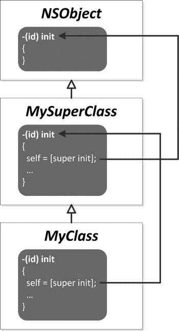
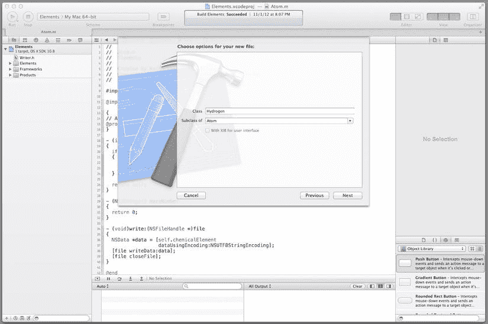
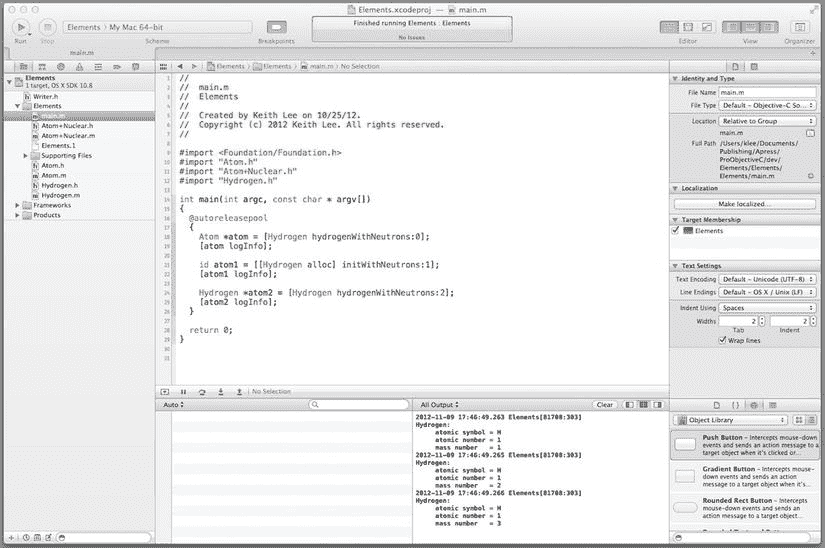
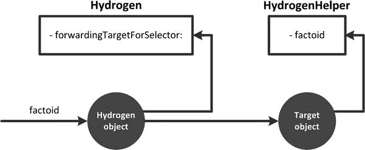
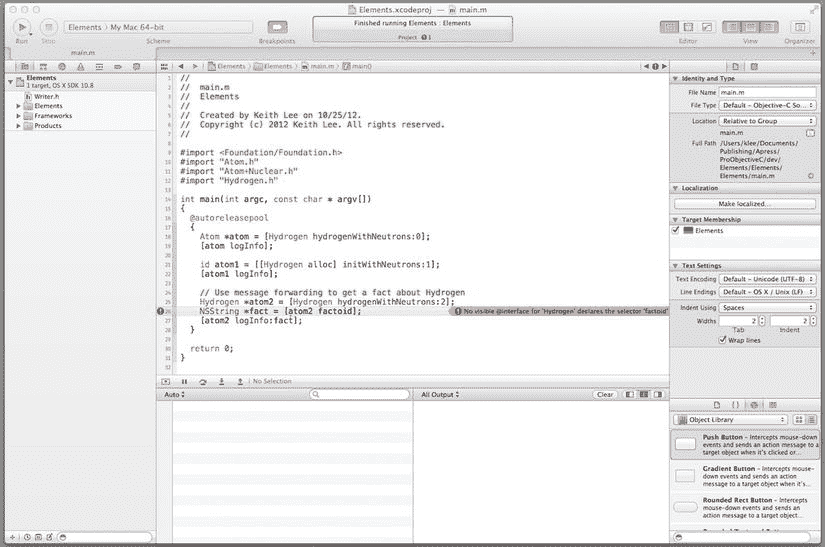
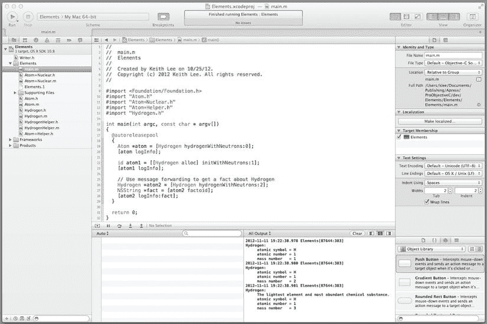

# 第 3 章：对象与消息传递

既然你已经对如何使用 Objective-C 创建类有了很好的理解，你可能会想：“我该如何使用这些类呢？”这正是本章的重点；具体来说，就是使用 Objective-C 进行对象创建、初始化以及在对象上调用方法。

正如你在第 2 章 中所学到的，Objective-C 类由其实例变量、属性和方法定义。此外，通过面向对象编程的继承，一个类还包含其父类的状态和行为（即方法和实例变量）。在运行时，面向对象程序通过创建对象，并使用消息传递——一种在对象和类上调用方法的面向对象编程机制——在这些对象上调用所需操作来执行其逻辑。

### 创建对象

类实例（即对象）是通过为其分配内存并适当初始化来创建的。同一类别的对象被称为同一类的成员。这意味着它们拥有相同的方法和匹配的实例变量集合。因此，当你创建同一类型的对象时，实际上是在为对象创建一组实例变量——以及一组指向为该类定义的方法的指针。

每个类都存在于自己的命名空间中。在类定义内部赋值的名称，不会与在其外部任何地方赋值的名称发生冲突。无论是对象数据结构中的实例变量，还是对象的方法，都是如此。因此，一条消息的含义必须相对于接收该消息的特定对象来理解。发送给两个不同对象的同一条消息，可能会调用两种不同的方法。这是面向对象编程的一个基本特性，并简化了类的接口，因为相同的名称（对应于所需操作）可以在不同的类中重用。

Foundation 框架提供了简化对象创建的功能。具体来说，`NSObject` 类包含了用于创建类实例的方法。`NSObject` 的 `alloc` 类方法返回指定类类型的新实例；其语法是：

```objectivec
+ (id) alloc
```

`id` 是一种 Objective-C 类型，用于持有对任何 Objective-C 对象的引用，无论其属于哪个类。`alloc` 方法可以这样调用：

```objectivec
id varName = [ClassName alloc];
```

这会创建一个 `ClassName` 类型的对象，并将其赋值给一个名为 `varName` 的 `id` 类型变量。你也可以按如下方式创建对象：

```objectivec
ClassName *varName = [ClassName alloc];
```

这同样会创建一个 `ClassName` 类型的对象并赋值给名为 `varName` 的变量；然而，在这种情况下，该变量的类型是 `ClassName *`（即指向 `ClassName` 类的指针）。显式定义变量的类型提供了静态类型检查，但牺牲了灵活性。我们将在本书探讨 Objective-C 运行时的第二部分中进一步讨论这一点。在这两种情况下，`alloc` 方法返回的对象都是接收类类型的实例，也称为*相关结果类型*。这意味着发送 `alloc` 消息所返回的对象将具有与接收类相同的类型。正如你在第 2 章 中开发的 `Atom` 类，你可以使用 `alloc` 方法创建一个 `Atom` 对象并将其赋值给名为 `atom` 的变量：

```objectivec
Atom *atom = [Atom alloc];
```

由于 `alloc` 消息的接收类是 `Atom`，因此创建的对象将是 `Atom` 类型。系统会为该对象分配内存，并将其实例变量设置为默认值（零）。

好的，作为高级文档工程师和翻译员，我已仔细阅读您提供的注意事项和示例。下面是根据您的要求，对给定英文文本进行的精确翻译和格式化。


好，没问题。作为高级文档工程师，我将遵循您的规则，对提供的文本进行排版。

OK，这很棒：**Objective-C**（以及 Foundation 框架）提供了创建对象所需的一切。但初始化呢？同样，**Objective-C** 也提供了机制来初始化新创建的对象。接下来你将了解这些内容。

## 对象初始化

`alloc` 方法为对象分配存储空间，并将其实例变量设置为零，但它不会将对象的实例变量初始化为适当的值，也不会准备对象所需的任何其他必要对象或资源。因此，你的类应该实现一个方法来完善初始化过程。`NSObject` 实现了一个 `init` 方法，它为对象初始化提供了基础，你的类至少应该重写此方法，以提供它们所需的任何自定义初始化行为。`NSObject init` 方法的语法是：

```
- (id) init
```

注意，`init` 是一个实例方法，并且与 `alloc` 方法一样，它返回类型为 `id` 的对象，这些对象是相关结果类型。还记得你在第 2 章中为 `Atom` 类编写的 `init` 方法吗？它显示在**清单 3-1** 中。

*Listing 3-1.* Atom 类的 init 方法

```
- (id) init
{
  if ((self = [super init]))
  {
    // Initialization code here.
    _chemicalElement = @"None";
  }

return self;
}
```

让我们详细分析这段代码，以便更好地理解 `init` 方法的职责。这一行代码将多个操作合并到一行中：

```
if ((self = [super init]))
```

方括号内的表达式 `[super init]` 使用其父类的 `init` 方法执行调用对象的初始化。由于这是 `init` 方法中的第一条语句，它保证了对象沿着其继承链一直到层次结构的根对象的一系列初始化（参见**图 3-1**）。



**图 3-1**. 通过 init 方法进行的对象初始化

`init` 方法调用返回的结果被赋值给特殊的 Objective-C 参数 `self`。每个方法都有一个隐式的 `self` 参数（它不在方法声明中），它是指向接收消息的对象的指针。因此，赋值语句

```
self = [super init]
```

调用父类的 `init` 方法，并将结果赋值给调用对象，从而保证（参见**图 3-1**）完成整个类层次结构中所需的所有初始化。

回头看**清单 3-1**，你会发现这个赋值的结果被一个条件 `if` 语句（在圆括号内）包围（附录 A 提供了 Objective-C 条件语句的完整概述）。这产生了执行条件逻辑的效果。实际上，如果父类初始化成功（即表达式 `[super init]` 返回一个有效对象），则执行该对象的自定义初始化；否则，`init` 方法返回 `nil`。

按照惯例，初始化方法的名称总是以 `init` 开头。没有输入参数的初始化方法就直接命名为 `init`。如果初始化方法需要一个或多个输入参数，则名称会相应延长以包含这些输入参数。一个带有一个输入参数的初始化方法声明的示例如下：

```
-(id)initWithNeutrons:(NSUInteger) neutrons
```

由于对象分配与初始化是耦合的，这两个方法通常在一行代码中一起执行；例如：

```
Atom *atom = [[Atom alloc] init];
```

## 扩展 Elements 项目

现在，你将通过扩展 Elements 项目来实践你所学的关于对象分配和初始化的知识。在第 2 章中，你创建了一个 `Atom` 类。让我们继承这个类来创建不同类型的原子化学元素！

启动 Xcode 并通过从 Xcode 的“文件”菜单中选择“打开...”来重新打开 Elements 项目。在 Xcode 工作区窗口的导航区域中，选择 **Elements** 项目，然后通过从 Xcode 的“文件”菜单中选择“新建”“文件...”来创建一个新文件。像创建 `Atom` 类时那样，创建一个带有实现文件和头文件的 Objective-C 类。接下来，在为你选择的类选项的窗口中，输入 **Hydrogen** 作为类名，从子类下拉列表中选择 **Atom**，然后点击 **Next**（参见**图 3-2**）。



**图 3-2**. 指定 Hydrogen 类选项

在下一个提示窗口中，将位置保留为 Elements 文件夹，项目目标保留为 Elements 项目，然后点击 **Create** 按钮来创建 `Hydrogen` 类。

在 Xcode 导航窗格中，你会看到两个新文件（`Hydrogen.h` 和 `Hydrogen.m`）已被创建。稍后，你将为此类创建一个 `init` 方法，还将创建一个工厂方法，该方法将同时分配和初始化新的 `Hydrogen` 对象；但在那之前，你需要重构 `Atom` 类。

## 重构 Atom 类

*重构*是指在不改变现有代码外部行为的情况下重组代码。在开发软件时，你会经常这样做，以改进其设计、促进新功能的添加等等。在此例中，你将重构 `Atom` 类，以便其子类可以在对象初始化期间访问和更新其实例变量。

如第 2 章的**清单 2-3** 所示，`Atom` 类接口声明了一个名为 `chemicalElement` 的属性，该属性使用自动合成定义。当编译器自动合成属性时，它会创建一个作用域声明为*私有*的后备实例变量。私有实例变量不能被其子类直接访问，因此你需要重构该类以允许从其子类访问实例变量。你将在实例变量声明块中以 `protected` 作用域声明该变量。为了将使用自动合成生成的属性方法连接到实例变量，你需要根据标准的属性备用实例变量命名约定来命名它（例如，变量名将与属性名相同，前面加下划线）。

那么，让我们相应地更新 `Atom` 接口。你还要添加另一个只读属性（以及相应的实例变量）。在项目导航窗格中，选择 **Atom.h** 文件，然后在编辑器窗格中，按照**清单 3-2** 所示更新 `Atom` 接口（代码更新以**粗体**显示）。

*Listing 3-2.* 重构后的 Atom 接口（带有受保护变量）

```
@interface Atom : NSObject

// Property-backed instance variables, only accessible in the class hierarchy
{
  @protected NSUInteger _protons;
  @protected NSUInteger _neutrons;
  @protected NSUInteger _electrons;
  @protected NSString *_chemicalElement;
  @protected NSString *_atomicSymbol;
}

@property (readonly) NSUInteger protons;
@property (readonly) NSUInteger neutrons;
@property (readonly) NSUInteger electrons;
@property (readonly) NSString *chemicalElement;
@property (readonly) NSString *atomicSymbol;

- (NSUInteger) massNumber;

@end
```


在清单 3-2 中，你现在声明了具有`protected`作用域的属性支持的实例变量，从而使子类能够直接访问（和更新）它们。你还添加了一个新属性，用于检索`Atom`对象的原子符号。

接下来，让我们更新`Atom`实现以反映这些更改。选择**Atom.m**文件，然后更新`massNumber`实例方法的`Atom`实现，如清单 3-3 所示。

***清单 3-3*** Atom 实现 `massNumber` 方法

```
- (NSUInteger) massNumber
{
  return self.protons + self.neutrons;
}
```

如你所见，原子的质量数计算为其拥有的质子数与中子数之和。好的，这就是你现在要对`Atom`类进行的所有重构。接下来让我们更新`Hydrogen`类。

### 创建 Hydrogen 初始化方法

现在你将针对`Hydrogen`类创建一个新的`init`方法。它将使用输入的中子数初始化一个`Hydrogen`对象，并适当地设置化学元素名称和原子符号。选择**Hydrogen.h**文件。在编辑器窗格中，更新接口，如清单 3-4 所示。

***清单 3-4*** Hydrogen 接口

```
#import "Atom.h"

@interface Hydrogen : Atom

- (id) initWithNeutrons:(NSUInteger)neutrons;

@end
```

这个接口声明了一个`Hydrogen`的`init`方法，其中带有一个指定原子中子数的输入参数。接下来，选择实现文件（**Hydrogen.m**）并更新实现，如清单 3-5 所示。

***清单 3-5*** Hydrogen 实现

```
#import "Hydrogen.h"

@implementation Hydrogen

- (id) initWithNeutrons:(NSUInteger)neutrons
{
  if ((self = [super init]))
  {
    _chemicalElement = @"Hydrogen";
    _atomicSymbol = @"H";
    _protons = 1;
    _neutrons = neutrons;
  }

return self;
}

@end
```

`initWithNeutrons:`方法首先调用父类`Atom`的`init`方法，然后适当地设置其初始值。对于`Hydrogen`对象，这意味着设置化学元素名称（Hydrogen）、其原子符号（H）、质子数（根据定义，氢有一个质子）以及作为输入参数提供的中子数。

### 创建 Hydrogen 工厂方法

类*工厂*方法是用于执行类创建和初始化的便捷方法。它们是类方法，通常遵循以下约定命名：

```
+ (id) className...
```

其中`className`是类的名称，并以小写字母开头。现在，你将为`Hydrogen`类实现一个工厂创建方法。在`Hydrogen`接口文件中，添加清单 3-6 所示的方法。

***清单 3-6*** 带有工厂创建方法的 Hydrogen 接口

```
#import "Atom.h"

@interface Hydrogen : Atom

- (id) initWithNeutrons:(NSUInteger)neutrons;
+ (id) hydrogenWithNeutrons:(NSUInteger)neutrons;

@end
```

一个名为`hydrogenWithNeutrons:`的类实例方法被添加到接口中。注意，工厂创建方法的名字与`init`方法类似，但它以类名作为前缀。此方法创建一个新的`Hydrogen`对象并使用输入参数进行初始化。打开`Hydrogen`实现文件并添加方法定义，如清单 3-7 所示。

***清单 3-7*** 带有工厂创建方法的 Hydrogen 实现

```
+ (id) hydrogenWithNeutrons:(NSUInteger)neutrons
{
  return [[[self class] alloc] initWithNeutrons:neutrons];
}
```

观察到该方法为`Hydrogen`对象分配内存，在这个新实例上调用`initWithNeutrons:`方法，然后返回新创建并初始化后的对象。还要注意使用了表达式`[self class]`来获取当前类实例。使用这个表达式（而不是直接指定类），如果该类被继承且工厂方法被子类调用，则返回的实例将具有与子类相同的类型。现在让我们测试这个新类。选择**main.m**文件并更新`main()`函数，如清单 3-8 所示。

***清单 3-8*** 测试 Hydrogen 类

```
int main(int argc, const char * argv[])
{
  @autoreleasepool
  {
    Atom *atom = [Hydrogen hydrogenWithNeutrons:0];
    [atom logInfo];

id atom1 = [[Hydrogen alloc] initWithNeutrons:1];
    [atom1 logInfo];

Hydrogen *atom2 = [Hydrogen hydrogenWithNeutrons:2];
    [atom2 logInfo];
  }

return 0;
}
```

`main()`函数同时使用了`Hydrogen`的`init`方法和类工厂方法来创建和初始化`Hydrogen`对象，然后在 Xcode 输出窗口中显示对象信息。现在保存所有项目文件，然后编译并运行程序（通过点击工具栏中的**Run**按钮或从 Xcode 的 Product 菜单中选择**Run**）。输出窗格应显示如图 3-3 所示的结果。



***图 3-3*** 测试 Hydrogen 类

太棒了！你创建了一个具有自定义初始化和工厂方法的`Hydrogen`类，并对其进行了测试以验证其按预期工作。既然你已经熟悉了使用 Objective-C 进行对象创建和初始化，接下来让我们专注于对象消息传递。

## 消息分发

消息传递是面向对象编程中的一个基本概念。它是用于在对象上调用方法的机制。消息的接收对象（即接收者）在运行时确定要调用其哪个实例方法。实例方法可以访问对象的实例变量及其实例方法。用于向对象发送消息（即在对象上调用方法）的 Objective-C 语法是：

```
[receiver messageNameParams]
```

其中`receiver`是消息发送到的对象。`messageNameParams`信息标识了方法的实际名称和参数值（如果有）；并且括号将消息括起来。`messageNameParams`的语法是：

```
keyword1:value1 keyword2:value2 ... keywordN:valueN
```

冒号分隔每个方法签名关键字及其关联的参数值。它声明需要一个参数。如果方法没有参数，则省略冒号（并且该方法只有一个关键字）。以下面的消息为例：

```
[orderObject addItem:burgerObject forPrice:3.50];
```

消息名称是`addItem:forPrice:`；消息的接收者是`orderObject`。消息参数值是`burgerObject`（对应关键字`addItem`）和`3.50`（对应关键字`atPrice`）。在正常情况下，只有当一个接收对象具有与消息名称相对应的方法时，才能成功地向该对象调用特定的消息。此外，Objective-C 支持类型多态性，不同的接收者可以对同一方法有不同的实现。接收者的类型是在运行时确定的；因此，不同的接收者可以对同一消息做出不同的事情。总之，消息的结果不能仅通过消息或方法名称来计算；它还取决于接收消息的对象。

正如你在第 2 章中学到的，Objective-C 为一种替代语法（点符号）提供了语言级别的支持，该语法简化了属性访问器方法的调用。用于检索属性值的点语法是：

```
objectName.propertyName
```


`objectName` 是实例变量名，`propertyName` 是属性名。设置属性值的点语法如下：

```
objectName.propertyName = Value
```

点语法只是一种替代语法，并非直接访问属性支持的实例变量的机制。编译器会将这些语句转换为相应的属性访问器方法。

Objective-C 还提供了对*类方法*的语言级支持。这些方法是在类级别定义的，并直接在类上调用。调用类方法的语法为：

```
[className messageNameParams]
```

类方法的工作方式与实例方法相同，区别在于它们是在类上调用的，而非对象。因此，类方法无法访问为该类定义的实例变量和方法。它们通常用于创建类的新实例（即作为工厂方法），或访问与类关联的共享信息。

通过将消息（请求的行为）与接收者（能够响应请求的方法的拥有者）分离，对象消息传递直接支持了面向对象编程的封装范式。

Objective-C 通过语言级特性增强了对对象消息传递的支持，使你能够在运行时确定要调用的方法，甚至更改方法的实现。你将在本书第二部分探索这些特性；但现在，让我们先学习如何处理对象收到无法处理的消息的情况。

## 消息转发

Objective-C 的对象消息传递根据对象接收到的消息，查找并执行该对象上的方法。对象类型可以在代码中指定并在编译时静态绑定（*静态类型*），也可以不指定类型而在运行时解析其类型（*动态类型*）。无论哪种情况，运行时接收消息的对象都会解释该消息以确定要调用哪个方法。这种方法调用的运行时解析使得程序可以轻松动态更改和/或扩展，但同时也带来一定风险：它允许程序向可能没有对应方法的对象发送消息。在默认情况下，如果发生这种情况，会抛出运行时异常。然而，Objective-C 提供了另一种选择：通过一种称为*消息转发*的机制，可以配置对象在收到未映射到其方法集的消息时执行用户定义的处理。消息转发使对象能够对其收到的任何无法识别的消息执行多种逻辑，比如将其分发给能够响应该消息的不同接收者，将所有无法识别的消息发送到同一目标，或者简单地静默“吞掉”该消息（即既不执行处理，也不引发运行时错误）。

## 转发选项

Objective-C 提供了两种消息转发选项供你使用。

- *快速转发*：继承自 `NSObject` 的类可以通过重写 `NSObject` 的 `forwardingTargetForSelector:` 方法来实现快速转发，将方法转发给另一个对象。这种技术使得你的对象和转发对象的实现看起来像是合并在一起。这模拟了类实现的多继承行为。如果你有一个目标类定义了你的对象可能消费的所有消息，这种方法会很有效。
- *正常（完整）转发*：继承自 `NSObject` 的类可以通过重写 `NSObject` 的 `forwardInvocation:` 方法来实现正常转发。这种技术使你的对象能够使用消息的完整内容（目标、方法名、参数）。

如果你有一个目标类定义了你的对象可能消费的所有消息，快速转发会很有效。如果你没有这样的目标类，或者希望在收到消息时执行其他处理（例如，仅记录并吞掉消息），则应使用完整转发。

## 为 Hydrogen 类添加快速转发

为了让你了解如何使用消息转发，我们将为刚刚实现的 `Hydrogen` 类添加这一能力。我们将扩展该类以提供快速转发，然后创建一个辅助目标类，通过实现相应的方法来处理转发的消息。

### 消息转发辅助类

首先，创建辅助类。在 Xcode 中，新建一个 Objective-C 类。将其命名为 `HydrogenHelper`，并将 Elements 项目设定为其目标。在 Xcode 导航窗格中，可以看到已创建了两个新文件（`HydrogenHelper.h` 和 `HydrogenHelper.m`）。选择 `HydrogenHelper.h` 文件，然后在编辑窗格中，按代码清单 3-9 所示更新其接口。

*代码清单 3-9.* HydrogenHelper 接口

```
#import <Foundation/Foundation.h>

@interface HydrogenHelper : NSObject

- (NSString *) factoid;

@end
```

该接口声明了一个实例方法 `factoid`，该方法返回一个指向 `NSString` 的指针（`NSString *`）。接下来，选择实现文件（`HydrogenHelper.m`），并按代码清单 3-10 所示定义 `factoid` 方法。

*代码清单 3-10.* HydrogenHelper 实现

```
#import "HydrogenHelper.h"

@implementation HydrogenHelper

- (NSString *) factoid
{
  return @"最轻的元素和含量最丰富的化学物质。";
}
```

如代码清单 3-10 所示，`HydrogenHelper` 的 `factoid` 方法返回关于氢元素的一个简单事实。现在，你将更新 `Hydrogen` 类以支持快速转发。在 Hydrogen 实现文件（`Hydrogen.m`）中，添加以下代码来重写 `forwardingTargetForSelector:` 方法的默认实现，如代码清单 3-11 所示（更新部分以粗体显示）。

*代码清单 3-11.* Hydrogen 类消息快速转发更新

```
@implementation Hydrogen
{
@private HydrogenHelper *helper;
}
...
- (id) initWithNeutrons:(NSUInteger)neutrons
{
  if ((self = [super init]))
  {
    // 初始化代码在此处添加。
    _chemicalElement = @"Hydrogen";
    _atomicSymbol = @"H";
    _protons = 1;
    _neutrons = neutrons;

// 创建用于消息转发的辅助对象
    helper = [[HydrogenHelper alloc] init];
  }

return self;
}

- (id) forwardingTargetForSelector:(SEL)aSelector
{
  if ([helper respondsToSelector:aSelector])
  {
    return helper;
  }
  return nil;
}
...
@end
```

首先，`Hydrogen` 类增加了一个 `HydrogenHelper*` 类型的实例变量。接着在 `init` 方法中，创建并初始化了 `HydrogenHelper` 对象。这就是将用于消息转发的目标对象。最后，实现了 `forwardingTargetForSelector:` 方法。该方法首先检查该消息是否是目标对象（`HydrogenHelper`）能够处理的消息。如果是，则返回该目标对象；否则返回 `nil`。回顾一下，`HydrogenHelper` 类只有一个实例方法 `factoid`。因此，如果某个 `Hydrogen` 对象收到一个名为 `factoid` 的实例方法的消息，它将被重定向，将这条消息发送给它的 `HydrogenHelper` 对象（参见图 3-4）。



图 3-4. 为 Hydrogen 类快速转发 factoid 方法


太好了！你已经为`Hydrogen`类实现了快速转发。现在让我们使用快速转发来测试这个类。选择**main.m**文件并更新`main()`函数，如代码清单 3-12 所示。

*代码清单 3-12.* 测试氢类的快速转发

```
int main(int argc, const char * argv[])
{
  @autoreleasepool
  {
    Atom *atom = [Hydrogen hydrogenWithNeutrons:0];
    [atom logInfo];

    id atom1 = [[Hydrogen alloc] initWithNeutrons:1];
    [atom1 logInfo];

    // 使用消息转发获取关于氢的一个事实
    Hydrogen *atom2 = [Hydrogen hydrogenWithNeutrons:2];
    NSString *fact = [atom2 factoid];
    [atom2 logInfo:fact];
  }

  return 0;
}
```

在编辑器窗格的左侧，你可能会在`NSString *fact = [atom2 factoid]`这一行看到一个红色圆圈内的感叹号。如果你点击这个感叹号，将会看到一个错误信息（见图 3-5）。



图 3-5 氢类对象消息传递错误

这个错误“No visible @interface for 'Hydrogen' declares the selector 'factoid'”的发生是因为`Hydrogen`类在其接口中没有声明`factoid`实例方法。编译器需要知道程序可能发送的每条消息的完整方法签名——即使是那些被转发的消息。解决方案是在类接口或类别中声明该未知方法。在 Xcode 中，创建一个新的 Objective-C 类别，输入`Helper`作为名称，并在类别下拉列表中选择`Atom`。将 Elements 项目设为目标，并将 Elements 文件夹设为文件保存位置。在 Xcode 项目导航器窗格中，有两个新文件被添加到了 Elements 文件夹中：`Atom+Helper.h`和`Atom+Helper.m`。这些分别是类别接口和实现文件。由于你不需要实现，请在导航器窗格中选择`Atom+Helper.m`文件，然后从 Xcode 的 Edit 菜单中选择`Delete`来删除它。接下来，在`Atom+Helper.h`头文件中，按代码清单 3-13 所示更新类别接口。

*代码清单 3-13.* 原子辅助类别接口

```
#import "Atom.h"

@interface Atom (Helper)

- (NSString *) factoid;

@end
```

在代码清单 3-13 中，`factoid`方法已被添加到类别接口中。由于`Hydrogen`类是`Atom`类的子类，编译器现在会看到`factoid`方法，从而解决了错误。`main.m`文件应该在其导入列表中包含`Atom`辅助类别接口（见代码清单 3-14）。

*代码清单 3-14.* `main()`函数的导入语句

```
#import <Foundation/Foundation.h>
#import "Atom.h"
#import "Atom+Nuclear.h"
#import "Atom+Helper.h"
#import "Hydrogen.h"

int main(int argc, const char * argv[])
{
  ...
}
```

如果你编译并运行该项目，输出应如图 3-6 所示。



图 3-6 带消息转发测试的氢类

## 总结

本章探讨了 Objective-C 对象创建、初始化和消息传递的概念及细节。以下是关键要点：

*   `NSObject`的`alloc`方法用于为对象分配内存，并将其实例变量初始化为零。该方法返回接收类类型（也称为“相关结果类型”）的实例对象。
*   `NSObject`提供了一个`init`方法，作为对象初始化的基础。你的类应该重写此方法以提供所需的任何自定义初始化行为。通常，实例分配和初始化通过一行代码完成：`[[ClassName alloc] init]`。
*   初始化方法的实现应确保对对象执行一系列初始化操作，沿着其继承链一直追溯到层次结构中的根对象。
*   Objective-C 消息传递支持 OOP 类型多态，即不同的接收者可以对同一方法有不同的实现。此外，接收者的类型是在运行时确定的。因此，不同的接收者可以对相同的消息做出不同的响应。
*   Objective-C 消息转发使对象在接收到未映射到其方法集的消息时能够执行用户定义的处理。消息转发可用于提供通常与 OOP 多重继承相关的许多功能。
*   Objective-C 提供了两种类型的消息转发：快速转发和普通（完整）转发。两者都是通过重写相应的`NSObject`实例方法以及实现任何必需的辅助类来完成的。

在最后两章中，你学习了使用 Objective-C 开发类的方方面面：类的设计和实现、对象的创建和初始化，以及对象的交互。事实上，为什么不花点时间回顾一下到目前为止你学到的内容呢？现在是复习示例程序并动手修改它们以更好地感受这门语言的好时机。很快（准确地说，是在下一章），你将探索 Objective-C 编程的另一个关键主题：内存管理。

