# 第 4 章：内存管理

到目前为止，你已经学习了如何开发类以及创建和初始化对象。现在是研究 Objective-C 内存管理细节的好时机。正确的内存管理是开发既正确又高效的程序的关键。在本章中，你将了解计算机内存是如何为 Objective-C 程序分配和释放的、Objective-C 内存模型，以及如何编写正确执行内存管理的程序。

程序的整体质量通常与其管理系统资源的能力直接相关。计算机操作系统会为程序执行分配有限的主内存量，如果程序尝试使用的内存超过操作系统分配的量，它将无法正常运行。因此，程序应只使用所需的内存，既不分配不使用的内存，也不尝试使用不再可用的内存。Objective-C 语言和运行时提供了支持应用程序内存管理的机制，以符合这些目标。

### 程序内存使用

为了更好地理解内存管理的作用，你需要了解程序是如何在计算机内存中存储和使用的。一个可执行的 Objective-C 程序由（可执行）代码、已初始化和未初始化的程序数据、链接信息、重定位信息、局部数据和动态数据组成。程序数据包括静态声明的变量和程序字面量（例如，在编译期间在代码中设置的常量值）。

可执行代码和程序数据，以及链接和重定位信息，是静态分配在内存中的，并在程序的整个生命周期中持续存在。


## Objective-C 内存管理

### 局部（自动）数据

局部（即自动）数据是指其作用域限定在声明它的语句块内的数据，并且在块执行完毕后不会被保留。从语法上讲，Objective-C 的*复合语句块*是用花括号分隔的一系列语句的集合（如代码清单 4-1 所示）。

*代码清单 4-1.* 示例语句块

```
{
  int myInt = 1;
  float myFloat = 5.0f;
  NSLog(@"浮点数 = %f, 整数 = %d", myFloat, myInt);
}
```

代码清单 4-1 中的示例包含两个局部变量 `myInt` 和 `myFloat`，它们存在于该语句块内，并在块执行完毕后不会被保留。自动数据位于程序的*栈*中，这是一块内存，其大小通常在程序/线程执行前设定。栈用于存储局部变量以及方法/函数调用的上下文数据。该上下文数据包括方法输入参数、返回值以及方法执行完毕后程序应继续执行的返回地址。操作系统会自动管理这块内存；它在声明变量的作用域内被分配在栈上，并在该作用域结束时自动释放。

### 堆内存与动态对象

在运行时，Objective-C 程序会创建存储在动态分配内存中的对象（通过 `NSObject alloc` 方法，如第 3 章所述），这部分内存被称为程序*堆*。动态对象创建意味着需要进行内存管理，因为在堆上创建的对象永远不会超出作用域。

图 4-1 展示了一张描述程序执行期间内存分配与使用情况的示意图。

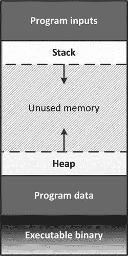

图 4-1. Objective-C 程序内存使用情况

为程序代码分配的内存在编译时设定，因此会被计入系统使用的总内存量中。分配在程序栈上的内存（通常）具有在程序启动时确定的最大大小，并由操作系统自动管理。另一方面，Objective-C 对象在程序执行期间动态创建，并且不会由操作系统自动回收。因此，Objective-C 程序需要进行内存管理，以确保系统内存的正确使用。内存管理不当或缺失的典型后果包括以下方面：

- **内存泄漏**：当程序未释放不再使用的对象时导致。如果程序分配了内存却不使用，就会浪费内存资源；如果程序持续分配内存而不释放，最终将会耗尽内存。
- **野指针**：当程序释放了仍在使用的对象时导致。这种情况会产生野指针；如果程序后续尝试访问这些对象，将会导致程序错误。

### Objective-C 内存模型

Objective-C 的内存管理通过引用计数实现，这是一种利用对象的唯一引用计数来确定对象是否仍在使用的技术。如果对象的引用计数降为零，则认为它不再被使用，运行时系统将释放其内存。

苹果的 Objective-C 开发环境（适用于 OS X 和 iOS 平台）提供了两种可用于内存管理的机制：手动保留释放（MRR）和自动引用计数（ARC）。在接下来的几段内容中，你将了解它们的工作原理，并编写几个程序来熟悉其用法。

### 实现手动保留释放

*手动保留释放（MRR）*是一种基于对象所有权概念的内存管理机制：只要一个对象存在一个或多个所有者，它就不会被 Objective-C 运行时释放。你需要编写代码来显式管理对象的生命周期，对你创建或需要使用的对象声明所有权，并在不再需要这些对象时释放所有权。要了解如何应用这一点，首先需要理解对象的访问与使用方式，以及对象访问与所有权的区别。

#### 对象引用与对象所有权

Objective-C 对象通过指向对象内存地址的变量进行*间接*访问。这种变量也称为*指针*，通过在变量名前加星号来声明。以下语句

```
Hydrogen *atom;
```

声明了一个名为 `atom` 的指针变量，它指向一个类型为 `Hydrogen` 的对象。请注意，指针和间接访问可用于任何 Objective-C 数据类型，包括基本类型和 C 数据类型；但对象指针专门用于与 Objective-C 对象交互。

*对象指针*允许访问 Objective-C 对象，但本身并不管理所有权。请看以下代码：

```
Hydrogen *atom = [Hydrogen init];
...
Hydrogen *href = atom;
```

指针 `href` 被声明并赋值给名为 `atom` 的 `Hydrogen` 对象，但 `href`（通过赋值的方式）并未对该对象主张所有权。因此，如果 `atom` 被释放，`href` 将不再指向一个有效的对象。因此，要使用 MRR 管理对象的生命周期（即对象的存续），你的代码必须遵守一组内存管理规则。接下来你将看到这些规则。

#### 基本内存管理规则

要正确使用 MRR，你的代码需要在对象的所有权声明与所有权释放声明之间保持平衡。为了满足这一要求，你应该编写代码遵守以下 MRR 基本内存管理规则：

- **对你创建的任何对象主张所有权。** 你通过名称以 `alloc`、`new`、`copy` 或 `mutableCopy` 开头的方法创建 Objective-C 对象。你也可以通过向块发送 `copy` 消息来动态创建 Objective-C 块对象。
- **使用 `retain` 方法对你尚未拥有的对象主张所有权。** `NSObject` 实现了一个 `retain` 方法，用于对对象主张所有权。在正常情况下，可以保证一个对象在其被接收的方法（作为参数）内以及作为返回值时都是有效的。`retain` 方法用于对你想要长期使用的对象主张所有权，通常是为了将其存储为属性值，或防止它因其他操作的副作用而被释放。
- **当你不再需要拥有的对象时，必须释放其所有权。** `NSObject` 实现了 `release` 和 `autorelease` 方法，用于释放对对象的所有权。`autorelease` 方法会在当前自动释放块结束时释放对象的所有权。`release` 方法会立即释放对对象的所有权。如果对象的引用计数为零，这两种方法都会对对象发送 `dealloc` 消息。
- **你绝不能释放你不拥有的对象的所有权。** 这可能导致这些对象被过早释放。如果程序尝试访问一个已被释放的对象，将导致错误。

代码清单 4-2 展示了一个说明 MRR 基本内存管理规则应用的示例。

*代码清单 4-2.* MRR 使用示例

```
Hydrogen *atom = [Hydrogen init];
...
Hydrogen *href = [atom retain];
...
[atom release];
...
[href release];
```


一个`Hydrogen`对象被创建并赋值给一个名为`atom`的变量。由于该对象是通过`alloc`消息创建的，`atom`拥有对该对象的所有权。在后续代码中，一个名为`href`的变量也获得了对该对象的所有权，从而增加了对象的保留计数（即所有权数量）。随后，向`atom`变量发送了`release`消息。由于`href`仍然持有该对象的所有权，因此对象不会被释放。当`href`向对象发送`release`消息后，其保留计数降为零，运行时便会将其释放。

### 释放内存

当对象的保留计数降为零时，运行时通过`NSObject dealloc`方法释放其占用的内存。该方法也为您的子类提供了一个框架，用于放弃其拥有的任何对象的所有权。您的每个类（通常继承自`NSObject`）都应重写`dealloc`方法，调用其拥有所有权的每个对象的`release`方法，然后再调用其父类的`dealloc`方法。这种方法使得每个类都能在其整个类层次结构中适当地放弃对其拥有所有权的任何对象，如图 4-2 所示。

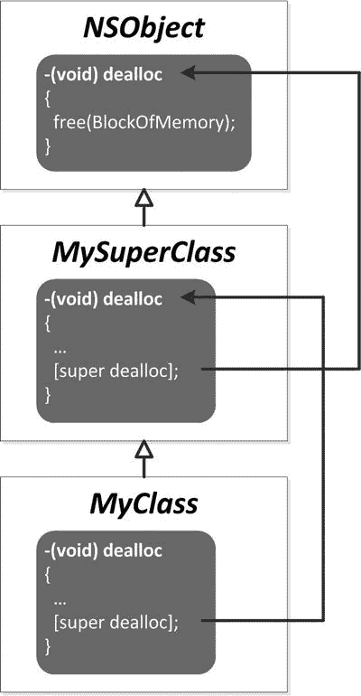

图 4-2 dealloc 方法实现

### 通过自动释放实现延迟释放

`NSObject`提供了一个`autorelease`方法，用于在自动释放池块结束时对对象调用`release`方法。*自动释放池块*提供了一种机制，允许您在未来的某个时间点放弃对象的所有权，从而避免显式调用对象的`release`方法，并防止其立即被释放。自动释放池块使用`@autorelease`指令定义，如列表 4-3 所示。

*列表 4-3* 自动释放池块语法

```
@autorelease
{
  // 创建自动释放对象的代码
  ...
}
```

自动释放的对象应始终在自动释放池块内编码，否则它们将不会收到`release`消息，从而导致内存泄漏。用于创建 iOS 和 Mac OS X 应用的 Apple UI 框架（特别是 AppKit 和 UIKit）会自动提供自动释放池块；因此，通常仅在以下情况才需要手动编码自动释放池块：

*   您编写的程序不基于 UI 框架，例如命令行工具。
*   您的实现逻辑包含一个创建许多临时对象的循环。为了降低应用程序的最大内存占用，您可以在循环内使用自动释放池块，在下一次迭代之前释放这些对象。
*   您的应用程序生成了一个或多个辅助线程。在线程开始执行时，您必须立即创建自己的自动释放池块；否则，您的应用程序将发生内存泄漏。

在列表 4-4 所示的示例中，自动释放池块包围了`main()`函数内的所有代码，并且通过`autorelease`消息动态分配了一个对象。

*列表 4-4* 带自动释放池块的命令行程序

```
int main(int argc, const char * argv[])
{
  @autorelease
  {
    Hydrogen *atom = [[[Hydrogen alloc] init] autorelease];
    ...
  }
  return 0;
}
```

请注意，`autorelease`消息通常在一个组合语句中，于对象创建并初始化后立即发送。这种设计确保使用`autorelease`创建的任何对象都将在自动释放池块结束时、程序结束前被释放。

### 使用 MRR

现在您已经学习了 Objective-C 内存管理和 MRR，可以开始通过开发一个示例程序来应用所学知识了！这个示例将演示 MRR 基本内存管理规则的应用以及相应 API 的使用。简要来说，该程序包含三个类：用于记录产品订单的`OrderEntry`类，以及依赖类`OrderItem`和`Address`。`OrderItem`类封装了订单条目的特定状态和行为，而`Address`类则包含与订单发货地址相关的状态和行为。每个`OrderEntry`对象都对应一个`OrderItem`对象和一个`Address`对象（如图 4-3 所示）。

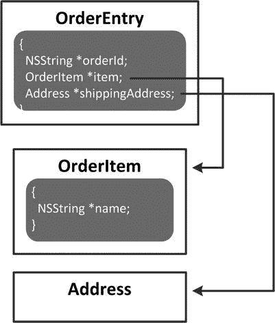

图 4-3 订单条目类

您将使用 MRR 内存管理来开发这些类，然后进行测试以证明该内存管理技术的正确使用。在 Xcode 中，通过从 Xcode 文件菜单中选择**新建项目...**来创建一个新项目。在新建项目助手面板中，创建一个命令行应用程序（从 Mac OS X 应用程序选择中选择**命令行工具**），然后点击**下一步**。在项目选项窗口中，指定产品名称为`MRR Orders`，将类型设置为`Foundation`，通过取消选中**使用自动引用计数**复选框（如图 4-4 所示）来选择 MRR 内存管理，然后点击**下一步**。

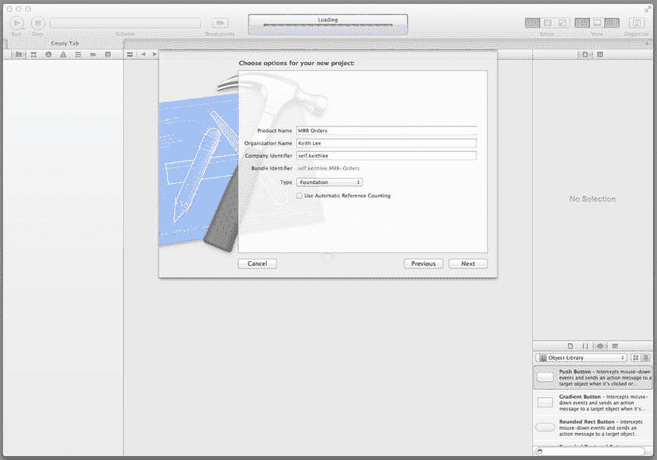

图 4-4 创建一个 MRR 订单条目项目

在文件系统中指定您希望创建项目的位置（如有需要，选择**新建文件夹**并输入文件夹的名称和位置），取消选中**源代码控制**复选框，然后点击**创建**按钮。

现在让我们添加`OrderEntry`、`OrderItem`和`Address`类。按照之前章节的做法，通过选择**新建文件...**从 Xcode 文件菜单中，选择 Objective-C 类模板，适当地命名该类（每个类都是`NSObject`的子类），然后选择`MRR Orders`文件夹作为文件位置，并将`MRR Orders`项目作为目标，将每个类添加到项目中。

您项目现在包含三个类的文件以及`main.m`文件。接下来，让我们实现`Address`类。您不会向该类添加任何实例变量、属性或方法，因此无需编辑`Address`接口。但是，您需要通过重写其父类（`NSObject`）提供的默认`init`和`dealloc`方法来编辑`Address`的实现。在导航器面板中选择**Address.m**文件，然后添加列表 4-5 中所示的代码。

*列表 4-5* MRR Address 类实现

```
#import "Address.h"

@implementation Address
- (id) init
{
  if ((self = [super init]))
  {
    NSLog(@"Initializing Address object");
  }
  return self;
}

- (void)dealloc
{
  NSLog(@"Deallocating Address object");
  [super dealloc];
}
@end
```

如列表 4-5 所示，`init`和`dealloc`方法都会在控制台记录一条消息以显示方法的进入。当您测试程序时，这使您能够看到运行时何时调用这些方法。此外，`dealloc`方法调用其父类的`dealloc`，从而确保对象的内存被回收。好了，`Address`类已经完成；现在让我们实现`OrderItem`类。

在导航器面板中选择**OrderItem.h**文件，然后添加列表 4-6 中所示的代码。

*列表 4-6* MRR OrderItem 类接口

```
#import <Foundation/Foundation.h>
```

```objectivec
@interface OrderItem : NSObject
{
@public NSString *name;
}

- (id) initWithName:(NSString *)itemName;
@end
```

`OrderItem`类添加了一个名为`name`的公共实例变量，类型为`NSString *`，以及一个自定义初始化方法`initWithName:`，该方法也接受一个`NSString *`类型的输入参数。接下来，选择`OrderItem.m`文件并实现`OrderItem`类，如代码清单 4-7 所示。

*代码清单 4-7*  MRR OrderItem 类实现

```objectivec
#import "OrderItem.h"

@implementation OrderItem
- (id) initWithName:(NSString *)itemName
{
  if ((self = [super init]))
  {
    NSLog(@"Initializing OrderItem object");
    name = itemName;
    [name retain];
  }
  return self;
}

- (void)dealloc
{
  NSLog(@"Deallocating OrderItem object");
  [name release];
  [super dealloc];
}
@end
```

自定义初始化方法将实例变量赋值给输入参数。由于`OrderItem`对象并未创建输入参数，因此它对此参数没有所有权。但是，为了确保该对象不会因其他操作的副作用而被释放，并且在整个对象生命周期内保持有效，你需要向`name`变量发送`retain`消息，从而获得该对象的所有权。在`dealloc`方法中，你向`name`对象发送`release`消息，然后在其父类上调用`dealloc`以释放`OrderItem`对象的内存。

现在，让我们实现`OrderEntry`类。选择`OrderEntry.h`文件并编写接口（如代码清单 4-8 所示）。

*代码清单 4-8*  MRR OrderEntry 类接口

```objectivec
#import <Foundation/Foundation.h>
#import "OrderItem.h"
#import "Address.h"

@interface OrderEntry : NSObject
{
@public OrderItem *item;
NSString *orderId;
Address *shippingAddress;
}

- (id) initWithId:(NSString *)oid;
@end
```

代码清单 4-8 显示，`OrderEntry`对象有三个实例变量和一个自定义初始化方法`initWithId:`。接下来，选择`OrderEntry.m`文件并实现`OrderEntry`类，如代码清单 4-9 所示。

*代码清单 4-9*  MRR OrderEntry 类实现

```objectivec
#import "OrderEntry.h"

@implementation OrderEntry
- (id) initWithId:(NSString *)oid
{
  if ((self = [super init]))
  {
    NSLog(@"Initializing OrderEntry object");
    orderId = oid;
    [orderId retain];
    item = [[OrderItem alloc] initWithName:@"Doodle"];
    shippingAddress = [[Address alloc] init];
  }

return self;
}

- (void)dealloc
{
  NSLog(@"Deallocating OrderEntry object");
  [item release];
  [orderId release];
  [shippingAddress release];
  [super dealloc];
}
@end
```

自定义初始化方法将输入参数赋值给`orderId`实例变量，然后创建并初始化`OrderItem`和`Address`对象。由于`OrderEntry`对象拥有`OrderItem`和`Address`对象以及`orderId`实例的所有权，因此它负责在自身被释放之前释放它们。这在`dealloc`方法中完成，该方法随后在其父类上调用`dealloc`以释放`OrderEntry`对象的内存。

现在你已经实现了订单相关的类，接下来通过测试来验证实现并确认你正确使用了 MRR。在导航窗格中选择`main.m`文件，然后按照代码清单 4-10 所示更新`main()`函数。

*代码清单 4-10*  MRR main() 函数实现

```objectivec
#import <Foundation/Foundation.h>
#import "OrderEntry.h"

int main(int argc, const char * argv[])
{
  @autoreleasepool
  {
    // 创建一个 OrderEntry 对象用于手动释放
    NSString *orderId = [[NSString alloc] initWithString:@"A1"];
    OrderEntry *entry = [[OrderEntry alloc] initWithId:orderId];

// 释放 orderId（已被 OrderEntry 保留，因此对象不会被释放！）
    [orderId release];
    NSLog(@"New order, ID = %@, item: %@", entry->orderId, entry->item->name);

// 必须手动释放 OrderEntry！
    [entry release];

// 创建一个自动释放的 OrderEntry 对象，在自动释放池块结束时释放
    OrderEntry *autoEntry = [[[OrderEntry alloc] initWithId:@"A2"] autorelease];
    NSLog(@"New order, ID = %@, item: %@", autoEntry->orderId, autoEntry->item->name);
  }
  return 0;
}
```

`main()`函数通过创建`OrderEntry`对象并根据内存管理规则释放它们以及它所拥有的对象，演示了 MRR 内存管理。第一个`OrderEntry`对象是手动释放的，而第二个对象是通过`autorelease`创建的，因此它会在其所在的自动释放池块结束时被释放。

现在，保存、编译并运行 MRR Orders 程序，观察输出窗格中的消息（如图 4-5 所示）。

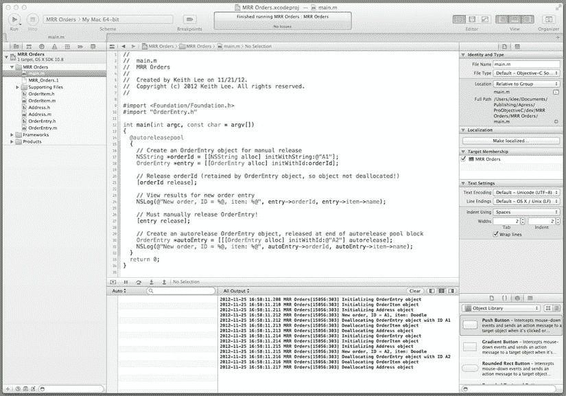

图 4-5  测试 MRR OrderEntry 项目

消息显示了初始化与释放动态创建对象的调用顺序。看起来所有的对象创建/保留和释放消息都正确平衡，你运行的测试也显示了正确的输出，所以一切就绪了，对吗？嗯，不一定。毕竟，你怎么能确定程序没有内存泄漏呢——它可以显示正确的输出但仍然存在未检测到的问题。那么，如何验证程序没有泄漏内存或存在其他未检测到的问题？Xcode 提供了一套可用于分析程序并检测潜在问题的工具。在附录 B 中，你将学习如何使用 Xcode Instruments 工具来做到这一点，但在这里你将使用 Xcode 的“构建并分析”工具对应用程序进行初步检查。

从 Xcode 的“Product”菜单中选择“Analyze”。该工具会对程序进行分析，在检测到任何潜在的内存泄漏或野指针等问题时会予以识别。现在观察工具栏中间的“Activity View”，它应该显示“Analyze Succeeded”，这意味着没有检测到内存管理错误。在`main()`函数中，注释掉`[orderId release]`语句，然后再次运行“构建并分析”工具。它应该会显示图 4-6 所示的消息。

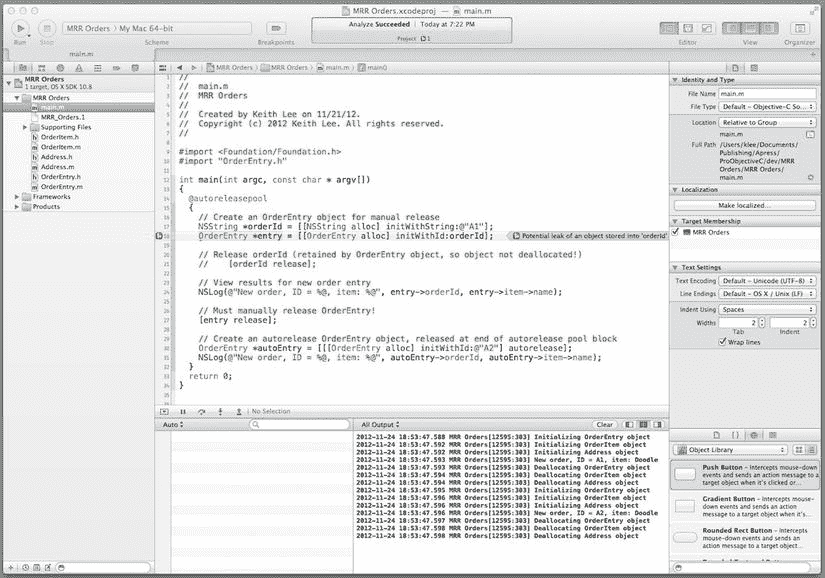

图 4-6  分析 OrderEntry 项目的 MRR

如图 4-6 所示，当动态分配的对象（本例中为`orderId`）的保留/释放消息不匹配时，会检测到潜在的内存泄漏。这表明“构建并分析”工具非常适合对程序内存管理进行初步检查。现在，继续从你的程序中移除注释标记——你已经证明它使用 MRR 正确地管理了内存。干得好！

### 使用自动引用计数
```


## 使用 ARC 进行内存管理

采用 MRR 内存管理方式时，你需要直接负责管理程序对象的生命周期。这样可以实现精细的内存使用控制，但代价是给程序员带来了沉重的负担。即使是你刚刚实现的简单示例，也需要非常谨慎（并使用合适的工具进行测试）来确保适时且正确地平衡 `retain` 和 `release` 操作。通常，手动引用计数是一项容易出错的任务，如果处理不当，可能导致程序内存泄漏和/或崩溃。实际上，这类基础设施最好交给工具处理，从而让程序员能够专注于程序旨在实现的实际业务逻辑。于是，自动引用计数（ARC）应运而生，它是一种自动执行此任务的内存管理增强技术，从而免除了程序员的这一责任。ARC 采用与 MRR 相同的引用计数模型，但利用编译器来管理对象生命周期。具体来说，在程序编译时，编译器会分析源代码，确定动态创建的对象的生命周期需求，然后在编译后的代码中自动在必要时插入 `retain` 和 `release` 消息。ARC 还提供了其他好处：应用程序性能（可能）得到提升，并且消除了与内存管理相关的错误（例如，释放仍在使用的对象，保留不再使用的对象）。此外，与垃圾回收技术不同，ARC 是确定性的（语句在编译时插入），并且不会因垃圾回收而引入程序执行暂停。

ARC 为 Objective-C 对象和 block 对象提供自动内存管理。它是新 Objective-C 项目中推荐的内存管理方法。如果某些情况下需要手动引用计数，ARC 可以在整个项目中使用，也可以在逐个文件的基础上使用。请注意，ARC 不会自动处理对象存在循环引用的引用循环。Objective-C 提供了语言特性，用于在必要时声明对象的弱引用，以手动打破这些循环。你将在本章稍后部分了解这些内容。

### 使用 ARC 的规则和约定

如前所述，与 MRR 方法相比，ARC 极大地简化了内存管理。因此，在 ARC 下针对对象内存管理存在不同的规则集。这些规则如下：

- 你不能发送`retain`、`retainCount`、`release`、`autorelease`或`dealloc`消息。ARC 禁止对对象生命周期进行程序化控制，并在编译期间自动在需要时插入这些消息。这包括`@selector(retain)`、`@selector(release)`及相关方法。如果你需要管理实例变量以外的资源，可以实现`dealloc`方法。ARC 会在你的类中（如果未提供）自动创建一个`dealloc`方法来释放其拥有的对象，并在你的`dealloc`方法实现中调用`[super dealloc]`。
- 你不能在`id`和`(void *)`类型之间直接转换。ARC 只管理 Objective-C 对象和 block，因此编译器需要知道它正在处理的对象的类型。因为*指向 void 的指针*（`void *`）是一种泛型指针类型，可以转换为任何其他指针类型（甚至那些不是 Objective-C 指针类型的类型），所以这一限制是必要的。这种情况在 Foundation 框架对象和 Core Foundation 类型（Core Foundation 是一个提供 C 语言 API 的 Apple 软件库）之间进行转换时很常见。提供了一组 API 用于在 ARC 和非 ARC 环境之间进行变量的所有权转移。
- 应使用自动释放池块来执行 ARC 管理的对象的自动释放。
- 你不能调用 Foundation 框架函数`NSAllocateObject`和`NSDeallocateObject`。这些函数提供了在特定内存区域中为对象分配和释放内存的能力。由于基于区域的内存不再被支持，因此不能使用这些函数。
- 你不能在 C 结构体（`struct`）中使用对象指针。ARC 不为动态分配的 C 结构体执行内存管理，因此编译器无法确定在哪里插入必要的`retain`和`release`消息。
- 你不能使用内存区域（`NSZone`）。如前所述，基于区域的内存不再被支持。
- 为了与非 ARC 代码正确协作，你不能创建以“copy”开头的方法或声明属性（除非你明确选择不同的 getter）。
- 默认情况下，ARC 不是异常安全的：它不会结束因异常而异常终止其作用域的`__strong`变量的生命周期，也不会执行在完整表达式抛出异常时本应在该表达式末尾发生的对象释放。可以使用编译器选项`-fobjc-arc-exceptions`来为 ARC 代码启用异常处理。当异常终止弱引用的作用域时，ARC 会结束这些弱引用的生命周期，除非在编译器中禁用了异常。

### ARC 生命周期限定符

有一组特定于 ARC 的限定符，用于声明常规变量和属性的对象生命周期。以下是用于常规变量的限定符：

- `__strong`：使用`alloc`/`init`创建的任何对象在其当前作用域的生命周期内被保留。这是常规变量的默认设置。“当前作用域”通常指声明该变量的花括号内（例如方法、`for`循环、`if`块等）。
- `__weak`：对象可以随时被销毁。这仅在对象在其他地方被强引用时才有用。当对象被销毁时，带有`__weak`的变量会被设置为`nil`。
- `__unsafe_unretained`：这很像`__weak`，但在对象被释放时，指针不会被设置为`nil`。相反，指针会变成悬空指针（即，它不再指向任何有用的东西）。
- `__autoreleasing`：不要与在从方法返回对象前对其调用`autorelease`相混淆，这用于通过引用传递对象。

使用 ARC 生命周期限定符为 Objective-C 对象声明变量时，正确的语法是：

```
ClassName *qualifier varName;
```


`ClassName`是类的名称/类型（如`OrderEntry`等），`qualifier`是 ARC 生命周期限定符（如前所述），`varName`是变量名称。如果未指定限定符，则默认为`__strong`。属性的 ARC 特定生命周期限定符如下：

- `strong`：`strong`属性等同于`retain`属性（属性完整列表见附录 A）。
- `weak`：`weak`属性类似于`assign`属性，区别在于如果受影响属性实例被释放，其实例变量将被设置为`nil`。

在 ARC 下，`strong`是对象类型属性的默认所有权属性。

### 使用 ARC

现在，你将开发一个使用 ARC 的示例程序。你将采用之前使用 MRR 内存管理的程序（`OrderEntry`），创建一个使用 ARC 内存管理的新版本。这将让你获得一些使用 ARC 编程的实践经验，并了解它如何简化应用程序的内存管理。你可能还记得，之前开发的`OrderEntry`程序包含三个类：一个用于记录产品订单的`OrderEntry`类，以及依赖类`OrderItem`和`Address`。

在 Xcode 中，通过从 Xcode 的“文件”菜单中选择**新建  项目...**来创建一个新项目。在新建项目助手窗格中，创建一个命令行应用程序（从 Mac OS X 应用程序选项中选择**命令行工具**），然后点击**下一步**。在项目选项窗口中，将产品名称指定为**ARC Orders**，并通过勾选**使用自动引用计数**复选框选择 ARC 内存管理，然后点击**下一步**。

在文件系统中指定项目创建的位置（如有必要，选择**新建文件夹**并输入文件夹名称和位置），取消勾选**源代码控制**复选框，然后点击**创建**按钮。

现在让我们添加`OrderEntry`、`OrderItem`和`Address`类。像之前一样，通过从 Xcode 的“文件”菜单中选择**新建  文件...**，选择 Objective-C 类模板，适当命名类（每个类都是`NSObject`的子类），然后选择 ARC Orders 文件夹作为文件位置，并选择 ARC Orders 项目作为目标，将每个类添加到项目中。

你的项目现在包含三个类的文件以及`main.m`文件。接下来，实现`Address`类。像处理 MRR Orders 项目一样，通过重写其父类（`NSObject`）提供的默认`init`和`dealloc`方法，来编辑`Address`类的实现。在导航器窗格中选择**Address.m**文件，然后添加代码，如代码清单 4-11 所示。

*代码清单 4-11.*  ARC Address 类实现

```
#import "Address.h"

@implementation Address
- (id) init
{
  if ((self = [super init]))
  {
    NSLog(@"Initializing Address object");
  }
  return self;
}

- (void)dealloc
{
  NSLog(@"Deallocating Address object");
}
@end
```

代码清单 4-11 展示了`init`方法与 MRR `Address`类提供的相同。`dealloc`方法则不同；它不会在其父类上调用`dealloc`，因为这由 ARC 自动执行。现在让我们实现 ARC `OrderItem`类。

ARC OrderItem 接口与 MRR `OrderItem`类提供的接口相同。选择**OrderItem.h**文件并复制代码清单 4-6 中显示的接口。接下来，选择**ARC OrderItem.m**文件并实现`OrderItem`类，如代码清单 4-12 所示。

*代码清单 4-12.*  ARC OrderItem 类实现

```
#import "OrderItem.h"

@implementation OrderItem
- (id) initWithName:(NSString *)itemName
{
  if ((self = [super init]))
  {
    NSLog(@"Initializing OrderItem object");
    name = itemName;
}
  return self;
}

- (void)dealloc
{
  NSLog(@"Deallocating OrderItem object);
}
@end
```

自定义初始化方法与 MRR `OrderItem`类提供的方法非常相似。不同之处在于它没有在`name`实例变量上调用`retain`方法，因为你不能使用 ARC 发送`retain`、`release`或`autorelease`消息。`dealloc`方法也与 MRR `OrderItem`类提供的不同；它仅在输出控制台记录一条消息。ARC 会自动向`OrderItem`类拥有所有权的所有对象发送`release`消息，并调用其父类的`dealloc`方法。

现在你将实现 ARC `OrderEntry`类。其接口与 MRR `OrderEntry`类相同。选择**ARC OrderEntry 接口**（`OrderEntry.h`）并复制代码清单 4-8 中显示的接口。

接下来，选择**OrderEntry.m**文件并实现`OrderEntry`类，如代码清单 4-13 所示。

*代码清单 4-13.*  ARC OrderEntry 类实现

```
#import "OrderEntry.h"

@implementation OrderEntry
- (id) initWithId:(NSString *)oid
{
  if ((self = [super init]))
  {
    NSLog(@"Initializing OrderEntry object");
    orderId = oid;
    item = [[OrderItem alloc] initWithName:@"Doodle"];
    shippingAddress = [[Address alloc] init];
  }

return self;
}

- (void)dealloc
{
  NSLog(@"Deallocating OrderEntry object with ID %@", orderId);
}
@end
```

自定义初始化方法与 MRR `OrderEntry`类提供的方法非常相似。不同之处在于它没有在`orderId`实例变量上调用`retain`方法；如前所述，你不能使用 ARC 发送`retain`/`release`/`autorelease`消息。`dealloc`方法也与 MRR `OrderEntry`类提供的不同；它仅在输出控制台记录一条消息。ARC 会自动向`OrderItem`类拥有所有权的所有对象发送`release`消息，并调用其父类的`dealloc`方法。

现在让我们实现 ARC Orders 的`main()`函数。在导航器窗格中选择**main.m**文件，然后更新`main()`函数，如代码清单 4-14 所示。

*代码清单 4-14.*  ARC `main()`函数实现

```
#import <Foundation/Foundation.h>
#import "OrderEntry.h"

int main(int argc, const char * argv[])
{

@autoreleasepool
  {
    // 创建一个用于手动释放的 OrderEntry 对象
    NSString *a1 = @"A1";
    NSString *orderId = [[NSString alloc] initWithString:a1];
    OrderEntry *entry = [[OrderEntry alloc] initWithId:orderId];

// 将 ID 设为 nil，以验证 ARC 已保留该值！
    a1 = nil;

// 查看新订单条目的结果，应显示有效 ID！
    NSLog(@"New order, ID = %@, item: %@", entry->orderId, entry->item->name);

// 现在将 OrderEntry 对象设为 nil，ARC 即可对其进行释放！
    entry = nil;

// 创建另一个 OrderEntry 对象
    OrderEntry *autoEntry = [[OrderEntry alloc] initWithId:@"A2"];
    NSLog(@"New order, ID = %@, item: %@", autoEntry->orderId,          autoEntry->item->name);
  }
  return 0;
}
```

`main()`函数通过创建`OrderEntry`对象演示了 ARC 内存管理。当对象不再使用时，它们会被 ARC 自动释放。该函数还展示了使用 ARC 开发的类会根据需要获取依赖对象的所有权，从而防止对象在仍被使用时被更改或释放。

现在保存、编译并运行 ARC Orders 程序，观察输出窗格中的消息（如图 4-7 所示）。

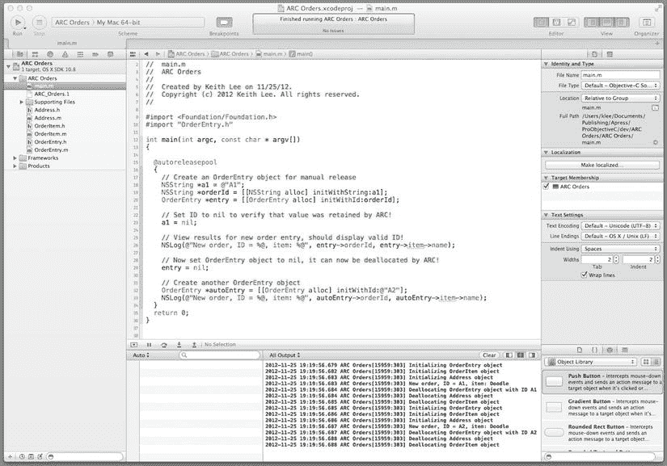


# 图 4-7 测试 `ARC OrderEntry` 项目

这些消息显示了初始化与释放动态创建对象时的调用序列。可以看到 ARC 内存管理正确执行，所有动态创建的对象在不使用时均被释放。你还可以通过选择 Xcode Product 菜单中的 **Analyze** 选项，对程序的内存管理进行初步检查。对比 MRR Orders 项目和 ARC Orders 项目，可以发现后者显著减少了需要编写的代码量。随着项目规模与复杂度的增长，ARC 的优势会愈发明显。由于 ARC 可以按单个文件启用，且使用 ARC 编译的代码能与基于 MRR 构建的现有代码共存，因此没有理由不在你的项目中使用它。事实上，对于新的 Objective-C 项目，苹果推荐采用 ARC 作为内存管理机制。

### 避免循环引用

Objective-C 的引用计数模型通过获取对象的所有权（通过 `retain` 消息）并在不再需要该对象时释放所有权（通过 `release` 消息）来实现。这一过程在 ARC 中被自动化，ARC 会自动在代码中插入所需的 `retain`/`release`/`autorelease` 消息。然而，在对象图中，如果两个对象之间存在循环引用，就会产生循环引用问题。例如，在前面的 ARC Orders 项目中，`OrderEntry` 对象拥有一个 `OrderItem` 实例变量，默认情况下这是一个强引用。现在，如果 `OrderItem` 对象也拥有一个 `OrderItem` 实例变量，就会在这两个对象之间形成循环引用。如果这种情况发生，两个对象都将永远无法被释放，从而导致内存泄漏。实际上，`OrderEntry` 对象必须等到 `OrderItem` 对象被释放后才能释放，而 `OrderItem` 对象也必须等到 `OrderEntry` 对象被释放后才能释放。解决此问题的方法是使用弱引用。弱引用是一种*非拥有关系*；也就是说，声明为弱引用的对象并不由声明对象所拥有，从而消除了循环引用。苹果在 Objective-C 中对对象图的约定是：父对象对其每个子对象保持强引用，而子对象（如有必要）对父对象保持弱引用。因此，在本例中，`OrderEntry` 对象会对其 `OrderItem` 对象保持强引用，而 `OrderItem` 对象则对其父对象 `OrderEntry` 保持弱引用。弱引用将在 `OrderItem` 类中声明（如列表 4-15 所示）。

### 列表 4-15 声明弱引用

```
#import <Foundation/Foundation.h>

@interface OrderItem : NSObject

{
@public NSString *name;
OrderEntry *__weak entry;
}

- (id) initWithName:(NSString *)itemName;

@end
```

当 `entry` 变量被销毁时，它会被设置为 `nil`，从而避免循环引用。

## 总结

本章详细介绍了 Objective-C 内存管理的细节，包括 Objective-C 内存模型、Objective-C 程序中内存的分配与释放方式，以及如何使用 Objective-C 提供的两种内存管理方法。以下是关键要点：

- 在运行时，Objective-C 程序会创建对象（通过 `NSObject alloc` 方法），这些对象存储在称为“程序堆”的动态分配内存中。动态创建对象意味着需要进行内存管理，因为在堆上创建的对象永远不会超出作用域。不正确或缺乏内存管理的典型结果包括内存泄漏和野指针。
- Objective-C 内存管理使用引用计数来实现，这是一种通过对象的唯一引用计数来判断对象是否仍在使用的技术。如果一个对象的引用计数降至零，它就被认为不再被使用，其内存将由运行时系统释放。
- Apple 的 Objective-C 开发环境提供了两种内存管理机制：手动保留-释放（MRR）和自动引用计数（ARC）。
- 使用 MRR 时，你通过编写代码显式管理对象的生命周期：对你创建/需要使用的对象获取所有权，并在不再需要这些对象时释放该所有权。
- ARC 采用了与 MRR 相同的引用计数模型，但利用编译器来管理对象的生命周期。在程序编译时，编译器分析源代码，确定动态创建对象的生命周期需求，然后在编译后的代码中自动插入必要的 retain 和 release 消息。
- ARC 通过新的对象生命周期限定符得到了增强，这些限定符用于显式声明对象变量和属性的生命周期，并且还包括用于防止对象图中循环引用的功能（弱引用）。
- ARC 可以在整个项目中使用，也可以按单个文件启用，从而使使用 ARC 的代码能够与不符合 ARC 要求的现有代码协同工作。苹果还提供了一个用于将现有 Objective-C 代码迁移到 ARC 的转换工具。对于所有新的 Objective-C 项目，ARC 是推荐的内存管理工具。

内存管理对于 Objective-C 软件开发非常重要。它对应用程序的用户体验以及整个系统的运行都有重大影响。一个编写良好的 Objective-C 程序只会使用其所需的内存，不会发生内存泄漏，也不会尝试访问不再使用的对象。现在你已经了解了 Objective-C 内存模型以及应用程序内存管理所提供的方法：MRR 和 ARC（苹果推荐的方法）。在下一章中，你将探讨 Objective-C 平台的另一个关键元素——预处理器。猜猜看？这意味着你还将学习一门新的编程语言！所以，何不休息一下，给自己一个应得的放松呢？当你准备好了，翻到下一页开始下一章。

# 第 5 章：预处理器

Objective-C 编程语言包含一个预处理器，用于在编译之前翻译源文件。部分翻译是自动执行的，另一部分则基于你在源文件中包含的预处理器语言元素。如果你查看公开可用的 Objective-C 源代码，例如苹果的 Objective-C 源代码，你很可能会发现大量使用预处理器语言的情况。那么，你可能会好奇：预处理器的特性是什么？如何在程序中最佳地使用这种语言？这些正是本章的主题，让我们开始吧！

## 概述

源代码编译的一般过程是：将输入的源文件转换成可在目标计算平台上执行的文件。Objective-C 编译器将此过程分为几个阶段，如图 5-1 所示。

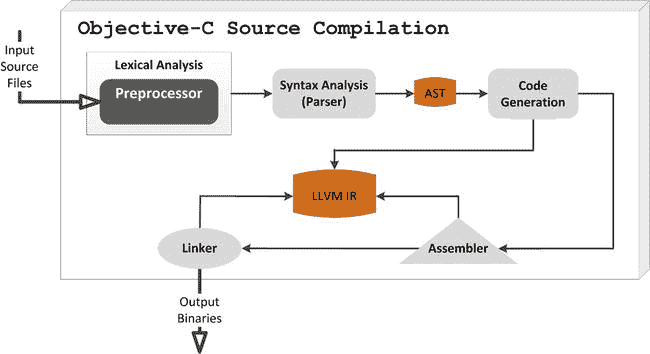

### 图 5-1 编译 Objective-C 源文件


# 这些阶段共同执行词法分析、语法分析、代码生成与优化、汇编及链接操作，最终生成输出二进制文件。

在*词法分析*阶段，源代码被分解为词法单元（tokens）。每个*词法单元*是语言中的单一元素；例如，在其语法上下文中的关键字、运算符、标识符或符号名称。

*语法分析*（或称解析）阶段会检查词法单元是否符合正确的语法，并验证它们能否构成有效表达式。该任务最终会基于词法单元生成一个层次化的解析树或抽象语法树（AST）。

在*代码生成与优化*阶段，AST 被用于生成输出语言的代码，该输出语言可能是机器语言或中间语言表示（IR）。代码还会被优化为功能等价但运行速度更快、体积更小的形式。

*汇编*阶段将生成的代码转换为目标平台可执行的机器码。

最后，在*链接*阶段，汇编器输出的一个或多个机器码文件被组合成单个可执行程序。

预处理器在词法分析阶段（如图 5-1 所示）且位于解析之前被使用。要理解其在该阶段的作用，让我们详细回顾预处理器的操作。

## 操作

预处理器的工作方式是：根据一组预定义规则，将输入的字符序列替换为其他字符序列。如图 5-2 所示，这些操作按以下顺序执行：

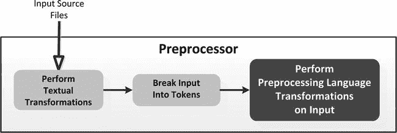

图 5-2. 预处理 Objective-C 源文件

1. *文本转换*：首先，预处理器将输入的源文件分解为行，将三字符组替换为对应的单个字符，将续行合并为单行，并将注释替换为单个空格。三字符组是由 C 编程语言定义的三字符序列，用于表示单个字符。
2. *词法单元转换*：接着，预处理器将转换后的文件转换为一系列词法单元。
3. *基于预处理器语言的转换*：最后，如果词法单元流包含任何预处理语言元素，则根据这些输入对其进行转换。

前两个操作自动执行，最后一个操作则基于添加到源文件中的*预处理器语言*元素来执行。

## 预处理器语言

没错，预处理器语言是一种独立于 Objective-C 的单独编程语言。使用该语言执行的源文件转换主要包括：源文件包含、条件编译和宏展开。预处理器语言元素在程序编译之前对源文件进行操作，并且预处理器本身不了解 Objective-C 语言。

预处理器语言定义了待执行的指令和待展开的宏。预处理器*指令*是由预处理器（而非编译器）执行的命令。预处理器*宏*是一个命名的代码片段。凡是在源代码中使用该名称的位置，该代码片段都会被替换进去。预处理器语言还定义了几个运算符和关键字。

**注意**   理解预处理语言的能力和局限性至关重要，因为错误使用可能导致难以诊断的细微编译问题。在详细研究该语言时，请牢记这一点。

## 指令

在 Objective-C 源文件中，预处理器指令通过一种独特的语法来标识，该语法使得这些行由预处理器而非编译器处理。预处理器指令具有以下形式：

```
#directiveName directiveArguments
```

指令以井号（`#`）开头，其后紧跟指令名称，再接着对应的参数。下面这行代码：

```
#import "Elements.h"
```

是一个预处理指令的示例；每条指令以换行符结束。若要将指令扩展到多行，则在需要续行的行末放置反斜杠（`\`）。以下示例：

```
#define DegreesToRadians(x)  \
                 ((x) * 3.14159 / 180.0)
```

是一条跨两行的预处理器指令，第一行末尾的反斜杠表示续行。

以下是完整的预处理器指令集及其提供的功能：

* 头文件包含（`#include`， `#import`）
* 条件编译（`#if`， `#elif`， `#else`， `#endif`， `#ifdef`， `#ifndef`）
* 诊断（`#error`， `#warning`， `#line`）
* 编译指令（`#pragma`）

### 头文件包含

预处理器有两条指令（`#include` 和 `#import`）用于实现头文件包含；简而言之，它们告诉预处理器获取一个文件的文本内容并将其插入当前文件。因此，它们促进了代码复用，因为源文件可以使用外部类的接口和宏，而无需直接复制它们。

*包含*指令的语法有两种形式：

```
#include "HeaderFileName"
```

或

```
#include <HeaderFileName>
```

`HeaderFileName` 是要插入的头文件名。这两种表达式的唯一区别在于编译器查找文件的位置（即目录）：

* *双引号内的头文件名*（`"HeaderFileName"`）。编译器首先在包含该指令的源文件所在目录中搜索文件。如果未找到，则在配置好的默认目录中搜索系统标准头文件。
* *尖括号内的头文件名*（`<HeaderFileName>`）。编译器在配置好的默认目录中搜索标准头文件。

按照惯例，标准头文件通常使用尖括号包含，因为它们通常位于默认目录中；而其他头文件（如 Objective-C 类的头文件）则使用双引号包含。

*导入*指令（`#import`）也执行头文件包含。与 `#include` 指令类似，被包含的头文件用双引号或尖括号括起来。该指令与 `#include` 的区别在于，它能确保一个头文件在源文件中仅被包含一次，从而防止递归包含。例如，在第 2 章和第 3 章中实现的 Elements 程序中，`main.m` 源文件包含了 `Hydrogen.h` 和 `Atom+Nuclear.h` 头文件。而这两个文件各自都包含了 `Atom.h` 文件，因此你可能面临 `Atom` 头文件被重复包含的情况（在 `main.m` 文件中）。然而，由于 `main.m` 文件使用 `#import` 指令（如代码清单 5-1 所示）包含了 `Hydrogen` 和 `Atom+Nuclear` 头文件，因此 `Atom` 头文件将仅被包含一次（在 `main.m` 源文件中）。

*代码清单 5-1.*  使用 `#import` 指令防止递归包含

```
#import <Foundation/Foundation.h>
#import "Atom.h"
#import "Atom+Nuclear.h"
#import "Atom+Helper.h"
#import "Hydrogen.h"
```


如果没有`#import`指令，则必须在头文件中提供包含守卫来防止递归包含。*包含守卫*是一组预处理器语句，用于防止头文件被重复包含。它通常使用`#ifndef`条件编译表达式和`#define`指令构建。`Atom.h`头文件的包含守卫示例如代码清单 5-2 所示。

*代码清单 5-2.*  Atom.h 头文件包含守卫

```objc
#ifndef  ATOM_H
#define  ATOM_H
@interface Atom : NSObject
// Atom 接口声明
...
@end
#endif
```

`#import`指令通常用于包含 Objective-C 头文件，因此在 Objective-C 源文件中通常无需实现包含守卫。现在让我们来看条件编译指令。

## 条件编译

*条件编译*指令（`#if`, `#elif`, `#else`, `#endif`, `#ifdef`, `#ifndef`）允许你在满足特定条件时包含或排除部分源代码。

`#if`指令允许你测试表达式的值，并根据结果包含/排除部分源代码。使用该指令的语法如代码清单 5-3 所示。

*代码清单 5-3.*  #if 预处理器指令语法

```cpp
#if ArithmeticExpression
// 条件文本（预处理器或 Objective-C 源代码）
...
#endif
```

`#if`指令用于测试算术表达式。如代码清单 5-3 所示，它与`#endif`指令配对使用，两者之间包含条件文本。该算术表达式为整数类型，可包含以下元素：

* 整数常量和字符常量。
* 算术运算符、位运算、移位运算、比较运算和逻辑运算（如附录 A 中所定义）。
* 预处理器宏。宏在计算表达式之前展开。
* 对`defined`运算符的使用，该运算符用于检查宏是否已定义。
* 非宏的标识符，在求值时都会被赋予零值。

预处理器根据这些规则对表达式求值。如果求值结果非零，则条件文本（通常是源代码，但也可能是其他预处理器指令）会被包含以进行编译或进一步预处理；否则，将被跳过。请看以下示例：

```cpp
#if INPUT_ARGS <= 0
#warning "No input arguments defined"
#endif
```

预处理器将按以下步骤处理这些代码行：

1. 展开标识符`INPUT_ARGS`。如果该标识符是宏，则替换为其对应的值；如果不是宏或者宏没有值，则替换为零。
2. 计算表达式的结果。如果值非零（即`INPUT_ARGS`标识符的值小于或等于零），则`#if`指令语句和`#endif`指令之间的文本被包含（即不会被预处理器过滤）。在这种情况下（由于`#warning`消息），它将最终导致编译器生成一条警告消息。

此类指令常用于为指定的目标环境进行平台相关代码的条件编译。例如，如果你有针对多个不同编译器进行自定义的 Objective-C 代码，可以使用`#if`指令和适当的编译器特定标识符将其封装起来。

`#elif`指令代表“else if”；它增强了`#if`指令，允许你检查两个或更多可能条件。它位于`#if`和`#endif`指令之间；只有当原始的`#if`指令（以及任何前面的`#elif`指令）失败时，才会处理`#elif`指令后的条件文本。`#elif`指令的语法如代码清单 5-4 所示。

*代码清单 5-4.*  #elif 预处理器指令语法

```cpp
#if ArithmeticExpression1
// 条件文本 1
...
#elif ArithmeticExpression2
// 条件文本 2
...
#elif ArithmeticExpressionN
// 条件文本 N
...
#endif
```

预处理器将按以下方式处理代码清单 5-4 中的文本：如果`ArithmeticExpression1`成功，则处理`条件文本 1`；否则如果`ArithmeticExpression2`成功，则处理`条件文本 2`；否则如果`ArithmeticExpressionN`成功，则处理`条件文本 N`。如果`#if-#elif`组中有多个条件表达式能成功，则仅处理第一个。

`#else`指令通过提供一种机制来增强`#if`和`#elif`指令：当所有相关的`#if`和`#elif`表达式都不成功时，执行条件文本。它位于`#if`、`#elif`（如果提供了任何`#elif`指令）和`#elif`指令之后，作为紧挨着`#endif`之前的最后一条指令。`#else`指令的语法如代码清单 5-5 所示。

*代码清单 5-5.*  #else 预处理器指令语法

```cpp
#if ArithmeticExpression1
// 条件文本 1
...
#elif ArithmeticExpression2
// 条件文本 2
...
#else
// 其他条件文本
...
#endif
```

如果其他所有条件表达式都不成功，预处理器将处理代码清单 5-5 中的`其他条件文本`。

在`#if`及其对应的`#endif`指令之间，最多只能放置一个`#else`指令，并且它必须是`#endif`之前的最后一条指令。最后，还需注意`#if`、`#elif`、`#else`和`#endif`指令可以嵌套；在这种情况下，`#endif`与它前面最近的`#if`指令匹配。

`#ifdef`指令允许仅当指定为参数的那个宏已被定义时（无论其值是多少），才处理条件文本。它与`#endif`指令配对，条件文本包含在两者之间。该指令的语法如代码清单 5-6 所示。

*代码清单 5-6.*  #ifdef 预处理器指令语法

```cpp
#ifdef MacroName
// 条件文本
...
#endif
```

`#ifndef`指令作为`#ifdef`指令的补充；它允许仅当指定为参数的那个宏未被定义时，才处理条件文本。该指令的语法如代码清单 5-7 所示。

*代码清单 5-7.*  #ifndef 预处理器指令语法

```cpp
#ifndef MacroName
// 条件文本
...
#endif
```

`#ifdef`和`#ifndef`指令的行为也可以通过在使用`#if`或`#elif`的条件表达式中使用`defined`运算符来实现。

`defined`运算符用于测试某个名称是否被定义为一个宏。它等同于`#ifdef`指令。在条件表达式中使用`defined`运算符的语法是：

```cpp
#if defined MacroName
```

或

```cpp
#elif defined MacroName
```

如果需要，宏名称可以用括号括起来。使用`defined`运算符（代替`#ifdef`指令）的原因之一是需要在单个表达式中测试多个宏，如下例所示：


```c
#if defined (MacroName1) || defined (MacroName2)
// insert source text here
#endif
```

## 诊断信息

预处理器包含几个提供诊断信息的指令，用于处理程序编译期间出现的问题。`#error` 指令会使预处理器生成错误消息并导致编译失败。该指令的语法如下所示：

```
#error "错误消息"
```

错误消息需要用双引号括起来。该指令通常在条件编译检查失败时使用；例如，如果未定义宏 `INPUT_ARGS`，则以下代码片段：

```c
#ifndef    INPUT_ARGS
#error "没有提供输入参数"
#endif
```

会导致编译失败并生成一条错误消息（“没有提供输入参数”）。

`#warning` 指令会使预处理器生成编译期警告消息，但允许继续编译。该指令的语法如下所示：

```
#warning "警告消息"
```

警告消息需要用双引号括起来。如果未定义宏 `OUTPUT_ARGS`，则以下代码片段：

```c
#ifndef    OUTPUT_FILE
#warning "未提供输出文件名"
#endif
```

会生成一条警告消息（“未提供输出文件名”）；编译将继续进行。

`#line` 指令用于为编译器消息提供行号。如果在编译过程中发生错误，编译器会显示一条错误消息，其中包含发生错误的文件名和相应的行号引用，从而更容易找到产生错误的代码。`#line` 指令的语法如下所示：

```
#line 行号 "文件名"
```

`行号` 是分配给下一行代码的新行号。从这一点开始，后续行的行号将逐一递增。`“文件名”`（用双引号括起来）是一个可选参数，可用于重新定义将要显示的文件名。Xcode 和 Objective-C 编译器对 `#line` 指令的使用如下列代码片段所示：

```objc
...
#line 10 "Elements.m"
int ?numProtons;
```

此代码将生成一个错误，该错误将显示为文件 `"Elements.m"` 第 11 行的错误。

Xcode IDE 会显示源文件的行号，并在您输入代码和编译时自动显示错误和警告；因此，您很少需要在源文件中使用此指令。

## Pragma

*pragma* 指令（`#pragma`）用于向编译器指定超出 Objective-C 语言本身含义之外的额外选项。这些选项特定于所使用的平台和编译器。`#pragma` 指令的语法如下所示：

```
#pragma Pragma 选项
```

pragma 选项是一系列字符，对应于特定的编译器指令（以及参数，如果有的话），并会导致实现定义的行为。如果编译器不支持 `#pragma` 指令的某个特定参数，该指令将被忽略，并且不会生成错误。

Apple Objective-C 编译器支持许多 pragma 选项；可用的具体选项可在编译器的参考文档中找到。

Xcode 支持几个 `#pragma mark` 指令。您可以在实现源文件中使用这些指令，以便在 IDE 中查看方法时对它们进行分类。让我们看一个例子来了解这是如何工作的。Xcode 工作区窗口在编辑器区域的顶部包含一个*跳转栏*；它用于分层查看工作区中的项目。如果您单击跳转栏中的某个项目，它会显示层级中同一级别的项目（如图 5-3 所示）。

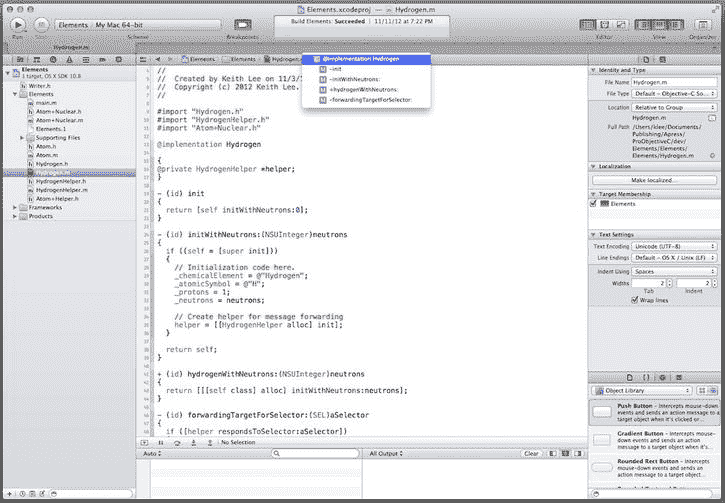

图 5-3. 使用 Xcode 跳转栏显示方法

图 5-3 显示，在 Xcode 跳转栏中单击某个类实现会弹出一个窗口，显示 `Hydrogen` 类实现的方法列表。这就是 pragma mark 指令发挥作用的地方——它们可用于组织这些方法在跳转栏弹出窗口中的显示方式。您可以使用以下指令在跳转栏弹出窗口中创建一个可见的分隔线：

```
#pragma mark -
```

您可以使用以下指令创建一个标签，用于对一个或多个方法进行分类：

```
#pragma mark 标记名称
```

`标记名称` 是将在弹出窗口中显示的方法的标签。

以下示例包含了为第 2 章和第 3 章中创建的 `Hydrogen` 类实现添加的 pragma mark 指令。这些更新（在列表 5-8 中以**粗体**显示）对类的自定义初始化方法进行了分类。

*列表 5-8.*  #pragma mark 指令使用示例

```objc
#pragma mark -
#pragma mark Custom Initializers

- (id) initWithNeutrons:(NSUInteger)neutrons
{
  if ((self = [super init]))
  {
    // 初始化代码在此处。
    _chemicalElement = @"Hydrogen";
    _atomicSymbol = @"H";
    _protons = 1;
    _neutrons = neutrons;

// 为消息转发创建辅助对象
    helper = [[HydrogenHelper alloc] init];
  }

return self;
}

#pragma mark -
```

如果您现在单击 Xcode 跳转栏中的 `Hydrogen` 实现（如图 5-4 所示），弹出窗口会列出一个带有 `Custom Initializers` 标签并被分隔线包围的方法 `initWithNeutrons:`。

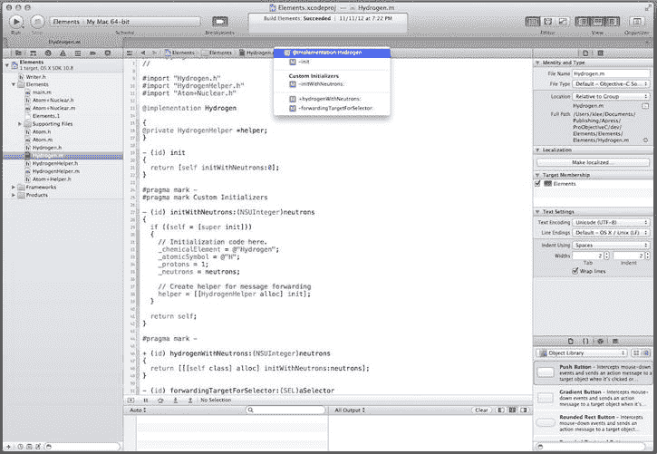

图 5-4. 使用 #pragma mark 指令

尤其对于包含大量方法的大型项目和类，`#pragma mark` 指令提供了一种机制，有助于对类方法进行分类和组织，并使跳转栏使用起来更高效。

## 宏

预处理器*宏*是一个命名的代码片段。无论在源代码中何处使用了该名称，代码片段都会替换它。预处理器宏可用于定义常量值，或提供带有输入参数值的类函数替换。宏使用 `#define` 预处理器指令定义，并使用 `#undef` 指令移除。定义常量值的类对象宏的语法如下：

```c
#define 宏名称 [宏值]
```

可选的宏值放在名称之后；宏值可以是常量值组成的算术表达式。类函数宏的语法如下：

```c
#define 宏名称(宏参数) 代码
```

宏名称包含一个或多个参数（用逗号分隔），用括号括起来，以及替换它的代码片段。一个将两个值相加的类函数宏示例如下：

```c
#define SQUARE(x)  ((x) * (x))
```

宏的所有参数在被替换到宏体之前都会完全进行宏展开。替换之后，整个文本会再次被扫描以查找要展开的宏，包括参数。预处理器不理解 Objective-C；它只是将宏名称的出现替换为相应的宏值或代码。还要注意，宏不受 Objective-C 作用域规则的影响。一旦定义，宏就会存在并可在文件中使用，直到使用 `#undef` 指令取消定义。

现在您可能想知道：为什么我在定义 `SQUARE` 宏时使用了所有这些括号？这反映了宏的一个问题；因为它们只执行简单的替换，所以在定义宏时必须小心，以避免在展开时出现意外结果。例如，考虑如果前面列出的 `SQUARE` 宏被定义如下：

```c
#define SQUARE(x)  x * x
```


# 排版后的内容

如果你在源代码中写入以下语句，会得到什么结果？

```
int product = SQUARE(4 + 2);
```

猜猜看？结果不是 `36`！让我们看看宏究竟如何工作。记住，它只是简单地将宏替换为对应的代码；因此，该语句会宏展开为：

```
int product = 4 + 2 * 4 + 2;
```

由于 Objective-C 的运算符优先级和结合性规则（列于附录 A），在上述语句中，`2 * 4` 的乘法会在加法之前执行；因此，该语句将返回值 `14`——这可能不是你期望的结果！为了避免这些由于宏展开导致的问题，你可以用括号将宏参数和宏本身包围起来，如下面 `ADD` 宏的初始定义所示：

```
#define SQUARE(x)  ((x) * (x))
```

事实上，函数式宏和对象式宏都应该使用括号。另一方面，用于执行计算而非返回值（例如执行一系列操作）的多行函数式宏，应该用花括号（`{ }`）包围。例如，下面的宏用花括号包围：

```
#define SWAP(a, b)  {a^=b; b^=a; a^=b;}
```

函数式宏定义在替换序列中接受两个特殊运算符（`#` 和 `##`）。*字符串化*运算符（用 `#` 符号表示）用于将宏输入参数替换为对应的文本字符串（用双引号包围）。*连接*运算符（用 `##` 符号表示）用于连接两个符号（token），它们之间不留空格。

**警告：不要过度使用宏！**

宏，尤其是函数式宏，是一个强大的特性，但使用起来可能非常危险。由于预处理器的替换发生在源代码解析之前，很难定义在所有情况下都能正确展开的宏。将带有*副作用*的参数传递给函数式宏通常是存在问题的（即，改变一个或多个参数的值）。这可能导致其中一个或多个参数被多次求值（即副作用的重复），从而对它们的值产生意想不到的更改，这些更改很难诊断。

最后，严重依赖复杂宏的代码可能难以维护，因为它们的语法在许多情况下与 Objective-C 中使用的语法不同。

## 总结

这一章很有趣。你在一个章节里就学会了一门编程语言！好吧，也许没那么夸张，但你现在对 Objective-C 预处理器的工作原理以及预处理器语言如何在 Objective-C 源文件中使用有了很好的理解。特别是，如果你想理解许多公开可用的软件库和框架，或者想研究 Apple 的 Objective-C 源代码，对预处理器语言的详细了解是非常宝贵的。总而言之，本章的要点如下：

*   预处理器在编译的词法分析阶段使用，该阶段发生在解析之前。它根据一组预定义的规则，将输入字符序列（来自源文件）替换为其他字符序列。这些操作执行文本转换、符号转换和基于预处理器的语言转换。
*   预处理器语言是一种与 Objective-C 不同的独立编程语言。使用该语言执行的源文件转换主要包括文件包含、条件编译和宏展开。
*   预处理器语言定义了要执行的*指令*和要展开的*宏*。预处理器指令是由预处理器执行（而非编译器）的命令。预处理器宏是一个命名的代码片段。只要在源代码中使用了该名称，代码片段就会被替换进去。
*   预处理器指令执行头文件包含、条件处理、诊断和平台特定操作（`pragma`）。
*   预处理器宏是一个命名的代码片段。只要在源文件中使用了该名称，代码片段就会被替换进去。预处理器宏定义常量值和/或提供带有输入参数值的函数式替换。
*   宏，尤其是函数式宏，是一个强大的特性，但可能非常危险。不当使用会导致嵌套错误、运算符优先级问题、副作用重复以及其他问题。此外，严重依赖复杂宏的代码可能难以维护，因为其语法通常与 Objective-C 中使用的语法不同。一般来说，你应该尽量减少在 Objective-C 代码中对宏的使用。

# 第六章

# 专家篇：使用 ARC

信不信由你，你正在接近本书第一部分的结尾。到目前为止，一切顺利！第一部分以本章“专家篇”章节结束。*专家篇*章节旨在提供额外的细节，并对本书前面介绍的主题进行更深入的覆盖。在本章中，你将学习围绕 ARC 内存管理的一些更精细的细节。你将复习关于 ARC 内存管理和对象所有权的一些关键点，并学习如何在 ARC 中使用 Toll-Free Bridged 对象。

## ARC 与对象所有权

回顾第 4 章，Objective-C 代码创建存储在动态分配内存（堆）中的对象。在堆上创建的对象永远不会超出作用域，因此需要应用程序内存管理来确保这些对象在不再使用时从内存中移除，并且程序不会错误地释放仍在使用的对象。Objective-C 使用引用计数模型实现内存管理，通过对对象的唯一引用来判断对象是否仍在使用。ARC 通过在编译时插入代码来自动化此任务，根据引用计数模型，正确地平衡对象上的 `retain` 和 `release` 消息。ARC 禁止对对象生命周期进行编程控制。具体来说，你不能发送 `retain` 或 `release` 消息来控制对象的所有权权益。因此，理解 ARC 下关于对象所有权的规则非常重要。

### 声称对象的所有权权益

你的 Objective-C 代码对使用任何以 `alloc`、`new`、`copy` 或 `mutableCopy` 开头的方法创建的任何对象拥有所有权权益。如清单 6-1 所示的 `main()` 函数使用 `alloc` 方法创建了一个 `Atom` 对象，因此声称对该对象拥有所有权权益。

*清单 6-1.*  创建 Atom 对象

```
int main(int argc, const char * argv[])
{
  @autoreleasepool
  {
    Atom *atom = [[Atom alloc] init];
    [atom logInfo];
  }

return 0;
}
```


好的，作为一名高级文档工程师和翻译员，我将严格遵循您提供的注意事项和示例格式，将给定的英文文本翻译成中文。


你的代码也可以通过使用`copy`消息创建`block`对象，从而获得该对象的所有权。

**注意**：*block* 是闭包的一种实现，是一种允许访问其正常作用域外部变量的函数。Block 可以动态分配在堆上，并且与标准的 Objective-C 对象一样，由 ARC 管理。本书第 4 部分将深入介绍 block 的编程。

## 释放对象的所有权

如前所述，ARC 禁止在对象上编程使用`release`、`autorelease`、`dealloc`或相关消息。当你的代码执行以下任一操作时，它放弃了对对象的所有权：1) 变量重新赋值，2) `nil`赋值，或 3) 其所有者被释放。

### 变量重新赋值

如果一个指向动态创建对象的变量被更改为指向另一个对象，则该对象失去一个所有者。在编译时，ARC 会插入代码向此对象发送`release`消息。此时，如果该对象没有其他所有者，它将被释放。Listing 6-2 演示了变量重新赋值的示例。

*Listing 6-2.*  对象所有权——变量重新赋值

```
Atom *myAtom = [[Atom alloc] initWithName:@"Atom 1"];
// 其他代码
...
myAtom = [[Atom alloc] initWithName:@"Atom 2"];
```

在 Listing 6-2 中，创建了一个`Atom`对象（我们称其为`Atom 1`）并赋值给`myAtom`变量；稍后在代码中，此变量被赋值为另一个`Atom`对象（我们称其为`Atom 2`）。由于`myAtom`变量已重新赋值为`Atom 2`，`Atom 1`失去一个所有者，如果该对象没有其他所有者，它将被释放。

### nil 赋值

如果一个当前指向动态创建对象的变量的值被设置为`nil`，则该对象失去一个所有者。Listing 6-3 演示了`nil`赋值的示例。

*Listing 6-3.*  对象所有权——nil 重新赋值

```
Atom *myAtom = [[Atom alloc] init];
// 其他代码
...
myAtom = nil;
```

在 Listing 6-3 中，创建了一个`Atom`对象并赋值给`myAtom`变量；稍后在代码中，此变量被设置为`nil`。由于`myAtom`变量已设置为`nil`，该`Atom`对象失去一个所有者。同样，在将`myAtom`变量设置为`nil`的语句之后，ARC 会插入代码向此对象发送`release`消息。

### 所有者释放

*所有者释放*。这听起来不太令人愉快，不是吗？实际上，这个术语指的是对象所有权，以及 ARC 如何透明地管理对象图和集合的对象生命周期。面向对象的程序由相互关联的对象网络组成。这些对象通过 OOP 继承和/或组合连接在一起，统称为*对象图*。在对象图中，对象通过组合原理包含对其他（子）对象的引用。如果一个（父）对象创建了另一个（子）对象，它就声称拥有该子对象的所有权。在第 4 章中，你创建了一个程序，其中包含一个由`OrderEntry`类和两个依赖（子）类组成的对象图；其对象图如 Figure 6-1 所示。

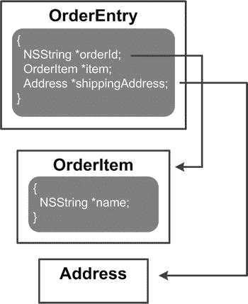

Figure 6-1. OrderEntry 对象图

当创建并初始化一个`OrderEntry`对象时，其`init`方法也会创建其两个子类的实例；因此，`OrderEntry`对象声称拥有这些子对象中每一个的所有权。稍后，当释放一个`OrderEntry`对象时，ARC 会自动向其每个子对象发送`release`消息。具体来说，在编译时，ARC 会创建代码，为`OrderEntry`对象插入一个`dealloc`方法（如果该方法尚不存在），为其拥有的每个子对象插入一条`release`消息，然后向`OrderEntry`对象的超类发送一条`dealloc`消息。因此，ARC 会自动管理对象图的生命周期。

Apple 基础框架包含各种集合类，之所以这样命名，是因为它们用于保存其他对象的实例。当一个对象存储在一个集合类的实例中时，该集合类声称拥有该对象的所有权。相反，当释放一个集合类实例时，ARC 会自动向集合中的每个对象发送一条`release`消息。

## 创建多个订单条目

为了说明 ARC 内存管理和所有者释放的用法，你将扩展在第 4 章中创建的 Order Entry 项目，添加收集和存储多个订单条目的功能。你将使用一个集合类来存储这些条目，然后演示 ARC 如何对集合类及其存储的对象执行内存管理。

在 Xcode 中，通过从 Xcode 文件菜单中选择 **Open Recent  ARC Orders.xcodeproj** 来打开 ARC Orders 项目（如果尚未打开）。该项目的源代码由七个文件组成，这些文件实现了`OrderEntry`、`OrderItem`和`Address`类，以及`main`函数。让我们从对`OrderItem`类进行一些更新开始。在导航器窗格中选择 **OrderItem.h** 文件，然后更新 OrderItem 接口，如 Listing 6-4 所示。

*Listing 6-4.*  ARC OrderItem 类接口

```
#import <Foundation/Foundation.h>

@interface OrderItem : NSObject

@property (readonly) NSString *name;

- (id) initWithName:(NSString *)itemName;

@end
```

在 Listing 6-4 中，实例变量`name`已更改为只读属性。接下来，选择 **OrderItem.m** 文件并更新`OrderItem`实现，如 Listing 6-5 所示。

*Listing 6-5.*  ARC OrderItem 类实现

```
#import "OrderItem.h"

@implementation OrderItem

- (id) initWithName:(NSString *)itemName
{
  if ((self = [super init]))
  {
    _name = itemName;
    NSLog(@"Initializing OrderItem object %@", _name);
  }
  return self;
}

- (void)dealloc
{
  NSLog(@"Deallocating OrderItem object %@", self.name);
}

@end
```

这段代码与原始实现非常相似；自定义初始化方法（`initWithName:`）已被修改，以初始化属性支持的实例变量。日志消息也略有更新，以显示`OrderItem`对象的名称。回顾第 3 章，对于自动合成的属性，其实例变量的标准命名约定是属性名前加下划线。现在让我们更新`OrderEntry`类。在导航器窗格中选择 **OrderEntry.h** 文件，然后更新 OrderEntry 接口，如 Listing 6-6 所示。

*Listing 6-6.*  ARC OrderEntry 类接口

```
#import <Foundation/Foundation.h>
#import "OrderItem.h"
#import "Address.h"

@interface OrderEntry : NSObject

{
  Address *shippingAddress;
}

@property (readonly) NSString *orderId;
@property (readonly) OrderItem *item;

- (id) initWithId:(NSString *)oid name:(NSString *)order;

@end
```


`OrderEntry`接口现在有一个实例变量、两个只读属性和一个更新后的自定义初始化器（`initWithId:name:`）。这些属性是只读的，它们替换了第 4 章原始接口中的两个实例变量。接下来，你将更新类的实现。在导航窗格中选择`OrderEntry.m`文件，并更新实现，如列表 6-7 所示。

列表 6-7. ARC OrderEntry 类实现

```
#import "OrderEntry.h"

@implementation OrderEntry

- (id) initWithId:(NSString *)oid name:(NSString *)order;
{
  if ((self = [super init]))
  {
    NSLog(@"Initializing OrderEntry object");
    _orderId = oid;
    _item = [[OrderItem alloc] initWithName:order];
    shippingAddress = [[Address alloc] init];
  }

return self;
}

- (void)dealloc
{
  NSLog(@"Deallocating OrderEntry object with ID %@",
        self.orderId);
}

@end
```

自定义初始化器方法（`initWithId:name:`）已被修改，用于初始化两个由属性支持的实例变量。日志消息也略有更新，以使用属性`getter`方法显示`OrderEntry` ID。

现在你已经更新了类，让我们更新`main`函数，以创建一些订单条目并将它们存储在集合类中。在导航窗格中选择`main.m`文件，然后更新`main`函数，如列表 6-8 所示。

列表 6-8. ARC Orders `main()` 函数实现

```
#import <Foundation/Foundation.h>
#import "OrderEntry.h"

int main(int argc, const char * argv[])
{

@autoreleasepool
  {
    // Create an OrderEntry object
    OrderEntry *entry1 = [[OrderEntry alloc] initWithId:@"A-1"
                                                   name:@"2 Hot dogs"];
    NSLog(@"Order 1, ID = %@, item: %@", entry1.orderId, entry1.item.name);

// Create another OrderEntry object
    OrderEntry *entry2 = [[OrderEntry alloc] initWithId:@"A-2"
                                                   name:@"1 Cheeseburger"];
    NSLog(@"Order 2, ID = %@, item: %@", entry2.orderId, entry2.item.name);

// Add the order entries to a collection
    NSArray *entries = [[NSArray alloc] initWithObjects:entry1, entry2, nil];
    NSLog(@"Number of order entries = %li", [entries count]);

// Set OrderEntry object to nil, ARC sends a release message to the object!
    NSLog(@"Setting entry2 variable to nil");
    entry2 = nil;

// Set collection to nil, ARC sends a release message to all objects
    NSLog(@"Setting entries collection variable to nil");
    entries = nil;

// Set OrderEntry object to nil, ARC sends a release message to the object!
    NSLog(@"Setting entry1 variable to nil");
    entry1 = nil;

// Exit autoreleasepool block
    NSLog(@"Leaving autoreleasepool block");
  }
  return 0;
}
```

对`main()`函数的更新内容较多，因此你将逐行进行复习。首先，代码创建了两个`OrderEntry`对象，每次都会在控制台记录一条消息，显示条目的 ID 和名称。接下来，代码创建并初始化了一个包含两个订单条目的`NSArray`对象。`NSArray`是 Foundation 框架中的一个类，用于管理对象的顺序集合（你将在本书的第 3 部分学习`NSArray`和其他 Foundation 框架集合类）。正如你之前所了解的，当一个对象存储在集合类的实例中时，集合类会声称对该对象拥有所有权权益。因此，`NSArray`对象声称对每个订单条目拥有所有权权益。接下来，当前指向其中一个`OrderEntry`对象（`entry2`）的变量被设置为`nil`，从而释放了对该对象的一个所有权权益。由于`NSArray`对象仍然“拥有”`entry2`对象，因此它不会被释放。接着，指向`NSArray`对象的变量被设置为`nil`，从而释放了对`entry2`对象以及它所声称拥有所有权的所有对象的所有权权益。最后，指向另一个`OrderEntry`对象（`entry1`）的变量被设置为`nil`，从而释放了对该对象的一个所有权权益。在离开自动释放池块之前，也会立即在控制台记录一条消息。

现在，保存、编译并运行更新后的 ARC Orders 程序，观察输出窗格中的消息（参见图 6-2）。

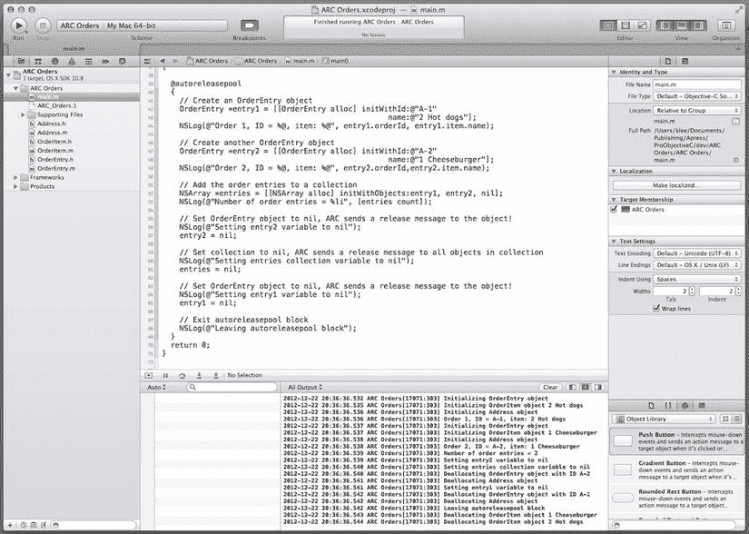

图 6-2. 测试更新后的 ARC Order Entry 项目

输出窗格中的消息（在图 6-3 中更详细地展示）显示了初始化并释放动态创建对象的调用序列。

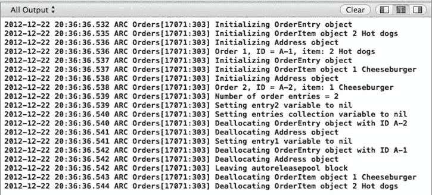

图 6-3. ARC 对象释放

在图 6-3 中，一系列消息显示了两个`OrderEntry`对象图的初始化过程，包括它们对应的依赖对象（`OrderItem`和`Address`）。接下来显示一条指示存储在`NSArray`集合类中订单条目数量的消息。然后，`entry2`变量（对应于一个`OrderEntry`对象）被设置为`nil`；然而，由于`NSArray`实例仍然对这个`OrderEntry`对象拥有所有权权益，因此它不会被释放。随后，`entries`变量（对应于`NSArray`实例）被设置为`nil`。这导致`NSArray`实例被释放，并向该集合中的每个对象发送一条`release`消息。此时，对应于`entry2`变量的`OrderEntry`对象不再有所有者，因此它及其依赖对象被释放。接下来，`entry1`变量被设置为`nil`，导致向其对应的`OrderEntry`对象发送一条`release`消息。由于此对象现在没有所有者，它及其依赖对象也被释放。输出窗格现在显示一条消息，指示代码正在离开自动释放池块。在此消息之后，每个`OrderEntry`对象对应的`OrderItem`对象被释放。


ARC 内存管理已妥善管理了该对象图及集合类的生命周期。但若仔细查看输出面板的内容，你可能会注意到，`OrderItem`对象是在自动释放池结束时才被释放的（如图 6-3 中的日志信息所示）。那么，为什么当对应的`OrderEntry`父对象被释放时，它们却没有被释放呢？答案在于 ARC 如何管理属性访问器的生命周期——具体到本案例中，是属性`get`方法。你的代码需要对所获取的（即非通过以`alloc`、`new`、`copy`或`mutableCopy`开头的方法编程创建）且可能长时间使用的任何对象声明所有权。由于 ARC 禁止你通过编程方式向对象发送`retain`消息，因此它必须能够检测到这些场景，并插入必要的代码来适当管理对象的生命周期。具体来说，如果通过属性`get`方法获取对象，ARC 会检测到这一点，并自动插入代码，向该对象发送`retain`和`autorelease`消息，从而防止它过早地被释放。回顾清单 6-6，`OrderEntry`接口声明了一个类型为`OrderItem`的（只读）属性，名为`item`。在清单 6-8 中，以下语句通过属性`get`方法（`entry1.item`）获取了`OrderItem`对象`item`：

```
NSLog(@"Order 1, ID = %@, item: %@", entry1.orderId, entry1.item.name);
```

在编译时，ARC 会自动插入向此`OrderItem`对象发送`retain`和`autorelease`消息的代码。稍后在代码中，使用以下语句获取了`OrderItem`对象（`entry2.item`）：

```
NSLog(@"Order 2, ID = %@, item: %@", entry2.orderId, entry2.item.name);
```

总而言之，当通过属性 getter 获取对象时，ARC 会向该对象发送`retain`和`autorelease`消息以防其被释放。这解释了为什么`OrderItem`对象是在自动释放池块结束时被释放，而不是在其父对象（`OrderEntry`）被释放时释放。

现在，我们来注释掉上述两条日志语句，然后保存、编译并重新运行程序。由于不再通过属性`get`方法获取`OrderItem`对象，你应该会观察到`OrderItem`对象现在是在对应的`OrderEntry`对象被释放时释放，而不是在自动释放池块结束时释放（参见图 6-4）。

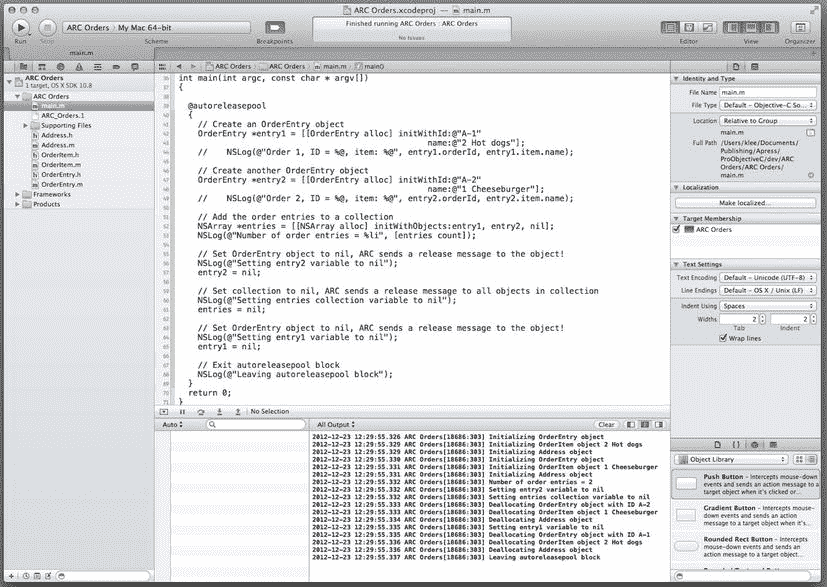

图 6-4. 运行更新后的 ARC Order Entry 项目

此示例展示了使用 ARC 编译的代码如何通过编程释放对象的所有权，以及 ARC 如何管理对象图和集合的对象生命周期。随着你开发更庞大、更复杂的 Objective-C 应用程序，理解这些细节将变得非常宝贵。

## 将 ARC 与 Apple 框架和服务结合使用

Apple 提供了大量软件库（即框架和服务），这些库提供了编写 OS X 和 iOS 平台软件所需的接口。一些最常用的应用程序开发库在图 6-5 中进行了展示。

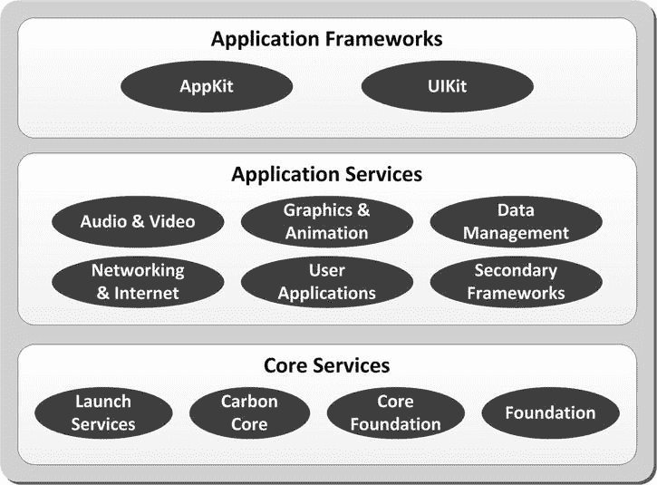

图 6-5. Apple 应用程序框架和服务

其中一些库的应用程序编程接口（API）是用 Objective-C 编写的，因此可以直接在你的 Objective-C 程序中使用。大多数其他库的 API 是用 ANSI C 编写的，因此也可以直接在你的 Objective-C 程序中使用。

你可能还记得第 4 章中的内容，ARC 为 Objective-C 对象和块对象提供了自动内存管理。基于 C API 的 Apple 软件库不与 ARC 集成。因此，在使用这些基于 C 的 API 动态分配内存时，你需要负责通过编程方式进行内存管理。实际上，使用 ARC 时，禁止在 Objective-C 对象的指针和其他类型的指针（例如，属于 Apple 基于 C 的 API 一部分的指针）之间执行标准转换。Apple 提供了几种机制（免费桥接和 ARC 桥接转换）来促进在 Objective-C 程序中使用基于 C 的 API。接下来你将了解这些内容。

### Objective-C 免费桥接

基于 C 的 Core Foundation 框架和基于 Objective-C 的 Foundation 框架中的许多数据类型提供了互操作性。这种能力被称为*免费桥接*，它允许你将相同的数据类型用作 Core Foundation 函数调用的参数，或用作 Objective-C 消息的接收者。你可以将一种类型转换为另一种类型以消除编译器警告。一些更常用的免费桥接数据类型列于表 6-1 中；它包括 Core Foundation 类型和对应的 Foundation 框架类型。

表 6-1. 免费桥接数据类型

| Core Foundation 类型 | Foundation 类型 |
| --- | --- |
| `CFArrayRef` | `NSArray` |
| `CFDataRef` | `NSData` |
| `CFDateRef` | `NSDate` |
| `CFDictionaryRef` | `NSDictionary` |
| `CFMutableArrayRef` | `NSMutableArray` |
| `CFMutableDataRef` | `NSMutableData` |
| `CFMutableDictionaryRef` | `NSMutableDictionary` |
| `CFMutableSetRef` | `NSMutableSet` |
| `CFMutableStringRef` | `NSMutableString` |
| `CFNumberRef` | `NSNumber` |
| `CFReadStreamRef` | `NSInputStream` |
| `CFSetRef` | `NSSet` |
| `CFStringRef` | `NSString` |
| `CFWriteStreamRef` | `NSOutputStream` |

借助免费桥接，编译器会在 Core Foundation 和 Foundation 类型之间隐式转换。例如，在清单 6-9 中，一个`CFStringRef`类型的变量被用作 Objective-C 方法的参数。

*清单 6-9.* 免费桥接隐式转换

```
CFStringRef cstr = CFStringCreateWithCString(NULL, "Hello, World!",
                                                 kCFStringEncodingASCII);
NSArray *data = [NSArray arrayWithObject:cstr];
```

`[NSArray arrayWithObject:]`类方法接受一个类型为`id`（即一个 Objective-C 对象指针）的参数，但传入的是`CFStringRef`。由于`CFStringRef`是一种免费桥接数据类型，`cstr`参数被隐式转换为`NSString`对象（参见表 6-1）。为了消除编译器对隐式转换的警告，需要对参数进行显式转换，如清单 6-10 所示。

*清单 6-10.* 免费桥接显式转换

```
CFStringRef cstr = CFStringCreateWithCString(NULL, "Hello, World!",
                                                 kCFStringEncodingASCII);
NSArray *data = [NSArray arrayWithObject:(NSString *)cstr];
```

如前所述，Objective-C 编译器不会自动管理 Core Foundation 数据类型的生命周期。因此，要在使用 ARC 内存管理的 Objective-C 程序中使用 Core Foundation 免费桥接类型，有必要指明与这些类型相关的所有权语义。实际上，清单 6-10 中的代码，照此编写，在使用 ARC 时是无法编译的！对于使用 ARC 内存管理的 Objective-C 程序，你必须标明免费桥接类型的生命周期是由 ARC 管理，还是由你通过编程方式管理。你可以通过使用 ARC 桥接转换来实现这一点。

### ARC 桥接转换


`ARC bridged casts` 使得在使用 ARC 时能够利用免费桥接类型。这些转换操作以特殊的注解 `__bridge`、`__bridge_retained` 和 `__bridge_transfer` 为前缀。

*   `__bridge` 注解用于在不转移所有权的情况下，将对象从 Core Foundation 数据类型转换为`Foundation`对象（或反之）。换句话说，如果你动态创建一个 Foundation 框架对象，然后将其转换为 Core Foundation 类型（通过免费桥接），`__bridge` 注解会告知编译器该对象的生命周期仍由 ARC 管理。反之，如果你创建一个 Core Foundation 数据类型，然后将其转换为 Foundation 框架对象，`__bridge` 注解会告知编译器该对象的生命周期必须通过编程方式管理（而非由 ARC 管理）。请注意，此注解会消除编译器错误，但不会转移所有权；因此，使用时需要小心，以避免内存泄漏或野指针。
*   `__bridge_retained` 注解用于将 Foundation 框架对象转换为 Core Foundation 数据类型，并将所有权从 ARC 系统转移出去。然后，你需要以编程方式管理桥接数据类型的生命周期。
*   `__bridge_transfer` 注解用于将 Core Foundation 数据类型转换为`Foundation`对象，并将该对象的所有权转移给 ARC 系统。之后，ARC 会以编程方式管理桥接对象的生命周期。

在转换操作中使用桥接转换注解的语法是：

```
(annotation castType)variableName
```

这与常规转换操作的不同之处在于，注解被前置在转换类型之前。`ARC bridged casts` 不仅可用于免费桥接类型，还可用于 Objective-C 代码需要访问非 Objective-C 对象管理的内存的其他任何地方。`Listing 6-11` 用 ARC 桥接转换更新了之前的示例。

`*Listing 6-11.*  `  使用 ARC 桥接转换的免费桥接

```
CFStringRef cstr = CFStringCreateWithCString(NULL, "Hello, World!",
                                                 kCFStringEncodingASCII);
NSArray *data = [NSArray arrayWithObject:(__bridge_transfer NSString *)cstr];
```

注意，注解位于要转换的类型之前。此注解会将桥接对象的所有权转移给 ARC，后者现在将管理该对象的生命周期。好了，理论够了，现在让我们创建一些示例来演示 ARC 桥接转换的使用！

## 使用 ARC 桥接转换

现在，你将开发一个示例程序，应用你所学的关于免费桥接和 ARC 桥接转换的知识。在 Xcode 中，通过从 Xcode 的 File 菜单中选择 **New  Project ...** 来创建一个新项目。在 New Project Assistant 窗格中，创建一个命令行应用程序（从 Mac OS X Application 选择中选择 **Command Line Tool**）并点击 **Next**。在 Project Options 窗口中，为 Product Name 指定 **ARC Toll Free Bridging**，为 Project Type 选择 **Foundation**，通过选中 **Use Automatic Reference Counting** 复选框来选择 ARC 内存管理，然后点击 **Next**。

在文件系统中指定你想要创建项目的位置（如果需要，选择 **New Folder** 并输入文件夹的名称和位置），取消选中 **Source Control** 复选框，然后点击 **Create** 按钮。

首先，你将创建一个免费桥接的 Core Foundation 数据类型。在导航器窗格中选择 **main.m** 文件，并创建一个`CFStringRef`，如`Listing 6-12`所示。

`*Listing 6-12.*  `  一个`main()`函数免费桥接数据类型

```
#import <Foundation/Foundation.h>

int main(int argc, const char * argv[])
{
  @autoreleasepool
  {
    CFStringRef cstr = CFStringCreateWithCString(NULL, "Hello, World!",
                                                 kCFStringEncodingASCII);
  }
  return 0;
}
```

`CFStringRef` 是一个 Core Foundation 数据类型，表示一个 Unicode 字符串。它是一个免费桥接类型，可以转换为 Foundation 框架的`NSString`对象。为了演示免费桥接的使用，更新代码，如`Listing 6-13`所示。

`*Listing 6-13.*  `  隐式免费桥接

```
#import <Foundation/Foundation.h>

int main(int argc, const char * argv[])
{
  @autoreleasepool
  {
    CFStringRef cstr = CFStringCreateWithCString(NULL, "Hello, World!",
                                                 kCFStringEncodingASCII);
    NSArray *data = [NSArray arrayWithObject:cstr];
    NSLog(@"Array size = %ld", [data count]);
    ...
}
```

变量`cstr`的类型为`CFStringRef`，是 Objective-C `NSArray`对象的一个参数。从免费桥接的角度来看，这完全没问题，但由于你使用 ARC 内存，代码将无法编译。它会显示一个错误，提示需要桥接转换（参见`Figure 6-6`）。

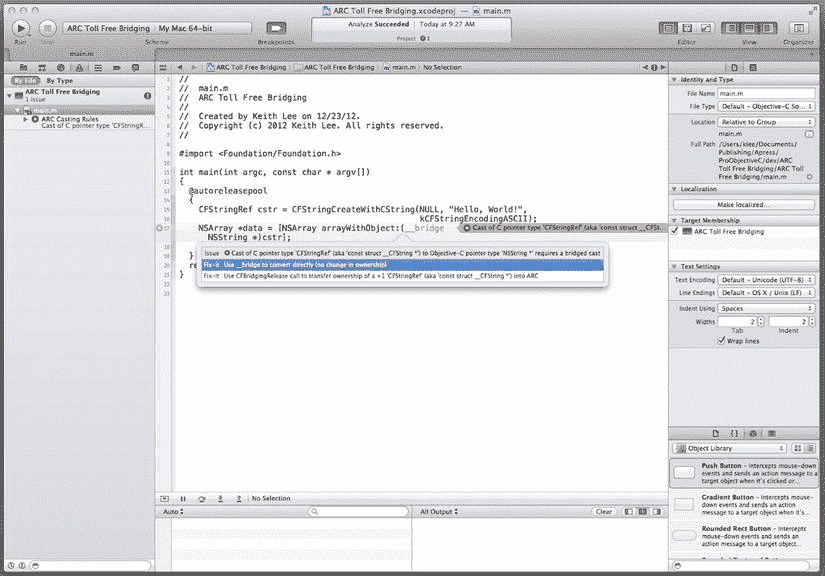

`Figure 6-6.` 免费桥接编译错误

Xcode 弹出的消息建议你使用`__bridge`注解更新代码以进行桥接转换。如果你进行此更新，代码现在可以编译并运行。但是，存在一个潜在的问题。你能猜到是什么吗？好吧，如果你分析此程序（通过从 Xcode 的 Product 菜单中选择 **Analyze**），`cstr`变量中存储的对象存在潜在的内存泄漏（参见`Figure 6-7`）。

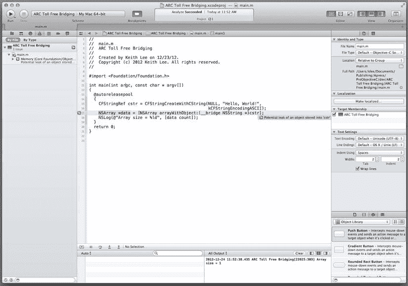

`Figure 6-7.` 桥接转换潜在内存泄漏

出现此问题是因为`__bridge`注解不会转移免费桥接对象的所有权；因此，你的代码必须以编程方式管理`cstr`指向的对象的生命周期。因为你的代码创建了`CFStringRef`，所以它拥有这个动态创建的对象，并且可以向其发送 release 消息，例如：

```
CFRelease(cstr);
```

这将消除潜在的内存泄漏。然而，一个更好的解决方案（可以避免以编程方式管理该对象的生命周期）是使用`__bridge_transfer`注解。这会将对象的所有权转移给 ARC，然后 ARC 将自动管理该对象的生命周期。

```
NSArray *data = [NSArray arrayWithObject:(__bridge_transfer NSString *)cstr];
```

如果你在此更改后再次分析程序，则不会检测到内存泄漏。很酷。现在让我们创建另一个示例。这个示例将 Foundation 框架对象转换为 Core Foundation 数据类型。添加`Listing 6-14`中所示的代码。

`*Listing 6-14.*  `  隐式免费桥接

```
// Now cast a Foundation framework object to a Core Foundation type
NSString *greeting = [[NSString alloc] initWithFormat:@"%@",
                      @"Hello, World!"];
CFStringRef cstr1 = (__bridge CFStringRef)(greeting);
printf("String length = %ld", CFStringGetLength(cstr1));
```


这段代码创建了一个基础框架（Foundation Framework）的 `NSString` 实例，并使用 `__bridge` 注解将其转换为 Core Foundation 的 `CFStringRef`。该代码可以编译并运行，但由于执行桥接转换时 ARC 会立即向 `NSString` 对象（存储在变量 `greeting` 中）发送一条 `release` 消息，因此存在潜在的悬垂指针问题。要解决这个问题，请将转换注解改为 `__bridge_retained`。这样可以将对象的所有权从 ARC 转移出来，从而阻止 ARC 向该对象发送 `release` 消息。现在，您必须以编程方式管理该对象（已转换为 `CFStringRef`）的生命周期。在 `printf` 语句之后添加一个 `CFRelease` 函数调用。

```
CFRelease(cstr1);
```

如果您现在分析该程序，将检测不到任何潜在的内存泄漏。当您编译并运行该程序时，将看到如图 6-8 所示的输出。

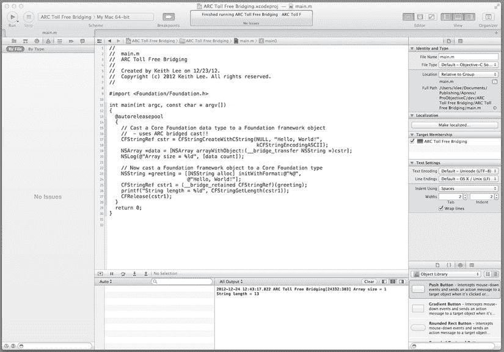

图 6-8. 指向 Core Foundation 类型和 Foundation 框架对象的桥接转换

太棒了！现在您已经很好地掌握了无桥接技术和 ARC 桥接转换的使用。请随意尝试其他无桥接类型，以便在 ARC 下熟悉这项技术。

## 总结

本节专家章节探讨了围绕 ARC 内存管理的一些更精细的细节。由于 ARC 是所有新 Objective-C 项目推荐的内存管理方法，因此充分理解如何使用这项技术至关重要。在本章中，您专注于 ARC 对象所有权、`block` 对象和无桥接技术的细节。回顾一下，以下是关键要点：

- ARC 禁止在对象上使用 `release`、`autorelease`、`dealloc` 或相关消息的编程方式。当您的代码执行以下任何操作时，即放弃对某个对象的所有权：1) 变量重新赋值，2) `nil` 赋值，或 3) 其所有者被释放。
- 当指向动态创建对象的变量被更改为指向另一个对象时，会发生变量重新赋值。此时，该对象失去一个所有者；在编译时，ARC 会插入代码以向此对象发送一条 `release` 消息。
- 当当前指向动态创建对象的变量的值被设置为 `nil` 时，会发生 `nil` 赋值。此时，该对象失去一个所有者。在编译时，ARC 会插入代码以向此对象发送一条 release 消息。
- 所有者释放发生在集合类实例上。当一个集合类实例被释放时，ARC 会自动向集合中的每个对象发送一条 release 消息。
- Apple 包含众多软件库（即框架和服务），这些库提供了为 OS X 和 iOS 平台编写软件所需的接口。这些库的大多数 API 是用 ANSI C 编写的，因此这些库可以在您的 Objective-C 程序中使用。基于 C 语言 API 的 Apple 软件库不与 ARC 集成；因此，在使用这些基于 C 语言的 API 动态分配内存时，您的代码负责以编程方式执行内存管理。
- 使用 ARC 时，禁止在 Objective-C 对象的指针与其他类型（例如属于 Apple 基于 C 语言 API 的类型）的指针之间执行标准转换。Apple 提供了多种机制（无桥接技术和 ARC 桥接转换）来促进在 Objective-C 程序中使用基于 C 语言的 API。
- 无桥接技术适用于 Core Foundation 和 Foundation 框架中的多种数据类型，使您的代码能够将相同的数据类型用作 Core Foundation 函数调用的参数或 Objective-C 消息的接收者。您可以将一种类型转换为另一种类型以抑制编译器警告。在 ARC 内存管理下，您不能直接转换无桥接类型；它们必须前缀有特殊的 ARC 桥接转换注解。
- ARC 桥接转换使得在使用 ARC 时可以使用无桥接类型。这些转换操作以特殊注解 `__bridge`、`__bridge_retained` 和 `__bridge_transfer` 开头。

好了，第一部分真是一段相当长的旅程！您已经学习了 Objective-C 语言的许多基础知识。请花时间回顾一下您在过去的六章中学到的所有内容，因为扎实掌握这些材料是精通 Objective-C 编程的关键。接下来是第二部分，您将探索 Objective-C 运行时。当您准备好时，请翻页，让我们开始吧！

# 第 7 章：运行时系统

Objective-C 拥有大量的*动态特性*，这些特性和行为是在运行时执行的，而不是在代码编译或链接时。这些特性由 Objective-C 运行时系统实现，并为该语言提供了许多强大和灵活性。它们可用于促进程序的实时开发和更新，无需重新编译和重新部署软件，并且随着时间的推移，对现有软件的影响极小或没有影响。

理解 Objective-C 运行时的工作原理将帮助您更深入地了解这门语言以及您的程序是如何运行的。在本章中，您将详细探讨该语言的动态特性，并演示如何在程序中使用它们。

## 动态特性


# 排版后的内容

在运行时，Objective-C 语言会执行许多常见行为——如类型确定和方法解析——这些行为在其他语言中（如果支持的话）通常是在程序编译或链接期间完成的。它还提供了 API，使您能够执行其他运行时操作，例如对象内省以及代码的动态创建和加载。这些特性是通过 Objective-C 运行时的架构和实现而实现的。在接下来的几个小节中，您将更详细地研究这些特性，并了解如何在您的程序中使用它们。

## 对象消息传递

在面向对象编程术语中，*消息传递*是一种用于在对象之间发送和接收消息的通信方式。Objective-C 的消息传递（例如，对象消息传递）用于调用类和类实例（即对象）上的方法。图 7-1 中的示例展示了向对象/类发送消息的语法。

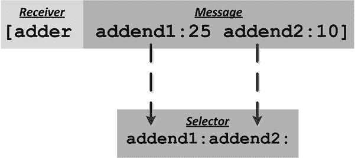

图 7-1. Objective-C 消息传递

在图 7-1 所示的消息传递表达式中，*接收者*（adder）是消息的目标（即对象或类），而消息本身（`addend1:25 addend2:10`）由*选择器*以及任何相应的输入参数组成。

对象消息传递是作为一种动态特性实现的——消息接收者的实际类型以及要在接收者上调用的相应方法是在运行时确定的（参见图 7-2）。

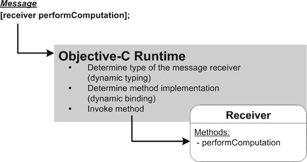

图 7-2. Objective-C 对象消息传递

图 7-2 描述了 Objective-C 运行时如何通过动态类型和动态绑定来实现消息到方法调用的映射，您稍后将仔细研究这两者。对象消息传递凭借其动态编程特性提供了极大的灵活性。除了简化编程接口之外，这些能力还使得开发可在程序执行期间进行修改和/或更新的模块化应用程序成为可能。

由于 Objective-C 方法调用是在运行时解析的，因此动态绑定会带来一定的开销。Objective-C 运行时系统会缓存方法调用——将消息到方法的关联保存在内存中——以减少这种开销。

方法调用在运行时解析的另一个后果是，不能保证接收者能够响应消息。如果无法响应，则会引发运行时异常。Objective-C 语言提供了几个特性（例如，对象内省和消息转发），可用于缓解这种情况。

总结如下，以下是 Objective-C 对象消息传递的关键要素：

*   *消息*：一个名称（选择器）和一组发送给对象/类的参数。
*   *方法*：一个 Objective-C 类或实例方法，它具有特定的声明，包括名称、输入参数、返回值和方法签名（输入参数和返回值的数据类型）。
*   *方法绑定*：接收发送给特定接收者的消息、查找并执行相应方法的过程。Objective-C 运行时对消息到方法调用执行动态绑定。

您可能对方法、接收者和消息已经相当熟悉了，因为您已在本书中反复讨论过这些术语，但选择器和方法签名呢？让我们在接下来的段落中探讨这些内容。

## 选择器

在 Objective-C 对象消息传递中，*选择器*是一个引用方法的文本字符串，可以发送给一个对象或一个类。Objective-C 运行时使用选择器来为目标对象/类检索正确的方法实现。选择器表示为一个分段文本字符串，每个段落的末尾带有一个冒号，该冒号后跟一个参数：

```
nameSegment1:nameSegment2:nameSegment3:
```

这个选择器有三个段落，每个段落后跟一个冒号，这表明相应的消息有三个输入参数。消息的参数数量与其选择器中的段落数量相对应。如果消息没有参数，则选择器有一个段落但不带冒号。代码清单 7-1 展示了一些有效选择器的示例。

*代码清单 7-1.*  有效的选择器示例

```
description
description:
setValue:
sumAddend1:addend2:
sumAddend1::
```

在 Objective-C 源代码中，消息选择器直接映射到一个或多个类/实例方法声明。代码清单 7-2 展示了一个包含单个实例方法声明的类接口。

*代码清单 7-2.*  计算器类接口

```
@interface Calculator : NSObject
- (int) sumAddend1:(NSInteger)a1 addend2:(NSInteger)a2;
@end
```

代码清单 7-2 中所示的`Calculator`类实例方法的选择器是`sumAddend1:addend2:`。如果一个`Calculator`对象被实例化并赋值给一个名为`myCalculator`的变量，则使用接收者对象（`myCalculator`）后跟带有所需输入参数的选择器来调用此实例方法，例如：

```
[myCalculator sumAddend1:25 addend2:10];
```

好了，这一切都很好。这些示例展示了选择器在对象消息传递中的作用，但您可能仍然想知道这一切是如何运作的。您可能猜到了：Objective-C 运行时！当您的源代码被编译时，编译器（运行时的一个组件）会创建支持接收者类/对象和消息选择器到方法实现的动态映射的数据结构和函数调用。当您的代码被执行时，运行时库（运行时的另一个组件）会利用这些信息来查找并调用相应的方法。在本章后面，您将详细了解 Objective-C 运行时的组件。

## 空选择器段

如果您在上一个小节中真正留意了，您可能会注意到代码清单 7-1 中的一个选择器看起来与其他选择器略有不同；那就是示例`sumAddend1::`。对于这个选择器，第一个名称段有一个文本字符串（`sumAddend1`），但第二个名称段却没有！实际上，具有多个参数的方法声明可以有空参数名称；因此，具有多个段的选择器可以包含*空选择器段*（即没有名称的段）。代码清单 7-3 扩展了`Calculator`类接口，添加了一个包含空段的实例方法。

*代码清单 7-3.*  带有空选择器段的实例方法

```
@interface Calculator : NSObject
- (int) sumAddend1:(NSInteger)a1 addend2:(NSInteger)a2;
- (int) sumAddend1:(NSInteger)a1 :(NSInteger)a2;
@end
```

可以使用以下表达式调用此实例方法：

```
[myCalculator sumAddend1:25 :10]
```


与任何消息传递表达式一样，每个选择器名称段后面都跟着一个参数。在包含一个或多个空段的选择器中，名称段虽然不提供，但参数仍然必须存在，因此前面的示例中出现了消息 `sumAddend1:25 :10`。通常情况下，你不会看到很多带空参数名（即空选择器段）的方法声明，因为用于调用此类方法的对象消息中的一个拼写错误，很容易导致难以调试的错误。

## SEL 类型

到目前为止，你将选择器定义为消息传递表达式中消息的一部分文本字符串；现在，你将深入了解选择器类型。*选择器类型*（`SEL`）是一种特殊的 Objective-C 类型，它表示一个唯一标识符，在源代码编译时会替换选择器的值。所有具有相同选择器值的方法都拥有相同的 `SEL` 标识符。Objective-C 运行时系统确保每个选择器标识符都是唯一的。可以使用 `@selector` 关键字创建 `SEL` 类型的变量。

```
SEL myMethod = @selector(myMethod);
```

那么，为什么要创建 `SEL` 变量呢？实际上，Objective-C 运行时系统（通过 `NSObject`）包含许多方法，这些方法将 `SEL` 类型的变量作为参数用于动态方法。除了获取对象和类的信息外，`NSObject` 还提供了几种方法，用于通过选择器参数调用对象上的方法。下面的示例使用了 `NSObject` 实例方法 `performSelector:withObject:withObject:` 来调用由选择器变量指定的方法。

```
[myCalculator performSelector:@selector(sumAddend1::) withObject:[NSNumber numberWithInteger:25]
                         withObject:[NSNumber numberWithInteger:10]];
```

`@selector` 指令会在编译时创建一个选择器变量。你也可以在运行时使用 Foundation 框架中的 `NSSelectorFromString` 函数创建选择器。在这种情况下，前面的示例更新如下：

```
 SEL selector = NSSelectorFromString(@"sumAddend1::");
 [myCalculator performSelector:selector withObject:[NSNumber numberWithInteger:25]
                         withObject:[NSNumber numberWithInteger:10]];
```

## 方法签名

现在你已经了解了消息接收者、选择器和 `SEL` 类型，接下来让我们看看方法签名及其在对象消息传递中的作用。*方法签名*定义了方法输入参数的数据类型及其返回结果（如果有）。你可能会想：好吧，这都挺好，但这对向对象发送消息有什么重要性呢？要理解这一点，我们花点时间讨论一下运行时系统实现对象消息传递的一些内部机制。

**注意** 在下一章中，你将深入研究运行时系统的细节，以及其动态行为（如对象消息传递）是如何实现的。在本章中，你将重点放在运行时系统架构上，而不是其实现细节上。

编译器将形式为 `[receiver message]` 的对象消息转换为一个（ANSI）C 函数调用，该调用的声明包含方法签名。因此，为了生成正确的对象消息传递代码，编译器需要知道选择器值和方法签名。选择器很容易从对象消息表达式中提取出来，但编译器如何确定方法签名呢？毕竟，消息可能包含输入参数，但除非在运行时确定接收者（以及相应的方法），否则你无法知道这些类型如何映射到实际要调用的方法。好吧，为了确定正确的方法签名，编译器会根据其迄今解析过的声明中能看到的方法进行猜测。如果找不到，或者它看到的声明与实际在运行时执行的方法之间存在不匹配，则可能发生方法签名不匹配，从而导致从编译器警告到运行时错误的各种问题。

为了演示可能导致方法签名不匹配的场景，假设你的程序使用了三个类，其接口如清单 7-4 所示。

*清单 7-4.* 计算器类方法

```
@interface Calculator1 : NSObject
- (int) sumAddend1:(NSInteger)a1 addend2:(NSInteger)a2;
@end

@interface Calculator2 : NSObject
- (float) sumAddend1:(float)a1 addend2:(float)a2;
@end

@interface Calculator3 : NSObject
- (NSInteger) sumAddend1:(NSInteger)a1 addend2:(NSInteger)a2;
@end
```

那么，当你的代码发送消息 `[receiver sumAddend1:25 addend2:10]`，而接收者的类型是 `id` 时，会发生什么？根据你的代码导入的接口以及接收者的运行时类型（使用清单 7-4，接收者可以是 `Calculator1`、`Calculator2` 或 `Calculator3` 类型），可能会发生方法签名不匹配。这种情况会导致各种错误，例如堆栈溢出、无效的方法输入或无效的返回结果。

这个例子说明了方法签名不匹配的危险性。为了避免这种情况，最好尽量确保具有不同签名的方法也具有不同的名称。

## 使用对象消息传递

现在，你将创建一个示例程序来说明选择器和 `SEL` 类型的使用。在 Xcode 中，通过从 Xcode 文件菜单中选择 **新建**  **项目...** 来创建一个新项目。在 **新建项目助手** 窗格中，创建一个命令行应用程序（从 OS X 应用程序选择中选择 **命令行工具**），然后点击 **下一步**。在 **项目选项** 窗口中，将产品名称指定为 **Calculator**，将项目类型选择为 **Foundation**，通过勾选 **使用自动引用计数** 复选框选择 ARC 内存管理，然后点击 **下一步**。

在文件系统中指定项目创建的位置（如果需要，选择 **新建文件夹** 并输入文件夹的名称和位置），取消勾选 **源代码控制** 复选框，然后点击 **创建** 按钮。

接下来，你将创建一个 `Calculator` 类。将类添加到项目中。从 Xcode 文件菜单中选择 **新建**  **文件...**，选择 **Objective-C** 类模板，将类命名为 **Calculator**（在“子类化自”下拉列表中，选择 **NSObject**），选择 **Calculator** 文件夹作为文件位置，选择 **Calculator** 项目作为目标，然后点击 **创建** 按钮。

至此，你已经完成了程序文件的创建，现在开始实现代码。在导航器窗格中选择 **Calculator.h** 文件，然后添加如清单 7-5 所示的代码。

*清单 7-5.* Calculator 类接口

```
#import <Foundation/Foundation.h>

@interface Calculator : NSObject
```


```objc
- (NSNumber *) sumAddend1:(NSNumber *)adder1 addend2:(NSNumber *)adder2;
- (NSNumber *) sumAddend1:(NSNumber *)adder1 :(NSNumber *)adder2;

@end
```

`Calculator` 类添加了两个实例方法：`sumAddend1:addend2:` 和 `sumAddend1::`。每个方法都接受两个类型为 `NSNumber *` 的输入参数，并返回一个 `NSNumber *` 类型的值。另请注意，第二个方法的第二个参数使用空参数名。现在选择 `Calculator.m` 文件并实现 `Calculator` 类，如代码清单 7-6 所示。

*代码清单 7-6.* Calculator 类的实现

```objc
#import "Calculator.h"

@implementation Calculator

- (NSNumber *) sumAddend1:(NSNumber *)adder1 addend2:(NSNumber *)adder2
{
  NSLog(@"Invoking method on %@ object with selector %@", [self className],
        NSStringFromSelector(_cmd));
  return [NSNumber numberWithInteger:([adder1 integerValue] +
                                      [adder2 integerValue])];
}

- (NSNumber *) sumAddend1:(NSNumber *)adder1 :(NSNumber *)adder2
{
  NSLog(@"Invoking method on %@ object with selector %@", [self className],
        NSStringFromSelector(_cmd));
  return [NSNumber numberWithInteger:([adder1 integerValue] +
                                      [adder2 integerValue])];
}

@end
```

每个方法都简单返回两个输入参数之和。这些方法还会在控制台记录（接收器）对象的类名和一个选择器文本字符串。此字符串通过使用 Foundation 函数 `NSStringFromSelector` 获得。

```
NSStringFromSelector(_cmd)
```

该函数的输入参数是一个 `SEL` 类型的变量。那么这个 `_cmd` 参数是什么，它从何而来？实际上，`_cmd` 是一个隐式参数（在每个 Objective-C 方法的实现中可用，但未在其接口中声明），它保存了正在发送的消息的选择器。因此，表达式 `NSStringFromSelector(_cmd)` 会返回正在调用的方法的选择器文本字符串。

你已经实现了 `Calculator` 类，现在让我们实现 `main()` 函数。在导航窗格中选择 `main.m` 文件，然后更新 `main()` 函数，如代码清单 7-7 所示。

*代码清单 7-7.* Calculator 的 `main()` 函数实现

```objc
#import <Foundation/Foundation.h>
#import "Calculator.h"

int main(int argc, const char * argv[])
{
  @autoreleasepool
  {
    Calculator *calc = [[Calculator alloc] init];
    NSNumber *addend1 = [NSNumber numberWithInteger:25];
    NSNumber *addend2 = [NSNumber numberWithInteger:10];
    NSNumber *addend3 = [NSNumber numberWithInteger:15];
    NSLog(@"Sum of %@ + %@ = %@", addend1, addend2,
          [calc sumAddend1:addend1 addend2:addend2]);
    NSLog(@"Sum of %@ + %@ = %@", addend1, addend3,
          [calc sumAddend1:addend1 :addend3]);
  }
  return 0;
}
```

`main()` 函数创建一个 `Calculator` 对象并使用它对两个数字进行加法运算，然后将结果记录到输出窗格。当你编译并运行程序时，输出应如图 7-3 所示。

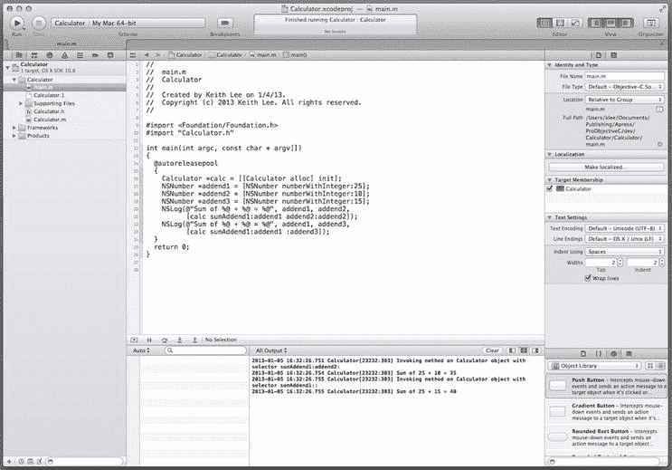

图 7-3. Calculator 程序

现在让我们添加代码，在对象上调用动态方法。你将使用 `NSObject` 的实例方法 `performSelector:withObject:withObject:`，它需要一个选择器输入参数。更新 `main()` 函数，如代码清单 7-8 所示。

*代码清单 7-8.* 使用 `performSelector:` 方法的 `main()` 函数

```objc
#import <Foundation/Foundation.h>
#import "Calculator.h"

int main(int argc, const char * argv[])
{
  @autoreleasepool
  {
    Calculator *calc = [[Calculator alloc] init];
    NSNumber *addend1 = [NSNumber numberWithInteger:25];
    NSNumber *addend2 = [NSNumber numberWithInteger:10];
    NSNumber *addend3 = [NSNumber numberWithInteger:15];

    SEL selector1 = @selector(sumAddend1:addend2:);
    id sum1 = [calc performSelector:selector1 withObject:addend1
               withObject:addend2];
    NSLog(@"Sum of %@ + %@ = %@", addend1, addend2, sum1);

    SEL selector2 = NSSelectorFromString(@"sumAddend1::");
    id sum2 = [calc performSelector:selector2 withObject:addend1
               withObject:addend3];
    NSLog(@"Sum of %@ + %@ = %@", addend1, addend3, sum2);
  }
  return 0;
}
```

代码为每个实例方法创建一个选择器，然后使用 `NSObject performSelector:withObject:withObject:` 方法计算两个数字的和。第一个选择器使用 `@selector` 指令创建，因此在编译时创建。第二个选择器在运行时使用 Foundation 函数 `NSSelectorFromString` 创建。方法调用的结果被记录到输出窗格。好的，这看起来一切正常——但等一下，现在编译程序时，你会在 `main()` 函数中看到几个警告（参见图 7-4）。

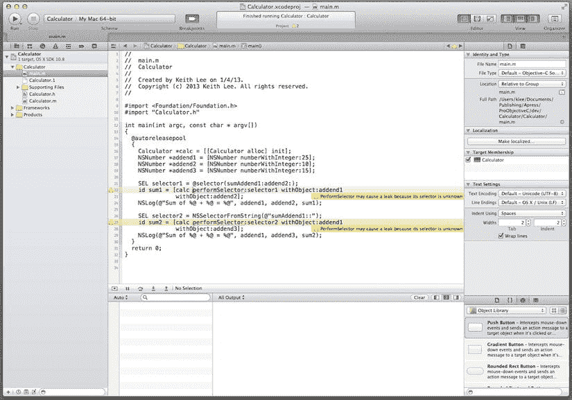

图 7-4. Calculator 程序选择器警告

此警告 *PerformSelector may cause a leak because its selector is unknown*（PerformSelector 可能导致泄漏，因为其选择器未知）的产生原因是：如果找不到与选择器匹配的方法，该方法将抛出异常，可能导致内存泄漏。你可以通过向代码添加 pragma 指令来消除此警告（在代码清单 7-9 中以粗体显示）。

*代码清单 7-9.* 用于处理 `performSelector:` 警告的 Pragma 指令

```objc
#pragma clang diagnostic push
#pragma clang diagnostic ignored "-Warc-performSelector-leaks"
    SEL selector1 = @selector(sumAddend1:addend2:);
    id sum1 = [calc performSelector:selector1 withObject:addend1
               withObject:addend2];
    NSLog(@"Sum of %@ + %@ = %@", addend1, addend2, sum1);

    SEL selector2 = NSSelectorFromString(@"sumAddend1::");
    id sum2 = [calc performSelector:selector2 withObject:addend1
               withObject:addend3];
    NSLog(@"Sum of %@ + %@ = %@", addend1, addend3, sum2);
#pragma clang diagnostic pop
```

pragma 指令 `clang diagnostic ignored` 用于禁用特定的编译器警告。该指令的语法为：

```
#pragma clang diagnostic ignored "DiagnosticName"
```

诊断名称用双引号括起来。在此例中，诊断 `-Warc-performSelector-leaks` 禁用了在调用 `performSelector:withObject:withObject:` 方法时可能发生内存泄漏的编译器警告。`pragma clang diagnostic push` 和 `pragma clang diagnostic pop` 指令用于保存和恢复当前的编译器诊断设置。这确保了编译器在编译源文件的其余部分时，会继续使用其常规编译选项。现在编译并运行程序时，你应该会看到预期的输出，且没有编译器警告（参见图 7-5）。

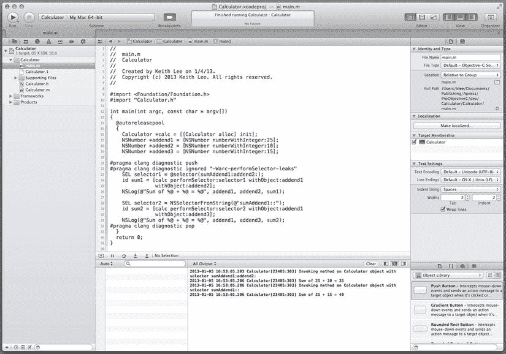

图 7-5. 使用 `performSelector` 的 Calculator 程序

干得好。既然你已经详细了解了对象消息传递、选择器和方法签名，接下来让我们研究运行时的其他动态特性。

## 动态类型


## 动态类型

`动态类型`使得运行时能够在执行期间确定对象的类型，从而让运行时因素决定代码中应使用何种对象。当无法预先确定需要赋值给变量的对象类型时（例如向方法传递参数），这一特性尤为有用。Objective-C 同时支持静态类型和动态类型。当变量被静态类型化时，其类型在变量声明时即被指定。例如，以下声明语句表明变量 `myAtom` 是一个指向 `Atom` 类型对象的指针。

```
Atom *myAtom;
```

采用静态类型时，编译器可在编译时执行类型检查，从而在程序执行前检测类型错误。而采用动态类型时，类型检查则在运行时执行。Objective-C 通过 `id` 数据类型为动态类型提供支持。`id` 类型是 Objective-C 特有的类型，它可以容纳指向任意类型 Objective-C 对象的指针，无论该对象属于哪个类。以下声明语句表明变量 `myAtom` 是一个指向 `id` 类型对象的指针。

```
id *myAtom;
```

因此，变量 `myAtom` 实际上可以指向 `Atom`、`Hydrogen` 等类型的对象——变量的实际类型在运行时决定。动态类型允许在运行时确定对象之间的关联关系，而不是强制将其编码在静态设计中。这使得编写一个能处理任意类对象的单一方法变得更加容易，而无需为应用程序中的每个类分别编写不同的方法。例如，以下实例方法声明使用了动态类型，从而使得单个输入参数可以是来自任意类的对象。

```
- (NSInteger) computeValue:(id)parameter;
```

动态类型可用于简化类接口，因为无需为每种可能的输入参数类型创建不同的方法声明。动态类型还赋予了更大的灵活性，因为程序使用的类型可以在执行过程中演变，并且可以在无需重新编译或重新部署的情况下引入新类型。由于 Objective-C 同时支持静态类型和动态类型，你可以为方法声明提供不同层次的类型信息；例如，修改前面的方法声明以指定输入参数可以是符合 `NSDecimalNumberBehaviors` 协议的任意类型的对象。

```
- (NSInteger) computeValue:(id<NSDecimalNumberBehaviors>)parameter;
```

接下来，修改方法声明以指定输入参数是一个指向 `NSNumber` 类型对象的指针。

```
- (NSInteger) computeValue:(NSNumber *)parameter;
```

最后，进一步优化方法声明，指定输入参数是一个指向符合 `NSDecimalNumberBehaviors` 协议的 `NSNumber` 类型对象的指针。

```
- (NSInteger) computeValue:(NSNumber<NSDecimalNumberBehaviors> *)parameter;
```

Objective-C 还提供了运行时对象自省（例如，询问一个动态类型化、匿名的对象其所属类）的 API，以部分弥补静态类型检查的缺失。自省使运行时能够验证对象的类型，从而确认其是否适用于特定操作。你将在本章后面学习对象自省的相关内容。

### 动态绑定

`动态绑定`是在运行时（而非编译时）将消息映射到方法的过程。实际上，消息和接收消息的对象直到程序运行并发送消息时才能确定。由于相同的方法可能被多个（接收者）对象实现，因此实际调用的方法可以动态变化。动态绑定因此实现了面向对象编程的多态性。动态绑定允许新对象和代码与系统接口或添加到系统中，而不会影响现有代码，从而降低了对象间的耦合度。它还通过消除处理多选场景（通常使用 `switch` 语句实现）的条件逻辑需求，降低了程序复杂度。动态绑定意味着需要使用动态类型。在以下代码片段中，类型为 `id` 的变量 `atom` 被发送了 `logInfo` 消息。

```
id atom = [[Hydrogen alloc] initWithNeutrons:1];
[atom logInfo];
```

当这段代码执行时，运行时通过动态类型确定变量 `atom` 的实际类型，然后使用消息选择器（`logInfo`）将消息映射到接收者对象 `atom` 的对应实例方法实现。在此例中，变量 `atom` 解析为类型 `Hydrogen *`，因此运行时查找 `Hydrogen` 的实例方法 `logInfo`。如果未找到，则在其超类中查找对应的实例方法。运行时继续在类层次结构中搜索，直到找到该实例方法（参见图 7-6）。

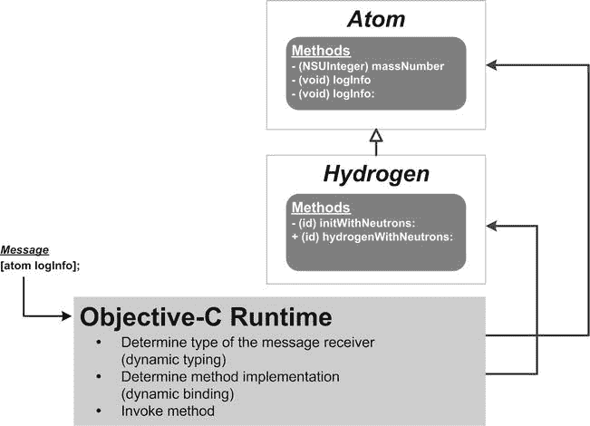

图 7-6。 Objective-C 动态绑定

动态绑定是 Objective-C 的固有特性，无需任何特殊 API。动态绑定甚至允许发送的消息（消息*选择器*）是一个在运行时确定的变量。

### 动态方法解析

`动态方法解析`使你能够动态提供方法的实现。Objective-C 包含 `@dynamic` 指令，用于告知编译器与属性相关联的方法将动态提供。Apple Core Data 框架利用 `@dynamic` 指令为托管对象类生成高效的属性访问方法和关系访问方法。

`NSObject` 类包含了 `resolveInstanceMethod:` 和 `resolveClassMethod:` 方法，分别用于动态地为实例方法和类方法提供给定选择器的实现。你可以重写其中一个或两个方法，以动态实现实例/类方法。在下一节中，你将通过编写代码动态解析方法选择器的实现，学习如何使用这些方法。

### 动态提供方法实现

现在，你将通过更新 Calculator 程序来动态提供方法的实现，以此演示动态方法解析。启动 Xcode（如果尚未启动），然后从 Xcode 的文件菜单中选择 **Open Recent**  **Calculator.xcodeproj** 打开 Calculator 项目。首先，更新 `Calculator` 类的实现。在导航器窗格中选择 `Calculator.m` 文件，然后通过重写 `resolveInstanceMethod:` 类方法更新 `Calculator` 实现，如代码清单 7-10 所示。

*代码清单 7-10.* Calculator 类动态方法

```
#import <objc/runtime.h>
...
+ (BOOL) resolveInstanceMethod:(SEL)aSEL
{
  NSString *method = NSStringFromSelector(aSEL);

if ([method hasPrefix:@"absoluteValue"])
  {
    class_addMethod([self class], aSEL, (IMP)absoluteValue, "@@:@");
    NSLog(@"已动态添加实例方法 %@ 到类 %@", method,
          [self className]);
    return YES;
  }
  return [super resolveInstanceMethod:aSEL];
}
```


在表 7-10 中，运行时库的导入指令被添加到类实现中（`#import <objc/runtime.h>`）；这会将运行时系统 API 添加到你的代码中。在`resolveInstanceMethod:`类方法中，运行时 API`class_addMethod()`用于将函数作为实例方法动态添加到类中。该函数接收以下输入参数：要添加方法的类、新方法的`selector`、函数的地址，以及描述方法参数类型的一个字符数组。从表 7-10 中可以看出，作为实例方法添加的函数被称为`absoluteValue`；它接收`id`作为输入参数，并返回`id`作为结果。现在，将`absoluteValue()`函数添加到`Calculator`类实现中。请添加表 7-11 中所示的代码。

*表 7-11.* `Calculator`类动态方法

```
id absoluteValue(id self, SEL _cmd, id value)
{
  NSInteger intVal = [value integerValue];
  if (intVal < 0)
  {
    return [NSNumber numberWithInteger:(intVal * -1)];
  }
  return value;
}
```

注意，函数的输入参数包含隐式参数`self`和`_cmd`；`self`是接收方对象，`_cmd`是该方法的`selector`。

现在更新`main()`函数以测试动态方法解析。从导航面板中选择 **main.m** 文件，并更新函数，如表 7-12 所示。

*表 7-12.* 带有动态方法的`Calculator`类`main()`函数

```
#import <Foundation/Foundation.h>
#import "Calculator.h"

int main(int argc, const char * argv[])
{
  @autoreleasepool
  {
    Calculator *calc = [[Calculator alloc] init];
    NSNumber *addend1 = [NSNumber numberWithInteger:-25];
    NSNumber *addend2 = [NSNumber numberWithInteger:10];
    NSNumber *addend3 = [NSNumber numberWithInteger:15];

#pragma clang diagnostic push
#pragma clang diagnostic ignored "-Warc-performSelector-leaks"
    SEL selector1 = @selector(sumAddend1:addend2:);
    id sum1 = [calc performSelector:selector1 withObject:addend1
               withObject:addend2];
    NSLog(@"Sum of %@ + %@ = %@", addend1, addend2, sum1);

SEL selector2 = NSSelectorFromString(@"sumAddend1::");
    id sum2 = [calc performSelector:selector2 withObject:addend1
               withObject:addend3];
    NSLog(@"Sum of %@ + %@ = %@", addend1, addend3, sum2);

SEL selector3 = NSSelectorFromString(@"absoluteValue:");
    NSLog(@"Invoking instance method %@ on object of class %@",
          NSStringFromSelector(selector3), [calc className]);
    id sum3 = [calc performSelector:selector3 withObject:sum2];
    NSLog(@"Absolute value of %@ = %@", sum2, sum3);
#pragma clang diagnostic pop
  }
  return 0;
}
```

该代码动态地创建了新方法的`selector`，然后使用该`selector`调用实例方法。动态解析会将方法添加到运行时并调用它，返回其结果。结果随后会显示在输出面板中。现在，保存、编译并运行更新后的`Calculator`程序，并观察输出面板中的消息（参见图 7-7）。

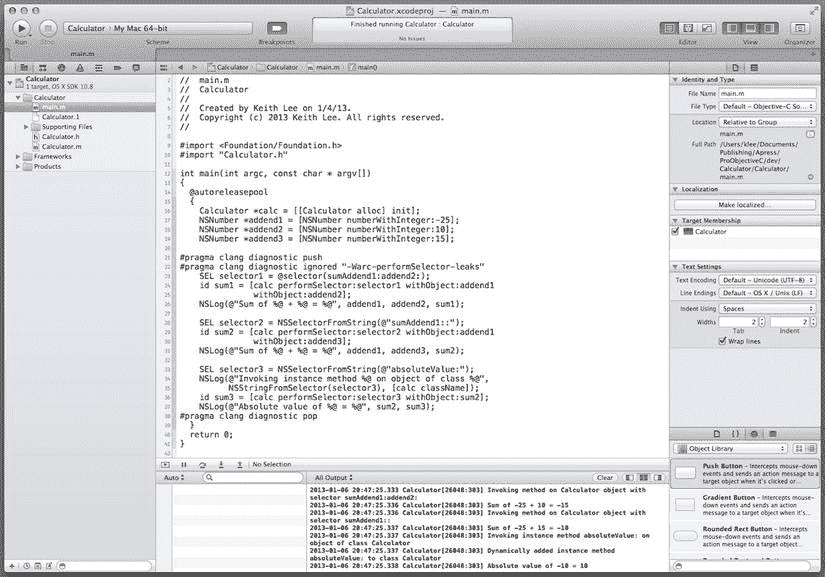

图 7-7 Objective-C 动态方法解析

正如你在输出面板中观察到的，当使用`selector` `absoluteValue:`的消息通过`performSelector:withObject:`方法被动态调用时，新方法`absoluteValue:`由 Objective-C 运行时添加到了`Calculator`类中。如本例所示，动态方法解析可用于在运行时向类添加方法。

### 动态加载

*动态加载*使得 Objective-C 程序能够在需要时加载可执行代码和资源，而不是在应用程序启动时加载所有程序组件。可执行代码（在加载前已链接）可以包含新类，这些新类会集成到程序的运行时映像中。这种程序代码和资源的*懒加载*通过对系统提出更低的内存需求，改善了整体性能。同时这也增强了程序的可扩展性，因为可以在不修改现有程序的情况下动态添加新软件。Apple 提供了`bundle`机制来支持 iOS 和 OS X 平台上的软件动态加载。

`bundle`是一种软件交付机制。它由一个具有标准化层级结构的目录组成，其中包含可执行代码以及该代码使用的资源。一个`bundle`可以包含可执行代码、图片、声音文件或任何其他类型的代码或资源。它还包括一个名为信息属性列表（`Info.plist`）的运行时配置文件。`bundle`定义了组织与软件相关的代码和资源的基本结构；它们有几种类型：

*   *应用程序`bundle`*：应用程序`bundle`管理与进程（例如，一个程序）相关的代码和资源。
*   *框架`bundle`*：框架`bundle`管理动态共享库及其相关资源，例如头文件。应用程序可以链接一个或多个框架，例如`Foundation`框架。
*   *可加载`bundle`*：可加载`bundle`（也称为插件）是一种`bundle`类型，应用程序可以使用它动态加载自定义代码。

`Foundation`框架的`NSBundle`类可用于管理`bundle`。一个`NSBundle`对象代表文件系统中一个对可在程序中使用的代码和资源进行分组的路径。表 7-13 使用`NSBundle`对象动态加载应用程序信息属性列表的路径，该列表名为`Info.plist`。

*表 7-13.* 动态加载属性列表文件

```
NSBundle *bundle = [NSBundle mainBundle];
NSString *bundlePath = [bundle pathForResource:@"Info" ofType:@"plist"];
```

如前所述，`bundle`可用于动态加载可执行代码。表 7-14 使用`NSBundle`对象动态加载一个框架`bundle`，然后创建该框架中一个类的实例。

*表 7-14.* 动态加载框架对象

```
NSBundle *testBundle = [NSBundle bundleWithPath:@"/Test.bundle"];
id tester = [[[bundle classNamed:@"Tester"] alloc] init];
```

## 内省

`Foundation`框架的`NSObject` API 中包含许多用于执行对象内省的方法。这些方法会动态查询运行时，以获取以下类型的信息：

*   方法相关信息
*   测试对象的继承关系、行为及协议一致性

由于 Objective-C 将其许多行为推迟到运行时（而不是编译或链接时）处理，因此对象内省是一项关键能力，可以帮助你避免运行时错误，例如消息分发错误、对对象相等性的错误假设以及其他问题。

下面这条语句使用`NSObject isKindOfClass:`方法测试消息的接收者是否是`Calculator`类的实例，或是继承自`Calculator`类的任何类的实例。

```
BOOL isCalculator = [myObject isKindOfClass: [Calculator class]];
```

下一条语句检查一个对象是否能响应某个`selector`；也就是说，它是否实现或继承了能够响应指定消息的方法。

```
BOOL responds = [myObject respondsToSelector:@selector(sumAddend1::)];
```

下一条语句检查一个对象是否符合给定的协议。

```
BOOL conforms = [myObject conformsToProtocol:@protocol(MyProtocol)];
```


以下语句用于获取某个选择器的方法签名。

```
NSMethodSignature *signature = [myObject methodSignatureForSelector:@selector(sumAddend1::)];
```

这只是用于执行对象内省的 `NSObject` 方法的一个示例。在本书的第 3 部分，你将更详细地了解 `NSObject` API。

### 小结

在本章中，你详细研究了 Objective-C 运行时的特性，并回顾了运行时系统架构的关键组件。以下是关键要点总结：

- Objective-C 消息传递（例如，对象消息传递）用于在类和对象上调用方法。对象消息传递是一种动态特性——消息接收者的实际类型以及在接收者上调用的相应方法是在运行时确定的。
- 消息传递表达式由接收者（消息的目标对象/类）和消息本身组成。消息由选择器以及所有相应的输入参数组成。
- 选择器表示为被分割成多个段的文本字符串，每个段末尾紧跟一个冒号，表示该段后跟有一个参数。具有多个段的选择器可以有空的选择器段（即没有名称的段）。
- 选择器类型 (`SEL`) 是一种特殊的 Objective-C 类型，它表示一个唯一标识符，在源代码编译时会替换选择器的值。可以使用 `@selector` 关键字或 Foundation 框架函数 `NSSelectorFromString()` 创建 `SEL` 类型的变量。
- 方法签名定义了方法输入参数的数据类型及其返回结果（如果有）。方法签名不匹配——当编译器无法确定对象消息的适当方法，或者其看到的声明与运行时实际执行的方法之间存在不匹配时——可能导致从编译器警告到运行时错误等各种问题。为避免这种情况，最好尽量确保具有不同签名的方法也具有不同的名称。
- 动态类型使运行时能在运行时确定对象的类型，从而允许运行时因素决定代码中应使用哪种类型的对象。Objective-C 通过 `id` 数据类型提供对动态类型的支持。
- 动态绑定是在运行时（而非编译时）将消息映射到方法的过程。动态绑定实现了面向对象编程的多态性，并允许在不影响现有代码的情况下与系统交互或向系统添加新对象和代码，从而降低对象之间的耦合度。
- 动态方法解析允许你动态提供方法的实现。Objective-C 包含 `@dynamic` 指令，该指令告知编译器与属性关联的方法将动态提供。`NSObject` 类包含方法 `resolveInstanceMethod:` 和 `resolveClassMethod:`，分别用于为实例方法和类方法动态提供给定选择器的实现。
- 动态加载允许 Objective-C 程序在需要时加载可执行代码和资源，而无需在应用程序启动时加载所有程序组件。Apple 提供了 Bundle 机制来支持 iOS 和 OS X 平台上的软件动态加载。Foundation 框架的 `NSBundle` 类可用于管理 Bundle。`NSBundle` 对象代表文件系统中的一个位置，该位置对可在程序中使用的代码和资源进行分组。
- Foundation 框架的 `NSObject` API 包含许多用于执行对象内省的方法。这些 API 动态查询运行时以获取有关方法的信息。它们还执行对象继承、行为和一致性测试。

现在你已经了解了运行时系统的特性以及如何在程序中使用它们，接下来让我们检查运行时系统的架构和实现。准备好后，请翻到下一页开始学习！

# 第 8 章：运行时架构

运行时系统是 Objective-C 平台的关键元素。它实现了语言的动态特性和面向对象能力。其结构使你能够在不了解运行时内部机制的情况下开发 Objective-C 代码，同时也提供了公共 API，使你能够编写代码直接调用运行时服务。

在上一章中，你回顾了 Objective-C 的动态特性；在本章中，你将探索运行时系统的架构和设计，以及它如何实现这些特性。你将识别运行时的主要组件，检查关键实现细节，然后查看你的代码如何在编译时和程序执行期间与运行时交互。到本章结束时，你将彻底理解运行时系统在 Objective-C 语言中的功能。

## 运行时组件

Objective-C 运行时系统有两个主要组件：编译器和运行时库。让我们用放大镜仔细检查它们，看看它们是如何用于实现运行时系统的。

### 编译器

在第 5 章中，你简要回顾了 Objective-C 源代码编译的一般过程。如图 5-1 所示，编译过程接收输入的 Objective-C 源文件，并经过多个阶段（包括词法分析、语法分析、代码生成与优化、汇编和链接操作），最终生成构成可执行程序的输出二进制文件。

正如 C 标准库为 C 编程语言提供标准 API 和实现一样，运行时库为 Objective-C 的面向对象特性提供了标准 API 和实现。该库在链接阶段被链接到所有 Objective-C 程序。编译器的工作是接收输入的源代码，并生成使用运行时库的代码，以产生一个有效的、可执行的 Objective-C 程序。

Objective-C 语言的面向对象元素和动态特性都由运行时系统实现。这包括以下内容：

- 类元素（接口、实现、协议、类别、方法、属性、实例变量）
- 类实例（对象）
- 对象消息传递（包括动态类型和绑定）
- 动态方法解析
- 动态加载
- 对象内省

总之，当编译器解析使用这些语言元素和特性的 Objective-C 源代码时，它会生成包含适当运行时库数据结构和函数调用的代码，以实现语言指定的行为。为了阐明这是如何工作的，让我们看几个示例，这些示例演示了编译器如何为 Objective-C 类和对象生成代码，以及它如何执行对象消息传递。

### 对象消息传递代码生成

当编译器解析对象消息（一个消息发送表达式），例如

```
[receiver message]
```

比如，它会生成调用运行时库函数 `objc_msgSend()` 的代码。该函数接收消息的接收者和选择器，以及消息中传递的任何参数作为输入参数。因此，编译器将源代码中的每个消息传递表达式（即形式为 `[receiver message]`）转换为对运行时库消息传递函数 `objc_msgSend(...)` 的调用，并将所有提供的参数传递给该调用。每条消息都是动态解析的，这意味着消息接收者类型和要调用的实际方法实现是在运行时确定的。对于源代码中的每个类和对象，编译器会构建执行对象消息传递所需的数据结构。


### 类与对象的代码生成

当编译器解析包含类定义和对象的 Objective-C 代码时，会生成对应的运行时数据结构。一个 Objective-C 类对应一个运行时库中的 `Class` 数据类型。根据 Apple 运行时参考文档，`Class` 数据类型是指向一个标识符为 `objc_class` 的不透明类型的指针。

```
typedef struct objc_class *Class;
```

*不透明数据类型* 是指在其接口中定义不完整的 C 语言 `struct` 类型。不透明类型提供了一种数据隐藏的形式，因为它们的变量只能通过专门为其设计的函数来访问。运行时库函数用于访问 `Class`（即 `objc_class`）数据类型的变量。

正如 Objective-C 类拥有运行时数据类型一样，Objective-C 对象也拥有对应的运行时数据类型。当编译器解析对象的 Objective-C 代码时，会生成创建运行时对象类型的代码。在代码清单 8-1 中定义的这一数据类型，是一个标识符为 `objc_object` 的 C 语言 `struct`。

*代码清单 8-1.* `objc_object` 数据类型

```
struct objc_object
{
  Class isa;
  /* ...可变长度数据，包含实例变量的值...  */
};
```

当你创建一个对象时，会为 `objc_object` 类型分配内存，该类型由一个 `isa` 指针以及紧随其后的对象实例变量数据组成。

请注意，与 `Class` 数据类型类似，`objc_object` 类型包含一个名为 `isa` 的 `Class` 类型变量；换句话说，就是一个指向 `objc_class` 类型变量的指针。实际上，所有 Objective-C 对象和类的运行时数据类型都以一个 `isa` 指针开头。例如，Objective-C 中 `id` 类型在运行时的等价物是一个定义为指向 `objc_object` 指针的 C 语言 `struct`。

*代码清单 8-2.* `id` 类型定义

```
typedef struct objc_object
{
  Class isa;
} *id;
```

换句话说，`id` 仅仅是一个指向标识符为 `objc_object` 的 C 语言 `struct` 的指针。Objective-C 块对象的运行时数据结构遵循同样的约定，从而使它们也能够被运行时系统正确管理。

### 查看运行时数据结构

在进一步探讨这些概念之前，让我们创建一个示例，让你了解 Objective-C 对象和类如何映射到之前讨论的运行时数据结构。在 Xcode 中，通过从 Xcode 的 **File** 菜单中选择 **New**  **Project …** 来创建一个新项目。在 **New Project Assistant** 窗格中，创建一个命令行应用程序（从 Mac OS X 应用程序选项中选择 **Command Line Tool**），然后点击 **Next**。在 **Project Options** 窗口中，将产品名称指定为 **Runspector**，选择 **Foundation** 作为项目类型，通过勾选 **Use Automatic Reference Counting** 复选框选择 ARC 内存管理，然后点击 **Next**。

在文件系统中指定你想要创建项目的位置（如有必要，选择 **New Folder** 并输入文件夹的名称和位置），取消勾选 **Source Control** 复选框，然后点击 **Create** 按钮。

现在让我们来实现代码。在导航窗格中选择 **main.m** 文件，然后添加代码清单 8-3 中所示的代码。

*代码清单 8-3.* Runspector `main.m` 文件

```
#import <Foundation/Foundation.h>
#import <objc/runtime.h>

// 测试类 1
@interface TestClass1 : NSObject { @public int myInt; }
@end
@implementation TestClass1
@end

int main(int argc, const char * argv[])
{
  @autoreleasepool
  {
    // 创建一个类的几个实例并显示其数据
    TestClass1 *tc1A = [[TestClass1 alloc] init];
    tc1A->myInt = 0xa5a5a5a5;
    TestClass1 *tc1B = [[TestClass1 alloc] init];
    tc1B->myInt = 0xc3c3c3c3;
    long tc1Size = class_getInstanceSize([TestClass1 class]);
    NSData *obj1Data = [NSData dataWithBytes:(__bridge const void *)(tc1A)
                                     length:tc1Size];
    NSData *obj2Data = [NSData dataWithBytes:(__bridge const void *)(tc1B)
                                      length:tc1Size];
    NSLog(@"TestClass1 对象 tc1 包含 %@", obj1Data);
    NSLog(@"TestClass1 对象 tc2 包含 %@", obj2Data);
    NSLog(@"TestClass1 内存地址 = %p", [TestClass1 class]);
  }
  return 0;
}
```

好的，我们来回顾一下这段代码。在 `main.m` 文件的开头，注意导入语句

```
#import <objc/runtime.h>
```

这条语句是为了在文件中包含运行时库的 API。在导入语句之后，代码定义了类 `TestClass1`。这个简单的类没有方法，只有一个公有的实例变量。在 `main()` 函数中，创建并初始化了两个 `TestClass1` 对象，并为每个对象的实例变量赋值。对象创建后，使用 Foundation 框架的 `NSData` 类来获取每个对象的数据（以字节为单位）。运行时库函数 `class_getInstanceSize()` 用于获取类实例的大小（以字节为单位）。数据检索完成后，使用 Foundation 框架的 `NSLog` 函数将其显示在输出窗格中。当你编译并运行程序时，应该会看到类似于图 8-1 所示的输出。

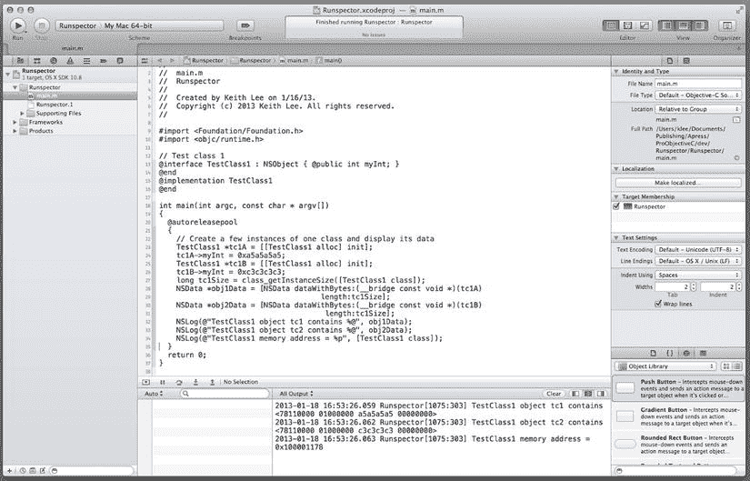

图 8-1. Runspector 程序，对象检查

在输出窗格中，`TestClass1` 对象包含代码清单 8-4 中的数据。

*代码清单 8-4.* Runspector 程序输出的 TestClass1

```
TestClass1 对象 tc1 包含 <78110000 01000000 a5a5a5a5 00000000>
TestClass1 对象 tc2 包含 <78110000 01000000 c3c3c3c3 00000000>
TestClass1 内存地址 = 0x100001178
```

让我们来分析这些数据。在代码清单 8-2 中已经表明，当编译器解析一个对象时，会生成一个 `objc_object` 类型的实例，其内容包含一个 `isa` 指针和该对象实例变量的值。因此，查看程序的输出（参见代码清单 8-4），`TestClass1` 对象 1 (`tc1`) 的数据包含两个项目：一个 `isa` 指针（`78110000 01000000`）和分配给其实例变量的值（`a5a5a5a5 00000000`）。类似地，`TestClass1` 对象 2 (`tc2`) 的数据包含一个 `isa` 指针（`78110000 01000000`）和分配给其实例变量的值（`c3c3c3c3 00000000`）。请注意，对象 `objc_object` 数据结构中的第一项就是它的 `isa` 指针。同时还要注意，两个实例的 `isa` 指针是相同的。这正如预期，因为它们是同一个类的实例，因此应具有相同的指针值。现在，一个 `isa` 指针指向一个类在内存中的地址，如代码清单 8-4 的最后一行所示。

```
TestClass1 内存地址 = 0x100001178
```


您可能在想：“这个内存地址与`isa`指针显示的值不一样！”实际上是一样的：运行此程序的 Mac Pro 计算机采用*小端序*，这意味着它反转了内存中存储的字节顺序。因此，`isa`指针显示的地址字节序（`0x78110000 01`）与实际内存地址的字节序是相反的。好吧，希望这一切开始变得清晰了。我们继续深入。通过添加代码清单 8-5 中的代码来更新`main()`函数。

*代码清单 8-5.*  Runspector 程序`main()`函数，类数据类型

```
// Retrieve and display the data for the TestClass1 class object
id testClz = objc_getClass("TestClass1");
long tcSize = class_getInstanceSize([testClz class]);
NSData *tcData = [NSData dataWithBytes:(__bridge const void *)(testClz)
                                 length:tcSize];
NSLog(@"TestClass1 class contains %@", tcData);
NSLog(@"TestClass1 superclass memory address = %p", [TestClass1 superclass]);
```

在代码清单 8-5 中，你添加了代码来检索并显示`TestClass1`类对象的数据字节。运行时函数`objc_getClass()`用于获取`TestClass1`类，然后通过`NSData`实例和`NSLog`函数显示其数据。代码还显示了`TestClass1`超类的内存地址。当你编译并运行程序时，应该会看到类似图 8-2 所示的输出。

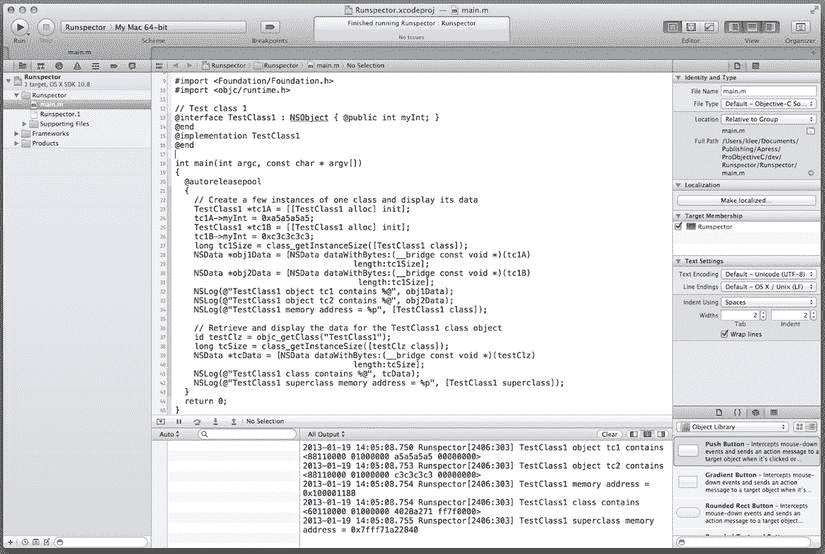

*图 8-2.*  Runspector 程序，对象和类检查

输出窗格显示代码清单 8-6 中的结果。

*代码清单 8-6.*  Runspector 程序的 TestClass1 输出

```
TestClass1 object tc1 contains <88110000 01000000 a5a5a5a5 00000000>
TestClass1 object tc2 contains <88110000 01000000 c3c3c3c3 00000000>
TestClass1 memory address = 0x100001188
TestClass class contains <60110000 01000000 4028a271 ff7f0000>
TestClass1 superclass memory address = 0x7fff71a22840
```

`TestClass1`对象的数据与你之前观察到的一致——每个对象都包含一个`isa`指针以及赋值给其实例变量的值。`TestClass1`类对象的数据由一个`isa`指针（`60110000 01000000`）和另一个值（`4028a271 ff7f0000`）组成。这个额外的值实际上是指向对象超类的指针。之前你了解到类的数据结构有一个`isa`指针（参考代码清单 8-1），因此这个结果也与预期值一致。列出的超类内存地址确认了你在类对象数据中看到的内容。

好了，你现在应该对编译器在 Objective-C 运行时中的角色有了很好的理解。你还实现了一个程序，使用了一些运行时 API 来检查编译器生成的数据结构。干得漂亮！现在让我们继续学习运行时库，并研究它的一些实现细节。

## 运行时库

Apple 的 Objective-C 运行时库实现了 Objective-C 语言的面向对象特性和动态属性。在大多数情况下，运行时库在后台运行，但它也包含一个公共 API，可以直接在你的代码中使用。

这个 API 是用 C 语言表达的，由一组函数、数据类型和语言常量组成。你在上一节中了解了一些关键的运行时数据类型（例如`objc_object`、`objc_class`），并使用了一些这些函数。总的来说，运行时库的数据类型可以分组如下：

*   类定义数据结构（`class`、`method`、`ivar`、`category`、`IMP`、`SEL`等）
*   实例数据类型（`id`、`objc_object`、`objc_super`）
*   值（`BOOL`）

函数属于以下类别：

*   对象消息传递
*   类函数
*   实例函数
*   协议函数
*   方法函数
*   属性函数
*   选择子函数

运行时库还定义了多个布尔常量（`YES`、`NO`）和空值（`NULL`、`nil`、`Nil`）。

运行时库的公共 API 在头文件`runtime.h`中声明。Apple 的运行时库可以在`http://opensource.apple.com`上查阅。它结合了多种设计元素和系统服务，以提供出色的性能和可扩展性，满足 Objective-C 语言随时间的演变。在本章后面，你将了解运行时库实现的元素。现在，让我们通过开发一个使用这些 API 的程序来获得一些实践经验。

## 使用运行时库 API 创建类

现在你将创建一个程序，使用运行时 API 动态创建类。在 Xcode 中，通过从 Xcode 文件菜单中选择**新建**  **项目…** 来创建一个新项目。在**新项目助手**窗格中，创建一个命令行应用程序（从 Mac OS X 应用程序选择中选择**命令行工具**），然后点击**下一步**。在**项目选项**窗口中，指定产品名称为**DynaClass**，选择项目类型为**Foundation**，通过勾选**使用自动引用计数**复选框来选择 ARC 内存管理，然后点击**下一步**。

在文件系统中指定你想要创建项目的位置（如有必要，选择**新建文件夹**并输入文件夹的名称和位置），取消勾选**源代码管理**复选框，然后点击**创建**按钮。

好了，现在让我们实现代码。在导航器窗格中选择**main.m**文件，然后添加代码清单 8-7 中显示的代码。

*代码清单 8-7.*  DynaClass 项目的 main.m 文件

```
#import <Foundation/Foundation.h>
#import <objc/runtime.h>
#import <objc/message.h>

NSString *greeting(id self, SEL _cmd)
{
  return [NSString  stringWithFormat: @"Hello, World!"];
}

int main(int argc, const char * argv[])
{
  @autoreleasepool
  {
    // Dynamically create a class
    Class dynaClass = objc_allocateClassPair([NSObject class], "DynaClass", 0);

// Dynamically add a method, use existing method (description) to retrieve signature
    Method description = class_getInstanceMethod([NSObject class], @selector(description));
    const char *types = method_getTypeEncoding(description);
    class_addMethod(dynaClass, @selector(greeting), (IMP)greeting, types);

// Register the class
    objc_registerClassPair(dynaClass);

// Now use the class - create an instance and send it a message
    id dynaObj = [[dynaClass alloc] init];
    NSLog(@"%@", objc_msgSend(dynaObj, NSSelectorFromString(@"greeting")));

}
  return 0;
}
```

注意文件顶部的这个额外导入语句：

```
#import <objc/message.h>
```


本声明要求将运行时库消息传递 API（例如`objc_msgSend()`）包含在文件中。紧随导入语句之后，代码定义了返回简单问候语的`greeting()`函数。该函数将用于动态添加到类中的方法实现。`main()`函数包含使用运行时 API 创建新类的逻辑：创建类对（类及其元类），为其添加一个指向先前定义的`greeting()`函数的方法，然后在运行时中注册该类对，从而使您能够创建该类的实例。请注意，方法签名是通过使用具有相同签名的`NSObject`描述方法获取的。接下来的几行代码创建该类的实例并向其发送消息，方法调用的输出将记录到输出面板。编译并运行程序时，您应看到类似图 8-3 所示的输出。

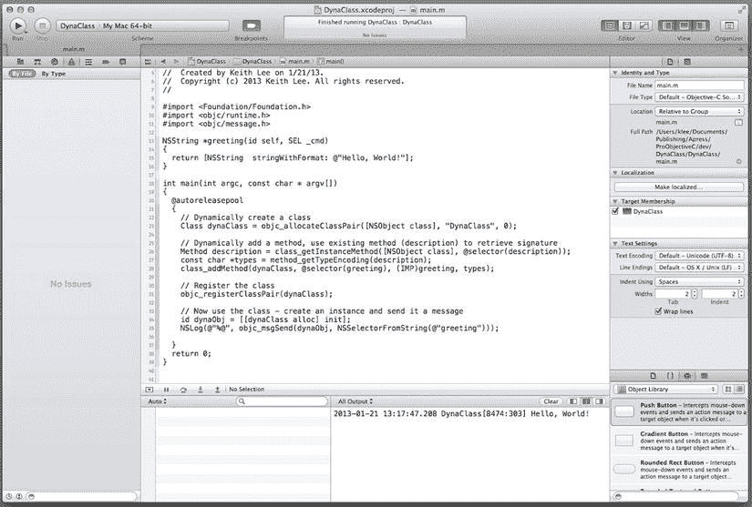

图 8-3. DynaClass 程序，动态类创建

干得漂亮！您现在已完成运行时 API 及其用法的概述。请参阅 Apple 运行时参考以获取这些 API 的完整定义。现在让我们探讨运行时库的一些设计与实现细节。

## 实现运行时对象消息传递

运行时库提供了访问以下信息的函数（函数名称在括号中标识）：

*   对象的类定义（`objc_getClass`）
*   类的超类（`class_getSuperclass`）
*   对象的元类定义（`objc_getMetaClass`）
*   类的名称（`class_getName`）
*   类的版本信息（`class_getVersion`）
*   类的大小（以字节为单位）（`class_getInstanceSize`）
*   类的实例变量列表（`class_copyIvarList`）
*   类的方法列表（`class_copyMethodList`）
*   类的协议列表（`class_copyProtocolList`）
*   类的属性列表（`class_copyProperyList`）

综上所述，运行时数据类型和函数为运行时库提供了实现各种 Objective-C 特性所需的信息，例如对象消息传递（参见图 8-4）。

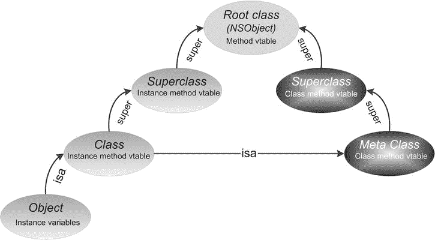

图 8-4. 运行时系统消息传递操作

当您向对象发送消息时，运行时通过利用类方法缓存及其 vtable 的自定义代码来查找类的实例方法。它会搜索整个类层次结构以查找对应方法，找到后跳转到方法实现。运行时库包含多种实现对象消息传递的设计机制。您将了解其中几种，从 vtable 开始。

## 通过 vtable 进行方法查找

运行时库定义了一个方法数据类型（`objc_method`），如代码清单 8-7 所示。

*代码清单 8-7.* 运行时库方法数据类型

```
struct objc_method
{
  SEL method_name;
  char * method_types;
  IMP method_imp;
};
typedef objc_method Method;
```

`method_name`是`SEL`类型的变量，用于描述方法名称；`method_types`描述方法参数的数据类型；`method_imp`是`IMP`类型的变量，提供方法被选中调用时所调用函数的地址（回想一下，Objective-C 方法实际上是 C 函数，至少接受两个参数：`self`和`_cmd`）。由于方法调用在程序执行过程中可能发生数百万次，运行时系统需要一种快速高效的方法查找和调用机制。**vtable**（也称为**调度表**）是编程语言中常用的一种支持动态绑定的机制。Objective-C 运行时库实现了一种自定义的 vtable 调度机制，旨在最大化性能和灵活性。**vtable**是一个`IMP`（Objective-C 方法实现）数组。每个运行时`Class`实例（`objc_class`）都包含一个指向 vtable 的指针。

每个`Class`实例还包含一个指向最近使用过的方法的缓存指针。这为方法调用提供了性能优化。运行时库实现的方法查找逻辑如图 8-5 所示。

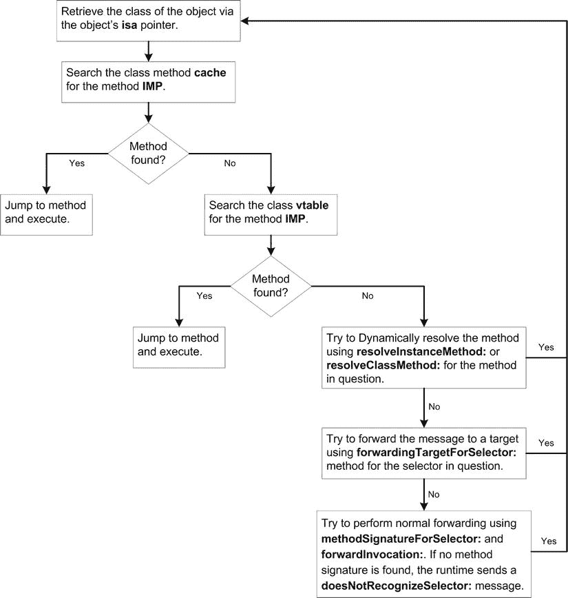

图 8-5. 运行时库方法查找

在图 8-5 中，运行时库首先在缓存中搜索方法`IMP`（指向方法实现起始位置的指针）。如果未找到，则在 vtable 中查找方法`IMP`，如果找到，则将`IMP`存储在缓存中以供将来查找。这种设计使运行时能够执行快速高效的方法查找。

## 通过 dyld 共享缓存进行选择器唯一化

Objective-C 程序的启动开销与**选择器唯一化**所需的时间成正比。每个选择器名称在可执行程序中必须是唯一的，然而，您的自定义类和程序中的每个共享库都包含它们自己的选择器名称副本，其中许多可能是重复的（例如`alloc`、`init`等）。运行时需要为每个选择器名称选择一个唯一的规范`SEL`指针值，然后更新每个调用点和方法列表的元数据以使用该唯一值。此过程必须在应用程序启动时执行，并消耗系统资源（内存和程序启动时间）。为了提高此过程的效率，运行时通过使用 dyld 共享缓存执行选择器唯一化。**dyld**是一种定位和加载动态库的系统服务。它包含一个共享缓存，使这些库能够在进程间共享。**dyld 共享缓存**还包含一个选择器表，从而可以从缓存中访问共享库和自定义类的选择器。因此，运行时能够从 dyld 共享缓存中检索共享库的选择器，并且仅需更新应用自定义类的选择器。

## 消息分发


### 消息调用优化

消息调用在 Objective-C 程序中无处不在。仅应用程序启动时，执行对象消息传递的运行时库函数 `objc_msgSend()` 就会被调用数百万次。因此，优化此代码至关重要，因为即使其性能的微小变化也会对整体应用程序性能产生重大影响。此方法必须查找与消息接收者和选择器对应的 `IMP`，然后跳转到该 `IMP` 以开始执行。在前几节中，您已经了解了如何使用方法缓存和虚函数表来检索 `IMP`。一旦完成此操作，运行时会使用汇编语言编写的自定义优化代码来调度方法。此代码有时称为 *trampoline*，它会查找正确的代码并直接跳转到该代码。此 trampoline 代码适用于传递给它的任何参数组合，因为这些参数只是传递给方法 `IMP` 以供读取。为了处理可能的返回值类型，运行时提供了几种不同的 `objc_msgSend()` 实现。

### 访问类实例方法

现在您已经了解了运行时库如何查找（和调用）实例方法，您可能想知道它是如何为类方法执行此操作的（即，为类方法执行对象消息传递）。实际上，每个 Objective-C 类本身也是一个对象，因此它能够接收消息，例如：

```
[NSObject alloc]
```

这就解释了如何向类发送消息，但运行时如何查找和调用类方法呢？实际上，运行时库通过*元类*实现了这种能力。

*元类*是一种特殊类型的类对象，它存储的信息使运行时能够查找和调用 Objective-C 类的类方法。每个 Objective-C 类都有一个唯一的元类，因为每个类可能都有一个唯一的类方法列表。运行时 API 提供了用于访问元类的函数。

与常规类一样，元类也遵循 `Class` 层级结构。就像类通过其 superclass 指针指向父类一样，元类也通过其自身的 superclass 指针指向该类父类的元类（请参考图 8-4）。

基类的元类将其 superclass 设置为基础类本身。这种继承层级结构的结果是，层级结构中的所有实例、类和元类都继承自该层级结构的基类。

对象的 `isa` 变量指向描述该实例的类，因此可用于访问其实例方法、实例变量等。Objective-C 类（对象）的 `isa` 变量指向描述该类（其类方法等）的元类。

综上所述，运行时对实例方法和类方法执行消息传递的方式如下：

- 当您的源代码向对象发送消息时，运行时检索相应的实例方法实现（通过相应的类实例方法虚函数表）并跳转到该方法。
- 当您的源代码向类发送消息时，运行时检索相应的类方法实现（通过其元类类方法虚函数表）并跳转到该方法。

呼，内容真多！如果需要，请花点时间回顾这些概念，等您准备好了，我们将通过一个示例来进一步阐明。

### 检查类方法

现在您将编写一个示例，看看运行时数据结构如何利用元类以及元类在整个类层级结构中的位置。您将通过更新 Runspector 程序（本章前面开发的程序）来检索元类信息来实现这一点。启动 Xcode（如果尚未启动），并通过从 Xcode 文件菜单中选择 **Open Recent**  **Runspector.xcodeproj** 来打开 Runspector 项目。在导航器窗格中选择 **main.m** 文件，然后添加代码清单 8-8 中所示的代码。

*代码清单 8-8.* Runspector 的 main() 函数，元类数据

```
// 检索并显示元类数据
id metaClass = objc_getMetaClass("TestClass1");
long mclzSize = class_getInstanceSize([metaClass class]);
NSData *mclzData = [NSData dataWithBytes:(__bridge const void *)(metaClass)
                                  length:mclzSize];
NSLog(@"TestClass1 元类包含 %@", mclzData);
class_isMetaClass(metaClass) ?
  NSLog(@"类 %s 是一个元类", class_getName(metaClass)) :
  NSLog(@"类 %s 不是一个元类", class_getName(metaClass));
```

这段代码使用运行时函数 `objc_getMetaClass()` 来检索指定类的元类定义，然后显示其关联的数据字节。接下来，代码使用运行时函数 `class_isMetaClass()` 来测试该对象是否为元类，并将相应消息记录到控制台。您可能对桥接转换（`__bridge`）的使用感到疑惑。`NSData dataWithBytes:length:` 方法将类型为 (`const void *`) 的变量作为其第一个参数。您可能还记得第 4 章中提到的，ARC 内存管理禁止直接从 Objective-C 对象和 (`void *`) 类型进行转换。桥接转换（第 6 章中讨论过）使编译器能够管理这些场景。在这种情况下，由于不会发生所有权转移（即分配给变量 `metaClass` 的对象仍将由 ARC 管理），因此使用了 `__bridge` 注解。编译并运行更新后的程序后，您应该会观察到类似于图 8-6 所示的输出。

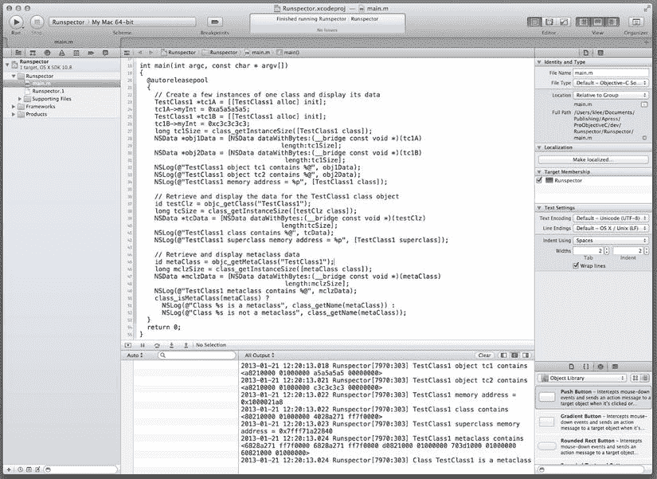

图 8-6. Runspector 程序，元类检查

请注意输出窗格底部的元类信息，如代码清单 8-9 所示。

*代码清单 8-9.* Runspector 程序元类信息

```
TestClass1 元类包含
<6828a271 ff7f0000 6828a271 ff7f0000 d0821000 01000000 703d1000 01000000 60821000 01000000>
类 TestClass1 是一个元类
```

元类数据包含 `isa` 指针、superclass 指针以及其他信息。`TestClass1` 的 superclass 是 `NSObject`。由于该类未定义自定义类方法，其 `isa` 指针也是 `NSObject`。因此，元类的 `isa` 指针和 superclass 指针应该是相同的。代码清单 8-9 显示的结果证实了这一点（每个值均为 `6828a271 ff7f0000`）。

至此，您对运行时库 API 及其实现的回顾就完成了。在下一节中，您将了解可用于直接与运行时系统交互的 Objective-C API。

### 与运行时交互

Objective-C 程序与运行时系统交互以实现该语言的动态特性。在图 8-7 中，这种交互发生在三个层面：

- Objective-C 源代码
- Foundation 框架的 `NSObject` 方法
- 运行时库 API

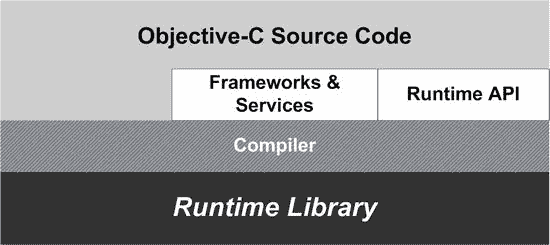

图 8-7. 与运行时系统交互


### 前文回顾

在前文中，你讨论了编译器和运行时库的作用。现在，你将深入探讨 Foundation 框架中 `NSObject` 类的运行时特性。

## NSObject 运行时方法

如本章所述，Objective-C 语言提供了许多动态编程能力。运行时系统提供了一套 API，使你能够直接与运行时进行交互；然而，这些 API 是用 C 语言编写的，因此需要采用过程式编程方法。作为替代方案，Foundation 框架的 `NSObject` 类提供了一组方法，这些方法复制了运行时 API 的大部分功能。由于你的自定义类（以及几乎所有 Cocoa 框架类）都继承自 `NSObject`，你的代码会继承这些方法，从而可以直接使用它们。`NSObject` 运行时方法提供的功能包括：

*   对象内省
*   消息转发
*   动态方法解析
*   动态加载

接下来，你将通过一个使用 `NSObject` 运行时方法执行对象内省的示例来演示这一点。

## 执行对象内省

现在，你将创建一个程序，使用运行时 API 动态创建类。在 Xcode 中，通过从 Xcode 的“文件”菜单中选择**新建**  **项目…** 来创建一个新项目。在“新建项目助手”窗格中，创建一个命令行应用程序（从 Mac OS X 应用程序选项中选择**命令行工具**），然后点击**下一步**。在“项目选项”窗口中，将产品名称指定为 **Introspector**，将项目类型选择为 **Foundation**，通过勾选**使用自动引用计数**复选框来选择 ARC 内存管理，然后点击**下一步**。

在文件系统中指定项目要创建的位置（如有必要，选择**新建文件夹**并输入文件夹的名称和位置），取消勾选**源代码控制**复选框，然后点击**创建**按钮。

现在让我们来实现代码。在导航窗格中选择 **main.m** 文件，然后添加代码清单 8-10 中显示的代码。

*代码清单 8-10.*  Introspector main.m 文件

```
#import <Foundation/Foundation.h>

// 测试类 1
@interface Greeter : NSObject
@property (readwrite, strong) NSString *salutation;
- (NSString *)greeting:(NSString *)recipient;
@end
@implementation Greeter
- (NSString *)greeting:(NSString *)recipient
{
  return [NSString stringWithFormat:@"%@, %@", [self salutation], recipient];
}
@end

int main(int argc, const char * argv[])
{
  @autoreleasepool
  {
    Greeter *greeter = [[Greeter alloc] init];
    [greeter setSalutation:@"Hello"];

if ([greeter respondsToSelector:@selector(greeting:)] &&
        [greeter conformsToProtocol:@protocol(NSObject)])
    {
      id result = [greeter performSelector:@selector(greeting:) withObject:@"Monster!"];
      NSLog(@"%@", result);
    }
  }
  return 0;
}
```

紧接在 `import` 语句之后，代码定义了 `Greeter` 类。这个类定义了一个属性以及一个返回简单问候语的方法。在 `main()` 函数中，你首先创建了一个 `Greeter` 实例并设置了该属性的值。接着，你使用了 `NSObject` 运行时方法来执行对象内省。具体来说，你测试了 `NSObject` 的 `respondsToSelector:` 和 `conformsToProtocol:` 方法。如果这两个条件表达式返回的结果都是 `YES`，则代码会使用 `NSObject` 运行时方法 `performSelector:withObject:` 向 `Greeter` 实例发送一条消息。最后，该方法返回的结果会被记录到输出窗格中。编译并运行程序后，你应该会看到类似于图 8-8 所示的输出。

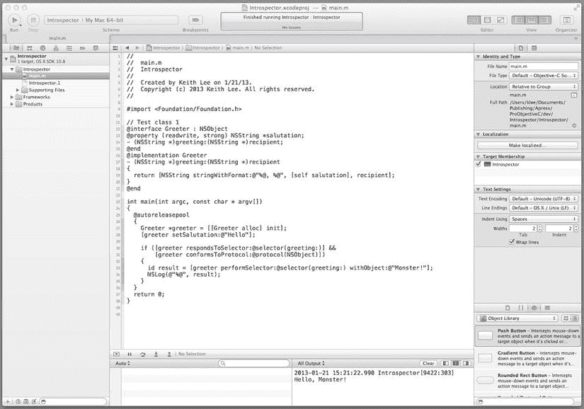

图 8-8.  Introspector 程序输出

`NSObject` 运行时方法的完整列表定义在 `NSObject` 类参考和 `NSObject` 协议参考中。这些内容可以在 Foundation 框架参考指南中找到。

## 总结

在本章中，你详细研究了运行时系统架构的关键组成部分。现在，你应该对运行时系统如何实现该语言的面向对象和动态特性有了很好的理解。回顾一下，以下是关键要点：

*   Objective-C 运行时系统有两个主要组成部分：编译器和运行时库。编译器接收输入的 Objective-C 源代码，并生成由运行时库执行的代码。该库在链接阶段会链接到所有 Objective-C 程序。两者共同实现了该语言的所有面向对象和动态特性。
*   运行时库 API 定义了一组数据类型、函数和常量。其中许多数据类型和函数对应着 Objective-C 语言元素（例如对象、类、协议、方法、实例变量等）。运行时库的公共 API 是用 C 语言表达的。
*   运行时库的实现包含了多种特性和机制，用于增强应用程序的性能和可扩展性。例如方法缓存、虚函数表 (vtable) 以及 `dyld` 共享缓存的使用。
*   运行时库利用元类来查找和调用类方法。元类是一种特殊类型的类对象，它存储了使运行时能够查找并调用 Objective-C 类的类方法所需的信息。
*   Foundation 框架的 `NSObject` 类提供了一组用于调用运行时系统功能和行为的方法。这些方法执行对象内省、动态方法解析、动态加载和消息转发。

至此，你对运行时系统的深入探讨就完成了。请随时回顾你在最后两章中所学的内容，并尝试运行示例程序。理解运行时系统对于精通 Objective-C 程序开发非常重要。

# 第 9 章

## 专家篇：使用运行时 API

在第 7 章和第 8 章中，你学习了 Objective-C 的动态特性以及实现这些特性的运行时系统的设计和架构。在本专家篇章节中，你将通过几个示例程序来完成本书的第二部分，这将使你能够获得更多关于运行时系统特性及其 API 的实践经验。你将使用 `NSInvocation` API 创建一个动态代理，使用 `NSBundle` API 执行自定义框架 bundle 的动态加载，并创建一个广泛使用运行时库 API 的程序。相信我，完成本章之后，你将很好地掌握 Objective-C 运行时系统的复杂之处！

### 使用可加载 Bundle 扩展程序

Objective-C 提供了许多动态编程特性。这些特性增强了语言的能力和灵活性，并使你能够在程序执行期间对其进行修改。在第 7 章中，你讨论了动态加载，并简要描述了如何使用 Foundation 框架的 `NSBundle` 类来管理 bundle。现在，你将创建一个程序，利用这些特性通过可加载 bundle 来扩展正在运行的程序。

## 方法

对于这个示例，你实际上需要开发两个项目。在一个项目中，你将编写使用可加载 bundle 的程序；在另一个项目中，你将创建可加载的 bundle。具体步骤如下：


好的，作为一名高级文档工程师和翻译员，我将严格遵循您提供的注意事项和示例格式，将给定的英文文本翻译成中文。


1.  在项目 1 中，开发一个协议以及一个遵循该协议的类。
2.  在项目 2 中，开发一个可加载的 bundle，其中包含一个遵循此协议的不同类。
3.  在项目 1 中，使用 `NSBundle` 类来查找并加载此 bundle，从 bundle 中的类（步骤 2 中开发的）创建一个对象，然后调用该对象上的一个方法。

听起来很有趣，对吧？好的，让我们开始吧！

## 步骤 1：奠定基础

在 Xcode 中，通过从 Xcode 的“文件”菜单中选择**新建**  **项目…** 来创建一个新项目。在“新建项目助理”窗格中，创建一个命令行应用程序。在“项目选项”窗口中，将 **DynaLoader** 指定为产品名称，选择 **Foundation** 作为项目类型，并通过选中**使用自动引用计数**复选框来选择 ARC 内存管理。在文件系统中指定你想要创建项目的位置（如有需要，选择**新建文件夹**并输入文件夹的名称和位置），取消选中**源代码控制**复选框，然后单击**创建**按钮。

现在，你将创建一个协议和一个遵循该协议的类。你可能还记得第 2 章中提到，协议声明了任何类都可以实现的方法和属性。结合动态类型，这为指定一个从 bundle 动态加载的类所实现的一组方法提供了一种理想的机制。从 Xcode 的“文件”菜单中选择**新建**  **文件…**，选择 **Objective-C** 协议模板，将协议命名为 **Greeter**，选择 **DynaLoader** 文件夹作为文件位置，选择 **DynaLoader** 项目作为目标，然后单击**创建**按钮。一个名为 `Greeter.h` 的头文件已被添加到 Xcode 项目导航器窗格中。点击此文件以显示 `Greeter` 协议（参见列表 9-1）。

*列表 9-1.* Greeter 协议模板文件

```
#import <Foundation/Foundation.h>

@protocol Greeter <NSObject>

@end
```

在编辑器窗格中，按照列表 9-2 所示更新 `Greeter.h` 文件。

*列表 9-2.* Greeter 协议更新

```
#import <Foundation/Foundation.h>

@protocol Greeter <NSObject>

- (NSString *) greeting:(NSString *)salutation;

@end
```

此协议声明了一个名为 `greeting:` 的方法，该方法接受一个 `NSString` 指针作为参数，并返回一个 `NSString` 指针。现在让我们实现一个遵循 `Greeter` 协议的类。从 Xcode 的“文件”菜单中选择**新建**  **文件…**，选择 **Objective-C** 类模板，将类命名为 **BasicGreeter**（在**子类于**下拉列表中选择 **NSObject**），选择 **DynaLoader** 文件夹作为文件位置，选择 **DynaLoader** 项目作为目标，然后单击**创建**按钮。接下来，在 Xcode 项目导航器窗格中，选择生成的头文件 **BasicGreeter.h**，并按照列表 9-3 所示更新接口。

*列表 9-3.* BasicGreeter 接口

```
#import <Foundation/Foundation.h>
#import "Greeter.h"

@interface BasicGreeter : NSObject <Greeter>

@end
```

模板 `BasicGreeter` 接口已更新以采用 `Greeter` 协议；现在选择 `BasicGreeter.m` 文件，并按照列表 9-4 所示更新实现。

*列表 9-4.* BasicGreeter 实现

```
#import "BasicGreeter.h"

@implementation BasicGreeter

- (NSString *) greeting:(NSString *)salutation
{
  return [NSString stringWithFormat:@"%@, World!", salutation];
}

@end
```

`BasicGreeter` 实现定义了 `greeting:` 方法（从而遵循了 `Greeter` 协议），返回一个以方法输入参数开头的文本字符串。现在让我们测试这个类。选择 `main.m` 文件，并按照列表 9-5 所示更新 `main()` 函数。

*列表 9-5.* BasicGreeter main() 函数

```
#import <Foundation/Foundation.h>
#import "BasicGreeter.h"

int main(int argc, const char * argv[])
{
  @autoreleasepool
  {
    id<Greeter> greeter = [[BasicGreeter alloc] init];
    NSLog(@"%@", [greeter greeting:@"Hello"]);
  }
  return 0;
}
```

首先，该函数创建一个 `BasicGreeter` 对象并将其分配给一个名为 `greeter` 的变量。该变量被声明为 `id` 类型并遵循 `Greeter` 协议。然后，它调用该对象上的 `greeting:` 方法，并将结果记录在输出窗格中。通过将变量声明为

```
id<Greeter> greeter
```

它可以被分配给任何遵循 `Greeter` 协议的 Objective-C 对象。如果你现在编译并运行程序，输出窗格将显示“Hello, World!”（参见图 9-1）。

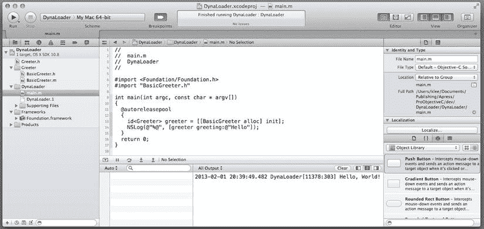

图 9-1. DynaLoader 程序输出

太棒了！你已经完成了步骤 1。现在你将创建另一个遵循 `Greeter` 协议的类，这次将其打包到一个可加载的 bundle 中。

## 步骤 2：创建可加载的 Bundle

Xcode 使得创建可加载的 bundle 变得简单。它只是另一种类型的项目。首先，通过从 Xcode 的“文件”菜单中选择**新建**  **项目…** 来创建一个新项目。在 OS X 下的“新建项目助理”窗格中，选择**框架与库**，然后选择**Bundle**（参见图 9-2）。

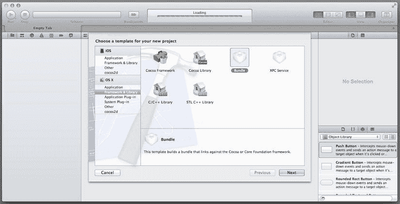

图 9-2. Xcode 新建项目助理，选择 Bundle 项目模板

接下来，在“项目选项”窗口中，将 **CustomGreeter** 指定为产品名称，**组织名称**（可选值），以及**公司标识符**（默认值即可，但任何名称都可以）。选择 **Cocoa** 作为 bundle 将链接的框架，并通过选中**使用自动引用计数**复选框来选择 ARC 内存管理。在文件系统中指定你想要创建项目的位置（如有需要，选择**新建文件夹**并输入文件夹的名称和位置），取消选中**源代码控制**复选框，*不要*添加到任何项目或工作区，然后单击**创建**按钮。将显示图 9-3 所示的工作区窗口。

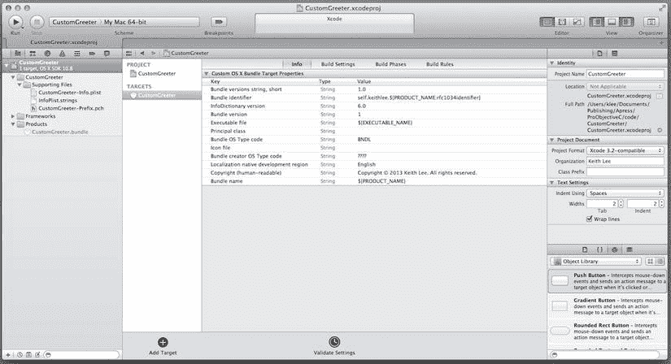

图 9-3. CustomGreeter bundle 模板

真酷。Xcode 创建了一个空的 bundle。在“产品”组下的项目导航器窗格中，注意 `CustomGreeter.bundle` 文件。这是你将添加代码和资源的 bundle。还要注意 `CustomGreeter-Info.plist` 文件。这是一个必需的文件，包含有关 bundle 配置的信息。现在让我们向这个 bundle 添加一个实现 `Greeter` 协议的类。首先，你需要在 bundle 中包含 `Greeter.h` 头文件。幸运的是，Xcode 提供了一种简单的机制来将文件导入项目。按住 Ctrl 键，并（从 Xcode 项目导航器窗格中）选择 **CustomGreeter** 项目。然后会显示一个下拉窗口，其中包含一组选项。选择**将文件添加到“CustomGreeter”…** 选项（参见图 9-4）。

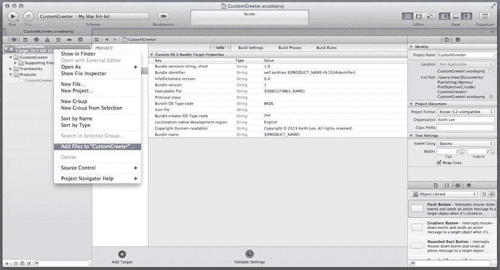

图 9-4. 向 CustomGreeter 选项添加文件


`Greeter.h`文件位于您在步骤 1 中创建的`DynaLoader`项目文件夹下。导航到此项目文件夹，选中该文件，并点击 **Add** 按钮（见图 9-5）将其添加到`CustomGreeter`包中。

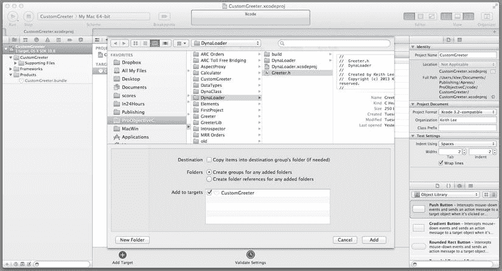

**图 9-5.** 将`Greeter.h`文件添加到`CustomGreeter`包

现在，为这个包添加一个遵循此协议的新类。从 Xcode 的 File 菜单中，选择 **New  File …**，选择 **Objective-C** 类模板，将类命名为 `CustomGreeter`（在 **Subclass of** 下拉列表中选择 `NSObject`），选择 `CustomGreeter` 文件夹作为文件位置，选择 `CustomGreeter` 项目作为目标，然后点击 **Create** 按钮。在 Xcode 的项目导航窗格中，选择生成的头文件 `CustomGreeter.h`，并更新接口，如下面的代码清单 9-6 所示。

**代码清单 9-6.** `CustomGreeter` 接口

```objc
#import <Foundation/Foundation.h>
#import "Greeter.h"

@interface CustomGreeter : NSObject <Greeter>

@end
```

与 `BasicGreeter` 类一样，模板化的 `CustomGreeter` 接口已经更新，以遵行 `Greeter` 协议。现在选择 `CustomGreeter.m` 文件，并更新其实现，如下面的代码清单 9-7 所示。

**代码清单 9-7.** `CustomGreeter` 实现

```objc
#import "CustomGreeter.h"

@implementation CustomGreeter

- (NSString *) greeting:(NSString *)salutation
{
  return [NSString stringWithFormat:@"%@, Universe!", salutation];
}

@end
```

`CustomGreeter` 实现定义了 `greeting:` 方法（因此遵行了 `Greeter` 协议），返回一个以方法输入参数开头的文本字符串。现在，通过从 Xcode 的 Product 菜单中选择 **Build** 来编译这个包。这样就完成了——您创建了一个可加载的包，其中包含一个遵行 `Greeter` 协议的类（`CustomGreeter`）。在 Xcode 的项目导航窗格中，注意 Products 组中的 `CustomGreeter.bundle` 文件。选中这个包文件，并在 Xcode 的文件检查器（Xcode 工作区窗口的右侧）中注意图 9-6 中所示的完整路径。这指示了在使用 `NSBundle` 类加载包时所需的 `CustomGreeter.bundle` 文件的路径。

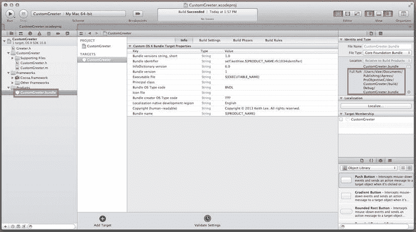

**图 9-6.** `CustomGreeter.bundle` 的完整路径

### 步骤 3：动态加载包

现在您已经创建了一个可加载的包，让我们使用它来动态创建一个对象（来自包中的类）并调用其方法。在 Xcode 中，返回到 `DynaLoader` 项目，在项目导航窗格中选择 `main.m` 文件，并更新 `main()` 函数，如下面的代码清单 9-8 所示。

**代码清单 9-8.** 使用 `NSBundle` 加载包

```objc
#import <Foundation/Foundation.h>
#import "BasicGreeter.h"

int main(int argc, const char * argv[])
{
  @autoreleasepool
  {
    id<Greeter> greeter = [[BasicGreeter alloc] init];
    NSLog(@"%@", [greeter greeting:@"Hello"]);

// Now create a bundle at the specified path (retrieved from input argument)
    NSString *bundlePath;
    if (argc != 2)
    {
      // No bundle path provided, exit
      NSLog(@"Please provide a path for the bundle");
    }
    else
    {
      bundlePath = [NSString stringWithUTF8String:argv[1]];
      NSBundle *greeterBundle = [NSBundle bundleWithPath:bundlePath];
      if (greeterBundle == nil)
      {
        NSLog(@"Bundle not found at path");
      }
      else
      {
        // Dynamically load bundle
        NSError *error;
        BOOL isLoaded = [greeterBundle loadAndReturnError:&error];
        if (!isLoaded)
        {
          NSLog(@"Error = %@", [error localizedDescription]);
        }
        else
        {
          // Bundle loaded, create an object using bundle and send it a message
          Class greeterClass = [greeterBundle classNamed:@"CustomGreeter"];
          greeter = [[greeterClass alloc] init];
          NSLog(@"%@", [greeter greeting:@"Hello"]);

// Done with dynamically loaded bundle, now unload it
          // First release any objects whose class is defined in the bundle!
          greeter = nil;
          BOOL isUnloaded = [greeterBundle unload];
          if (!isUnloaded)
          {
            NSLog(@"Couldn't unload bundle");
          }
        }
      }
    }
  }
  return 0;
}
```

我知道您在这里添加了很多代码，但不用担心。我们将一步一步地讲解。从功能上讲，这些更新实现了以下逻辑：

1.  检索包路径参数
2.  创建 `NSBundle` 对象
3.  加载包
4.  获取包中的类
5.  卸载包
6.  设置包路径参数

接下来，我们依次讨论每部分的代码。

### 检索包路径参数

您可能已经注意到，Objective-C 的 `main()` 函数指定了两个参数：`argc` 和 `argv`。这些参数使您能够在程序执行时向其传递参数。

```objc
int main(int argc, const char * argv[])
```

参数 `argc` 是程序的参数数量，以空格分隔的参数值存储在 `argv` 数组中。`argv` 数组中的第一个参数（`argv[0]`）是程序可执行文件的名称，因此 `argc` 参数的值始终大于或等于一。例如，假设 `DynaLoader` 程序是从命令行执行的，如下所示：

```
> DynaLoader /CustomGreeter.bundle
```

此时，`main()` 函数中的变量 `argc` 将为 2，`argv` 数组将包含两个元素：第一个元素的值为 `DynaLoader`，第二个元素的值为 `/CustomGreeter.bundle`。`main()` 函数已更新，要求将包路径作为输入参数提供给程序。以下来自代码清单 9-8 的代码验证了程序具有正确的参数数量，然后创建了该路径。

```objc
NSString *bundlePath;
if (argc != 2)
{
  // No bundle path provided, exit
  NSLog(@"Please provide a path for the bundle");
}
else
{
  bundlePath = [NSString stringWithUTF8String:argv[1]];
```

条件逻辑（`if (argc != 2)`）检查 `argc` 计数是否为 2（一个用于程序名称，一个用于包路径）。如果计数不等于 2，则向输出面板记录一条消息并退出程序；否则，将路径分配给正确的输入参数（`argv[1]`），程序继续执行。

### 创建 `NSBundle` 对象

下一组语句使用包路径创建了一个 `NSBundle` 对象，并验证该对象是否成功创建。代码使用了一个 `NSBundle` 便利类方法，为指定路径的包创建并初始化类实例。

```objc
+ (NSBundle *) bundleWithPath:(NSString *) fullPath;
```

该代码尝试使用提供的路径创建一个包对象；如果不成功，它会向输出面板记录一条消息。


```objective-c
bundlePath = [NSString stringWithUTF8String:argv[1]];
NSBundle *greeterBundle = [NSBundle bundleWithPath:bundlePath];
if (greeterBundle == nil)
{
  NSLog(@"Bundle not found at path");
}
```

## 加载 Bundle

现在，代码尝试动态加载该 bundle。`NSBundle` 提供了多种方法将 bundle 加载到 Objective-C 运行时中。此处使用的实例方法会加载一个 bundle，如果发生任何错误，则会在参数中存储一个错误对象。

```objective-c
- (BOOL)loadAndReturnError:(NSError **) error;
```

如果 bundle 成功加载或已加载，该方法返回布尔值 `YES`。请注意，该方法采用类型为 `NSError **` 的变量作为其参数；如果 bundle 未成功加载，该方法将返回一个包含错误信息的 `NSError` 对象（在本书后面部分，你将学习如何使用 Foundation 框架中的 `NSError` 类进行错误处理）。代码加载 bundle，并对返回值进行条件检查，如果 bundle 未成功加载，则在输出面板中记录一条错误消息。

```objective-c
NSError *error;
BOOL isLoaded = [greeterBundle loadAndReturnError:&error];
if (!isLoaded)
{
  NSLog(@"Error = %@", [error localizedDescription]);
}
```

## 获取 Bundle 类

接下来，代码获取一个 bundle 类，创建该类的一个实例，并在该对象上调用一个方法，将方法返回的结果记录到输出面板。

```objective-c
Class greeterClass = [greeterBundle principalClass];
greeter = [[greeterClass alloc] init];
NSLog(@"%@", [greeter greeting:@"Hello"]);
```

`NSBundle` 的实例方法 `principalClass` 用于检索 bundle 的主类。主类控制 bundle 中的所有其他类，其类名在 bundle 的 `Info.plist` 文件中指定。如果未指定名称，则 bundle 中第一个加载的类即为主类。由于 `CustomGreeter.bundle` 只包含一个类（`CustomGreeter`），因此该方法加载一个 `CustomGreeter` 类对象。接下来，创建并初始化该类的一个实例。请注意，此实例被分配给先前声明的类型为 `id<Greeter>` 的现有变量 `greeter`。因为 `CustomGreeter` 类也遵循 `Greeter` 协议，所以此赋值是有效的，不会导致编译时或运行时错误。

## 卸载 Bundle

一旦不再需要该 bundle，就可以将其卸载，从而节省系统资源。这是通过 代码清单 9-8 中的以下代码完成的。

```objective-c
greeter = nil;
BOOL isUnloaded = [greeterBundle unload];
if (!isUnloaded)
{
  NSLog(@"Couldn't unload bundle");
}
```

运行时系统要求，在卸载 bundle 之前，必须释放由 bundle 类创建的所有对象；因此将 `greeter` 对象设置为 `nil`。`NSBundle unload` 方法用于卸载先前加载的 bundle。在上述代码中，将测试方法调用返回的结果，以验证 bundle 是否已成功卸载；如果没有，则向控制台记录一条消息。

## 检索 Bundle 路径参数

如前所述，DynaLoader 程序接受一个参数，该参数指定要动态加载的 bundle 的完整路径。因此，在运行程序之前，你必须确定 `CustomGreeter.bundle` 的完整路径，然后以该路径作为输入参数运行程序。在步骤 2 中，你已了解如何查看 `CustomGreeter` bundle 的完整路径（请参阅 图 9-6）。在 Xcode 中，打开 **CustomGreeter** 项目（如果尚未打开），在项目导航器窗格中选择 **CustomGreeter.bundle**，然后在文件检查器中记下 bundle 的完整路径。现在，通过拖拽选中该路径，然后从 Xcode 的“编辑”菜单中选择**拷贝**，将其添加到 Xcode 的复制缓冲区（参见 图 9-7）。

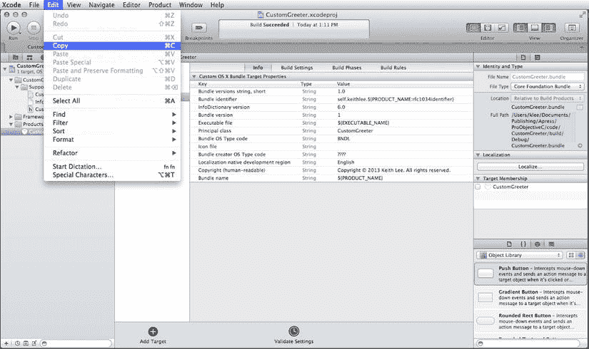

图 9-7. 拷贝 `CustomGreeter.bundle` 的完整路径

在 Xcode 中，打开 **DynaLoader** 项目，从工具栏顶部的 **Scheme** 按钮中选择 DynaLoader，然后从方案下拉菜单中选择 **Edit Scheme …**（参见 图 9-8）。

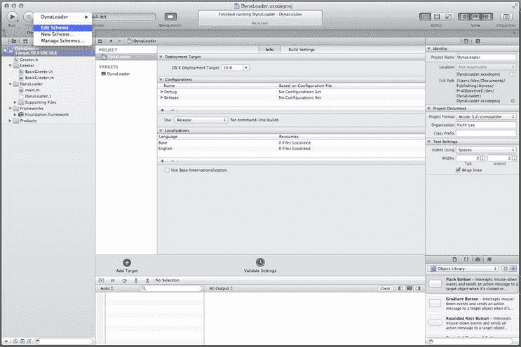

图 9-8. 编辑 CustomGreeter 项目方案

方案定义了 Xcode 项目或工作区的构建和测试设置。构建配置信息包括目标程序执行时传递的参数，因此这是你指定 `CustomGreeter` bundle 完整路径的地方。在方案编辑对话框中，选择 **Arguments** 选项卡，以编辑程序启动时传递的参数。

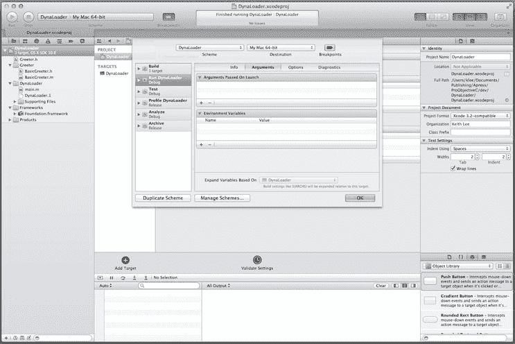

图 9-9\. 方案编辑对话框的 Arguments 选项卡

在 **Arguments Passed on Launch** 部分下，选择 **+** 按钮以添加一个参数。现在，单击相应字段的内部将其选中，通过从 Xcode 的“编辑”菜单中选择**粘贴**，将之前拷贝的 bundle 路径粘贴到该字段中，然后按回车键将此值存储在参数字段中。最后，单击 **OK** 按钮完成更新（参见 图 9-10）。

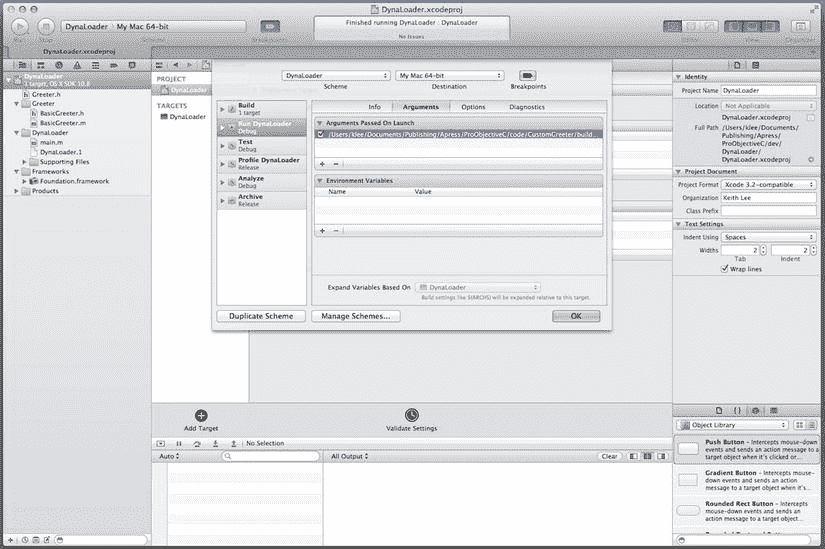

图 9-10. 使用方案编辑器添加 bundle 路径

现在，文件路径参数将在启动时传递给 DynaLoader 程序。当你编译并运行 DynaLoader 程序时，你应该在输出面板中看到类似 图 9-11 所示的消息。

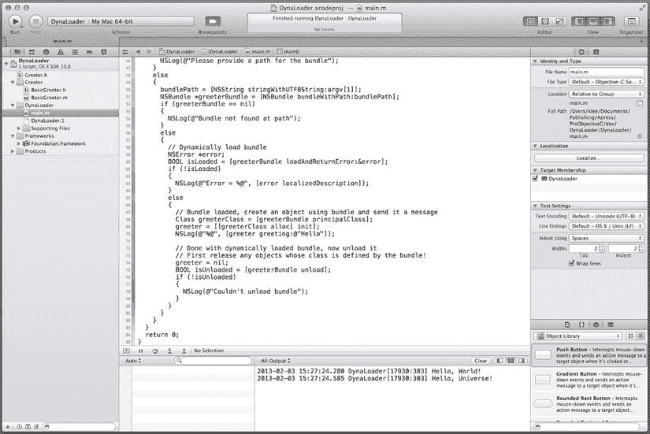

图 9-11. DynaLoader 程序输出

如输出面板所示，首先在 `BasicGreeter` 对象上调用 `greeting:` 方法，然后在从动态加载的 `CustomGreeter` bundle 创建的 `CustomGreeter` 对象上调用该方法。这展示了如何使用 `NSBundle` 类进行动态加载，从而将代码和资源添加到正在运行的程序中。

## 使用运行时 API

现在，你将创建一个程序，该程序使用运行时 API 来动态创建类和类实例，然后动态地向该实例添加一个变量。

在 Xcode 中，通过从 Xcode 的“文件”菜单中选择 **New → Project …** 来创建一个新项目。在“新建项目助手”窗格中，创建一个命令行应用程序。在“项目选项”窗口中，将“产品名称”指定为 **RuntimeWidget**，为“项目类型”选择 **Foundation**，并通过选中 **Use Automatic Reference Counting** 复选框来选择 ARC 内存管理。在文件系统中指定要创建项目的位置（如有必要，选择 **New Folder** 并输入文件夹的名称和位置），取消选中 **Source Control** 复选框，然后单击 **Create** 按钮。

现在，选择 **main.m** 文件，并添加 代码清单 9-9 中所示的代码。

*代码清单 9-9.*  使用 `NSBundle` 加载 Bundle

```objective-c
#import <Foundation/Foundation.h>
#import <objc/runtime.h>
#import <objc/message.h>

// display 选择器的方法实现函数
static void display(id self, SEL _cmd)
{
  NSLog(@"Invoking method with selector %@ on %@ instance",
        NSStringFromSelector(_cmd), [self className]);
}

int main(int argc, const char * argv[])
{
  @autoreleasepool
  {
    // 创建一个类对
    Class WidgetClass = objc_allocateClassPair([NSObject class], "Widget", 0);

// 向该类添加一个方法
    const char *types = "v@:";
    class_addMethod(WidgetClass, @selector(display), (IMP)display, types);
```


```objc
// 为类添加实例变量
    const char *height = "height";
    class_addIvar(WidgetClass, height, sizeof(id), rint(log2(sizeof(id))),
                  @encode(id));

// 注册类
    objc_registerClassPair(WidgetClass);

// 创建 Widget 实例并设置实例变量的值
    id widget = [[WidgetClass alloc] init];
    id value = [NSNumber numberWithInt:15];
    [widget setValue:value forKey:[NSString stringWithUTF8String:height]];
    NSLog(@"Widget 实例高度 = %@",
          [widget valueForKey:[NSString stringWithUTF8String:height]]);

// 向 widget 发送消息
    objc_msgSend(widget, NSSelectorFromString(@"display"));

// 动态添加变量（关联对象）到 widget
    NSNumber *width = [NSNumber numberWithInt:10];
    objc_setAssociatedObject(widget, @"width", width,
                             OBJC_ASSOCIATION_RETAIN_NONATOMIC);

// 检索变量的值并显示
    id result = objc_getAssociatedObject(widget, @"width");
    NSLog(@"Widget 实例宽度 = %@", result);
  }
  return 0;
}
```

从功能上讲，这段代码执行了以下操作：

- 定义方法实现函数
- 创建并注册类
- 创建类的实例
- 动态添加变量到实例

接下来，你将检查代码，我们将讨论它如何实现这些功能。

## 定义方法实现

如 第 8 章 所述，一个 Objective-C 方法本质上是一个 C 语言函数，它至少接受两个参数：`self` 和 `_cmd`。在导入语句之后，代码清单 9-9 中的代码定义了一个函数，用于向类添加方法。

```objc
// display 选择器的方法实现函数
static void display(id self, SEL _cmd)
{
  NSLog(@"调用选择器 %@ 的方法，作用于 %@ 实例",
        NSStringFromSelector(_cmd), [self className]);
}
```

## 创建并注册类

要使用运行时 API 动态创建类，必须执行以下步骤：

1. 创建新类和元类。
2. 为类添加方法和实例变量（如果有）。
3. 注册新创建的类。

该功能通过 代码清单 9-9 中的以下代码实现。

```objc
// 创建类对
Class WidgetClass = objc_allocateClassPair([NSObject class], "Widget", 0);

// 为类添加方法
const char *types = "v@:";
class_addMethod(WidgetClass, @selector(display), (IMP)display, types);

// 为类添加实例变量
const char *height = "height";
class_addIvar(WidgetClass, height, sizeof(id), rint(log2(sizeof(id))),
              @encode(id));

// 注册类
objc_registerClassPair(WidgetClass);
```

运行时 `class_addMethod` 函数接受以下参数：要添加方法的类、指定所添加方法名称的选择器、实现该方法的函数，以及一个描述参数类型和返回值类型的字符串——称为 *类型编码*。每种可能的类型都由一个类型代码表示；例如，字符“`v`”代表 `void`，“`@`”代表对象（无论是指向 Objective-C 类的指针还是 `id` 类型），“`:`”代表 `SEL` 类型。完整的类型编码列表在 Apple 的 Objective-C 运行时编程指南中指定。`class_addMethod` 函数的 `types` 参数中的代码必须按定义的顺序排列：第一个代码是返回值类型，第二个代码是方法隐式 `self` 参数的类型（`id` 类型），第三个代码是方法隐式 `_cmd` 参数的类型（`SEL` 类型），其余代码是方法每个显式参数的类型。因此，对于 `display` 方法，对应的 `types` 数组的值是“`v@:`”。

## 创建类实例

代码创建了动态添加的类的一个实例，设置了其实例变量的值，然后调用了实例方法。它还在输出面板中记录消息，以显示实例变量的值和方法的调用。

## 动态添加变量到类实例

Objective-C 不提供向对象添加实例变量的能力；然而，运行时的一个特性——关联对象——可以用来有效地模拟此功能。*关联对象* 是附加到类实例上的对象，通过一个键来引用。这可以用于多种场景；例如，与不允许实例变量的 Objective-C 类别一起使用。创建关联对象时，你需要指定关联映射的键、关联对象的内存管理策略及其值。代码清单 9-9 中的以下代码演示了如何使用关联对象的运行时 API。

```objc
// 动态添加变量（关联对象）到 widget
NSNumber *width = [NSNumber numberWithInt:10];
objc_setAssociatedObject(widget, @"width", width,
                         OBJC_ASSOCIATION_RETAIN_NONATOMIC);

// 检索变量的值并显示
id result = objc_getAssociatedObject(widget, @"width");
NSLog(@"Widget 实例宽度 = %@", result);
```

运行时 API 包含一个枚举，列出了内存管理策略的可能值。在此策略中，`OBJC_ASSOCIATION_RETAIN_NONATOMIC` 为关联对象分配了一个非原子的 `strong` 引用。这类似于创建具有 `nonatomic, strong` 属性的属性。当你编译并运行 RuntimeWidget 程序时，你应该会在输出面板中看到如图 9-12 所示的消息。

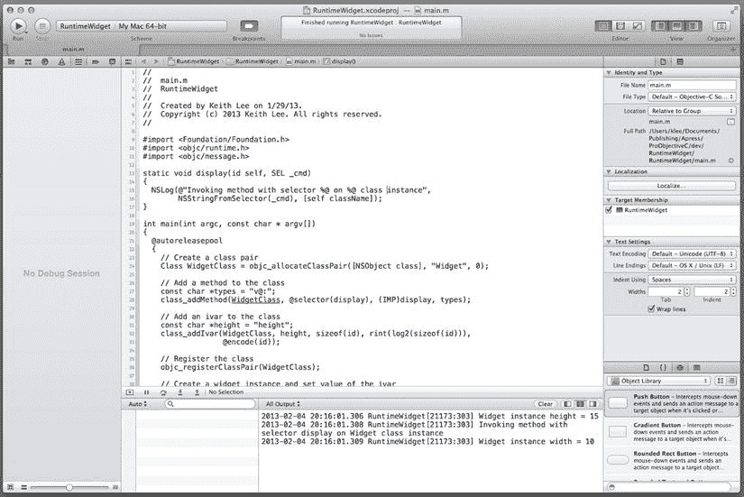

图 9-12。RuntimeWidget 程序输出

此示例演示了如何使用运行时 API 动态创建类、类实例和关联对象。请参考 Apple 的 Objective-C 运行时参考以获取运行时 API 的完整指南。

## 创建动态代理

最后一个程序演示了如何使用 Foundation 框架的 `NSInvocation` 和 `NSProxy` 类进行动态消息转发。在 第 3 章 中，你学习了 Objective-C 提供了几种类型的消息转发选项：使用 `NSObject forwardingTargetForSelector:` 方法的快速转发，以及使用 `NSObject forwardInvocation:` 方法的普通（完整）转发。

普通转发的一个好处是，它允许你对对象消息、其参数和返回值执行额外的处理。与 `NSProxy` 结合使用时，它为在 Objective-C 中实现 *面向切面编程*（AOP）提供了一种出色的机制。AOP 是一种编程范式，旨在通过将 *横切* 功能（依赖或影响程序多个部分的功能）与程序的其他部分分离，来提高程序的模块化程度。`NSProxy` 是一个专门为代理设计的 Foundation 框架类。它充当实际类的接口。在这里，你创建 `NSProxy` 的一个子类，并实现 `forwardInvocation:` 方法，从而允许发送给实际（即主题）类的消息被装饰上所需的横切功能。图 9-13 描绘了你在本程序中将要实现的组件及其相互关系的总体图。

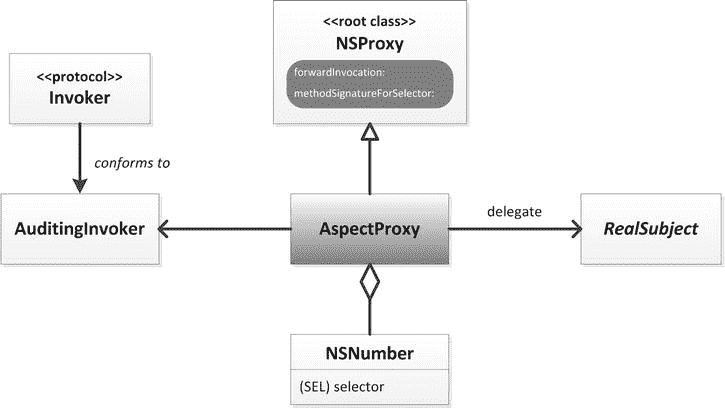

图 9-13。AspectProxy 类图

别担心。你将一步一步来。让我们从 `Invoker` 协议开始。

### 创建 Invoker 协议


在 Xcode 中，通过从 Xcode 的 **File** 菜单中选择 **New  Project …** 来创建一个新项目。在 **New Project Assistant** 窗格中，创建一个命令行应用程序。在 **Project Options** 窗口中，指定 **AspectProxy** 作为产品名称，选择 **Foundation** 作为项目类型，并通过勾选 **Use Automatic Reference Counting** 复选框来选定 ARC 内存管理。指定文件系统中要创建项目的位置（如有必要，选择 **New Folder** 并输入文件夹的名称和位置），取消勾选 **Source Control** 复选框，然后点击 **Create** 按钮。

接下来，您将创建一个协议和一个符合该协议的类。从 Xcode 的 **File** 菜单中选择 **New  File …**，选择 **Objective-C** 协议模板，将协议命名为 **Invoker**，选择 **AspectProxy** 文件夹作为文件位置，选择 **AspectProxy** 项目作为目标，然后点击 **Create** 按钮。一个名为 `Invoker.h` 的头文件已被添加到 Xcode 导航器窗格中。在编辑器窗格中，更新 `Greeter.h` 文件，如下面的列表 9-10 所示。

*列表 9-10.*  Invoker 协议

```
#import <Foundation/Foundation.h>

@protocol Invoker <NSObject>

// 必需方法（必须实现）
@required
- (void) preInvoke:(NSInvocation *)inv withTarget:(id) target;
// 可选方法
@optional
- (void) postInvoke:(NSInvocation *)inv withTarget:(id) target;

@end
```

该协议声明了两个方法。`preInvoke:withTarget:` 是一个*必需*方法（任何符合此协议的类都必须实现它），它实现了在真实对象上调用方法之前立即执行的横切功能。名为 `preInvoke:withTarget:` 的方法是一个*可选*方法，它实现了在真实对象上调用方法之后立即执行的横切功能。

现在，您将实现一个符合此协议的类，以实现所需的横切功能。从 Xcode 的 **File** 菜单中选择 **New  File …**，选择 **Objective-C** 类模板，将类命名为 **AuditingInvoker**（在 **Subclass of** 下拉列表中选择 **NSObject**），选择 **AspectProxy** 文件夹作为文件位置，选择 **AspectProxy** 项目作为目标，然后点击 **Create** 按钮。在 Xcode 导航器窗格中，选择生成的头文件 **AspectProxy.h** 并更新接口，如下面的列表 9-11 所示。

*列表 9-11.*  AuditingInvoker 接口

```
#import <Foundation/Foundation.h>
#import "Invoker.h"

@interface AuditingInvoker : NSObject <Invoker>

@end
```

模板 `AuditingInvoker` 接口已更新为采用 `Invoker` 协议。现在选择 **AuditingInvoker.m** 文件并更新实现，如下面的列表 9-12 所示。

*列表 9-12.*  AuditingInvoker 实现

```
#import "AuditingInvoker.h"

@implementation AuditingInvoker

- (void) preInvoke:(NSInvocation *)inv withTarget:(id)target
{
  NSLog(@"Creating audit log before sending message with selector %@ to %@ object",
        NSStringFromSelector([inv selector]), [target className]);
}

- (void) postInvoke:(NSInvocation *)inv withTarget:(id)target
{
  NSLog(@"Creating audit log after sending message with selector %@ to %@ object",
        NSStringFromSelector([inv selector]), [target className]);
}

@end
```

`AuditingInvoker` 的实现定义了 `preInvoke:withTarget:` 和 `postInvoke:withTarget:` 方法，因此它符合 `Invoker` 协议。这些方法仅将适当的消息记录到 Xcode 输出窗格。好了，既然您已经实现了横切功能，让我们来处理 `NSProxy` 子类。

## 编写代理类

现在，您将创建代理类。它将继承 `NSProxy` 并实现消息转发方法 `forwardInvocation:` 和 `methodSignatureForSelector:`。从 Xcode 的 **File** 菜单中选择 **New  File …**，选择 **Objective-C** 类模板，将类命名为 **AspectProxy**（在 **Subclass of** 下拉列表中选择 **NSObject**），选择 **AspectProxy** 文件夹作为文件位置，选择 **AspectProxy** 项目作为目标，然后点击 **Create** 按钮。在 Xcode 导航器窗格中，选择生成的头文件 **AspectProxy.h** 并更新接口，如下面的列表 9-13 所示。

*列表 9-13.*  AspectProxy 接口

```
#import <Foundation/Foundation.h>
#import "Invoker.h"

@interface AspectProxy : NSProxy

@property (strong) id proxyTarget;
@property (strong) id<Invoker> invoker;
@property (readonly) NSMutableArray *selectors;

- (id)initWithObject:(id)object andInvoker:(id<Invoker>)invoker;
- (id)initWithObject:(id)object selectors:(NSArray *)selectors
          andInvoker:(id<Invoker>)invoker;
- (void)registerSelector:(SEL)selector;

@end
```

该接口添加了三个属性和三个方法。`proxyTarget` 属性是真实对象，消息通过 `NSProxy` 实例转发给它。`invoker` 属性是一个类的实例（该类符合 `Invoker` 协议），它实现了所需的横切功能。`selectors` 属性是一个选择器集合，定义了将调用横切功能的消息。其中两个方法是 `AspectProxy` 类实例的初始化方法，第三个方法 `registerSelector:` 用于向当前列表添加一个选择器。现在选择 **AspectProxy.m** 文件并更新实现，如下面的列表 9-14 所示。

*列表 9-14.*  AspectProxy 实现

```
#import "AspectProxy.h"

@implementation AspectProxy

- (id)initWithObject:(id)object selectors:(NSArray *)selectors
          andInvoker:(id<Invoker>)invoker
{
  _proxyTarget = object;
  _invoker = invoker;
  _selectors = [selectors mutableCopy];
  return self;
}

- (id)initWithObject:(id)object andInvoker:(id<Invoker>)invoker
{
  return [self initWithObject:object selectors:nil andInvoker:invoker];
}

- (NSMethodSignature *)methodSignatureForSelector:(SEL)sel
{
  return [self.proxyTarget methodSignatureForSelector:sel];
}

- (void)forwardInvocation:(NSInvocation *)inv
{
  // 在目标上调用方法之前执行功能
  if ([self.invoker respondsToSelector:@selector(preInvoke:withTarget:)])
  {
    if (self.selectors != nil)
    {
      SEL methodSel = [inv selector];
      for (NSValue *selValue in self.selectors)
      {
        if (methodSel == [selValue pointerValue])
        {
          [[self invoker] preInvoke:inv withTarget:self.proxyTarget];
          break;
        }
      }
    }
    else
    {
      [[self invoker] preInvoke:inv withTarget:self.proxyTarget];
    }
  }

// 在目标上调用方法
  [inv invokeWithTarget:self.proxyTarget];

// 在目标上调用方法之后执行功能
  if ([self.invoker respondsToSelector:@selector(postInvoke:withTarget:)])
  {
    if (self.selectors != nil)
    {
      SEL methodSel = [inv selector];
      for (NSValue *selValue in self.selectors)
      {
        if (methodSel == [selValue pointerValue])
        {
          [[self invoker] postInvoke:inv withTarget:self.proxyTarget];
          break;
        }
      }
    }
    else
    {
      [[self invoker] postInvoke:inv withTarget:self.proxyTarget];
    }
  }
}

- (void)registerSelector:(SEL)selector
{
  NSValue* selValue = [NSValue valueWithPointer:selector];
  [self.selectors addObject:selValue];
}

@end
```


# 初始化方法相应地初始化`AspectProxy`对象实例。需要注意的是，由于`NSProxy`是一个基类，这些方法开头不会调用`[super init]`。如前所述，`registerSelector:`方法会向集合中添加另一个选择器。`methodSignatureForSelector:`方法的实现会返回一个`NSMethodSignature`实例，用于在目标对象上调用方法。运行时系统要求在执行普通消息转发时必须实现该方法。`forwardInvocation:`的实现会在目标对象上调用方法，并且如果目标对象上被调用方法的选择器与`AspectProxy`对象中注册的某个选择器匹配，则将有条件地调用 AOP 功能。呼……等你消化完这些内容后，我们接着看`main.m`文件并测试你的程序吧！

## 测试 AspectProxy

我们来测试`AspectProxy`，但首先需要向代理添加一个目标类。你将使用第 7 章中实现的`Calculator`类。它声明了以下方法：

```
- (NSNumber *) sumAddend1:(NSNumber *)adder1 addend2:(NSNumber *)adder2;
- (NSNumber *) sumAddend1:(NSNumber *)adder1 :(NSNumber *)adder2;
```

正如本章前面所学的，Xcode 提供了一种将文件导入项目的简单机制。按住 Ctrl 键，然后（从 Xcode 项目导航器窗格中）选择`AspectProxy`项目。下拉窗口会显示一组选项。选择**Add Files to “AspectProxy”…**选项。导航到`Calculator`项目文件夹，选择`Calculator.h`和`Calculator.m`文件，然后点击**Add**按钮将其添加到你的`AspectProxy`项目中。好了，准备工作完成后，我们来更新`main()`函数，创建一个计算器代理并调用其方法，这样也会同时调用 AOP 的`AuditingInvoker`方法。在项目导航器窗格中，选择`main.m`文件并按代码清单 9-15 所示进行更新。

*代码清单 9-15.* AspectProxy 的`main()`函数

```
#import <Foundation/Foundation.h>
#import "AspectProxy.h"
#import "AuditingInvoker.h"
#import "Calculator.h"

int main(int argc, const char * argv[])
{
  @autoreleasepool
  {
    // 创建 Calculator 对象
    id calculator = [[Calculator alloc] init];
    NSNumber *addend1 = [NSNumber numberWithInteger:-25];
    NSNumber *addend2 = [NSNumber numberWithInteger:10];
    NSNumber *addend3 = [NSNumber numberWithInteger:15];

// 为对象创建代理
    NSValue* selValue1 = [NSValue valueWithPointer:@selector(sumAddend1:addend2:)];
    NSArray *selValues = @[selValue1];
    AuditingInvoker *invoker = [[AuditingInvoker alloc] init];
    id calculatorProxy = [[AspectProxy alloc] initWithObject:calculator
                                                   selectors:selValues
                                                  andInvoker:invoker];

// 使用给定选择器向代理发送消息
    [calculatorProxy sumAddend1:addend1 addend2:addend2];

// 现在使用不同的选择器向代理发送消息，不进行特殊处理！
    [calculatorProxy sumAddend1:addend2 :addend3];

// 为代理注册另一个选择器并重复发送消息
    [calculatorProxy registerSelector:@selector(sumAddend1::)];
    [calculatorProxy sumAddend1:addend1 :addend3];

}
  return 0;
}
```

首先，代码创建了一个`Calculator`对象和一些数据值。接着，它为`Calculator`对象创建了一个代理，并使用`sumAddend1:addend2:`方法的选择器和一个`AuditingInvoker`实例进行初始化。请注意以下语句：

```
NSArray *selValues = @[selValue1];
```

符号`@[]`用于创建数组字面量。本书的第 4 部分将深入讲解 Objective-C 字面量。接着，`sumAddend1:addend2:`消息被发送到代理。这会使得代理在调用`Calculator`对象上的方法之外，还执行`AuditingInvoker`实例的 AOP 功能。接下来，`sumAddend1::`消息被发送到代理；由于该方法在调用时尚未在代理上注册，因此不会执行 AOP 功能。最后，`sumAddend1::`选择器被添加到代理中，并且消息被重新发送给代理；由于选择器现已注册，AOP 功能得以执行。编译并运行`AspectProxy`程序时，你将在如图 9-14 所示的输出窗格中看到这些消息。

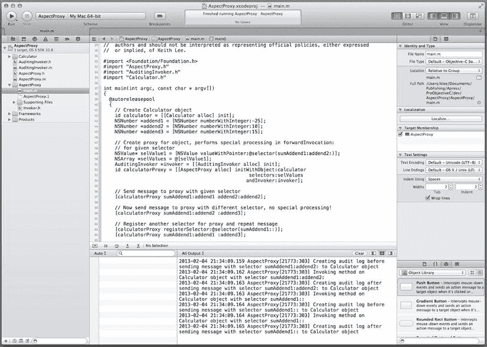

图 9-14 AspectProxy 程序输出

从输出窗格的消息中可以看出，在计算器代理上调用`sumAddend1:addend2:`方法会触发代理先调用`AuditorInvoker`对象的`preInvoke:`方法，接着调用真实主题（`Calculator`对象）上的目标方法`sumAddend1:addend2:`，最后调用`AuditorInvoker`对象的`postInvoke:`方法。由于`sumAddend1:addend2:`方法已在计算器代理上注册，这符合预期行为。接着，在计算器代理上调用了`sumAddend1::`方法。由于该方法未在代理上注册，代理仅将此方法调用转发给`Calculator`对象，而不会调用`AuditorInvoker`的方法。最后，`sumAddend1::`方法在代理上完成注册并被再次调用。这一次，它按预期调用了`AuditorInvoker`对象上的 AOP 方法以及真实主题上的`sumAddend1::`方法。

### 小结

在本章中，你实现了三个程序，这些程序共同使用了 Objective-C 运行时系统及其 API 的众多特性。你还学习了如何创建可加载包以及如何使用 Xcode 将代码导入项目。现在你应该对运行时系统、它在 Objective-C 平台中的地位，以及如何在你的程序中使用其特性和底层 API 有了很好的理解。我建议你仔细回顾这些程序，通过修改它们来尝试其他特性/行为，并充分熟悉这里演示的概念。既然你已经掌握了这些技能，不妨休息一下，给自己一个消化的机会。在第 3 部分中，你将探索 Foundation 框架。

# 第 10 章：Foundation 框架通用类

Foundation 框架定义了可用于任何类型 Objective-C 程序的基础 API 层。它包括根对象类、用于字符串等基本数据类型的类、基本数据类型的包装类、用于存储和操作其他对象的集合类，以及用于系统信息、网络和其他功能的类。掌握 Foundation 框架 API 是成为熟练的 Objective-C 程序员的关键之一。第 3 部分将帮助你深入学习这些 API。

Foundation 框架源自 1993 年创建的 NeXTSTEP OpenStep API。这些 API 包括应用层 Objective-C 库，分为 Foundation Kit 和 Application Kit。它们还确立了这些 API 使用的“NS”前缀命名约定。当苹果公司在 1996 年收购 NeXT Software 时，Foundation Kit 成为了现有 Foundation 框架的基础。

在本章中，你将探索 Foundation 框架中提供大多数 Objective-C 程序所需通用功能的类。好了，让我们开始吧！

## 根类


### Root Classes

一个根类或基类在类层次结构中定义了其下所有类共有的接口和行为。Foundation 框架提供了两个根类：`NSObject` 和 `NSProxy`。`NSObject` 是大多数 Objective-C 类层次结构的根类，而 `NSProxy` 是一个用于实现代理对象的专用类。这两个根类都遵循 `NSObject` 协议，该协议声明了所有 Objective-C 对象共有的方法。

### NSObject 协议

`NSObject` 协议指定了任何 Objective-C 根类所需的基本 API。由于协议声明的方法和属性并不特定于某个类，这种设计便于定义多个根类（甚至用户自定义的根类）。`NSObject` 协议声明的方法可以分为以下几类：

*   标识类和代理
*   标识和比较对象
*   描述对象
*   对象内省
*   发送消息

该协议还声明了一组用于手动内存管理的已废弃方法。由于 ARC 是首选的內存管理机制，这些方法不应再被使用。

### NSObject

`NSObject` 类是大多数 Objective-C 层次结构的根类；实际上，Foundation 框架中几乎所有类都是 `NSObject` 的子类。它定义了一组提供以下功能的类方法和实例方法：

*   基本对象行为
*   （对象、类）创建和初始化
*   动态（运行时系统）特性

你在前面的章节中已经使用了许多 `NSObject` 方法，所以现在你可能对这个类提供的某些功能已经很熟悉了。接下来，你将学习一些本书尚未讨论的 `NSObject` 方法。

#### 基本行为

`NSObject` 的 `description` 类方法返回一个表示该类内容的字符串。默认实现仅打印类的名称。例如，以下语句将在 Xcode 输出面板中显示字符串 `NSArray`。

```
NSLog(@"%@", [NSArray description]);
```

`NSObject` 协议声明了一个 `description` 实例方法；默认实现（由 `NSObject` 类提供）会打印对象的名称及其在内存中的地址。`debugDescription` 实例方法返回一个字符串，用于向调试器展示对象的内容；其默认实现与 `description` 实例方法相同。

如果接收者和输入参数（对象）相等，`isEqual:` 方法返回布尔值 `YES`。两个相等的对象必须具有相同的哈希值。默认（`NSObject`）实现中，如果接收者和输入参数具有相同的内存地址，则返回 `YES`。

`hash` 方法返回一个 `NSUInteger` 类型的值，可用于哈希表结构中。如前所述，两个相等的对象必须具有相同的哈希值。如果哈希值用于确定对象在集合中的位置，则集合中对象通过 `hash` 方法返回的值在其位于集合中期间不得更改。

#### 发送消息

`NSObject` 定义了一组用于向对象发送消息的 `performSelector:` 实例方法。每个方法都指定了一个选择器参数，用于标识要发送的消息。`performSelector:` 方法等同于标准的 Objective-C 对象消息；例如，以下两条语句是等价的：

```
[atom logInfo];
[atom performSelector:@selector(logInfo)];
```

`performSelector:` 方法与标准对象消息的不同之处在于，它允许你在运行时发送消息，因为可以传递一个变量选择器值作为参数。

`NSObject` 协议中声明了 `performSelector:` 方法的几种变体。这些变体在消息指定的参数数量（0–2）上有所不同（`performSelector:`、`performSelector:withObject:`、`performSelector:withObject:withObject:`）。`NSObject` 类还定义了多个 `performSelector:` 方法。这些方法在向对象发送消息时提供了额外的功能，具体包括：

*   线程选择（当前线程、后台线程、用户指定线程）
*   方法调用语义（同步、阻塞）
*   事件处理模式
*   方法调用延迟

例如，`performSelector:withObject:afterDelay:` 方法在指定延迟后向对象发送消息。以下语句演示了如何使用此方法在延迟 5 秒后向对象发送消息。

```
[atom performSelector:@selector(logInfo) withObject:nil afterDelay:5.0];
```

#### 创建和初始化

现在，我们来学习几个用于类加载和初始化的 `NSObject` 方法。`initialize` 类方法用于在类加载后、首次使用前（即在该类或其任何继承类接收到第一条消息之前）对其进行初始化。此方法在程序执行期间最多对每个类调用一次；实际上，如果该类未被使用，则不会调用该方法。`initialize` 方法是线程安全的，并且总是在发送给类本身之前，先发送给该类的所有超类。为了防止该方法被调用两次（由超类以及目标类调用），应使用验证调用者是否为目标类（而非超类）的逻辑来实现 `initialize` 方法（如代码清单 10-1 所示）。

*代码清单 10-1.*  NSObject initialize 方法设计

```
+ (void)initialize
{
  if (self == [MyClass class])
  {
    // 初始化逻辑
  }
}
```

代码清单 10-1 展示了条件测试确保了初始化逻辑仅在接收者的类是实现 `initialize` 方法的类时才执行。

如果实现了，`NSObject` 的 `load` 类方法也会在类加载后被调用一次。它与 `initialize` 方法在以下几个方面有所不同：

*   `load` 方法在类加载后很快被调用，早于 `initialize` 方法。实际上，对于静态链接的类（即属于程序可执行文件一部分的类），`load` 方法会在 `main()` 函数之前被调用。如果 `load` 方法实现在可加载包中的类里，它将在该包被动态加载时运行。使用 `load` 方法需要非常小心，因为它在应用程序启动的早期就被调用了。具体来说，当调用此方法时，程序的自动释放池（通常）尚不存在，其他类可能尚未加载，等等。
*   `load` 方法可以同时为类和分类实现；实际上，一个类的每个分类都可以实现自己的 `load` 方法。`initialize` 方法绝不应在分类中被重写。
*   `load` 方法（如果实现了）在类加载后被调用一次。`initialize` 方法（如果实现了）在类接收到第一条消息时被调用一次；如果该类未被使用，则不会调用该方法。

`NSObject` 的 `new` 类方法分配一个新的对象实例然后初始化它。它在一个单独的方法中结合了 `alloc` 和 `init` 方法。以下两条对象创建和初始化语句是等价的。

```
Atom *atom = [[Atom alloc] init];
Atom *atom = [Atom new];
```

`new` 方法调用类的默认 `init` 方法；它不会调用自定义的 `init` 方法。

### NSProxy


`NSProxy`类是一个用于实现代理模式的*抽象*根类。它实现了一组最小的方法，从而使得几乎所有发送给它的消息都能被捕获并转发给目标主体。`NSProxy`实现了`NSObject`协议中声明的方法，并声明了两个必须由子类实现的方法：

```
- (void)forwardInvocation:(NSInvocation *)anInvocation;
- (NSMethodSignature *)methodSignatureForSelector:(SEL)aSelector;
```

**注意** *抽象类*被定义为不能直接实例化的类；它可能没有实现或只有不完整的实现。它也可能有需要被实现的方法。Objective-C 在语言层面没有对抽象类的支持；按照惯例，你在 Objective-C 中将一个没有初始化方法并且有一个或多个需要实现的方法的类指定为抽象类。因此，一个抽象类（例如，`NSProxy`）的具体子类必须实现未实现的方法以及至少一个初始化方法（即一个`init`方法）。

此外，`NSProxy`的子类（即*具体子类*）应声明并实现至少一个`init`方法，以符合 Objective-C 关于对象创建和初始化的约定。Foundation 框架包含几个`NSProxy`的具体子类：

*   `NSDistantObject`：定义用于其他应用或线程中对象的代理。
*   `NSProtocolChecker`：定义一个限制可以发送给另一个对象的消息的对象。

在第 9 章中，你实现了一个`NSProxy`的具体子类`AspectProxy`，以在代理对象周围提供横切（AOP）功能。这些例子仅仅说明了`NSProxy`类的众多用途中的一小部分。

## 字符串

Foundation 框架包含一组用于操作字符串的 API。这些类支持的操作包括：

*   创建、转换和格式化字符串
*   从文件或资源读取字符串以及写入字符串
*   字符串查询、排序和比较

在 Objective-C 中，字符串被表示为一个对象。这意味着字符串可以在任何其他对象可以使用的地方使用（例如在集合中）。每个字符串对象由一个 Unicode（即文本）字符数组组成。Foundation 框架的`NSString`和`NSMutableString`类为字符串对象提供 API。`NSAttributedString`和`NSMutableAttributedString`类管理具有相关属性（例如，字体、段落样式、前景色等）的字符串。这些属性通过名称标识，并存储在 Foundation 框架的`NSDictionary`对象中。

**注意** `NSString`和`NSMutableString`是`NSString`类簇的成员。*类簇*设计模式在 Foundation 框架中被广泛使用，用于将许多具有公共基接口的相关类分组。同样地，`NSAttributedString`和`NSMutableAttributedString`是`NSAttributedString`类簇的成员。在这两个类簇中，每个配对中的可变类声明了额外的方法，允许修改其（字符串）内容。

这个类家族支持创建不可变和可变的字符串对象、属性字符串以及 Unicode 字符。

### NSString

`NSString`和`NSMutableString`为管理字符串的 Objective-C 对象提供 API。`NSString`类管理*不可变*字符串，这些字符串在创建时定义，随后无法更改。`NSMutableString`是`NSString`的*可变*（其内容可以被编辑）子类。

`NSMutableString`在其超类（`NSString`）定义的方法之上添加了用于创建和初始化（可变）字符串以及修改字符串的方法。

#### 创建和初始化

`NSString`类定义了许多用于创建和初始化字符串的方法。`NSString`的`init`方法返回一个没有字符的已初始化的`NSString`对象。`NSString`类还定义了众多带参数的初始化方法。这些方法都以`init`开头，使您能够用字符、字节缓冲区、文件内容、URL 内容、C 字符串、UTF8 字符串等来初始化`NSString`对象。

#### 扫描值

`NSString`类包含许多用于从字符串对象中检索原始值的方法。这些方法支持基本的原始类型（即`int`、`float`等）和 Foundation 框架的`NSInteger`类型。这些方法遵循一种命名约定，即返回类型构成方法名称的前缀。相应的方法签名如**列表 10-2**所示。

[*列表 10-2.*] NSString 用于检索原始值的方法

```
- (int) intValue;
- (float) floatValue;
- (double) doubleValue;
- (long long) longLongValue;
- (BOOL) boolValue;
- (NSInteger) integerValue;
```

以下示例为字符串`"17"`返回一个分配给变量`myValue`的`int`类型的结果。

```
int myValue = [@"17" intValue];
```

如果字符串不以有效的十进制数字文本表示开头，这些方法中的每一个都会返回值 0。另请注意，这些方法不支持本地化。Foundation 框架的`NSScanner`类提供了用于将`NSString`对象读取并转换为数字和字符串值的附加功能（包括本地化）。以下代码片段使用`NSScanner`类为字符串`"17"`设置变量`myValue`（`int`类型）。

```
NSScanner *scanner = [NSScanner scannerWithString:@"17"];
BOOL success = [scanner scanInt:&myValue];
```

`NSScanner`的`scanInt:`方法在被扫描的字符串是数字时返回`YES`的`BOOL`值；如果返回`NO`，则存储在变量`myValue`中的值无效。

#### 字符串搜索和比较

`NSString`类包含几个用于在字符串对象内搜索子字符串的方法。`rangeOfString:`方法都返回一个*范围*，用于标识输入字符串在接收器对象中首次出现的位置。返回的值是一个`NSRange`实例，这是一个 Foundation 框架的数据类型，用于描述一系列内容的一部分。`NSRange`被定义为一个包含两个元素的结构：

*   *location*：一个`NSUInteger`，指定范围的起始位置。
*   *length*：一个`NSUInteger`，指定范围的长度。

以下代码片段返回一个分配给变量`worldRange`的`NSRange`实例，该实例标识字符串`"World"`在字符串`"Hello, World!"`中首次出现的位置。

```
NSString *greeting = @"Hello, World!";
NSRange worldRange = [greeting rangeOfString:@"World"];
```

在前面的例子中，`worldRange`的元素的值分别是*六*（location）和 5（length）。几个`rangeOfString:`方法提供了额外的参数，使您能够指定字符串比较选项、要在接收器对象中搜索的范围以及用于搜索的区域设置。

`NSString`的`rangeOfCharacterFromSet:`方法也执行基于范围的搜索。它们与`rangeOfString:`方法的不同之处在于，它们返回一个范围，该范围指定在接收器字符串中从给定字符集中找到的第一个字符的位置。字符集输入参数是`NSCharacterSet`类型，这是一组（符合 Unicode 标准的）字符。以下代码片段返回一个`NSRange`实例，该实例标识字符串`"Hello, World!"`中标点符号（例如，句号、感叹号等）首次出现的位置。

```
NSCharacterSet *chars = [NSCharacterSet punctuationCharacterSet];
NSRange charRange = [@"Hello, World!" rangeOfCharacterFromSet:chars];
```


在前面的示例中，`charRange` 的元素具有值 *eleven*（位置）和 1（长度）。与`rangeOfString:`方法一样，`rangeOfCharacterFromSet:`方法提供了额外的参数，使你可以指定字符串比较选项以及接收者对象中要搜索的范围。

`NSString`的`stringByReplacingOccurrencesOfString:withString:`方法从现有字符串创建一个新字符串，将接收者中所有出现的目标（输入）字符串替换为另一个（输入）字符串。以下代码片段使用此方法，将初始字符串`"Hello, World!"`转换为新字符串`"Hello, Earthlings!"`。

```
NSString *greeting = @"Hello, World!";
NSString *newGreeting = [greeting stringByReplacingOccurrencesOfString:@"World!"
                         withString:@"Earthlings!"];
```

`NSString`类包含多个用于比较字符串的方法。`compare:`方法返回一个`NSComparisonResult`实例，这是一种 Foundation 框架数据类型，用于指示比较项在系列中的顺序。`NSComparisonResult`定义为一个包含三个常量的枚举：

* `NSOrderedAscending`：左操作数小于右操作数。
* `NSOrderedSame`：操作数相等。
* `NSOrderedDescending`：左操作数大于右操作数。

以下语句返回一个`NSComparisonResult`并赋值给变量`order`，该变量标识字符串`"cat"`和`"dog"`之间有序比较的结果。

```
NSComparisonResult order = [@"cat" compare:@"dog"];
```

此比较的结果是`NSOrderedAscending`，表示单词 *cat* 在字母顺序上位于单词 *dog* 之前。`NSString`还包含其他比较方法，使你可以执行本地化比较、不区分大小写的比较以及其他选项。

字符串 I/O

`NSString`包含用于从文件或 URL 读取字符串以及将字符串写入文件或 URL 的方法。`writeToFile:atomically:encoding:error:`方法将字符串写入指定路径的文件。此方法还指定了原子写入时使用的编码（以防止系统在写入文件时崩溃导致文件损坏），以及一个描述写入文件时出现问题的错误对象。如果字符串成功写入文件，则该方法返回`YES`。`writeToURL:atomically:encoding:error:`方法将字符串写入给定的 URL。`NSString`的`stringWithContentsOfFile:`、`stringWithContentsOfURL:`、`initWithContentsOfFile:`和`initWithContentsOfURL:`方法用于从文件或 URL 创建并初始化字符串。

内省

`NSString`类包含许多用于获取`NSString`对象信息的方法。以下语句使用`NSString`的`length`方法来获取字符串`"Hello, World!"`中的字符数。

```
int len = [@"Hello, World!" length];
```

以下语句使用`NSString`的`hasPrefix:`方法返回一个布尔值，指示`"Hello, World!"`字符串是否具有前缀`"Hello"`。

```
BOOL hasPrefix = [@"Hello, World!" hasPrefix:@"Hello"];
```

修改字符串

`NSMutableString`在`NSString`提供的方法基础上，添加了几个用于修改字符串的方法。这些方法使你能够追加字符串或格式字符串，在字符串中插入或删除字符，替换字符串中的字符或子串，或将字符串设置为新值。以下代码片段创建了一个名为`"Hello"`的可变字符串，然后将字符串`"World!"`追加到其中。

```
NSMutableString *mgreet = [@"Hello" mutableCopy];
[mgreet appendString:@", World!"];
```

NSAttributedString

`NSAttributedString`和`NSMutableAttributedString`为管理字符串及相关属性集的 Objective-C 对象提供了 API。`NSAttributedString`类管理**不可变**字符串，而`NSMutableAttributedString`类管理**可变**字符串。

`NSAttributedString`类提供的方法支持字符串的创建和初始化、字符串和属性信息的检索，以及使用块对象枚举字符串中的属性。`initWithString:attributes:`方法通过属性初始化一个`NSAttributedString`实例，其中属性以`NSDictionary`实例的形式提供。以下代码片段使用字符串`"Hello"`和单个属性（`locale = en-US`）创建并初始化了一个`NSAttributedString`。

```
NSDictionary *attrs = @{@"locale":@"en-US"};
NSAttributedString *greeting = [[NSAttributedString alloc] initWithString:@"Hello"
                                                               attributes:attrs];
```

接下来的语句从属性字符串中检索属性的值（使用键`"locale"`），并将属性的范围设置为`NSRange`类型的变量`range`。

```
NSRange range;
id value = [greeting attribute:@"locale" atIndex:0 effectiveRange:&range];
```

NSString 字面量

Objective-C 提供了语言级别的支持，用于使用`@`符号后跟双引号括起来的文本字符串来创建`NSString`字面量。以下语句使用`NSString`字面量创建了一个名为`book`的`NSString`对象。

```
NSString *book = @"Pro Objective-C";
```

`NSString`字面量是编译时常量。它们在编译时分配，并在程序的整个生命周期中存在。

格式字符串

`NSString`类包含多个方法，用于使用格式字符串格式化字符串对象。格式字符串由普通文本字符和零个或多个格式说明符组成。**格式说明符**是一种规范，用于将格式字符串中的参数转换为字符串。每个格式说明符以`%`字符开头，该字符指定参数值的占位符，紧随其后的是一个指示参数类型的字符序列。`NSString`格式化方法支持的格式说明符列表包括 IEEE `printf`规范定义的格式说明符以及格式说明符`'%@'`（用于格式化 Objective-C 对象）。例如，格式字符串`@"%d"`期望一个整数类型的参数来替换该格式字符串。`NSString`的`stringWithFormat:`方法和其他相关方法使用格式字符串创建和初始化`NSString`对象。`stringWithFormat`方法的语法是

```
+ (id)stringWithFormat:(NSString *)format, ...
```

其中`format`是格式字符串，`...`指定要替换到格式中的参数（以逗号分隔）列表。以下示例创建了一个`NSString`对象，赋值给变量`magicNumber`，其文本为`"Your number is 17"`。

```
NSString *magicNumber = [NSString stringWithFormat: @"Your number is %d", 17];
```

在此示例中，格式字符串`@"Your number is %d"`包含普通文本和一个格式说明符`%d`，该说明符被参数`17`替换。下一个示例使用`NSString`对象`magicNumber`创建了一个格式化的字符串。

```
NSString *description = [NSString stringWithFormat:
                         @"Description is %@", magicNumber];
```

`%@`格式说明符替换为在对象上调用`descriptionWithLocale:`（如果可用）或`description`方法返回的字符串。

Foundation 框架包含多个类（`NSFormatter`、`NSDateFormatter`、`NSNumberFormatter`），这些类为解释和创建表示其他值的`NSString`对象提供了额外功能。

值对象


好的，作为一名高级文档工程师和翻译员，我将严格遵循您提供的注意事项，将给定的英文文本翻译成中文。


## Foundation 框架值对象

Foundation 框架的值对象类为原始数据类型、通用系统信息、工具和本地化支持提供了面向对象的封装。`NSCalendar`、`NSDate`、`NSCalendarDate`、`NSDateComponents` 和 `NSTimeZone` 类为日期和时间的编程及格式化提供支持。`NSValue`、`NSNumber`、`NSDecimalNumber` 和 `NSDecimalNumberHandler` 类为原始数据类型提供了面向对象的封装，这些对象随后可以被操作和/或添加到集合对象中。`NSData`、`NSMutableData` 和 `NSPurgeableData` 类为字节缓冲区提供了面向对象的封装。`NSValueTransformer` 用于将值从一种表示形式转换为另一种。`NSNull` 是一个单例对象，用于在不允许 `nil` 值的集合对象中表示空值。`NSLocale` 提供对本地化的支持，本地化是一组用于使软件适应特定地区或语言的信息集合。`NSCache` 提供了一个内存中的系统缓存，用于临时存储那些重新创建成本高昂的对象。

### NSValue

`NSValue` 类是单个数据项的容器。它可以保存长度固定的 C 和 Objective-C 数据类型（包括原始类型），通常用于允许将某个数据项存储在集合对象（`NSArray`、`NSSet` 等）中，因为这些集合要求其元素必须是对象。代码清单 10-3 中的代码片段从一个 `int` 类型的值创建了一个 `NSValue` 实例。

*代码清单 10-3.*创建一个 `NSValue` 实例

```
int ten = 10;
int *tenPtr = &ten;
NSValue *myInt = [NSValue value:&tenPtr withObjCType:@encode(int *)];
```

请注意，类型是使用 `@encode` 指令指定的。这个值现在可以存储在一个集合对象中。以下语句检索 `NSValue` 对象的 `int` 值，并将此值赋给变量 `result`。

```
int result = *(int *)[myInt pointerValue];
```

### NSNumber

`NSNumber` 类是 `NSValue` 的子类，充当原始（标量）类型的容器。它定义了一组方法，用于创建和访问作为原始类型的数字对象：`signed/unsigned char`、`int`、`short int`、`long int`、`long long int`、`NSInteger`、`float`、`double` 或 `BOOL` 类型。`NSNumber` 包含许多类工厂方法（其名称均以 `numberWith...` 开头），用于使用指定原始类型的输入参数创建并初始化一个 `NSNumber`。以下语句使用 `numberWithDouble:` 方法创建一个 `double` 类型的 `NSNumber` 实例，并将其赋值给一个名为 `degrees2Radians` 的变量。

```
NSNumber *degrees2Radians = [NSNumber numberWithDouble:(3.1415/180.0)];
```

`NSNumber` 还包含初始化方法（其名称均以 `initWith...` 开头），用于使用输入参数的值初始化一个已分配的 `NSNumber` 对象。相应的 `NSNumber` `...Value` 方法（每种支持的类型都有一个）可用于从 `NSNumber` 对象中检索原始值，例如：

```
double d2r = [degrees2Radians doubleValue];
```

`NSNumber` 还包含一个 `stringValue` 方法，用于获取 `NSNumber` 实例的字符串表示。

### NSDecimalNumber

`NSDecimalNumber` 是 `NSNumber` 的一个子类，用于执行十进制算术运算。它包含用于创建和初始化十进制数字的方法，以及用于执行标准算术运算（加法、减法、乘法、除法等）的方法。它对于执行那些舍入误差可能很显著的数值运算（例如，货币计算）特别有用。代码清单 10-4 将两个 `NSDecimalNumber` 对象相加，并将结果赋值给一个名为 `sum` 的 `NSDecimalNumber` 对象。

*代码清单 10-4.*使用 `NSDecimalNumber` 将两个数字相加

```
NSDecimalNumber *num1 = [NSDecimalNumber decimalNumberWithString:@"2.56"];
NSDecimalNumber *num2 = [NSDecimalNumber decimalNumberWithString:@"7.78"];
NSDecimalNumber *sum = [num1 decimalNumberByAdding:num2];
```

`NSDecimalNumber` 中执行算术运算的方法包含一些参数，可用于指定如何处理计算错误和舍入。

## NSNumber 字面量

Objective-C 提供了语言级别的支持来创建 `NSNumber` 字面量。任何以 `@` 字符为前缀的字符、数字或布尔字面量，都会生成一个初始化为该值的 `NSNumber` 对象。以下语句是等效的：

```
NSNumber *num = [NSNumber numberWithInt:17];
NSNumber *num = @17;
```

`NSNumber` 字面量由标量值创建，而非表达式。此外，`NSNumber` 字面量在运行时求值；它们不是编译时常量，因此不能用于初始化静态变量。本质上，字面量 `@17` 实际上是表达式 `[NSNumber numberWithInt:17]` 的简写形式，这是一个在运行时求值的对象消息。有关 `NSNumber` 字面量的更多信息，请参阅第 16 章，该章深入探讨了 Objective-C 字面量。

## 日期和时间支持

`NSCalendar`、`NSDate`、`NSCalendarDate`、`NSDateComponents` 和 `NSTimeZone` 类为日期和时间的编程及格式化提供支持。一个 `NSDate` 实例代表一个绝对时间戳。以下语句创建一个表示当前时间的日期。

```
NSDate *now = [[NSDate alloc] init];
```

以下语句比较两个日期，并返回一个 `NSComparisonResult`，指示输入日期是晚于、等于还是早于接收方的日期。

```
NSTimeInterval secondsPerDay = 24 * 60 * 60;
NSDate *tomorrow = [now dateByAddingTimeInterval:secondsPerDay];
NSComparisonResult *result = [now compare:tomorrow];
```

`NSCalendar` 类封装了用于组织时间段的日历信息。它为几种不同的日历提供了实现，包括佛教历、公历、希伯来历、伊斯兰历和日本历。以下语句返回当前用户所选本地化的日历。

```
NSCalendar *currentCalendar = [NSCalendar currentCalendar];
```

以下语句创建一个公历。

```
NSCalendar *gregorianCalendar = [[NSCalendar alloc]
                                initWithCalendarIdentifier:NSGregorianCalendar];
```

`NSCalendar` 提供了用于检索日历中某个日期的组成元素的方法，这些元素以 `NSDateComponents` 对象表示。

`NSDateComponents` 类代表日期/时间的组成元素。它用于设置/获取这些元素，并指定时间间隔。以下语句从当前日历对象中检索带有月日历单位的日期组件。

```
NSDate *date = [NSDate date];
NSDateComponents *components = [currentCalendar components:NSMonthCalendarUnit
                                                    fromDate:date];
```

## NSCache


# 缓存

在计算机编程中，缓存是一种存储数据的机制，以便未来对相同数据的请求可以更快地检索。它们通常用于存储重新创建代价高昂的对象。Foundation 框架的`NSCache`类提供了一个内存系统缓存，用于临时存储重新创建代价高昂的对象。除了管理缓存值之外，该类还包括用于管理缓存大小、管理已丢弃对象以及管理缓存委托的方法。缓存委托符合`NSCacheDelegate`协议，并在对象即将被驱逐或从缓存中移除时接收消息。`NSCache`实例存储键值对，类似于`NSDictionary`（将在本章后面讨论）。其不同之处在于它提供了自动移除策略，从而管理内存利用率。以下代码片段创建了一个`NSCache`实例，设置了缓存可以容纳的对象数量，然后向缓存添加了一个对象。

```
NSCache *cache = [[NSCache alloc] init];
[cache setCountLimit:500];
[cache setObject:@"Hello, World!" forKey:@"greeting"];
```

## 集合

Foundation 框架的集合类管理对象的集合。大多数集合类都有不可变和可变两个版本。`NSArray`和`NSMutableArray`管理数组，即可以是任何类型的对象的有序集合；`NSArray`的元素不必是相同类型。`NSDictionary`和`NSMutableDictionary`用于键值对组。`NSSet`、`NSMutableSet`和`NSCountedSet`用于管理对象的无序集合。`NSEnumerator`和`NSDirectoryEnumerator`类枚举其他对象的集合，如数组和字典。`NSIndexSet`和`NSMutableIndexSet`管理*索引集*的集合（唯一无符号整数的集合，用于存储另一个数据结构的索引）。`NSHashTable`、`NSMapTable`和`NSPointerArray`是可变集合，在使用垃圾收集器时支持弱关系。

`NSHashTable`、`NSMapTable`和`NSPointerArray`类仅在 Apple OS X 平台上可用（即，这些类不适用于 iOS 平台）。

### NSArray

`NSArray`和`NSMutableArray`管理不必是相同类型的对象的有序集合。`NSArray`是不可变的（初始化时分配给数组的对象不能被移除，尽管其内容可以更改）。`NSMutableArray`允许添加或删除集合中的对象。`NSArray`支持的操作包括数组创建和初始化、查询（获取有关数组的信息或检索其元素）、在数组中查找对象、向数组元素发送消息、比较数组以及对数组进行排序。许多`NSArray`和`NSMutableArray`操作在常数时间内执行（访问元素、在两端添加/删除、替换元素），而在`NSMutableArray`中间插入元素则需要线性时间。以下语句使用`NSArray`的`arrayWithObjects:`便捷构造器创建一个`NSArray`对象，赋值给变量`myArray`，并用`NSNumber`字面量初始化。

```
NSArray *myArray = [NSArray arrayWithObjects:@1, @2, nil];
```

请注意，`arrayWithObjects:`方法需要参数为以逗号分隔的对象列表，并以`nil`结尾。下一条语句使用`NSArray`的`indexOfObject:`方法检索此`NSArray`对象的第一个元素。

```
id num0 = [myArray objectAtIndex:0];
```

以下语句返回前一个`NSArray`对象中`NSNumber`对象（值为 2）的索引。

```
NSUInteger index = [myArray indexOfObject:@2];
```

`NSArray`还包括以下方法，用于将数组的内容持久化到属性列表，以及从属性列表初始化`NSArray`对象：

```
- writeToFile:atomically:
- writeToURL:atomically:
- initWithContentsOfFile:
- initWithContentsOfURL:
```

当持久化数组时（通过`writeTo...`方法），其内容必须全部是属性列表对象（即`NSString`、`NSData`、`NSDate`、`NSNumber`、`NSArray`、`NSDictionary`对象）。

### NSArray 字面量

Objective-C 提供语言级支持来创建`NSArray`字面量。数组由方括号之间的逗号分隔的对象列表定义，并以`@`字符为前缀。与`NSArray`的`arrayWithObjects:`和`initWithObjects:`方法不同，用于定义`NSArray`字面量的对象列表不必以`nil`结尾。以下语句是等价的：

```
NSArray *myArray = [NSArray arrayWithObjects:@1, @2, nil];
NSArray *myArray = @[@1, @2];
```

与`NSNumber`字面量一样，`NSArray`字面量不是编译时常量；它们在运行时求值。

### NSPointerArray

`NSPointerArray`是一个可变集合，类似于`NSMutableArray`，可以持有任意指针和`NULL`值。它还允许你通过设置数组的计数来管理集合，这样如果集合中的元素数量小于计数，则集合会用`NULL`值填充；或者如果集合中的元素数量大于计数，则删除集合中高于计数值的元素。

### NSDictionary

`NSDictionary`和`NSMutableDictionary`类管理键/值（对象）对的集合。在一个集合中，键的值是唯一的（即，它必须是采用`NSCopying`协议并实现`hash`和`isEqual:`方法的对象）。这些类支持的操作包括对象创建和初始化、查询、在集合中查找对象、过滤、比较以及对集合进行排序。排序选项包括使用选择器排序（使用`keySortedByValueUsingSelector:`方法）和使用 block 排序（使用`keySortedByValueUsingComparator:`方法）。对于具有良好哈希函数的键（例如，`NSString`），`NSDictionary`操作需要常数时间（从`NSDictionary`或`NSMutableDictionary`中访问、设置、移除元素）。Listing 10-5 中显示的代码片段创建并初始化了一个包含两个元素的`NSDictionary`对象。

**Listing 10-5.** 创建并初始化一个 NSDictionary 对象

```
NSArray *objects = @[@1, @2];
NSArray *keys = @[@"one", @"two"];
NSDictionary *myDi = [NSDictionary dictionaryWithObjects:objects];
                       withKeys:keys];
```

下一条语句从具有键`"one"`的前一个`NSDictionary`对象中检索值。

```
id value = [myDi objectForKey:@"one"];
```

与`NSArray`一样，`NSDictionary`包含将字典内容持久化到属性列表以及从属性列表初始化`NSDictionary`对象的方法：

```
- writeToFile:atomically:
- writeToURL:atomically:
- initWithContentsOfFile:
- initWithContentsOfURL:
```

当持久化字典时（通过`writeTo...`方法），其内容必须全部是属性列表对象（`NSString`、`NSData`、`NSDate`、`NSNumber`、`NSArray`和`NSDictionary`对象）。

### NSDictionary 字面量

Objective-C 提供语言级支持来创建`NSDictionary`字面量。字典由花括号之间的逗号分隔的键值对列表定义，并以`@`字符为前缀。在每个键值对中，冒号分隔键和值。以下语句是等价的：

```
NSArray *objects = @[@1, @2];
NSArray *keys = @[@"one", @"two"];
NSDictionary *myDi = [NSDictionary dictionaryWithObjects:objects];

NSDictionary *myDi = @{@"one":@1, @"two":@2};
```

与`NSNumber`字面量一样，`NSDictionary`字面量不是编译时常量；它们在运行时求值。

### NSMapTable


### NSPointerArray

`NSPointerArray` 是一个类似于 `NSDictionary` 的可变集合，提供了额外的存储选项。具体来说，它可以存储任意指针，还可以存储弱引用的键和/或值。

### NSSet

`NSSet` 和 `NSMutableSet` 管理无序的对象集合，这些对象不必属于同一类型。存储在 `NSSet` 中的对象是唯一的。`NSSet` 支持的操作包括创建和初始化、在集合中查找对象、比较以及排序（使用 `NSSet` 的 `sortedArrayUsingDescriptors:` 方法）。如果集合中的对象具有良好的哈希函数，访问元素、设置元素和删除元素的时间复杂度均为常数。如果哈希函数不佳（容易导致哈希冲突），这些操作的时间复杂度将变为线性。

集合（不包括 `NSCountedSet`）确保每个对象不会出现多次，因此重复添加对象不会产生任何效果。以下语句使用 `NSSet` 的 `setWithObjects:` 便捷构造器创建了一个 `NSSet` 对象，该对象被赋值给变量 `mySet`，并使用 `NSNumber` 字面量进行初始化。

```objectivec
NSSet *mySet = [NSSet setWithObjects:@1, @2, nil];
```

### NSCountedSet

`NSCountedSet` 是一个可变集合，允许一个对象被多次添加（即其元素不必是互异的）。每个不同的对象都关联一个计数器。`NSCountedSet` 对象会跟踪每个不同对象被插入的次数，并且需要相应对象被移除相同次数。

### NSHashTable

`NSHashTable` 是一个类似于 `NSSet` 的可变集合，提供了不同的选项。具体来说，它可以存储任意指针，还可以存储弱引用的键和/或值。

### NSPointerFunctions

`NSPointerFunctions` 类定义了用于管理指针函数的函数。`NSHashTable`、`NSMapTable` 或 `NSPointerArray` 对象通常使用 `NSPointerFunctions` 实例来定义其所管理指针的行为。

## XML 处理

Foundation 框架的 XML 处理类支持通用 XML 文档管理和解析功能。这些类在逻辑上将 XML 文档表示为层次化的树状结构，并支持 XML 文档节点的查询和操作。这些类支持多种 XML 相关技术和标准，例如 XQuery、XPath、XInclude、XSLT、DTD 和 XHTML。

`NSXMLDTD` 和 `NSXMLDTDNode` 类用于创建和修改 XML 文档类型定义（DTD）。`NSXMLDocument`、`NSXMLNode` 和 `NSXMLElement` 用于基于树的 XML 文档处理。`NSXMLParser` 的实例用于以事件驱动的方式解析 XML 文档。

### XML DTD 处理

`NSXMLDTD` 类（`NSXMLDTD` 和 `NSXMLDTDNode`）表示文档类型定义（DTD）。它们用于创建和修改 DTD。XML DTD 处理类（`NSXMLDTD`、`NSXMLDTDNode`）仅在 Apple OS X 平台上可用（即这些类不适用于 iOS 平台）。

### 基于树的 XML 处理

Foundation 的 `NSXML` 类使您能够创建、操作、修改和查询 XML 文档。这些类采用文档对象模型（DOM）风格的、基于树的数据模型，将 XML 文档表示为节点的树。树中的每个节点对应一个 XML 结构——元素、属性、文本、注释、处理指令或命名空间。`NSXMLDocument` 对象将整个 XML 文档表示为逻辑树结构。代码清单 10-6 中显示的代码片段为 URL `http://www.apress.com/proobjectivec.xml` 创建了一个 `NSXMLDocument`。

*代码清单 10-6. 创建 NSXMLDocument 对象*

```objectivec
NSURL *url = [NSURL URLWithString:@"http://www.apress.com/proobjectivec.xml"];
NSError *err;
NSXMLDocument *xmlDoc = [[NSXMLDocument alloc]
                          initWithContentsOfURL:url
                                        options:NSXMLDocumentValidate
                                          error:&err];
```

`NSXMLNode` 是 `NSXMLDocument` 的父类，包含用于遍历 XML 文档节点树的方法。以下代码片段使用 `NSXMLNode` 的方法 `nextNode` 来检索 XML 文档中的下一个节点。

```objectivec
NSXMLNode *node = [xmlDoc nextNode];
```

`NSXMLElement` 是 `NSXMLNode` 的子类，代表 XML 树结构中的元素节点。它包含管理 XML 文档子元素和属性的方法。以下代码片段获取标签名为 `"test"` 的 `NSXMLElement` 对象，然后使用该对象检索具有指定名称的子元素节点（一个 `NSArray` 对象）。

```objectivec
NSXMLElement *testElem = [NSXMLNode elementWithName:@"test"];
NSArray *children = [noteElem elementsForName:@"item"];
```

XML 处理类（`NSXMLDocument`、`NSXMLNode`、`NSXMLElement`）仅在 Apple OS X 平台上可用（即这些类不适用于 iOS 平台）。

### 事件驱动的 XML 处理

`NSXMLParser` 类用于以事件驱动的方式解析 XML 文档，包括 DTD 文档。一个 `NSXMLParser` 实例配置了一个*委托*，该委托是一个实现了某些方法的对象，当 `NSXMLParser` 实例处理 XML 文档时，这些方法会被调用。委托必须符合 `NSXMLParserDelegate` 协议，从而使其能够响应事件（即方法调用），例如解析器开始/结束处理文档、处理 XML 元素和属性等。代码清单 10-7 中显示的方法演示了创建、初始化并使用 `NSXMLParser` 实例解析 XML 文档的过程。

*代码清单 10-7. 解析 XML 文档*

```objectivec
- (void) parseXMLInfoset:(NSString *)file
{
  NSURL *infoset = [NSURL fileURLWithPath:file];
  NSXMLParser *parser = [[NSXMLParser alloc]
    initWithContentsOfURL:infoset];
  [parser setDelegate:self];
  [parser setShouldResolveExternalEntities:YES];
  [parser parse];
}
```

如前所述，委托对象必须符合 `NSXMLParserDelegate` 协议，才能处理来自 `NSXMLParser` 实例的文档解析事件（例如，开始解析文档、结束解析文档、开始解析元素、开始映射命名空间前缀、结束映射命名空间前缀）。与 `NSXML`（基于树的 XML 处理类）不同，事件驱动的 XML 解析器类使您能够读取 XML 文档，但不能创建或更新它们。

`NSXMLParser` 类同时适用于 Apple OS X 和 iOS 平台。此处提到的其他 XML 处理类仅适用于 OS X 平台。

## 谓词

这组类提供了一种使用谓词和表达式指定查询的通用方法。*谓词* 是一个逻辑运算符，返回 true 或 false 值，并由一个或多个*表达式*组成。谓词用于约束查询的搜索范围或过滤返回的结果。`NSExpression` 类用于表示谓词中的表达式，并支持多种表达式类型。`NSPredicate`、`NSComparisonPredicate` 和 `NSCompoundPredicate` 用于创建谓词。代码清单 10-8 中显示的代码片段创建并初始化了一个数组，然后创建了一个谓词来搜索数组中值大于 1 的元素，最后使用该谓词创建了一个新的过滤后数组。

*代码清单 10-8. 使用谓词创建过滤后的数组*


# Foundation 框架

## 总结

在本章中，你开始了对 Foundation 框架的复习，重点关注那些为大多数 Objective-C 程序提供通用、常用功能的类。现在，你应该已经熟悉了提供以下功能的 Foundation 框架类：

- 根类
- 字符串处理
- 数字与值对象
- 集合
- XML 处理

# 第 11 章：Foundation 框架系统服务

在本章中，你将学习提供系统服务的 Foundation 框架类。这些类实现了多种操作系统服务，用于网络通信、文件管理、进程间通信、系统信息检索、文本处理、线程以及并发操作。

## 网络服务

Foundation 框架包含多种用于支持网络服务的 API。在接下来的几章中，你将学习用于访问网络主机信息的 API，并探索如何利用 Bonjour 网络协议来发布和发现网络服务。

### `NSHost`

`NSHost` 类包含用于访问**网络主机**信息的方法。网络主机是指连接到网络的计算机或设备所拥有的网络名称和地址的集合。一个 `NSHost` 对象代表一个单独的网络主机。其方法可用于查询该主机或网络上其他对象的网络名称和地址信息。代码清单 11-1 中的代码使用了 `NSHost` 的 `currentHost` 和 `name` 方法来获取程序当前运行所在主机的 `NSHost` 对象，并将主机名记录到控制台。

**代码清单 11-1.** 使用 `NSHost` 检索网络主机名

```
NSHost myHost = [NSHost currentHost];
NSLog(@"Host name is %@", [myHost name]);
```

代码清单 11-2 使用了 `NSHost` 的 `hostWithName:` 和 `address` 方法来创建一个包含域名 `www.apress.com` 的 `NSHost` 对象，并将主机地址记录到控制台。

**代码清单 11-2.** 使用 `NSHost` 检索主机地址

```
NSHost *apress = [NSHost hostWithName:@"www.apress.com"];
NSLog(@"Apress host address is %@", [apress address]);
```

### Bonjour 网络服务

Bonjour 是一种能够自动创建一个功能完整的 IP 网络而无需配置或手动干预的协议，也称为**零配置网络**。Bonjour 旨在让计算机和打印机等设备自动连接到网络。它执行多种功能，包括服务发现、地址分配和主机名解析。

`NSNetService` 和 `NSNetServiceBrowser` 类提供了管理 Bonjour 网络服务的功能。`NSNetService` 类代表应用程序作为客户端发布或使用的网络服务。一个服务既可以是你的应用程序正在发布的本地服务，也可以是你的应用程序希望使用的远程服务。`NSNetServiceBrowser` 类用于查找已发布的网络服务。每个类都必须提供一个委托对象，该对象在方法调用完成后执行处理。每个类的方法都是异步调用的，并在**运行循环**内执行。在本章后面，你将学习如何使用 `NSRunLoop` 类来管理运行循环。

## 应用程序服务

这些类包含几个通用 API，用于检索和/或设置与应用程序进程相关的信息。`NSProcessInfo` 类用于检索当前正在执行的程序（即进程）的信息。类方法 `processInfo` 检索当前进程的单个 `NSNProcessInfo` 对象。`NSProcessInfo` 包含用于检索进程信息的实例方法，例如其命令行参数、环境变量、主机名、进程名等。下面的语句使用 `processInfo` 和 `processName` 方法检索当前进程的名称。

```
NSString *name = [[NSProcessInfo processInfo] processName];
```

`NSUserDefaults` 类提供了一个用于管理**用户偏好设置**的 API，这些偏好设置是持久存储在本地文件系统中的信息，用于配置应用程序。应用程序提供偏好设置以使用户能够自定义其行为。`NSUserDefaults` 包含用于设置和检索偏好设置，以及管理偏好设置系统其他方面的方法。设置和检索方法支持原始类型以及属性列表类型的对象（即类型为 `NSData`、`NSString`、`NSNumber`、`NSDate`、`NSArray` 或 `NSDictionary` 的对象）。偏好设置以键值对的形式存储在用户的默认设置数据库中。

代码清单 11-3 中的代码使用了 `standardUserDefaults`、`setObject:forKey:` 和 `objectForKey:` 方法来设置一个用户偏好，然后检索并将设置的值记录到控制台。

**代码清单 11-3.** 使用 `NSUserDefaults` 管理用户偏好设置

```
NSUserDefaults *defaults = [NSUserDefaults standardUserDefaults];
[defaults setObject:@"Hello" forKey:@"USER_SALUTATION"];
NSLog(@"Salutation is %@", [defaults objectForKey:@" USER_SALUTATION"]);
```

## 正则表达式与文本处理

`NSRegularExpression` 用于对字符串应用**正则表达式**处理。正则表达式是一种用于指定和识别文本的模式。该类包含创建和初始化 `NSRegularExpression` 对象的方法，以及执行各种正则表达式操作（查找匹配、匹配次数等）的方法。

Foundation 框架中的 `NSOrthography`、`NSSpellServer` 和 `NSTextCheckingResult` 类主要用于文本处理。`NSOrthography` 描述文本的语言学内容（文本包含的文字系统、主导语言以及该文字系统可能包含的其他语言、整个文本的主导文字系统和语言）。`NSSpellServer` 提供了一种机制，使应用程序的拼写检查器可以作为拼写服务供任何应用程序使用。它包含用于配置拼写服务器、提供拼写服务以及管理拼写检查过程的方法。`NSSpellServer` 类仅适用于 OS X 平台。`NSTextCheckingResult` 类用于描述文本检查所定位到的项目。每个对象代表在分析文本块期间找到的所请求文本的出现位置。代码清单 11-4 中的代码使用 `NSRegularExpression` 对象来获取一个 `NSTextCheckingResult` 对象并显示其数据。

**代码清单 11-4.** 从正则表达式中检索 `NSTextCheckingResult`

```
NSError *error;
NSRegularExpression *regex = [NSRegularExpression
  regularExpressionWithPattern:@"World"
                       options:NSRegularExpressionCaseInsensitive
                         error:&error];
NSString *greeting = @"Hello, World!";
NSTextCheckingResult *match = [regex
  firstMatchInString:greeting
             options:0
               range:NSMakeRange(0, [greeting length])];
NSRange range = [match range];
NSLog(@"Match begins at %ldth character in string",
  (unsigned long)range.location);
```


如列表 11-4 所示，正则表达式通过 `NSRegularExpression` 的 `regularExpressionWithPattern:` 方法创建。接着，代码使用 `firstMatchInString:options:range:` 方法获取正则表达式查询的结果（`NSTextCheckingResult` 类型）。然后，通过 `NSTextCheckingResult` 的 `range` 方法将查询定位到的模式输出到控制台。

## 文件系统实用工具

文件 I/O 类包含一组用于操作文件和目录的 API。这些类使您能够表示文件路径、执行文件和目录的基本操作、查找系统上的目录，以及使用流对文件、内存或网络资源执行输入/输出（I/O）操作。

## 应用程序包

`NSBundle` 类将可在程序中使用的代码和资源进行分组。它们用于定位程序资源、动态加载和卸载可执行代码，以及辅助本地化。`NSBundle` 类包含的方法使您能够创建和初始化包、获取包或包类、加载包的代码、在包中查找资源、获取包信息以及管理本地化。在第 7 章和第 9 章中，您学习了可加载包，并使用了 `NSBundle` 类来动态加载包并从包类创建对象，因此您可以参考这些章节以获取更多信息和代码示例。

## 文件管理

`NSFileHandle` 类提供了底层的文件管理实用工具。`NSFileHandle` 类实例是文件描述符的面向对象封装。它包含的方法用于创建和初始化文件处理器、获取文件描述符、使用文件处理器执行文件 I/O，以及在操作完成后关闭文件。它还支持异步文件操作。许多 `NSFileHandle` 创建方法也会获取文件描述符的所有权，并在对象被释放时自动关闭文件。该类还包含用于通过输入文件描述符创建 `NSFileHandle` 对象的方法。在这些场景下，可以使用 `closeFile` 方法来关闭描述符。列表 11-5 演示了如何使用 `NSFileHandle` API 从系统默认位置读取名为 `Example.txt` 的文件以存储临时文件。

*列表 11-5.* 使用 `NSFileHandle` 读取文件

```
NSString *tmpDir = NSTemporaryDirectory();
NSString *myFile = [NSString stringWithFormat:@"%@/%@", tmpDir,
                   @"Example.txt"];
NSFileHandle *fileHandle = [NSFileHandle fileHandleForReadingAtPath:myFile];
if (fileHandle)
{
  NSData *fileData = [fileHandle readDataToEndOfFile];
  NSLog(@"%lu bytes read from file %@", [fileData length], myFile);
}
```

`NSFileManager` 类提供了用于执行基本文件系统操作的通用方法。它包含的方法用于创建文件管理器、定位目录、查询目录内容、管理文件和目录项、创建文件的软/硬链接、查询文件访问权限、获取/设置文件系统属性，甚至管理 iCloud 存储项。列表 11-6 使用 `NSFileManager` API 列出当前目录路径下的内容，然后查询在该目录中找到的第一个文件是否可执行。

*列表 11-6.* 使用 `NSFileManager` 列出目录内容

```
NSFileManager *filemgr = [NSFileManager defaultManager];
NSString *currentPath = [filemgr currentDirectoryPath];
NSArray *contents = [filemgr contentsOfDirectoryAtPath:currentPath error:&error];
NSLog(@"Contents: %@", contents);
if (contents)
{
  NSString *file = [NSString stringWithFormat:@"%@/%@", currentPath, contents[0]];
  if ([filemgr isExecutableFileAtPath:file])
  {
    NSLog(@"%@ is executable", file);
  }
}
```

## 流式输入输出

流提供了一种便捷的机制来顺序读取和写入数据，无论这些数据位于内存、文件还是网络中。`NSStream`、`NSInputStream` 和 `NSOutputStream` 类提供了从流中读取/向流中写入的功能。`NSStream` 是一个抽象类，而 `NSInputStream` 和 `NSOutputStream` 是其具体子类。流可以异步读取/写入（通常是首选方法），也可以通过轮询同步进行。要异步访问流，需要为流（即 `NSInputStream` 或 `NSOutputStream` 对象）设置一个委托对象，然后将该流调度到运行循环中。该委托遵循 `NSStreamDelegate` 协议。运行循环调用其 `stream:handleEvent:` 方法来处理流事件（状态、数据可用、错误条件）。列表 11-7 演示了如何使用 `NSInputStream` API 从文件创建输入流，然后同步地从名为 `Example.txt`（存储在当前目录中）的文件读取数据到缓冲区。

*列表 11-7.* 使用 `NSInputStream` 读取文件

```
NSString *currentPath = [[NSFileManager defaultManager] currentDirectoryPath];
NSString *myFile = [NSString stringWithFormat:@"%@/%@", currentPath,
                   @"Example.txt"];
NSInputStream *ins = [NSInputStream inputStreamWithFileAtPath:myFile];
[ins open];
if (ins && [ins hasBytesAvailable])
{
  uint8_t buffer[1024];
  NSUInteger len = [ins read:buffer maxLength:1024];
  NSLog(@"Bytes read = %lu", len);
}
```

创建输入流后，将流打开。接着，使用 `NSInputStream` 的 `hasBytesAvailable` 方法判断流中是否有字节可读，如果有，则使用 `NSInputStream` 的 `read` 方法将数据读入缓冲区。最后，将读取的字节数记录到控制台。

## 元数据查询

`NSMetadataItem` 和 `NSMetadataQuery` 这一组类提供了用于元数据查询的 API，使应用程序能够基于文件或文件系统中的数据进行文件搜索。它们共同提供了一种使用文件元数据执行文件搜索的编程方式，如同 Apple 桌面 Spotlight 搜索工具所提供的那样。

`NSMetadataItem` 和 `NSMetadataQuery` 类仅在 OS X 平台上可用（即，这些类不适用于 iOS 平台）。

## 并发与线程

并发与线程支持类实现了管理线程以及支持使用线程并发执行多个代码段的功能。以下段落对这些类进行了概括性介绍，有关使用 Objective-C 平台进行并发编程的深入指南，请参阅第 17 章。

### 线程管理

`NSTask` 和 `NSThread` 类用于管理线程和进程。`NSTask` 能够在 Objective-C 运行时内创建和管理进程。`NSTask` 实例作为一个独立的进程运行，它不与其他进程（包括创建它的进程）共享内存空间。一个 `NSTask` 对象只能运行一次，其环境在任务启动前进行配置。`launchedTaskWithLaunchPath:arguments:` 方法用于创建并启动一个新任务，该任务执行当前目录下名为 `greeting` 的程序，如下所示。

```
NSTask *hello = [NSTask launchTaskWithLaunchPath:@"./greeting"
                                       arguments:nil];
```

可以使用 `init` 方法创建一个新任务；然后，使用 `setLaunchPath:`、`setArguments:`（如果方法有参数）和 `launch` 方法来启动任务。

```
NSTask *hello = [[NSTask alloc] init];
[hello setLaunchPath:@"./greeting"];
[hello launch];
```

可以使用 `isRunning` 方法查询任务的状态，如下所示。


```objc
BOOL running = [hello isRunning];
```

线程是一种操作系统机制，它支持多条指令序列的并发执行。线程通常被实现为轻量级进程，因为同一进程内可以存在多个线程并发运行。进程中的线程可以共享计算机内存和其他资源。`NSThread` 用于创建和控制线程。该类包含创建和初始化 `NSThread` 对象、启动和停止线程、配置线程以及查询线程及其执行环境的方法。`NSThread` 类方法 `detachNewThreadSelector:toTarget:withObject:` 用于创建并启动一个新线程。以下语句使用该方法，在名为 `processEngine` 的对象的 `execute:` 方法上创建并启动一个新线程，输入参数为 `myData`。

```objc
NSThread *myThread = [NSThread detachNewThreadSelector:@selector(execute:)
                                              toTarget:processEngine
                                            withObject:myData];
```

可以使用 `setThreadPriority:` 方法设置线程优先级，如下列语句所示，它将线程 `myThread` 的优先级设置为 1.0，这是最高优先级。

```objc
[myThread setThreadPriority:1.0];
```

可以使用 `cancel` 方法向线程发送取消信号；以下语句将此消息发送给线程 `myThread`。

```objc
[myThread cancel];
```

## 并发操作

`NSOperation`、`NSBLockOperation` 和 `NSInvocationOperation` 用于管理一个或多个与单个任务关联的操作、代码和数据的并发执行。操作队列是一个 Objective-C 对象，提供并发执行任务的能力。每个任务（即操作）定义了要执行的工作及其关联数据，并封装在一个块对象或 `NSOperation` 的具体子类中。`NSOperation` 是一个抽象类，封装了与单个任务相关的代码和数据。对于非并发任务，具体子类通常只需重写 main 方法即可。对于并发任务，你至少必须重写 `start`、`isConcurrent`、`isExecuting` 和 `isFinished` 方法。列表 11-8 提供了 `GreetingOperation` 类的实现，它是 `NSOperation` 的一个具体子类，用于在输出窗格中记录一条简单的问候语。

*列表 11-8.* GreetingOperation 类

```objc
@interface GreetingOperation : NSOperation
@end

@implementation GreetingOperation
- (void)main
{
  NSLog(@"Hello, world!");
}
@end
```

`NSOperationQueue` 通过队列系统控制 `NSOperation` 对象的执行。操作队列可能使用线程来执行其操作；然而，这一实现细节是隐藏的，从而简化了应用程序开发并减少了出错的可能性。列表 11-9 创建了一个 `GreetingOperation` 实例，然后将其提交给一个 `NSOperationQueue` 并发执行。

*列表 11-9.* 将 GreetingOperation 实例提交到队列

```objc
NSOperation *greetingOp = [[GreetingOperation alloc] init];
[[NSOperationQueue mainQueue] addOperation:greetingOp];
```

操作队列提供了一种更简单、更高效的并发实现机制，因此建议在实现并发编程时使用操作队列来替代线程。

### 锁

`NSLock`、`NSDistributedLock`、`NSConditionLock` 和 `NSRecursiveLock` 用于创建锁，以同步代码执行。`NSLock` 为并发编程实现了一个基本的互斥锁。它遵循 `NSLocking` 协议，因此实现了 `lock` 和 `unlock` 方法，用于相应地获取和释放锁。

`NSDistributedLock` 类定义了一个锁，可以被多个主机上的多个应用程序用来控制对共享资源的访问。

`NSConditionLock` 类定义了一个只能在特定条件下获取和释放的锁。

`NSRecursiveLock` 类定义了一个锁，可以被同一个线程多次获取而不会导致死锁。它会跟踪被获取的次数，并且在释放锁之前，必须通过相应的解锁调用来平衡。

## 定时器和运行循环

*运行循环*是一种基于线程的机制，用于调度工作和协调输入事件的接收。如果程序线程需要响应传入事件，则需要将其附加到运行循环，以便在新事件到达时唤醒该线程。iOS `UIApplication` 类（或 OS X 中的 `NSApplication`）的 run 方法会在正常的启动序列中启动应用程序的主循环；因此，如果你使用 Xcode 模板项目创建 iOS 或 OS X 程序，通常不需要在代码中创建运行循环。在其他场景中——例如，创建命令行程序时——如果你的程序需要响应来自输入源的事件，则需要创建一个运行循环。Foundation 框架包含许多异步提供输入的类（例如，网络、URL 处理和流 I/O API），因此你将使用运行循环与这些类的实例配合工作。

`NSRunLoop` 类提供了管理运行循环的 API。该类包含访问运行循环和模式、管理定时器和端口、运行循环以及管理消息的方法。NSRunLoop 的 `currentRunLoop` 方法检索当前运行循环，即当前线程的 `NSRunLoop` 对象。如果该线程尚不存在运行循环，则会创建并返回一个。以下语句检索当前线程的运行循环。

```objc
NSRunLoop *loop = [NSRunLoop currentRunLoop];
```

运行模式定义了运行循环的一组输入源。Foundation 框架定义了一组常量，用于指定可用的运行循环模式。常量 `NSDefaultRunLoopMode` 是最常用的运行循环模式。

有几种 `NSRunLoop` 方法用于运行循环。`run` 方法将线程置于 `NSDefaultRunLoopMode` 下的永久循环中，在此期间它会处理来自所有输入源的事件。如果你希望运行循环终止，则不应使用此方法，而应使用其他方法之一，这些方法根据输入接收和/或指定时间过去来有条件地运行循环。

`runMode:beforeDate:` 方法在 `NSDefaultRunLoopMode` 下运行一次循环，阻塞等待输入，直到从附加的输入源接收到事件或 `beforeDate:` 参数指定的日期到来。以下语句调用此方法，无限期等待直到收到输入。

```objc
[loop runMode: NSDefaultRunLoopMode beforeDate:[NSDate distantFuture]];
```

提供日期参数值 `[NSDate distantFuture]` 意味着无限期等待，直到收到输入。

`NSTimer` 类用于创建定时器，这些定时器在经过一定时间后向目标对象发送指定消息。它们与 `NSRunLoop` 对象配合工作，向线程提供同步的事件传递。一个 `NSTimer` 决定了运行循环对象应等待输入的最大时间。`NSTimer` 包含创建和初始化定时器、触发定时器、停止定时器以及检索定时器信息的方法。`scheduledTimerWithTimeInterval:invocation:repeats:` 方法创建一个在指定时间间隔后触发的定时器，使用指定的调用，并在请求时重复定时器。`invalidate` 方法停止定时器再次触发。`isValid` 方法返回一个布尔值，指示定时器当前是否有效。

## 创建 Bonjour 网络服务客户端


```markdown
现在，你将创建一个程序，演示如何使用 Bonjour 网络服务 API 和运行循环。该程序将创建一个服务浏览器，用于异步查找指定类型的已注册服务。

在 Xcode 中，通过从 Xcode 的“文件”菜单中选择**新建**  **项目...** 来创建一个新项目。在“新建项目助手”窗格中，创建一个命令行应用程序。在“项目选项”窗口中，将产品名称指定为 `BonjourClient`，项目类型选择 **Foundation**，并通过选中 **使用自动引用计数** 复选框来启用 ARC 内存管理。在文件系统中指定项目要创建的位置（如有必要，选择**新建文件夹**并输入名称和位置），取消选中**源代码控制**复选框，然后单击**创建**按钮。

现在，你将创建一个使用 URL 加载 API 下载 URL 资源的类。从 Xcode 的“文件”菜单中选择**新建**  **文件...**，然后选择 Objective-C 类模板，并将类命名为 `BonjourClient`。接着，选择 `BonjourClient` 文件夹作为文件位置，并将 `BonjourClient` 项目作为目标，然后单击**创建**按钮。接下来，在 Xcode 的项目导航器窗格中，选择生成的头文件 `BonjourClient.h` 并更新接口，如代码清单 11-10 所示。

*代码清单 11-10.* `BonjourClient` 接口

```
#import <Foundation/Foundation.h>

@interface BonjourClient : NSObject <NSNetServiceBrowserDelegate>

@property (retain) NSNetServiceBrowser *serviceBrowser;
@property BOOL finishedLoading;

@end
```

`BonjourClient` 接口遵循 `NSNetServiceBrowserDelegate` 协议，从而使其能够从 `NSNetServiceBrowser` 实例异步加载数据。`serviceBrowser` 属性是 `NSNetServiceBrowser` 实例。`finishedLoading` 属性用于指示 `NSNetServiceBrowser` 实例何时完成数据加载。现在选择 `BonjourClient.m` 文件并更新实现，如代码清单 11-11 所示。

*代码清单 11-11.* `BonjourClient` 实现

```
#import "BonjourClient.h"

@implementation BonjourClient

- (id)init
{
  if ((self = [super init]))
  {
    _finishedLoading = NO;
    _serviceBrowser = [[NSNetServiceBrowser alloc] init];
    [_serviceBrowser setDelegate:self];
  }
  return self;
}

#pragma mark -
#pragma mark NSNetServiceBrowserDelegate methods

- (void)netServiceBrowserWillSearch:(NSNetServiceBrowser *)netServiceBrowser
{
  NSLog(@"开始搜索");
}

- (void)netServiceBrowser:(NSNetServiceBrowser *)sb
           didFindService:(NSNetService *)ns
               moreComing:(BOOL)moreComing
{
  NSLog(@"找到服务: %@", ns);
  if (!moreComing)
  {
    // 没有更多服务，停止搜索
    [self.serviceBrowser stop];
  }
}

- (void)netServiceBrowserDidStopSearch:(NSNetServiceBrowser *)netServiceBrowser
{
  // 停止搜索，设置标志以退出运行循环
  NSLog(@"搜索已停止");
  self.finishedLoading = YES;
}

@end
```

好了，让我们逐一分析这段代码中的方法。`init` 方法将 `finishedLoading` 属性初始化为 `NO`，以表示 `BrowserClient` 实例尚未完成服务的浏览。然后，它创建一个服务浏览器实例并将其分配给相应的属性，并将自身设置为委托对象。这意味着 `BrowserClient` 实例将实现必要的 `NSNetServiceBrowserDelegate` 协议方法，从而在其服务浏览器实例搜索已注册服务时响应异步事件。

当服务浏览器实例开始搜索服务时，它会向委托发送 `netServiceBrowserWillSearch:` 消息。此处的实现只是向输出窗格记录一条消息，表明浏览器正在开始搜索服务。

当服务浏览器实例找到已注册服务时，它会向委托发送 `netServiceBrowser:didFindService:moreComing:` 消息。此处的实现只是将找到的方法记录到输出窗格，然后执行条件检查，查看服务浏览器是否在等待更多服务。如果没有更多可用的服务，则向浏览器发送一条 `stop` 消息，语句如下。

```
[self.serviceBrowser stop];
```

当搜索服务停止时，服务浏览器实例会向委托发送 `netServiceBrowserDidStopSearch:` 消息。该实现向输出窗格记录一条消息，表明搜索已停止，然后将 `finishedLoading` 属性设置为 `YES`。

好的，现在你已经实现了 `BonjourClient` 类，接下来让我们使用它通过 `Bonjour` 协议搜索已注册的服务。在 Xcode 的项目导航器中，选择 `main.m` 文件并更新 `main()` 函数，如代码清单 11-12 所示。

*代码清单 11-12.* `BonjourClient` `main()` 函数

```
#import <Foundation/Foundation.h>
#import "BonjourClient.h"

int main(int argc, const char * argv[])
{
  @autoreleasepool
  {
    // 获取当前运行循环以进行浏览
    NSRunLoop *loop = [NSRunLoop currentRunLoop];
    // 创建一个浏览器客户端，并将其服务浏览器添加到当前运行循环
    BonjourClient *client = [[BonjourClient alloc] init];
    // 浏览指定的服务类型
    [client.serviceBrowser searchForServicesOfType:@"_ipp._tcp."
                                          inDomain:@"local."];
    // 循环直至浏览器停止
    while (!client.finishedLoading &&
           [loop runMode:NSDefaultRunLoopMode beforeDate:[NSDate distantFuture]]);
  }
  return 0;
}
```

`main()` 函数首先获取当前运行循环，这是使用 `NSNetServiceBrowser` 对象进行异步 URL 加载所必需的。接下来，创建并初始化一个 `BonjourClient` 实例。然后，服务浏览器开始使用 `searchForServicesOfType:inDomain:` 方法浏览已注册的服务。这里你指定了使用 IPP（互联网打印协议，用于打印机）和 TCP（传输控制协议）协议，并在本地域中注册的服务类型。下一条语句是一个运行循环，用于保持应用程序运行，直到服务浏览器完成搜索已注册服务为止。

```
while (!client.finishedLoading &&
       [loop runMode:NSDefaultRunLoopMode beforeDate:[NSDate distantFuture]]);
```

*while* 循环的条件表达式由两部分组成，后面跟一个分号，表示一个空语句。因此，while 循环体内没有执行任何逻辑；它仅用于保持应用程序运行，直到服务浏览器执行的异步搜索完成。条件表达式的第一部分 `!client.finishedLoading` 检查这个布尔属性的值。如果它为 `YES`，则退出 while 循环；否则，继续处理表达式的其余部分。
```


接下来，表达式`[[NSRunLoop currentRunLoop] runMode:NSDefaultRunLoopMode beforeDate:[NSDate distantFuture]]`执行运行循环一次，并阻塞以等待输入源的输入（例如，接收到`NSNetServiceBrowser`消息）。一旦接收到输入，消息会在当前线程上被处理（即，调用对应的委托方法），然后循环重新开始。因此，`while`循环直到设置了`finishedLoading`属性后才会退出。如清单 11-10 所示，该属性由`BonjourClient`的委托方法`netServiceBrowserDidStopSearch:`设置，当服务浏览器完成搜索时，会发送匹配的消息。

在本章前面部分，你了解到`Bonjour`协议能够检测连接到网络上的设备（例如计算机和打印机）。因此，如果可能，请在测试此程序时确保你的局域网中连接了一个或多个设备。完成这些配置步骤并编译运行`BonjourClient`程序后，你应该会在输出面板中看到类似图 11-1 所示的消息。

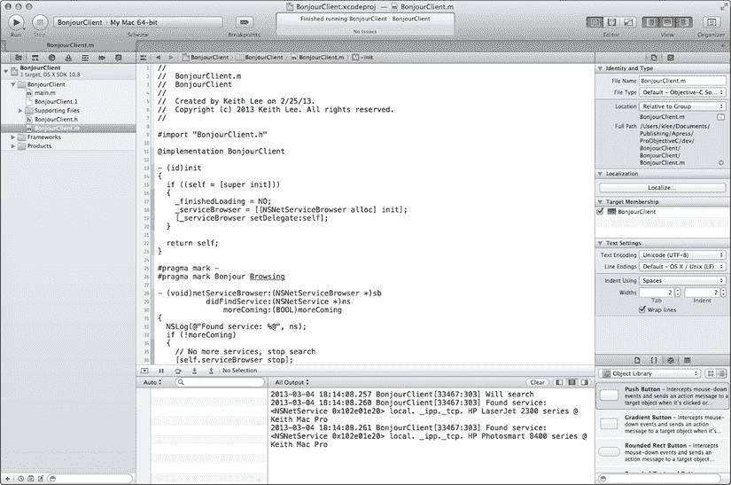

图 11-1 `BonjourClient`程序输出

如图 11-1 所示，检索到的服务会连同指示搜索开始和结束的消息一起列在输出面板中。就是这样。这个动手练习展示了如何编写一个使用 Foundation 框架 API 异步查找已注册服务的程序。请花些时间回顾此程序以及这里涵盖的关键特性——使用运行循环和 Bonjour 网络协议。完成后，让我们继续学习 URL 处理！

## URL 处理

URL 处理类用于与 URL 交互，并使用标准 Internet 协议（`ftp`、`http`、`https`、本地文件）与资源通信。这些类提供以下功能：

*   URL 加载
*   缓存管理
*   身份验证与凭据管理
*   Cookie 管理
*   协议支持

这些类还根据用户的系统偏好支持代理服务器和 SOCKET Secure（`SOCKS`）网关。

### URL 加载

`NSURL`对象用于管理 URL 及其所引用的资源。该类包含用于创建和初始化`NSURL`对象、查询 URL 以及访问 URL 组成部分（例如，主机、端口等）的方法。`NSURL`还提供了处理书签数据的方法。**书签**是对文件位置的持久引用。它是一个定位文件的有用工具，因为即使文件被移动或重命名，它也能用于重新创建指向该文件的 URL。以下代码片段演示了如何使用`NSURL` API 创建`NSURL`对象并访问其组成部分。

```
NSURL *url = [NSURL URLWithString:@"http://www.apress.com:80"];
NSLog(@"URL: scheme %@, host %@, port %@", url.scheme, url.host, url.port);
```

`NSURLRequest`和`NSMutableURLRequest`类用于表示 URL 加载请求。`NSURLRequest`独立于网络协议和 URL 方案。该类包含创建和初始化 URL 请求以及检索请求属性的方法。`NSMutableURLRequest`是`NSURLRequest`的子类，提供了允许你更改 URL 及其组成部分的方法。以下语句创建了一个可变 URL 请求，然后使用`setHTTPMethod:`方法设置 HTTP 请求方法值。

```
NSMutableURLRequest *req = [NSMutableURLRequest requestWithURL:
                            [NSURL URLWithString:@"http://www.apress.com:80"]];
[req setHTTPMethod:@"GET"];
```

`NSURLResponse`和`NSHTTPURLResponse`类用于表示 URL 请求返回的响应。`NSURLConnection`对象由执行 URL 请求同步加载的对象（`sendSynchronousRequest:returningResponse:error:`）或遵循`NSURLConnectionDataDelegate`协议的对象创建。`NSHTTPURLResponse`类是`NSURLResponse`的子类，提供了访问 URL 请求返回的 HTTP 特定信息的方法。

`NSURLConnection`和`NSURLDownload`类用于下载由 URL 标识的资源内容。`NSURLConnection`支持同步和异步资源加载、启动和停止连接，以及管理用于控制 URL 连接各个方面的委托对象（即，缓存管理、身份验证与凭据、协议支持和 Cookie 管理）。对于异步加载，必须设置一个委托对象。该对象必须遵循`NSURLConnectionDelegate`协议，因此至少需要实现以下方法：

*   `connection:didReceiveData:`（用于检索加载的数据）
*   `connection:didFailWithError:`（用于处理连接错误）
*   `connection:didFinishLoading:`（用于在连接完成数据加载后执行处理）

清单 11-13 演示了如何使用各种 URL 加载 API 从 URL 同步加载数据。

*清单 11-13.* 使用`NSURLConnection`同步加载 URL 的内容

```
NSURL *url = [NSURL URLWithString:@"http://www.apress.com/index.html"];
NSURLRequest *request = [NSURLRequest requestWithURL:url];
NSURLResponse *response;
NSError *aerror;
NSData *data = [NSURLConnection sendSynchronousRequest:request
                                     returningResponse:&response
                                                 error:&aerror];
NSLog(@"Expected content length = %lld; loaded %lu bytes",
      [response expectedContentLength], [data length]);
```

如清单 11-13 所示，代码创建了一个`NSURL`实例，然后创建了对应的`NSURLRequest`。接着创建了一个连接，并使用`NSURLConnection`的`sendSynchronousRequest:returningResponse:error:`方法加载数据。结果以`NSData`对象的形式返回。

`NSURLDownload`类用于将 URL 的内容异步下载到文件。它包含初始化下载（设置请求和委托）、设置目标路径、恢复部分下载以及取消加载请求的方法。该类还支持解码以 MacBinary、BinHex 和 gzip 格式存储的文件。委托对象必须遵循`NSURLDownloadDelegate`协议，因此至少需要实现以下方法：

*   `download:didFailWithError:`（用于处理连接错误）
*   `downloadDidFinish:`（用于在连接完成数据加载后执行处理）

`NSURLDownload`类仅适用于 OS X 平台（即，此类不适用于 iOS 平台）。

### 缓存管理

缓存管理类（`NSURLCache`和`NSCachedURLResponse`）为 URL 请求的响应提供缓存内存。`NSURLCache`类提供 URL 的通用缓存，而`NSCachedURLResponse`封装了 URL 响应（`NSURLResponse`对象）和从 URL 加载的数据（`NSData`对象）。`NSURLConnection`委托对象实现了`connection:willCacheResponse:`方法，提供了一个使用`NSURLCache`初始化的`NSCachedURLResponse`对象来管理缓存。其工作原理最好通过示例来说明；现在你将创建一个使用 URL 加载类下载资源的程序。让我们开始吧！

## 使用 URL 加载 API 下载资源


在 Xcode 中，通过从 Xcode 的**文件**菜单选择**新建**  **项目...**来创建一个新项目。在**新建项目助手**窗格中，创建一个命令行应用程序。在**项目选项**窗口中，将**产品名称**指定为`NetConnector`，将**项目类型**选择为**Foundation**，并通过选中**使用自动引用计数**复选框选择 ARC 内存管理。指定文件系统中希望创建项目的位置（如有必要，选择**新建文件夹**并输入文件夹的名称和位置），取消选中**源代码控制**复选框，然后单击**创建**按钮。

现在，你需要创建一个使用 URL 加载 API 下载 URL 资源的类。从 Xcode 的**文件**菜单中选择**新建**  **文件...**，选择**Objective-C**类模板，并将类命名为`NetConnector`。将文件位置选择为`NetConnector`文件夹，目标选择为`NetConnector`项目，然后单击**创建**按钮。接下来，在 Xcode 的项目导航器窗格中，选择生成的名为`NetConnector.h`的头文件，并更新接口，如清单 11-14 所示。

*清单 11-14.*  NetConnector 接口

```
#import <Foundation/Foundation.h>
#define HTTP_SCHEME       @"http"
#define CACHE_MEMORY_SIZE (4 * 1024 * 1024)

@interface NetConnector : NSObject <NSURLConnectionDelegate>

@property (readonly) BOOL finishedLoading;

- (id) initWithRequest:(NSURLRequest *)request;
- (void) reloadRequest;

@end
```

`NetConnector`接口采用了`NSURLConnectionDelegate`协议，从而使其能够异步加载来自`NSURLConnection`实例的数据。`finishedLoading`属性用于指示`NSURLConnection`实例何时完成数据加载。`initWithRequest:`方法初始化一个`NetConnector`对象，并使用输入的`NSURLRequest`加载一个 URL。`reloadRequest`方法用于重新加载输入的`NSURLRequest`。现在选择`NetConnector.m`文件，并更新实现，如清单 11-15 所示。

*清单 11-15.*  NetConnector 实现

```
#import "NetConnector.h"

// 扩展以声明提供的属性
@interface NetConnector()

@property NSURLRequest *request;
@property BOOL finishedLoading;
@property NSURLConnection *connector;
@property NSMutableData *receivedData;

@end

@implementation NetConnector

- (id) initWithRequest:(NSURLRequest *)request
{
  if ((self = [super init]))
  {
    _request = request;
    // 创建具有适当内存存储的 URL 缓存
    NSURLCache *URLCache = [[NSURLCache alloc] init];
    [URLCache setMemoryCapacity:CACHE_MEMORY_SIZE];
    [NSURLCache setSharedURLCache:URLCache];
    // 创建连接并开始从资源下载数据
    _connector = [NSURLConnection connectionWithRequest:request delegate:self];
  }
  return self;
}

- (void) reloadRequest
{
  self.finishedLoading = NO;
  self.connector = [NSURLConnection connectionWithRequest:self.request
                                                 delegate:self];
}

#pragma mark -
#pragma mark 代理方法

- (void)connection:(NSURLConnection *)connection
didReceiveResponse:(NSURLResponse *)response
{
  if (self.receivedData != nil)
  {
    [self.receivedData setLength:0];
  }
}

- (NSCachedURLResponse *)connection:(NSURLConnection *)connection
                  willCacheResponse:(NSCachedURLResponse *)cachedResponse
{
  NSURLResponse *response = [cachedResponse response];
  NSURL *url = [response URL];
  if ([[url scheme] isEqualTo:HTTP_SCHEME])
  {
    NSLog(@"Downloaded data, caching response");
    return cachedResponse;
  }
  else
  {
    NSLog(@"Downloaded data, not caching response");
    return nil;
  }
}

- (void)connection:(NSURLConnection*)connection didReceiveData:(NSData*)data
{
   if (self.receivedData != nil)
   {
     [self.receivedData appendData:data];
   }
   else
   {
     self.receivedData = [[NSMutableData alloc] initWithData:data];
   }
}

- (void)connectionDidFinishLoading:(NSURLConnection *)connection
{
  NSUInteger length = [self.receivedData length];
  NSLog(@"Downloaded %lu bytes from request %@", length, self.request);
  // 数据加载完成，设置标志以退出运行循环
  self.finishedLoading = YES;
}

- (void)connection:(NSURLConnection *)connection didFailWithError:(NSError *)error
{
  NSLog(@"Error loading request %@", [error localizedDescription]);
  self.finishedLoading = YES;
}

@end
```

好的，我知道代码很多，但别担心，我们将一步一步来。文件以一个分类扩展开始，该扩展声明了`NetConnector`实现中使用的私有属性。实现定义了接口声明的方法和`NSURLConnectionDelegate`协议声明的方法。`initWithRequest:`方法将输入的`NSURLRequest`赋值给私有的`NetConnector`的`request`属性，创建并初始化一个用于缓存响应的`NSURLCache`实例，最后创建一个`NSURLConnection`对象并开始下载 URL。来自清单 11-15 的以下语句创建了缓存，为其配置了内存存储，然后将其设置为连接使用的共享缓存。

```
NSURLCache *URLCache = [[NSURLCache alloc] init];
[URLCache setMemoryCapacity:CACHE_MEMORY_SIZE];
[NSURLCache setSharedURLCache:URLCache];
```

`reloadRequest`方法重新加载 URL。它首先重置`finishedLoading`标志，然后使用保存的请求创建一个新的`NSURLConnection`对象并下载 URL。

这里实现的其余方法是`NSURLConnectionDelegate`协议方法。当连接能够向请求发送响应时，会发送`connection:didReceiveResponse:`消息。如清单 11-15 所示，该方法将`receivedData`对象的长度设置为零，从而丢弃从先前请求接收到的数据。

在连接将响应存储到缓存之前，会发送`connection:willCacheResponse:`消息。这使得方法实现能够修改响应或阻止其被缓存。如清单 11-15 所示，该方法执行条件逻辑，根据 URL 的协议是否为`http`来启用/禁用响应的缓存。

当从资源接收到数据时，会发送`connection:didReceiveData:`消息。如果数据是增量接收的，此方法可能在单个请求期间被多次调用。如清单 11-15 所示，该方法将接收到的数据追加到`receivedData`对象。

当连接成功完成数据加载时，会发送`connectionDidFinishLoading:`消息。这里的实现只是在输出窗格中记录一条消息，指示连接已完成资源加载，然后设置用于退出运行循环的`finishedLoading`标志。

最后，当连接无法成功加载请求时，会发送`connection:didFailWithError:`消息。这里你只是在输出窗格中记录一条消息，指示发生的错误，并设置`finishedLoading`标志。

好的，现在你已经实现了`NetConnector`类，让我们用它来加载一个 URL。在 Xcode 的项目导航器中，选择`main.m`文件并更新`main()`函数，如清单 11-16 所示。

*清单 11-16.*  NetConnector 的`main()`函数

```
#import <Foundation/Foundation.h>
#import "NetConnector.h"

#define INDEX_URL       @"http://www.wikipedia.com/index.html"
```


```c
int main(int argc, const char * argv[])
{
  @autoreleasepool
  {
    // 获取当前运行循环
    NSRunLoop *loop = [NSRunLoop currentRunLoop];

    // 使用指定的缓存策略创建请求，然后开始下载！
    NSURLRequest *request = [NSURLRequest
                             requestWithURL:[NSURL URLWithString:INDEX_URL]
                                cachePolicy:NSURLRequestReturnCacheDataElseLoad
                            timeoutInterval:5];
    NetConnector *netConnect = [[NetConnector alloc] initWithRequest:request];
    // 循环等待直到资源加载完成（注意这个空语句！）
    while (!netConnect.finishedLoading &&
           [loop runMode:NSDefaultRunLoopMode beforeDate:[NSDate distantFuture]]);

    // 记录缓存当前使用的内存量
    NSLog(@"缓存内存使用量 = %lu 字节", [[NSURLCache sharedURLCache]
                                              currentMemoryUsage]);

    // 重新从请求加载数据，这次将从缓存中获取！
    [netConnect reloadRequest];
    while (!netConnect.finishedLoading &&
           [loop runMode:NSDefaultRunLoopMode beforeDate:[NSDate distantFuture]]);
    // 清空缓存
    [[NSURLCache sharedURLCache] removeAllCachedResponses];
  }
  return 0;
}
```

`main()`函数首先获取当前运行循环，这是使用`NSURLConnection`对象进行异步 URL 加载所必需的。接下来，通过便捷构造器`requestWithURL:cachePolicy:timeoutInterval:`创建了一个`NSURLRequest`实例。该构造器允许你为请求选择缓存策略。策略`NSURLRequestReturnCacheDataElseLoad`指定：如果缓存值可用，则应使用它（即使已过期）；否则，应从资源加载数据。请注意，如果 URL 不支持缓存，即使策略指定使用缓存，数据也不会从缓存加载。随后，使用该请求创建了一个`NetConnector`实例，其`NSURLConnection`对象开始下载资源。下一条语句是一个循环，用于保持应用程序运行，直到连接完成资源加载。

```
while (!netConnect.finishedLoading &&
       [loop runMode:NSDefaultRunLoopMode beforeDate:[NSDate distantFuture]]);
```

看起来很熟悉，对吧？这个循环与你在本章前面实现的 Bonjour 服务浏览器程序中使用的循环完全相同。它运行循环，接收来自输入源的事件并执行相应的委托方法，直到连接完成资源加载。下一条语句将缓存内存使用情况记录到输出面板，使我们能够查看缓存利用率。然后你重新加载请求。如代码清单 11-16 所示，下一组语句重新加载 URL。由于数据已存储在缓存中，并且缓存策略指定应使用缓存值，因此会立即从缓存中检索数据，而无需从 URL 加载。最后，内存中的缓存被清零，从而释放这部分内存。现在，当你编译并运行 NetConnector 程序时，你应该会在输出面板中看到消息，如图图 11-2 所示。

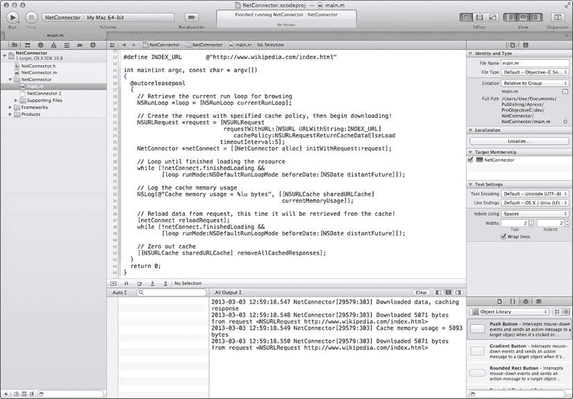

图 11-2. NetConnector 程序输出

.

如输出面板所示，数据下载后响应被缓存。然后，数据总量与请求的 URL 一起记录到控制台。接下来，输出缓存内存利用率。这与下载的数据量相同。然后重新加载请求。由于响应已经在缓存中，因此会从缓存中检索（请注意，委托方法`connection:willCacheResponse:`未被调用）。好吧，这相当复杂，不是吗？现在你已经很好地掌握了如何使用 URL 加载 API 异步下载 URL。准备好了之后，让我们继续研究在尝试加载资源时如何处理身份验证挑战。

## 身份验证和凭据管理

身份验证和凭据类（`NSURLProtectionSpace`、`NSURLCredentialStorage`、`NSURLCredential`、`NSURLAuthenticationChallenge`、和`NSURLAuthenticationChallengeSender`）为验证请求访问受保护 URL 的用户提供支持。需要身份验证的资源会向尝试加载该资源的客户端请求凭据。Foundation 框架的`NSURLAuthenticationChallenge`类封装了来自服务器的挑战，要求客户端进行身份验证。`NSURLCredential`表示用户为响应身份验证挑战而返回的身份验证凭据。当连接请求发出身份验证挑战时，`NSURLConnection`和`NSURLDownload`实例的委托协议会收到消息。应实现相应的方法以返回适当的凭据。

对于`NSURLConnectionDelegate`协议，应实现消息`connection:willSendRequestForAuthenticationChallenge:`以返回适当的凭据。NetConnector 程序中该方法的一个示例实现如代码清单 11-17 所示。

*代码清单 11-17.*  处理身份验证挑战

```
- (void)connection:(NSURLConnection *)connection
willSendRequestForAuthenticationChallenge:(NSURLAuthenticationChallenge *)challenge
{
  NSURLCredential *credential =
    [NSURLCredential credentialWithUser:@"TestUser"
                               password:@"TestPassword"
                            persistence:NSURLCredentialPersistenceForSession];
  [[challenge sender] useCredential:credential
         forAuthenticationChallenge:challenge];
}
```

如代码清单 11-17 所示，该方法创建了一个凭据，用户名为`TestUser`，密码为`TestPassword`。`useCredential:forAuthenticationChallenge:`消息使用此凭据来响应连接的身份验证挑战。

## Cookie 管理

Foundation 框架类`NSHTTPCookie`和`NSHTTPCookieStorage`简化了*HTTP cookie*的创建和管理，这些 cookie 用于在 URL 请求间提供数据的持久存储。`NSHTTPCookie`实例表示一个 cookie，而`NSHTTPCookieStorage`是一个用于管理 cookie 的单例对象。对于 OS X 应用程序，cookie 在进程间共享并保持同步。会话 cookie 是单个进程本地的，不在程序之间共享。`NSHTTPCookie`类提供了创建 cookie、将 cookie 转换为请求头以及检索 cookie 属性的方法。`NSHTTPCookieStorage`类提供了检索共享 cookie 存储实例、管理 cookie 接受策略以及管理（即添加、移除、检索）cookie 的方法。

## 协议支持
```


