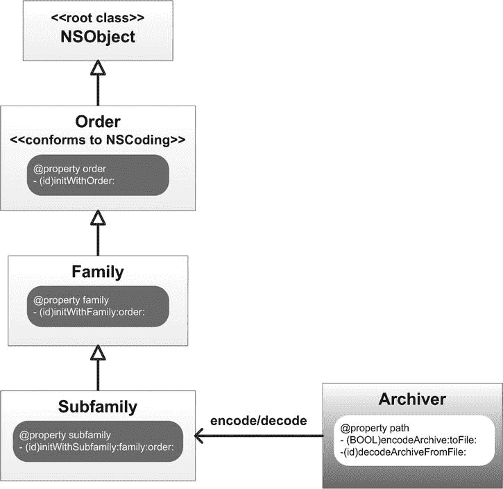
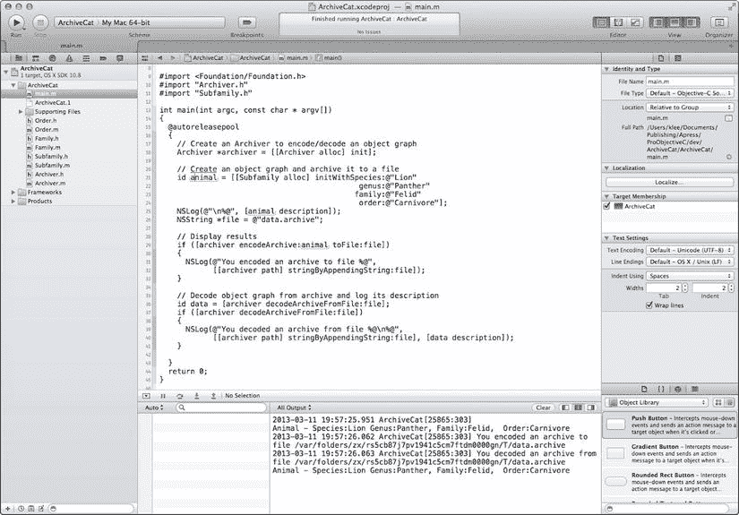

# Foundation 框架归档与序列化

Foundation 框架中的归档和序列化类实现了将对象（即对象图）转换为与架构无关的字节缓冲区的机制。这些数据可以写入文件或通过网络传输到另一个进程。随后，这些数据可以转换回对象，并保留相关的对象图。通过这种方式，这些类提供了一种轻量级的数据持久化方法。序列化过程保留数据以及对象层次结构中对象的位置，而归档过程则更为通用——它保留数据、数据类型以及对象层次结构中对象之间的关系。

### 归档

`NSCoder` 是一个抽象类，声明了用于**编组**（*marshal*）和**解组**（*unmarshall*）对象图的接口。编组过程将对象的信息转换为一系列字节，解组过程则从（先前编组的）字节序列中创建对象。`NSCoder` 包含用于编码和解码各种数据类型的方法，用于测试 `NSCoder` 实例，并提供对安全编码的支持。Foundation 框架包含 `NSCoder` 的四个具体子类：`NSArchiver`、`NSUnarchiver`、`NSKeyedArchiver` 和 `NSKeyedUnarchiver`。

#### 顺序归档

`NSArchiver` 和 `NSUnarchiver` 用于创建*顺序*归档，这意味着顺序归档中的对象和值必须以与编码时相同的顺序进行解码。此外，在解码顺序归档时，必须解码整个对象图。`NSArchiver` 用于编码对象以写入文件或用于其他用途，而 `NSUnarchiver` 用于从归档中解码对象。`NSArchiver` 包含用于初始化、归档数据、检索归档数据以及在归档中替换类或对象的方法。`NSUnarchiver` 包含用于初始化、解码对象、替换类或对象以及管理的方法。

#### 键控归档

`NSArchiver` 和 `NSUnarchiver` 是顺序归档，而 `NSKeyedArchiver` 和 `NSKeyedUnarchiver` 是键控归档——归档中的每个值都可以单独命名/键控。键必须在正在编码/解码值的对象作用域内唯一。在解码键控归档时，值可以不按顺序解码，或者根本不解码。因此，键控归档提供了更好的向前和向后兼容性支持，并且推荐使用它们而不是顺序归档类。`NSKeyedArchiver` 包含用于初始化、归档数据、编码数据和对象以及管理的方法。`NSKeyedUnarchiver` 包含用于初始化、解归档数据、解码对象以及管理的方法。

列表 12-5 中显示的代码使用 `NSKeyedArchiver` 的 `archiveRootObject:` 方法，将名为 `greeting` 的 `NSString` 实例归档到当前目录下名为 `greeting.archive` 的文件中。

*列表 12-5.*  使用 `NSKeyedArchiver` 归档对象

```objc
NSString *greeting = @"Hello, World!";
NSString *cwd = [[NSFileManager defaultManager] currentDirectoryPath];
NSString *archivePath = [cwd stringByAppendingString:@"/greeting.archive"];
BOOL result = [NSKeyedArchiver archiveRootObject:greeting toFile:archivePath];
```

下一个代码片段使用 `NSKeyedUnarchiver` 的 `unarchiveObjectWithFile:` 方法，从存储在文件 `archivePath` 中的归档中解码一个名为 `greeting` 的 `NSString` 对象。

```objc
NSString *greeting = [NSKeyedUnarchiver unarchiveObjectWithFile:archivePath];
```

### 编码和解码对象

虽然 `NSKeyedArchiver` 和 `NSKeyedUnarchiver` 类负责归档过程，但一个类必须遵循 `NSCoding` 协议才能支持类实例的编码/解码。该协议声明了两个方法，`encodeWithCoder:` 和 `initWithCoder:`，用于编码/解码对象的状态（例如，其属性和实例变量）。当一个*编码器对象*（即 `NSKeyedArchiver` 或 `NSKeyedUnarchiver` 实例）归档一个对象时，它会通过调用该对象的 `encodeWithCoder:` 方法指示其编码自身状态。因此，一个类必须实现适当的编码和解码方法，因为这些方法将由所选的编码器对象调用。列表 12-6 展示了一个名为 `MyType` 的类的实现，该类遵循 `NSCoding` 协议。

*列表 12-6.*  实现 `NSCoding` 协议方法

```objc
@interface MyType : NSObject <NSCoding>

@property NSString *type;

@end

@implementation MyType

- (void)encodeWithCoder:(NSCoder *)coder
{
  [coder encodeObject:self.type forKey:@"TYPE_KEY"];
}

- (id)initWithCoder:(NSCoder *)coder
{
  if ((self = [super init]))
  {
    type = [coder decodeObjectForKey:@"TYPE_KEY"];
  }
  return self;
}

@end
```

### 属性列表序列化

属性列表序列化提供了一种将*属性列表*（一种按名称-值对组织的数据结构集合）转换为与架构无关的字节流或从字节流转换的方法。Foundation 框架的 `NSPropertyListSerialization` 类提供了直接序列化和反序列化属性列表以及验证属性列表的方法。它还支持属性列表与 XML 或优化的二进制格式之间的转换。与归档相比，基本序列化不记录值的数据类型及其之间的关系；只记录值本身。因此，您必须编写代码以正确的类型和正确的顺序反序列化数据。

属性列表将数据组织为命名值以及值的集合。它们常用于存储、组织和访问标准类型的数据。属性列表可以通过编程方式创建，或者更常见的是作为 XML 文件创建。

#### XML 属性列表

属性列表最常见的形式是存储在 XML 文件中，称为 *XML plist* 文件。`NSArray` 和 `NSDictionary` 类都有方法可以将自身持久化为 XML 属性列表文件，以及从 XML plist 创建类实例。

#### `NSPropertyListSerialization`

`NSPropertyListSerialization` 类支持以编程方式创建属性列表。该类支持以下 Foundation 数据类型（括号中提供了相应的 Core Foundation 免费桥接数据类型）：

*   `NSData` (`CFData`)
*   `NSDate` (`CFDate`)
*   `NSNumber`：整数、浮点数和布尔值 (`CFNumber`、`CFBoolean`)
*   `NSString` (`CFString`)
*   `NSArray` (`CFArray`)
*   `NSDictionary` (`CFDictionary`)

由于支持的数据类型包括集合类 `NSArray` 和 `NSDictionary`，而它们各自又可以包含其他集合，因此 `NSPropertyListSerialization` 对象可用于创建数据层次结构。由于属性列表结构化为名称-值对的集合，因此在编程创建属性列表数据时使用字典。列表 12-7 演示了如何使用实例方法 `dataWithPropertyList:format:options:error:` 将名-值对的 `NSDictionary` 属性列表集合序列化到名为 `plistData` 的数据缓冲区。

*列表 12-7.*  名称-值对的属性列表序列化

```objc
NSError *errorStr;
NSDictionary *data = @{ @"FirstName" : @"John", @"LastName" : @"Doe" };
NSData *plistData = [NSPropertyListSerialization dataWithPropertyList:data
                     format:NSPropertyListXMLFormat_v1_0
                     options:0
                     error:&errorStr];
```


`format:`参数指定属性列表格式，类型为枚举`NSPropertyListFormat`。允许的值如下：

- `NSPropertyListOpenStepFormat`：传统 ASCII 属性列表格式。
- `NSPropertyListXMLFormat_v1_0`：XML 属性列表格式。
- `NSPropertyListBinaryFormat_v1_0`：二进制属性列表格式。

`options:`参数用于指定选定的属性列表写入选项。此参数目前未使用，应设置为 0。如果该方法未成功完成，则会在`error:`参数中返回一个`NSError`对象，用于描述错误情况。Listing 12-8 演示了如何使用`propertyListWithData:options:format:error:`方法从 Listing 12-7 的`plistData`数据缓冲区反序列化属性列表。

*Listing 12-8.* 属性列表反序列化

```
NSError *errorStr;
NSDictionary *plist = [NSPropertyListSerialization
                       propertyListWithData:plistData
                       options:NSPropertyListImmutable
                       format:NULL
                       error:&errorStr];
```

`options:`参数指定属性列表读取选项。此值可以是枚举类型`NSPropertyListMutabilityOptions`中的任意值。可能的值如下：

- `NSPropertyListImmutable`：返回的属性列表包含不可变对象。
- `NSPropertyListMutableContainers`：返回的属性列表具有可变容器，但叶子节点不可变。
- `NSPropertyListMutableContainersAndLeaves`：返回的属性列表具有可变容器和可变叶子节点。

`format:`参数包含属性列表存储的格式。如果提供值`NULL`，则无需知道格式。格式可能的非`NULL`值属于枚举类型`NSPropertyListFormat`。

属性列表序列化不会保留对象的完整类标识，仅保留其一般类型。换句话说，属性列表对象可以是前述任何支持的类型。当集合类作为属性列表存储时，其元素也必须在支持的属性列表数据类型列表中。此外，`NSDictionary`属性列表对象的键必须是字符串类型（`NSString`）。因此，如果对属性列表进行序列化然后再反序列化，结果属性列表中的对象可能与原始属性列表中的对象不属于同一类。特别地，当属性列表被序列化时，容器对象（即`NSDictionary`和`NSArray`对象）的可变性不会被保留。然而，在反序列化时，你可以选择将所有容器对象创建为可变或不可变。

属性列表序列化也不会追踪多次引用的对象。属性列表中对某个对象的每个引用都会分别进行序列化，导致反序列化时产生多个实例。

归档对象图

好了，现在你已经对归档和序列化类有了很好的了解，接下来将创建一个程序来演示 Foundation 框架归档 API 的使用。该程序将从类层次结构创建一个对象图，然后对对象图进行编码和解码。你将开发的类在图 12-1 中进行了说明。



图 12-1. ArchiveCat 程序类层次结构

如图 12-1 所示，该程序包含一个类层次结构（`Subfamily`-`Family`-`Order`类）和一个用于归档此类层次结构实例的类（`Archiver`）。在 Xcode 中，通过从 Xcode 文件菜单中选择 **New  Project . . .** 来创建新项目。在 **New Project Assistant** 窗格中，创建一个命令行应用程序。在 **Project Options** 窗口中，将产品名称指定为 **ArchiveCat**，选择 **Foundation** 作为项目类型，并通过选中 **Use Automatic Reference Counting** 复选框选择 ARC 内存管理。指定你希望项目在文件系统中创建的位置（如有必要，选择 **New Folder** 并输入文件夹的名称和位置），取消选中 **Source Control** 复选框，然后点击 **Create** 按钮。

接下来，你将创建对象图的类层次结构。先从基类开始，然后依次实现其余子类。从 Xcode 文件菜单中选择 **New  File . . .**，选择 **Objective-C** 类模板，并将类命名为 **Order**。选择 **ArchiveCat** 文件夹作为文件位置，选择 **ArchiveCat** 项目作为目标，然后点击 **Create** 按钮。接着，在 Xcode 项目导航器窗格中，选择生成的标题文件 **Order.h** 并更新接口，如 Listing 12-9 所示。

*Listing 12-9.* Order 接口

```
#import <Foundation/Foundation.h>

@interface Order : NSObject <NSCoding>

@property (readonly) NSString *order;

- (id)initWithOrder:(NSString *)order;

@end
```

`Order`接口采用了`NSCoding`协议，这是支持归档的类所必需的。只读属性`order`标识生物学分类中的目组。`initWithOrder:`方法初始化一个`Order`对象，将该属性设置为输入参数值。现在选择 **Order.m** 文件并更新实现，如 Listing 12-10 所示。

*Listing 12-10.* Order 实现

```
#import "Order.h"

@implementation Order

- (id)initWithOrder:(NSString *)order
{
  if ((self = [super init]))
  {
    _order = order;
  }

return self;
}

- (id)initWithCoder:(NSCoder *)coder
{
  if ((self = [super init]))
  {
    _order = [coder decodeObjectForKey:@"ORDER_KEY"];
  }
  return self;
}

- (void)encodeWithCoder:(NSCoder *)coder
{
  [coder encodeObject:self.order forKey:@"ORDER_KEY"];
}

- (NSString *) description
{
  return [NSString stringWithFormat:@"Order:%@", self.order];
}

@end
```

`initWithOrder:`的实现与你本书其他部分开发的`init`方法非常相似。它只是将`order`输入参数赋值给`order`属性的后备实例变量。

`initWithCoder:`方法由`NSCoding`协议声明，它使用归档状态初始化对象。其输入参数`coder`是用于解码`Order`实例归档的`NSCoder`实例。`Order`的父类是`NSObject`；由于`NSObject`没有采用`NSCoding`协议，`self`变量被赋值为父类`init`调用的返回值。

```
self = [super init]
```

接下来，`Order`类的状态（由其属性和实例变量表示）被解码和初始化。由于`Order`类有一个名为`order`的属性，该属性的实例变量被赋值为`decodeObjectForKey:`方法解码的值，其中键名为`ORDER_KEY`。


`encodeWithCoder:` 方法用于归档 `Order` 类的状态，其输入参数 `coder` 是用于编码 `Order` 实例归档的 `NSCoder` 实例。由于 `Order` 的父类未采用 `NSCoding` 协议，此方法不会调用父类的 `encodeWithCoder:` 方法，仅编码 `Order` 类的状态。具体而言，该方法为每个需要归档的属性/变量调用编码器上的 `encodeWithCoder:` 方法。

```
[coder encodeObject:self.order forKey:@"ORDER_KEY"];
```

最后，该类重写了（继承自父类的）`description` 方法，返回一个列出 `order` 属性值的文本字符串。

现在您将实现层级结构中的下一个类。从 Xcode 的 File 菜单中选择 **新建  文件 . . .**，选择 **Objective-C** 类模板，并将类命名为 **Family**。选择 **ArchiveCat** 文件夹作为文件位置，**ArchiveCat** 项目作为目标，然后点击 **创建** 按钮。接下来，在 Xcode 项目导航器窗格中，选择生成的头文件 **Family.h**，并更新接口，如 清单 12-11 所示。

*清单 12-11.*  Family 接口

```
#import "Order.h"

@interface Family : Order

@property(readonly) NSString *family;

- (id)initWithFamily:(NSString *)family order:(NSString *)order;

@end
```

`Family` 接口继承自 `Order` 类，因此采用了 `NSCoding` 协议。只读属性 `family` 指定了生物分类中的科属分组。`initWithFamily:order:` 方法初始化一个 `Family` 对象，将 `family` 和 `order` 属性设置为提供的输入参数值。现在选择 **Family.m** 文件并更新实现，如 清单 12-12 所示。

*清单 12-12.*  Family 实现

```
#import "Family.h"

@implementation Family

- (id)initWithFamily:(NSString *)family order:(NSString *)order
{
  if ((self = [super initWithOrder:order]))
  {
    _family = family;
  }

return self;
}

- (id)initWithCoder:(NSCoder *)coder
{
  if ((self = [super initWithCoder:coder]))
  {
    _family = [coder decodeObjectForKey:@"FAMILY_KEY"];
  }
  return self;
}

- (void)encodeWithCoder:(NSCoder *)coder
{
  [super encodeWithCoder:coder];
  [coder encodeObject:self.family forKey:@"FAMILY_KEY"];
}

- (NSString *) description
{
  return [NSString stringWithFormat:@"Family:%@, %@", self.family,
          [super description]];
}

@end
```

此实现与 `Order` 类非常相似，因此您只需关注关键差异。`initWithFamily:order:` 调用父类 `initWithOrder:` 方法以正确初始化父类状态，然后将 `family` 输入参数赋值给属性的后备实例变量。

`initWithCoder:` 方法与为 `Order` 类提供的方法（如 清单 12-10 所示）非常相似。然而，由于 `Family` 类的父类（`Order`）采用了 `NSCoding` 协议，`self` 变量被赋值为父类 `initWithCoder:` 调用的返回值。

```
self = [super initWithCoder:coder]
```

通过这种方式，父类状态（`order` 属性）被正确初始化。接下来，`Family` 类的状态（由其属性和实例变量表示）被解码并初始化。由于 `Family` 类只有一个名为 `family` 的属性，该属性的实例变量被赋值为编码器的 `decodeObjectForKey:` 方法解码后的值，其中键名为 `FAMILY_KEY`。

`encodeWithCoder:` 方法用于归档 `Family` 类的状态。因为 `Family` 的父类（`Order` 类）采用了 `NSCoding` 协议，此方法首先调用父类的 `encodeWithCoder:` 方法。接着，它为每个需要归档的属性/变量调用编码器上的 `encodeWithCoder:` 方法；在本例中，即 `family` 属性。

与 `Order` 类一样，`description` 方法返回一个文本字符串，由 `family` 属性值与其父类的描述值拼接而成。

```
return [NSString stringWithFormat:@"Family:%@, %@", self.family,
        [super description]];
```

现在您将实现层级结构中的最后一个类。从 Xcode 的 File 菜单中选择 **新建  文件 . . .**，选择 **Objective-C** 类模板，并将类命名为 **Subfamily**。选择 **ArchiveCat** 文件夹作为文件位置，**ArchiveCat** 项目作为目标，然后点击 **创建** 按钮。接下来，在 Xcode 项目导航器窗格中，选择生成的头文件 **Subfamily.h**，并更新接口，如 清单 12-13 所示。

*清单 12-13.*  Subfamily 接口

```
#import "Family.h"

@interface Subfamily : Family

@property(readonly) NSString *genus;
@property(readonly) NSString *species;

- (id)initWithSpecies:(NSString *)species
             genus:(NSString *)genus
            family:(NSString *)family
             order:(NSString *)order;

@end
```

`Subfamily` 接口继承自 `Family` 类。只读属性 `genus` 和 `species` 指定了生物分类中动物群的属和种。`initWithSpecies:family:order:` 方法初始化一个 `Subfamily` 对象，类似于 `Family` 和 `Order` 类的对应方法。现在选择 **Subfamily.m** 文件并更新实现，如 清单 12-14 所示。

*清单 12-14.*  Subfamily 实现

```
#import "Subfamily.h"

@implementation Subfamily

- (id)initWithSpecies:(NSString *)species
             genus:(NSString *)genus
            family:(NSString *)family
             order:(NSString *)order
{
  if ((self = [super initWithFamily:family order:order]))
  {
    _species = species;
    _genus = genus;
  }

return self;
}

- (id)initWithCoder:(NSCoder *)coder
{
  if ((self = [super initWithCoder:coder]))
  {
    _species = [coder decodeObjectForKey:@"SPECIES_KEY"];
    _genus = [coder decodeObjectForKey:@"GENUS_KEY"];
  }
  return self;
}

- (void)encodeWithCoder:(NSCoder *)coder
{
  [super encodeWithCoder:coder];
  [coder encodeObject:self.species forKey:@"SPECIES_KEY"];
  [coder encodeObject:self.genus forKey:@"GENUS_KEY"];
}

- (NSString *) description
{
  return [NSString stringWithFormat:@"Animal - Species:%@ Genus:%@, %@",
          self.species, self.genus, [super description]];
}

@end
```

此实现与 `Family` 类非常相似，主要区别在于 `Subfamily` 类的状态（`genus` 和 `species` 属性）。在其他所有方面，逻辑都是相同的，您可以比较 清单 12-12 和 清单 12-14 来验证。现在您将实现用于归档该层级结构的类。从 Xcode 的 File 菜单中选择 **新建  文件 . . .**，选择 **Objective-C** 类模板，并将类命名为 **Archiver**。选择 **ArchiveCat** 文件夹作为文件位置，**ArchiveCat** 项目作为目标，然后点击 **创建** 按钮。接下来，在 Xcode 项目导航器窗格中，选择生成的头文件 **Archiver.h**，并更新接口，如 清单 12-15 所示。

*清单 12-15.*  Archiver 接口


```objectivec
#import <Foundation/Foundation.h>

@interface Archiver : NSObject

@property (readwrite) NSString *path;

- (BOOL) encodeArchive:(id)data toFile:(NSString *)file;
- (id) decodeArchiveFromFile:(NSString *) file;

@end
```

`Archiver`接口有一个名为`path`的属性，该属性定义了存档文件的写入路径。`encodeArchive:toFile:`和`decodeArchiveFromFile:`方法用于在文件系统中对存档进行编码/解码。现在选择`Archiver.m`文件并更新其实现，如列表 12-16 所示。

*列表 12-16.* `Archiver`实现

```objectivec
#import "Archiver.h"

@implementation Archiver

- (id) init
{
  if ((self = [super init]))
  {
    _path = NSTemporaryDirectory();
  }

return self;
}

- (BOOL) encodeArchive:(id)objectGraph toFile:(NSString *)file
{
  NSString *archivePath = [self.path stringByAppendingPathComponent:file];

// 创建用于编码数据的归档器
  NSMutableData *mdata = [[NSMutableData alloc] init];
  NSKeyedArchiver *archiver = [[NSKeyedArchiver alloc]
                               initForWritingWithMutableData:mdata];

// 使用简单字符串作为键来编码数据
  [archiver encodeObject:objectGraph forKey:@"FELINE_KEY"];
  [archiver finishEncoding];

// 将编码后的数据写入文件，并返回写入状态
  BOOL result = [mdata writeToFile:archivePath atomically:YES];
  return result;
}

- (id) decodeArchiveFromFile:(NSString *) file
{
  // 获取存档文件的路径
  NSString *archivePath = [self.path stringByAppendingPathComponent:file];

// 创建用于解码数据的解档器
  NSData *data = [[NSMutableData alloc] initWithContentsOfFile:archivePath];
  NSKeyedUnarchiver *unarchiver = [[NSKeyedUnarchiver alloc]
                                   initForReadingWithData:data];

// 使用简单字符串作为键来解码数据
  id result = [unarchiver decodeObjectForKey:@"FELINE_KEY"];
  [unarchiver finishDecoding];

// 返回解码后的数据
  return result;
}

@end
```

如列表 12-16 所示，`init`方法设置了`path`属性的值。它使用 Foundation 框架中的`NSTemporaryDirectory()`函数创建指向用户临时目录的路径，并将该值赋给属性对应的实例变量。

`encodeArchive:toFile:`方法将对象图编码到文件中。它通过将`path`属性与输入的文件名拼接来创建文件路径，然后创建一个可变数据对象用于归档对象图。接着，它创建一个以该数据对象初始化的`NSKeyArchiver`实例来执行归档操作。它使用键`FELINE_KEY`将对象图编码到数据对象中，然后完成编码。最后，它将归档后的数据对象写入文件，并返回一个布尔值指示写入成功/失败。

`decodeArchiveFromFile:`方法从文件中解码存档，并返回初始化的对象图。它通过将`path`属性与输入的文件名拼接来创建文件路径，然后创建一个用于解档的数据对象。接着，它创建一个以该数据对象初始化的`NSKeyUnarchiver`实例来执行解档操作。它使用键`FELINE_KEY`将对象图解码到数据对象中，完成解码，然后返回初始化的对象图。

就是这样！现在你已经实现了类层次结构及归档类，接下来让我们用它来归档一个对象图。在 Xcode 项目导航器中，选择`main.m`文件并更新`main()`函数，如列表 12-17 所示。

*列表 12-17.* `ArchiveCat`的`main()`函数

```objectivec
#import <Foundation/Foundation.h>
#import "Archiver.h"
#import "Subfamily.h"

int main(int argc, const char * argv[])
{
  @autoreleasepool
  {
    // 创建一个 Archiver 对象用于编码/解码对象图
    Archiver *archiver = [[Archiver alloc] init];

// 创建一个对象图并将其归档到文件
    id animal = [[Subfamily alloc] initWithSpecies:@"Lion"
                                             genus:@"Panther"
                                            family:@"Felid"
                                             order:@"Carnivore"];
    NSLog(@"\n%@", [animal description]);
    NSString *file = @"data.archive";

// 显示结果
    if ([archiver encodeArchive:animal toFile:file])
    {
      NSLog(@"You encoded an archive to file %@",
            [[archiver path] stringByAppendingString:file]);
    }

// 从存档中解码对象图并记录其描述
    id data = [archiver decodeArchiveFromFile:file];
    if ([archiver decodeArchiveFromFile:file])
    {
      NSLog(@"You decoded an archive from file %@\n%@",
            [[archiver path] stringByAppendingString:file], [data description]);
    }

}
  return 0;
}
```

如列表 12-17 所示，`main()`函数首先创建一个`Archiver`对象。然后创建对象图，将其描述输出到控制台，并命名存档文件。接着，将对象图归档到指定的存档文件，如果成功，则在控制台中输出一条消息。

接下来的一组语句从存档中解码对象图。首先，它使用`Archiver`的`decodeArchiveFromFile:`方法解码存档。然后对方法调用的结果进行条件检查，如果返回了对象图（意味着操作成功完成），则将对象图的描述输出到控制台。现在编译并运行`ArchiveCat`程序，你应该能在输出面板中看到类似于图 12-2 所示的消息。



图 12-2. `ArchiveCat`程序输出

如输出面板所示，创建了一个`Subfamily`对象（即对象图）并用输入参数进行初始化，其描述被输出到控制台。接着，对象被归档到指定文件，存档文件的完整路径被输出到控制台。然后从存档中解码出一个对应的对象，其描述也被输出到控制台。由于最初创建的对象与从存档中解码出的对象描述完全相同，这验证了存档被正确编码和解码。这展示了如何使用归档 API 对存档进行编码/解码。请仔细查看这段代码，确保你对归档过程有很好的理解。准备好后，我们接着讨论分布式对象。

分布式对象

分布式对象类提供了分布式对象通信的功能；本质上是一个进程中的对象向另一个进程中的对象发送消息。`NSConnection`类管理不同线程和/或进程中分布式对象之间的连接。`NSDistantObject`是`NSProxy`的子类，为其他线程或进程中的分布式对象定义代理。`NSProtocolChecker`也是`NSProxy`的子类，它定义一个对象来限制可以发送给另一个对象（其代理）的消息。协议检查器是一种代理，它只将收到的消息转发给目标对象，当且仅当这些消息包含在其指定的协议中。


