# 第 13 章 Foundation 函数与数据类型

Foundation 框架不仅由类组成，还包括大量的函数、数据类型和常量。现在你可能会想：“为什么我还需要这些额外的 API？毕竟，Objective-C 是一种面向对象的编程语言，Foundation 框架已经提供了完整的类集。” 实际上，这些 API 是 Foundation 框架的重要组成部分，它们共同为 Objective-C 软件开发提供了各种基本功能。在本章中，你将探索这些 API 以及提供的示例代码，了解如何在你的程序中使用它们。

## Foundation 函数

Foundation 框架定义了许多函数和类似函数的宏。Apple Foundation Functions Reference 为这些函数提供了权威指南。在这里，你将学习执行以下任务的 Foundation 函数：

*   断言与日志记录
*   字符串本地化
*   数值运算与字节序
*   运行时操作

### 断言

断言是放置在代码中的一条语句，用于检查某个条件是否存在。断言用于提供运行时验证，验证那些如果不成立就应导致程序终止的假设。使用断言进行编程是检测和纠正错误最快、最有效的方法之一。断言还可以记录程序的逻辑，从而提高可维护性。

每个断言包含一个布尔表达式，你相信当断言执行时该表达式为真。如果表达式为假，系统将抛出一个错误。通过验证表达式确实为真，断言确认了你对程序行为的假设，增加了你对程序没有错误的信心。

以下是应该使用断言的场景示例：

*   *内部不变性*：关于程序行为的假设。这种假设通常通过代码中的注释来指明，但可以在运行时使用断言进行文档化和验证。
*   *控制流不变性*：关于控制流的假设，特别是代码中不应达到的位置。
*   *前置条件*：在调用方法之前必须为真的条件。
*   *后置条件*：在调用方法之后必须为真的条件。
*   *类不变性*：对每个类实例都必须为真的条件。

*内部不变性*的一个示例是 Listing 13-1 中的条件表达式。

*Listing 13-1.* 包含内部不变性的条件表达式示例

```
if (value >= 0)
{
  ...
}
else
{
  // value must be negative
  ...
}
```

如 Listing 13-1 所示，这些假设通常通过代码中的注释来指明，但可以在运行时使用断言进行文档化和验证。Listing 13-1 的代码片段在 Listing 13-2 中被更新，使用断言来表达该不变性。

*Listing 13-2.* 使用断言表达内部不变性的示例

```
if (value >= 0)
{
  ...
}
else
{
  NSAssert((value < 0), @"Value not valid here, should be negative");
  ...
}
```

一种常见的前置条件是检查方法（或函数）输入参数的条件。对于公有方法，前置条件在代码中显式检查，如果条件不满足则抛出适当的异常，因此不应使用断言来检查。断言可用于检查私有方法和函数的前置条件。

断言可用于测试公有和私有方法/函数的后置条件。

*类不变性*约束了每个类实例的属性（即内部状态）和行为。断言可以以类似于表达前面讨论的其他场景的方式来定义类不变性。


#### 断言宏

Foundation 断言函数实际上是宏，用于在 Objective-C 代码中创建断言。每个断言宏会评估一个条件，如果该条件评估为假，则向一个 `NSAssertionHandler` 实例传递一个描述失败信息的字符串（可能还包含额外的 `printf` 风格参数格式化到该字符串中）。`NSAssertionHandler` 是 Foundation 框架中用于处理假断言的一个类，并且每个程序线程都有自己的 `NSAssertionHandler` 对象。因此，当 Foundation 断言宏的条件评估为假时，它会将描述错误的字符串传递给当前线程的 `NSAssertionHandler` 对象。该对象随后会记录错误，并抛出一个异常（具体来说是 `NSInternalInconsistencyException`），导致程序终止。`NSAssertionHandler` 实例通常不通过编程方式创建，而是由断言函数创建。

有多个 Foundation 断言宏用于支持在 Objective-C 方法和函数中创建断言。每个断言宏至少有一个参数：一个评估为真或假的条件表达式。大多数还包含一个参数，其中包含描述错误条件的格式化字符串。断言宏支持在格式化字符串中替换零到五个参数。完整的 Foundation 断言函数列表见表 13-1。

表 13-1。Foundation 断言函数
| Foundation 函数 | 描述 |
| --- | --- |
| `NSAssert` | 如果给定条件评估为 `NO`（假），则为 Objective-C 方法生成一个断言。其参数包括条件表达式和一个描述错误的格式化字符串（无格式说明符）。 |
| `NSAssert1` | 类似于 `NSAssert`，其参数包括条件表达式、一个格式化字符串（带一个格式说明符），以及一个要插入到格式化字符串中的参数。 |
| `NSAssert2`, `NSAssert3`, `NSAssert4`, `NSAssert5` | 类似于 `NSAssert`，其参数包括条件表达式、一个格式化字符串（分别带两个、三个、四个或五个格式说明符），以及要插入到格式化字符串中的两个、三个、四个或五个参数。 |
| `NSParameterAssert` | 为 Objective-C 方法的参数生成一个断言。其参数是一个用于参数的条件表达式。 |
| `NSCAssert` | 为 Objective-C 函数生成一个断言：如果给定条件评估为 `NO`（假）。其参数包括条件表达式和一个描述错误的格式化字符串（无格式说明符）。 |
| `NSCAssert1` | 类似于 `NSCAssert`，其参数包括条件表达式、一个格式化字符串（带一个格式说明符），以及一个要插入到格式化字符串中的参数。 |
| `NSCAssert2`, `NSCAssert3`, `NSCAssert4`, `NSCAssert5` | 类似于 `NSCAssert`，其参数包括条件表达式、一个格式化字符串（分别带两个、三个、四个或五个格式说明符），以及要插入到格式化字符串中的两个、三个、四个或五个参数。 |
| `NSCParameterAssert` | 为 Objective-C 函数的参数生成一个断言。其参数是一个用于参数的条件表达式。 |

以下语句使用 `NSAssert` 函数来断言名为 `age` 的变量的值在规定的范围内。

```
NSAssert((age > 0) && (age <=18), @"Variable age not within prescribed range");
```

在下一条语句中，执行了相同的断言，但这次使用 `NSAssert1` 函数，以便在断言失败时记录该变量的值。

```
NSAssert1((age > 0) && (age <=18),
  @"Value %d for age not within prescribed range", age);
```

断言可用于检查私有方法或函数的参数。公开方法/函数的参数检查通常是相关已发布 API 的一部分；因此，无论断言是否启用，都应该检查这些参数。代码清单 13-3 使用 `NSParameterAssert` 函数来断言方法 `encodeArchive:toFile:` 的参数具有有效值。

*代码清单 13-3.* 使用 NSParameterAssert 断言方法参数值

```
- (BOOL) encodeArchive:(id)objectGraph toFile:(NSString *)file
{
  NSParameterAssert(file != nil);
  NSParameterAssert([objectGraph conformsToProtocol:@protocol(NSCoding)]);
 ...
}
```

你可以通过定义预处理器宏来禁用代码中的断言；例如，`NS_BLOCK_ASSERTIONS`。

```
#define NS_BLOCK_ASSERTIONS
```

### 日志记录

Foundation 框架包含两个函数，`NSLog` 和 `NSLogv`，用于将输出记录到系统日志设施。在 Xcode 中，这些函数的错误消息会显示在 Xcode 的输出面板中。到目前为止，通过本书提供的示例源代码，你应该已经熟悉了 `NSLog` 函数，因此这里将重点介绍 `NSLogv` 函数。

与 `NSLog` 一样，`NSLogv` 也用于将错误消息记录到系统日志设施。它的不同之处在于支持可变参数列表。`NSLog` 函数的声明如下：

```
void NSLogv(NSString *format, va_list args);
```

变量 `format` 是一个格式化字符串，变量 `args` 是一种用于向函数提供（可变）参数列表的数据类型。所以你可能会想，什么时候会用到 `NSLogv`？如果你有一个接受可变参数列表的方法或函数，那么可以使用 `NSLogv` 来记录包含此列表的消息。例如，声明如下的可变参数函数 `printArgs`：

```
void printArgs(int numArgs, ...);
```

它可以将一定数量的函数参数记录到系统日志设施，其中参数是一个可变列表（由 `...` 可变参数符号指定），并且该列表中要记录的参数数量由 `numArgs` 函数参数指定。给定此函数声明，代码清单 13-4 演示了如何使用 `NSLogv` 函数实现该函数。

*代码清单 13-4.* 使用 NSLogv 记录可变参数列表

```
void printArgs(int numArgs, ...)
{
  va_list args;
  va_start(args, numArgs);
  va_end(args);
  NSMutableString *format = [[NSMutableString alloc] init];
  [format appendString:@"Arguments: "];
  for (int ii=0; ii<numArgs-1; ii++)
  {
    [format appendString:@"%@, "];
  }
  if (numArgs > 1)
  {
    [format appendString:@"%@"];
  }
  NSLogv(format, args);
}
```

如果此函数按如下方式调用：

```
printArgs(3, @"Hello", @"Objective-C", @"World!");
```

它会在控制台记录以下消息：

```
Arguments: Hello, Objective-C, World!
```

### Bundle 包

Foundation 框架包含几个用于获取本地化字符串的函数宏。它们用于从程序的字符串文件中加载字符串。在开始研究这些宏之前，我们先花点时间讨论一下国际化和本地化。

国际化是设计应用程序的过程，使其能够服务于不同的语言和地区（即区域设置）而无需更改。*本地化*是将国际化应用程序适应本地市场的过程。本地化可以应用于应用程序的许多部分，包括其可见文本、图标和图形、视图以及数据。

#### 本地化字符串


本地化可见文本是本地化过程中的关键部分。需要在代码中进行本地化的字符串必须被提取、本地化，然后重新插入代码中，以便在指定的语言环境中正确显示。Apple 提供了一个名为 `genstrings` 的工具，可用于简化文本本地化过程。`genstrings` 工具会搜索您的代码，查找本地化函数宏的使用，并利用这些信息为您的应用程序构建初始的 `strings` 文件（包含可本地化字符串的资源文件）。

例如，如果您的源代码包含一条语句，利用本地化函数宏 `NSLocalizedString` 返回字符串 `Yes` 的本地化版本，如下所示：

```
NSString *yes = NSLocalizedString(@"Yes", @"Word for yes");
```

`genstrings` 工具将解析此语句，并利用它来构建一个 `strings` 文件。`genstrings` 工具可以解析带有 `.c` 或 `.m` 文件扩展名的 C 和 Objective-C 源代码文件。您还可以指定 `genstrings` 放置生成的 `strings` 文件的输出目录。在大多数情况下，您会希望指定包含您开发语言项目资源的目录。

以下示例使用 `genstrings` 工具解析当前目录中的所有 Objective-C 源文件，并将生成的 `strings` 文件存储在 `en.lproj` 子目录中，该子目录必须已存在。

```
genstrings -o en.lproj *.m
```

第一次运行 `genstrings` 工具时，它会为您创建一组新的 `strings` 文件。对相同文件后续的执行将用您在源代码中找到的当前字符串条目替换这些 `strings` 文件的内容。

### 本地化字符串函数

一旦您在 `strings` 文件中有了本地化字符串，就可以使用 Foundation 本地化字符串函数宏来为指定的语言环境检索合适的本地化字符串。Foundation 框架定义了四个用于获取本地化字符串的函数宏，如表 13-2 所示。

表 13-2. Foundation 本地化字符串函数

| Foundation 函数 | 描述 |
| --- | --- |
| `NSLocalizedString` | 从主应用程序包的默认字符串表中检索字符串的本地化版本。 |
| `NSLocalizedStringFromTable` | 从主应用程序包的指定字符串表中检索字符串的本地化版本。 |
| `NSLocalizedStringFromTableInBundle` | 从指定应用程序包和字符串表中检索字符串的本地化版本。 |
| `NSLocalizedStringWithDefaultValue` | 从指定应用程序包和字符串表中检索字符串的本地化版本，如果未找到键则使用默认值。 |

这些本地化字符串函数依赖于一个 `NSBundle` 类实例。每个函数都调用一个 `NSBundle` 对象的 `localizedStringForKey:value:table:` 方法，并将函数参数作为该方法的参数提供。

因此，这些本地化函数既提供了可由 `genstrings` 工具解析以创建应用程序 `strings` 文件的表达式，也用于检索字符串的本地化版本。它们还允许您为每个条目关联翻译注释。

例如，如果您的程序在名为 `Localizable.strings` 的文件中有一个字符串表，其中包含以下字符串：

```
"Yes" = "Yes"
"No" = "No"
```

`NSLocalizedStringFromTable` 函数将通过以下语句检索字符串 `Yes`：

```
NSString *yes = NSLocalizedStringFromTable(@"Yes", @"Localizable.strings",
                @"Word for yes");
```

相反，如果用于法语语言环境的 `Localizable.strings` 文件包含以下值：

```
"Yes" = "Oui"
"No" = "Non"
```

那么前面的语句将检索到字符串 `Oui`。

### 十进制数和字节顺序

Foundation 框架包含用于执行十进制数运算的函数。支持的算术运算包括十进制算术、舍入、比较、复制、归一化和字符串表示。

这些函数将一个或多个 `NSDecimal` 数字作为参数，还可能包含其他参数。`NSDecimal` 是一种 Foundation 数据类型，用于描述十进制数。

`NSDecimalAdd`、`NSDecimalSubtract`、`NSDecimalMultiply` 和 `NSDecimalDivide` 在 `NSDecimal` 实例上执行相关的算术运算。`NSDecimalMultiplyByPowerOf10` 将一个数字乘以输入 10 的幂。每个函数都接受一个 `NSRoundingMode` Foundation 常量作为输入参数，该常量指定结果的舍入方式。可用的舍入模式包括：

*   `NSRoundDown`：向下舍入返回值。
*   `NSRoundUp`：向上舍入返回值。
*   `NSRoundPlain`：舍入到最接近的可能返回值。当值恰好在两个正数中间时，向上舍入。当值恰好在两个负数中间时，向下舍入。
*   `NSRoundBankers`：舍入到最接近的可能返回值。当值恰好在两个数中间时，返回最后一位为偶数的值。

可以使用 `NSDecimalRound` 函数显式执行舍入，或者对于 `NSDecimal` 算术函数，如果结果的小数位数超过了允许的最大有效数字位数（38），则会自动执行舍入。

`NSDecimalPower` 将一个数字提升到指定的幂。`NSDecimalNormalize` 和 `NSDecimalCompact` 都改变十进制数的表示形式。`NSDecimalCompact` 格式化一个十进制数，使其占用最少的内存。所有 `NSDecimal` 函数都期望紧凑的十进制参数。`NSDecimalNormalize` 更新其两个十进制参数的格式，使它们具有相同的指数。`NSDecimalAdd` 和 `NSDecimalSubtract` 会调用 `NSDecimalNormalize`。`NSDecimalRound` 根据输入的 `NSRoundingMode` 常量舍入输入的十进制数。

`NSDecimalCopy` 将一个十进制数的值复制到另一个 `NSDecimalNumber` 实例。`NSDecimalCompare` 比较两个十进制数，将比较结果作为 `NSComparisonResult` 值（一个 Foundation 常量）返回，该值可以是以下值之一：

*   `NSOrderedDescending`：左操作数大于右操作数。
*   `NSOrderedAscending`：左操作数小于右操作数。
*   `NSOrderedSame`：两个操作数相等。

### 使用 NSDecimal 函数

现在您将创建一个程序，演示 Foundation 十进制算术函数的使用。在 Xcode 中，通过从 Xcode 的 **File** 菜单中选择 **New** → **Project...** 来创建一个新项目。在 **New Project Assistant** 窗格中，创建一个命令行应用程序。在 **Project Options** 窗口中，指定 **DecimalAddition** 作为 **Product Name**，选择 **Foundation** 作为 **Project Type**，并通过选中 **Use Automatic Reference Counting** 复选框来选择 ARC 内存管理。指定您希望在文件系统中创建项目的位置（如有必要，选择 **New Folder** 并输入文件夹的名称和位置），取消选中 **Source Control** 复选框，然后单击 **Create** 按钮。

好的，`DecimalAddition` 项目已创建。现在选择 **main.m** 文件并更新 `main()` 函数，如代码清单 13-5 所示。

*代码清单 13-5.* 使用 `NSDecimalAdd` 和 `NSDecimalRound` 函数执行十进制算术

```
#import <Foundation/Foundation.h>


好的，作为一名高级文档工程师和翻译员，我将严格遵循您的注意事项和示例格式，将给定的英文文本翻译成中文。


```objectivec
int main(int argc, const char * argv[])
{
  @autoreleasepool
  {
    // 使用 NSDecimalNumber 类创建两个 NSDecimal 数字
    NSDecimal dec1 = [[NSDecimalNumber decimalNumberWithString:@"1.534"]
                       decimalValue];
    NSDecimal dec2 = [[NSDecimalNumber decimalNumberWithString:@"2.011"]
                       decimalValue];

    // 为计算声明结果和四舍五入结果变量
    NSDecimal result;
    NSDecimal roundedResult;

    // 现在执行十进制加法
    NSDecimalAdd(&result, &dec1, &dec2, NSRoundPlain);
    NSLog(@"Sum = %@", NSDecimalString(&result, nil));

    // 演示使用可用的舍入模式对结果进行舍入
    NSDecimalRound(&roundedResult, &result, 2, NSRoundUp);
    NSLog(@"Sum (round up) = %@", NSDecimalString(&roundedResult, nil));
    NSDecimalRound(&roundedResult, &result, 2, NSRoundDown);
    NSLog(@"Sum (round down) = %@", NSDecimalString(&roundedResult, nil));
    NSDecimalRound(&roundedResult, &result, 2, NSRoundPlain);
    NSLog(@"Sum (round plain) = %@", NSDecimalString(&roundedResult, nil));
    NSDecimalRound(&roundedResult, &result, 2, NSRoundBankers);
    NSLog(@"Sum (round bankers) = %@", NSDecimalString(&roundedResult, nil));
  }
  return 0;
}
```

如代码清单 13-5 所示，`NSDecimalNumber` 类被用于创建两个 Foundation 类型 `NSDecimal` 的十进制数。然后使用 `NSDecimalAdd` 函数将这两个数字相加。由于结果中的数字位数少于允许的最大值，因此未进行舍入，`NSLog` 函数打印的结果为 3.545。接下来，使用 `NSDecimalRound` 函数将结果显式舍入到小数点后两位；每种可用的舍入模式都被用来演示它们如何影响结果。当你编译并运行该程序时，应该在输出窗格中观察到类似于图 13-1 所示的消息。

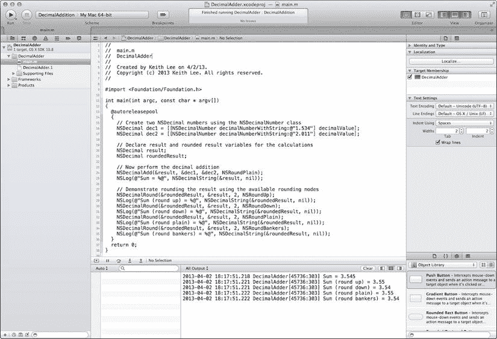

图 13-1. DecimalAddition 程序输出

如图 13-1 所示，所选的舍入模式会如前所述影响结果。

`NSDecimalNumber` 类提供了复制 `NSDecimal` 函数大部分功能的方法；因此，你可以选择使用哪个来执行十进制算术。与 `NSDecimalNumber` 类相比，`NSDecimal` 函数提供了更好的性能和更低的内存利用率。然而，`NSDecimalNumber` 类使用对象执行这些十进制运算，并允许你将这些运算的结果直接存储在面向对象的集合中，例如 `NSArray` 或 `NSDictionary` 的实例。

### 字节序

Foundation 框架包含一组执行字节序转换的函数；具体来说，这些函数可用于交换存储在内存中的数字的字节顺序。当在一台计算机上创建的二进制文件在另一台具有不同字节序的计算机上读取时，字节序非常重要。大端序机器（例如 Motorola 680x0 CPU）将数据的最高有效字节存储在最低内存地址。小端序机器（例如 Intel CPU）将最高有效字节存储在最高内存地址。例如，十进制值 4132（十六进制 1024）将存储为表 13-3 所示。

表 13-3. 大端序和小端序机器的字节序

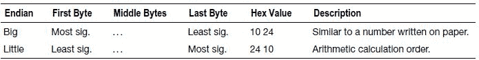

为了在这类大端序和小端序机器之间成功传输和处理二进制文件，需要交换数据的字节序。`NSSwap` 字节序函数对以下数据类型执行大端序到小端序以及小端序到大端序的字节序转换：short、int、long、long long、float 和 double。`NSSwapHost` 函数从当前端序格式转换为输入数据类型指定的格式。`NSHostByteOrder` 函数确定主机的端序格式。它返回一个 Foundation 常量值 `NS_LittleEndian` 或 `NS_BigEndian`。

### 与运行时交互

Foundation 框架包含几个利用 Objective-C 运行时库的函数。这些函数支持动态操作。

`NSGetSizeAndAlignment` 函数用于获取字符数组的大小（以字节为单位）。以下函数检索对应 Objective-C 类型的字符串表示：

*   `NSStringFromSelector`
*   `NSStringFromProtocol`
*   `NSStringFromClass`

以下语句检索使用 `@selector` 指令指定的选择器的文本字符串（`sayHello:`），并将此字符串赋值给变量 `methodName`。

```
NSString *methodName = NSStringFromSelector(@selector(sayHello:));
```

下一组函数执行相反的操作；它们从字符串表示中检索 Objective-C 类型：

*   `NSSelectorFromString`
*   `NSProtocolFromString`
*   `NSClassFromString`

以下语句动态地从输入字符串中检索一个选择器。

```
SEL methodSel = NSSelectorFromString(@"sayHello:");
```

### 文件路径

一组 Foundation 函数提供了管理文件路径的操作，包括检索用户名、主目录、临时目录和目录搜索路径。以下语句演示了使用 `NSFullUserName` 函数检索当前用户的全名。

```
NSString *fullName = NSFullUserName();
```

相比之下，`NSUserName` 函数返回当前用户的登录名。

以下语句演示了使用 `NSHomeDirectory` 函数检索当前用户的主目录。

```
NSString *homeDir = NSHomeDirectory();
```

`NSHomeDirectoryForUser` 函数检索输入参数中指定的用户的主目录。

`NSTemporaryDirectory` 函数检索当前用户的临时目录的完整路径。

`NSSearchPathForDirectoriesInDomains` 函数返回指定域中指定目录的目录搜索路径列表。该函数的语法是

```
NSSearchPathForDirectoriesInDomains(
  NSSearchPathDirectory directory,
  NSSearchPathDomainMask domainMask,
  BOOL expandTilde);
```

`NSSearchPathDirectory` 是一个 Foundation 常量，用于指定文件系统中的各种目录，例如 `Documents` 目录。`NSSearchPathDomainMask` 是一个 Foundation 常量，用于指定搜索域；例如，用户的主目录。如果返回的路径需要展开，则将 `BOOL` 参数设置为 `YES`。代码清单 13-6 演示了使用该函数检索当前用户的文档目录。

*代码清单 13-6.* 使用 NSSearchPathForDirectoriesInDomains 函数检索文档目录

```
NSArray *paths = NSSearchPathForDirectoriesInDomains(NSDocumentDirectory,
                                                     NSUserDomainMask, YES);
NSString *documentsDirectory = paths[0];
```

### 几何图形


# Foundation 框架函数

Foundation 框架包含一些函数，用于对点、范围、矩形和尺寸执行几何计算。点表示二维欧几里得几何中的一个位置，具有 x 和 y 坐标。范围表示从指定位置开始、具有指定长度的一维量。尺寸表示具有指定宽度和高度的二维量。

针对点、范围和尺寸的 Foundation 函数可执行创建、获取、相等性测试以及返回这些量的字符串表示等操作。Foundation 数据类型 `NSPoint` 表示点，`NSRange` 表示范围，`NSSize` 表示尺寸。

以下语句根据指定的值创建一个新的 `NSPoint`。

```
NSPoint point = NSMakePoint(0, 5);
```

Foundation 框架还包含大量用于操作矩形的函数，包括创建、获取、获取分量、查询、相等性测试以及返回字符串表示等操作。还有一些函数用于执行几何运算（相交测试、合并、分割、矩形内点测试等）。Foundation 数据类型 `NSRect` 表示矩形。

以下语句创建一个位于点 {0, 0}、尺寸为 [5, 10] 的矩形。

```
NSRect rect1 = NSMakeRect(0.0, 0.0, 5.0, 10.0);
```

下一组语句创建一个位于点 {2.5, 5}、尺寸为 [5, 10] 的新矩形，然后计算这两个矩形的交集。

```
NSRect rect2 = NSMakeRect(2.5, 5.0, 5.0, 10.0);
NSRect rect3 = NSIntersectionRect(rect1, rect2);
```

### 数据类型

Foundation 框架定义了许多自定义数据类型，其中许多与 Foundation 函数一起使用。这些数据类型包括表示数字、几何概念和通用结构的数据类型。这些数据类型主要是 C 语言结构体。一些更常用的数据类型列在表 13-4 中。

表 13-4. 常用的 Foundation 数据类型

| Foundation 函数 | 描述 |
| --- | --- |
| `NSInteger` | 用于在不同处理器架构上表示整数值的数据类型。在 32 位机器上，`NSInteger` 是一个 32 位整数；而在 64 位机器上，它是一个 64 位整数。 |
| `NSUInteger` | 用于在不同处理器架构上表示无符号整数值的数据类型。 |
| `NSDecimal` | 用于表示十进制数的 C 语言结构体数据类型。 |
| `NSPoint` | 用于表示二维欧几里得空间中点的 C 语言结构体数据类型。 |
| `NSRange` | 用于表示范围（从指定位置开始、具有指定长度的一维量）的 C 语言结构体数据类型。 |
| `NSSize` | 用于表示尺寸（具有指定宽度和高度的二维量）的 C 语言结构体数据类型。 |
| `NSRect` | 用于表示二维欧几里得空间中矩形的 C 语言结构体数据类型。 |
| `NSComparator` | 用于比较操作的块对象数据类型。该块返回一个 Foundation 常量 `NSComparisonResult`，指示所比较的两个对象的顺序。 |
| `NSTimeInterval` | 用于指定时间间隔（以秒为单位）的 Foundation 类型（`double` 类型）。 |
| `NSStringEncoding` | 用于表示字符串编码值的 Foundation 类型（`NSUInteger` 类型）。 |

## 常量

Foundation 常量包括枚举、全局变量、几何和数值常量、异常以及 Foundation 框架版本号。枚举定义了 Foundation 框架 API 使用的枚举。全局变量定义了通用常量。几何常量定义了矩形对齐选项以及最小/最大边缘。数值常量定义了 `NSDecimal`、`NSInteger`、`NSUInteger` 和 `NSMapTable` 数据类型的常量。异常常量定义了标准异常。版本号常量定义了 Foundation 框架的版本号列表。Foundation 常量的权威参考是 Foundation 常量参考。

## 总结

在本章中，您学习了 Foundation 函数、数据类型和常量，并了解了如何使用它们来开发 Objective-C 程序。当有多个可用选项时（例如，Foundation 类与函数），您还熟悉了选择适当 API 所需权衡的一些考虑因素。现在，您应该熟悉以下 Foundation 框架 API：

*   Foundation 函数
*   Foundation 数据类型
*   Foundation 常量

这些 API 的权威参考请参见 Apple Foundation 函数参考。

---

# 第 14 章

## 专家部分：错误处理

代码如何处理错误对于实现高质量软件至关重要。影响程序运行和/或性能的运行时错误可能由多种原因导致，例如用户输入错误、系统问题或编程错误。Foundation 框架包含多个用于处理运行时错误条件的 API。

在本专家章节中，您将深入探讨这些 API。本章将探讨运行时错误的原因、用于错误处理的编程选项，以及用于处理错误和异常条件的 Foundation 框架 API。完成本章后，您将能够使用 Foundation 框架的错误处理和异常处理 API 来编写程序，使其能够在错误发生时做出适当响应，甚至提供错误恢复支持。

### 运行时错误条件

*运行时错误*是在程序运行时发生的错误；它与程序执行之前发生的其他类别的程序错误（例如语法错误和链接错误）形成对比。运行时错误通常由以下类型的条件引起：

*   *逻辑错误*：由于代码未正确实现相应程序逻辑而导致的错误。此类错误在程序执行期间表现为未能产生预期输出。
*   *语义错误*：由于程序语句使用不当（例如，执行除以零的操作或变量初始化不当）而导致的错误。
*   *用户输入错误*：由于无效用户输入而导致的错误。

如果发生上述任何一种条件且未得到处理，可能导致各种不良后果，包括程序终止或运行异常。因此，计算机编程中已开发出多种机制来检测和响应错误。对于 Objective-C，Foundation 框架包含多个用于错误处理的 API，分为以下几类：

*   断言
*   错误码
*   错误对象
*   异常

在详细探讨这些 API 之前，让我们先简要回顾每种错误类型及其用法。

### 断言

断言用于在运行时检查某个条件，如果该条件不成立，则会导致程序终止。断言可以通过编译器指令禁用；因此，它们应仅用于检测编程逻辑和语义错误，而不用于因无效用户输入等导致的运行时错误。在第 13 章中，您了解了 Foundation 框架断言函数。这些函数支持为 Objective-C 方法和函数创建断言。

### 错误码


# 错误码、错误对象、异常和 `NSError`

错误码是用于标识程序执行过程中发生的特定错误并可能传递相关信息的唯一整数值。错误码是一种简单的错误报告机制，但能为错误处理提供的信息量有限。

### 错误对象

错误对象用于封装和传递用户需要了解的运行时错误信息。一个错误对象由错误码和与错误相关的附加信息组成，其中部分信息可能用于从错误中恢复。由于错误对象是对象，因此它们也受益于面向对象编程的基本特性（封装、继承、子类化等）。Foundation 框架包含多个用于支持错误对象的 API：用于创建和操作错误对象的`NSError`类，以及一组标准错误码。

### 异常

在计算机编程中，异常是程序执行过程中发生的异常或意外事件，需要特殊处理。异常处理通常会改变程序流程，控制权会传递给为此目的而设计的特殊代码。异常处理逻辑因事件的严重程度而异，从简单的日志记录到尝试恢复，再到程序终止。Foundation 框架包含多个用于支持异常处理的 API：用于创建和操作异常的`NSException`类，以及一组标准异常名称。Objective-C 语言包含一组与 Foundation 框架异常 API 配合使用的指令，用于执行异常处理。

## `NSError`

Foundation 框架的`NSError`类用于创建错误对象。该类的属性包括错误码、错误域和用户信息字典。该类包含用于创建和初始化错误对象、检索错误属性、获取本地化错误描述以及促进错误恢复的方法。

错误域是一种根据系统、子系统、框架等组织错误码的机制。错误域使您能够识别检测到错误的子系统、框架等。它们还有助于防止错误码之间的命名冲突，因为不同域之间的错误码可以具有相同的值。用户信息字典是一个`NSDictionary`实例，用于保存错误码和错误域之外的错误信息。可以存储在此字典中的信息类型包括本地化错误信息和对支持对象的引用。以下语句使用`NSError`类工厂方法`errorWithDomain:code:userInfo:`创建一个错误对象。

```
NSError *err = [NSError errorWithDomain:NSCocoaErrorDomain
                                   code:NSFileNoSuchFileError
                               userInfo:nil];
```

例如，如果在指定路径未找到文件，则会创建此特定错误。请注意，未提供用户信息字典（`userInfo`参数设置为`nil`）。代码清单 14-1 创建了相同的错误对象，但这次提供了用户信息字典。

*代码清单 14-1.*  创建 `NSError` 对象

```
NSString *desc = NSLocalizedString(@"FileNotFound", @"");
NSDictionary *info = @{NSLocalizedDescriptionKey:desc};
NSError *err = [NSError errorWithDomain:NSCocoaErrorDomain
                                   code:NSFileNoSuchFileError
                               userInfo:info];
```

代码清单 14-1 显示此示例的用户信息字典包含一个条目，即本地化描述的键值对。本地化字符串是使用 Foundation 的`NSLocalizedString`函数创建的。常量`NSLocalizedDescriptionKey`是`NSError`类中定义的标准用户信息字典键。

Foundation 框架声明了四个主要错误域：

*   `NSMachErrorDomain`：操作系统内核错误码。
*   `NSPOSIXErrorDomain`：源自标准 POSIX 兼容 Unix 版本（如 BSD）的错误码。
*   `NSOSStatusErrorDomain`：特定于 Apple OS X Core Services 和 Carbon 框架的错误码。
*   `NSCocoaErrorDomain`：Cocoa 框架的所有错误码（包括 Foundation 框架和其他 Objective-C 框架）。

除了这里介绍的主要错误域之外，还有针对框架、类组甚至单个类的错误域。`NSError`类还允许您在创建和初始化`NSError`对象时创建自己的错误域。如前所述，代码清单 14-1 使用了常量`NSLocalizedDescriptionKey`。`NSError`类定义了一组常用用户信息字典键，可用于创建用户信息字典的键值对。这些键列于表 14-1 中。

表 14-1. `NSError` 标准用户信息字典键

| 键 | 值描述 |
| --- | --- |
| `NSLocalizedDescriptionKey` | 错误的本地化字符串表示。 |
| `NSFilePathErrorKey` | 错误的文件路径。 |
| `NSStringEncodingErrorKey` | 包含字符串编码值的`NSNumber`对象。 |
| `NSUnderlyingErrorKey` | 底层实现中遇到的错误（导致了此错误）。 |
| `NSURLErroKey` | 一个`NSURL`对象。 |
| `NSLocalizedFailureReasonErroryKey` | 导致错误原因的本地化字符串表示。 |
| `NSLocalizedRecoverySuggestionErrorKey` | 错误的本地化恢复建议。 |
| `NSLocalizedRecoveryOptionsErrorKey` | 包含警报面板中显示的按钮本地化标题的`NSArray`。 |
| `NSRecoveryAttempterErrorKey` | 符合`NSErrorRecoveryAttempting`协议的对象。 |
| `NSHelpAnchorErrorKey` | 帮助按钮帮助信息的本地化字符串表示。 |
| `NSURLErrorFailingURLString` | 包含导致加载失败的 URL 的`NSURL`对象。 |
| `NSURLErrorFailingURLStringErrorKey` | 导致加载失败的 URL 字符串。 |
| `NSURLErrorFailingURLPeerTrustErrorKey` | 表示失败 SSL 握手状态的`SecTrustRef`对象。 |

### 使用错误对象

好了，现在您知道如何创建`NSError`对象了，但是如何使用它们呢？通常，获取`NSError`对象有两种场景：

*   `委托`：作为参数传递给您实现的委托方法的错误对象。
*   `间接引用`：通过您代码调用的方法间接引用来检索错误对象。

委托模式是一种设计模式，其中一个对象（委托者）将一个或多个任务委托给另一个委托对象。这些任务封装在委托对象的方法中。必要时，委托者在委托对象上调用相应的方法，并提供任何必需的参数。许多 Foundation 框架类实现了委托模式以支持自定义错误处理。委托的 Foundation 对象在委托对象（您实现的自定义代码）上调用一个方法，该方法将错误对象作为参数包含在内。

`NSURLConnectionDelegate`协议声明了一个返回错误对象的委托方法（`connection:didFailWithError:`）：

```
- (void)connection:(NSURLConnection *)connection didFailWithError:(NSError *)error;
```

此协议用于通过`NSURLConnection`对象异步加载 URL 请求。您的代码实现一个符合此协议的委托对象，并将其设置为`NSURLConnection`对象的委托。然后您的代码异步加载 URL 请求，如果发生错误，委托（`NSURLConnection`）对象会在您的委托对象上调用`connection:didFailWithError:`方法。


一种常见的 Objective-C 编程约定是，将返回错误对象的方法的最后一个参数设为错误对象，并将此参数的类型指定为指向错误对象指针的指针（也称为*双重间接引用*）。以下示例声明了一个名为 `getGreeting` 的方法，该方法包含一个类型为 `NSError` 的错误对象作为参数。

```
- (NSString *)getGreeting(NSError **error);
```

这种方式允许被调用的方法修改错误对象所指向的指针，并且如果发生错误，可以返回特定于该调用的错误对象。

方法需要一个返回值，可以是对象指针或布尔值。你的代码调用此类方法时，需将错误对象的引用作为最后一个参数传入，或者如果不需要访问错误，则传入 `NULL`。方法调用后，检查其返回值。如果值为 `NO` 或 `nil`，则需处理错误对象；否则未返回错误对象。许多 Foundation 类都包含通过间接引用返回错误对象的方法。此外，你的类也可以采用此约定来实现返回错误对象的方法。

列表 14-2 展示了一个名为 `FileWriter` 的类，它声明了一个（间接）返回错误对象的方法。

*列表 14-2.*  FileWriter 接口，包含返回 NSError 对象的方法

```
@interface FileWriter : NSObject
+ (BOOL) writeData:(NSData *)data toFile:(NSString *)path error:(NSError **)err;
@end
```

要让你的代码在 `FileWriter` 对象上调用此方法，必须先声明一个 `NSError` 对象，如列表 14-3 所示，然后检查返回值以确定是否发生错误。

*列表 14-3.*  调用返回 NSError 对象的 FileWriter 方法

```
NSError *writeErr;
NSData *greeting = [@"Hello, World" dataUsingEncoding:NSUTF8StringEncoding];
BOOL success = [FileWriter writeData:greeting
                              toFile:NSTemporaryDirectory()
                               error:&writeErr];
if (!success)
{
  // 处理错误
  ...
}
```

现在，你将创建几个示例程序，分别处理通过委托方法传递的错误对象以及通过间接引用获得的错误对象。

### 处理委托方法错误

现在，你将实现一个程序，用于处理委托方法中的错误。在第 11 章中，你实现了一个名为 NetConnector 的程序，该程序演示了如何使用 Foundation 框架的 `NSURLConnection` 类加载 URL。这里，你将更新此程序以处理加载 URL 时的错误。

在 Xcode 中，通过从 Xcode 文件菜单中选择 **Open  NetConnector.xcodeproj** 来打开 NetConnector 项目。该项目的源代码包含三个文件，分别实现了 `NetConnector` 类和 main 函数。我们先对 `NetConnector` 类进行一些更新。在导航窗格中选择 **NetConnector.m** 文件，然后更新 NetConnector 的实现（更新内容以**粗体**显示），如列表 14-4 所示。

*列表 14-4.*  NetConnector 类实现，更新以处理错误

```
#import "NetConnector.h"

@interface NetConnector()

@property NSURLRequest *request;
@property BOOL isFinished;
@property NSURLConnection *connector;
@property NSMutableData *receivedData;

@end

@implementation NetConnector

- (id) initWithRequest:(NSURLRequest *)request
{
  if ((self = [super init]))
  {
    _request = request;
    _finishedLoading = NO;

// 创建具有适当内存容量的 URL 缓存
    NSURLCache *URLCache = [[NSURLCache alloc] init];
    [URLCache setMemoryCapacity:CACHE_MEMORY_SIZE];
    [NSURLCache setSharedURLCache:URLCache];
```


```objective-c
// 创建连接并开始从资源下载数据
    _connector = [NSURLConnection connectionWithRequest:request delegate:self];
  }
  return self;
}

- (void) reloadRequest
{
  self.finishedLoading = NO;
  self.connector = [NSURLConnection connectionWithRequest:self.request
                                                 delegate:self];
}

#pragma mark -
#pragma mark 委托方法

- (void)connection:(NSURLConnection *)connection didFailWithError:(NSError *)error
{
  NSString *description = [error localizedDescription];
  NSString *domain = [error domain];
  NSInteger code = [error code];
  NSDictionary *info = [error userInfo];
  NSURL *failedUrl = (NSURL *)[info objectForKey:NSURLErrorFailingURLErrorKey];
  NSLog(@"\n*** 错误 ***\n 描述-> %@\nURL-> %@\n 域-> %@\n 代码-> %li",
        description, failedUrl, domain, code);
  self.finishedLoading = YES;
}

- (void)connection:(NSURLConnection *)connection
didReceiveResponse:(NSURLResponse *)response
{
  if (self.receivedData != nil)
  {
    [self.receivedData setLength:0];
  }
}

- (NSCachedURLResponse *)connection:(NSURLConnection *)connection
                  willCacheResponse:(NSCachedURLResponse *)cachedResponse
{
  NSURLResponse *response = [cachedResponse response];
  NSURL *url = [response URL];
  if ([[url scheme] isEqualTo:HTTP_SCHEME])
  {
    NSLog(@"已下载数据，缓存响应");
    return cachedResponse;
  }
  else
  {
    NSLog(@"已下载数据，不缓存响应");
    return nil;
  }
}

- (void)connection:(NSURLConnection*)connection didReceiveData:(NSData*)data
{
   if (self.receivedData != nil)
   {
     [self.receivedData appendData:data];
   }
   else
   {
     self.receivedData = [[NSMutableData alloc] initWithData:data];
   }
}

- (void)connectionDidFinishLoading:(NSURLConnection *)connection
{
  NSUInteger length = [self.receivedData length];
  NSLog(@"已从请求 %@ 下载 %lu 字节", self.request, length);

// 数据加载完成，设置标志以退出运行循环
  self.finishedLoading = YES;
}

@end
```

如果连接未能成功加载请求，`NSURLConnection` 会向其委托对象发送 `connection:didFailWithError:` 消息。如代码清单 14-4 所示，`NetConnector` 类被设置为自身 `NSURLConnection` 对象的委托，因此当请求加载出错时，其 `connection:didFailWithError:` 方法将被调用。该方法的实现会获取 `NSError` 对象的属性：描述（description）、域（domain）、代码（code）和用户信息（user info）。加载失败的请求的 URL 存储在用户信息字典中，其键值为 `NSURLErrorFailingURLErrorKey`，这是表 14-1 中列出的标准 `NSError` 用户信息字典键之一。该方法会将此数据的值记录到输出面板。

接下来，你需要更新 `main()` 函数，不过在操作之前，需要先创建一个包含有效 URL 但无法加载的页面。这样做是为了在尝试使用 `NSURLConnection` 对象加载该页面时，强制触发错误。打开 OS X 终端窗口，输入代码清单 14-5 中所示的 Unix 命令。

*代码清单 14-5.* 使用 Mac OS X 终端实用程序创建文件

```
touch /tmp/ProtectedPage.html
chmod u-r /tmp/ProtectedPage.html
```

`touch` 命令会创建一个新的空文件。如代码清单 14-6 所示，该文件的完整路径为 `/tmp/ProtectedPage.html`。`chmod u-r` 命令会移除当前用户对该文件的读取权限。该资源对应的 URL 为 `file:///tmp/ProtectedPage.html`。好了，现在资源已正确配置，让我们更新 `main()` 函数。在导航器面板中选择 **main.m** 文件，然后按照代码清单 14-6 所示更新 `main()` 函数。

*代码清单 14-6.* NetConnector main( ) 函数实现

```
#import <Foundation/Foundation.h>
#import "NetConnector.h"

#define INDEX_URL       @"file:///tmp/ProtectedPage.html"

int main(int argc, const char * argv[])
{
  @autoreleasepool
  {
    // 获取连接的当前运行循环
    NSRunLoop *loop = [NSRunLoop currentRunLoop];

// 使用指定的缓存策略创建请求，然后开始下载！
    NSURLRequest *request = [NSURLRequest
                             requestWithURL:[NSURL URLWithString:INDEX_URL]
                                cachePolicy:NSURLRequestReturnCacheDataElseLoad
                            timeoutInterval:5];
    NetConnector *netConnect = [[NetConnector alloc] initWithRequest:request];

// 循环直到资源加载完成
    while (!netConnect.finishedLoading &&
           [loop runMode:NSDefaultRunLoopMode beforeDate:[NSDate distantFuture]]);

// 清除缓存
    [[NSURLCache sharedURLCache] removeAllCachedResponses];
  }
  return 0;
}
```

`main()` 函数的关键变化在于 URL。它已更新为你之前创建的资源的 URL：`file:///tmp/ProtectedPage.html`。代码将尝试使用 `NetConnector initWithRequest:` 方法（通过一个 `NSURLConnection` 对象）异步加载此资源。如代码清单 14-4 所示，`NetConnector` 类实现了 `connection:didFailWithError:` 方法来处理加载 URL 时的错误。

现在，保存、编译并运行更新后的 `NetConnector` 程序，观察输出面板中的消息（如图 14-1 所示）。

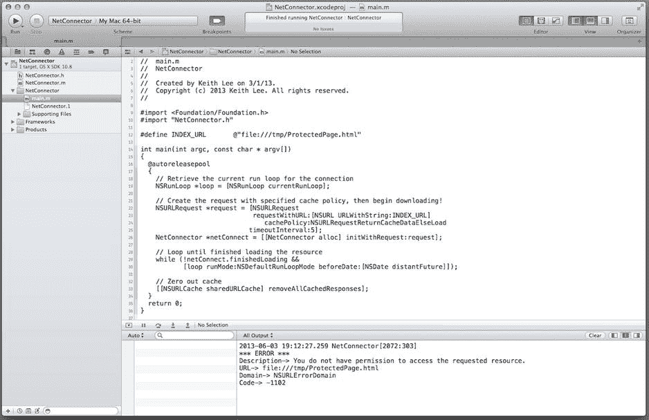

图 14-1. 测试更新后的 `NetConnector` 项目中的 `NSError` 部分

输出面板中的消息显示，`NSURLConnection` 未能加载该 URL，因此向它的委托对象（本例中为 `NetConnector` 实例）发送了 `connection:didFailWithError:` 消息。如代码清单 14-4 的方法实现所示，错误描述、失败的 URL、错误代码和域都被记录到了输出面板。很好，现在你已经掌握了这部分内容，接下来让我们实现一个通过间接方式返回错误对象的程序。

### 通过间接方式创建错误对象

现在你将创建一个程序，演示 Foundation 框架对象的错误处理机制。在 Xcode 中，从 Xcode 的“文件”菜单中选择 **新建项目...** 来创建一个新项目。在 **新建项目助手** 窗格中，创建一个命令行应用程序。在 **项目选项** 窗口中，将产品名称指定为 **FMErrorObject**，项目类型选择 **Foundation**，并通过勾选 **使用自动引用计数** 复选框来选择 ARC 内存管理。在文件系统中指定项目创建的位置（如有必要，选择 **新建文件夹** 并输入文件夹名称和位置），取消勾选 **源代码管理** 复选框，然后点击 **创建** 按钮。

在 Xcode 项目导航器中，选择 **main.m** 文件并按照代码清单 14-7 所示更新 `main()` 函数。

*代码清单 14-7.* FMErrorObject main( ) 函数实现

```
#import <Foundation/Foundation.h>

#define FILE_PATH       @"/tmp/NoSuchFile.txt"
```

```objective-c
int main(int argc, const char * argv[])
{
  @autoreleasepool
  {
    NSFileManager *fileMgr = [NSFileManager defaultManager];
    NSError *fileErr;
    BOOL success = [fileMgr removeItemAtPath:FILE_PATH error:&fileErr];
    if (!success)
    {
      NSString *description = [fileErr localizedDescription];
      NSString *domain = [fileErr domain];
      NSInteger code = [fileErr code];
      NSDictionary *info = [fileErr userInfo];
      NSURL *failedPath = (NSURL *)[info objectForKey:NSFilePathErrorKey];
      NSLog(@"\n*** 错误 ***\n 描述-> %@\n 路径-> %@\n 域-> %@\n 代码-> %li",
            description, failedPath, domain, code);
    }
  }
  return 0;
}
```

从逻辑上讲，该代码使用`NSFileManager`的实例方法从文件系统中删除文件。如果在调用该方法时发生错误，它会通过间接方式返回一个描述错误的错误对象，并附带相应的返回结果。如代码清单 14-7 所示，文件首先定义了一个变量`FILE_PATH`，该变量表示本地文件系统上某个文件的完整路径（为了测试错误对象的创建与处理，请确保该文件`/tmp/NoSuchFile.txt`不存在）。`main()`函数首先创建了一个`FileManager`对象和一个`NSError`指针，然后通过调用`NSFileManager.removeItemAtPath:error:`方法尝试删除该文件。由于`error`参数不为`NULL`，若调用此方法时发生错误，将返回一个`NSError`对象。

接下来，系统根据该方法的布尔结果执行条件表达式；如果返回值为`NO`，则说明删除文件时发生错误，并执行条件表达式的主体。该代码会获取`NSError`对象的属性：描述、域、代码和用户信息。无法被删除文件的完整路径存储在用户信息字典中，其键为`NSFilePathErrorKey`，这是表 14-1 中列出的`NSError`标准用户信息字典键之一。该方法将这些数据的值记录到输出面板中。

现在，保存、编译并运行`FMErrorObject`程序，并观察输出面板中的消息（如图 14-2 所示）。

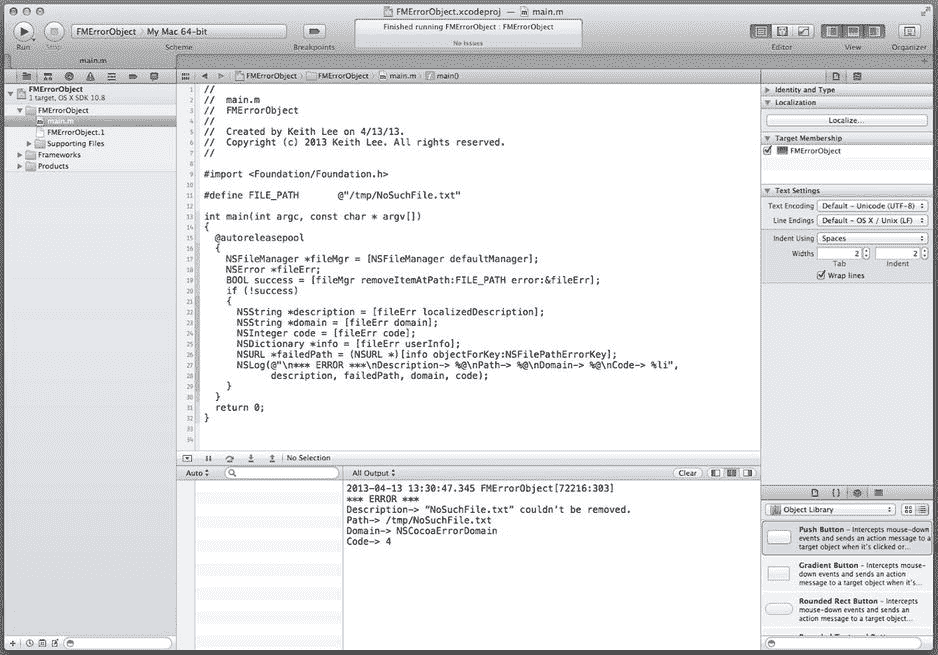

图 14-2. 在`FMErrorObject`项目中通过间接方式测试`NSError`

输出面板中的消息显示，`NSFileManager`对象未能删除该文件，因此（通过间接方式）在`removeFileWithPath:error:`方法的`error`参数中设置了一个错误对象，并将其返回结果设置为`NO`。错误描述、文件路径、错误代码和域都记录到了输出面板中。完美。现在你已经了解了如何检索和处理错误对象，接下来让我们考察 Foundation 框架对错误恢复的支持。

### 错误恢复

`NSError`类提供了一种从错误中恢复的机制。`NSErrorRecoveryAttempting`非正式协议定义了实现错误恢复所需的方法。采用此协议的对象必须至少实现其两个方法中的一个，以尝试从错误中恢复。支持错误恢复的`NSError`对象的用户信息字典必须至少包含以下三个条目：

*   恢复尝试者对象（使用键`NSRecoveryAttempterErrorKey`检索）
*   恢复选项（使用键`NSLocalizedRecoveryOptionsErrorKey`检索）
*   本地化恢复建议字符串（使用键`NSLocalizedRecoverySuggestionErrorKey`检索）

恢复尝试者可以实现任何适合错误恢复的逻辑。请注意，错误恢复功能仅在 Apple OS X 平台上可用。

### 错误响应者

Application Kit 提供了可用于响应封装在`NSError`对象中的错误的 API 和机制。`NSResponder`类定义了一个错误响应者链，用于沿视图层次结构传递事件和操作消息。它包含了在关联的`NSError`对象中显示信息的方法，然后将错误消息转发给下一个响应者。这使得层次结构中的每个对象都能适当地处理错误，比如通过添加与错误相关的额外信息。请注意，错误响应者功能仅在 Apple OS X 平台上可用。

### NSError 错误码

Foundation 框架定义了一系列标准的`NSError`错误码作为 Foundation 常量。这些错误是针对以下`NSError`类错误域定义的枚举，具体如下：

*   Cocoa (`NSErrorCocoaDomain`)
*   URL 加载系统 (`NSURLDomain`)

## 异常处理

Objective-C 提供了在程序执行期间处理异常情况的机制。异常情况可以定义为不可恢复的编程错误或运行时错误。例如，未实现（抽象）方法等错误，或越界集合访问等运行时错误。编译器指令`@try`、`@catch()`、`@throw`和`@finally`为异常处理提供了运行时支持，而`NSException`类则封装了与异常相关的信息。

当抛出异常时，程序控制流会转移到本地异常处理程序。程序堆栈帧也会在异常抛出点与捕获并处理点之间展开。因此，非自动管理的资源（例如 Foundation 框架对象、使用手动引用计数创建的对象以及任何 C 语言特定资源，如结构体）可能无法被正确清理。具体来说，Foundation 框架的 API 并非异常安全；因此，如果异常处理域内使用这些 API 并抛出了异常，它们可能会发生内存泄漏和/或内容损坏。因此，一般规则是：当抛出异常时，不应尝试恢复，而应立即退出应用程序。

`@try`、`@catch`和`@finally`指令构成了一个控制结构，用于在异常处理逻辑边界内执行的代码。`@try`指令定义了一个可能抛出异常的语句块（也称为异常处理域）。`@catch()`指令定义了一个语句块，其中包含处理前一个`@try`块内所抛出异常的代码。`@catch()`指令的参数是本地抛出的异常对象，通常是`NSException`对象。`@finally`指令定义了一个语句块（位于前面的`@try`块之后），无论是否抛出关联异常，该块都会随后执行。`@finally`块通常用于为其对应的`@try`和`@catch()`块执行任何清理操作（例如，释放资源等）。使用异常编译器指令的代码语法如代码清单 14-8 所示。

*代码清单 14-8.*  使用编译器指令进行异常处理

```
@try
{
  // 实现解决方案逻辑的代码（可能会抛出异常）
  ...
}
@catch (NSException *exception)
{
  // 异常处理代码
  ...
}
@finally
{
  // 清理代码
  ...
}
```

`@throw`指令用于抛出异常，通常是`NSException`对象，但实际也可以是其他类型的对象。当在`@try`块主体内抛出异常时，程序会立即跳转到最近的`@catch()`块以处理该异常（如果存在的话）。

Cocoa 框架附带了一大组预定义的异常名称，用于描述特定的错误状态。在创建异常时，应（在适用的情况下）使用这些名称。

### NSException

`NSException` 类负责处理异常。它的方法提供了创建 `NSException` 实例、查询实例、引发异常以及检索异常堆栈帧的功能。以下语句使用 `exceptionWithName:reason:userInfo:` 工厂方法创建了一个 `NSException` 对象。

```
NSException *exception = [NSException exceptionWithName:NSGenericException
                                                 reason:@"Test exception"
                                               userInfo:nil];
```

该方法的参数包括：异常名称（`exceptionWithName:`）、异常原因（`reason:`）以及一个包含用户自定义信息的字典（`userInfo:`）。在上述示例中，异常名称为 `NSGenericException`，这是 Foundation 常量中的通用异常名称之一。清单 14-9 使用 `raise:format:` 类方法创建并引发了一个异常。该异常在对应的 `@catch()` 代码块中被捕获并处理。

*清单 14-9*  创建并引发一个 `NSException` 实例

```
@try
{
  [NSException raise:NSGenericException format:@"My Generic Exception"];
}
@catch (NSException *exception)
{
  NSLog(@"EXCEPTION\nName-> %@\nDescription-> %@", [exception name],
        [exception description]);
}
```

清单 14-9 展示了 `@catch()` 指令的参数是一个 `NSException` 对象，即相应异常处理域中引发的异常。异常也可以嵌套，从而使异常能够被本地异常处理域及其周围的处理器处理。清单 14-10 修改了清单 14-9 中的示例，以演示嵌套异常处理器的使用。

*清单 14-10*  嵌套的异常处理器

```
@try
{
  @try
  {
    [NSException raise:NSGenericException format:@"My Generic Exception"];
  }
  @catch (NSException *exception)
  {
    NSLog(@"EXCEPTION handling in domain 2\nName-> %@\nDescription-> %@",
          [exception name], [exception description]);
    @throw;
  }
  @finally
  {
    NSLog(@"Cleanup for exception domain 2");
  }
}
@catch (NSException *exception)
{
  NSLog(@"EXCEPTION handling in domain 1\nName-> %@\nDescription-> %@",
        [exception name], [exception description]);
}
@finally
{
  NSLog(@"Cleanup for exception domain 1");
}
```

如果异常未被您的代码捕获，它将被未捕获异常处理器函数捕获。该函数的默认实现会向输出窗格记录一条消息，然后退出程序。可以使用 Foundation 函数 `NSSetUncaughtExceptionHandler()` 来设置自定义的未捕获异常处理器。

### 异常与内存管理

处理异常时必须仔细考虑内存管理，尤其是在使用手动引用计数（MRR）内存管理时。由于异常处理会改变程序流程控制，清单 14-11 演示了在方法中（使用 MRR 内存管理时）发生的异常如何导致对象内存泄漏。

*清单 14-11*  异常处理与内存泄漏

```
- (void) processOrderWithItem:(OrderItem *)item
{
  Order *order = [[Order alloc] initWithItem:item];
  [order process];
  [order release];
}
```

如果 `process` 方法抛出异常，`Order` 对象将不会被释放，从而导致内存泄漏。为防止这种情况，解决方案是将方法语句封装在一个异常处理域中，并在其 `@finally` 代码块中释放已分配的对象，如清单 14-12 所示。

*清单 14-12*  使用异常处理域防止内存泄漏

```
- (void) processOrderWithItem:(OrderItem *)item
{
  Order *order = nil;
  @try
  {
    order = [[Order alloc] initWithItem:item];
    [order process];
    [order release];
  }
  @finally
  {
    [order release];
  }
}
```

默认情况下，ARC 内存管理并非异常安全。如果使用 `-fobjc-arc-exceptions` 选项编译程序，则可以使 ARC 程序异常安全。这会增加程序资源占用并略微降低性能，因此必须谨慎使用。

### 执行异常处理

现在，您将创建一个演示 Foundation 框架对象异常处理的程序。在 Xcode 中，通过选择 Xcode **File** 菜单中的 **New Project...** 来创建一个新项目。在 **New Project Assistant** 窗格中，创建一个命令行应用程序。在 **Project Options** 窗口中，将 **Product Name** 指定为 `XProcessor`，选择 **Foundation** 作为 **Project Type**，并通过选中 **Use Automatic Reference Counting** 复选框来选择 ARC 内存管理。指定您希望项目在文件系统中创建的位置（如有必要，选择 **New Folder** 并输入文件夹的名称和位置），取消选中 **Source Control** 复选框，然后单击 **Create** 按钮。

在 Xcode 项目导航器中，选择 `main.m` 文件并更新 `main()` 函数，如清单 14-13 所示。

*清单 14-13*  XProcessor 的 `main()` 函数实现

```
#import <Foundation/Foundation.h>

int main(int argc, const char * argv[])
{
  @autoreleasepool
  {
    NSArray *words = @[@"Hello", @"Bonjour", @"Guten Tag", @"Hola"];
    @try
    {
      int count = 0;
      NSLog(@"Salutation = %@", words[count]);
    }
    @catch (NSException *exception)
    {
      NSLog(@"EXCEPTION\nName-> %@\nDescription-> %@", [exception name],
            [exception description]);
    }
  }
  return 0;
}
```

`main()` 函数首先创建了一个包含四个条目的 `NSArray` 对象。然后从数组中检索一个条目并记录到输出窗格。因为 `NSArray` 用于根据指定索引检索对象的方法，如果索引超出数组末尾，会抛出 `NSRangeException`（Foundation 标准异常名称之一），所以此语句被置于异常处理域中。如果抛出异常，它将被记录到输出窗格。

现在，保存、编译并运行 `XProcessor` 程序，观察预期消息（`Hello`）是否显示在输出窗格中（如图 14-3 所示）。

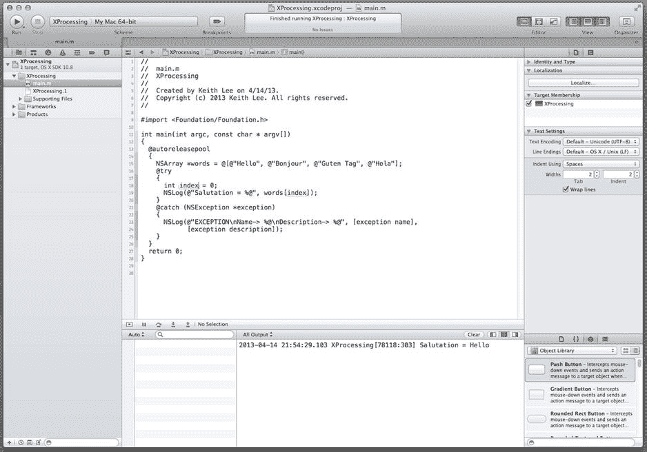

图 14-3  测试 `XProcessor` 项目，未引发异常

未抛出异常，因为为索引设置的值在范围内。现在将 `count` 变量的值更改为 4。

```
int index = 0;
```

然后重新编译并运行程序。观察到由于索引超出范围，发生了异常并在 `@catch()` 代码块中被处理（如图 14-4 所示）。

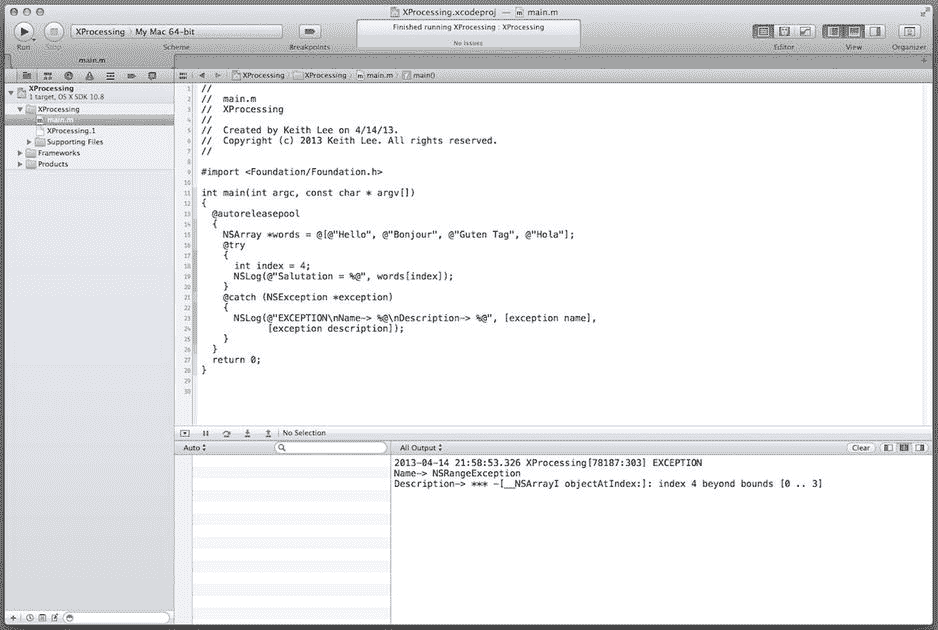

图 14-4  测试 `XProcessor` 项目，异常被引发

此示例演示了 Foundation 框架 API 的异常处理。接下来，让我们继续了解定义了一组标准异常名称的 Foundation 常量。

### Foundation 标准异常名称

Foundation 框架定义了一组标准异常名称。这些通用异常名称在表 14-2 中列出并描述。

表 14-2  Foundation 常量通用异常名称


| 异常名称 | 描述 |
| --- | --- |
| `NSGenericException` | 异常的通用名称。 |
| `NSRangeException` | 当尝试访问某些数据（如数组或字符串）边界之外时发生的异常。 |
| `NSInvalidArgumentException` | 当向方法传递无效参数时发生的异常。 |
| `NSInternalInconsistencyException` | 当内部断言失败时发生的异常（例如，通过 `NSAssert` 函数），表示代码中存在意外情况。 |
| `NSObjectInaccessibleException` | 当从不应访问远程对象的线程访问该对象时发生的异常。 |
| `NSObjectNotAvailableException` | 一种分布式对象异常，当 `NSConnection` 的远程端拒绝向对象发送消息，因为该对象尚未被提供时发生。 |
| `NSDestinationInvalidException` | 一种分布式对象异常，当内部断言失败时发生。 |
| `NSPortTimeoutException` | 在发送或接收操作期间，端口上设置的超时已过期。 |
| `NSInvalidSendPortException` | `NSConnection` 对象的发送端口已变为无效。 |
| `NSInvalidRecievePortException` | `NSConnection` 对象的接收端口已变为无效。 |
| `NSPortSendException` | 向端口发送消息时发生的特定于 `NSPort` 的通用错误。 |
| `NSPortReceiveException` | 从端口接收消息时发生的特定于 `NSPort` 的通用错误。 |

## 错误处理指南

现在您已经很好地理解了错误对象和异常，以及相应的 Foundation 框架 API。那么您可能会想，“我应该用哪一个来检测和处理错误呢？” 在提供指南和建议之前，让我们先回顾一下关于错误对象和异常的一些关键点。

### 错误对象

*   **优点：**
    *   封装错误信息（代码、域、用户信息）
    *   提供恢复机制的基础结构
    *   受 Cocoa 框架支持
*   **缺点：**
    *   将错误处理逻辑与业务逻辑耦合
    *   劳动密集，难以理解
    *   难以维护和/或修改

### 异常

*   **优点：**
    *   解耦异常条件的检测和处理，从而改进程序设计和维护。
    *   自动化从检测点到处理点的传播过程。
*   **缺点：**
    *   展开调用栈，导致性能损失。
    *   使用更多资源（略微增加可执行文件的大小）。
    *   仍然需要参数/结果检查。
    *   Cocoa 框架（包括 Foundation 框架）并非异常安全。

### 指南与建议

错误对象应用于检测和处理 Objective-C 程序中预期可能发生的、有（潜在）恢复可能的错误。断言应作为编程辅助手段，用于检查程序不变量、条件、假设等。请注意，由于断言可能在编译前被禁用（生产版本中通常如此），因此它们不应用于公共 API 的参数检查。异常应仅用于检测无法恢复的编程错误或意外的运行时错误，这些错误应通过立即终止应用程序来处理。

## 总结

在本章中，您学习了用于错误处理和异常处理的 Foundation 框架 API。您现在应该熟悉提供以下功能的 Foundation 框架类：

*   使用错误对象进行错误处理
*   异常处理
*   使用断言、错误对象和异常的指南

既然您已经完成了对 Foundation 框架 API 的回顾，是时候进入本书的第四部分了，该部分重点关注 Objective-C 的新主题和高级主题。不过，在此之前，现在或许是回顾一下所学内容的好时机，然后给自己一个应得的休息。当您准备好后，翻页继续深入吧！

# 第 15 章：块

欢迎回来。祝贺你走到了这一步！到目前为止，你已经涵盖了 Objective-C 平台的所有基本元素。但你猜怎么着？你还没有到达终点线！这是因为 Objective-C 还有各种额外的、高级的特性，一旦掌握，就能让你将编程提升到新的水平。在本书的第四部分，你将探索其中几个特性，并学习如何在程序中使用它们。

在本章中，你将学习如何使用 *块* 进行编程，这是 Objective-C 语言中一个强大的特性。本章将探讨块的语法和语义、内存管理、如何在你的代码中开发块，以及如何在现有 API（如 Foundation 框架）中使用块。

简单来说，块提供了一种创建一组语句（即一段代码）并将这些语句赋值给一个变量的方法，该变量随后可以被调用。在这方面，它们类似于函数和方法，但除了可执行代码之外，它们还可以包含对栈内存或堆内存的变量绑定。块是 *闭包* 的一种实现，闭包是一种允许访问其典型作用域外部变量的函数。此外，Objective-C 块实际上是一个对象；它是 `NSObject` 的子类，拥有其所有相关属性（你可以向它发送消息等）。苹果公司将块作为 C 系列编程语言（C、Objective-C 和 C++）的扩展进行开发。它们可用于 Mac OS X v10.6 及更高版本，以及 iOS 4.0 及更高版本。

## 块语法

学习如何使用块进行编程最困难的事情之一就是掌握它们的语法。本节将深入解释块的语法，并提供大量示例来说明它们在代码中的应用。

为支持块而添加的语法特性允许声明块类型的变量以及定义块字面量。

*块类型* 由一个返回值类型和一个参数类型列表组成。使用脱字符号（`^`）运算符来声明块类型的变量。图 15-1 展示了块类型声明的语法。

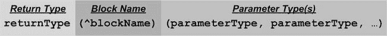

图 15-1。块类型声明语法

图 15-1 显示 `returnType` 是块被调用时返回值的类型。名为 `blockName` 的块变量前面有一个脱字符号，并括在括号中。如前所述，块类型的变量可以带有参数。参数类型列表括在括号中，跟在块名称后面，`parameterTypes` 之间用逗号分隔。如果块变量声明没有参数，其参数类型列表应指定为 `void`（括在括号中）。好了，这总结了声明块类型变量的语法。现在让我们看一些例子。以下语句声明了一个名为 `oneParamBlock` 的块变量，它有一个 `int` 类型的参数，并返回一个 `int` 类型的值。

```
int (^oneParamBlock)(int);
```

如所述，没有返回值的块变量在其声明中将其返回类型指定为 `void`。下一个例子声明了一个名为 `twoParamsBlock` 的块变量，它接受两个 `int` 类型的参数，并且不返回任何内容。

```
void (^twoParamsBlock)(int, int);
```


好的，作为一名高级文档工程师和翻译员，我将严格遵循您的注意事项和示例格式，将给定的英文文本翻译成中文。

---


块声明也可以包含参数名称，类似于 Objective-C 方法声明。下面展示了带有命名输入参数的先前示例。

```
void (^twoParamsBlock)(int parm1, int parm2);
```

下一个示例声明了一个名为 `noParamsBlock` 的块变量，它没有参数，且返回类型为 `int`。

```
int (^noParamsBlock)(void);
```

由于变量可以用块类型声明，因此块变量可以作为函数参数或方法参数。在这些情况下，通常通过 `typedef` 语句创建类型定义，为块类型提供替代名称，从而简化其在代码中的后续使用。列表 15-1 演示了如何声明一个以块作为参数的方法。

*列表 15-1.* 方法声明中的块变量

```
typedef int (^AdderBlock)(int);
@interface Calculator : NSObject
- (int)process:(int)count withBlock:(AdderBlock)adder;
@end
```

列表 15-1 展示了使用 `typedef` 语句创建名为 `AdderBlock` 的块类型。该类型随后被用作方法声明中的参数类型。

块字面量表达式定义了对块的引用。它以脱字符运算符开头，后跟返回类型、参数列表，以及用花括号括起来的一组语句（块语句体）。块字面量表达式的语法如图 15-2 所示。

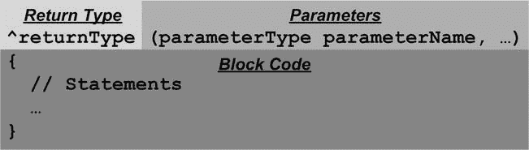

图 15-2. 块字面量表达式语法

如图 15-2 所示，表达式开头的脱字符表示块字面量表达式的开始，可选的 `returnType` 指定了语句体返回值的类型。块参数（传入块体的参数）放在圆括号内，每个参数都有类型和名称，用逗号分隔。块代码（用花括号括起来）包含了块被调用时执行的语句。如果块定义指定了返回类型，则代码中包含一个带有指定 `returnType` 值的 `return` 语句。如果块字面量表达式中有多个 `return` 语句，则每个语句指定的返回类型必须相同。现在让我们来看几个简单的块字面量表达式。列表 15-2 接受一个类型为 `int` 的单一参数，并返回一个等于输入参数加 1 的值。

*列表 15-2.* 块字面量表达式

```
^int (int addend)
{
  return addend + 1;
}
```

如前所述，块定义中不必指定返回类型，因为编译器会从块体中的 `return` 语句推断出返回类型。列表 15-3 修改了列表 15-2，在表达式中不指定返回类型。

*列表 15-3.* 块字面量表达式，无返回类型

```
^(int addend)
{
  return addend + 1;
}
```

如果块字面量表达式没有参数，则不需要带圆括号的参数列表。列表 15-4 提供了一个没有参数且没有返回值的块字面量示例，该块向控制台输出一条问候语。

*列表 15-4.* 块字面量定义，无参数

```
^{
  NSLog(@"Hello, World!");
}
```

块字面量可以赋值给相应的块变量声明。列表 15-5 演示了名为 `oneParamBlock` 的块变量的声明和后续定义。

*列表 15-5.* 块的声明与定义

```
int (^oneParamBlock)(int);
oneParamBlock = ^(int param1)
{
  return param1 * param1;
};
```

正如所料，块声明和定义可以合并为一条语句。列表 15-6 演示了名为 `incBlock` 的块变量的复合声明与定义。

*列表 15-6.* 复合块声明与定义

```
int (^incBlock) (int) = ^(int addend)
{
  return addend + 1;
};
```

如列表 15-6 所示，块字面量表达式的参数类型和返回类型必须与相应的块变量声明一致。

比较图 15-1 和图 15-2，你会发现块变量声明与块字面量表达式之间存在若干语法差异。例如，块变量的参数类型列表是必需的；如果没有参数，则必须提供一个单一的 `void` 参数类型。相比之下，块字面量表达式的参数列表是可选的——如果没有参数，则可以省略列表。表 15-1 总结了块变量声明和块字面量表达式语法的主要差异。

表 15-1. 块语法元素比较

| 块语法元素 | 块变量声明 | 块字面量表达式 |
| --- | --- | --- |
| 脱字符运算符 | 开始一个块变量声明。脱字符位于变量名之前，两者都括在圆括号中。 | 开始一个块字面量表达式。 |
| 名称 | 块变量名称是必需的。 | 块字面量表达式是匿名的。 |
| 返回类型 | 块变量声明中需要返回类型。没有返回值的块变量声明为 `void` 返回类型。 | 块字面量表达式中的返回类型是可选的，因为编译器会从表达式语句体中的返回值类型推断出来。如果表达式语句体中有多个 `return` 语句，它们必须都是同一类型。 |
| 参数 | 块变量声明中参数类型列表是强制性的。如果块变量没有参数，则声明的参数类型列表为 `void`。 | 没有参数的块字面量表达式不需要参数列表。 |

一旦声明了块类型的变量并赋值给了符合要求的块字面量表达式，就可以直接使用 `invoke` 运算符调用它。此语法类似于 C 函数调用语法，参数列表与块声明对应。（返回值类型（如果有）也与块类型声明对应。）以下语句调用了列表 15-6 中的块，并将结果赋值给变量 `myValue`。

```
int myValue = incBlock(5);
```

块表达式也可以在一个语句中定义并调用。回想一下，块表达式是匿名的；因此，`invoke` 运算符接受一个匿名（即无名称）函数，后跟一个与块表达式对应的参数列表。列表 15-7 定义了一个块表达式，并在单个语句中调用它，向控制台输出消息 “Greetings, Earthling!”。

*列表 15-7.* 块表达式定义与调用

```
^(NSString *user)
{
  NSLog(@"Greetings, %@!", user);
}(@"Earthling");
```


### 方法调用中的块字面量表达式

块表达式也可以内联定义为*匿名函数*，从而作为函数或方法调用的参数。在这些场景中，推荐的做法是只使用一个块字面量作为函数或方法的参数，并且它应是参数列表中的最后一个参数（如果该函数/方法还有其他参数）。清单 15-8 调用了一个实例方法（来自清单 15-1 所示的类接口），该方法创建了一个块字面量表达式并将其用作方法调用的参数。

*清单 15-8.* 方法调用中的块字面量表达式

```
Calculator calc = [Calculator new];
int value = [calc process:2
                withBlock:^(int addend)
                {
                  return addend + 1;
                }];
```

许多 Objective-C API（包括 Foundation 框架）都包含以块作为参数的方法。在本章后面，你将会使用块开发几个程序，所以请花时间仔细阅读本材料，直到完全掌握其语法。

## 块就是闭包！

如本章前面所述，块是*闭包*的一种实现，闭包是一种允许访问在其典型作用域之外声明的局部变量的函数。为了理解这意味着什么，我们先来了解一下作用域和可见性规则。变量的*可见性*指的是程序中可以访问该变量的部分；这也被称为变量的*作用域*。例如，在 C 函数定义内声明的变量具有局部作用域，这意味着它们在该函数内可见且可访问，但在其他地方不可访问。（注意，函数也可以引用全局变量。）与 C 函数相比，块通过以下几个特性增强了变量的可见性，具体如下：

- **支持词法作用域**。这是指能够从封闭作用域中引用局部变量和参数。
- **`__block` 变量**。`__block` 关键字应用于块外部但位于同一词法作用域内的变量，可以使该变量在块内被修改。
- **实例变量访问**。在对象的方法实现中定义的块可以访问该对象的实例变量。
- **`const` 导入**。通过头文件（通过 `#import` 或 `#include` 指令）导入的常量变量在块字面量表达式内是可见的。

## 词法作用域

块的独特特性之一是其对词法作用域的支持。相比之下，C 函数无法访问在其定义之外声明的局部变量。清单 15-9 中所示的示例将无法编译，因为局部变量 `myVar` 在 `logValue` 函数定义内不可见。

*清单 15-9.* C 函数尝试访问其作用域外的局部变量

```
void logValue()
{
  // 错误，非法访问 myVar，不在作用域内
  NSLog(@"Variable value = %d", myVar);
}

int main(int argc, const char * argv[])
{
  @autoreleasepool
  {
    int myVar = 10;
    logValue();
  }
  return 0;
}
```

块支持词法作用域，因此块字面量表达式可以访问在同一词法作用域内声明的变量。此外，块可以像其他变量一样在任何地方定义；例如，可以在其他块、函数和方法中定义。而 C 函数则不能在其他函数或方法中定义。清单 15-10 可以成功编译和运行，因为变量 `myVar` 与块 `logValueBlock` 声明在同一个词法作用域内。

*清单 15-10.* 块通过词法作用域访问局部变量

```
{
  int myVar = 10;
  void (^logValueBlock)(void) = ^{
    NSLog(@"Variable value = %d", myVar);
  };
  logValueBlock();
}
```

清单 15-10 显示，块可以访问在其定义之外声明的局部变量。具体来说，这些局部变量是在封闭作用域内、*在*块字面量表达式*之前*声明（并初始化）的。花括号界定了一个局部作用域；此外，作用域可以嵌套。再次参考清单 15-10，变量 `myVar` 在与分配给 `logValueBlock` 的块定义相同的作用域内，在字面量表达式之前声明，因此可以在该表达式内使用。另一方面，清单 15-11 将无法编译，因为局部变量 `myVar` 是在块字面量表达式之后才声明和初始化的。

*清单 15-11.* 块中非法访问在块字面量表达式之后声明的局部变量

```
void (^logValueBlock)(void) = ^{
  // 错误，非法访问 myVar，其在字面量表达式之后声明
  NSLog(@"Variable value = %d", myVar);
};
int myVar = 10;
logValueBlock();
```

通过词法作用域访问的局部变量，在块字面量表达式内表现为常量值（对于基本类型）或引用变量（对于对象）。清单 15-12 将无法编译，因为通过词法作用域访问的基本类型变量不能在块字面量内被修改。

*清单 15-12.* 块试图修改通过词法作用域访问的局部变量

```
int myVar = 10;
void (^logValueBlock)(void) = ^{
  // 错误，词法作用域变量不可赋值
  myVar = 5;
  NSLog(@"Variable value = %d", myVar);
};
logValueBlock();
```

由于局部作用域可以嵌套，块可以在多个（嵌套的）作用域内捕获局部变量。清单 15-13 中的代码演示了这一点。

*清单 15-13.* 块在多个嵌套作用域内捕获局部变量

```
for (int ii=0; ii<2; ii++)
{
  for (int jj=0; jj<3; jj++)
  {
    void (^logValueBlock)(void) = ^{
      NSLog(@"Variable values = %d, %d", ii, jj);
    };
    logValueBlock();
  }
}
```

## 可变的 `__block` 变量

默认情况下，通过词法作用域访问的块局部变量在块字面量表达式内是可见但不可写的。`__block` 存储类型修饰符可用于使这些变量可读写（即可变）。`__block` 修饰符可用于所有支持的 Objective-C 类型，但 C 变长数组（长度不是常量表达式的数组）和包含变长数组的 C 结构体除外。它不能与现有的局部存储修饰符 `auto`、`register` 和 `static` 结合使用。清单 15-14 说明了 `__block` 变量的用法。

*清单 15-14.* 正确使用 `__block` 存储

```
__block int myVar = 10;
void (^incBlock)(int) = ^(int amount){
  myVar += amount;
  NSLog(@"New value = %d", myVar);
};
incBlock(5);
```

使用 `__block` 存储类型修饰的变量，如果引用它的块被复制到堆存储，则这些变量也会被复制到堆中。最后这一点引出了块的内存管理话题，这是下一节的主题。

## 块的内存管理


# 块字面量与内存管理注意事项

在运行时，块字面量表达式会在栈上分配内存，因此其生命周期与局部变量相同。因此，若要在其定义的作用域之外使用，必须将其复制到永久存储区（即堆上）。例如，如果要从方法中返回块字面量或将其保存供以后使用，则必须将该块复制到堆上，并在不再使用时释放。代码清单 15-15 演示了一个在其作用域之外使用的块字面量。这可能导致野指针，进而使程序崩溃。

*代码清单 15-15* 在其词法作用域之外使用的块字面量

```
void (^greetingBlock)(void);
{  // 作用域开始，局部变量压入栈
  greetingBlock = ^{
    NSLog(@"Hello, World!");
  };
}  // 作用域结束，栈变量（例如该块字面量）弹出栈
greetingBlock();  // 调用该块可能导致程序崩溃！
```

代码清单 15-15 展示了赋值给变量 `greetingBlock` 的块字面量表达式与局部变量具有相同的生命周期；因此，在其词法作用域之外，该表达式不再存在。Objective-C 提供了 copy（`Block_copy()`）和 release（`Block_release()`）操作，用于对块字面量进行内存管理。

`Block_copy()` 操作将块字面量复制到堆上。它被实现为一个函数，该函数接受一个块字面量引用作为参数，并返回一个相同类型的块引用。

`Block_release()` 操作从堆上释放块字面量，从而回收其内存。它被实现为一个函数，该函数接受一个块引用作为参数。如果该块引用与之前复制到堆上的某个块引用匹配，则从堆上释放该块引用；否则，该函数调用不产生任何效果。为了避免内存泄漏，`Block_copy()` 调用必须与对应的 `Block_release()` 调用成对出现。Foundation 框架为块定义了 `copy` 和 `release` 方法，这些方法在功能上等同于 `Block_copy()` 和 `Block_release()` 函数。代码清单 15-16 使用适当的块复制操作更新了代码清单 15-15 中的代码。

*代码清单 15-16* 使用块的 Copy 和 Release 方法

```
void (^greetingBlock)(void);
{
  greetingBlock = [^{
    NSLog(@"Hello, World!");
  } copy];
}
greetingBlock();          // 调用块正常工作（使用堆存储）
[greetingBlock release];  // 释放块以防止内存泄漏
```

在使用 ARC 内存管理时，只要块不返回 `id` 类型或传递 `id` 类型的参数，编译器就会自动执行块的复制和释放操作。在这两种情况下，都需要像 MRR 内存管理那样手动执行复制和释放操作。代码清单 15-17 演示了如何为传递 `id` 类型参数的块使用这些操作。

*代码清单 15-17* 为带有 `id` 类型参数的块使用 `Block_copy` 和 `Block_release` 函数

```
void (^greetingBlock)(id salutation);
{
  greetingBlock = Block_copy(^(id salutation){
  NSLog(@"%@, World!", salutation);
  });
}
greetingBlock(@"Hello");
Block_release(greetingBlock);
```

使用 `__block` 存储类型声明的变量，其语义会因是否使用 MRR 或 ARC 内存管理而有所不同。在 MRR 下，如果在块字面量中使用 `__block` 变量，*不会*保留该变量；然而在 ARC 下，如果在块字面量中使用 `__block` 变量，*会*保留该变量。这意味着，如果你正在使用 ARC 内存管理，并且不希望保留某个 `__block` 变量（例如，为了避免循环引用），则还应对该变量应用 `__weak` 存储类型。


## 使用块

现在你已经了解了代码块的语法，以及关于其语义和内存管理的一些关键问题，可以开始探索如何在代码中最好地使用块了。苹果开发块是为了配合 Grand Central Dispatch（GCD）使用，以支持并发编程，这些 API 使用块来调度代码执行（GCD 将在第 17 章中更详细地介绍）。然而，无论是在现有 API 中，还是在你自己的类中，都有许多其他使用块的方式。一般来说，块最自然地用于实现封装工作单元的小型、自包含代码片段。它们通常并发执行（例如，通过 GCD），对集合中的每个元素执行，或在操作完成时作为回调执行。由于块可以内联定义，因此对于上下文敏感的代码（例如异步完成处理程序），无需创建完全独立的类和方法。它们还使得相关代码能够保持在一起，而不是分散在多个文件中。如前所述，许多苹果 API（以及越来越多的第三方 API）现在都使用块。接下来几节将通过实现几个使用块的程序来演示这些常见的使用场景。

### 使用块对数组进行排序

现在，你将创建一个演示使用块进行数组排序的程序。在 Xcode 中，从 Xcode 的 File 菜单中选择 **New  Project . . .** 来创建一个新项目。在 **New Project Assistant** 窗格中，创建一个命令行应用程序。在 **Project Options** 窗口中，为 Product Name 指定 **BlockArraySorter**，为 Project Type 选择 **Foundation**，并通过勾选 **Use Automatic Reference Counting** 复选框来选择 ARC 内存管理。在文件系统中指定你希望创建项目的位置（如有必要，选择 **New Folder** 并输入文件夹的名称和位置），取消勾选 **Source Control** 复选框，然后点击 **Create** 按钮。

在 Xcode 项目导航器中，选择 `main.m` 文件并更新该文件，如代码清单 15-18 所示。

*代码清单 15-18.* BlockArraySorter main.m 文件

```
#import <Foundation/Foundation.h>
#include <stdlib.h>

#define ArrayElements 10

int main(int argc, const char * argv[])
{
  @autoreleasepool
  {
    // 创建一个包含随机值（0-99）的数字数组
    NSMutableArray *numbers = [NSMutableArray arrayWithCapacity:ArrayElements];
    for (int elem=0; elem<ArrayElements; elem++)
    {
      unsigned int value = arc4random() % 100;
      [numbers addObject:[NSNumber numberWithUnsignedInt:value]];
    }
    NSLog(@"Values: %@", numbers);      // 记录未排序的数字

    // 对数字数组按升序排序
    [numbers sortUsingComparator:^(id obj1, id obj2){
      if ([obj1 integerValue] > [obj2 integerValue])
      {
        return (NSComparisonResult)NSOrderedDescending;
      }
      if ([obj1 integerValue] < [obj2 integerValue])
      {
        return (NSComparisonResult)NSOrderedAscending;
      }
      return (NSComparisonResult)NSOrderedSame;
    }];
    NSLog(@"Values: %@", numbers);      // 记录已排序的数字
  }
  return 0;
}
```

首先，该文件通过一条 `#include` 预处理指令引入了 `stdlib.h` 头文件。该头文件是稍后在代码中使用的 `arc4random()` 函数所必需的。接下来，该文件定义了一个常量 `ArrayElements`，用于控制数组中的元素数量。

`main()` 函数包含了程序逻辑的主体。它首先创建一个 `NSMutableArray` 对象，然后向数组中添加 10 个元素；每个元素都是一个包含随机数的 `NSNumber` 对象。使用 `arc4random()` 函数获取的随机数被限制在 0 到 99（包含）之间，通过以下语句实现：

```
unsigned int value = arc4random() % 100;
```

然后将数组的值记录到输出窗格。由于数字是随机选择的，并且数组尚未排序，因此输出窗格中显示的值顺序是随机的。接下来，使用 `NSMutableArray` 的 `sortUsingComparator:` 方法对数组进行排序。此方法使用块字面量输入参数指定的比较方法对数组进行排序。完整的方法签名是：

```
- (void)sortUsingComparator:(NSComparator)cmptr
```

因此，块字面量表达式的块类型是 `NSComparator`，这是 Foundation 框架的一种数据类型，其类型定义是：

```
typedef NSComparisonResult (^NSComparator)(id obj1, id obj2);
```

所以，`NSComparator` 是一种块类型，它接受两个 `id` 类型的参数，并返回一个 `NSComparisonResult` 类型的值。`NSComparisonResult` 是 Foundation 框架中的一个枚举，用于指示请求中项目的排序顺序，其值如下：

* `NSOrderedAscending`（左操作数小于右操作数）
* `NSOrderedSame`（左操作数和右操作数相等）
* `NSOrderedDescending`（左操作数大于右操作数）

块字面量对数组元素值进行比较，并返回相应的 `NSComparisonResult`，以根据升序（数值）顺序对数组元素进行排序，如代码清单 15-18 所示。

```
[numbers sortUsingComparator:^(id obj1, id obj2){
  if ([obj1 integerValue] > [obj2 integerValue])
  {
    return (NSComparisonResult)NSOrderedDescending;
  }
  if ([obj1 integerValue] < [obj2 integerValue])
  {
    return (NSComparisonResult)NSOrderedAscending;
  }
  return (NSComparisonResult)NSOrderedSame;
}];
```

现在，保存、编译并运行 `BlockArraySorter` 程序，并观察输出窗格中的消息（如图 15-3 所示）。

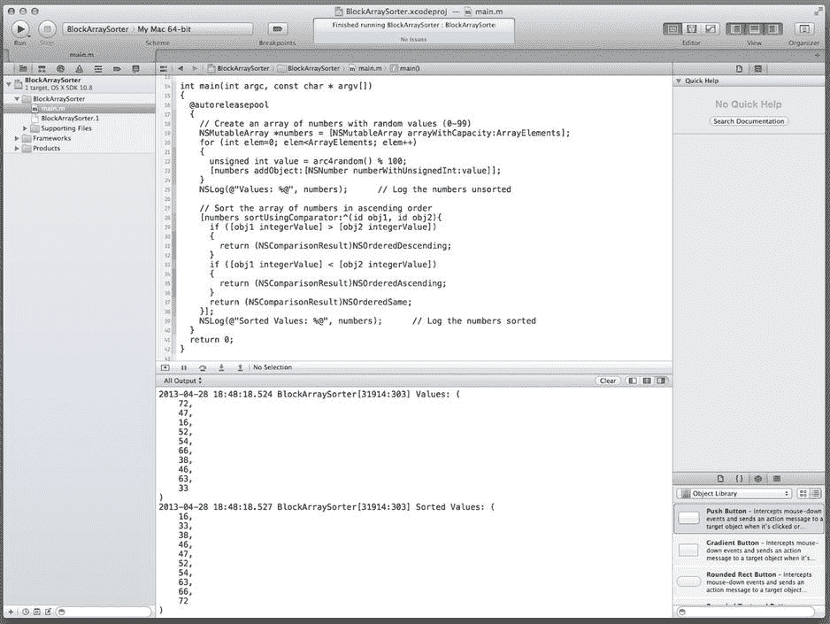

图 15-3. 测试 BlockArraySorter 项目

输出窗格中的消息显示，数组已使用块字面量表达式正确排序。它首先显示未排序数组元素的值，然后重新显示数组元素，这次是根据每个元素的数值排序后的结果。Foundation 框架的许多集合类（`NSArray`、`NSDictionary`）都包含使用块字面量对其元素进行排序的方法，因此这展示了你将遇到的一种常见块用法。完美。既然你已经掌握了一个例子，让我们开发另一个使用块执行异步回调函数的程序。

### 使用块加载 URL

接下来，你将创建一个程序，该程序使用块异步加载一个 URL 请求，并在请求完成加载时执行该块。在 Xcode 中，从 Xcode 的 File 菜单中选择 **New  Project . . .** 来创建一个新项目。在 **New Project Assistant** 窗格中，创建一个命令行应用程序。在 **Project Options** 窗口中，为 Product Name 指定 **BlockURLLoader**，为 Project Type 选择 **Foundation**，并通过勾选 **Use Automatic Reference Counting** 复选框来选择 ARC 内存管理。在文件系统中指定你希望创建项目的位置（如有必要，选择 **New Folder** 并输入文件夹的名称和位置），取消勾选 **Source Control** 复选框，然后点击 **Create** 按钮。

在 Xcode 项目导航器中，选择 `main.m` 文件并更新该文件，如代码清单 15-19 所示。

*代码清单 15-19.* BlockURLLoader main.m 文件

```
#import <Foundation/Foundation.h>

#define IndexURL       @"http://www.wikipedia.com/index.html"
```


```objective-c
int main(int argc, const char * argv[])
{
  @autoreleasepool
  {
    // 获取当前运行循环以用于连接
    NSRunLoop *loop = [NSRunLoop currentRunLoop];
    BOOL __block downloadComplete = NO;

    // 创建请求
    NSURLRequest *request = [NSURLRequest
                             requestWithURL:[NSURL URLWithString:IndexURL]];
    [NSURLConnection sendAsynchronousRequest:request
                                       queue:[NSOperationQueue currentQueue]
                           completionHandler:^(NSURLResponse *response,
                                               NSData *data, NSError *error)
    {
      if (data == nil)
      {
        NSLog(@"加载请求时出错 %@", [error localizedDescription]);
      }
      else
      {
        NSLog(@"\n\t 已从请求 %@ 下载 %lu 字节",
              [data length], [request URL]);
      }
      downloadComplete = YES;
    }];

    // 循环直至资源下载完成
    while ( !downloadComplete &&
           [loop runMode:NSDefaultRunLoopMode beforeDate:[NSDate distantFuture]]);
  }
  return 0;
}
```

在导入 Foundation 框架后，文件为待下载的 URL 定义了一个常量值 `IndexURL`。

`main()` 函数包含程序逻辑的主体。它首先获取当前运行循环，这是使用 `NSURLConnection` 对象进行异步 URL 加载所必需的。它还声明并初始化了一个名为 `downloadComplete` 的 `BOOL` 类型变量。该变量使用 `__block` 存储类型声明，从而允许其值在同一作用域的块字面量中被修改。接着，使用便捷构造方法 `requestWithURL:` 创建了一个 `NSURLRequest` 实例（其 URL 由 `#define` 常量指定）。然后代码创建了一个 `NSURLConnection` 对象来加载该请求。它使用了 `sendAsynchronousRequest:queue:completionHandler:` 方法。完成处理器是一个将被执行的块字面量处理器。队列是一个 `NSOperationQueue` 实例，当请求完成或失败时，处理器块会被派发到该队列中。这用于实现异步操作的执行。该块字面量检查下载请求的返回值（`NSData *`）。如果其值为 `nil`，则表明下载过程中发生了错误，并在控制台中记录该错误；否则，下载成功，并在控制台中记录已下载的字节数。

```
if (data == nil)
{
  NSLog(@"加载请求时出错 %@", [error localizedDescription]);
}
else
{
  NSLog(@"\n\t 已从请求 %@ 下载 %lu 字节",
        [data length], [request URL]);
}
downloadComplete = YES;
```

下一条语句是一个循环，用于保持应用程序运行，直到连接完成资源加载。

```
while (!downloadComplete &&
       [loop runMode:NSDefaultRunLoopMode beforeDate:[NSDate distantFuture]]);
```

该语句在前几章的示例中曾使用过。简而言之，它运行循环，从其输入源接收事件并执行相应的委托或回调方法，直到连接完成资源加载。

现在，保存、编译并运行 `BlockURLLoader` 程序，观察输出窗格中的消息（如图 15-4 所示）。

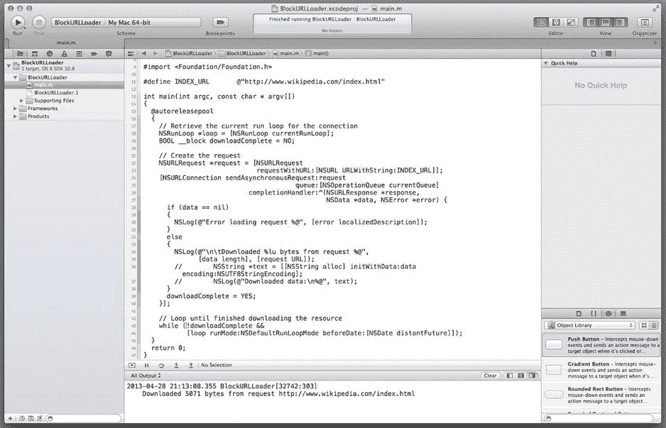

图 15-4. 测试 BlockURLLoader 项目

输出窗格中的消息显示，URL 已成功下载并使用块字面量表达式进行了处理。它显示了下载的字节数和请求的 URL。多个 Foundation 框架类（例如 `NSURLConnection`）、Cocoa 框架类以及各种第三方 API 都包含使用块字面量执行回调函数的方法，因此熟悉这种编程模型非常重要。好了，话不多说。现在让我们用另一个使用块进行并发编程的程序来结束这场速览。

### 使用块进行并发编程

你将通过一个使用块执行并发编程的程序来完成本章。该程序使用 GCD 并发执行多个由块定义的任务。在 Xcode 中，从 Xcode 的“文件”菜单中选择 **新建  项目...** 来创建一个新项目。在“新建项目助理”窗格中，创建一个命令行应用程序。在“项目选项”窗口中，将产品名称指定为 `BlockConcurrentTasks`，选择 **Foundation** 作为项目类型，并通过勾选“使用自动引用计数”复选框选择 ARC 内存管理。在文件系统中指定希望创建项目的位置（如有必要，选择 **新建文件夹** 并输入文件夹名称和位置），取消勾选“源代码控制”复选框，然后单击 **创建** 按钮。

在 Xcode 项目导航器中，选择 `main.m` 文件并更新它，如列表 15-20 所示。

*列表 15-20.*  `BlockConcurrentTasks` 的 `main.m` 文件

```
#import <Foundation/Foundation.h>
#define YahooURL       @"http://www.yahoo.com/index.html"
#define ApressURL       @"http://www.apress.com/index.html"

typedef void (^DownloadURL)(void);

/* 获取用于下载 URL 的块 */
DownloadURL getDownloadURLBlock(NSString *url)
{
  NSString *urlString = url;
  return ^{
    // 下载一个 URL
    NSURLRequest *request = [NSURLRequest
                             requestWithURL:[NSURL URLWithString:urlString]];
    NSError *error;
    NSDate *startTime = [NSDate date];
    NSData *data = [NSURLConnection sendSynchronousRequest:request
                                         returningResponse:nil
                                                     error:&error];
    if (data == nil)
    {
      NSLog(@"加载请求时出错 %@", [error localizedDescription]);
    }
    else
    {
      NSDate *endTime = [NSDate date];
      NSTimeInterval timeInterval = [endTime timeIntervalSinceDate:startTime];
      NSLog(@"下载 %@ 所用时间 = %f 秒", urlString, timeInterval);
    }
  };
}

int main(int argc, const char * argv[])
{
  @autoreleasepool
  {
    // 为任务创建队列
    dispatch_queue_t queue1 =
    dispatch_get_global_queue(DISPATCH_QUEUE_PRIORITY_DEFAULT, 0);
    dispatch_queue_t queue2 =
    dispatch_get_global_queue(DISPATCH_QUEUE_PRIORITY_DEFAULT, 0);

    // 创建一个任务组
    dispatch_group_t group = dispatch_group_create();

    // 获取当前时间用于度量
    NSDate *startTime = [NSDate date];

    // 现在创建并派发异步任务
    dispatch_group_async(group, queue1, getDownloadURLBlock(YahooURL));
    dispatch_group_async(group, queue2, getDownloadURLBlock(ApressURL));

    // 阻塞直至组中所有任务完成
    dispatch_group_wait(group, DISPATCH_TIME_FOREVER);

    // 获取并发执行所用时间并记录
    NSDate *endTime = [NSDate date];
    NSTimeInterval timeInterval = [endTime timeIntervalSinceDate:startTime];
    NSLog(@"并发下载 URL 所用时间 = %f 秒", timeInterval);
  }
  return 0;
}
```


# 排版后的内容

Listing 15-20 除了`main()`函数之外，还包含一个名为`getDownloadURLBlock`的函数，该函数返回一个用于下载 URL 的块字面量。该文件首先定义了两个常量`YahooURL`和`ApressURL`，它们指定了要下载的 URL。接着，为要使用的块类型提供了类型定义。然后文件定义了`getDownloadURLBlock()`函数。此函数返回一个块字面量，用于通过`NSURLConnection`方法`sendSynchronousRequest:returningResponse:error`同步下载一个 URL。它还使用多个`NSDate`API 计算下载 URL 所花费的时间。时间间隔以`NSTimeInterval`值计算。注意，块使用词法作用域捕获 URL 字符串（作为函数的参数提供）。

`main()`函数使用 GCD API 创建并调度两个任务以并发执行。它首先创建两个全局并发调度队列，用于并行执行任务。

```
dispatch_queue_t queue1 =
  dispatch_get_global_queue(DISPATCH_QUEUE_PRIORITY_DEFAULT, 0);
dispatch_queue_t queue2 =
  dispatch_get_global_queue(DISPATCH_QUEUE_PRIORITY_DEFAULT, 0);
```

接下来，它创建一个*任务组*，用于对任务进行分组，并且对于将任务排队以执行异步执行、等待一组已排队的任务等非常有用。然后代码将这两个任务分派到任务组。

```
dispatch_group_async(group, queue1, getDownloadURLBlock(YahooURL));
dispatch_group_async(group, queue2, getDownloadURLBlock(ApressURL));
```

注意，要执行的任务由`getDownloadURLBlock()`函数检索到的块字面量指定；一个使用 Yahoo URL，另一个使用 Apress URL。GCD 的`dispatch_group_async()`函数使这些任务并发执行。接下来，GCD 的`dispatch_group_wait()`函数用于阻塞主线程，直到两个并发任务都完成。

```
dispatch_group_wait(group, DISPATCH_TIME_FOREVER);
```

最后，计算两个并发任务完成所花费的时间，并记录到控制台。现在，保存、编译并运行`BlockConcurrentTasks`程序，在输出窗格中观察消息（如图 Figure 15-5 所示）。

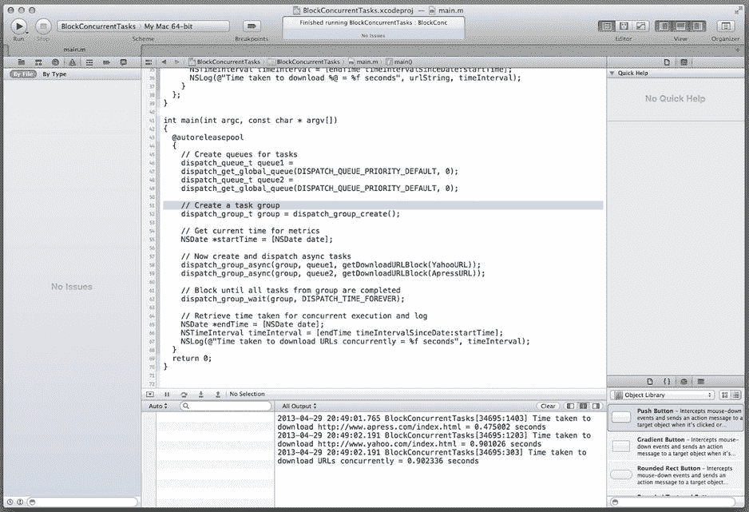

Figure 15-5. 测试 BlockConcurrentTasks 项目

输出窗格中的消息显示并发任务已成功执行。它还显示并发执行任务所花费的时间少于按顺序执行所花费的时间。太棒了。您刚刚学习了如何使用块执行并发编程，并简要介绍了 Grand Central Dispatch 系统。请注意，Chapter 17 提供了关于使用 GCD 执行并发编程的完整介绍。

## 总结

在本章中，您学习了如何使用块进行编程，这是 Objective-C 语言现在可用的一项强大功能。它探讨了块的语法和语义、内存管理、如何在您自己的代码中开发块以及如何在现有 API 中使用块。以下是本章的关键要点：

- 块类似于函数和方法，但除了可执行代码外，它们还可能包含对栈或堆内存的变量绑定。块是*闭包*的一种实现，闭包是一种允许访问其典型作用域之外变量的函数。
- 块可以声明为块类型的变量，并且块变量可以像标准变量一样在任何地方使用——作为函数/方法的参数等等。
- 块字面量表达式包含由块调用的代码。它可以作为匿名函数内联定义，从而作为函数/方法调用的参数。
- 与 C 函数相比，块通过词法作用域、`__block`变量、实例变量访问和`const`导入扩展了变量的可见性。
- 在运行时，块字面量表达式在栈上分配，因此具有与局部变量相同的生命周期。因此，必须将其复制到永久存储（即堆上）才能在其定义的作用域之外使用。
- 当使用 MRR 内存管理时，`Block_copy()`和`Block_release()`操作用于在堆上复制/释放块。使用 ARC 内存管理时，只要块不返回`id`类型或将`id`类型作为参数传递，编译器就会自动执行块复制和释放操作。
- 块最自然地用于实现封装工作单元的小型、独立的代码片段。它们通常对集合中的项目并发执行，或者在操作完成时作为回调执行。由于块可以内联定义，因此可以消除为上下文相关代码（例如异步完成处理程序）创建完全独立的类和方法的必要性。它们还使相关代码保持在一起，而不会分散在多个文件中。

这是一章详细的章节，向您介绍了各种高级主题：块、并发编程和 GCD API。花一点时间回顾这里涵盖的所有内容。随意修改示例以了解更多关于这些概念的知识。在下一章中，您将全面了解 Objective-C 字面量，这是 Objective-C 语言的最新补充之一。

## 第 16 章

# Objective-C 字面量

自诞生以来，Objective-C 语言就支持*编程字面量*，即表示源代码中固定值的表示法。直到最近，字面量表示法还仅限于标量类型。在本章中，您将全面了解该语言的最新补充之一——*Objective-C 字面量*，它提供了对对象字面量的支持。您将学习它们的语法、相关语义以及使用指南。本章还将介绍对象下标，这是该语言的另一个最新补充。

### 字面量

在计算机编程中，*字面量*是表示源代码中固定值的一种表示法。顾名思义，字面量表示法使您能够在代码中写入数据类型的字面符号。这很重要，因为如果没有字面量表示法，在代码中写入常量值将非常繁琐且容易出错。例如，考虑以下赋值语句。

```
int luckyNumber = 7;
```

符号`7`表示整数值七的字面量表示法。如果没有字面量表示法，您将不得不在代码中构造值七，也许如 Listing 16-1 所示。

*Listing 16-1.*  在没有字面量的情况下在代码中创建整数值

```
static int zero;                             // 静态变量初始化为 0
int one = zero++;
int two = one++;
int luckyNumber = (two * two) + two + one;   // 7 = 4 + 2 + 1
```


# Markdown 文档的规范格式

如果需要通过编码为简单数据类型赋值而经历所有这些麻烦，这会很快打消你编程的积极性。因此，字面量表示法的优势不言而喻。现在，这对你来说可能显而易见。毕竟，难道不是所有编程语言都支持编码字面量值吗？事实上，不同语言对字面量表示法的支持程度各不相同。

传统上，Objective-C 语言为基本/标量类型（即 `int`、`float`、`Boolean` 类型）以及文本字符串（`NSString` 实例）提供了字面量表示法支持。Objective-C 字面量支持创建对象字面量；具体来说，包括 `NSNumber` 字面量、集合字面量、（装箱后的）表达式字面量以及（装箱后的）C 字符串字面量。在接下来的几节中，你将学会如何在代码中使用这些对象字面量。

## NSNumber 字面量

你可能还记得，第 10 章 简要介绍了 `NSNumber` 字面量。回顾一下，Foundation 框架中的 `NSNumber` 类是一个用于存放基本（即标量）类型的容器。`NSNumber` 实例为标量值（整型值、浮点值或布尔值）提供了对象包装器。`NSNumber` 对象在多种场景下非常有用；例如，与无法容纳基本类型的 Foundation 框架集合类一起使用时。然而，创建和初始化 `NSNumber` 需要使用 `NSNumber` API，当需要处理大量对象时（例如，用许多 `NSNumber` 对象初始化的集合类）会变得繁琐。

`NSNumber` 字面量使用一种简单的表示法，从标量字面量表达式创建并初始化 `NSNumber` 对象，其语法如下：

```
@标量值
```

该字面量以 `@` 符号开头，后跟一个 `标量值`，该值表示任意字符、数值或布尔字面量值。代码清单 16-2 演示了如何在使用 `NSNumber` 字面量的语句中创建一个名为 `numbers` 的 `NSArray` 对象。

*代码清单 16-2.*  使用 `NSNumber` 字面量创建 `NSArray` 实例

```
NSArray *numbers = [NSArray arrayWithObjects:@'A', @YES, @-3, @21U, @250L,
                    @9876543210LL, @3.14F, @-52.687, nil];
```

在前述语句中使用 `NSNumber` 字面量极大地简化了需要编写的代码量，从而减少了出错的可能性。这看起来很不错，但你可能会好奇，这一切是如何运作的呢？实际上，编译器会将每个 `NSNumber` 字面量转换为一个便捷构造器，该构造器在运行时创建相应的 `NSNumber` 实例。实际上，以下两个表达式是等价的：

```
@17
[NSNumber numberWithInt:17]
```

对于带修饰符的标量数据类型也是如此；以下两个表达式也是等价的：

```
@3.14f
[NSNumber numberWithFloat:3.14]
```

因此，当你在代码中编写 `NSNumber` 字面量 `@17` 时，编译器会将其转换为表达式 `[NSNumber numberWithInt:17]`。实际上，字面量表示法是 `NSNumber` 对象创建的快捷方式。

由于 `NSNumber` 字面量实际上就是 `NSNumber` 对象，因此它们拥有完整的 `NSNumber` API；例如，以下语句比较了两个 `NSNumber` 字面量的值：

```
NSComparisonResult comparison = [@17 compare:@16];
```

请注意，`NSNumber` 字面量对象是从标量值生成的，而不是表达式。同时要注意，`NSNumber` 字面量是在运行时计算的；因此，它们不是编译时常量，不能用于初始化静态或全局变量。以下语句将无法编译：

```
static NSNumber *badNumber = @0;              // 错误！
```

## 容器字面量

Objective-C 支持创建多种容器字面量；具体来说，包括数组和字典的字面量表示法（即 `NSArray` 和 `NSDictionary` 对象）。

### NSArray 字面量


# 第 10 章：NSArray 字面量

第 10 章简要概述了 `NSArray` 字面量。这种表示法简化了 `NSArray` 实例的创建过程。数组字面量的语法如下：

```
@[firstObj, secondObj, ...]
```

`NSArray` 字面量以`@`符号开头，后跟一个用方括号括起来的、以逗号分隔的对象列表。该对象列表*不*以 `nil` 结尾。与 `NSArray` API 相同，数组中的对象必须是 Objective-C 对象指针类型，包括其他 Objective-C 字面量（`NSNumber` 字面量、`NSArray` 字面量等）。代码清单 16-3 修改了代码清单 16-2 中的示例，这次使用数组字面量表示法来创建一个 `NSArray` 对象。

***代码清单 16-3.*  创建一个 NSArray 字面量**

```
NSArray *numbers = @[@'A', @YES, @-3, @21U, @250L,
                    @9876543210LL, @3.14F, @-52.687];
```

数组字面量可以嵌套，从而可以创建数组中的数组。代码清单 16-4 演示了如何创建一个嵌套的 `NSArray` 字面量。

***代码清单 16-4.*  嵌套的 NSArray 字面量**

```
NSArray *groups = @[@[@0, @1, @2], @[@"alpha", @"beta"]];
```

如前例所示，`NSArray` 字面量表示法既简化了数组的创建过程，又减少了程序员的错误。

编译器会将每个 `NSArray` 字面量转换为 `NSArray` 便捷构造器 `arrayWithObjects:count:`。此方法在运行时被调用，以创建相应的 `NSArray` 实例。实际上，`NSArray` 字面量

```
@[@"Hello", @"World"];
```

等价于代码清单 16-5 中所示的代码片段。

***代码清单 16-5.*  创建一个 NSArray 实例（不使用数组字面量表示法）**

```
NSString *strings[2];
strings[0] = @"Hello";
strings[1] = @"World";
[NSArray arrayWithObjects:strings count:2];
```

数组字面量表示法用于创建不可变数组实例。你可以通过向数组字面量发送 `mutableCopy` 消息，从中创建一个可变数组（例如 `NSMutableArray`），如下所示。

```
NSMutableArray *mutableWords = [@[@"Hello", @"World"] mutableCopy];
```

### NSDictionary 字面量

Objective-C 还提供了对创建 `NSDictionary` 字面量的支持。字典字面量的语法如下：

```
@{keyObj:valueObj, ...}
```

`NSDictionary` 字面量以`@`符号开头，后跟一个或多个用逗号分隔的键值对，所有这些都用大括号括起来。对于每个键值对，在键与其对应的值之间放置一个冒号。每个键必须是符合 `NSCopying` 协议的对象指针类型，每个值必须是对象指针类型。字典字面量中的键和值都不能为 `nil`；在容器中必须使用 `NSNull` 来表示空对象。代码清单 16-6 创建了一个包含两个条目的简单字典字面量——一个奶酪汉堡的订单和两个热狗的订单。

***代码清单 16-6.*  创建一个 NSDictionary 字面量**

```
NSDictionary *orders = @{@1111:@"1 个奶酪汉堡",
                         @1112:@"2 个热狗"};
```

请注意，`NSDictionary` 字面量的键值对语法是 key:value，而标准的 `NSDictionary` API 在创建字典实例时使用的是 value, key 语法（例如，`NSDictionary` 方法 `dictionaryWithObjects:forKeys:`）。与数组字面量一样，字典字面量也可以嵌套；也就是说，键值对中的值可以是一个容器实例（包括另一个 `NSDictionary` 字面量）。代码清单 16-7 演示了如何创建一个包含两个条目的嵌套 `NSDictionary` 字面量（`currentOrders`），其中每个条目的值都是一个 `NSDictionary` 字面量。

***代码清单 16-7.*  嵌套的 NSDictionary 字面量**

```
NSDictionary *order1 = @{@1111:@"1 个奶酪汉堡",
                         @1112:@"2 个热狗"};
NSDictionary *order2 = @{@1113:@"1 个大号奶酪披萨"};
NSDictionary *currentOrders = @{@"table1":order1, @"table2":order2};
```

编译器会将每个 `NSDictionary` 字面量表达式转换为 `NSDictionary` 便捷构造器 `dictionaryWithObjects:forKeys:count:`。此方法在运行时被调用，以创建相应的 `NSDictionary` 实例——实际上，以下字典字面量：

```
@{@1111:@"1 个奶酪汉堡"}
```

等价于代码清单 16-8 中所示的代码片段。

***代码清单 16-8.*  创建一个 NSDictionary 实例（不使用字典字面量表示法）**

```
NSString *values[1];
values[0] = @"1 个奶酪汉堡";
NSNumber *keys[1];
keys[0] = @1111;
[NSDictionary dictionaryWithObjects:values forKeys:keys count:1];
```

字典字面量表示法用于创建不可变字典实例。如数组字面量所述，你可以通过向字典字面量发送 `mutableCopy` 消息，从中创建一个可变字典（例如 `NSMutableDictionary`）。

## 表达式字面量

表达式字面量，也称为*装箱表达式*，使您能够从括号括起来的表达式中创建字面量。表达式字面量的语法如下：

```
@( <expression> )
```

该表达式的计算结果为标量（数字、枚举、`BOOL`）或 C 字符串指针类型。所得对象的类型与表达式的类型相对应。标量类型生成 `NSNumber` 实例，而 C 字符串则使用 UTF-8 字符编码生成 `NSString` 对象。以下语句使用装箱表达式创建了一个 `NSNumber` 实例。

```
NSNumber *degrees2Radians = @( M_PI / 180.0 );
```

在前面的示例中，算术表达式 `M_PI/180.0` 被求值，其结果被*装箱*；也就是说，它被用来创建一个 `NSNumber` 实例。此装箱表达式的等价语句是：

```
NSNumber *degrees2Radians = [NSNumber numberWithDouble:(M_PI / 180.0)];
```

下一个示例使用装箱表达式创建了一个 `NSString` 实例。

```
NSString *currentUser = @(getenv("USER"));
```

`getenv()` 函数检索环境变量的值，输入参数是要检索的变量名称。函数的返回值是一个指向 C 字符串的指针。

尽管枚举通常用于定义常量标量值，但它们不能直接用于创建 `NSNumber` 字面量；例如，以下尝试从一个枚举创建 `NSNumber` 字面量（如代码清单 16-9 所示）将无法编译。

***代码清单 16-9.*  尝试从枚举创建 NSNumber 字面量**

```
enum
{
  Zero = 0,
  One
};
NSNumber *zeroNumber = @Zero;      // 错误！
```

相反，必须将枚举值放在表达式字面量（即*装箱枚举*）内部，以创建 `NSNumber` 实例。代码清单 16-10 修正了代码清单 16-9 中的示例，以从装箱枚举创建一个 `NSNumber` 实例。

***代码清单 16-10.*  从装箱枚举创建 NSNumber**

```
enum
{
  Zero = 0,
  One
};
NSNumber *zeroNumber = @(Zero);      // 正确！
```

如果枚举具有*固定的底层类型*（即它指定了用于存储其值的类型），则 `NSNumber` 实例将使用相应的类型创建。代码清单 16-11 中所示的示例从装箱枚举创建了一个 `NSNumber` 实例；由于枚举类型为 `unsigned int`，因此 `NSNumber` 实例使用相应的类型创建。

***代码清单 16-11.*  从具有固定底层类型的装箱枚举创建 NSNumber**


```c
enum : unsigned int
{
  Zero = 0,
  One
};
NSNumber *zeroNumber = @(Zero);    // 调用 [NSNumber numberWithUnsignedInt:]
```

## 对象下标引用

对象下标引用是 Objective-C 语言近期新增的特性，它使 Objective-C 对象能够与 C 语言的下标运算符（`[]`）一起使用。它为获取和设置 Foundation 框架数组和字典（例如 `NSArray` 和 `NSDictionary`）中的元素提供了一种简洁清晰的语法。此外，下标运算符是通用的，因此任何类都可以实现相应的方法来提供自定义下标引用。

### NSArray 下标引用

当应用于 `NSArray` 和 `NSMutableArray` 对象时，下标操作数必须是整数类型。`NSArray` 支持使用下标操作数获取数组中的元素。如代码清单 16-12 所示的示例创建了一个 `NSArray` 字面量，然后使用下标引用从结果数组中检索元素。

*代码清单 16-12.* 使用下标引用检索 `NSArray` 元素

```
NSArray *words = @[@"Hello", @"World"];
NSString *word = words[0];
```

`NSMutableArray` 同时支持使用下标操作数获取和设置数组中的元素。代码清单 16-13 从一个 `NSArray` 字面量创建了一个可变数组，然后将数组中的一个元素设置为新值。

*代码清单 16-13.* 使用下标引用设置 `NSMutableArray` 元素

```
NSMutableArray *words = [@[@"Hello", @"World"] mutableCopy];
words[1] = @"Earthlings";
```

`NSArray` 和 `NSMutableArray` 类使用下标操作数（即索引）来访问其集合中的相应元素。下标运算符不允许你向可变数组添加元素；它只允许你替换现有元素。对于 `NSArray` 或 `NSMutableArray` 实例，如果下标操作数超出数组边界，则会抛出 `NSRangeException` 异常。此外，当使用下标引用设置 `NSMutableArray` 元素时，要设置的数组元素对象不能为 `nil`。

当下标操作数应用于 `NSArray` 或 `NSMutableArray` 对象时，表达式会被重写，根据元素是被读取还是被写入，使用两种不同的选择器之一。对于读取（即获取）操作，编译器会将其转换为使用 `NSArray` 方法 `objectAtIndexedSubscript:` 的表达式。实际上，以下两个表达式是等价的：

```
NSString *word = words[0]
NSString *word = [words objectAtIndexedSubscript:1]
```

对于写入（即设置）操作，编译器会将其转换为使用 `NSMutableArray` 方法 `setObject:atIndexedSubscript:` 的表达式。实际上，以下两个表达式是等价的：

```
words[1] = @"Earthlings";
[words setObject:@"Earthlings" atIndexedSubscript:1];
```

`NSArray` 方法 `objectAtIndexedSubscript:` 接受一个 `NSUInteger`（例如，无符号整数）作为其输入参数，并返回某种 Objective-C 对象指针类型的值。`NSMutableArray` 方法 `setObject:atIndexedSubscript:` 接受一个 Objective-C 指针类型作为其第一个参数，并接受一个 `NSUInteger` 作为其第二个参数。

### NSDictionary 下标引用

当应用于 `NSDictionary` 和 `NSMutableDictionary` 对象时，下标操作数必须是 Objective-C 指针类型。`NSDictionary` 支持使用下标操作数获取字典中的元素。如代码清单 16-14 所示的示例创建了一个 `NSDictionary` 字面量，然后使用下标引用从结果数组中检索元素。

*代码清单 16-14.* 使用下标引用检索 `NSDictionary` 元素

```
NSDictionary *order1 = @{@1111:@"1 Cheeseburger",
                         @1112:@"2 Hot dogs"};
NSString *order = order1[@1111];
```

`NSMutableDictionary` 同时支持使用下标操作数获取和设置数组中的元素。代码清单 16-15 从一个 `NSDictionary` 字面量创建了一个可变字典，然后将数组中的一个元素设置为新值。

*代码清单 16-15.* 使用下标引用设置 `NSMutableDictionary` 元素

```
NSMutableDictionary *order1 = [@{@1111:@"1 Cheeseburger",
                                 @1112:@"2 Hot dogs"} mutableCopy];
order1[@1112] = @"1 Cheese pizza";
```

`NSDictionary` 和 `NSMutableDictionary` 类使用下标操作数（即键）来访问其集合中的相应元素。下标运算符不允许你向可变数组添加元素；它只允许你替换现有元素。对于 `NSDictionary` 或 `NSMutableDictionary` 实例，如果输入键没有关联的值，则尝试通过下标引用检索元素会返回 `nil`。当使用下标引用设置 `NSMutableDictionary` 元素时，如果键或对象为 `nil`，该方法会引发 `NSInvalidArgument` 异常。

当下标操作数应用于 `NSDictionary` 或 `NSMutableDictionary` 对象时，表达式会被重写，根据元素是被读取还是被写入，使用两种不同的选择器之一。对于读取（即获取）操作，编译器会将其转换为使用 `NSDictionary` 方法 `objectForKeyedSubscript:` 的表达式。实际上，以下两个表达式是等价的：

```
NSString *order = order1[@1111];
NSString *order = [order1 objectForKeyedSubscript:@1111];
```

对于写入（即设置）操作，编译器会将其转换为使用 `NSMutableDictionary` 方法 `setObject:forKeyedSubscript:` 的表达式。实际上，以下两个表达式是等价的：

```
order[@1111] = @"1 Cheeseburger";
[order setObject:@"1 Cheeseburger" forKeyedSubscript:@1111];
```

`NSDictionary` 方法 `objectForKeyedSubscript:` 接受一个遵循 `NSCopying` 协议的 Objective-C 指针类型作为其输入参数，并返回某种 Objective-C 对象指针类型的值。`NSMutableDictionary` 方法 `setObject:forKeyedSubscript:` 接受一个 Objective-C 指针类型作为其第一个参数，并接受一个遵循 `NSCopying` 协议的 Objective-C 指针类型作为其第二个参数。

与 Objective-C 字面量一样，对象下标操作是在运行时评估的；因此，它们不是编译时常量，也不能用于初始化静态或全局变量。

### 自定义下标引用

如前所述，对象下标运算符支持任何类型的 Objective-C 对象。编译器将这些运算符转换为消息选择器，你的代码通过实现一个或多个相应的方法来支持对象下标引用。实际上，有两种类型的下标表达式：*数组样式* 和 *字典样式*。你在前面介绍的 `NSArray` 和 `NSDictionary` 下标操作中已经了解过这一点。总之，数组样式的下标表达式使用整数类型的下标，而字典样式的下标表达式使用 Objective-C 对象指针类型的下标（即键）。每种类型的下标表达式都使用预定义的选择器映射到消息发送操作。

数组样式下标引用的实例方法如下：

```
- (id)objectAtIndexedSubscript:(NSUInteger)index
- (void)setObject:(id)anObject atIndexedSubscript:(NSUInteger)index
```

`objectAtIndexedSubscript:` 方法检索指定索引处的值，而 `setObject:atIndexedSubscript:` 方法设置指定索引处的值。例如，给定一个名为 `Hello` 的类，它支持数组样式的下标引用，下面的赋值语句中使用了一个数组样式的下标表达式来返回值。

```
id value = helloObject[2];           // helloObject 是一个 Hello 类实例
```


# 在 Objective-C 中使用自定义下标

在此场景下（即，为关联索引取值），下标表达式（`helloObject[2]`）会被编译器转换为调用选择子 `objectAtIndexedSubscript:` 的消息发送，因此等价于以下语句：

```
id value = [helloObject objectAtIndexedSubscript:2];
```

在下一个示例中，使用数组风格的下标表达式在赋值语句中设置值。

```
helloObject[2] = @"Howdy";
```

通过数组风格的下标表达式设置值时，该表达式（此处为 `helloObject[2]`）会被编译器转换为调用选择子 `setObject:atIndexedSubscript:` 的消息发送，因此等价于以下语句：

```
[helloObject setObject:@"Howdy" atIndexedSubscript:2];
```

这些消息发送操作会像显式的 Objective-C 消息发送一样进行类型检查并执行。实现类决定了索引的含义。

字典风格下标的实例方法如下：

```
- (id)objectForKeyedSubscript:(id)key
- (void)setObject:(id)anObject forKeyedSubscript:(id<NSCopying>)key
```

这些方法与数组风格的下标方法类似，使用键（类型为 `id`——即对象指针）来获取或设置关联值，而非使用索引。给定一个支持字典风格下标的名为 `Order` 的类，字典风格的下标表达式可用于在以下语句中返回值。

```
id item = orderObject[@"1234"];      // orderObject 是一个 Order 类实例
```

在此情况下，下标表达式（`orderObject[@"1234"]`）会被编译器转换为调用选择子 `objectForKeyedSubscript:` 的消息发送，因此等价于以下语句：

```
id item = [orderObject objectForKeyedSubscript:@"1234"];
```

相反，字典风格的下标表达式用于在以下赋值语句中设置值。

```
orderObject[@"1234"] = @"Cheeseburger";
```

在此情况下，下标表达式（`orderObject[@"1234"]`）会被编译器转换为调用选择子 `setObject:forKeyedSubscript:` 的消息发送，因此等价于以下语句：

```
[orderObject setObject:@"Cheeseburger" forKeyedSubscript:@"1234"];
```

如这些示例所示，自定义下标操作应仅用于获取和设置对象的元素，而不应用于其他目的（例如，追加或删除对象等）。这有助于保持语法与其意图一致，从而与 Foundation 框架的数组和字典下标操作保持一致。

## 使用自定义下标编辑寄存器值

现在你将创建一个演示如何使用自定义下标的程序。此外，该程序还大量使用了前面章节中介绍的多个 Foundation 框架 API。你要创建的程序名为 `RegEdit`，包含一个头文件和两个类。`RegEdit` 模拟了一个 32 位宽的计算机内存寄存器。它支持设置和操作寄存器内容。该程序有三个命令行输入：初始寄存器设置（一个 32 位十六进制值）、要获取/设置的所选寄存器字节，以及（可选的）要设置的寄存器（十六进制）字节值。

在 Xcode 中，通过从 Xcode 文件菜单中选择 **New**  **Project …** 来创建新项目。在 **New Project Assistant** 窗格中，创建一个命令行应用程序。在 **Project Options** 窗口中，为产品名称指定 `RegEdit`，为项目类型选择 **Foundation**，并通过勾选 **Use Automatic Reference Counting** 复选框选择 ARC 内存管理。在文件系统中指定希望创建项目的位置（如有必要，选择 **New Folder** 并输入文件夹的名称和位置），取消勾选 **Source Control** 复选框，然后点击 **Create** 按钮。

首先，你要创建一个头文件，其中定义了其他类中使用的几个常量。从 Xcode 文件菜单中选择 **New**  **File …**，选择 **Header File template**（来自 OS X C 和 C++ 选项），并将头文件命名为 `RegEditConstants`。选择 `RegEdit` 文件夹作为文件位置，`RegEdit` 项目作为目标，然后点击 **Create** 按钮。接下来，在 Xcode 项目导航窗格中，选择生成的头文件 `RegEditConstants.h` 并更新接口，如列表 16-16 所示。

*列表 16-16.*  RegEditConstants 接口

```
#ifndef RegEdit_RegEditConstants_h
#define RegEdit_RegEditConstants_h

#define kByteMultiplier  0xFF
#define kRegisterSize (sizeof(uint32))

#endif
```

列表 16-16 显示，包含保护可防止头文件的递归包含（如果文件通过 `#include` 指令导入，这是必需的）。该头文件定义了两个常量：`kByteMultiplier` 用于执行寄存器位操作，`kRegisterSize` 定义了寄存器的宽度（以字节为单位）。接下来，你要创建一个用于解析程序命令行输入的类。从 Xcode 文件菜单中选择 **New**  **File …**，选择 **Objective-C** 类模板，并将该类命名为 `CLIParser`。将该类设为 `NSObject` 的子类，选择 `RegEdit` 文件夹作为文件位置，`RegEdit` 项目作为目标，然后点击 **Create** 按钮。在 Xcode 项目导航窗格中，选择生成的头文件 `CLIParser.h` 并更新接口，如列表 16-17 所示。

*列表 16-17.*  CLIParser 接口

```
#import <Foundation/Foundation.h>

@interface CLIParser : NSObject

- (id) initWithCount:(int)argc arguments:(const char *[])argv;
- (BOOL) parseWithRegister:(uint32 *)registerValue
                byteNumber:(NSInteger *)byteN
                 doSetByte:(BOOL *)doSet
                 byteValue:(unsigned int *)byteValue
                     error:(NSError **)anError;

@end
```

`initWithCount:arguments:` 方法初始化一个 `CLIParser` 对象，将其状态设置为输入参数值。`parseWithRegister:byteNumber:doSetByte:` 方法解析命令行输入，通过间接方式设置输入参数的值。该类的实际实现稍后将讨论，但现在让我们先创建真正的 `RegEdit` 类。从 Xcode 文件菜单中选择 **New**  **File …**，选择 **Objective-C** 类模板，并将该类命名为 `RegEdit`。将该类设为 `NSObject` 的子类，选择 `RegEdit` 文件夹作为文件位置，`RegEdit` 项目作为目标，然后点击 **Create** 按钮。接下来，在 Xcode 项目导航窗格中，选择生成的头文件 `RegEdit.h` 并更新接口，如列表 16-18 所示。

*列表 16-18.*  RegEdit 接口

```
#import <Foundation/Foundation.h>

@interface RegEdit : NSObject

@property (readonly) uint32 regSetting;

- (id) initWithValue:(uint32)value;
- (id) objectAtIndexedSubscript:(NSInteger)index;
- (void) setObject:(id)newValue atIndexedSubscript:(NSInteger)index;

@end
```


该接口首先声明了一个名为`regSetting`的只读属性，用于存储寄存器每个位的二进制值（1/0）。该属性的类型为`uint32`，这是 C 语言中无符号、恰好 32 位宽的标准整数类型；因此该寄存器为 32 位宽。`initWithValue:`方法使用所需的初始寄存器设置来初始化`RegEdit`实例。`objectAtIndexedSubscript:`和`setObject:atIndexedSubscript:`方法用于实现对`RegEdit`对象的自定义下标操作。

现在选择**RegEdit.m**文件并更新其实现，如清单 16-19 所示。

*清单 16-19* RegEdit 实现

```objectivec
#import "RegEdit.h"
#import "RegEditConstants.h"

@interface RegEdit()

@property (readwrite) uint32 regSetting;

@end

@implementation RegEdit

- (id) initWithValue:(uint32)value
{
  if ((self = [super init]))
  {
    _regSetting = value;
  }
  return self;
}

- (id) objectAtIndexedSubscript:(NSInteger)index
{
  NSUInteger byteNumber = index * 8;
  if ((1 << byteNumber) > self.regSetting)
  {
    [NSException raise:NSRangeException
                format:@"Byte selected (%ld) exceeds number value", index];
  }
  unsigned int byteValue =
    (self.regSetting & (kByteMultiplier << byteNumber)) >> byteNumber;
  return [NSNumber numberWithUnsignedInt:byteValue];
}

- (void) setObject:(id)newValue atIndexedSubscript:(NSInteger)index
{
  if (newValue == nil)
  {
    [NSException raise:NSInvalidArgumentException
                format:@"New value is nil"];
  }

NSUInteger byteNumber = index * 8;
  if ((1 << byteNumber) > self.regSetting)
  {
    [NSException raise:NSRangeException
                format:@"Byte selected (%ld) exceeds number value", index];
  }
  uint32 mask = ∼(kByteMultiplier << byteNumber);
  uint32 tmpValue = self.regSetting & mask;
  unsigned char newByte = [newValue unsignedCharValue];
  self.regSetting = (newByte << byteNumber) | tmpValue;
}

@end
```

文件开头的`RegEdit`类扩展使`regSetting`属性可写，从而允许该类实现中的其他方法更新其值。`RegEdit`实现首先定义了`initWithValue:`方法，该方法使用输入参数值初始化`regSetting`属性。接下来，实现定义了`objectAtIndexedSubscript:`方法，该方法从寄存器中检索一个字节的值，其中检索的字节由输入参数（`index`）指定。`RegEdit`寄存器模拟的是**小端序**机器；因此最低有效字节具有最低的内存地址（即字节 0）。选定的寄存器字节作为封装在`NSNumber`实例中的无符号整数返回。该方法还包含检查输入参数值的逻辑，如果选定的字节超过寄存器值，则抛出异常。

```objectivec
if ((2 << (byteNumber-1)) > self.regSetting)
{
  [NSException raise:NSRangeException
              format:@"Byte selected (%ld) exceeds number value",
   (unsigned long)index];
}
```

`setObject:atIndexedSubscript:`方法的实现首先执行逻辑，验证选定的寄存器是否在范围内，并且输入值不为`nil`，如果任一条件不满足则抛出异常。然后，该方法将选定的寄存器字节的值设置为输入值。

```objectivec
uint32 mask = ∼(kByteMultiplier << byteNumber);
uint32 tmpValue = self.regSetting & mask;
unsigned char newByte = [newValue unsignedCharValue];
self.regSetting = (newByte << byteNumber) | tmpValue;
```

请注意，这两个自定义下标方法都执行位级操作，以在其单个位的级别上获取/设置寄存器的值。按位左移（`<<`）和右移（`>>`）运算符用于将数字中的每个位向左或向右移动指定的位数。按位取反运算符（`∼`）用于翻转数字的位。按位或运算符（`|`）对两个数字执行逐位的逻辑或运算，而按位与运算符（`&`）对两个数字执行逐位的逻辑与运算。

好了，以上总结了`RegEdit`类实现的关键细节。现在你将实现`CLIParser`类，选择`CLIParser.m`文件，并更新`CLIParser`类的实现，如清单 16-20 所示。

*清单 16-20* CLIParser 实现

```objectivec
#import "CLIParser.h"
#import "RegEditConstants.h"

NSString *HelpCommand =
@"\n  RegEdit -n [Hex initial register settings] -b [byte number] -v [hex byte value]";
NSString *HelpDesc = @"\n\nNAME\n  RegEdit - Get/set selected byte of a register.";
NSString *HelpSynopsis = @"\n\nSYNOPSIS";
NSString *HelpOptions = @"\n\nOPTIONS";
NSString *HelpRegValue = @"\n  -n\tThe initial register settings.";
NSString *HelpRegByte = @"\n  -b\tThe byte to retrieve from the register.";
NSString *HelpByteValue = @"\n  -v\tValue to set for the selected register byte.";

@implementation CLIParser

// Private instance variables
{
  const char **argValues;
  int argCount;
}

- (id) initWithCount:(int)argc arguments:(const char *[])argv
{
  if ((self = [super init]))
  {
    argValues = argv;
    argCount = argc;
  }
  return self;
}

- (BOOL) parseWithRegister:(uint32 *)registerValue
                byteNumber:(NSInteger *)byteN
                 doSetByte:(BOOL *)doSet
                 byteValue:(unsigned int *)byteValue
                     error:(NSError **)anError
{
  // Retrieve command line arguments using NSUserDefaults
  NSUserDefaults *defaults = [NSUserDefaults standardUserDefaults];
  NSString *numberString = [defaults stringForKey:@"n"];
  NSString *byteString = [defaults stringForKey:@"b"];
  NSString *valueString = [defaults stringForKey:@"v"];

// Display help message if register value or byte number not provided
  if (!numberString || !byteString)
  {
    NSString *help = [NSString stringWithFormat:@"%@%@%@%@%@%@%@",
                      HelpDesc, HelpSynopsis, HelpCommand,
                      HelpOptions, HelpRegValue, HelpRegByte,
                      HelpByteValue];
    printf("%s\n", [help UTF8String]);
    return NO;
  }

// Scan input register value
  NSScanner *scanner = [NSScanner scannerWithString:numberString];
  if (!numberString ||
      ([numberString length] == 0) ||
      ([numberString length] > kRegisterSize*2) ||
      ![scanner scanHexInt:registerValue])
  {
    // Create error and return NO
    if (anError != NULL)
    {
      NSString *msg =
      [NSString stringWithFormat:
       @"ERROR!, Register value must be from 1-%ld hexadecimal characters",
       kRegisterSize*2];
      NSString *description = NSLocalizedString(msg, @"");
      NSDictionary *info = @{NSLocalizedDescriptionKey:description};
      int errorCode = 1;
      *anError = [NSError errorWithDomain:@"CustomErrorDomain"
                                     code:errorCode
                                 userInfo:info];
    }
    return NO;
  }
```


```objectivec
// 扫描输入寄存器字节编号
scanner = [NSScanner scannerWithString:byteString];
if (!byteString ||
    ([byteString length] == 0) ||
    [scanner scanInteger:byteN])
{
    unsigned int numberLength = (unsigned int)(ceil([numberString length] * 0.5));
    if ((*byteN < 0) || (*byteN > (numberLength - 1)))
    {
        // 创建错误并返回 NO
        if (anError != NULL)
        {
            NSString *msg = [NSString stringWithFormat:
                             @"ERROR!, Register byte number must be from 0-%d",
                             numberLength-1];
            NSString *description = NSLocalizedString(msg, @"");
            NSDictionary *info = @{NSLocalizedDescriptionKey:description};
            int errorCode = 2;
            *anError = [NSError errorWithDomain:@"CustomErrorDomain"
                                           code:errorCode
                                       userInfo:info];
        }
        return NO;
    }
}

// 扫描输入值以设置寄存器字节
if (valueString)
{
    *doSet = YES;
    scanner = [NSScanner scannerWithString:valueString];
    if ([scanner scanHexInt:byteValue])
    {
        if (*byteValue > UCHAR_MAX)
        {
            if (anError != NULL)
            {
                NSString *msg =
                [NSString stringWithFormat:
                 @"ERROR!, Register byte value must be 1-2 hexadecimal characters"];
                NSString *description = NSLocalizedString(msg, @"");
                NSDictionary *info = @{NSLocalizedDescriptionKey:description};
                int errorCode = 3;
                *anError = [NSError errorWithDomain:@"CustomErrorDomain"
                                               code:errorCode
                                           userInfo:info];
            }
            return NO;
        }
    }
}

return YES;
}

@end
```

**清单 16-20** 展示了 `parseWithRegister:byteNumber:doSetByte:` 方法包含了相当多的代码行。不过，它并没有引入太多新概念；这里的几乎所有代码都基于你在本书前面遇到的概念和/或 API。让我们从 `NSUserDefaults` 类开始。它在此处用于在程序运行时检索命令行参数。

```objectivec
NSString *numberString = [defaults stringForKey:@"n"];
NSString *byteString = [defaults stringForKey:@"b"];
NSString *valueString = [defaults stringForKey:@"v"];
```

接下来，使用 `NSScanner` 对象扫描通过 `NSUserDefaults` 对象检索到的输入值，将这些值转换为适当的类型和格式，如下面的清单 16-20 摘录所示。

```objectivec
NSScanner *scanner = [NSScanner scannerWithString:numberString];
[scanner scanHexInt:registerValue]
```

代码还会验证每个命令行输入值。如果该值未通过验证检查，它会创建 `NSError` 对象返回给调用方，如下所示。

```objectivec
if (anError != NULL)
{
    NSString *msg =
    [NSString stringWithFormat:
     @"ERROR!, Register value must be from 1-%ld hexadecimal characters",
     kRegisterSize*2];
    NSString *description = NSLocalizedString(msg, @"");
    NSDictionary *info = @{NSLocalizedDescriptionKey:description};
    int errorCode = 1;
    *anError = [NSError errorWithDomain:@"CustomErrorDomain"
                                   code:errorCode
                               userInfo:info];
}
```

如清单 16-20 所示，此逻辑用于检索命令行输入，并将其格式化为适合作为相应 `RegEdit` 实例方法的输入格式。好了，现在你已经完成了对这两个类的分析，让我们继续讨论 `main()` 函数。在 Xcode 项目导航器中，选择 **main.m** 文件并更新 `main()` 函数，如清单 16-21 所示。

*清单 16-21.* RegEdit main() 函数

```objectivec
#import <Foundation/Foundation.h>
#import "RegEdit.h"
#import "CLIParser.h"

int main(int argc, const char * argv[])
{
    @autoreleasepool
    {
        // 首先使用 CLI 解析器检索命令行参数
        CLIParser *parser = [[CLIParser alloc] initWithCount:argc arguments:argv];
        uint32 registerValue;
        NSInteger registerByte;
        unsigned int byteValue;
        BOOL isSetByte;
        NSError *error;
        BOOL success = [parser parseWithRegister:&registerValue
                                      byteNumber:&registerByte
                                       doSetByte:&isSetByte
                                       byteValue:&byteValue
                                           error:&error];
        if (!success)
        {
            // 记录错误并退出
            if (error)
            {
                NSLog(@"%@", [error localizedDescription]);
                return -1;
            }
        }
        else
        {
            // 现在创建 RegEdit 实例并设置其初始值
            RegEdit *regEdit = [[RegEdit alloc] initWithValue:registerValue];
            NSLog(@"Initial register settings -> 0x%X", (uint32)[regEdit regSetting]);

            // 使用自定义下标获取选中的寄存器字节
            NSNumber *byte = regEdit[registerByte];
            NSLog(@"Byte %ld value retrieved -> 0x%X", (long)registerByte,
                  [byte intValue]);

            // 使用自定义下标将选中的寄存器字节设置为输入值
            if (isSetByte)
            {
                NSLog(@"Setting byte %d value to -> 0x%X", (int)registerByte, byteValue);
                regEdit[registerByte] = [NSNumber numberWithUnsignedInt:byteValue];
                NSLog(@"Updated register settings -> 0x%X", [regEdit regSetting]);
            }
        }
    }
    return 0;
}
```

`main()` 函数首先创建了一个 `CLIParser` 对象。它解析命令行参数，如果参数未能成功解析，则记录错误。然后它创建一个 `RegEdit` 实例，并根据命令行参数指定，在寄存器中获取/设置一个字节。

现在，你将编辑项目 scheme（就像之前在第 9 章的示例中所做的那样），为程序的命令行参数设置值。在 Xcode 中，在工具栏顶部的 **Scheme** 按钮中选择 **RegEdit**，然后从 scheme 下拉菜单中选择 **Edit Scheme …**（如图 16-1 所示）。

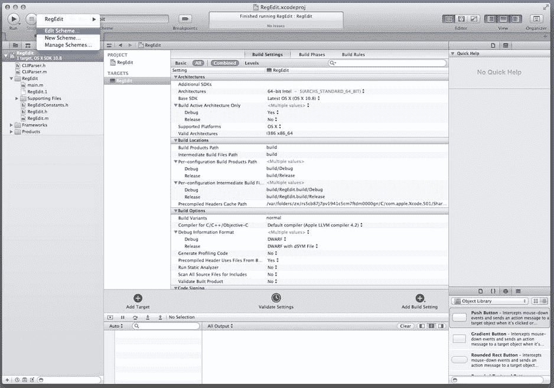

图 16-1. 编辑 RegEdit 项目 scheme

在 Scheme 编辑对话框中，选择 **Arguments** 选项卡来编辑程序启动时传递的参数。在 **Arguments Passed on Launch**（启动时传递的参数）部分下，选择 **+** 按钮来添加参数值。如图 16-2 所示，初始寄存器设置通过 `-n` 参数指定，寄存器字节通过 `-b` 参数指定，字节值通过 `-v` 参数指定。

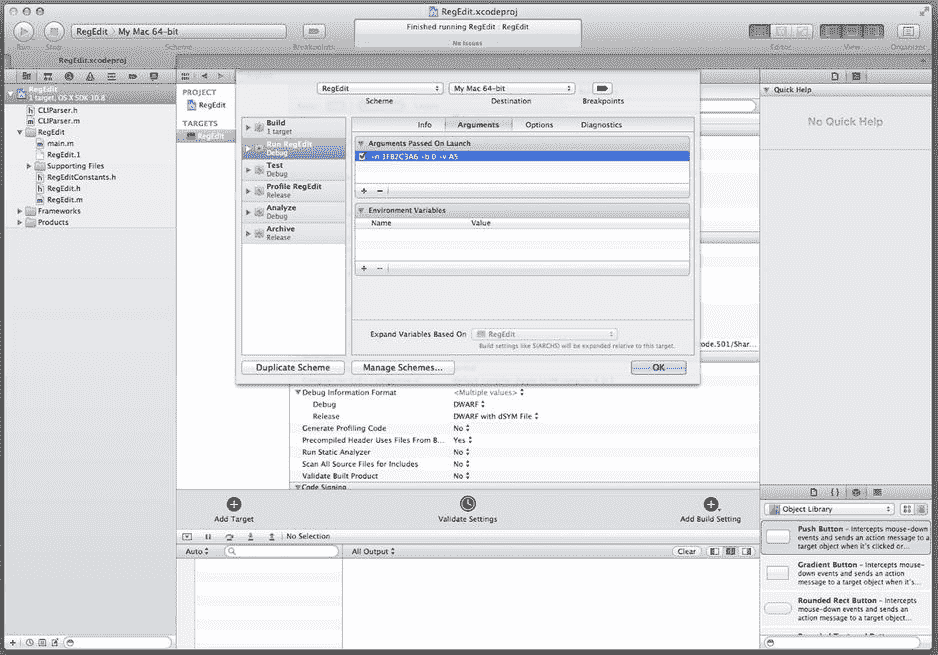

图 16-2. 使用 Scheme 编辑器添加命令行参数

图 16-2 中提供的命令行参数设置为：

```
-n 1FB2C3A6 -b 0 -v A5
```

因此，初始寄存器设置为 0x1FB2C3A6，选中的寄存器字节为 0，该字节的值将更新为 0xA5。

现在，这些命令行参数将在启动时传递给 RegEdit 程序。编译并运行程序时，你应该会在输出面板中看到如图 16-3 所示的消息。

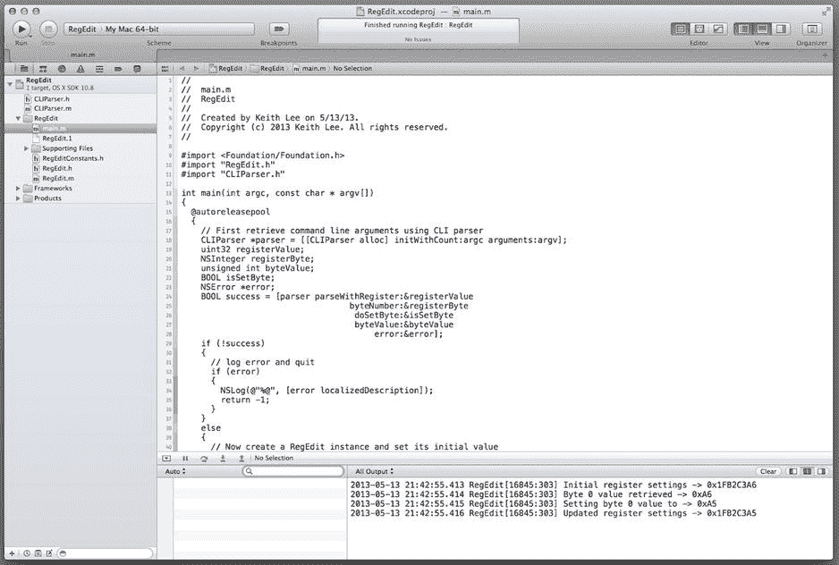

图 16-3. RegEdit 程序输出


好的，作为一名高级文档工程师和翻译员，我将严格遵循您提供的注意事项和示例格式，将给定的英文文本翻译成中文。


# 输出面板

输出面板会适当地显示初始寄存器设置、检索到的字节以及更新后的寄存器设置（包含新的字节值）。尝试使用不同的输入来运行程序，观察其运行方式，一旦你熟悉了自定义下标，可以随意添加其他功能来增强它。酷。做得好，你已经走到这一步了！这个程序演示了 Objective-C 字面量和对象下标的使用。

## 总结

在本章中，你学习了 Objective-C 字面量，这是 Objective-C 语言的一个较新特性。本章介绍了新的字面量语法，以及用于创建 `NSNumber`、`NSArray` 和 `NSDictionary` 实例的新对象字面量。还探讨了表达式字面量、对象下标，以及如何使用自定义下标 API 在你的类中扩展对象下标。本章的关键要点包括：

*   `NSNumber` 字面量提供了一种简单、简洁的表示法，用于从标量字面量表达式创建和初始化 `NSNumber` 对象。可以为任何字符、数值或布尔字面量值创建 `NSNumber` 字面量。
*   `NSArray` 字面量简化了 `NSArray` 实例的创建。数组中的对象必须是 Objective-C 对象指针类型。数组字面量可以嵌套，从而可以创建数组中的数组。
*   `NSDictionary` 字面量简化了 `NSDictionary` 实例的创建。字面量中的每个键必须是符合 `NSCopying` 协议的对象指针类型，每个值也必须是对象指针类型。
*   对象字面量（`NSNumber`、`NSArray`、`NSDictionary`）在运行时求值；因此，它们不是编译时常量，不能用于初始化静态变量或全局变量。
*   表达式字面量（即装箱表达式）允许你从括号括起来的表达式创建字面量。该表达式的求值结果是标量（数值、枚举、`BOOL`）或 C 字符串指针类型。结果对象的类型与表达式的类型相对应；标量类型生成 `NSNumber` 实例，C 字符串则使用 UTF-8 字符编码生成 `NSString` 对象。
*   对象下标提供了一种简单、简洁的语法，用于获取和设置 Foundation 框架数组和字典（例如 `NSArray` 和 `NSDictionary`）中的元素。此外，下标运算符是通用的，因此任何类都可以实现相应的方法来提供自定义下标。
*   自定义下标操作应仅用于获取和设置对象的元素，而不应用于其他目的（例如，追加或删除对象等）。这使该语法与 Foundation 框架数组和字典的下标操作保持一致，从而易于使用。

现在，你应该已经为掌握 Objective-C 对象字面量和对象下标打下了良好基础。请随意复习本章材料，并尝试修改程序和示例，以便深入理解。下一章的主题是并发编程，所以当你准备好时，请翻到下一页开始学习。

# 第 17 章：并发编程

在计算机科学中，*并发处理* 指的是在时间上重叠执行的逻辑控制流（通过软件实现）。并发处理可以发生在计算机系统的多个不同层面，从硬件层一直到应用层。从程序员的角度来看，应用层并发使您能够开发并行执行多项操作的应用程序，包括响应异步事件、访问 I/O 设备、服务网络请求、并行计算等等。

Objective-C 平台提供了多种语言扩展、API 和操作系统服务，旨在使您能够安全、高效地实现并发编程。在本章中，您将深入探讨这项技术，并通过几个示例程序应用所学知识。

## 并发编程基础

并发编程是一个广泛的领域，包含许多具有不同解释的概念和思想。因此，理解一些基本术语，并了解并发编程的一些好处和设计概念非常重要。

让我们从区分并发处理和顺序处理开始。基本上，顺序处理指的是顺序执行（即一个接一个）的逻辑控制流，如图 17-1 所示。

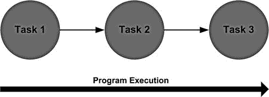

图 17-1. 控制流的顺序处理

这与并发处理形成对比，后者指的是可能并行执行的逻辑控制流，如图 17-2 所示。

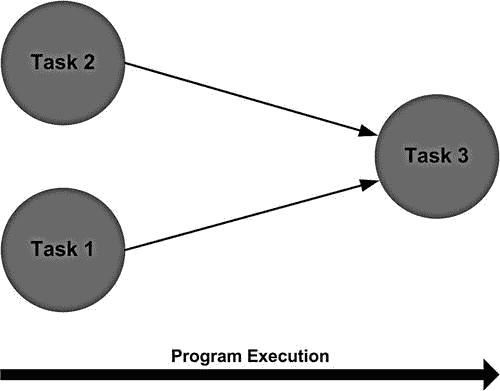

图 17-2. 控制流的并发处理

所以，并发计算意味着多个任务的同时执行。但实际上，一个旨在利用并发优势的程序是否真的并行执行多个任务，取决于其运行所在的计算机系统。这引出了另一个需要指出的区别，即并发计算和并行计算之间的区别。广义上讲，并发计算是设计上的问题，而并行计算是硬件上的问题。

*并行计算* 指的是同时执行多个操作或任务的软件。执行并行计算（即并行处理）的能力直接取决于计算机系统的硬件。例如，大多数现代计算机拥有多个核心（CPU）和/或多个处理器。这使它们能够同时执行多条指令。另一方面，并发计算指的是经过设计和实现，能够同时执行多个操作或任务的软件。如果你的软件是使用*并发编程* 原理和机制设计和实现的，那么其部分或全部组件是否可以并发执行，将取决于底层计算机系统的能力。因此，为了充分利用并发的优势，你必须恰当地设计和实现你的软件，并在支持并行处理的硬件上运行它。

最后，在继续深入之前，理解并发编程和异步编程之间的区别非常重要。正如我之前定义的，并发处理指的是可能并行执行的多个逻辑控制流。而*异步处理* 实际上是一种用于异步（即非阻塞）调用方法/函数的机制。换句话说，调用者发起方法调用后，可以在方法执行的同时继续进行处理。这种方法可以提高应用程序的响应能力、系统吞吐量等，同时抽象了底层的实现机制。异步处理可以通过多种方式实现，包括使用并发编程 API 和服务。

## 并发的优势


应用级并发处理使您能够开发可并行执行多个操作的程序。然而，这些功能并非没有代价；必须根据底层计算系统的能力，将并发性纳入软件设计和实现中。虽然这在开发程序时听起来可能是一种负担，但并发处理的动机有很多，其中包括以下几点：

- **提高应用吞吐量**。由于并发处理支持并行执行任务，与顺序处理相比，整体**应用吞吐量**（定义为应用在一段时间内可执行的任务数量）得以提高。
- **改善系统利用率**。并行执行多个任务能够使系统资源得到更持续且更高效的利用。
- **提升整体应用响应性**。任务的并发执行使得当一个任务正在等待（输入等）时，其他任务可以继续运行。因此，整体应用空闲时间减少，应用响应性提高。
- **更好地映射问题域**。某些问题，特别是在科学、数学和人工智能领域，可以建模为一组同时执行的任务。这使得使用并发编程进行解决方案实现（在代码层面）成为更自然、更首选的方法。

## 实现并发

好了，既然您（希望如此）已经信服于并发处理的好处，那么下一个问题是：如何做到这一点？有多种方法可以在计算机系统中实现并发，从专门的编程语言到包括并行化计算机系统在内的高层方案。一些更常见的方法包括：

- **分布式计算**：在这种并发处理形式中，多个任务被分发到多台通过网络连接并通信的计算机上执行。
- **并行编程**：在这种并发处理形式中，多个计算同时执行，通常在多核 CPU 和可编程 GPU 上。这种方法利用并行计算来提高性能，并提供由计算密集型算法实现的功能。
- **多进程**：在这种并发处理形式中，多个任务被分发到单台计算机上的多个软件进程中以并发执行。每个进程拥有独立的资源和独立的地址空间，由操作系统管理。
- **多线程**：也称为**多线程**，在这种方法中，任务被映射到多个配置为并发执行的线程。这些线程在单个程序（即进程）的上下文中执行，因此共享其资源（地址空间、内存等）。

> **注意**：术语`thread`指代可以独立执行的指令序列。线程有时被称为轻量级进程，多个线程可以共享一个地址空间。而`process`是一个正在运行的计算机程序，拥有自己的地址空间和系统资源分配。一个进程可以拥有多个按顺序、并发或两者组合方式执行的线程。`task`指代一个逻辑工作单元，可以由一个线程或一个进程执行。

这些方法各有其特定的应用和使用场景。虽然 OS X 和 iOS 都在不同程度上支持上述每种并发计算方法，但您在本章中将考察的并发编程机制均基于多线程方法，因此这也是您在这里将探索的内容。

## 并发面临的挑战

尽管有诸多好处，但并发程序的正确实现却相当困难。这主要是由于在并发执行的**控制线程**（即逻辑控制流）之间同步操作和共享信息所带来的挑战。同步用于控制不同线程中操作发生的相对顺序，而信息共享则使线程间能够通信。此外，由于多个控制线程的同时执行，整个程序的执行顺序是非确定性的。因此，同一程序的不同执行可能会产生不同的结果。如此一来，并发程序中的错误可能难以检测和复现。此外，多线程及其潜在交互所引入的复杂性使得这些程序的分析和推理变得更加困难。

有多种机制用于应对这些挑战；其中较为常见的两种是共享内存和消息传递。共享内存编程模型意味着**共享状态**——即部分程序数据可被多个线程访问。由于程序的线程使用共同的地址空间，共享内存是信息共享的自然机制。它也是快速且高效的。

### 共享数据

共享内存模型需要一种机制来协调线程之间的共享数据访问。这通常使用同步机制实现；例如锁（`lock`）或条件变量（`condition`）。`lock`是一种用于控制多个线程对共享数据或资源访问的机制。一个线程获取对共享资源的锁，执行操作，然后释放锁，从而允许其他线程访问该资源。`condition`变量是一种同步机制，它使线程等待直到指定条件发生。条件变量通常使用锁来实现。

#### 锁的问题

锁是用于控制对共享数据访问的最常见机制之一。它们强制执行**互斥**策略，从而防止对受保护数据/资源的并发访问。不幸的是，使用锁来协调对共享数据的访问引入了死锁（`deadlock`）、活锁（`live-lock`）或资源饥饿（`resource starvation`）的可能性——这些情况都可能导致程序执行停滞。`deadlock`是一种两个或多个线程各自被阻塞，等待获取由另一个线程占有的资源，从而阻止被阻塞线程完成执行的情况。死锁的一个例子是循环等待。下图`Figure 17-3`展示了访问共享数据的并发线程之间可能发生的死锁情况。

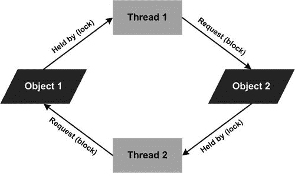

`Figure 17-3`. 两个访问共享数据的线程之间的死锁情况

`live-lock`是一种线程因响应另一个（或多个）线程的动作而无法继续执行的情况。处于活锁状态的线程并未被阻塞，它将其全部计算时间用于响应其他线程以恢复正常执行。

`resource starvation`是一种线程无法获得对共享资源的定期访问的情况，通常是因为该资源正被其他线程占用，导致其无法按预期执行。如果有一个或多个其他线程长时间占用共享资源，就可能发生这种情况。实际上，您可以将活锁视为资源饥饿的一种形式。

随着您开发更大、更复杂的、使用共享数据的并发程序，您的代码导致死锁的可能性也随之增加。以下是防止这些情况的一些最常见建议：


# 并发编程中的锁与消息传递

## 锁机制实现策略

-   **实现锁获取的全序关系**：确保锁按照固定顺序获取和释放。这种方法需要深入了解线程化代码，且对于第三方软件可能并不可行。
-   **防止持有并等待条件**：一次性原子性地获取所有锁。这要求任何线程在获取锁之前，必须先获取全局“预防”锁。该方法消除了持有并等待场景的可能性，但可能降低并发性，并且同样需要深入了解线程化代码。
-   **提供抢占机制**：使用提供 `trylock` 或类似机制的锁，在可用时获取锁，否则返回适当的结果。这种方法可能导致活锁，并且仍然需要深入了解代码如何使用锁。
-   **提供等待超时**：使用提供超时功能的锁，从而防止对锁的无限期等待。

### 消息传递

在消息传递模型中，状态不被共享；相反，线程通过交换消息进行通信。这种方法使线程能够通过消息交换实现同步和传递信息。消息传递避免了互斥相关的问题，并且自然地映射到多核、多处理器系统。消息传递可用于执行同步和异步通信。在同步消息传递中，发送者和接收者直接链接；发送者和接收者在消息交换期间阻塞。异步消息传递利用队列进行消息传输，如图 17-4 所示。


**图 17-4** 使用队列的消息传递

消息不直接在线程之间发送，而是通过消息队列进行交换。因此，发送者和接收者解耦，发送者在将消息发布到队列时不会阻塞。异步消息传递可用于实现并发编程。事实上，下一节将介绍多个实现这一功能的框架。

## 使用 Objective-C 进行并发编程

现在你已经了解了并发编程的一些关键问题，可以开始探索在 Objective-C 中实现并发编程的可用机制。这涵盖了从语言特性到 API 和系统服务，包括以下内容：

-   **语言特性**：Objective-C 语言包含多个支持并发编程的语言特性。`@synchronized` 指令用于在 Objective-C 代码中创建锁。对 Objective-C 属性的线程安全访问可以通过 `atomic` 属性限定符声明式地指定。
-   **消息传递**：Foundation 框架的 `NSObject` 类包含多个向其他线程传递消息的方法。这些方法将消息排队到目标线程的运行循环中，并且可以同步或异步执行。
-   **线程**：Foundation 框架提供了一套完整的 API，用于直接创建和管理线程。它还包含一组用于对多个线程共享的数据进行同步访问的 Foundation 框架 API。
-   **操作队列**：这些是基于 Objective-C 的消息传递机制，采用异步设计方法执行并发编程。
-   **调度队列**：这些是基于 C 语言的一组语言特性和运行时服务，用于异步和并发地执行任务。

### 语言特性

`@synchronized` 指令提供了一种在 Objective-C 代码中创建锁的简单机制，从而使并发线程能够同步对共享状态的访问。在代码中使用该指令的语法如列表 17-1 所示。

**列表 17-1** `@synchronized` 指令的语法

```
@synchronized(uniqueObj)
{
  // 临界区 - 受该指令保护的代码
}
```

列表 17-1 显示，`@synchronized` 指令后跟一个圆括号内的唯一标识符和一个由花括号包围的受保护代码块。唯一标识符是一个用于区分受保护块的对象。如果多个线程尝试使用相同的唯一标识符访问此临界区，其中一个线程将首先获取锁，其他线程将阻塞，直到第一个线程执行完临界区。

请注意，`@synchronized` 块会隐式地向受保护代码添加一个异常处理程序。该处理程序在抛出异常时自动释放锁。因此，你必须启用 Objective-C 异常处理才能使用此指令。

Objective-C 语言还包含一个旨在为属性提供原子访问的特性。`atomic` 属性限定符是一个 Objective-C 语言特性，旨在为属性提供原子访问，即使其访问器方法从不同线程并发调用也是如此。*原子*意味着无论属性是否被并发访问，属性的访问器方法始终设置/获取一个完整（一致）的值。以下语句声明了一个名为 `greeting` 的原子、可读写属性。

```
@property (atomic, readwrite) NSString *greeting;
```

默认情况下，Objective-C 属性是原子的，因此上述属性声明中不需要使用 `atomic` 关键字。

请注意，`atomic` 属性限定符为属性提供了原子访问，但并非线程安全。列表 17-2 展示了一个名为 `Person` 的类，其接口声明了名为 `firstName` 和 `lastName` 的原子属性。

**列表 17-2** `Person` 类的原子属性

```
@interface Person : NSObject
@property (readwrite) NSString *firstName;
@property (readwrite) NSString *lastName;
@end
```

尽管如前所述，`firstName` 和 `lastName` 属性是原子的，但 `Person` 对象*不是*线程安全的。因此，如果两个不同的线程访问同一个 `Person` 对象，对该对象内每个单独属性的访问将是原子的，但名字相对于姓氏可能是不一致的，具体取决于访问顺序和执行的（获取/设置）操作。例如，以下语句声明了一个 `Person` 属性。

```
@property (readwrite) Person *person;
```

该属性本身由两个可以原子访问的属性（`firstName` 和 `lastName`）组成，但 `person` 属性本身并不是线程安全的。这是因为没有提供任何机制来共同同步对其组件（即 `firstName` 和 `lastName`）的并发访问（它们可能被独立修改）。这可以通过 `@synchronized` 指令或同步原语（你很快将了解）来实现。

### 消息传递

Foundation 框架的 `NSObject` 类包含一组方法，这些方法使用消息传递范式在线程上调用对象的方法。该线程可以是现有的辅助线程或应用程序的主线程。方法选择器包括：

-   `performSelector:onThread:withObject:waitUntilDone:`
-   `performSelector:onThread:withObject:waitUntilDone:modes:`
-   `performSelectorOnMainThread:withObject:waitUntilDone:`
-   `performSelectorOnMainThread:withObject:waitUntilDone:modes:`


## 线程（Threads）

每个方法在接收者对象上指定一个选择器（selector），该方法将随一个线程被调用。此方法也被称为*线程入口点例程*（entry-point routine）。该选择器消息会被加入线程运行循环（run loop）的队列中，并作为运行循环标准处理的一部分在该线程上执行。这些消息传递方法允许你指定线程是异步调用还是同步调用。同步调用会导致当前线程阻塞，直到方法执行完毕。由于这些方法定义在`NSObject`类中，因此它们适用于所有继承自`NSObject`的类（即大多数 Foundation 框架 API 和你将实现的大部分自定义类）。清单 17-3 展示了使用`performSelector:onThread:`方法在名为`secondaryThread`的线程上异步调用`downloadTask`方法，该方法定义在名为`ConcurrentProcessor`的自定义类中。

*清单 17-3.*  `NSObject performSelector:onThread:withObject:waitUntilDone:`方法调用

```
ConcurrentProcessor *processor = [ConcurrentProcessor new];
[processor performSelector:@selector(downloadTask)
                  onThread:secondaryThread
                withObject:nil
             waitUntilDone:NO];
```

如清单 17-3 所示，`waitUntilDone:`参数指定了异步/同步操作。在此示例中，输入值设置为`NO`，因此当前线程立即返回。

当你创建线程时，可以配置其运行时环境的部分内容（例如，栈大小、线程本地存储、线程优先级等）。通过实现具有以下功能的线程入口点例程来适当配置线程上下文也很重要（按需）：

*   **自动释放池（Autorelease Pool）**：应在入口点例程的开头创建自动释放池，并在例程结束时销毁。
*   **异常处理器（Exception Handler）**：如果应用程序捕获并处理异常，则应配置入口点例程以捕获可能发生的任何异常。第 14 章讨论了 Objective-C 中异常处理的机制。
*   **运行循环（Run Loop）**：为了使线程能够动态处理到达的请求，可以在入口点例程中设置一个运行循环。第 11 章介绍了 Foundation 框架中`NSRunLoop`类的使用。

清单 17-4 中的`ConcurrentProcessor downloadTask`方法展示了根据前述指南实现的入口点例程。

*清单 17-4.*  `ConcurrentProcessor downloadTask`方法

```
@implementation ConcurrentProcessor
...
- (void)downloadTask
{
  @autoreleasepool
  {
    NSURL *url = [NSURL URLWithString:@"http://www.apress.com"];
    NSString *str = [NSString stringWithContentsOfURL:url
                                             encoding:NSUTF8StringEncoding
                                                error:nil];
    NSLog(@"URL Contents:\n%@", str);
    self.isLoaded = YES;
  }
}
@end
```

`NSObject`的`performSelectorOnMainThread:`方法通常用于将值（状态、结果等）从次级线程对象返回给主（应用）线程对象。这实现了次级线程与主线程之间的通信。此 API 对于仅应在应用主线程中使用的对象（例如 UIKit 对象）尤为重要。

## 线程（Threads）

如前文所述，线程是在单个进程上下文中执行的逻辑控制流。Apple OS X 和 iOS 操作系统直接支持线程的创建、管理和执行。在应用层，Foundation 框架提供了用于创建和管理线程的 API，以及一组用于同步并发线程间共享数据访问的 API。

### NSObject 线程

`NSObject`方法`performSelectorInBackground:withObject:`允许你隐式创建并启动一个新线程，用于在对象上执行某个方法。该线程立即作为次级后台线程启动，当前线程则立即返回。

清单 17-5 展示了使用`performSelectorInBackground:withObject:`方法在`ConcurrentProcessor`类的实例上异步调用`downloadTask`方法。

*清单 17-5.*  `NSObject performSelectorInBackground:withObject:`方法调用

```
ConcurrentProcessor *processor = [ConcurrentProcessor new];
[processor performSelectorInBackground:@selector(downloadTask)
                            withObject:nil];
while (!processor.isLoaded)
  ;
```

此方法提供了一种简单机制，用于在新后台线程上执行对象的方法。如前所述，线程实例是隐式创建的，因此你无需直接使用线程 API。线程上下文应在方法（线程的入口点例程）中配置，包括自动释放池、异常处理器以及运行循环（按需）。

### NSThread

`NSThread`类提供了可用于*显式*创建和管理线程的 API。该类包括创建和初始化`NSThread`对象（附加到对象实例方法）、启动和停止线程、配置线程以及查询线程及其执行环境的方法。

创建和初始化线程的`NSThread`API 如下：

*   `detachNewThreadSelector:toTarget:withObject:`
*   `initWithTarget:selector:object:`

`detachNewThreadSelector:toTarget:withObject:`类方法创建并启动一个新线程。其输入参数是用作线程入口点的选择器以及新线程上该选择器的目标对象。清单 17-6 修改了清单 17-5 中的代码，使用`detachNewThreadSelector:toTarget:withObject:`方法在线程上调用`downloadTask`方法。

*清单 17-6.*  使用`NSThread detachNewThreadSelector:toTarget:withObject:`方法

```
ConcurrentProcessor *processor = [ConcurrentProcessor new];
[NSThread detachNewThreadSelector:@selector(downloadTask)
                         toTarget:processor
                       withObject:nil];
```

此方法既创建新线程，又调用接收者的入口点例程（即映射到其选择器的方法）。`detachNewThreadSelector:toTarget:withObject:`方法在功能上等同于`NSObject`的`performSelectorInBackground:withObject:`方法。相比之下，`NSThread`的`initWithTarget:selector:object:`方法创建了一个新的线程对象但并未启动它。在已初始化的线程上调用`NSThread`的`start`实例方法，可以开始执行接收者的入口点例程，如清单 17-7 所示。

*清单 17-7.*  使用`NSThread initWithTarget:selector:object:`方法

```
ConcurrentProcessor *processor = [ConcurrentProcessor new];
NSThread *computeThread = [[NSThread alloc] initWithTarget:processor
                                                  selector:@selector(computeTask:)
                                                    object:nil];
[computeThread setThreadPriority:0.5];
[computeThread start];
```


好的，作为高级文档工程师和翻译员，我将严格遵循您的注意事项和示例格式，将给定的英文文本翻译成中文。


代码清单 17-7 展示了初始化方法如何创建并初始化一个新的`NSThread`实例。它设置了选择器、目标接收者实例，以及一个可以作为参数传递给入口点例程的对象。`initWithTarget:selector:object:`方法返回初始化后的`NSThread`实例，因此，它可以在调用`start`方法之前用于配置线程。同样在代码清单 17-7 中所示，在启动线程之前，会通过实例方法`setThreadPriority:`设置其优先级。

如前所述，`NSThread` API 包含许多用于配置线程、确定其执行状态以及查询其环境的方法。这些方法使您能够设置线程优先级、栈大小和线程字典；获取当前线程和调用栈信息；暂停线程以及执行各种其他操作。例如，以下语句将暂停当前线程 5 秒钟。

```
[NSThread sleepForTimeInterval:5.0];
```

## 线程同步

如果您决定使用线程进行并发编程，Objective-C 平台提供了几种机制来管理共享状态并在线程之间执行同步。具体来说，Foundation 框架包含一组锁和条件变量 API，它们提供了这些机制的面向对象实现，您将在接下来看到。

### 锁

Foundation 框架包含几个类（`NSLock`、`NSRecursiveLock`、`NSConditionLock`、`NSDistributedLock`），它们实现了多种类型的锁，用于同步对共享状态的访问。锁用于保护*临界区*，即访问共享数据或资源的代码段，该代码段不能被多个线程并发执行。

`NSLock` 为并发编程实现了一个基本的互斥锁。它符合 `NSLocking` 协议，因此实现了 `lock` 和 `unlock` 方法来分别获取和释放锁。在本章前面，您学习了 `@synchronized` 原语，这是一个 Objective-C 语言特性，它实现了一个与 `NSLock` 相当的互斥锁。两者之间的主要区别在于：1）`@synchronized` 指令隐式地创建锁，而 `NSLock` API 直接创建锁；2）`@synchronized` 指令为临界区隐式地提供了一个异常处理程序，而 `NSLock` 类不提供此功能。代码清单 17-8 演示了如何使用 `NSLock` API 保护临界区。

*代码清单 17-8.*  使用 NSLock 实例保护临界区

```
NSLock *computeLock = [NSLock new];
...
[computeLock lock];
// 临界区代码
...
[computeLock unlock];
```

`NSDistributedLock` 类定义了一个锁，可供多个主机上的多个应用程序使用，以控制对共享资源的访问。与 `NSLock` 类不同，`NSDistributedLock` 实例并不强制互斥，而是报告锁何时被占用，由使用该锁的代码根据锁状态适当地进行处理。代码清单 17-9 使用一个文件的路径（名为`/hello.lck`）创建了一个分布式锁，您希望将该文件用作锁定系统对象。

*代码清单 17-9.*  使用 NSDistributedLock 实例控制对资源的访问

```
NSDistributedLock *fileLock = [NSDistributedLock lockWithPath:@"/hello.lck"];
// 访问资源
...
...
// 解锁资源
[fileLock unlock];
```

`NSDistributedLock` 不遵循 `NSLocking` 协议。此外，由于此锁是使用文件系统实现的，因此必须显式地释放锁。如果应用程序在持有分布式锁时终止，其他客户端必须使用 `NSDistributedLock` 的 `breakLock` 方法来解除此场景下的锁。

`NSConditionLock` 类定义了一个互斥锁，它只能在特定条件下被获取和释放，该条件是一个您定义的整数值。条件锁通常用于确保任务按特定顺序执行；例如，在线程间的生产者-消费者流程中。代码清单 17-10 创建了一个条件锁，用于在指定条件发生时获取锁。

*代码清单 17-10.*  使用 NSConditionLock 实例控制对资源的访问

```
NSConditionLock *datalock = [[NSConditionLock alloc] initWithCondition:NO];
...
// 获取锁 - 缓冲区中无数据
[dataLock lock];
// 将数据添加到缓冲区
...
// 带条件解锁 - 缓冲区中有数据
[dataLock unlockWithCondition:YES];
```

`NSRecursiveLock` 类定义了一个锁，它可以被同一个线程多次获取而不会导致死锁。它会跟踪被获取的次数，并且在释放锁之前，必须通过相应次数的 `unlock` 调用来平衡。

### 条件

条件变量是一种锁，可用于同步操作的执行顺序。与锁相比，试图获取条件的线程会保持阻塞状态，直到该条件被另一个线程显式地发出信号。此外，等待某个条件的线程会保持阻塞状态，直到该条件被另一个线程显式地发出信号。实际上，条件变量允许线程根据数据的实际值进行同步。

Foundation 框架的 `NSCondition` 类实现了一个条件变量。使用条件对象的逻辑如下：

1.  锁定条件对象并检查其对应的 `BOOL` 条件表达式。
2.  如果条件表达式计算结果为 `YES`，则执行相关任务，然后转到步骤 4。
3.  如果条件表达式计算结果为 `NO`，则使用条件对象的 `wait` 或 `waitUntilDate:` 方法阻塞线程，然后重新测试（步骤 2）。
4.  可选地，再次使用条件对象的 `signal` 或 `broadcast` 方法发出信号，或更改条件表达式的值。
5.  解锁条件对象。

代码清单 17-11 提供了一个入口点例程的模板，该例程使用名为 `condition` 的 `NSCondition` 对象来消费和处理数据。

*代码清单 17-11.*  使用 NSCondition 实例同步对共享数据的消费者操作

```
- (void)consumerTask
{
  @autoreleasepool
  {
    // 为条件变量获取锁并测试布尔条件
    [condition lock];
    while (!self.dataAvailable)
    {
      [condition wait];
    }

// 数据可用，现在处理它（此处未提供代码）
    ...

// 处理完成，更新谓词值并发出条件信号
    self.dataAvailable = NO;
    [condition signal];

// 解锁条件变量
    [condition unlock];
  }
}
```

相应的用于生成数据供 `consumerTask` 方法处理的入口点例程如代码清单 17-12 所示。

*代码清单 17-12.*  使用 NSCondition 实例同步对共享数据的生产者操作

```
- (void)producerTask
{
  @autoreleasepool
  {
    // 为条件变量获取锁并测试布尔条件
    [condition lock];
    while (self.dataAvailable)
    {
      [condition wait];
    }

// 检索数据以供处理（此处未提供代码）
    ....

// 检索数据完成，更新谓词值并发出条件信号
    self.dataAvailable = YES;
    [condition signal];
```


// 解锁条件
`[condition unlock];`

如列表 17-11 和列表 17-12 所示，条件变量提供了一种有效的机制，既能控制对共享数据的访问，又能同步对该数据的操作。

## 使用线程实现并发

现在你已经了解了线程和同步机制，接下来将实现一个示例程序，该程序使用线程和这些同步机制执行并发处理。在 Xcode 中，通过选择 Xcode 文件菜单中的**新建 → 项目...**来创建新项目。在**新建项目助手**面板中，创建一个命令行应用程序。在**项目选项**窗口中，将产品名称指定为`ConcurrentThreads`，项目类型选择**Foundation**，并通过勾选**使用自动引用计数**复选框来选择 ARC 内存管理。在文件系统中指定希望项目创建的位置（如有必要，选择**新建文件夹**并输入文件夹名称和位置），取消勾选**源代码控制**复选框，然后单击**创建**按钮。

接下来，你将创建一个类，其中包含一个将在单独线程中执行的方法。选择 Xcode 文件菜单中的**新建 → 文件...**，选择**Objective-C**类模板，并将类命名为`ConcurrentProcessor`。选择`ConcurrentThreads`文件夹作为文件位置，选择`ConcurrentThreads`项目作为目标，然后单击**创建**按钮。在 Xcode 项目导航器窗格中，选择`ConcurrentProcessor.h`文件并更新类接口，如列表 17-13 所示。

*列表 17-13.*  ConcurrentProcessor 接口

```
#import <Foundation/Foundation.h>

@interface ConcurrentProcessor : NSObject

@property (readwrite) BOOL isFinished;
@property (readonly) NSInteger computeResult;

- (void)computeTask:(id)data;

@end
```

该接口声明了两个属性和一个方法。方法`computeTask:`是将在单独线程中执行的方法。该方法执行计算，其输入参数是要执行的计算次数。属性`isFinished`用于向执行该方法的线程发出计算完成的信号。属性`computeResult`包含计算结果。现在，使用 Xcode 项目导航器，选择`ConcurrentProcessor.m`文件并更新它，如列表 17-14 所示。

*列表 17-14.*  ConcurrentProcessor 实现

```
#import "ConcurrentProcessor.h"

@interface ConcurrentProcessor()
@property (readwrite) NSInteger computeResult;
@end

@implementation ConcurrentProcessor
{
  NSString *computeID;        // 用于 @synchronize 锁的唯一对象
  NSUInteger computeTasks;    // 并发计算任务数量
  NSLock *computeLock;        // 锁对象
}

- (id)init
{
  if ((self = [super init]))
  {
    _isFinished = NO;
    _computeResult = 0;
    computeLock = [NSLock new];
    computeID = @"1";
    computeTasks = 0;
  }
  return self;
}

- (void)computeTask:(id)data
{
  NSAssert(([data isKindOfClass:[NSNumber class]]), @"不是 NSNumber 实例");
  NSUInteger computations = [data unsignedIntegerValue];
  @autoreleasepool
  {
    @try
    {
      // 获取锁并增加活动任务数
      if ([[NSThread currentThread] isCancelled])
      {
        return;
      }
      @synchronized(computeID)
      {
        computeTasks++;
      }

// 获取锁并在临界区内执行计算
      [computeLock lock];
      if ([[NSThread currentThread] isCancelled])
      {
        [computeLock unlock];
        return;
      }
      NSLog(@"正在执行计算");
      for (int ii=0; ii<computations; ii++)
      {
        self.computeResult = self.computeResult + 1;
      }
      [computeLock unlock];
      // 模拟额外处理时间（在临界区之外）
      [NSThread sleepForTimeInterval:1.0];

// 减少活动任务数，如果没有剩余任务则更新标志
      @synchronized(computeID)
      {
        computeTasks--;
        if (!computeTasks)
        {
          self.isFinished = YES;
        }
      }
    }
    @catch (NSException *ex) {}
  }
}

@end
```

该文件首先声明了一个类扩展，允许对`computeResult`属性进行写访问。接下来，实现部分声明了几个用于线程管理和同步的私有实例变量。其中值得注意的是`computeTasks`变量；它包含并发执行`computeTask:`方法的线程数。`init`方法初始化`ConcurrentProcessor`对象，将变量设置为适当的初始值。

现在让我们来看看`computeTask:`方法。首先，注意到该方法被一个自动释放池和一个 try-catch 异常块包围。这些是必需的，以确保方法执行的线程不会泄漏对象，并能处理任何抛出的异常（每个线程负责处理自己的异常）。由于该方法可以被多个线程并发执行，并且还访问和更新共享数据，因此对这些数据的访问必须同步。代码使用`@synchronized`指令来控制对`computeTasks`变量的访问，从而使其一次只能被一个线程更新。

```
@synchronized(computeID)
{
  computeTasks++;
}
```

该方法还实现了对线程取消的支持，因此会定期检查线程状态，如果被取消则退出。

```
if ([[NSThread currentThread] isCancelled])
{
  return;
}
```

接下来，该方法包含执行计算的代码。这个简单的计算仅将`computeResult`属性的值增加方法输入参数指定的次数。这段代码必须在临界区内执行，以强制对共享数据的同步访问。代码首先获取`NSLock`实例的锁。一旦获得锁，它就会测试线程是否已被取消，如果是，则释放锁并退出线程，不执行计算。

```
[computeLock lock];
if ([[NSThread currentThread] isCancelled])
{
  [computeLock unlock];
  return;
}
```

然后代码执行计算并释放锁。接着，线程暂停一秒钟，以模拟在临界区之外执行的额外处理（因此是并发的）。

```
[computeLock unlock];
[NSThread sleepForTimeInterval:1.0];
```

该方法最后减少执行它的线程数，如果没有剩余线程则设置`isFinished`属性。所有这些逻辑都在一个同步块内实现，以确保一次只有一个线程可以访问。

```
@synchronized(computeID)
{
  computeTasks--;
  if (!computeTasks)
  {
    self.isFinished = YES;
  }
}
```

现在你已经完成了`ConcurrentProcessor`类的实现，让我们继续看`main()`函数。在 Xcode 项目导航器中，选择`main.m`文件并更新`main()`函数，如列表 17-15 所示。

*列表 17-15.*  ConcurrentThreads 的 main() 函数

```
#import <Foundation/Foundation.h>
#import "ConcurrentProcessor.h"
```


```objectivec
int main(int argc, const char * argv[])
{
  @autoreleasepool
  {
    ConcurrentProcessor *processor = [ConcurrentProcessor new];
    [processor performSelectorInBackground:@selector(computeTask:)
                                withObject:[NSNumber numberWithUnsignedInt:5]];
    [processor performSelectorInBackground:@selector(computeTask:)
                                withObject:[NSNumber numberWithUnsignedInt:10]];
    [processor performSelectorInBackground:@selector(computeTask:)
                                withObject:[NSNumber numberWithUnsignedInt:20]];
    while (!processor.isFinished)
      ;
    NSLog(@"Computation result = %ld", processor.computeResult);
  }
  return 0;
}
```

`main()` 函数首先创建一个 `ConcurrentProcessor` 对象，然后通过其 `performSelectorInBackground:` 方法，在一个新的后台线程中执行 `computeTask:` 方法。该方法会启动三个独立的线程，每个线程都向执行的计算次数提供一个不同的输入值。接着，函数使用条件表达式来测试所有线程是否都已执行完 `computeTask:` 方法。一旦完成，计算结果就会被记录到输出面板中。

编译并运行该程序后，你应该能在输出面板中看到如图 17-5 所示的消息。

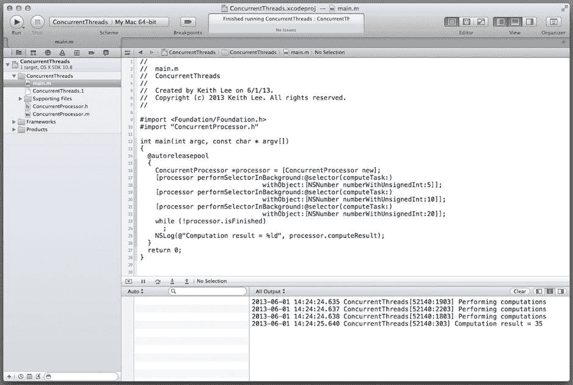

图 17-5. ConcurrentThreads 程序的输出

该程序演示了如何使用线程来执行并发编程，同时也展示了线程管理和同步所涉及的一些复杂性。在下一节中，你将了解另一种用于并发编程的机制：操作与操作队列。

## 操作与操作队列

在第 11 章中，你了解了操作对象——`NSOperation`类（及其子类）的实例，它们封装了单个任务的代码和数据。由于操作对象封装了一个独立的工作单元，它非常适合用于实现并发编程。Foundation 框架包含了以下三个操作类：

*   `NSOperation`：用于定义操作对象的基类（抽象类）。对于非并发任务，具体子类通常只需要重写 `main` 方法。对于并发任务，你至少必须重写 `start`、`isConcurrent`、`isExecuting` 和 `isFinished` 方法。
*   `NSBlockOperation`：`NSOperation` 的一个具体子类，用于并发地执行一个或多个块对象。只有当其所有块对象都执行完毕时，才认为该 `NSBlockOperation` 对象已完成。
*   `NSInvocationOperation`：`NSOperation` 的一个具体子类，用于基于你指定的对象和选择器来创建操作对象。

以下语句创建了一个名为 `greetingOp` 的 `NSBlockOperation` 实例。

```objectivec
NSBlockOperation* greetingOp = [NSBlockOperation blockOperationWithBlock: ^{
  NSLog(@"Hello, World!");
}];
```

你也可以使用 `addExecutionBlock:` 方法向 `NSBlockOperation` 实例添加额外的块。以下语句向 `NSBlockOperation` 实例 `greetingOp` 添加了一个块。

```objectivec
[greetingOp addExecutionBlock: ^{
  NSLog(@"Goodbye");
}];
```

可以使用 `NSInvocation` 对象或选择器及接收对象来创建并初始化一个 `NSInvocationOperation`。以下语句使用选择器 `hello` 和一个名为 `greetingObj` 的接收对象创建了一个 `NSInvocationOperation`。

```objectivec
NSInvocationOperation invokeOp = [[NSInvocationOperation alloc]
  initWithTarget:greetingObj selector:@selector(hello)];
```

你也可以实现自定义的操作类。自定义操作类继承自 `NSOperation`，至少必须实现 `main` 方法来执行所需的任务。此外，它还可以提供以下功能：

*   自定义的初始化方法
*   自定义的辅助方法（通过 `main` 方法调用）
*   用于设置数据值和访问操作结果的存取器方法
*   使类符合 `NSCoding` 协议的方法（以支持对象的归档）

操作对象支持多种促进并发编程的特性，其中几个包括：

*   在操作对象之间建立依赖关系，从而控制它们的执行顺序。
*   创建一个在操作的主任务完成后执行的完成块。
*   获取操作的执行状态。
*   在操作队列中设置操作的优先级。
*   取消操作。

操作对象通过调用其 `start` 方法来执行。该方法的默认实现会同步地执行操作的任务（由其 `main` 方法实现）。因此，你可能会疑惑操作对象是如何支持并发编程的。实际上，操作对象通常是通过添加到操作队列中来执行的，操作队列内置了对并发执行操作的支持。具体来说，操作队列为执行操作提供线程。

操作队列是一种提供并发执行操作能力的机制。Foundation 框架中的 `NSOperationQueue` 类是操作队列的 Objective-C 实现。操作可以以块对象或 `NSOperation` 子类的实例形式添加到 `NSOperationQueue` 实例中。操作队列管理操作的执行，因此它包含以下方法：管理队列中的操作、管理正在运行的操作数量、暂停操作以及获取特定的队列。代码清单 17-16 创建并初始化了一个 `NSOperationQueue` 实例，然后使用其 `addOperationWithBlock:` 方法将一个块对象提交到队列中。

*代码清单 17-16.* 向操作队列添加一个块对象

```objectivec
NSOperationQueue *queue = [NSOperationQueue new];
[queue addOperationWithBlock: ^{
  NSLog(@"Hello, World!");
  }];
[queue waitUntilAllOperationsAreFinished];
```

一旦操作被添加到队列中，它会一直留在队列中，直到被显式取消或执行完任务。你可以通过调用其 `cancel` 方法或对队列调用 `cancelAllOperations` 方法来取消添加到操作队列中的（`NSOperation`）对象。

队列中操作的执行顺序取决于每个操作的优先级以及操作对象间的依赖关系。`NSOperationQueue` 的当前实现使用 Grand Central Dispatch 来启动操作的执行。因此，队列中的每个操作都在一个单独的线程中执行。

操作对象和操作队列为执行异步、并发编程提供了一种面向对象的机制。它们消除了对底层线程管理的需求，并简化了多个相互依赖任务的同步与执行协调。由于它们利用的系统服务能够根据资源的可用性和利用率进行动态扩展，因此能够确保任务尽可能快速高效地执行。

### 手动执行操作对象

虽然操作对象通常使用操作队列来执行，但也可以手动启动一个操作对象（即不将其添加到队列中）。为此，你必须将操作编码为*并发操作*，以便其异步执行。这可以通过执行以下步骤来完成：


-   *重写 start 方法*。此方法应更新为异步执行操作，通常通过在新线程中调用其`main`方法来实现。
-   *重写 main 方法（可选）*。在此方法中，实现与操作相关的任务。如果倾向于此，你可以跳过此方法，直接在`start`方法中实现任务，但重写`main`方法能提供更清晰的设计，且与设计意图保持一致。
-   *配置并管理操作的执行环境*。并发操作必须设置其环境，并向客户端报告其状态。具体来说，`isExecuting`、`isFinished`和`isConcurrent`方法必须根据操作状态返回合适的值，并且这些方法必须是线程安全的。当这些值发生变化时，这些方法还必须生成相应的键值观察 (KVO) 通知。

**注意** 键值观察是 Objective-C 语言的一种机制，使对象能够获知其他对象的指定属性何时发生变化。第 18 章深入探讨了键值编程。

为了突出非并发操作对象（通常通过操作队列执行）与并发操作对象之间的区别，让我们来看一些代码。代码清单 17-17 展示了一个名为`GreetingOperation`的自定义非并发操作类的实现。

*代码清单 17-17.* 自定义非并发操作类的最小实现

```objc
@implementation GreetingOperation

- (void)main
{
  @autoreleasepool
  {
    @try
    {
      if (![self isCancelled])
      {
        // 在此处插入实现任务的代码
        NSLog(@"Hello, World!");
        [NSThread sleepForTimeInterval:3.0];
        NSLog(@"Goodbye, World!");
      }
    }
    @catch (NSException *ex) {}
  }
}

@end
```

如代码清单 17-17 所示，执行任务的代码在`main`方法中实现。请注意，此方法包含一个自动释放池和一个 try-catch 块。自动释放池防止关联线程的内存泄漏，而 try-catch 块则是为了防止任何异常离开此线程的作用域。`main`方法还会检查操作是否已被取消，以便在不再需要时迅速终止其执行。要异步调用此操作，你可以将其添加到操作队列中，如代码清单 17-18 所示。

*代码清单 17-18.* 在操作队列中执行自定义操作

```objc
NSOperationQueue *queue = [NSOperationQueue new];
GreetingOperation *greetingOp = [GreetingOperation new];
[greetingOp setThreadPriority:0.5];
[queue addOperation:greetingOp];
[queue waitUntilAllOperationsAreFinished];
```

以上演示了实现一个非并发操作并将其提交到操作队列执行所需的步骤。在下一节中，你将实现一个并发操作，以理解这两种选项之间的差异。

### 实现并发操作

现在，你将创建一个实现自定义并发操作的程序。它将提供与代码清单 17-14 所示程序相同的功能，并使你能够比较两种实现之间的差异。在 Xcode 中，通过从 Xcode 的“文件”菜单中选择**新建  项目...**来创建一个新项目。在“新建项目助手”面板中，创建一个命令行应用程序。在“项目选项”窗口中，将产品名称指定为`GreetingOperation`，项目类型选择**Foundation**，并通过勾选**使用自动引用计数**复选框来选择 ARC 内存管理。在你的文件系统中指定要创建项目的位置（如有必要，选择**新建文件夹**并输入文件夹的名称和位置），取消勾选**源代码控制**复选框，然后点击**创建**按钮。

接下来，你将创建自定义操作类。从 Xcode 的“文件”菜单中选择**新建  文件...**，选择**Objective-C**类模板，并将类命名为`GreetingOperation`。使该类成为`NSOperation`的子类，为文件位置选择`GreetingOperation`文件夹，并将`GreetingOperation`项目作为目标，然后点击**创建**按钮。在 Xcode 的项目导航器面板中，选择`GreetingOperation.m`文件并更新类实现，如代码清单 17-19 所示。

*代码清单 17-19.* `GreetingOperation` 实现

```objc
#import "GreetingOperation.h"

@implementation GreetingOperation
{
  BOOL finished;
  BOOL executing;
}

- (id)init
{
  if ((self = [super init]))
  {
    executing = NO;
    finished = NO;
  }
  return self;
}

- (void)start
{
  // 如果已取消，直接返回
  if ([self isCancelled])
  {
    [self willChangeValueForKey:@"isFinished"];
    finished = YES;
    [self didChangeValueForKey:@"isFinished"];
    return;
  }

// 现在在新的线程中通过 main 方法执行
  [self willChangeValueForKey:@"isExecuting"];
  [NSThread detachNewThreadSelector:@selector(main) toTarget:self withObject:nil];
  executing = YES;
  [self didChangeValueForKey:@"isExecuting"];
}

- (void)main
{
  @autoreleasepool
  {
    @try
    {
      if (![self isCancelled])
      {
        NSLog(@"Hello, World!");
        // 暂停以模拟任务执行的处理过程
        [NSThread sleepForTimeInterval:3.0];
        NSLog(@"Goodbye, World!");

[self willChangeValueForKey:@"isFinished"];
        [self willChangeValueForKey:@"isExecuting"];
        executing = NO;
        finished = YES;
        [self didChangeValueForKey:@"isExecuting"];
        [self didChangeValueForKey:@"isFinished"];
      }
    }
    @catch (NSException *ex) {}
  }
}

- (BOOL)isConcurrent
{
  return YES;
}

- (BOOL)isExecuting
{
  return executing;
}

- (BOOL)isFinished
{
  return finished;
}

@end
```

与代码清单 17-17 中的非并发`GreetingOperation`实现相比，这里有一些改动。首先，注意两个私有变量的声明。

```objc
{
  BOOL finished;
  BOOL executing;
}
```

这些变量用于为`isFinished`和`isExecuting`方法设置并返回合适的值。回想一下，对于并发操作，必须重写这些方法（以及`isConcurrent`方法）。现在让我们看一下`start`方法的实现。这一点在非并发版本的`GreetingOperation`类中并未实现。首先，它检查操作是否已被取消；如果已取消，则只需适当设置`finished`变量以触发 KVO 通知并返回。

```objc
if ([self isCancelled])
{
  [self willChangeValueForKey:@"isFinished"];
  finished = YES;
  [self didChangeValueForKey:@"isFinished"];
  return;
}
```


如果未取消，代码会创建一个新线程，并使用它来调用实现相关任务的 `main` 方法，同时执行相应的 KVO 通知。

```
[self willChangeValueForKey:@"isExecuting"];
[NSThread detachNewThreadSelector:@selector(main) toTarget:self withObject:nil];
executing = YES;
[self didChangeValueForKey:@"isExecuting"];
```

现在，我们来检查这个类的 `main` 方法。该方法的功能与 Listing 17-14 中的 `main` 方法完全相同，只是增加了 KVO 通知来指示当前的操作状态。同时请注意，其中有一条语句将线程暂停三秒钟，以模拟任务处理过程。

```
[NSThread sleepForTimeInterval:3.0];
```

最后，剩余的方法实现了所需的 `isExecuting`、`isFinished` 和 `isConcurrent` 方法，并在每种情况下返回相应的值。

好了，现在你已经完成了自定义操作类的实现，让我们接着来看 `main()` 函数。在 Xcode 的项目导航器中，选择 `main.m` 文件并更新 `main()` 函数，如 Listing 17-20 所示。

*Listing 17-20.* `GreetingOperation main()` 函数

```
#import <Foundation/Foundation.h>
#import "GreetingOperation.h"

int main(int argc, const char * argv[])
{
  @autoreleasepool
  {
    GreetingOperation *greetingOp = [GreetingOperation new];
    [greetingOp start];
    while (![greetingOp isFinished])
      ;
  }
  return 0;
}
```

`main()` 函数首先创建一个 `GreetingOperation` 对象，然后通过调用其 `start` 方法来执行该操作。最后，利用该对象的 `isFinished` 方法构造一个条件表达式，当并发操作完成时，用于结束程序的执行。

当你编译并运行该程序时，应该在输出面板中看到 Figure 17-6 所示的消息。

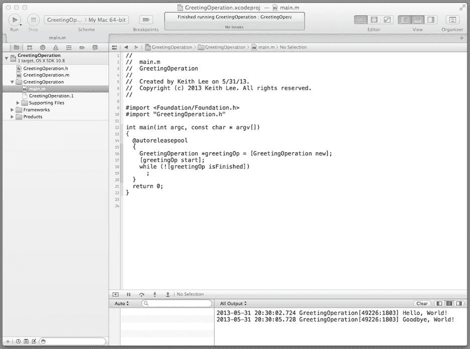

Figure 17-6. `GreetingOperation` 程序输出

在输出面板中，任务首先显示初始问候语，然后延迟大约 3 秒钟，最后显示最终消息。当线程根据条件表达式完成执行时，程序退出。从这个例子中你可以了解到，要实现一个正确的自定义并发操作类，需要编写相当多的额外功能。因此，只有在你需要让操作对象在不加入队列的情况下异步执行时，才应该这样做。

### 使用操作队列实现并发

你已经使用线程和并发操作实现了一个并发程序，现在你将实现一个使用操作和操作队列来实现并发的程序。该程序包含与你在本章前面实现的 `ConcurrentThreads` 程序相同的功能。这将使你能够比较用于并发编程的不同 API 和机制。

在 Xcode 中，通过从 Xcode 的“文件”菜单中选择 **新建  项目...** 来创建一个新项目。在“新建项目助手”面板中，创建一个命令行应用程序。在“项目选项”窗口中，将产品名称指定为 `ConcurrentOperations`，选择 **Foundation** 作为项目类型，并通过勾选 **使用自动引用计数** 复选框选择 ARC 内存管理。在文件系统中指定你想要创建项目的位置（如有必要，选择 **新建文件夹** 并输入文件夹的名称和位置），取消勾选 **源代码控制** 复选框，然后点击 **创建** 按钮。

接下来，你将创建自定义操作类。从 Xcode 的“文件”菜单中选择 **新建  文件...**，选择 **Objective-C 类** 模板，并将类命名为 `ConcurrentProcessor`。让该类成为 `NSOperation` 的子类，选择 `ConcurrentOperations` 文件夹作为文件位置，选择 `ConcurrentOperations` 项目作为目标，然后点击 **创建** 按钮。在 Xcode 的项目导航器面板中，选择 `ConcurrentProcessor.m` 文件并更新接口，如 Listing 17-21 所示。

*Listing 17-21.* `ConcurrentProcessor` 接口

```
#import <Foundation/Foundation.h>

@interface ConcurrentProcessor : NSOperation

@property (readonly) NSUInteger computations;

- (id)initWithData:(NSInteger *)result computations:(NSUInteger)computations;

@end
```

该接口包含一个名为 `computations` 的属性和一个初始化方法。该接口是 `NSOperation` 的子类，这是自定义操作类所必需的。`computations` 属性指定了操作将执行的计算次数。在 Xcode 的项目导航器中，选择 `ConcurrentProcessor.m` 文件并更新实现，如 Listing 17-22 所示。

*Listing 17-22.* `ConcurrentProcessor` 实现

```
#import "ConcurrentProcessor.h"

@implementation ConcurrentProcessor
{
  NSInteger *computeResult;
}

- (id)initWithData:(NSInteger *)result computations:(NSUInteger)computations
{
  if ((self = [super init]))
  {
    _computations = computations;
    computeResult = result;
  }
  return self;
}

- (void)main
{
  @autoreleasepool
  {
    @try
    {
      if (![self isCancelled])
      {
        NSLog(@"Performing %ld computations", self.computations);
        [NSThread sleepForTimeInterval:1.0];
        for (int ii=0; ii<self.computations; ii++)
        {
          *computeResult = *computeResult + 1;
        }
      }
    }
    @catch (NSException *ex) {}
  }
}
@end
```

实现首先声明了一个私有实例变量 `computeResult`，其中包含存储计算结果的地址。`init:` 方法将 `computations` 属性和 `computeResult` 变量设置为输入参数。`main` 方法执行该操作的计算任务。它包含一个自动释放池和一个 try-catch 块，这是操作对象基于线程执行时的推荐做法。`main` 方法还会检查操作是否被取消，以便在不再需要时快速终止其执行。计算逻辑只是根据指定的计算次数递增计算结果。请注意，与 Listing 17-19（`GreetingOperation` 程序）中显示的并发操作不同，此处并未更新线程执行状态（即 `isFinished` 和 `isExecuting`）。这是由操作队列自动执行的。还要注意，与基于线程的 `ConcurrentProcessor` 实现（如 Listing 17-14 所示）不同，此处不需要同步机制。这是因为可以声明操作间的依赖关系。这些依赖关系可以防止操作并发访问共享数据，并同步操作的执行顺序。

现在让我们来看 `main()` 函数。在 Xcode 的项目导航器中，选择 `main.m` 文件并更新 `main()` 函数，如 Listing 17-23 所示。

*Listing 17-23.* `ConcurrentOperations main()` 函数

```
#import <Foundation/Foundation.h>
#import "ConcurrentProcessor.h"

int main(int argc, const char * argv[])
{
  @autoreleasepool
  {
    NSOperationQueue *queue = [[NSOperationQueue alloc] init];
    NSInteger result = 0;
```


```objc
// 创建操作对象
ConcurrentProcessor *proc1 = [[ConcurrentProcessor alloc]initWithData:&result
                                                         computations:5];
ConcurrentProcessor *proc2 = [[ConcurrentProcessor alloc]initWithData:&result
                                                         computations:10];
ConcurrentProcessor *proc3 = [[ConcurrentProcessor alloc]initWithData:&result
                                                         computations:20];
NSArray *operations = @[proc1, proc2, proc3];

// 添加操作间的依赖关系
[proc2 addDependency:proc1];
[proc3 addDependency:proc2];

// 将操作添加到队列以开始执行
[queue addOperations:operations waitUntilFinished:NO];

// 等待所有操作完成，然后显示结果
[queue waitUntilAllOperationsAreFinished];
NSLog(@"计算结果 = %ld", result);
}
return 0;
}
```

该方法首先创建一个操作队列和变量`computeResult`，该变量用于保存操作的计算结果。然后创建三个操作对象，每个对象执行不同数量的计算，并将这些对象组合到`NSArray`实例中。接下来，定义操作之间的依赖关系。在本例中，操作 1（`proc1`）必须完成后操作 2（`proc2`）才能开始，操作 2 完成后操作 3（`proc3`）才能开始。然后将操作添加到队列中以开始异步执行。代码等待所有操作执行完毕，然后将计算结果记录到输出面板。

当您编译并运行该程序时，您应该在输出面板中观察到类似图 17-7 所示的消息。

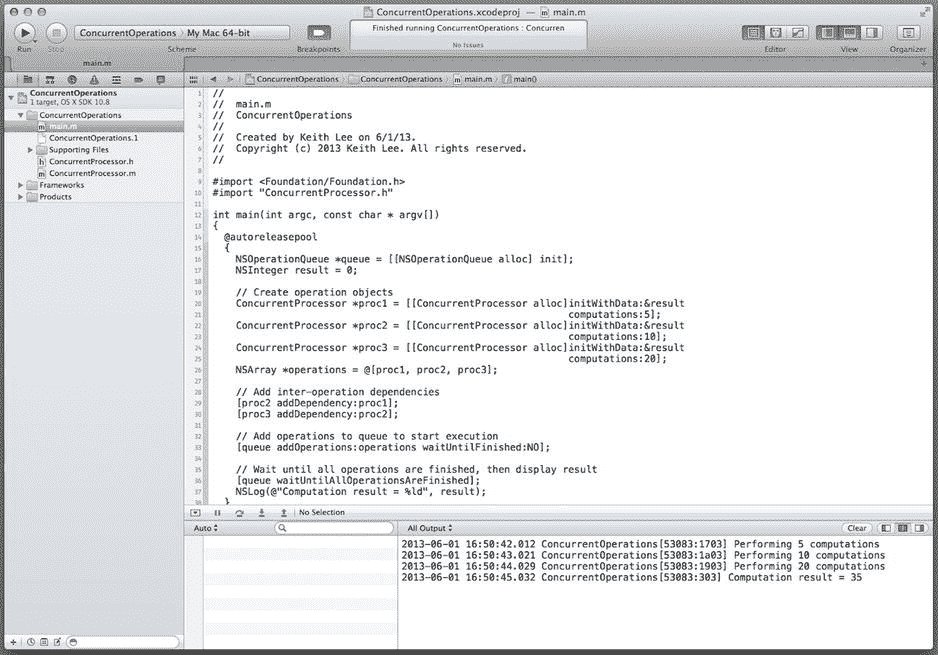

图 17-7. ConcurrentOperations 程序输出

其结果与使用基于线程的版本获得的相同，但代码复杂性显著降低。该程序演示了操作对象和队列如何极大地简化并发编程。实际上，它们使您能够异步且并发地执行任务，而无需进行底层基于线程的编程，也无需管理由此产生的复杂性。它们使您能够管理各种操作之间的依赖关系、取消或挂起操作，并为并发编程提供更高级别的、面向对象的抽象。在下一节中，您将探索 **Grand Central Dispatch**，这是一种基于 C 语言的异步/并发编程机制。

## Grand Central Dispatch

Grand Central Dispatch（GCD）是一套语言特性、基于 C 语言的 API 以及系统增强功能，支持使用调度队列执行任务。GCD 调度队列可用于同步或异步地执行代码，以及串行或并发地执行任务。与操作队列一样，调度队列比线程更容易使用，并且在执行异步或并发任务时效率更高。

Apple 提供了关于 GCD API 及其在并发编程中使用的完整文档。为了在并发编程中提供一个使用操作队列和调度队列的简单比较，您现在将重新实现之前开发的 `ConcurrentOperations` 程序，这次使用调度队列。

### 使用调度队列

在 Xcode 中，通过从 Xcode 的 **File** 菜单中选择 **New  Project . . .** 来创建一个新项目。在 **New Project Assistant** 窗格中，创建一个命令行应用程序。在 **Project Options** 窗口中，为产品名称指定 `ConcurrentDispatch`，为项目类型选择 `Foundation`，并通过勾选 **Use Automatic Reference Counting** 复选框选择 ARC 内存管理。在文件系统中指定您希望创建项目的位置（如有必要，选择 **New Folder** 并输入文件夹名称和位置），取消勾选 **Source Control** 复选框，然后单击 **Create** 按钮。

在 Xcode 项目导航器中，选择 `main.m` 文件并按列表 17-24 所示进行更新。

*列表 17-24.*  `ConcurrentDispatch` 的 `main.m` 文件

```objc
#import <Foundation/Foundation.h>
typedef void (^ComputeTask)(void);

/* 获取用于下载 URL 的块 */
ComputeTask getComputeTask(NSInteger *result, NSUInteger computation)
{
  NSInteger *computeResult = result;
  NSUInteger computations = computation;
  return ^{
    [NSThread sleepForTimeInterval:1.0];
    NSLog(@"正在执行 %ld 次计算", computations);
    for (int ii=0; ii<computations; ii++)
    {
      *computeResult = *computeResult + 1;
    }
  };
}

int main(int argc, const char * argv[])
{
  @autoreleasepool
  {
    NSInteger computeResult;

// 创建串行队列和组
    dispatch_queue_t serialQueue = dispatch_queue_create("MySerialQueue",
                                                         DISPATCH_QUEUE_SERIAL);
    dispatch_group_t group = dispatch_group_create();

// 将任务添加到队列
    dispatch_group_async(group, serialQueue, getComputeTask(&computeResult, 5));
    dispatch_group_async(group, serialQueue, getComputeTask(&computeResult, 10));
    dispatch_group_async(group, serialQueue, getComputeTask(&computeResult, 20));

// 阻塞直到组中所有任务完成，然后显示结果
    dispatch_group_wait(group, DISPATCH_TIME_FOREVER);
    NSLog(@"计算结果 = %ld", computeResult);

}
  return 0;
}
```

该列表除了 `main()` 函数外，还包含一个名为 `computeTask` 的函数，其功能与 `ConcurrentOperations` 程序中 `main` 方法（如列表 17-22 所示）中的任务完全相同。

`main()` 函数使用 GCD API 创建三个任务并以异步方式分派给串行队列执行，从而正确协调执行并防止对共享数据的并发访问。它创建了一个串行调度队列和一个调度组。

```objc
dispatch_queue_t serialQueue = dispatch_queue_create("MySerialQueue",
                                                     DISPATCH_QUEUE_SERIAL);
dispatch_group_t group = dispatch_group_create();
```

然后，代码将三个任务分派到队列。

```objc
dispatch_group_async(group, serialQueue, getComputeTask(&computeResult, 5));
dispatch_group_async(group, serialQueue, getComputeTask(&computeResult, 10));
dispatch_group_async(group, serialQueue, getComputeTask(&computeResult, 20));
```

请注意，要执行的任务由 `computeTask()` 函数返回的块字面量指定，每次为计算次数提供不同的参数。同样，这与 `ConcurrentOperations` 程序中的操作相同。GCD 的 `dispatch_group_async()` 函数使这些任务异步执行，并且由于队列是串行队列，因此按串行顺序执行。接下来，使用 GCD 的 `dispatch_group_wait()` 函数来阻塞主线程，直到任务完成。

```objc
dispatch_group_wait(group, DISPATCH_TIME_FOREVER);
```

现在保存、编译并运行 `BlockConcurrentTasks` 程序，并观察输出面板中的消息（如图 17-8 所示）。

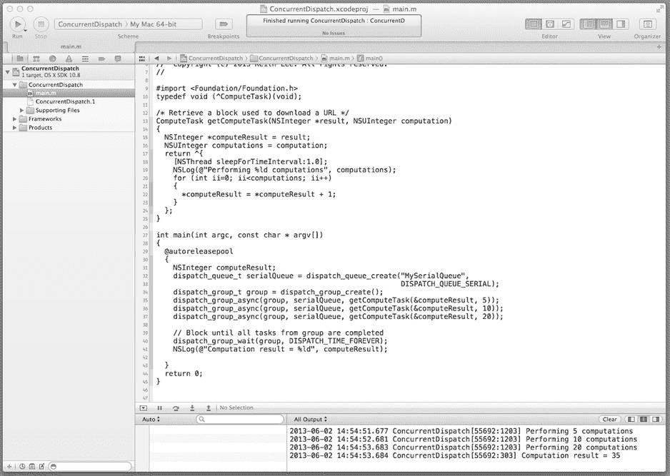


## 键值编程

### 为并发编程选择合适的 API

本章涵盖了多种并发编程方法，因此你有多个选项可供选择。回顾一下，可用的选项包括：

- **异步 API**。Foundation 框架（以及 Cocoa 和 Cocoa Touch 框架）包含多种执行异步处理的 API；例如 `NSURLConnection`、`NSFileHandle` 和 `NSPort` 类。
- **线程**。使用线程实现并发编程的 API。这包括 Foundation 框架的消息传递 API、`NSThread` 类以及同步机制。
- **操作队列**。`NSOperation` 和 `NSOperationQueue` 是 Objective-C API，可用于使用队列实现并发编程。
- **调度队列**。Grand Central Dispatch 是一个基于 C 的 API 和一组服务，可用于使用调度队列实现并发编程。

通常，你应该尽可能使用异步 API 来实现异步/并发处理。这些 API 使用多种技术（线程、队列等）来提供与系统能力相匹配的并发性，并使你的程序设计能够与 Objective-C 平台的程序风格和能力保持一致。

尽管 Objective-C 平台提供了多种语言特性和 API 来支持基于线程的并发编程，但线程并不是推荐的并发编程方法。操作队列和调度队列是异步并发处理的首选机制。它们应用于并发执行异步 API 不支持的**任务**，例如执行长时间的计算、后台数据处理等。

与基于线程的编程相比，操作队列和调度队列提供了一种基于队列的异步方法，消除了低级线程管理的需求，并最大限度地提高了系统利用率和效率。基于对象的操作队列比 GCD 调度队列具有更高的开销并消耗更多资源。然而，更高级的面向对象 API 与 Objective-C 平台一致，并且可能更易于使用。此外，操作队列还支持复杂的操作间依赖关系、基于约束的执行以及操作对象的管理。

GCD 作为一个较低级别（基于 C）的 API，轻量级且性能优于操作队列。如 `ConcurrentDispatch` 示例程序所示，基于 GCD 块的代码可以减少代码行数，从而可能最大限度地降低程序的整体复杂性。

最后，由于操作队列和调度队列不处理实时约束，线程仍然是用于实时系统并发编程的合适机制。

## 总结

在本章中，你学习了并发编程以及支持异步/并发处理的各种机制和 API。如本章所示，有众多选项可供选择。此外，并发编程具有挑战性，理解每个选项所涉及的权衡得失非常重要。以下是本章的关键要点：

- 并发处理意味着多个任务的同时执行。这是设计层面的功能，而并行计算是硬件层面的功能。并发处理的动机众多，包括提高应用吞吐量、提高系统利用率、改善应用响应性以及更好地映射问题域。
- 并发处理是指可能并行执行的多个逻辑控制流。而异步处理实际上是一种用于异步（即非阻塞）调用方法/函数的机制。换句话说，调用者发起方法调用后，可以在方法执行的同时继续处理。异步处理可以使用多种机制实现，包括并发编程 API 和服务。
- 在 Objective-C 中实现并发编程最常用的机制是消息传递、线程、同步机制、操作队列和调度队列。
- Foundation 框架的 `NSObject` 类包含一组方法，这些方法使用消息传递范式在线程上调用对象的方法。
- `NSThread` 类提供了可用于显式创建和管理线程的 API。Objective-C 语言和 Foundation 框架还包含用于在并发线程之间同步共享数据/资源访问的机制。
- 操作对象和操作队列提供了一种面向对象的机制，用于执行异步/并发编程。它们消除了低级线程管理的需求，并简化了多个相互依赖任务的执行同步和协调。
- Grand Central Dispatch (GCD) 是一组语言特性、基于 C 的 API 和系统增强功能，支持使用调度队列执行任务。GCD 调度队列可用于同步或异步执行代码，以及串行或并发执行任务。调度队列比线程更易于使用，并且在执行异步或并发任务时更高效。

恭喜！你刚刚完成了对 Objective-C 平台上并发编程的详细探讨。本章是迄今为止最长的一章，内容繁多，所以不要觉得必须一次性掌握所有内容。花些时间回顾其内容，并仔细钻研示例以充分理解。准备好后，翻到下一页开始关于键值编程的最后一章。

# 第 18 章：键值编程

你来到了本书最后一章的开头。恭喜你在这段旅程中取得的巨大成就！本章的高级主题是键值编程，这是一组语言机制和 API，可以让你简化程序设计，并实现更具扩展性和可重用性的代码。Objective-C 的键值编程特性统称为键值编码（KVC）和键值观察（KVO）。键值编码使你的代码能够通过名称（即键）间接访问和操作对象的属性，而不是通过存取方法或后备实例变量。键值观察使对象能够获知其他对象属性的变化。在本章中，你将学习这些技术的基础知识、关键实现细节，以及如何在程序中使用它们。

## 键值编码


### 键值编码基础

如前所述，键值编码是一种访问对象属性的机制。在本书的第 2 章中，你已经了解到属性封装了对象的内部状态。这种状态不能直接访问，而是通过属性的访问器方法（也称为 *getter* 和 *setter* 方法）来访问。编译器可以根据属性声明自动生成这些方法。这减少了需要编写的代码量，同时也提升了程序的一致性和可维护性。在以下代码片段中，名为 `Hello` 的类声明了一个名为 `greeting`、类型为 `NSString` 的属性。

```
@interface Hello : NSObject
@property NSString *greeting;
...
@end
```

这个属性可以通过标准的属性访问器或点语法来访问（回忆一下，编译器会将属性点语法表达式转换为对应的访问器方法调用）。给定一个名为 `helloObject` 的 `Hello` 实例，可以通过以下任一表达式获取 `greeting` 属性的值：

```
[helloObject greeting]
helloObject.greeting
```

相反，可以通过以下任一表达式设置 `greeting` 属性的值：

```
[helloObject setGreeting:newValue]
helloObject.greeting = newValue
```

回忆一下，如果与属性关联的对象尚未完全构造（即，在类的 `init` 或 `dealloc` 方法中访问变量），则也可以直接访问属性的后备实例变量。在代码清单 18-1 中，`Hello` 类的 `init` 方法访问了 `greeting` 属性的后备实例变量。

*代码清单 18-1.* 访问属性的后备实例变量

```
@implementation Hello
- (id)init
{
  if ((self = [super init]))
  {
    _greeting = @"Hello";
...
}
```

请注意，这些访问属性的机制都是编译时表达式，因此将调用代码与接收者对象紧密耦合。有了这些背景知识，现在你可以深入了解键值编码了。简而言之，它提供了一种用于访问属性的键值对机制，其中 `key` 是属性的名称，`value` 是属性的值。现在，你应该对这个机制已经很熟悉了，因为它与用于访问字典（例如 `NSDictionary` 实例）中条目的机制相同。例如，给定一个名为 `helloObject` 的 `Hello` 实例，以下表达式使用键值编码 API 来获取 `greeting` 属性的值。

```
[helloObject valueForKey:@"greeting"]
```

注意，这里提供的键就是属性的名称，在本例中是 `greeting`。键值编码 API 也可以用于设置 `greeting` 属性的值。

```
[helloObject setValue:@"Hello" forKey:@"greeting"]
```

好吧，这看起来都挺好，但你或许仍有疑问：“使用 KVC 来访问属性，相比标准属性访问器方法有什么优势呢？” 首先，键值编码允许你使用一个可以在运行时变化的字符串来访问属性，因此提供了一种更动态、更灵活的方式来访问和操作对象的状态。以下是键值编码的几个主要优点：

*   基于配置的属性访问。KVC 让你的代码能够使用一个参数驱动的通用 API 来访问属性。
*   松散耦合。使用 KVC 进行属性访问减少了软件组件之间的耦合，从而提高了软件的可维护性。
*   简化代码。KVC 可以减少你需要编写的代码量，尤其是在你需要根据一个变量来访问特定属性的场景中。与其使用条件表达式来确定调用哪个正确的属性访问器方法，不如使用一个将变量作为参数的 KVC 表达式。

假设你需要根据用户的输入来动态更新模型的状态。代码清单 18-2 提供了使用标准属性访问器实现此逻辑的代码。

*代码清单 18-2.* 使用标准属性访问器更新模型状态

```
- (void)updateModel:(NSString *)value forState:(NSString *)state
{
  if ([state isEqualToString:@"species"])
  {
    [self setSpecies:value];
  }
  else if ([state isEqualToString:@"genus"])
  {
    [self setGenus:value];
  }
  ...
}
```

如代码清单 18-2 所示，此方法使用条件表达式和标准属性访问器来更新正确属性的值。虽然功能上可行，但这种实现方式扩展性不佳且难以维护，因为每当属性名称和/或属性数量发生变化时，都必须更新代码。与之对比的是代码清单 18-3，它使用键值编码实现了相同的逻辑。

*代码清单 18-3.* 使用键值编码更新模型状态

```
- (void)updateModel:(NSString *)value forState:(NSString *)state
{
  [self setValue:value forKey:state];
}
```

比较这两个代码清单，你应该能很明显地看出，基于 KVC 的实现比之前的方案大大简化了。如代码清单 18-3 所示，KVC 可以极大地减少为实现此类逻辑所需编写的代码量。与代码清单 18-2 相比，它也更容易维护和发展，因为更改模型的属性并不需要对使用 KVC 的方法（如代码清单 18-3 所示）进行任何更新。

### 键和键路径

键值编码使用键和键路径进行属性访问。*键*是一个标识特定属性的字符串。*键路径*则指定了要遍历的对象属性序列。KVC API 支持访问对象的单个或多个属性。这些属性可以是对象类型、基本数据类型或 C 结构体；基本数据类型和结构体会被自动包装为对应的对象类型或从中解包。

正如点语法允许你遍历对象图中的嵌套属性一样，KVC 通过键路径提供了这种能力。举个例子，想象一个 `Person` 类，它声明了一个名为 `name`、类型为 `Name` 的属性，而 `Name` 类声明了一个名为 `firstName`、类型为 `NSString` 的属性（参见图 18-1）。

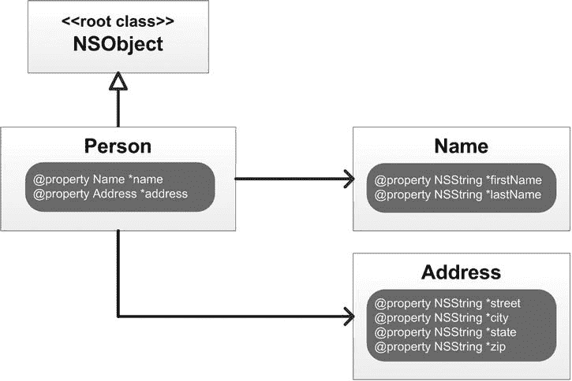

图 18-1。Person 对象图

这里使用了面向对象的组合原则来创建一个对象图，该对象图包含一个拥有 `Name` 实例和 `Address` 实例的 `Person` 对象。给定这个对象图，对于一个名为 `person` 的 `Person` 实例，可以使用点语法来获取 `firstName` 属性的值，并如下设置 `firstName` 属性的值：

```
person.name.firstName = @"Bob";
```

键值编码机制包含一个提供相同功能的 API（即 `setValue:forKeyPath:` 方法）。它的参数包含一个同样使用点语法的键路径。

```
[person setValue:@"Bob" forKeyPath:@"name.firstName"];
```

`valueForKeyPath:` API 用于获取由键路径指定的属性值，例如

```
NSString *name = [person valueForKeyPath:@"name.firstName"];
```


## 键值编码

如前所述，键值编码包含用于访问对象多个属性的 API。在图 18-1 所示的对象图中，`Person` 类声明了一个 `Name` 属性和一个 `Address` 属性。可以使用键值编码来检索输入键集合对应的键和值。代码清单 18-4 使用 KVC 的 `dictionaryWithValuesForKeys:` 方法检索名为 `person` 的 `Person` 实例的 `name` 和 `address` 属性的键和值。

*代码清单 18-4.* 使用 KVC 检索多个属性值

```
NSArray *personKeys = @[@"name", @"address"];
NSDictionary *personValues = [person dictionaryWithValuesForKeys:personKeys];
```

相反，代码清单 18-5 使用 KVC 的 `setValuesForKeysWithDictionary:` 方法为名为 `person` 的 `Person` 实例的 `name` 和 `address` 属性设置值。

*代码清单 18-5.* 使用 KVC 设置多个属性值

```
Name *tom = [Name new];
Address *home = [Address new];
NSDictionary *personProperties = @{@"name":tom, @"address":home};
[person setValuesForKeysWithDictionary:personProperties];
```

这些仅仅是键值编码提供的一部分功能。在接下来的段落中，你将更详细地研究这项技术，并学习它的一些更高级的特性。

### KVC 的设计与实现

键值编码的设计基于以下两个基本结构：

*   一种机制，可以通过名称（或键）间接访问对象的属性，而不是直接调用访问器方法。
*   一种将键映射到相应的属性访问器方法和/或属性后备变量的机制。

`NSKeyValueCoding` 非正式协议定义了通过名称/键间接访问对象的机制。该协议声明了键值编码 API，包括类方法和实例方法以及常量值。这些方法使你能够获取和设置属性值、执行属性验证以及更改用于获取属性值的键值编码方法的默认行为。在本章前面，你使用了其中几个 API（例如 `valueForKey:`、`selectValue:forKey:` 等）。`NSObject` 提供了 `NSKeyValueCoding` 协议的默认实现，因此任何继承自 `NSObject` 的类都内置了对键值编码的支持。

### 键值编码 API

`NSKeyValueCoding` 非正式协议定义了标准的键值编码 API。这些方法使你能够获取/设置属性值、执行基于键值编码的属性验证以及配置键值编码操作。根据所选方法的不同，其输入参数可以是一个键、键路径、值，以及（对于验证 API 而言）一个错误对象指针。在前面的章节中，你使用了其中几种方法来获取和设置属性值；现在我将概述该协议指定的其他几种方法。

`NSKeyValueCoding` 的 `accessInstanceVariablesDirectly` 类方法使你的类能够控制：如果未找到（该属性的）访问器方法，键值编码机制是否应直接访问属性的后备变量。该方法返回一个布尔值。`YES` 表示键值编码方法应直接访问对应的实例变量，而 `NO` 表示不应访问。默认的（`NSObject`）实现返回 `YES`；你的类应重写此方法以控制此行为。

由于键值编码使用一个（在运行时确定的）键值来访问属性，它还提供了 API 来处理输入键与对象属性不匹配的情况。`NSKeyValueCoding` 的 `valueForUndefinedKey:` 和 `setValue:forUndefinedKey:` 方法控制键值编码如何响应未定义键的情况。具体来说，当 `valueForKey:` 或 `setValue:forKey:` 方法未找到与输入键对应的属性时，会调用其中一种方法。未定义键方法的默认实现会引发 `NSUndefinedKeyException` 异常，但子类可以重写这些方法以返回自定义的值。代码清单 18-6 重写了前面显示的 `Hello` 类实现的 `valueForUndefinedKey:` 方法（参见代码清单 18-1），以便在输入的键是 `"hi"` 时，返回名为 `greeting` 的属性的值。

*代码清单 18-6.* Hello 类中 `valueForUndefinedKey:` 方法的实现

```
@implementation Hello
...
- (id)valueForUndefinedKey:(NSString *)key
{
  if ((nil != key) && ([@"hi" isEqualToString:key]))
  {
    return self.greeting;
  }
  [NSException raise:NSUndefinedKeyException
              format:@"Key %@ not defined", key];
  return nil;
}
...
@end
```

该协议定义了两种验证属性值的方法：`validateValue:forKey:error:` 和 `validateValue:forKeyPath:error:`。你将在本章后面部分考察这些方法。

对于集合，`NSKeyValueCoding` 协议包含一些方法，这些方法可以为给定的键返回集合（数组或集合）的可变实例。以下代码片段使用 `mutableArrayValueForKey:` 方法从名为 `order` 的对象中为键 `"items"` 返回一个可变数组。

```
NSMutableArray *items = [order mutableArrayValueForKey:@"items"];
```

请注意，即使该属性是只读集合，这些 API 也会返回可变集合实例。

### 键值搜索模式

那么，当调用某个 KVC API 时，鉴于其输入参数是一个键/键路径（对于设置方法还包括一个值），它究竟如何获取/设置属性值呢？KVC 通过使用一组依赖于属性访问器方法命名约定的搜索模式来实现这一点。

这些搜索模式会尝试使用相应的访问器方法来获取/设置属性值，只有在找不到匹配的访问器方法时，才会转而直接访问后备实例变量。`NSObject` 对 KVC 的默认实现包含了多种搜索模式，以支持各种 KVC 的 getter/setter 方法。`setValue:forKey:` 方法的搜索模式如下：

1. KVC 在目标（即接收者）类中搜索名称与模式 `set<Key>:` 匹配的访问器方法，其中 `<Key>` 是属性的名称。因此，如果你的对象调用 `setValue:forKey:` 方法并为键提供值 `"name"`，KVC 将搜索该类中名为 `setName:` 的访问器方法。
2. 如果未找到访问器，并且接收者的类方法 `accessInstanceVariablesDirectly` 返回 `YES`，那么将在接收者类中搜索名称与模式 `_<key>`、`_is<Key>`、`<key>` 或 `is<Key>` 匹配的实例变量。在这种情况下，KVC 将搜索名为 `_name`、`_isName`、`name` 或 `isName` 的实例变量。
3. 如果找到匹配的访问器方法或实例变量，则用它来设置值。如有必要，该值会被包装（wrapped）。
4. 如果未找到合适的访问器或实例变量，则会调用接收者的 `setValue:forUndefinedKey:` 方法。

这些搜索模式支持不同类别的属性（属性值、对象类型、集合）。如前所述，你的类也可以重写 `valueForUndefinedKey:` 和 `setValue:forUndefinedKey:` 方法，以处理给定键找不到属性的情况。


## 键值编码

**注意**：键值编码可用于访问三类不同的属性：简单属性、对一关系和对多关系。*属性*是原始类型（即基本类型）、布尔值、字符串（`NSString`）或值对象（`NSDate`、`NSNumber`、`NSDecimalNumber`、`NSValue`）。符合*对一关系*的属性是一种对象类型，并且（可能）拥有自己的属性。这包括框架类（例如 Foundation 框架）和你自己的自定义类。符合*对多关系*的属性由一组相似类型的对象组成。最常见的集合类型有 `NSArray`、`NSSet` 等。

### 属性访问器命名约定

如上一节所述，默认的 `NSObject` 键值编码实现依赖于键值兼容的属性。具体来说，此类属性必须符合 Cocoa 关于属性访问器方法的标准命名约定。这些约定可以总结如下：

*   取值方法应使用 `<key>` 访问器形式，其中方法名和属性名相同。对于名为 `firstName` 的属性，取值方法也应命名为 `firstName`。这对于除布尔值属性外的所有数据类型都适用；对于布尔值属性，取值方法应添加前缀 `is`（例如，前述示例中的 `isFirstName`）。
*   属性的设值方法应使用 `set<key>` 形式，其中方法名与属性名相同，并添加前缀 `set`。对于名为 `firstName` 的属性，设值方法应命名为 `setFirstName:`。

这些约定应适用于属性和对一关系属性。例如，对于名为 `person`、类型为 `Type` 的属性，其取值方法和设值方法应如下命名：

```
- (Type)person;
- (void)setPerson:(Type)newValue;
```

在前面的例子中，如果属性 `person` 的类型是布尔值，则取值方法可以改为如下命名：

```
- (BOOL)isPerson;
```

再比如，一个类型为 `NSString *`、名为 `address` 的属性，其访问器命名如下：

```
- (NSString *)address
- (void)setAddress:(NSString *)
```

请注意，如果你的属性是通过自动合成定义的（详见第 2 章），编译器会自动生成遵循此约定的访问器方法。

键值编码依赖于这些命名约定；因此，你的代码必须遵循这些约定，才能确保键值编码正常工作。

### 对多属性访问器命名约定

除了 `<key>` 和 `set<key>` 访问器形式外，对多关系属性（即集合）还应实现一组额外的访问器方法。这些额外的方法可以提升 KVC 可变集合类的性能，使你能够使用除 `NSArray` 或 `NSSet` 之外的类（即你自己的自定义类）来建模对多关系，并使你的代码能够使用 KVC 访问器方法对集合进行修改。

根据集合类型的不同，对多关系属性有几种访问器模式。维护有序对多关系的类（这些通常是 `NSArray` 或 `NSMutableArray` 类型）应实现表 18-1 中列出的方法。

表 18-1. 有序对多关系属性需实现的方法

| 方法 | 有序对多关系 | 可变有序对多关系 |
| --- | --- | --- |
| `countOf<Key>` | 必需 | 必需 |
| `objectIn<Key>AtIndex:` `(或 <key>AtIndexes:)` | 必需 | 必需 |
| `get<Key>:range:` | 可选 | 可选 |
| `insertObject:in<Key>AtIndex:` `(或 insert<Key>:atIndexes:)` |  | 必需 |
| `removeObjectFrom<Key>AtIndex:` `(或 remove<Key>AtIndexes:)` |  | 必需 |
| `replaceObjectIn<Key>AtIndex:withObject:` `(或 replaceKeyAtIndexes:with<Key>:)` |  | 可选 |

实现表 18-1 中的可选方法可以在访问集合元素时提升性能。回顾 图 18-1 描绘了 `Person` 类的对象图。设想一个名为 `people`（类型为 `NSArray *`）的对多属性。代码清单 18-7 提供了该属性的 `countOf<Key>` 和 `objectIn<Key>AtIndex:` 方法的实现。

*代码清单 18-7.*  有序对多属性访问器的示例实现

```
- (NSUInteger)countOfPeople
{
  return [self.people count];
}

- (Person *)objectInPeopleAtIndex:(NSUInteger)index
{
  return [self.people objectAtIndex:index];
}
```

维护无序对多关系的类（通常是 `NSSet` 或 `NSMutableSet` 类型）应实现表 18-2 中列出的方法。

表 18-2. 无序对多关系属性需实现的方法

| 方法 | 有序对多关系 | 可变有序对多关系 |
| --- | --- | --- |
| `countOf<Key>` | 必需 | 必需 |
| `enumeratorOf<Key>` | 必需 | 必需 |
| `memberOf<Key>:` | 可选 | 可选 |
| `add<Key>Object: (或 add<Key>:)` |  | 必需 |
| `remove<Key>Object: (或 remove<Key>:)` |  | 必需 |

设想名为 `people` 的对多属性是 `NSSet *` 类型（即无序对多关系属性）。代码清单 18-8 提供了该属性的 `enumeratorOf<Key>` 和 `memberOf<Key>` 方法的实现。

*代码清单 18-8.*  无序对多属性访问器的示例实现

```
- (NSEnumerator *)enumeratorOfPeople
{
  return [self.people objectEnumerator];
}

- (Person *)memberOfPeople:(Person *)obj
{
  return [self.people member:obj];
}
```

### 键值验证

键值编码还提供了用于验证属性值的框架。KVC 验证机制由一组 API 和一套用于自定义属性验证方法的标准约定组成。KVC 验证方法可以直接调用，也可以通过调用 `validateValue:forKey:error:` 方法间接调用。

键值验证指定了属性验证方法的命名约定。验证方法的 selector 为

```
validate<Key>:error:
```

其中 `<Key>` 是属性名称。例如，对于名为 `person` 的属性，其验证方法为 `validatePerson:error:`。代码清单 18-9 为 图 18-1 中所示的 `Address` 类的 `city` 属性提供了一个验证方法的示例实现。

*代码清单 18-9.*  City 属性的示例验证方法实现

```
- (BOOL)validateCity:(id *)value error:(NSError * __autoreleasing *)error
{
  if (*value == nil)
  {
    if (error != NULL)
    {
      *error = [NSError errorWithDomain:@"Invalid Property Value (nil)"
                                   code:1
                               userInfo:nil];
    }
    return NO;
  }
  return YES;
}
```


如上文方法实现所示，该方法返回布尔值 `YES` 或 `NO`。如果对象值无效且无法创建并返回有效值，则返回 `NO`。在此情况下，还会返回一个 `NSError` 对象（通过双重间接引用），用于指示验证失败的原因。验证方法在以下场景中返回 `YES`：

- 如果输入对象值有效，则返回 `YES`。
- 如果输入对象值无效，但创建并返回了有效的新对象值，则在将输入值设置为新的有效值后返回 `YES`。

通过调用相应的 `validate<Key>:error:` 方法执行属性验证的 KVC 方法声明如下：

```
- (BOOL)validate<Key>:(id *)value error:(NSError **)error;
```

请注意，键值编码不会自动调用属性验证方法。您的代码必须手动执行属性验证，通常通过直接调用其验证方法或使用 KVC 验证 API 来完成。列表 18-10 演示了在名为 `address` 的 `Address` 实例上使用键值验证的示例，用于在将值设置到名为 `city` 的 `Address` 属性之前对其进行验证。

*列表 18-10.* 使用键值验证

```
NSError *error;
NSString *value = @"San Jose";
BOOL result = [address validateValue:&value forKey:@"city" error:&error];
if (result)
{
  [address setValue:value forKey:@"city"];
}
```

### 键值编码集合运算符

键值编码包含一组运算符，允许使用键路径点表示法对集合中的项目执行操作。KVC 集合运算符专用键路径的格式如下：

```
collectionKeyPath.@operator.propertyKeyPath
```

此专用键路径用作 `valueForKeyPath:` 方法的参数来执行集合操作。请注意，此键路径的组件由句点分隔。如果提供了 `collectionKeyPath`，则它是执行操作的数组或集合（相对于接收者）的键路径。`operator`（前面带有 `@` 符号）是对集合执行的操作。最后，`propertyKeyPath` 是运算符所使用的集合属性的键路径。集合运算符分为几种类型：对集合属性进行操作的简单集合运算符、将运算符应用于单个集合实例时提供结果的对象运算符，以及对嵌套集合进行操作并根据运算符返回数组或集合的集合运算符。

通过示例最能说明集合运算符的工作方式，因此下面将采用这种方式。列表 18-11 声明了一个包含多个属性的 `OrderItem` 类的接口。

*列表 18-11.* OrderItem 类接口

```
@interface OrderItem : NSObject

@property NSString *description;
@property NSUInteger *quantity;
@property float *price;

@end
```

给定一组存储在名为 `orderItems` 的 `NSArray` 对象中的 `OrderItem` 实例，以下表达式使用带有 `@sum` 集合运算符的 KVC `valueForKeyPath:` 表达式来计算这些商品的价格总和。

```
NSNumber *totalPrice = [orderItems valueForKeyPath:@"@sum.price"];
```

`orderItems` 集合中的对象数量可以使用 `@count` 集合运算符确定，如下所示：

```
NSNumber *totalItems = [orderItems valueForKeyPath:@"@count"];
```

可以通过使用 `@distinctUnionOfObjects` 运算符来获取具有不同描述的不同订单商品的数量，如下所示：

```
NSArray *itemTypes = [orderItems
                      valueForKeyPath:@"@distinctUnionOfObjects.description"];
```

现在，让我们看一个对集合属性使用集合运算符的示例。列表 18-12 声明了一个具有单个属性的 `Order` 类的接口。

*列表 18-12.* Order 类接口

```
@interface Order : NSObject

@property NSArray *items;

@end
```

给定一个名为 `order` 的 `Order` 实例，可以使用 `@count` 运算符来确定键路径集合中的对象数量。在此情况下，键路径由指向集合的键路径（`items`）后跟 `@count` 运算符组成。

```
NSNumber *totalItems = [order valueForKeyPath:@"items.@count"];
```

前面的示例演示了可用 KVC 集合运算符子集的使用。Apple 的《键值编程指南》提供了集合运算符的完整参考。

## 键值观察

键值观察是一种使对象能够被通知其他对象属性更改的机制。它本质上是观察者软件设计模式的一种实现，并在众多软件库和框架中实现。事实上，它是模型-视图-控制器（MVC）设计模式的关键组成部分，而 MVC 是 Cocoa 和 Cocoa Touch 框架的核心组件。键值观察提供了诸多优势，包括将观察者对象与被观察对象（即主题）解耦、框架级支持以及功能完备的 API 集。以下示例使用键值观察将 `Administrator` 对象注册为名为 `person` 的 `Person` 实例的 `name` 属性的观察者。

```
Administrator *admin = [Administrator new];
[person addObserver:admin
         forKeyPath:@"name"
            options:NSKeyValueObservingOptionNew
            context:NULL];
```

调用 `addObserver:forKeyPath:options:context:` 方法会在主题与观察者对象之间建立连接。当被观察属性的值发生变化时，主题会调用观察者的 `observeValueForKeyPath:ofObject:change:context:` 方法。在此方法中，观察者类实现处理属性更改的逻辑。当被观察属性的值以 KVO 兼容的方式被更改，或其依赖的键被更改时，主题会自动调用此方法。观察者必须实现此方法才能使键值观察正常工作。列表 18-13 为 `Administrator` 类提供了此方法的示例实现。

*列表 18-13.* `observeValueForKeyPath:ofObject:change:context:` 方法的示例实现

```
@implementation Administrator

...
- (void)observeValueForKeyPath:(NSString *)keyPath ofObject:(id)object
        change:(NSDictionary *)change context:(void *)context
{
  if ([@"name" isEqual:keyPath])
  {
    // 插入处理人员姓名更新的逻辑
    ....
  }
  // 如果父类实现了此方法，则调用父类的实现！
  [super observeValueForKeyPath:keyPath
                       ofObject:object
                         change:change
                        context:context];
}
...

@end
```

`NSKeyValueObserving` 非正式协议定义了键值观察的 API。其方法支持更改通知、注册观察者、向观察者通知更改以及自定义观察。`NSObject` 提供了 `NSKeyValueObserving` 协议的默认实现，因此任何继承自 `NSObject` 的类都内置了对键值观察的支持。此外，您可以通过禁用自动观察者通知并使用此协议中的方法实现手动通知，来进一步细化通知。

## 键值观察还是通知


### 键值观察 vs. Foundation 框架通知

在第 12 章中，你学习了 Foundation 框架的通知类（`NSNotification`、`NSNotificationCenter`、`NSNotificationQueue`）。这些 API 提供了一种在对象之间传递信息的机制，功能类似于键值观察。由于这与键值观察的功能有些相似，你可能会想："这两种机制如何比较，又该选择哪一种？" 事实上，键值观察与通知 API 之间存在多种差异，这些差异将影响你在特定场景下的选择，因此我在此对两者进行比较。

`NSNotification`实例封装的是通用信息，因此它支持广泛的系统事件（包括属性变更），而键值观察严格用于通知对象属性的变更。因此，仅针对属性变更而言，KVO API 比通知 API 可能更易于使用。

通知类采用广播式的交互模型，信息（封装在`NSNotification`对象中）通过一个集中的通知中心（`NSNotificationCenter`实例）进行分发。它允许一条消息发送给多个对象，甚至不要求接收方已注册来支持通知。通知类既支持同步发布通知，也支持异步（使用`NSNotificationQueue`实例）发布通知。而键值观察则采用点对点的交互模型，当属性发生变更时，主体直接向已注册的观察者发送通知，并阻塞直至对应方法执行完毕。这两种机制都提供了松耦合；不过，通知 API 还提供了非阻塞（即异步）交互，因此有可能让应用获得更高的响应性。

由于通知机制完全解耦了通知事件的发送方和接收方，两者之间不存在直接的双向通信机制；要实现双向通信，双方都必须注册通知。而键值观察则允许观察者向主体发送消息，因为主体作为参数传递给了观察者的`observeValueForKeyPath:ofObject:change:context:` 方法。

通知通过其名称来区分，因此名称必须唯一，以确保发布的通知能被正确的观察者接收。苹果公司在《Cocoa 编码规范》文档中指定了一套命名约定，以最大程度减少通知名称冲突的可能性。由于属性名称是特定于类的（即具有类命名空间），并且主体直接与观察者绑定，因此命名冲突不是问题。

### 键值观察 API

`NSKeyValueObserving`协议 API 提供了为输入键路径添加和移除观察者的方法。调用`addObserver:forKeyPath:options:context:` 方法会在主体和观察者对象之间建立连接。由于这会创建对观察者的强引用，因此应在主体被释放之前将对象作为观察者移除。`removeObserver:forKeyPath:` 方法执行此功能。它会阻止对象接收指定键路径属性的变更通知。`addObserver:forKeyPath:context:` 方法与接收器和上下文执行相同的功能。当同一观察者针对同一键路径注册多次但带有不同上下文时，可以使用上下文指针来确定要移除哪个观察者。代码清单 18-14 演示了如何使用这些 API，将一个`Administrator`对象添加为名为`person`的`Person`实例的`name`属性的观察者，然后将其移除。

*代码清单 18-14.* KVO 添加和移除观察者

```
Administrator *admin = [Administrator new];
[person addObserver:admin
         forKeyPath:@"name"
            options:NSKeyValueObservingOptionNew
            context:NULL];
[person removeObsserver:admin forKeyPath:@"name"];
```

键值观察提供了（在`NSKeyValueObserving`协议中声明的）API，以支持自动和手动的键值变更通知。这些 API 使观察者能够在属性值变更前后执行逻辑。这些 API 支持属性、一对一关系和一对多关系属性。

- 用于属性和一对一关系属性的 API：
  - `willChangeValueForKey:`
  - `didChangeValueForKey:`

- 用于一对多、有序关系属性的 API：
  - `willChange:valuesAtIndexes:forKey:`
  - `didChange:valuesAtIndexes:forKey:`

- 用于一对多、无序关系属性的 API：
  - `willChangeValueForKey:withSetMutation:usingObjects:`
  - `didChangeValueForKey:withSetMutation:usingObjects:`

当相应属性值发生变更时，默认的`NSObject`实现会自动在观察者上调用正确的变更通知方法。自动/手动变更通知通过`NSKeyValueObserving`的`automaticallyNotifiesObserversForKey:` 方法进行配置。默认的`NSObject`实现对此方法返回`YES`，因此它执行自动变更通知。要执行手动变更通知，你的类必须重写`NSKeyValueObserving`的`automaticallyNotifiesObserversForKey:` 方法。对于你想要执行手动变更通知的属性，该方法应返回`NO`。在这种情况下，你的代码必须在更改属性值之前调用`NSKeyValueObserving`协议方法`willChange:`，并在更改值之后调用`didChange:` 方法。代码清单 18-15 为`Person`类的`name`属性提供了手动变更通知的示例实现，如图 18-1 所示。

*代码清单 18-15.* KVO 手动变更通知的示例实现

```
- (void)changeName:(Name *)newName
{
  [self willChangeValueForKey:@"name"];
  self.name = newName;
  [self didChangeValueForKey:@"name"];
}
```

那么，为什么要执行手动变更通知呢？原因包括对变更通知的发送进行更精细的控制、消除不必要的通知（例如，新属性值与旧值相同的情况），以及将通知分组。

`NSKeyValueObserving`协议还提供了几种用于自定义观察的方法。`keyPathsForValuesAffectingValueForKey:` 方法检索影响输入键值所有属性的键路径。当一个属性的值依赖于另一个对象中的一个或多个属性时，此方法用于注册依赖键。对于一对一关系属性，应重写此方法，以使你的代码能为该属性返回适当的依赖键集合。例如，`Address`类（如图 18-1 所示）声明了`street`、`city`、`state`和`zip`属性。`zip`属性依赖于其他三个属性；因此，如果任何其他地址属性发生更改，则应通知观察`zip`属性的应用。这可以通过让`Address`类重写该方法，以返回一个包含键`street`、`city`和`state`的键路径集合来实现，如代码清单 18-16 所示。

*代码清单 18-16.* 为一对一关系属性注册依赖键


```objective-c
+ (NSSet *)keyPathsForValuesAffectingValueForKey:(NSString *)key
{
  NSSet *keyPaths = [super keyPathsForValuesAffectingValueForKey:key];
  if ([key isEqualToString:@"zip"])
  {
    NSArray *affectingKeys = @[@"street", @"city", @"state"];
    keyPaths = [keyPaths setByAddingObjectsFromArray:affectingKeys];
  }
  return keyPaths;
}
```

还可以通过实现遵循命名约定 `keyPathsForValuesAffecting<Key>`（其中 `<Key>` 是依赖于其他值的属性名称）的类方法，为 **to-one** 关系属性注册依赖键。此外还提供了类似的方法和技术，用于为 **to-many** 关系属性注册依赖键。

`observationInfo` 和 `setObservationInfo:` 方法允许你获取/设置关于所有已注册观察者的观察信息。

### KVO 设计与实现

键值观察是通过 Objective-C 运行时的强大功能实现的。当你向对象注册观察者时，KVO 基础架构会动态创建原始对象类的一个新子类。然后它会调整对象的 `isa` 指针，使其指向该子类；因此发送给原始类的消息实际上会被发送给子类。你可能还记得第 8 章中提到，`isa` 指针指向对象的类，而这个类维护着一个调度表，其中包含该类实现的方法指针。这个新的子类实现了 KVO 基础架构。它会拦截发送给对象的消息，检查其中是否包含与特定模式（如 getter、setter 和集合访问方法）匹配的消息，然后向观察者发送通知等。这种动态替换 `isa` 指针所指向类别的技术称为 **isa-swizzling**。

## 使用键值编程

现在你将实现一个示例程序，该程序使用键值编程来执行各种任务。该程序演示了键值编码和键值观察在一个系统中的应用，其类图如图 18-2 所示。

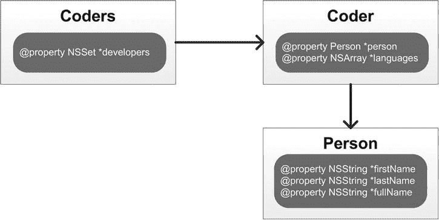

图 18-2. Coders 类图

在 Xcode 中，通过从 Xcode 的 **File** 菜单中选择 **New  Project . . .** 来创建一个新项目。在 **New Project Assistant** 窗格中，创建一个命令行应用程序。在 **Project Options** 窗口中，将 **Product Name** 指定为 **Coders**，将 **Project Type** 选择为 **Foundation**，并通过勾选 **Use Automatic Reference Counting** 复选框来选择 ARC 内存管理。在文件系统中指定希望创建项目的位置（如有必要，选择 **New Folder** 并输入文件夹名称和位置），取消勾选 **Source Control** 复选框，然后点击 **Create** 按钮。

你将在此创建几个声明了各种属性的类。从 Xcode 的 **File** 菜单中选择 **New  File . . .**，选择 **Objective-C class** 模板，并将类命名为 **Person**。选择 **Coders** 文件夹作为文件位置，选择 **Coders** 项目作为目标，然后点击 **Create** 按钮。接下来，在 Xcode 的项目导航窗格中，选择 **Person.h** 文件并更新类接口，如列表 18-17 所示。

*列表 18-17.* Person 类接口

```objective-c
#import <Foundation/Foundation.h>

@interface Person : NSObject

@property (readonly) NSString *fullName;
@property NSString *firstName;
@property NSString *lastName;

- (id)initWithFirstName:(NSString *)fname lastName:(NSString *)lname;

@end
```

该接口声明了三个属性和一个初始化方法。一个 `Person` 对象包含名字、姓氏和全名。`fullName` 属性是只读的，由 `firstName` 和 `lastName` 属性派生而来。接下来，使用 Xcode 的项目导航窗格选择 **Person.m** 文件并编写实现代码，如列表 18-18 所示。

*列表 18-18.* Person 类实现

```objective-c
#import "Person.h"
#define CodersErrorDomain   @"CodersErrorDomain"
#define kInvalidValueError  1

@implementation Person

- (id)initWithFirstName:(NSString *)fname lastName:(NSString *)lname
{
  if ((self = [super init]))
  {
    _firstName = fname;
    _lastName = lname;
  }
  return self;
}

- (NSString *)fullName
{
  return [NSString stringWithFormat:@"%@ %@", self.firstName, self.lastName];
}

- (BOOL)validateLastName:(id *)value error:(NSError * __autoreleasing *)error
{
  // 检查 nil 值
  if (*value == nil)
  {
    if (error != NULL)
    {
      NSDictionary *reason = @{NSLocalizedDescriptionKey:
                               @"Last name cannot be nil"};
      *error = [NSError errorWithDomain:CodersErrorDomain
                                   code:kInvalidValueError
                               userInfo:reason];
    }
    return NO;
  }
  // 检查空值
  NSUInteger length = [[(NSString *)*value stringByTrimmingCharactersInSet:
                       [NSCharacterSet whitespaceAndNewlineCharacterSet]] length];
  if (length == 0)
  {
    if (error != NULL)
    {
      NSDictionary *reason = @{NSLocalizedDescriptionKey:
                               @"Last name cannot be empty"};
      *error = [NSError errorWithDomain:CodersErrorDomain
                                   code:kInvalidValueError
                               userInfo:reason];
    }
    return NO;
  }
  return YES;
}

+ (NSSet *)keyPathsForValuesAffectingValueForKey:(NSString *)key
{
  NSSet *keyPaths = [super keyPathsForValuesAffectingValueForKey:key];
  if ([key isEqualToString:@"fullName"])
  {
    NSArray *affectingKeys = @[@"firstName", @"lastName"];
    keyPaths = [keyPaths setByAddingObjectsFromArray:affectingKeys];
  }
  return keyPaths;
}

@end
```

`initWithFirstName:lastName:` 方法用于使用输入的名字和姓氏初始化一个 `Person` 实例。访问器方法 `fullName` 返回 `Person` 对象全名的派生值，即 `firstName` 和 `lastName` 属性值的拼接。`validateLastName:error:` 方法用于对 `lastName` 属性执行 KVC 属性验证。如果输入的姓氏为 `nil` 或空字符串，则返回 `NO` 和一个 `NSError` 对象；否则返回 `YES`。`keyPathsForValuesAffectingValueForKey:` 方法用于注册依赖键。该方法利用依赖于 `firstName` 和 `lastName` 属性的 `fullName` 属性，来获取要添加到返回的键路径中的键。

接下来，你将实现 `Coder` 类。从 Xcode 的 **File** 菜单中选择 **New  File . . .**，选择 **Objective-C class** 模板，并将类命名为 **Coder**。选择 **Coders** 文件夹作为文件位置，选择 **Coders** 项目作为目标，然后点击 **Create** 按钮。在 Xcode 的项目导航窗格中，选择 **Coder.h** 文件并更新类接口，如列表 18-19 所示。

*列表 18-19.* Coder 类接口

```objective-c
#import <Foundation/Foundation.h>

@class Person;
@interface Coder : NSObject

@property Person *person;
@property NSMutableArray *languages;

@end
```


该类别声明了两个属性：一个`Person`属性名为`person`，以及一个`NSMutableArray`属性名为`languages`。`languages`属性是一个数组，包含`Coder`使用的编程语言名称。请注意，使用`@class`指令来前置声明`Person`类，从而无需在此接口中导入其头文件。现在，使用 Xcode 项目导航器选择`Coder.m`文件并编写实现代码，如列表 18-20 所示。

*列表 18-20.*  Coder 类实现

```
#import "Coder.h"

@implementation Coder

- (NSUInteger)countOfLanguages
{
  return [self.languages count];
}

- (NSString *)objectInLanguagesAtIndex:(NSUInteger)index
{
  return [self.languages objectAtIndex:index];
}

- (void)insertObject:(NSString *)object inLanguagesAtIndex:(NSUInteger)index
{
  [self.languages insertObject:object atIndex:index];
}

- (void)removeObjectFromLanguagesAtIndex:(NSUInteger)index
{
  [self.languages removeObjectAtIndex:index];
}

- (void)observeValueForKeyPath:(NSString *)keyPath
                      ofObject:(id)object
                        change:(NSDictionary *)change
                       context:(void *)context
{
  NSString *newValue = change[NSKeyValueChangeNewKey];
  NSLog(@"Value changed for %@ object, key path: %@, new value: %@",
        [object className], keyPath, newValue);
}

@end
```

`Coder`实现包含了针对`languages`属性有序、对多关系的 KVO 推荐方法。当输入键路径对应的`Coder`属性发生更改时，会执行`observeValueForKeyPath:ofObject:change:context:`方法。在此情况下，该方法仅打印对象和键路径的新值。

最后，你将实现`Coders`类。如图 18-2 所示，`Coders`类持有一个`Coder`实例的集合（一个`NSSet`）。从 Xcode 文件菜单中选择**New  File . . .**，选择 Objective-C 类模板，并将该类命名为`Coders`。选择`Coders`文件夹作为文件位置，选择`Coders`项目作为目标，然后点击**Create**按钮。接着，在 Xcode 项目导航器窗格中，选择`Coders.h`文件并更新类接口，如列表 18-21 所示。

*列表 18-21.*  Coders 类接口

```
#import <Foundation/Foundation.h>

@class Coder;
@interface Coders : NSObject

@property NSSet *developers;

@end
```

`Coders`接口声明了一个单独属性，一个名为`developers`的`NSSet`，其中包含`Coder`对象的集合。现在，使用 Xcode 项目导航器选择`Coders.m`文件并编写实现代码，如列表 18-22 所示。

*列表 18-22.*  Coders 类实现

```
#import "Coders.h"

@implementation Coders

- (NSUInteger)countOfDevelopers
{
  return [self.developers count];
}

- (NSEnumerator *)enumeratorOfDevelopers
{
  return [self.developers objectEnumerator];
}

- (Coder *)memberOfDevelopers:(Coder *)member object:(Coder *)anObject
{
  return [self.developers member:anObject];
}

@end
```

`Coders`实现包含了针对`developers`属性无序、对多关系的 KVO 推荐方法。

现在你已经完成了类的实现，让我们继续讨论`main()`函数。在 Xcode 项目导航器中，选择`main.m`文件并更新`main()`函数，如列表 18-23 所示。

*列表 18-23.*  Coders main() 函数

```
#import <Foundation/Foundation.h>
#import "Person.h"
#import "Coder.h"
#import "Coders.h"

int main(int argc, const char * argv[])
{
  @autoreleasepool
  {
    Person *curly = [[Person alloc] initWithFirstName:@"Curly" lastName:@"Howard"];
    NSLog(@"Person first name: %@", [curly valueForKey:@"firstName"]);
    NSLog(@"Person full name: %@", [curly valueForKey:@"fullName"]);
    NSArray *langs1 = @[@"Objective-C", @"C"];
    Coder *coder1 = [Coder new];
    coder1.person = curly;
    coder1.languages = [langs1 mutableCopy];
    NSLog(@"\nCoder name: %@\n\t  languages: %@",
          [coder1 valueForKeyPath:@"person.fullName"],
          [coder1 valueForKey:@"languages"]);

    Coder *coder2 = [Coder new];
    coder2.person = [[Person alloc] initWithFirstName:@"Larry" lastName:@"Fine"];
    coder2.languages = [@[@"Objective-C", @"C++"] mutableCopy];
    NSLog(@"\nCoder name: %@\n\t  languages: %@",
          [coder2 valueForKeyPath:@"person.fullName"],
          [coder2 valueForKey:@"languages"]);

    [curly addObserver:coder1
            forKeyPath:@"fullName"
               options:NSKeyValueObservingOptionNew
               context:NULL];
    curly.lastName = @"Fine";
    [curly removeObserver:coder1 forKeyPath:@"fullName"];

    Coders *bestCoders = [Coders new];
    bestCoders.developers = [[NSSet alloc] initWithArray:@[coder1, coder2]];
    [bestCoders valueForKey:@"developers"];
    NSLog(@"Number of coders = %@", [bestCoders.developers
                                     valueForKeyPath:@"@count"]);
    NSError *error;
    NSString *emptyName = @"";
    BOOL valid = [curly validateValue:&emptyName forKey:@"lastName" error:&error];
    if (!valid)
    {
      NSLog(@"Error: %@", ([error userInfo])[NSLocalizedDescriptionKey]);
    }
  }
  return 0;
}
```

该函数首先创建一个`Person`实例，然后使用键值编码来检索其属性的值。接着，创建一个`Coder`实例，并设置其`person`和`languages`属性。随后使用键值编码 API 来检索相应的属性值。然后创建另一个`Coder`实例并相应地设置其属性值。接着演示键值观察，注册一个`Coder`实例以在`Person`实例的`fullName`属性更改时接收通知。然后创建一个`Coders`实例（请记住，`Coders`类持有一个`Coder`实例的集合），并将其`developers`属性赋值为先前创建的`Coder`实例的集合。接着使用集合运算符返回集合中程序员的总数。最后，在`Person`实例的`lastName`属性上演示键值编码验证。

当你编译并运行程序时，应在输出窗格中看到如图 18-3 所示的消息。

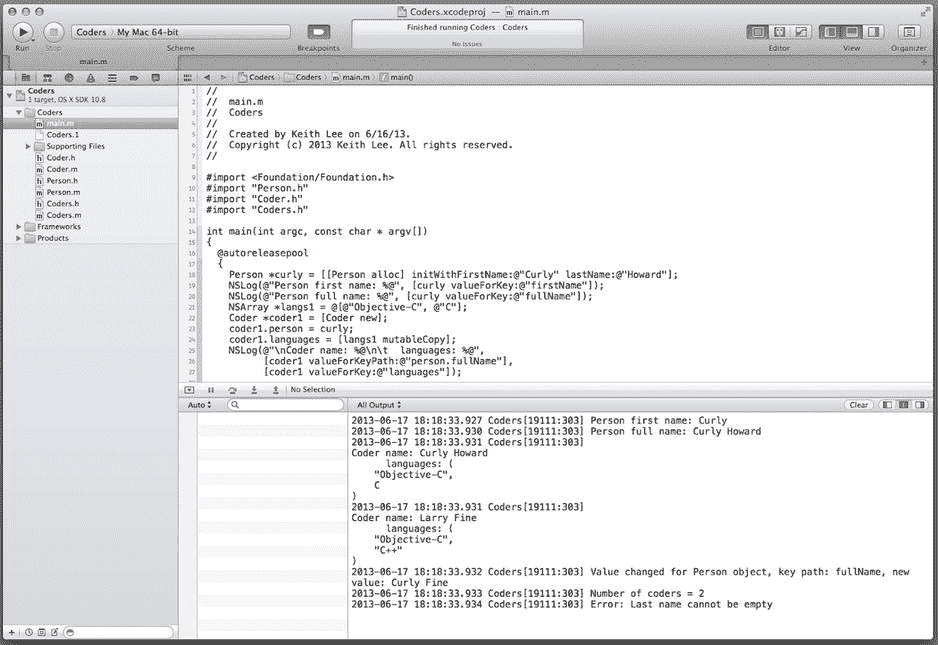

图 18-3. Coders 程序输出

太棒了！至此，你已经完成了对键值编程 API 和基础设施的深入检查。在使用 Objective-C 编程以及使用 Apple 的各种软件框架和服务时，理解键值编码和键值观察将对您极其有用。

**总结**

在本章中，你学习了键值编程，这是 Objective-C 语言中一组强大的机制和 API。键值编程是通用 Objective-C 编程以及 Cocoa 和 Cocoa Touch 框架的重要组成部分，因此理解其细节以及如何在程序中有效使用它至关重要。本章深入探讨了键值编程基础设施，特别是键值编码和键值观察。其关键要点包括：


### 键值编码与键值观察

*   键值编码使您的代码能够通过名称（即键）间接访问和操作对象的属性，而非通过访问器方法或后备实例变量。
*   键值编码允许您使用可在运行时变化的字符串来访问属性，从而为访问和操作对象状态提供了一种更动态、更灵活的方法。其主要优势包括：松耦合、基于配置的属性访问以及代码简化。
*   键值编码使用键和键路径进行属性访问。键是标识特定属性的字符串。键路径则指定了（在对象图中）为标识特定属性而遍历的一系列对象属性。KVC API 支持访问对象的单个属性和多个属性。这些属性可以是基本类型、C 结构体、对象类型（包括集合）。基本类型和结构体会自动与相应的对象类型进行相互包装。
*   `NSKeyValueCoding` 非正式协议定义了通过名称/键间接访问对象的机制。此协议声明了键值编码 API，包含类方法和实例方法以及常量值。这些方法使您能够获取和设置属性值、执行属性验证，并更改用于获取属性值的键值编码方法的默认行为。
*   键值编码利用一种机制将键映射到相应的属性访问器方法和/或属性后备变量。此机制利用了一套依赖于属性访问器方法命名约定的标准搜索模式。
*   键值编码还包含了用于验证属性值的基础架构。KVC 验证机制由一组 API 和一个用于自定义属性验证方法的标准约定组成。KVC 验证方法可以被直接或间接调用。
*   键值编码集合运算符允许通过键路径点符号对集合中的项目执行操作。
*   键值观察使其他对象能够获知其他对象属性的变更。它本质上是一种观察者软件设计模式的实现，并在众多软件库和框架中得到应用。实际上，它是模型-视图-控制器（MVC）设计模式的关键组成部分，也是 Cocoa 和 Cocoa Touch 框架的核心组件。键值观察建立在键值编码之上。
*   键值观察提供了众多优势，包括将观察者对象与被观察对象（即主题）解耦、框架级别的支持以及一套功能完备的 API。它提供事件通知，类似于 Foundation 框架的通知 API，但具有不同的特性集。因此，在决定在程序中使用哪一种之前，您应该比较两者。
*   键值观察提供了支持自动和手动键值属性变更通知的 API。它们使观察者能够在属性值变更之前和之后执行逻辑。这些 API 支持属性、一对一和一对多关系属性。自动属性变更通知由默认的 `NSObject` KVO 实现提供。手动变更通知则提供了对发送变更通知的更细粒度控制，消除了不必要的通知（例如，当新属性值与旧值相同时），并允许您将多个通知分组。

恭喜，您现在应该已经掌握了 Objective-C 语言！也许有些内容您想再复习一遍，或者您只是想让自己刚收获颇丰的大脑好好休息一下。请便吧，但请务必利用众多的代码清单和程序来深入探索所涵盖的主题。您做得越多，您的 Objective-C 编程技能就会越娴熟。

这是本书的最后一章——但您猜怎么着，任务还没结束。下一站是附录，您将在那里探索各种其他主题，这些主题将进一步提升您的 Objective-C 技能。

# 附录 A — 语言元素

附录 A 提供了 Objective-C 语言基本元素的简明总结。其范围是 Objective-C 对 ANSI C 的语言扩展。这里不涵盖 C 编程语言的基本元素；这些内容可以在许多其他参考资料中找到。

### 变量

Objective-C 中变量名的词法规则与 ANSI C 相同 —— 变量由字母或下划线开头，后跟字母、下划线和数字 0-9 的任意组合。字母区分大小写。

### Objective-C 保留字

在编程语言中，保留字是在该语言中具有特殊含义的符号，因此不应将其用作变量名。Objective-C 在已为 ANSI C 定义的保留字基础上增加了一些保留字；这些在表 A-1 中列出。

**表 A-1.** 未用于变量名的 Objective-C 保留字

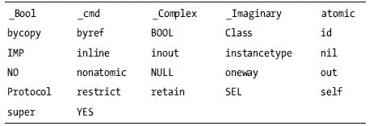

### 变量作用域

变量的可见性和可访问性取决于其作用域。变量可以存在于语句块、函数、方法、对象实例（或相关对象）内、单个文件内，或跨多个文件。ANSI C 定义了四种作用域：

*   **块**：在语句块内声明的变量具有块作用域。在块内声明的变量仅在该块内可见和可访问。
*   **文件**：具有文件作用域的变量仅对声明该变量的文件内的代码可见和可访问。
*   **函数**：在函数/方法内声明的变量具有函数作用域。这些变量仅在相关的函数/方法内可见和可访问。
*   **函数原型**：在函数/方法原型的参数列表中声明的变量具有函数原型作用域。这些变量在相关的函数/方法内可见和可访问。

Objective-C 增加了一组访问修饰符指令，使您能够对实例变量提供细粒度的访问控制。

### 访问修饰符

Objective-C 定义了多个编译器指令来控制实例变量的作用域；即变量在整个程序中的可见性。

*   `@private`：该实例变量仅能在声明它的类以及该类类型的其他实例内部访问。
*   `@protected`：该实例变量可在声明它的类及其任何子类的实例方法中访问。如果未为实例变量指定保护级别，则这是默认作用域。
*   `@public`：该实例变量可以在任何地方访问。
*   `@package`：该实例变量可以在任何其他类实例或函数中访问，但在包外部，它被视为私有的。此作用域对于库或框架类可能很有用。

这些指令被称为*访问修饰符*，并用于在实例变量声明块内声明的实例变量上。代码清单 A-1 的类实例变量声明声明了一个类型为 `int`、可在任何地方访问的 `counter` 变量，一个类型为 `float`、可在声明它的类及其任何子类中访问的 `temperature` 变量，以及一个类型为 `NSString*`、仅在声明它的类内可访问的 `description` 变量。

**代码清单 A-1. 带访问修饰符的实例变量声明**

```
{
  @public int counter;
  @protected float temperature;
  @private NSString *description;
}
```

### 数据类型


由于 Objective-C 是 C 编程语言的严格超集，它支持所有标准的 ANSI C 数据类型和类型限定符。Objective-C 还定义了许多特定语言的数据类型（`BOOL`类型、类实例类型、`id`类型、类定义类型、块类型）。这些内容将在以下段落中讨论。

## `BOOL`类型

`BOOL`是一种 Objective-C 类型，用于保存布尔值，该值只能包含两个可能的值：`true`或`false`。对于 Objective-C 的`BOOL`类型，这些值被定义为`YES`和`NO`，而不是`true`（1）或`false`（0）。分配给`BOOL`的存储空间大小为 1 字节。Objective-C 也支持 C99 类型`_Bool`和`bool`，尽管`BOOL`是在 Objective-C 程序中最常用的布尔类型。

## 类实例类型

类实例类型表示对象、类和超类。Objective-C 运行时具有几个类实例类型，其中最常用的是`id`类型。

### `id`类型

`id`类型是所有 Objective-C 对象指针的最终超类型，可用于保存对任何 Objective-C 对象的引用，无论其类型如何。以下语句声明了一个名为`myObject`的`id`类型变量。

```
id myObject;
```

为此变量实例化的对象可以是任何类型。

在运行时，Objective-C 的`id`类型等价于一个 C 结构体，该结构体定义为指向`objc_object`的指针（如列表 A-2 所示）。

*列表 A-2.* `id`类型定义

```
typedef struct objc_object
{
  Class isa;
} *id;
```

换句话说，`id`只是一个指向标识符为`objc_object`的 C 结构体的指针。

### `instancetype`关键字

`instancetype`关键字是一个上下文关键字，可以用作方法的结果类型；它表示该方法返回一个*相关结果类型*。在第 3 章中，您了解到当一个方法返回一个相关结果类型时，它返回一个对象，该对象是接收类类型的实例。对于以下类型的方法，可以推断出相关结果类型：

-   以`alloc`或`new`开头的类方法。
-   以`autorelease`、`init`、`retain`或`self`开头的实例方法。

以下语句使用`new`关键字创建一个`OrderItem`对象。

```
OrderItem *item = [OrderItem new];
```

尽管`NSObject`的`new`方法将`id`指定为返回类型，但编译器会根据名为`item`的接收类实例的类型，推断出正确的结果类型（在本例中为`OrderItem *`）。

`instancetype`关键字可用于显式指示方法返回相关结果类型。列表 A-3 提供了一个名为`OrderItem`的类的示例，其接口声明了一个返回相关结果类型的方法。

*列表 A-3.* 使用`instancetype`关键字返回相关结果类型

```
@interface OrderItem : NSObject
+ (instancetype)orderItemWithDescription:(NSString *)description price:(float)cost;
@end
```

## 类定义类型

类定义类型定义了 Objective-C 运行时数据结构。它们包括`SEL`、`IMP`、`Class`和`objc_object`类型。

### `SEL`类型

`SEL`类型表示方法选择器，这是一种在 Objective-C 运行时中表示方法名称的类型。可以使用`@selector`编译器指令为名为`helloWorld`的方法选择器创建一个`SEL`类型的变量。

```
SEL myHelloMethod = @selector(helloWorld);
```

此选择器可用于在对象上调用`helloWorld`方法。

### `IMP`类型

`IMP`类型表示一个方法指针，指向实现方法的函数在内存中的起始地址。`IMP`定义如下：

```
typedef id (*IMP)(id, SEL, ...);
```

正如前面的类型定义所示，由`IMP`指向的函数接受一个`id`、一个方法选择器（`SEL`）、可变参数（由可变参数`...`符号表示）作为其参数，并返回一个`id`。

### `Class`类型

`Class`类型表示一个 Objective-C 类实例（即一个对象），并由各种数据元素组成。`Class`数据类型定义如下：

```
typedef struct objc_class *Class;
```

正如前面的类型定义所示，`Class`数据类型是指向一个标识符为`objc_class`的`opaque`类型的指针。`objc_class`结构体的成员只能通过为其专门定义的函数访问，特别是使用 Objective-C 运行时库函数。

### `objc_object`类型

Objective-C 对象有一个对应的运行时数据类型。当编译器解析对象的 Objective-C 代码时，它会生成创建运行时对象类型`objc_object`的代码。此数据类型在列表 A-4 中声明，是一个标识符为`objc_object`的 C 结构体类型。

*列表 A-4.* `objc_object`数据类型

```
struct objc_object
{
  Class isa;
  /* ...variable length data containing instance variable values...  */
};
```

`objc_object`类型包含一个名为`isa`的`Class`类型变量；换句话说，是一个指向`objc_class`类型变量的指针。

## 块类型

块提供了一种创建一组语句（即一个代码块）并将这些语句赋值给一个变量的方法，然后可以调用该变量。它们类似于标准的 C 函数，但除了可执行代码外，它们还可能包含指向栈或堆内存的变量绑定。块是一个 Objective-C 对象（块类型），并且像所有 Objective-C 对象一样，通过指针访问。与 Objective-C 对象一样，`id`类型可用于引用块对象。以下语句声明了一个名为`incrementSum`的`Block`变量，该变量有一个`int`类型的参数并且不返回任何值。

```
void (^incrementSum)(int);
```

`__block`存储修饰符可用于创建可变的块变量。它应用于`Block`字面量外部但在同一词法作用域内的变量，并允许在`Block`内修改此变量。此存储修饰符不能与局部存储修饰符`auto`、`register`和`static`同时应用于同一变量。列表 A-5 说明了`__block`变量的使用。

*列表 A-5.* `__block`存储的正确使用

```
__block int totalSum = 0;
void (^incrementSum)(int) = ^(int amount){
  totalSum += amount;
  NSLog(@"Current total = %d", totalSum);
};
incrementSum(5);
```

当执行列表 A-5 中显示的代码片段时，它输出以下内容：

```
Current total = 5
```

因此，块变量`totalSum`被初始化为值 0，然后在调用块字面量时被修改。

## 枚举类型

Objective-C 支持标准的 C 枚举类型，还提供了为枚举指定类型的支持。枚举类型由一组命名值（也称为*枚举器*）组成，这些值使用`enum`关键字定义。声明为枚举的变量可以被赋值为任何枚举器值。列表 A-6 定义了一个枚举，其中包含一组值：`Red`、`Green`和`Blue`，用于名为`color`的变量。

*列表 A-6.* 示例`enum`类型定义

```
enum
{
  Red,
  Green,
  Blue
} color;
```


枚举器的默认类型是`int`。Objective-C 提供了对显式指定枚举类型（也称为*具有固定底层类型的枚举*）的支持。枚举支持的类型包括任何有符号或无符号整数类型（`char`、`short`、`int`和`long`）。类型应在`enum`关键字后指定，并以冒号为前缀。列表 A-7 定义了一个枚举，其值为`Red`、`Green`和`Blue`，类型为`unsigned char`，用于名为`color`的变量。

*列表 A-7.*  具有固定底层类型的枚举示例

```
enum : unsigned char
{
  Red,
  Green,
  Blue
} color;
```

通常，使用类型定义来声明枚举类型。列表 A-8 为一个枚举声明了类型定义，该枚举具有`Red`、`Green`和`Blue`（其类型为`unsigned char`）的值，然后声明了一个该类型的变量`color`。

*列表 A-8.*  具有固定底层类型的 typedef 枚举示例

```
typedef enum : unsigned char
{
  Red,
  Green,
  Blue
} ColorType;
ColorType color;
```

在 Objective-C 中定义枚举类型的首选方法是使用`NS_ENUM`宏。这提供了一种便捷的机制，可以在单个语句中声明枚举值的底层类型并定义新类型的名称。列表 A-9 演示了使用`NS_ENUM`宏来定义在列表 A-8 中先前定义的枚举类型。

*列表 A-9.*  使用 NS_ENUM 宏定义的枚举示例

```
typedef NS_ENUM(unsigned char, ColorType)
{
  Red,
  Green,
  Blue
};
```

列表 A-9 表明宏的第一个参数是底层类型，而第二个参数是新类型的名称。值像往常一样存储在块内。

## 运算符

Objective-C 支持 ANSI C 定义的运算符，具体来说包括：

*   赋值运算符
*   算术运算符
*   复合赋值运算符
*   自增和自减运算符
*   逻辑比较运算符
*   逻辑布尔运算符
*   位运算符
*   复合位运算符
*   三元运算符
*   类型转换运算符
*   `sizeof`运算符
*   取地址（`&`）运算符
*   间接引用（`*`）运算符
*   逗号运算符

算术转换规则以及运算符优先级和结合性的规则与 ANSI C 的规定相同。

脱字符（`^`）运算符用于块对象，具体用于声明块类型的对象和定义块字面量。

## 语句

Objective-C 支持 ANSI C 定义的条件、循环和跳转语句，具体来说包括：

*   条件语句（`if`、`if else`、`if else if`、`switch`）
*   循环语句（`for`、`while`、`do while`）
*   跳转语句（`return`、`goto`、`break`、`continue`）

## 类元素

一个 Objective-C 类由多个结构元素组成，这些元素逻辑上组织成不同的部分。本节提供了这些基本类元素的概述。

### 实例变量

实例变量，有时也称为 *ivars*，是为类声明的变量，它们在整个类实例的生命周期内存在并保持其值。实例变量使用的内存在对象首次创建时分配，并在对象释放时回收。实例变量具有与对象对应的隐式作用域和命名空间。实例变量可以在类接口、实现或扩展的实例变量声明块内声明。实例变量（ivar）声明块必须紧邻对应的接口、实现或类扩展声明之下。列表 A-10 展示了`Hello`类的示例 ivar 声明块。

*列表 A-10.*  Hello 类实现实例变量声明块

```
@implementation Hello
{
  // 在此处声明实例变量。
  ...
}
...
@end
```

推荐的做法是在类实现（而非公开的类接口）中声明实例变量。对于仅在对应类实现文件中使用的变量，实例变量通常声明在扩展中。

### 实例变量所有权限定符

Objective-C 所有权限定符是一种类型限定符，仅适用于可保留的对象指针类型。在变量声明中，所有权限定符放置在对象指针类型之前，以指定变量的所有权规则。表 A-2 列出了四种所有权限定符。

**表 A-2.** 对象指针变量所有权限定符

| 限定符 | 描述 |
| --- | --- |
| `__autoreleasing` | 当变量被赋新值时，新值会被保留并自动释放，而先前的值会收到一条 release 消息。 |
| `__weak` | 变量使用简单赋值（即，输入值不会被复制或保留）。如果对象被释放，相应的变量值会被设置为`nil`。 |
| `__unsafe_unretained` | 变量使用简单赋值（即，输入值不会被复制或保留）。 |
| `__strong` | 当变量被赋新值时，新值会被保留，而先前的值会收到一条 release 消息。 |

默认的所有权限定符（如果没有提供）是`__strong`。以下语句声明了一个名为`hello`（类型为`Hello *`）的变量，其所有权限定符为`__weak`。

```
__weak Hello *hello;
```

### 属性

在 Objective-C 中，属性以访问器方法（即 *getter* 和 *setter*）的形式提供了一种便捷的机制，用于访问对象的共享状态。属性与实例变量的不同之处在于它不直接访问对象的内部状态。Objective-C 声明的属性使编译器能够根据您提供的规范自动生成这些方法。

属性使用`@property`关键字声明，后跟一组可选的属性（括在圆括号内）、属性类型及其名称。

```
@property (attributes) type propertyName;
```

属性声明属性用于指定与属性相关的存储语义和其他行为。表 A-3 提供了可用的属性列表。

**表 A-3.** 属性


| 属性 | 描述 | 备注 |
| --- | --- | --- |
| `readwrite` | 必需。 | 访问限定符。默认设置。 |
| `readonly` | 必需。 | 访问限定符。不可同时选择`readwrite`和`readonly`。 |
| `assign` | `setter`方法使用简单的赋值（即输入值不会被复制或保留）。 | 所有权限定符。用于手动保留-释放 (MRR) 内存管理。MRR 下的默认设置。 |
| `weak` | `setter`方法使用简单的赋值（即输入值不会被复制或保留）。如果属性实例被释放，其值会被设置为`nil`。 | 所有权限定符。用于 ARC 内存管理。 |
| `unsafe_unretained` | `setter`方法使用简单的赋值（即输入值不会被复制或保留）。 | 所有权限定符。用于 ARC 内存管理。 |
| `copy` | 在`setter`方法中，应调用`copy`方法进行赋值，并向旧值发送`release`消息。 | 所有权限定符。 |
| `retain` | 在`setter`方法中，旧值将被发送`release`消息，并且该属性在赋值时使用`retain`。 | 所有权限定符。类似于`strong`属性（用于手动保留-释放内存管理）。 |
| `strong` | 在`setter`方法中，旧值将被发送`release`消息，并且该属性在赋值时使用`retain`。 | 所有权限定符。用于 ARC 内存管理。ARC 下的默认设置。 |
| `getter=getterName` | 将`getter`方法命名为指定的`getterName`。 | |
| `setter=setterName` | 将`setter`方法命名为指定的`setterName`。 | |
| `nonatomic` | 指定此属性的存取方法不是`atomic`（默认值）。`nonatomic`属性设置具有更好的性能，但不能保证在多个线程访问时，属性 getter 或 setter 始终返回完整的值。 | |

属性定义在类的实现部分中执行。在大多数情况下，属性由一个实例变量支撑，因此属性定义包括为该属性定义`getter`和 setter 方法、声明一个实例变量，并在`getter`/`setter`方法中使用该变量。Objective-C 提供了三种定义属性的方法：显式定义、通过关键字合成或自动合成。

## 方法

Objective-C 同时支持实例方法和类方法。实例方法在类的实例（对象）上调用；因此，实例方法可以直接访问对象的实例变量。类方法在类上调用。方法可以在类接口、协议和/或类别中声明。这样声明的方法将在相应的类/类别实现中定义。

方法声明指定了方法类型、返回类型、方法名、参数以及相应的参数类型。*方法类型*标识符指定该方法是类方法还是实例方法。类方法用加号（`+`）声明，表示该方法具有类作用域，意味着它在类级别上操作，并且无法访问类的实例变量（除非它们作为参数传递给该方法）。实例方法用减号（`-`）声明，表示该方法具有对象作用域。它在实例级别上操作，并且可以直接访问对象及其父对象的实例变量（受实例变量的访问控制限制）。

方法名将参数作为其名称的一部分，并使用冒号。对于每个参数，其类型在括号中指定，后跟方法原型参数。参数名和类型用冒号分隔；例如，在以下方法声明中：

```
- (void)incrementSum:(int)value;
```

方法名是`incrementSum:`，它有一个类型为`int`、名为`value`的单一参数。多个参数需要多个名称-参数对；例如，方法声明：

```
- (int)addAddend1:(int)a1 addend2:(int)a2;
```

方法名是`addAddend1:addend2:`，它有两个类型为`int`、名为`a1`和`a2`的参数。

*返回类型*指示方法返回的变量类型（如果有的话）。返回类型在方法类型之后的括号内指定。如果方法不返回任何内容，则其返回类型声明为`void`。

以下语句为一个名为`hydrogenWithProtons:neutrons:`的类方法提供了一个示例声明，该方法有两个类型为`unsigned int`、名为`nProtons`和`nNeutrons`的参数。

```
+ (id) hydrogenWithProtons:(unsigned)nProtons neutrons:(unsigned)nNeutrons;
```

## 接口

类的接口指定了类的状态和行为；封装在其实例变量、属性和方法中。类接口声明以`@interface`指令和类名开头；以`@end`指令结尾。声明类接口的正式语法如列表 A-11 所示。

*列表 A-11.* 类接口语法

```
@interface ClassName : SuperclassName
{
  // 实例变量声明
}

// 属性和方法声明
@end
```

超类建立了一个公共接口和实现，专门的子类可以继承、修改和补充。大多数类继承自`NSObject`类，它是大多数 Foundation 框架类层次结构的根（即基）类，提供了 Objective-C 运行时的基本接口。

### 前置声明

`@class`指令用于在获取类的完整规范之前声明一个类（在类接口中）。这告诉编译器存在一个类（从而使其能够执行静态类型检查），而无需导入其对应的头文件。前置声明在解决文件之间的循环依赖时非常有用。

### 实现

类的实现通过实现其定义的属性及其方法，来定义类的行为。类实现声明以`@implementation`指令和类名开头；以`@end`指令结尾。声明类实现的正式语法如列表 A-12 所示。

*列表 A-12.* 类实现语法

```
@implementation ClassName
{
  // 实例变量声明
}

// 属性和方法定义
@end
```

在类实现中定义的方法必须直接映射到其对应的接口；例如，列表 A-13 描述了一个`Greeting`类接口及其对应的实现。

*列表 A-13.* Greeting 类接口与实现

```
#import <Foundation/Foundation.h>
@interface Greeting : NSObject

@property(readwrite) NSString *salutation;
- (void)hello:(NSString *)user;

@end

#import "Greeting.h"
@implementation Greeting
- (void)hello:(NSString *)user
{
  NSLog(@"%@, %@", self.salutation, user);
}
@end
```

### 协议

协议声明了任何类都可以实现的方法和属性。协议声明以`@protocol`指令开头，后跟协议名称。它以`@end`指令结尾。协议可以包含*必需*和*可选*方法；可选方法不要求协议的实现者必须实现这些方法。指令`@required`和`@optional`（后跟方法名）用于适当地标记方法。如果未指定任一关键字，则默认行为是`@required`。协议声明的语法如列表 A-14 所示。


*列表 A-14.* 协议声明语法

```
@protocol ProtocolName
// 属性声明
@required
// 方法声明
@optional
// 方法声明
@end
```

一个协议可以通过在括号内指定每个声明协议的名称来合并其他协议；这被称为*采纳*协议。使用逗号分隔多个协议（如*列表 A-15*所示）。

*列表 A-15.* 合并其他协议

```
@protocol ProtocolName<ProtocolName(s)>
// 方法声明
@end
```

一个接口可以使用类似的语法*采纳*其他协议（如*列表 A-16*所示）。

*列表 A-16.* 采纳协议的接口

```
@interface ClassName : Parent <ProtocolName(s)>
// 方法声明
@end
```

通常，一个类的接口及其对应的实现在物理上被组织成单独的文件；接口放在以`.h`为后缀的头文件中，而实现文件放在以`.m`为后缀的文件中。

## 类别（Category）

`Category`允许在不进行子类化的情况下向现有类添加新功能。`Category`中的方法成为类类型的一部分（在程序范围内），并被其所有子类继承。

一个`Category`接口声明以`@interface`关键字开头，后跟现有类的名称，以及括号中的`Category`名称，再后跟它采纳的协议（如果有）。它以`@end`关键字结束。在这些语句之间提供了方法声明。`Category`声明的语法如*列表 A-17*所示。

*列表 A-17.* 类别声明语法

```
@interface ClassName (CategoryName)
// 方法声明
@end
```

`Category`的实现类似于类实现，定义了在`Category`接口中声明的方法。其语法为：

```
@implementation ClassName (CategoryName)
// 方法声明
@end
```

## 类扩展（Class Extension）

一个类*扩展*可以被视为一个匿名（即未命名）的`Category`。在扩展中声明的方法*必须*在相应类的主`@implementation`块中实现。与`Category`相反，扩展可以声明实例变量和属性。类扩展的语法如*列表 A-18*所示。

*列表 A-18.* 扩展声明语法

```
@interface ClassName ()
{
  // 实例变量声明
}

// 属性声明
// 方法声明
@end
```

类扩展通常放在与类实现文件相同的文件中，用于组合和声明额外的、必需的私有方法（例如，不属于公开声明的`API`），仅供类内部使用。

## 附录 B

## Xcode 揭秘！

`Xcode`是一个用于开发、管理和维护在`Apple OS X`和`iOS`平台上运行的软件产品的综合性工具集。它包括一个`IDE`、编译器、调试器以及众多其他工具。`Xcode`还捆绑了`OS X`和`iOS`软件开发工具包（`SDK`），其中包括`Cocoa`和`Cocoa Touch`框架。您一直在使用`Xcode`来开发和运行本书中提供的示例应用程序，因此到现在为止，您已经熟悉了它的几个基本功能。在本附录中，您将“看看引擎盖下面”，深入探索`Xcode`的一些关键特性。具体来说，您将检查构成`Xcode`基础的关键概念，并通过这样做，更熟悉它的一些关键工具。

## 基本概念

从用户的角度来看，`Xcode`围绕几个基本概念组织：项目、工作区、目标、方案和动作。在接下来的几段中，您将了解更多关于这些概念以及它们在`Xcode`中如何使用的内容。

## 目标

一个*目标*是`Xcode`中的基本概念。它由用于构建软件产品的一组指令组成。一个目标由关于如何构建产品的规则和设置组成，并定义了一组*构建阶段*，即用于执行实际软件构建的步骤序列。

每个目标接收一组输入（源文件、资源、构建指令等）并生成一个产品作为其输出。产品可以是一个应用程序、软件库等等。一个`Xcode`项目可以有多个目标，每个目标都可以有自己的一套用于构建软件产品的指令。

一个目标可以依赖于其他目标（例如，*依赖目标*）。当选中目标被构建时，`Xcode`会自动构建其依赖目标。`Xcode`提供了管理目标（创建、更新、删除、管理它们之间的依赖关系）和管理目标文件（添加、删除、设置头文件角色）的功能。

## 构建阶段

构建阶段定义了构建产品的各个阶段。其中三个阶段——`Compile Sources`、`Link Binary With Libraries`和`Copy Bundle Resources`——是必需的，其他阶段可以根据需要添加。由于构建阶段定义了目标将如何被构建，更改构建阶段会改变构建过程。

## 构建设置

构建设置定义了在构建过程的各个阶段要做什么，从而提供了一种自定义该过程的方法。实际上有多个构建设置值列表，每个列表被称为一个*构建配置*。构建配置是一个命名的构建设置集合，用于以特定方式构建目标产品。它们提供了一种机制来构建同一目标的不同版本。您还可以创建构建配置文件。这些文件使您能够轻松地在目标、项目和开发人员之间共享一组构建设置定义。

## 构建配置

项目构建配置用于构建软件产品。它包含构建设置定义。这些可以嵌入在`Xcode`项目文件中，或存储在单独的配置设置文件中。当您创建一个项目时，`Xcode`提供两个默认的嵌入式构建配置：*Debug*和*Release*，它们主要在是否包含调试信息以及构建的优化程度上有所不同。*Debug*配置通常在整个开发过程中使用，而*Release*配置用于后期测试阶段，当您想在设备上检查性能时。*Debug*配置的一些构建设置如*列表 B-1*所示。

*列表 B-1.* 调试构建设置

```
ONLY_ACTIVE_ARCH=YES
CONFIGURATION_BUILD_DIR=build/Debug
COPY_PHASE_STRIP=NO
GCC_OPTIMIZATION_LEVEL=0
GCC_PREPROCESSOR_DEFINITIONS=DEBUG=1
```

配置设置文件是一个纯文本文件，每行指定一个构建设置定义。如果您要从现有的构建配置中创建一个新的构建配置，它必须仅基于您项目中的配置文件，而不能是外部文件。

## 构建规则

构建规则提供了在逐个目标的基础上处理文件的指令。`Xcode`提供了一组默认的构建规则，您可以添加自己的自定义构建规则，以对特定文件类型执行自定义处理。

构建规则规定了特定类型的文件如何处理，以及在构建阶段使用哪个工具来处理文件。每个构建规则由一个条件和一个动作组成。条件通常指定一个文件类型，决定一个源文件是否与关联的动作一起被处理。


Xcode 提供处理多种文件类型的默认构建规则，包括基于 C 的文件（如 Objective-C 文件）和汇编文件。你可以为每个目标添加自定义构建规则来处理其他类型的文件。这些规则在编辑器窗口的**构建规则**窗格中添加，如图 B-1 所示。构建规则按照它们在规则窗格中出现的顺序进行处理。

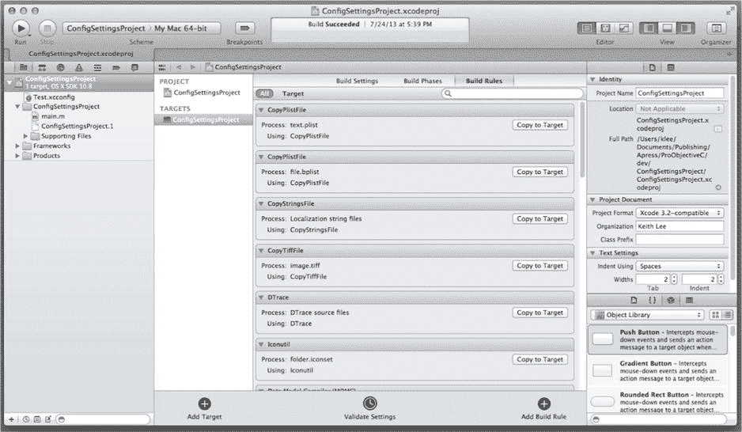

图 B-1. 构建规则编辑窗格

## 创建配置文件设置文件

在此示例中，你将使用 Xcode 为项目创建一个纯文本的构建设置配置文件。

1.  在 Xcode 中，通过从 Xcode 文件菜单中选择 **新建  项目…**来创建一个新项目。
2.  在**新项目助手**窗格中，创建一个命令行应用程序。
3.  在**项目选项**窗口中，为产品名称指定 **ConfigSettingsProject**，为项目类型选择 **Foundation**，并通过选中**使用自动引用计数**复选框来选择 ARC 内存管理。
4.  在文件系统中指定要创建项目的位置（如有必要，选择**新建文件夹**并输入文件夹的名称和位置），取消选中**源代码控制**复选框，然后单击**创建**按钮。
5.  现在你将创建配置文件设置文件。从 Xcode 文件菜单中选择**新建  文件…**，然后从 OS X 下的**其他**选项中选择**配置文件设置文件**模板（如图 B-2 所示）。

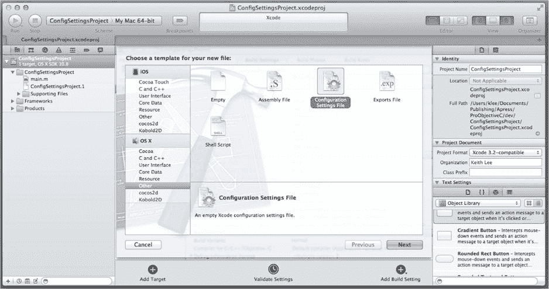

图 B-2. 选择配置文件设置文件

6.  将文件命名为 **Test**，选择 **ConfigSettingsProject** 文件夹作为文件位置，选择 **ConfigSettingsProject** 项目作为目标，然后单击**创建**按钮。
7.  这将创建一个名为 `Test.xconfig` 的空配置文件设置文件。现在更新此文件以支持测试期间的代码覆盖率。这可以通过将配置标志设置为**启用测试覆盖率**和**检测程序流程**来实现。

```
    GCC_GENERATE_TEST_COVERAGE_FILES=YES
    GCC_INSTRUMENT_PROGRAM_FLOW_ARCS=YES
```

8.  在 Xcode 中，选择并更新 `Test.xconfig` 文件，如图 B-3 所示。

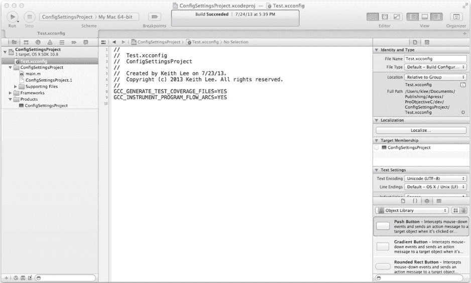

图 B-3. 编辑配置文件设置文件以支持代码覆盖率

现在你需要将此文件中的设置添加到项目的当前构建配置中。

1.  在 Xcode 项目导航器中，选择 **ConfigSettingsProject**，然后在项目编辑器中选择 **ConfigSettingsProject**，最后在编辑器窗口中选择**信息**标签。注意，**调试**配置（在编辑器窗口中的**配置**下）未设置任何配置。
2.  点击调试旁边的箭头以显示 ConfigSettingsProject，然后在配置文件下拉列表中选择 **Test**（如图 B-4 所示），以使用 `Test.xconfig` 文件中的值更新调试配置设置。

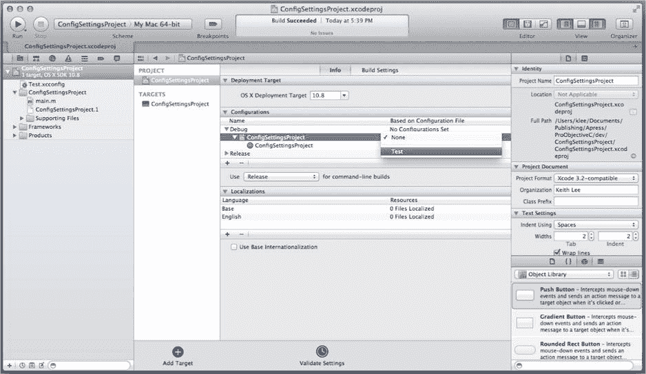

图 B-4. 将配置文件设置分配给构建配置

调试配置的设置现已更新。你可以通过查看更新后的测试覆盖率构建设置来进行检查（参见图 B-5）。

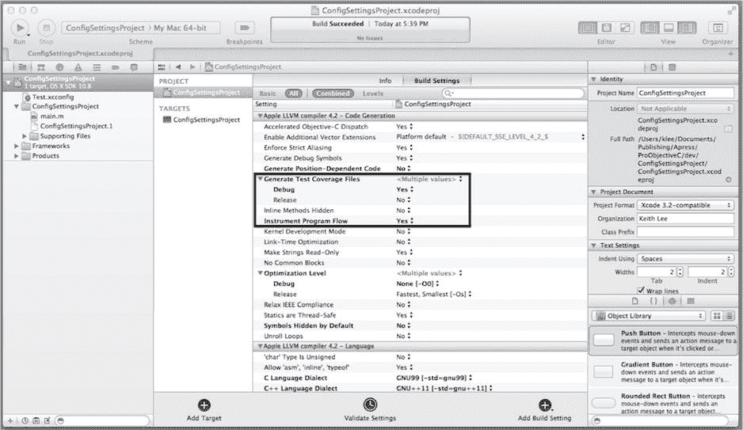

图 B-5. 更新后的测试覆盖率构建设置

Xcode 构建设置参考提供了 Xcode 可用的各种构建设置的全面参考。

## 项目

一个 Xcode 项目由一个或多个软件产品的工件以及用于构建这些产品并对其执行操作的机制组成。因此，它不仅包含了构建一个或多个软件产品的所有元素，还维护了这些元素之间的关系。每个 Xcode 项目由以下项目组成：

*   *项目内容*。项目内容包括源文件、资源、属性列表设置文件、预编译头文件、本地化文件等）。
*   *测试内容*。测试内容包括自动化测试源文件和任何所需的测试资源。
*   *Xcode 项目文件*。Xcode 项目文件实际上是一个子目录。它包含与其所属项目相关的各种文件和目录。项目文件工件提供了构建产品并对其执行选定操作所需的基础设施。Xcode 项目文件的命名遵循约定 `ProjectName.xcodeproj`，其中 `ProjectName` 是 Xcode 项目的名称。Xcode 项目文件中的文件（和目录）包含以下信息：
    *   对项目内容和测试内容（源代码、库和框架（内部和外部）、资源文件、故事板和 nib 文件）的引用。
    *   用于组织源文件的组文件夹。
    *   目标，每个目标包含对该项目构建的一个产品、构建该产品所需的源文件的引用以及可用于构建该产品的构建配置的引用。
    *   项目级别的构建配置。
    *   可执行环境。

例如，一个名为 `GreetingProject` 的 Xcode 项目将由以下文件和目录组成：

*   一个名为 `GreetingProject` 的子目录，其中存储了所有项目内容文件。
*   一个名为 `GreetingProjectTests` 的子目录，其中存储了所有测试内容文件。
*   一个名为 `GreetingProject.xcodeproj` 的 Xcode 项目文件，其中包含前面列出的 Xcode 项目文件信息。

Xcode 项目可以是独立的，也可以包含在工作区中。你将在本附录后面了解工作区。

## 可执行环境

可执行环境定义了用于从 Xcode 运行软件产品的配置。该配置指定了在运行/调试产品时要启动的可执行文件、要传递给可执行文件的命令行参数（如果有的话），以及在运行程序时要设置的任何环境变量。可执行环境设置通过项目*方案*进行编辑。你将在本附录稍后了解方案。

## 工作区

工作区是 Xcode 用于支持和组织多个项目的机制。工作区将项目和其他相关文档分组，从而促进多产品开发。你可以共享项目之间的代码，而无需手动复制和粘贴项目依赖项（例如，库及其对应的公共头文件），同时仍然可以单独管理每个项目。Xcode 工作区可以发现项目之间的隐式依赖关系，从而在构建期间自动解决这些依赖关系。此外，工作区还使你能够更轻松地创建和使用外部（即第三方）软件库。

实际上，每个工作区都是一个由元数据组成的 Xcode 文档，其中可以包含任意数量的 Xcode 项目，以及你想要包含的任何其他文件。除了组织每个 Xcode 项目中的所有文件之外，工作区还提供了所包含项目及其目标之间的隐式和显式关系。工作区文档包含指向所包含项目和其他文件的指针，但不包含其他数据。一个项目可以属于多个工作区。


只需将项目文件拖入工作区（或使用 Xcode 命令将文件添加到工作区），即可将项目包含在工作区中，该项目的资源便可被工作区内所有其他项目使用。不过，工作区中的项目仍独立管理，工作区内的软件产品构建会自动解析项目间的依赖关系（并在其内容更新时根据需要重新编译这些项目）。

默认情况下，工作区中的所有 Xcode 项目都在同一目录中构建，该目录称为*工作区构建目录*。每个工作区都有自己的构建目录。由于工作区中所有项目的所有文件都位于同一构建目录中，因此每个项目都能看到所有这些文件。因此，如果两个或多个项目使用相同的库，则无需将它们分别复制到每个项目文件夹中。

`Xcode` 会检查构建目录中的文件以发现隐式依赖关系。例如，如果工作区中的一个项目构建了一个库，而该库又与同一工作区中的另一个项目链接，则 `Xcode` 会在构建另一个项目之前自动构建该库，即使构建配置未明确声明此依赖关系。如有必要，您可以使用显式构建设置覆盖此类隐式依赖关系。对于显式依赖关系，您必须创建项目引用。

工作区中的每个项目继续保持其独立的身份。要处理某个项目而不受工作区中其他项目的影响（或影响其他项目），您可以不打开工作区而直接打开该项目，或者将该项目添加到另一个工作区。由于一个项目可以属于多个工作区，因此您可以以任意组合方式处理项目，而无需重新配置任何项目或工作区。

您可以使用工作区的默认构建目录，也可以自行指定。如果某个项目指定了构建目录，则构建该项目时其所处工作区的构建目录会覆盖该目录。

## 将现有项目添加到工作区

在 Xcode 中，执行以下步骤将现有项目添加到工作区：

1. 在项目导航器中，按住 Control 键点按列表中项目下方的空白区域。在出现的弹出式菜单中，选择**将文件添加到“<工作区名称>”…**，其中 *工作区名称* 是工作区的名称。
2. 导航到包含相应 Xcode 项目文件的文件夹（该文件以 `.xcodeproj` 结尾）。
3. 选中该项目文件，然后点按**添加**。

该项目现在已成为工作区的一部分，因此其内容可与工作区中的其他项目共享。

## 在工作区中使用静态库

现在，您将学习如何将静态库集成到工作区中。简要来说，您将执行的步骤如下：

1. 创建工作区。
2. 创建静态库。
3. 创建应用。

**注意**   以下示例程序是使用 Xcode 4.6.3 版开发的。本示例中记录的配置步骤（特别是用于共享静态库的步骤）需要 Xcode 4.5 或更高版本才能正常工作。

### 创建工作区

首先，您将创建一个用于库和应用的工作区。

1. 在 Xcode 中，从 Xcode 的“文件”菜单中选择**新建  工作区…** 来创建一个新工作区。
2. 将工作区保存为 **HelloSpace**，放在一个名为 `Hello` 的新文件夹中。如 图 B-6 所示，Xcode 窗口中会显示一个名为 `HelloSpace.xcworkspace` 的新工作区。

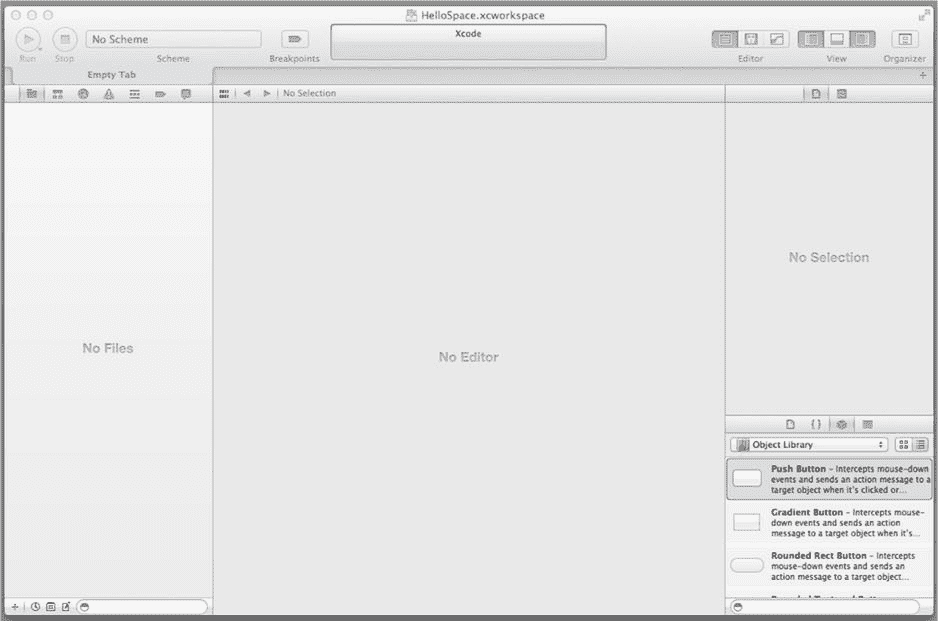

图 B-6. HelloSpace 工作区

如前所述，工作区会在 *Derived Data* 目录中构建其项目。此目录的位置必须在项目级别与 Xcode 偏好设置面板中的指定位置保持一致。


3. 在 Xcode 中，从 Xcode 菜单中选择 **偏好设置…** 打开偏好设置窗口。在偏好设置窗口中，选择 **位置** 标签页，然后从 **派生数据：** 下拉列表中选择 **默认**（如图 B-7 所示）。

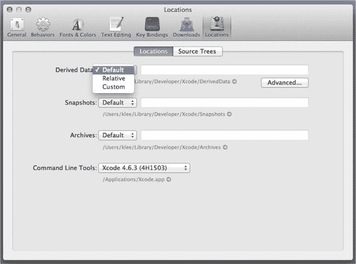

图 B-7 Xcode 偏好设置中的派生数据位置

好了，现在工作区已正确配置，接下来你将创建项目。

## 创建静态库

现在你将创建一个静态库。

1. 在 Xcode 中，通过从 Xcode 文件菜单中选择 **新建  项目…** 来创建一个新项目。
2. 在 **新建项目助手** 面板中，首先选择 **框架与库**（在 Mac OS X 部分下），然后选择右上方面板中的 **Cocoa 库** 图标来创建一个 Cocoa 库（如图 B-8 所示）。

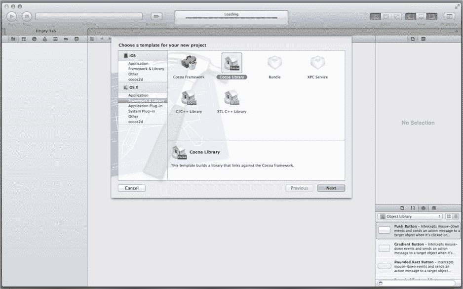

图 B-8 创建 Cocoa 库

3. 接着会显示 **项目选项** 窗口。将产品名称指定为 **HelloLib**，类型下拉列表指定为 **静态**（以创建静态库），并选中复选框以指定项目将使用 **自动引用计数** 进行内存管理。不要选中“包含单元测试”复选框，其余选项接受默认设置。
4. 现在点击 **下一步** 以打开 **项目选项** 窗口。在此窗口中，为项目位置指定 **Hello**，在 **添加到：** 下拉列表中选择 **HelloSpace**（将此库添加到 HelloSpace 工作区），然后点击 **创建** 按钮。
5. 在 Xcode 的项目导航器中，注意到创建了一个空的 `HelloLib` 类。选择 `HelloLib.h` 并更新类接口，如 列表 B-2 所示。

*列表 B-2.*  HelloLib 类接口

```
    #import <Foundation/Foundation.h>

@interface HelloLib : NSObject

- (NSString *) greeting:(NSString *)salutation;

@end
```

6. 该接口声明了一个名为 `greeting:` 的单一方法，该方法接受一个 `NSString` 对象作为其参数。现在选择 `HelloLib.m` 并更新类实现，如 列表 B-3 所示。

*列表 B-3.*  HelloLib 类实现

```
    #import "HelloLib.h"

@implementation HelloLib

- (NSString *) greeting:(NSString *)salutation
    {
      return [NSString stringWithFormat:@"%@, World!", salutation];
    }

@end
```

该方法返回一个包含输入参数的问候语。这样就完成了静态库的实现。现在你需要使该头文件对库的用户公开可用。

1. 在工作区窗口的项目编辑器面板中（在 **目标** 下），选择 **HelloLib** 目标，然后选择 **构建阶段** 标签页。
2. 删除 **复制头文件** 阶段（如果存在），然后使用 **添加构建阶段** 图标添加 **复制文件** 构建阶段（如图 B-9 所示）。

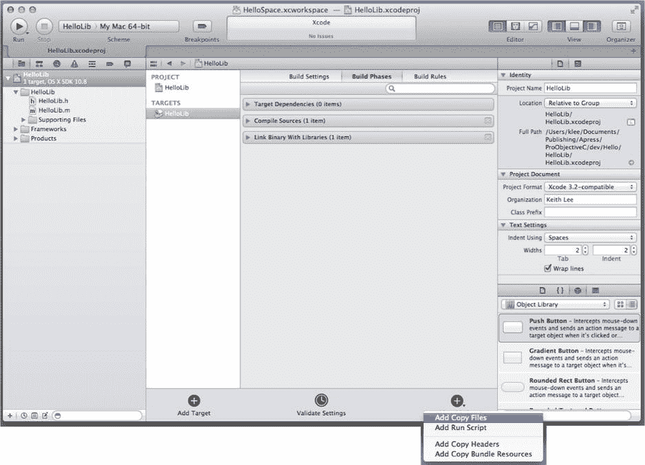

图 B-9 添加“复制文件”构建阶段

3. 现在点击旁边的三角形以展开 **复制文件** 阶段。你会在窗口底部看到一个用于添加文件的位置（标有 **在此处添加文件**）。从项目导航器中，将 `HelloLib.h` 头文件的一个副本拖入此区域并释放。这将使该头文件对客户端可用。
4. 在“复制文件”区域，将 **子路径** 设置为 `include/${PRODUCT_NAME}`，并在“目标”下拉列表中选择 **产品目录**。此时工作区窗口应如图 B-10 所示。

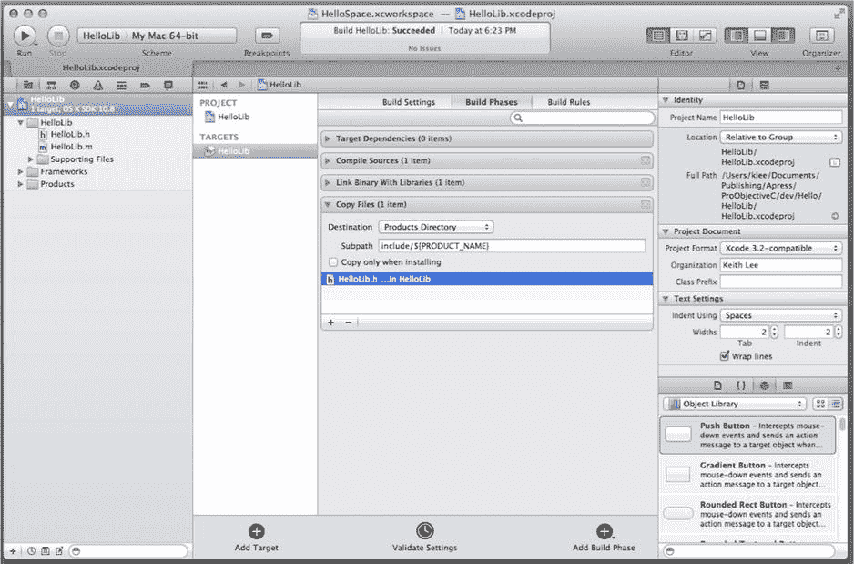

图 B-10 更新“复制文件”构建阶段

**注意**   子路径设置会将文件复制到工作区构建产品目录内的 `include` 文件夹下、以库名命名的文件夹（例如 `HelloLib`）中。此设置使你能够按库名组织不同库的头文件。构建产品目录内的 `include` 文件夹位于应用程序的默认头文件搜索路径中。

5. 最后，你应该共享该库，从而使其可供使用该工作区的任何项目使用。在 Xcode 中，从 Xcode 产品菜单中选择 **方案  管理方案…**。将显示“管理方案”对话框。然后在此对话框中找到 **HelloLib** 方案，并点击 **共享** 复选框。
6. 现在选择 **构建设置** 标签页。使用搜索工具找到 **跳过安装** 设置，并将其设置为 **是**；这可以防止 Xcode 在归档使用此库的项目时创建多应用程序捆绑包。此设置必须同时对 `HelloLib` 项目和 `HelloLib` 目标进行。

完成这些步骤后，你的静态库就配置好了。现在让我们来创建应用程序。

## 创建应用程序

现在你将创建使用该静态库的应用程序。

1. 在 Xcode 中，通过从 Xcode 文件菜单中选择 **新建  项目…** 来创建一个新项目。
2. 在 **新建项目助手** 面板中，选择 **命令行工具** 图标（来自 OS X 模板组下的 **应用程序** 选择）来创建一个命令行应用程序。
3. 在 **项目选项** 窗口中，将产品名称指定为 **HelloApp**，为项目类型选择 **Foundation**，并通过选中 **使用自动引用计数** 复选框选择 ARC 内存管理。在文件系统中指定你要创建项目的位置（如有必要，选择 **新建文件夹** 并输入文件夹的名称和位置），并取消选中 **源代码控制** 复选框。
4. 最后，在 **添加到：** 和 **群组：** 下拉列表中选择 **HelloSpace**（将此库添加到 HelloSpace 工作区），然后点击 **创建** 按钮。

你要做的第一件事是将应用程序与静态库链接。

1. 在项目导航器中选择 **HelloApp** 项目，然后在项目编辑器中选择 **HelloApp** 目标。
2. 选择 **构建阶段** 标签页，展开 **将二进制文件与库链接** 阶段，并点击加号 (+) 按钮。
3. 在窗口中，选择 `libHelloLib.a`，然后点击 **添加** 以添加该库。

接下来，你将更新构建设置以链接该库：

1. 选择 **构建设置** 标签页。
2. 找到 **其他链接器标志** 构建设置（使用搜索工具），如果不存在，则将标志

`-ObjC` 添加到此设置的值中（如图 B-11 所示）。

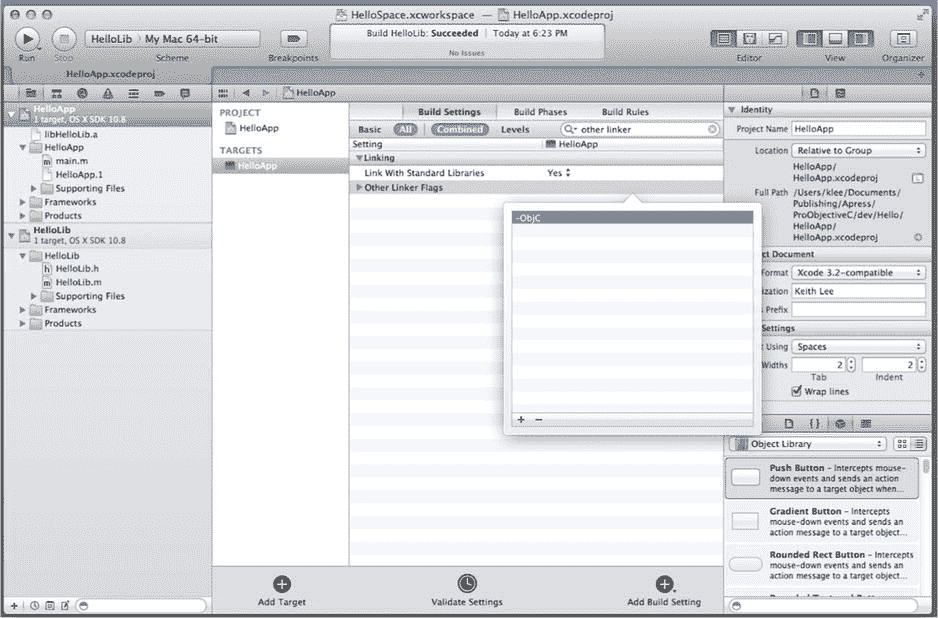

图 B-11 更新“复制文件”构建阶段

`-ObjC` 标志会告诉链接器将静态库中的所有 Objective-C 类和类别链接到你的应用程序中，即使链接器无法判断它们是否被使用（例如，动态添加的类别和/或类）。

现在你需要导入静态库的头文件。

工作区中所有项目的构建产品都位于工作区的构建目录中。之前，你将 `HelloLib.h` 头文件复制到了产品目录的 `include` 目录中。此目录会自动包含在工作区中所有项目的搜索路径中。由于你在子路径中指定了一个以 `PRODUCT_NAME` 构建设置命名的子目录（例如 `include/${PRODUCT_NAME}`），导入语句应包含该目录，例如：

```
#import "HelloLib/HelloLib.h"
```


### 向应用添加代码

现在，你将向应用添加代码，以演示静态库的使用。在项目导航器中，选择 HelloApp 的 `main.m` 文件，并按照列表 B-4 所示进行更新。

*列表 B-4.* HelloApp `main()` 函数

```
#import <Foundation/Foundation.h>
#import "HelloLib/HelloLib.h"

int main(int argc, const char * argv[])
{
  @autoreleasepool
  {
    HelloLib *hello = [HelloLib new];
    NSLog(@"%@", [hello greeting:@"Hello"]);
  }
  return 0;
}
```

通过以下语句导入 HelloLib 静态库的头文件：

```
#import "HelloLib/HelloLib.h"
```

`main()` 函数创建了一个 `HelloLib` 实例，并调用了它的 `greeting:` 方法。当你编译并运行程序时，应该会在如图 B-12 所示的输出面板中看到消息。

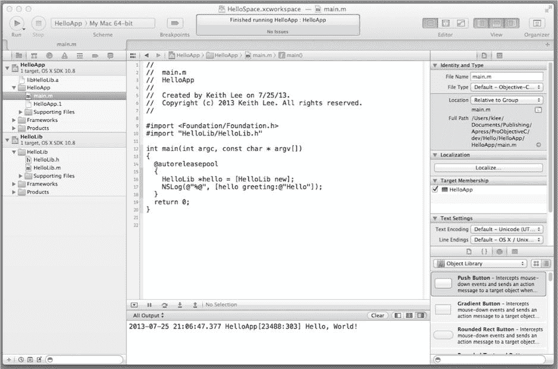

图 B-12. HelloApp 程序输出

很好。这演示了如何使用 Xcode 工作区将静态库集成到你的项目中。同样的技术也适用于其他可重用软件库（动态库、框架、包等）。

## 方案

Xcode 方案将一个或多个目标与构建配置和环境执行配置组合在一起，具体取决于你构建产品的目的（即操作）。

你可以根据需要创建任意数量的方案，但一次只能有一个方案处于活动状态。你可以指定方案是存储在项目中（此时它包含在包含该项目的每个工作区中），还是存储在工作区中（此时它仅在该工作区中可用）。当你选择一个活动方案时，你还需要选择一个运行目标（即构建产品所用硬件的架构）。

要编辑方案，请从 Xcode 工作区窗口的方案工具栏菜单中选择 **Edit Scheme…**（编辑方案…），如图 B-13 所示。

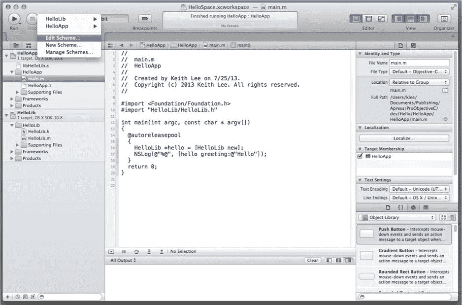

图 B-13. 使用方案工具栏菜单选择“编辑方案”

方案弹出对话框允许你指定许多影响产品构建和产品上执行操作的设置。如图 B-14 所示，左侧列列出了与产品菜单中命令对应的操作：运行、测试、分析、性能分析和归档。构建选项允许你为每个操作选择要构建的目标。

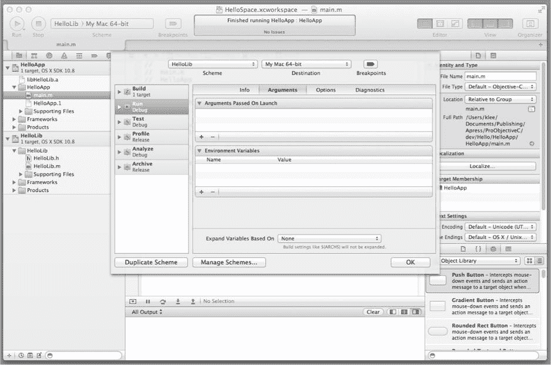

图 B-14. 方案弹出对话框

如图 B-14 所示，方案对话框顶部的选项卡会根据产品上执行的操作而变化。它们使你能够适当地配置构建和执行环境。

## 操作

在 Xcode 中，操作会构建目标（从而创建产品），并相应地处理产品。Xcode 定义了构建、运行、测试、性能分析、分析和归档操作。

- **构建操作**会构建一个或多个目标，创建相关的产品。所有其他操作都会自动执行此步骤。
- **运行操作**会构建产品，然后在调试器中运行它。这是默认操作。
- **测试操作**会构建并运行项目的单元测试功能。如果项目不包含单元测试目标，则此操作不执行任何操作。
- **性能分析操作**会构建产品，启动选定的 Instruments 性能分析和测试应用程序，然后将产品加载到其中。Instruments 可用于对产品执行各种性能分析和测试活动，包括性能分析、压力测试、内存使用情况、泄漏检测和一般故障排除。
- **分析操作**会构建产品，然后对其运行静态代码分析器。
- 最后，**归档操作**会构建并打包产品，使其准备好分发，并将其添加到 Xcode Organizer 的归档列表中。

## 总结

在本附录中，你了解了 Xcode 的一些关键功能，以及如何使用它们使自己成为更高效、更有生产力的程序员。你现在已经很好地理解了 Xcode 项目、工作区、目标、方案和操作，以及如何使用它们。Apple 提供了一套完整的参考文档，对于更复杂的软件开发场景和项目配置非常有帮助。以下列出了其中一些文档。

- Xcode 用户指南
- Xcode 发行说明
- Xcode 构建设置参考
- Instruments 用户指南
- Instruments 用户参考
- 应用分发指南

# 附录 C: 使用 LLDB

软件开发可能是一个复杂且（有时）容易出错的过程。正如你在阅读本书的过程中所学到的，Objective-C 平台提供了大量功能，使你成为更高效、更有生产力的程序员。然而，归根结底，你编写的程序会有错误；那么问题是你如何减轻它们？具体来说，你如何检测错误、验证程序正确性以及分析程序控制流？或者也许更重要的问题是，你调试代码的过程是什么？例如，你是通过在源代码中插入调试语句来分析程序状态吗？Xcode 调试器是检测软件中运行时和逻辑错误的关键工具。此外，它还提供了各种功能，也可以让你更擅长调试。

在本附录中，你将学习如何使用 LLVM 调试器 (LLDB) 在 Xcode 中调试程序。我们将首先简要回顾 LLVM 编译器基础设施，LLDB 利用了几个其组件。接下来，你将探索 LLDB 的设计并回顾其关键组件。然后，你将学习 Xcode 如何支持使用 LLDB 进行调试，最后使用 LLDB 调试几个示例程序，从而熟悉其一些关键功能。在本附录结束时，你应该相信 LLDB 的强大功能和能力，并且在你使用 Xcode 和 Objective-C 编程时，都会使用它。

## LLVM 概述

LLVM（最初是 *Low Level Virtual Machine* 的缩写）被设想为一个用于任意语言编写的程序的编译器框架。目前，LLVM 项目包含一组模块化、可重用的组件（库、工具集、运行时）用于程序分析和编译（如图 C-1 所示）。

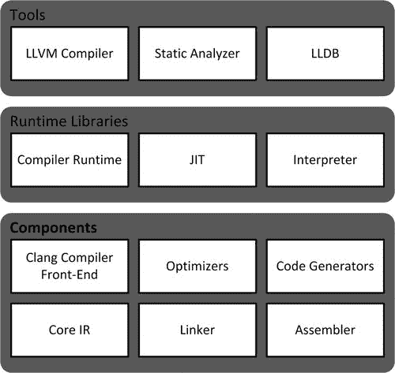

图 C-1. LLVM 项目组件

这些组件可以用作基础设施来实现各种功能，例如编译器、优化器和调试器。以下是 LLVM 项目下几个组件的简要定义：


好的，作为一名高级文档工程师和翻译员，我将严格遵循您提供的注意事项和示例格式，将给定的英文文本翻译成中文。


*   `Clang 编译器`：Clang 是一种用于 C、Objective-C 和 C++ 编程语言的现代编译器。它负责对输入代码进行解析、验证和错误诊断，然后将解析后的代码转换为 LLVM 中间表示 (IR)。与 LLVM 项目一样，Clang 本身也被划分为模块化的、可重用的库，这些库公开了公共 API。
*   `优化器`：LLVM 优化器执行代码优化，遍历部分代码以收集信息或执行转换。其特性包括编译时优化、链接时优化以及跨语言边界的优化。
*   `代码生成器`：LLVM 与目标无关的代码生成器是一个框架，提供了一套可重用的组件，用于将 LLVM 内部表示转换为特定目标的机器码——无论是汇编形式（适用于静态编译器）还是二进制机器码形式（适用于 JIT 编译器）。
*   `反汇编器`：反汇编器接收一个 LLVM 位码文件，并将其转换为人类可读的 LLVM 汇编语言。
*   `JIT`：LLVM 即时 (JIT) 编译器在运行时将 LLVM IR 代码转换为机器码。它还会基于动态信息执行运行时优化。

如图 图 C-1 所示，使用 LLVM 项目组件构建的一些工具包括 LLVM 编译器（Xcode 的标准编译器）、静态分析器（也用于 Xcode）以及 LLDB 调试器。Xcode 与 LLVM 组件和工具的集成，除了 Objective-C 源代码编译之外，还提供了许多好处。这些好处包括：在您键入代码时实时通知警告和错误、针对编码错误的建议修正、改进的代码补全、源代码静态分析，以及对使用 Xcode 默认调试器 LLDB 进行程序调试的全面支持。

## LLDB

LLDB 是一种用于 C、C++ 和 Objective-C 编程语言的现代、高性能调试器。它被构建为一组可重用的组件，这些组件利用了 LLVM 项目（Clang 编译器、JIT、反汇编器等）的现有组件和库。LLDB 提供最新的 C、C++ 和 Objective-C 语言支持，支持可声明局部变量和类型的表达式、表达式的即时编译以提高性能，以及一个公共 API，使得 LLDB 除了调试之外，还可用于其他目的（如反汇编、对象和符号文件内省等）。整个 LLDB API 也可以通过脚本桥接接口以 Python 函数的形式提供。这意味着 LLDB API 可以直接从 Python 中使用，或者，也可以在 LLDB 命令行工具内部使用 Python。LLDB 可以通过其命令行工具独立运行，也可以直接在 Xcode 内运行。

## 设计

LLDB 采用面向对象的设计实践开发，包括数据封装（无全局变量）和基于插件的架构，以促进模块化和可扩展性。接下来的几段将概述组成 LLDB 的各个库，并更详细地审视其一些重要的设计元素。

### 库

LLDB 被设计为一组逻辑分组的库，如下所示：

*   `API`：LLDB 的公共接口，目前用 C++ 编写。此 API 使得 LLDB 能被其他程序重用。它也被 LLDB 命令行工具所使用。
*   `Breakpoint`：实现调试断点的类集合。LLDB 支持行断点、符号断点和异常断点。每当抛出或捕获异常时，都会命中异常断点。当遇到符号名称（例如，方法调用或函数调用）时，符号断点会导致程序执行暂停。
*   `Commands`：实现 LLDB 命令行工具文本命令功能的类集合。
*   `Core`：实现 LLDB 所需基本功能的类。
*   `Data formatters`：为 LLDB 实现数据格式化器的类集合。这些用于定义调试变量的自定义显示选项。
*   `Expressions`：这些类用于执行表达式解析。它们可以使用 Clang 编译器前端来评估从 DWARF 表达式到编程语言（例如，Objective-C）表达式。DWARF 是一种通用调试文件格式，用于支持源代码级调试。DWARF 表达式描述了在调试程序期间如何计算值或如何命名位置。表达式类支持多种特性，包括多行表达式、局部变量支持、流程控制和持久的表达式全局变量。
*   `Host`：一组提供对运行 LLDB 的主机（系统函数等）进行抽象的类。
*   `Interpreter`：负责作为每个命令对象所需基类的类集合。它负责跟踪和运行命令行命令。
*   `Symbol`：提供解析目标文件和调试符号所需一切的类。此部分包含编译单元（一个源文件的代码和调试信息）、函数、函数内的词法块、内联函数、类型、声明位置和变量所需的所有类。
*   `Target`：一组封装调试目标数据（目标、进程、线程、堆栈帧等）的类。
*   `Utility`：LLDB 工具类（字符串数据提取器等）。

### 表达式解析

调试器最重要的特性之一是能够显示目标程序中对象的值，这也称为 *表达式求值*。因此，调试器的表达式求值能力是其设计和实现的关键要素。大多数调试器实现自定义的表达式解析器，因此也会创建解析器使用的自定义类型表示。结果，对这些类型表示的更改（例如，由于编程语言的更改）需要更改解析器。此外，表达式解析器追求编译器级别的准确性。这种准确度极难实现（如果不是不可能的话），并且也使调试器难以跟上语言和/或编译器的变更。这些因素及其他因素使得编写和维护调试器变得困难。

LLDB 通过利用 LLVM Clang 编译器前端来缓解这些问题；具体来说，它将调试信息转换为 Clang 数据类型。这使得 LLDB 能够使用 Clang 来解析命令表达式，从而直接支持最新的 C、C++、Objective-C 和 Objective-C++ 语言特性和运行时。调试器错误报告也得到了改进，因为其与编译器提供的完全相同。LLDB 还利用编译器实现其他功能，包括在表达式内进行函数调用以及反汇编指令。

### 插件架构


### LLDB 架构

LLDB 采用基于插件的架构设计，以实现可移植性和可扩展性。这使得它能够轻松地为支持的功能利用不同的实现，并在不影响现有代码库的情况下集成新的插件。插件架构目前用于对象文件解析器（当前支持 Mach-O 和 ELF 文件）、对象容器解析器（Mach-O 和 BSD 归档）、调试符号文件解析器（DWARF 和 Mach-O 符号表）、符号供应商、反汇编（LLVM 和 ARM/Thumb）以及用于主机和目标特定功能的通用调试器插件。

### 多线程调试

许多程序都包含多个线程，即使在最佳情况下，调试多线程应用程序也可能很困难。LLDB 旨在支持多线程调试。它会为每个线程显示诊断信息，并提供一组用于操作应用程序中一个或多个线程的命令。

## LLDB 命令

LLDB 包含一套全面的调试命令，可用于 Xcode 和命令行工具。以下是几个常用的 LLDB 调试器命令：

*   `apropos`：查找与特定单词或主题相关的调试器命令列表。
*   `breakpoint`：一组用于对断点执行操作（设置、清除、启用、禁用等）的命令。断点会暂停目标程序的执行，从而使您能够检查其当前状态。LLDB 支持行断点（设置在源代码行上）、符号断点（设置在程序中的符号[例如，函数/方法名]上）和异常断点（设置在抛出或捕获异常时） 。
*   `disassemble`：反汇编函数、地址等中的字节。
*   `expression`：在当前目标中，使用用户自定义变量和当前作用域内的变量来评估 C/C++/Objective-C 表达式。
*   `frame`：一组用于操作当前线程栈帧的命令（信息、选择、变量）。
*   `help`：显示所有调试器命令的列表。
*   `log`：一组用于操作日志的命令。
*   `memory`：一组用于对内存执行操作（例如，读取、写入）的命令。
*   `process`：一组用于操作进程的命令（启动、终止、附加、分离、连接等）。
*   `register`：一组用于访问线程寄存器的命令（读取、写入等）。
*   `thread`：一组用于操作一个或多个线程的命令（单步执行、单步跳过、继续等）。这使得您可以控制目标被调试程序的执行。
*   `watchpoint`：一组用于操作监视点的命令（设置、清除、启用、禁用等）。监视点是一种设置在变量上的条件断点形式。每当被监视变量的值发生改变时，它都会导致目标停止执行。

LLDB 实现了一种结构化的命令语法，便于使用，并提供了为常用命令构建别名的机制。命令行工具还支持使用 Tab 键对源文件名、符号名等进行命令补全。LLDB CLI 命令的一般语法如下：

```
<noun> <verb> [-options [option-value]] [argument [argument...]]
```

每个命令都有一个子命令（即动词）以及其适用的选项和参数。清单 C-1 展示了一个使用命令行工具对名为 `FirstProject` 的应用程序进行 LLDB 调试会话的示例。

*清单 C-1.* 使用命令行工具的 LLDB 调试会话示例：

```
% xcrun lldb
(lldb) target create FirstProject
(lldb) breakpoint set --name main
(lldb) process launch
(lldb) thread step-over
(lldb) breakpoint set --line 42
(lldb) thread continue
(lldb) expression (void)NSLog(@"Date = %@", dateTime)
(lldb) quit
```

如清单 C-1 所示，`xcrun` 是一个 Xcode 命令，用于加载 Xcode bundle 中包含的二进制文件。这使您能够从命令行运行 LLDB。接下来，`target create` 命令将 `FirstProject` 应用程序加载为调试器的目标。`breakpoint set` 命令在 `main` 方法处设置一个断点。`expression (void)NSLog(@"Date = %@", dateTime)` 命令评估一个 Objective-C 表达式，用于显示 `dateTime` 对象的当前值。`quit` 命令结束调试会话。

## Xcode LLDB 集成

LLDB 是 Xcode 中的默认调试器，它通过各种功能增强了 LLDB 的标准功能，这些功能可以使您更高效地调试代码。图 C-2 展示了 Xcode 中一个调试会话的示例。在接下来的段落中，您将更详细地了解这些功能。

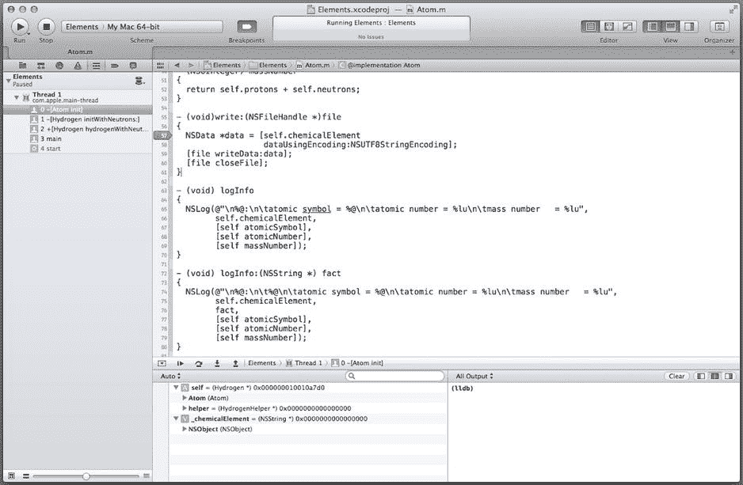

*图 C-2.* 使用 LLDB 进行 Xcode 调试

### 调试导航器

调试导航器（通过从 Xcode **视图**菜单选择**导航器**  **显示调试导航器**来显示）会在应用程序在断点处暂停时显示其调用栈。导航器会按线程或队列（取决于所选的视图）对栈帧进行分组。它还允许您查看变量的内存。当您暂停正在运行的应用程序或它命中断点时，调试导航器会自动打开。图 C-3 展示了调试导航器面板。

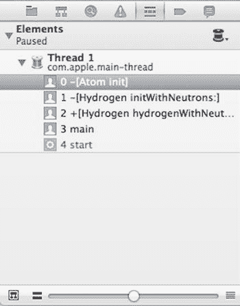

*图 C-3.* 调试导航器面板

### 断点导航器

断点导航器（通过从 Xcode **视图**菜单选择**导航器**  **显示断点导航器**来显示）用于编辑、禁用和删除项目或工作区中的断点。您可以添加/删除（行、异常或符号）断点，设置断点操作和选项，指定断点的作用域，以及共享断点。图 C-4 展示了断点导航器面板。

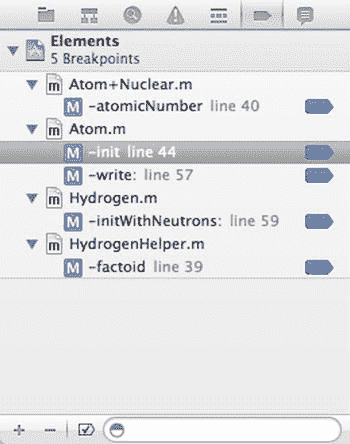

*图 C-4.* 断点导航器面板

### 断点操作

断点操作定义了当目标程序到达断点时执行的操作。Xcode 提供了以下断点操作。

*   `调试器命令`：此操作评估一个调试器命令。正如您在本附录前面所回忆的，调试器能够执行 C/C++/Objective-C 表达式，使其成为一个非常强大的工具。
*   `日志消息命令`：此命令将消息记录到输出控制台或读出消息。
*   `Shell 命令`：此命令执行一个 shell 命令（`/usr/bin/ls` 等）。
*   `声音命令`：此命令播放声音。
*   `AppleScript 命令`：此命令评估 AppleScript 代码。

断点操作在编辑断点时进行配置。这可以在断点导航器中通过按住 Control 键单击断点，然后从快捷菜单中选择**编辑断点...** 来完成（如图 C-5 所示）。

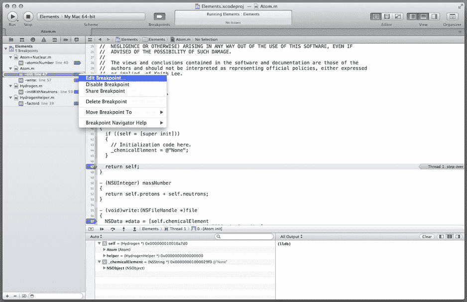

*图 C-5.* 从断点导航器面板编辑断点


断点操作弹出窗口使您能够选择在目标程序到达断点时需执行的命令类型。您可以配置一个定义额外断点行为的选项，并设置所选的断点类型专属的其他属性。图 C-6 展示了一个配置为执行调试器命令的断点操作，该命令会打印`_chemicalElement`实例变量的值，并在命令执行后自动继续执行程序。

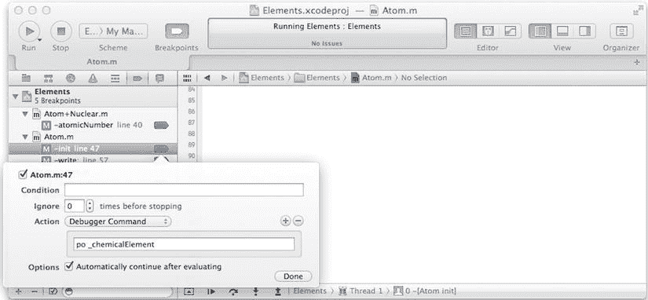

图 C-6。配置断点操作

## 调试区

调试区由调试栏（位于调试区顶部的工具栏）和内容面板（该区域的剩余部分）组成。调试栏用于控制程序执行和浏览源代码。内容面板的左侧用于查看程序变量和寄存器。内容面板的右侧用于查看控制台输出并与调试器交互。图 C-7 中描绘了调试区。

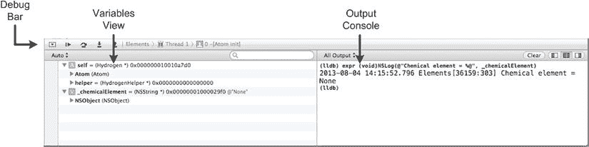

图 C-7。调试区

调试栏用于控制目标程序的执行并浏览其源代码。调试栏左侧有五个按钮；从左到右，这些按钮的用途如下：

*   显示/隐藏调试区。
*   暂停/恢复程序执行。
*   单步跳过（即执行）一条指令。如果该指令是方法/函数调用，则会导致整个方法/函数被执行。
*   单步进入（即执行）一条指令。如果该指令是方法/函数调用，则会导致调试器跳转到该方法/函数的第一行。
*   单步跳出方法/函数。这会导致调试器完成当前方法/函数的执行，并跳转到下一个调用方法/函数，或返回到调用它的方法/函数。

调试区的其余部分显示一个弹出菜单，使您能够选择程序中要调试的线程。

内容面板用于显示变量，并提供用于输入调试命令的命令行界面。如图 C-7 所示，内容面板的左侧显示*变量视图*（用于显示当前上下文中的变量值），而右侧显示输出控制台（用于执行调试器命令的 LLDB 命令行界面）。

## 反汇编视图

Xcode 提供了一个反汇编视图，使您能够在程序运行时查看调试器看到的一组汇编语言指令。您可以配置 Xcode 仅显示反汇编，或同时显示源代码和相应的反汇编。要选择反汇编视图，请从 Xcode 的 Product 菜单中选择 **Debug Workflow  Show Disassembly When Debugging**。图 C-8 在 Xcode 的分裂编辑面板中显示了源代码和反汇编视图。

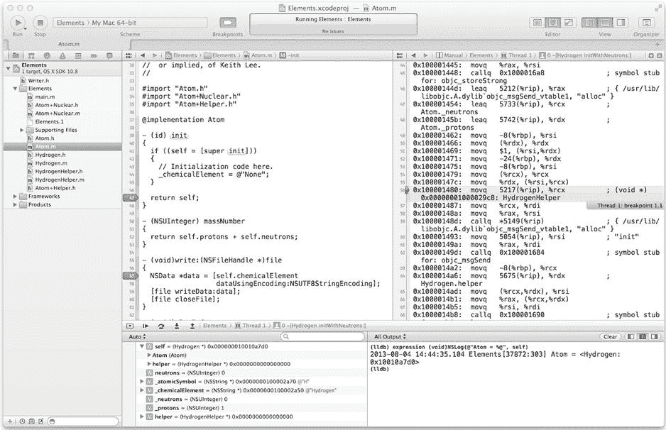

图 C-8。反汇编视图

## 在 Xcode 中使用 LLDB

现在您已经对 LLDB 以及使用 Xcode 进行调试有了大致了解，接下来将使用 Xcode 调试一个程序。在 Xcode 中，通过从 Xcode 的 File 菜单中选择 **New  Project . . .** 来创建一个新项目。在 **New Project Assistant** 面板中，通过选择 **Command Line Tool** 图标（来自 OS X 模板组下的 **Application** 选项）来创建一个命令行应用程序。在 **Project Options** 窗口中，将产品名称指定为 `BrokenCalculator`，将项目类型选择为 `Foundation`，并通过选中 **Use Automatic Reference Counting** 复选框来选择 ARC 内存管理。在您的文件系统中指定您希望创建项目的位置（如有必要，选择 **New Folder** 并输入文件夹的名称和位置），并取消选中 **Source Control** 复选框。

现在创建计算器类。从 Xcode 的 File 菜单中选择 **New  File . . .**，选择 **Objective-C** 类模板，并将类命名为 `Calculator`。选择 `BrokenCalculator` 文件夹作为文件位置，选择 `BrokenCalculator` 项目作为目标，然后点击 **Create** 按钮。接下来，在项目导航器面板中，选择 `Calculator.h` 文件并更新类接口，如代码清单 C-2 所示。

*代码清单 C-2.*  计算器类接口

```
#import <Foundation/Foundation.h>

@interface Calculator : NSObject

- (NSNumber *) sumAddend1:(NSNumber *)adder1 addend2:(NSNumber *)adder2;

@end
```

该类声明了一个用于返回两个数之和的实例方法。接下来，使用 Xcode 项目导航器选择 `Calculator.m` 文件并编写实现代码，如代码清单 C-3 所示。

*代码清单 C-3.*  计算器类实现

```
#import "Calculator.h"

@implementation Calculator

- (NSNumber *) sumAddend1:(NSNumber *)adder1 addend2:(NSNumber *)adder2
{
  return [NSNumber numberWithInteger:([adder1 integerValue] +
                                      [adder2 integerValue])];
}
@end
```

该方法返回两个输入参数的整数值之和。好的，这非常简单，现在让我们转到 `main()` 函数。在项目导航器中，选择 `main.m` 文件并更新 `main()` 函数，如代码清单 C-4 所示。

*代码清单 C-4.*  BrokenCalculator 的 `main()` 函数

```
#import <Foundation/Foundation.h>
#import "Calculator.h"

int main(int argc, const char * argv[])
{
  @autoreleasepool
  {
    // 创建实例和要相加的数字
    Calculator *calculator = [[Calculator alloc] init];
    NSNumber *addend1 = [NSNumber numberWithInteger:10];
    NSNumber *addend2 = [NSNumber numberWithInteger:15];
    NSNumber *addend3 = [NSNumber numberWithInteger:-25];

// 相加数字并验证返回正确的总和
    NSNumber *sum1 = [calculator sumAddend1:addend1 addend2:addend2];
    NSCAssert(([sum1 intValue] == 25), @"计算出的总和无效");

NSNumber *sum2 = [calculator sumAddend1:addend1 addend2:addend3];
    NSCAssert(([sum2 intValue] == 15),  @"计算出的总和无效");
  }
  return 0;
}
```

该方法创建了一个 `Calculator` 实例和 `NSNumber` 实例，然后将两个数字相加并验证返回了正确的总和。当您编译并运行该程序时，应在输出面板中观察到消息，如图 C-9 所示。

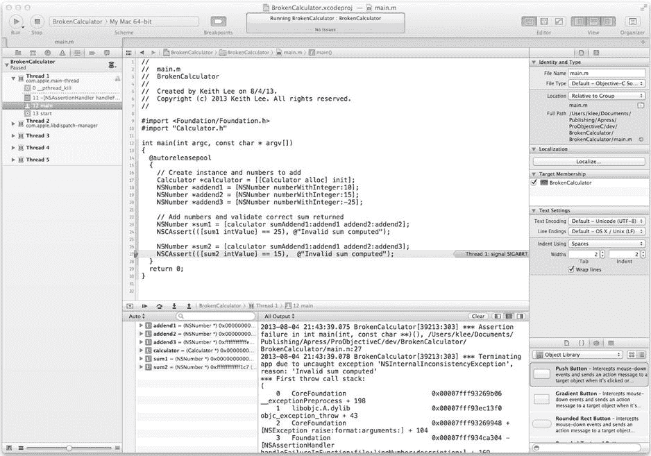

图 C-9。BrokenCalculator 程序输出


好的，作为高级文档工程师和翻译员，我将严格遵循您提供的注意事项，将以下英文文本翻译成中文。


图 C-9 显示抛出了一个异常——具体来说是断言失败，表明返回的和不是期望的值。现在你将使用调试器来确定问题的原因。在断点导航器中，通过点击导航窗格左下角的加号（`+`）符号，并从弹出菜单中选择**添加异常断点 . . .**（如图 C-10 所示）来添加一个异常断点。

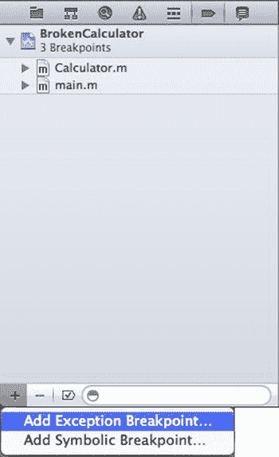

图 C-10. 添加异常断点

在异常断点对话框中，有几个设置。对于**异常**，选择**全部**（设置所有异常），对于**中断**，选择**抛出时**（当异常被抛出时设置断点）。当你编译并运行程序时，你应该会看到程序在`main`函数中暂停在下面这行代码上：

```
NSCAssert(([sum2 intValue] == 15),  @"Invalid sum computed");
```

你可以看到这个断言失败了，导致异常被抛出。现在你将设置一些行断点来对程序进行故障排除。在 Xcode 中，通过点击源代码中对应行的行号区域来设置一个行断点。在项目导航器中，选择 **Calculator.m** 文件，并在包含以下语句的行设置一个断点：

```
return [NSNumber numberWithInteger:([adder1 integerValue] +
                                    [adder2 integerValue])];
```

接下来，在 `main()` 函数中，在包含以下语句的行设置一个断点：

```
NSCAssert(([sum1 intValue] == 25), @"Invalid sum computed");
```

现在编辑这个断点，添加一个断点动作，如图 C-11 所示。

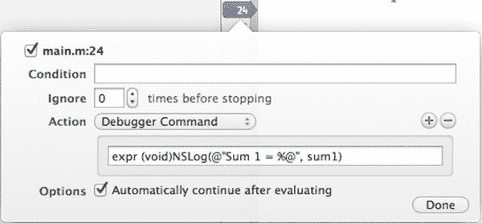

图 C-11. 为计算器求和编辑断点动作

该断点动作执行一个调试器命令，记录存储在变量 `sum1` 中的值。

```
expr (void)NSLog(@"Sum 1 = %@", sum1)
```

注意，在调试器命令表达式中必须指定返回类型。在这里，类型是 `void`，表示 `NSLog` 函数不返回值。还要注意，断点选项被设置为执行后自动继续。实际上，这使你可以显示程序变量的值，而无需在代码中编写 `NSLog` 语句，从而避免用调试语句混乱你的代码！当你编译并运行程序时，它会在为 `sumAddend1:addend2:` 方法设置的行断点处暂停执行，如图 C-12 所示。

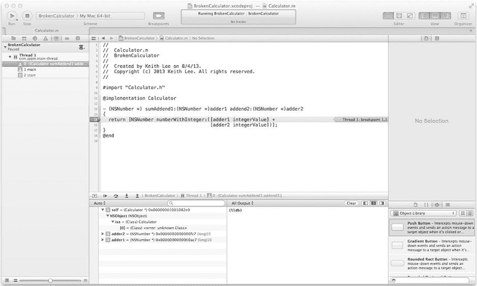

图 C-12. 在 `sumAddend1:addend2:` 方法的行断点处暂停执行

在调试区域的内容窗格中，你可以看到变量 `adder1` 和 `adder2` 的值是符合预期的。现在你想验证这个方法的返回值。这可以通过“单步跳出”命令（位于调试栏中）来完成。该命令会执行当前执行点所在的方法/函数的剩余行，然后显示方法/函数调用之后的下一条语句。选择这个按钮两次。完成后，返回值会显示在内容窗格的显示区域（**返回值**），如图 C-13 所示。

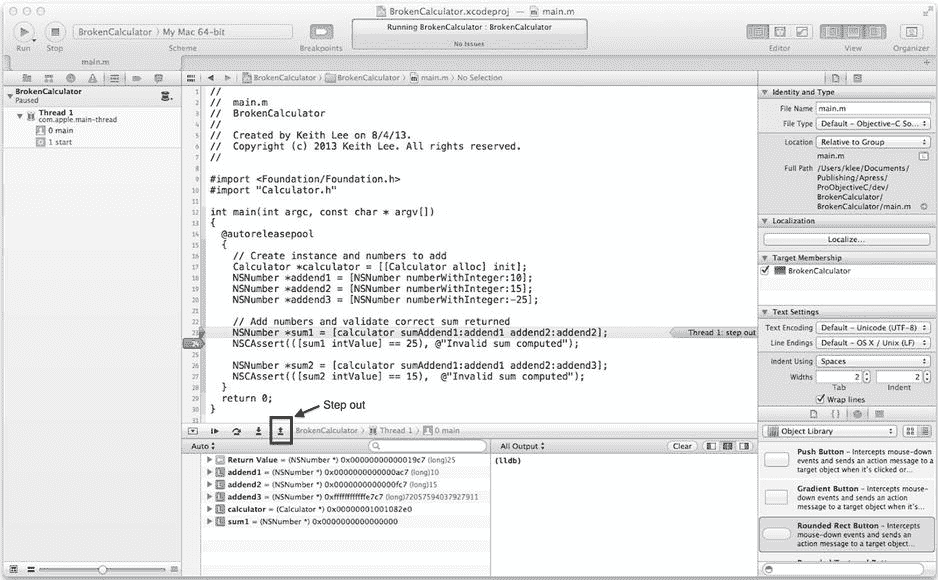

图 C-13. 使用调试器显示方法的返回值

返回值为 25（如图 C-13 所示），这是正确的。接下来，在调试栏中选择**继续**（你可能需要点击该按钮两到三次）。根据你之前配置的断点动作调试器命令，输出控制台会记录 `Sum 1 = 25`。现在观察到你为 `sumAddend1:addend2:` 方法设置的行断点处，调试器再次暂停。这次，在调试区域的内容窗格中使用调试器的 `po` 命令来显示这两个参数的值：

```
po adder1
po adder2
```

这些命令的输出显示在图 C-14 中。

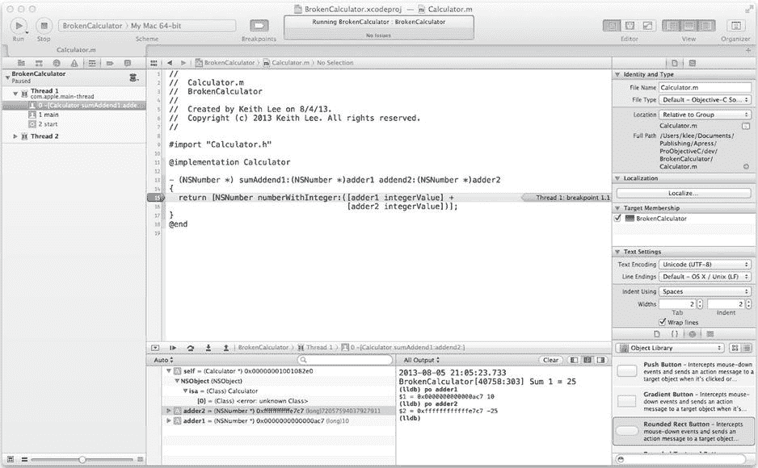

图 C-14. 使用 Xcode 调试器命令显示变量的值

这些值（10，–25）是符合预期的，所以选择**继续**来推进程序。接下来，调试器暂停在 `NSCAssert` 处。使用 `po` 命令，变量 `sum2` 显示值为 –15（如图 C-15 所示）。

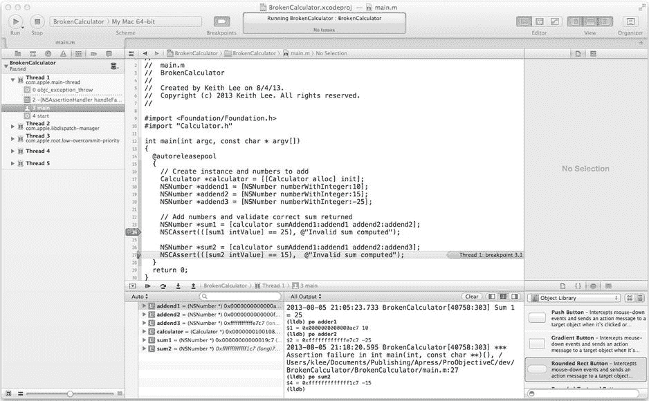

图 C-15. 使用 `po` 命令显示一个值

这是期望的值，那为什么断言会失败呢？查看断言语句，你可以看到条件表达式期望的值是 15，但它应该是 –15！

```
NSCAssert(([sum2 intValue] == 15),  @"Invalid sum computed");
```

当你修正断言（将值改为 –15）并再次运行程序时，你会看到它成功运行了。尽管这是一个非常刻意构造的例子，但它说明了在 Xcode 中使用 LLDB 进行调试的一些功能。苹果提供了各种关于在 Xcode 中使用 LLDB 调试的文档，并且 LLDB 网站是获取更多信息的重要参考资料。

## 总结

在本附录中，你学习了使用 LLDB（Xcode 的默认调试器）进行调试。调试是软件开发中必不可少的一部分，因此掌握这项技能对于成为一个更高效、更有生产力的程序员至关重要。现在我希望你已经相信了 LLDB 的强大能力，并且你会花时间熟练地在你的所有 Objective-C 软件开发项目中使用它。

现在你已经读完了这本书的最后一页。我希望在你开发更多 OS X 和 iOS 应用时，它（并将继续）对你有所帮助。如果你对本书或 Objective-C 有任何问题或评论，请随时通过 `ProObjectiveC@icloud.com` 与我联系。感谢你参与这段奇妙的旅程，现在，就此搁笔！

# 索引

  A

访问器方法

API

异步 API

调度队列

操作队列

基于队列的方法

线程

苹果框架和服务

应用 bundle

应用服务

数组排序，块

BlockArraySorter main.m 文件

块字面量

NSComparator

项目执行

项目测试

面向方面编程 (AOP)

断言

类不变约束

函数

内部不变式

宏

场景

异步处理


自动引用计数

苹果框架与服务
- 避免循环引用
- 生命周期限定符
- 创建多个订单条目
- Objective-C 免费桥接
- ARC 桥接转换
- 数据类型
- 显式转换
- 隐式转换
- 与对象所有权
- 声明所有权
- 释放所有权
- 使用规则与约定

 B

Block
- 数组排序
- `BlockArraySorter main.m` 文件
- `block` 字面量
- `NSComparator`
- 项目执行
- 项目测试
- 闭包
- 常量导入
- 实例变量访问
- 词法作用域
- 可变 Block 变量
- 作用域
- 可见性
- 并发编程
- `BlockConcurrentTasks main.m` 文件
- 项目测试
- 描述
- 内存管理
- `Block_copy()`
- `block` 字面量表达式
- 在词法作用域外使用 `block` 字面量
- `Block_release()`
- 语法
- `block` 表达式定义与调用
- `block` 类型
- 复合 `block` 声明与定义
- 声明与定义
- `function` 参数
- 字面量表达式
- `method` 参数
- 语法元素比较
- `void`
- URL 加载
- `BlockURLLoader main.m` 文件
- 项目测试
- `Block_copy()`
- `Block_release()`

`Block` 作用域变量
Bonjour 网络服务
`Boolean` 数据类型
装箱表达式. *参见* 表达式字面量
断点导航器
Bundle
- 应用程序
- 框架
- 可加载

 C

Category
- 声明语法
- 描述
- 核心 `Category` 实现
- 核心 `Category` 接口
- 核心 `Category` 测试代码
Clang 编译器
类


- 原子类实现编码
- 原子类接口编码
- 类别
- 声明语法
- 描述
- 核心类别实现
- 核心类别接口
- 核心类别测试代码
- 扩展
- 实现
- 实例变量
- 接口
- 方法
- 调用
- 语法
- 新类创建
- 属性
- 访问
- 声明
- 定义
- 属性支持的实例变量
- 协议
- 采用协议
- 原子类实现
- 声明语法
- 描述
- 采用协议的接口
- 方法声明
- 使用类似语法的其他协议
- 使用 Xcode 创建协议
- 协议模板文件
- 语法
- 软件对象
- Xcode
- 类不变量
- 闭包
- 常量导入
- 实例变量访问
- 词法作用域
- 作用域外的局部变量访问
- 通过词法作用域访问局部变量
- 局部变量的非法访问
- 局部变量的修改
- 多个嵌套作用域中的局部变量
- 可变块变量
- 作用域
- 可见性
- 代码生成器
- 并发. *参见* 并发编程, 块
- 并发计算
- 并发操作
- 并发处理
- 线程
- computeTask 方法
- ConcurrentProcessor 实现
- ConcurrentProcessor 接口
- ConcurrentThreads 的 main() 函数
- ConcurrentThreads 程序输出
- 并发编程
- 优势
- API 选择
- 异步 API
- 调度队列
- 操作队列
- 基于队列的方法
- 线程
- 与异步处理对比
- 并发计算
- 并发操作实现


GreetingOperation 实现

GreetingOperation main() 函数

并发处理

分布式计算

Grand Central Dispatch (GCD)

调度队列

消息传递

多处理

多线程

在 Objective-C 中

调度队列

语言特性

消息传递

操作队列

线程 (*另见* 线程)

操作队列

块对象添加

ConcurrentOperations main() 函数

ConcurrentOperations 程序输出

ConcurrentProcessor 实现

ConcurrentProcessor 接口

自定义操作类

NSBlockOperation

NSInvocationOperation

NSOperation

操作对象，手动执行

并行计算

并行编程

进程

*与* 顺序处理对比

共享数据 (*见* 共享内存模型)

线程

并发编程，块

BlockConcurrentTasks main.m 文件

项目测试

条件编译指令

#elif 指令

#else 指令

#ifdef 指令

#if 指令

#ifndef 指令

条件变量

容器字面量

NSArray 字面量

NSDictionary 字面量

控制流不变量

自定义下标

数组风格

字典风格

编辑寄存器值

CLIParser 类实现

CLIParser 接口

关键点

RegEdit

RegEditConstants 接口

RegEdit 接口与实现

 D

数据类型

常量

基础

死锁

调试。*参见* LLDB 调试器

诊断指令

#error 指令

#line 指令

#warning 指令

指令，预处理器语言

条件编译


`#elif` 指令  
`#else` 指令  
`#ifdef` 指令  
`#if` 指令  
`#ifndef` 指令  
诊断  
`#error` 指令  
`#line` 指令  
`#warning` 指令  
头文件包含  
`#import` 指令  
`#include` 指令  
`#pragma` 指令  
反汇编器  
调度队列（另请参阅 Grand Central Dispatch (GCD)）  
分布式计算  
分布式对象  
文档对象模型（DOM）样式  
文档类型定义（DTD）  
动态绑定  
动态加载  
动态方法解析  
方法实现  
动态类型化  

## E  
Elements 项目  
- Atom 类重构  
- Hydrogen 工厂方法  
- Hydrogen 初始化方法  

错误处理  
- 异常条件  
- 指南  
- 关键点  
- `NSError`  
  - 错误码  
  - 字典键  
  - 域对象  
  - 双重间接引用  
  - 错误域  
  - 错误对象  
  - 通过间接引用获取的错误对象  
  - 错误恢复  
  - 处理委托方法错误  
  - 响应器  
- `NSException`  
  - 异常处理  
  - 内存管理  
  - 嵌套异常处理器  
  - 对象  
  - 运行时错误  
    - 断言  
    - 类别  
    - 错误码  
    - 错误对象  
    - 异常  
    - 类型  
    - 标准异常名称  

事件驱动的 XML 处理  
表达式字面量  
扩展  

## F  
文件 I/O  
- 应用程序包  
- 文件管理工具  
- 元数据查询  
- 流  

文件作用域变量  
Foundation 函数  
- 包、本地化字符串  
- 十进制数和字节顺序  
  - 字节顺序  
  - `NSDecimal` 函数  
  - 舍入模式


值

文件路径

几何

关键点

日志记录

运行时交互

任务

基础函数。*参见* 断言

框架包（Framework bundle）

函数原型作用域变量

函数作用域变量

 G

GCD。*参见* 中央调度（GCD）

通用类

* 集合
* 索引集
* 字面量
* `NSArray`
* `NSCountedSet`
* `NSDictionary`
* `NSHashTable`
* `NSMap` table
* `NSPointerFunctions`
* `NSSet`
* 谓词
* 根类
  * 抽象根类
  * `NSObject` 类
  * `NSObject` 协议
  * `NSProxy`
* 值对象
  * 日期和时间
  * `NSCache`
  * `NSDecimalNumber`
  * `NSNumber`
  * `NSValue` 类
* `XML` DTD 处理
* 事件驱动方式
* 基于树的数据模型

通用类。*参见* 字符串

Getter 和 Setter 方法。*参见* 存取器方法

中央调度（GCD）
* 调度队列
  * `ConcurrentDispatch` main.m 文件
  * `ConcurrentDispatch` 项目测试

 H

头文件包含指令
* `#import` 指令
* `#include` 指令

堆（Heap）

氢工厂方法

氢初始化方法

 I

`Id` 数据类型

实例变量
* 访问声明
* 声明

内部不变量

进程间通信
* 通过管道通信
* 端口
* 端口注册服务

对象内省

Isa-swizzling（`isa` 混写）

 J

即时编译器（JIT）

 K

键值编码（KVC）
* 存取器方法
* 优点
* 设计与实现
  * API
  * 属性
  * 集合运算符


基础构建

属性访问器命名规范

搜索模式

对多关系属性

验证方法

表达式

init 或 dealloc 方法

键与键路径

模型状态

人物对象图

标准属性访问器

键值观察 (KVO)

API

优势

设计与实现

实现

通知类

键值编程 *另请参阅* 键值编码 (KVC)

类图

类接口与实现

编码器程序输出

键值观察

API

优势

设计与实现

实现

通知类

总结

 L

程序的延迟加载

库

API

断点

命令

核心类

数据格式化器

表达式类

主机

解释器

符号

目标

工具

字面量

活锁

LLDB 命令

apropos

breakpoint

命令行工具

disassemble

expression

frame

help commands

memory

process

register

thread

watchpoint

LLDB 调试器

设计

表达式解析

多线程调试

插件架构

设计 (*另请参阅* 库)

LLVM (*另请参阅* 低级虚拟机 (LLVM))

总结

LLDB 调试器。*另请参阅* LLDB 命令；Xcode

可加载包

锁

死锁

持有并等待条件预防

活锁

锁获取

互斥策略

抢占

资源饥饿


等待超时

逻辑错误

低级虚拟机（LLVM）

Clang 编译器

代码生成器

反汇编器

JIT

优化器

 M

宏

过度使用警告

手动引用计数（MRR）

autorelease 方法

内存释放

MRR 使用示例

对象引用与所有权

所有权声明

所有权放弃

所有权获取

使用方法

内存管理

自动引用计数

避免循环引用

生命周期限定符

使用方法

使用规则与约定

与 Block 配合使用

Block_copy()

Block 字面量表达式

在词法作用域外使用 Block 字面量

Block_release()

手动引用计数

autorelease 方法

内存释放

MRR 使用示例

对象引用与所有权

所有权声明

所有权放弃

所有权获取

使用方法

Objective-C 内存模型

程序内存使用

悬垂指针

堆

内存泄漏

Objective-C 程序

栈

语句块

消息

消息传递

自动释放池

ConcurrentProcessor 的 downloadTask 方法

异常处理器

方法签名

NSObject 方法调用

运行循环

选择器

空选择器段

SEL 类型

线程入口点例程

使用方法

消息传递表达式

消息发送机制

定义

消息分发

消息转发

快速转发

向 Hydrogen 类的快速转发

普通/完整转发

方法

调用

语法

方法绑定


方法签名

模型-视图-控制器（MVC）设计模式

MRR. *参见* 手动引用计数（MRR）

多进程处理

多线程调试

多线程

  N

`NSArray` 字面量

`NSDictionary` 字面量

`NSError`

错误码

字典键

领域对象

错误域

错误对象

通过间接方式返回错误对象

错误恢复

处理委托方法中的错误

`main()` 函数

`NetConnector` 实现

输出面板

响应者

`NSException`

异常处理

内存管理

嵌套异常处理器

对象

`NSNumber` 字面量

`NSObject` 类

基本行为

函数

初始化

发送消息

`NSObject` 线程

`NSPropertyListSerialization`

  O

对象

创建

Elements 项目

初始化

`Objective-C`

类（*参见* 类）

并发编程（*参见* 并发编程）

描述

开发环境

特性

Apple 技术

C 语言支持

动态运行时

内省与反射

内存管理

对象消息传递

面向对象编程

程序开发

程序开发

项目创建

测试驱动

`Objective-C` 元素

访问修饰符

pakeage 访问修饰符

private 访问修饰符

protected 访问修饰符

public 访问修饰符

类元素

类别接口

类扩展

类实现

类方法

实例方法

实例变量

接口指令

属性特性


协议声明

返回类型

数据类型

块数据类型

BOOL

类定义类型

枚举类型

id 类型

instancetype 关键字

运算符

语句

变量

块作用域变量

文件作用域变量

函数原型作用域变量

函数作用域变量

保留字

Objective-C 字面量 *另请参阅* 自定义下标

容器字面量

NSArray 字面量

NSDictionary 字面量

表达式字面量

字面量

NSNumber 字面量

对象下标操作

NSArray

NSDictionary

Objective-C 内存模型

Objective-C 无缝桥接

ARC 桥接转换

数据类型

显式转换

隐式转换

对象所有权，ARC

声明所有权权益

释放所有权权益

nil 赋值

变量重新赋值

释放所有权权益：所有者释放

操作队列

块对象添加

ConcurrentOperations main() 函数

ConcurrentOperations 程序输出

ConcurrentProcessor 实现

ConcurrentProcessor 接口

自定义操作类

NSBlockOperation

NSInvocationOperation

NSOperation

操作对象，手动执行

运算符

优化器

  P, Q

包访问修饰符

并行计算

并行编程

谓词

抢占

预处理器

语言

指令 (*参见* 指令，预处理器语言)

宏

Objective-C 源代码编译

汇编阶段

代码生成与优化阶段

词法分析阶段

链接阶段

语法分析/解析阶段

操作


基于预处理器的语言转换

文本翻译

令牌转换

私有访问修饰符

进程

程序内存使用

悬空指针

堆

内存泄漏

Objective-C 程序

栈

语句块

属性

访问

声明与特性

定义

自动合成

动态生成

显式定义

通过关键字合成

属性支持的实例变量

受保护访问修饰符

协议

遵循协议

Atom 类实现

声明语法

描述

采用协议的接口

方法声明

使用类似语法的其他协议

使用 Xcode 创建协议

协议模板文件

语法

公共访问修饰符

  R

重构

资源匮乏

运行时 API

类与实例

关联对象

类实例

内存管理策略

方法实现

NSBundle

注册与创建

RuntimeWidget

变量添加

动态代理

AspectProxy

AuditingInvoker 接口

编写类代码

实现 AspectProxy

实现 AuditingInvoker

调用者协议

测试 AspectProxy

动态代理与 AOP

可加载束

添加 Greeter.h 文件

参数选项卡

自动引用计数（ARC）

BasicGreeter 实现

BasicGreeter 接口

BasicGreeter 主函数

束类

创建束

CustomGreeter 接口

CustomGreeter 模板

DynaLoader

动态加载

文件添加

基础框架


`CustomGreeter` 完整路径

`Greeter` 协议

`CustomGreeter` 实现

`NSBundle` 对象创建

输出，`DynaLoader`

项目配置

检索，`path` 参数

配置编辑器

模板选择

卸载 `Bundle`

使用 `NSBundle`

运行时错误

断言

类别

错误码

错误对象

异常

类型

运行时系统

组件

自动引用计数（ARC）

类代码生成

类元素

类检查

`C` 库

创建动态类

数据结构视图

数据类型，库

调度表

`dyld` 共享缓存

`DynaClass main()` 函数

检查，类方法

`Foundation` 框架

库函数

`id` 类型定义

实现，对象消息

对象检查

实例

实例方法，类访问

对象内省

`isa` 指针

`isa` 变量

库 `API`

动态加载

消息分发

消息传递代码生成

元类

方法查找，库

`objc_getMetaClass()`

`objc_msgSend()`

`objc_object` 数据类型

对象消息传递

不透明数据类型

操作，消息传递

动态方法解析

`runspector`

`Runspector main()` 函数

选择器唯一化

源代码编译器

`trampoline`

变量，实例

虚函数表

动态绑定

动态特性

动态加载

动态方法解析

方法实现

动态类型

与...的交互

`conformsToProtocol`

检查器

内省，对象


[级别]
[导航窗格]
[NSObject，方法]
[消息传递]
[方法签名]
[选择器]
[用法]
[对象内省]
[总结]

 S

[脚本语言]
[选择器]
[SEL 类型]
[语义错误]
[共享内存模型]
[锁]
[死锁]
[预防“持有并等待”条件]
[活锁]
[锁获取]
[互斥策略]
[抢占]
[资源匮乏]
[等待超时]
[软件对象]
[专用系统服务]
[归档]
[对象编码/解码]
[键控归档]
[编组与解组过程]
[顺序归档]
[分布式对象]
[通知支持]
[合并]
[常量值]
[元素]
[封装]
[观察者]
[队列创建]
[同步队列]
[对象图（归档）]
[归档器接口与实现]
[类层次结构]
[族系接口与实现]
[订单接口与实现]
[子族系接口与实现]
[脚本]
[序列化]
[NSPropertyListSerialization]
[属性列表]
[XML plist 文件]
[语句]
[字符串]
[类簇设计模式]
[格式字符串]
[NSAttributedString]
[NSString]
[初始化]
[内省]
[输入/输出]
[修改]
[可变与不可变]
[扫描值]
[搜索与比较]
[NSString 字面量]
[操作]
[对象下标引用]
[NSArray 下标引用]
[NSDictionary]
[系统服务 *另请参阅* 文件 I/O；URL 处理]
[应用程序进程]
[Bonjour 网络服务]


BonjourClient 接口与实现

main() 函数

程序输出

while 循环

并发操作

进程间通信

管道通信

端口

端口注册服务

锁机制

网络服务

Bonjour

NSHost

正则表达式处理

运行循环

线程管理

定时器

 T

测试覆盖率

线程

并发

computeTask 方法

ConcurrentProcessor 实现

ConcurrentProcessor 接口

ConcurrentThreads main() 函数

ConcurrentThreads 程序输出

NSObject 线程

NSThread API

同步

条件变量

锁

线程管理

基于树的 XML 处理

 U, V, W

URL 处理

缓存管理

Cookies

协议

URL 加载 API

认证与凭据管理

main() 函数

NetConnector 接口与实现

程序输出

reloadRequest 方法

URL 加载，Blocks

BlockURLLoader main.m 文件

项目测试

用户输入错误

 X, Y

Xcode

操作

断点操作

AppleScript 命令

调试器命令

日志消息命令

Shell 命令

声音命令

断点导航器

调试区域

调试栏

调试导航器

反汇编视图

可执行环境

项目

GreetingProject

项目内容

测试内容

Xcode 项目文件

要点总结

方案

目标

构建配置

构建阶段

构建规则

配置设置文件

测试覆盖率

使用 LLDB

自动引用计数

BrokenCalculator main() 函数

类接口

异常断点

main() 函数

方法/函数调用

NSLog 函数

输出

使用 po 命令

工作区

添加已有项目

元数据

输出

静态库

工作区构建目录

XML DTD 处理

XML 处理

 Z

零配置网络
