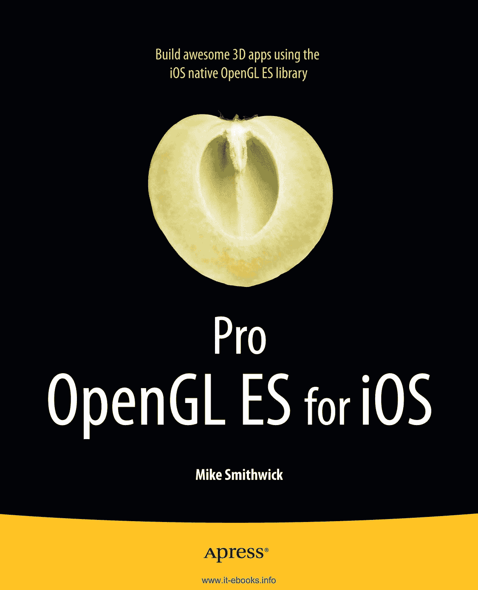
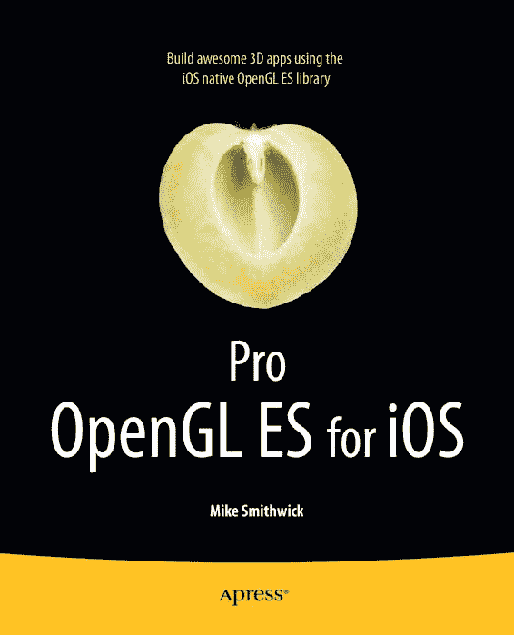
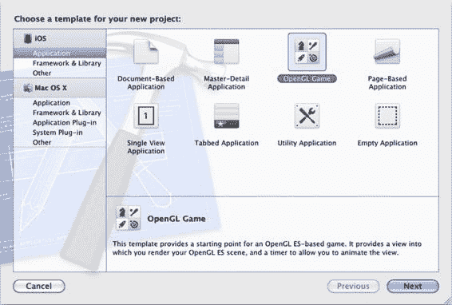

[www.it-ebooks.info](http://www.it-ebooks.info)

*为方便读者查阅，Apress 已将部分前置内容移至索引之后。请使用书签和“内容一览”链接进行访问。*

[www.it-ebooks.info](http://www.it-ebooks.info)

## 内容一览

- **关于作者** ............................................................................................. ix
- **关于技术审校** ......................................................................... x
- **致谢** .......................................................................................... xi
- **引言** ................................................................................................... xii
- **第 1 章：计算机图形学：从过去到现在** .......................................... 1
- **第 2 章：那些数学杂谈** ........................................................................ 33
- **第 3 章：构建 3D 世界** ...................................................................... 51
- **第 4 章：点亮灯光** ................................................................... 91
- **第 5 章：纹理** ...................................................................................... 133
- **第 6 章：混合效果** .............................................................................. 167
- **第 7 章：渲染杂项** .......................................................... 201
- **第 8 章：整合一切** ................................................................ 245
- **第 9 章：性能优化及其他** ................................................................. 289
- **第 10 章：OpenGL ES 2、着色器与……** ................................................... 307
- **索引** ........................................................................................................ 341

## 引言

1985 年，在 Commodore Amiga 1000 发布约一周后，我把它带回了家。这台机器配备了惊人的 512K 内存、可编程的颜色映射表、摩托罗拉 68K CPU 以及一个现代化的多任务操作系统，简直是“酷毙了”的代名词——当然，这只是打个比方。我当时想，这或许是个运行天文程序的好平台，因为我可以自由控制那些星星的颜色，而不用再受限于 Hercules 或 C64 那种单调的固定调色板。于是我编写了一个 24 行的 Basic 程序来绘制随机星场，关掉灯，心想：“哇！我肯定能用这玩意儿写个超棒的天文程序！” 26 年后，我仍在完善它（总有一天我会搞定的）。那时，我梦想的设备是能揣进口袋、随时掏出来对准天空，告诉我看到的星星或星座是什么。

它叫 iPhone。是我先想到的。

尽管 iPhone 在播放音乐、打电话或玩“ doodle jump”方面表现出色，但它真正的亮点在于处理 3D 内容。毕竟，3D 无处不在——除非你是个海盗，戴上了眼罩，那样你的深度感知会非常有限。啊哈哈哈。

此外，3D 应用在向他人展示时也很有趣。别人能“看懂”它。事实上，比起那些孩子们都在谈论的“护根物购买指南”应用，他们更能理解 3D 应用。（除非他们能展示 3D 版的护根物，但那简直是浪费一个绝佳的维度。）

所以，3D 应用看起来有趣，交互起来有趣，编程也很有趣。这便引出了这本书。我绝非该领域的大师。真正的大师是那些能在早餐前搞定几个 NVIDIA 驱动程序、午餐前模拟出四维超立方体、在 SyFy 频道晚间《萤火虫》马拉松开始前，把《光环》移植到 TokyoFlash 手表上的人。我做不到这些。

但我还算是个不错的作者，对这门学科有足够的工作知识，能保证不闯祸，而且知道怎么拼写“3D”。所以，就有了这本书。

首先，这本书是为那些想要至少学习一点 3D 语言的有经验的 iOS 程序员而写的。至少学够在下次游戏程序员鸡尾酒会上，能和其他高手一起对着四元数笑话开怀大笑的程度。

本书涵盖了 3D 理论的基础知识，以及使用行业标准的小型设备 OpenGL ES 工具包进行实现的方法。虽然 iOS 支持两种版本——1.x 版本（简单易用）和 2.x 版本（适合喜欢深入细节的人）——我主要介绍前者，最后一章除外，该章作为后者的入门介绍并涉及可编程着色器的使用。随着 iOS 5 的发布，Apple 为图形库增加了一些重要功能，向 3D 社区表达了满满的爱意。

第 1 章作为 OpenGL ES 的入门介绍，同时讲述计算机图形学漫长而曲折的历史。第 2 章是基础 3D 渲染背后的数学知识，而第 3 章到第 8 章将温和地引导你了解所有图形程序员最终都会遇到的各种问题，例如如何投射阴影、渲染多个 OpenGL 屏幕、添加镜头光晕等。最终，这些内容将整合成一个简单的（S-I-M-P-L-E！）太阳系模型，包含太阳、地球和一些恒星——一个传统的 3D 练习。第 9 章探讨最佳实践和开发工具，第 10 章则简要概述 OpenGL ES 2 和着色器的使用。

所以，尽情享受吧，给我寄些 M&Ms 巧克力豆，同时别忘了在 App Store 中查看我自己的应用：适用于 iPhone 和 iPad 的 Distant Suns 3。没错，就是那个 1985 年在 Commodore Amiga 1000 上起步、最初只是一个在屏幕上绘制几百颗随机星星的 24 行 Basic 程序。

现在它更大了。

## 第 1 章

**计算机图形学：从过去到现在**

要预测未来、珍惜当下，你必须理解过去。

——或许某人在某个时候说过的话

好的，这是根据您的要求翻译和排版后的 Markdown 文档。

计算机图形学一直是软件界的宠儿。比起将排序算法的速度提升 3% 或为电子表格程序增加自动色调控制，外行人更容易欣赏计算机图形学。你更可能会听到更多人对你在 iPad 上精美渲染的土星图像说“酷毙了！”，而不是对 Microsoft Word 里的一个 Visual Basic 脚本（当然，除非 Microsoft Word 里的 Visual Basic 脚本能渲染土星，那才叫真的酷）。当这些渲染效果出现在一个可以塞进裤兜的设备上时，酷炫指数更是直线上升。让我们面对现实吧——史蒂夫·乔布斯让科幻电影的艺术总监们日子变得非常难过。毕竟，想象一下，要设计出一个比 iPad 看起来更具未来感的道具是多么困难。（甚至在 iPhone 上市之前，美国广播公司《迷失》剧组的道具部门就借用了苹果的一些屏幕图标，用于直升机飞行员携带的双向无线电对讲机。）如果你正在读这本书，很可能你拥有一台 iOS 设备，或者正考虑在不久的将来入手一台。如果你有，现在就把它拿在手里，想想这是 21 世纪工程学的一个奇迹。数百万小时的工时、数十亿美元的研究、数个世纪的加班加点、无数个通宵达旦，以及大量喝着 Jolt 可乐、穿着 T 恤、热爱漫画书的工程师们，在寂静的夜晚编写代码，才打造出这个小巧的玻璃和塑料制成的奇迹盒子，让你能在《流言终结者》重播时玩《 doodle Jump》。

[www.it-ebooks.info](http://www.it-ebooks.info)

