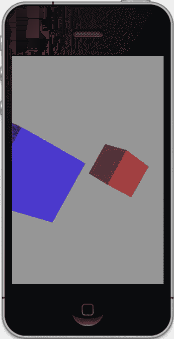
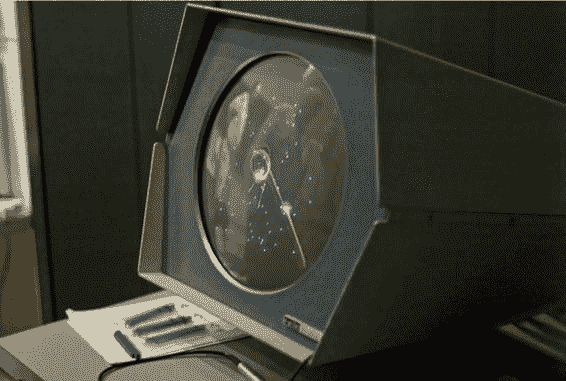

# 第 1 章：计算机图形学：从过去到现在

## 你的第一个 OpenGL ES 程序

有些软件教程会循序渐进地铺垫其特定主题（“枯燥的内容”），直到大约 655 页才开始编码和示例（“有趣的内容”）。另一些则会立即进入一些练习来满足你的好奇心，把枯燥的内容留到稍后再说。本书属于后一类。

**注意** `OpenGL ES` 是一个基于 `OpenGL` 库的 3D 图形标准，该库于 1992 年诞生于硅谷图形公司的实验室。它广泛应用于业界，从运行游戏的口袋设备到为 NASA 运行流体动力学模拟（以及玩非常非常快的游戏）的超级计算机，无所不包。ES 系列代表 *嵌入式系统*，意指小型、便携、低功耗的设备。除非另有说明，我将互换使用 `OpenGL` 和 `OpenGL ES`。

在为 iOS 开发任何应用时，习惯上让 Xcode 通过其各种向导在项目开始时完成繁重的工作。使用 Xcode（本书以 Xcode 4 为参考），你可以轻松创建一个 `OpenGL ES` 示例项目，然后添加自己的内容，最终形成一个可能有人愿意从 App Store 购买的东西。

在 Xcode 4 运行的情况下，转到 `File New New Project`，你应该会看到类似图 1-1 的界面。

**图 1-1.** Xcode 项目向导

[www.it-ebooks.info](http://www.it-ebooks.info)

选择 `OpenGL Game` 模板，并填写所需的项目数据。无论是为 iPhone 还是 iPad 开发都无所谓。

现在编译并运行，确保你拥有管理员权限。如果你没有因为不当的修改而破坏任何东西，你应该会看到类似图 1-2 的内容。

**图 1-2.** 你的第一个 `OpenGL ES` 项目。给自己一个击掌庆祝吧。

代码将在稍后讲解。别担心，你会构建出比几个旋转立方体更酷的东西。主要项目将基于 Distant Suns 3 中使用的一些代码，构建一个简单的太阳系模拟器。但现在，是时候进入枯燥的内容了：计算机图形学的起源和未来走向。

## 计算机图形学的斑驳历史

说 3D 如今风靡一时，是最轻描淡写的说法。尽管“3D”图像的某些形式可以追溯到一个多世纪以前，但它似乎终于成熟了。

首先，让我们看看什么是 3D，什么不是。

[www.it-ebooks.info](http://www.it-ebooks.info)

### 好莱坞的 3D

1982 年，迪士尼发行了《创》，这是第一部广泛使用计算机图形学描绘电子游戏内部生活的电影。尽管这部电影在评论和财务上都遭遇了失败（与 2011 年上映的大预算续集不无相似之处），但它最终将与《艳舞女郎》和《洛基恐怖秀》一起跻身邪典电影之列。好莱坞已经尝到了苹果的滋味，没有回头路可走。

追溯到 19 世纪，我们今天所谓的“3D”更常被称为立体视觉。在维多利亚时代，流行的立体镜可以在当时的许多客厅中找到。可以将这项技术视为早期的 Viewmaster。用户将立体镜举到面前，将一张立体照片滑入远端，就能看到某个遥远地方的景色，但不是平面的 2D 图片，而是立体的。每只眼睛只能看到卡片的一半，卡片上有两张几乎相同、相距仅几英寸拍摄的照片。

立体视觉赋予了我们视野中的深度概念。我们的两只眼睛向大脑传递两个略有不同的图像，大脑随后以我们理解为深度感知的方式解读它们。单个图像不会有这种效果。

最终，这被应用到了电影中，早在 1903 年就曾短暂且不成功地尝试过（据说短片《火车进站》曾让观众跑出影院，以躲避明显朝他们驶来的火车），并在 1950 年代初期复兴，其中《魔鬼玩偶》可能是最知名的。

最初的 3D 电影形式通常使用“红蓝立体”技术，要求观众佩戴廉价的塑料眼镜，一只眼睛上带有红色滤光片，另一只眼睛上带有蓝色滤光片。偏振系统在 1950 年代初期被采用，允许看到彩色电影的立体效果，并且与今天的情况基本相同。好莱坞担心电视会扼杀电影业，需要一些电视无法实现的噱头来继续销售电影票，但由于所需的摄像机和投影仪都过于不切实际且成本高昂，这种形式失宠了，电影业也照样挣扎前行。

随着 1990 年代数字投影系统的出现，以及像《玩具总动员》这样的全渲染电影，立体电影乃至电视最终变得既实用又足够经济，得以超越噱头阶段。特别是，全长动画长片（《玩具总动员》是第一部）使得转换为立体成为一件轻而易举的事。所需要做的只是从稍微不同的视角重新渲染整部电影。这正是立体视觉和 3D 计算机图形学融合之处。

### 计算机图形学的曙光

关于计算机图形学以及整个计算机历史的一个迷人之处在于，这项技术仍然如此新颖，以至于许多巨擘仍与我们同行。要找出是谁发明了马鞭可能很难，但如果你想知道如何为 1960 年代的阿波罗登月舱计算机编程的第一手资料，我知道该给谁打电话。

[www.it-ebooks.info](http://www.it-ebooks.info)

计算机图形学（常被称为 CG）大致分为三种类型：用于用户界面的 2D，用于飞行或其他形式模拟以及游戏的实时 3D，以及在非实时用途中质量优先于速度的 3D 渲染。

**麻省理工学院**

