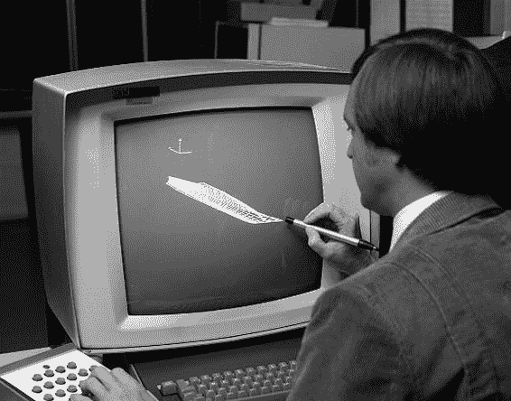
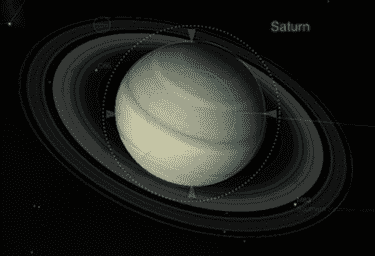
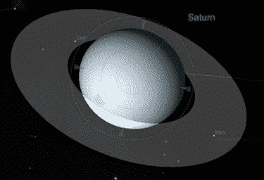
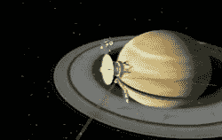
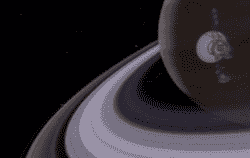
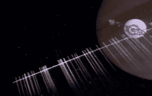
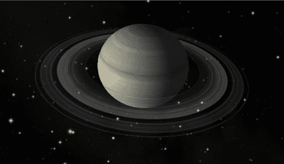
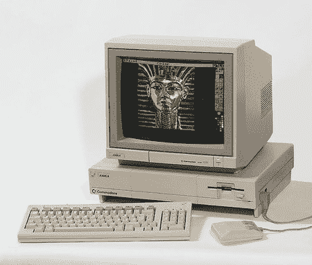

# 计算机图形学：从过去到现在

1961 年，麻省理工学院（MIT）的一名工程系学生名叫伊万·萨瑟兰（Ivan Sutherland），他在攻读博士学位期间，利用向量示波器、一支简陋的光笔以及一台定制的林肯 TX-2 计算机（从 TX-2 项目组分离出来的团队后来成立了 DEC 公司），创建了一个名为 `Sketchpad` 的系统。

`Sketchpad` 的革命性图形用户界面展示了现代 UI 设计的许多核心原则，更不用说它还融入了大量的面向对象架构思想。

**注意**：欲观看 `Sketchpad` 的操作视频，请前往 YouTube 搜索 `Sketchpad` 或 `Ivan Sutherland`。

萨瑟兰的一位同学史蒂夫·拉塞尔（Steve Russell）发明了或许是史上最大的时间杀手之一——电子游戏。拉塞尔在 1962 年创建了传奇游戏 `Spacewar`，它运行在 `PDP-1` 上，如图 1-3 所示。

**图 1-3.** 1962 年的游戏 `Spacewar`，在加州山景城计算机历史博物馆的一台老式 `PDP-1` 上重现。照片由 Joi Itoh 拍摄，遵循知识共享署名 2.0 通用许可协议（`http://creativecommons.org/licenses/by/2.0/deed.en`）。

到 1965 年，IBM 发布了被认为是第一款广泛使用的商用图形终端——`2250`。该终端与低成本的 `IBM-1130` 计算机或 `IBM S/340` 搭配使用，主要面向科学界。

[www.it-ebooks.info](http://www.it-ebooks.info)

**第 1 章：计算机图形学：从过去到现在**

**6**

也许最早在电视上展示计算机图形学的例子之一，是 1965 年 12 月 CBS 新闻对双子星 6 号和 7 号联合任务的报道中使用了 `2250` 终端（IBM 为双子星建造了机载计算机系统）。该终端被用于在实况电视中演示从发射到交会的任务各个阶段。在 1965 年，其成本约为 10 万美元，相当于一栋非常不错的房子。参见图 1-4。

**图 1-4.** 1965 年的 `IBM-2250` 终端。图片由 NASA 提供。

## 犹他大学

萨瑟兰于 1968 年受聘于犹他大学，在其计算机科学项目工作，他自然地将精力集中在图形学上。在接下来的几年里，许多未来的计算机图形学远见者都将先后在该大学的实验室中深造。

例如，埃德·卡特穆尔（Ed Catmull）热爱经典动画，但苦于自己无法绘画——正如人们所看到的那样，这在当时是艺术家的必备技能。他意识到计算机可能是制作电影的一条途径，于是制作了有史以来第一个计算机动画，内容是他的手张开和合上。这段剪辑后来被用到了 1976 年的电影《未来世界》中。

在那段时间里，他开创了两项重要的计算机图形学创新：纹理映射和双三次曲面。前者可以通过使用纹理图像来为简单的形体增加复杂性，而不必使用离散的点或面来创建纹理和粗糙感，如图 1-5 所示。后者用于通过算法生成弯曲的曲面，这比传统的多边形网格要高效得多。

[www.it-ebooks.info](http://www.it-ebooks.info)

**第 1 章：计算机图形学：从过去到现在**

**7**

**图 1-5.** 有纹理和无纹理的土星

卡特穆尔最终进入了卢卡斯影业，后来到了皮克斯，并最终担任迪士尼动画工作室的总裁，在那里他终于可以制作自己渴望看到的电影。这真是一份不错的差事。

许多其他业内顶尖人物也同样曾在犹他大学和萨瑟兰的影响下学习或工作：

-   **约翰·沃诺克（John Warnock）**，他在开发一种名为 `PostScript` 的设备无关的图形显示与打印方法以及便携式文档格式（PDF）方面发挥了重要作用，并且是 Adobe 公司的联合创始人。
-   **吉姆·克拉克（Jim Clark）**，硅谷图形公司（SGI）的创始人，SGI 为好莱坞提供了当时一些最好的图形工作站，并创建了现在被称为 `OpenGL` 的 3D 软件开发框架。

OpenGL。SGI 之后，他联合创立了网景通信公司，后者将引领我们进入万维网的领域。

吉姆·布林（Jim Blinn）发明了凹凸贴图（一种为物体高效添加真实三维纹理的方法）和环境映射（用于创建闪亮物体的技术）。他最为人熟知的或许是：为 NASA 的“旅行者”号项目制作了革命性的动画，描绘了飞船飞越外行星的过程，如图 1-6 所示（可与图 1-7 中现代设备的效果对比）。关于布林，萨瑟兰曾这样评价：“世界上大约有十二位伟大的计算机图形学人物，而吉姆·布林一人就占了六位。”布林后来领导了微软与`OpenGL`的竞争项目，即`Direct3D`。

[www.it-ebooks.info](http://www.it-ebooks.info)

**第 1 章：计算机图形学：从过去到现在**

**8**

图 1-6：吉姆·布林描绘的 1981 年 8 月“旅行者 2 号”飞越土星的场景。请注意穿越环平面时由冰粒形成的条纹。图片由 NASA 提供。

图 1-7：将图 1-6（使用当时最先进的图形计算机和软件）与`Distant Suns 3`（运行在价值 500 美元的 iPad 上）中相似的土星景象进行比较。

**在好莱坞走向成熟**

计算机图形学在 20 世纪 80 年代真正开始崭露头角，这要归功于好莱坞以及那些性能越来越强大、成本却越来越低的机器。例如，1985 年推出的备受喜爱的康懋达`Amiga`，售价不到 2000 美元，却为消费市场带来了先进的多任务操作系统和彩色图形，而这些此前是价值超过 10 万美元的工作站的专属。见图 1-8。

[www.it-ebooks.info](http://www.it-ebooks.info)

**第 1 章：计算机图形学：从过去到现在**

**9**

图 1-8：1985 年左右生产的 Amiga 1000。照片由 Kaivv 拍摄，遵循知识共享署名 2.0 通用许可协议（[`creativecommons.org/licenses/by/2.0/deed.en`](http://creativecommons.org/licenses/by/2.0/deed.en)）。

将此与 18 个月前发布、价格相近的原版黑白 Mac 进行比较。Mac 配备了非常原始的操作系统、平面文件系统和 1 位显示器，这为不同阵营之间爆发的关于谁家机器更好的“宗教战争”提供了肥沃的土壤（这些战争也波及了 Atari ST）。

**注意** 原始`Amiga`上的一种特殊图形模式可以将 4096 种颜色压缩到一个通常最多只能支持 32 色的系统中。这种模式被称为“保持并修改”（HAM 模式），最初由设计师杰伊·迈纳（Jay Miner）出于实验目的将其放在了一个主芯片上。尽管他想移除这个公认的、会产生大量色彩失真图像的权宜之计，但这样会在芯片上留下一个大空白区域。考虑到没有一个自尊的工程师能容忍闲置的芯片区域，他便保留了这一功能。令迈纳大吃一惊的是，人们开始使用它。

堪萨斯州一家名为`NewTek`的公司率先使用`Amiga`与其特殊硬件`Video Toaster`相结合，用于渲染高质量 3D 图形。结合名为`Lightwave 3D`的复杂 3D 渲染软件包，`NewTek`向任何愿意花费几千美元的人敞开了获得廉价、网络级图形的大门。这一发展为诸如《巴比伦 5 号》或《深海冒险》这样需要大量特效的科幻剧集在经济上可行提供了可能。

在 20 世纪 80 年代，更多技术和创新逐渐在计算机图形学社区中得到普及：

[www.it-ebooks.info](http://www.it-ebooks.info)

**第 1 章：计算机图形学：从过去到现在**

**10**

洛伦·卡彭特（Loren Carpenter）开发了一种使用称为分形的技术，通过算法生成高度精细的地形。卡彭特

`was` 受雇于卢卡斯影业，为一家名为皮克斯的新公司创建渲染软件包。成果便是 `REYES`，代表“渲染你曾见过的一切”（Render Everything You Ever Saw）。

特纳·惠特德开发了一种名为光线追踪的技术，能够生成高度逼真的场景（但会消耗大量 CPU 资源），尤其是当场景中包含具有各种反射和折射属性的物体时。玻璃物品是早期光线追踪作品中常见的主题，如图 1-9 所示。

弗兰克·克劳发明了计算机图形学中首个实用的抗锯齿方法。锯齿现象是由于显示分辨率较低而产生的边缘锯齿状效应。克劳的方法能够平滑从线条到文字的所有元素，生成更自然、更悦目的图像。请注意，卢卡斯影业的早期游戏之一名为 `Rescue on Fractalus`。其中的反派被称为“锯齿怪”（jaggies，也是抗锯齿的另一个术语）。

《星际迷航 2：可汗之怒》带来了首个完全由计算机生成的场景序列，用于展示一种名为“创世机器”的设备如何能在无生命星球上创造生命。该模拟被称为“永不消逝的特效”，因为它采用了火焰和粒子动画方面的开创性技术，同时使用了分形地形。

图 1-9. 像这样的精美图像，业余爱好者使用诸如开源软件 POV-Ray 等程序也能制作出来。摄影：Gilles Tran，2006 年。  
www.it-ebooks.info

