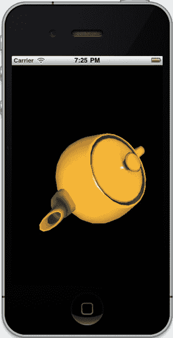
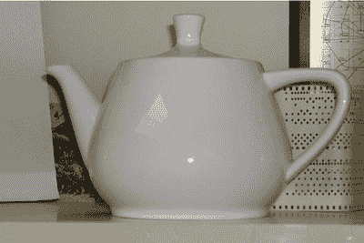
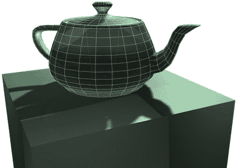

# 第 1 章：计算机图形学：从过去到现在

**31**

现在来做个对比，图 1-13 展示了 OpenGL ES 2 的管线。设计上稍微简化了一些，但编码实现起来可能会更加繁琐。

OpenGL 应用程序

几何体与纹理

顶点数据

顶点着色器

片段

光栅化器

逐片段操作

片段着色器

帧缓冲区

深度与混合

眼球

“嘿，这更酷了！”

图 1-13. OpenGL ES 2.x 管线基本概览

当这一切完成，所有光栅都被光栅化，顶点着色完毕，颜色也经过混合后，你或许真的会看到类似图 1-14 中那个茶壶的图像。

**注意** 你越是深入研究计算机图形学，就越会看到一个小茶壶在书籍示例乃至电视电影（*辛普森一家*、*玩具总动员*）中频繁出现。这个茶壶的传奇故事，有时被称为犹他茶壶（一切都能追溯到犹他州），始于 1975 年一位名叫马丁·纽厄尔的博士生。他需要一个具有挑战性但又常见的物体作为博士工作的研究对象。他的妻子建议使用他们家的白色茶壶，于是纽厄尔费力地手工将其数字化。当他将数据发布到公共领域后，它迅速成为图形编程界“Hello World！”般的标志性存在。就连苹果开发者网站上早期的 OpenGL ES 示例中也包含一个茶壶演示。这个原始茶壶如今收藏于加利福尼亚州山景城的计算机历史博物馆，距离谷歌仅几个街区。参见图 1-14 左上角的图片。

[www.it-ebooks.info](http://www.it-ebooks.info)

