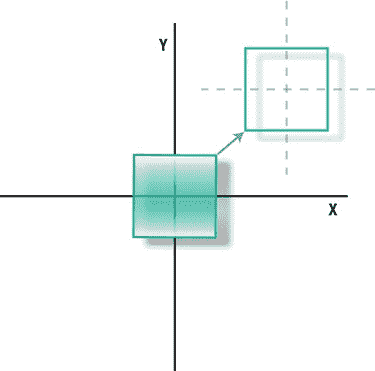
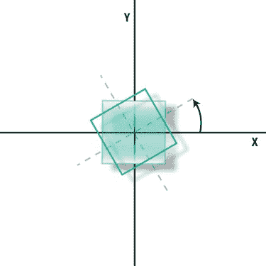

# 第 1 章：计算机图形学：从过去到现在

**32**

**图 1-14.** 左上角为纽厄尔使用的真实茶壶，现展示于加利福尼亚州山景城的计算机历史博物馆。照片由史蒂夫·贝克拍摄。右侧为苹果开发者网站上的一个 OpenGL 应用示例。左下角的绿色茶壶由海·克兰南制作。

## 总结

本章我们简要回顾了计算机图形学的历史，提供了一个基础示例程序，并且最重要的是，介绍了犹他茶壶。接下来，我们将深入且细致地探讨 3D 图像背后的数学原理。

[www.it-ebooks.info](http://www.it-ebooks.info)

