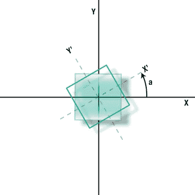
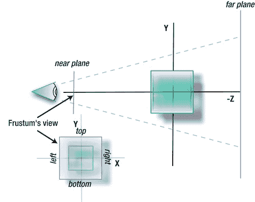
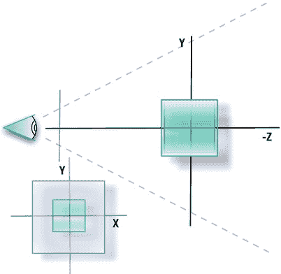
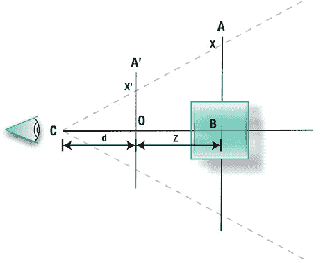
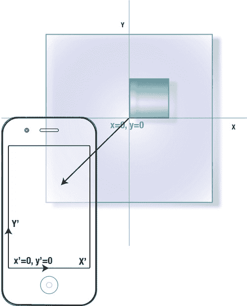
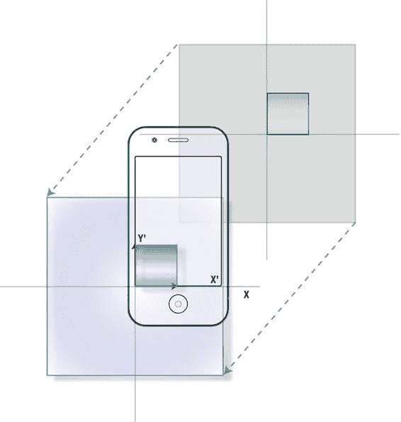

# 第 2 章：那些数学玩意儿

**34**

## 二维变换

你可能在不知不觉中已经以简单平移的形式使用过二维变换了。如果你创建了一个 `UIImageView` 对象，并希望根据用户触摸屏幕的位置来移动它，你可能会获取它的 `frame` 并更新 `origin` 的 `x` 和 `y` 值。

### 平移


您有两种方式来可视化这一过程。第一种是让物体本身相对于公共原点移动，这被称为**几何变换**。第二种是保持物体静止，让世界原点移动，这被称为**坐标变换**。在 OpenGL ES 中，这两种描述通常结合使用。

平移操作可以这样表示：

*x*′ = *x* + *T*

*y*′ = *y* + *T*

原始坐标为`x`和`y`，而平移量`T`会将点移动到新位置。简单明了。可以看出，平移操作天然会非常快速。

**注意**：小写字母（如`xyz`）表示坐标，而大写字母（如`XYZ`）表示轴。

## 旋转

现在让我们看看旋转。这里，我们首先绕世界原点旋转，以简化问题。（见图 2-2。）



**图 2-2.** 绕公共原点旋转

自然地，当我们不得不拾起高中数学知识时，事情会变得复杂。当前的任务是找出正方形在任意旋转角度`a`下，其角点的位置。顿时众人双眼迷离。

**注意**：按照惯例，逆时针旋转视为正方向，顺时针旋转视为负方向。

假设`x`和`y`是正方形某个顶点的坐标，且该正方形是标准化的。未旋转时，任何顶点自然直接映射到我们的`x`和`y`坐标系中，这没问题。现在我们要将正方形旋转角度`a`。

尽管它的角点在其自身的局部坐标系中仍在“相同”位置，但在我们的坐标系中它们却不同了。如果我们想要实际绘制该物体，就需要知道新坐标`x'`和`y'`。

现在，我们可以直接跳到可靠的旋转方程，因为最终代码会表达这些内容：

*x*′ = *x* cos(*a*) − *y* sin(*a*)
*y*' = *x* sin(*a*) + *y* cos(*a*)

做一个快速的简单验证，你可以看到，如果`a`为 0 度（无旋转），`x'`和`y'`会退化为原始坐标`x`和`y`。如果旋转 90 度，则`sin(a)=1`，`cos(a)=0`，因此`x'= -y`，`y'= x`。这与预期完全一致。

数学家们总是喜欢用最紧凑的形式表达事物。因此，二维旋转可以用矩阵符号“简化”：

```
⎡cos(a)  -sin(a)⎤
Ra = ⎢               ⎥
     ⎣sin(a)   cos(a)⎦
```

**注意**：《星际迷航》中最滥用的词之一是`matrix`（矩阵）。模式矩阵在这里，缓冲矩阵在那里——“一号，我头痛矩阵，需要小睡矩阵。”（别提《24 小时》里`protocol`（协议）的用法了。）每一个有点自尊心的《星际迷航》喝酒游戏（好像有哪个喝酒游戏是自尊的）都应该在选词中使用`matrix`。

`Ra`是我们二维旋转矩阵的简写。虽然矩阵看起来可能很复杂，但它们实际上相当直接且易于编码，因为它们遵循精确的模式。在这种情况下，`x`和`y`可以表示为一个微小的矩阵：

```
⎡x'⎤   ⎡cos(a)  -sin(a)⎤ ⎡x⎤
⎢   ⎥ = ⎢               ⎥ ⎢   ⎥
⎣y'⎦   ⎣sin(a)   cos(a)⎦ ⎣y⎦
```

平移也可以编码为矩阵形式。因为平移仅仅是移动点，所以`x`和`y`平移后的值来自于将移动量加到点上。如果你想对同一个物体同时进行旋转和平移怎么办？平移矩阵需要进行一点不那么显而易见的思考。以下哪个是正确的，第一个还是第二个？

```
           ⎡ 1   0  ⎤                ⎡ 1   0   1 ⎤
T = ⎢ 0   1  ⎥  或  T = ⎢ 0   1   1 ⎥
           ⎣ Tx  Ty ⎦                ⎢ Tx  Ty  1 ⎥
```

答案显然是第二个，或者可能不那么明显。第一个矩阵会得出以下结果，这没有多大意义：

*x*′ = *x* + *yT*
*y*' = *x* + *yT*  中的`x`和`y`


好的，作为高级文档工程师和翻译员，我将严格遵循您提供的注意事项和格式，对以下英文文本进行翻译。


因此，为了创建用于平移的矩阵，我们需要为二维点引入第三个分量，通常写作 `(x,y,1)`，如第二个表达式所示。暂且忽略 `1` 的来源，注意这可以轻松简化为：
`x′ = x + Tx`, `y′ = y + Ty`。

`1` 的值不应与 `z` 的第三维度混淆；相反，它是一种用于表达直线方程（在本例中为二维空间）的方法，与我们小学时学习的斜率/截距形式略有不同。这种形式的坐标集称为齐次坐标，在这种情况下，它有助于创建一个 3x3 的矩阵，该矩阵现在可以与其他 3x3 矩阵组合或连接。

我们为什么要这样做？如果我们想同时进行旋转和平移该怎么办？可以为每个点使用两个独立的矩阵，这样也可以工作。但我们可以使用矩阵乘法（也称为连接）从多个矩阵中预先计算出一个矩阵，这个矩阵代表了各个变换的累积效果。这不仅节省了空间，还可以显著提升性能。

在 Core Animation 和 Core Graphics 中，你会看到许多名称中包含 `affine` 的变换方法。你可以将这些方法视为变换（此处指二维变换），它们可以分解为以下一种或多种：旋转、平移、剪切和缩放。所有可能的二维仿射变换都可以表示为 `x′ = ax + cy + e` 和 `y′ = bx + dy + f`。这就构成了一个非常好的矩阵，一个非常可爱的矩阵：

```
    ⎡ a b 0⎤          ⎡ x'⎤   ⎡ a b 0⎤⎡ x⎤
T = ⎢ c d 0⎥      so  ⎢ y'⎥ = ⎢ c d 0⎥⎢ y⎥
    ⎣ e f 1⎦          ⎣ 1 ⎦   ⎣ e f 1⎦⎣ 1⎦
```

现在看看 `CGAffineTransform` 的结构：

```
struct CGAffineTransform {
    CGFloat a;
    CGFloat b;
    CGFloat c;
    CGFloat d;
    CGFloat tx; // 在 x 方向上的平移
    CGFloat ty; // 在 y 方向上的平移
};
```

看起来很熟悉吗？

## 缩放

在另外两种变换中，让我们看看缩放，或者说对象的简单调整大小：

`x' = xSx` 和 `y′ = ySy`

在矩阵形式中，它变成了这样：

```
    ⎡ Sx  0 0⎤
S = ⎢ 0  Sy 0⎥
    ⎣ 0   0 1⎦
```

缩放与其他两种变换一样，应用于几何图形时，顺序非常重要。例如，假设你想旋转并移动你的对象。根据你是先平移还是后平移，结果会明显不同。更常见的顺序是先旋转对象，然后平移，如图 2-3（左）所示。但如果你颠倒顺序，你会得到类似图 2-3（右）的结果。在这两种情况下，旋转都是围绕原点进行的。如果你想围绕对象自身的原点旋转，第一个示例适合你。如果你希望它与所有其他对象一起旋转，第二个示例则适用。（一个典型的情况可能是你将对象平移到世界原点，旋转它，然后再平移回去。）

图 2-3. 绕原点旋转后平移（左）与先平移后旋转（右）

那么，这和三维的东西有什么关系呢？很简单！这些原理的大部分（即使不是全部）都可以应用于三维变换，并且通过少一个维度的说明可以更清晰地阐明。

## 三维变换

当将你学到的所有知识迁移到三维空间（也称为 3 空间）时，你会看到，与二维一样，三维变换也可以表示为一个矩阵，并且可以与其他矩阵进行连接。额外的 `z` 维度现在代表了场景中进出屏幕的深度。OpenGL ES 中 `+z` 是朝外，`-z` 是朝内。其他系统可能正好相反，甚至让 `z` 轴垂直，而 `y` 轴承担深度。我将遵循 OpenGL 的惯例，如图 2-4 所示。

**注意**：在不同的参考系之间来回转换，是仅次于试图弄清楚福克斯为什么取消《萤火虫》的最快让人抓狂的方式。1973 年的经典著作《交互式计算机图形学原理》中，`z` 轴向上，`+y` 轴指向屏幕内部。在他的书中，微软飞行模拟器的创建者 Bruce Artwick 展示了位于视平面内的 `x` 和 `y` 轴，但 `+z` 轴指向屏幕 *内部*。而另一本书（听好了！）中，`z` 轴向上，`y` 轴向 *右*，`x` 轴朝向观察者。这简直该有法律来管管……。

图 2-4. z 轴指向观察者。

首先，我们来看看三维变换。就像二维变换仅仅是将所需的增量加到原始位置一样，三维变换也是如此。描述该变换的矩阵如下所示：

```
      ⎡ 1 0 0 0⎤            ⎡ x'⎤   ⎡ 1 0 0 0⎤⎡ x⎤
      ⎢ 0 1 0 0⎥            ⎢ y'⎥   ⎢ 0 1 0 0⎥⎢ y⎥
T =   ⎢ 0 0 1 0⎥      so    ⎢ z'⎥ = ⎢ 0 0 1 0⎥⎢ z⎥
      ⎣ Tx Ty Tz 1⎦         ⎣ 1 ⎦   ⎣ Tx Ty Tz 1⎦⎣ 1⎦
```

当然，这将产生以下结果：

`x′ = x + Tx`, `y′ = y + Ty`, 和 `z′ = z + Tz`

注意增加的 `1`；这与二维中的情况相同，因此我们的点位置现在以齐次形式表示。

那么，让我们来看看旋转。可以放心地假设，如果我们要绕 Z 轴旋转（图 2-5），方程将直接映射到二维版本。使用矩阵来表达，我们得到如下结果（注意新的标记法 `R(z,a)`，用于明确表示所操作的是哪个轴）。注意 `z` 保持不变，因为它乘以了 `1`：

```
           ⎡ cos(a)  -sin(a)  0 0⎤
           ⎢ sin(a)   cos(a)  0 0⎥
R(z, a) =  ⎢ 0        0       1 0⎥
           ⎣ 0        0       0 1⎦
```

图 2-5. 绕 z 轴旋转

这看起来几乎与它的二维版本完全相同，只是多了 `z′ = z`。但现在我们也可以绕 `x` 轴或 `y` 轴旋转。对于 `x` 轴，我们得到：

```
           ⎡ 1  0        0       0⎤
           ⎢ 0  cos(a)  -sin(a)  0⎥
R(x, a) =  ⎢ 0  sin(a)   cos(a)  0⎥
           ⎣ 0  0        0       1⎦
```

当然，对于 `y` 轴，我们得到：

```
           ⎡  cos(a)  0  sin(a)  0⎤
           ⎢  0       1  0       0⎥
R(y, a) =  ⎢ -sin(a)  0  cos(a)  0⎥
           ⎣  0       0  0       1⎦
```

但是，如果叠加多个变换呢？那就会变得非常复杂。幸运的是，你不必过于担心这一点，因为你可以让 OpenGL 来处理繁重的工作。这就是它的用途。

假设我们想先绕 `y` 轴旋转，然后绕 `x` 轴，最后绕 `z` 轴旋转。得到的矩阵可能类似于下面这样（使用 `a` 表示绕 x 轴的旋转，`b` 表示绕 y 轴的旋转，`c` 表示绕 z 轴的旋转）：

```
⎡ cos(b)cos(c)-sin(b)sin(a)sin(c)   -cos(b)sin(c)+sin(b)sin(a)cos(c)   sin(b)cos(a)  0⎤
⎢ sin(c)cos(a)                       cos(c)cos(a)                     -sin(a)       0⎥
R=⎢-sin(b)cos(c)+cos(b)sin(a)sin(c)   sin(c)sin(b)+cos(b)sin(a)cos(c)   cos(a)cos(b)  0⎥
⎣ 0                                  0                                 0             1⎦
```

简单吧，嗯？难怪三维引擎作者的座右铭是优化、优化、再优化。事实上，在原始 Amiga 版 *Distant Suns* 中，我的部分内部循环需要用 68K 汇编语言来编写。并且注意，这甚至还没有包括缩放或平移。

现在让我们进入本书的主题：所有这些都可以通过以下三行代码来完成：

```
glRotatef(b,0.0,1.0,0.0);
glRotatef(a,1.0,0.0,0.0);
glRotatef(c,0.0,0.0,1.0);
```


**注意** OpenGL ES 1.1 中有许多函数在 2.0 版本中不可用。后者面向底层操作，牺牲了一些易用性工具函数，以换取灵活性和控制力。变换函数已消失，开发者需要自行计算矩阵。幸运的是，有许多不同的库可以模拟这些操作。苹果在 iOS 5 的发布中推出了这样一个库。

该库称为 ES 框架 API（在苹果官方的《OpenGL ES 2.0 编程指南》中有描述），旨在简化向 OpenGL ES 2.0 的过渡。

在 OpenGL 中，这个特定的矩阵被称为模型视图矩阵，因为它应用于你所绘制的任何对象（无论是模型还是光源）。稍后我们还会处理另外两种矩阵：投影矩阵和纹理矩阵。

需要强调的是，在尝试实现这些效果时，旋转的实际顺序绝对至关重要。例如，一个常见的任务是模拟具有完整六自由度的飞机或航天器：三个平移分量和三个旋转分量。旋转部分通常称为滚转、俯仰和偏航（RPY）。滚转是围绕`z`轴旋转，俯仰是围绕`x`轴旋转（即控制机头向上或向下），偏航是围绕`y`轴旋转，使机头左右移动。图 2-6a、b 和 c 展示了 20 世纪 60 年代登月任务中阿波罗飞船上的这一过程。正确的顺序应是偏航、俯仰、滚转，即先绕`y`轴旋转，再绕`x`轴旋转，最后绕`z`轴旋转。（这需要 12 次乘法和 6 次加法，而将三个旋转矩阵预先相乘可减少到 9 次乘法和 6 次加法。）变换应是增量式的，只包含自上次更新以来 RPY 角度的变化，而非从头开始的全部变化。在那些美好的旧时光里，舍入误差可能会累积并扭曲矩阵，导致非常酷但出乎意料的结果（不过仍然很酷）。

**引擎位置**

-   滚转
-   俯仰
-   滚转
-   俯仰
-   滚转
-   偏航
-   滚转
-   偏航

**旋转控制**

-   偏航
-   俯仰

**飞行指引仪姿态指示器**

-   滚转
-   俯仰和偏航

**想象一下：将物体投影到屏幕上**

哎呀，即使经历了以上所有步骤，我们还没完。在完成所有对象的旋转、缩放和平移后，还需要将它们投影到屏幕上。自从人类在洞穴墙壁上画出第一头猛犸象以来，将 3D 场景转换为 2D 表面就一直困扰着他们。但与变换不同，这其实很容易理解。

这里涉及两种主要的投影：透视投影和平行投影。


## 透视投影与平行投影

透视投影是我们通过二维视网膜观察三维世界的方式。透视视图包含**消失点**和**透视缩短**现象。消失点是所有平行线在远处汇聚的点，提供了深度感知（想象一下铁轨延伸向地平线的景象）。结果是，物体越近看起来越大，越远则越小，如图 2-7 所示。平行投影又称**正投影**，通过将每个顶点的 `z` 分量有效设置为 `0`（即观察平面的位置），简单地消除了距离的影响，如图 2-8 所示。

**图 2-7.** 透视投影

**图 2-8.** 平行投影

[www.it-ebooks.info](http://www.it-ebooks.info)

  


## 第 2 章：那些数学杂谈

在透视投影中，距离分量 `z` 用于缩放最终屏幕上的 `x` 和 `y` 值。因此，`z` 值越大，即物体离观察者越远，视觉上呈现的尺寸就越小。这里需要的是视口（OpenGL 中对应于窗口或显示屏幕的概念）的尺寸及其中心点（通常是 XY 平面的原点）。

最后阶段涉及设置观察截锥体。该截锥体定义了六个裁剪平面（上、下、左、右、近、远），用于精确确定用户应看到的内容以及如何将其投影到视口上（视口是 OpenGL 中对应于窗口或屏幕的概念）。它类似于进入 OpenGL 虚拟世界的一个镜头。通过改变这些值，你可以拉近或拉远视图，裁剪掉非常远的物体，或者完全不进行裁剪，如图 2-9 和图 2-10 所示。透视矩阵由这些值定义。

**图 2-9.** 截锥体的窄边界提供了高倍率镜头。

**图 2-10.** 更宽的边界类似于广角镜头。

[www.it-ebooks.info](http://www.it-ebooks.info)



## 第 2 章：那些数学杂谈

确定了这些边界后，最后一步变换就是映射到视口（OpenGL 中对应于屏幕的概念）。此时，OpenGL 会接收屏幕的尺寸（即显示区域的尺寸）和原点（通常是屏幕的左下角）。在 iPhone 或 iPad 等小型设备上，你通常会填满整个屏幕，因此会使用屏幕的宽度。但如果你希望将图像放置在主显示器的子窗口中，只需向视口传递较小的值即可。这里运用了相似三角形的原理。

在图 2-11 中，我们需要根据模型上任意顶点的 `x` 值，求出其投影后的 `x'`。考虑两个三角形：一个由角点 CBA 构成，另一个较小的三角形由 COA' 构成（O 代表原点）。从 C（眼睛的位置）到 O 的距离是 `d`。从 C 到 B 的距离是 `d + z`。因此，计算它们的比值，如下所示：

```
x' / x = d_eye / (z + d_eye)
y' / y = d_eye / (z + d_eye)
```

可得出以下结果：

```
x' = (x * d_eye) / (z + d_eye)
y' = (y * d_eye) / (z + d_eye)
```

**图 2-11.** 使用相似三角形定理将顶点映射到视口

图 2-12 展示了最终的平移。可以将平移量加到 `x'` 和 `y'` 上：

```
x' = (x * d_eye) / (z + d_eye) + Tx
y' = (y * d_eye) / (z + d_eye) + Ty
```

[www.it-ebooks.info](http://www.it-ebooks.info)

  


## 第 2 章：那些数学杂谈

**图 2-12.** 将 `x` 和 `y` 投影到设备屏幕上。你可以将其想象成将 iPhone（或 iPad）平移到物体的坐标系中（左图），或者将物体平移到 iPhone 的坐标系中（右图）。

当所有像素尘埃落定，我们得到一个漂亮的矩阵形式：

```
[ x' ]   [ d   0   0   Tx ] [ x ]
[ y' ] = [ 0   d   0   Ty ] [ y ]
[ z' ]   [ 0   0   0   0  ] [ z ]
[ 1  ]   [ 0   0   1   d  ] [ 1 ]
```

通常，最后还需要进行一些缩放——例如，当视口被归一化时。但这部分就留给你自行处理了。


  
**现在逆向而行，还要穿着高跟鞋**

这句据称是金格·罗杰斯在谈论与伟大的弗雷德·阿斯泰尔共舞时的感慨。言下之意是，尽管他舞技精湛，但她却必须做到他做的一切，还要逆向而行、穿着高跟鞋。（实际上罗杰斯似乎从未说过这句话；其出处可追溯至连环漫画《弗兰克与欧内斯特》中的一句搞笑台词。）

那么，这跟变换有什么关系呢？假设你想判断某人是否通过触摸屏幕选中了你的某个物体。如何知道哪个物体被选中了？你必须能够进行逆变换，将屏幕坐标“反解”回三维空间中可识别的坐标。但由于 Z 值在此过程中会丢失，你需要遍历物体列表，找出最可能的选中目标。对某个物体进行逆变换，意味着你要逆向完成所有操作。具体步骤如下：

1. 将模型视图矩阵与投影矩阵相乘。  
2. 对结果求逆。  
3. 将触摸点的屏幕坐标转换为视口参考系中的坐标。  
4. 将上一步结果与第二步得到的逆矩阵相乘。

别担心，本书后续章节会更详细地讲解这些内容。

**数学实操**

让我们证明上述数学运算正是 OpenGL ES 中的实际过程。在第 1 章的练习代码中某处添加以下代码（确保在 OpenGL 初始化后调用）。最佳位置是`drawFrame`方法的开头：

```
GLfloat mvmatrix[16];
glMatrixMode(GL_MODELVIEW);
glLoadIdentity(); //1
glGetFloatv(GL_MODELVIEW_MATRIX,mvmatrix);
glRotatef(30, 1.0, 0.0, 0.0); //2
glGetFloatv(GL_MODELVIEW_MATRIX,mvmatrix); //3
glRotatef(60, 1.0, 0.0, 0.0); //4
glGetFloatv(GL_MODELVIEW_MATRIX,mvmatrix); //5
```

在每次调用`glGetFloatv()`后设置断点并运行。

第 1 行将矩阵初始化为未旋转状态。获取当前矩阵内容后前进至第 2 行，并在调试器中检查矩阵。你应该看到类似这样的结果：

⎡1 0 0  ⎤  
⎢        ⎥  
⎢0 1 0  ⎥  
⎢        ⎥  
⎢0 0 1 0⎥  
⎢        ⎥  
⎣0 0 0 1⎦

第 2 行将矩阵绕*x 轴*旋转 30 度。（下一章会讲解`glRotatef()`。）前进至第 4 行并做同样操作。你看到了什么？

**四元数呢？**

四元数是超复数实体，能够以四维向量形式存储 RPY 信息。它们在性能和空间效率上都非常出色，常用于模拟飞行仿真中飞机或航天器的瞬时航向。四元数是一种奇妙的数学构造，拥有极佳特性，但这里暂不展开。

**GLKit 与 iOS5**

从 iOS5 开始，苹果推出了 GLKit，这是一组对象和辅助函数，能让 OpenGL 更易于使用。其中包含一个拥有近 150 个调用的庞大数学库，用于处理向量、矩阵和四元数。OpenGL ES 1.x 为变换提供了封装，隐藏了大量内部机制，而 OpenGL ES 2 则没有。在 GLKit 问世之前，广大开发者不得不自行编写或从其他渠道获取所需的数学库。苹果添加这些功能，既是为了改善 ES 2 开发者的体验，也便于从 1.1 版本进行移植。

**总结**

本章介绍了 3D 数学的基础知识。首先讲解了 2D 变换（旋转、平移和缩放），然后扩展到 3D，并涵盖了投影。尽管你很可能不需要自行编写变换代码，但熟悉本章内容对于理解后续 OpenGL 术语至关重要。

我头好疼。  


