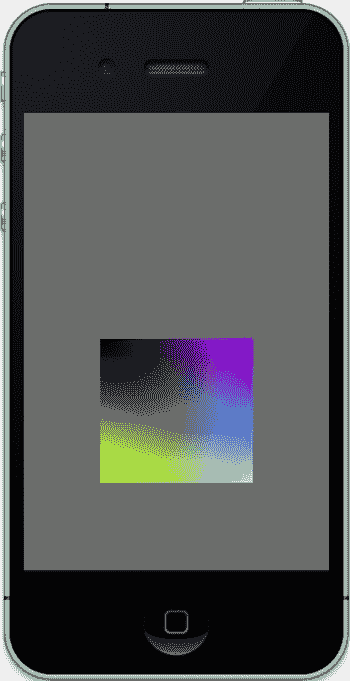
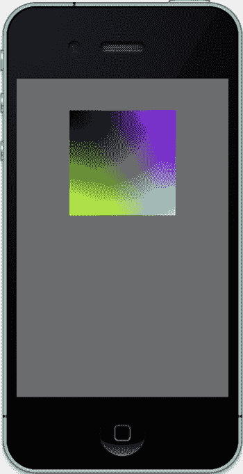

# 视锥体也用于指定视野（FOV），类似于相机广角镜头与长焦镜头的区别。侧面与中心轴形成的角度（即它们展开的程度）越大，视野就越大。较大的视野能让你看到更多世界中的内容，而较小的视野则让你能将注意力集中于更小的区域。

到目前为止，平移和旋转都使用模型视图矩阵，可通过调用 `glMatrixMode(GL_MODELVIEW);` 轻松设置。但现在，在渲染流程的这一阶段，你需要定义并使用投影矩阵（详见第 1 章中的列表 1-2）。

这主要通过第 2 章“想象一下”一节中详述的视锥体定义来实现。同时，这也是一种非常简洁的方式来处理大量运算。

将变换后的顶点转换为 2D 图像的最终步骤如下：

1.  视锥体内的 3D 点被映射到一个标准化立方体，以将 XYZ 值转换为 NDC。`NDC` 代表标准化设备坐标，这是一个描述视锥体内坐标空间的中间系统。这在将每个顶点和对象映射到设备屏幕时非常有用，无论设备屏幕大小或像素多少——无论是 iPhone、iPad，还是屏幕尺寸完全不同的新设备。一旦获得这种形式，坐标就已经“移动”，但仍保留彼此之间的相对关系。当然，在 `ndc` 中，它们现在的值范围在-1 到 1 之间。请注意，内部 Z 值会被翻转。现在 `-Z` 朝向观察者，而 `+Z` 则远离，但幸运的是，这些令人不快的复杂操作都被隐藏了。

2.  接着，这些新的 NDC 被映射到屏幕上，同时考虑屏幕的宽高比以及顶点到屏幕的“距离”（由近裁剪平面指定）。因此，物体越远，看起来就越小。大部分数学运算仅用于确定视锥体内各物体的比例关系。

上述步骤描述的是透视投影，这也是我们通常观察世界的方式。也就是说，物体越远，看起来越小。当这些固有的扭曲被消除时，我们就得到了正交投影。此时，无论物体多远，它显示的大小都相同。正交渲染通常用于机械制图，因为任何透视变形都会破坏原图意的表达。

**注意：** 你经常需要明确指定当前处理的是哪个矩阵。调用 `glMatrixMode()` 用于指定当前矩阵，所有后续操作都将应用于该矩阵。忘记当前是哪个矩阵是一个容易犯的错误。

## 回到有趣的部分：一个更简单的演示

当 Xcode 4.2 发布时（伴随 iOS5 SDK），它改变了 OpenGL 向导的默认项目。此前，它生成的是一个 OpenGL ES 1 应用，显示一个非常简单的 2D 场景——一个扁平弹跳方块；而 OpenGL ES 2 环境则生成一个两个 3D 立方体围绕公共中心旋转的应用。前者是早期利用的理想项目，因为它比后者简单得多，正如第 1 章所述。因此，我们将使用原始演示及其后续变体作为基础项目，从一个已知且易于理解的代码库出发，以此为跳板去实现更宏大、更好的目标。

最简单的方法是从 Apress 网站获取源代码，或者拿第 1 章中的示例，将列表 3-1 和列表 3-2 中的内容覆盖第 1 章的视图控制器内容。

**列表 3-1.** 列表 3-2 的头文件。

```objc
#import <UIKit/UIKit.h>
#import <GLKit/GLKit.h>

@interface BouncySquareViewController : GLKViewController //1
@end
```

**列表 3-2.** 经典的弹跳方块演示（包含 iOS5 的修改）。


`# import "BouncySquareViewController.h"`

`@interface BouncySquareViewController ()`

`{`

`}`

`@property (strong, nonatomic) EAGLContext *context;`
`@property (strong, nonatomic) GLKBaseEffect *effect;`

`@end`

`@implementation BouncySquareViewController`

`@synthesize context = _context;`
`@synthesize effect = _effect;`

`- (void)viewDidLoad`
`{`
`[super viewDidLoad];`

`self.context = [[EAGLContext alloc] initWithAPI:kEAGLRenderingAPIOpenGLES1];` //2
`[www.it-ebooks.info](http://www.it-ebooks.info)`

`if (!self.context)`
`{`
`NSLog(@"Failed to create ES context");`
`}`

`GLKView *view = (GLKView *)self.view;`
`view.context = self.context;` //3
`view.drawableDepthFormat = GLKViewDrawableDepthFormat24;`

`[EAGLContext setCurrentContext:self.context];`

`}`

`#pragma mark - GLKView 和 GLKViewController 的委托方法`

`- (void)glkView:(GLKView *)view drawInRect:(CGRect)rect` //4
`{`
`static int counter=0;`

`static const GLfloat squareVertices[] = {` //5
`-0.5, -0.33,`
`0.5, -0.33,`
`-0.5, 0.33,`
`0.5, 0.33,`
`};`

`static const GLubyte squareColors[] = {` //6
`255, 255, 0, 255,`
`0, 255, 255, 255,`
`0, 0, 0, 0,`
`255, 0, 255, 255,`
`};`

`static float transY = 0.0;`

`glClearColor(0.5, 0.5, 0.5, 1.0);` //7
`glClear(GL_COLOR_BUFFER_BIT);`

`glMatrixMode(GL_PROJECTION);` //8
`glLoadIdentity();` //9
`glMatrixMode(GL_MODELVIEW);` //10
`glLoadIdentity();` //11
`glTranslatef(0.0, (GLfloat)(sinf(transY)/2.0), 0.0);` //12

`transY += 0.075f;`
`[www.it-ebooks.info](http://www.it-ebooks.info)`

`glVertexPointer(2, GL_FLOAT, 0, squareVertices);` //13
`glEnableClientState(GL_VERTEX_ARRAY);`
`glColorPointer(4, GL_UNSIGNED_BYTE, 0, squareColors);`
`glEnableClientState(GL_COLOR_ARRAY);`

`glDrawArrays(GL_TRIANGLE_STRIP, 0, 4);` //14

`if(!(counter%100));` //15
`NSLog(@"FPS: %d\n",self.framesPerSecond);`

`counter++;`
`}`
`@end`

你会在这里识别出与第 1 章中许多相似的要素，但形式更为精简。为清晰起见，所有 OpenGL ES 2 的代码已被移除。

第 1 行将我们的视图控制器定义为 `GLKViewController` 的子类。

在第 2 行中，通过传入 `kEAGLRenderingAPIOpenGLES1` 标志，API 被初始化并选用了 OpenGL ES 1。返回的上下文被传入 `GLKView`。

第 3 行及之后几行绑定在第 2 行获取的上下文。然后设置当前上下文。如果没有设置，OpenGL 将在后续的许多调用中失败。

第 4 行的 `drawInRect()` 方法是来自 `GLKViewController` 的委托调用。为清晰起见，所有几何图形和属性都在此处指定。

第 5 行创建了一个顶点数组。由于这是一个没有光照的 2D 演示，每个顶点只需要两个值。第 6 行是我们的颜色数组，使用标准的 RGBA 格式。四个顶点各有一种颜色。

第 7 行及之后几行与第一个练习相同，用中灰色填充背景。

第 8 行将当前矩阵设置为投影矩阵，第 9 行用“单位矩阵”对其进行初始化。

第 10 行和第 11 行对模型视图矩阵执行相同的操作。

与第 1 章中自己生成矩阵并直接修改不同，ES 1 为我们处理了这类内务管理任务。因此，在第 12 行中，`glTranslatef()` 使用一个 sin 函数将正方形仅沿 Z 轴（因此是中间值）移动。使用 sin 函数使其产生平滑的来回摆动运动，并在两端减速。

[www.it-ebooks.info](http://www.it-ebooks.info)




第 13 行及之后几行类似于清单 1-1 中 `setupGL()` 里的代码，它们告诉 OpenGL 我们有多少数据、数据是什么类型以及数据在何处可以找到。`glVertexPointer()` 传递一个指向顶点数组的指针（见第 5 行及之后几行），并指明它只有两个浮点数值。然后调用 `glEnableClientState(GL_VERTEX_ARRAY)` 指示系统开始使用这些数据。


中的顶点数据。接下来的两行对颜色数组执行相同操作。

现在在第 14 行绘制内容，并在第 15 行提供一些指标数据。

如果一切正常，你应该会看到类似图 3-4 的内容。

图 3-4 方块弹跳起来了！

[www.it-ebooks.info](http://www.it-ebooks.info)

