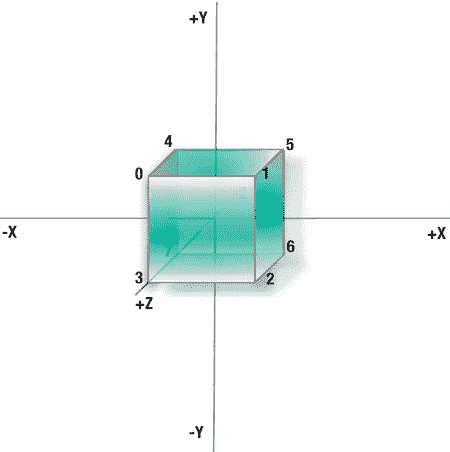
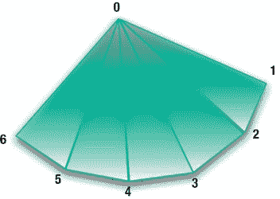

# 第 3 章：构建 3D 世界

### 超越弹跳方块

现在让我们修改前面的示例，增加第三个维度。由于我们正在深入 3D 领域，需要添加多项内容来处理 Z 轴维度，包括：用于立方体几何形状和颜色的更大数据集、将这些数据传递给 OpenGL 的方法、视锥体定义、按需的面剔除技术，以及旋转而非仅仅平移。

**注意** *平移*是指在场景中上下、左右、前后移动物体，而*旋转*是指绕任意轴旋转物体。两者都被视为*变换*。

### 添加几何体

现在我们需要将上述示例中的顶点数量翻倍，并扩展它们以支持额外的 Z 值，如清单 3-3 的第 1 行所示。你会注意到所有顶点坐标都是`.5`或`-.5`。之前 Y 轴的值是`-0.33`到`0.33`。

那是为了补偿屏幕的宽高比，拉伸图像使方块看起来确实是方形的。在本练习中，我们将添加视锥体，从而能够指定宽高比，这样我们就不必再为非方形屏幕进行补偿了。

接下来，颜色数组也相应翻倍（第 2 行及之后）。然后我们需要指定顶点如何连接，以便用 12 个三角形构成 6 个正方形面。这是通过两个额外的数组`tfan1`和`tfan2`实现的。这些数字是顶点数组的索引，告诉系统如何以"三角形扇形"的形式连接各点。稍后将对此进行说明。现在你将修改弹跳方块应用，可以直接在原文件上修改或复制一份。

**注意** 你可以通过进入 Xcode 4 项目的根目录并重命名树顶部的项目名称来重命名项目。但遗憾的是，它不会更新源文件或`.xib`文件中的引用，因此你仍需手动修改这些内容。

准备就绪后，将`drawInRect()`中的 2D 数据定义替换为清单 3-3 中的 3D 版本。

### 清单 3-3 定义 3D 立方体

```
static const GLfloat cubeVertices[] = //1
{
-0.5, 0.5, 0.5, //顶点 0
0.5, 0.5, 0.5, // v1
0.5,-0.5, 0.5, // v2
-0.5,-0.5, 0.5, // v3
-0.5, 0.5,-0.5, // v4
0.5, 0.5,-0.5, // v5
0.5,-0.5,-0.5, // v6
-0.5,-0.5,-0.5, // v7
};

static const GLubyte cubeColors[] = { //2
255, 255, 0, 255,
0, 255, 255, 255,
0, 0, 0, 0,
255, 0, 255, 255,
255, 255, 0, 255,
0, 255, 255, 255,
0, 0, 0, 0,
255, 0, 255, 255,
};

static const GLubyte tfan1[6 * 3] = //3
{
1,0,3,
1,3,2,
1,2,6,
1,6,5,
1,5,4,
1,4,0
};

static const GLubyte tfan2[6 * 3] = //4
{
7,4,5,
7,5,6,
7,6,2,
7,2,3,
7,3,0,
7,0,4
};
```

图 3-5 展示了顶点的排列顺序。在正常情况下，你永远不会以这种方式定义几何体。你很可能会从标准 3D 数据格式（如 3D Studio 或 Modeler 3D 使用的格式）存储的文件中加载对象。考虑到这类文件可能非常复杂，不建议自己编写导入器，因为大多数主流格式都有现成的导入器可用。

[www.it-ebooks.info](http://www.it-ebooks.info)




图 3-5 注意各坐标轴方向：X 向右，Y 向上，Z 朝向观察者。

现在需要一些新数据来告诉 OpenGL 顶点使用的顺序。


好的，作为高级文档工程师和翻译员，我将严格按照您的要求，对给定的英文文本进行翻译。


对于正方形，手动排序数据（即排列顶点顺序）使其四个顶点能构成两个三角形是件轻而易举的事。但对于立方体，这就复杂得多了。我们可以为立方体的六个面分别定义顶点数组，但这种方法对于更复杂的物体扩展性不佳，而且其效率也低于一次性将六组数据推入图形硬件。因此，从内存和性能两个角度来看，将所有数据保存在一个数组中是最有效率的。那么，我们该如何告诉 OpenGL 数据的布局呢？在本例中，我们将使用一种称为“三角形扇”的绘制模式，如图 3-6 所示。三角形扇是一组共享一个公共顶点的三角形。

图 3-6. 三角形扇的所有三角形共享一个公共点。

数据可以通过多种不同的方式存储并呈现给 OpenGL ES。一种格式可能速度更快但占用更多内存，而另一种格式可能占用更少内存，但代价是增加一些额外的开销。如果你从某个 3D 文件导入数据，它很可能已经针对其中一种方法进行了优化。但如果你真的想手动调优系统，在某些时候你可能需要将顶点重新打包成你应用程序偏好的格式。

除了三角形扇，你还会发现其他存储或表示数据的方式，这些方式被称为“模式”。

点和线如其名：就是点和线。OpenGL ES 可以将你的顶点渲染为可定义大小的点，也可以在点之间绘制线条以显示线框版本（`gl.h`中分别通过 `GL_POINTS` 和 `GL_LINES` 定义了这些）。

`GL_LINE_STRIP`（线条带）是 OpenGL 一次绘制一系列线条的方式，而 `GL_LINE_LOOP`（线条环）类似于线条带，但它总是会将第一个和最后一个顶点连接起来。

三角形、三角形带和三角形扇构成了 OpenGL ES 图元列表的其余部分：`GL_TRIANGLES`、`GL_TRIANGLE_STRIP` 和 `GL_TRIANGLE_FAN`。桌面级 OpenGL 本身可以处理更多模式，例如 `GL_QUADS`（四个顶点/边的面）、`GL_QUAD_STRIP`（四边形带）和多边形。

**注意**：术语“图元”指的是图形系统中一种基本的数据形状或形式。图元的示例包括立方体、球体和锥体。该术语也可用于更简单的形状，如点、线，以及对于 OpenGL ES 而言的三角形和三角形扇。

在使用元素时，你需要使用索引数组（或称为连通性数组）来告诉 OpenGL 哪些顶点在被绘制时顺序如何。这将告知管线处理每个元素时顶点所需的确切顺序，如清单 3-3 的第 3 行和第 4 行所示。例如，数组 `tfan1` 中的前三个数字是 1、0 和 3。这意味着第一个三角形由顶点 1、0 和 3 按此顺序构成。因此，回到数组 `cubeVertices` 中，顶点 1 位于 x=0.5, y=0.5, z=0.5。顶点 0 是位于 x=-0.5, y=0.5, z=0.5 的点，而我们三角形的第三个角位于 x=-0.5, y=-0.5, z=0.5。这样做的好处是，这使得创建数据集变得容易得多，因为实际的顺序现在无关紧要了；而缺点是它需要占用更多的内存来存储这些额外的信息。

这个立方体可以被分割成两个不同的三角形扇，这就是为什么会有两个索引数组。第一个扇包含了正面、右面和顶面，而第二个扇则包含了背面、底面和左面，如图 3-7 所示。

图 3-7. 第一个三角形扇共享顶点 1 作为公共顶点。

**整合在一起**

现在必须修改渲染代码以处理新数据。清单 3-4 展示了 `drawInRect()` 方法的其余部分，紧跟在清单 3-3 的数据定义之后。这将重复早期示例中的大部分内容，包括运动。主要区别在于对 `glDrawArray()` 的两次调用，因为立方体被分成了两部分，每部分对应三个面或定义两个三角形扇的六个三角形。

**注意**：你会注意到许多 OpenGL ES 调用以 `f` 结尾，例如 `glScalef()`、`glRotatef()` 等。这个 `f` 意味着传递的参数是浮点数，或者说是 `GLfloat`。OpenGL ES 中唯一的其他参数类型是定点值，因此 `glScalex()` 对应的是 `glScalex()`。定点在较老、较慢的设备上有用，但鉴于现代硬件，Apple 建议使用浮点数。

来自先前示例的过时行已被注释掉，但保留在原处以更清晰地显示差异。

清单 3-4. 弹跳立方体 `drawInRect` 方法的其余部分

```
static GLfloat transY = 0.0;
static GLfloat z=-2.0; //1

glClearColor(0.5, 0.5, 0.5, 1.0); //2
glClear(GL_COLOR_BUFFER_BIT);

glEnable(GL_CULL_FACE); //3
glCullFace(GL_BACK);

// glMatrixMode(GL_PROJECTION); //4
// glLoadIdentity();

glMatrixMode(GL_MODELVIEW); //5
glLoadIdentity();

//glTranslatef(0.0, (GLfloat)(sinf(transY)/2.0), 0.0);

glTranslatef(0.0, (GLfloat)(sinf(transY)/2.0), z); //6
transY += 0.075f;

//glVertexPointer(2, GL_FLOAT, 0, squareVertices);

glVertexPointer(3, GL_FLOAT, 0, cubeVertices); //7
glEnableClientState(GL_VERTEX_ARRAY);

glColorPointer(4, GL_UNSIGNED_BYTE, 0, cubeColors); //8
glEnableClientState(GL_COLOR_ARRAY);

// glDrawArrays(GL_TRIANGLE_STRIP, 0, 4);

glDrawElements( GL_TRIANGLE_FAN, 6 * 3, GL_UNSIGNED_BYTE, tfan1); //9
glDrawElements( GL_TRIANGLE_FAN, 6 * 3, GL_UNSIGNED_BYTE, tfan2);

if(!(counter%100))
    NSLog(@"FPS: %d\n",self.framesPerSecond);

counter++;
}
```

做了以下更改：

在第 1 行添加了一个 `z` 值。目前这个值是静态的，因为动画仍然只在上下方向进行。一个负值意味着物体远离我们，就像它已经移到了屏幕的更深处。

在第 2 行再次将背景清除为中灰色。

因为我们永远不想处理或绘制任何非绝对必要的东西，所以可以在第 3 行直接消除那些“背离”观察者的三角形。面剔除用于移除那些本来不可见的面。对于我们的立方体，我们只需要看到那些实际朝向我们的三角形，这取决于面的顶点环绕顺序。如果环绕顺序是逆时针的，那么它就是朝向我们的并且应该是可见的；否则，它将被剔除。这听起来像是面法线的替代品，是的，在背面消除或剔除方面确实如此。但法线仍然是确定光照照在面上所必需的。

**注意**：“环绕性”基于顶点描述的方向。由顶点 1、0 和 3 形成的第一个三角形是朝向我们的，因为顶点是按逆时针顺序排列的。第一个扇中的所有三角形都是逆时针的。

在第 4 行，投影矩阵的初始化被关闭，只保留模型视图矩阵被修改。投影将在下面处理。

在第 5 行，只有 `GL_MODELVIEW` 被设置为当前矩阵，以防其他地方有人改变了它。

在第 6 行，原始 `glTranslatef()` 调用中最后一个坐标之前被固定为 0（因为不需要），现在被更改为 `z`（`-2.0`）。

在第 7 行，原始的 `squareVertices` 指针被替换为 `cubeVertices`。


第 8 行将 `squareColors` 替换为 `cubeColors`。

原有的 `glDrawArrays()` 被移除，替换为第 9 行对 `glDrawElements()` 的两次调用，分别对应两个三角形扇。需要注意的是，第二个参数表示 `tFan` 连接数组中的元素数量：六个顶点，每个顶点包含三个元素。

OpenGL 将获取连接数组 `tfan1` 和 `tfan2`；在顶点指针数组（第 7 行）中查找每个顶点；并渲染该对象。

此时你应该能够编译成功，但还看不到任何东西，因为观察视锥体尚未定义。默认的远裁剪平面为 -1.0，这意味着所有超出该距离的物体都将被剔除，即不可见。如果将 z 值从 -2.0 改为 -1.5，“立方体”将移近并应部分可见。虽然看起来像是整个物体，但实际上只有最近的面显露出来。将 `z` 改为 -1.500001，它就会消失。目前它看起来不太像一个立方体，因为只有一部分会显露出来。此外，由于视锥体未定义，方形视口在适配填充窗口时会被拉伸。

（坐标 -1.5 是立方体原点需要位于的位置，以确保最近的面在 -1.0 处。）现在将其移回 -2.0。

[www.it-ebooks.info](http://www.it-ebooks.info)

