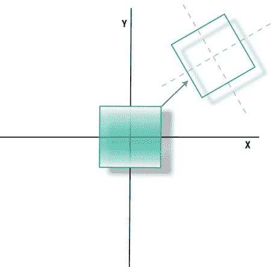
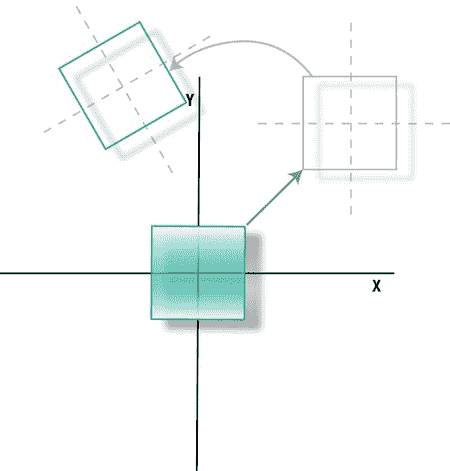
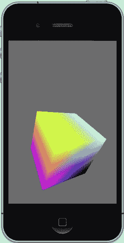
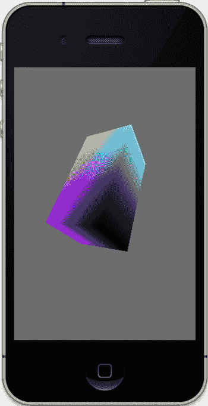
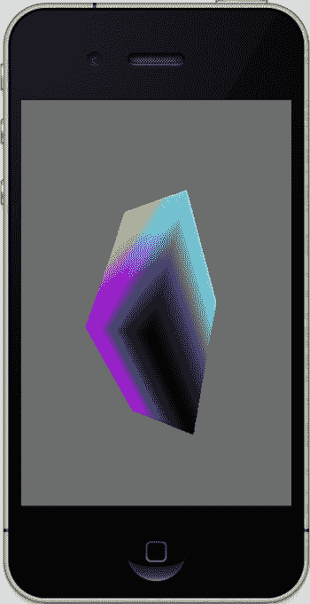

# 第 3 章：构建 3D 世界

### 68

以下是具体说明：

第 1 行和第 2 行指定了近裁剪平面和远裁剪平面的距离。这两个值表示任何距离超过 1000 或小于 0.1 的物体都将被过滤掉。（“一千什么？”你可能会问。就是一千；单位由你决定。可以是光年，也可以是腕尺，这并不重要。）

第 3 行将视场角设置为 60 度。

第 4 行和第 5 行计算最终屏幕的宽高比。其高度和宽度值将视场角限制在高度上；翻转后它将相对宽度而言。因此，如果我们希望视场角为 60 度（类似于广角镜头），它将基于窗口的高度而非宽度。在渲染到非方形屏幕时，了解这一点非常重要。

由于视锥体影响投影矩阵，我们需要确保在第 6 行激活投影矩阵而非模型视图矩阵。

第 7 行的任务是计算一个尺寸值，该值用于指定视景体的左/右和上/下边界，如图所示。


### 图 3-3
这可以看作是你进入三维空间的虚拟窗口。以屏幕中心为原点，你需要沿两个维度从 `--size` 移动到 `+size`，这就是视野（field）要除以二的原因——窗口将从 `-30` 度延伸到 `+30` 度。

将 `size` 乘以 `zNear` 只是为了添加某种缩放提示。最后，将底部/顶部限制除以宽高比，以确保你的正方形真正保持正方形。

现在，在第 8 行，我们可以将这些值代入 `glFrustumf()` 中；而在第 9 行，则传入视口的实际像素尺寸。

不要忘记像第 10 行那样，将矩阵模式重置回 `modelview`，这是一种良好的编程习惯。

`SetClipping()` 只需要在开始时调用一次，除非你想改变“镜头”的“强度”。更复杂的情况可能需要改变 `zNear`/`zFar` 的值来处理深度变化，或者使用不同的视野来放大特定目标。但你可以通过以下两行代码，将它添加到 `viewDidLoad()` 中：

```
[EAGLContext setCurrentContext:self.context];
[self setClipping];
```

[www.it-ebooks.info](http://www.it-ebooks.info)

### 第 3 章：构建一个 3D 世界

**69**

任何 OpenGL 调用都必须有一个当前的上下文才能工作，因此它需要被设置在其他所有操作之前，所以在 `setClipping()` 前面多了这一行。如果一切正常，你应该会看到一个和最初那个弹跳立方体一模一样的画面！等等，你觉得这没什么了不起？好吧，那我们来给它加上一些旋转。

## 让它旋转起来

现在，是时候为场景添加一些更有趣的动画了。我们将在让它上下弹跳的同时，再让它缓慢自转。在 `drawInRect()` 的顶部添加以下代码：

```
static GLfloat spinX=0;
static GLfloat spinY=0;
```

接下来，在 `drawInRect()` 的底部添加以下代码行：

```
spinY+=.25;
spinX+=.25;
```

然后，在 `glTranslatef()` 调用之前，添加以下代码：

```
glRotatef(spinY, 0.0, 1.0, 0.0);
glRotatef(spinX, 1.0, 0.0, 0.0);
```

再次运行。最可能的反应是：“嘿？咦？” 立方体似乎并没有自转，反而是在围绕你的视角旋转（同时还在弹跳），如图 3-8 所示。这揭示了基础 3D 动画中最令人困惑的元素之一：如何正确排列平移和旋转的顺序。

（还记得第 2 章的讨论吗？）

想想我们的立方体。如果你想让一个立方体在你面前旋转，正确的顺序应该是怎样的？先旋转再平移？还是先平移再旋转？

回溯到五年级的数学课，你可能还记得学过加法和乘法是满足交换律的。也就是说，运算的顺序并不关键：`a+b=b+a`，或者 `a*b=b*a`。然而，3D 变换不满足交换律（终于，一个我以为永远不会用到的知识点派上了用场！）。也就是说，`旋转*平移` 和 `平移*旋转` 是不同的。见图 3-9。

右侧展示的是你目前在旋转立方体示例中看到的效果。立方体先被平移，然后旋转，但由于旋转是围绕“世界”原点（即视角的位置）进行的，所以你看到的效果就像它在绕着你的头旋转。

现在来到那个明显的“逻辑不通”的时刻：在示例代码中，旋转不是已经放在了平移之前吗？

[www.it-ebooks.info](http://www.it-ebooks.info)





### 第 3 章：构建一个 3D 世界

**70**

图 3-8. 先平移，后旋转

以下代码应该是导致全天下程序员都眉头紧锁的原因：

```
glRotatef(spinY, 0.0, 1.0, 0.0);
glRotatef(spinX, 1.0, 0.0, 0.0);
glTranslatef(0.0, (GLfloat)(sinf(transY)/2.0), z);
```

图 3-9. 先旋转还是先平移？

[www.it-ebooks.info](http://www.it-ebooks.info)





### 第 3 章：构建一个 3D 世界

**71**

然而，实际上，变换的顺序是从最后一个应用到第一个。现在把 `glTranslatef()` 放在两个旋转调用之前，你应该会看到类似图 3-10 的效果，这正是我们最初想要的结果。以下是实现该效果的代码：

```
glTranslatef(0.0, (GLfloat)(sinf(transY)/2.0), z);
glRotatef(spinY, 0.0, 1.0, 0.0);
glRotatef(spinX, 1.0, 0.0, 0.0);
```

图 3-10. 让立方体自旋

你可以通过两种不同的方式来理解变换顺序：局部坐标系或世界坐标系。按前者理解，你将物体移动到最终位置，然后执行旋转。因为坐标系是局部的，物体会围绕它自己的原点旋转，这使得从上到下的代码顺序变得合理。如果你选择世界坐标系的方法（实际上也是 OpenGL ES 所做的方式），你必须在执行平移之前，先绕物体的局部轴执行旋转。这样看来，变换实际上是自下而上发生的。最终结果是一样的，代码也一样，两者都很令人困惑，并且很容易搞错顺序。这就是为什么你经常会看到搞 3D 的伙计们伸长胳膊比划着，同时自己到处移动，试图弄明白为什么他们那个看起来很棒投石机模型飞到了地面以下。这被称为“3D 迷惑舞步”。而让事情更混乱的是，这只适用于 OpenGL ES 1。原因是，变换会被排队，直到渲染过程完成，然后从第一个变换调用处理到最后一个。而在 ES 2 中，你必须自己执行所有变换，这种情况下，它们会按调用顺序立即执行。以下是相同变换序列在 OpenGL ES 2 中的体现：

```
baseModelViewMatrix = GLKMatrix4Scale(baseModelViewMatrix,scale,scale,scale);
baseModelViewMatrix = GLKMatrix4Rotate(baseModelViewMatrix, _rotation, 1.0, 0.5, 0.0);
modelviewMatrix = GLKMatrix4MakeTranslation(0.0, offset, -6.0);
modelviewMatrix = GLKMatrix4Multiply(modelviewMatrix, baseModelViewMatrix);
```

现在需要注意的最后一个变换命令是 `glScalef()`，用于沿所有三个轴调整模型的大小。假设你需要将立方体的高度加倍。你可以使用代码行 `glScalef(1,2,1)`。请记住，高度与 Y 轴对齐，而宽度和深度分别是 X 和 Z 轴，我们不需要改动它们。

现在的问题是，你应该把这个调用放在哪里，以确保它只影响立方体的几何形状（如图 3-11 左侧所示），是在 `drawInRect()` 中 `glRotatef()` 调用的前面还是后面？

如果你回答是后面——就像下面的例子：

```
glTranslatef(0.0, (GLfloat)(sinf(transY)/2.0), z);
glRotatef(spinY, 0.0, 1.0, 0.0);
glRotatef(spinX, 1.0, 0.0, 0.0);
glScalef(1,2,1);
```

——那你就对了。之所以这样可行，是因为变换列表中的最后一个调用实际上是第一个被执行的，如果你只想调整物体的几何形状大小，就必须把缩放放在任何其他变换之前。把它放在任何其他地方，最终可能会得到类似图 3-11（右侧）的效果。那么，那里发生了什么？以下代码生成了右侧的效果：

```
glTranslatef(0.0, (GLfloat)(sinf(transY)/2.0), z);
glScalef(1,2,1);
glRotatef(spinY, 0.0, 1.0, 0.0);
glRotatef(spinX, 1.0, 0.0, 0.0);
```

[www.it-ebooks.info](http://www.it-ebooks.info)




### 第 3 章：构建一个 3D 世界

**73**


