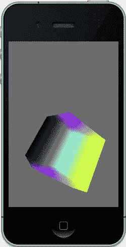
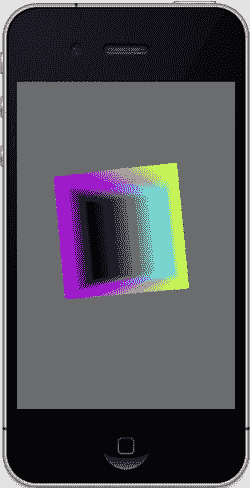
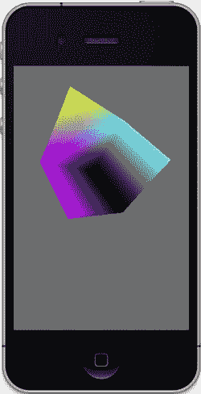
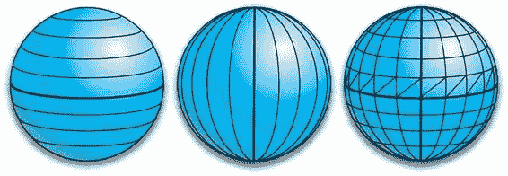
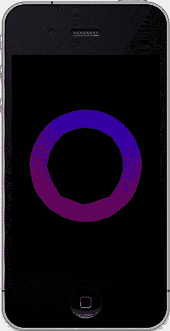
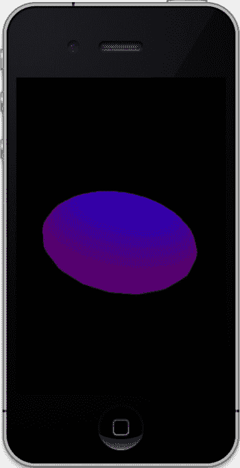

# 图 3-11
在旋转执行前进行缩放（左图）与旋转执行后进行缩放（右图）。先旋转几何体，再旋转立方体的本地轴，此时其本地轴不再与原点对齐。随后进行缩放时，物体会沿世界坐标系的 Y 轴（而非自身轴）拉伸。这就好比，你一开始就有一个已旋转一定角度的立方体顶点列表，并在无其他操作的情况下对其缩放。因此，如果你在最后一步进行缩放，整个世界都会被拉伸。

## 调整数值
当我们开始尝试不同数值时，更多乐趣也随之而来。本节将演示多个重要原理，这些原理不仅适用于 OpenGL ES，也几乎存在于你可能遇到的任何 3D 工具包中。

## 裁剪区域
有了一个可运行的示例后，我们可以通过调整某些数值并观察变化来获得乐趣。首先，我们将视锥体的远裁剪平面值 `zFar` 从 1000 改为 1.5，以调整远裁剪平面。为什么这么做？请记住，立方体的本地原点为 2.0，其尺寸为 1.0。因此，当它正面朝向我们时，最近的点距离为 2.5，因为每个侧面各以原点为中心向两侧延伸 0.5。所以，将 `zFar` 改为 1.5 后，立方体正对我们时就会被隐藏。但它的某些部分会“露出”一点，看起来就像是水面上的漂浮物。原因在于，当它旋转时，其角点自然会更接近视平面，如图 3-12 所示。

那么，当我将近裁剪平面移远时会发生什么？将 `zFar` 重置为 1000（一个足够大以确保我们能看见所有物体的数值），并将 `zNear` 从 0.1 改为 1.5。你认为效果会怎样？这将与上一个例子相反。结果见图 3-13。

**图 3-12.** 躲猫猫！当立方体的任何部分比 `zFar` 更远时，就会被裁剪。

**图 3-13.** 重置 `zFar` 平面，同时将近处 `zNear` 平面后移，以裁剪立方体任何过近的部分。

在处理庞大而复杂的世界时，像这样使用 Z 轴裁剪非常有用。你可能不希望将所有“可见”物体都渲染出来，因为其中许多物体可能太远而根本看不清。设置 `zFar` 和 `zNear` 来限制可视距离可以加速系统运行。不过，这并非在物体进入管线前对其进行预裁剪的最佳替代方案。

## 视角
请记住，观察者的 FOV（视角）也可以在视锥体设置中更改。回到我们的弹跳立方体，确保 `zNear` 和 `zFar` 设置恢复为默认值 0.1 和 1000。然后将 `drawInRect()` 中的 `z` 值改为 -20 并再次运行。你应该会看到如图 3-14（左图）所示的效果。

接下来我们要进行放大操作。转到 `setClipping()`，将 `fieldOfView` 从 60 度改为 5 度。结果如图 3-14（中图）所示。请注意，与图 3-14（右图）相比，此时的立方体完全没有明显的消失点，也没有透视效果。

**图 3-14a,b,c.** 将物体移远（左图），然后放大观察（中图）。最右侧图像为默认 FOV 值 60 度，且立方体距离仅 2 个单位时的效果。

## 面剔除
让我们回到几页前你可能还记得的代码：

```
glEnable(GL_CULL_FACE);
glCullFace(GL_BACK);
```


  
如上所述，第一行指示 OpenGL 准备进行面消隐，而第二行则指定要消隐哪个面。在此例中，背对观察者的三角形不需要渲染。  

**注意：**`glEnable()`是一个频繁调用的函数，用于改变各种状态，从消除背面（如前所述）、平滑点（`GL_POINT_SMOOTH`）到执行深度测试（`GL_DEPTH_TEST`）。频繁使用它会显著影响性能。最佳实践是尽可能减少对`glEnable()`的调用。  

现在将`GL_BACK`替换为`GL_FRONT`，然后运行程序。见图 3-15。  

  
  
  

**第 3 章：构建 3D 世界**  

**77**  

图 3-15. 背面现在可见，而前面被消隐了。  

**构建一个太阳系**  

凭借我们 3D 技能库中的这些基本工具，我们可以开始着手主要项目：构建一个小型太阳系示例。太阳系之所以理想，是因为它具有非常基本的简单形状、多个必须以层次化方式相互绕行的物体，以及一个单一光源。最初使用立方体示例的原因是，其形状对于 3D 来说尽可能基础，从而确保代码中不包含无关的几何体。当你处理诸如球体之类的事物时，大部分代码将用于创建该物体本身，正如你将看到的那样。  

尽管 OpenGL 是一个优秀的底层平台，但在处理任何稍微高级的功能时，它仍然有很多不足之处。如第 1 章所见，对于建模工具，许多可用的第三方框架最终可以用来完成这项工作，但目前我们仍将坚持使用基本的 OpenGL ES。  

**注意：**除了 OpenGL 本身，还有一个流行的辅助工具包，称为 GL Utility Toolkit（`GLUT`）。`GLUT`为基本的窗口 UI 任务和管理函数提供了可移植的 API 支持。它可以构建一些基本图元（包括球体），因此在做小型项目时非常方便。不幸的是，在撰写本文时，iOS 没有官方的`GLUT`库，不过目前有一些相关的工作正在进行中。  

第一个任务是创建一个派生自弹跳正方形示例的新项目。  

但不要将所有几何体构建在`drawInRect()`中，而是创建一个名为`Planet`的新对象并初始化数据，如清单 3-6a（头文件）和清单 3-6b（`init`方法）所示。  

**清单 3-6a. 构建我们的 3D 行星**  

```
#import <Foundation/Foundation.h>
#import <OpenGLES/ES1/gl.h>

@interface Planet : NSObject
{
@private
    GLfloat *m_VertexData;
    GLubyte *m_ColorData;
    GLint m_Stacks, m_Slices;
    GLfloat m_Scale;
    GLfloat m_Squash;
}
- (bool)execute;
- (id) init:(GLint)stacks slices:(GLint)slices radius:(GLfloat)radius squash:(GLfloat)squash;
@end
```

**清单 3-6b. 3D 球体生成器**  

```
- (id) init:(GLint)stacks slices:(GLint)slices radius:(GLfloat)radius squash:(GLfloat)squash
{
    unsigned int colorIncrment=0; //1
    unsigned int blue=0;
    unsigned int red=255;

    m_Scale=radius;
    m_Squash=squash;

    colorIncrment=255/stacks; //2

    if ((self = [super init]))
    {
        m_Stacks = stacks;
        m_Slices = slices;
        m_VertexData = nil;

        //Vertices
        GLfloat *vPtr = m_VertexData =
        (GLfloat*)malloc(sizeof(GLfloat) * 3 * ((m_Slices*2+2) * (m_Stacks))); //3

        //Color data
        GLubyte *cPtr = m_ColorData=
        (GLubyte*)malloc(sizeof(GLubyte) * 4 * ((m_Slices *2+2) * (m_Stacks))); //4

        unsigned int phiIdx, thetaIdx;

        //latitude
        for(phiIdx=0; phiIdx < m_Stacks; phiIdx++) //5
        {
            //Starts at -1.57 goes up to +1.57 radians.
            //The first circle.
```


//6

`float phi0 = M_PI * ((float)(phiIdx+0) * (1.0/(float)( m_Stacks)) - 0.5);`

//下一个，即第二个。

//7

`float phi1 = M_PI * ((float)(phiIdx+1) * (1.0/(float)( m_Stacks)) - 0.5);`

`float cosPhi0 = cos(phi0);` //8

`float sinPhi0 = sin(phi0);`

`float cosPhi1 = cos(phi1);`

`float sinPhi1 = sin(phi1);`

`float cosTheta, sinTheta;`

//经度

`for(thetaIdx=0; thetaIdx < m_Slices; thetaIdx++)` //9

{

//沿着经度圆每个“切片”递增。

`float theta = 2.0*M_PI * ((float)thetaIdx) * (1.0/(float)( m_Slices - 1));`

`cosTheta = cos(theta);`

`sinTheta = sin(theta);`

//我们正在生成一对垂直方向的点，例如
//堆栈 0 的第一个点和其上方堆栈 1 的第一个点。
//这就是三角形带（TRIANGLE_STRIPS）的工作原理，
//每次取一组 4 个顶点，本质上绘制两个三角形。
//第一个是 v0-v1-v2，下一个是 v2-v1-v3，以此类推。

[www.it-ebooks.info](http://www.it-ebooks.info)

第 3 章：构建 3D 世界

80

//获取堆栈第一个顶点的 x-y-z 坐标。

`vPtr [0] = m_Scale*cosPhi0 * cosTheta;` //10

`vPtr [1] = m_Scale*sinPhi0*m_Squash;`

`vPtr [2] = m_Scale*cosPhi0 * sinTheta;`

//同上，但针对前一个顶点正上方的顶点。

`vPtr [3] = m_Scale*cosPhi1 * cosTheta;`

`vPtr [4] = m_Scale*sinPhi1*m_Squash;`

`vPtr [5] = m_Scale* cosPhi1 * sinTheta;`

`cPtr [0] = red;` //11

`cPtr [1] = 0;`

`cPtr [2] = blue;`

`cPtr [4] = red;`

`cPtr [5] = 0;`

`cPtr [6] = blue;`

`cPtr [3] = cPtr[7] = 255;`

`cPtr += 2*4;` //12

`vPtr += 2*3;`

}

`blue+=colorIncrment;` //13

`red-=colorIncrment;`

}

}

`return self;`

}

好吧，创建像球体这样基础的东西需要大量代码。使用三角形列表比在标准 OpenGL 中使用四边形更复杂，但这是我们不得不采用的方法。

基本算法将球体分为堆栈（stacks）和切片（slices）。堆栈是横向的片，而切片是纵向的。堆栈的边界每次成对生成，作为伙伴。这些边界构成了三角形带的边界。因此，堆栈 A 和 B 被计算出来，并根据绕圆切片的数量细分为三角形。下一次循环中，取堆栈 B 和 C，重复此过程。这里应用了两个边界条件：

[www.it-ebooks.info](http://www.it-ebooks.info)



第 3 章：构建 3D 世界

81

第一个和最后一个堆栈包含两个极点，在这种情况下，它们更像是三角形扇而非三角形带，但为了简化代码，我们仍将其视为三角形带。确保每个三角形带的末端与起始端相连，以形成一组连续的三角形。

那么，我们来分解一下：初始化程序使用堆栈和切片的概念来定义球体的分辨率。更多的切片和堆栈意味着球体更平滑，但会占用更多内存并增加处理时间。可以将切片想象成类似苹果的楔形块，代表从底部到顶部的一块球体。堆栈则是横向的切片，用于定义纬度区域。参见图 3-16。

`radius`参数是一种缩放形式。您可以选择将所有对象归一化并用`glScalef()`，但这会增加额外的 CPU 开销，因此在这里`radius`用作一种预缩放形式。而`squash`用于创建扁平的球体，这对木星和土星来说是必需的。两者都有极高的自转速度（木星的一天只有大约 10 小时，而它的直径是地球的 10 倍多）。因此，它的极地直径约为赤道直径的 93%。土星甚至更扁，极地直径仅为赤道直径的 90%。

因为在第 5 章接触到酷炫的纹理内容之前，我们想让物体看起来更有趣，所以让我们从上到下改变颜色。


顶部为蓝色，底部为红色。`colorIncrement` 仅仅是堆栈之间的颜色差值。红色从 255 开始，蓝色从 0 开始，均采用无符号字符型。

图 3-16\. 堆栈上下延伸，切片环绕一周，面被细分为三角形条带。

**第 3 章：构建 3D 世界**

第 3 行和第 4 行为顶点和颜色分配内存。稍后还需要其他数组来保存纹理坐标和光照所需的法线，但这里我们先保持简单。注意，与立方体一样，我们使用的是 32 位颜色。三个字节用于 RGB 三元组，第四个字节用于 Alpha（透明度），但在此示例中并不需要。

第 5 行开始外层循环，从最底部的堆栈（即我们星球的南极区域，或纬度-90 度）一直向上到北极（+90 度）。这里使用了一些希腊字母标识符来表示球面坐标。`Phi` 通常用于类似纬度的点，而 `theta` 则用于经度。

第 6 行和第 7 行生成特定条带边界的纬度。首先，当 `phiIdx` 为 0 时，我们希望 `phi0` 为-90 度，即-1.57。`-.5` 将所有值向下偏移 90 度；否则，我们的数值范围将是 0 到 180 度。

在第 8 行及后续行中，预计算了一些值以减轻 CPU 负载。第 9 行是内层循环，范围从 0 到 360 度，用于定义切片。数学计算类似，因此无需深入细节，只需注意我们通过第 10 行计算圆上的点。`m_Scale` 和 `m_Squash` 在此处起作用。但暂时假设它们都为 1.0，这样球体就是标准化的。

请注意，此处处理的是顶点 0 和顶点 2。顶点 0 对应 x，顶点 2 对应 z——它们平行于地面，即 X-Z 平面。由于顶点 1 等同于 y，它在每次循环中保持不变，并且当然代表纬度。由于我们是成对进行循环，顶点 3、4 和 5 将覆盖下一个循环。

实际上，我们是在成对生成点，即每个点及其正上方的对应点。这正是 GL 期望的三角形条带格式，如图 3-17 所示。

**第 3 章：构建 3D 世界**

**83**

图 3-17\. 由六个顶点构成的三角形条带

在第 11 行，生成颜色数组，并且与顶点一样，它们也是成对生成的。绿色分量暂时被忽略。

在第 12f 行，颜色数组指针和顶点数组指针递增。最后在第 13 行，我们增加蓝色分量并减少红色分量。

几何部分处理完毕后，我们需要专注于 `execute` 方法。请参见代码清单 3-7。

**代码清单 3-7\. 渲染星球**

```
- (bool)execute
{
    glMatrixMode(GL_MODELVIEW); //1
    glEnable(GL_CULL_FACE); //2
    glCullFace(GL_BACK); //3
    
    glEnableClientState(GL_VERTEX_ARRAY); //4
    glEnableClientState(GL_COLOR_ARRAY); //5
    
    glVertexPointer(3, GL_FLOAT, 0, m_VertexData); //6
    glColorPointer(4, GL_UNSIGNED_BYTE, 0, m_ColorData); //7
    glDrawArrays(GL_TRIANGLE_STRIP, 0, (m_Slices +1)*2*(m_Stacks-1)+2); //8
    
    return true;
}
```

现在你应该能认出立方体示例中的许多元素。首先，在第 1 行，告诉系统我们要使用 `GL_MODELVIEW` 矩阵（支持变换信息的矩阵）。第 2 行和第 3 行与之前用于剔除球体背面（我们看不到的部分）的代码相同。第 4 行和第 5 行同样熟悉，告诉 OpenGL 接收顶点和颜色信息。接下来，在第 6 行提供顶点数据，在第 7 行提供颜色数据。第 8 行负责绘制数组（包括颜色和顶点）的主要工作。

既然星球对象对于这个示例来说已经足够完整，让我们来编写驱动程序。首先，创建一个新的 Objective-C 对象，将其命名为类似 `OpenGLSolarSystemController` 的名称。然后添加代码清单 3-8a 和 3-8b 中的代码来初始化对象和宇宙。

**代码清单 3-8a. 初始化你的宇宙：头文件**

```
#import <Foundation/Foundation.h>
#import <GLKit/GLKit.h>
#import "Planet.h"

@interface OpenGLSolarSystemController : NSObject
{
    Planet *m_Earth;
}

-(void)execute;
-(id)init;
-(void)initGeometry;

@end
```

**代码清单 3-8b. 初始化你的宇宙：其余部分**

```
-(id)init
{
    [self initGeometry];
    return self;
}

-(void)initGeometry
{
    m_Earth=[[Planet alloc] init:10 slices:10 radius:1.0 squash:1.0];
}
```

这里的地球模型以相当低的分辨率初始化：10 个堆栈高，10 个切片环绕一周。

**第 3 章：构建 3D 世界**

**85**

代码清单 3-9 展示了主 `execute` 方法。与立方体一样，我们将地球沿 Z 轴平移，并绕 Y 轴旋转。

**代码清单 3-9\. 主 `execute` 方法**

```
-(void)execute
{
    static GLfloat angle=0;
    glLoadIdentity();
    glTranslatef(0.0, -0.0, -3.0);
    glRotatef(angle,0.0,1.0,0.0);
    [m_Earth execute];
    angle+=.5;
}
```

最后一步，转至窗口的 `viewcontroller`，将 `viewDidLoad()` 修改为代码清单 3-10。

**代码清单 3-10\. 新的 `viewDidLoad()` 方法**

```
- (void)viewDidLoad
{
    [super viewDidLoad];
    
    self.context = [[EAGLContext alloc] initWithAPI:kEAGLRenderingAPIOpenGLES1];
    
    if (!self.context)
    {
        NSLog(@"Failed to create ES context");
    }
    
    GLKView *view = (GLKView *)self.view;
    view.context = self.context;
    view.drawableDepthFormat = GLKViewDrawableDepthFormat24;
    
    m_SolarSystem=[[ OpenGLSolarSystemController alloc] init];
    
    [EAGLContext setCurrentContext:self.context];
    
    [self setClipping];
}
```

现在将 `drawInRect()` 方法修改为代码清单 3-11 中的内容。

**第 3 章：构建 3D 世界**

**86**

**代码清单 3-11\. 太阳系的新 `drawInRect` 方法**

```
- (void)glkView:(GLKView *)view drawInRect:(CGRect)rect
{
    glClearColor(0.0,0.0, 0.0, 1.0);
    glClear(GL_COLOR_BUFFER_BIT | GL_DEPTH_BUFFER_BIT);
    [m_SolarSystem execute];
}
```

最后，添加 `setClipping()` 方法（在上一个练习中使用过），确保已将 FOV 重置为 50 或 60 度；根据需要修改头文件；然后编译。你应该会看到类似图 3-18 的结果。

图 3-18\. 未来的行星地球

它实际上正在旋转，但由于毫无特征，你很难察觉到运动。

**第 3 章：构建 3D 世界**

**87**

与之前的示例一样，我们来调整一些参数看看效果。首先，在 `initGeometry` 方法中，将堆栈和切片的数量从 10 改为 20。你应该会看到类似图 3-19 的结果。

图 3-19\. 堆栈和切片数量翻倍后的行星

如果你希望曲线对象看起来更平滑，通常有三种方法：

- 使用尽可能多的三角形。
- 使用 OpenGL 内置的一些特殊光照和着色工具。
- 使用纹理。

下一章将介绍第二种方法。但现在，试一下需要多少个切片和堆栈才能制作出一个真正平滑的球体。（两者数量相等时效果最佳。）当每个都达到 100 时，效果才开始真正变好。现在，完成这个练习后，先恢复为每个 10 个。


如果你想查看球体的实际线框结构，请在 `Planet.m` 文件的 execute 方法中将 `GL_TRIANGLE_STRIP` 改为 `GL_LINE_STRIP`。你可能还想将背景色改为中灰色，以使线条更突出（图 3-20 左）。作为练习，思考一下如何得到图 3-20（右）。现在问问自己，为什么我们看到的不是三角形，而是那种奇特的螺旋图案？这仅仅是 OpenGL 绘制和连接线条条带的方式。我们可以通过指定一个连接数组来渲染三角形轮廓，但对于我们的最终目标来说，这并非必要。

图 3-20\. 行星的线框模式

请自行将 `GL_LINE_STRIP` 改为 `GL_POINTS`。这样你会看到每个顶点都被渲染成一个点。

然后再次尝试平截头体。将 `zNear` 从 0.1 设置为 2.15。（为什么不设置为 3？因为物体的距离？）你将得到图 3-21。

[www.it-ebooks.info](http://www.it-ebooks.info)



**第 3 章：构建一个 3D 世界**

**89**

图 3-21\. 有人将 `zNear` 裁剪平面设置得太近了。

最后一个练习：如何才能得到类似图 3-22 的效果？

（这是木星和土星所需的效果；因为它们自转很快，所以并非球体，而是扁球体。）

[www.it-ebooks.info](http://www.it-ebooks.info)



**第 3 章：构建一个 3D 世界**

**90**

图 3-22\. 如何才能实现这种效果？

最后，作为额外加分项，让它像立方体一样弹跳。

## 小结

在本章中，我们从生成一个 2D 正方形开始，将其转变为 3D 立方体，然后学习了如何旋转和平移它。我们还学习了视锥体，以及如何利用它来剔除物体并缩放场景。最后，我们构建了一个更复杂的物体，它将成为太阳系模型的根基。下一章将涵盖着色、光照和材质，并添加第二个物体。

[www.it-ebooks.info](http://www.it-ebooks.info)

